# When Can We Work in Embedding Space? What Text Embeddings Preserve

Simon Freyaldenhoven Federal Reserve Bank of Philadelphia\*

August 2026

## Abstract

When do text embeddings work as inputs to empirical analysis? Their use rests on an assumption: that we can trade text for its low-dimensional embedding, and lose little in doing so. I make that assumption precise under a generative model in which documents are mixtures of latent topics. I study two uses— clustering units in embedding space and controlling for high-dimensional text. A cluster of embeddings is a set of documents with similar topic mixtures; controlling for the embedding is equivalent to controlling for the topic mixture, so validity reduces to whether that mixture captures the confounding. In an application to 363 U.S. metropolitan areas, embedding-based clusters of LLMgenerated economic descriptions recover interpretable economic archetypes and separate local employment dynamics more sharply than clustering on model residuals, or on a curated set of industry and demographic covariates.

JEL-Classification: C21, C38, C45, C55

KEYwORDs: Text embeddings, topic models, text as data, clustering, highdimensional controls, Word2Vec, Large Language Models

## 1 Introduction

Text embeddings are now a standard tool in empirical economics. Researchers turn product descriptions (Bajari et al., 2025; Bach et al., 2025), central bank communication (Casella et al. (2026)), labor-market histories (Vafa et al., 2022, 2025), and word meanings (Kozlowski et al., 2019) into vectors (embeddings) and use those in subsequent analysis. The appeal is dimension: While text itself is extremely highdimensional, its embedding is (relatively) low-dimensional. The justification, either explicitly or implicitly, is that little should be lost by working in embedding space if the information contained in a text can be represented in a low-dimensional space.1 I make this argument precise and study when text embeddings work as inputs to empirical analysis.

Any reduction of text to a vector may discard something the analysis needed. Existing theoretical work rules this out via a high level sufficiency assumption: that a low-dimensional attribute vector exists and the embedding proxies it (Christensen and Compiani, 2026), or that whatever the representation discards induces a bias vanishing faster than $n ^ { - 1 / 2 }$ (Vafa et al., 2025). But how plausible is such an assumption? In order to answer this, my starting point is a simple generative model of text, which allows me to derive exactly what embeddings preserve.

I first show that, under a standard model in which documents are mixtures of K latent topics (Blei et al., 2003; Hofmann, 1999), the corpus's matrix of word co-occurrence ratios, centered at independence, is positive semi-definite of rank exactly K - 1 (Proposition 1). Any embedding that matches this matrix inherits the topic-loading geometry — plainly speaking: words with similar loadings receive similar embeddings (Theorem 1). Standard embedding methods do not target this matrix directly, and instead factorize a logarithmic transform of the co-occurrence ratios (Table 1), which is generically full rank. Focusing on one leading embedding — Word2Vec (Mikolov et al., 2013a,c), in its skip-gram-with-negative-sampling (SGNS) form — I then prove that it recovers the same geometry up to a distortion (Proposition 2).

At the document level, averaging word embeddings yields an invertible linear image of the topic mixture (Proposition 3). I then consider two concrete use cases. The first groups units by latent type: clustering in embedding space discretizes unobserved heterogeneity into peer groups. Because distinct topic mixtures cannot share an embedding, a cluster is a set of documents with similar mixtures, and its centroid corresponds to a well-defined mixture (Corollary 1). Recovering the latent partition exactly is a stronger claim: when documents concentrate tightly enough around a small number of common mixture-types, that partition is a fixed point of kmeans (Proposition 4), but separation alone does not make it the unique optimum. The second conditions on textual embeddings: the embedding enters a regression as a control. Adjusting for the embedding is equivalent to adjusting for the topic mixture, so the high-level assumption that "the embedding is a sufficient control" reduces to a transparent condition that the topic mixture captures the confounding. (Corollary 2).

To make the grouping use concrete, consider a researcher who wants to model local employment dynamics. A natural starting point is an autoregressive model for log employment in location i, e.g.:

$$
y _ { i t } = \alpha _ { i } + \rho _ { 1 } ^ { i } y _ { i , t - 1 } + \cdot \cdot \cdot + \rho _ { p } ^ { i } y _ { i , t - p } + \varepsilon _ { i t } ,\tag{1}
$$

where $y _ { i t }$ is log employment in year t for a given Core-Based Statistical Area (CBSA) i. Pooling across all locations imposes implausible homogeneity, while estimating each city separately throws away cross-sectional information and can result in very noisy estimates. I propose the following compromise: cluster units by their textual description. Concretely, for each unit CBSA (i) generate a 500-word economic narrative using a large language model, (ii) embed the narrative in $\mathbb { R } ^ { r }$ , and (iii) apply k-means in embedding space. Our theoretical results from Section 2 provide a lens into this algorithm: If the corpus can be reasonably approximated by a topic model, k-means clustering recovers peer groups with similar topic mixtures. I find that the peer groups that emerge indeed encode similarity $( \mathrm { e . g . } ,$ “deindustrialized Eds-and-Meds", "Sunbelt growth", "energy and resource extraction"), and that the resulting clusters capture meaningful heterogeneity in employment dynamics which clustering on outcome residuals, or on observed covariates, misses.

Related Literature. This paper connects several literatures. The generative model builds on the topic model literature, including probabilistic latent semantic indexing (Hofmann, 1999) and Latent Dirichlet Allocation (Blei et al., 2003). Our use of a topic model as the data-generating process is not only analytical convenience: a recent literature argues that large language models themselves behave as implicit latent-variable models, inferring a latent concept from context and generating text conditional on it (Xie et al., 2022; Wang et al., 2023).

On the embedding side, the Word2Vec model was introduced by Mikolov et al. (2013a,c), and Levy and Goldberg (2014) established that skip-gram with negative sampling implicitly factorizes a shifted pointwise mutual information matrix when the embedding dimension is unrestricted. Arora et al. (2016) model the writing of a document as a random walk over a latent topic vector in a way that justifies what Word2Vec and GloVe (Pennington et al., 2014) estimate. I instead take the topic model as the data-generating process—a model that is easy to interpret and that economists already use to summarize text—and ask what it implies for embeddings. Dieng et al. (2020) put words and topics in the same embedding space by assumption, giving each topic its own vector. I derive what they assume: under our model each topic has a centroid in embedding space, and document embeddings lie in the simplex those centroids span (Proposition 3)—for an embedding estimated without any knowledge of the topics. Finally, Li et al. (2023) show that the attention layers of a transformer can also recover topic information, but under the restrictive assumption that each word belongs to a single topic, so that topics have no vocabulary in common.

Veitch et al. (2020) use text embeddings as a control for confounding. They construct an embedding that captures the confounding by explicitly supervising it on both treatment and outcome, while I consider “standard" unsupervised embeddings in this paper. Other papers studying causal inference with text include Roberts et al (2020) and Egami et al. (2022). Finally, Battaglia et al. (2024), Vafa et al. (2025) and Christensen and Compiani (2026) study the gap between the representation a researcher has and the object the model requires, and each closes it downstream: a bias correction for a noisy estimate of the right target, a characterization of the omitted-variable bias induced by coarsening, and a correction for an imperfect proxy, respectively. Our paper is complementary to this literature: there, the object the representation recovers is taken as given; here, I ask what an unsupervised embedding recovers in the first place.

## 2 Theoretical Results

## 2.1 Generative Model

Suppose we generate a corpus of text, meaning a collection of D documents from a vocabulary of size $V .$ Each document d consists of $N _ { d }$ terms: $\{ w _ { d , 1 } , \hdots , w _ { d , N _ { d } } \}$ Within document $d ,$ each term is drawn i.i.d. according to the column-stochastic distribution $\Pi _ { \bullet d } .$ where II is a column-stochastic $V \times D$ matrix; that is, $\Pi _ { v d }$ denotes the probability that a randomly drawn term in document d equals word v. Throughout, I use $P ( \cdot )$ exclusively as the probability operator and reserve Ⅱ for the matrix of word-document probabilities. For a matrix $A , \ \sigma _ { \mathrm { m a x } } ( A )$ and $\sigma _ { \mathrm { m i n } } ( A )$ denote its largest and smallest singular values.

I further assume that $\Pi = B \Theta$ , where B is $V \times K$ (word-topic matrix) and Θ is $K \times D$ (topic-document matrix); I take $K \geq 2$ throughout to avoid degeneracy Both B and Θ have non-negative entries, and each column of Ⅱ and B sums to 1. The probability for a given term v is thus given by $P ( w = v | d ) = ( B \Theta _ { \bullet d } ) _ { \ i }$ ,. and does not depend on the position in the document.

Following Hofmann (1999), I assume that for each document d

$$
N _ { \bullet d } | ( B , \Theta ) \sim \mathrm { M u l t i n o m i a l } \left( N _ { d } , B \Theta _ { \bullet d } \right) ,\tag{2}
$$

where $N _ { \bullet d } = ( N _ { 1 d } , \ldots , N _ { V d } ) ^ { \top }$ is the vector of word counts in document $d ,$ and the vectors of counts $N _ { \bullet d }$ are independent across documents, conditional on (B, Θ).

Once we add a Dirichlet prior on the per-document topic distribution we obtain a proper generative model for new documents in the form of standard LDA (Blei et al., 2003). On the other hand, treating the topic mixture $\theta _ { d }$ as a fixed (unknown) parameter rather than a random variable, this has been studied in the Non-negative Matrix Factorization (NMF) literature (Lee and Seung, 1999; Donoho and Stodden, 2003; Arora et al., 2013).

Notation. Consider two words v and u appearing in the same document d. Under the i.i.d.-given-document model, conditional on d a target word and a separately drawn context word are independent, so:

$$
\begin{array} { r } { P ( w = v , c = u | d ) = \Pi _ { v d } \cdot \Pi _ { u d } = ( B \Theta _ { \bullet d } ) _ { v } ( B \Theta _ { \bullet d } ) _ { u } . } \end{array}\tag{3}
$$

Define the word co-occurrence matrix $M \in \mathbb { R } ^ { V \times V }$ by aggregating over documents:

$$
M _ { v u \ } = \ P ( w = v , c = u ) \ = \ \sum _ { d = 1 } ^ { D } p _ { d } ( B \Theta _ { \bullet d } ) _ { v } ( B \Theta _ { \bullet d } ) _ { u } ,\tag{4}
$$

where $\begin{array} { r } { p _ { d } = N _ { d } / \sum _ { d ^ { \prime } } N _ { d ^ { \prime } } } \end{array}$ weights documents by length and $\textstyle \sum _ { d } p _ { d } = 1$ . Equivalently, with $p = [ p _ { 1 } , \ldots , p _ { D } ] ^ { \top }$ and $\begin{array} { r } { G : = \sum _ { d } p _ { d } \Theta _ { \bullet d } \Theta _ { \bullet d } ^ { \top } = \Theta \operatorname { d i a g } ( p ) \bar { \Theta } ^ { \top } \in \mathbb { R } ^ { K \times K } } \end{array}$ denoting the corpus second-moment matrix of topic mixtures

$$
M \ : = \ : B G B ^ { \top } .\tag{5}
$$

Let $\begin{array} { r } { \bar { \theta } : = \sum _ { d } p _ { d } \Theta _ { \bullet d } } \end{array}$ denote the corpus-mean topic mixture, let $q : = B { \bar { \theta } }$ collect the marginal word probabilities, $q _ { v } = P ( w = v ) = P ( c = v )$ , and let $D _ { q } : = \mathrm { d i a g } ( q )$ denote the corresponding diagonal matrix. Define the probability-ratio matrix

$$
R : = D _ { q } ^ { - 1 } M D _ { q } ^ { - 1 } \in \mathbb { R } _ { > 0 } ^ { V \times V } , \qquad R _ { v u } = \frac { P ( w = v , c = u ) } { P ( w = v ) P ( c = u ) } .\tag{6}
$$

Finally, define the marginal-normalized loading matrix $\tilde { B } : = D _ { q } ^ { - 1 } B \in \mathbb { R } ^ { V \times K }$ and the topic-mixture covariance

$$
\Sigma _ { \Theta } : = \sum _ { d = 1 } ^ { D } p _ { d } ( \Theta _ { \bullet d } - \bar { \theta } ) ( \Theta _ { \bullet d } - \bar { \theta } ) ^ { \top } = G - \bar { \theta } \bar { \theta } ^ { \top } \ \in \ \mathbb { R } ^ { K \times K } .\tag{7}
$$

## 2.2 Word Embeddings

This section derives our theoretical results on word embeddings. I first introduce a matrix I call the centered probability ratio and show that it is positive semi-definite (PSD) of rank $K - 1$ (Proposition 1). I then construct an explicit embedding $\beta$ whose entries are written directly in the topic-model primitives $B$ and $\Theta$ (Lemma 1) that factorize the centered probability ratio. Our main word-embedding result (Theorem 1) then shows that any embedding $\hat { \beta }$ matching this factorization inherits the marginal-normalized topic-loading geometry. Simply stated: words with similar topic loadings receive similar embeddings.

I maintain the following regularity conditions.

Assumption 1 (Topic regularity). I maintain the following regularity conditions on the topic model throughout:

(a) rank $B = K \colon$

(b) rank $\Sigma _ { \Theta } = K - 1$ 。2

(c) $q _ { v } > 0$ for all $v \in [ V ]$

The full column rank of B rules out redundant topics. Because the columns of Θ lie on the simplex $\Delta ^ { K - 1 } , \Sigma _ { \Theta } \mathbf { 1 } _ { K } = 0$ , so rank $\Sigma _ { \Theta } \le K - 1$ . Assumption 1(b) is thus a maximal rank condition that is implied by the existence of K documents whose topic mixtures are affinely independent in $\Delta ^ { K - 1 }$ . The marginal-positivity condition simply rules out terms with zero marginal probability and is used to invert ${ D _ { q } } . ^ { 2 }$

Proposition 1 (Exact rank- $( K - 1 )$ factorization). Under Assumption $^ { 1 , }$ the centered probability ratio $( R - \mathbf { 1 } _ { V } \mathbf { 1 } _ { V } ^ { \top } )$ is PSD of rank $K - 1$ , such that the $t o p { - } ( K - 1 )$ eigendecomposition $R - \mathbf { 1 } _ { V } \mathbf { 1 } _ { V } ^ { \intercal } = \Phi \Lambda \Phi ^ { \intercal }$ yields a factor $\beta _ { \mathrm { S V D ~ } } : = ~ \Phi \Lambda ^ { 1 / 2 } ~ \in ~ \mathbb { R } ^ { \dot { V } \times ( K - 1 ) }$ ， with

$$
\beta _ { \mathrm { S V D } } ~ \beta _ { \mathrm { S V D } } ^ { \top } ~ = ~ R - { \bf 1 } _ { V } { \bf 1 } _ { V } ^ { \top } .
$$

Proof. By (5), $M = B G B ^ { \top }$ , hence

$$
R = D _ { q } ^ { - 1 } ( B G B ^ { \top } ) D _ { q } ^ { - 1 } = \tilde { B } G \tilde { B } ^ { \top } .\tag{8}
$$

Substituting $\begin{array} { r } { G = \Sigma _ { \Theta } + \bar { \theta } \bar { \theta } ^ { \top } } \end{array}$ and using $\tilde { B } \bar { \theta } = D _ { q } ^ { - 1 } q = { \bf 1 } _ { V }$ 2

$$
R - { \bf 1 } _ { V } { \bf 1 } _ { V } ^ { \top } \ : = \ : \tilde { B } \Sigma _ { \Theta } \tilde { B } ^ { \top } .\tag{9}
$$

Since $\Sigma _ { \Theta }$ is a covariance matrix it is PSD, hence $\tilde { B } \Sigma _ { \Theta } \tilde { B } ^ { \top }$ is PSD. By Assumptions 1(a) and (c), B has full column rank K.It follows that

$$
\mathrm { r a n k } ( R - { \bf 1 } _ { V } { \bf 1 } _ { V } ^ { \top } ) = \mathrm { r a n k } ( \Sigma _ { \Theta } ) = K - 1
$$

by Assumption 1(b). The factorization follows.

Proposition 1 delivers an embedding $\beta _ { \mathrm { S V D } }$ from the centered probability ratio $R - \mathbf { 1 } _ { V } \mathbf { 1 } _ { V } ^ { \top }$ alone, with no reference to the topic-model primitives. The next result gives a second, equivalent representative whose entries are written directly in those primitives (B, Θ).

Lemma 1 (Topic-primitive representation). Under Assumption 1, take the compact eigendecomposition of the topic-mixture covariance defined in (7):

$$
\Sigma _ { \Theta } \ = \ \Phi _ { \Theta } \Lambda _ { \Theta } \Phi _ { \Theta } ^ { \top } . ^ { 3 }
$$

For each $v \in [ V ]$ , define

$$
\beta _ { v } \ : = \ \frac { \Lambda _ { \Theta } ^ { 1 / 2 } \Phi _ { \Theta } ^ { \top } B _ { v \bullet } ^ { \top } } { q _ { v } } \ \in \ \mathbb { R } ^ { K - 1 } .\tag{10}
$$

Then, the matrix $\beta \in \mathbb { R } ^ { V \times ( K - 1 ) }$ with rows $\beta _ { v } ^ { \top }$ satisfies

$$
R - { \bf 1 } _ { V } { \bf 1 } _ { V } ^ { \top } = \beta \beta ^ { \top } ,\tag{11}
$$

and is related to βsvd from Proposition 1 by an orthogonal transformation: there exists an orthogonal Q $( Q ^ { \top } Q = I _ { K - 1 } )$ with $\beta = \beta _ { \mathrm { S V D } } Q$

Proof. For any $v , u \in [ V ]$

$$
\beta _ { v } ^ { \top } \beta _ { u } \ = \ \frac { B _ { v \bullet } \Phi _ { \Theta } \Lambda _ { \Theta } \Phi _ { \Theta } ^ { \top } B _ { u \bullet } ^ { \top } } { q _ { v } q _ { u } } \ = \ \frac { B _ { v \bullet } \Sigma _ { \Theta } B _ { u \bullet } ^ { \top } } { q _ { v } q _ { u } } \ = \ ( \tilde { B } \Sigma _ { \Theta } \tilde { B } ^ { \top } ) _ { v u } \ = \ ( R - { \bf 1 } _ { V } { \bf 1 } _ { V } ^ { \top } ) _ { v u } ,
$$

where the last step follows from (9). Both $\beta$ and $\beta _ { \mathrm { S V D } }$ are full-column-rank $V \times ( K { - } 1 )$ factors of the same rank- $( K - 1 )$ PSD matrix, so they coincide up to an orthogonal transformation. □

The inner product $\begin{array} { r } { \beta _ { v } ^ { \top } \beta _ { u } = \frac { P ( w = v , c = u ) } { P ( w = v ) P ( c = u ) } - 1 } \end{array}$ can be interpreted as the lift of the joint above independence: zero if w and c are independent, positive if they co-occur more than under independence, and negative if less. I next show that any $( K - 1 )$ dimensional embedding matching this factorization inherits the marginal-normalized topic-loading geometry.

Theorem 1 (Topic-loading geometry). Suppose Assumption 1 holds and let $\hat { \beta } \in$ $\mathbb { R } ^ { V \times ( K - 1 ) }$ satisfy $\hat { \beta } \hat { \beta } ^ { \top } = R - \mathbf { \bar { 1 } } _ { V } \mathbf { 1 } _ { V } ^ { \top }$ . Then, for all v, $u \in [ V ]$

$$
\| \hat { \beta } _ { v } - \hat { \beta } _ { u } \| ^ { 2 } = ( \tilde { B } _ { v \bullet } - \tilde { B } _ { u \bullet } ) ^ { \top } \Sigma _ { \Theta } ( \tilde { B } _ { v \bullet } - \tilde { B } _ { u \bullet } ) .\tag{12}
$$

In particular, $B _ { v \bullet } = \lambda B _ { u \bullet }$ for some $\lambda > 0$ implies $\hat { \beta } _ { v } = \hat { \beta } _ { u } .$ : words with proportional topic loadings receive identical embeddings.

Proof. By Lemma 1, the topic-primitive representative $\beta$ satisfies $\beta \beta ^ { \top } = R - \mathbf { 1 } _ { V } \mathbf { 1 } _ { V } ^ { \top } =$ $\hat { \beta } \hat { \beta } ^ { \top }$ , so both are full-column-rank $V \times ( K - 1 )$ factors of the same rank- $( K - 1 )$ PSD matrix and coincide up to an orthogonal transformation: $\hat { \beta } = \beta Q$ with $Q ^ { \top } Q = I _ { K - 1 }$ From the closed form, $\beta _ { v } - \beta _ { u } = \Lambda _ { \Theta } ^ { 1 / 2 } \Phi _ { \Theta } ^ { \top } ( \tilde { B } _ { v \bullet } - \tilde { B } _ { u \bullet } )$ , SO

$$
\begin{array} { r } { \| \beta _ { v } - \beta _ { u } \| ^ { 2 } \ = \ ( \tilde { B } _ { v \bullet } - \tilde { B } _ { u \bullet } ) ^ { \top } \Phi _ { \Theta } \Lambda _ { \Theta } \Phi _ { \Theta } ^ { \top } ( \tilde { B } _ { v \bullet } - \tilde { B } _ { u \bullet } ) \ = \ ( \tilde { B } _ { v \bullet } - \tilde { B } _ { u \bullet } ) ^ { \top } \Sigma _ { \Theta } \big ( \tilde { B } _ { v \bullet } - \tilde { B } _ { u \bullet } \big ) , } \end{array}
$$

using $\Sigma _ { \Theta } = \Phi _ { \Theta } \Lambda _ { \Theta } \Phi _ { \Theta } ^ { \top }$ . Finally, $\| \hat { \beta } _ { v } - \hat { \beta } _ { u } \| = \| \hat { \beta } _ { v } Q - \hat { \beta } _ { u } Q \| = \| ( \hat { \beta } _ { v } - \hat { \beta } _ { u } ) Q \| = \| \beta _ { v } - \beta _ { u } \|$ since orthogonality of Q preserves the Euclidean norm. This completes the proof of (12). The proportional case follows from $B _ { v \bullet } = \lambda B _ { u \bullet } \Rightarrow \tilde { B } _ { v \bullet } = \tilde { B } _ { u \bullet } \Rightarrow \beta _ { v } = \beta _ { u } \Rightarrow$ $\hat { \beta } _ { v } = \hat { \beta } _ { u }$ • □

I call the metric on the right of (12) — the Σe-weighted distance between marginal-normalized topic loadings — the topic-loading geometry. Theorem 1 provides an algorithm-agnostic reading: any procedure that matches the centered probability ratio $R - \mathbf { 1 } _ { V } \mathbf { 1 } _ { V } ^ { \top }$ in dimension $K - 1$ recovers the topic-loading geometry, regardless of the construction. The direct example is the rank- $( K - 1 )$ singular value decomposition of $R - \mathbf { 1 } _ { V } \mathbf { 1 } _ { V } ^ { \top }$ (Proposition 1). I next analyze some of the word embeddings commonly used in the literature.

Remark 1 (Dimensions above $K { - } 1 )$ . Theorem 1 is stated at $r = K - 1$ , but nothing in it requires equality. Let $\boldsymbol { \hat { \beta } } \in \mathbb { R } ^ { V \times r }$ with $r \geq K - 1$ satisfy $\hat { \beta } \hat { \beta } ^ { \top } = R - \mathbf { 1 } _ { V } \mathbf { 1 } _ { V } ^ { \top }$ . The right-hand side has rank $K - 1$ by Proposition 1, so $\hat { \beta } = \beta Q$ for some $Q \in \mathbb { R } ^ { ( K - 1 ) }$ Xr with orthonormal rows, $Q Q ^ { \top } = I _ { K - 1 }$ , and

$$
\| \hat { { \boldsymbol \beta } } _ { v } - \hat { { \boldsymbol \beta } } _ { u } \| ^ { 2 } = ( { \boldsymbol \beta } _ { v } - { \boldsymbol \beta } _ { u } ) ^ { \top } Q Q ^ { \top } ( { \boldsymbol \beta } _ { v } - { \boldsymbol \beta } _ { u } ) = \| { \boldsymbol \beta } _ { v } - { \boldsymbol \beta } _ { u } \| ^ { 2 } ,
$$

so (12) holds unchanged. The proof above is the special case $r = K - 1$ , where $Q$ is square and orthogonal. The extra $r - ( K - 1 )$ coordinates are identically zero and drop out of every distance.

Thus, any $r \geq K - 1$ delivers the same geometry. This matters because $K$ is rarely known in practice. Section 4 sets $r = 5 0$ on this basis.

Remark 2 (Identification-invariance). The factorization $\Pi = B \Theta$ is not unique absent further structure: for any invertible $K \times K$ matrix A (that preserves the column-stochasticity of both factors), the reparameterization $B ^ { \prime } = B A , \Theta ^ { \prime } = A ^ { - 1 } \Theta$ generates the same observable joint distribution (see, e.g., Donoho and Stodden (2003), Fu et al. (2019)). However, under any such reparameterization the quadratic form in Theorem 1 transforms as

$$
\begin{array} { r l } & { ( \tilde { B } _ { v \bullet } ^ { \prime } - \tilde { B } _ { u \bullet } ^ { \prime } ) ^ { \top } \Sigma _ { \Theta } ^ { \prime } ( \tilde { B } _ { v \bullet } ^ { \prime } - \tilde { B } _ { u \bullet } ^ { \prime } ) = ( \tilde { B } _ { v \bullet } - \tilde { B } _ { u \bullet } ) ^ { \top } A ( A ^ { - 1 } \Sigma _ { \Theta } A ^ { - \top } ) A ^ { \top } ( \tilde { B } _ { v \bullet } - \tilde { B } _ { u \bullet } ) } \\ & { \qquad = ( \tilde { B } _ { v \bullet } - \tilde { B } _ { u \bullet } ) ^ { \top } \Sigma _ { \Theta } ( \tilde { B } _ { v \bullet } - \tilde { B } _ { u \bullet } ) , } \end{array}
$$

so it is invariant. Theorem 1 therefore holds for any valid factorization, and the geometry it characterizes is identification-free.

## 2.3 Relationship to Standard Algorithms

Word2Vec (Mikolov et al., 2013a,c) and GloVe (Pennington et al., 2014) are some of the most widely used word embeddings in practice, and this section asks what they recover under our model. I treat three objectives: skip-gram with a full softmax (the idealized version that is costly to estimate), its negative-sampling approximation SGNS (Levy and Goldberg, 2014) (which is what practitioners usually run), and GloVe.4

None of these fit $R - \mathbf { 1 } _ { V } \mathbf { 1 } _ { V } ^ { \top }$ . Each scores a word-context pair $( v , u )$ by an inner product $X _ { v u } = \boldsymbol { w _ { v } ^ { \top } } \tilde { \boldsymbol { w } } _ { u }$ between a target vector $w _ { v }$ and a context vector $\tilde { w } _ { u }$ , the rows of $W , \tilde { W } \in \mathbb { R } ^ { V \times r }$ , and fits that score to the corpus. They differ in only three ingredients:

<table><tr><td></td><td>Response  $t _ { v u }$ </td><td>Generator  $\phi$ </td><td>Weight  $\omega _ { v u }$ </td><td>Target  $\phi ^ { \prime } ( t _ { v u } )$ </td><td>Free offsets</td></tr><tr><td> $\beta _ { \mathrm { S V D } }$ </td><td> $R _ { v u } - 1$ </td><td>squared</td><td>1</td><td> $R - \mathbf { 1 } _ { V } \mathbf { 1 } _ { V } ^ { \top }$ </td><td></td></tr><tr><td>Full softmax</td><td> $P ( w { = } v \mid c { = } u )$ </td><td>entropy</td><td> $q _ { u }$ </td><td> $\log R + \log q \mathbf { 1 } _ { V } ^ { \top }$ </td><td> $\mathbf { 1 } _ { V } g ^ { \top }$ </td></tr><tr><td>SGNS</td><td> $R _ { v u } / ( R _ { v u } + \nu )$ </td><td>binary entropy</td><td> $q _ { v } q _ { u } ( R _ { v u } + \nu )$ </td><td>log  $R - \log \nu \mathbf { 1 } _ { V } \mathbf { 1 } _ { V } ^ { \intercal } \ -$ </td><td></td></tr><tr><td>GloVe</td><td> $\log M _ { v u }$ </td><td>squared</td><td> $f ( M _ { v u } )$ </td><td>log R</td><td> $b \mathbf { 1 } _ { V } ^ { \top } + \mathbf { 1 } _ { V } \tilde { b } ^ { \top }$ </td></tr></table>

Table 1: The four objectives as weighted low-rank fits. The response $t _ { v u }$ and the generator φ determine the target $\phi ^ { \prime } ( t _ { v u } )$ ; the weights $\omega _ { v u }$ do not. The generators squared, entropy and binary entropy give squared-error, Kullback-Leibler and Bernoulli losses. “Free offsets" are the row- or column-constant terms the objective leaves undetermined: the softmax column gauge g and GloVe's per-word biases b, b. $\nu \geq 1$ is the negative-sampling rate and f is GloVe's weighting function. Row one attains its target exactly at rank $K - 1$ (Proposition 1); the other three attain theirs only where the rank constraint does not bind. For more detail, see Appendix A.

a response $t _ { v u }$ read off the corpus, a strictly convex generator φ that fixes the loss, and weights $\omega _ { v u }$ on pairs. Where the rank constraint of the inner product does not bind, the fitted scores are $\phi ^ { \prime } ( t _ { v u } )$ entrywise. I therefore call that matrix the algorithm's target. Table 1 lists the three ingredients and the target for each algorithm, alongside $\beta _ { \mathrm { S V D } }$ from the previous section. I derive its entries in Appendix A.

Since none of these targets is $R - \mathbf { 1 } _ { V } \mathbf { 1 } _ { V } ^ { \top }$ , Theorem 1 does not apply to the embeddings that fit them. However, I still obtain the following result on how word embeddings vary with the loadings, analogous to Theorem 1 for the SGNS target.

Assumption 2 (Word co-occurrence). $R _ { v u } > 0$ for all v, $u \in [ V ]$

Assumption 2 requires every pair of words to co-occur and guarantees that every entry of log R is finite. Write $\begin{array} { r } { R _ { \operatorname* { m i n } } : = \operatorname* { m i n } _ { v , u } R _ { v u } , R _ { \operatorname* { m a x } } : = \operatorname* { m a x } _ { v , u } R _ { v u } } \end{array}$ and $\kappa _ { R } : =$ $R _ { \mathrm { m a x } } / R _ { \mathrm { m i n } }$ , so that log $\kappa _ { R }$ is the range of entries in log R.

Proposition 2 (Recovery from the SGNS target). Let Assumptions 1 and 2 hold. Suppose $\hat { W } \hat { \tilde { W } } { } ^ { \top } = \log R - \log \nu \mathbf { 1 } _ { V } \mathbf { 1 } _ { V } ^ { \top }$ , the SGNS target of Table 1, with $\hat { \tilde { W } } \in \mathbb { R } ^ { V \times r }$ of full column rank. Then, for all $v , v ^ { \prime } \in [ V ]$ 2

$$
\frac { \sigma _ { \operatorname* { m i n } } ( \beta ) } { R _ { \operatorname* { m a x } } \sigma _ { \operatorname* { m a x } } ( \hat { \tilde { W } } ) } \| \beta _ { v } - \beta _ { v ^ { \prime } } \| \le \| \hat { w } _ { v } - \hat { w } _ { v ^ { \prime } } \| \le \frac { \sigma _ { \operatorname* { m a x } } ( \beta ) } { R _ { \operatorname* { m i n } } \sigma _ { \operatorname* { m i n } } ( \hat { \tilde { W } } ) } \| \beta _ { v } - \beta _ { v ^ { \prime } } \| ,\tag{13}
$$

where $\Vert \beta _ { v } - \beta _ { v ^ { \prime } } \Vert ^ { 2 } = ( \tilde { B } _ { v \bullet } - \tilde { B } _ { v ^ { \prime } \bullet } ) ^ { \top } \Sigma _ { \Theta } ( \tilde { B } _ { v \bullet } - \tilde { B } _ { v ^ { \prime } \bullet } )$ is the topic-loading distance of Theorem 1.

In particular, $B _ { v \bullet } = \lambda B _ { v ^ { \prime } \bullet }$ for some $\lambda > 0$ implies $\hat { w } _ { v } = \hat { w } _ { v ^ { \prime } }$

Proof. Since the shift log $\nu \mathbf { 1 } _ { V } \mathbf { 1 } _ { V } ^ { \top }$ is constant and cancels in row differences, $( \log R ) _ { v \bullet } -$ $( \log R ) _ { v ^ { \prime } \bullet } = ( \hat { w } _ { v } - \hat { w } _ { v ^ { \prime } } ) \tilde { W } ^ { \top }$ . All entries of R lie in $[ R _ { \mathrm { m i n } } , R _ { \mathrm { m a x } } ]$ , so the mean value theorem applied to log gives $| R _ { v u } - R _ { v ^ { \prime } u } | / R _ { \operatorname* { m a x } } \leq | \log R _ { v u } - \log R _ { v ^ { \prime } u } | \leq | R _ { v u } - R _ { v ^ { \prime } u } | / R _ { \operatorname* { m i n } }$ for each u. Thus, for the entire vector:

$$
\frac { 1 } { R _ { \mathrm { m a x } } } \left\| { R _ { v \bullet } - R _ { v ^ { \prime } \bullet } } \right\| \ \leq \ \left\| \big ( \hat { w } _ { v } - \hat { w } _ { v ^ { \prime } } \big ) \hat { \tilde { W } } ^ { \top } \right\| \ \leq \ \frac { 1 } { R _ { \mathrm { m i n } } } \left\| R _ { v \bullet } - R _ { v ^ { \prime } \bullet } \right\| .
$$

By Lemma 1, $\beta \beta ^ { \top } = R - { \bf 1 } _ { V } { \bf 1 } _ { V } ^ { \top }$ . All rows of $\mathbf { 1 } _ { V } \mathbf { 1 } _ { V } ^ { \top }$ are equal, so they cancel in the row difference: $R _ { v \bullet } - R _ { v ^ { \prime } \bullet } = ( \beta _ { v } - \beta _ { v ^ { \prime } } ) ^ { \top } \beta ^ { \top }$ . Since $\beta$ has full column rank $K - 1$ (Proposition 1), $\sigma _ { \mathrm { m i n } } ( \beta ) > 0$ and

$$
\begin{array} { r } { \sigma _ { \operatorname* { m i n } } ( \boldsymbol { \beta } ) \left\| \beta _ { v } - \beta _ { v ^ { \prime } } \right\| \leq \left\| R _ { v \bullet } - R _ { v ^ { \prime } \bullet } \right\| \leq \sigma _ { \operatorname* { m a x } } ( \boldsymbol { \beta } ) \left\| \beta _ { v } - \beta _ { v ^ { \prime } } \right\| . } \end{array}
$$

Combining with the display above gives

$$
\frac { \sigma _ { \operatorname* { m i n } } ( \beta ) } { R _ { \operatorname* { m a x } } } \left\| \beta _ { v } - \beta _ { v ^ { \prime } } \right\| \leq \| \big ( \hat { w } _ { v } - \hat { w } _ { v ^ { \prime } } \big ) \hat { \tilde { W } } ^ { \top } \| \leq \frac { \sigma _ { \operatorname* { m a x } } ( \beta ) } { R _ { \operatorname* { m i n } } } \left\| \beta _ { v } - \beta _ { v ^ { \prime } } \right\| .
$$

Finally, full column rank of $\hat { \tilde { W } }$ gives $\sigma _ { \operatorname* { m i n } } ( \hat { \tilde { W } } ) \| x \| \leq \| x \hat { \tilde { W } } ^ { \top } \| \leq \sigma _ { \operatorname* { m a x } } ( \hat { \tilde { W } } ) \| x \|$ for every x. Substituting into the display above gives (13).

The proportional case follows from $B _ { v \bullet } = \lambda B _ { v ^ { \prime } \bullet } \Rightarrow \tilde { B } _ { v \bullet } = \tilde { B } _ { v ^ { \prime } \bullet } \Rightarrow \beta _ { v } = \beta _ { v ^ { \prime } }$ , which makes the right-hand side of (13) zero. □

Proposition 2 is the analogue of Theorem 1 for the SGNS target: any $\hat { W } , \hat { \tilde { W } }$ that attain that target induce a metric equivalent to the one $\beta$ induces, reproducing the topic-loading geometry up to a distortion of at most $\kappa _ { R } \mathrm { c o n d } ( \beta ) \mathrm { c o n d } ( \tilde { W } )$ . In particular, words with proportional topic loadings receive identical embeddings under any such factorization, exactly as in Theorem 1.

Remark 3 (Target versus embedding). Proposition 2 is a statement about the SGNS target, not about the trained embedding. Since generically the SGNS target is full rank, the trained embedding can only approximate the target, and is instead the weighted low-rank fit of Table 1, with the weights determining which approximation (Levy and Goldberg, 2014). The proposition's practical content therefore depends on the quality of this approximation, and hence on the spectrum of the target.⁵

I explore this further in Section 3, where I compute the spectrum exactly under our simulation designs and find the target approximately low rank. In our application in Section 4 I simply set $r = 5 0$ to ensure $r > K$ and that the rank constraint is not too binding.

Remark 4 (The other log targets). Proposition 2 uses only that the SGNS target is log R up to a constant, so it covers any target that is log R up to an offset constant down each column. However, both full-softmax skip-gram and GloVe carry an offset constant along each row, which does not cancel in a row difference. For example, for full softmax that offset is log $q \mathbf { 1 } _ { V } ^ { \top }$ sO $R _ { v \bullet } = R _ { v ^ { \prime } }$ • gives

$$
\begin{array} { r } { \big ( \hat { w } _ { v } - \hat { w } _ { v ^ { \prime } } \big ) \hat { \tilde { W } } ^ { \top } = \big ( \log q _ { v } - \log q _ { v ^ { \prime } } \big ) \mathbf { 1 } _ { V } ^ { \top } , } \end{array}
$$

and the two embeddings coincide if and only if $q _ { v } = q _ { v ^ { \prime } } \colon$ same-loading words agree up to a single marginal direction. Lemma OA.5 gives the general statement: for any entrywise transform of R and any offsets constant along a row or a column, words with proportional loadings have target rows differing by the row-offset difference alone.

CBOW (Mikolov et al., 2013a) predicts the target word from the average of its context embeddings. With a one-word context the average is trivial: under negative sampling its target is again log $R - \log \nu \mathbf { 1 } _ { V } \mathbf { 1 } _ { V } ^ { \intercal }$ , so Proposition 2 applies verbatim. The averaging is what removes the theory: with more than one context word the score depends on the context only through the averaged embedding, so no closedform $V \times V$ target exists. Given its prevalence in the literature, I nevertheless treat CBOW empirically in Sections 3-4.

## 2.4 Document Embeddings

Word embeddings can be aggregated to create document representations. A natural approach is to represent each document by the average of its word embeddings:

$$
\bar { h } _ { d } = \frac { 1 } { N _ { d } } \sum _ { j = 1 } ^ { N _ { d } } h _ { w _ { d j } } ,\tag{14}
$$

where $h _ { w }$ is the embedding assigned to word w—for instance, the $\hat { \beta } _ { w } \in \mathbb { R } ^ { K - 1 }$ of Theorem 1, with explicit representative $\beta _ { w }$ given by Lemma 1—and $w _ { d j }$ is the j-th word in document d.

First, note that averaging is the natural aggregator under the model of Section 2.1, since the tokens $w _ { d , 1 } , \ldots , w _ { d , N _ { d } }$ are i.i.d. draws from the document's word distribution $\Pi _ { \bullet d } .$ Averaging is also the operation behind a broad class of document- and sentenceembedding methods that are used in practice. Unweighted averages of static word vectors are a widely used baseline (Wieting et al., 2016; Iyyer et al., 2015); Arora et al. (2017) reweight the average by smooth inverse frequency (down-weighting frequent words), and Joulin et al. (2017) average word- and n-gram vectors for text classification. The same pooling extends to contextual models, where transformer sentence encoders mean-pool token embeddings into a fixed-length vector (Reimers and Gurevych, 2019).6

Intuitively, under our topic model, documents with similar topic mixture $\theta _ { d }$ should have similar document embeddings, since they draw words from similar distributions over the vocabulary. I now formalize this intuition. Define the expected document embedding for a document with topic mixture $\theta _ { d }$ as:

$$
\mu _ { d } = \mathbb { E } [ \bar { h } _ { d } | \theta _ { d } ] = \sum _ { v = 1 } ^ { V } P ( w = v | d ) h _ { v } = \sum _ { v = 1 } ^ { V } ( B \Theta _ { \bullet d } ) _ { v } h _ { v } .\tag{15}
$$

Further, because the words within document d, $w _ { d , 1 } , \ldots , w _ { d , N _ { d } }$ are i.i.d. conditional on $\theta _ { d }$ , clearly $\begin{array} { r } { \bar { h } _ { d } \ = \ \frac { 1 } { N _ { d } } \sum _ { j } { h _ { w _ { d j } } } \ \overset { p } { \to } \ \mu _ { d } } \end{array}$ as $N _ { d } \to \infty$ by the law of large numbers. Finally, define the topic centroid embeddings

$$
c _ { k } : = \sum _ { v = 1 } ^ { V } B _ { v k } h _ { v } , \qquad k = 1 , \ldots , K ,\tag{16}
$$

and let $C \equiv [ c _ { 1 } \ \cdots \ c _ { K } ]$ denote the matrix with the centroids as columns. I obtain the following result.

Proposition 3 (Linearity in the topic mixture). Suppose Ⅱ = BΘ and the topic model is identified.7 Then, for every document d:

(i) the expected document embedding is a linear function of the topic mixture,

$$
\mu _ { d } ~ = ~ C \Theta _ { \bullet d } ;\tag{17}
$$

(ii) $\mu _ { d }$ lies in the centroid simplex, $\mu _ { d } \in \mathrm { c o n v } \{ c _ { 1 } , . . . , c _ { K } \}$

Proof. For (i), simply expanding the definition of $\mu _ { d }$ in (15) and rearranging the sums yields

$$
\begin{array} { l } { \displaystyle \mu _ { d } = \sum _ { v = 1 } ^ { V } ( B \Theta _ { \bullet d } ) _ { v } h _ { v } = \sum _ { v = 1 } ^ { V } \sum _ { k = 1 } ^ { K } B _ { v k } \theta _ { d k } h _ { v } } \\ { = \sum _ { k = 1 } ^ { K } \theta _ { d k } \sum _ { v = 1 } ^ { V } B _ { v k } h _ { v } = \sum _ { k = 1 } ^ { K } \theta _ { d k } c _ { k } = C \Theta _ { \bullet d } . } \end{array}
$$

For (ii), the topic mixture satisfies $\theta _ { d k } \ge 0$ and $\textstyle \sum _ { k } \theta _ { d k } = 1$ , which immediately implies $\mu _ { d } \in \mathrm { c o n v } \{ c _ { 1 } , . . . , c _ { K } \}$ □

Note that, beyond the topic-model decomposition $\Pi = B \Theta$ , Proposition 3 imposes no further conditions on the word embeddings $h _ { v }$ the linear decomposition $\mu _ { d } = C \Theta _ { \bullet d }$ and the simplex containment follow from linearity of averaging and hold for arbitrary—even random—embeddings. Proposition 3 characterizes the space in which document embeddings live: a low-dimensional simplex spanned by the topic centroids, with each document's position encoding its topic mixture. Corollary 1 below characterizes the metric on that space—the pairwise distances between document embeddings when the word embeddings satisfy the factorization of Theorem 1.8

Corollary 1 (Document-embedding metric). Suppose Assumption 1 holds, $\Pi = B \Theta$ and the topic model is identified. If the word embeddings $H = [ h _ { 1 } , \ldots , h _ { V } ] ^ { \top }$ satisfy $H H ^ { \top } = R - \mathbf { 1 } _ { V } \mathbf { 1 } _ { V } ^ { \top }$ (such as the explicit construction in Lemma $1 )$ , the pairwise distance between expected document embeddings is given by

$$
\begin{array} { r } { \Vert \mu _ { d } - \mu _ { d ^ { \prime } } \Vert _ { 2 } ^ { 2 } \ = \ \left( \Pi _ { \bullet d } - \Pi _ { \bullet d ^ { \prime } } \right) ^ { \top } ( R - \mathbf { 1 } _ { V } \mathbf { 1 } _ { V } ^ { \top } ) \left( \Pi _ { \bullet d } - \Pi _ { \bullet d ^ { \prime } } \right) . } \end{array}\tag{19}
$$

Equivalently,

$$
\| \mu _ { d } - \mu _ { d ^ { \prime } } \| _ { 2 } ^ { 2 } = ( \Theta _ { \bullet d } - \Theta _ { \bullet d ^ { \prime } } ) ^ { \top } G _ { B } \Sigma _ { \Theta } G _ { B } ( \Theta _ { \bullet d } - \Theta _ { \bullet d ^ { \prime } } ) ,\tag{20}
$$

where $G _ { B } : = B ^ { \top } D _ { q } ^ { - 1 } B$ . Moreover, this distance is strictly positive whenever $\Theta _ { \bullet d } \neq$ $\Theta _ { \bullet d ^ { \prime } }$

Proof. Using $\mu _ { d } = H ^ { \top } \Pi _ { \bullet d }$ , we have

$$
\begin{array} { r l } & { \| \mu _ { d } - \mu _ { d ^ { \prime } } \| _ { 2 } ^ { 2 } = \ ( H ^ { \top } \Pi _ { \bullet d } - H ^ { \top } \Pi _ { \bullet d ^ { \prime } } ) ^ { \top } ( H ^ { \top } \Pi _ { \bullet d } - H ^ { \top } \Pi _ { \bullet d ^ { \prime } } ) } \\ & { \qquad = ( \Pi _ { \bullet d } - \Pi _ { \bullet d ^ { \prime } } ) ^ { \top } H H ^ { \top } \left( \Pi _ { \bullet d } - \Pi _ { \bullet d ^ { \prime } } \right) } \\ & { \qquad = \ ( \Pi _ { \bullet d } - \Pi _ { \bullet d ^ { \prime } } ) ^ { \top } \left( R - \mathbf { 1 } _ { V } \mathbf { 1 } _ { V } ^ { \top } \right) \left( \Pi _ { \bullet d } - \Pi _ { \bullet d ^ { \prime } } \right) . } \end{array}
$$

Using (9) to substitute $R - \mathbf { 1 } _ { V } \mathbf { 1 } _ { V } ^ { \top } = D _ { q } ^ { - 1 } B \Sigma _ { \Theta } B ^ { \top } D _ { q } ^ { - 1 }$ and using $\Pi _ { \bullet d } = B \Theta _ { \bullet d }$ yields

$$
\begin{array} { r l } & { \| \mu _ { d } - \mu _ { d ^ { \prime } } \| _ { 2 } ^ { 2 } = \ ( \Pi _ { \bullet d } - \Pi _ { \bullet d ^ { \prime } } ) ^ { \top } \left( R - \mathbf { 1 } _ { V } \mathbf { 1 } _ { V } ^ { \top } \right) \left( \Pi _ { \bullet d } - \Pi _ { \bullet d ^ { \prime } } \right) } \\ & { \qquad = \ \left( \Theta _ { \bullet d } - \Theta _ { \bullet d ^ { \prime } } \right) ^ { \top } B ^ { \top } D _ { q } ^ { - 1 } B \Sigma _ { \Theta } B ^ { \top } D _ { q } ^ { - 1 } B \left( \Theta _ { \bullet d } - \Theta _ { \bullet d ^ { \prime } } \right) . } \end{array}
$$

For the final claim, write $x : = \Theta _ { \bullet d } - \Theta _ { \bullet d ^ { \prime } } \neq 0$ , and note $\mathbf { 1 } _ { K } ^ { \top } x = 0$ because both mixtures lie on the simplex. Since rank $\Sigma _ { \Theta } = K - 1$ and $\Sigma _ { \Theta } \mathbf { 1 } _ { K } = 0$ , we have ker ${ \Sigma } _ { \Theta } = \operatorname { s p a n } ( \mathbf { 1 } _ { K } )$ , so (20) vanishes if and only if $G _ { B } x = \lambda \mathbf { 1 } _ { K }$ for some $\lambda \in \mathbb { R }$ . In that case $x = \lambda G _ { B } ^ { - 1 } \mathbf { 1 } _ { K }$ , and $\mathbf { 1 } _ { K } ^ { \top } x = 0$ gives $\lambda \mathbf { 1 } _ { K } ^ { \top } G _ { B } ^ { - 1 } \mathbf { 1 } _ { K } = 0$ . Under Assumption 1, $G _ { B }$ is positive definite, hence so is $G _ { B } ^ { - 1 }$ and $\mathbf { 1 } _ { K } ^ { \top } G _ { B } ^ { - 1 } \mathbf { 1 } _ { K } > 0$ ; therefore $\lambda = 0$ and $G _ { B } x = 0$ , SO $x = 0$ , a contradiction. □

Equation (19) expresses the document-embedding distance through the centered probability ratio $R - \mathbf { 1 } _ { V } \mathbf { 1 } _ { V } ^ { \top }$ and the word-distribution profiles $\Pi _ { \bullet d }$ with no reference to the topic-model primitives.9 The equivalent form (20) rewrites the same distance in latent topic coordinates as weighted topic-mixture differences. Those weights depend on the topic-mixture covariance $\Sigma _ { \Theta }$ and the overlap among the topic loadings, $G _ { B }$ . Taken together, Proposition 3 and Corollary 1 show that the document embedding is a linear—and, under Assumption 1, invertible—encoding of the latent topic mixture $\Theta _ { \bullet d }$ . In other words, $\mu _ { d }$ is a sufficient statistic for $\Theta _ { \bullet d }$ , so a cluster of nearby embeddings is a set of documents with similar mixtures, and the map from an embedding-space centroid to a mixture is well defined. It requires no assumption about how documents are distributed over the simplex.

I next apply the results in this section to two uses of embeddings: one groups units by latent type, where I show that k-means in embedding $\mathrm { s p a c e } ^ { 1 0 }$ recovers structure on the topic mixtures, Section 2.5. The other conditions on them, where I show that adjusting for the embedding is equivalent to adjusting for the topic mixture, Section 2.6.

## 2.5 Grouping: Clustering Documents

I next ask when k-means clustering recovers meaningful structure. I begin with the simplest case—cluster centers at the topic centroids—and then generalize.

Lemma 2 (Voronoi-cell membership for concentrated documents). Suppose Assumption 1 holds, the topic model is identified, and the word embeddings satisfy $H H ^ { \top } = R - \mathbf { 1 } _ { V } \mathbf { 1 } _ { V } ^ { \top }$ (such as the explicit construction in Lemma 1). Let $\nu _ { k }$ denote the Voronoi cell of $c _ { k }$ under the Euclidean metric in embedding space,11 and $k ^ { * } ( d ) = \arg \operatorname* { m a x } _ { k } \theta _ { d k }$ . Define

$$
\eta : = \frac { 1 } { 2 } \frac { \operatorname* { m i n } _ { k \neq k ^ { \prime } } { \| c _ { k } - c _ { k ^ { \prime } } \| } _ { 2 } } { \operatorname* { m a x } _ { k \neq k ^ { \prime } } { \| c _ { k } - c _ { k ^ { \prime } } \| } _ { 2 } } \ \in \ ( 0 , 1 / 2 ] .\tag{21}
$$

Then, for any document d with dominant-topic weight $\theta _ { d , k ^ { * } ( d ) } > 1 - \eta , \mu _ { d } \in \mathcal { V } _ { k ^ { * } ( d ) } \cap$ conv $\{ c _ { 1 } , \ldots , c _ { K } \}$

Proof. The centroids are distinct: $c _ { k } = C e _ { k }$ is the embedding of a pure-topic document, and $\boldsymbol { e } _ { \boldsymbol { k } } \neq \boldsymbol { e } _ { \boldsymbol { k } ^ { \prime } }$ for $k \neq k ^ { \prime }$ , so Corollary 1 gives $\| c _ { k } - c _ { k ^ { \prime } } \| _ { 2 } > 0$ . Hence $\eta \in ( 0 , 1 / 2 ]$ is well defined.

Next, fix document d and let $k ^ { * } = k ^ { * } ( d )$ . Write $\Theta _ { \bullet d } = ( 1 - \delta ) e _ { k ^ { * } } + \delta z$ with $\delta = 1 - \theta _ { d , k ^ { * } } \in [ 0 , 1 ]$ and $z \in \Delta _ { K - 1 }$ . With $\mu _ { d } = C \Theta _ { \bullet d }$ (Proposition 3),

$$
\begin{array} { c } { { \mu _ { d } - c _ { k ^ { * } } = C \Theta _ { \bullet d } - c _ { k ^ { * } } = C ( 1 - \delta ) e _ { k ^ { * } } + C \delta z - c _ { k ^ { * } } = ( 1 - \delta ) c _ { k ^ { * } } + C \delta z - c _ { k ^ { * } } } } \\ { { { } } } \\ { { = \delta ( C z - c _ { k ^ { * } } ) . } } \end{array}
$$

Since $z \mapsto \| C z - c _ { k ^ { * } } \| _ { 2 }$ is convex on the simplex $\Delta _ { K - 1 }$ , its maximum is attained at a vertex; hence $\begin{array} { r } { \| C z - c _ { k ^ { * } } \| _ { 2 } \leq \operatorname* { m a x } _ { k ^ { \prime } } \| c _ { k ^ { \prime } } - c _ { k ^ { * } } \| _ { 2 } \leq C ^ { \operatorname* { m a x } } } \end{array}$ , where $C ^ { \operatorname* { m a x } } : = \operatorname* { m a x } _ { k \neq k ^ { \prime } } \| c _ { k } -$ $c _ { k ^ { \prime } } \| _ { 2 }$ . Therefore, since $\delta = 1 - \theta _ { d , k ^ { * } }$

$$
\begin{array} { r } { \| \mu _ { d } - c _ { k ^ { * } } \| _ { 2 } \ \leq \ \delta C ^ { \operatorname* { m a x } } \ = \ ( 1 - \theta _ { d , k ^ { * } } ) C ^ { \operatorname* { m a x } } . } \end{array}\tag{22}
$$

For any $k ^ { \prime } \neq k ^ { * }$ , the triangle inequality gives

$$
\begin{array} { r } { \| \mu _ { d } - c _ { k ^ { \prime } } \| _ { 2 } \geq \| c _ { k ^ { * } } - c _ { k ^ { \prime } } \| _ { 2 } - \| \mu _ { d } - c _ { k ^ { * } } \| _ { 2 } \geq \Delta ^ { * } - \delta C ^ { \operatorname* { m a x } } , } \end{array}
$$

where $\begin{array} { r } { \Delta ^ { * } : = \operatorname* { m i n } _ { k \neq k ^ { \prime } } \| c _ { k } - c _ { k ^ { \prime } } \| _ { 2 } > 0 . } \end{array}$

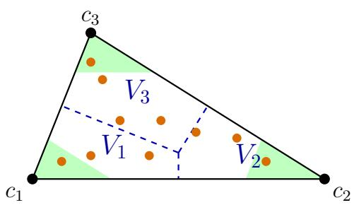  
(a) Unequal centroid triangle: $\eta \approx 0 . 2 7 .$

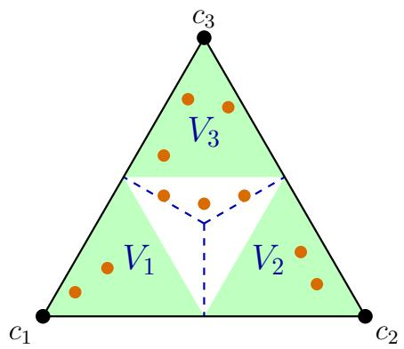  
(b) Equilateral centroid triangle: $\eta ~ = ~ 1 / 2$ (maximal).

Figure 1: Illustration of Lemma 2 for $K = 3 .$ In each panel, the topic centroids $c _ { 1 } , c _ { 2 } , c _ { 3 }$ (black) span the convex hull conv $\{ c _ { 1 } , c _ { 2 } , c _ { 3 } \}$ (solid triangle). The perpendicular bisectors of the centroid pairs (dashed) partition the triangle into three Voronoi cells $\nu _ { 1 } , \nu _ { 2 } , \nu _ { 3 } ,$ with $\nu _ { k }$ containing the points closer to $c _ { k }$ than to any other centroid. Green shading marks the regions where the lemma guarantees correct assignment, $\theta _ { d , k ^ { * } ( d ) } > 1 - \eta .$ Orange dots illustrate document embeddings $\mu _ { d } = C \Theta _ { \bullet d }$ for ten documents with varying topic mixtures.

It follows that, whenever $\delta C ^ { \mathrm { m a x } } < \Delta ^ { * } - \delta C ^ { \mathrm { m a x } }$ , or equivalently, $\delta < \Delta ^ { * } / ( 2 C ^ { \mathrm { m a x } } ) =$ $\frac { \operatorname* { m i n } _ { k \neq k ^ { \prime } } \| c _ { k } - c _ { k ^ { \prime } } \| _ { 2 } } { 2 \operatorname* { m a x } _ { k \neq k ^ { \prime } } \| c _ { k } - c _ { k ^ { \prime } } \| _ { 2 } } = \eta$ , we have:

$$
\begin{array} { r } { \| \mu _ { d } - c _ { k ^ { * } } \| _ { 2 } \leq \delta C ^ { \operatorname* { m a x } } < \Delta ^ { * } - \delta C ^ { \operatorname* { m a x } } \leq \| \mu _ { d } - c _ { k ^ { \prime } } \| _ { 2 } \quad \mathrm { f o r ~ a l l ~ } k ^ { \prime } \neq k ^ { * } . } \end{array}
$$

Since $\delta < \eta _ { ; }$ and $\theta _ { d , k ^ { * } } > 1 - \eta$ are equivalent, $\theta _ { d , k ^ { * } } > 1 - \eta$ thus implies $\mu _ { d } \in \mathcal { V } _ { k ^ { * } }$ Finally, since, by Proposition 3, $\mu _ { d } \in \mathrm { c o n v } \{ c _ { 1 } , . . . , c _ { K } \}$ for all $d ,$ this completes the proof. □

In words, Lemma 2 states that documents whose mass is concentrated on a single topic vertex of $\Delta _ { K - 1 }$ end up in the Voronoi cell of the corresponding centroid. The constant η in Lemma 2 is defined as half the ratio of minimum to maximum pairwise centroid distance. $\eta = 1 / 2$ is achieved when the centroids are equidistant, i.e., when they form an equilateral K-simplex; For the other extreme, $\eta  0$ when some pair of centroids becomes much closer than the others. I illustrate in Figure 1.

Lemma 2 is the vertex case: documents close to a vertex will be assigned to the corresponding Voronoi cell. But the logic behind this is not special to the vertices: Below, I establish the more general result that, for any set of “archetypes" $\mu _ { 1 } ^ { * } , \ldots , \mu _ { L } ^ { * }$ 2 documents whose embeddings are sufficiently close to an archetype $\mu _ { \ell } ^ { * }$ will be assigned to the Voronoi cell of $\mu _ { \ell } ^ { * }$ . Thus, the recovered clusters then reflect mixture-type similarity rather than dominant-topic similarity, and the number of clusters $L$ need not equal the number of topics $K$ . Figure 2 illustrates the archetype geometry. Formally, extending the argument from a single document to the full corpus, I obtain the following proposition,

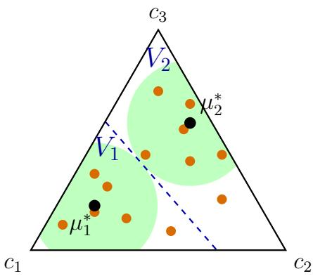  
Figure 2: Illustration of the nearest-archetype membership for $K = 3$ and two archetypes $( L = 2 )$ . The convex hull conv $\{ c _ { 1 } , c _ { 2 } , c _ { 3 } \}$ (solid black) is partitioned by the perpendicular bisectors of archetype pairs (dashed) into Voronoi cells $V _ { \ell } ^ { \prime }$ of the archetype embeddings $\mu _ { \ell } ^ { * }$ (black dots in the interior or on the hull boundary). Green shading marks the guaranteed regions $\{ \mu _ { d } : \| \mu _ { d } - \mu _ { \ell } ^ { * } \| _ { 2 } < \Delta ^ { \prime * } / 2 \}$ — disks of radius $\Delta ^ { \prime * } / 2$ around each archetype, clipped to the hull. Orange dots illustrate document embeddings $\mu _ { d } = C \Theta _ { \bullet d }$ Documents inside a green disk are guaranteed by the triangle-inequality argument to lie in the corresponding Voronoi cell.

Proposition 4 (k-means identification under archetype concentration). Suppose $A s -$ sumption 1 holds. Let $\pi _ { 1 } ^ { * } , \ldots , \pi _ { L } ^ { * } \in \Delta _ { K - 1 }$ be $L \ge 2$ distinct archetype mixturespoints in $\Delta _ { K - 1 }$ around which documents concentrate—with minimum separation

$$
\Delta ^ { \prime * } : = \operatorname* { m i n } _ { \ell \neq \ell ^ { \prime } } \| C ( \pi _ { \ell } ^ { * } - \pi _ { \ell ^ { \prime } } ^ { * } ) \| _ { 2 } > 0 ,
$$

and let $\ell ( d ) : = \arg \operatorname* { m i n } _ { \ell } \| C ( \Theta _ { \bullet d } - \pi _ { \ell } ^ { * } ) \| _ { 2 }$ denote the nearest-archetype assignment in topic-mixture space. If every document satisfies

$$
\| C ( \Theta _ { \bullet d } - \pi _ { \ell ( d ) } ^ { * } ) \| _ { 2 } < \Delta ^ { \prime } { } ^ { * } / 4 ,
$$

then the partition $\mathcal { P } ^ { * } : = \{ d : \ell ( d ) = \ell \} _ { \ell = 1 } ^ { L }$ is a fxed point of k-means: assigning each document to the nearest cell mean of ${ \mathcal { P } } ^ { * }$ returns ${ \mathcal { P } } ^ { * }$ , and recomputing the means

returns the same means. Equivalently, ${ \mathcal { P } } ^ { * }$ is simultaneously the Voronoi partition of the archetype embeddings $\{ \mu _ { \ell } ^ { * } \}$ and of its own cell means.

Proof. Let $\mathcal { G } _ { \ell } : = \{ d : \ell ( d ) = \ell \} , \mu _ { \ell } ^ { * } : = C \pi _ { \ell } ^ { * }$ and $\mu _ { d } = C \Theta _ { \bullet d }$ . Within-cluster pairwise distances then satisfy, for $d , d ^ { \prime } \in \mathcal { G } _ { \ell }$

$$
\begin{array} { r } { \| \mu _ { d } - \mu _ { d ^ { \prime } } \| _ { 2 } \ \leq \ \| \mu _ { d } - \mu _ { \ell } ^ { * } \| _ { 2 } + \| \mu _ { d ^ { \prime } } - \mu _ { \ell } ^ { * } \| _ { 2 } \ < \ \frac { \Delta ^ { \prime * } } { 4 } + \frac { \Delta ^ { \prime * } } { 4 } \ = \ \frac { \Delta ^ { \prime * } } { 2 } , } \end{array}
$$

while for $d \in \mathcal { G } _ { \ell } , d ^ { \prime } \in \mathcal { G } _ { \ell ^ { \prime } }$ with $\ell \neq \ell ^ { \prime }$

$$
\begin{array} { r } { \| \mu _ { d } - \mu _ { d ^ { \prime } } \| _ { 2 } \geq \| \mu _ { \ell } ^ { * } - \mu _ { \ell ^ { \prime } } ^ { * } \| _ { 2 } - \| \mu _ { d } - \mu _ { \ell } ^ { * } \| _ { 2 } - \| \mu _ { d ^ { \prime } } - \mu _ { \ell ^ { \prime } } ^ { * } \| _ { 2 } \geq \Delta ^ { \prime * } - 2 \frac { \Delta ^ { \prime * } } { 4 } = \frac { \Delta ^ { \prime * } } { 2 } . } \end{array}
$$

so within-cluster pairwise distances are strictly smaller than cross-cluster ones.

For the fixed-point claim, let $m _ { \ell } : = \bar { \mu } _ { \mathcal { G } _ { \ell } }$ denote the cell means. Each $m _ { \ell }$ is a convex combination of points within $\Delta ^ { \prime * } / 4$ of $\mu _ { \ell } ^ { * }$ sO $\| m _ { \ell } - \mu _ { \ell } ^ { * } \| _ { 2 } < \Delta ^ { \prime * } / 4$ . For $d \in { \mathcal { G } } _ { \ell }$ 2

$$
\begin{array} { r } { \| \mu _ { d } - m _ { \ell } \| _ { 2 } \leq \| \mu _ { d } - \mu _ { \ell } ^ { * } \| _ { 2 } + \| \mu _ { \ell } ^ { * } - m _ { \ell } \| _ { 2 } < \frac { \Delta ^ { \prime * } } { 2 } , } \end{array}
$$

while for $\ell ^ { \prime } \neq \ell _ { \vdots }$

$$
\begin{array} { r } { \| \mu _ { d } - m _ { \ell ^ { \prime } } \| _ { 2 } \geq \| \mu _ { \ell } ^ { * } - \mu _ { \ell ^ { \prime } } ^ { * } \| _ { 2 } - \| \mu _ { d } - \mu _ { \ell } ^ { * } \| _ { 2 } - \| \mu _ { \ell ^ { \prime } } ^ { * } - m _ { \ell ^ { \prime } } \| _ { 2 } > \Delta ^ { \prime * } - \frac { \Delta ^ { \prime * } } { 2 } = \frac { \Delta ^ { \prime * } } { 2 } . } \end{array}
$$

Every document is therefore strictly closer to its own cell mean than to any other, so the assignment step reproduces ${ \mathcal { P } } ^ { * }$ ; the update step then returns the same means.

At the simplex vertices, Proposition 4 specializes to the dominant-topic case, translating the embedding-distance condition back into a sufficient threshold on θ. It is worth noting that Proposition 4 is a stability statement, not a recovery statement.12 Global optimality requires even stronger conditions. However, even the weaker separation condition in Proposition 4 is not satisfied in our application. I therefore claim no recovery of a latent partition in our application. Instead, I rely on Corollary 1, which connects embedding distance to the difference of topic mixtures. A cluster is thus a set of documents with similar mixtures. This is what the interpretation of the clusters in Section 4 rests on, and it requires no concentration assumption.

## 2.6 Conditioning: Embeddings as Controls

The second use of document embeddings I consider is as a control. A researcher who wants to control for a high-dimensional text $X _ { d } \mathrm { - a }$ firm disclosure, a court filing, a job posting—cannot condition on the raw text and instead conditions on its embedding, implicitly assuming that adjustment for the embedding suffices. Proposition 3, and in particular the identity $\mu _ { d } = C \Theta _ { \bullet d }$ , immediately makes the content of that assumption precise.

Formally, let $Z _ { d } \in \{ 0 , 1 \}$ be a treatment, $Y _ { d } ( 0 ) , Y _ { d } ( 1 )$ the potential outcomes for unit $d ,$ and $Y _ { d } = Y _ { d } ( Z _ { d } )$ the observed outcome.

Assumption 3 (Topic unconfoundedness). $\{ Y _ { d } ( 0 ) , Y _ { d } ( 1 ) \} ~ \bot ~ Z _ { d } ~ \mid ~ \Theta _ { \bullet d }$ and $0 ~ <$ $P ( Z _ { d } = 1 \mid \Theta _ { \bullet d } ) < 1$

Assumption 3 states that the document's topic mixture captures all confounding between treatment and potential outcomes: given $\Theta _ { \bullet d }$ , the realized words carry no further information about $( Z _ { d } , Y _ { d } ( 0 ) , Y _ { d } ( 1 ) )$ . This is the explicit content of the informal claim that the text is a sufficient control.

Corollary 2 (Embedding adjustment). Suppose Assumption 1 holds, the topic model is identified, and C is injective on $\Delta _ { K - 1 }$ .Then, controlling for document embedding is valid if and only if controlling for the topic mixture is. In particular, under Assumption 3, the average treatment effect is identified by

$$
\tau \ = \ \mathbb { E } \big [ \mathbb { E } [ Y _ { d } \mid Z _ { d } = 1 , \mu _ { d } ] - \mathbb { E } [ Y _ { d } \mid Z _ { d } = 0 , \mu _ { d } ] \big ] .
$$

Proof. Since $\Pi = B \Theta$ and the topic model is identified, $\mu _ { d } = C \Theta _ { \bullet d }$ (Proposition 3). Since C is injective on $\Delta _ { K - 1 } , ~ \mu _ { d }$ and $\Theta _ { \bullet d }$ are one-to-one functions of each other: conditioning on one is the same as conditioning on the other. Adjustment on the embedding is therefore valid exactly when adjustment on the topic mixture is. In particular, under Assumption 3, $\{ Y _ { d } ( 0 ) , Y _ { d } ( 1 ) \} \perp Z _ { d } \mid \mu _ { d }$ and $0 < P ( Z _ { d } = 1 \mid \mu _ { d } ) <$ 1, so $\tau$ is identified by adjustment on $\mu _ { d }$ (Rosenbaum and Rubin, 1983). □

Corollary 2 is an identification statement at the population level; it is exact only under three conditions. First, it uses the expected embedding $\mu _ { d }$ .With finite document length, both $\mu _ { d }$ and $\Theta _ { \bullet d }$ will be measured with error $( \mathrm { e . g . , ~ } \bar { h } _ { d } = \mu _ { d } +$ $O _ { p } ( N _ { d } ^ { - 1 / 2 } )$ ; see the discussion in Section 2.4). Also see Battaglia et al. (2024) for a more general discussion of measurement error in $\mathrm { A I / M L } -$ generated variables. Second, it requires embedding dimension $r \geq K - 1$ : with $r < K - 1$ the map $\mu _ { d } = C , \Theta _ { \bullet d }$ cannot be injective and conditions on only a projection of $\Theta _ { \bullet d }$ , leaving residual confounding regardless of $N _ { d }$ . However, for the high-dimensional embeddings used in practice I believe this bound is slack. Third, C must be injective on $\Delta _ { K - 1 }$ . For an embedding satisfying $H H ^ { \top } = R - \mathbf { 1 } _ { V } \mathbf { 1 } _ { V } ^ { \top }$ this holds by construction (Corollary 1). For Word2Vec, GloVe, or pretrained embeddings, it is a maintained assumption; see the discussion in Section 2.3.

The point is not that embedding-based adjustment is valid, but that its validity reduces to a transparent condition on the topic mixture. This connects to a growing literature on causal inference with text (Roberts et al., 2020; Egami et al., 2022); relative to that work, I derive the sufficiency condition from the generative model rather than assert it.

Although Corollary 2 is stated for the topic model, its two structural requirements are general. Suppose the confounding is driven by a latent summary of the text of dimension s (here $s ~ = ~ K - 1$ , the topic mixture). Embedding-based control then requires, first, an embedding of dimension $r \geq s -$ —otherwise it encodes only a projection of that summary and leaves residual confounding; and second, that the embedding actually recover the summary, so that its low-dimensional geometry coincides with the one the confounding lives in. Dimension alone thus does not suffice—an embedding can be low-dimensional in a geometry that has little to do with the text's, and adjusting for it then controls for the wrong object.

## 3 Numerical Illustration

I next simulate data from the model described in Section 2.1 and compare two embedding constructions: (i) the closed-form SVD-β embedding of Proposition 1, and (ii) skip-gram with negative sampling (SGNS) (Mikolov et al., 2013c) as implemented in gensim (Rehůřek and Sojka, 2010) (cf. Table 1). Theorem 1 predicts that SVD-β inherits the topic-loading geometry, and Proposition 2 carries the prediction over to the SGNS target.13

Both embeddings use dimension $r \ = K$ . By Proposition 1, $r = K - 1$ is the minimum sufficient embedding dimension for SVD-β. The extra dimension should have population eigenvalue zero and be genuine slack, and I confirm this in the figures below. The SGNS target is the approximately rank-(K - 1) log R shifted by the constant - log ν. We quantify that approximation in the last paragraph of this section. Because the shift is constant, it raises the rank of the target without spreading words apart, so it does not appear in the centered projections plotted below.

To illustrate our theoretical results, consider two simulation designs on a common $V = 1 6$ vocabulary of fruits and vegetables: a two-topic case (Design 1) and a threetopic extension (Design 2). Documents are generated with topic mixtures drawn from a symmetric Dirichlet $( \alpha = 1 )$ prior on the simplex, with $D = 3 6 3$ documents and $N _ { d } = 4 8 7$ words per document, matching the dimensions of the application in Section 4, and the full document as context.14

Design 1: Two Topics $\left( K = 2 \right)$ . The topic-word matrix is

$$
B = ( \begin{array} { l l l l l l } { 0 . 0 8 } & { 0 . 0 0 1 } & { 0 . 0 1 } & { \lambda } & { 0 } & { 0 } & { 0 } \\ { 0 . 0 0 1 } & { 0 . 1 0 1 } & { 0 } & { 0 } & { \lambda } & { 0 } \\ { 0 . 0 1 } & { 0 . 1 0 1 } & { 0 } & { 0 } & { \lambda } & { 0 } \\ { 0 . 0 1 } & { 0 . 1 0 1 } & { 0 } & { 0 } & { \lambda } & { 0 } \\ { 0 . 0 0 1 } & { 0 . 1 0 2 } & { 0 } & { 0 } & { \lambda } & { 0 } \\ { 0 . 1 0 1 } & { 0 . 1 0 2 } & { 0 } & { 0 } & { \lambda } & { 0 } \\ { 0 . 1 0 1 } & { 0 . 1 0 1 } & { 0 } & { 0 } & { \lambda } & { 0 } \\ { 0 . 1 0 1 } & { 0 . 1 0 1 } & { 0 } & { 0 } & { \lambda } & { \lambda \mathrm { t a n k i t i s t } } \\ { 0 . 1 0 1 } & { 0 . 1 0 1 } & { 0 } & { 0 } & { \mathrm { G r a p e r i n t i t i o n } } & { 0 } \\ { 0 . 1 0 1 } & { 0 . 1 0 1 } & { 0 } & { 0 } & { \mathrm { G r a p e r i n t i t i o n } } \\ { 0 . 0 1 0 } & { 0 . 1 0 1 } & { 0 } & { 0 } & { \mathrm { G r a p e r i n t i t i o n } } \\ { 0 . 1 0 1 } & { 0 . 1 0 1 } & { 0 } & { 0 } & { \mathrm { K a p e r i n t i t i o n } } \\ { 0 . 1 0 1 } & { 0 . 1 0 1 } & { 0 } & { 0 } & { \mathrm { G r a p e r i n t i t i o n } } \\ { 0 . 0 1 0 } & { 0 . 3 0 1 } & { 0 } & { \mathrm { G r a p e r i n t i t i o n } } \\ { 0 . 1 0 1 } & { 0 . 1 0 1 } & { 0 } & { 0 } & { \mathrm { G r a p e r i n t i o n } } \\ { 0 . 0 1 0 } & { 0 . 1 0 2 } & { 0 } &  \mathrm { G r a p e r i n t i o n } \end{array}\tag{23}
$$

Apple, Pear, Mango, Cherry, Lemon, and Grapefruit are anchor words for topic 1 (fruits) with varying prevalence, and Kale is an anchor word for topic 2 (vegetables). The remaining words load on both topics with varying intensity

Figure 3 shows the resulting word embeddings. Both methods recover the same qualitative structure: words separate cleanly along their dominant topic, with fruits (red) and vegetables (green) forming distinct clusters. The SGNS and SVD-β geometries are nearly identical up to rotation and scaling. Both clouds are one-dimensional, which is what the theory implies: SVD-β has population rank $K - 1 = 1$ , and SGNS's second direction is the common offset, which the centered projection removes. Proposition 2 predicts only that the two induce equivalent metrics on the words; here the distortion it permits is evidently small. Within each cluster, the relative positions of words reflect their loadings: anchor words (e.g., Mango, Grapefruit, Kale) lie at the extremes, while mixed words (e.g., Peach, Orange) sit closer to the boundary between clusters, with their positions reflecting their relative loadings. This pattern holds exactly for SVD-β, and approximately for SGNS. On the other hand, the SVD-$\beta$ embedding appears somewhat noisier (further from rank 1), perhaps reflecting the difficulty in directly matrix-factorizing the noisy sample co-occurrence structure.

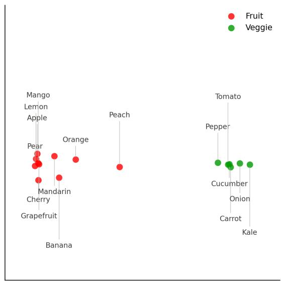  
(a) SVD-β

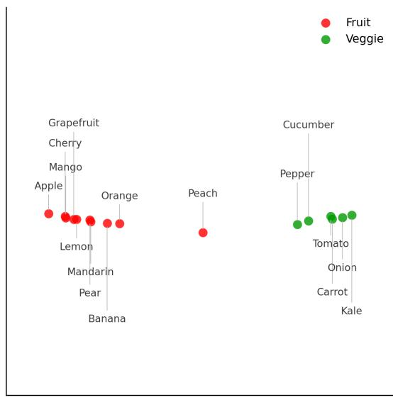  
(b) SGNS  
Figure 3: Word embeddings for Design 1 $\left( K = 2 \right)$ : SGNS vs. the closed-form SVD-β construction of Proposition 1, both computed on the same corpus $( D = 3 6 3 , N _ { d } = 4 8 7 )$ Colors mark the dominant topic from the true B matrix.

Design 2: Three Topics $\left( K \ : = \ : 3 \right)$ . I next split the "fruit" category into a "citrus" topic (orange) and a "non-citrus" topic (red), while keeping the same vegetable topic (green). The topic-word matrix is

$$
\begin{array}{c} \begin{array} { r } { B = ( \begin{array} { l l l l l } { 0 . 1 0 } & { 0 . 5 5 } & { 0 . 5 0 } & { 0 . 6 1 } \\ { 0 . 1 5 } & { 0 . 0 2 } & { 0 . 0 1 } \\ { 0 . 1 5 } & { 0 . 0 1 } & { 0 . 0 1 } \\ { 0 . 1 3 } & { 0 . 0 1 } & { 0 . 0 1 } \\ { 0 . 0 1 } & { 0 . 0 1 } & { 0 . 0 4 } \\ { 0 . 1 0 } & { 0 . 0 1 } & { 0 . 0 4 } \\ { 0 . 0 1 } & { 0 . 1 5 } & { 0 . 0 2 } \\ { 0 . 0 1 } & { 0 . 1 6 } & { 0 . 0 2 } \\ { 0 . 0 1 } & { 0 . 0 2 } & { 0 . 0 1 } \\ { 0 . 0 1 } & { 0 . 0 2 } & { 0 . 0 1 } \\ { 0 . 0 1 } & { 0 . 0 2 } & { 0 . 0 2 } \end{array} ) \qquad \mathrm { w i t h ~ r u w e s ~ s u r e x p o n t a t i n g ~ t h e ~ \small ~ 3 H o p l i t } } \\ { \mathrm { C o n ~ s u p e r a t i o n } } \\ { \mathrm { C o n ~ s u p e r a t i o n } } \\ { \mathrm { C u p e r a t i o n } } \\ { \mathrm { C u p e r a t i o n } } \\ { \mathrm { C u p e r a t i o n } } \\ { \mathrm { C u p e r a t i o n } } \\ { \mathrm { C o n ~ } } \\ { 0 . 0 0 1 } & { 0 . 0 2 } & { 0 . 1 0 } \\ { 0 . 0 1 } & { 0 . 0 2 } \\ { 0 . 0 1 } & { 0 . 0 2 } & { 0 . 0 0 } \\ { 0 . 0 1 } & { 0 . 0 2 } & { 0 . 0 0 } \\ { 0 . 0 1 } & { 0 . 0 2 } & { 0 . 0 0 } \\ { 0 . 0 1 } & { 0 . 0 1 } & { 0 . 1 7 } \end{array} ) \qquad \mathrm { C o n d u e r ~ \small ~ N e t h e ~ n u m e s ~ c o n d u e r s t y a n ~ t h e ~ }  \end{array}\tag{24}
$$

Kale is an anchor word for topic 3 (vegetables), but topics 1 (non-citrus fruits) and 2 (citrus) have no anchor words, though they differ in their relative loadings on the same set of words.

Figure 4 shows the resulting word embeddings. With $r = K = 3$ , the embeddings live in R3, and I project to two dimensions by simply retaining the first two coordinates. For $\mathrm { S V D } { - } \beta , \beta _ { \bullet 1 }$ and $\beta _ { \bullet 2 }$ span the two largest-variance directions and the third column corresponds to a zero eigenvalue in population. For SGNS, the coordinate basis is chosen by the gradient-based optimizer and is arbitrary. Dropping the third coordinate projects out one mixture of the three coordinates.

Both methods produce embeddings in which the three topics are clearly separated, with words organized into three distinguishable groups corresponding to non-citrus fruits (red), citrus fruits (orange), and vegetables (green). The anchor word for vegetables (Kale) sits on the edge of the convex hull, consistent with the theory: anchor words receive embeddings proportional to a single topic centroid, while nonanchor words are pulled toward mixtures of centroids in proportion to their topic loadings. Notably, the absence of anchor words for topics 1 and 2 does not prevent the embeddings from separating these two groups—the differing relative loadings of shared words across the two topics are sufficient to recover the distinction. The SGNS and $\mathrm { S V D } { - \beta }$ embeddings again yield qualitatively similar geometries, providing empirical support for the theoretical connections established in Section 2.3.

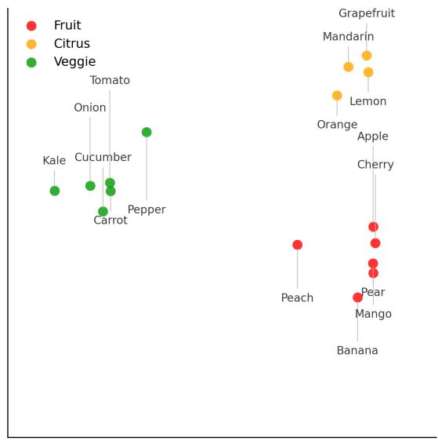  
(a) SVD-β

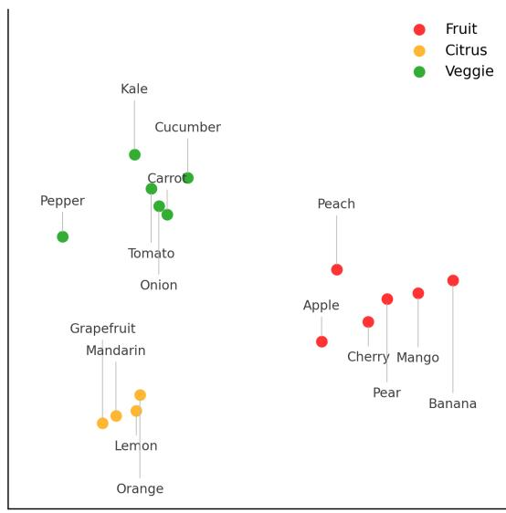  
(b) SGNS  
Figure 4: Word embeddings for Design $2 \ ( K = 3 )$ , projected into two dimensions. Both embeddings recover topic structure even though topic 3 lacks an anchor word.

Document Embeddings. Next, I compute document embeddings as the average of word embeddings within each document (cf. Equation (14)). By Proposition 3, documents with similar topic mixtures $\Theta _ { \bullet d }$ should have similar embeddings, and document embeddings should lie in the $( K - 1 )$ -dimensional simplex spanned by the topic centroids. Figure 5 shows the document embeddings for Design 2 $\left( K = 3 \right)$ 2 colored by dominant topic (projected into 2-d following the same step as in Figure 4).15 With Dirichlet concentration parameter $\alpha = 1$ , the topic mixtures are well spread across the simplex, and the document embeddings fill out the simplex spanned by the three topic centroids. The two embedding methods yield similar documentembedding geometries. Appendix C.3 shows additional document-embedding figures for a version that replaces the Dirichlet prior on $\Theta _ { \bullet d }$ with an archetype mixture in the interior of the topic simplex, with documents concentrated around the two archetypes.

I note that all of the figures above are based on a single corpus. However, I found the results to be representative across multiple realizations.

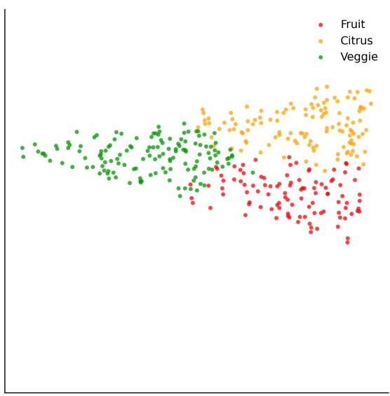  
(a) SVD-β

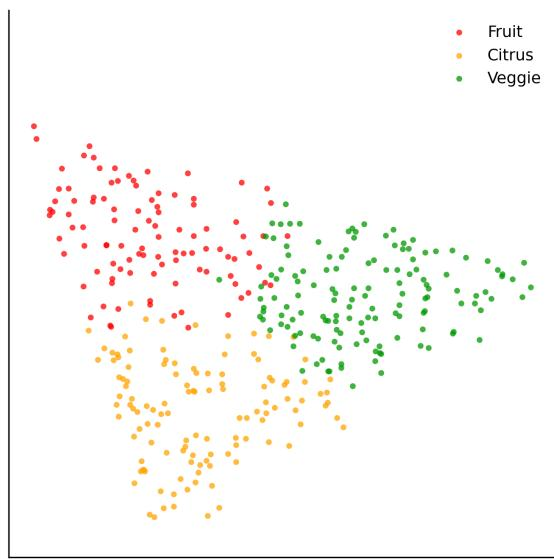  
(b) SGNS  
Figure 5: Document embeddings for Design $2 \ ( K = 3 )$ , projected in two dimensions. Color indicates the dominant topic.

The rank of the SGNS target. Remark 3 reduces the gap between the SGNS target and the trained embedding to a property of the spectrum of $T = \log R -$ log $\nu \mathbf { 1 } _ { V } \mathbf { 1 } _ { V } ^ { \intercal }$ . The shift is a known constant and cancels in the row differences, so the question is how much of log R the remaining $K - 1$ directions capture. I measure that by

$$
\pi _ { K - 1 } = \frac { \sum _ { i \leq K - 1 } | \lambda _ { i } ( \log R ) | } { \sum _ { i } | \lambda _ { i } ( \log R ) | } ,\tag{25}
$$

the share of spectral mass in the leading K — 1 eigenvalues. Under the two designs above the spectrum is available exactly $R = \tilde { B } G \tilde { B } ^ { \top }$ from the design B and the closed-form Dirichlet moments — and gives $\pi _ { K - 1 } = 0 . 8 8$ for Design 1 and 0.91 for Design 2. In these designs we can therefore think of Proposition 2 approximately describing the trained embedding and not only its target, in line with the empirical results above. Table 2 reports $\pi _ { K - 1 }$ on a grid of vocabulary sizes and topic counts under a generic data-generating process: each column of B and each topic mixture $\Theta _ { \bullet d }$ is an independent draw from a symmetric Dirichlet $( \alpha = 1 )$ , uniform on its simplex. Across the grid, a rank-K approximation remains close to the SGNS target.16

<table><tr><td>V</td><td> $K = 2$ </td><td> $K = 3$ </td><td> $K = 5$ </td><td> $K = 1 0$ </td><td> $K = 2 5$ </td><td> $K = 5 0$ </td></tr><tr><td>100</td><td>0.909</td><td>0.926</td><td>0.946</td><td>0.968</td><td>0.987</td><td>0.995</td></tr><tr><td>250</td><td>0.905</td><td>0.924</td><td>0.943</td><td>0.966</td><td>0.985</td><td>0.993</td></tr><tr><td>500</td><td>0.905</td><td>0.923</td><td>0.943</td><td>0.964</td><td>0.984</td><td>0.992</td></tr><tr><td>1,000</td><td>0.905</td><td>0.924</td><td>0.943</td><td>0.964</td><td>0.983</td><td>0.991</td></tr><tr><td>2,500</td><td>0.905</td><td>0.923</td><td>0.943</td><td>0.963</td><td>0.983</td><td>0.991</td></tr></table>

Table 2: Share of the spectral mass of log R carried by its leading $K - 1$ eigenvalues, $\begin{array} { r } { \pi _ { K - 1 } = \sum _ { i < K - 1 } | \lambda _ { i } | / \sum _ { i } | \lambda _ { i } | } \end{array}$ at $\alpha = 1$ . Each column of B and each topic mixture $\Theta _ { \bullet d }$ is drawn from\~a symmetric Dirichlet(α); R is then formed in population from B and $G ,$ SO no corpus is sampled. Means over 8 draws; the largest standard deviation in any cell is 0.004. The negative-sampling shift contributes one further eigenvalue, of size V log ν, and is excluded.

## 4 Application: Clustering Metropolitan Economies

I now apply the embedding-then-cluster pipeline to 363 U.S. Core-Based Statistical Areas (CBSAs). The empirical setup is straightforward: generate a textual economic description of each CBSA, embed the descriptions, and apply k-means.

The theory in Section 2 provides a principled reading of what this pipeline does. Corollary 1 gives the pairwise document-embedding distance in closed form:

$$
\begin{array} { r } { \Vert \mu _ { d } - \mu _ { d ^ { \prime } } \Vert _ { 2 } ^ { 2 } \ = \ \left( \Pi _ { \bullet d } - \Pi _ { \bullet d ^ { \prime } } \right) ^ { \top } ( R - \mathbf { 1 } _ { V } \mathbf { 1 } _ { V } ^ { \top } ) \left( \Pi _ { \bullet d } - \Pi _ { \bullet d ^ { \prime } } \right) . } \end{array}
$$

Running k-means on these embeddings groups CBSAs whose descriptions imply similar mixtures. The clusters therefore reflect narrative similarity, and each centroid corresponds to a well-defined mixture.

Our main empirical analysis considers five embedding models: (i) the closedform SVD-β embedding of Proposition 1; (ii) corpus-trained skip-gram with negative sampling (SGNS; Proposition 2); (iii) corpus-trained continuous bag-of-words $( \mathrm { C B O W } ) ^ { 1 7 }$ ; (iv) pretrained Word2Vec averaging, using the Google News vectors; and (v) a transformer-based variant using OpenAI's text-embedding-3-large.18 Detailed method descriptions are collected in Appendix B.2.

Remark 5 (Theoretical coverage of the five methods). The five differ in how much of Section 2 applies to them. Method (i) is the theory's own construction: it computes the rank-(K — 1) factorization of Proposition 1 directly, and averaging within a document returns exactly the $\mu _ { d }$ of Proposition 3. Method (ii) is the corpus-trained arm the theory covers: the SGNS target is log R up to a constant, so by Proposition 2 it recovers the topic-loading geometry up to a distortion bounded by $\kappa _ { R } .$ the exponentiated spread of log R (Section 2.3). Method (iii), CBOW, is not covered: it has no closed-form $V \times V$ target once the context holds more than one word (Section 2.3), and the context here is the full document. Method (iv) runs the same architecture on a different corpus, so the geometry it carries is that of the corpus it was trained on—the object of interest only if that corpus and ours share their topic structure. Method (v) falls outside the framework altogether: it is a contextual transformer rather than an average of word vectors. I include it as a benchmark for a modern state-of-the-art approach to embeddings.

For each Core-Based Statistical Area (CBSA), a 500-word economic description is generated by Claude Opus 4.8. I provide the exact prompt in Appendix B.1. I then apply k-means with L = 5 clusters to group the 363 CBSAs. Table 3 summarizes the five approaches.
<table><tr><td>Method</td><td>L</td><td>Cluster sizes</td><td>Max share</td><td>Within-cluster share</td></tr><tr><td>Corpus CBOW</td><td>5</td><td>57/62/68/85/91</td><td>25%</td><td>0.90</td></tr><tr><td>Corpus SGNS</td><td>5</td><td>60/71/109/34/89</td><td>30%</td><td>0.78</td></tr><tr><td>SVD-β (r = 50)</td><td>5</td><td>97/154/75/21/16</td><td>42%</td><td>0.77</td></tr><tr><td>Pretrained (Google News)</td><td>5</td><td>89/33/109/64/68</td><td>30%</td><td>0.83</td></tr><tr><td>LLM Embeddings</td><td>5</td><td>25/114/59/101/64</td><td>31%</td><td>0.90</td></tr></table>

Table 3: Comparison of clustering approaches (363 CBSAs). Cluster sizes are member counts by k-means label index. “Within-cluster share" is the fraction of embedding variance within clusters.

All five identify recognizable archetypes: energy dependence, university and government anchoring, deindustrialization, and diversified growth. I give per-cluster interpretations for all methods in Appendix B.10. The number of clusters is chosen to balance interpretability and flexibility. I consider alternative values for L in the Appendix (e.g., Online Appendix Figures OA.1 and OA.3). The qualitative finding that these groupings separate economic narratives (and employment dynamics, cf Section 4.1) holds across different choices of L.

## 4.1 Local Employment Dynamics

I return to our motivating example in the introduction: modelling local employment dynamics. In order to do so, I estimate autoregressive models for log employment across 363 CBSAs and examine whether the text-based clusters we derived above capture meaningful heterogeneity in employment dynamics. Specifically, for each of the five embedding-based clustering methods (SVD. $\cdot \beta ,$ corpus-trained SGNS, corpustrained CBOW, pretrained Word2Vec averaging, and LLM embeddings), I estimate:

$$
y _ { i t } = \alpha _ { i } + \rho _ { 1 } ^ { ( g _ { i } ) } y _ { i , t - 1 } + \rho _ { 2 } ^ { ( g _ { i } ) } y _ { i , t - 2 } + \varepsilon _ { i t } ,\tag{26}
$$

where $y _ { i t }$ is log total employment in year t at the CBSA level, and $g _ { i } \in \{ 1 , \ldots , L \}$ denotes the cluster membership of CBSA $i . ^ { 1 9 }$ I take $p = 2$ as the primary specification based on our discussion in Appendix B.7. I thus allow the AR(2) slope coefficients in (1) to vary across groups, but remain common within each group—using our text-based cluster assignments. The hope is that similarity in economic conditions between CBSAs translates into similar local employment dynamics. Under the topic model of Section 2, I can make this condition more precise: that similarity in topic shares between CBSAs translates into similar local employment dynamics. As a concrete example, this might entail that descriptions with a relatively large share of words about manufacturing decline (treating this as a “topic"), are associated with similar employment dynamics.

Figure 6 depicts the group-specific implied impulse response functions (IRF) over a 10-year horizon under each clustering method. The top four panels use embeddingbased groupings. The bottom row gives the two groupings that do not use the text. The bottom left uses residual k-means, which is formed by applying k-means clustering to the residuals from a pooled AR(2) specification—analogous to the first step of Bonhomme et al. (2022). The bottom right is observables k-means, applied to 1970 covariates (standardized industry mix, government and military employment shares, education, foreign-born and minority shares and population density;

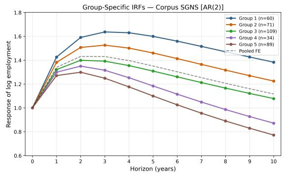

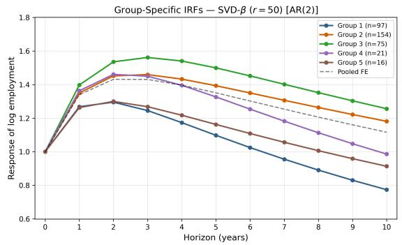

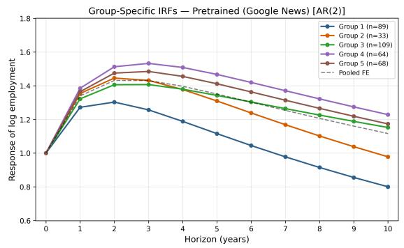

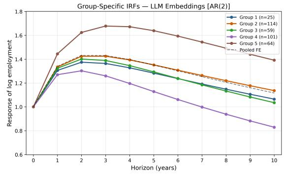

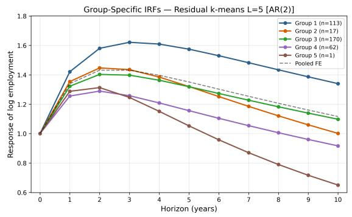

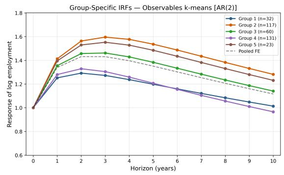  
Figure 6: Group-specific AR(2) impulse responses under each clustering (L = 5), with the pooled FE estimate (dashed) for reference. The top four panels are embedding-based groupings; corpus CBOW is omitted here for space and appears in Table 4. The bottom row gives the two groupings that do not use the text—residual k-means and observables k-means, on the 1970 covariates.

see Appendix B.9 for more detail). I use L = 5 throughout to match the number of clusters used by the text-based methods and report alternative specifications in Appendix B.5.

To quantify how well each clustering method captures heterogeneity in employ-

ment dynamics, I compare the between-group variance of the 363 unit-specific IRFs across clustering methods in Table 4. I do this in two ways: first, I compute the ratio of between-group variance to total variance, which is a standard measure of how well a grouping explains variation in a variable of interest (column 1). Since the total variance includes estimation error in the unit-specific responses, which is substantial in our application, I also include a version that normalizes the between-group variance relative to a permutation floor, which is the mean between-group variance over 2,000 random relabelings that hold the realized group sizes fixed (column 2). This is the level of between-group variance a random partition of the same sizes would deliver and provides a reference point for evaluating whether a given partition captures real heterogeneity in employment dynamics. The last two columns count how frequently the grouping exceeds the two non-text based benchmarks when I vary the number of clusters L ∈ {2, 3, 4, 5, 6, 8, 10}.
<table><tr><td rowspan="2">Grouping</td><td rowspan="2">% Between Ratio to floor</td><td rowspan="2"></td><td colspan="2">Exceeds benchmark, of 7 L values</td></tr><tr><td>Residual k-means Observables k-means</td><td></td></tr><tr><td>Corpus SGNS</td><td>28.3%</td><td>25.7×</td><td>7</td><td>6</td></tr><tr><td>LLM Embeddings</td><td>27.1%</td><td>24.7×</td><td>7</td><td>6</td></tr><tr><td>SVD-β (r = 50)</td><td>24.3%</td><td>21.8×</td><td>7</td><td>6</td></tr><tr><td>Corpus CBOW</td><td>22.5%</td><td>20.4×</td><td>7</td><td>5</td></tr><tr><td>Pretrained (Google News)</td><td>18.8%</td><td>16.8×</td><td>6</td><td>5</td></tr><tr><td>Observables k-means</td><td>16.7%</td><td>15.5×</td><td>7</td><td></td></tr><tr><td>Residual k-means</td><td>13.9%</td><td>12.6×</td><td></td><td>0</td></tr></table>

Table 4: Grouping-level summary at L = 5, AR(2). “% Between" is the share of total cross-city IRF variance explained by between-group differences in group-mean IRFs. “Ratio to floor" is the between-group variance of the 363 unit-specific impulse responses divided by that grouping's own size-matched permutation floor. The last two columns count how frequently the grouping exceeds each benchmark out of 7 cluster counts we consider. The upper block is the four embedding-based groupings, the lower the two that do not use the text.

At L = 5, every grouping separates employment dynamics far more sharply than chance, and the five text-based groupings tend to separate it more sharply than the two benchmarks.20 Varying L does not change the main finding: The textual descriptions seem to carry real information about employment dynamics, more so than the two benchmarks I consider. Among the text-based methods, pretrained Word2Vec averaging tends to perform worst, while SVD-β, corpus-trained SGNS, and the LLM embeddings tend to perform best, trading top spots at different values of L (cf. Appendix B.5). It is perhaps worth noting that a simple closed-form factorization computed from the corpus in seconds matches a commercial transformer embedding on this task.

In-sample vs Out-of-sample. Our exercise in this section is entirely in-sample.I read the evidence as establishing that narrative text encodes economically meaningful structure about local labor markets—more of it than either benchmark recovers, including the curated covariate set—but not as establishing that text-based peer groups are the preferred way to model this panel for forecasting purposes.

## 5 Conclusion

Embeddings are ubiquitous in NLP and increasingly used in economics. This paper asks what replacing a text with its embedding preserves, under a generative model in which documents are mixtures of K latent topics.

At the word level, an embedding built from how often words appear together reflects the topic geometry: words that play the same role across topics end up close together. Extra dimensions do no harm, so a researcher need not know how many topics a corpus contains. At the document level, proximity in embedding space is proximity in topic mixture. This means that a cluster of document embeddings corresponds to a set of documents with similar mixtures, and that adjusting for the embedding is equivalent to adjusting for the topic mixture.

Another lesson is that dimension alone is not the relevant property. Two alignments matter: the embedding must recover the text's low-dimensional structure, and that structure must be the one the analysis requires. My theory delivers the first. At the same time, connecting embeddings to the parameters of an underlying topic model makes the second an assumption about the economics rather than the algorithm. Take the control use: the informal premise that “the embedding is a sufficient control" reduces to the transparent condition that the topic mixture captures the confounding—an assumption with economic content that a practitioner can defend. Directly assuming that d-dimensional embedding vectors in Euclidean space are a sufficient control is much harder to justify on economic grounds.

In my application, I find that clustering LLM-generated descriptions of 363 U.S. metropolitan areas yields interpretable economic types, and those types separate local employment dynamics more sharply than a curated set of industry and demographic covariates. The comparisons line up with the theory: SVD-β and corpustrained SGNS, which target closely related population objects, perform similarly, while pretrained averaging, which carries the geometry of a different corpus, trails at almost every number of clusters. Remarkably, our closed-form embedding matches a commercial transformer embedding on this task, at a fraction of the cost and with a guarantee attached.

Several extensions merit investigation. Transformer embeddings currently fall outside our theoretical framework. Characterizing what transformer architectures learn about topic structure—building on Li et al. (2023)—would bring the embeddings practitioners actually use inside the theory. A second extension is dynamic topic models (Blei and Lafferty, 2006): characterizing how embeddings track changes in word meaning over time.

Finally, the pipeline studied here—generate text with a language model, embed it, then use the embedding downstream—retains the representational power of a large model while leaving every downstream step inspectable and reproducible. That division of labour seems a reasonable way to incorporate such models into empirical work.

## Online Appendix

## A Other Word-Embedding Algorithms under the Topic Model

Section 2.3 of the main paper states what other standard embedding algorithms target and what those targets recover. This appendix supplies the background. Section A.1 writes the four objectives in a common form. Sections A.2-A.5 derive the specific target of this algorithm by algorithm. Section A.6 then shows what the embedding inherits from the topic model, using only that every pair of words co-occurs.

## A.1 The algorithms as weighted low-rank fits

In the word embedding literature, $l o g ( R )$ is called the pointwise mutual information $\mathrm { P M I } ( v , u ) =$ log $R _ { v u }$ (Levy and Goldberg, 2014), and I follow this convention here. Set

$$
R _ { \operatorname* { m i n } } : = \operatorname* { m i n } _ { v , u } R _ { v u } , \qquad R _ { \operatorname* { m a x } } : = \operatorname* { m a x } _ { v , u } R _ { v u } , \qquad \kappa _ { R } : = R _ { \operatorname* { m a x } } / R _ { \operatorname* { m i n } } .\tag{OA.1}
$$

Each of the four algorithms scores the pair $( v , u )$ by an inner product $\boldsymbol { X _ { v u } } = \boldsymbol { w _ { v } ^ { \top } } \tilde { \boldsymbol { w } } _ { u }$ and fits that score to the data by minimizing a loss. Three ingredients pin the loss down: a response $t _ { v u }$ read off the corpus, a convex generator $\phi _ { ; }$ and weights $\omega _ { v u } > 0$ on the pairs. Response and score are different kinds of object. The response is data, fixed once the corpus is given; the score is the parameter, constrained to rank $^ r \cdot$ Lemma OA.1 then shows that the weights drop out of the population optimum, so what the score converges to is determined by $t _ { v u }$ and $\phi$ alone.

Take the generator first. Fix a strictly convex, differentiable $\phi$ on an interval $\mathcal { T }$ and set

$$
D _ { \phi } ( t , y ) : = \phi ( t ) - \phi ( y ) - \phi ^ { \prime } ( y ) ( t - y ) , \qquad t , y \in \mathbb { Z } ,\tag{OA.2}
$$

the vertical gap at t between $\phi$ and its tangent line at $y -$ the Bregman divergence generated by $\phi$ (Bregman, 1967) (Also see Collins et al. (2001); Udell et al. (2016)). Convexity makes $D _ { \phi } \geq 0$ and strict convexity makes it vanish only at $t = y ,$ SO $D _ { \phi } ( t , \cdot )$ measures discrepancy from $t ;$ it is not symmetric and is not a metric. Every loss below is a $D _ { \phi }$ for one of three generators,

$$
\begin{array} { r } { \phi ( y ) = \frac { 1 } { 2 } y ^ { 2 } , \qquad \phi ( y ) = \sum _ { v } y _ { v } \log y _ { v } , \qquad \phi ( y ) = y \log y + ( 1 - y ) \log ( 1 - y ) , } \end{array}
$$

which give squared error, the Kullback-Leibler divergence, and the Bernoulli log-loss respectively.

The previous paragraph gave us a discrepancy, the Bregman divergence. But there is a scale mismatch: the score $X _ { v u }$ lives in R. On the other hand, the domain of the response $t _ { v u }$ $\mathcal { T } ,$ depends on the algorithm, but generally $\mathbb { R } \neq \mathbb { Z }$ (cf. Table 1). The derivative $\phi ^ { \prime }$ is the link that maps R onto the response scale: Strict convexity makes $\phi ^ { \prime }$ strictly increasing and hence invertible, so $( \phi ^ { \prime } ) ^ { - 1 } ( X _ { v u } )$ is the score expressed on the response's scale — the fitted value for $t _ { v u }$ . A loss of the form $D _ { \phi } { \left( t _ { v u } , \ ( \phi ^ { \prime } ) ^ { - 1 } ( X _ { v u } ) \right) }$ therefore compares response with fitted value, and I call the matrix with entries $\phi ^ { \prime } ( t _ { v u } )$ the algorithm's target.

Lemma OA.1 (Weights do not move the target). Let $\omega _ { v u } > 0$ and $t _ { v u } \in$ int I for all $v , u$ Then, the unconstrained minimizer of $\begin{array} { r l } { \sum _ { v , u } \omega _ { v u } D _ { \phi } \big ( t _ { v u } , \mathbf { \xi } ( \phi ^ { \prime } ) ^ { - 1 } ( X _ { v u } ) \big ) } & { { } } \end{array}$ over $X \in \mathbb { R } ^ { V \times V }$ is $X _ { v u } =$ $\phi ^ { \prime } ( t _ { v u } )$ , entrywise and independently of the weights.

Proof. Each term is nonnegative and vanishes iff $( \phi ^ { \prime } ) ^ { - 1 } ( X _ { v u } ) = t _ { v u } ; \phi ^ { \prime }$ is strictly increasing, hence invertible, so this holds iff $X _ { v u } = \phi ^ { \prime } ( t _ { v u } )$ . The weights are positive, so minimizing the sum minimizes each term. □

Lemma OA.1 states that the score equals the target whenever the rank constraint is nonbinding.

## A.2 Full-softmax skip-gram

The population full-softmax skip-gram objective is

$$
\mathcal { L } _ { \mathrm { f u l l } } ( W , \tilde { W } ) : = \sum _ { v , u \in [ V ] } M _ { v u } \log \frac { \exp ( w _ { v } ^ { \top } \tilde { w } _ { u } ) } { \sum _ { v ^ { \prime } \in [ V ] } \exp ( w _ { v ^ { \prime } } ^ { \top } \tilde { w } _ { u } ) } ,\tag{OA.3}
$$

where $w _ { v }$ is the v-th row of W and $\tilde { w } _ { u }$ is the u-th row of $\tilde { W }$ , so that $X : = W \tilde { W } ^ { \top }$ collects the scores $X _ { v u } = \boldsymbol { w _ { v } ^ { \top } } \tilde { \boldsymbol { w } } _ { u }$ . Equation (OA.3) is the population counterpart of the skip-gram model of Mikolov et al. (2013c, eqs. 1–2), whose objective averageslog $P ( w \mid c )$ over corpus positions within a context window; here that average is replaced by the population co-occurrence M.

Lemma OA.2 (Full-softmax skip-gram target). Under Assumptions 1 and ${ \mathcal { Q } } ,$ the unconstrained maximizers of (OA.3) satisfy $X ^ { * } = \log R + \log q \mathbf { 1 } ^ { \top } - \mathbf { 1 } g ^ { \top }$ for some $g \in \mathbb { R } ^ { V }$

Proof. Lemma OA.1 does not apply directly: the softmax in (OA.3) normalizes over the whole column $X _ { \bullet u } ,$ so the loss is not separable across v within a column, and we need to consider entire columns instead. Writing $M _ { v u } = q _ { u } P ( w = v \mid c = u )$ and $s _ { v u } : = \operatorname { s o f t m a x } ( X _ { \bullet u } ) _ { \iota }$ ，

$$
{ \mathcal { L } } _ { \mathrm { f u l l } } \ = \ - \sum _ { u } q _ { u } \mathrm { K L } \big ( P ( w \mid c = u ) \big | \big | s _ { \bullet u } \big ) \ - \ \sum _ { u } q _ { u } H \big ( P ( w \mid c = u ) \big ) ,\tag{OA.4}
$$

whose second term does not involve X. So the objective is again a weighted Bregman fit, with response $t _ { v u } ~ = ~ P ( w = v ~ \mid ~ c = u )$ , the entropy generator, and weight $\omega _ { v u } ~ = ~ q _ { u }$ what differs from Lemma OA.1 is only that the divergence is taken one column at a time rather than one entry at a time. It is maximized at $s _ { \bullet u } ~ = ~ P ( w ~ \mid ~ c { = } u )$ for every u, that is at $X _ { v u } = \log P ( w = v \mid c = u ) + g _ { u } ,$ the column gauge g being free because softmax is invariant to adding a constant to a column. Finally log $P ( w = v \mid c = u ) = \log R _ { v u } + \log q _ { \imath }$ , by definition of R. □

## A.3 SGNS

Computing the population full-softmax skip-gram objective is computationally difficult. Mikolov et al. (2013c) therefore introduce negative sampling as an approximation used in practice, which I consider next.

Summing the pair-specific objective of Levy and Goldberg (2014, eq. 5) over (v, u) and normalizing counts by corpus size gives the population SGNS objective

$$
\mathcal { L } _ { \mathrm { p o p } } ( W , \tilde { W } ) : = \sum _ { v , u \in [ V ] } \Big \{ M _ { v u } \log \sigma ( w _ { v } ^ { \top } \tilde { w } _ { u } ) + \nu q _ { v } q _ { u } \log \sigma ( - w _ { v } ^ { \top } \tilde { w } _ { u } ) \Big \} ,\tag{OA.5}
$$

with $\sigma ( x ) : = 1 / ( 1 + e ^ { - x } ) , \nu \geq 1$ the negative-sampling rate, and $w _ { v } , \tilde { w } _ { u }$ as above.21

Lemma OA.3 (SGNS target). Under Assumptions 1 and 2, (OA.5) is a weighted Bernoullilikelihood fit with weights $\omega _ { v u } = q _ { v } q _ { u } ( R _ { v u } + \nu )$ and responses $t _ { v u } = R _ { v u } / ( R _ { v u } + \nu )$ , and its unconstrained maximizers $s a t i s f y X ^ { * } = \log R - \log \nu \mathbf { 1 } _ { V } \mathbf { 1 } _ { V } ^ { \top }$

Proof. With $\omega _ { v u } : = M _ { v u } + \nu q _ { v } q _ { u } = q _ { v } q _ { u } ( R _ { v u } + \nu )$ and $t _ { v u } : = M _ { v u } / \omega _ { v u } = R _ { v u } / ( R _ { v u } + \nu )$

$$
\begin{array} { r l } { { \mathcal { L } } _ { \mathrm { p o p } } ( W , \tilde { W } ) = \displaystyle \sum _ { v , u } \omega _ { v u } \Big \{ t _ { v u } \log \sigma ( X _ { v u } ) + ( 1 - t _ { v u } ) \log \sigma ( - X _ { v u } ) \Big \} } \\ { = \displaystyle - \sum _ { v , u } \omega _ { v u } D _ { \phi } \big ( t _ { v u } , \sigma ( X _ { v u } ) \big ) + \mathrm { c o n s t } , } \end{array}
$$

where $X : = W \tilde { W } ^ { \top }$ and $\phi ( y ) = y$ log $y + ( 1 - y ) \log ( 1 - y )$ , for which (OA.2) is the Bernoulli Kullback-Leibler divergence and $\phi ^ { \prime } = \mathrm { l o g i t } \ : = \ : \sigma ^ { - 1 }$ . Assumption 2 puts $t _ { v u }$ in (0, 1), so Lemma OA.1 applies and gives $X _ { v u } ^ { * } = \mathrm { l o g i t } ( t _ { v u } ) = \mathrm { l o g } ( R _ { v u } / \nu )$ □

The target is Levy and Goldberg (2014, eqs. 6–7): they let the inner products vary freely, which is the step Lemma OA.1 formalizes, and solve for $\vec { w } \cdot \vec { c } = \mathrm { P M I } ( w , c ) - \log \nu .$ The weighted-Bernoulli form is what I add. Levy and Goldberg (2014, Section 3.2) observe that the loss on a pair depends on its co-occurrence count and its expected negative-sample count, and conclude that SGNS performs a weighted matrix factorization; they do not identify the weight $\omega _ { v u }$ and response $t _ { v u }$ that make it one, and those are what place SGNS in the same frame as the other three algorithms in Table 1.

## A.4 GloVe

The GloVe model (Pennington et al., 2014) minimizes the population objective

$$
\mathcal { L } _ { \mathrm { G l o V e } } ( W , \tilde { W } , b , \tilde { b } ) : = \sum _ { v , u \in [ V ] } f ( M _ { v u } ) \left( w _ { v } ^ { \top } \tilde { w } _ { u } + b _ { v } + \tilde { b } _ { u } - \log M _ { v u } \right) ^ { 2 } ,\tag{OA.6}
$$

where $f : [ 0 , \infty ) \to [ 0 , \infty )$ is positive on the support of M and $b _ { v } , \tilde { b } _ { u } \in \mathbb { R }$ are learned per-word biases.

Lemma OA.4 (GloVe target). Under Assumptions 1 and 2 and with f positive on supp(M), the unconstrained minimizers of (OA.6) satisfy $X _ { v u } + b _ { v } + \tilde { b } _ { u } = \log M _ { v u }$ entrywise. With $b _ { v } ^ { * } = - \log q _ { v }$ and $\tilde { b } _ { u } ^ { * } = - \log { q _ { u } }$ the implied score matrix is $X ^ { * } = \log R$

Proof. Apply Lemma OA.1 with $\phi ( y ) = y ^ { 2 } / 2$ , response log $M _ { v u }$ , and weights $f ( M _ { v u } )$ . Decomposing log $M _ { v u } = \log q _ { v } + \log q _ { u } + \log R _ { v u }$ and absorbing the marginals into the biases leaves $X _ { v u } = \log R _ { v u }$ □

The biases do here what the gauge g does in Lemma OA.2: both absorb the marginal offsets that separate log M from log R.

## A.5 CBOW

CBOW (Mikolov et al., 2013a) reverses the conditioning relative to skip-gram: it predicts the target word from the average of its surrounding context embeddings. The population objective is

$$
\mathcal { L } _ { \mathrm { C B O W } } ( W , \tilde { W } ) : = \sum _ { w , { \mathbf { u } } } P ( w , { \mathbf { u } } ) \log \frac { \exp \left( h _ { w } ^ { \top } \bar { h } _ { { \mathbf { u } } } \right) } { \sum _ { w ^ { \prime } \in [ V ] } \exp \left( h _ { w ^ { \prime } } ^ { \top } \bar { h } _ { { \mathbf { u } } } \right) } ,\tag{OA.7}
$$

where $\mathbf { u } = ( u _ { 1 } , \dots , u _ { 2 J } )$ is the context window and $\begin{array} { r } { \bar { h } _ { \mathbf { u } } : = \frac { 1 } { 2 J } \sum _ { j = 1 } ^ { 2 J } h _ { u _ { j } } } \end{array}$ is the average context embedding. At the population optimum the softmax form yields $h _ { w } ^ { \top } \bar { h } _ { \mathbf { u } } = \log P ( w \mid \mathbf { u } ) + \kappa ( \mathbf { u } )$ with κ(u) the per-context log-normalizer.

With a single-word context this is Lemma OA.2.. The same relabeling applies under negative sampling: with a one-word context the CBOW negative-sampling objective is (OA.5) with W and W exchanged, and M is symmetric, so its target is again log $R - \log \nu \mathbf { 1 } _ { V } \mathbf { 1 } _ { V } ^ { \intercal }$ and Proposition 2 applies verbatim. With more than one context word it does not: $h _ { w } ^ { \top } \bar { h } _ { \mathbf { u } }$ is a function of the context bundle rather than of pairs $( w , c )$ , so there is no $V \times V$ target matrix analogous to those in Table 1, and a PMI factorization for CBOW analogous to Lemma OA.3 remains open in the literature.

## A.6 What the targets inherit from the topic model

The proof of Proposition 2 bounds distances between rows of log R and then carries them to the embedding. That proposition is stated for the SGNS target, whose only offset is a scalar. The following lemma isolates its first step and states it more generally — for an arbitrary entrywise transform and arbitrary offsets constant along a row or a column. The row offsets are what it takes to cover the full-softmax and GloVe targets: both carry an offset constant along a row, and a row offset does not cancel in a row difference (Remark 4).

Lemma OA.5 (Index sufficiency). Let Assumptions 1 and 2 hold, let ψ be any function on $( 0 , \infty )$ , let $a , b \in \mathbb { R } ^ { V }$ , and set $T _ { v u } : = \psi ( R _ { v u } ) + a _ { v } + b _ { u }$ . Then, for all $v , v ^ { \prime } \in [ V ] , \tilde { B } _ { v \bullet } = \tilde { B } _ { v ^ { \prime } }$ implies $T _ { v \bullet } - T _ { v ^ { \prime } \bullet } = ( a _ { v } - a _ { v ^ { \prime } } ) \mathbf { 1 } ^ { \top }$

Proof. $R = \tilde { B } G \tilde { B } ^ { \top }$ (8) gives $R _ { v u } = \tilde { B } _ { v \bullet } ^ { \top } G \tilde { B } _ { u \bullet }$ SO $\tilde { B } _ { v \bullet } = \tilde { B } _ { v ^ { \prime } \bullet }$ gives $R _ { v \bullet } = R _ { v ^ { \prime } }$ • and hence $\psi ( R _ { v \bullet } ) = \psi ( R _ { v ^ { \prime } \bullet } )$ entrywise. The column offsets $b _ { u }$ cancel in the difference. □

The hypothesis is the one used throughout: since $\tilde { B } = D _ { a } ^ { - 1 } B , \tilde { B } _ { v \bullet } = \tilde { B } _ { v ^ { \prime } }$ • holds exactly when $B _ { v \bullet } = \lambda B _ { v ^ { \prime } }$ • for some $\lambda > 0$ , in which case $q _ { v } = \lambda q _ { v ^ { \prime } }$ . Words with proportional loadings therefore have target rows that differ by the constant $a _ { v } - a _ { v ^ { \prime } }$ , in every one of the targets and whatever transformation produced them. Whether that constant is zero is what separates the algorithms: for SGNS $a = 0$ , so the rows coincide and Proposition 2 carries this to the embedding; for full-softmax and GloVe $a \neq 0$ , and Remark 4 works out what survives.

## B Additional Application Results

## B.1 Prompts and Generation Settings

Three separate calls to a language model appear in the application, and only the first affects the partitions. This subsection records all three, since the corpus is the one input to the exercise that a reader cannot inspect directly.

Generating the descriptions. Each of the 363 descriptions comes from a single call to claude-opus-4-8 with a 1,500-token cap. The user message is

Summarize the economic development of {city} from 1979-2019 in around 500 words with a focus on the labor market. Focus on broad trends rather than specific numbers, and on aspects that make it unique relative to the US as a whole.

and the system message is

Write a substantive, best-effort description using your general knowledge of the place. You do not need verified statistics or sources, and you should not refuse or add disclaimers about lacking data or access -- always produce a description, doing the best you can even when you are uncertain. Start right away with the description, without an opening sentence like Here's a 500-word summary of Philadelphia's economic development:'.

Four features of this are deliberate and worth stating.

First, “broad trends rather than specific numbers" is there to discourage invented statistics. The exercise needs qualitative economic structure, not a list of numbers, and the model is known to hallucinate statistics. Further, it will tend to recall numbers for locations it knows well and revert to broad trends for those it knows less well anyways, which would systematically change the structure of the description across locations.

Second, and relatedly, the refusal suppression is what makes the corpus complete. Without it the model declines or hedges for the smaller CBSAs it knows least about.

Third, “unique relative to the US as a whole" pushes the descriptions toward crosssectional differentiation. A prompt asking simply for an economic history would return text dominated by features common to all US metros—national recessions, the general decline of manufacturing—which contribute a near-constant component to every document embedding and so cannot separate cities.

Fourth, the instruction to start immediately, without a preamble, matters for the same reason. A boilerplate opening clause repeated across 363 documents is a constant vector added to every average of word embeddings, which shrinks the relative distances the clustering depends on.

The resulting corpus is 363 descriptions of 476 to 510 words, median 495, so document length is close to constant.

Your response should include less than 60 words. Start right away to list   
the common themes. Cities: {cities}. Based on the following documents,   
what do these cities have in common? Identify the common themes: {documents}

Labelling the clusters. The cluster names in Section B.10 come from a second call, made once per cluster per method, to claude-opus-5 at low reasoning effort with a 2,000-token cap. It is given the member city names and their descriptions and asked

These labels are purely ex post. They are produced after the partitions are fixed, play no part in forming them, and enter no statistic reported anywhere in the paper—they exist only to interpret the clusters.

The direct-LLM alternative. The comparison in Section 4's footnote asks claude-opus-5, with a 4,000-token cap, to partition the cities itself rather than embed them: it receives all 363 descriptions at once and is asked to return exactly L clusters as JSON, each with a name, a member list and a short explanation, with the instruction that every city belong to exactly one cluster. It did not comply at this scale. The returned partition covered only part of the sample and included place names absent from the input list, which is why the paper routes through embeddings instead.

## B.2 Application Embedding Implementation

This section specifies the five embedding methods compared in Section 4.

Common to all five. Every method starts from the same 363 descriptions and differs only in the map from a description to a vector. Text is lower-cased and tokenized on the regular expression $[ A - Z { \tt a } - \tt z ] + ( \tt 7 : ^ { \prime } \thinspace [ A - Z { \tt a } - \tt z ] + ) ?$ , which keeps letter strings with internal apostrophes and drops digits and punctuation. The result is 183,633 tokens and 7,411 distinct word types, with documents between 485 and 525 tokens long (median 506), so the averages below are taken over a near-constant number of terms. The four word-level methods embed words and then take the unweighted within-document average, which is the $\mu _ { d }$ of Proposition $3 ;$ the fifth embeds the document directly. Each of the five is then clustered by k-means with $L = 5$ k-means++ seeding (Arthur and Vassilvitskii, 2007) and 500 restarts, keeping the best fit.

## B.2.1 Closed-Form SVD-β Embedding

We directly estimate $\widehat { R }$ from the corpus word-context co-occurrence matrix (taking the full document as context), center to $\widehat { R } - \mathbf { 1 } _ { V } \mathbf { 1 } _ { V } ^ { \top }$ , and take the top-r eigendecomposition. The resulting ${ \widehat { \beta } } = \Phi \Lambda ^ { 1 / 2 }$ satisfies ${ \widehat { \beta \beta } } ^ { \top } = { \widehat { R } } - \mathbf { 1 } _ { V } \mathbf { 1 } _ { V } ^ { \top }$ on the top-r eigenspace. Document embeddings are the within-document average of ${ \widehat \beta } _ { v }$ . The eigenpairs are computed by Lanczos iteration.

Vocabulary filter. We restrict to words appearing in at least 5 documents, giving $V = 2 { , } 4 4 0$ types and 94.1% token coverage. Rare words have very small marginal probabilities $P ( w )$ inflating $1 / P ( w )$ in the centered ratio, making it computationally unstable, and dominating the resulting eigendecomposition.

Choice of dimension. Proposition 1 gives rank $K - 1$ , and K is not observable for the CBSA corpus. By Remark 1 we do not need it: any $r \geq K - 1$ recovers the same geometry in population, so the dimension only has to be chosen large enough. We set $r = 5 0$ as the primary specification. Section B.6 reports the sweep over $r \in \{ 1 0 , 2 5 , 5 0 , 1 0 0 , 2 0 0 \}$ in place of the elbow the spectrum does not supply.

## B.2.2 Corpus-Trained Word2Vec: SGNS

Skip-gram with negative sampling using the gensim implementation (Rehůřek and Sojka, 2010): $r ~ = ~ 5 0$ dimensions, min\_count = 2, 5 epochs, and the full document as context, implemented as window $J = 1 0 \small { , } 0 0 0$ , which exceeds every document length. gensim draws the effective half-window uniformly on $\{ 1 , \dots , \mathrm { { w i n d o w } } \}$ per token, so about 95% of tokens see the entire document and the rest a narrower one. Section B.8 reports the sweep over $J \in \{ 5 , 1 0 , 2 0 , 5 0 \}$ The remaining hyperparameters are gensim defaults: $\nu \ : = \ : 5$ negative samples per update drawn from the unigram distribution raised to the 0.75 power, frequentword downsampling at threshold $1 0 ^ { - 3 }$ , and an initial learning rate of 0.025 decayed linearly.

Epochs. The 5 epochs are set against the 200 of the CBOW arm (Section B.2.3) because a common count would not be equal training. CBOW makes one update per target token, while SGNS makes one per (target, context) pair, so at full-document context SGNS performs roughly 500 times as many updates per epoch. Matching CBOW's 200 epochs would give SGNS about 500 times CBOW's total training rather than the same amount. At 5 epochs SGNS still performs about 12 times CBOW's total updates, so it is not the under-trained arm. At the narrower windows of Section B.8 the ratio is small enough that both objectives run 200 epochs.

Coverage. After min\_count = 2, the trained vocabulary contains 4,876 word types covering 98.6% of the 183,633 tokens, against 86.3% for the pretrained vectors of Section B.2.4, because the vocabulary is learned from the data rather than inherited. The trade-off is corpus size: 184 thousand tokens is arguably small to train a Word2Vec model from scratch.

## B.2.3 Corpus-Trained Word2Vec: CBOW

Settings. $r = 5 0$ dimensions, min\_count = 2, 200 epochs, and the full document as context. Full-document context is implemented as window $J = 1 0 { , } 0 0 0$ . The remaining hyperparameters are gensim defaults: 5 negative samples per update drawn from the unigram distribution raised to the 0.75 power, frequent-word downsampling at threshold $1 0 ^ { - 3 }$ , and an initial learning rate of 0.025 decayed linearly.

## B.2.4 Pretrained Word2Vec: Google News

We average pretrained Google News Word2Vec vectors—300-dimensional, trained on part of a Google News corpus of about 100 billion words (Mikolov et al., 2013b) and distributed through gensim—over each CBSA description, yielding 363 embeddings in $\mathbb { R } ^ { 3 0 0 }$ . These vectors cover 86.3% of the corpus tokens; the remainder are dropped from the average.

## B.2.5 LLM Embedding-Based Clustering

Using OpenAI's text-embedding-3-large, I embed each of the 363 descriptions into $\mathbb { R } ^ { 3 0 7 2 }$ This is a contextual transformer rather than an average of word vectors, so none of the results of Section 2 technically apply to it; it enters as a benchmark for current practice.

## B.3 Choice of L for the Application Embeddings

For each embedding method in Section 4, I use $L = 5$ clusters. Figure OA.1 reports the within-cluster sum of squares (WCSS) as a function of L for all five methods. In each case the elbow is gradual, but $L = 5$ provides a reasonable trade-off. The absence of a sharp elbow is itself informative: it is what one expects when the document embeddings are spread over the simplex rather than concentrated at a small number of vertices, which is the regime Section 2 distinguishes from exact recovery. The vertical axis is the share of embedding variance within clusters.

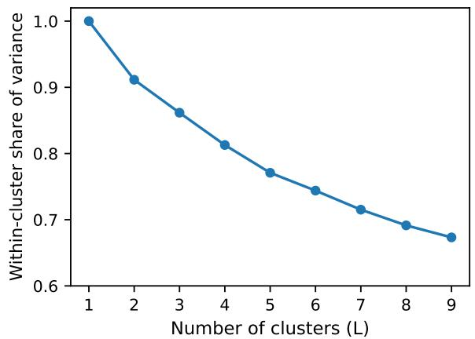  
(a) SVD-β (r = 50)

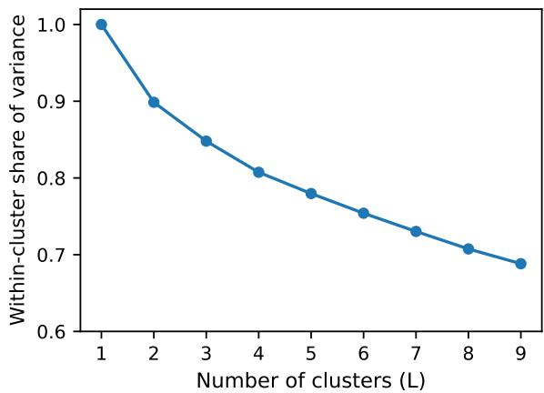  
(b) Corpus SGNS

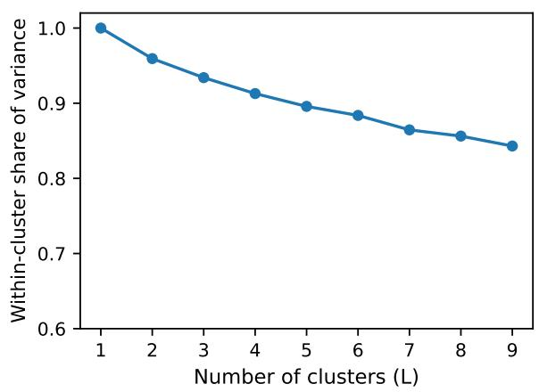  
(c) Corpus CBOW

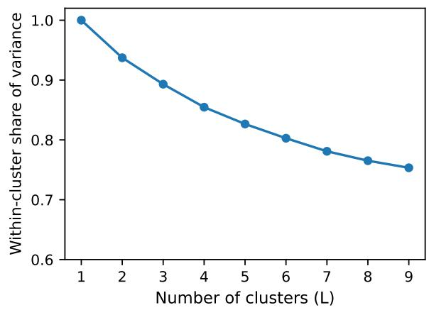

(d) Pretrained (Google News)  
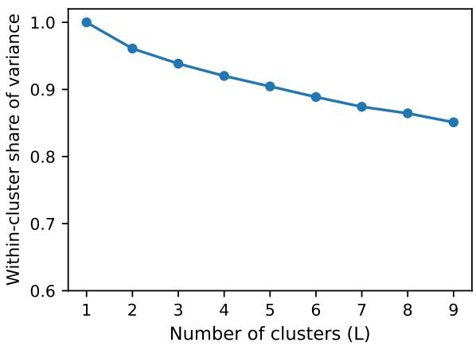  
(e) LLM embeddings

Online Appendix Figure OA.1: Within-cluster sum of squares as a function of the number of clusters L for each of the five embedding methods (363 CBSAs), normalized by the total sum of squares. For k-means the centroids are the cluster means, so $\mathrm { T S S } = \mathrm { W C S S } + \mathrm { B C S S }$ holds exactly and the plotted quantity is the share of embedding variance still within clusters; one minus it is the share the partition explains.

## B.4 Cluster Visualizations in UMAP Space

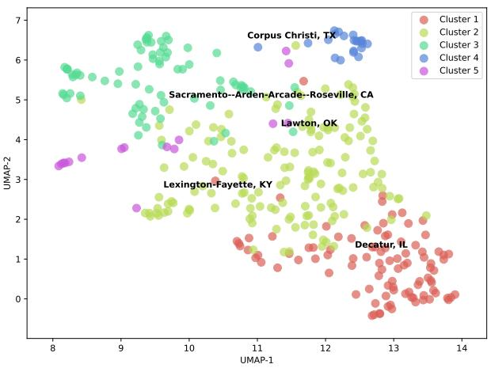  
(a) SVD-β (r = 50)

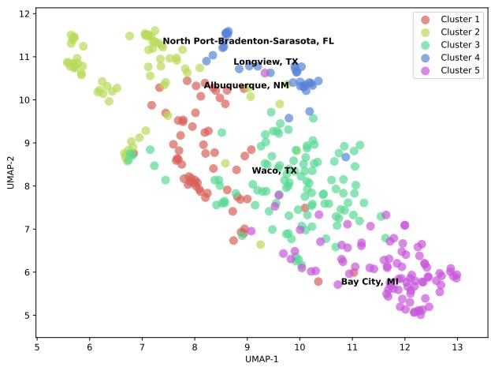  
(b) Corpus SGNS

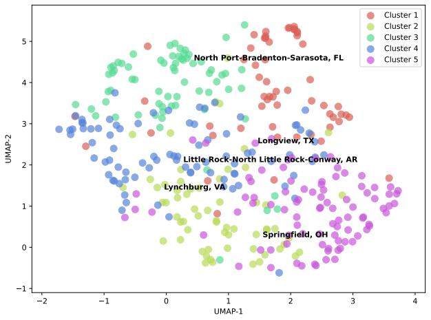  
(c) Corpus CBOW

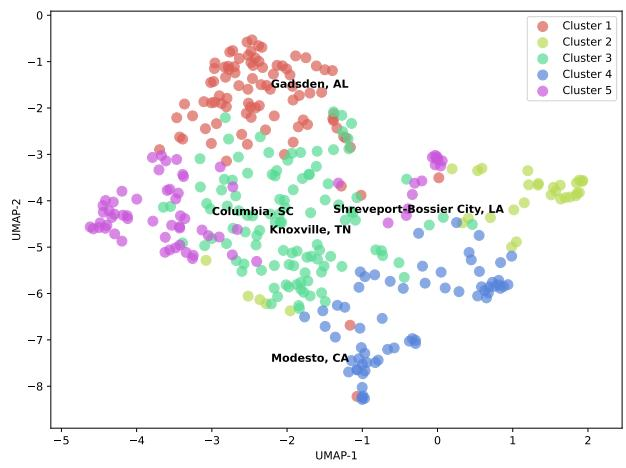

(d) Pretrained (Google News)  
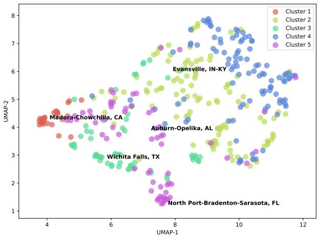  
(e) LLM embeddings

Online Appendix Figure OA.2: Document embeddings projected to two dimensions with UMAP (McInnes et al., 2018). Labels corresponds to the CBSA closest to that cluster's centroid in the full embedding space.

## B.5 Sensitivity to the Number of Clusters

Section 4 fixes $L = 5$ . Figure OA.3 sweeps $L \in \{ 2 , 3 , 4 , 5 , 6 , 8 , 1 0 \}$ for each method, recomputing the permutation floor at every L so the ratios are comparable down a column.

First, every method stays well above its floor at every $L ,$ so the finding that these groupings separate employment dynamics more sharply than chance is not an artifact of the cluster count.

Second, a text method leads at every L: LLM embeddings at $L = 2$ and $L = 6 , \mathrm { S V D } { - } \beta$ at $L = 3 , 4$ , and $8 ,$ corpus CBOW at $L = 6$ , corpus SGNS at $L = 5$ and 10. Residual k-means is below all five text methods at every L except $L = 8$ , and below all three corpus-based methods across the grid. Observables k-means tends to fall between residual k-means and the text-based methods.

We conclude that the ordering among the three corpus-based text methods is not stable across the grid. But the finding that text-based groupings separate employment dynamics better than our benchmarks does not depend on the cluster count.

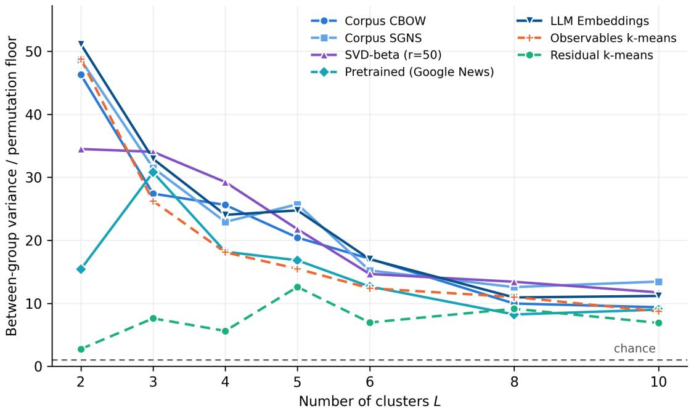  
Online Appendix Figure OA.3: Between-group variance of unit-specific $\mathrm { A R } ( 2 )$ impulse responses relative to the size-matched permutation floor, against the number of clusters L. The floor is recomputed at every $L ,$ so ratios are comparable along each line. Dashed lines represent the non-text benchmarks.

## B.6 Sensitivity to the Embedding Dimension

Remark 1 shows that any $r \geq K - 1$ recovers the same geometry in population, so the dimension needs only to be chosen large enough—which matters because K is not observable for this corpus. Figure OA.4 sweeps $r \in \{ 1 0 , 2 5 , 5 0 , 1 0 0 , 2 0 0 \}$ for the three corpus-based methods at the full-document window and $L = 5$

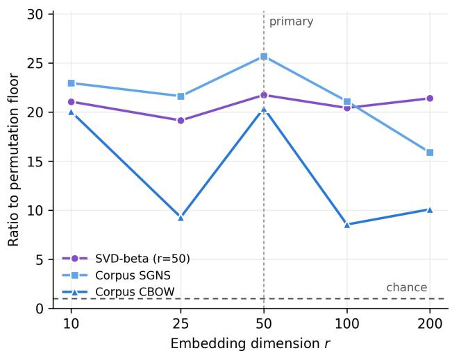

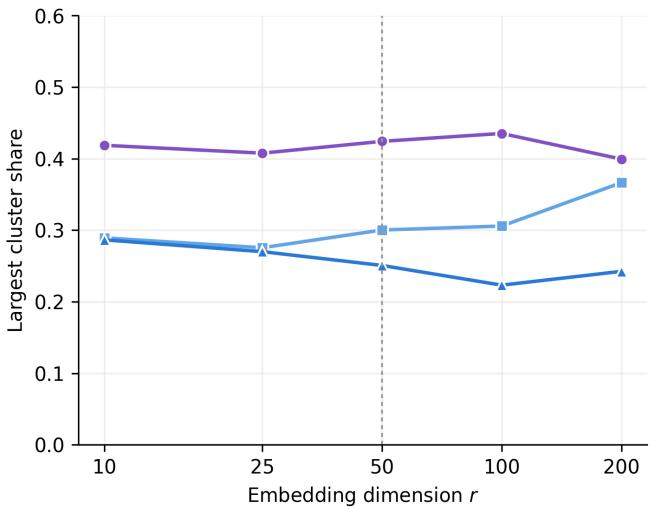  
Online Appendix Figure OA.4: Sensitivity to the embedding dimension r at $L = 5 , p = 2$ and the full-document window, for the three corpus-based methods. Left: between-group variance relative to the size-matched permutation floor. Right: share of CBSAs in the largest cluster. $\mathrm { S V D } { - \beta }$ and corpus SGNS are flat from $r = 1 0$ to $r = 2 0 0$ , which is what justifies the $r = 5 0$ primary specification (dotted) without identifying K. Corpus CBOW alternates between two families of near-equivalent k-means partitions.

$\mathrm { S V D } { - \beta }$ and corpus SGNS are flat across the entire range: neither ratio trends in $r ,$ and their partitions stay comparably balanced throughout. This is what Remark 1 predicts once $\widehat { R }$ is well estimated—coordinates beyond $K - 1$ contribute nothing in population and, at the full-document window, little in sample either. It justifies $r = 5 0$ without an estimate of $K$ any choice across this range would serve.

Corpus CBOW is not flat, but in this case it reflects the instability of k-means. For the CBOW embeddings, the algorithm is choosing among near-equivalent optima, and which one it lands on moves the between-group ratio by a factor of two.

## B.7 Sensitivity to the Autoregressive Order

The AR order $p$ is a nuisance parameter of the same kind as the cluster number $L ,$ context window J and embedding dimension r. In this section I explore the choice of $p .$

Figure OA.5 shows the share of cross-city IRF dispersion attributable to estimation error. To compute this, I hold the DGP fixed at a common-slope $A R ( { 8 } )$ whose coefficients are the pooled FE estimates on the same panel, and whose innovations are each unit's own $A R ( { 8 } )$ residuals resampled $i . i . d .$ The fitted model is then $A R ( p )$ , unit by unit, on the simulated paths, averaged over 20 replications. Cross-city IRF dispersion is defined as the mean squared deviation from the cross-unit mean response, horizon by horizon, and Figure OA.5 depicts the ratio between the simulated dipersion (under homogeneity) and the dispersion observed in the data.

On that benchmark the share is minimised at $p = 2 \ ( 7 4 \% )$ and is at least $9 4 \%$ at every other order, reaching 100% at $p = 5$ and exceeding it from $p = 6$ . One note of caution: We redraw innovations independently across units; employment shocks are not (and likely positively correlated). That would bias all depicted ratios up and may be why the share exceeds 100% from $p = 5$ on.

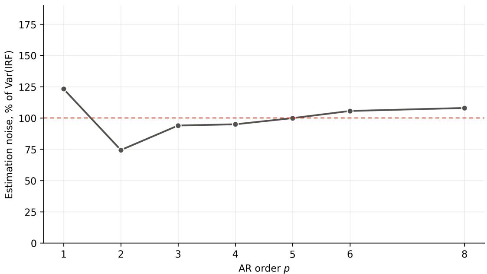  
Online Appendix Figure OA.5: Share of total cross-city IRF variance attributable to estimation error, against the autoregressive order $p .$ The benchmark holds the DGP fixed at a common-slope $\operatorname { A R } ( 8 )$ and fits $\operatorname { A R } ( p )$ to the simulated paths. The dashed line marks the point at which the simulated data generates as much dispersion as the observed data.

Figure OA.6 depicts the ratio from Table 4 for different values of $p .$ Seven of the eight approaches peak at $p = 2$ , though they all remain above 1 throughout.

We thus read $p = 2$ as the best low-dimensional projection of the dynamics for crosssectional comparison rather than as a correctly specified model: the pooled panel clearly wants more lags, but fitting them spends per-unit degrees of freedom that a $T = 5 1$ series does not have, and a parsimonious fit concentrates whatever genuine heterogeneity exists into few well-estimated coefficients instead of dispersing it across many noisy ones.

One caveat applies to both figures. The Nickell bias in $\hat { \rho }$ is $O ( 1 / T )$ , but the horizon-h impulse response is a compounding function of it, so the bias in the object plotted here is of order $h / T ;$ at $h = 1 0$ and $T = 5 1$ that is not negligible. Correcting it—by split-panel jackknife or an analytic adjustment—would plausibly shift the levels in both at the expense of even noisier estimates. We leave this for future work.

## B.8 Sensitivity to the Context Window

Section 4 uses the full document as context for both corpus-trained arms and ${ \mathrm { S V D } } { \cdot } \beta ,$ on the grounds that positions within a document are exchangeable under the model, so R does not depend on the window in population. Figure OA.7 tests that choice against $J \in \{ 5 , 1 0 , 2 0 , 5 0 \}$ holding $L = 5$

Neither corpus CBOW nor corpus SGNS exhibit a clear trend. SVD-β does trend. It holds $2 1 . 8 \times$ at the full document and $2 1 . 7 \times$ at $J = 5 0$ , but falls to $1 2 . 1 \times$ at $J = 5$ —roughly half.

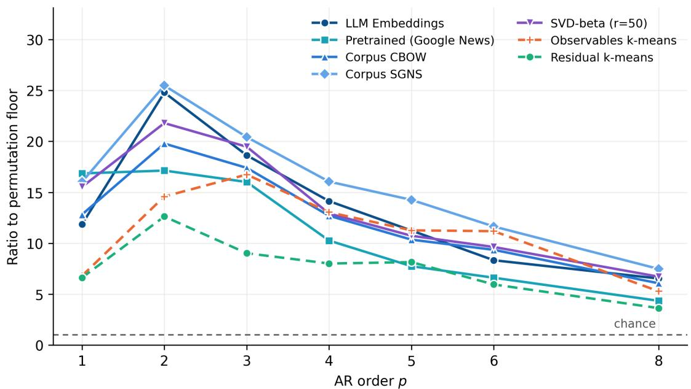  
Online Appendix Figure OA.6: Between-group variance of the unit-specific IRFs relative to the size-matched permutation floor, against the autoregressive order $p ,$ at $L = 5$ . Chance is at 1×. Dashed lines represent the two non-text benchmarks.

This is in line with our findings from our numerical exercise: With V in the low thousands, $\widehat { R }$ has on the order of six million cells, and the ordered word-context pairs the 363 descriptions supply fall from roughly eighty million at the full-document window to a few million at J = 5. With that sample size the estimated SVD-β embeddings start to become somewhat noisier, reflecting the difficulty in directly matrix-factorizing the noisy sample co-occurrence structure.

One implementation detail matters for reading the two Word2Vec lines: gensim's window parameter is a maximum, not a fixed width. For each token the effective window is drawn uniformly between one and that maximum, which is equivalent to weighting contexts by their distance from the focus word (Levy et al., 2015). Any direct comparison to SVD-β based on Figure OA.7 is thus to be treated with caution.

## B.9 Dating the Observables: Covariate Vintage

The covariate set consists of ten variables, all at the CBSA level. Four are employment shares—manufacturing, total government, military, and federal civilian. Three are population shares—foreign-born, Black, and Hispanic. Two are education shares—the share with no high-school diploma and the share with a four-year college degree. The tenth covariate is population per square mile. We standardize each to mean zero and unit variance and then apply k-means with L = 5 (k-means++, 500 restarts, seed 42).

The observables benchmark in Section 4.1 clusters CBSAs on covariates measured at a single Census vintage. We take 1970 as the primary specification: it is the only vintage that is effectively predetermined, being measured one year into a fifty-one-year panel. In this section, I sweep the vintage to measure the contamination induced by using concurrent Census vintages. Table OA.1 reports the sweep.Population density enters at 1970 throughout, being

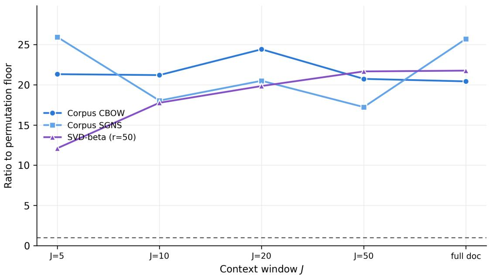  
Online Appendix Figure OA.7: Sensitivity to the context window J at $L \ = \ 5$ and $p = 2$ Between-group variance of the unit-specific IRFs relative to the size-matched permutation floor, with chance at $1 \times$ .The $\mathrm { S V D } { - \beta }$ ratio falls by about half as the window narrows to $J = 5 ;$ neither corpus-trained arm trends either way.

the only vintage available. The other nine (industry-mix, demographic and education shares) are avilable at 1970, 1980, 1990 and 2000 with complete coverage of the 363 CBSAs.
<table><tr><td>Vintage</td><td>Years elapsed</td><td>Var(Between)</td><td>Ratio</td><td>Max share</td></tr><tr><td>1970</td><td>1</td><td>0.0209</td><td>15.5×</td><td>36%</td></tr><tr><td>1980</td><td>11</td><td>0.0238</td><td>17.2×</td><td>46%</td></tr><tr><td>1990</td><td>21</td><td>0.0243</td><td>17.4×</td><td>44%</td></tr><tr><td>2000</td><td>31</td><td>0.0248</td><td>18.6×</td><td>41%</td></tr></table>

Online Appendix Table OA.1: Observables benchmark at each Census vintage, $L = 5$ and $p = 2$ “Years elapsed" is the number of years of the 1969–2019 outcome window already observed at the measurement date. $^ { 6 6 } \mathrm { R a t i o } ^ { 9 9 }$ is between-group variance over the size-matched permutation floor. All nine covariates are complete at every vintage; population density enters at 1970 throughout, being the only vintage available.

The ratio rises monotonically in the vintage, from 15.5× the permutation floor at 1970 to 18.6× at 2000—a gain of about 20% from dating the same nine covariates thirty years later.

We read this as a measurement of look-ahead: later measurement is itself partly an outcome of the dynamics being explained. On this metric the advantage is worth roughly a fifth of the benchmark's apparent performance. That matters beyond the choice of covariates, because the same objection applies to the text. The descriptions span 1979–2019 and so are concurrent with the outcome window rather than predetermined, a limitation Section 4 states but cannot quantify. The vintage sweep gives an order of magnitude for what such concurrency can buy— roughly 20% here—which is well short of the margin by which the text-based groupings exceed the benchmark.

## B.10 Interpreting the Clusters

Table OA.2 reports the cluster assignment for each of the 363 CBSAs under seven clustering approaches. Clusters are numbered 1-5 within each method; descriptions for the text-based methods follow below. Figure OA.8 shows the geographic distribution of cluster assignments across the continental United States.

Online Appendix Table OA.2: Cluster assignments for all 363 CBSAs: corpus CBOW (CB), corpus SGNS (CS), closed-form SVD-β at r = 50 (SB), pretrained Google News vectors (PW), LLM embedding (LE, k-means on OpenAI text-embedding-3-large), residual k-means (RK, k-means on pooled AR(2) residuals from Section 4.1), and observables k-means (OB, on the 1970 covariates of Section 4.1).Numeric labels correspond to the cluster descriptions below the table.
<table><tr><td colspan="2"></td><td colspan="8">Clustering Method</td></tr><tr><td colspan="2">CBSA</td><td>State</td><td>CB</td><td>CS</td><td>SB</td><td>PW</td><td>LE</td><td>RK</td><td>OB</td></tr><tr><td>Abilene</td><td>TX</td><td></td><td>4</td><td>3</td><td>2</td><td>3</td><td>3</td><td>2</td><td>2</td></tr><tr><td>Akron</td><td></td><td>OH</td><td>5</td><td>5</td><td>1</td><td>1</td><td>4</td><td>1</td><td>4</td></tr><tr><td>Albany</td><td></td><td>GA</td><td>2</td><td>3</td><td>2</td><td>3</td><td>2</td><td>1</td><td>3</td></tr><tr><td>Albany-Schenectady-Troy</td><td></td><td>NY</td><td>5</td><td>3</td><td>2</td><td>5</td><td>5</td><td>3</td><td>2</td></tr><tr><td>Albuquerque</td><td></td><td>NM</td><td>3</td><td>1</td><td>2</td><td>5</td><td>3</td><td>3</td><td>2</td></tr><tr><td>Alexandria</td><td></td><td>LA</td><td>4</td><td>3</td><td>2</td><td>5</td><td>3</td><td>3</td><td>3</td></tr><tr><td>Allentown-Bethlehem-Easton</td><td></td><td>PA-NJ</td><td>5</td><td>5</td><td>1</td><td>1</td><td>4</td><td>1</td><td>4</td></tr><tr><td>Altoona</td><td></td><td>PA</td><td>5</td><td>5</td><td>1</td><td>1</td><td>4</td><td>3</td><td>4</td></tr><tr><td>Amarillo</td><td>TX</td><td></td><td>4</td><td>3</td><td>2</td><td>3</td><td>3</td><td>3</td><td>2</td></tr><tr><td>Ames</td><td>IA</td><td></td><td>4</td><td>1</td><td>2</td><td>5</td><td>2</td><td>3</td><td>2</td></tr><tr><td>Anderson</td><td>IN</td><td></td><td>5 5</td><td></td><td>1</td><td>1</td><td>4</td><td>4</td><td>4</td></tr><tr><td>Anderson</td><td>SC</td><td>2</td><td>3</td><td>1</td><td></td><td>1</td><td>4</td><td>4</td><td>4</td></tr><tr><td>Ann Arbor</td><td>MI</td><td>4</td><td>1</td><td>2</td><td></td><td>5</td><td>2</td><td>4</td><td>2</td></tr><tr><td>Anniston-Oxford</td><td>AL</td><td>5</td><td>4</td><td>5</td><td></td><td>1</td><td>2</td><td>3</td><td>3</td></tr><tr><td>Appleton</td><td>WI</td><td>5</td><td>3</td><td>1</td><td></td><td>1</td><td>4</td><td>1</td><td>4</td></tr><tr><td>Asheville</td><td>NC</td><td>3</td><td>2</td><td>3</td><td></td><td>3</td><td>2</td><td>4</td><td>4</td></tr><tr><td>Athens-Clarke County</td><td>GA</td><td>2</td><td>3</td><td>2</td><td></td><td>5</td><td>2</td><td>1</td><td>3</td></tr><tr><td>Atlanta-Sandy Springs-Marietta</td><td>GA</td><td>2</td><td>1</td><td>2</td><td></td><td>3</td><td>5</td><td>1</td><td>3</td></tr><tr><td>Atlantic City-Hammonton</td><td>NJ</td><td>5</td><td>5</td><td>1</td><td></td><td>4</td><td>5</td><td>1</td><td>3</td></tr><tr><td>Auburn-Opelika</td><td>AL</td><td>2</td><td>3</td><td>2</td><td></td><td>3</td><td>2</td><td>1</td><td>3</td></tr><tr><td>Augusta-Richmond County</td><td>GA-SC</td><td>2</td><td>3</td><td>2</td><td></td><td>3</td><td>2</td><td>3</td><td>3</td></tr><tr><td>Austin-Round Rock-San Marcos</td><td>TX</td><td>4</td><td>1</td><td>2</td><td></td><td>5</td><td>5</td><td>1</td><td>2</td></tr><tr><td>Bakersfield-Delano</td><td>CA</td><td>1</td><td>2</td><td>3</td><td></td><td>4</td><td>1</td><td>3</td><td>2</td></tr><tr><td>Baltimore-Towson</td><td>MD</td><td>2</td><td>3</td><td></td><td>2</td><td>5</td><td>2</td><td>3</td><td>3</td></tr><tr><td>Bangor</td><td>ME</td><td></td><td>2</td><td>3</td><td>2</td><td>3</td><td>2</td><td>3</td><td>4</td></tr></table>

Continued on next page

Table OA.2 continued
<table><tr><td>CBSA</td><td>State</td><td>CB</td><td>CS</td><td>SB</td><td>PW</td><td>LE</td><td>RK</td><td>OB</td></tr><tr><td>Barnstable Town</td><td>MA</td><td>3</td><td>2</td><td>3</td><td>4</td><td>5</td><td>1</td><td>2</td></tr><tr><td>Baton Rouge</td><td>LA</td><td>1</td><td>4</td><td>4</td><td>2</td><td>3</td><td>3</td><td>3</td></tr><tr><td>Battle Creek</td><td>MI</td><td>5</td><td>5</td><td>1</td><td>1</td><td>4</td><td>4</td><td>4</td></tr><tr><td>Bay City</td><td>MI</td><td>5</td><td>5</td><td>1</td><td>1</td><td>4</td><td>4</td><td>4</td></tr><tr><td>Beaumont-Port Arthur</td><td>TX</td><td>1</td><td>4</td><td>4</td><td>2</td><td>3</td><td>2</td><td>3</td></tr><tr><td>Bellingham</td><td>WA</td><td>3</td><td>2</td><td>3</td><td>4</td><td>2</td><td>3</td><td>2</td></tr><tr><td>Bend</td><td>OR</td><td>3</td><td>2</td><td>3</td><td>4</td><td>5</td><td>4</td><td>2</td></tr><tr><td>Billings</td><td>MT</td><td>4</td><td>3</td><td>2</td><td>2</td><td>3</td><td>3</td><td>2</td></tr><tr><td>Binghamton</td><td>NY</td><td>5</td><td>5</td><td>1</td><td>1</td><td>4</td><td>3</td><td>4</td></tr><tr><td>Birmingham-Hoover</td><td>AL</td><td>2</td><td>3</td><td>2</td><td>1</td><td>2</td><td>3</td><td>3</td></tr><tr><td>Bismarck</td><td>ND</td><td>4</td><td>3</td><td>2</td><td>2</td><td>3</td><td>3</td><td>2</td></tr><tr><td>Blacksburg-Christiansburg-Radford</td><td>VA</td><td>4</td><td>3</td><td>2</td><td>5</td><td>2</td><td>1</td><td>4</td></tr><tr><td>Bloomington</td><td>IN</td><td>4</td><td>1</td><td>2</td><td>5</td><td>2</td><td>3</td><td>2</td></tr><tr><td>Bloomington-Normal</td><td>IL</td><td>5</td><td>1</td><td>2</td><td>5</td><td>2</td><td>3</td><td>2</td></tr><tr><td>Boise City-Nampa</td><td>ID</td><td>4</td><td>1</td><td>2</td><td>3</td><td>5</td><td>3</td><td>2</td></tr><tr><td>Boston-Cambridge-Quincy</td><td>MA-NH</td><td>3</td><td>1</td><td>2</td><td>5</td><td>5</td><td>1</td><td>5</td></tr><tr><td>Boulder</td><td>CO</td><td>4</td><td>1</td><td>2</td><td>5</td><td>5</td><td>1</td><td>2</td></tr><tr><td>Bowling Green</td><td>KY</td><td>4</td><td>3</td><td>2</td><td>3</td><td>2</td><td>4</td><td>4</td></tr><tr><td>Bremerton-Silverdale</td><td>WA</td><td>1</td><td>4</td><td>5</td><td>5</td><td>3</td><td>3</td><td>1</td></tr><tr><td>Bridgeport-Stamford-Norwalk</td><td>CT</td><td>2</td><td>5</td><td>1</td><td>3</td><td>5</td><td>1</td><td>5</td></tr><tr><td>Brownsville-Harlingen</td><td>TX</td><td>1</td><td>2</td><td>3</td><td>4</td><td>3</td><td>3</td><td>5</td></tr><tr><td>Brunswick</td><td>GA</td><td>2</td><td>3</td><td>3</td><td>3</td><td>2</td><td>1</td><td>3</td></tr><tr><td>Buffalo-Niagara Falls</td><td>NY</td><td>5</td><td>5</td><td>1</td><td>1</td><td>4</td><td>3</td><td>5</td></tr><tr><td>Burlington</td><td>NC</td><td>2</td><td>5</td><td>1</td><td>3</td><td>2</td><td>1</td><td>4</td></tr><tr><td>Burlington-South Burlington</td><td>VT</td><td>4</td><td>1</td><td>2</td><td>5</td><td>5</td><td>1</td><td>2</td></tr><tr><td>Canton-Massillon</td><td>OH</td><td>5</td><td>5</td><td>1</td><td>1</td><td>4</td><td>1</td><td>4</td></tr><tr><td>Cape Coral-Fort Myers</td><td>FL</td><td>3</td><td>2</td><td>3</td><td>4</td><td>5</td><td>1</td><td>2</td></tr><tr><td>Cape Girardeau-Jackson</td><td>MO-IL</td><td>4</td><td>3</td><td>2</td><td>3</td><td>2</td><td>3</td><td>4</td></tr><tr><td>Carson City</td><td>NV</td><td>4</td><td>3</td><td>2</td><td>5</td><td>2</td><td>4</td><td>2</td></tr><tr><td>Casper</td><td>WY</td><td>4</td><td>4</td><td>4</td><td>2</td><td>3</td><td>2</td><td>2</td></tr><tr><td>Cedar Rapids</td><td>IA</td><td>4</td><td>3</td><td>2</td><td>3</td><td>2</td><td>3</td><td>4</td></tr><tr><td>Champaign-Urbana</td><td>IL</td><td>4</td><td>1</td><td>2</td><td>5</td><td>2</td><td>3</td><td>2</td></tr><tr><td>Charleston</td><td>WV</td><td>5</td><td>5</td><td>1</td><td>1</td><td>4</td><td>3</td><td>4</td></tr><tr><td>Charleston-North Charleston-Summerville</td><td>SC</td><td>3</td><td>1</td><td>2</td><td>3</td><td>5</td><td>3</td><td>1</td></tr><tr><td>Charlotte-Gastonia-Rock Hill</td><td>NC-SC</td><td>2</td><td>3</td><td>2</td><td>3</td><td>5</td><td>1</td><td>4</td></tr><tr><td>CBSA</td><td>State</td><td>CB</td><td>CS</td><td>SB PW</td><td></td><td>LE</td><td>RK</td><td>OB</td></tr><tr><td>Charlottesville</td><td>VA</td><td>3</td><td>1</td><td>2</td><td>5</td><td>2</td><td>1</td><td>3</td></tr><tr><td>Chattanooga</td><td>TN-GA</td><td>2</td><td>5</td><td>1</td><td>3</td><td>4</td><td>4</td><td>4</td></tr><tr><td>Cheyenne</td><td>WY</td><td>1</td><td>4</td><td>2</td><td>2</td><td>3</td><td>3</td><td>2</td></tr><tr><td>Chicago-Joliet-Naperville</td><td>IL-IN-WI</td><td>2</td><td>5</td><td>1</td><td>3</td><td>4</td><td>1</td><td>5</td></tr><tr><td>Chico</td><td>CA</td><td>4</td><td>2</td><td>3</td><td>4</td><td>1</td><td>3</td><td>2</td></tr><tr><td>Cincinnati-Middletown</td><td>OH-KY-IN</td><td>2</td><td>3</td><td>2</td><td>3</td><td>4</td><td>1</td><td>4</td></tr><tr><td>Clarksville</td><td>TN-KY</td><td>1</td><td>4</td><td>5</td><td>3</td><td>3</td><td>4</td><td>1</td></tr><tr><td>Cleveland</td><td>TN</td><td>2</td><td>3</td><td>2</td><td>3</td><td>2</td><td>4</td><td>4</td></tr><tr><td>Cleveland-Elyria-Mentor</td><td>OH</td><td>5</td><td>5</td><td>1</td><td>1</td><td>4</td><td>1</td><td>5</td></tr><tr><td>Coeur d’Alene</td><td>ID</td><td>3</td><td>2</td><td>3</td><td>4</td><td>5</td><td>4</td><td>2</td></tr><tr><td>College Station-Bryan</td><td>TX</td><td>4</td><td>1</td><td>2</td><td>5</td><td>3</td><td>2</td><td>3</td></tr><tr><td>Colorado Springs</td><td>CO</td><td>4</td><td>4</td><td>5</td><td>5</td><td>3</td><td>1</td><td>1</td></tr><tr><td>Columbia</td><td>MO</td><td>4</td><td>3</td><td>2</td><td>5</td><td>2</td><td>3</td><td>2</td></tr><tr><td>Columbia</td><td>SC</td><td>2</td><td>3</td><td>2</td><td>5</td><td>2</td><td>1</td><td>3</td></tr><tr><td>Columbus</td><td>GA-AL</td><td>2</td><td>3</td><td>2</td><td>3</td><td>2</td><td>3</td><td>1</td></tr><tr><td>Columbus</td><td>IN</td><td>4</td><td>5</td><td>1</td><td>1</td><td>4</td><td>4</td><td>4</td></tr><tr><td>Columbus</td><td>OH</td><td>4</td><td>3</td><td>2</td><td>3</td><td>2</td><td>1</td><td>2</td></tr><tr><td>Corpus Christi</td><td>TX</td><td>1</td><td>4</td><td>4</td><td>2</td><td>3</td><td>2</td><td>2</td></tr><tr><td>Corvallis</td><td>OR</td><td>4</td><td>1</td><td>2</td><td>5</td><td>2</td><td>3</td><td>2</td></tr><tr><td>Crestview-Fort Walton Beach-Destin</td><td>FL</td><td>3</td><td>2</td><td>3</td><td>4</td><td>5</td><td>3</td><td>1</td></tr><tr><td>Cumberland</td><td>MD-WV</td><td>5</td><td>5</td><td>1</td><td>3</td><td>4</td><td>3</td><td>4</td></tr><tr><td>Dallas-Fort Worth-Arlington</td><td>TX</td><td>4</td><td>1</td><td>2</td><td>3</td><td>5</td><td>1</td><td>4</td></tr><tr><td>Dalton</td><td>GA</td><td>5</td><td>5</td><td>1</td><td>1</td><td>4</td><td>4</td><td>4</td></tr><tr><td>Danville</td><td>IL</td><td>5</td><td>5</td><td>1</td><td>1</td><td>4</td><td>4</td><td>4</td></tr><tr><td>Danville</td><td>VA</td><td>5</td><td>5</td><td>1</td><td>1</td><td>4</td><td>4</td><td>3</td></tr><tr><td>Davenport-Moline-Rock Island</td><td>IA-IL</td><td>5</td><td>5</td><td>1</td><td>1</td><td>4</td><td>3</td><td>4</td></tr><tr><td>Dayton</td><td>OH</td><td>5</td><td>5</td><td>1</td><td>1</td><td>4</td><td>1</td><td>4</td></tr><tr><td>Decatur</td><td>AL</td><td>5</td><td>5</td><td>1</td><td>1</td><td>4</td><td>1</td><td>4</td></tr><tr><td>Decatur</td><td>IL</td><td>5</td><td>5</td><td>1</td><td>1</td><td>4</td><td>3</td><td>4</td></tr><tr><td>Deltona-Daytona Beach-Ormond Beach</td><td>FL</td><td>3</td><td>2</td><td>3</td><td>4</td><td>5</td><td>1</td><td>2</td></tr><tr><td>Denver-Aurora-Broomfield</td><td>CO</td><td>4</td><td>1</td><td>4</td><td>2</td><td>5</td><td>1</td><td>2</td></tr><tr><td>Des Moines-West Des Moines</td><td>IA</td><td>4</td><td>1</td><td>2</td><td>3</td><td>5</td><td>3</td><td>2</td></tr><tr><td>Detroit-Warren-Livonia</td><td>MI</td><td>5</td><td>5</td><td>1</td><td>1</td><td>4</td><td>4</td><td>5</td></tr><tr><td>Dothan</td><td>AL</td><td>2</td><td>3</td><td>2</td><td>3</td><td>2</td><td>4</td><td>3</td></tr><tr><td>Dover</td><td>DE</td><td>1</td><td>3</td><td>2</td><td>5</td><td>2</td><td>3</td><td>1</td></tr><tr><td>CBSA</td><td>State</td><td>CB</td><td>CS</td><td>SB</td><td>PW</td><td>LE</td><td>RK</td><td>OB</td></tr><tr><td>Dubuque</td><td>IA</td><td>4</td><td>3</td><td>2</td><td>1</td><td>4</td><td>3</td><td>4</td></tr><tr><td>Duluth</td><td>MN-WI</td><td>5</td><td>5</td><td>1</td><td>1</td><td>4</td><td>3</td><td>2</td></tr><tr><td>Durham-Chapel Hill</td><td>NC</td><td>4</td><td>1</td><td>2</td><td>5</td><td>2</td><td>3</td><td>3</td></tr><tr><td>Eau Claire</td><td>WI</td><td>4</td><td>3</td><td>2</td><td>3</td><td>2</td><td>3</td><td>4</td></tr><tr><td>El Centro</td><td>CA</td><td>1</td><td>2</td><td>3</td><td>4</td><td>1</td><td>3</td><td>5</td></tr><tr><td>Elizabethtown</td><td>KY</td><td>1</td><td>3</td><td>2</td><td>3</td><td>2</td><td>3</td><td>1</td></tr><tr><td>Elkhart-Goshen</td><td>IN</td><td>4</td><td>2</td><td>2</td><td>1</td><td>4</td><td>4</td><td>4</td></tr><tr><td>Elmira</td><td>NY</td><td>5</td><td>5</td><td>1</td><td>1</td><td>4</td><td>1</td><td>4</td></tr><tr><td>El Paso</td><td>TX</td><td>1</td><td>2</td><td>2</td><td>1</td><td>3</td><td>3</td><td>5</td></tr><tr><td>Erie</td><td>PA</td><td>5</td><td>5</td><td>1</td><td>1</td><td>4</td><td>3</td><td>4</td></tr><tr><td>Eugene-Springfield</td><td>OR</td><td>4</td><td>3</td><td>3</td><td>4</td><td>2</td><td>4</td><td>2</td></tr><tr><td>Evansville</td><td>IN-KY</td><td>2</td><td>5</td><td>1</td><td>3</td><td>4</td><td>3</td><td>4</td></tr><tr><td>Fargo</td><td>ND-MN</td><td>4</td><td>1</td><td>2</td><td>3</td><td>2</td><td>3</td><td>2</td></tr><tr><td>Farmington</td><td>NM</td><td>1</td><td>4</td><td>4</td><td>2</td><td>3</td><td>2</td><td>2</td></tr><tr><td>Fayetteville</td><td>NC</td><td>1</td><td>4</td><td>5</td><td>5</td><td>3</td><td>3</td><td>1</td></tr><tr><td>Fayetteville-Springdale-Rogers</td><td>AR-MO</td><td>4</td><td>1</td><td>2</td><td>3</td><td>2</td><td>1</td><td>4</td></tr><tr><td>Flagstaff</td><td>AZ</td><td>3</td><td>2</td><td>3</td><td>4</td><td>2</td><td>1</td><td>2</td></tr><tr><td>Flint</td><td>MI</td><td>5</td><td>5</td><td>1</td><td>1</td><td>4</td><td>4</td><td>4</td></tr><tr><td>Florence</td><td>SC</td><td>2</td><td>3</td><td>2</td><td>3</td><td>2</td><td>1</td><td>3</td></tr><tr><td>Florence-Muscle Shoals</td><td>AL</td><td>5</td><td>3</td><td>1</td><td>3</td><td>2</td><td>3</td><td>4</td></tr><tr><td>Fond du Lac</td><td>WI</td><td>4</td><td>3</td><td>2</td><td>1</td><td>4</td><td>3</td><td>4</td></tr><tr><td>Fort Collins-Loveland</td><td>CO</td><td>4</td><td>1</td><td>2</td><td>3</td><td>5</td><td>1</td><td>2</td></tr><tr><td>Fort Smith</td><td>AR-OK</td><td>5</td><td>5</td><td>1</td><td>1</td><td>4</td><td>4</td><td>4</td></tr><tr><td>Fort Wayne</td><td>IN</td><td>5</td><td>5</td><td>1</td><td>3</td><td>4</td><td>4</td><td>4</td></tr><tr><td>Fresno</td><td>CA</td><td>1</td><td>2</td><td>3</td><td>4</td><td>1</td><td>3</td><td>2</td></tr><tr><td>Gadsden</td><td>AL</td><td>5</td><td>5</td><td>1</td><td>1</td><td>4</td><td>4</td><td>4</td></tr><tr><td>Gainesville</td><td>FL</td><td>4</td><td>1</td><td>2</td><td>5</td><td>2</td><td>1</td><td>2</td></tr><tr><td>Gainesville</td><td>GA</td><td>3</td><td>2</td><td>3</td><td>3</td><td>2</td><td>1</td><td>4</td></tr><tr><td>Glens Falls</td><td>NY</td><td>5</td><td>3</td><td>2</td><td>3</td><td>4</td><td>3</td><td>4</td></tr><tr><td>Goldsboro</td><td>NC</td><td>1</td><td>3</td><td>2</td><td>4</td><td>3</td><td>3</td><td>3</td></tr><tr><td>Grand Forks</td><td>ND-MN</td><td>4</td><td>3</td><td>2</td><td>3</td><td>3</td><td>3</td><td>5</td></tr><tr><td>Grand Junction</td><td>CO</td><td>4</td><td>2</td><td>4</td><td>2</td><td>3</td><td>2</td><td>2</td></tr><tr><td>Grand Rapids-Wyoming</td><td>MI</td><td>4</td><td>1</td><td>2</td><td>3</td><td>4</td><td>4</td><td>4</td></tr><tr><td>Great Falls</td><td>MT</td><td>4</td><td>3</td><td>2</td><td>2</td><td>3</td><td>3</td><td>2</td></tr><tr><td>Greeley</td><td>CO</td><td>1</td><td>2</td><td>4</td><td>2</td><td>3</td><td>1</td><td>2</td></tr><tr><td>Green Bay</td><td>WI</td><td>5</td><td>3</td><td>2</td><td>3</td><td>4</td><td>3</td><td>4</td></tr><tr><td>Greensboro-High Point</td><td>NC</td><td>2</td><td>5</td><td>1</td><td>1</td><td>4</td><td>4</td><td>4</td></tr><tr><td>Greenville</td><td>NC</td><td>2</td><td>3</td><td>2</td><td>3</td><td>2</td><td>3</td><td>3</td></tr><tr><td>Greenville-Mauldin-Easley</td><td>SC</td><td>2</td><td>5</td><td>1</td><td>3</td><td>4</td><td>1</td><td>4</td></tr><tr><td>Gulfport-Biloxi</td><td>MS</td><td>1</td><td>4</td><td>4</td><td>2</td><td>5</td><td>3</td><td>1</td></tr><tr><td>Hagerstown-Martinsburg</td><td>MD-WV</td><td>5</td><td>3</td><td>2</td><td>3</td><td>2</td><td>3</td><td>4</td></tr><tr><td>Hanford-Corcoran</td><td>CA</td><td>1</td><td>2</td><td>3</td><td>4</td><td>1</td><td>3</td><td>1</td></tr><tr><td>Harrisburg-Carlisle</td><td>PA</td><td>4</td><td>3</td><td>2</td><td>3</td><td>2</td><td>3</td><td>2</td></tr><tr><td>Harrisonburg</td><td>VA</td><td>4</td><td>3</td><td>2</td><td>3</td><td>2</td><td>3</td><td>4</td></tr><tr><td>Hartford-West Hartford-East Hartford</td><td>CT</td><td>5</td><td>1</td><td>2</td><td>1</td><td>5</td><td>1</td><td>5</td></tr><tr><td>Hattiesburg</td><td>MS</td><td>2</td><td>3</td><td>2</td><td>3</td><td>2</td><td>3</td><td>3</td></tr><tr><td>Hickory-Lenoir-Morganton</td><td>NC</td><td>5</td><td>5</td><td>1</td><td>1</td><td>4</td><td>4</td><td>4</td></tr><tr><td>Hinesville-Fort Stewart</td><td>GA</td><td>1</td><td>4</td><td>5</td><td>5</td><td>3</td><td>5</td><td>1</td></tr><tr><td>Holland-Grand Haven</td><td>MI</td><td>4</td><td>1</td><td>2</td><td>1</td><td>4</td><td>4</td><td>4</td></tr><tr><td>Hot Springs</td><td>AR</td><td>3</td><td>2</td><td>3</td><td>4</td><td>2</td><td>4</td><td>4</td></tr><tr><td>Houma-Bayou Cane-Thibodaux</td><td>LA</td><td>1</td><td>4</td><td>4</td><td>2</td><td>3</td><td>2</td><td>3</td></tr><tr><td>Houston-Sugar Land-Baytown</td><td>TX</td><td>4</td><td>4</td><td>4</td><td>2</td><td>3</td><td>2</td><td>3</td></tr><tr><td>Huntington-Ashland</td><td>WV-KY-OH</td><td>5</td><td>5</td><td>1</td><td>1</td><td>4</td><td>3</td><td>4</td></tr><tr><td>Huntsville</td><td>AL</td><td>2</td><td>1</td><td>5</td><td>5</td><td>2</td><td>1</td><td>1</td></tr><tr><td>Idaho Falls</td><td>ID</td><td>4</td><td>3</td><td>2</td><td>3</td><td>3</td><td>3</td><td>2</td></tr><tr><td>Indianapolis-Carmel</td><td>IN</td><td>2</td><td>5</td><td>2</td><td>3</td><td>4</td><td>1</td><td>4</td></tr><tr><td>Iowa City</td><td>IA</td><td>4</td><td>1</td><td>2</td><td>5</td><td>2</td><td>3</td><td>2</td></tr><tr><td>Ithaca</td><td>NY</td><td>4</td><td>1</td><td>2</td><td>5</td><td>2</td><td>3</td><td>2</td></tr><tr><td>Jackson</td><td>MI</td><td>5</td><td>5</td><td>1</td><td>1</td><td>4</td><td>4</td><td>4</td></tr><tr><td>Jackson</td><td>MS</td><td>2</td><td>3</td><td>2</td><td>5</td><td>2</td><td>1</td><td>3</td></tr><tr><td>Jackson</td><td>TN</td><td>2</td><td>3</td><td>2</td><td>3</td><td>2</td><td>4</td><td>3</td></tr><tr><td>Jacksonville</td><td>FL</td><td>2</td><td>1</td><td>2</td><td>3</td><td>2</td><td>1</td><td>3</td></tr><tr><td>Jacksonville</td><td>NC</td><td>1</td><td>4</td><td>5</td><td>5</td><td>3</td><td>3</td><td>1</td></tr><tr><td>Janesville</td><td>WI</td><td>5</td><td>5</td><td>1</td><td>1</td><td>4</td><td>4</td><td>4</td></tr><tr><td>Jefferson City</td><td>MO</td><td>4</td><td>3</td><td>2</td><td>5</td><td>2</td><td>3</td><td>2</td></tr><tr><td>Johnson City</td><td>TN</td><td>2</td><td>3</td><td>2</td><td>3</td><td>2</td><td>4</td><td>4</td></tr><tr><td>Johnstown</td><td>PA</td><td>5</td><td>5</td><td>1</td><td>1</td><td>4</td><td>3</td><td>4</td></tr><tr><td>Jonesboro</td><td>AR</td><td>2</td><td>3</td><td>2</td><td>3</td><td>2</td><td>3</td><td>4</td></tr><tr><td>Joplin</td><td>MO</td><td>5</td><td>3</td><td>2</td><td>3</td><td>2</td><td>4</td><td>4</td></tr><tr><td>Kalamazoo-Portage</td><td>MI</td><td>5</td><td>1</td><td>2</td><td>3</td><td>2</td><td>3</td><td>4</td></tr><tr><td>Kankakee-Bradley</td><td>IL</td><td>5</td><td>5</td><td>1</td><td>3</td><td>4</td><td>3</td><td>4</td></tr><tr><td>Kansas City</td><td>MO-KS</td><td>4</td><td>3</td><td>2</td><td>3</td><td>2</td><td>1</td><td>2</td></tr><tr><td>Kennewick-Pasco-Richland</td><td>WA</td><td>1</td><td>2</td><td>2</td><td>4</td><td>3</td><td>3</td><td>2</td></tr><tr><td>Killeen-Temple-Fort Hood</td><td>TX</td><td>1</td><td>4</td><td>5</td><td>5</td><td>3</td><td>3</td><td>1</td></tr><tr><td>Kingsport-Bristol-Bristol</td><td>TN-VA</td><td>5</td><td>5</td><td>1</td><td>3</td><td>4</td><td>3</td><td>4</td></tr><tr><td>Kingston</td><td>NY</td><td>3</td><td>5</td><td>1</td><td>1</td><td>4</td><td>3</td><td>4</td></tr><tr><td>Knoxville</td><td>TN</td><td>2</td><td>3</td><td>2</td><td>3</td><td>2</td><td>3</td><td>4</td></tr><tr><td>Kokomo</td><td>IN</td><td>5</td><td>5</td><td>1</td><td>1</td><td>4</td><td>4</td><td>4</td></tr><tr><td>La Crosse</td><td>WI-MN</td><td>4</td><td>3</td><td>2</td><td>3</td><td>2</td><td>3</td><td>4</td></tr><tr><td>Lafayette</td><td>IN</td><td>4</td><td>1</td><td>2</td><td>1</td><td>4</td><td>3</td><td>2</td></tr><tr><td>Lafayette</td><td>LA</td><td>4</td><td>4</td><td>4</td><td>2</td><td>3</td><td>2</td><td>3</td></tr><tr><td>Lake Charles</td><td>LA</td><td>1</td><td>4</td><td>4</td><td>2</td><td>3</td><td>3</td><td>3</td></tr><tr><td>Lake Havasu City-Kingman</td><td>AZ</td><td>3</td><td>2</td><td>3</td><td>4</td><td>5</td><td>1</td><td>2</td></tr><tr><td>Lakeland-Winter Haven</td><td>FL</td><td>3</td><td>2</td><td>3</td><td>4</td><td>5</td><td>1</td><td>3</td></tr><tr><td>Lancaster</td><td>PA</td><td>4</td><td>1</td><td>2</td><td>3</td><td>2</td><td>1</td><td>4</td></tr><tr><td>Lansing-East Lansing</td><td>MI</td><td>4</td><td>3</td><td>2</td><td>5</td><td>2</td><td>3</td><td>2</td></tr><tr><td>Laredo</td><td>TX</td><td>1</td><td>2</td><td>3</td><td>4</td><td>3</td><td>2</td><td>5</td></tr><tr><td>Las Cruces</td><td>NM</td><td>1</td><td>2</td><td>3</td><td>4</td><td>3</td><td>3</td><td>1</td></tr><tr><td>Las Vegas-Paradise</td><td>NV</td><td>3</td><td>2</td><td>3</td><td>4</td><td>5</td><td>1</td><td>2</td></tr><tr><td>Lawrence</td><td>KS</td><td>3</td><td>1</td><td>2</td><td>5</td><td>2</td><td>3</td><td>2</td></tr><tr><td>Lawton</td><td>OK</td><td>1</td><td>4</td><td>5</td><td>5</td><td>3</td><td>3</td><td>1</td></tr><tr><td>Lebanon</td><td>PA</td><td>5</td><td>5</td><td>1</td><td>1</td><td>4</td><td>3</td><td>4</td></tr><tr><td>Lewiston</td><td>ID-WA</td><td>1</td><td>3</td><td>2</td><td>3</td><td>2</td><td>3</td><td>4</td></tr><tr><td>Lewiston-Auburn</td><td>ME</td><td>2</td><td>5</td><td>1</td><td>3</td><td>4</td><td>1</td><td>4</td></tr><tr><td>Lexington-Fayette</td><td>KY</td><td>2</td><td>3</td><td>2</td><td>3</td><td>2</td><td>4</td><td>2</td></tr><tr><td>Lima</td><td>OH</td><td>5</td><td>5</td><td>1</td><td>1</td><td>4</td><td>4</td><td>4</td></tr><tr><td>Lincoln</td><td>NE</td><td>4</td><td>3</td><td>2</td><td>5</td><td>2</td><td>3</td><td>2</td></tr><tr><td>Little Rock-North Little Rock-Conway</td><td>AR</td><td>4</td><td>3</td><td>2</td><td>5</td><td>2</td><td>3</td><td>3</td></tr><tr><td>Logan</td><td>UT-ID</td><td>4</td><td>1</td><td>2</td><td>3</td><td>2</td><td>3</td><td>2</td></tr><tr><td>Longview</td><td>TX</td><td>1</td><td>4</td><td>4</td><td>2</td><td>3</td><td>2</td><td>3</td></tr><tr><td>Longview</td><td>WA</td><td>1</td><td>2</td><td>3</td><td>2</td><td>4</td><td>1</td><td>4</td></tr><tr><td>Los Angeles-Long Beach-Santa Ana</td><td>CA</td><td>3</td><td>2</td><td>3</td><td>1</td><td>5</td><td>1</td><td>5</td></tr><tr><td>Louisville/Jefferson County</td><td>KY-IN</td><td>2</td><td>3</td><td>2</td><td>3</td><td>2</td><td>1</td><td>4</td></tr><tr><td>Lubbock</td><td>TX</td><td>4</td><td>3</td><td>2</td><td>3</td><td>3</td><td>3</td><td>2</td></tr><tr><td>Lynchburg</td><td>VA</td><td>2</td><td>3</td><td>2</td><td>3</td><td>2</td><td>1</td><td>4</td></tr><tr><td>Macon</td><td>GA</td><td>2</td><td>3</td><td>2</td><td>3</td><td>2</td><td>3</td><td>3</td></tr><tr><td>Madera-Chowchilla</td><td>CA</td><td>1</td><td>2</td><td>3</td><td>4</td><td>1</td><td>3</td><td>4</td></tr><tr><td>Madison</td><td>WI</td><td>4</td><td>1</td><td>2</td><td>5</td><td>2</td><td>3</td><td>2</td></tr><tr><td>Manchester-Nashua</td><td>NH</td><td>2</td><td>1</td><td>2</td><td>5</td><td>5</td><td>1</td><td>4</td></tr><tr><td>Manhattan</td><td>KS</td><td>1</td><td>1</td><td>5</td><td>5</td><td>2</td><td>3</td><td>1</td></tr><tr><td>Mankato-North Mankato</td><td>MN</td><td>4</td><td>3</td><td>2</td><td>3</td><td>2</td><td>3</td><td>2</td></tr><tr><td>Mansfield</td><td>OH</td><td>5</td><td>5</td><td>1</td><td>1</td><td>4</td><td>4</td><td>4</td></tr><tr><td>McAllen-Edinburg-Mission</td><td>TX</td><td>1</td><td>2</td><td>3</td><td>4</td><td>3</td><td>3</td><td>5</td></tr><tr><td>Medford</td><td>OR</td><td>3</td><td>2</td><td>3</td><td>4</td><td>2</td><td>4</td><td>2</td></tr><tr><td>Memphis</td><td>TN-MS-AR</td><td>2</td><td>3</td><td>2</td><td>3</td><td>2</td><td>1</td><td>3</td></tr><tr><td>Merced</td><td>CA</td><td>1</td><td>2</td><td>3</td><td>4</td><td>1</td><td>3</td><td>1</td></tr><tr><td>Miami-Fort Lauderdale-Pompano Beach</td><td>FL</td><td>3</td><td>2</td><td>3</td><td>4</td><td>5</td><td>1</td><td>5</td></tr><tr><td>Michigan City-La Porte</td><td>IN</td><td>5</td><td>5</td><td>1</td><td>3</td><td>4</td><td>1</td><td>4</td></tr><tr><td>Midland</td><td>TX</td><td>1</td><td>4</td><td>4</td><td>2</td><td>3</td><td>2</td><td>2</td></tr><tr><td>Milwaukee-Waukesha-West Allis</td><td>WI</td><td>2</td><td>5</td><td>1</td><td>3</td><td>4</td><td>1</td><td>5</td></tr><tr><td>Minneapolis-St. Paul-Bloomington</td><td>MN-WI</td><td>2</td><td>1</td><td>2</td><td>5</td><td>5</td><td>1</td><td>2</td></tr><tr><td>Missoula</td><td>MT</td><td>3</td><td>2</td><td>3</td><td>3</td><td>2</td><td>3</td><td>2</td></tr><tr><td>Mobile</td><td>AL</td><td>2</td><td>3</td><td>2</td><td>2</td><td>2</td><td>3</td><td>3</td></tr><tr><td>Modesto</td><td>CA</td><td>1</td><td>2</td><td>3</td><td>4</td><td>1</td><td>3</td><td>4</td></tr><tr><td>Monroe</td><td>LA</td><td>2</td><td>3</td><td>2</td><td>3</td><td>2</td><td>3</td><td>3</td></tr><tr><td>Monroe</td><td>MI</td><td>5</td><td>5</td><td>1</td><td>1</td><td>4</td><td>4</td><td>4</td></tr><tr><td>Montgomery</td><td>AL</td><td>2</td><td>3</td><td>2</td><td>3</td><td>2</td><td>3</td><td>3</td></tr><tr><td>Morgantown</td><td>WV</td><td>4</td><td>3</td><td>2</td><td>5</td><td>2</td><td>3</td><td>2</td></tr><tr><td>Morristown</td><td>TN</td><td>2</td><td>3</td><td>1</td><td>1</td><td>4</td><td>4</td><td>4</td></tr><tr><td>Mount Vernon-Anacortes</td><td>WA</td><td>1</td><td>2</td><td>3</td><td>4</td><td>1</td><td>4</td><td>2</td></tr><tr><td>Muncie</td><td>IN</td><td>5</td><td>5</td><td>1</td><td>1</td><td>4</td><td>4</td><td>4</td></tr><tr><td>Muskegon-Norton Shores</td><td>MI</td><td>5</td><td>5</td><td>1</td><td>1</td><td>4</td><td>1</td><td>4</td></tr><tr><td>Myrtle Beach-North Myrtle Beach-Conway</td><td>SC</td><td>3</td><td>2</td><td>3</td><td>4</td><td>5</td><td>3</td><td>3</td></tr><tr><td>Napa</td><td>CA</td><td>3</td><td>2</td><td>3</td><td>4</td><td>1</td><td>3</td><td>2</td></tr><tr><td>Naples-Marco Island</td><td>FL</td><td>3</td><td>2</td><td>3</td><td>4</td><td>5</td><td>4</td><td>2</td></tr><tr><td>Nashville-Davidson-Murfreesboro-Franklin</td><td>TN</td><td>3</td><td>1</td><td>2</td><td>3</td><td>2</td><td>4</td><td>3</td></tr><tr><td>New Haven-Milford</td><td>CT</td><td>2</td><td>5</td><td>1</td><td>5</td><td>5</td><td>1</td><td>5</td></tr><tr><td>New Orleans-Metairie-Kenner</td><td>LA</td><td>3</td><td>4</td><td>4</td><td>2</td><td>5</td><td>3</td><td>3</td></tr><tr><td>New York-Northern New Jersey-Long Island</td><td>NY-NJ-PA</td><td>3</td><td>1</td><td>2</td><td>5</td><td>5</td><td>1</td><td>5</td></tr><tr><td>Niles-Benton Harbor</td><td>MI</td><td>5</td><td>5</td><td>1</td><td>3</td><td>4</td><td>4</td><td>4</td></tr><tr><td>North Port-Bradenton-Sarasota</td><td>FL</td><td>3</td><td>2</td><td>3</td><td>4</td><td>5</td><td>4</td><td>2</td></tr><tr><td>Norwich-New London</td><td>CT</td><td>1</td><td>4</td><td>5</td><td>1</td><td>5</td><td>3</td><td>2</td></tr><tr><td>Ocala</td><td>FL</td><td>3</td><td>2</td><td>3</td><td>4</td><td>2</td><td>1</td><td>3</td></tr><tr><td>Ocean City</td><td>NJ</td><td>3</td><td>2</td><td>3</td><td>4</td><td>5</td><td>3</td><td>2</td></tr><tr><td>Odessa</td><td>TX</td><td>1</td><td>4</td><td>4</td><td>2</td><td>3</td><td>2</td><td>2</td></tr><tr><td>Ogden-Clearfield</td><td>UT</td><td>4</td><td>3</td><td>2</td><td>3</td><td>5</td><td>3</td><td>1</td></tr><tr><td>Oklahoma City</td><td>OK</td><td>4</td><td>4</td><td>4</td><td>2</td><td>3</td><td>3</td><td>2</td></tr><tr><td>Olympia</td><td>WA</td><td>1</td><td>3</td><td>2</td><td>5</td><td>2</td><td>3</td><td>2</td></tr><tr><td>Omaha-Council Bluffs</td><td>NE-IA</td><td>4</td><td>1</td><td>2</td><td>3</td><td>2</td><td>3</td><td>2</td></tr><tr><td>Orlando-Kissimmee-Sanford</td><td>FL</td><td>3</td><td>2</td><td>3</td><td>4</td><td>5</td><td>1</td><td>2</td></tr><tr><td>Oshkosh-Neenah</td><td>WI</td><td>5</td><td>3</td><td>2</td><td>3</td><td>4</td><td>3</td><td>4</td></tr><tr><td>Owensboro</td><td>KY</td><td>5</td><td>3</td><td>1</td><td>3</td><td>4</td><td>1</td><td>4</td></tr><tr><td>Oxnard-Thousand Oaks-Ventura</td><td>CA</td><td>3</td><td>2</td><td>3</td><td>4</td><td>1</td><td>3</td><td>2</td></tr><tr><td>Palm Bay-Melbourne-Titusville</td><td>FL</td><td>3</td><td>1</td><td>5</td><td>5</td><td>5</td><td>1</td><td>2</td></tr><tr><td>Palm Coast</td><td>FL</td><td>3</td><td>2</td><td>3</td><td>4</td><td>5</td><td>1</td><td>3</td></tr><tr><td>Panama City-Lynn Haven-Panama City Beach</td><td>FL</td><td>3</td><td>2</td><td>3</td><td>4</td><td>5</td><td>3</td><td>1</td></tr><tr><td>Parkersburg-Marietta-Vienna</td><td>WV-OH</td><td>5</td><td>5</td><td>1</td><td>1</td><td>4</td><td>4</td><td>4</td></tr><tr><td>Pascagoula</td><td>MS</td><td>1</td><td>4</td><td>5</td><td>2</td><td>3</td><td>2</td><td>4</td></tr><tr><td>Pensacola-Ferry Pass-Brent</td><td>FL</td><td>1</td><td>4</td><td>3</td><td>2</td><td>3</td><td>3</td><td>1</td></tr><tr><td>Peoria</td><td>IL</td><td>5</td><td>5</td><td>1</td><td>1</td><td>4</td><td>3</td><td>4</td></tr><tr><td>Philadelphia-Camden-Wilmington</td><td>PA-NJ-DE-MD</td><td>2</td><td>5</td><td>2</td><td>3</td><td>5</td><td>1</td><td>5</td></tr><tr><td>Phoenix-Mesa-Glendale</td><td>AZ</td><td>3</td><td>2</td><td>3</td><td>4</td><td>5</td><td>1</td><td>2</td></tr><tr><td>Pine Bluff</td><td>AR</td><td>5</td><td>5</td><td>1</td><td>1</td><td>4</td><td>3</td><td>3</td></tr><tr><td>Pittsburgh</td><td>PA</td><td>5</td><td>5</td><td>1</td><td>1</td><td>4</td><td>3</td><td>4</td></tr><tr><td>Pittsfield</td><td>MA</td><td>5</td><td>5</td><td>1</td><td>1</td><td>4</td><td>1</td><td>4</td></tr><tr><td>Pocatello</td><td>ID</td><td>5</td><td>3</td><td>1</td><td>1</td><td>2</td><td>3</td><td>2</td></tr><tr><td>Portland-South Portland-Biddeford</td><td>ME</td><td>3</td><td>3</td><td>2</td><td>3</td><td>5</td><td>1</td><td>2</td></tr><tr><td>Portland-Vancouver-Hillsboro</td><td>OR-WA</td><td>3</td><td>1</td><td>3</td><td>3</td><td>5</td><td>1</td><td>2</td></tr><tr><td>Port St. Lucie</td><td>FL</td><td>3</td><td>2</td><td>3</td><td>4</td><td>5</td><td>1</td><td>3</td></tr><tr><td>Poughkeepsie-Newburgh-Middletown</td><td>NY</td><td>3</td><td>3</td><td>2</td><td>3</td><td>4</td><td>3</td><td>2</td></tr><tr><td>Prescott</td><td>AZ</td><td>3</td><td>2</td><td>3</td><td>4</td><td>3</td><td>4</td><td>2</td></tr><tr><td>Providence-New Bedford-Fall River</td><td>RI-MA</td><td>2</td><td>5</td><td>1</td><td>1</td><td>4</td><td>1</td><td>5</td></tr><tr><td>Provo-Orem</td><td>UT</td><td>4</td><td>1</td><td>2</td><td>5</td><td>5</td><td>1</td><td>2</td></tr><tr><td>Pueblo</td><td>CO</td><td>5</td><td>5</td><td>1</td><td>1</td><td>4</td><td>3</td><td>2</td></tr><tr><td>Punta Gorda</td><td>FL</td><td>3</td><td>2</td><td>3</td><td>4</td><td>5</td><td>4</td><td>2</td></tr><tr><td>Racine</td><td>WI</td><td>5</td><td>5</td><td>1</td><td>1</td><td>4</td><td>1</td><td>4</td></tr><tr><td>Raleigh-Cary</td><td>NC</td><td>3</td><td>1</td><td>2</td><td>5</td><td>5</td><td>1</td><td>3</td></tr><tr><td>Rapid City</td><td>SD</td><td>3</td><td>3</td><td>2</td><td>4</td><td>3</td><td>3</td><td>2</td></tr><tr><td>Reading</td><td>PA</td><td>5</td><td>5</td><td>1</td><td>1</td><td>4</td><td>1</td><td>4</td></tr><tr><td>Redding</td><td>CA</td><td>3</td><td>3</td><td>3</td><td>4</td><td>1</td><td>3</td><td>2</td></tr><tr><td>Reno-Sparks</td><td>NV</td><td>3</td><td>2</td><td>3</td><td>2</td><td>5</td><td>1</td><td>2</td></tr><tr><td>Richmond</td><td>VA</td><td>2</td><td>3</td><td>2</td><td>5</td><td>2</td><td>1</td><td>3</td></tr><tr><td>Riverside-San Bernardino-Ontario</td><td>CA</td><td>1</td><td>2</td><td>3</td><td>4</td><td>5</td><td>1</td><td>2</td></tr><tr><td>Roanoke</td><td>VA</td><td>5</td><td>3</td><td>2</td><td>3</td><td>2</td><td>1</td><td>4</td></tr><tr><td>Rochester</td><td>MN</td><td>4</td><td>1</td><td>2</td><td>5</td><td>2</td><td>3</td><td>2</td></tr><tr><td>Rochester</td><td>NY</td><td>5</td><td>5</td><td>1</td><td>1</td><td>2</td><td>3</td><td>4</td></tr><tr><td>Rockford</td><td>IL</td><td>5</td><td>5</td><td>1</td><td>1</td><td>4</td><td>4</td><td>4</td></tr><tr><td>Rocky Mount</td><td>NC</td><td>2</td><td>5</td><td>1</td><td>1</td><td>4</td><td>4</td><td>3</td></tr><tr><td>Rome</td><td>GA</td><td>2</td><td>3</td><td>2</td><td>3</td><td>2</td><td>4</td><td>4</td></tr><tr><td>Sacramento-Arden-Arcade-Roseville</td><td>CA</td><td>3</td><td>2</td><td>3</td><td>5</td><td>1</td><td>3</td><td>2</td></tr><tr><td>Saginaw-Saginaw Township North</td><td>MI</td><td>5</td><td>5</td><td>1</td><td>1</td><td>4</td><td>4</td><td>4</td></tr><tr><td>St. Cloud</td><td>MN</td><td>4</td><td>3</td><td>2</td><td>3</td><td>2</td><td>3</td><td>4</td></tr><tr><td>St. George</td><td>UT</td><td>3</td><td>2</td><td>3</td><td>4</td><td>5</td><td>1</td><td>2</td></tr><tr><td>St. Joseph</td><td>MO-KS</td><td>5</td><td>3</td><td>2</td><td>3</td><td>2</td><td>3</td><td>4</td></tr><tr><td>St. Louis</td><td>MO-IL</td><td>5</td><td>5</td><td>2</td><td>3</td><td>2</td><td>1</td><td>4</td></tr><tr><td>Salem</td><td>OR</td><td>3</td><td>3</td><td>3</td><td>4</td><td>2</td><td>3</td><td>2</td></tr><tr><td>Salinas</td><td>CA</td><td>3</td><td>2</td><td>3</td><td>4</td><td>1</td><td>3</td><td>1</td></tr><tr><td>Salisbury</td><td>MD</td><td>4</td><td>3</td><td>2</td><td>3</td><td>2</td><td>1</td><td>3</td></tr><tr><td>Salt Lake City</td><td>UT</td><td>4</td><td>1</td><td>2</td><td>5</td><td>5</td><td>1</td><td>2</td></tr><tr><td>San Angelo</td><td>TX</td><td>1</td><td>4</td><td>2</td><td>2</td><td>3</td><td>3</td><td>2</td></tr><tr><td>San Antonio-New Braunfels</td><td>TX</td><td>1</td><td>1</td><td>2</td><td>5</td><td>3</td><td>3</td><td>1</td></tr><tr><td>San Diego-Carlsbad-San Marcos</td><td>CA</td><td>3</td><td>1</td><td>3</td><td>5</td><td>5</td><td>1</td><td>1</td></tr><tr><td>Sandusky</td><td>OH</td><td>5</td><td>5</td><td>1</td><td>1</td><td>4</td><td>4</td><td>4</td></tr><tr><td>San Francisco-Oakland-Fremont</td><td>CA</td><td>3</td><td>1</td><td>3</td><td>1</td><td>5</td><td>1</td><td>5</td></tr><tr><td>San Jose-Sunnyvale-Santa Clara</td><td>CA</td><td>3</td><td>1</td><td>3</td><td>5</td><td>5</td><td>1</td><td>5</td></tr><tr><td>San Luis Obispo-Paso Robles</td><td>CA</td><td>3</td><td>2</td><td>3</td><td>4</td><td>1</td><td>3</td><td>2</td></tr><tr><td>Santa Barbara-Santa Maria-Goleta</td><td>CA</td><td>3</td><td>2</td><td>3</td><td>4</td><td>1</td><td>3</td><td>2</td></tr><tr><td>Santa Cruz-Watsonville</td><td>CA</td><td>3</td><td>2</td><td>3</td><td>4</td><td>1</td><td>3</td><td>2</td></tr><tr><td>Santa Fe</td><td>NM</td><td>3</td><td>2</td><td>3</td><td>5</td><td>3</td><td>3</td><td>2</td></tr><tr><td>Santa Rosa-Petaluma</td><td>CA</td><td>3</td><td>2</td><td>3</td><td>4</td><td>1</td><td>1</td><td>2</td></tr><tr><td>Savannah</td><td>GA</td><td>2</td><td>3</td><td>2</td><td>3</td><td>2</td><td>3</td><td>3</td></tr><tr><td>Scranton-Wilkes-Barre</td><td>PA</td><td>5</td><td>5</td><td>1</td><td>1</td><td>4</td><td>1</td><td>4</td></tr><tr><td>Seattle-Tacoma-Bellevue</td><td>WA</td><td>3</td><td>1</td><td>2</td><td>5</td><td>5</td><td>1</td><td>2</td></tr><tr><td>Sebastian-Vero Beach</td><td>FL</td><td>3</td><td>2</td><td>3</td><td>4</td><td>5</td><td>4</td><td>3</td></tr><tr><td>Sheboygan</td><td>WI</td><td>5</td><td>3</td><td>1</td><td>1</td><td>4</td><td>1</td><td>4</td></tr><tr><td>Sherman-Denison</td><td>TX</td><td>4</td><td>3</td><td>2</td><td>3</td><td>5</td><td>1</td><td>4</td></tr><tr><td>Shreveport-Bossier City</td><td>LA</td><td>1</td><td>4</td><td>4</td><td>2</td><td>3</td><td>3</td><td>3</td></tr><tr><td>Sioux City</td><td>IA-NE-SD</td><td>4</td><td>3</td><td>2</td><td>4</td><td>4</td><td>3</td><td>4</td></tr><tr><td>Sioux Falls</td><td>SD</td><td>4</td><td>1</td><td>2</td><td>3</td><td>2</td><td>3</td><td>2</td></tr><tr><td>South Bend-Mishawaka</td><td>IN-MI</td><td>5</td><td>5</td><td>1</td><td>1</td><td>4</td><td>4</td><td>4</td></tr><tr><td>Spartanburg</td><td>SC</td><td>2</td><td>5</td><td>1</td><td>1</td><td>4</td><td>1</td><td>4</td></tr><tr><td>Spokane</td><td>WA</td><td>4</td><td>3</td><td>2</td><td>3</td><td>2</td><td>1</td><td>2</td></tr><tr><td>Springfield</td><td>IL</td><td>5</td><td>3</td><td>2</td><td>5</td><td>2</td><td>3</td><td>2</td></tr><tr><td>Springfield</td><td>MA</td><td>5</td><td>5</td><td>1</td><td>1</td><td>4</td><td>1</td><td>4</td></tr><tr><td>Springfield</td><td>MO</td><td>4</td><td>3</td><td>2</td><td>3</td><td>2</td><td>1</td><td>4</td></tr><tr><td>Springfield</td><td>OH</td><td>5</td><td>5</td><td>1</td><td>1</td><td>4</td><td>4</td><td>4</td></tr><tr><td>State College</td><td>PA</td><td>4</td><td>1</td><td>2</td><td>5</td><td>2</td><td>3</td><td>2</td></tr><tr><td>Steubenville-Weirton</td><td>OH-WV</td><td>5</td><td>5</td><td>1</td><td>1</td><td>4</td><td>3</td><td>4</td></tr><tr><td>Stockton</td><td>CA</td><td>1</td><td>2</td><td>3</td><td>4</td><td>1</td><td>3</td><td>2</td></tr><tr><td>Sumter</td><td>SC</td><td>2</td><td>3</td><td>1</td><td>3</td><td>2</td><td>3</td><td>3</td></tr><tr><td>Syracuse</td><td>NY</td><td>5</td><td>5</td><td>1</td><td>1</td><td>4</td><td>3</td><td>2</td></tr><tr><td>Tallahassee</td><td>FL</td><td>3</td><td>1</td><td>2</td><td>5</td><td>2</td><td>1</td><td>3</td></tr><tr><td>Tampa-St. Petersburg-Clearwater</td><td>FL</td><td>3</td><td>2</td><td>3</td><td>4</td><td>5</td><td>1</td><td>2</td></tr><tr><td>Terre Haute</td><td>IN</td><td>5</td><td>5</td><td>1</td><td>1</td><td>4</td><td>3</td><td>4</td></tr><tr><td>Texarkana, TX-Texarkana</td><td>AR</td><td>5</td><td>3</td><td>2</td><td>3</td><td>3</td><td>1</td><td>3</td></tr><tr><td>Toledo</td><td>OH</td><td>5</td><td>5</td><td>1</td><td>1</td><td>4</td><td>4</td><td>4</td></tr><tr><td>Topeka</td><td>KS</td><td>4</td><td>3</td><td>2</td><td>3</td><td>2</td><td>3</td><td>2</td></tr><tr><td>Trenton-Ewing</td><td>NJ</td><td>2</td><td>5</td><td>1</td><td>5</td><td>2</td><td>1</td><td>5</td></tr><tr><td>Tucson</td><td>AZ</td><td>1</td><td>2</td><td>3</td><td>5</td><td>3</td><td>1</td><td>2</td></tr><tr><td>Tulsa</td><td>OK</td><td>4</td><td>4</td><td>4</td><td>2</td><td>3</td><td>2</td><td>4</td></tr><tr><td>Tuscaloosa</td><td>AL</td><td>2</td><td>3</td><td>2</td><td>1</td><td>2</td><td>3</td><td>3</td></tr><tr><td>Tyler</td><td>TX</td><td>4</td><td>3</td><td>2</td><td>3</td><td>3</td><td>3</td><td>3</td></tr><tr><td>Utica-Rome</td><td>NY</td><td>5</td><td>5</td><td>1</td><td>1</td><td>4</td><td>3</td><td>4</td></tr><tr><td>Valdosta</td><td>GA</td><td>2</td><td>3</td><td>2</td><td>3</td><td>2</td><td>3</td><td>3</td></tr><tr><td>Vallejo-Fairfield</td><td>CA</td><td>1</td><td>2</td><td>3</td><td>5</td><td>1</td><td>3</td><td>1</td></tr><tr><td>Victoria</td><td>TX</td><td>1</td><td>4</td><td>4</td><td>2</td><td>3</td><td>2</td><td>4</td></tr><tr><td>Vineland-Millville-Bridgeton</td><td>NJ</td><td>2</td><td>5</td><td>1</td><td>1</td><td>4</td><td>1</td><td>4</td></tr><tr><td>Virginia Beach-Norfolk-Newport News</td><td>VA-NC</td><td>1</td><td>4</td><td>5</td><td>2</td><td>5</td><td>3</td><td>1</td></tr><tr><td>Visalia-Porterville</td><td>CA</td><td>1</td><td>2</td><td>3</td><td>4</td><td>1</td><td>3</td><td>2</td></tr><tr><td>Waco</td><td>TX</td><td>4</td><td>3</td><td>2</td><td>3</td><td>3</td><td>3</td><td>3</td></tr><tr><td>Warner Robins</td><td>GA</td><td>1</td><td>4</td><td>5</td><td>5</td><td>3</td><td>3</td><td>1</td></tr><tr><td>Washington-Arlington-Alexandria</td><td>DC-VA-MD-WV</td><td>3</td><td>1</td><td>2</td><td>5</td><td>5</td><td>3</td><td>1</td></tr><tr><td>Waterloo-Cedar Falls</td><td>IA</td><td>5</td><td>3</td><td>2</td><td>1</td><td>4</td><td>3</td><td>4</td></tr><tr><td>Wausau</td><td>WI</td><td>4</td><td>3</td><td>2</td><td>3</td><td>2</td><td>3</td><td>4</td></tr><tr><td>Wenatchee-East Wenatchee</td><td>WA</td><td>3</td><td>2</td><td>3</td><td>4</td><td>1</td><td>3</td><td>2</td></tr><tr><td>Wheeling</td><td>WV-OH</td><td>5</td><td>5</td><td>1</td><td>1</td><td>4</td><td>3</td><td>4</td></tr><tr><td>Wichita</td><td>KS</td><td>5</td><td>3</td><td>1</td><td>1</td><td>3</td><td>1</td><td>2</td></tr><tr><td>Wichita Falls</td><td>TX</td><td>4</td><td>3</td><td>2</td><td>2</td><td>3</td><td>3</td><td>1</td></tr><tr><td>Williamsport</td><td>PA</td><td>5</td><td>5</td><td>1</td><td>1</td><td>4</td><td>1</td><td>4</td></tr><tr><td>Wilmington</td><td>NC</td><td>3</td><td>1</td><td>2</td><td>3</td><td>2</td><td>1</td><td>3</td></tr><tr><td>Winchester</td><td>VA-WV</td><td>4</td><td>3</td><td>2</td><td>3</td><td>2</td><td>4</td><td>4</td></tr><tr><td>Winston-Salem</td><td>NC</td><td>2</td><td>1</td><td>1</td><td>1</td><td>2</td><td>1</td><td>4</td></tr><tr><td>Worcester</td><td>MA</td><td>2</td><td>5</td><td>1</td><td>3</td><td>4</td><td>1</td><td>4</td></tr><tr><td>Yakima</td><td>WA</td><td>1</td><td>2</td><td>3</td><td>4</td><td>1</td><td>3</td><td>2</td></tr><tr><td>York-Hanover</td><td>PA</td><td>5</td><td>3</td><td>1</td><td>3</td><td>4</td><td>1</td><td>4</td></tr><tr><td>Youngstown-Warren-Boardman</td><td>OH-PA</td><td>5</td><td>5</td><td>1</td><td>1</td><td>4</td><td>4</td><td>4</td></tr><tr><td>Yuba City</td><td>CA</td><td>1</td><td>2</td><td>3</td><td>4</td><td>1</td><td>3</td><td>1</td></tr><tr><td>Yuma</td><td>AZ</td><td>1</td><td>2</td><td>3</td><td>4</td><td>1</td><td>3</td><td>1</td></tr></table>

## Cluster Descriptions by Method

## Corpus CBOW (CB).

1. Amenity Migration and Population-Led Growth (57 CBSAs). Sun Belt and Western metros whose growth is driven by in-migration of retirees and lifestyle migrants rather than by industry. Construction, real estate, retail, and healthcare are the core employers, which leaves these labor markets acutely exposed to housing cycles and to the 2008 shock. Examples: Asheville, Austin, Boise City, Cape Coral, Dallas.

2. University and Hospital Anchors (62 CBSAs). Flagship universities and major hospital systems dominate employment. Unemployment runs persistently below national averages and educational attainment is high, but the labor market is bifurcated between credentialed professionals and low-wage student and service workers. Examples: Ames, Ann Arbor, Boston, Boulder, Champaign-Urbana.

3. Regional Hubs in Manufacturing Transition (68 CBSAs). Legacy manufacturing—textiles, paper, steel, timber—has declined since 1979 and been partly replaced by “eds and meds," logistics along interstate and port corridors, and government or defense spending. These metros serve as retail and medical hubs for rural hinterlands, with belowaverage wages and uneven recoveries. Examples: Allentown, Birmingham, Charlotte, Chattanooga, Cincinnati.

4. Severe Deindustrialization (85 CBSAs). Steel, auto, textile, and tire dependence followed by heavy job losses after 1979. Loss of high-wage unionized work, wage stagnation, population decline, and out-migration of younger workers, with “eds and meds," retail, and logistics as partial replacements. Examples: Akron, Buffalo, Chicago, Cleveland, Detroit.

5. Agriculture and Resource Extraction (91 CBSAs). Economies anchored in agriculture, oil and gas, timber, or mining, with boom-bust cycles tied to commodity prices and weather. Seasonal low-wage work, chronically high unemployment and poverty, and large Hispanic and immigrant workforces, often near the border. Examples: Bakersfield, Brownsville, Corpus Christi, El Paso, Fresno.

## Corpus SGNS (CS).

1. Knowledge and Anchor-Institution Economies (60 CBSAs). Universities, hospital systems and research employers dominate, with a shift out of manufacturing, resource extraction and defense into knowledge work and services. Unemployment is persistently low and recoveries—2008 in particular—are fast, but growth arrives with housing pressure and a labor market split between credentialed and low-wage service work. Examples: Albuquerque, Ames, Ann Arbor, Atlanta, Austin.

2. Amenity Migration and Tourism (71 CBSAs). Sun Belt, Western and coastal destinations growing through retiree and lifestyle in-migration rather than through industry. Tourism, hospitality, retail and healthcare dominate, construction and real estate amplify the cycle, and the 2008 housing shock hit hard. Seasonal low-wage work and large Hispanic workforces are common. Examples: Asheville, Bakersfield, Barnstable Town, Bend, Cape Coral.

3. Regional Hubs in Transition (109 CBSAs). The largest group: mid-sized metros that lost textiles, paper, timber, mining or tobacco employment and replaced part of it with “eds and meds," logistics along interstate corridors, and state or federal anchors. Each serves as the retail and medical hub of a broad rural hinterland. Examples: Abilene, Albany (GA), Albany-Schenectady-Troy, Amarillo, Appleton.

4. Defense and Energy Single-Sector Metros (34 CBSAs). One dominant sector—a military installation or oil, gas and petrochemicals—rather than a diversified base, so employment tracks Pentagon budgets or commodity prices. Blue-collar workforces, below-average wages, and Gulf Coast exposure to hurricanes and spills. Examples: Baton Rouge, Beaumont-Port Arthur, Bremerton-Silverdale, Casper, Colorado Springs.

5. Severe Deindustrialization (89 CBSAs). Steel, auto, textile, rubber, glass and coal employment collapsing from the early-1980s recessions onward, often around a single dominant employer. High-wage unionized work gives way to services, prisons and warehousing, alongside population loss and an aging workforce. Examples: Akron, Allentown, Altoona, Atlantic City, Binghamton.

Closed-Form SVD-β at r = 50 (SB).

1. Deindustrialization (97 CBSAs). Collapse of steel, auto, textile, and machinery employment; loss of unionized blue-collar jobs, population decline, and weak post-2008 recoveries. Examples: Akron, Allentown, Binghamton, Buffalo, Canton.

2. Anchor Institutions and Regional Hubs (154 CBSAs). “Eds and meds" as dominant, recession-resistant employers, often alongside state government, serving as service hubs for rural hinterlands. Low unemployment but below-average wages. Examples: Albuquerque, Ann Arbor, Atlanta, Austin, Madison.

3. Amenity, Tourism and Agriculture (75 CBSAs). Sun Belt and coastal in-migration destinations driven by retirees and lifestyle migration, together with seasonal agricultural and border economies. Heavy tourism and construction exposure and a severe 2008 housing shock. Examples: Asheville, Bakersfield, Bend, Brownsville, Cape Coral

4. Energy and Resource Extraction (21 CBSAs). Oil, gas, refining, and coal dependence, with boom-bust cycles tied to commodity prices rather than the national business cycle. Examples: Baton Rouge, Beaumont, Casper, Corpus Christi, Houston.

5. Military and Defense Installations (16 CBSAs). A dominant Army post, Navy base, or shipyard anchors each metro; fortunes track federal budgets and BRAC rounds rather than market conditions. Young, transient, diverse populations. Examples: Clarksville, Colorado Springs, Fayetteville, Huntsville, Killeen.

## Pretrained Google News Vectors (PW).

1. Deindustrialized Manufacturing (89 CBSAs). Steel, auto, textile, rubber, and machinery dependence followed by sustained decline after 1979. High-wage unionized jobs give way to lower-paying service work, with single-employer vulnerability and sharp exposure to the 1981–82 and 2008–09 recessions. Examples: Akron, Allentown, Buffalo, Canton, Cleveland.

2. Energy and Resource Extraction (33 CBSAs). Oil, gas, coal, refining, and petrochemicals anchor these economies, so employment tracks commodity prices rather than the national cycle: the 1980s oil bust, the shale boom of the 2000s and 2010s, and the 2014–16 collapse. Diversification is incomplete. Examples: Baton Rouge, Casper, Corpus Christi, Houston, Lake Charles.

3. Regional Service Hubs (109 CBSAs). Small and mid-sized metros where legacy manufacturing and agriculture have given way to hospitals and anchor universities, retail and warehousing along interstate corridors, and tourism. They serve as hubs for multi-county rural hinterlands, with military bases and state government as stabilizers. Examples: Abilene, Asheville, Atlanta, Charlotte, Chattanooga.

4. Seasonal and Amenity Economies (64 CBSAs). Tourism, hospitality, and recreation with sharp seasonal swings, retiree and "snowbird" in-migration, and heavy construction and real-estate dependence that left these metros badly exposed to the 2008 housing crash. Agriculture and extraction appear alongside. Examples: Bakersfield, Bend, Brownsville, Cape Coral, Fresno.

5. University and Government Centers (68 CBSAs). Flagship universities, “eds and meds," state capitals, federal agencies, national labs, and military bases dominate employment. Unemployment sits below national averages and these metros were cushioned in both the 1980s and 2008 downturns. Examples: Albuquerque, Ann Arbor, Austin, Boston,

## LLM Embeddings (LE).

1. Agricultural Economies (25 CBSAs). Agriculture as the economic bedrock, often in highvalue specialty crops, with limited diversification. Seasonal low-wage labor, pronounced employment cyclicality, large Latino and immigrant workforces, and above-average unemployment and poverty. Examples: Bakersfield, Fresno, Merced, Modesto, Salinas.

2. Eds and Meds Regional Hubs (114 CBSAs). Universities and hospital systems as dominant, recession-resistant employers, following the decline of textiles, timber, steel, and tobacco. Retail, hospitality, and logistics replace blue-collar work, and these metros serve as hubs for rural hinterlands. Examples: Ann Arbor, Asheville, Baltimore, Birmingham, Bloomington.

3. Federal Anchors and Commodity Exposure (59 CBSAs). Regional centers combining military bases, laboratories, and defense spending with boom-bust dependence on oil, gas, or agriculture. Healthcare and education are the growth sectors replacing extraction and manufacturing; wages sit below national averages. Examples: Albuquerque, Amarillo, Baton Rouge, Colorado Springs, Corpus Christi.

4. Heavy Industry and Deindustrialization (101 CBSAs). Metros dependent in 1979 on steel, autos, textiles, paper, chemicals, or coal, often around a single dominant employer, that suffered plant closures and the early-1980s recession shock. Globalization, automation, and offshoring are the recurring drivers. Examples: Akron, Buffalo, Canton, Chicago, Cleveland.

5. Diversifed Service and Knowledge Economies (64 CBSAs). A shift from manufacturing and extraction toward services, with “eds and meds" as stable anchors and rising technology and professional-services sectors. In-migration drives growth, and construction exposure made these metros vulnerable in 2008. Examples: Atlanta, Austin, Boston, Boulder, Charlotte.

Residual k-means (RK). This purely outcome-based clustering applies k-means with L = 5 to the residuals from the pooled AR(2) specification with unit fixed effects (Section 4.1). Unlike the text-based methods, groups are formed to minimize within-group variation in employment dynamics rather than narrative similarity. The resulting clusters are less balanced than the text-based approaches—one group is a singleton and the largest contains 47% of all CBSAs—but an ex-post examination of their composition reveals interpretable economic patterns:

1. Diversified, Higher-Density Metros (113 CBSAs, e.g., Atlanta, Austin, Akron, Allentown, Barnstable Town). The densest group by some margin (1970 population density of 138 against 77–79 elsewhere), with moderate manufacturing (20.6% in 1980) and the second-highest college-educated share (16.9%).

2. Energy-Dependent (17 CBSAs, e.g., Houston, Beaumont-Port Arthur, Corpus Christi, Lafayette, Casper). Concentrated in Texas and Louisiana with the lowest manufacturing share of any non-singleton group (11.8%); employment dynamics shaped by oil and gas cycles rather than the national one.

3. Government-Anchored (170 CBSAs, e.g., Albuquerque, Baltimore, Ames, Amarillo, Augusta-Richmond County). The largest group, holding 47% of the sample, with the

highest government employment share (23.4%) and the highest military share outside the singleton (4.9%)

4. Manufacturing-Heavy (62 CBSAs, e.g., Battle Creek, Bay City, Chattanooga, Anderson, Asheville). The highest manufacturing share of any group (26.2%) and the lowest collegeeducated share (13.0%).

5. Military Outlier (1 CBSA: Hinesville-Fort Stewart, GA). A singleton with 61.0% military and 79.3% total government employment in 1980. Its impulse response is far from the pooled estimate, making it a residual outlier that no other CBSA resembles.

The alignment between these ex-post labels and the text-based cluster themes—particularly the energy and manufacturing archetypes—provides a form of external validation: qualitatively similar economic groupings emerge whether cities are classified by narrative content or by the time-series behavior of their employment.

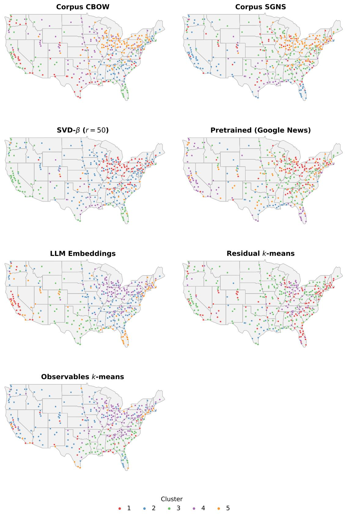  
Online Appendix Figure OA.8: Geographic distribution of cluster assignments for 363 CBSAs. Each dot is a CBSA, colored by its cluster. Cluster numbers are assigned within each method, so a color is comparable across CBSAs in one panel but not across panels.

## C Additional Numerical Results

This appendix considers number of alternatives specifications for our numerical illustrations.

## C.1 Large Corpus

Figures OA.9–OA.11 repeat Figures 3–5 on the larger corpus $( D = 1 , 0 0 0 , N _ { d } = 1 0 , 0 0 0$ , against $D = 3 6 3$ and $N _ { d } = 4 8 7 )$ . The comparison to make is panel against its main-text counterpart, and what changes differs by panel.

For SVD-β (left) only the sample size changes. We keep the full document as context, so the number of ordered word-context pairs entering $\widehat { R }$ rises from $8 . 6 \times 1 0 ^ { 7 }$ to $1 . 0 \times 1 0 ^ { 1 1 }$ , a factor of about 1,200, on 56 times as many tokens. The panel is therefore a pure sample-size comparison, and it is the cleanest picture of Proposition 1 in the paper: at $K = 2$ the cloud collapses onto a line.

For SGNS (right) it does not. Full-document context is not feasible at this scale. We therefore run $J = 5$ (the default in gensim), and the two changes work against each other. gensim draws the effective half-window uniformly on $\{ 1 , \ldots , J \}$ , so at $J = 5$ each target sees about six contexts: the objective consumes roughly $6 . 0 \times 1 0 ^ { 7 }$ pairs per epoch, against $8 . 6 \times 1 0 ^ { 7 }$ in Figure 3. So effectively, the training sample is about 30% smaller in pairs compared to its main-text counterpart.

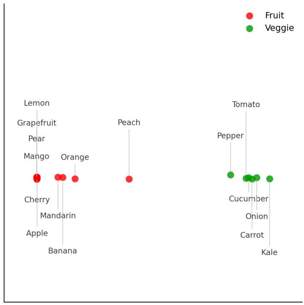  
(a) SVD-β, full document

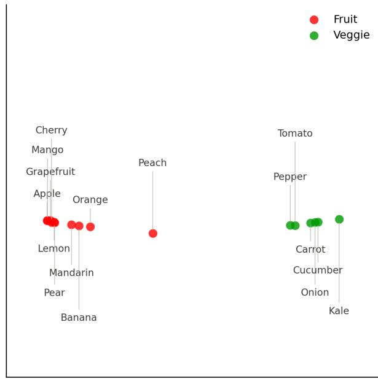  
(b) SGNS, J = 5  
Online Appendix Figure OA.9: Word embeddings for Design 1 $\left( K = 2 \right)$ on the larger corpus $( D = 1 , 0 0 0 , N _ { d } = 1 0 , 0 0 0 )$ $\mathrm { S V D } { - \beta }$ uses the full document as context, as in the main text; SGNS uses $J = 5 ,$ which is what is feasible at this scale. Counterpart of Figure 3. Colors mark the dominant topic in the true B. Both panels are drawn at equal aspect: in population the embedding has rank $K - 1 = 1$ , so the cloud is one-dimensional and the vertical spread is estimation noise.

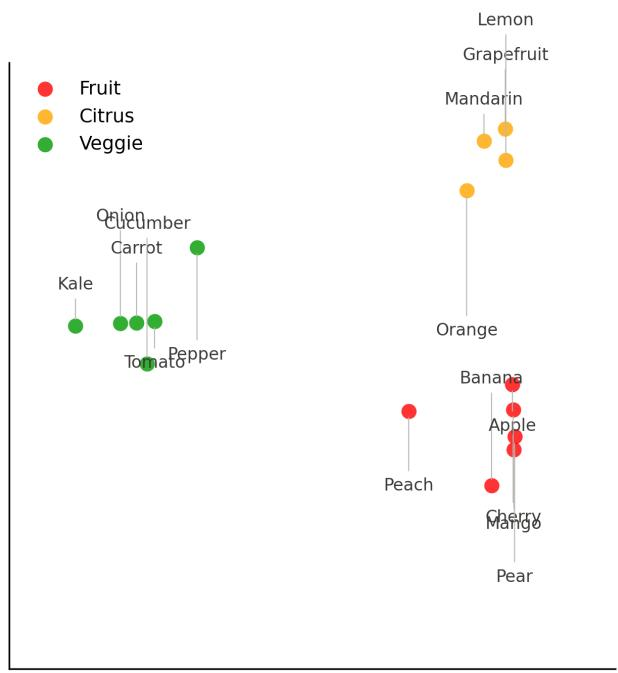

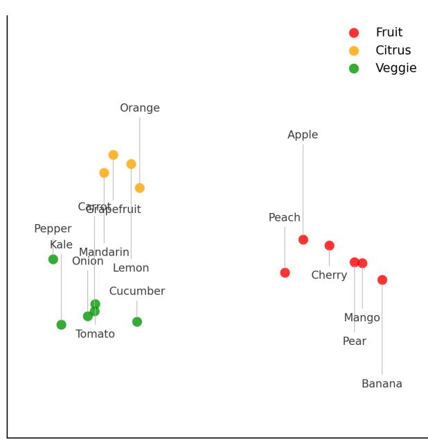  
(a) ${ \mathrm { S V D } } { \cdot } \beta ,$ full document  
(b) SGNS, J = 5

Online Appendix Figure OA.10: Word embeddings for Design $2 \ ( K = 3 )$ on the larger corpus. SVD-β uses the full document as context; SGNS uses $J = 5$ . Counterpart of Figure 4. Both methods separate the three topics. Each panel is projected onto its own leading two principal directions rather than onto the first two raw coordinates: for $\mathrm { S V D } { - \beta }$ the two coincide, since $\beta$ is built from the ordered eigenvectors of $\widehat { R } - \mathbf { 1 } _ { V } \mathbf { 1 } _ { V } ^ { \top }$ , but the CBOW coordinate basis is chosen by the optimizer and is arbitrary, so a raw two-coordinate slice would cut obliquely through the topic plane.

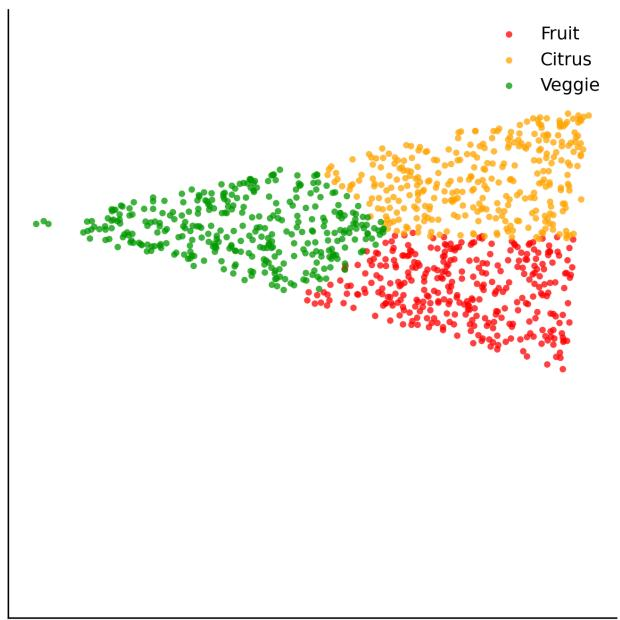  
(a) ${ \mathrm { S V D } } { \cdot } \beta ,$ full document

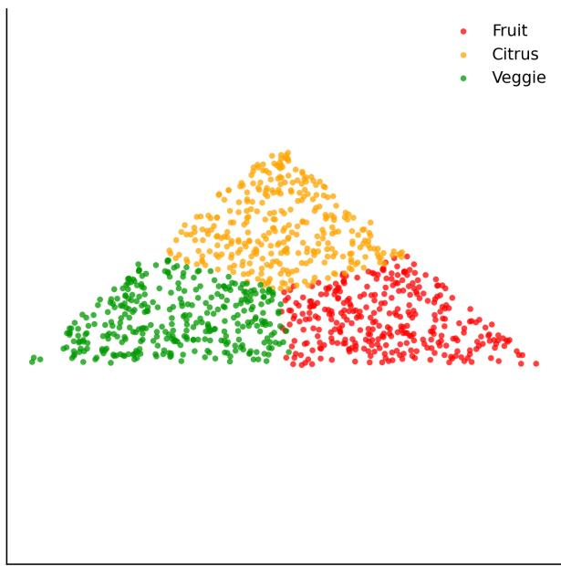  
(b) SGNS, J = 5  
Online Appendix Figure OA.11: Document embeddings for Design 2 (K = 3) on the larger corpus, SVD-β at full-document context and SGNS at $J = 5$ , colored by dominant topic. Counterpart of Figure 5. With $\alpha = 1$ the topic mixtures are spread across the simplex and the document embeddings fill the triangle spanned by the three topic centroids, as Proposition 3 predicts.

## C.2 Sparse Topic Mixtures: Dirichlet $( \alpha = 0 . 0 1 )$

The simulations in Section 3 use a symmetric Dirichlet $( \alpha = 1 )$ prior, which is uniform on the topic simplex. As a contrast, I repeat both designs with $\alpha = 0 . 0 1$ (Holding $D = 3 6 3$ and $N _ { d } = 4 8 7 )$ . Under Dirichlet(0.01), almost all mass concentrates at the simplex vertices: most documents are nearly pure-topic, with topic mixtures $\Theta _ { \bullet d }$ close to a single $e _ { k }$ . By Proposition 3, document embeddings $\mu _ { d } = C \Theta _ { \bullet d }$ then concentrate at the topic centroids $\left\{ c _ { k } \right\}$ rather than filling the centroid simplex.

Figures OA.12-OA.15 show the resulting embeddings. The B matrices and pipeline are identical to Section $3 ;$ only the Dirichlet concentration parameter differs.

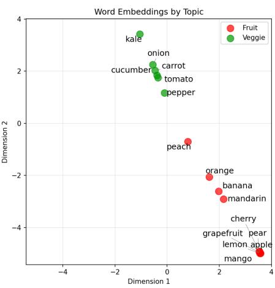  
(a) CBOW

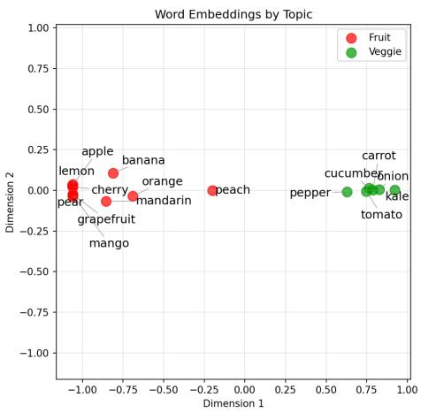  
(b) $\mathrm { S V D } { - \beta }$  
Online Appendix Figure OA.12: Word embeddings for Design 1 (K = 2) under Dirichlet $( \alpha =$ 0.01).

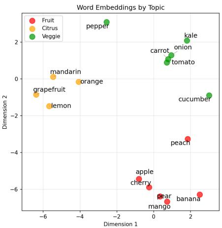  
(a) CBOW

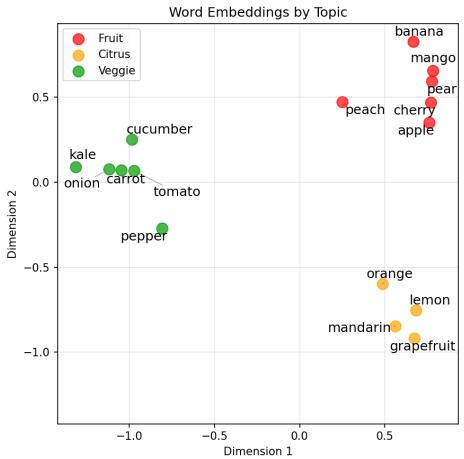  
(b) SVD-β  
Online Appendix Figure OA.13: Word embeddings for Design 2 (K = 3) under Dirichlet $( \alpha =$ 0.01).

The sparse-prior case illustrates the boundary regime for Lemma 2: when $\theta _ { d , k ^ { * } ( d ) } \approx 1$ , the dominant-topic threshold $\theta _ { d , k ^ { * } ( d ) } > 1 - \eta$ is met for essentially every document, and k-means recovers the dominant-topic partition. At $\alpha = 0 . 0 1$ ， $\operatorname* { P r } ( \theta _ { d , k ^ { * } } > 0 . 5 ) \approx 1$ for both $K = 2$ and $K = 3$ , consistent with the visible vertex concentration.

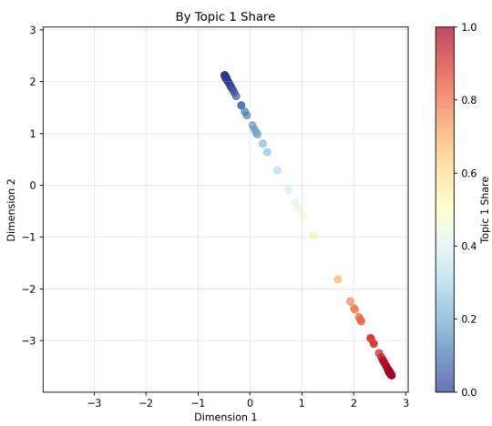  
(a) CBOW

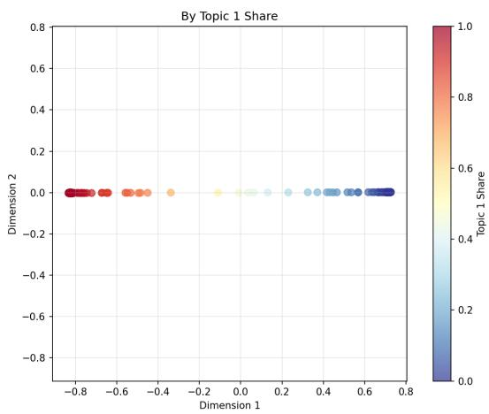  
(b) $\mathrm { S V D } { - \beta }$  
Online Appendix Figure OA.14: Document embeddings for Design 1 $\left( K \ = \ 2 \right)$ under Dirichlet $( \alpha = 0 . 0 1 )$ . Documents cluster at the two endpoints of the line segment $[ c _ { 1 } , c _ { 2 } ]$ rather than filling it; color indicates the share of topic 1.

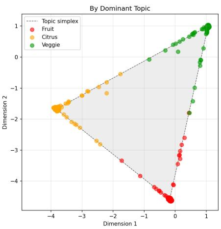  
(a) CBOW

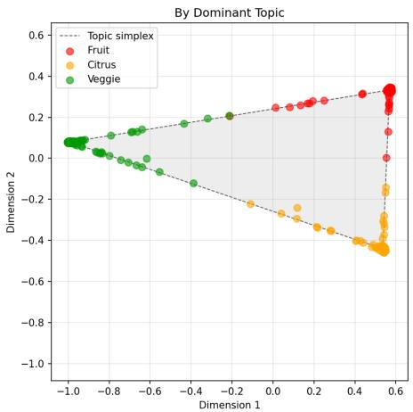  
(b) SVD-β  
Online Appendix Figure OA.15: Document embeddings for Design 2 $\left( K \ = \ 3 \right)$ under Dirichlet $( \alpha = 0 . 0 1 )$ , colored by dominant topic. With most documents near-pure on a single topic, the dominant-topic partition is well-separated and is recovered cleanly by both embeddings (k-means with $K = 3 )$ . The shaded region is the topic simplex conv $\left\{ c _ { 1 } , c _ { 2 } , c _ { 3 } \right\}$ ; documents concentrate at its vertices rather than filling it, which is the contrast with Figure 5.

## C.3 Interior Archetypes $( L < K )$

The simulations above illustrate the case $L = K$ , where the number of clusters in document space matches the number of topics. Proposition 4 covers the more general case in which documents concentrate around L archetype mixtures $\pi _ { 1 } ^ { * } , \ldots , \pi _ { L } ^ { * } \in \Delta _ { K - 1 }$ that need not coincide with the simplex vertices. The empirical application in Section 4 sits in this regime: k-means on the CBSA corpus recovers $L \ = \ 5$ clusters whose centroids are interior mixtures of an unknown number of latent topics.

To illustrate this scaling, I repeat Design $2 \ : ( K = 3$ topics, same B matrix as in Section 3) but replace the Dirichlet $( \alpha = 1 )$ prior on $\Theta _ { \bullet d }$ with a two-archetype mixture. Each document is assigned uniformly to one of two archetypes,

$$
\pi _ { 1 } ^ { * } = ( 0 . 6 5 , 0 . 2 5 , 0 . 1 0 ) , \qquad \pi _ { 2 } ^ { * } = ( 0 . 1 0 , 0 . 1 0 , 0 . 8 0 ) ,
$$

and its topic mixture is drawn from a tight Dirichlet centered on the assigned archetype, $\Theta _ { \bullet d } \sim$ Dirichlet $( 2 0 \cdot \pi _ { \ell } ^ { * } )$ . Archetype 1 is fruit-heavy with some citrus; archetype 2 is nearly pure vegetable. Neither lies at a simplex vertex. The word geometry is not carried over unchanged. By Theorem 1 the word metric is $\Sigma _ { \Theta } .$ -weighted. Figure OA.16 illustrates. The shaded region is the topic simplex conv $\{ c _ { 1 } , c _ { 2 } , c _ { 3 } \}$ , computed from the true B and the estimated word embeddings and projected onto the same two coordinates as the documents; Proposition 3 places every expected document embedding inside it. Crosses mark the two archetypes' expected embeddings, $\sum _ { k } \pi _ { \ell k } ^ { * } c _ { k }$ . Both sit in the interior, which is the $L < K$ regime of Proposition 4. The simplex is far flatter than in Figure OA.15 even though B is the same, for the reason given above: $\Sigma _ { \Theta }$ is nearly rank one here. That flattening is present in both panels and in the full K coordinates, not an artifact of the projection.

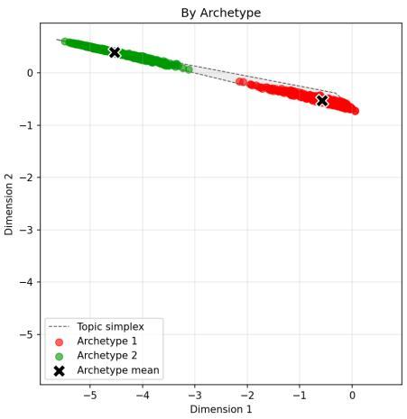  
(a) CBOW

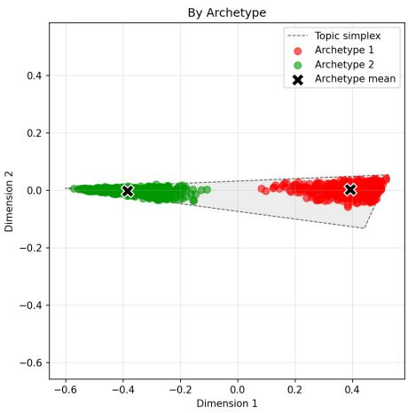  
(b) $\mathrm { S V D } { - \beta }$  
Online Appendix Figure OA.16: Document embeddings colored by archetype label. The shaded region is the topic simplex conv $\{ c _ { 1 } , c _ { 2 } , c _ { 3 } \}$ , computed from the true B and the estimated word embeddings and projected onto the same two coordinates as the documents. Crosses mark the two archetypes' expected embeddings, $\sum _ { k } \pi _ { \ell k } ^ { * } c _ { k }$

The archetype design illustrates Proposition 4 in the $L = 2 < K = 3$ regime: cluster identity in embedding space is governed by the archetype assignment, not by the dominanttopic vertex. This mirrors the empirical situation in Section 4, where the choice of L = 5 is governed by the resolvable archetypes in the corpus and need not equal the (unobserved) number of latent topics.

## C.4 CBOW

Here, I depict the counterpart of Figures 3-Figure 5 using continuous bag-of-words (CBOW) embeddings.

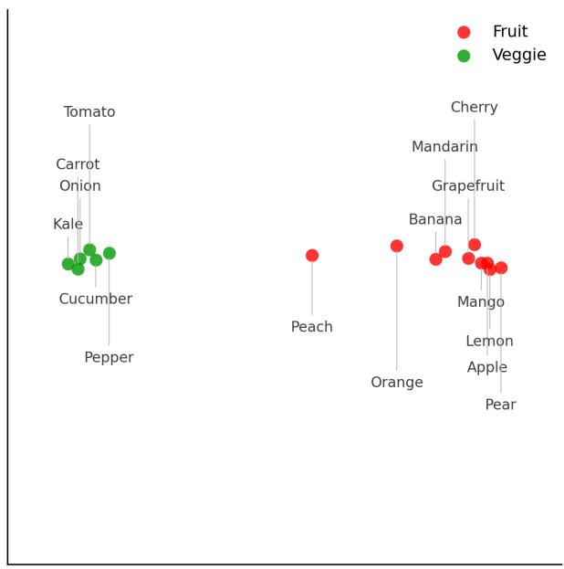  
(a) Word embeddings, Design 1 (K = 2)

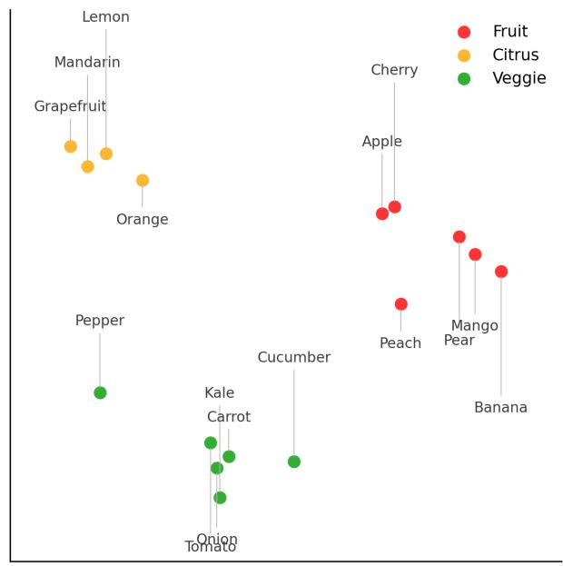

(b) Word embeddings, Design 2 (K = 3)  
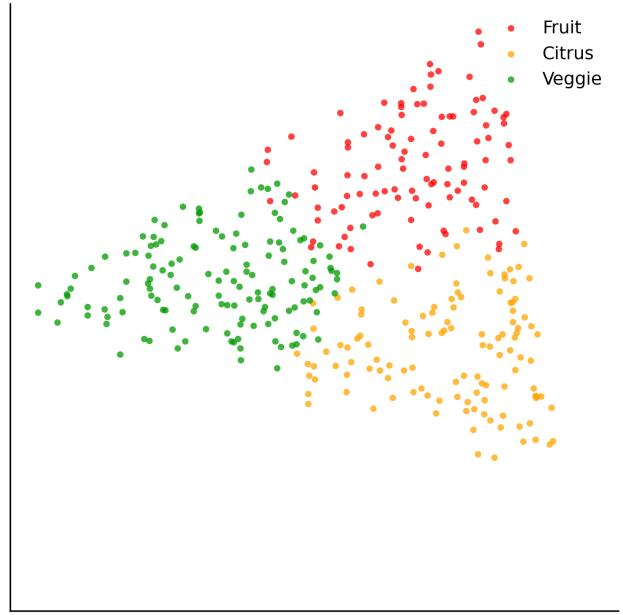  
(c) Document embeddings, Design 2 (K = 3)

Online Appendix Figure OA.17: Estimated embedding using CBOW on applicaton-sized corpus.   
Colors mark the dominant topic in the true B.

## C.5 UMAP Projections

Figure 5 projects the 3-dimensional embeddings to two dimensions by retaining the first two coordinates. The empirical application in Section 4 instead uses UMAP (McInnes et al., 2018), a nonlinear dimensionality-reduction method, because the application's embeddings live in 50 dimensions (closed-form SVD-β and both corpus-trained arms), 300 (pretrained Google News) or 3,072 (the LLM embeddings). For visual parallelism with the application figures, this section repeats the Design 2 $\left( K = 3 \right)$ embeddings under the same UMAP projection used in Section 4. UMAP's nonlinear transformation can curve or warp the simplex but generally preserves the cluster structure.

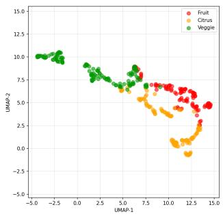  
(a) SVD-β

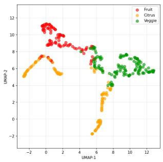  
(b) SGNS

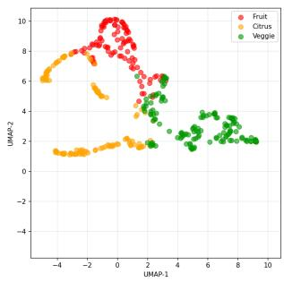  
(c) CBOW

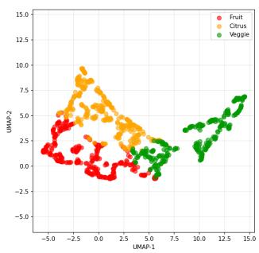  
(d) ${ \mathrm { S V D } } { \cdot } \beta ,$ large corpus

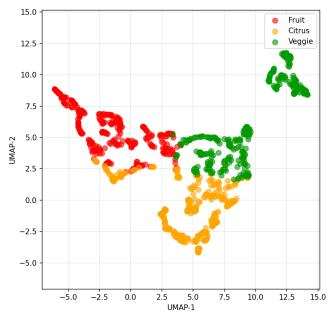  
(e) SGNS, large corpus

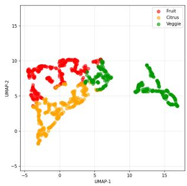  
(f) CBOW, large corpus  
Online Appendix Figure OA.18: Document embeddings for Design 2 $\left( K = 3 \right)$ , UMAP-projected and colored by dominant topic. Top row: application scale $( D = 3 6 3 , N _ { d } = 4 8 7$ , full document as context), the same embeddings Figure 5 projects linearly. Bottom row: the larger corpus $( D = 1 , 0 0 0$ $N _ { d } = 1 0 , 0 0 0 , J = 5 )$ , the counterpart of Figure OA.11. Cluster structure is preserved under UMAP at both scales.

## C.6 Rank of the SGNS Target under a Sparser Prior

Table 2 draws every column of B and every topic mixture from a symmetric Dirichlet $( \alpha = 1 )$ which puts no mass at the boundary of either simplex: each topic loads on every word and each document on every topic. Table OA.3 repeats that grid at $\alpha = 0 . 1$ , where both are more concentrated.

Two things change. The level falls sharply: $\pi _ { K - 1 }$ runs from 0.68 to 0.89, against 0.91 to 0.99 at $\alpha = 1$ , so a rank-(K - 1) approximation now misses between a tenth and a third of the spectral mass of log R. And the invariance to V breaks for moderately sized K. This suggests the cost of the rank constraint grows with the vocabulary under a sparse prior.

Both follow from a larger departure from independence. The diagnostic $\varrho = \| R - \mathbf { 1 } _ { V } \mathbf { 1 } _ { V } ^ { \top } \| _ { \infty }$ stays below 0.6 in every cell at $\alpha = 1$ , but ranges from 0.84 to 6.5 here and exceeds one in 25 of the 30 cells. Remark 3 expands log $R = \beta \beta ^ { \top } + O ( \varrho ^ { 2 } )$ under $\varrho < 1$ , so that expansion does not cover most of this table.

<table><tr><td>V</td><td> $K = 2$ </td><td> $K = 3$ </td><td> $K = 5$ </td><td> $K = 1 0$ </td><td> $K = 2 5$ </td><td> $K = 5 0$ </td></tr><tr><td>100</td><td>0.677</td><td>0.693</td><td>0.728</td><td>0.779</td><td>0.831</td><td>0.890</td></tr><tr><td>250</td><td>0.677</td><td>0.692</td><td>0.715</td><td>0.743</td><td>0.788</td><td>0.827</td></tr><tr><td>500</td><td>0.676</td><td>0.691</td><td>0.711</td><td>0.731</td><td>0.755</td><td>0.808</td></tr><tr><td>1,000</td><td>0.677</td><td>0.692</td><td>0.705</td><td>0.721</td><td>0.726</td><td>0.786</td></tr><tr><td>2,500</td><td>0.676</td><td>0.691</td><td>0.704</td><td>0.712</td><td>0.702</td><td>0.747</td></tr></table>

Online Appendix Table OA.3: Share of the spectral mass of log R carried by its leading $K - 1$ eigenvalues, $\begin{array} { r } { \pi _ { K - 1 } = \sum _ { i \leq K - 1 } | \lambda _ { i } | / \sum _ { i } | \lambda _ { i } | } \end{array}$ , at $\alpha = 0 . 1$ . Each column of B and each topic mixture $\Theta _ { \bullet d }$ is drawn from a symmetric Dirichlet(α); R is then formed in population from B and $G ,$ so no corpus is sampled. Means over 8 draws; the largest standard deviation in any cell is 0.016. The negative-sampling shift contributes one further eigenvalue, of size V log ν, and is excluded.

## References

Sanjeev Arora, Rong Ge, Yonatan Halpern, David Mimno, Ankur Moitra, David Sontag, Yichen Wu, and Michael Zhu. A practical algorithm for topic modeling with provable guarantees. In International Conference on Machine Learning, pages 280–288. PMLR, 2013.

Sanjeev Arora, Yuanzhi Li, Yingyu Liang, Tengyu Ma, and Andrej Risteski. A latent variable model approach to PMI-based word embeddings. Transactions of the Association for Computational Linguistics, 4:385–399, 2016.

Sanjeev Arora, Yingyu Liang, and Tengyu Ma. A simple but tough-to-beat baseline for sentence embeddings. In International Conference on Learning Representations, 2017.

David Arthur and Sergei Vassilvitskii. k-means++: The advantages of careful seeding. In Proceedings of the Eighteenth Annual ACM-SIAM Symposium on Discrete Algorithms (SODA), pages 1027–1035, 2007.

Philipp Bach, Victor Chernozhukov, Sven Klaassen, Martin Spindler, Jan Teichert-Kluge, and Suhas Vijaykumar. Adventures in demand analysis using AI. arXiv preprint arXiv:2501.00382, 2025.

Patrick Bajari, Zhihao Cen, Victor Chernozhukov, Manoj Manukonda, Suhas Vijaykumar, Jin Wang, Ramon Huerta, and Junbo Li. Hedonic prices and quality adjusted price indices powered by AI. Journal of Econometrics, 2025.

Laura Battaglia, Timothy Christensen, Stephen Hansen, and Szymon Sacher. Inference for regression with variables generated by AI or machine learning. arXiv preprint arXiv:2402.15585, 2024.

David M Blei and John D Lafferty. Dynamic topic models. In Proceedings of the 23rd International Conference on Machine Learning, pages 113–120, 2006.

David M Blei, Andrew Y Ng, and Michael I Jordan. Latent Dirichlet allocation. Journal of Machine Learning Research, 3:993–1022, 2003.

Stéphane Bonhomme, Thibaut Lamadon, and Elena Manresa. Discretizing unobserved heterogeneity. Econometrica, 90(2):625–643, 2022.

L. M. Bregman. The relaxation method of finding the common point of convex sets and its application to the solution of problems in convex programming. USSR Computational Mathematics and Mathematical Physics, 7(3):200–217, 1967.

Sara Casella, Jesús Fernández-Villaverde, Stephen Hansen, Ryohei Oishi, and Minchul Shin. Structural estimation with unstructured data. Working paper, 2026.

Yinyin Chen, Shishuang He, Yun Yang, and Feng Liang. Learning topic models: Identifiability and finite-sample analysis. Journal of the American Statistical Association, pages 1-16, 2022.

Timothy Christensen and Giovanni Compiani. From unstructured data to demand counterfactuals: Theory and practice. arXiv preprint arXiv:2601.05374, 2026.

Michael Collins, Sanjoy Dasgupta, and Robert E. Schapire. A generalization of principal components analysis to the exponential family. In Advances in Neural Information Processing Systems, volume 14, pages 617–624, 2001.

Adji B. Dieng, Francisco J. R. Ruiz, and David M. Blei. Topic modeling in embedding spaces. Transactions of the Association for Computational Linguistics, 8:439–453, 2020.

David Donoho and Victoria Stodden. When does non-negative matrix factorization give a correct decomposition into parts? In Advances in Neural Information Processing Systems, volume 16, 2003.

Naoki Egami, Christian J. Fong, Justin Grimmer, Margaret E. Roberts, and Brandon M. Stewart. How to make causal inferences using texts. Science Advances, 8(42):eabg2652, 2022.

Simon Freyaldenhoven, Shikun Ke, Dingyi Li, and José Luis Montiel Olea. On the testability of the anchor-words assumption in topic models. 2025.

Xiao Fu, Kejun Huang, Nicholas D Sidiropoulos, and Wing-Kin Ma. Nonnegative matrix factorization for signal and data analytics: Identifiability, algorithms, and applications. IEEE Signal Process. Mag., 36(2):59–80, 2019.

Thomas Hofmann. Probabilistic latent semantic indexing. In Proceedings of the 22nd annual international ACM SIGIR conference on Research and development in information retrieval, pages 50–57, 1999.

Kejun Huang, Nicholas D Sidiropoulos, and Ananthram Swami. Non-negative matrix factorization revisited: Uniqueness and algorithm for symmetric decomposition. IEEE Transactions on Signal Processing, 62(1):211–224, 2013.

Kejun Huang, Xiao Fu, and Nikolaos D Sidiropoulos. Anchor-free correlated topic modeling: Identifiability and algorithm. Advances in Neural Information Processing Systems, 29, 2016.

Mohit Iyyer, Varun Manjunatha, Jordan Boyd-Graber, and Hal Daumé III. Deep unordered composition rivals syntactic methods for text classification. In Proceedings of the 53rd Annual Meeting of the Association for Computational Linguistics, pages 1681–1691, 2015.

Armand Joulin, Edouard Grave, Piotr Bojanowski, and Tomas Mikolov. Bag of tricks for efficient text classification. In Proceedings of the 15th conference of the European chapter of the association for computational linguistics: volume 2, short papers, pages 427–431, 2017.

Austin C Kozlowski, Matt Taddy, and James A Evans. The geometry of culture: Analyzing the meanings of class through word embeddings. American Sociological Review, 84(5):905–949, 2019.

Quoc Le and Tomas Mikolov. Distributed representations of sentences and documents. In International Conference on Machine Learning, pages 1188–1196. PMLR, 2014.

Daniel D Lee and H Sebastian Seung. Learning the parts of objects by non-negative matrix factorization. Nature, 401(6755):788–791, 1999.

Omer Levy and Yoav Goldberg. Neural word embedding as implicit matrix factorization. In Advances in Neural Information Processing Systems, volume 27, pages 2177–2185, 2014.

Omer Levy, Yoav Goldberg, and Ido Dagan. Improving distributional similarity with lessons learned from word embeddings. Transactions of the Association for Computational Linguistics, 3:211–225, 2015.

Yuchen Li, Yuanzhi Li, and Andrej Risteski. How do transformers learn topic structure: Towards a mechanistic understanding. In International Conference on Machine Learning, pages 19689–19729. PMLR, 2023.

Leland McInnes, John Healy, and James Melville. Umap: Uniform manifold approximation and projection for dimension reduction. arXiv preprint arXiv:1802.03426, 2018.

Tomas Mikolov, Kai Chen, Greg Corrado, and Jeffrey Dean. Efficient estimation of word representations in vector space. In International Conference on Learning Representations, 2013a.

Tomas Mikolov, Kai Chen, Greg Corrado, and Jeffrey Dean. word2vec: Tool for computing continuous distributed representations of words. Google Code archive, 2013b. URL https://code.google.com/archive/p/word2vec/. Pre-trained GoogleNews-vectors-negative300 model.

Tomas Mikolov, Ilya Sutskever, Kai Chen, Greg Corrado, and Jeffrey Dean. Distributed representations of words and phrases and their compositionality. In Advances in Neural Information Processing Systems, volume 26, pages 3111–3119, 2013c.

Jeffrey Pennington, Richard Socher, and Christopher D. Manning. GloVe: Global vectors for word representation. In Proceedings of the 2014 Conference on Empirical Methods in Natural Language Processing (EMNLP), pages 1532–1543, 2014.

Radim Rehůřek and Petr Sojka. Software framework for topic modelling with large corpora. In Proceedings of the LREC 2010 Workshop on New Challenges for NLP Frameworks, pages 45–50, Valletta, Malta, 2010. ELRA.

Nils Reimers and Iryna Gurevych. Sentence-BERT: Sentence embeddings using Siamese BERT-networks. In Proceedings of the 2019 Conference on Empirical Methods in Natural Language Processing, pages 3982–3992, 2019.

Margaret E. Roberts, Brandon M. Stewart, and Richard A. Nielsen. Adjusting for confounding with text matching. American Journal of Political Science, 64(4):887–903, 2020.

Paul R. Rosenbaum and Donald B. Rubin. The central role of the propensity score in observational studies for causal effects. Biometrika, 70(1):41–55, 1983.

Madeleine Udell, Corinne Horn, Reza Zadeh, and Stephen Boyd. Generalized low rank models Foundations and Trends in Machine Learning, 9(1):1–118, 2016.

Keyon Vafa, Emil Palikot, Tianyu Du, Ayush Kanodia, Susan Athey, and David M. Blei. CAREER: A foundation model for labor sequence data. arXiv preprint arXiv:2202.08370, 2022.

Keyon Vafa, Susan Athey, and David M. Blei. Estimating wage disparities using foundation models. Proceedings of the National Academy of Sciences, 2025. doi: 10.1073/pnas. 2427298122.

Victor Veitch, Dhanya Sridhar, and David M. Blei. Adapting text embeddings for causal inference. In Proceedings of the 36th Conference on Uncertainty in Artificial Intelligence (UAI), pages 919–928, 2020.

Xinyi Wang, Wanrong Zhu, Michael Saxon, Mark Steyvers, and William Yang Wang. Large language models are latent variable models: Explaining and finding good demonstrations for in-context learning. Advances in Neural Information Processing Systems, 36:15614–15638, 2023.

John Wieting, Mohit Bansal, Kevin Gimpel, and Karen Livescu. Towards universal paraphrastic sentence embeddings. In International Conference on Learning Representations, 2016.

Sang Michael Xie, Aditi Raghunathan, Percy Liang, and Tengyu Ma. An explanation of in-context learning as implicit bayesian inference. International Conference on Learning Representations, 2022.