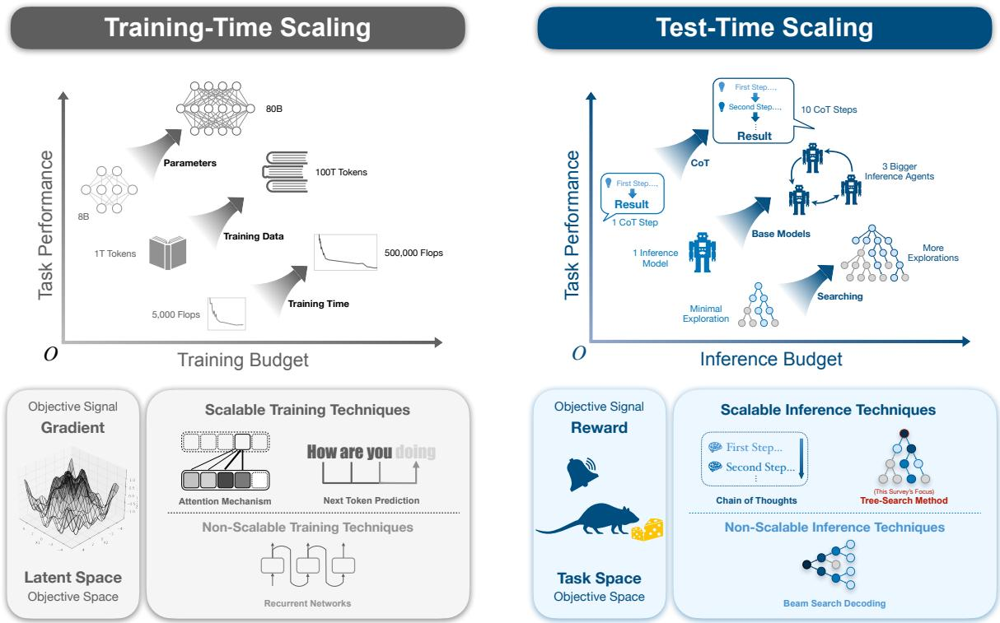
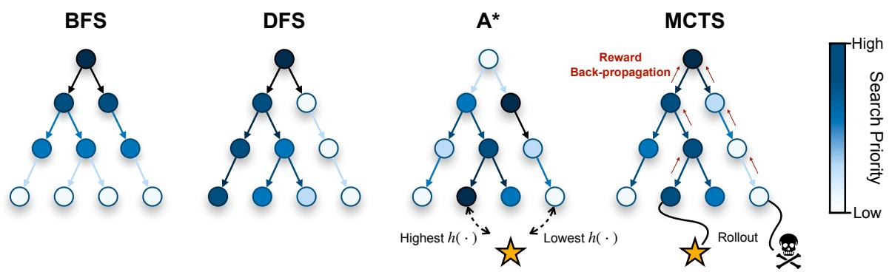
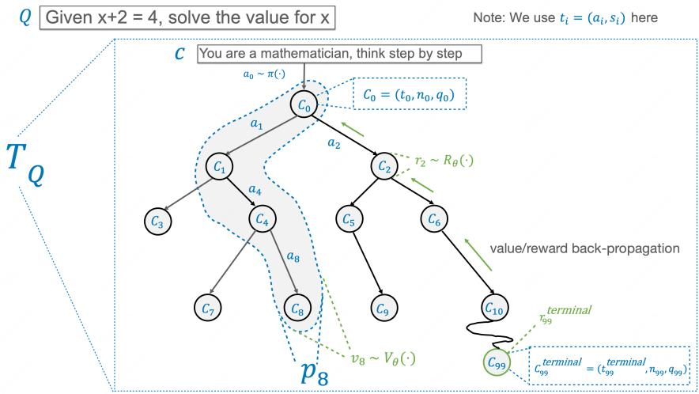
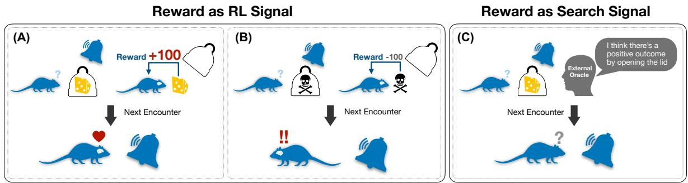
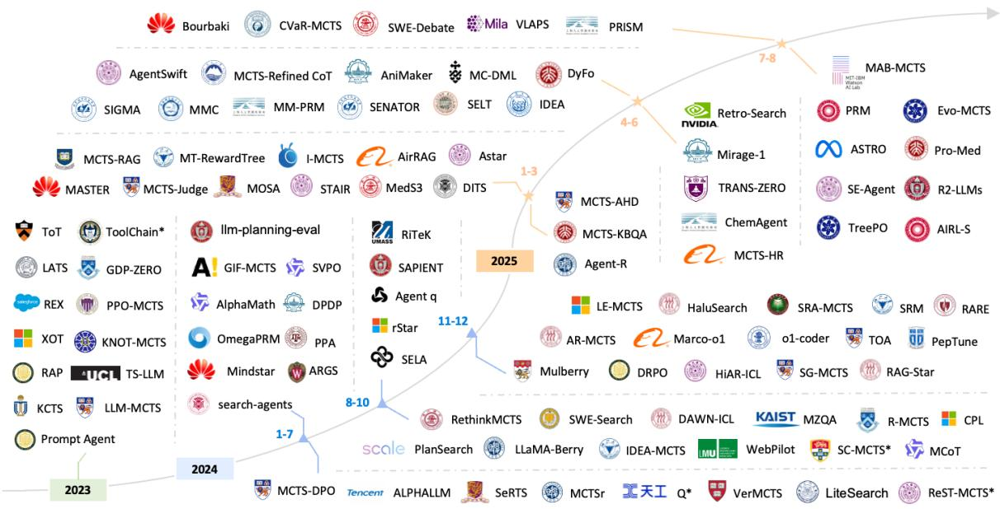
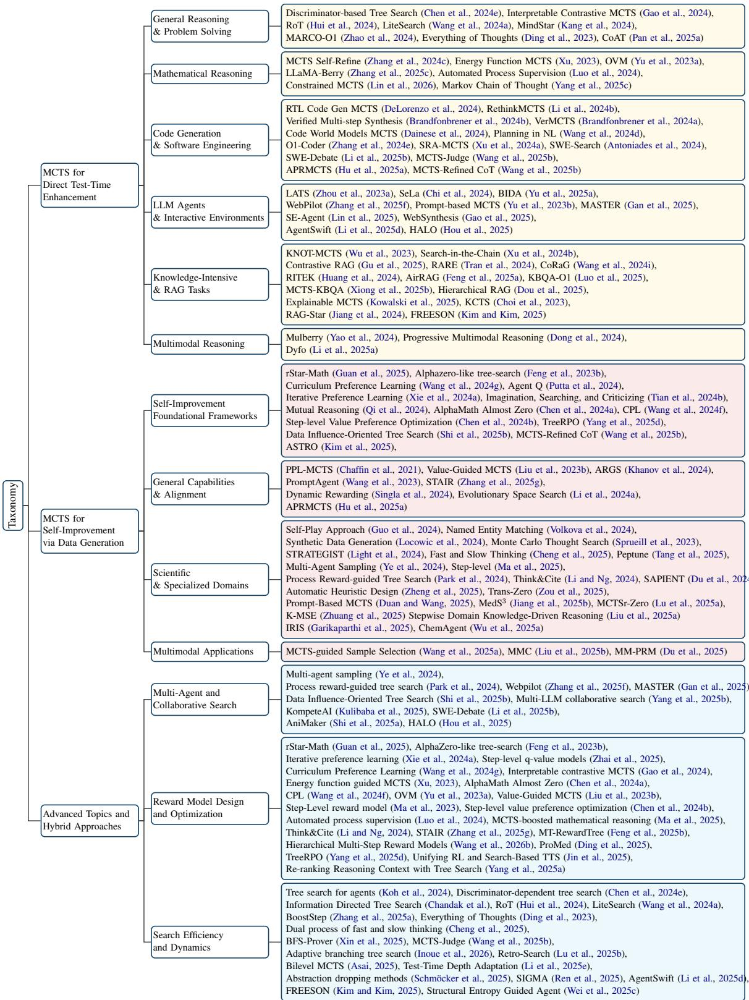
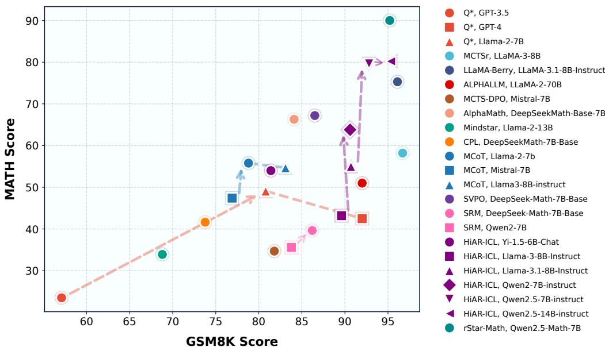

# When LLM Meets Tree Search: A Systematic View of Inference as Search in Large Language Models

Jiaqi Wei1,2\*, Xiang Zhang3\*, Yuejin Yang4,2\*, Wenxuan Huang4,2\*, Juntai Cao3\*, Sheng Xu4,2, Xiang Zhuang2, Zhangyang Gao2, Muhammad Abdul-Mageed3, Laks V.S. Lakshmanan3, Chenyu You5, Wanli Ouyang6, Siqi Sun4,2

1Zhejiang University, 2Shanghai AI Laboratory, 3University of British Columbia, 4Fudan University, 5Stony Brook University, 6The Chinese University of Hong Kong \*Equal Contribution

Correspondence: jiaqi.wei@zju.edu.cn, siqisun@fudan.edu.cn

## Abstract

As pretraining scaling laws approach saturation, Test-Time Scaling (TTS) has emerged as an important direction for improving reasoning by allocating inference-time compute to a fixed model prior. Viewed at a high level, TTS reframes inference as search over a space of partial reasoning states. While Chainof-Thought (CoT) exposes intermediate steps, common instantiations rely on single-trajectory decoding, limiting recovery from early errors and exploration. This survey systematizes recent progress in tree-search-based reasoning, viewing inference as instance-specific optimization rather than decoding. We trace the evolution from uninformed search to Monte Carlo Tree Search (MCTS), highlighting how sampling-based control supports principled exploration–exploitation trade-offs. To unify a fragmented literature, we introduce a Unified Design Space spanning search topology, evaluation signals, and control dynamics, and advocate a standardized compute-reporting abstraction to make compute–accuracy tradeoffs explicit and comparable.

## 1 Introduction

As scaling laws for large language models (LLMs) enter a regime of diminishing returns (Kaplan et al., 2020), research attention is increasingly shifting from parameter growth toward algorithmic strategiesfor reasoning. A central response is Test-Time Scaling (TTS) (Brown et al., 2024), which allocates adaptive inference-time compute to improve problem solving from a fixed model prior. At a high level, TTS reframes inference as search: the system navigates a combinatorial space of partial reasoning states under a task-defined objective.

Chain-of-Thought (CoT) prompting demonstrates that externalized reasoning can improve performance (Wei et al., 2022), but most implementations rely on single-trajectory decoding, limiting recovery from early errors and restricting exploration. Recent work therefore revisits classical planning and tree search, maintaining a frontier of partial solutions and reallocating compute based on intermediate feedback (Yao et al., 2023; Hao et al., 2023a; Wang et al., 2022). These searchaugmented methods form the algorithmic core of modern test-time reasoning.

Importantly, the same search mechanisms also enable self-improvement: high-quality reasoning trajectories discovered through search (e.g., via MCTS) can be distilled into training data or reward models, internalizing deliberative behavior into model parameters (Silver et al., 2017; Gulcehre et al., 2023; Feng et al., 2023a; Guo et al., 2025). Tree search thus plays a dual role—as a transient inference-time optimizer and as a generator of durable parametric knowledge.

Despite rapid progress, the literature remains fragmented across search strategies, reward or value estimation, and evaluation protocols, obscuring general design principles (Wei et al., 2025b). This survey provides a Systematization of Knowledge (SoK) for search-based reasoning in LLMs, introducing a unified framework that connects test-time scaling and self-improvement through a shared set of algorithmic components. Our goal is not to introduce new algorithms or benchmarks, but to consolidate existing methods under a shared conceptual and reporting framework.

Our contributions are:

• Unified Formalism: A compact decomposition of search-based reasoning into search mechanism, reward/value estimation, and transition dynamics, clarifying their roles in both test-time optimization and parametric learning.

• Component-Based Taxonomy: A systematic organization of existing methods along search strategy, evaluation signal, and application paradigm.

  
Figure 1: Comparison of Training-time and Test-time Scaling: Highlighting Budget Allocation, Techniques, and Their Impact on Task Performance.

• Synthesis and Outlook: A synthesis of empirical insights and open challenges in scaling deliberative search and designing effective reward signals.

Organization. Section 2 reviews classical search paradigms and their relevance to long-horizon reasoning beyond greedy decoding. Section 3 presents a unified framework for MCTS in LLMs, focusing on the integration of policy priors and value or reward signals. Section 4 contrasts this with heuristicguided search. Section 5 discusses a lightweight compute-reporting framework for making test-time search results more interpretable across studies, and Section 6 discusses open challenges and future directions in adaptive allocation and search-totraining distillation.

## 2 Search in General AI

Reasoning problems can be framed as search over trees or graphs, where large branching factors make exhaustive exploration infeasible. Classical AI search addresses this challenge by trading off exploration cost and solution quality. We briefly summarize major paradigms to motivate LLM-based reasoning methods; formal details are deferred to Appendix B.

Uninformed and Informed Search. Classical search ranges from uninformed methods (e.g., BFS, DFS, UCS) to heuristic search, which incorporates domain knowledge via a heuristic function h(n). While uninformed methods serve as conceptual baselines, they scale poorly in large reasoning spaces. Heuristic approaches such as A\* and beam search can reduce search cost when reliable heuristics exist, but designing accurate, domaingeneral heuristics remains challenging for openended LLM reasoning.

Monte Carlo Tree Search (MCTS). Monte Carlo Tree Search (MCTS) offers a complementary paradigm that avoids explicit heuristic design by learning value estimates through sampling. Originally developed for game playing, MCTS has been adapted to single-agent reasoning by balancing exploration and exploitation through accumulated search statistics. This makes MCTS well suited to LLM reasoning tasks where evaluators are noisy, sparse, or only available at terminal states.

Reward as a Guiding Signal: Search vs. RL. The notion of a “reward” plays a central role in both search and Reinforcement Learning (RL), yet its function and implementation differ fundamentally, as illustrated in Figure 4. Although both are commonly referred to simply as “reward” in the literature, they serve distinct purposes, and this ambiguity can obscure the relationship between test-time planning and training-time optimization. Clarifying this distinction is essential for the unified framework developed in this paper; additional details are provided in Appendix D.

  
Figure 2: A visual comparison of four fundamental tree search algorithms, where node color intensity represents search priority. BFS explores exhaustively level by level, while DFS commits to a single path until a leaf is reached. In contrast, informed search like A\* uses a heuristic function h(·) to prioritize nodes with the lowest estimated total cost, regardless of their depth. MCTS introduces a statistical approach, using simulated rollouts from leaf nodes and backpropagating the outcomes to dynamically guide the search toward high-reward regions of the tree.

  
Figure 3: Unified Notations for MCTS-Based Methods in LLM.

In Reinforcement Learning, rewards are assimilated into model parameters via gradient-based updates, inducing durable changes to the underlying policy (π ). This makes RL well suited for learning generalizable, reusable skills that transfer across related tasks.

In Test-Time Search, rewards act as external, transient signals that guide planning for a single problem instance. Such rewards, often provided by nondifferentiable oracles (e.g., verifiers or execution environments), influence the current search trajectory without modifying model parameters. As a result, search enables task-specific, on-the-fly optimization without risking policy degradation or catastrophic forgetting, to which RL can be vulnerable when learning sequential tasks.

In summary, RL employs rewards for long-term policy optimization, whereas search uses them for immediate, instance-level planning and guidance. A search reward defines a local objective for a single inference episode, while an RL reward serves as a global training signal that reshapes model parameters over many episodes. This distinction is crucial for interpreting hybrid MCTS–training approaches that leverage test-time search signals for long-term model improvement.

<table><tr><td>Symbol</td><td>Definition</td></tr><tr><td> $Q , c$ </td><td>Problem question and conditioning prompt</td></tr><tr><td> $s _ { i } , a _ { i }$ </td><td>Reasoning state and action at step ¿</td></tr><tr><td> $p _ { i }$ </td><td>Partial reasoning trace  $\left[ s _ { 1 } , s _ { 2 } , \ldots , s _ { i } \right]$ </td></tr><tr><td> $v _ { i } , r _ { s _ { i } }$ </td><td>Value of trace pi and reward for state  $s _ { i }$ </td></tr><tr><td> $\pi , V _ { \theta } , R _ { \theta }$ </td><td>Policy (LLM), value, and reward models</td></tr><tr><td> $T _ { Q } , { \mathcal { A } }$ </td><td>Search tree for problem  $Q$  and the action space</td></tr><tr><td> $C _ { i }$ </td><td>Tree node tuple  $( t _ { i } , n _ { i } , q _ { i } )$  (id, count, quality)</td></tr></table>

Table 1: Definition of unified notations.

## 3 MCTS for LLMs

## 3.1 Unified Problem Formulation

To provide a clear comparative framework for MCTS-based LLM reasoning, we adopt a unified notation for consistency across methods. Note: as in recent LLM planning work, the “environment” is simply the evolving text trace, and transitions are deterministic: each action $a _ { i }$ (a reasoning step) uniquely yields the next state $s _ { i + 1 }$ . This is a planning—not stochastic MDP—formulation used in RAP (Hao et al., 2023b), ReST-MCTS (Zhang et al., 2024a), AlphaLLM (Tian et al., 2024a), rStar-Math (Guan et al., 2025), and LLaMA-Berry (Zhang et al., 2025b).

Importantly, states are partial reasoning traces while actions represent only the next incremental step; the two spaces are therefore not equivalent. This asymmetry is intrinsic to deterministic planning and contrasts with RL’s environment-driven MDPs. The objective is to find an optimal reasoning trace $p ^ { \prime } = [ s _ { 1 } , \ldots , s _ { n } ]$ for a problem $Q .$ This formulation enables us to unify insights across papers and surface shared structural principles (e.g., how node granularity interacts with evaluation), which prior works have discussed only in isolation.

## 3.2 Structuring the Search: Node Representation and Granularity

A fundamental design choice is the definition of a node in the search tree $T _ { Q }$ , which dictates the granularity of the search. We identify three primary strategies:

Trace-based nodes, employed in step-driven frameworks like ReST-MCTS\* (Zhang et al., 2024a), define each node as a complete partial reasoning trace $p _ { i } = [ s _ { 1 } , \ldots , s _ { i } ]$ . This representation allows the value function $v _ { i } = V _ { \theta } ( p _ { i } )$ to capture the full context of the preceding reasoning path when assessing a node’s potential.

State-Action nodes, used in methods such as RAP (Hao et al., 2023c) and ALPHALLM (Tian et al., 2024b), represent each node as a state-action pair $( s _ { i } , a _ { i } )$ This more localized view focuses evaluation on the immediate quality of a single step, simplifying the input to the reward model.

Terminal-State nodes, a hallmark of purely goal-driven approaches like LLaMA-Berry (Zhang et al., 2024d) and MCTSr (Zhang et al., 2024c), radically restructure the search space. Here, each node represents a complete, terminal solution sterminal. The tree does not model the sequential generation of a single solution but rather a space of candidates, where edges correspond to refinement or rewriting operations. This transforms the problem from finding an optimal path to finding an optimal node.

In practice, these node definitions correspond to different textual granularities: trace-based nodes typically bundle multiple sentences or "reasoning steps", state-action nodes can align with a single reasoning step or short segment, and terminal-state nodes treat entire solutions as atomic. Finer granularity provides more flexible guidance but increases branching and cost, while coarser granularity reduces tree size at the cost of less precise feedback.

## 3.3 Designing the Evaluation Function

The primary differentiator among MCTS-based methods lies in the design of the evaluation function, which assigns a quality signal to each node—capturing either the likelihood of reaching a correct solution $( v _ { i } )$ or the immediate reward of a single action $( r _ { i } )$ . This signal steers the entire search process and reflects the overarching strategy of the framework.

## 3.3.1 Evaluation Locus: Process vs. Outcome Rewards

Evaluation signals can target either the reasoning process or the final outcome. Methods aimed at improving reasoning trajectories, such as ReST-MCTS\*, employ Process Reward Models (PRMs) or value functions $V _ { \theta } ( p _ { i } )$ to score intermediate, non-terminal states, providing fine-grained guidance that supports the discovery of high-quality reasoning paths for downstream training.

In contrast, methods focused on final correctness rely on Outcome Reward Models (ORMs), where intermediate nodes receive minimal reward and only terminal states sterminal are evaluated. Terminal rewards may be derived from majority voting (rStar (Qi et al., 2024)), execution-based verification (PG-TD (Zhang et al., 2023a), RethinkMCTS (Li et al., 2024b)), or LLM-based judging (MCTSr, TS-LLM (Feng et al., 2023b)). Hybrid approaches such as HiAR-ICL support both PRM and ORM signals, highlighting the flexibility of this design.

  
Figure 4: Reward Design: Search vs. RL. (A) In RL, a positive reward updates the agent’s policy, making it more likely to repeat the action. (B) A negative reward also updates the policy, discouraging the behavior. The change is durable. (C) In search, an external oracle provides a reward signal to guide the current decision process without altering the agent’s underlying parameters.

## 3.3.2 Evaluator Architecture: External Models vs. Self-Evaluation

Another key choice concerns how rewards are generated. Many systems train dedicated evaluators, such as specialized value and reward models (Vθ, Rθ) in ReST-MCTS\* and TS-LLM, or pairwise preference models as in LLaMA-Berry, which ranks candidate solutions.

Alternatively, some methods reuse the policy LLM itself as the evaluator. RAP, for example, treats the LLM as a world model that predicts both next states and associated rewards, while MCTSr scores solutions via robust resampling. This selfevaluation strategy reduces reliance on external data and separate model maintenance.

## 3.3.3 Multi-Critic and Composite Reward Functions

Several frameworks further combine multiple evaluation signals into a single composite score. AL-PHALLM, for instance, computes node values as a weighted sum of value estimates, process-level rewards, and outcome-level rewards,

$$
Q _ { i } \gets \beta _ { 1 } V _ { i } + \beta _ { 2 } R _ { i } ^ { \mathrm { P R M } } + \beta _ { 3 } R _ { i } ^ { \mathrm { O R M } } .
$$

Related designs follow the same principle: RethinkMCTS augments execution-based signals with

LLM self-evaluation, while LLaMA-Berry combines local pairwise preferences with a global win– loss signal. Such multi-critic formulations trade simplicity for robustness by balancing step quality, long-term potential, and final correctness.

## 3.4 Adapting the MCTS Algorithm

Beyond evaluation design, many methods adapt the core MCTS phases—selection, expansion, and backpropagation—to better suit LLM reasoning.

In the selection phase, approaches such as PG-TD and rStar augment standard UCB-style criteria with policy priors, prioritizing nodes that are both historically promising and likely under the base LLM.

The expansion phase is often extended with refinement operators. For example, LLaMA-Berry performs critique-and-rewrite during expansion, while RethinkMCTS applies verbal feedback to revise failing reasoning steps.

Finally, backpropagation is adapted to the reward structure. While many methods rely on standard averaging or maximization, others propose smoother update rules; for instance, MCTSr combines a node’s current value with the bestperforming child to stabilize value propagation. Overall, these adaptations illustrate the flexibility of MCTS in accommodating the challenges of generative reasoning.

## 3.5 Advanced Topics and Hybrid Approaches

Recent work extends tree-search-based reasoning beyond single-agent settings and static algorithms. A prominent direction is multi-agent and collaborative search, where multiple LLM agents coordinate, debate, or specialize to explore the solution space more effectively, alleviating the limitations of a monolithic agent in complex tasks such as software engineering and hierarchical planning (Gan et al., 2025; Li et al., 2025b; Yang et al., 2025b; Hou et al., 2025; Zhang et al., 2026b; Cao et al., 2025).

  
Figure 5: A map of the field’s rapid growth on tree search algorithms.

Another line of progress focuses on improving the reward signal and search efficiency. To reduce reliance on sparse terminal feedback, recent methods favor process-supervised reward models (PRMs) that provide step-level guidance (Yu et al., 2023a; Ma et al., 2023). MCTS itself is increasingly used to automatically generate such fine-grained supervision, enabling scalable reward model training without manual annotation (Luo et al., 2024; Ma et al., 2025; Jin et al., 2025; Brandfonbrener et al., 2024a; Wu et al., 2023). In parallel, efficiency-oriented advances aim to control search cost through adaptive dynamics, including information-directed exploration, dynamic node selection, abstraction control, and test-time architectural adaptation (Chandak et al.; Wang et al., 2024a; Asai, 2025; Schmöcker et al., 2025; Zhang et al., 2025a; Li et al., 2025e). Together, these hybrid approaches push tree search toward greater scalability and practicality (Agarwal et al., 2025).

## 3.6 Applications of MCTS

Monte Carlo Tree Search (MCTS) has been widely adopted in large language model (LLM) systems across diverse task domains. At a high level, existing applications fall into two paradigms: direct test-time enhancement and self-improvement via data generation. Together with the algorithmic variants summarized in Appendix E, this categorization provides a practical guide for selecting appropriate MCTS configurations.

In direct test-time enhancement, MCTS is applied during inference to explore alternative reasoning paths or action sequences, improving output quality without updating model parameters. This paradigm has been studied in general reasoning and problem solving (Chen et al., 2024e; Gao et al., 2024; Kang et al., 2024), mathematical reasoning (Zhang et al., 2024c; Xu, 2023; Yang et al., 2025c), code generation and software engineering with compiler- or test-based feedback (Brandfonbrener et al., 2024b; Li et al., 2024b; Wang et al., 2025b), agentic planning in interactive environments (Koh et al., 2024; Li et al., 2024c; Hou et al., 2025), retrieval-augmented generation and knowledge-intensive tasks (Wu et al., 2023; Jiang et al., 2024; Feng et al., 2025a; Wei et al.), and emerging multimodal reasoning settings (Yao et al., 2024; Dong et al., 2024). Beyond purely learned or environmental feedback, a complementary line of work imposes formal structure on the agent’s action space: CEDAR restricts LLM agent behaviour with regular-language specifications and repairs violations in a counter-example driven loop (Chen et al., 2025a), while recent work studies the persistent, noise-tolerant active learning of such regular constraints from class queries (Chen et al., 2026). Such symbolic restrictions prune infeasible branches in a sound and inexpensive way, and therefore complement the learned reward signals discussed above. These requirements are most stringent in embodied domains, where planning must be coupled with contact-rich control that can be acquired only from limited real-world interaction (Qiao et al., 2026, 2025).

<table><tr><td>Task Domain</td><td>Topology</td><td>Evaluation</td><td>Backup</td><td>Typ. Hyperparams</td><td>Ref. Methods</td></tr><tr><td>Math &amp; Logic (verifiable, long-horizon)</td><td>Trace-based (Step / Solution trees)</td><td>PRM / PPRM (requires high fidelity) or Self-Refine</td><td>Avg / Sum (value-driven)</td><td>cpuct ∈ [1, 4] Rollouts: 16–128 Depth: 8–20</td><td>ReST-MCTS* (Zhang et al., 2024b) rStar-Math (Guan et al., 2025) LLaMA-Berry (Zhang et al., 2025b)</td></tr><tr><td>Code Generation (test-based)</td><td>Terminal-state (Block / Function level)</td><td>ORM (execution) (binary, reliable) + verbal feedback</td><td>Max (success-driven)</td><td>Rollouts: 16–64 k samples: 5–50 Temp: 0.6–0.8</td><td>PG-TD (Zhang et al., 2023a) RethinkMCTS (Li et al., 2025c)</td></tr><tr><td>RAG / Knowledge (partial verification)</td><td>Hierarchical (Retrieve → Reason)</td><td>Hybrid (PRM + ORM) (fragile if noisy)</td><td>Min / AND (weakest-link)</td><td>Retrieval k: 3–10 Depth: 3–5</td><td>RAG-Star (Jiang et al., 2025a)</td></tr><tr><td>Autonomous Agents (mixed feedback)</td><td>State-Action (World-model tree)</td><td>Composite (cost-sensitive) (success + shaping)</td><td>Max-of-Avg (planning)</td><td>Depth: task horizon Rollouts: 20–50 High cpuct</td><td>RAP (Hao et al., 2023b)</td></tr></table>

Table 2: Practitioner’s Guide: Task-oriented MCTS configurations. Parenthetical notes summarize verification reliability and common failure sensitivities, clarifying when tree search is most effective and when returns diminish.

In self-improvement via data generation, MCTS is used to generate high-quality reasoning trajectories that serve as synthetic data for fine-tuning policies or reward models, drawing inspiration from reinforcement learning and self-play. Foundational work establishes iterative MCTS-based self-training loops for improving general reasoning ability (Feng et al., 2023b; Guan et al., 2025; Wang et al., 2024g). This paradigm has since been extended to instruction tuning, alignment and safety (Liu et al., 2023b; Khanov et al., 2024; Zhang et al., 2025g), scientific and specialized domains such as medicine and chemistry (Guo et al., 2024; Jiang et al., 2025b; Pan et al., 2025b; Wei et al., 2025a), and more recently to multimodal data generation for vision–language models (Wang et al., 2025a; Liu et al., 2025b).

## 3.7 Applicability, Trade-offs, and Practitioner’s Guide

Decision Criteria: When to Use Search. Tree search is most effective when the task admits reliable terminal verification or high-fidelity discrimination, enabling exploration of combinatorial solution spaces without excessive reward noise. This setting is common in mathematics and program synthesis, where numeric checkers or unit tests provide stable supervision (Qi et al., 2024; Zhang et al., 2024d). In such domains, MCTS-based methods routinely report substantial gains (e.g., 10–40%) over greedy decoding. In contrast, for open-ended generation tasks without verifiable correctness, search typically yields marginal improvements over strong decoding baselines.

When Search Is Unwarranted. Empirical evidence suggests several recurring regimes where search offers poor returns or degrades performance. (i) When reward models or discriminators are weakly correlated with final correctness, search over-exploits spurious signals and can exhibit inverse scaling (Chen et al., 2024d; Gao et al., 2023). (ii) For short-horizon or easy instances, large inference-time budgets lead to “overthinking” with little benefit (Chen et al., 2025b). (iii) When evaluation or verification dominates the compute budget, exploration depth is severely constrained, yielding unfavorable accuracy–latency trade-offs (Brown et al., 2024). In these settings, lightweight alternatives such as re-ranking or small-n self-consistency are often preferable.

Configuration Trade-offs When Search Applies. When search is appropriate, performance is governed by two primary trade-offs. First, backup strategy: max backups suit binary-verifier tasks (e.g., code), while average backups stabilize highvariance domains such as mathematics (Zhang et al., 2024b; Li et al., 2025c). Second, evaluation cost: high-fidelity PRMs reduce reward noise but limit search depth, whereas lightweight selfevaluation enables broader exploration. Across studies, allocating roughly 20–30% of inference compute to evaluation yields robust gains.

MCTS vs. Heuristic Search. Heuristic methods such as Tree-of-Thoughts rely on LLMgenerated intermediate heuristics and excel under tight latency budgets or well-calibrated signals. MCTS instead accumulates experience-driven statistics, making it more robust in sparse-reward or deceptive-intermediate regimes common in longhorizon reasoning tasks (Hao et al., 2023b).

<table><tr><td>Heuristic</td><td>Comp.</td><td>Mechanism / Signal</td></tr><tr><td>Process Rewards</td><td>g(n)</td><td>Aggregates step-level feed- back (e.g., execution re- sults and logits).</td></tr><tr><td>Stat. Consistency</td><td>g(n)</td><td>Prioritizes steps frequently sampled across genera- tions.</td></tr><tr><td>Memory Comp.</td><td>g, h</td><td>Measures similarity to high-quality examples (e.g., LCS).</td></tr><tr><td>Learned Value</td><td>h(n)</td><td>Predicts cost-to-goal via a trained proxy (e.g., Q- function).</td></tr></table>

Table 3: A\* Heuristic Components.

## 4 Informed Search with LLM-Generated Heuristics

Informed search guides Large Language Model (LLM) reasoning by leveraging heuristics to navigate large solution spaces. Unlike classical approaches with manually designed heuristics, modern methods generate guidance dynamically using the LLM itself or auxiliary signals. Existing approaches largely fall into two paradigms: direct state evaluation and composite A\* cost functions. Additional details are provided in Appendix F.

Direct state evaluation, exemplified by Tree-of-Thoughts (ToT) (Yao et al., 2023), treats the LLM as an on-the-fly heuristic. The model first proposes multiple candidate next steps (“thoughts”), which are then scored by an LLM-based evaluator. These scores guide classical search procedures, such as beam search that retains the top-b states or pruned DFS that discards low-scoring branches.

A complementary paradigm adapts $\mathbf { A } ^ { * }$ search by constructing composite heuristics for the cost function $f ( n ) = g ( n ) + h ( n )$ . Here, $g ( n )$ captures progress along the current reasoning path, while $h ( n )$ estimates the remaining cost to the goal. Methods such as ToolChain\* (Zhuang et al., 2024) and $Q ^ { * }$ (Wang et al., 2024b) derive $g ( n )$ and $h ( n )$ from multiple LLM-relevant signals, enabling more informed prioritization of partial solutions. The key heuristic components are summarized in Table 3.

## 5 Evaluation Framework

Recent progress in tree-structured decoding highlights test-time compute as an important axis for scaling reasoning performance. However, crosspaper comparisons remain difficult, as reported gains often conflate policy size, evaluation cost, verification overhead, and hardware assumptions (see Appendix G).

Rather than introducing a new metric or benchmark, we propose a lightweight reporting abstraction, termed the Standardized Compute-Reporting Protocol (SCRP), to make inference-time compute expenditures explicit and comparable. SCRP is descriptive rather than prescriptive: it does not rank methods or define optimality, but standardizes what quantities are reported.

SCRP decomposes inference-time resources into a vector $\mathbf { B } ~ = ~ ( C _ { \mathrm { p o l i c y } } , C _ { \mathrm { e v a l } } , C _ { \mathrm { v e r i f y } } , T _ { \mathrm { w a l l } } )$ . For hardware-agnostic comparison, we adopt a firstorder approximation of per-instance cost:

$$
\begin{array} { r l } & { \mathcal { C } _ { \mathrm { t o t a l } } ( x ) \approx 2 P _ { \mathrm { p o l i c y } } T _ { \mathrm { p o l i c y } } ( x ) } \\ & { \qquad + 2 P _ { \mathrm { e v a l } } T _ { \mathrm { e v a l } } ( x ) } \\ & { \qquad + C _ { \mathrm { v e r i f y } } ( x ) , } \end{array}\tag{1}
$$

which serves as a monotonic proxy rather than a systems-level model.

Based on this decomposition, we encourage reporting performance as a function of compute budget (e.g., Pass@FLOPs or Tokens-per-Solved), in addition to task-specific metrics such as accuracy, to surface trade-offs otherwise obscured by raw performance numbers.

## 6 Challenges, Future and Conclusion

Despite clear gains in reasoning, tree-search methods face two major bottlenecks: compute and reward quality. Compared to greedy decoding, search introduces substantial overhead (Wang et al., 2024a), which is exacerbated by strong models that often overthink simple queries (Chen et al., 2024c; Zeng et al., 2024a; Wei et al., 2026). Structural constraints further limit parallelism and slow the self-play cycles used to distill search behavior into base models (Xiang et al., 2025). A complementary lever is to shorten the reasoning trace itself rather than only pruning the tree: DRAFT-RL couples concise chain-of-draft reasoning with multi-agent coordination and reinforcement learning, preserving much of the accuracy of verbose reasoning at a fraction of the token budget (Li et al., 2026b).

Addressing these issues will require more adaptive, selectively activated search procedures with dynamic resource allocation and aggressive pruning.

A second fundamental challenge lies in constructing reliable reward models. While process reward models (PRMs) provide finer-grained supervision than outcome reward models (ORMs), they rely on costly and hard-to-scale annotations (Uesato et al., 2022; Lightman et al., 2023), and current automated approaches remain confined to narrow domains such as mathematics (Wang et al., 2024e; Luo et al., 2024). Imperfect rewards can misguide search and even induce inverse inference scaling, where additional rollouts degrade accuracy (Gao et al., 2023; Zeng et al., 2024b). The persistent gap between learned PRMs and oracle verifiers (Xiang et al., 2025) highlights the need for scalable methods to generate high-fidelity process rewards. A promising alternative is to replace or augment learned rewards with symbolic, sound-byconstruction constraints, such as regular-language restrictions on agent behaviour (Chen et al., 2025a), and to acquire such specifications automatically from noisy interaction data (Chen et al., 2026).

Overall, this survey unified classical and MCTSstyle approaches around node representation, reward design, and algorithmic adaptation for LLMs. Future progress will depend on lighter-weight search dynamics and scalable, high-quality reward signals to establish tree search as a general-purpose reasoning mechanism.

## Limitation

This study focuses on presenting a coherent framework and empirical analysis under a fixed set of experimental assumptions, rather than exhaustively exploring all possible model variants, hyperparameter configurations, or alternative implementation choices. While different design decisions—such as search depth, evaluation signals, or compute allocation strategies—may lead to variations in quantitative performance, these factors are not expected to alter the central observations or conclusions of this work. In addition, experiments are conducted on commonly used benchmarks and controlled settings, which may not fully capture the diversity, noise, and constraints encountered in real-world applications. Extending the evaluation to broader tasks, larger model families, and more heterogeneous environments is left for future work.

## Acknowledgments

Supported by Shanghai Artificial Intelligence Laboratory.

## References

Dhruv Agarwal, Bodhisattwa Prasad Majumder, Reece Adamson, Megha Chakravorty, Satvika Reddy Gavireddy, Aditya Parashar, Harshit Surana, Bhavana Dalvi Mishra, Andrew McCallum, Ashish Sabharwal, et al. 2025. Open-ended scientific discovery via bayesian surprise. arXiv preprint arXiv:2507.00310.

Antonis Antoniades, Albert Örwall, Kexun Zhang, Yuxi Xie, Anirudh Goyal, and William Wang. 2024. SWEsearch: Enhancing software agents with monte carlo tree search and iterative refinement. arXiv preprint arXiv:2410.20285.

Masataro Asai. 2025. Bilevel MCTS for amortized O(1) node selection in classical planning. arXiv preprint arXiv:2508.08385.

Maciej Besta, Nils Blach, Ales Kubicek, Robert Gerstenberger, Michal Podstawski, Lukas Gianinazzi, Joanna Gajda, Tomasz Lehmann, Hubert Niewiadomski, Piotr Nyczyk, et al. 2024. Graph of thoughts: Solving elaborate problems with large language models. In Proceedings ofthe AAAI conference on artificial intelligence, volume 38, pages 17682–17690.

David Brandfonbrener, Simon Henniger, Sibi Raja, Tarun Prasad, Chloe Loughridge, Federico Cassano, Sabrina Ruixin Hu, Jianang Yang, William E Byrd, Robert Zinkov, et al. 2024a. VerMCTS: Synthesizing multi-step programs using a verifier, a large language model, and tree search. arXiv preprint arXiv:2402.08147.

David Brandfonbrener, Sibi Raja, Tarun Prasad, Chloe Loughridge, Jianang Yang, Simon Henniger, William E Byrd, Robert Zinkov, and Nada Amin. 2024b. Verified multi-step synthesis using large language models and monte carlo tree search. arXiv preprint arXiv:2402.08147.

Bradley Brown, Jordan Juravsky, Ryan Ehrlich, Ronald Clark, Quoc V. Le, Christopher Ré, and Azalia Mirhoseini. 2024. Large language monkeys: Scaling inference compute with repeated sampling. In arXiv.

Juntai Cao, Xiang Zhang, Raymond Li, Jiaqi Wei, Chuyuan Li, Shafiq Joty, and Giuseppe Carenini. 2025. Multi2: Multi-agent test-time scalable framework for multi-document processing. In Proceedings of The 5th New Frontiers in Summarization Workshop, pages 135–156.

Yuwei Cao, Hao Peng, Angsheng Li, Chenyu You, Zhifeng Hao, and Philip S Yu. 2024. Multi-relational structural entropy. arXiv preprint arXiv:2405.07096.

Yuwei Cao, Liangwei Yang, Chen Wang, Zhiwei Liu, Hao Peng, Chenyu You, and Philip S Yu. 2023. Multi-task item-attribute graph pre-training for strict cold-start item recommendation. In Proceedings of the 17th ACM conference on recommender systems, pages 322–333.

Antoine Chaffin, Vincent Claveau, and Ewa Kijak. 2021. Ppl-mcts: Constrained textual generation through discriminator-guided mcts decoding. arXiv preprint arXiv:2109.13582.

Yash Chandak, HyunJi Nam, Allen Nie, Jonathan Lee, and Emma Brunskill. Information directed tree search: Reasoning and planning with language agents. In NeurIPS 2024 Workshop on Bayesian Decision-making and Uncertainty.

Guoxin Chen, Minpeng Liao, Chengxi Li, and Kai Fan. 2024a. Alphamath almost zero: process supervision without process. Advances in Neural Information Processing Systems, 37:27689–27724.

Guoxin Chen, Minpeng Liao, Chengxi Li, and Kai Fan. 2024b. Step-level value preference optimization for mathematical reasoning. arXiv preprint arXiv:2406.10858.

Lekai Chen, Ashutosh Trivedi, and Alvaro Velasquez. 2026. Towards persistent noise-tolerant active learning of regular languages with class query. In The Fourteenth International Conference on Learning Representations.

Lekai Chen, Alvaro Velasquez, and Ashutosh Trivedi. 2025a. Cedar: A counter-example driven agent with regular restriction.

Nuo Chen, Fenglin Liu, Chenyu You, Peilin Zhou, and Yuexian Zou. 2021a. Adaptive bi-directional attention: Exploring multi-granularity representations for machine reading comprehension. In ICASSP 2021- 2021 IEEE International Conference on Acoustics, Speech and Signal Processing (ICASSP), pages 7833– 7837. IEEE.

Nuo Chen, Chenyu You, and Yuexian Zou. 2021b. Self-supervised dialogue learning for spoken conversational question answering. arXiv preprint arXiv:2106.02182.

Xingyu Chen, Jiahao Xu, Tian Liang, Zhiwei He, Jianhui Pang, Dian Yu, Linfeng Song, Qiuzhi Liu, Mengfei Zhou, Zhuosheng Zhang, Rui Wang, Zhaopeng Tu, Haitao Mi, and Dong Yu. 2025b. Do NOT think that much for 2+3=? on the overthinking of long reasoning models. In Forty-second International Conference on Machine Learning.

Xingyu Chen, Jiahao Xu, Tian Liang, Zhiwei He, Jianhui Pang, Dian Yu, Linfeng Song, Qiuzhi Liu, Mengfei Zhou, Zhuosheng Zhang, et al. 2024c. Do NOT think that much for 2+ 3=? on the overthinking of o1-like LLMs. arXiv preprint arXiv:2412.21187.

Ziru Chen, Michael White, Ray Mooney, Ali Payani, Yu Su, and Huan Sun. 2024d. When is tree search useful for LLM planning? it depends on the discriminator. In Proceedings of the 62nd Annual Meeting of the Associationfor Computational Linguistics (Volume 1: Long Papers), pages 13659–13678, Bangkok, Thailand. Association for Computational Linguistics.

Ziru Chen, Michael White, Raymond Mooney, Ali Payani, Yu Su, and Huan Sun. 2024e. When is tree search useful for llm planning? it depends on the discriminator. arXiv preprint arXiv:2402.10890.

Xiaoxue Cheng, Junyi Li, Wayne Xin Zhao, and Ji-Rong Wen. 2025. Think more, hallucinate less: Mitigating hallucinations via dual process of fast and slow thinking. arXiv preprint arXiv:2501.01306.

Yizhou Chi, Yizhang Lin, Sirui Hong, Duyi Pan, Yaying Fei, Guanghao Mei, Bangbang Liu, Tianqi Pang, Jacky Kwok, Ceyao Zhang, et al. 2024. Sela: Treesearch enhanced llm agents for automated machine learning. arXiv preprint arXiv:2410.17238.

Sehyun Choi, Tianqing Fang, Zhaowei Wang, and Yangqiu Song. 2023. KCTS: knowledge-constrained tree search decoding with token-level hallucination detection. arXiv preprint arXiv:2310.09044.

Rémi Coulom. 2006. Efficient selectivity and backup operators in monte-carlo tree search. In International conference on computers and games, pages 72–83. Springer.

Nicola Dainese, Matteo Merler, Minttu Alakuijala, and Pekka Marttinen. 2024. Generating code world models with large language models guided by monte carlo tree search. arXiv preprint arXiv:2405.15383.

Matthew DeLorenzo, Animesh Basak Chowdhury, Vasudev Gohil, Shailja Thakur, Ramesh Karri, Siddharth Garg, and Jeyavijayan Rajendran. 2024. Make every move count: Llm-based high-quality rtl code generation using mcts. arXiv preprint arXiv:2402.03289.

Hongxin Ding, Baixiang Huang, Yue Fang, Weibin Liao, Xinke Jiang, Zheng Li, Junfeng Zhao, and Yasha Wang. 2025. ProMed: Shapley information gain guided reinforcement learning for proactive medical LLMs. arXiv preprint arXiv:2508.13514.

Ruomeng Ding, Chaoyun Zhang, Lu Wang, Yong Xu, Minghua Ma, Wei Zhang, Si Qin, Saravan Rajmohan, Qingwei Lin, and Dongmei Zhang. 2023. Everything of thoughts: Defying the law of penrose triangle for thought generation. arXiv preprint arXiv:2311.04254.

Guangyuan Dong, Chuang Liu, Yangchen Zeng, Haoyu Wang, Xiaoyang Yu, Pinlong Zhao, Yuchao Hou, Ziwei Li, and Zheng Lin. 2026. When generated images look right and retrieve wrong: Coverage-guided cross-scale re-indexing for knowledge-faithful generative perception. arXiv preprint arXiv:2608.20810.

Guanting Dong, Chenghao Zhang, Mengjie Deng, Yutao Zhu, Zhicheng Dou, and Ji-Rong Wen. 2024. Progressive multimodal reasoning via active retrieval. arXiv preprint arXiv:2412.14835.

Alex ZH Dou, Zhongwei Wan, Dongfei Cui, Xin Wang, Jing Xiong, Haokun Lin, Chaofan Tao, Shen Yan, and Mi Zhang. 2025. Enhancing test-time scaling of large language models with hierarchical retrieval-augmented MCTS. arXiv preprint arXiv:2507.05557.

Hanwen Du, Bo Peng, and Xia Ning. 2024. SAPIENT: Mastering multi-turn conversational recommendation with strategic planning and monte carlo tree search. arXiv preprint arXiv:2410.09580.

Lingxiao Du, Fanqing Meng, Zongkai Liu, Zhixiang Zhou, Ping Luo, Qiaosheng Zhang, and Wenqi Shao. 2025. MM-PRM: Enhancing multimodal mathematical reasoning with scalable step-level supervision. arXiv preprint arXiv:2505.13427.

Zhihua Duan and Jialin Wang. 2025. Prompt-based monte carlo tree search for mitigating hallucinations in large models. arXiv preprint arXiv:2501.13942.

Aosong Feng, Chenyu You, Shiqiang Wang, and Leandros Tassiulas. 2022. Kergnns: Interpretable graph neural networks with graph kernels. In Proceedings ofthe AAAI conference on artificial intelligence.

Wenfeng Feng, Chuzhan Hao, Yuewei Zhang, Jingyi Song, and Hao Wang. 2025a. AirRAG: Activating intrinsic reasoning for retrieval augmented generation using tree-based search. arXiv preprint arXiv:2501.10053.

Xidong Feng, Ziyu Wan, Muning Wen, Stephen Marcus McAleer, Ying Wen, Weinan Zhang, and Jun Wang. 2023a. Alphazero-like tree-search can guide large language model decoding and training. arXiv preprint arXiv:2309.17179.

Xidong Feng, Ziyu Wan, Muning Wen, Stephen Marcus McAleer, Ying Wen, Weinan Zhang, and Jun Wang. 2023b. Alphazero-like tree-search can guide large language model decoding and training. arXiv preprint arXiv:2309.17179.

Zhaopeng Feng, Jiahan Ren, Jiayuan Su, Jiamei Zheng, Zhihang Tang, Hongwei Wang, and Zuozhu Liu. 2025b. MT-RewardTree: A comprehensive framework for advancing LLM-based machine translation via reward modeling. arXiv preprint arXiv:2503.12123.

Xingyu Fu, Siyi Liu, Yinuo Xu, Pan Lu, Guangqiuse Hu, Tianbo Yang, Taran Anantasagar, Christopher Shen, Yikai Mao, Yuanzhe Liu, et al. 2025. Learning human-perceived fakeness in ai-generated videos via multimodal llms. arXiv preprint arXiv:2509.22646.

Bingzheng Gan, Yufan Zhao, Tianyi Zhang, Jing Huang, Yusu Li, Shu Xian Teo, Changwang Zhang, and

Wei Shi. 2025. MASTER: A multi-agent system with LLM specialized MCTS. arXiv preprint arXiv:2501.14304.

Leo Gao, John Schulman, and Jacob Hilton. 2023. Scaling laws for reward model overoptimization. In International Conference on Machine Learning, pages 10835–10866. PMLR.

Yifei Gao, Junhong Ye, Jiaqi Wang, and Jitao Sang. 2025. WebSynthesis: World-model-guided MCTS for efficient WebUI-trajectory synthesis. arXiv preprint arXiv:2507.04370.

Zitian Gao, Boye Niu, Xuzheng He, Haotian Xu, Hongzhang Liu, Aiwei Liu, Xuming Hu, and Lijie Wen. 2024. Interpretable contrastive monte carlo tree search reasoning. arXiv preprint arXiv:2410.01707.

Aniketh Garikaparthi, Manasi Patwardhan, Lovekesh Vig, and Arman Cohan. 2025. Iris: Interactive research ideation system for accelerating scientific discovery. arXiv preprint arXiv:2504.16728.

Jiawei Gu, Ziting Xian, Yuanzhen Xie, Ye Liu, Enjie Liu, Ruichao Zhong, Mochi Gao, Yunzhi Tan, Bo Hu, and Zang Li. 2025. Toward structured knowledge reasoning: Contrastive retrieval-augmented generation on experience. arXiv preprint arXiv:2506.00842.

Xinyu Guan, Li Lyna Zhang, Yifei Liu, Ning Shang, Youran Sun, Yi Zhu, Fan Yang, and Mao Yang. 2025. rStar-Math: Small LLMs can master math reasoning with self-evolved deep thinking. arXiv preprint arXiv:2501.04519.

Caglar Gulcehre, Tom Le Paine, Srivatsan Srinivasan, Ksenia Konyushkova, Lotte Weerts, Abhishek Sharma, Aditya Siddhant, Alex Ahern, Miaosen Wang, Chenjie Gu, et al. 2023. Reinforced selftraining (rest) for language modeling. arXiv preprint arXiv:2308.08998.

Daya Guo, Dejian Yang, Haowei Zhang, Junxiao Song, Ruoyu Zhang, Runxin Xu, Qihao Zhu, Shirong Ma, Peiyi Wang, Xiao Bi, et al. 2025. Deepseek-r1: Incentivizing reasoning capability in llms via reinforcement learning. arXiv preprint arXiv:2501.12948.

Hongyi Guo, Zhihan Liu, Yufeng Zhang, and Zhaoran Wang. 2024. Can large language models play games? a case study of a self-play approach. arXiv preprint arXiv:2403.05632.

Lixuan Guo, Yifei Wang, Tiansheng Wen, Aosong Feng, Stefanie Jegelka, and Chenyu You. 2026a. No more k-means: Single-stage sparse coding for efficient multi-vector retrieval. arXiv preprint arXiv:2605.30120.

Lixuan Guo, Yifei Wang, Tiansheng Wen, Yifan Wang, Aosong Feng, Bo Chen, Stefanie Jegelka, and Chenyu You. 2026b. Csrv2: Unlocking ultra-sparse embeddings. arXiv preprint arXiv:2602.05735.

Rui Ha, Chaozhuo Li, Rui Pu, Litian Zhang, Xi Zhang, and Sen Su. 2025. Dsg-mcts: A dynamic strategyguided monte carlo tree search for diversified reasoning in large language models. In Proceedings of the 2025 Conference on Empirical Methods in Natural Language Processing, pages 10541–10555.

Shibo Hao, Yi Gu, Haodi Ma, Joshua Hong, Zhen Wang, Daisy Wang, and Zhiting Hu. 2023a. Reasoning with language model is planning with world model. In Proceedings of the 2023 Conference on Empirical Methods in Natural Language Processing, pages 8154–8173, Singapore. Association for Computational Linguistics.

Shibo Hao, Yi Gu, Haodi Ma, Joshua Hong, Zhen Wang, Daisy Wang, and Zhiting Hu. 2023b. Reasoning with language model is planning with world model. In Proceedings of the 2023 Conference on Empirical Methods in Natural Language Processing, pages 8154–8173, Singapore. Association for Computational Linguistics.

Shibo Hao, Yi Gu, Haodi Ma, Joshua Jiahua Hong, Zhen Wang, Daisy Zhe Wang, and Zhiting Hu. 2023c. Reasoning with language model is planning with world model. arXiv preprint arXiv:2305.14992.

Shibo Hao, Sainbayar Sukhbaatar, DiJia Su, Xian Li, Zhiting Hu, Jason Weston, and Yuandong Tian. 2024. Training large language models to reason in a continuous latent space. arXiv preprint arXiv:2412.06769.

Nathan Herr, Tim Rocktäschel, and Roberta Raileanu. 2025. Llm-first search: Self-guided exploration of the solution space. arXiv preprint arXiv:2506.05213.

Jordan Hoffmann, Sebastian Borgeaud, Arthur Mensch, Elena Buchatskaya, Trevor Cai, Eliza Rutherford, Diego de Las Casas, Lisa Anne Hendricks, Johannes Welbl, Aidan Clark, et al. 2022. Training compute-optimal large language models. arXiv preprint arXiv:2203.15556.

Zhipeng Hou, Junyi Tang, and Yipeng Wang. 2025. HALO: Hierarchical autonomous logic-oriented orchestration for multi-agent LLM systems. arXiv preprint arXiv:2505.13516.

Haichuan Hu, Congqing He, Hao Zhang, Xiaochen Xie, and Quanjun Zhang. 2025a. APRMCTS: Improving LLM-based automated program repair with iterative tree search. arXiv preprint arXiv:2507.01827.

Ming Hu, Chenglong Ma, Wei Li, Wanghan Xu, Jiamin Wu, Jucheng Hu, Tianbin Li, Guohang Zhuang, Jiaqi Liu, Yingzhou Lu, et al. 2025b. A survey of scientific large language models: From data foundations to agent frontiers. arXiv preprint arXiv:2508.21148.

Yunhai Hu, Yilun Zhao, Chen Zhao, and Arman Cohan. 2025c. Mcts-rag: Enhancing retrieval-augmented generation with monte carlo tree search. arXiv preprint arXiv:2503.20757.

Jiatan Huang, Mingchen Li, Zonghai Yao, Zhichao Yang, Yongkang Xiao, Feiyun Ouyang, Xiaohan Li, Shuo Han, and Hong Yu. 2024. RiTeK: A dataset for large language models complex reasoning over textual knowledge graphs. arXiv preprint arXiv:2410.13987.

Wenxuan Huang, Mingyu Tsoi, Yanhao Huang, Xinjie Mao, Xue Xia, Hao Wu, Jiaqi Wei, Yuejin Yang, Lang Yu, Cheng Tan, et al. 2026. Harmonycell: Automating single-cell perturbation modeling under semantic and distribution shifts. arXiv preprint arXiv:2603.01396.

Zhongzhen Huang, Gui Geng, Shengyi Hua, Zhen Huang, Haoyang Zou, Shaoting Zhang, Pengfei Liu, and Xiaofan Zhang. 2025. O1 replication journey– part 3: Inference-time scaling for medical reasoning. arXiv preprint arXiv:2501.06458.

Wenyang Hui, Yan Wang, Kewei Tu, and Chengyue Jiang. 2024. Rot: Enhancing large language models with reflection on search trees. arXiv preprint arXiv:2404.05449.

Yuichi Inoue, Kou Misaki, Yuki Imajuku, So Kuroki, Taishi Nakamura, and Takuya Akiba. 2026. Wider or deeper? scaling llm inference-time compute with adaptive branching tree search. Advances in Neural Information Processing Systems, 38:35448–35484.

Jinhao Jiang, Jiayi Chen, Junyi Li, Ruiyang Ren, Shijie Wang, Wayne Xin Zhao, Yang Song, and Tao Zhang. 2024. Rag-star: Enhancing deliberative reasoning with retrieval augmented verification and refinement. arXiv preprint arXiv:2412.12881.

Jinhao Jiang, Jiayi Chen, Junyi Li, Ruiyang Ren, Shijie Wang, Xin Zhao, Yang Song, and Tao Zhang. 2025a. RAG-star: Enhancing deliberative reasoning with retrieval augmented verification and refinement. In Proceedings of the 2025 Conference of the Nations ofthe Americas Chapter ofthe Associationfor Computational Linguistics: Human Language Technologies (Volume 1: Long Papers), pages 7064–7074, Albuquerque, New Mexico. Association for Computational Linguistics.

Shuyang Jiang, Yusheng Liao, Zhe Chen, Ya Zhang, Yanfeng Wang, and Yu Wang. 2025b. MedS3: Towards medical small language models with self-evolved slow thinking. arXiv preprint arXiv:2501.12051.

Can Jin, Yang Zhou, Qixin Zhang, Hongwu Peng, Di Zhang, Marco Pavone, Ligong Han, Zhang-Wei Hong, Tong Che, and Dimitris N Metaxas. 2025. Your reward function for RL is your best PRM for search: Unifying RL and search-based TTS. arXiv preprint arXiv:2508.14313.

Thomas Jiralerspong, Xiaoyin Chen, Yash More, Vedant Shah, and Yoshua Bengio. 2024. Efficient causal graph discovery using large language models. arXiv preprint arXiv:2402.01207.

Jikun Kang, Xin Zhe Li, Xi Chen, Amirreza Kazemi, Qianyi Sun, Boxing Chen, Dong Li, Xu He, Quan He, Feng Wen, et al. 2024. Mindstar: Enhancing math reasoning in pre-trained LLMs at inference time. arXiv preprint arXiv:2405.16265.

Jared Kaplan, Sam McCandlish, Tom Henighan, Tom B. Brown, Benjamin Chess, Rewon Child, Scott Gray, Alec Radford, Jeffrey Wu, and Dario Amodei. 2020. Scaling laws for neural language models. In arXiv.

Maxim Khanov, Jirayu Burapacheep, and Yixuan Li. 2024. Args: Alignment as reward-guided search. arXiv preprint arXiv:2402.01694.

Chaeeun Kim and Seungone Kim. 2025. FREE-SON: Retriever-free retrieval-augmented reasoning via corpus-traversing MCTS. arXiv preprint arXiv:2505.16409.

Joongwon Kim, Anirudh Goyal, Liang Tan, Hannaneh Hajishirzi, Srinivasan Iyer, and Tianlu Wang. 2025. ASTRO: Teaching language models to reason by reflecting and backtracking in-context. arXiv preprint arXiv:2507.00417.

Levente Kocsis and Csaba Szepesvári. 2006. Bandit based monte-carlo planning. In European conference on machine learning, pages 282–293. Springer.

Jing Yu Koh, Stephen McAleer, Daniel Fried, and Ruslan Salakhutdinov. 2024. Tree search for language model agents. arXiv preprint arXiv:2407.01476.

Jakub Kowalski, Mark HM Winands, Stanisław Reda, Anna Wilbik, et al. 2025. Towards explaining montecarlo tree search by using its enhancements. arXiv preprint arXiv:2506.13223.

Stepan Kulibaba, Artem Dzhalilov, Roman Pakhomov, Oleg Svidchenko, Alexander Gasnikov, and Aleksei Shpilman. 2025. KompeteAI: Accelerated autonomous multi-agent system for end-to-end pipeline generation for machine learning problems. arXiv preprint arXiv:2508.10177.

Boyi Li, Yifan Shen, Yuanzhe Liu, Yifan Xu, Jiateng Liu, Xinzhuo Li, Zhengyuan Li, Jingyuan Zhu, Yunhan Zhong, Fangzhou Lan, et al. 2026a. Toward cognitive supersensing in multimodal large language model. arXiv preprint arXiv:2602.01541.

Chenglin Li, Qianglong Chen, Zhi Li, Feng Tao, Yicheng Li, Hao Chen, Fei Yu, and Yin Zhang. 2024a. Optimizing instruction synthesis: Effective exploration of evolutionary space with tree search. arXiv preprint arXiv:2410.10392.

Geng Li, Jinglin Xu, Yunzhen Zhao, and Yuxin Peng. 2025a. Dyfo: A training-free dynamic focus visual search for enhancing LMMs in fine-grained visual understanding. In Proceedings of the Computer Vision and Pattern Recognition Conference, pages 9098– 9108.

Han Li, Yuling Shi, Shaoxin Lin, Xiaodong Gu, Heng Lian, Xin Wang, Yantao Jia, Tao Huang, and Qianxiang Wang. 2025b. SWE-Debate: Competitive multiagent debate for software issue resolution. arXiv preprint arXiv:2507.23348.

Junyi Li and Hwee Tou Ng. 2024. Think&Cite: Improving attributed text generation with self-guided tree search and progress reward modeling. arXiv preprint arXiv:2412.14860.

Qingyao Li, Wei Xia, Xinyi Dai, Kounianhua Du, Weiwen Liu, Yasheng Wang, Ruiming Tang, Yong Yu, and Weinan Zhang. 2025c. Rethinkmcts: Refining erroneous thoughts in monte carlo tree search for code generation. In Proceedings ofthe 2025 Conference on Empirical Methods in Natural Language Processing, pages 8103–8121, Suzhou, China. Association for Computational Linguistics.

Qingyao Li, Wei Xia, Kounianhua Du, Xinyi Dai, Ruiming Tang, Yasheng Wang, Yong Yu, and Weinan Zhang. 2024b. Rethinkmcts: Refining erroneous thoughts in monte carlo tree search for code generation. arXiv preprint arXiv:2409.09584.

Yu Li, Lehui Li, Zhihao Wu, Qingmin Liao, Jianye Hao, Kun Shao, Fengli Xu, and Yong Li. 2025d. AgentSwift: Efficient LLM agent design via value-guided hierarchical search. arXiv preprint arXiv:2506.06017.

Yuanhao Li, Mingshan Liu, Hongbo Wang, Yiding Zhang, Yifei Ma, and Wei Tan. 2026b. DRAFT-RL: Multi-agent chain-of-draft reasoning for reinforcement learning-enhanced LLMs. In Proceedings of the AAAI Conference on Artificial Intelligence, Vol. 40, No. 35, pages 29530–29537. Association for the Advancement of Artificial Intelligence.

Yuanhao Li, Hongbo Wang, Xuhong Chen, and Yiming Cao. 2026c. Retrieval-augmented multi-agent multimodal framework for fake news detection. In ICASSP 2026 – 2026 IEEE International Conference on Acoustics, Speech and Signal Processing (ICASSP), pages 14142–14146. IEEE.

Yuanhao Li, Hongbo Wang, Xiaotang Shang, Xunzhu Tang, Yiming Cao, and Xuhong Chen. 2026d. BoostAPR: Boosting automated program repair via execution-grounded reinforcement learning with dual reward models. In Proceedings of the Forty-Third International Conference on Machine Learning, volume 306 of Proceedings of Machine Learning Research. PMLR.

Zhigen Li, Jianxiang Peng, Yanmeng Wang, Tianhao Shen, Minghui Zhang, Linxi Su, Shang Wu, Yihang Wu, Yuqian Wang, Ye Wang, et al. 2024c. Planning with large language models for conversational agents. arXiv preprint arXiv:2407.03884.

Zhiyuan Li, Hong Liu, Denny Zhou, and Tengyu Ma. 2024d. Chain of thought empowers transformers to solve inherently serial problems. arXiv preprint arXiv:2402.12875.

Ziyue Li, Yang Li, and Tianyi Zhou. 2025e. Skip a layer or loop it? test-time depth adaptation of pretrained LLMs. arXiv preprint arXiv:2507.07996.

Xin Liang, Xiang Zhang, Yiwei Xu, Siqi Sun, and Chenyu You. 2025. Slidegen: Collaborative multimodal agents for scientific slide generation. arXiv preprint arXiv:2512.04529.

Jonathan Light, Min Cai, Weiqin Chen, Guanzhi Wang, Xiusi Chen, Wei Cheng, Yisong Yue, and Ziniu Hu. 2024. Strategist: Learning strategic skills by LLMs via bi-level tree search. arXiv preprint arXiv:2408.10635.

Hunter Lightman, Vineet Kosaraju, Yura Burda, Harri Edwards, Bowen Baker, Teddy Lee, Jan Leike, John Schulman, Ilya Sutskever, and Karl Cobbe. 2023. Let’s verify step by step. arXiv preprint arXiv:2305.20050.

Jiaye Lin, Yifu Guo, Yuzhen Han, Sen Hu, Ziyi Ni, Licheng Wang, Mingguang Chen, Daxin Jiang, Binxing Jiao, Chen Hu, et al. 2025. SE-Agent: Selfevolution trajectory optimization in multi-step reasoning with LLM-based agents. arXiv preprint arXiv:2508.02085.

Qingwen Lin, Boyan Xu, Guimin Hu, Zijian Li, Zhifeng Hao, Keli Zhang, and Ruichu Cai. 2026. Cmcts: A constrained monte carlo tree search framework for mathematical reasoning in large language model. Applied Intelligence, 56(1):13.

Chengyuan Liu, Shihang Wang, Lizhi Qing, Kaisong Song, Junjie Cao, Jun Lin, Ji Zhang, Ang Li, Kun Kuang, and Fei Wu. 2025a. Towards stepwise domain knowledge-driven reasoning optimization and reflection improvement. arXiv preprint arXiv:2504.09058.

Fenglin Liu, Xian Wu, Chenyu You, Shen Ge, Yuexian Zou, and Xu Sun. 2021. Aligning source visual and target language domains for unpaired video captioning. IEEE Transactions on Pattern Analysis and Machine Intelligence.

Fenglin Liu, Tingting Zhu, Xian Wu, Bang Yang, Chenyu You, Chenyang Wang, Lei Lu, Zhangdaihong Liu, Yefeng Zheng, Xu Sun, et al. 2023a. A medical multimodal large language model for future pandemics. NPJ Digital Medicine.

Jiacheng Liu, Andrew Cohen, Ramakanth Pasunuru, Yejin Choi, Hannaneh Hajishirzi, and Asli Celikyilmaz. 2023b. Don’t throw away your value model! generating more preferable text with value-guided monte-carlo tree search decoding. arXiv preprint arXiv:2309.15028.

Jiaxin Liu, Ding Zhong, Yue Wang, Zhidong Yang, Zhaolu Kang, Guangyuan Dong, Qishi Zhan, Pengcheng Fang, and Aofan Liu. 2026a. Dualpathway circuits of object hallucination in visionlanguage models. arXiv preprint arXiv:2605.13156.

Junling Liu, Chao Liu, Peilin Zhou, Qichen Ye, Dading Chong, Kang Zhou, Yueqi Xie, Yuwei Cao, Shoujin Wang, Chenyu You, et al. 2023c. Llmrec: Benchmarking large language models on recommendation task. arXiv preprint arXiv:2308.12241.

Shuhang Liu, Zhenrong Zhang, Pengfei Hu, Jiefeng Ma, Jun Du, Qing Wang, Jianshu Zhang, Quan Liu, Jianqing Gao, and Feng Ma. 2025b. MMC: Iterative refinement of VLM reasoning via MCTS-based multimodal critique. arXiv preprint arXiv:2504.11009.

Yuanzhe Liu, Jingyuan Zhu, Yuchen Mo, Gen Li, Xu Cao, Jin Jin, Yifan Shen, Zhengyuan Li, Tianjiao Yu, Wenzhen Yuan, et al. 2026b. Palm: Progressaware policy learning via affordance reasoning for long-horizon robotic manipulation. arXiv preprint arXiv:2601.07060.

Leonardo Locowic, Alessandro Monteverdi, and Eleazar Mendoza. 2024. Synthetic data generation from real data sources using monte carlo tree search and large language models. Authorea Preprints.

Hao Lu, Yanchi Gu, Haoyuan Huang, Yulin Zhou, Ningxin Zhu, and Chen Li. 2025a. MCTSr-Zero: Self-reflective psychological counseling dialogues generation via principles and adaptive exploration. arXiv preprint arXiv:2505.23229.

Ximing Lu, Seungju Han, David Acuna, Hyunwoo Kim, Jaehun Jung, Shrimai Prabhumoye, Niklas Muennighoff, Mostofa Patwary, Mohammad Shoeybi, Bryan Catanzaro, et al. 2025b. Retro-search: Exploring untaken paths for deeper and efficient reasoning. arXiv preprint arXiv:2504.04383.

Haoran Luo, Yikai Guo, Qika Lin, Xiaobao Wu, Xinyu Mu, Wenhao Liu, Meina Song, Yifan Zhu, Luu Anh Tuan, et al. 2025. Kbqa-o1: Agentic knowledge base question answering with monte carlo tree search. arXiv preprint arXiv:2501.18922.

Liangchen Luo, Yinxiao Liu, Rosanne Liu, Samrat Phatale, Harsh Lara, Yunxuan Li, Lei Shu, Yun Zhu, Lei Meng, Jiao Sun, et al. 2024. Improve mathematical reasoning in language models by automated process supervision. arXiv preprint arXiv:2406.06592.

Qianli Ma, Haotian Zhou, Tingkai Liu, Jianbo Yuan, Pengfei Liu, Yang You, and Hongxia Yang. 2023. Let’s reward step by step: Step-level reward model as the navigators for reasoning. arXiv preprint arXiv:2310.10080.

Yiran Ma, Zui Chen, Tianqiao Liu, Mi Tian, Zhuo Liu, Zitao Liu, and Weiqi Luo. 2025. What are step-level reward models rewarding? counterintuitive findings from mcts-boosted mathematical reasoning. In Proceedings ofthe AAAI Conference on Artificial Intelligence, volume 39, pages 24812–24820.

Silin Meng, Yiwei Wang, Cheng-Fu Yang, Nanyun Peng, and Kai-Wei Chang. 2024. Llm-a\*: Large language model enhanced incremental heuristic search on path planning. arXiv preprint arXiv:2407.02511.

Dehai Min, Zhiyang Xu, Guilin Qi, Lifu Huang, and Chenyu You. 2025. Unihgkr: unified instructionaware heterogeneous knowledge retrievers. In Proceedings of the 2025 Conference of the Nations of the Americas Chapter ofthe Associationfor Compu tational Linguistics: Human Language Technologies (Volume 1: Long Papers), pages 4577–4594.

E.F. Moore. 1959. The Shortest Path Through a Maze. Bell Telephone System. Technical publications. monograph. Bell Telephone System.

Jianfeng Pan, Senyou Deng, and Shaomang Huang. 2025a. Coat: Chain-of-associated-thoughts framework for enhancing large language models reasoning. arXiv preprint arXiv:2502.02390.

Zhuoshi Pan, Yu Li, Honglin Lin, Qizhi Pei, Zinan Tang, Wei Wu, Chenlin Ming, H Vicky Zhao, Conghui He, and Lijun Wu. 2025b. Lemma: Learning from errors for mathematical advancement in LLMs. arXiv preprint arXiv:2503.17439.

Sungjin Park, Xiao Liu, Yeyun Gong, and Edward Choi. 2024. Ensembling large language models with process reward-guided tree search for better complex reasoning. arXiv preprint arXiv:2412.15797.

Pranav Putta, Edmund Mills, Naman Garg, Sumeet Motwani, Chelsea Finn, Divyansh Garg, and Rafael Rafailov. 2024. Agent q: Advanced reasoning and learning for autonomous AI agents. arXiv preprint arXiv:2408.07199.

Zhenting Qi, Mingyuan Ma, Jiahang Xu, Li Lyna Zhang, Fan Yang, and Mao Yang. 2024. Mutual reasoning makes smaller LLMs stronger problem-solvers. arXiv preprint arXiv:2408.06195.

Guanren Qiao, Sixu Lin, Ronglai Zuo, Zhizheng Wu, Kui Jia, and Guiliang Liu. 2025. Signbot: Learning human-to-humanoid sign language interaction. arXiv preprint arXiv:2505.24266.

Guanren Qiao, Ruixiang Ouyang, Sheng Xu, Ruixing Jin, Yueci Deng, Yunxin Tai, Kui Jia, and Guiliang Liu. 2026. Focus-then-contact: Speeding up robotic contact-rich task learning with affordance-guided real-world residual reinforcement learning. In Fortythird International Conference on Machine Learning, (ICML).

Yiwei Qin, Xuefeng Li, Haoyang Zou, Yixiu Liu, Shijie Xia, Zhen Huang, Yixin Ye, Weizhe Yuan, Hector Liu, Yuanzhi Li, et al. 2024. O1 replication journey: A strategic progress report–part 1. arXiv preprint arXiv:2410.18982.

Yanwei Ren, Haotian Zhang, Fuxiang Wu, Jiayan Qiu, Jiaxing Huang, Baosheng Yu, and Liu Liu. 2025. SIGMA: Refining large language model reasoning via sibling-guided monte carlo augmentation. arXiv preprint arXiv:2506.06470.

Stuart Russell and Peter Norvig. 2020. Artificial intelligence: A modern approach, 4/e.

Robin Schmöcker, Lennart Kampmann, and Alexander Dockhorn. 2025. Time-critical and confidencebased abstraction dropping methods. arXiv preprint arXiv:2507.02703.

Amrith Setlur, Chirag Nagpal, Adam Fisch, Xinyang Geng, Jacob Eisenstein, Rishabh Agarwal, Alekh Agarwal, Jonathan Berant, and Aviral Kumar. 2024. Rewarding progress: Scaling automated process verifiers for LLM reasoning. arXiv preprint arXiv:2410.08146.

Yifan Shen, Boyi Li, Meihuan Huang, Yuanzhe Liu, Xu Cao, Jinyang Jin, Zhengyuan Li, Anglin Liu, Junho Kim, Jingyuan Zhu, et al. 2026a. Decoding children’s gait behavior. arXiv preprint arXiv:2608.00371.

Yifan Shen, Yuanzhe Liu, Jingyuan Zhu, Xu Cao, Xiaofeng Zhang, Yixiao He, Wenming Ye, James Rehg, and Ismini Lourentzou. 2026b. Fine-grained preference optimization improves spatial reasoning in vlms. Advances in Neural Information Processing Systems, 38:17929–17960.

Haoyuan Shi, Yunxin Li, Xinyu Chen, Longyue Wang, Baotian Hu, and Min Zhang. 2025a. Ani-Maker: Automated multi-agent animated storytelling with MCTS-driven clip generation. arXiv preprint arXiv:2506.10540.

Wentao Shi, Zichun Yu, Fuli Feng, Xiangnan He, and Chenyan Xiong. 2025b. Efficient multi-agent system training with data influence-oriented tree search. arXiv preprint arXiv:2502.00955.

David Silver, Julian Schrittwieser, Karen Simonyan, Ioannis Antonoglou, Aja Huang, Arthur Guez, Thomas Hubert, Lucas Baker, Matthew Lai, Adrian Bolton, et al. 2017. Mastering the game of go without human knowledge. nature, 550(7676):354–359.

Somanshu Singla, Zhen Wang, Tianyang Liu, Abdullah Ashfaq, Zhiting Hu, and Eric P Xing. 2024. Dynamic rewarding with prompt optimization enables tuning-free self-alignment of language models. arXiv preprint arXiv:2411.08733.

Charlie Snell, Jaehoon Lee, Kelvin Xu, and Aviral Kumar. 2024. Scaling llm test-time compute optimally can be more effective than scaling model parameters. arXiv preprint arXiv:2408.03314.

Henry W Sprueill, Carl Edwards, Mariefel V Olarte, Udishnu Sanyal, Heng Ji, and Sutanay Choudhury. 2023. Monte carlo thought search: Large language model querying for complex scientific reasoning in catalyst design. arXiv preprint arXiv:2310.14420.

Li Sun, Liu He, Shuyue Jia, Yangfan He, and Chenyu You. 2025. Docagent: An agentic framework for multi-modal long-context document understanding. In Proceedings of the Conference on Empirical Methods in Natural Language Processing, pages 17712– 17727.

Yuni Susanti and Michael Färber. 2025. Can llms leverage observational data? towards datadriven causal discovery with llms. arXiv preprint arXiv:2504.10936.

Wei Tan, Yuanhao Li, and Wenkai Liang. 2026. Evo-CuRL: Curriculum-aware reinforcement learning over code lineage graphs for software engineering reasoning. In Proceedings ofthe 2026 International Conference on Multimedia Retrieval, pages 1327– 1335. ACM.

Sophia Tang, Yinuo Zhang, and Pranam Chatterjee. 2025. Peptune: De novo generation of therapeutic peptides with multi-objective-guided discrete diffusion. ArXiv, pages arXiv–2412.

Ye Tian, Baolin Peng, Linfeng Song, Lifeng Jin, Dian Yu, Lei Han, Haitao Mi, and Dong Yu. 2024a. Toward self-improvement of llms via imagination, searching, and criticizing. Advances in Neural Information Processing Systems, 37:52723–52748.

Ye Tian, Baolin Peng, Linfeng Song, Lifeng Jin, Dian Yu, Haitao Mi, and Dong Yu. 2024b. Toward selfimprovement of llms via imagination, searching, and criticizing. arXiv preprint arXiv:2404.12253.

Hieu Tran, Zonghai Yao, Junda Wang, Yifan Zhang, Zhichao Yang, and Hong Yu. 2024. RARE: Retrievalaugmented reasoning enhancement for large language models. arXiv preprint arXiv:2412.02830.

Jonathan Uesato, Nate Kushman, Ramana Kumar, Francis Song, Noah Siegel, Lisa Wang, Antonia Creswell, Geoffrey Irving, and Irina Higgins. 2022. Solving math word problems with process-and outcomebased feedback. arXiv preprint arXiv:2211.14275.

Teon Volkova, Evander Delacruz, and Thaddeus Cavanaugh. 2024. A novel approach to optimize large language models for named entity matching with monte carlo tree search. Authorea Preprints.

Ante Wang, Linfeng Song, Ye Tian, Baolin Peng, Dian Yu, Haitao Mi, Jinsong Su, and Dong Yu. 2024a. Litesearch: Efficacious tree search for LLM. arXiv preprint arXiv:2407.00320.

Chaojie Wang, Yanchen Deng, Zhiyi Lyu, Liang Zeng, Jujie He, Shuicheng Yan, and Bo An. 2024b. Q\*: Improving multi-step reasoning for llms with deliberative planning. Preprint, arXiv:2406.14283.

Chaojie Wang, Yanchen Deng, Zhiyi Lyu, Liang Zeng, Jujie He, Shuicheng Yan, and Bo An. 2024c. Q\*: Improving multi-step reasoning for llms with deliberative planning. arXiv preprint arXiv:2406.14283.

Evan Wang, Federico Cassano, Catherine Wu, Yunfeng Bai, Will Song, Vaskar Nath, Ziwen Han, Sean Hendryx, Summer Yue, and Hugh Zhang. 2024d. Planning in natural language improves llm search for code generation. arXiv preprint arXiv:2409.03733.

Haoyu Wang, Guangyuan Dong, He Liang, Zijing Zhang, Jiachen Luo, Chuang Liu, Chao Xue, and Hao Tang. 2026a. MemGuard: Persisting verifier signals for LLM-agent memory governance. arXiv preprint arXiv:2608.21867.

Peiyi Wang, Lei Li, Zhihong Shao, Runxin Xu, Damai Dai, Yifei Li, Deli Chen, Yu Wu, and Zhifang Sui. 2024e. Math-shepherd: Verify and reinforce LLMs step-by-step without human annotations. In Proceedings of the 62nd Annual Meeting of the Association for Computational Linguistics (Volume 1: Long Papers), pages 9426–9439.

Teng Wang, Jiang Zhangyi, Zhenqi He, Hailei Gong, Shenyang Tong, Wenhan Yang, Zeyu Li, Yanan Zheng, Zifan He, Zewen Ye, et al. 2026b. Towards hierarchical multi-step reward models for enhanced reasoning in large language models. In Findings of the Associationfor Computational Linguistics: ACL 2026, pages 565–576.

Tianlong Wang, Junzhe Chen, Xueting Han, and Jing Bai. 2024f. CPL: Critical plan step learning boosts LLM generalization in reasoning tasks. arXiv preprint arXiv:2409.08642.

Xinyuan Wang, Chenxi Li, Zhen Wang, Fan Bai, Haotian Luo, Jiayou Zhang, Nebojsa Jojic, Eric P Xing, and Zhiting Hu. 2023. Promptagent: Strategic planning with language models enables expert-level prompt optimization. arXiv preprint arXiv:2310.16427.

Xiyao Wang, Linfeng Song, Ye Tian, Dian Yu, Baolin Peng, Haitao Mi, Furong Huang, and Dong Yu. 2024g. Towards self-improvement of LLMs via MCTS: Leveraging stepwise knowledge with curriculum preference learning. arXiv preprint arXiv:2410.06508.

Xiyao Wang, Zhengyuan Yang, Chao Feng, Hongjin Lu, Linjie Li, Chung-Ching Lin, Kevin Lin, Furong Huang, and Lijuan Wang. 2025a. Sota with less: MCTS-guided sample selection for data-efficient visual reasoning self-improvement. arXiv preprint arXiv:2504.07934.

Xuezhi Wang, Jason Wei, Dale Schuurmans, Quoc Le, Ed Chi, Sharan Narang, Aakanksha Chowdhery, and Denny Zhou. 2022. Self-consistency improves chain of thought reasoning in language models. arXiv preprint arXiv:2203.11171.

Yibo Wang, Zhihao Peng, Ying Wang, Zhao Wei, Hai Yu, and Zhiliang Zhu. 2025b. MCTSrefined CoT: High-quality fine-tuning data for LLMbased repository issue resolution. arXiv preprint arXiv:2506.12728.

Zihan Wang, Yunxuan Li, Yuexin Wu, Liangchen Luo, Le Hou, Hongkun Yu, and Jingbo Shang. 2024h. Multi-step problem solving through a verifier: An empirical analysis on model-induced process supervision. arXiv preprint arXiv:2402.02658.

Ziting Wang, Haitao Yuan, Wei Dong, Gao Cong, and Feifei Li. 2024i. Corag: A cost-constrained retrieval optimization system for retrieval-augmented generation. arXiv preprint arXiv:2411.00744.

Jason Wei, Xuezhi Wang, Dale Schuurmans, Maarten Bosma, Fei Xia, Ed Chi, Quoc V Le, Denny Zhou, et al. 2022. Chain-of-thought prompting elicits reasoning in large language models. Advances in neural information processing systems, 35:24824–24837.

Jiaqi Wei, Xuehang Guo, Pengfei Yu, Xiang Zhang, Wanli Ouyang, Siqi Sun, Qingyun Wang, and Chenyu You. 2026. When to think, when to speak: Learning disclosure policies for llm reasoning. arXiv preprint arXiv:2605.03314.

Jiaqi Wei, Yuejin Yang, Xiang Zhang, Yuhan Chen, Xiang Zhuang, Zhangyang Gao, Dongzhan Zhou, Guangshuai Wang, Zhiqiang Gao, Juntai Cao, et al. 2025a. From ai for science to agentic science: A survey on autonomous scientific discovery. arXiv preprint arXiv:2508.14111.

Jiaqi Wei, Xiang Zhang, Yuejin Yang, Wenxuan Huang, Juntai Cao, Sheng Xu, Xiang Zhuang, Zhangyang Gao, Muhammad Abdul-Mageed, Laks VS Lakshmanan, et al. 2025b. Unifying tree search algorithm and reward design for llm reasoning: A survey. arXiv preprint arXiv:2510.09988.

Jiaqi Wei, Hao Zhou, Xiang Zhang, Di Zhang, Zijie Qiu, Noah Wei, Jinzhe Li, Wanli Ouyang, and Siqi Sun. Retrieval is not enough: Enhancing rag through testtime critique and optimization. In The Thirty-ninth Annual Conference on Neural Information Processing Systems.

Yifan Wei, Xiaoyan Yu, Tengfei Pan, Angsheng Li, and Li Du. 2025c. Structural entropy guided agent for detecting and repairing knowledge deficiencies in LLMs. arXiv preprint arXiv:2505.07184.

Tiansheng Wen, Yifei Wang, Zequn Zeng, Zhong Peng, Yudi Su, Xinyang Liu, Bo Chen, Hongwei Liu, Stefanie Jegelka, and Chenyu You. 2025. Beyond matryoshka: Revisiting sparse coding for adaptive representation. arXiv preprint arXiv:2503.01776.

Chung-Wen Wu, Guan-Tang Huang, Yue-Yang He, and Berlin Chen. 2023. Knot-mcts: An effective approach to addressing hallucinations in generative language modeling for question answering. In Proceedings ofthe 35th Conference on Computational Linguistics and Speech Processing (ROCLING 2023), pages 215–221.

Jinyang Wu, Mingkuan Feng, Shuai Zhang, Feihu Che, Zengqi Wen, and Jianhua Tao. 2024. Beyond examples: High-level automated reasoning paradigm in in-context learning via mcts. arXiv preprint arXiv:2411.18478.

Mengsong Wu, YaFei Wang, Yidong Ming, Yuqi An, Yuwei Wan, Wenliang Chen, Binbin Lin, Yuqiang Li, Tong Xie, and Dongzhan Zhou. 2025a. ChemAgent:

Enhancing LLMs for chemistry and materials science through tree-search based tool learning. arXiv preprint arXiv:2506.07551.

Mengsong Wu, Di Zhang, Yuqiang Li, Dongzhan Zhou, and Wenliang Chen. 2025b. SELT: Self-evaluation tree search for LLMs with task decomposition. arXiv preprint arXiv:2506.07557.

Tao Wu, Jingyuan Chen, Wang Lin, Jian Zhan, Mengze Li, Kun Kuang, and Fei Wu. 2025c. Personalized distractor generation via MCTS-guided reasoning reconstruction. arXiv preprint arXiv:2508.11184.

Violet Xiang, Charlie Snell, Kanishk Gandhi, Alon Albalak, Anikait Singh, Chase Blagden, Duy Phung, Rafael Rafailov, Nathan Lile, Dakota Mahan, et al. 2025. Towards system 2 reasoning in LLMs: Learning how to think with meta chain-of-thought. arXiv preprint arXiv:2501.04682.

Yuquan Xie, Zaijing Li, Rui Shao, Gongwei Chen, Kaiwen Zhou, Yinchuan Li, Dongmei Jiang, and Liqiang Nie. 2025. Mirage-1: Augmenting and updating GUI agent with hierarchical multimodal skills. arXiv preprint arXiv:2506.10387.

Yuxi Xie, Anirudh Goyal, Wenyue Zheng, Min-Yen Kan, Timothy P Lillicrap, Kenji Kawaguchi, and Michael Shieh. 2024a. Monte carlo tree search boosts reasoning via iterative preference learning. arXiv preprint arXiv:2405.00451.

Yuxi Xie, Anirudh Goyal, Wenyue Zheng, Min-Yen Kan, Timothy P. Lillicrap, Kenji Kawaguchi, and Michael Shieh. 2024b. Monte carlo tree search boosts reasoning via iterative preference learning. arXiv preprint arXiv:2405.00451.

Ran Xin, Chenguang Xi, Jie Yang, Feng Chen, Hang Wu, Xia Xiao, Yifan Sun, Shen Zheng, and Kai Shen. 2025. Bfs-prover: Scalable best-first tree search for LLM-based automatic theorem proving. arXiv preprint arXiv:2502.03438.

Fei Xiong, Xiang Zhang, Aosong Feng, Siqi Sun, and Chenyu You. 2025a. Quantagent: Price-driven multiagent llms for high-frequency trading. arXiv preprint arXiv:2509.09995.

Guanming Xiong, Haochen Li, and Wen Zhao. 2025b. MCTS-KBQA: Monte carlo tree search for knowledge base question answering. arXiv preprint arXiv:2502.13428.

Bin Xu, Yiguan Lin, Yinghao Li, and Yang Gao. 2024a. SRA-MCTS: Self-driven reasoning augmentation with monte carlo tree search for code generation. arXiv preprint arXiv:2411.11053.

Haotian Xu. 2023. No train still gain. unleash mathematical reasoning of large language models with monte carlo tree search guided by energy function. arXiv preprint arXiv:2309.03224.

Shicheng Xu, Liang Pang, Huawei Shen, Xueqi Cheng, and Tat-Seng Chua. 2024b. Search-in-the-chain: Interactively enhancing large language models with search for knowledge-intensive tasks. In Proceedings ofthe ACM Web Conference 2024, pages 1362–1373.

Qi Yang, Chenghao Zhang, Lubin Fan, Kun Ding, Jieping Ye, and Shiming Xiang. 2025a. Re-ranking reasoning context with tree search makes large vision-language models stronger. arXiv preprint arXiv:2506.07785.

Sen Yang, Yafu Li, Wai Lam, and Yu Cheng. 2025b. Multi-LLM collaborative search for complex problem solving. arXiv preprint arXiv:2502.18873.

Wen Yang, Minpeng Liao, and Kai Fan. 2025c. Markov chain of thought for efficient mathematical reasoning. In Proceedings of the 2025 Conference of the Nations ofthe Americas Chapter ofthe Association for Computational Linguistics: Human Language Technologies (Volume 1: Long Papers), pages 7132– 7157.

Zhicheng Yang, Zhijiang Guo, Yinya Huang, Xiaodan Liang, Yiwei Wang, and Jing Tang. 2025d. TreeRPO: Tree relative policy optimization. arXiv preprint arXiv:2506.05183.

Zhihan Yang, Jiaqi Wei, Xiang Zhang, Haoyu Dong, Yiwen Wang, Xiaoke Guo, Pengkun Zhang, Yiwei Xu, and Chenyu You. 2026. Forestllm: Large language models make random forest great on few-shot tabular learning. arXiv preprint arXiv:2601.11311.

Huanjin Yao, Jiaxing Huang, Wenhao Wu, Jingyi Zhang, Yibo Wang, Shunyu Liu, Yingjie Wang, Yuxin Song, Haocheng Feng, Li Shen, et al. 2024. Mulberry: Empowering MLLM with o1-like reasoning and reflection via collective monte carlo tree search. arXiv preprint arXiv:2412.18319.

Shunyu Yao, Dian Yu, Jeffrey Zhao, Izhak Shafran, Tom Griffiths, Yuan Cao, and Karthik Narasimhan. 2023. Tree of thoughts: Deliberate problem solving with large language models. Advances in neural information processing systems, 36:11809–11822.

Hai Ye, Mingbao Lin, Hwee Tou Ng, and Shuicheng Yan. 2024. Multi-agent sampling: Scaling inference compute for data synthesis with tree search-based agentic collaboration. arXiv preprint arXiv:2412.17061.

Chenyu You, Nuo Chen, Fenglin Liu, Shen Ge, Xian Wu, and Yuexian Zou. 2022. End-to-end spoken conversational question answering: Task, dataset and model. In Findings of the association for computational linguistics: NAACL 2022, pages 1219–1232.

Chenyu You, Nuo Chen, Fenglin Liu, Dongchao Yang, and Yuexian Zou. 2020a. Towards data distillation for end-to-end spoken conversational question answering. arXiv preprint arXiv:2010.08923.

Chenyu You, Nuo Chen, and Yuexian Zou. 2020b. Contextualized attention-based knowledge transfer for spoken conversational question answering. arXiv preprint arXiv:2010.11066.

Chenyu You, Nuo Chen, and Yuexian Zou. 2021a. Knowledge distillation for improved accuracy in spoken question answering. In IEEE International Conference on Acoustics, Speech and Signal Processing (ICASSP), pages 7793–7797. IEEE.

Chenyu You, Nuo Chen, and Yuexian Zou. 2021b. Mrdnet: Multi-modal residual knowledge distillation for spoken question answering. In IJCAI, pages 3985– 3991.

Chenyu You, Nuo Chen, and Yuexian Zou. 2021c. Selfsupervised contrastive cross-modality representation learning for spoken question answering. In Findings ofthe associationfor computational linguistics: EMNLP 2021, pages 28–39.

Chenyu You, Haocheng Dai, Yifei Min, Jasjeet S Sekhon, Sarang Joshi, and James S Duncan. 2025. Uncovering memorization effect in the presence of spurious correlations. Nature Communications.

Chenyu You, Yifei Mint, Weicheng Dai, Jasjeet S Sekhon, Lawrence Staib, and James S Duncan. 2024. Calibrating multi-modal representations: A pursuit of group robustness without annotations. In 2024 IEEE/CVF Conference on Computer Vision and Pattern Recognition (CVPR), pages 26140–26150. IEEE.

Fei Yu, Anningzhe Gao, and Benyou Wang. 2023a. OVM, outcome-supervised value models for planning in mathematical reasoning. arXiv preprint arXiv:2311.09724.

Liyang Yu, Tianyi Wang, Junfeng Jiao, Fengwu Shan, Hongqing Chu, and Bingzhao Gao. 2025a. BIDA: A bi-level interaction decision-making algorithm for autonomous vehicles in dynamic traffic scenarios. In 2025 IEEE Intelligent Vehicles Symposium (IV), pages 1209–1214. IEEE.

Tianjiao Yu, Xinzhuo Li, Yifan Shen, Yuanzhe Liu, and Ismini Lourentzou. 2025b. Core3d: Collaborative reasoning as a foundation for 3d intelligence. arXiv preprint arXiv:2512.12768.

Tianjiao Yu, Xinzhuo Li, Yifan Shen, Onkar Susladkar, Yuanzhe Liu, Xiaona Zhou, and Ismini Lourentzou. 2026. Elsa3d: Elastic semantic anchoring for unified 3d understanding and generation. arXiv preprint arXiv:2607.06565.

Xiao Yu, Maximillian Chen, and Zhou Yu. 2023b. Prompt-based monte-carlo tree search for goaloriented dialogue policy planning. arXiv preprint arXiv:2305.13660.

Siyu Yuan, Zehui Chen, Zhiheng Xi, Junjie Ye, Zhengyin Du, and Jiecao Chen. 2025. Agent-R: Training language model agents to reflect via iterative self-training. arXiv preprint arXiv:2501.11425.

Khadija Zanna and Akane Sano. 2025. Uncovering bias paths with llm-guided causal discovery: An active learning and dynamic scoring approach. arXiv preprint arXiv:2506.12227.

Zhiyuan Zeng, Qinyuan Cheng, Zhangyue Yin, Bo Wang, Shimin Li, Yunhua Zhou, Qipeng Guo, Xuanjing Huang, and Xipeng Qiu. 2024a. Scaling of search and learning: A roadmap to reproduce o1 from reinforcement learning perspective. arXiv preprint arXiv:2412.14135.

Zhiyuan Zeng, Qinyuan Cheng, Zhangyue Yin, Bo Wang, Shimin Li, Yunhua Zhou, Qipeng Guo, Xuanjing Huang, and Xipeng Qiu. 2024b. Scaling of search and learning: A roadmap to reproduce o1 from reinforcement learning perspective. Preprint, arXiv:2412.14135.

Yuanzhao Zhai, Tingkai Yang, Kele Xu, Dawei Feng, Cheng Yang, Bo Ding, and Huaimin Wang. 2025. Enhancing decision-making for LLM agents via steplevel q-value models. In Proceedings of the AAAI Conference on Artificial Intelligence.

Beichen Zhang, Yuhong Liu, Xiaoyi Dong, Yuhang Zang, Pan Zhang, Haodong Duan, Yuhang Cao, Dahua Lin, and Jiaqi Wang. 2025a. Booststep: Boosting mathematical capability of large language models via improved single-step reasoning. arXiv preprint arXiv:2501.03226.

Dan Zhang, Sining Zhoubian, Ziniu Hu, Yisong Yue, Yuxiao Dong, and Jie Tang. 2024a. Rest-mcts\*: Llm self-training via process reward guided tree search. arXiv preprint arXiv:2406.03816.

Dan Zhang, Sining Zhoubian, Ziniu Hu, Yisong Yue, Yuxiao Dong, and Jie Tang. 2024b. Rest-mcts\*: Llm self-training via process reward guided tree search. Advances in Neural Information Processing Systems, 37:64735–64772.

Di Zhang, Xiaoshui Huang, Dongzhan Zhou, Yuqiang Li, and Wanli Ouyang. 2024c. Accessing gpt-4 level mathematical olympiad solutions via monte carlo tree self-refine with llama-3 8b. arXiv preprint arXiv:2406.07394.

Di Zhang, Jianbo Wu, Jingdi Lei, Tong Che, Jiatong Li, Tong Xie, Xiaoshui Huang, Shufei Zhang, Marco Pavone, Yuqiang Li, Wanli Ouyang, and Dongzhan Zhou. 2025b. Llama-berry: Pairwise optimization for olympiad-level mathematical reasoning via o1- like monte carlo tree search. In Proceedings of the 2025 Conference of the Nations of the Americas Chapter of the Association for Computational Linguistics: Human Language Technologies (Volume 1: Long Papers), pages 7315–7337, Albuquerque, New Mexico. Association for Computational Linguistics.

Di Zhang, Jianbo Wu, Jingdi Lei, Tong Che, Jiatong Li, Tong Xie, Xiaoshui Huang, Shufei Zhang, Marco Pavone, Yuqiang Li, et al. 2024d. Llama-berry: Pairwise optimization for o1-like olympiad-level mathematical reasoning. arXiv preprint arXiv:2410.02884.

Di Zhang, Jianbo Wu, Jingdi Lei, Tong Che, Jiatong Li, Tong Xie, Xiaoshui Huang, Shufei Zhang, Marco Pavone, Yuqiang Li, et al. 2025c. LLaMA-Berry: Pairwise optimization for olympiad-level mathematical reasoning via O1-like monte carlo tree search. In Proceedings ofthe 2025 Conference ofthe Nations of the Americas Chapter ofthe Associationfor Computational Linguistics: Human Language Technologies (Volume 1: Long Papers), pages 7315–7337.

Haobo Zhang, Xutao Mao, Guangyuan Dong, Ziwei Li, Xuanbo Su, Kaijie Chen, Jing Yang, and Zheng Lin. 2026a. Memmark: State-evolution attribution watermarking for agent long-term memory systems. arXiv preprint arXiv:2605.25002.

Shun Zhang, Zhenfang Chen, Yikang Shen, Mingyu Ding, Joshua B Tenenbaum, and Chuang Gan. 2023a. Planning with large language models for code generation. arXiv preprint arXiv:2303.05510.

Xiang Zhang, Juntai Cao, Jiaqi Wei, Chenyu You, and Dujian Ding. 2025d. Why does your cot prompt (not) work? theoretical analysis of prompt space complexity, its interaction with answer space during cot reasoning with llms: A recurrent perspective. arXiv preprint arXiv:2503.10084.

Xiang Zhang, Juntai Cao, Jiaqi Wei, Chenyu You, and Dujian Ding. 2025e. Why prompt design matters and works: A complexity analysis of prompt search space in llms. arXiv preprint arXiv:2503.10084.

Yao Zhang, Zijian Ma, Yunpu Ma, Zhen Han, Yu Wu, and Volker Tresp. 2025f. Webpilot: A versatile and autonomous multi-agent system for web task execution with strategic exploration. In Proceedings of the AAAI Conference on Artificial Intelligence.

Yichi Zhang, Siyuan Zhang, Yao Huang, Zeyu Xia, Zhengwei Fang, Xiao Yang, Ranjie Duan, Dong Yan, Yinpeng Dong, and Jun Zhu. 2025g. Stair: Improving safety alignment with introspective reasoning. arXiv preprint arXiv:2502.02384.

Yuxiang Zhang, Shangxi Wu, Yuqi Yang, Jiangming Shu, Jinlin Xiao, Chao Kong, and Jitao Sang. 2024e. o1-coder: an o1 replication for coding. arXiv preprint arXiv:2412.00154.

Zheyu Zhang, Zhuorui Ye, Yikang Shen, and Chuang Gan. 2023b. Autonomous tree-search ability of large language models. arXiv preprint arXiv:2310.10686.

Zhilin Zhang, Xiang Zhang, Jiaqi Wei, Yiwei Xu, and Chenyu You. 2026b. Postergen: Aesthetic-aware multi-modal paper-to-poster generation via multiagent llms. In Proceedings of the IEEE/CVF Conference on Computer Vision and Pattern Recognition, pages 9813–9823.

Haokun Zhao, Xiang Zhang, Jiaqi Wei, Yiwei Xu, Yuting He, Siqi Sun, and Chenyu You. 2025. Timeseriesscientist: A general-purpose ai agent for time series analysis. arXiv preprint arXiv:2510.01538.

Yu Zhao, Huifeng Yin, Bo Zeng, Hao Wang, Tianqi Shi, Chenyang Lyu, Longyue Wang, Weihua Luo, and Kaifu Zhang. 2024. Marco-o1: Towards open reasoning models for open-ended solutions. arXiv preprint arXiv:2411.14405.

Zirui Zhao, Wee Sun Lee, and David Hsu. 2023. Large language models as commonsense knowledge for large-scale task planning. Advances in neural information processing systems, 36:31967–31987.

Zhi Zheng, Zhuoliang Xie, Zhenkun Wang, and Bryan Hooi. 2025. Monte carlo tree search for comprehensive exploration in LLM-based automatic heuristic design. arXiv preprint arXiv:2501.08603.

Andy Zhou, Kai Yan, Michal Shlapentokh-Rothman, Haohan Wang, and Yu-Xiong Wang. 2023a. Language agent tree search unifies reasoning acting and planning in language models. arXiv preprint arXiv:2310.04406.

Hongjian Zhou, Fenglin Liu, Boyang Gu, Xinyu Zou, Jinfa Huang, Jinge Wu, Yiru Li, Sam S Chen, Peilin Zhou, Junling Liu, et al. 2023b. A survey of large language models in medicine: Progress, application, and challenge. arXiv preprint arXiv:2311.05112.

Peilin Zhou, Qichen Ye, Yueqi Xie, Jingqi Gao, Shoujin Wang, Jae Boum Kim, Chenyu You, and Sunghun Kim. 2023c. Attention calibration for transformerbased sequential recommendation. In Proceedings of the 32nd ACM international conference on information and knowledge management, pages 3595–3605.

Yuhao Zhou, Yiheng Wang, Xuming He, Ao Shen, Ruoyao Xiao, Zhiwei Li, Qiantai Feng, Zijie Guo, Yuejin Yang, Hao Wu, et al. 2025. Scientists’ first exam: Probing cognitive abilities of mllm via perception, understanding, and reasoning. arXiv preprint arXiv:2506.10521.

Xiang Zhuang, Bin Wu, Jiyu Cui, Kehua Feng, Xiaotong Li, Huabin Xing, Keyan Ding, Qiang Zhang, and Huajun Chen. 2025. Boosting LLM’s molecular structure elucidation with knowledge enhanced tree search reasoning. In Proceedings of the 63rd Annual Meeting ofthe Associationfor Computational Linguistics (Volume 1: Long Papers), pages 22561– 22576, Vienna, Austria. Association for Computational Linguistics.

Yuchen Zhuang, Xiang Chen, Tong Yu, Saayan Mitra, Victor Bursztyn, Ryan A Rossi, Somdeb Sarkhel, and Chao Zhang. 2023. Toolchain\*: Efficient action space navigation in large language models with A\* search. arXiv preprint arXiv:2310.13227.

Yuchen Zhuang, Xiang Chen, Tong Yu, Saayan Mitra, Victor Bursztyn, Ryan A. Rossi, Somdeb Sarkhel, and Chao Zhang. 2024. Toolchain\*: Efficient action space navigation in large language models with a\* search. In The Twelfth International Conference on Learning Representations.

Wei Zou, Sen Yang, Yu Bao, Shujian Huang, Jiajun Chen, and Shanbo Cheng. 2025. Trans-Zero: Selfplay incentivizes large language models for multilingual translation without parallel data. arXiv preprint arXiv:2504.14669.

## Appendix

1 Introduction 1   
2 Search in General AI 2   
3 MCTS for LLMs   
3.1 Unified Problem Formulation . 4   
3.2 Structuring the Search: Node Representation and Granularity 4   
3.3 Designing the Evaluation Function 4   
3.4 Adapting the MCTS Algorithm 5   
3.5 Advanced Topics and Hybrid Approaches 5   
3.6 Applications of MCTS 6   
3.7 Applicability, Trade-offs, and Practitioner’s Guide 7   
4 Informed Search with LLM-Generated Heuristics 8   
5 Evaluation Framework 8   
6 Challenges, Future and Conclusion 8   
A Organization of the Appendix 23   
B Foundational Search Paradigms in General AI 24   
B.1 Uninformed Search: Blind Exploration . . 24   
B.2 Informed Search: Heuristic-Guided Exploration 24   
B.3 Monte Carlo Tree Search: Learning from Experience 25   
B.4 Comparison of Exploration Strategies 26   
C Test-time Scaling via Search 26   
C.1 A Tale of Two Optimizations for LLM Scaling: Training-Time vs. Test-Time 26   
C.2 Operationalizing Search in the Objective Space 27   
C.3 Decomposing the Objective Space: Prompt and Answer Spaces 27   
D Reward as a Unified Signal for RL and Search: One Objective, Two Optimizers 28   
D.1 RL via Policy Shaping: Internalizing Rewards for Generalization 29   
D.2 Search via Deliberative Planning: Externalizing Rewards for Specificity 29   
D.3 A Symbiotic Framework 29   
E Monte Carlo Tree Search (MCTS) 31   
E.1 Unified Notation and Problem Formation 31   
E.2 Practitioner’s Guide: Task-oriented MCTS guide 33   
E.3 Advanced Topics and Hybrid Approaches for MCTS 34   
E.4 MCTS for Direct Test-Time Enhancement 35   
E.5 MCTS for Self-Improvement via Data Generation 38   
F Informed Search Based Method 39   
F.1 Informed BFS/DFS 40   
F.2 A\* 40   
G Unified Evaluation and Compute Accounting for Tree-Search 42   
G.1 The Landscape of Mathematical Reasoning and the Infeasibility of Retrospective Com  
parison . 42   
G.2 Proposed Protocol: A Universal Framework for Compute Accounting (SCRP) 43   
H Practitioner’s Guide with Unified Notation 43   
Challenges and Future of Tree-Search Methods 55   
J The Use of Large Language Models (LLMs) 56

## A Organization of the Appendix

The appendix is organized to provide a structured and progressively layered extension of the main paper, moving from foundational concepts to methodological taxonomies, and finally to evaluation standards and open challenges. This organization is designed to support both conceptual clarity and practical usability, enabling readers to navigate the rapidly growing landscape of inference-time tree search through a coherent and unified framework. To mitigate the fragmentation of prior literature, the appendix emphasizes visual taxonomies, comparative tables, and standardized abstractions that facilitate cross-method comparison and selective reading. The supplementary material is divided into six interrelated modules.

Foundational Paradigms (Appendix B). We begin by revisiting three foundational search paradigms that underlie modern LLM-based reasoning methods: uninformed search (e.g., BFS and DFS), informed search (heuristic-guided methods such as A∗), and Monte Carlo Tree Search (MCTS). This appendix establishes the algorithmic primitives, representational assumptions, and computational trade-offs shared across these paradigms, providing a common vocabulary and historical grounding for the adaptations introduced in later sections.

Theoretical Distinctions (Appendices C and D). These appendices formalize key conceptual axes that motivate inference-time search.

• Appendix C (Test-Time Optimization): This section reframes tree search as a computationcentric alternative to parameter-centric training. We introduce a task-defined objective space that decomposes inference into a Prompt Space (algorithm and policy selection) and an Answer Space (solution generation). This abstraction clarifies how MCTS and related methods operate as structured test-time optimization procedures rather than training-time learning algorithms.

• Appendix D (Reward as Guidance vs. Learning Signal): Here we disentangle the overloaded notion of “reward” by contrasting its role in Reinforcement Learning with its role in deliberative search. We show that, in inference-time search, rewards act as transient, instance-specific guidance signals rather than persistent learning objectives, providing a conceptual foundation for understanding process rewards, outcome rewards, and hybrid designs without conflating search with policy optimization.

Methodological Taxonomy (Appendices E and F). These modules constitute the methodological core of the appendix, mapping the design space of tree-search-based reasoning.

• Appendix E (Monte Carlo Tree Search): This appendix provides a comprehensive and hierarchical treatment of MCTS for LLMs. We first present a unified notation and visual taxonomy that systematizes node representations, evaluation loci, and backup strategies across prior work. Building on this foundation, we offer a practitioner-oriented guide that distills empirically effective configurations across task domains into comparative tables. We further organize advanced topics and applications into two functional paradigms: direct test-time enhancement, where MCTS improves inference without parameter updates, and self-improvement, where search-generated trajectories are used for data synthesis and model refinement.

• Appendix F (Heuristic-Guided Search): This appendix analyzes informed search methods, including LLM-augmented BFS/DFS and A∗-style approaches. We focus on heuristic construction, cost decomposition, and admissibility–efficiency trade-offs, positioning heuristic-guided search as a complementary alternative to MCTS in settings with reliable intermediate guidance or strict latency constraints.

Standardized Evaluation Protocols (Appendix G). To enable reproducible and hardware-agnostic comparison across studies, this appendix introduces a unified protocol for reporting test-time compute. We provide practical recipes for FLOP estimation and wall-clock profiling, and formalize evaluation metrics such as Budgeted Accuracy and Tokens-per-Solved. These standards address inconsistencies in prior reporting and establish a principled basis for benchmarking inference-time search methods.

Practitioner’s Guide with Unified Notation (Appendix H). To bridge theoretical abstraction and practical deployment, this appendix provides a consolidated practitioner’s guide grounded in the unified notation introduced throughout the survey. Rather than presenting methods as isolated algorithms, we re-express representative approaches using a shared set of symbols for states, actions, node definitions, evaluation functions, and backup rules. This normalization enables direct, side-by-side comparison of design choices and highlights common structural patterns that are obscured by paper-specific notation. The guide further distills recurring configurations into task-oriented templates, offering concrete recommendations for node granularity, reward design, and search dynamics across domains such as mathematics, code generation, retrieval-augmented reasoning, and agentic planning.

Challenges and Future Directions (Appendix I). We conclude by synthesizing open challenges revealed throughout the survey, including overthinking on simple tasks, efficiency bottlenecks in deep or wide search, and the heavy reliance on high-quality reward models. These limitations motivate future research directions at the intersection of adaptive search dynamics, scalable reward modeling, and selective computation.

Taken together, this organization enables readers to progress from conceptual foundations and theoretical distinctions to algorithmic taxonomies, standardized evaluation, and finally practitioner-oriented synthesis, supporting both principled understanding and informed adoption without requiring traversal of long, sequential method listings.

## B Foundational Search Paradigms in General AI

Solving complex problems can be formalized as a search task: finding an optimal path from an initial state to a goal state within a state-action space, conventionally represented as a tree $T _ { Q }$ . While classical AI has developed a rich toolkit for navigating such trees, the state spaces implicit in language model reasoning present unique challenges. They are not merely large; they are combinatorially vast, high-dimensional, and semantically structured, rendering exhaustive exploration computationally infeasible. This section revisits three foundational paradigms of tree search—uninformed, informed, and Monte Carlo-based—to establish a conceptual vocabulary for understanding their modern adaptations for LLM-based reasoning, where the goal is to identify optimal reasoning paths efficiently.

## B.1 Uninformed Search: Blind Exploration

Traditional search algorithms, such as Breadth-First Search (Moore (1959), BFS), Depth-First Search (DFS), and Uniform Cost Search (UCS, or Dijkstra’s algorithm), are uninformed search algorithms that operate with minimal knowledge about the goal. These algorithms can recognize the goal state when reached but lack any additional information to guide them toward it efficiently (Russell and Norvig, 2020). While some uninformed search algorithms, like UCS, consider the cost of the path taken so far, none can estimate the remaining distance to the goal or determine which paths are more promising.

The key characteristic of uninformed search is that it must rely solely on the problem’s basic definition - the available actions, their costs, and the goal recognition criteria - to systematically explore the search space. As a result, these algorithms differentiate between possible solution paths primarily through their order of exploration and accumulated costs. Each algorithm offers different guarantees: BFS finds the shortest path in terms of steps, while UCS finds the lowest-cost path. Additional variants like Depth-Limited Search (DLS) and Iterative Deepening Search (IDS) address memory limitations of basic DFS while maintaining completeness. The choice between these algorithms often depends on the problem’s characteristics and computational constraints, particularly memory requirements.

## B.2 Informed Search: Heuristic-Guided Exploration

Informed search, or heuristic search, leverages domain-specific knowledge to guide the exploration toward the goal (Russell and Norvig, 2020). This knowledge is encoded in a heuristic function $h ( n )$ which estimates the minimum cost from a node n to a target state. Let $h ^ { * } ( n )$ denote the true optimal cost-to-go; the heuristic is formally defined as an estimator:

$$
h ( n ) \approx h ^ { * } ( n ) .\tag{2}
$$

<table><tr><td>Family</td><td>Algorithm</td><td>Guiding Signal / Principle</td><td>Typical Use Case</td></tr><tr><td rowspan="4">Uninformed</td><td>BFS</td><td>Explores layer-by-layer; guarantees shortest path in steps.</td><td>Shortest path, unweighted graphs.</td></tr><tr><td>DFS</td><td>Explores a single branch to its depth before backtracking.</td><td>Path existence, memory efficiency.</td></tr><tr><td>UCS</td><td>Expands node with the lowest accumulated path cost Optimal path, weighted graphs.  $g ( n )$ </td><td></td></tr><tr><td>IDS</td><td>Depth-first search with an incrementally increasing Optimal path, low memory overhead. depth limit.</td><td></td></tr><tr><td rowspan="5">Informed</td><td>Greedy BeFS</td><td>Expands node closest to goal via heuristic  $h ( n )$  alone.</td><td>Quick, non-optimal solutions</td></tr><tr><td>A* Search Weighted  $\mathbf { A } ^ { * }$ </td><td>Balances path cost  $g ( n )$  &amp; heuristic  $h ( n )$ </td><td>General-purpose optimal planning.</td></tr><tr><td> $\mathrm { I D A } ^ { * }$ </td><td>Biases toward heuristic via  $g ( n ) + w \cdot h ( n ) , w > 1 .$  Iterative deepening applied to the  $\mathbf { A } ^ { * }$  cost function</td><td>Speed-optimality trade-offs. Memory-efficient optimal search.</td></tr><tr><td></td><td> $f ( n )$ </td><td></td></tr><tr><td>Beam Search</td><td>Keeps top-k most promising candidates at each step. High branching factor problems.</td><td></td></tr><tr><td rowspan="2">Monte Carlo (Sampling)</td><td>UCT-MCTS LLM-MCTS PUCT Variants</td><td>UCT balances exploitation  $( q _ { j } )$  &amp; exploration. LLM acts as policy prior π and/or rollout policy.</td><td>Games/planning in vast state spaces. Test-time deliberative reasoning.</td></tr><tr><td></td><td>Integrates a policy network&#x27;s prior π into UCT bonus.</td><td>Integrating learned priors into search.</td></tr></table>

Table 4: A comparative taxonomy of foundational search algorithms in AI. Notation: $g ( n )$ is the accumulated path cost to node $n ; h ( n )$ is the heuristic estimate of the cost from n to the goal; $q _ { i }$ is the estimated quality value of a search tree node $C _ { i }$

By incorporating $h ( n )$ , algorithms can prioritize promising paths to reduce computational cost. The theoretical guarantees of these algorithms depend on the properties of $h ( n )$ . Let $c ( n , n ^ { \prime } )$ be the cost of the edge between n and its successor n′. A heuristic is considered:

• Admissible if it never overestimates the true cost, i.e., $0 \leq h ( n ) \leq h ^ { * } ( n )$ for all $n .$ .

• Consistent (or monotone) if it satisfies the triangle inequality: $h ( n ) \leq c ( n , n ^ { \prime } ) + h ( n ^ { \prime } )$

The choice of $h ( n )$ directly impacts efficiency. A heuristic $h _ { 1 }$ is said to be more informed (or dominant) than $h _ { 2 }$ if $h _ { 1 } ( n ) \geq h _ { 2 } ( n )$ for all $n$ (assuming both are admissible). Dominant heuristics generally prune the search space more effectively by providing tighter bounds on $h ^ { * } ( n )$

However, there is often a trade-off between the computational cost of calculating the heuristic and the savings it provides in search efficiency. Common informed search algorithms include Greedy Best-First Search (BeFS), $\mathbf { A } ^ { * }$ Search, Weighted $\mathbf { A } ^ { * }$ Search, Iterative Deepening $\mathbf { A } ^ { * }$ (IDA\*), Beam Search, and Recursive Best-First Search (RBFS) . These algorithms vary in how they balance the heuristic estimates with path costs, leading to different trade-offs between optimality and efficiency. For instance, $\mathbf { A } ^ { * }$ search, when used with an admissible heuristic, guarantees finding an optimal solution if one exists. The success of these algorithms in practical applications often depends on designing effective problem-specific heuristics. Common techniques for developing heuristics include relaxing problem constraints, pattern databases, and learning from experience (Russell and Norvig, 2020). While informed search algorithms generally outperform uninformed search in practice, their effectiveness relies heavily on the quality of their heuristic functions and the specific characteristics of the problem domain.

## B.3 Monte Carlo Tree Search: Learning from Experience

Monte Carlo Tree Search (MCTS) was first introduced by Coulom (2006) in the context of computer Go as an adversarial search algorithm, which aims to maximize winning probability against an optimal opponent. While adversarial MCTS alternates between players and models opponent responses, the MCTS variant used in LLM’s inference-time search is a single-agent formulation, where the algorithm explores different action sequences without modeling opposing players. This adaptation maintains $\mathbf { M C T S ^ { \circ } s }$ core strengths in balancing exploration and exploitation through statistical sampling, while refocusing the objective from competitive game-playing to finding optimal sequences of actions in a non-adversarial environment.

Inference-time MCTS (hereafter referred to simply as MCTS) retains the four fundamental phases of the original algorithm: selection, expansion, simulation, and backpropagation. During selection, the algorithm traverses the tree using the Upper Confidence bounds applied to Trees (UCT) policy, which balances exploration and exploitation by selecting nodes (states) that maximize:

$$
a ^ { * } = \arg \operatorname* { m a x } _ { a \in A ( s ) } \left[ Q _ { i } + c { \sqrt { \frac { \ln n _ { i } } { N ( s , a ) } } } \right]\tag{3}
$$

where $Q ( s , a )$ estimates the expected future reward of taking action a in node $s , N ( s )$ is the number of times node s has been visited, $N ( s , a )$ is the number of times action a has been selected in node $s ,$ c is an exploration constant, and $A ( s )$ is the set of available actions at node s (Kocsis and Szepesvári, 2006). In the expansion phase, new nodes sampled by LLMs (e.g. subsequent steps in reasoning) are added to the tree to gradually build a model of the search space. The simulation phase performs rollouts from leaf nodes using a default policy to estimate long-term rewards, replacing the win/loss outcomes of adversarial MCTS with domain-specific reward measures.

Unlike traditional uninformed search algorithms such as BFS or DFS that systematically explore the state space, MCTS offers a statistical sampling approach that can handle much larger search spaces. Compared to informed search algorithms like $\mathbf { A } ^ { * }$ , which rely on pre-defined heuristics, MCTS builds its evaluation function through experience. This makes it particularly suitable for LLM inference where defining accurate heuristics is challenging. The algorithm’s ability to balance between exploration and exploitation, combined with its flexibility in handling large state spaces, makes it a powerful tool for guiding LLM inference, though its effectiveness depends on carefully managing the trade-offs between computational resources and search depth.

## B.4 Comparison of Exploration Strategies

Figure 2 provides a conceptual illustration of these distinct exploration strategies. Uninformed algorithms like BFS and DFS are governed by rigid, topology-driven expansion protocols. Informed search, exemplified by $\mathbf { A } ^ { * } ,$ introduces goal-directedness by prioritizing search based on a heuristic cost-to-go estimate, $h ( \cdot )$ , allowing it to focus on promising regions irrespective of tree topology. Finally, MCTS replaces the static heuristic with a dynamically learned value function, estimated via statistical sampling. This adaptive, self-correcting mechanism allows it to focus computational resources on the most promising regions of the search space without requiring prior domain knowledge encoded in a heuristic. This very property makes it the preeminent search paradigm for navigating the vast and ill-defined reasoning spaces of large language models.

## C Test-time Scaling via Search

As the scaling of model parameters and training data yields diminishing returns, a new frontier has emerged: test-time scaling. This paradigm investigates how to optimally allocate computational resources during inference to enhance a model’s effective reasoning capabilities. Unlike training-time scaling, which refines a global, amortized policy by encoding knowledge into a model’s weights, test-time scaling performs instance-specific optimization for a given problem Q. This section provides a detailed, mathematically-grounded analysis of these two orthogonal paradigms, contrasting how they operate in fundamentally different optimization landscapes: the latent parameter space for training versus the task-defined objective space for inference.

## C.1 A Tale of Two Optimizations for LLM Scaling: Training-Time vs. Test-Time

The figure referenced illustrates two distinct approaches for improving model performance, each defined by its unique objective signal and the space over which it optimizes.

Training-Time Scaling: Optimization in Latent Parameter Space. During training, the primary goal is to learn a set of parameters $\theta ^ { * }$ that minimizes an expected loss function $\mathcal { L }$ over a data distribution D. The optimization problem is formally stated as:

$$
\theta ^ { * } = \arg \operatorname* { m i n } _ { \theta \in \Theta } \mathbb { E } _ { ( i , o ) \sim \mathcal { D } } [ \mathcal { L } ( f _ { \theta } ( i ) , o ) ] ,
$$

where $\Theta \subseteq \mathbb { R } ^ { N }$ is the high-dimensional latent parameter space. The objective signal in this paradigm is the gradient of the loss with respect to the parameters, $\nabla _ { \boldsymbol { \theta } } \mathcal { L }$ . Optimization proceeds via iterative updates, such as stochastic gradient descent. The result is a static artifact—a trained model π—that implicitly represents a posterior distribution over solutions.

Test-Time Scaling: Optimization in Task-Defined Objective Space. Given a fixed, pretrained model π, test-time scaling seeks to find an optimal reasoning trace $p ^ { * }$ for a specific problem instance $Q .$ This process constitutes a second, distinct optimization loop. The search occurs in a discrete, structured task-defined objective space, the solution space ${ \mathcal { P } } ( Q )$ , which consists of all possible reasoning traces. The objective signal is a scalar reward or value that evaluates the quality of a trace. The optimization problem at inference is therefore:

$$
p ^ { * } = \arg \operatorname* { m a x } _ { p \in \mathcal { A } ( \pi , Q , \mathcal { C } _ { \mathrm { i n f e r } } ) } V ( p ) ,
$$

where ${ \mathcal { A } } ( \pi , Q , { \mathcal { C } } _ { \mathrm { i n f e r } } )$ is the search algorithm that explores a subset of ${ \mathcal { P } } ( Q )$ guided by the model’s prior π and constrained by the inference compute budget $\mathcal { C } _ { \mathrm { i n f e r } }$ , and $V ( p )$ is a function evaluating the final trace. Scalable inference techniques, such as tree search, use intermediate rewards $r _ { s }$ or partial trace values $v _ { i }$ to dynamically allocate compute to more promising regions.

## C.2 Operationalizing Search in the Objective Space

The conceptual shift from gradients in latent space to rewards in objective space necessitates a different class of optimization algorithms. While training relies on gradient-based methods, test-time scaling is operationalized by search procedures that can navigate complex, non-differentiable solution spaces.

Tree Search as a Scalable Inference Optimizer. Tree search methods, particularly MCTS, provide a principled framework for this optimization. They build a search tree $T _ { Q }$ where each node $C _ { i }$ corresponds to a partial reasoning trace $p _ { i }$ . At each node, an action selection policy balances exploiting known high-reward paths and exploring novel ones. For LLM-based search, this policy often uses a PUCT-style rule that incorporates the policy network’s prior. The next action $a ^ { * }$ is selected by choosing the action that leads to the most promising child node:

$$
a ^ { * } = \underset { a \in \mathcal { A } ( s _ { i } ) } { \arg \operatorname* { m a x } } \left( q _ { j } + U ( C _ { i } , C _ { j } ) \right) ,
$$

where $s _ { i }$ is the state at the parent node $C _ { i } .$ , and action a leads to the child node $C _ { j }$ with quality value $q _ { j }$ The uncertainty bonus $U ( C _ { i } , C _ { j } )$ is formulated as:

$$
U ( C _ { i } , C _ { j } ) = c _ { \mathrm { e x p } } \cdot \pi ( a | p _ { i } , Q ) \cdot \frac { \sqrt { n _ { i } } } { 1 + n _ { j } } .
$$

Here, $n _ { i }$ and $n _ { j }$ are the visit counts of the parent and child nodes, respectively. The policy π provides a prior probability for taking action a given the history $p _ { i } ,$ , and $c _ { \mathrm { e x p } }$ is an exploration hyperparameter. This synthesis allows the algorithm to scale reasoning performance effectively with the allocated inference compute budget.

## C.3 Decomposing the Objective Space: Prompt and Answer Spaces

The task-defined objective space, over which test-time search operates, is not monolithic. It can be productively decomposed into two distinct, hierarchically-related search spaces: the Prompt Space and the Answer Space. This decomposition clarifies the mechanisms of Chain-of-Thought (CoT) reasoning and reveals the limitations of many current test-time search methods. The overall optimization problem is thus a search for an optimal reasoning trace, which involves finding both the right algorithm and its correct execution.

The Prompt Space (P): Searching for an Algorithm. The prompt space, $\mathcal { P } _ { \mathrm { : } }$ , encompasses the set of all possible reasoning structures or “step templates” an LLM can adopt to solve a problem. Each template $p \in \mathcal { P }$ represents a specific strategy for externalizing and manipulating information from the model’s latent state h into its textual output space (Zhang et al., 2025e). In essence, selecting a template $p$ is equivalent to selecting an algorithm. For example, one template for a complex arithmetic task might involve explicitly tracking a running total, while another might only verbalize intermediate calculations without a canonical state representation.

The choice of template is paramount because it dictates the computational graph the model simulates through its autoregressive generation. While theoretical work suggests that a CoT-augmented Transformer can be Turing-complete (Li et al., 2024d), this potential is contingent on generating the correct computational trace; indeed, theoretical analysis shows that the complexity of the prompt space and its interaction with the answer space critically determine whether a CoT prompt works (Zhang et al., 2025d). An suboptimal template can lead to an inefficient or even intractable search by failing to surface the necessary state information for subsequent steps, effectively breaking the simulated recurrence. The search for an optimal $p ^ { * } \in \mathcal { P }$ is therefore a meta-level optimization: discovering the most effective procedure for solving the task instance.

The Answer Space (S): Searching for a Solution. For any given prompt template $p ,$ there exists a corresponding answer space, $S _ { p } .$ , which contains all possible reasoning traces (i.e., potential solutions) that can be generated by adhering to that template’s structure. The complexity of navigating this space is critically conditioned on the choice of $p .$ . An effective template $p ^ { * }$ dramatically prunes the answer space, simplifying the path to a correct solution. Conversely, a poorly chosen template $p ^ { \prime }$ can render the answer space vast and unstructured, making the search computationally infeasible even with a large compute budget.

Many contemporary test-time search methods, such as Tree-of-Thought (Yao et al., 2023) and Graph-of-Thought (Besta et al., 2024), operate primarily within this second level of the hierarchy. They typically fix a single, heuristically-defined prompt template $( \mathrm { e . g . }$ , via a generic instruction like “think step by step”) and then deploy sophisticated search algorithms to navigate the resulting answer space $S _ { p }$ . These approaches excel at mitigating execution errors and exploring diverse solution paths within a fixed algorithmic strategy. However, they do not address the foundational challenge of selecting the algorithm itself. If the governing template $p$ is flawed, even an exhaustive search of $S _ { p }$ is unlikely to yield a correct solution.

A Unified View of Test-Time Search. A comprehensive framework for test-time search must therefore account for the joint optimization over both spaces. The ultimate objective is to discover a solution trace $s ^ { * }$ that maximizes the value function $V ( \cdot )$ , where the search spans all possible traces allowed by all possible templates:

$$
s ^ { * } = \arg \operatorname* { m a x } _ { p \in \mathcal { P } , s \in { S _ { p } } } V ( s )
$$

This formulation highlights a critical gap in current research. While significant effort has been invested in optimizing search algorithms within a given answer space $S _ { p }$ , the systematic exploration of the prompt space $\mathcal { P }$ remains a largely open challenge. The true potential of test-time scaling lies not merely in executing a known algorithm more robustly, but in dynamically discovering the most effective algorithm for the specific problem at hand.

## D Reward as a Unified Signal for RL and Search: One Objective, Two Optimizers

In advanced AI systems, a reward signal is the fundamental currency for guiding behavior. However, its role bifurcates into two distinct yet complementary functions depending on the temporal scope of the objective: shaping a durable, long-term policy versus guiding a transient, short-term plan. This distinction is not one of paradigm but of application—whether the reward is used to permanently update the model’s internal parameters (RL learning) or to direct a temporary search with fixed parameters (planning).

## D.1 RL via Policy Shaping: Internalizing Rewards for Generalization

In Reinforcement Learning (RL), the reward signal is internalized directly into the model parameters, fundamentally altering the agent’s behavior. Unlike transient inference-time guidance, RL distills experience into a robust policy, effectively encoding “instincts” that govern future actions. Formally, this process optimizes the policy parameters $\theta$ to maximize an objective $\mathcal { I } _ { \mathrm { R L } }$ , which balances task-specific rewards with adherence to a set of foundational principles encapsulated by a prior policy $\pi p$

The optimization objective seeks the optimal parameters $\theta ^ { * }$ that maximize the expected return while minimizing the deviation from the prior:

$$
\begin{array} { r l } & { \theta ^ { * } = \underset { \theta } { \arg \operatorname* { m a x } } \mathbb { E } _ { \tau } \Big [ \sum _ { t } \gamma ^ { t } R ( s _ { t } , a _ { t } ) } \\ & { \qquad - \beta \sum _ { t } D _ { \mathrm { K L } } \left( \pi _ { \theta } ( \cdot | s _ { t } ) \| \pi _ { \mathcal { P } } \right) \Big ] } \end{array}\tag{4}
$$

where $\tau$ represents a trajectory of length $T ,$ , and $D _ { \mathrm { K L } }$ is the Kullback-Leibler divergence serving as a regularization term. The coefficient $\beta$ controls the strength of this constraint, preventing the model from “reward hacking” by diverging too far from the foundational principles (e.g., fluency or safety). In this framework, the reward function acts as a long-term teacher, shaping the agent’s generalizable capabilities for unseen challenges.

## D.2 Search via Deliberative Planning: Externalizing Rewards for Specificity

Conversely, during test-time search, the reward signal functions as an external, ephemeral guide. It directs a deliberative process, like Monte Carlo Tree Search (MCTS), to navigate the solution space for a single, immediate task. The reward evaluates candidate action sequences (plans), allowing the system to identify a high-quality solution for the specific problem at hand. For a given task with a specific external reward function $R _ { \mathrm { e x t } }$ , the goal is to find an optimal plan $p ^ { * }$ that maximizes a combination of this external signal and an internal, path-dependent heuristic $\mathcal { H } _ { \theta }$ provided by the frozen model.

The optimal plan $p ^ { * }$ for a state sequence $s _ { 0 } , s _ { 1 } , \ldots , s _ { T }$ resulting from the plan’s actions is found by solving:

$$
\begin{array} { r l r } {  { p ^ { * } = \underset { p \in \mathcal { P } _ { \mathrm { p l a n } } } { \arg \operatorname* { m a x } } \Bigg [ \sum _ { t = 0 } ^ { T - 1 } \gamma ^ { t } R _ { \mathrm { e x t } } ( s _ { t } , a _ { t } ) } } \\ & { } & { + \ \mathcal { H } _ { \theta } ( s _ { T } , p ) \Bigg ] } \end{array}\tag{5}
$$

where the heuristic $\mathcal { H } _ { \theta }$ is not just a simple state evaluation but a complex function of the final state $s _ { T }$ and the path $p$ taken, potentially incorporating penalties for path irregularity or deviation from the model’s learned priors:

$$
\begin{array} { l } { \displaystyle \mathcal { H } _ { \boldsymbol { \theta } } \big ( s _ { T } , p \big ) = V _ { \boldsymbol { \theta } } \big ( s _ { T } \big ) } \\ { \displaystyle - { \boldsymbol { \beta } } \cdot \log \left( \int _ { \tilde { \boldsymbol { p } } \in { \mathcal { N } } ( p ) } e ^ { - \mathcal { E } ( \tilde { \boldsymbol { p } } ) / \tau _ { c } } d \tilde { \boldsymbol { p } } \right) } \end{array}\tag{6}
$$

Here, $V _ { \theta } ( s _ { T } )$ is the model’s intrinsic value estimate, while the second term acts as a complexity penalty based on the “free energy” over a neighborhood of paths $\mathcal { N } ( \boldsymbol { p } )$ , discouraging overly surprising or convoluted solutions. Crucially, this feedback is discarded once the task is complete; the model’s underlying parameters θ remain untouched. This makes the reward an ideal tool for task-specific, localized objectives without the risk of corrupting the model’s general-purpose policy.

## D.3 A Symbiotic Framework

Policy shaping and deliberative planning are not competing paradigms but complementary components of a unified decision-making framework. The RL-trained policy provides a strong inductive bias, supplying reusable heuristics that constrain the search space, while search performs focused deliberation to adapt these heuristics to the current problem instance. This interaction can be formalized as a bi-level optimization, where an outer learning loop anticipates the outcome of an inner planning process over a task distribution $\mathcal { T } \sim \mathcal { D }$

The objective is to learn policy parameters $\theta ^ { * }$ that maximize the true task reward $R _ { \mathrm { t r u e } }$ of plans produced by search:

$$
\begin{array} { r l } & { \theta ^ { * } = \underset { \theta } { \arg \operatorname* { m a x } } ~ \mathbb { E } _ { \mathcal { T } \sim \mathcal { D } } \bigg [ R _ { \mathrm { t r u e } } \bigg ( } \\ & { \quad \quad \quad \quad \quad \mathrm { a r g } \operatorname* { m a x } \left( \displaystyle \sum _ { t = 0 } ^ { T - 1 } \gamma ^ { t } R _ { \mathrm { e x t } , \mathcal { T } } ( s _ { t } , a _ { t } ) \right. } \\ & { \quad \quad \quad \quad \left. + \mathcal { H } _ { \theta } ( s _ { T } , p ) \right) \bigg ) \bigg ] . } \end{array}\tag{7}
$$

This formulation highlights the coupling between learning and planning: the outer optimization shapes a heuristic $\mathcal { H } _ { \theta }$ that is maximally useful for inner-loop search, while the inner loop must generate plans that optimize the external objective $R _ { \mathrm { t r u e } }$

## E Monte Carlo Tree Search (MCTS)

## E.1 Unified Notation and Problem Formation

We adopt the notation conventions introduced in ReST-MCTS∗ (Zhang et al., 2024a) to formalize MCTS in the context of LLM reasoning in a unified manner. This approach ensures that all the articles surveyed adhere to a consistent notation system (with minor adjustments to accommodate unique designs), allowing for a clear comparison of their methods without the reader having to navigate the discrepancies in notation. We first introduce the table of notations:

  
Figure 6: A comprehensive taxonomy of MCTS.

Symbol Definition   
$Q$ Input question or problem for which reasoning is being performed   
$c$ User prompt or conditioning input used to bias the reasoning traces   
$a _ { i }$ Reasoning action at step i generated by the LLM (policy network), where $a _ { i } \in { \mathcal { A } }$   
$s _ { i }$ Reasoning state at step i resulting from action $a _ { i }$   
$p _ { i }$ Partial reasoning trace up to step $i ,$ defined as $p _ { i } = [ s _ { 1 } , s _ { 2 } , \ldots , s _ { i } ]$   
$r _ { s _ { i } }$ Single-step reward for state $s _ { i } .$ measuring its quality independent of previous states   
$v _ { i }$ Value of partial solution $p _ { i } .$ , indicating its potential to reach a correct final answer   
$T _ { Q }$ Search tree for problem $Q ,$ where each node uniquely identifies a reasoning trace   
$\pi$ Policy model (LLM) used to generate reasoning steps during tree search   
$V _ { \theta }$ Value model that computes partial trace values: $v _ { i } = V _ { \theta } ( p _ { i } )$   
$R _ { \theta }$ Reward model that generates single-step rewards: $r _ { s _ { i } } = R _ { \theta } ( s _ { i } )$   
$\mathcal { A }$ Action space available at state $s _ { i } ,$ , representing all possible next actions   
$C _ { i }$ Search tree node, represented as $C _ { i } = ( t _ { i } , n _ { i } , q _ { i } )$ where:   
$t _ { i } { \mathrm { : } }$ tree node that identifies $C _ { i }$   
$n _ { i } \colon$ Visit count of node $C _ { i }$ , tracking exploration frequency   
$q _ { i } \colon$ Quality value of the partial solution at node $C _ { i } ,$ indicating its potential to lead   
to a correct answer  
Table 5: Unified Notations for MCTS-Based Methods in LLM Reasoning

With this set of notations defined, a search problem in LLM based reasoning can be generalized as finding the correct solution or the optimal reasoning trace $p ^ { \prime } = [ s _ { 1 } ^ { \prime } , s _ { 2 } ^ { \prime } , \cdot \cdot \cdot , s _ { n } ^ { \prime } ]$ for a given problem $Q$

We categorize approaches for finding correct final solution (a specific terminal state $s ^ { \prime } )$ as goal-driven. Goal-driven methods focus primarily on arriving at the correct final answer for given reasoning problems, paying less attention to the reasoning trace that leads to it. In contrast, approaches that aim to identify good or optimal reasoning steps for a given problem are categorized as step-driven. Step-driven methods not only seek to find the correct solution but also emphasize discovering high-quality intermediate steps that contribute meaningfully to the reasoning process and minimize the reasoning distance.

In the search process, the reasoning LLM acts as a policy network $\pi ( \cdot | Q , c )$ . where it generates a sequence of reasoning steps or actions to solve the problem $Q ,$ , under a given instruction prompt c. The sequence of generated state-action pairs by $\pi ( \cdot | Q , c )$ is denoted as $\left[ s _ { 1 } , a _ { 1 } , s _ { 2 } , a _ { 2 } , s _ { 3 } , a _ { 3 } , \cdot \cdot \cdot , s _ { n } \right]$ , where $s _ { 1 }$ is the initial state (often a dummy answer or system prompt) and $s _ { n }$ is the terminal state. The terminal state $s _ { n }$ is reached when [eos] (i.e. end of sequence) token is produced, which may signify the generation of a final answer (correct or incorrect) or the exhaustion of the step limit (e.g. max context length).

Note that, unlike most other reinforcement learning (RL) problems, where an action $a _ { i }$ leads to different states $s _ { i + 1 }$ based on a state transition probability, a reasoning action $a _ { i }$ in LLM-based reasoning deterministically leads to a fixed next reasoning state. This deterministic nature is due to the structure of reasoning (with rare exceptions). As a result, we clarify the usage of certain notations, which may differ from those in typical RL formulations:

• A reasoning trace, or partial solution, $p _ { i } ,$ can be expressed in two equivalent forms:

$$
p _ { i } = [ s _ { 1 } , a _ { 1 } , s _ { 2 } , a _ { 2 } , s _ { 3 } , a _ { 3 } , \ldots , s _ { i } ]
$$

$$
p _ { i } = [ s _ { 1 } , s _ { 2 } , s _ { 3 } , . . . , s _ { i } ] .
$$

The first form treats actions as distinct from states, while the second combines actions and resulting states into s. There is no inherent difference between the two representations, as LLM outputs both $s _ { i }$ and $a _ { i }$ into a sentence in each reasoning step during Chain of Thought. Some looks at it separately (such as RAP) while others take a joint view (such as ReST-MCTS∗).

• Unlike traditional $\mathrm { R L } .$ , where the reward is calculated based on the state-action pair, denoted as $R ( a , s )$ , and depends on the different state transitions resulting from action $^ { a , }$ the reward of a single LLM reasoning step can be evaluated based on either the action $a _ { i }$ or the resulting state $s _ { i + 1 }$ , or even on state action pairs $( s , a )$ , due to the deterministic nature of reasoning (each a deterministically determines s).

For simplicity, we typically consider $s _ { i }$ to be a natural language sentence generated as one chain-ofthought (CoT) reasoning step. Consequently, $p _ { i } = [ s _ { 1 } , s _ { 2 } , s _ { 3 } , \ldots , s _ { i } ]$ represents a CoT trace consisting of i sentences generated in i sequential steps by LLMs.

During reasoning, a given reasoning state $s _ { i }$ can transition to different next reasoning states $s _ { i + 1 }$ deterministically, depending on the different action $a _ { i }$ that is chosen (from the action space A) by the LLM policy π, forming a tree structure, denoted as $T _ { Q }$

Monte Carlo Tree Search (MCTS) optimizes the search for the reasoning trace $[ s _ { 1 } , s _ { 2 } , \ldots , s _ { n } ]$ in $T _ { Q }$ to find correct answers. Each partial solution trace $p _ { i } = [ s _ { 1 } , s _ { 2 } , \ldots , s _ { i } ]$ forms a unique path (or even node) in this tree, associated with its estimated value $v _ { i }$ and visit count $n _ { i }$ . The value $v _ { i }$ defines how promising such partial trace is to reach the correct answer. MCTS process is guided by this promising indicator $v _ { i } .$

Unsurprisingly, the design and computation of $v _ { i }$ become one of the most critical challenges in search algorithm design for LLM reasoning. Our survey places particular emphasis on the methods used to design the value function $V ( \cdot )$ in each of the surveyed papers.

All of the search to be discussed here is done in Answer Space of problem $Q ,$ , for the discussion of searching in Prompt Space of LLM, refer to Section.

## E.2 Practitioner’s Guide: Task-oriented MCTS guide

We observe that optimal search configurations—specifically node granularity, evaluation signals, and backpropagation logic—are distinct functions of the task domain’s reward sparsity and error propagation characteristics. Table 2 synthesizes these domain-specific primitives.

Mathematical Reasoning: Mitigating Variance via Trace-Based Search. In mathematical domains, the primary challenge is error accumulation, where a single logical fault invalidates the subsequent trajectory. Consequently, relying solely on Outcome Reward Models (ORMs) induces high variance due to "false positives" (correct answers derived from flawed reasoning).

• Topology & Evaluation: We recommend Trace-based nodes $( p _ { i } = [ s _ { 1 } . . . s _ { i } ] )$ , enabling the value function to condition on the full derivation history rather than the immediate state. Evaluation should leverage Process Reward Models (PRMs) to verify intermediate steps. In the absence of trained PRMs, methods like MCTSr effectively substitute the model with LLM-based self-refinement.

• Backup Dynamics: The objective is robustness. Practitioners should employ Average or Sum backup rules rather than Maximization. A reasoning path is only reliable if the density of correct rollouts is high, thereby filtering out lucky guesses.

Code Generation: Exploiting Binary Oracles. Code generation is distinct from reasoning due to the availability of a deterministic oracle (the compiler/test suite). The search objective shifts from maximizing expected utility to ensuring the existence of a solution.

• Topology & Evaluation: Terminal-State nodes are sufficient, as the intermediate logic is often opaque until execution. The primary signal is Execution Feedback (ORM). Advanced implementations (e.g., RethinkMCTS) integrate verbal feedback from failed tests into the prompt state for subsequent iterations.

• Backup Dynamics: Because the reward signal is binary (pass/fail), Max backup updates $( Q _ { i } \gets$ max $( Q _ { i } , r _ { n e w } ) )$ are optimal. Finding a single passing solution satisfies the task requirements; the average quality of failed attempts is irrelevant to the final utility.

RAG & Knowledge Tasks: The Weakest Link Principle. Knowledge-intensive tasks require a strict logical conjunction between retrieval relevance and answer correctness. A high-fidelity answer derived from irrelevant documents constitutes a hallucination.

• Topology & Evaluation: The search space should be modeled via State-Action nodes explicitly separating “Retrieval” actions from “Reasoning” actions. Evaluation demands a Hybrid signal: a PRM for document relevance and an ORM for factual consistency.

• Backup Dynamics: To enforce factual integrity, we recommend Min-based aggregation $( V ( s ) =$ min $( r _ { s t e p s } ) )$ , as utilized in HiAR-ICL. This enforces a “weakest link” logic, ensuring that a hallucination or retrieval failure in any single step penalizes the value of the entire reasoning chain, preventing the propagation of grounded but irrelevant text.

Autonomous Agents: Lookahead in Latent World Models. Agents operate in partially observable environments where actions induce irreversible state transitions. MCTS here serves as a planner using the LLM as a simulator.

• Topology & Evaluation: Nodes must represent State-Action pairs $( s _ { t } , a _ { t } )$ , where the LLM functions as a World Model predicting $s _ { t + 1 }$ . Effective rewards are composite: $r _ { t } = r _ { p r o b } ^ { \alpha } \cdot r _ { u t i l i t y } ^ { 1 - \alpha } ,$ balancing the prior likelihood of an action (naturalness) with its task utility.

• Backup Dynamics: Given the long search horizons, getting stuck in local optima is a significant risk. Practitioners should increase exploration constants $( c _ { p u c t } )$ and employ Max of Averages for backup, isolating the single best plan from a diverse set of simulations.

## E.3 Advanced Topics and Hybrid Approaches for MCTS

As the field matures, researchers are exploring more sophisticated techniques that refine the core search paradigm, create better reward signals, and combine multiple methodologies.

## E.3.1 Multi-Agent and Collaborative Search

Instead of a single LLM performing a search, these approaches use multiple LLM agents that collaborate, debate, or take on specialized roles to solve a problem more effectively. This paradigm shifts from a monolithic searcher to a coordinated team, enabling more robust and diverse problem-solving. For instance, some frameworks use MCTS to orchestrate multiple agents, dynamically adjusting their number and communication based on task complexity (Gan et al., 2025). Others employ hierarchical structures with specialized agents for high-level planning, role design, and low-level execution (Hou et al., 2025). In competitive settings, such as software issue resolution, multi-agent debate frameworks encourage diverse reasoning paths and lead to more consolidated solutions (Li et al., 2025b). Another collaborative approach, the Mixture-of-Search-Agents (MOSA), leverages the collective expertise of multiple LLMs by combining their independent explorations with iterative refinement, which helps mitigate the limitations of any single model (Yang et al., 2025b).

## E.3.2 Reward Model Design and Optimization

The success of any search algorithm hinges on the quality of its reward function. This area focuses on designing, training, and analyzing reward models that can accurately guide the search process. A significant trend is the shift from coarse, outcome-based rewards to more granular, step-level feedback. Process-Supervised Reward Models (PRMs) provide this step-by-step guidance, improving reasoning in tasks like mathematics and code generation (Ma et al., 2023). However, annotating these steps is costly, leading to automated data collection pipelines that use MCTS to generate large-scale, step-level supervision data efficiently (Luo et al., 2024). Research also explores alternatives, such as Outcomesupervised Value Models (OVMs), which are trained only on final outcomes but effectively learn to assess the potential of incomplete reasoning paths, acting as a value function for planning (Yu et al., 2023a). More advanced hybrid approaches unify reinforcement learning and search by demonstrating that a reward function learned via RL can serve as an ideal PRM for guiding search, eliminating the need for labeled process data (Jin et al., 2025). Other innovations include Hierarchical Reward Models (HRMs) that evaluate both individual steps and their coherence in sequence (Wang et al., 2026b) and comprehensive frameworks for building domain-specific reward models, such as for machine translation (Feng et al., 2025b). Analysis of these models reveals counterintuitive findings; for instance, step-level reward models are more adept at assessing the logical coherence of mathematical language than the nuances of natural language descriptions (Ma et al., 2025). A particularly effective design is to ground rewards in executable feedback and to combine complementary views of quality: BoostAPR trains dual reward models on execution results to guide automated program repair, showing that heterogeneous, verifiable reward signals are more reliable than a single learned critic (Li et al., 2026d).

## E.3.3 Search Efficiency and Dynamics

A major challenge for tree search is its high computational cost. These works focus on making the search process more efficient and adaptive. To reduce wasted computation, methods like LiteSearch introduce dynamic node selection and node-level exploration budgets based on guidance from a value network (Wang et al., 2024a). Algorithmic enhancements, such as bilevel MCTS, can achieve amortized O(1) runtime for node selection, significantly speeding up planning in domains with deep search trees (Asai, 2025). Another strategy is to guide the search more intelligently; Information Directed Tree Search (IDTS), for example, uses a Bayesian approach to quantify the information gain from different feedback types, steering the search toward more informative paths (Chandak et al.). The search process can also be made more dynamic and adaptive. Adaptive Branching MCTS (AB-MCTS) dynamically decides at each node whether to "go wider" by expanding new candidates or "go deeper" by refining existing ones, effectively generalizing repeated sampling (Inoue et al., 2026). Some approaches even adapt the model’s architecture at inference time, creating a custom "chain-of-layers" for each sample by skipping or repeating layers from the pretrained model as needed (Li et al., 2025e). Other works focus on improving the quality of reasoning within the search; BoostStep, for instance, enhances single-step reasoning through a step-aligned in-context learning mechanism that provides more relevant examples (Zhang et al., 2025a). For MCTS variants that use abstractions to simplify the search space, new methods have been proposed to dynamically drop these abstractions in time-critical settings to ensure optimal performance (Schmöcker et al., 2025).

## E.4 MCTS for Direct Test-Time Enhancement

This category includes methods that use Monte Carlo Tree Search (MCTS) primarily to improve the quality of the LLM’s output for a single, given prompt at inference time, without updating the model’s weights. These approaches treat the generation of a solution as a sequential decision-making problem, where the MCTS algorithm explores a tree of possible reasoning steps or text segments to find an optimal path. The core idea is to leverage lookahead planning to overcome the greedy, left-to-right nature of standard autoregressive decoding, thereby enhancing the model’s performance on tasks that require strategic thinking, exploration, or backtracking.

## E.4.1 General Reasoning & Problem Solving

This area focuses on creating domain-agnostic frameworks to enhance the fundamental reasoning capabilities of LLMs. Research here aims to make MCTS-based inference more efficient, interpretable, and robust. For instance, some works seek to improve search efficiency by designing more lightweight algorithms or dynamic resource allocation strategies, reducing the substantial computational overhead typically associated with tree search (Wang et al., 2024a; Gao et al., 2024). Others incorporate meta-cognitive strategies like reflection, where the model learns from previous search experiences within the same problem to avoid repeating mistakes, effectively summarizing successful strategies to guide future steps (Hui et al., 2024). Another line of inquiry investigates the core components and limitations of tree search, finding that its effectiveness is often contingent on the accuracy of a reward model or discriminator that evaluates intermediate steps (Chen et al., 2024e). To broaden the search space and emulate human-like associative thinking, methods like Chain-of-Associated-Thoughts (CoAT) integrate MCTS with dynamic memory modules, allowing the model to incorporate new information during the reasoning process (Pan et al., 2025a). These general-purpose enhancements treat complex problem-solving as a formal search task, building frameworks that integrate external knowledge and planning capabilities to handle open-ended challenges (Ding et al., 2023; Zhao et al., 2024; Kang et al., 2024).

## E.4.2 Mathematical Reasoning

Mathematics provides an ideal testbed for MCTS because its problems have clear, verifiable solutions, which simplifies the design of effective reward functions. This verifiability allows for precise feedback on the correctness of intermediate reasoning steps or the final outcome. Many approaches in this domain focus on improving the quality of the reasoning path. For example, MCT Self-Refine (MCTSr) integrates a self-correction mechanism directly into the MCTS loop, allowing the LLM to refine its own reasoning steps during exploration (Zhang et al., 2024c). Similarly, LLaMA-Berry employs a pairwise preference reward model to globally evaluate and compare different reasoning trajectories, guiding the search toward more promising solutions (Zhang et al., 2025c). Other works focus on the efficiency and scalability of the search process. To handle long chains of thought without excessive computational cost, Markov Chain of Thought (MCoT) compresses previous steps into a concise state representation (Yang et al., 2025c). Some methods circumvent the need for expensive, step-by-step human annotations by training value models on final outcomes alone (Yu et al., 2023a) or by using MCTS to automate the collection of process supervision data (Luo et al., 2024). To further refine the search, techniques like Constrained MCTS (CMCTS) limit the action space to more rational steps (Lin et al., 2026), while others use lightweight energy functions as path verifiers to guide the search without additional model fine-tuning (Xu, 2023).

## E.4.3 Code Generation & Software Engineering

In this domain, MCTS is employed to navigate the vast and complex search space of possible code implementations. A significant advantage here is the availability of immediate, objective feedback from external tools like compilers, unit tests, and formal verifiers, which can serve as powerful reward signals. Several works leverage this feedback to guide the search toward correct and efficient code. For instance, RethinkMCTS searches over the reasoning process (i.e., the "thoughts" behind the code) and uses detailed execution feedback to refine erroneous thoughts and steer the search (Li et al., 2024b). Going a step further, VerMCTS generates formally verified programs by using a logical verifier to check the correctness of partial programs at each node in the search tree, providing strong guarantees of soundness (Brandfonbrener et al., 2024b). The application of MCTS is broad, spanning from hardware design, where it optimizes for power, performance, and area (PPA) in RTL code (DeLorenzo et al., 2024), to complex, repository-level software engineering tasks. In these larger-scale scenarios, multi-agent frameworks like SWE-Search and SWE-Debate use MCTS to manage self-improvement mechanisms and coordinate patch generation (Antoniades et al., 2024; Li et al., 2025b). Beyond code generation, MCTS is also used for automated program repair (APRMCTS) (Hu et al., 2025a) and even for evaluating code correctness in an LLMas-a-Judge paradigm (MCTS-Judge) (Wang et al., 2025b). These methods often improve performance by searching over abstract plans rather than raw code, which helps generate more diverse and effective solutions (Wang et al., 2024d). Orthogonal to search, reinforcement learning offers a complementary route to the same goal whenever execution feedback is available: BoostAPR optimizes program repair with execution-grounded rewards supplied by dual reward models (Li et al., 2026d), while Evo-CuRL organizes training over code lineage graphs so that a curriculum of increasingly difficult software-engineering reasoning tasks is mastered progressively (Tan et al., 2026). Both reinforce the view that verifiable, execution-based supervision is the key ingredient for reliable code reasoning.

## E.4.4 LLM Agents & Interactive Environments

For LLM agents operating in interactive environments, where a sequence of decisions is required to achieve a goal, MCTS provides a principled planning mechanism to explore possible action trajectories. These agents must navigate dynamic states and often rely on environmental feedback to guide their choices. A common approach is to use the LLM itself as both a world model to predict future states and a policy to suggest promising actions, effectively combining the LLM’s commonsense knowledge with the structured exploration of MCTS (Zhao et al., 2023; Yu et al., 2023b). This paradigm has been successfully applied to complex web navigation tasks, where tree search allows agents to perform explicit exploration and multi-step planning, significantly improving success rates on benchmarks like VisualWebArena and WebArena (Koh et al., 2024; Zhang et al., 2025f). To manage the immense search space, some frameworks use learned world models to create simulated environments for efficient planning (Gao et al., 2025) or leverage learned skills to prune the action space (Xie et al., 2025). The versatility of MCTS also extends to specialized domains such as automated machine learning (AutoML), where agents like SELA explore different pipeline configurations (Chi et al., 2024), long-horizon robotic manipulation with progress-aware policy learning (Liu et al., 2026b), and conversational agents, where MCTS helps plan dialogue actions to ensure conversations are both goal-oriented and compliant with predefined procedures (Li et al., 2024c). These frameworks, like Language Agent Tree Search (LATS), unify reasoning, acting, and planning, often incorporating self-reflection to enhance decision-making (Zhou et al., 2023a). Beyond planning, the long-term memory of LLM agents itself calls for governance mechanisms, from persisting verifier signals for memory governance (Wang et al., 2026a) to state-evolution attribution watermarking that safeguards long-term memory systems (Zhang et al., 2026a). Embodied instantiations push these requirements further, since the action space is continuous, contact-rich, and costly to sample in the real world: Focus-Then-Contact uses affordance priors to first localize where to act and then refines contact-rich manipulation with residual reinforcement learning, substantially accelerating real-world robot learning (Qiao et al., 2026), while SignBot studies human-to-humanoid sign language interaction, where the agent must perceive, plan, and generate temporally extended gestures in tight synchrony with a human partner (Qiao et al., 2025).

## E.4.5 Retrieval-Augmented Generation (RAG) & Knowledge-Intensive Tasks

In knowledge-intensive tasks, MCTS enhances RAG by transforming the typically static, one-shot retrieval process into a dynamic and iterative reasoning loop. Instead of retrieving all necessary information at the beginning, MCTS-based approaches strategically decide when to query an external knowledge source and what to ask for at each step of the reasoning process. This allows the LLM to build a solution incrementally, using retrieved information to verify facts, fill knowledge gaps, and correct its trajectory. Frameworks like SearChain and RAG-Star explicitly model this process, using MCTS to explore a tree of reasoning steps where each node can trigger a retrieval and verification action (Xu et al., 2024b; Jiang et al., 2024). This dynamic integration of retrieval and reasoning is crucial for mitigating hallucinations and improving factual accuracy, especially in complex multi-hop question answering (Wu et al., 2023; Choi et al., 2023; Min et al., 2025). The search can be structured to navigate complex knowledge bases (Luo et al., 2025; Xiong et al., 2025b; Huang et al., 2024) or to select an optimal combination of retrieved text chunks to feed into the LLM’s context (Wang et al., 2024i). Some innovative approaches, like FREESON, even empower the LLM to perform the retrieval itself by traversing the corpus using a specialized MCTS, eliminating the need for a separate retriever model (Kim and Kim, 2025). This tight coupling of search and retrieval enhances the deliberative reasoning capabilities of LLMs, allowing smaller models to tackle complex knowledge-intensive tasks effectively (Hu et al., 2025c; Dou et al., 2025). The same retrieve-then-verify principle also underpins fact-sensitive applications beyond question answering, such as fake news detection, where a retrieval-augmented multi-agent pipeline gathers and cross-checks external evidence before committing to a verdict (Li et al., 2026c).

## E.4.6 Multimodal Reasoning

For tasks that require reasoning over both text and other modalities like images or video, MCTS serves as a powerful tool to explore the complex interplay between different data types. It helps to structure the reasoning process by breaking down a multimodal problem into a sequence of steps, where each step can involve grounding textual concepts in visual evidence. For example, the AR-MCTS framework uses an active retrieval mechanism within the MCTS loop to fetch relevant supporting insights from a hybrid-modal corpus at each reasoning step, ensuring that the generated explanation is well-supported by both visual and textual facts (Dong et al., 2024). Other approaches, such as AStar, leverage MCTS in a training-free manner to first abstract a library of high-level reasoning patterns, or "thought cards", from a small set of example problems. During inference, the most relevant thought card is retrieved to provide a strategic scaffold for solving a new multimodal problem, guiding the model’s reasoning process without requiring extensive fine-tuning. Some works also explore using multiple models in a collaborative MCTS framework to jointly search for the best reasoning path, leveraging collective intelligence to tackle difficult multimodal questions (Yao et al., 2024; Yu et al., 2025b). By systematically exploring how to combine and re-rank multimodal reasoning contexts, these methods make vision-language models more robust and capable of handling complex, multi-step visual reasoning (Yang et al., 2025a). Beyond visual reasoning, recent work probes the cognitive abilities of MLLMs through scientific exams spanning perception, understanding, and reasoning (Zhou et al., 2025), pushes toward cognitive supersensing in multimodal LLMs (Li et al., 2026a), improves spatial reasoning in VLMs via fine-grained preference optimization (Shen et al., 2026b), and unifies 3D understanding and generation through elastic semantic anchoring (Yu et al., 2026). Understanding and mitigating object hallucination in vision-language models, e.g., by uncovering its dual-pathway circuits, further improves the reliability of multimodal reasoning (Liu et al., 2026a). Retrieval augmentation is likewise being coupled with multi-agent coordination to verify cross-modal claims, as in multimodal fake news detection (Li et al., 2026c).

## E.5 MCTS for Self-Improvement via Data Generation

This powerful paradigm uses MCTS not just to find a single good answer, but to generate high-quality reasoning trajectories. These trajectories are then used as synthetic data to fine-tune the LLM or a reward model, creating a virtuous cycle of self-improvement.

## E.5.1 Foundational Self-Improvement Frameworks

These papers introduce the core methodologies for using MCTS within a self-training loop, often inspired by reinforcement learning concepts like AlphaZero and preference optimization. A central theme is the creation of a self-evolutionary cycle where a policy model (the LLM) and a value/reward model are iteratively improved. For example, frameworks like rStar-Math and AlphaLLM use MCTS to perform extensive rollouts, generating vast amounts of verified, step-by-step reasoning data that is then used to train both the LLM and a process preference model (Guan et al., 2025; Tian et al., 2024b). This AlphaZero-like approach, where the model learns from its own planned-out explorations, can be adapted to various tasks and model sizes, leveraging a learned value function to guide the search more effectively than relying on a pretrained LLM’s priors alone (Feng et al., 2023b). The data generated from MCTS rollouts is often formatted into preference pairs (i.e., comparing a better reasoning step to a worse one) and used with algorithms like Direct Preference Optimization (DPO) to update the model’s policy (Xie et al., 2024a; Chen et al., 2024b). This process can be entirely self-contained, as demonstrated by frameworks like AlphaMath, which automatically generate both process supervision and step-level evaluation signals without any human or superior-model annotations (Chen et al., 2024a). These methods often focus on learning from both successful and unsuccessful trajectories to enhance generalization (Putta et al., 2024; Yuan et al., 2025) and use the search process to explicitly find and correct errors, thereby teaching the model robust recovery skills (Kim et al., 2025; Wang et al., 2024g).

## E.5.2 General Capabilities & Alignment

MCTS is used to generate synthetic data for enhancing core LLM capabilities and ensuring alignment with human values (Cao et al., 2023; Chen et al., 2021b; Zhao et al., 2025; Chen et al., 2021a; Sun et al., 2025; Wen et al., 2025; You et al., 2025; Cao et al., 2024; Guo et al., 2026b; Wei et al., 2026; Guo et al., 2026a). This includes optimizing prompts, where frameworks like PromptAgent treat prompt engineering as a strategic planning problem and use MCTS to explore the space of possible instructions, learning from errors to generate expert-level prompts (Wang et al., 2023). A similar search-based optimization can be used for tuning-free self-alignment, crafting optimal alignment instructions at inference time without costly model updates (Singla et al., 2024). In the context of safety, MCTS can generate step-level reasoning data to teach models how to identify and mitigate risks, balancing helpfulness and harmlessness (Zhang et al., 2025g). The data generation process can also be used for instruction tuning, where MCTS helps explore the "evolutionary space" of instructions to synthesize high-quality, diverse, and complex training data (Li et al., 2024a). By generating data from MCTS trajectories that include both successes and recoveries from failure, models can be trained to be more robust and reflective agents. Some methods guide generation with a discriminator to ensure outputs adhere to constraints like non-toxicity (Chaffin et al., 2021), while others leverage the value model from a prior alignment process (like PPO) to guide the search (Liu et al., 2023b; Khanov et al., 2024).

## E.5.3 Scientific & Specialized Domains

The self-improvement paradigm is being adapted to a wide array of specialized domains (Liu et al., 2023a; Zhou et al., 2023b; Hu et al., 2025b; Zhang et al., 2026b; Liang et al., 2025; Xiong et al., 2025a; Shen et al., 2026a; Huang et al., 2026). This includes generating high-quality synthetic tabular data (Locowic et al., 2024) and augmenting classical ensembles such as random forests with LLMs for few-shot tabular learning (Yang et al., 2026), creating data for multi-agent collaboration (Ye et al., 2024), and developing domain-specific models through self-evolution, such as for clinical reasoning in medicine (Jiang et al., 2025b). In conversational AI, MCTS-generated dialogue plans are used to train more strategic and effective recommender agents (Du et al., 2024). The approach is also used at a meta-level, for tasks like discovering optimal heuristics for optimization problems (Zheng et al., 2025) or even optimizing hyperparameters for fine-tuning (Volkova et al., 2024). In strategic domains like game-playing, MCTS guides the learning of high-level strategies through self-play simulations (Guo et al., 2024; Light et al., 2024). While some applications use MCTS strictly for test-time guidance in specialized areas like therapeutic peptide generation (Tang et al., 2025) or catalyst design (Sprueill et al., 2023), the broader trend is to use the explored trajectories to create a feedback loop that continually improves the model’s domain-specific expertise. Similarly, in molecular structure elucidation, K-MSE (Zhuang et al., 2025) leverages MCTS to enhance LLMs with a knowledge base and a molecule-spectrum scorer, significantly improving their chemical reasoning capabilities. This is also seen in multilingual translation, where MCTS is used to generate synthetic data without parallel corpora (Zou et al., 2025), and in educational applications for generating personalized test questions (Wu et al., 2025c).

## E.5.4 Multimodal Applications

The data generation paradigm extends to multimodal contexts, where MCTS is used to enhance the reasoning capabilities of Vision-Language Models (VLMs) (Feng et al., 2022; You et al., 2021c; Liu et al., 2023c; Zhou et al., 2023c; You et al., 2021a, 2022, 2020a; Liu et al., 2021; You et al., 2021b, 2020b, 2024). To overcome the lack of fine-grained supervision in multimodal reasoning, MCTS-based pipelines can automatically generate millions of step-level annotations for training powerful process reward models (PRMs) without human labeling (Du et al., 2025). Another approach involves creating a multimodal actor-critic framework where MCTS guides an actor model to explore diverse reasoning paths. An annotator model then compares pairs of paths-one leading to a correct outcome and one to an incorrect one-to generate critique data that teaches the VLM to correct its own errors (Liu et al., 2025b). An alternative, data-efficient strategy uses MCTS to quantify the difficulty of visual reasoning samples by measuring the number of search iterations required to solve them. This allows for the selection of a small but highly informative subset of challenging examples for reinforcement fine-tuning, achieving state-ofthe-art performance with significantly less data (Wang et al., 2025a). Beyond reasoning enhancement, multimodal LLMs are also applied to perceptual judgment tasks such as learning human-perceived fakeness in AI-generated videos (Fu et al., 2025), and to knowledge-faithful generative perception, where coverage-guided cross-scale re-indexing addresses cases where generated images look right but retrieve wrong (Dong et al., 2026).

## F Informed Search Based Method

To enhance the reasoning capabilities of Large Language Models beyond simple sequential generation, researchers have increasingly turned to informed search algorithms. This paradigm structures problemsolving as a tree traversal, where heuristic guidance helps navigate vast and complex solution spaces efficiently. Early frameworks such as Tree-of-Thoughts (ToT) adapted classical algorithms like Breadth-First Search (BFS) and Depth-First Search (DFS), using the LLM itself to evaluate intermediate ’thoughts and prioritize promising reasoning paths. Building on this, more recent approaches have implemented $\mathbf { A } ^ { * }$ search, a more sophisticated heuristic method, to further optimize exploration. Methods like ToolChain\* and $Q ^ { * }$ exemplify this trend by designing intricate cost and heuristic functions that incorporate memory, self-consistency, and learned value estimates to guide the search for optimal solutions. This section explores these key informed search strategies, detailing how they formalize and direct the LLM’s reasoning process.

## F.1 Informed BFS/DFS

The Tree-of-Thoughts (ToT) framework (Yao et al., 2023) enables Large Language Models (LMs) to systematically explore multiple reasoning paths. It formulates problem-solving as a tree search, where each node is a state $s = [ x , z _ { 1 \ldots i } ]$ comprising the input x and a sequence of thoughts $z _ { 1 \dots i }$ generated thus far. The ToT framework is defined by four key components: problem structuring, thought generation, state evaluation, and a search strategy.

The framework first decomposes the problem into intermediate steps. Then, at each step $i + 1$ , a generator $G ( p _ { \theta } , s , k )$ produces k candidate thoughts from a given state $s = [ x , z _ { 1 \dots i } ]$ using an LM $p _ { \theta }$ . This generation occurs via two distinct methods: (1) sampling k independent and identically distributed (i.i.d.) thoughts from a Chain-of-Thought (CoT) prompt, a method effective for expansive thought spaces (e.g., text generation); or (2) proposing thoughts sequentially using a "propose prompt" to prevent redundancy, which is better suited for constrained reasoning tasks. To guide the search, an evaluation function $V ( p _ { \theta } , S )$ leverages an LM $p _ { \theta }$ to provide heuristic assessments of progress for a set of states S. The evaluation can be performed in two modes: (1) a value-based approach, where each state is scored independently, yielding a scalar or categorical assessment; or (2) a voting-based approach, where the LM selects the most promising state from the set S.

ToT implements two primary search algorithms. The informed Breadth-First Search (BFS) algorithm emulates a beam search, maintaining a beam of b states at each step. This process constrains the number of states at any depth to $b ,$ avoiding exponential growth and making it efficient for problems with a fixed depth T. In contrast, the informed Depth-First Search (DFS) algorithm explores a single path until its value, as determined by the evaluator, falls below a threshold, at which point the path is pruned.

Building on these foundational search strategies, recent works have adapted BFS-style exploration for a variety of specialized domains. In causal discovery, LLM-guided BFS has been employed to efficiently uncover causal graphs from both textual knowledge and observational data, using dynamic scoring and active learning to navigate the hypothesis space (Jiralerspong et al., 2024; Susanti and Färber, 2025; Zanna and Sano, 2025). Beyond structured discovery, researchers have also explored the LLM’s intrinsic capacity for search. For instance, the Autonomous Tree-Search (ATS) paradigm demonstrates that LLMs can execute a BFS-like exploration internally with a fixed system prompt, eliminating the need for external control logic (Zhang et al., 2023b). Other work has proposed LLM-First Search (LFS), where the model itself dynamically decides whether to broaden the search (go wider) or deepen the current path, offering a more adaptive alternative to the fixed beam width of ToT-BFS (Herr et al., 2025). In more fundamental architectural explorations, a novel paradigm called Coconut (Chain of Continuous Thought) has shown that by reasoning in a continuous latent space, LLMs can implicitly perform BFS to explore multiple reasoning steps simultaneously (Hao et al., 2024). For highly structured domains like automated theorem proving, BFS-Prover integrates Best-First Search with an expert iteration framework, achieving state-of-the-art results by strategically filtering problems and refining its policy with Direct Preference Optimization (DPO) (Xin et al., 2025).

## F.2 A\*

To mitigate the computational overhead associated with methods like Monte Carlo Tree Search (MCTS), recent work has explored A\*-based search algorithms. These methods have been particularly prominent in robotics, where frameworks like $\mathrm { L L M } { \cdot } \mathrm { A } ^ { * }$ leverage the commonsense knowledge of LLMs to generate heuristics for path planning, synergizing the precise pathfinding of $\mathbf { A } ^ { * }$ with the global reasoning of LLMs (Meng et al., 2024). Notably, ToolChain\* (Zhuang et al., 2023) and $Q ^ { * }$ (Wang et al., 2024c) apply $\mathbf { A } ^ { * }$ search at inference time for general reasoning tasks.

These methods guide exploration using a specialized cost function $f ( n ) = g ( n ) + h ( n )$ , which prioritizes nodes that appear to be on the most promising path to a solution. This function balances the cost of the path taken so far, $g ( n )$ , with an estimated cost to reach the goal, $h ( n )$ . The primary innovation in methods like ToolChain\* (Zhuang et al., 2024) and $Q ^ { * }$ (Wang et al., 2024b) lies in constructing composite heuristics for $g ( n )$ and $h ( n )$ from diverse, LLM-relevant signals. The key components used to formulate these cost functions are summarized in Table 3. The key components used to formulate these cost functions are summarized in Table 3.

## ToolChain\*

In ToolChain\*, the cost function for a node n is the standard $\mathbf { A } ^ { * }$ formulation, $f ( n ) = g ( n ) + h ( n )$ where $g ( n )$ is the cumulative cost from the start node to $n ,$ , and $h ( n )$ is a heuristic estimate of the future cost to the goal. The cumulative cost $g ( n )$ is the sum of single-step costs over all ancestors of $n ,$ denoted an(n). Each single-step cost is derived from two value functions, ${ \mathbf { } } g _ { t , 1 }$ and $g _ { t , 2 }$ , whose outputs are bounded in [0, 1]. The cost is formulated as the geometric mean of the complements of these values. The cumulative cost is thus:

$$
g ( n ) = \sum _ { i \in \{ a n ( n ) , n \} } ( 1 - g _ { t , 1 } ( i ) ) ^ { \alpha } \cdot ( 1 - g _ { t , 2 } ( i ) ) ^ { 1 - \alpha } ,\tag{8}
$$

where the hyperparameter α weights the contribution of each value function.

The first value function, $g _ { t , 1 } ( n )$ , is task-specific and draws from a long-term memory $\mathcal { M } ,$ , which is initialized with seed demonstrations and augmented with successful plans discovered during search. Each memory entry $m _ { j }$ is a plan sequence $( s _ { j , 0 } , a _ { j , 1 } , \dotsc , a _ { j , T _ { j } } )$ . This function evaluates the current plan $s _ { n }$ by computing its maximum longest common subsequence (LCS) score against all plans in memory: $\begin{array} { r } { g _ { t , 1 } ( n ) \ = \ \operatorname* { m a x } _ { m _ { j } \in \mathcal { M } } \frac { \mathrm { L C S } ( s _ { n } , m _ { j } ) } { \operatorname* { m i n } ( L ( s _ { n } ) , L ( m _ { j } ) ) } } \end{array}$ , where $L$ is the sequence length. The second value function, $g _ { t , 2 } ( n )$ , is based on self-consistency frequency. It measures the frequency with which node $n$ is proposed as the next step across k independently sampled reasoning paths, reflecting its reliability.

The future cost $h ( n )$ is formulated analogously to $g ( n )$ :

$$
h ( n ) = \sum _ { i \in \{ a n ( n ) , n \} } ( 1 - h _ { t , 1 } ( i ) ) ^ { \beta } \cdot ( 1 - h _ { t , 2 } ( i ) ) ^ { 1 - \beta } ,\tag{9}
$$

where $\beta$ is the geometric mean weight. The first heuristic, $h _ { t , 1 } ( n )$ , leverages the long-term memory M. For an action node $n ,$ it finds the action a in each memory plan $m _ { j }$ with the highest lexical similarity to $n .$ The heuristic is the sum of these actions’ relative positions: $\begin{array} { r } { h _ { t , 1 } ( n ) = \sum _ { m _ { j } \in \mathcal { M } } \mathbf { 1 } _ { a \in m _ { j } } \frac { p o s ( a , m _ { j } ) } { T _ { j } } } \end{array}$ The second heuristic, $h _ { t , 2 } ( n )$ , is an LLM imagination score. An LLM generates a plausible future plan toward a target node $n _ { T }$ , and the heuristic value is the ratio of the current path length to the total imagined path length: $\begin{array} { r } { h _ { t , 2 } ( n ) = \frac { | a n ( n ) | } { | a n ( n _ { T } ) | } } \end{array}$ , where $\vert a n ( \cdot ) \vert$ is the number of ancestors. A higher score signifies closer proximity to the goal.

$$
\mathbf { Q } ^ { * }
$$

In $Q ^ { * }$ , the cost function is $f ( n ) = g ( n ) + \lambda h ( n )$ , where λ is a weighting hyperparameter. The accumulated cost $g ( n )$ is an aggregation of process-based rewards for the current node and its ancestors: $g ( n ) = \operatorname { A g g } ( \{ \mathcal { R } ( s ) \mid s \in a n ( n ) \cup \{ n \} \} )$ ). The reward function $\mathcal { R }$ can be derived from human feedback, ground-truth labels, predefined rules, or LM logit scores. The aggregation function, Agg, can be chosen from {max, min, $\sum , [ - 1 ] \}$ , where $[ - 1 ]$ indicates selecting the reward of the last node.

The heuristic cost $h ( n )$ is a Q-function that estimates the expected future reward. As an exhaustive search over subsequent steps is intractable, the heuristic is approximated by taking the maximum Q-value among the top-k actions proposed by the LLM policy πθ: $\begin{array} { r } { h ( n ) = \operatorname* { m a x } _ { a _ { t } \in \mathrm { t o p - k } ( \pi _ { \theta } ( \cdot | n ) ) } Q ( n , a _ { t } ) } \end{array}$ . A primary challenge is estimating optimal Q-values when the frozen policy $\pi _ { \theta }$ is suboptimal. The authors propose three methods for learning a proxy Q-value model: (1) offline reinforcement learning on curated data, (2) learning from MCTS rollouts, or (3) distillation from a stronger LLM. However, this approach may have limited generalization, and the anticipated computational savings are not guaranteed.

## G Unified Evaluation and Compute Accounting for Tree-Search

To characterize the current capabilities of Tree-Search Test-Time Scaling (TTS), we select mathematical reasoning as the representative domain. We prioritize this domain because, unlike open-ended generation, mathematical problems offer deterministic success criteria, enabling high-resolution analysis. While our case study focuses on GSM8K and MATH, the fragmentation it reveals in reporting and compute accounting is systemic (Kaplan et al., 2020; Hoffmann et al., 2022; Snell et al., 2024). Consequently, the framework we propose here is deliberately domain-agnostic and intended as a reusable standard.

## G.1 The Landscape of Mathematical Reasoning and the Infeasibility of Retrospective Comparison

To concretely visualize the state of the art, we examine canonical benchmarks where tree-structured decoding has shown substantial gains (Xie et al., 2024b; Ha et al., 2025; Guan et al., 2025). As visualized in Figure 7, MCTS-based variants like MCTSr and rStar-Math populate a Pareto frontier that dominates standard baselines, reinforcing a form of model–search equivalence where smaller models with search rival larger static models.

However, we emphasize that a strictly fair, compute-normalized comparison of existing literature is currently infeasible. Unlike controlled studies (Snell et al., 2024), published tree-search papers exhibit substantial methodological heterogeneity that prevents retrospective normalization. First, verifier costs are frequently opaque; many methods employ deep neural Reward Models without reporting the associated token overhead $( T _ { \mathrm { e v a l } } )$ , making it impossible to calculate total FLOPs without original logs. Second, hardware platforms diverge significantly (e.g., A100 clusters vs. consumer GPUs), rendering wall-clock comparisons invalid. Third, baselines span massive parameter scales (∼7B to 70B+), preventing simple step-based comparisons.

Logical Implication: Constructing a truly apples-to-apples ranking under a unified protocol would require re-implementing and re-evaluating all surveyed methods from scratch. Such an undertaking constitutes a comprehensive benchmarking study in its own right, distinct from the scope of this method ological survey. Therefore, rather than attempting an imprecise retrofit of past results, we propose a forward-looking protocol to resolve this fragmentation in future work.

  
Figure 7: Performance landscape of tree-search methods across GSM8K and MATH. Caveat: The scatter plot aggregates reported metrics from heterogeneous experimental setups. Due to missing data on verifier costs and unstandardized compute budgets in the original papers, re-computing these data points under a unified FLOPs standard is impossible. This visualization conveys the qualitative state-of-the-art rather than a controlled iso compute ranking.

## G.2 Proposed Protocol: A Universal Framework for Compute Accounting (SCRP)

To address the systemic issues identified above, we propose the Standardized Compute-Reporting Protocol (SCRP). This protocol provides a minimal, actionable recipe for comparability without requiring retroactive adjustments to baseline data.

Unified Resource Vector and FLOPs Abstraction. We disentangle computation by defining a unified budget vector $\mathbf { B } = ( C _ { \mathrm { p o l i c y } } , C _ { \mathrm { e v a l } } , C _ { \mathrm { v e r i f y } } , T _ { \mathrm { w a l l } } )$ , which separates policy generation, node evaluation, and external verification. To enable hardware-agnostic comparison, we use FLOPs as the primary independent variable. For a dense transformer with $P$ parameters, inference cost is approximated as $C \approx 2 P T$ Accordingly, the total compute cost for an instance x is

$$
\begin{array} { r l } & { \mathcal { C } _ { \mathrm { t o t a l } } ( x ) \approx 2 P _ { \mathrm { p o l i c y } } T _ { \mathrm { p o l i c y } } ( x ) + 2 P _ { \mathrm { e v a l } } T _ { \mathrm { e v a l } } ( x ) } \\ & { \qquad + C _ { \mathrm { v e r i f y } } ( x ) , } \end{array}\tag{10}
$$

where $T _ { \mathrm { p o l i c y } }$ and $T _ { \mathrm { e v a l } }$ denote cumulative token counts, and $C _ { \mathrm { v e r i f y } }$ captures symbolic or execution-based verification cost.

Standardized Metrics. Based on this budget, we recommend reporting three key metrics: (1) Budgeted Accuracy (Pass@FLOPs), defined as $Q ( b ) = \mathbb { E } [ \operatorname { A c c } \ | \ C _ { \mathrm { t o t a l } } \ \leq \ b ]$ , which explicitly visualizes the trade-off between search depth and accuracy; (2) Tokens-per-Solved (TpS), a model-agnostic proxy for search algorithm efficiency; and (3) Parallelism Efficiency, the ratio between theoretical FLOPs and realized wall-clock speedup. Adopting SCRP allows future research to produce naturally comparable compute-performance curves, eliminating the opacity that currently plagues the field.

## H Practitioner’s Guide with Unified Notation

## ReST-MCTS∗

ReST-MCTS∗ (Zhang et al., 2024a) adopts a step-driven approach, emphasizing the discovery of high-quality reasoning traces and the optimization of intermediate steps. Its novelty lies in integrating MCTS with process reward guidance to automatically generate high-quality traces without manual annotation. These traces are then used to iteratively train improved reward and policy (LLM) models. This approach significantly enhances reasoning trace quality, achieving superior performance on datasets such as MATH, GPQA, and CEval compared to baselines that do not leverage MCTS.

Evaluator-Modeling: A separate LLM (Mistral), distinct from the reasoning policy LLM, is used as the value model $V ( p _ { i } )$ to evaluate partial reasoning traces $p _ { i } = [ s _ { 1 } , s _ { 2 } , . . . , s _ { i } ]$ . The model is fine-tuned on DFS-searched reasoning data with automatically labeled quality scores, capturing the likelihood of $p _ { i }$ leading to a correct solution. During MCTS rollouts, $V ( \cdot )$ evaluates each $p _ { i }$ and this value is stored in each node directly.

Evaluation-Function Design: ReST-MCTS∗ introduces a weighted reward $w _ { i } .$ instead of standard $r _ { i } .$ to better reflect the quality and contribution of a single reasoning step (state) $s _ { i }$ . The weighted reward is defined as:

$$
w _ { i } = \frac { 1 - v _ { i - 1 } } { m _ { i } + 1 } ( 1 - 2 r _ { i } ) ,
$$

where $v _ { i - 1 }$ is the value of the previous trace, and $m _ { i }$ is a heuristic measure of the remaining reasoning distance. This approach prioritizes steps closer to the solution, improving exploration of promising paths.

MCTS Design: ReST-MCTS∗ primarily follows standard MCTS design but introduces a self-critic mechanism during the MCTS expansion phase. Self-critic is also used in deterning termination node in $T _ { Q }$

## RAP

RAP (Hao et al., 2023c) (Reasoning as Planning with World Models) adopts a goal-driven approach, focusing on efficiently navigating reasoning paths to directly achieve correct solutions. This work innovates by re-purposing the same LLM as both a reasoning policy (producing action $a _ { i } )$ and a world model to simulate state transitions (producing $s _ { i }$ and reward returning $( R ( a _ { i } )$ model). By combining MCTS with state-action rollouts guided by the world model, RAP demonstrates improved efficiency and accuracy across tasks, achieving strong performance on benchmarks like Blocksworld and logical reasoning datasets while reducing reliance on pretraining or additional reward models.

Table 6: Comparison of MCTS Node Representations and Evaluations
<table><tr><td>Model Name</td><td>Tree Node</td><td colspan="2">Node Evaluation</td><td>Evaluation Need</td></tr><tr><td>ReST-MCTS*</td><td> $p _ { i } = ( s _ { 1 } , s _ { 2 } , . . . , s _ { i } )$ </td><td colspan="2"> $v _ { i } = V _ { \mathrm { L L M } } ( p _ { i } )$ </td><td>Current reasoning trace  $p _ { i } = ( s _ { 1 } , s _ { 2 } , \ldots , s _ { i } )$ </td></tr><tr><td>RAP</td><td> $( a _ { i } , s _ { i } )$ </td><td colspan="2"> $r _ { i } = R ( a _ { i } , s _ { i } ) = r _ { i , 1 } ^ { \alpha } \cdot r _ { i , 2 } ^ { 1 - \alpha }$ </td><td>Current state-action</td></tr><tr><td>LLaMA-Berry</td><td> $s _ { i } ^ { \mathrm { t e r m i n a l } }$ </td><td colspan="2"> $r _ { i } = \alpha R _ { \mathrm { l o c a l } } ( s _ { i } ^ { \mathrm { t e r m i n a l } } ) + ( 1 - \alpha ) R _ { \mathrm { g l o b a l } } ( s _ { i } ^ { \mathrm { t e r m i n a l } } )$ </td><td>Current and all previously explored solution nodes in TQ</td></tr><tr><td>MCTSr</td><td> $s _ { i } ^ { \mathrm { t e r m i n a l } }$ </td><td> $r _ { i } = \textstyle { \frac { 1 } { 2 } } \left( \operatorname* { m i n } _ { j \in \mathrm { \ e v a l u a t i n g \ } n \mathrm { \ t i m e s } } R _ { \mathrm { L L M } } ^ { j } ( s _ { i } ^ { \mathrm { t e r m i n a l } } ) + \textstyle { \frac { 1 } { n } } \sum _ { j = 1 } ^ { n } R _ { \mathrm { L L M } } ^ { j } ( s _ { i } ^ { \mathrm { t e r m i n a l } } ) \right)$  re-evaluating n times to improve robustness.</td><td></td><td>current solution sterminal</td></tr><tr><td>TS-LLM</td><td>(ai, si)</td><td> $\int v _ { i } = V _ { \mathrm { L L M } } ( p _ { i } = ( a _ { 1 } , s _ { 1 } , \cdot \cdot \cdot , a _ { i } , s _ { i } ) ) , \quad { \mathrm { i f ~ } } s _ { i } \neq { \mathrm { s o l u t i o n ~ n o d e } } ,$   $\begin{array} { r } { \Big \backslash r _ { i } = R \mathrm { o } \mathrm { R M } ( a _ { i } ^ { [ \mathrm { e r m i n a l } ] } , s _ { i } ^ { \mathrm { t e r m i n a l } } ) , \mathrm { i f } s _ { i } = \mathrm { s o l u t i o n n o d e } . } \end{array}$ </td><td></td><td>All history states  $p _ { i } = ( s _ { 1 } , s _ { 2 } , \cdot \cdot \cdot , s _ { i } )$ </td></tr><tr><td>ALPHALLM</td><td>(ai, si)</td><td> $\begin{array} { r } { \int v _ { i } = V ^ { \mathrm { f u t u r e } } ( p _ { i } = ( a _ { 1 } , s _ { 1 } , \cdots , a _ { i } , s _ { i } ) , } \end{array}$  ri = RPRM(si), (rterminal = RORM(sterminal),</td><td>if si ≠ solution node,  ${ \mathrm { i f } } \ s _ { i } \neq$  solution node,  ${ \mathrm { i f ~ } } s _ { i } = { \mathrm { s o l u t i o n ~ n o d e } } .$ </td><td>current state si, history pi of si</td></tr><tr><td>PG-TD</td><td>(ai, si)</td><td>test cases pass rate: TEST(pi =</td><td> ${ \mathrm { i f ~ } } s _ { i } \neq$  solution node,  $( a _ { 1 } , s _ { 1 } , \cdots , s _ { i } ) ) .$  if si = solution node.</td><td> $p _ { i } = ( a _ { 1 } , s _ { 1 } , a _ { 2 } , s _ { 2 } , \cdot \cdot \cdot , s _ { i } )$  and test cases provided</td></tr><tr><td>rStar</td><td> $( a _ { i } , s _ { i } )$ </td><td>∫0, mutual agreement rate  $R _ { \mathrm { v o t i n g } } ( s _ { i } ^ { \mathrm { t e r m i n a l } } ) ,$ </td><td> ${ \mathrm { i f ~ } } s _ { i } \neq$  solution node if si = solution node</td><td>Current state-action  $( a _ { i } , s _ { i } )$ </td></tr><tr><td>RethinkMCTS</td><td> $( a _ { i } , s _ { i } )$ </td><td colspan="2"> $v _ { i } = \left\{ \begin{array} { l l } { \mathrm { t e s t ~ c a s e s ~ p a s s ~ r a t e : ~ T E S T } ( p _ { i } = ( a _ { 1 } , s _ { 1 } , \cdot \cdot \cdot , s _ { i } ) ) , } & { \mathrm { i f ~ } 0 \leq \mathrm { T E S T } ( p _ { i } ) < 1 , } \\ { \alpha \cdot \mathrm { T E S T } ( p _ { i } ) + \beta \cdot V _ { \mathrm { L L M } } ( p _ { i } ) , } & { \mathrm { i f ~ } \mathrm { T E S T } ( p _ { i } ) = 1 , } \end{array} \right.$ </td><td>History trace pi and public test cases</td></tr><tr><td>HiAR-ICL (PRM)</td><td> $( a _ { i } , s _ { i } )$ </td><td> $r _ { i } = R _ { \mathrm { P R M } } ( s _ { i } )$ </td><td></td><td>Current state-action (ai, si)</td></tr><tr><td>HiAR-ICL (ORM)</td><td>(ai, si)</td><td> $r _ { i } = \left\{ \begin{array} { l l } { 0 , } & { \mathrm { i f ~ } s _ { i } \neq } \\ { R _ { \mathrm { O R M } } ( s _ { i } ^ { \mathrm { t e r m i n a l } } ) , } & { \mathrm { i f ~ } s _ { i } = } \end{array} \right.$ </td><td>solution node, solution node</td><td>Current state-action (ai, si)</td></tr><tr><td>HiAR-ICL (Self-Consistency)</td><td> $( a _ { i } , s _ { i } )$ </td><td> $r _ { i } = \left\{ \begin{array} { l l } { 0 , } \\ { \mathrm { V O T I N G } ( s _ { i } ^ { \mathrm { t e m i n a l } } ) } \end{array} \right.$ </td><td> ${ \mathrm { i f ~ } } s _ { i } \neq$  solution node, if si = solution node Average reward Q(si) from rollouts;</td><td>Terminal solution sterminal</td></tr><tr><td>Agent-R</td><td> $s _ { i }$ </td><td>based on final environmental reward r(τ) ∈ [0, 1]</td><td></td><td>Final reward r(τ) for a complete MCTS rollout</td></tr><tr><td>Retro-Search</td><td>Si</td><td> $V ( s _ { i } ) = \gamma ^ { N - i } R ( a ( s _ { i } ) , a ^ { * } )$ </td><td></td><td>Complete trajectory continuation from step si to final answer Current agent&#x27;s full context</td></tr><tr><td>MASTER</td><td> $s _ { i }$ </td><td> $( r _ { 0 , i } , c _ { 0 , i } ) = V _ { \mathrm { L L M - s e l f - e v a l } } ( s _ { i } )$ </td><td></td><td>(Solution + Validation) History of scores from</td></tr><tr><td>AB-MCTS</td><td> $t _ { o u t }$ </td><td>p(r|{rn}descendants) (Posterior predictive dist.)</td><td></td><td>descendant nodes Current answer s and</td></tr><tr><td>SELT</td><td>v containing state s which is the reasoning path</td><td> $\Delta = \mathrm { S c o r e } _ { \mathrm { L L M } } ( s , s _ { \mathrm { r e p r e s e n t } } )$ </td><td></td><td>representative answers from clusters Srepresent Original source text and</td></tr><tr><td>TRANS-ZERO</td><td> $y _ { i }$ </td><td> $r ( y _ { i } ) = \mathrm { m a x } _ { \omega \in \{ x _ { \omega } \} } ( S ( x _ { \omega } , x _ { \mathrm { s r c } } ) )$ </td><td></td><td> $x _ { \mathrm { { s r c } } }$  the set of reconstructions {xω} from multilingual rollouts</td></tr><tr><td>CMCTS</td><td>Si</td><td> $r _ { i } = Q ( s _ { i - 1 } , a _ { i } ) + V ( s _ { i } )$  where Q and V are from PRM</td><td></td><td>Current state si and previous state-action (si-1, ai)</td></tr></table>

Evaluator-Modeling: A repurposed LLM (LLaMA in this work), which is the same model as policy (reasoning) LLM, is used to generate per-step reward. This model generates not only next state $s _ { t }$ but also returns reward for each newly derived state action pair $( s _ { t } , a _ { t } )$ . This world model (same as reward model R) capture both action likelihood and task-specific progress when calculating reward $r _ { i }$ . Evaluation occurs at each node $( ( s _ { t } , a _ { t } )$ in this case) and focuses solely on the current state-action pair, rather than the full trace, ensuring efficient and lightweight evaluation.

Evaluation-Function Design: RAP introduces a novel per-step reward $r _ { i } = R ( s _ { i } , a _ { i } )$ that combines action likelihood and task-specific evaluations to assess the quality of each reasoning step. The reward is calculated using a weighted geometric mean of two components:

$$
r _ { t } = r _ { t , 1 } ^ { \alpha } \cdot r _ { t , 2 } ^ { 1 - \alpha }\tag{11}
$$

where ${ \boldsymbol { r } } _ { t , 1 }$ is the log-probability of the action $a _ { t }$ as predicted by the policy model, reflecting its confidence in the chosen action. $r _ { t , 2 }$ is a task-specific score evaluating how well the predicted next state $s _ { t + 1 }$

Table 7: Comparison of MCTS value $Q$ update and visit count n update
<table><tr><td>Model Name</td><td>Tree Node ti</td><td colspan="2">Update (back-propagate) Qi using node value</td><td>Update ni</td></tr><tr><td>ReST-MCTS*</td><td> $p _ { i } = ( s _ { 1 } , s _ { 2 } , . . . , s _ { i } )$ </td><td colspan="2"> $\begin{array} { r } { Q _ { i } ^ { \mathrm { u p d a t e } } \gets \frac { \sum } { \sum _ { j \in \mathrm { C h i l d r e n } ( p _ { i } ) } { n _ { j } } } } \end{array}$ </td><td> $n _ { i } = n _ { i } + 1$ </td></tr><tr><td>RAP</td><td> $( a _ { i } , s _ { i } )$ </td><td colspan="2"> $Q _ { i } ^ { \mathrm { u p d a t e } } \ \epsilon$   $\operatorname* { m a x } _ { \substack { \mathrm { \bf { \Lambda } } \mathrm { { e a c h } \ r o l l \ o u t } s _ { i } , a _ { i } , r _ { i } , \ldots , s _ { l } , a _ { l } , r _ { n } , s _ { l + 1 } ^ { \mathrm { t e m i n a l } } } } \mathrm { a v g } ( r _ { i } , r _ { i + 1 } , \ldots , r _ { n } )$ </td><td> $n _ { i } = n _ { i } + 1$ </td></tr><tr><td>LLaMA-Berry</td><td> $s _ { i } ^ { \mathrm { t e r m i n a l } }$ </td><td colspan="2"> $\mathrm { f o r } j \in \mathbf { C h i l d r e n } ( s _ { i } ^ { \mathrm { t e r m i n a l } } ) :$   ${ Q } _ { i } ^ { \mathrm { u p d a t e } } \gets ( 1 - \gamma ) \cdot { Q } _ { i } + \gamma \cdot { r } _ { j }$ </td><td></td></tr><tr><td>MCTSr</td><td> $s _ { i } ^ { \mathrm { t e r m i n a l } }$ </td><td></td><td> $\begin{array} { r } { Q _ { i } ^ { \mathrm { u p d a t e } } = \frac { 1 } { 2 } \left( Q _ { i } + \underset { j \in \mathrm { C h i l d r e n } ( s _ { i } ) } { \operatorname* { m a x } } r _ { j } \right) } \end{array}$ </td><td></td></tr><tr><td>TS-LLM (MCTS-α) (MCTS-Rollout)</td><td> $( a _ { i } , s _ { i } )$ </td><td> $Q _ { i } ^ { \mathrm { { u p d a t e } } }  \{ Q _ { i } + \gamma v _ { n } $ </td><td>if rollout final  $s _ { n } \neq$  solution node, if rollout final sn = solution node</td><td></td></tr><tr><td>ALPHALLM</td><td> $( a _ { i } , s _ { i } )$ </td><td> $\beta _ { \mathrm { O R M } } \cdot \mathbb { E } _ { s _ { m } ^ { \mathrm { t e r m i n a l } } \sim \pi _ { \mathrm { L L M } } ( s _ { i } ) } [ r _ { m } ^ { \mathrm { t e r m i n a l } } ]$  roll-out to terminal node</td><td> $Q _ { i } ^ { \mathrm { u p d a t e } } \gets Q _ { i } + \boldsymbol { \beta } _ { \mathrm { v } } \cdot \boldsymbol { v } _ { i } + \boldsymbol { \beta } _ { \mathrm { P R M } } \cdot \boldsymbol { r } _ { i } +$   $\dot { s } _ { m } ^ { \mathrm { t e r m i n a l } }$  n times to estimate expected reward of ORM values.</td><td></td></tr><tr><td>PG-TD</td><td> $( a _ { i } , s _ { i } )$ </td><td colspan="2"> $Q _ { i } ^ { \mathrm { u p d a t e } } \gets \operatorname* { m a x } ( Q _ { i } , r _ { m } )$  where sm is terminal roll-out state</td><td></td></tr><tr><td>rStar</td><td> $( a _ { i } , s _ { i } )$ </td><td></td><td> $Q _ { i } ^ { \mathrm { u p d a t e } }  Q _ { i } + r _ { m }$  where sm is terminal roll-out state</td><td></td></tr><tr><td>RethinkMCTS</td><td colspan="2"> $( a _ { i } , s _ { i } )$ </td><td> $Q _ { i } ^ { \mathsf { u p d a t e } } \gets \operatorname* { m a x } _ { \substack { \mathbf { j } \in \mathrm { C h i l d r e n } ( ( a _ { i } , s _ { i } ) } } ( Q _ { i } , r _ { j } )$ </td><td></td></tr><tr><td>HiAR-ICL (PRM)</td><td colspan="2"> $( a _ { i } , s _ { i } )$ </td><td> $Q _ { i } ^ { \mathsf { u p d a t e } } \gets \alpha \cdot Q _ { i } + ( 1 - \alpha ) \cdot \operatorname* { m i n } ( Q _ { i } , r _ { i + 1 } )$ </td><td> $n _ { i } \gets n _ { i } + 1$ </td></tr><tr><td>HiAR-ICL (ORM)</td><td colspan="2"> $( a _ { i } , s _ { i } )$ </td><td> ${ Q } _ { i } ^ { \mathrm { u p d a t e } } \gets \alpha \cdot { Q } _ { i } + ( 1 - \alpha ) \cdot r _ { m }$   ${ \mathrm { w h e r e ~ } } s _ { m }$  is terminal roll-out state</td><td> $n _ { i } \gets n _ { i } + 1$ </td></tr><tr><td>HiAR-ICL (Self-Consistency)</td><td colspan="2"> $( a _ { i } , s _ { i } )$ </td><td> ${ Q } _ { i } ^ { \mathrm { u p d a t e } } \gets \alpha \cdot { Q } _ { i } + ( 1 - \alpha ) \cdot r _ { m }$  where sm is terminal roll-out state</td><td> $n _ { i } \gets n _ { i } + 1$ </td></tr><tr><td>Agent-R</td><td colspan="2">Si</td><td> $\begin{array} { r } { Q _ { i } ^ { \mathrm { u p d a t e } }  \frac { Q _ { i } \cdot n _ { i } + r ( \tau ) } { n _ { i } + 1 } } \end{array}$ </td><td> $n _ { i } = n _ { i } + 1$ </td></tr><tr><td>Retro-Search</td><td colspan="2"></td><td>Greedy trajectory replacement, not value backpropagation.  $\mathrm { R e p l a c e s ~ i f } V ( s _ { \mathrm { n e w } } ) > V ( s _ { \mathrm { o l d } } ) .$ </td><td>N/A</td></tr><tr><td>MASTER</td><td colspan="2"> $s _ { i }$ </td><td> $\begin{array} { r } { Q _ { i } = c _ { 0 , i } \cdot r _ { 0 , i } + ( 1 - c _ { 0 , i } ) \cdot \frac { 1 } { n _ { i } } \sum _ { n = 1 } ^ { n _ { i } } r _ { n } } \end{array}$ </td><td>Only on backpropagation:  $n _ { i } = n _ { i } + 1$ </td></tr><tr><td>AB-MCTS</td><td colspan="2"> $t _ { o u t }$ </td><td>Update posterior parameters. E.g., for Beta dist:  $\hat { \alpha } \gets \tilde { \alpha } + \sum { r _ { n } , \hat { \beta } \gets \tilde { \beta } + \sum ( 1 - r _ { n } ) }$ </td><td>Implicitly tracks number of observations for posterior update</td></tr><tr><td>SELT</td><td colspan="2">v containing state s</td><td> $Q ( v ) \gets Q ( v ) + \Delta$ </td><td> $N ( v )  N ( v ) + 1$ </td></tr><tr><td>TRANS-ZERO</td><td colspan="2">yi</td><td> $Q _ { i } ^ { \mathsf { u p d a t e } } \gets Q _ { i } + r _ { j } ~ ( \mathrm { w h e r e } ~ r _ { j } ~ \mathrm { i s ~ f r o m ~ c h i l d ~ n o d e } )$ </td><td> $n _ { i } = n _ { i } + 1$ </td></tr><tr><td>CMCTS</td><td>Si</td><td colspan="2"> $Q _ { i } ^ { \mathrm { u p d a t e } }  \frac { \sum ( \sum _ { j = i } ^ { T } r _ { j } ) } { n _ { i } }$ </td><td> $n _ { i } = n _ { i } + 1$ </td></tr></table>

(generated by the world model) aligns with the task’s objectives. This is often derived using heuristics or domain-specific metrics.

The value Q of current node is calculated by using the max value ofaveragefuture reward of each rolled-outfuture trace startingfrom this node :

$$
Q _ { i } = \operatorname* { m a x } _ { \substack { s _ { t } , a _ { t } , r _ { t } , \ldots , s _ { l } , a _ { l } , r _ { l } , s _ { l + 1 } } } \arg ( r _ { t } , \ldots , r _ { l } ) .\tag{12}
$$

where $s _ { t } , a _ { t } , r _ { t } , \ldots , s _ { l } , a _ { l } , r _ { l } , s _ { l + 1 }$ is one specific rollout trace starting from current node $( s _ { t } , a _ { t } )$ . this value v will be used in MCTS selection.

MCTS-design: RAP uses this v value for selection process in MCTS and sticks with standard MCTS design for expansion and backprogration.

## LLaMA-Berry

LLaMA-Berry (Zhang et al., 2024d) is strong goal-driven approach, emphasizing the refinement of complete reasoning solutions. It changes the way of building the reasoning tree $T _ { Q }$ by using only final result $s ^ { \mathsf { t e r m i n a l } }$ as each node, and each child node is a refinement of parent solution. It also innovates the evaluation framework by usingPairwise Preference Reward Model (PPRM), using global win-loss matrices and local adjacency comparisons to rank these solutions. By leveraging critiquing and rewriting during tree expansion, LLaMA-Berry ensures accurate self-refinement of solutions, achieving robust performance across explored solution paths.

Table 8: Reward Model Training: Input Generation, Label Construction, and Datasets
<table><tr><td>Model Name</td><td>Reward Model Input Generation</td><td>Reward Label Generation</td><td>Reward Model</td><td>Reward Model Train Dataset</td></tr><tr><td>ReST-MCTS*</td><td>1. SciInstructQuestion, co-training both answers and correct reasoning traces. 2. Dataset with only answers; reasoning traces are collected using DFS-based reasoning traces (with Mistral-7B model), generated through breadth-first or depth-first</td><td>For correct reasoning traces, a cumulative quality value vk is assigned to each partial trace pk, computed as vk = k/K, where k is the current step, and K is the total number of steps in the correct reasoning trace. For incorrect traces, vk. values are penalized or set to 0,</td><td>V(p)</td><td>MATH, SciInstructQuestion</td></tr><tr><td>TS-LLM (Value Model)</td><td>Rollouts generated using a supervised fine-tuned policy (LLaMA2-7B). Inputs are partial trajectories pi = (s1, s2, . . . , si) from sampled reasoning traces across tasks like GSM8K and Game24.</td><td>Temporal Difference (TD-λ) or Monte Carlo (MC) methods. TD-λ uses a weighted sum of n-step returns and bootstraps with the predicted reward V(sT) at the terminal state. MC estimates the full cumulative return directly as the sum of</td><td>V(p)</td><td>GSM8K, Game24 Rollouts</td></tr><tr><td>TS-LLM (ORM)</td><td>Terminal states sterminal generated from sampled rollouts of a fine-tuned policy model.</td><td>reward based on solution correctness and quality. Correct solutions receive +1, while incorrect ones are penalized with —1. Rewards are derived from a task-specific reward function.</td><td>R(sterminal)</td><td>GSM8K, Game24 Rollouts</td></tr><tr><td>ALPHALLM (Value Model)</td><td>Reasoning traces are sampled from policy LLM (LLaMA).</td><td>Reward vt is computed using Temporal Difference (TD) or Monte Carlo (MC) methods by reaching solution nodes and assign scores based on expected correctness of roll-out trace from each node.</td><td>vπ</td><td>GSM8k Game24 and PrOntoQA</td></tr><tr><td>ALPHALLM (PRM)</td><td>reasoning traces are reused from the value function. Inputs are sampled node values (st, at).</td><td>Immediate rewards rPRM are assigned using prefix sampling with textual templates for intermediate correctness assessments.</td><td>PRM</td><td>GSM8k Game24 and PrOntoQA</td></tr><tr><td>ALPHALLM (ORM)</td><td>Terminal states sterminal from sampled trajectories are used.</td><td>Labels rORM are binary (+1 for correct, —1 for incorrect solutions).</td><td>ORM</td><td>GSM8k Game24 and PrOntoQA</td></tr><tr><td>CMCTS</td><td>Uses a pre-trained PRM. Input generation is external to the CMCTS framework.</td><td>Uses a pre-trained PRM. Label generation is external to the CMCTS framework.</td><td>PRM for  $Q ( s , a ) { \mathrm { ~ a n d ~ } } V ( s )$ </td><td>External to framework (depends on pre-trained PRM, e.g., from [58]).</td></tr></table>

Evaluator-Modeling: A fine-tuned small LLM (Gemma2-2B-Instruct) serves as the Pairwise Preference Reward Model (PPRM). PPRM, which is $R _ { \theta } ( s ^ { \mathsf { t e r m i n a l } } )$ in out notation system, predicts the quality $( r _ { i } )$ of single state solutions by comparing directly with other solutions. It is trained using ranked reasoning traces and produces a win-loss matrix $M ( i , j )$ , where $M ( i , j )$ encodes the preference between two solutions $s _ { i }$ and $s _ { j }$ . During evaluation, the PPRM gives a ranked score when each new solution is derived.

Evaluation Function Design: LLaMA-Berry introduces an evaluation function that combines a local reward $( v _ { \mathrm { l o c a l } } )$ and a global reward $( v _ { \mathrm { g l o b a l } } )$ of a derived solution $s _ { i }$ , defined as:

$$
Q _ { i } = R _ { \mathrm { l o c a l } } ( s _ { i } ^ { \mathrm { t e r m i n a l } } ) + R _ { \mathrm { g l o b a l } } ( s _ { i } ^ { \mathrm { t e r m i n a l } } )
$$

The local value evaluates the quality of $s _ { i } ^ { \mathsf { t e r m i n a l } }$ based on its immediate neighbors in the reasoning tree. Pairwise comparisons are performed with the preceding solution $s _ { i - 1 } ^ { \mathrm { t e r m i n a l } }$ and the subsequent solution $s _ { i + 1 } ^ { \mathrm { t e r m i n a l } }$ . Using the Pairwise Preference Reward Model (PPRM), the local value is calculated as:

$$
R _ { \mathrm { l o c a l } } ( s _ { i } ^ { \mathrm { t e r m i n a l } } ) = \frac { 1 } { 2 } \left( \mathrm { P P R M } ( s _ { i } ^ { \mathrm { t e r m i n a l } } , s _ { i - 1 } ^ { \mathrm { t e r m i n a l } } ) + \mathrm { P P R M } ( s _ { i } ^ { \mathrm { t e r m i n a l } } , s _ { i + 1 } ^ { \mathrm { t e r m i n a l } } ) \right)
$$

The global value assesses $s _ { i } ^ { \mathrm { t e r m i n a l } }$ based on its position within the entire set of explored solutions in $T _ { Q }$

A win-loss matrix $M ( i , j )$ is constructed using pairwise comparisons between all solutions:

$$
M ( i , j ) = \left\{ \begin{array} { l l } { 1 } & { \mathrm { i f } s _ { i } \mathrm { i s p r e f e r r e d o v e r } s _ { j } , } \\ { - 1 } & { \mathrm { i f } s _ { j } \mathrm { i s p r e f e r r e d o v e r } s _ { i } , } \\ { 0 } & { \mathrm { i f } \mathrm { t h e y a r e e q u a l l y p r e f e r r e d } . } \end{array} \right.
$$

The global value is computed using the Enhanced Borda Count (EBC), which aggregates the win-loss scores for each solution:

$$
R _ { \mathrm { g l o b a l } } ( s _ { i } ^ { \mathrm { t e r m i n a l } } ) = \sum _ { j } M ( i , j )
$$

where the sum is taken over all other solutions $s _ { j }$ in the reasoning tree.

MCTS design: LLaMA-Berry follows standard MCTS principles with significant enhancements in its expansion, evaluation, and backpropagation processes. During expansion, it employs a critiquing and rewriting mechanism that iteratively refines each solution at the node, improving the quality and accuracy of expanded results. The evaluation phase integrates both global win-loss matrix calculations and local adjacency comparisons to determine the combined quality $Q _ { i }$ of a solution node. For backpropagation, LLaMA-Berry introduces an updated formula to refine $Q _ { i }$ by aggregating the values from subsequent child nodes in the tree. This ensures that the backpropagated $Q _ { i }$ reflects both the cumulative utility of explored paths and the quality of individual solutions.

## MCTSr

MCTSr (Zhang et al., 2024c) is also a strong goal-driven approach that emphasizes generating and refining complete reasoning solutions. It structures the reasoning tree $T _ { Q }$ where each node represents a terminal solution $s ^ { \mathsf { t e r m i n a l } }$ , and edges denote iterative refinement attempts. The key innovation in MCTSr lies in its evaluation framework, where rewards for nodes are computed using a combination of minimum and average reward values from multiple resampling attempts. This approach ensures robustness and fairness in evaluating solutions, significantly improving performance in complex reasoning tasks.

Evaluator-Modeling: MCTSr uses the same LLM (LLaMA) for reasoning and evaluation, where the evaluation model assigns rewards $R ( s ^ { \mathsf { t e r m i n a l } } )$ to each terminal solutions through a resampling process. The evaluator repeat its rewarding process n times for each sterminal, assigning scores between -100 and 100, which are then aggregated to calculate the final node value. This integration avoids the need for a separately trained reward model, instead leveraging the inherent capabilities of the LLM.

Evaluation Function Design: MCTSr introduces an evaluation function for terminal solutions that combines the minimum reward from resampling and the average reward over all resampled attempts:

$$
Q _ { i } = { \frac { 1 } { 2 } } { \Biggl ( } \operatorname* { m i n } _ { } R ( s _ { i } ^ { \mathsf { t e r m i n a l } } ) + { \frac { 1 } { n } } \sum _ { j = 1 } ^ { n } R ( s _ { i } ^ { \mathsf { t e r m i n a l } } ) { \Biggr ) }
$$

Here, $R ( s _ { i } ^ { \mathsf { t e r m i n a l } } )$ represents the reward assigned to $s _ { i } ^ { \mathsf { t e r m i n a l } }$ for a single evaluation, and n is the number of sampling of rewards attempts. This formula balances the robustness of worst-case performance (min R) with the overall quality (avgR) of the solution.

MCTS Design: MCTSr follows the standard MCTS structure with refinements across the selection, evaluation, and backpropagation phases. Each child node represents a refined version of its parent solution, generated by iteratively rewriting sterminal using the same LLM during expansion phase. MCTSr employs an updated backpropagation formula that aggregates the values from child nodes, refining the parent node’s value $Q _ { i }$

$$
Q ^ { \prime } ( s _ { i } ) = { \frac { 1 } { 2 } } \left( Q ( s _ { i } ) + \operatorname* { m a x } _ { j \in \operatorname { C h i l d r e n } ( s _ { i } ) } Q ( s _ { j } ) \right)
$$

This formula ensures that parent nodes reflect the best potential of their children while retaining their intrinsic value. Dynamic pruning is applied to remove unpromising nodes based on evaluation scores and exploration criteria, improving computation

## TS-LLM

TS-LLM (Feng et al., 2023b) is both goal-driven and Step-driven, leveraging an AlphaZero-inspired MCTS framework to optimize reasoning solutions and better steps to re-train policy LLM. A key innovation in TS-LLM is its dual-model evaluation strategy, where the value model evaluates intermediate reasoning paths based on the entire trajectory $p _ { i } = ( s _ { 1 } , s _ { 2 } , \cdot \cdot \cdot , s _ { i } )$ , while the Outcome Reward Model (ORM) scores terminal solutions. This design ensures that the reasoning process balances exploration of promising paths with rigorous evaluation of terminal solutions.

Evaluator-Modeling: TS-LLM employs two separate models for evaluation: a) A value model, which predicts $V ( p _ { i } )$ , the cumulative reward potential of an intermediate trajectory $p _ { i } = ( s _ { 1 } , s _ { 2 } , \cdot \cdot \cdot , s _ { i } ) ; \mathbf { b } )$ An Outcome Reward Model (ORM), which assigns a reward $R _ { \mathrm { O R M } } ( s _ { i } ^ { \mathrm { t e r m i n a l } } )$ to terminal nodes based on solution quality.

Both models are trained using supervised learning on collected data from MCTS rollouts. The value model focuses on evaluating reasoning trajectories, while the ORM specializes in scoring terminal solutions.

Evaluation Function Design: The evaluation function for a node $s _ { i }$ is determined by whether it is an intermediate or terminal node:

$$
Q _ { i } = \left\{ \begin{array} { l l } { V _ { \mathrm { v a l u e - m o d e l } } ( p _ { i } = ( s _ { 1 } , s _ { 2 } , \cdots , s _ { i } ) ) , } & { \mathrm { i f ~ } s _ { i } \neq s _ { i } ^ { \mathrm { t e r m i n a l } } , } \\ { R _ { \mathrm { O R M } } ( s _ { i } ^ { \mathrm { t e r m i n a l } } ) , } & { \mathrm { i f ~ } s _ { i } = s _ { i } ^ { \mathrm { t e r m i n a l } } . } \end{array} \right.
$$

This case-based design ensures that intermediate nodes are evaluated based on their cumulative trajectory, while terminal nodes are directly evaluated for correctness and quality.

MCTS Design: TS-LLM follows closely standard MCTS design, with a additional pruning mechanism. It dynamically removes unpromising nodes based on updated $Q _ { i }$ values and visit counts, ensuring efficient resource usage.

## ALPHALLM

ALPHALLM (Tian et al., 2024b) is a strong goal-driven framework that integrates an AlphaZeroinspired MCTS with multi-critic evaluation to optimize reasoning paths and terminal solutions. Each node in its tree represents a reasoning step paired with an action, $( s _ { i } , a _ { i } )$ , and edges denote transitions between steps. Its core innovation lies in the weighted integration of a value model, process reward model (PRM), and outcome reward model (ORM) to evaluate both intermediate and terminal nodes. ALPHALLM demonstrates superior reasoning capabilities across tasks such as GSM8K and Game24, leveraging its multi-critic evaluation to achieve consistent improvements.

Evaluator-Modeling: ALPHALLM employs three distinct evaluation modeling: The value model predicts $V ^ { \mathrm { f u t u r e } } ( p _ { i } )$ , capturing the potential reward of intermediate trajectories $p _ { i } = ( s _ { 1 } , s _ { 2 } , . . . , s _ { i } )$ This model is trained using temporal difference (TD-λ) learning and Monte Carlo rollouts to evaluate intermediate states. The Process Reward Model (PRM) provides immediate feedback $R _ { \mathrm { P R M } } ( s _ { i } )$ for each reasoning step $s _ { i } ,$ focusing on local step quality. PRM is fine-tuned on prefixes of reasoning traces using step-level rewards. The Outcome Reward Model (ORM) assigns $r = R _ { 0 \mathrm { R M } } ( s _ { i } ^ { \mathrm { t e r m i n a l } } )$ to terminal states based on the correctness and quality of solutions. ORM is trained using solution-specific labels derived from task outcomes.

This multi-critic design allows ALPHALLM to evaluate reasoning steps both locally and globally, ensuring robust guidance during the search.

Evaluation Function Design: The node value $Q _ { i }$ in ALPHALLM combines contributions from all three critics as :

$$
Q _ { i } = \beta _ { \mathrm { v } } \cdot V ^ { \mathrm { f u u r e } } ( p _ { i } ) + \beta _ { \mathrm { P R M } } \cdot R _ { \mathrm { P R M } } ( s _ { i } ) + \beta _ { \mathrm { O R M } } \cdot \mathbb { E } _ { s ^ { \mathrm { t e r m i n a l } } \sim \pi _ { \mathrm { L L M } } ( s _ { i } ) } [ \mathrm { O R M } ( s ^ { \mathrm { t e r m i n a l } } ) ]
$$

Where expected values for ORM is calculated by monte carlo sampling to reach terminal (solution) state from current state $s _ { i }$ using policy LLM.

This formula ensures that the evaluation balances trajectory-level exploration with terminal state quality, facilitating robust reasoning and exploration.

MCTS Design: ALPHALLM sticks with standard MCTS process except for evaluation phase as we have discussed above.

## PG-TD

PG-TD (Zhang et al., 2023a) adopts a goal-driven approach, leveraging a novel integration of Monte Carlo Tree Search (MCTS) and large language models to improve code generation quality. Its primary innovation lies in using test case execution as the evaluation metric during the generation process, rather than relying on deep learning models. By combining the Transformer’s beam search probabilities with P-UCB selection for planning, PG-TD achieves significant improvements in code correctness and efficiency compared to standard decoding methods. This framework has shown strong performance across multiple benchmarks, including APPS and CodeContests, particularly in tasks requiring executable and syntactically valid code.

Evaluator-Modeling: PG-TD does not use a separate deep learning model for evaluation. Instead, it evaluates nodes during MCTS rollouts by executing test cases on the final generated programs. The outcome (pass rate) of these test cases directly determines the reward. This approach simplifies evaluation while aligning it closely with the end goal of generating functional code. Since the evaluation relies purely on test results, no additional value or reward model training is required.

Evaluation-Function Design: PG-TD evaluates each node in the reasoning tree by running test cases on final complete program represented by the node. The reward for sterminal is average pass rate on all test cases.

MCTS Design: PG-TD introduces several innovations to standard MCTS design. The selection process uses a P-UCB algorithm, which incorporates the probabilities provided by the Transformer’s beam search to balance exploration and exploitation effectively. During expansion, the tree grows by selecting the top-k most probable tokens suggested by the Transformer, reducing the likelihood of syntax errors. Additionally, caching mechanisms (tree structure caching and sequence caching) significantly improve efficiency by reusing previously computed paths and evaluations.

## rStar

rStar (Qi et al., 2024) introduces a novel goal-driven framework to enhance the reasoning capabilities of small language models (SLMs) by employing a self-play mutual reasoning paradigm. The core idea is to combine a generation-discrimination process, where a target SLM generates reasoning trajectories via MCTS, and another SLM verifies the quality of these trajectories through mutual agreement. This approach is particularly effective in overcoming the limitations of SLMs, such as poor exploration and unreliable self-rewarding. Experiments demonstrate significant performance gains across reasoning tasks, with accuracy improvements on benchmarks like GSM8K, MATH, and StrategyQA, surpassing many fine-tuned models.

Evaluator-Modeling: rStar employs two SLMs for a collaborative evaluation process. The generator SLM performs MCTS-based trajectory generation, while the discriminator SLM verifies the quality of trajectories. The discriminator applies a mutual reasoning consistency mechanism: it is given partial reasoning traces and asked to complete the remaining steps, validating trajectories based on whether the generator and discriminator agree on the solutions. This unsupervised approach eliminates the need for fine-tuned value models or external supervision.

Evaluation-Function Design: As SLM does not perform well in partial solution evaluation, rStar applys a AlphaGo-like evaluation framework, where intemediate solutions $p _ { i }$ with si gets reward of 0 for simplicity, and reward only assigned if sterminal is reached, based on the mutual agreement with discriminator SLM.

MCTS Design: rStar enhances MCTS with a diverse action space inspired by human reasoning processes. Actions include proposing single steps, generating sub-questions, rephrasing problems, and re-answering sub-questions, enabling broader and deeper exploration of solution trajectories. The P-UCB algorithm balances exploration and exploitation, while mutual consistency during node selection ensures robust trajectory validation.

## RethinkMCTS

RethinkMCTS (Li et al., 2024b) adopts a goal-driven approach, enhancing reasoning-to-code performance by leveraging fine-grained feedback and refining erroneous thoughts during the search process. Its novelty lies in combining Monte Carlo Tree Search (MCTS) with a dual evaluation mechanism and introducing a "rethink" operation, which corrects reasoning errors based on execution feedback. This framework significantly improves the quality of search paths and achieves state-of-the-art performance in code generation tasks, with notable gains on benchmarks like APPS and HumanEval.

Evaluator-Modeling: RethinkMCTS employs a dual evaluation framework that uses: 1) Public Test Cases (denoted as $\mathbf { T E S T } ( p _ { i } ) )$ : The pass rate of public test cases is calculated to assess the correctness of the generated code. 2) LLM Self-Evaluation $( V _ { \mathbf { L L M } } )$ : When all public test cases are passed, the LLM provides a self-assessment score to further evaluate the likelihood of correctness for private test cases.

Both components are integrated into a unified evaluation system, which ensures more robust assessments for selecting high-quality nodes during tree exploration.

Evaluation-Function Design: The evaluation combines scalar and self-assessment rewards to compute the node value $r _ { i } \mathrm { : }$

$$
r _ { i } = \left\{ \begin{array} { l l } { v _ { \mathrm { t e s t } } , } & { \mathrm { i f ~ } 0 \leq v _ { \mathrm { t e s t } } < 1 , } \\ { \alpha \cdot v _ { \mathrm { t e s t } } + \beta \cdot v _ { \mathrm { l l m } } , } & { \mathrm { i f ~ } v _ { \mathrm { t e s t } } = 1 , } \end{array} \right.
$$

where α and $\beta$ are weighting parameters $( \mathrm { e } . \mathrm { g } . , \alpha = 0 . 8 , \beta = 0 . 2 )$

The reward $( r _ { i } )$ is assigned to each node. (for $p _ { i }$ that’s incomplete or incorrect, $\mathrm { T E S T } ( p _ { i } )$ will always be 0 so there’s no need to differentiate the terminal node and intermediate node)

MCTS Design: RethinkMCTS incorporates several innovations into the MCTS framework. During the selection phase, the P-UCB algorithm is used to balance exploration and exploitation, where verbal feedback stored at nodes influences subsequent thought refinements. In the expansion phase, nodes that fail public test cases incorporate block-level verbal feedback into the prompts, enabling the LLM to propose new thoughts and assign reasonableness scores to each. The rethink operation is employed for leaf nodes that fail public test cases, refining the current thought based on verbal feedback to correct erroneous paths and improve overall search quality. Finally, during backpropagation, node values $Q _ { i }$ are updated using the maximum reward from child nodes, ensuring that the best paths are prioritized for future exploration. Verbal feedback is stored separately and utilized in the next expansion phase but is not directly incorporated into the scalar reward.

## HiAR-ICL

HiAR-ICL (Wu et al., 2024) adopts a versatile and hybrid goal-driven and step-driven approach to enhance in-context learning (ICL) by refining reasoning trajectories and leveraging three evaluation strategies: Process Reward Model (PRM), Outcome Reward Model (ORM), and Self-Consistency. This framework introduces hierarchical context construction for iterative refinements and integrates multiple evaluation paradigms to balance intermediate and terminal solution rewards. HiAR-ICL demonstrates significant improvements across reasoning and coding benchmarks, showcasing its adaptability to diverse tasks.

Evaluator-Modeling: HiAR-ICL employs three evaluation mechanisms tailored for different stages of the reasoning process. The Process Reward Model (PRM) evaluates intermediate reasoning steps using a pre-trained language model fine-tuned to assign rewards based on the quality of each step in the trajectory. The Outcome Reward Model (ORM) evaluates terminal solutions using a reward model fine-tuned specifically for outcome-based reasoning tasks. Finally, the Self-Consistency mechanism uses majority voting across multiple reasoning trajectories sampled from the language model to assess terminal solutions. PRM focuses on partial states as inputs and produces scalar intermediate rewards, while ORM and Self-Consistency directly assess terminal states and produce outcome-based rewards.

Evaluation-Function Design: Each evaluation mechanism employs unique reward aggregation strategies. PRM utilizes a Min-based aggregation method where the Process Reward Model evaluates all intermediate steps leading to a state $s _ { i }$ and calculates the minimum reward across all steps. This emphasizes the weakest link in the trajectory. The reward is defined as:

$$
R _ { \mathrm { P R M } } ( s _ { i } ) = \operatorname* { m i n } _ { j = 1 } ^ { i } r _ { \mathrm { P R M } , j } ,
$$

where $r _ { \mathrm { P R M } , j }$ represents the reward for the $j \mathrm { - t h }$ intermediate step. In contrast, ORM and Self-Consistency directly evaluate terminal solutions using either the Outcome Reward Model or majority voting across sampled traces, respectively, with rewards $R _ { \mathrm { O R M } } ( s _ { m } ^ { \mathrm { t e r m i n a l } } )$ and $R _ { \mathrm { v o t i n g } } ( s _ { m } ^ { \mathrm { t e r m i n a l } } )$

MCTS Design: HiAR-ICL sticks to standard MCTS designs and made changes during backprobgation stages by using a min based value backpropgating approach and a product based reward backpropgating approach.

## Agent-R

The Agent-R (Yuan et al., 2025) framework is an iterative self-training method designed to improve an agent’s ability to recover from errors in interactive environments. Unlike approaches such as RAP that employ an LLM as a learned world model to predict dense, per-step rewards and next states, Agent-R performs post-hoc analysis over complete trajectories to generate corrective training data, turning failure cases into targeted revision examples that refine the underlying policy.

Evaluator-Modeling: Agent-R dispenses with a separately trained reward/evaluator and instead relies on two signals. First, a sparse, terminal environment reward $r ( \tau ) \in [ 0 , 1 ]$ supplies the ground-truth success label for a trajectory τ . Second, the agent’s own actor model is repurposed as a critic through “model-guided critique construction,” where the policy is prompted to examine a failed trajectory stepby-step, labeling actions as good, bad, or uncertain and identifying the first erroneous step $t ^ { \prime } .$ . This self-critique localizes the source of failure without external experts or a dedicated reward model, in contrast to $\mathbf { R A P } \mathbf { \bar { s } }$ dense reward prediction; Agent-R leverages the actor’s current competence to diagnose where the trajectory went wrong rather than to score every step.

Evaluation-Function Design: Full trajectories collected via MCTS are categorized as $^ { * } \mathrm { g o o d } ^ { * } \left( \tau ^ { g } \right)$ or $ { \mathrm { ~ \hat { \quad } b a d ~ } } ^ { * } ( \tau ^ { b } )$ by thresholding their terminal reward, with parameters α and $\beta$ satisfying $r ( \tau ^ { b } ) < \beta < r ( \tau ^ { g } ) \leq$ 1 and a progressively tightened high-quality bar $\alpha$ (so that $\alpha < r ( \tau ^ { g } ) = r ( \tau ^ { r } )$ for accepted/revisionworthy traces). The actor-derived transition point $t ^ { \prime }$ on a bad trajectory pinpoints the earliest faulty action; Agent-R then splices the correct prefix of $\tau ^ { b }$ with the aligned suffix of a good trajectory to form a revision trajectory $\tau ^ { r } , \mathrm { e . g . } , \tau ^ { r } = ( \tau _ { 0 : t ^ { \prime } - 1 } ^ { b } ) \circ ( \tau _ { t ^ { \prime } : m } ^ { g } )$ . In this way, the evaluation function yields both a coarse trajectory-level judgment and a precise edit location that together produce training pairs emphasizing how to repair failures into successes.

MCTS Design: Agent-R uses Monte Carlo Tree Search not as an inference-time planner but as a data collection engine that systematically explores the action space to yield diverse good/bad trajectories for offline training. The search follows the standard stages (selection, expansion, simulation, backpropagation), with selection guided by the UCT criterion

$$
\mathrm { U C T } ( s ) = Q ( s ) + c _ { u c t } \sqrt { \frac { \log N _ { p } ( s ) } { N ( s ) } } ,
$$

where $Q ( s )$ is the average return for state $s , N ( s )$ its visit count, and $N _ { p } ( s )$ the parent’s visits; rollouts proceed under a default policy until a terminal state, whose environment reward $r ( \tau )$ is then backpropagated to update $Q ( s )$ by averaging and to increment $N ( s )$ along the traversed path. This usage of MCTS prioritizes breadth and difficulty of experience, furnishing the raw material from which Agent-R constructs revision data that teaches the policy to self-correct.

## Retro-Search

Retro-Search (Lu et al., 2025b) is an MCTS-inspired iterative path revision algorithm rather than a traditional tree search method.

Evaluator-Modeling: The evaluation does not rely on a separately trained reward model. Instead, it uses a “revision model” $\hat { \mathcal { M } }$ , which can either be the original reasoning model (in a self-improvement setting) or a weaker student model (in a weak-to-strong setting). This model’s role is generative; it produces alternative reasoning trajectories (rollouts) from specific points in an existing path for subsequent evaluation.

Evaluation-Function Design: The quality of a reasoning path is determined by a deterministic value function applied to each step $s _ { i }$ of the trajectory. The function is defined as $V ( s _ { i } ) : = \gamma ^ { N - i } R ( a ( s _ { i } ) , a ^ { * } )$

where $a ( s _ { i } )$ is the final answer produced from the trajectory starting at step $s _ { i } ,$ R is a binary function verifying if this answer matches the ground truth $a ^ { * }$ , N is the total number of steps in the path, and γ is a decay factor that penalizes longer paths. A new path replaces an old one only if its value is strictly greater, effectively prioritizing shorter, correct solutions.

MCTS Design: The algorithm deviates from standard MCTS by not building an explicit tree or using selection heuristics like UCB. It performs a sequential, greedy revision of a given reasoning trace. The process identifies points where the original model switched its line of thought (e.g., using keywords like “Alternatively”). At these points, it generates new rollouts by constraining the revision model Mˆ to continue the current thought rather than switching. The resulting trajectory is evaluated, and if it proves more efficient (i.e., has a higher value), it replaces the original path from that point onward. This process repeats for the next thought-switch in the (potentially updated) trajectory. There is no backpropagation of values; decisions are final and greedy.

## MASTER

Evaluator-Modeling. MASTER (Gan et al., 2025) does not train a separate evaluation model. Instead, it repurposes the base Large Language Model (LLM) to perform self-evaluation through a structured, multi-step prompting process. For each generated agent (node), the LLM first executes a Validation step, where it is prompted to verify the key facts within the agent’s proposed solution. Following this, it performs an Assessment step, where it is prompted to generate both a numerical score (r0) indicating progress and a confidence level (c0) for that score. This approach leverages the in-context reasoning capabilities of the LLM itself to serve as the evaluator, avoiding the need for model training and external datasets. A final Evaluation step is applied only to terminal agents to determine if their solution is correct, which can trigger backpropagation.

Evaluation-Function Design. The evaluation function in MASTER is not a simple reward function but a composite procedure that yields two key values for each agent: an initial reward (r0) and a confidence score (c0). These are extracted from the LLM’s textual output during the Assessment phase. The design is intended to make the reward more reliable by first having the LLM explicitly validate the reasoning steps before assigning a score. The confidence score (c0) is a crucial component, as it is used to modulate the influence of both the initial reward and the exploration term in the system’s modified UCT formula. For terminal agents that fail the final evaluation, a reward is generated and backpropagated to penalize the preceding reasoning path.

MCTS Design. MASTER introduces a novel adaptation of MCTS tailored for LLMs. The core modification is the complete elimination of the simulation step, which is traditionally used to estimate long-term rewards. Instead, rewards are derived directly from the LLM’s self-assessment at each expansion step. The framework retains the other three MCTS procedures:

• Selection: An agent (node) is chosen for expansion based on a modified UCT formula that incorporates the LLM’s confidence (c0) to dynamically weigh the initial reward and adjust the exploration term.

• Expansion: The selected agent generates a set number of child agents to explore different reasoning paths.

• Backpropagation: This step is retained but is only triggered when a terminal agent’s final solution fails the evaluation. The reward from the failed agent is then used to update the Q-values of its ancestors, allowing the system to correct for initially misallocated rewards.

This design shifts the computational resources from numerous, costly simulations to a series of refined self-evaluation steps within each node.

## AB-MCTS

Evaluator-Modeling: AB-MCTS (Inoue et al., 2026) does not train or model an evaluator. Instead, it presupposes the existence of an external scoring function, $r = R ( t _ { o u t } )$ , which provides direct feedback on a complete, LLM-generated solution candidate $t _ { o u t }$ . This function is treated as a black box that returns a score, often normalized to [0, 1], based on task-specific criteria, such as the fraction of passed test cases in a coding challenge. The core method is designed to leverage this external feedback signal for search, rather than modeling the evaluation process itself.

Evaluation-Function Design: The method evaluates actions at a node (either exploring deeper into an existing child’s subtree or widening by generating a new child) by modeling the posterior predictive distribution of scores for future nodes. This is implemented in two ways: (1) AB-MCTS-M uses a Bayesian mixed-effects model where each child’s subtree is a "group", sharing statistical strength to inform the score distribution of generating a new, unseen child. (2) AB-MCTS-A simplifies this by aggregating all existing children under a ‘CONT‘ node and representing new generation with a ‘GEN‘ node, modeling the score distribution for each with independent Bayesian models using conjugate priors (e.g., a Beta distribution for scores in [0, 1]) for efficient updates. The choice of action is then made via Thompson sampling from these distributions.

MCTS Design: The central innovation is a novel framework that dynamically decides whether to "go wider" (exploration) or "go deeper" (exploitation), enabling adaptive and theoretically unbounded branching. Unlike standard MCTS with a fixed branching factor, AB-MCTS introduces a special ‘GEN node at each level of the tree, which represents the action of generating a new child candidate from the current node. The selection policy is not based on UCT but on Thompson Sampling, which naturally balances the choice between selecting an existing child node and selecting the ‘GEN‘ node to expand the tree’s width based on the Bayesian posterior distributions of expected scores.

## SELT Introduction

The SELT (Self-Evaluation LLM Tree Search) (Wu et al., 2025b) framework introduces a novel approach to enhance the reasoning capabilities of Large Language Models (LLMs) by integrating a modified Monte Carlo Tree Search (MCTS). Its primary innovation is the elimination of external, pre-trained reward models by leveraging the intrinsic self-evaluation abilities of the LLM itself. By decomposing complex problems into atomic subtasks and employing semantic clustering to guide the evaluation, SELT aims to create a more robust, generalizable, and efficient reasoning process without the need for task-specific fine-tuning.

Evaluator-Modeling: For its evaluator, SELT repurposes the foundational LLM as an intrinsic, unsupervised Scorer, a core design choice that circumvents the dependency on external reward models. This self-evaluation is not performed in a vacuum; its effectiveness is enhanced through a dynamic, reference-based system. At each node in the search tree, SELT performs unsupervised semantic clustering on all previously generated answers to identify distinct, high-quality reasoning paths. From each cluster, a representative answer is selected, and these representatives serve as a contextual benchmark for the LLM Scorer to assess the quality of newly simulated answers.

Evaluation-Function Design: The evaluation function in SELT produces a reward score, denoted as $\Delta ,$ , which is generated directly by the LLM Scorer during the simulation phase. Unlike methods that rely on a fixed reward function, SELT’s evaluation is dynamic and context-aware. The score $\Delta$ for a new answer is determined by the LLM’s assessment of that answer against the set of representative answers curated through the semantic clustering process. This approach allows the evaluation to be grounded in the diverse and high-quality solutions discovered during the search itself, rather than an abstract or pre-trained notion of correctness. The final score $\Delta$ is then used in the backpropagation step to update the value of all parent nodes in the traversed path.

MCTS Design: SELT introduces several significant modifications to the traditional MCTS algorithm. The Selection phase utilizes a custom Upper Confidence Bound for Trees (UCT) formula. The exploitation term, $S _ { L L M \_ E x p l o i t } .$ is redesigned using Bayesian Averaging to better handle the uncertainty inherent in LLM self-evaluation scores. The exploration term, $S _ { L L M \_ E x p l o r e } ,$ is also adjusted to encourage deeper, more focused searches within the reasoning tree. During Expansion, the framework builds out a binary search tree. The Simulation step involves the LLM acting as a ‘Reasoner‘ to complete a reasoning path, followed by the clustering and self-evaluation process to generate the reward $\Delta .$ Finally, the Backpropagation phase follows a standard procedure, where the visit count $N ( v )$ and the total reward $Q ( v )$ of each node along the path are updated with the newly calculated score $\Delta .$

## TRANS-ZERO

TRANS-ZERO (Zou et al., 2025) operates as a goal-driven system. The entire search process is optimized to identify the single highest-quality translation for a given source input. Rewards are calculated for complete translation candidates after a comprehensive, multi-step simulation process, rather than being assigned to intermediate steps. The final output of the search is the node (translation candidate) with the highest cumulative utility, reinforcing the framework’s focus on achieving a final, high-quality output.

Evaluator-Modeling TRANS-ZERO does not train a dedicated evaluation model. Instead, it leverages the inherent multilingual capabilities of the base Large Language Model (LLM) for generating translation variations and employs a pre-trained, off-the-shelf text generation metric, BLEURT, to function as the evaluator. This approach bypasses the need for training a separate critic or reward model by defining evaluation as a direct measurement of semantic consistency derived from round-trip translations, making the framework self-contained and reliant only on monolingual data.

Evaluation-Function Design The evaluation function computes a reward, $r ( y )$ , based on the principle of multilingual semantic consistency. For any given translation candidate node, $y ,$ the system performs a simulation by rolling out a temporary sub-tree. This involves translating $y$ through a series of randomly sampled pivot languages and then back to the original source language, generating a set of reconstructions $\{ x _ { \omega } \}$ . The final reward is the maximum semantic similarity score, calculated via BLEURT, between these reconstructions and the original source text, effectively measuring how well the meaning is preserved across multiple translation steps.

MCTS Design The framework introduces a novel Genetic Monte-Carlo Tree Search (G-MCTS), where each node in the tree represents a complete translation candidate. The primary innovation is in the tree expansion phase, which uses two genetic operators to foster diverse exploration. The Merge operator combines the current best-utility node and the best-UCB node as few-shot examples to guide an in-context translation of the original source text. The Mutate operator promotes creative exploration by translating a semantically similar variant of the source text-specifically, a reconstruction generated during a previous simulation-instead of the original input.

## CMCTS

Complementing the constrained action space, CMCTS (Lin et al., 2026) integrates a set of human-like partial order rules during the simulation phase to ensure logical coherence in the reasoning chain. These rules impose constraints on the sequence of actions, such as mandating an "understand" action at the beginning and a "summary" action at the end. Further rules govern action diversity, the necessity of reflection, and the strategic use of coding actions based on reasoning depth. These rules can be used independently or in combination with the PRM to guide the search, preventing illogical or redundant state transitions. The overall MCTS process follows the standard selection, expansion, simulation, and back-propagation phases, but with these novel constraints and guidance mechanisms integrated to produce higher-quality, long-chain-of-thought reasoning.

Evaluator-Modeling The CMCTS framework utilizes a pre-trained Process Reward Model (PRM) as its primary evaluator, forgoing the need for training a new model. This PRM, specifically the Qwen2.5- Math-PRM, is designed to assess the quality of intermediate reasoning steps. It functions by taking a given state $s _ { t }$ and a potential subsequent action $a _ { t + 1 }$ , which are concatenated with a specialized prompt template. The model then processes this combined input to produce logits for "positive" and "negative" outcomes. This mechanism allows the PRM to provide nuanced, context-aware evaluations of reasoning quality without relying on the base Large Language Model (LLM), which is often an unreliable reward signal. The framework uses this external, specialized model to guide the search process toward more rational and effective reasoning paths.

Evaluation-Function Design The evaluation function in CMCTS is bifurcated into two components: an action-value function $Q ( s _ { t } , a _ { t + 1 } )$ and a state-value function $V ( s _ { t } )$ , both derived from the PRM. The action-value $Q ( s _ { t } , a _ { t + 1 } )$ is calculated by applying a softmax function to the PRM’s output logits, yielding the probability of a "positive" assessment for taking action $a _ { t + 1 }$ in state $s _ { t }$ . Similarly, the state-value $V ( s _ { t } )$ is computed in an action-agnostic manner, representing the intrinsic quality of a given reasoning state $s _ { t }$ . During back-propagation, the reward for a specific transition is defined as the sum $r _ { t } = Q ( s _ { t - 1 } , a _ { t } ) + V ( s _ { t } )$ , which combines the value of the chosen action and the resulting state. This dual-evaluation approach provides a comprehensive signal for updating the cumulative rewards of nodes in the search tree.

MCTS Design The MCTS design in CMCTS introduces two primary innovations to the standard algorithm: a constrained action space and partial order rules. Unlike traditional methods where the LLM generates subsequent actions, CMCTS samples actions from four predefined, disjoint sets: Aunderstand, $\bar { \mathcal { A } } ^ { \mathrm { r e f l e c t } } , \mathcal { A } ^ { \mathrm { c o d e } }$ , and Asummary. This action space constraining, applied during the expansion phase, forces the model to explore diverse and semantically rich reasoning states that are otherwise difficult to sample, such as self-correction and code-based verification. This directly addresses the issue of state-space homogenization common in other MCTS applications with LLMs.

## I Challenges and Future of Tree-Search Methods

Search Efficiency and Intelligence . Tree search algorithms, despite their power, often require significantly greater computational resources than greedy decoding, as noted by (Wang et al., 2024a), with resource demands exceeding 10 times that of greedy approaches in certain cases due to inefficiencies in search strategies. This high computational overhead presents a substantial barrier to the practical deployment of these methods. Algorithms like MCTSr and LLaMA-Berry, which generate multiple solutions sequentially at each node, exacerbate these resource demands. To mitigate these limitations, future research could prioritize improving the efficiency of tree search algorithms by investigating trade offs between policy and reward models, incorporating dynamic control mechanisms, and employing effective pruning techniques to optimize tree expansion.

Overthinking Issues in Simple Queries. Task complexity is closely related to the length of reasoning chains, highlighting the need for extended cognitive processing in more difficult problems (Qin et al., 2024; Huang et al., 2025). However, (Chen et al., 2024c) and (Zeng et al., 2024a) observe that O1-like models often overanalyze simple questions, dedicating excessive computational resources to tasks that have clear and obvious answers. For instance, a query like $" 3 - 2 = ? "$ does not require complex reasoning, yet these models may engage in unnecessary computations, wasting resources and potentially introducing errors. Forcing models to reason through such trivial tasks not only consumes valuable computational power but also causes delays. Future research should focus on methods to reduce these inefficiencies, improving models’ ability to quickly recognize and handle straightforward queries while dynamically allocating computational resources across diverse problem types.

Self-play Between Policy Models and Reward Models. Certain tree-search algorithms encounter challenges due to limited parallelism, which constrains their search speed, especially in resource-intensive settings. As detailed in Section E, various tree-search techniques can generate traces that are then employed to iteratively refine reward and policy models, such as ReST-MCTS and rStar-Math. This selfplay paradigm is crucial for internalizing the reasoning system into the policy model, thereby endowing LLMs with sophisticated reasoning abilities (Xiang et al., 2025). By internalizing tree-search reasoning into LLMs, the tree-search process can be structured within a CoT framework, facilitating sequential reasoning. This not only enhances reasoning efficiency but also mitigates parallelism limitations, thereby improving scalability. Future research should investigate strategies to optimize this self-play paradigm further, facilitating more efficient problem-solving.

Reward Modeling and Reward Model Training. Section E examines various MCTS-based evaluation strategies. A central element of the search strategies is the reward or evaluation model, which provides essential supervision to guide search processes effectively (Lightman et al., 2023; Setlur et al., 2024; Xiang et al., 2025). Reward models are broadly categorized into two types: the Outcome Reward Model (ORM) and the Process Reward Model (PRM). Unlike outcome rewards, which deliver feedback only at the task’s conclusion, process rewards provide signals at both intermediate steps and the final outcome, enabling finer-grained and more frequent supervision. Nevertheless, learning process rewards present significant challenges. For example, (Uesato et al., 2022; Lightman et al., 2023) relies on human annotators for process supervision, a costly and inherently unscalable method. While automated methods for constructing process rewards have been proposed (Wang et al., 2024e; Luo et al., 2024; Wang et al., 2024h), they are predominantly designed for specialized areas such as mathematics and programming. These approaches struggle to generalize to broader domains, such as scientific reasoning and complex problem-solving, where human evaluation remains essential. Overcoming these limitations necessitates the development of more efficient methods to generate high-quality fine-grained rewards and scalable techniques to advance reward model capabilities, which remain open and pressing research challenges.

Reward Model Quality and Its Effect on Search. The performance and efficiency of search during testing depend on the quality of the Process Reward Model (PRM)(Setlur et al., 2024; Xiang et al., 2025). However, searches guided by an oracle verifier are more efficient than those relying on a learned PRM. Numerous studies have shown that an imperfect reward model can give rise to inverse inference scaling (Zeng et al., 2024b). For instance, (Gao et al., 2023) identified an inverse scaling effect, where expanding the search space in best-of-n search negatively impacts performance due to a distribution shift between the imperfect reward model and the policy model. These findings underscore the critical need to bridge the performance gap between oracle and learned reward models. (Xiang et al., 2025) shows that while the PRM’s ability to verify complete solutions improves with additional data, a notable gap persists between trained PRMs and oracle PRMs. Therefore, understanding how scaling laws for process supervision models influence their effectiveness and efficiency in large-scale search tasks remains a pivotal challenge.

## J The Use of Large Language Models (LLMs)

Large Language Models (LLMs) were used as assistive tools in the preparation of this work. Specifically, we employed GPT-5 to make minor edits to academic writing, such as drafting and refining sections. All scientific claims, methodological contributions, and experimental results were conceived, implemented, and validated by the authors. The authors take full responsibility for the content presented in this paper.