# When Models Hear What They Expect: Diagnosing Prosodic Heuristics in Multimodal Sarcasm Detection

Yongjian Chen1,2, Pengfei Wei¹, Yiqun Sun1\*, Zhu Li2, Lawrence B. Hsieh1

1Magellan Technology Research Institute (MTRI)

{pengfei.wei, duke.sun, lawrence.hsieh}@mtri.co.jp

2Center for Language and Cognition, University of Groningen, the Netherlands {yongjian.chenl, zhu.li}@rug.nl

## Abstract

Multimodal Large Language Models (MLLMs) process speech and text jointly, yet whether they exploit prosodic cues for pragmatic inference or rely on surface acoustic patterns has received little systematic investigation. We address this through sarcasm detection, evaluating Qwen2.5-Omni and Qwen3-Omni on Mandarin Chinese and English under five modality conditions that decompose the contributions of lexical content, vocal semantics, and prosodic structure. Adding audio systematically inflates false positives without improving true positive detection. Acoustic error diagnosis reveals that model errors cluster on a shared stereotype of expressive prosody, namely elevated pitch and irregular pausing, which diverges from the actual cues marking sarcasm in both languages. Targeted manipulation of only these two dimensions causally confirms the heuristic, inducing false positive rates of up to 60%. Applying the same manipulation template to Gemini 3 Flash Preview without modification replicates the effect, suggesting that the stereotype extends beyond the Qwen Omni family rather than arising from a single model architecture.

## 1 Introduction

Sarcasm in speech is not just a matter of what you say but how you say it. Speakers slow down, flatten or raise their pitch, and shift their voice quality in ways that signal the gap between literal and intended meaning. This prosodic signal has been documented across many languages, with slower speech rate emerging as one of the most consistent cross-linguistic markers (Cheang and Pell, 2009; Lan and Mok, 2025). In Mandarin, creaky voice and lower fundamental frequency (F0) are additional defining features (Li et al., 2020; Geng et al., 2021). However, some prosodic cues do not generalise straightforwardly across or even within languages. Fundamental frequency direction is a striking case: across studies of English alone, some find sarcasm produced with a lower mean F0 (Rockwell, 2000; Cheang and Pell, 2008; Chen and Boves, 2018), while others find the opposite (Anolli et al., 2002; González-Fuente et al., 2016; Jansen and Chen, 2020). The same instability extends across languages: in Cantonese, Cheang and Pell (2009) report elevated mean F0 for sarcasm, whereas Lan and Mok (2025), using more naturalistic elicitation with native Hong Kong speakers, find the opposite. As Tatár et al. (2026) note, this inconsistency persists even after controlling for methodology. Despite this variability, human listeners can recognise sarcasm from prosodic cues alone, including from the very opening of an utterance before any sarcasm-bearing word has been heard (Tatár et al., 2026; Mauchand et al., 2021). Utterance duration emerges as the most robust perceptual cue, while F0 direction remains speaker- and contextdependent.

Recent MLLMs such as SALMONN (Tang et al., 2023a) and Qwen-Audio (Chu et al., 2023) have shown competitive results on tasks from speech recognition (Radford et al., 2023; Tang and Tung, 2024) to spoken language understanding (Peng et al., 2024; Tang et al., 2023b). Yet on tasks requiring deeper paralinguistic reasoning, a consistent pattern emerges: the audio channel loses out when text is present. In spoken question answering, Chi et al. (2025) find that models do reasonably well on prosody-only input, but once text is available they largely ignore the acoustic channel. In speech emotion recognition, Corrêa et al. (2025) show that when vocal expression and word meaning point in opposite directions, models follow the words. Wang et al. (2026) address this directly, building a training set augmented with prosodic annotations and a reinforcement learning scheme to push models toward acoustic reasoning; without this intervention, models default to lexical shortcuts.

Sarcasm is precisely the case where lexical content and acoustic delivery can be in tension, so a model that ignores prosody is missing the defining signal of the phenomenon (Gao et al., 2025a; Sun et al., 2026). Prior computational work has mostly treated sarcasm as a text and vision problem (Gao et al., 2025a), and evaluation of MLLMs on spoken sarcasm is only just beginning. Gao et al. (2025a) survey the field and note the near-absence of cross-lingual work and the underexplored role of speech data. Li et al. (2025) evaluate MLLMs on English and Chinese sarcasm corpora under multiple modality conditions and show that performance varies with the available inputs. However, their study primarily benchmarks modality-conditioned recognition performance, but it does not identify which acoustic properties drive model errors or test whether such properties are causally responsible for those errors. Our study addresses this diagnostic gap by moving from modality-conditioned performance to acoustic error analysis and causal intervention.

We address this gap by evaluating two MLLMs on Mandarin Chinese (MSCD) and English (MUStARD++) sarcasm corpora. We design five modality conditions that systematically decompose the contributions of lexical content, vocal semantics, and prosodic structure (§2). We then extract 66 acoustic features from both corpora to establish language-specific prosodic ground truths for sarcasm (§4), diagnose model errors against these ground truths (§5), and causally verify the identified heuristic through targeted prosodic manipulation (§6).

Our main contributions are as follows: (1) a diagnostic evaluation framework using five modality conditions to separate lexical, vocal-semantic, and prosodic contributions, applied to two MLLMs across English and Mandarin Chinese; (2) the first acoustic characterisation of false-positive errors in multimodal sarcasm detection, identifying a crosslinguistic expressive prosody stereotype diverging from corpus-derived sarcasm signatures; (3) causal validation via targeted PSOLA manipulation, inducing false positive rates of up to 60% by modifying only pitch and pause structure. Figure 1 provides an overview of our diagnostic framework. We first decompose lexical, vocal-semantic, and prosodic contributions across five modality conditions, then trace the resulting false-positive shift to acoustic error profiles. We next test the identified prosodic dimensions causally through targeted manipulation on separate Control samples, and examine whether the same diagnostic pattern transfers beyond the Qwen Omni family.

<table><tr><td>Dataset</td><td>Train</td><td>Validation</td><td>Test</td></tr><tr><td>MUStARD++ (n=1,202)</td><td>841</td><td>180</td><td>181</td></tr><tr><td>MSCD (n=2,705)</td><td>1,893</td><td>406</td><td>406</td></tr></table>

Table 1: Dataset statistics. Train sets are partitioned into 5 folds (MUStARD++: 168–169 per fold; MSCD: 378– 379 per fold). Both corpora are near-perfectly balanced (≈ 50% sarcasm).

## 2 Experimental Setup

## 2.1 Datasets

We evaluate on two multimodal sarcasm corpora from typologically distinct languages. MSCD (Gao et al., 2025b) is a Chinese corpus of televised stand-up comedy, providing 2,705 samples balanced at 49.7% sarcasm. MUStARD++ (Ray et al., 2022) is an English corpus drawn from sitcoms, providing 1,202 audio-transcript pairs with near-perfect class balance (50.1% sarcasm). Both corpora feature authentic conversational speech with studio audience reactions, which motivates the audio enhancement step described in Section 2.4. Table 1 summarises the splits used throughout this work. Since all models are evaluated zero-shot, the standard train/validation/test splits do not have a learning-theoretic role in our experiments. We retain the original splits to facilitate comparison with future work that uses these partitions for training. We further partition the training split into five folds and evaluate each fold independently, using the folds as repeated evaluation runs over the larger partition rather than as cross-validation for model fitting. This provides a more stable estimate of performance variance and allows us to verify that the observed modality and error patterns are not driven by a particular subset of the data. We report mean ± standard deviation across the five folds together with the fixed validation and test evaluations.

## 2.2 Models

We evaluate two models from the Qwen Omni family zero-shot: Qwen2.5-Omni-7B (Xu et al., 2025), referred to as Omni 2.5, and Qwen3-Omni-30B-A3B-Thinking (Yang et al., 2025), referred to as Omni 3.0. We select this family for two reasons: both models are openly available, and both accept text-only input without requiring a paired audio signal, a prerequisite for the TEXT-ONLY condition in our design. Both share a Thinker-Talker architecture that processes audio natively without cascading through automatic speech recognition(ASR), but differ in audio encoding capacity. Omni 2.5 uses a Whisper-based encoder (Radford et al., 2023) projected into a 7B dense language model backbone. Omni 3.0 replaces this with a purpose-built Audio Transformer encoder trained from scratch on 20 million hours of supervised audio, coupled with a 30B Mixture-of-Experts backbone. Omni 3.0 is used in thinking mode, producing explicit chain-of-thought traces analysed as secondary evidence in §3.2 and §6.2. For crossarchitecture generalisation, we additionally evaluate Gemini 3 Flash Preview (Google DeepMind, 2025), a closed-source model from Google Deep-Mind, in a targeted transfer analysis (§6.3).

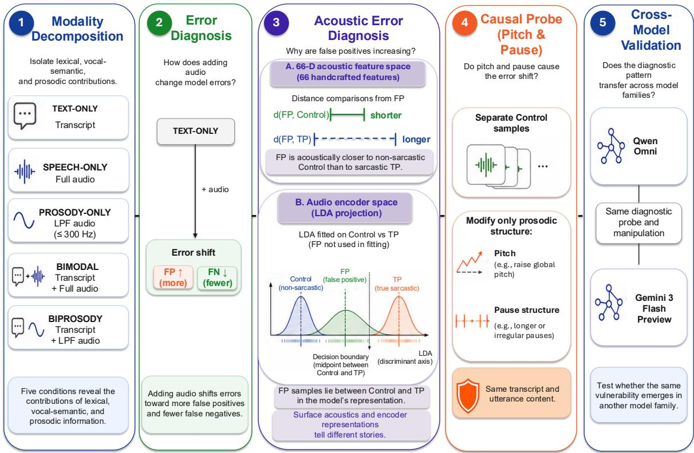  
Figure 1: Overview of the diagnostic framework for multimodal sarcasm detection, from modality decomposition to causal validation.

## 2.3 Modality Conditions

We define five modality conditions that systematically decompose the contributions of lexical content, vocal semantics, and prosodic structure. The three unimodal conditions isolate individual channels. TEXT-ONLY provides the textual semantic baseline, SPEECH-ONLY supplies the full voice signal without text, and PROSODY-ONLY retains only prosodic structure by reducing lexical content from the audio. The two multimodal conditions both pair the transcript with audio but differ in what that audio carries. BIMODAL uses the full voice signal while BIPROSODY uses filtered audio. Because the transcript is held constant across both conditions, any performance gap reflects the contribution of vocal semantics rather than artefacts of the distribution shift introduced by low-pass filtering.

## 2.4 Audio Preprocessing

All audio conditions use speech-enhanced recordings; the prosody-filtered conditions (PROsODY-ONLY and BIPROSODY) additionally apply lowpass filtering to remove lexical content from the signal.

Speech enhancement. Both corpora contain studio audience laughter and background noise that introduce spurious cues and degrade the prosodic signal. We compared two enhancement models, FRCRN\_SE\_16K (Zhao et al., 2022) and MossFormerGAN\_SE\_16K (Zhao and Ma, 2023) against the original audio using DNSMOS P.835 (Reddy et al., 2022), P808 (Naderi and Cutler, 2020), and WVMOS (Andreev et al., 2023). Moss-FormerGAN outperformed FRCRN across all metrics for both languages and was selected for all subsequent processing. Full metric scores, pairwise significance tests, and raw vs. enhanced downstream F1 comparisons are reported in Appendix B.

Low-pass filtering. The PROSODY-ONLY and BIPROSODY conditions require audio from which lexical content has been removed while prosodic structure is preserved. Following Chi et al. (2025), we apply a low-pass filter at 300 Hz, a cutoff empirically validated to retain F0 contours, intensity patterns, and rhythmic structure while removing the high-frequency spectral detail that carries phonemic and word-level identity. The filter is applied to the enhanced audio rather than the original recordings, so that the prosodic signal is not confounded by residual laughter or background noise.

To verify lexical suppression, we transcribe enhanced full-speech and PROSODY-ONLY audio with ASR. CER is 9.01% (EN) and 13.61% (ZH) for full speech, versus 91.11% and 153.74% for PROSODY-ONLY. The Chinese CER above 100% reflects spurious insertions. These results show that word-level information is largely unrecoverable from the low-pass-filtered signal.

## 2.5 Acoustic Feature Extraction

To support the prosodic analyses in later sections, we extract acoustic features from the enhanced audio using Praat (Boersma and Weenink, 2024) via the Parselmouth Python interface (Jadoul et al., 2018). The 66 features fall into four categories: fundamental frequency (20), intensity and energy (17), rhythm and timing (15), and voice quality (14). The full feature list is provided in Appendix D.

## 2.6 Implementation Details

All experiments are conducted using the ms-swift framework (Zhao et al., 2025) with a vLLM backend (Kwon et al., 2023), running on two NVIDIA H100 GPUs. Models are prompted with a binary classification instruction to output true or false to indicate the presence of sarcasm. Three prompt templates are used: text-only for TEXT-ONLY, audio-only shared by SPEECH-ONLY and PROSODY-ONLY, and audio-with-transcript shared by BIMODAL and BIPROSODY. All templates share the same binary classification instruction, ensuring that performance differences within each condition pair are attributable solely to input content. Full templates are provided in Appendix A.

## 3 What Audio Changes: Performance and Error Shifts

Introducing audio does not uniformly improve sarcasm detection. Instead, it shifts the model's error profile, trading missed sarcasm for false alarms. We report F1 performance across all five modality conditions (Figure 2) and directional error analysis across four audio-text contrasts (Figure 3), with per-split breakdowns for both in Appendix C.

## 3.1 Overall Performance by Modality Condition

Two observations stand out from Figure 2.

PROSODY-ONLY collapses. For Omni 3.0, PROsODY-ONLY falls dramatically below all other conditions in both languages: 22.2 % mean F1 in EN and 14.3 % in ZH, well below the 50 % chance baseline. The failure mode is catastrophic conservatism: the model predicts sarcasm on almost no PROsODY-ONLY utterances, yielding near-zero recall. For Omni 2.5, PROSODY-ONLY approaches chance in EN (50.7 %) but appears inflated in ZH (59.6 %), a precision-recall artefact driven by high recall at near-random precision rather than genuine discriminative ability. In both cases the evaluated models show no reliable discriminative ability under this condition, and we therefore exclude PROSODY-ONLY from the error analysis that follows.

Three trends are visible across the functional conditions. BIMODAL is consistently the topranked or joint-top condition across all four model-language panels, with mean gains of +1.0 to +6.8 pp over TEXT-ONLY across splits. BIPROSODY trails BIMODAL by only 1.0–3.7 pp despite receiving filtered rather than full audio, suggesting that vocal semantics contribute marginally to overall F1 and that prosodic contour carries most of the audio effect. The benefit of audio is larger in Chinese than English. Omni 3.0 gains +5.3 pp in ZH but only +2.7 pp in EN for BIMODAL, which we attribute to the informationally richer role of prosody in a tonal language, where vocal acoustics carry lexical content unavailable from the transcript alone. SPEECH-ONLY diverges sharply between models. Omni 3.0 matches or exceeds TEXT-ONLY in both languages (+3.7 pp in ZH, +2.2 pp in EN), whereas Omni 2.5 falls –10.9 pp below TEXT-ONLY in EN and is near-flat in ZH (+2.4 pp), reflecting the limited prosodic extraction capacity of its Whisper-based encoder relative to the purpose-built Audio Transformer in Omni 3.0 (see §2.2).

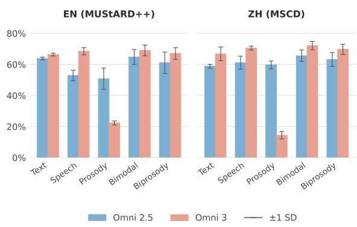  
Figure 2: Mean F1 (%) by modality condition across train (5-fold average), validation, and test splits. Error bars show ±1 SD across splits; tighter bars indicate greater cross-split stability. PROSODY-ONLY is included to establish that isolated prosody is non-functional for this task; it is excluded from the error analysis in §3.2.

## 3.2 Audio Shifts Errors: The False Positive Signature

While F1 captures overall performance trends, it obscures how errors change across conditions. Figure 3 reveals that the F1 gains observed in §3.1 cooccur with a systematic directional bias, whereby adding audio trades false negatives for false positives. We examine this from two baselines, using TEXT-ONLY to isolate what audio adds to a transcript, and SPEECH-ONLY to isolate what a transcript adds to audio.

BIMODAL and BIPROSODY inflate FPs relative to TEXT-ONLY. The left two panels show that both audio conditions push Omni 3.0 consistently into the lower-right quadrant across both languages. BIMODAL adds +9.8 % FP in EN and +8.6 % in ZH (mean across splits), with corresponding FN reductions of -7.5 % and -9.7 %; BIPROSODY produces nearly identical inflation (EN: +12.0 %, ZH: +7.6 %). For Omni 2.5, the same direction holds in ZH (BIMODAL: +4.7 %; BIPROSODY: +7.6 %), while EN shows negligible shifts (+0.1 % and —0.3 % respectively), clustering near the origin.

The transcript activates the mismatch heuristic. The right two panels reveal the complementary pattern: adding a transcript on top of either full speech or prosody-only audio pushes points into the lowerright quadrant across both models and languages, adding 1–12 % of samples as additional false positives. The driving mechanism is the co-presence of a literal transcript and an audio signal: the transcript anchors the verbal content as non-sarcastic, while the audio introduces a perceived tonal contrast that the model interprets as ironic mismatch. Inspection of chain-of-thought traces reveals a characteristic reasoning pattern among these false positives. In a representative case, the BIMODAL trace describes the audio as having a “high-pitched, drawn-out tone" that creates a “clear contradiction between words and tone"; the BIPROSODY trace, operating on prosody-filtered audio without lexical content, arrives at the same conclusion, calling the vocal delivery a “playful exaggeration"that “completely contradicts" the literal transcript (full traces in Appendix K). The convergence across both conditions indicates that the model grounds its mismatch judgment in prosodic contour rather than vocal semantics. Neither the transcript alone nor the audio alone triggers the false alarm; it is their co-presence that does.

## 4 Corpus-Derived Acoustic Profile of Sarcasm

Before exploring what models hear, we investigate what sarcasm sounds like in the two corpora. We compare sarcastic and non-sarcastic utterances using Mann-Whitney U with Cohen's d as the primary effect size, cross-validated across the train, validation, and test partitions. Features are ranked by mean $| d |$ across splits. The goal is to characterise language-specific acoustic profiles and establish corpus-derived cue directions against which model heuristics (§5) can be assessed. The ranked prosodic profiles are in Appendix G.

Chinese (MSCD). The dominant acoustic signature of Mandarin sarcasm is pitch-structural and temporal. The leading features by mean $| d |$ are total pause duration $( d = 0 . 8 0 )$ , utterance duration $( d =$ 0.76), pitch contour complexity (f0\_num\_peaks: $d = 0 . 7 4$ ; f0\_num\_valleys: $d = 0 . 7 4 )$ , and intensity structure (intensity\_num\_peaks: $d = 0 . 7 3 )$ with rhythmic regularity inverted $( d = - 0 . 6 1$ , sarcastic speech less regular). All top features replicate across all three splits; pause\_duration\_total reaches $d = 0 . 9 0$ in the test partition, the only large effect in the analysis. The duration effect replicates the most cross-linguistically stable finding in the sarcasm prosody literature (Cheang and Pell, 2009; Lan and Mok, 2025; Tatár et al., 2026). More distinctive is the dominance of F0 contour complexity over FO level: sarcastic Mandarin is marked by substantially more pitch peaks and valleys $( d \approx 0 . 7 4 )$ while FO mean does not appear among the top discriminating features.

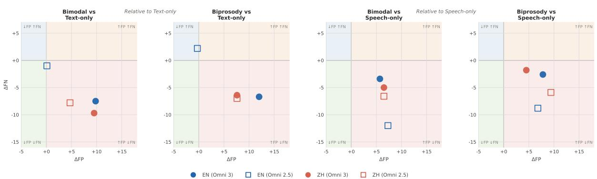  
Figure 3: ∆FP vs. ∆FN for four modality contrasts, grouped by baseline: TEXT-ONLY (left two panels) and SPEECH-ONLY (right two panels). Values are expressed as percentage of total samples; each point represents the mean across train, validation, and test splits. Quadrant shading indicates the direction of error change: lower-right (coral) = ↑FP ↓FN; upper-left (blue) = ↓FP ↑FN; lower-left (green) = ↓FP ↓FN; upper-right (orange) = ↑FP ↑FN. Color encodes language (blue = EN, red = ZH); fill encodes model (filled = Omni 3.0, hollow = Omni 2.5).

English (MUStARD++). The English profile is structurally distinct. The strongest signals are energy-based, with INTENSITY\_MAX (d = 0.47), RMS\_RANGE (d = 0.43), RMS\_MAX (d = 0.43), and RMS\_STD $( d ~ = ~ 0 . 4 1 )$ as the leading features, followed by a lower F0 across mean, median, and minimum (f0\_median: $d = - 0 . 4 0 ; \mathrm { f 0 } .$ \_mean: $d = - 0 . 3 6 ;$ f0\_min: d = −0.30) and longer duration $( d = 0 . 3 2 )$ The lower FO finding replicates the dominant characterisation of English sarcasm (Cheang and Pell, 2008; Chen and Boves, 2018), and the duration effect again confirms the cross-linguistic pattern (Tatár et al., 2026).

The two profiles diverge most sharply on F0 direction: Chinese sarcasm is dominated by pitch contour complexity (not F0 level), while English sarcasm is consistently lower across all three F0 summary statistics (f0\_mean, f0\_median, f0\_min: $d = - 0 . 3 0 \ \mathrm { t o \ - 0 . 4 0 \ \downarrow } )$ , an inversion that holds across all splits. This cross-linguistic divergence is consistent with the broader literature showing that FO mean direction is not a stable cross-linguistic sarcasm cue (Tatár et al., 2026), while duration effects generalise (§1).

## 5 Error Diagnosis: What Do Models Actually Respond To?

Section 3.2 shows that prosodic input systematically inflates false positives across models and languages, but leaves open which acoustic properties drive the effect. We diagnose this through two analyses: two pairwise distance tests ¹ and a featureprofile comparison (§5.2), operating over three groups held constant across ZH and EN: FP utterances are non-sarcastic samples classified correctly from text alone, but flagged as sarcastic under both BIPROSODY and BIMODAL conditions. TP are sarcastic utterances correctly classified across all conditions. Control are non-sarcastic utterances correctly classified under both the BIPROSODY and BIMODAL conditions.

## 5.1 False Positives Are Not Acoustically Near True Sarcasm, but Remain Ambiguous to the Model

Table 2 shows that false-positive utterances sit much closer to non-sarcastic controls than to true sarcasm in the hand-crafted feature space: the FP↔TP centroid distance exceeds FP↔Control by 2.35× (EN) and 3.23× (ZH) under Euclidean distance, and by 6.68× and 20.11× under cosine distance. Measured against corpus acoustics, false positives do not resemble the sarcasm they are mistaken for, and every FP sample individually assigns to the Control centroid in both languages.

The model's audio encoder, however, does not draw the same boundary. Projecting audio encoder embeddings onto the LDA axis fitted to separate Control from TP representations (with FP samples excluded from fitting) places FP significantly between the two groups across all four modellanguage conditions (Mann-Whitney U, $p < . 0 0 1$ Figure 4).² FP representations hover near the midpoint of the Control↔TP discriminant axis, with substantial overlap across all three distributions. Omni 2.5 places FP slightly closer to the sarcastic pole, while Omni 3.0 pulls them marginally toward Control. In neither case does the encoder commit these utterances clearly to either side.

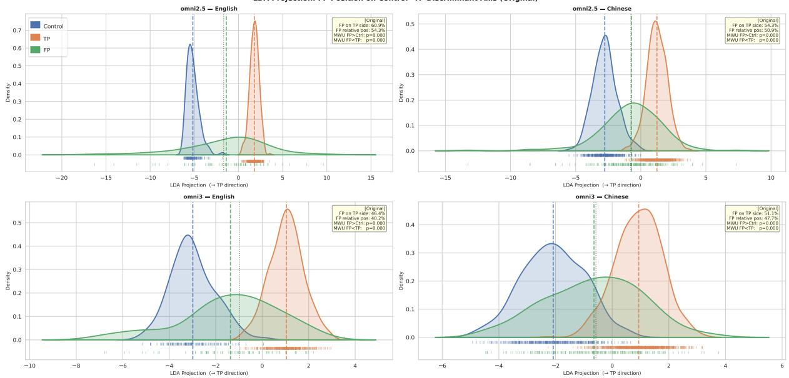  
Figure 4: LDA projection of audio encoder embeddings onto the Control-TP discriminant axis. FP samples consistently fall between Control and TP across all four model–language conditions, although their handcrafted acoustic features are closer to Control. Dashed lines mark group means, and the dotted line marks the midpoint between Control and TP.

The same utterances that pattern unambiguously with Control in acoustic feature space are represented as intermediate by the audio encoder, occupying a region between sarcastic and non-sarcastic speech in the encoder representation space. This indicates that the ambiguity underlying the falsepositive errors is already present at the audio encoding stage, although these results do not determine whether it is further amplified during multimodal fusion. Section 5.2 asks which acoustic properties produce this internal ambiguity.

## 5.2 Feature Profiles of False Positives vs. Controls

Having shown that false positives are acoustically dissimilar from true sarcasm, we characterize their prosodic profile to identify what cues the model responds to instead (full FP-Control rankings in Appendix H).

<table><tr><td>Lang.</td><td>Metric</td><td> $d ( \mathrm { F P } {  } \mathrm { C t r l } )$ </td><td> $d ( \mathrm { F P }  \mathrm { T P } )$ </td><td>Ratio</td></tr><tr><td rowspan="2">EN</td><td>Euclidean</td><td>0.952</td><td>2.238</td><td>2.352</td></tr><tr><td>Cosine</td><td>0.275</td><td>1.834</td><td>6.675</td></tr><tr><td rowspan="2">ZH</td><td>Euclidean</td><td>0.861</td><td>2.784</td><td>3.232</td></tr><tr><td>Cosine</td><td>0.097</td><td>1.951</td><td>20.112</td></tr></table>

Table 2:Centroid distances and ratios d(FP↔TP) / d(FP↔Control); values $> ~ 1$ indicate FP is closer to Control. Sample counts: EN nfp = 69, $n _ { \mathrm { c t r l } } ~ = ~ 1 3 7$ $n _ { \mathrm { t p } } ~ = ~ 3 5 2$ ZH $n _ { \mathrm { f p } } = 1 8 8 .$ nctrl = 391, $n _ { \mathrm { t p } } = 8 0 5$

Chinese (ZH). The top ground-truth discriminators (PAUSE\_DURATION\_TOTAL, DURATION, FO\_NUM\_PEAKS) capture sustained temporal and melodic complexity, none of which drive FP-Control separation. Instead, the model responds to elevated mean F0 $( d ~ = ~ 0 . 3 7 5 )$ and irregular pausing (PAUSE\_DURATION\_STD $d = 0 . 3 6 2 ;$ PAUSE\_DURATION\_MAX $\begin{array} { r c l } { d } & { = } & { 0 . 3 5 5 ) } \end{array}$ , where ground-truth pause effects reflect total duration rather than distributional irregularity.

English (EN). EN yields only four significant FP-Control separators, a sparser profile than ZH, yet the mismatch is sharper. The ground-truth signature is intensity-prominent and F0-suppressed, whereas all four FP-Control separators show elevated F0 (F0\_MAX d = 0.268; F0\_RANGE $d = 0 . 2 5 5 )$ and increased pausing (PAUSE\_RATE $d = 0 . 2 2 3$ ; NUM\_PAUSES $d = 0 . 2 1 5 )$ , positive where ground-truth F0 effects are negative.

Across both languages, model errors cluster on elevated pitch and irregular pausing. In Chinese, this captures surface properties of the same acoustic domains that mark sarcasm (pitch, pausing) but targets the wrong aspects, e.g. pitch level rather than contour complexity, pause irregularity rather than total duration. In English, the mismatch is sharper: the FP profile is directionally opposite to the ground-truth signature, with elevated F0 where sarcasm exhibits suppressed F0. In both cases, the model responds to a cross-linguistic stereotype of expressive speech rather than authentic sarcastic cues. These findings motivate the causal manipulation in §6, which targets pitch level and pause structure because these are the dimensions on which false positives consistently diverge from controls.

## 6 Causal Verification

Section 5 identifies the acoustic profiles that drive false positives; we now test whether these profiles are causally linked to model errors by directly manipulating Control samples to exhibit the FP signature.

## 6.1 Targeted Prosodic Manipulation

Manipulations are derived from the FP-Control acoustic profiles identified in §5.2 and applied to a separate set of Control samples that the models classify correctly under both BIMODAL and BIPROsODY conditions. The samples used to derive the heuristic and those used for causal manipulation are non-overlapping. Thus, the manipulation constitutes an out-of-sample test. Rather than modifying the false-positive utterances from which the acoustic profile was identified, we impose the identified prosodic pattern on previously correctly classified non-sarcastic utterances and test whether the same error is induced.

Manipulations are adapted to the phonological properties of each language (Appendix E). For ZH, the four features with the largest FP-Control effect sizes are targeted, spanning both FO and rhythm: a uniform PSOLA shift of +8.8% raises mean FO, combined with targeted pause elongation to increase both maximum pause duration and distributional irregularity. For EN, all four significant FP-Control separators are targeted: the same PSOLA factor elevates FO, with existing pauses stretched by × 1.49 to produce longer, more salient pauses. Pause insertion was avoided in both languages to preserve naturalness. Manipulation magnitudes are also bounded by the 75th percentile of the FP feature distribution, the upper quartile of naturally occurring FP prosody, ensuring that manipulated samples remain within an empirically observed range rather than producing artificially extreme signals.3 The multi-cue logic is grounded in human perception research: González-Fuente et al. (2016) find that simultaneous modification of pitch and duration in sarcasm-consistent directions improves listener accuracy; Peters et al. (2016) similarly show that increased duration and modified pitch lead English listeners to rate utterances as more sarcastic. These findings provide a principled basis for expecting analogous manipulations to influence model behaviour if models have internalised similar perceptual associations.

## 6.2 Results

The manipulations produce substantial FP rate increases across both languages and models (Figure 5), confirming that the acoustic profiles identified in §5.2 are causally linked to model errors rather than coincidental correlates. ZH FP rates rise to 19.35–40.65% depending on model and condition; EN rates reach 33.55–60.53%, with Omni 3.0 under BIPROSODY showing the highest attack-induced rate across all conditions. These rates were achieved by modifying only two dimensions, i.e. pitch and pausing.

For Omni 3.0, a consistent biprosody > bimodal ordering emerges in both languages. We interpret this as a modality context effect: in BIMODAL conditions, the acoustic content of full speech provides a grounding context against which manipulated prosodic features are normalised, partially suppressing their impact. In BIPROSODY, this grounding is absent. The model receives only a prosody-only audio signal alongside the transcript, and the contrast between the literal textual content and the manipulated prosodic signal is rendered more salient, amplifying the mismatch heuristic identified in §3.2. Chain-of-thought analysis on a representative ZH sample illustrates the mechanism (full trace in Appendix K): the same +8.8% F0 manipulation is described as “light, cheerful, amused" under BIMODAL, but as “strained, high-pitched, forced laughter" under BIPROSODY, where the absence of vocal semantics causes the model to interpret identical prosody as mocking rather than expressive. This suggests that prosodic features do not carry fixed perceptual weight for these models, but are interpreted relative to the broader acoustic context in which they occur. Reverse manipulation, shifting FP samples toward control-like prosodic targets, partially recovers correct classification across both languages and models (29.5– 56.3 % flip rates; Appendix I), providing complementary bidirectional evidence for the causal role of elevated FO and irregular pausing.

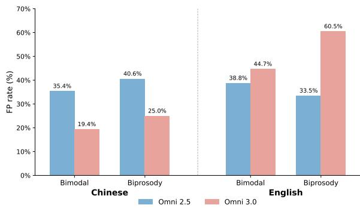  
Figure 5: FP rates after prosodic manipulation, computed as the proportion of Control samples misclassified as sarcastic following manipulation. $\mathrm { Z H } n = 2 6 8 $ EN $n = 9 5$

## 6.3 Model Transfer

To test whether the identified heuristic generalises beyond the Qwen Omni family, we evaluated Gemini 3 Flash Preview (Google DeepMind, 2025) on the same corpora and modality conditions. The pattern mirrors that of the Omni models. Adding audio inflates false positives relative to TEXT-ONLY across both languages and all three audio conditions, with BIMODAL and BIPROSODY producing the largest ∆FP in EN (+13.2 pp and +13.6pp respectively), replicating the core error signature without any model-family-specific tuning (Table 3).

To further probe the causal role of pitch and pausing, we applied the same manipulation template derived from the Omni FP profiles (Appendix E) to Gemini without modification. The manipulation transfers across all three audio conditions and both languages, with flip rates ranging from 4.7 % to 17.1 % depending on condition and language (Table 3). That a template derived from a different model family induces systematic misclassification in Gemini confirms that the vulnerability to elevated pitch and irregular pausing is not an artefact of the Qwen architecture. Flip rates are lower than those observed for the Omni models, consistent with differences in audio encoding capacity between the two families.

<table><tr><td></td><td colspan="3">EN (MUStARD++)</td><td colspan="3">ZH (MSCD)</td></tr><tr><td>Condition</td><td>F1</td><td>∆FP</td><td>Flip</td><td>F1</td><td>∆FP</td><td>Flip</td></tr><tr><td>TEXT-ONLY</td><td>69.6</td><td></td><td></td><td>76.4</td><td></td><td></td></tr><tr><td>SPEECH-ONLY</td><td></td><td> $7 1 . 6 \quad + 6 . 3 $ </td><td>17.1</td><td>76.3</td><td> $+ 4 . 2$ </td><td>8.9</td></tr><tr><td>BIMODAL</td><td></td><td> $7 4 . 7 \quad + 1 3 . 2 \quad$ </td><td>14.3</td><td>77.0</td><td> $+ 4 . 6$ </td><td>5.0</td></tr><tr><td>BIPROSODY</td><td></td><td> $7 3 . 0 \quad + 1 3 . 6 \quad$ </td><td>17.1</td><td>76.8</td><td>+4.5</td><td>4.7</td></tr></table>

Table 3: Gemini 3 Flash Preview: mean F1 (%), ∆FP (percentage-point change relative to TEXT-ONLY), and FP flip rate (%) under the Omni-derived manipulation template across all three audio conditions.

## 7 Conclusion

We evaluated two MLLMs on English and Mandarin Chinese sarcasm corpora under five modality conditions and found that prosodic audio systematically inflates false positives without improving true positive detection. Acoustic error diagnosis reveals that false positive utterances are not acoustically close to genuine sarcasm. Instead, model errors track a language-independent stereotype of expressive prosody, namely elevated pitch and irregular pausing, that diverges from the actual sarcasm signatures in both languages. Targeted prosodic manipulation causally confirms this heuristic, inducing false positive rates of up to 60% by modifying only two acoustic dimensions, pitch level and pause structure, neither of which aligns with the corpusderived prosodic signatures of sarcasm in either language. The pattern holds across both models, both languages, and Gemini 3 Flash Preview, a closed-source model from a different developer demonstrating that the shallow prosodic stereotype is not a property of any single model family but a broader failure mode of current MLLMs. These findings suggest that acquiring genuine paralinguistic grounding will require explicit alignment between prosodic representations and languagespecific pragmatic cues, rather than reliance on surface acoustic correlations. These findings point to the value of targeted diagnostic evaluation that assesses whether models have internalised linguistically grounded prosodic knowledge, rather than relying on aggregate performance metrics alone.

## Limitations

While our results are consistent across model scales, languages, and evaluation splits, three aspects of the current design leave room for further investigation.

Corpus scope. Both MSCD and MUStARD++ consist of performative television speech. The acoustic profiles in §4 therefore reflect the speech contexts represented in these benchmarks and may not fully generalise to spontaneous everyday interaction. We are not aware of a comparable naturalinteraction corpus with paired audio and sarcasm labels. This limitation primarily concerns the external generality of the corpus-derived acoustic profiles, whereas the causal manipulation in §6 is conducted within the same recordings with lexical content and recording context held fixed.

Training implications. Our findings identify elevated pitch and irregular pausing as the operative dimensions of a shallow prosodic stereotype, providing concrete targets for future training interventions. Contrastive augmentation pairing identical transcripts with prosodically distinct audio would force models to learn that surface acoustic patterns do not reliably signal pragmatic intent. Reinforcement learning objectives that reward sensitivity to language-specific prosodic cues over surface acoustic correlations are a complementary direction; Wang et al. (2026) demonstrate that exactly this kind of prosody-aware RL intervention improves acoustic reasoning in speech emotion recognition without sacrificing text-based performance, suggesting the approach is viable for paralinguistic tasks more broadly.

Mechanism localisation. Our LDA analysis (§5.1) shows that the audio encoder already places false positive utterances in an ambiguous region between sarcastic and non-sarcastic representations, but this characterises the encoder in isolation. Probing the intermediate stages of this interaction, where prosodic representations meet textual grounding, would clarify whether the bias is inherited from the encoder or constructed during fusion, and point to more targeted interventions.

## References

Pavel Andreev, Aibek Alanov, Oleg Ivanov, and Dmitry P. Vetrov. 2023. HIFI++: A unified frame-

work for bandwidth extension and speech enhancement. In Proceedings of ICASSP 2023, pages 1–5.

Luigi Anolli, Rita Ciceri, and Maria Giaele Infantino. 2002. From “blame by praise" to “praise by blame": Analysis of vocal patterns in ironic communication. International Journal of Psychology, 37(5):266–276.

Paul Boersma and David Weenink. 2024. Praat: Doing phonetics by computer. Computer program. Version 6.4, retrieved from http://www.praat.org/.

Henry S. Cheang and Marc D. Pell. 2008. The sound of sarcasm. Speech Communication, 50(5):366–381.

Henry S. Cheang and Marc D. Pell. 2009. Acoustic markers of sarcasm in Cantonese and English. The Journal of the Acoustical Society of America, 126(3):1394–1405.

Aoju Chen and Lou Boves. 2018. What's in a word: Sounding sarcastic in British English. Journal of the International Phonetic Association, 48(1):57–76.

Jie Chi, Maureen de Seyssel, and Natalie Schluter. 2025. The role of prosody in spoken question answering. In Findings of the Association for Computational Linguistics: NAACL 2025, pages 8483–8494, Albuquerque, New Mexico. Association for Computational Linguistics.

Yunfei Chu, Jin Xu, Xiaohuan Zhou, Qian Yang, Shiliang Zhang, Zhijie Yan, Chang Zhou, and Jingren Zhou. 2023. Qwen-Audio: Advancing universal audio understanding via unified large-scale audiolanguage models. Preprint, arXiv:2311.07919.

Pedro Corrêa, João Lima, Victor Moreno, Lucas Ueda, and Paula Dornhofer Paro Costa. 2025. Evaluating emotion recognition in spoken language models on emotionally incongruent speech. Preprint, arXiv:2510.25054.

Xiyuan Gao, Shekhar Nayak, and Matt Coler. 2025a. Spoken in jest, detected in earnest: A systematic review of sarcasm recognition—multimodal fusion, challenges, and future prospects. IEEE Transactions on Affective Computing, 16:2526–2544.

Xiyuan Gao, Bruce Xiao Wang, Meiling Zhang, Shuming Huang, Zhu Li, Shekhar Nayak, and Matt Coler. 2025b. A multimodal Chinese dataset for crosslingual sarcasm detection. In Proceedings of Interspeech 2025, pages 3968–3972.

Puyang Geng, Shaopei Shi, and Hong Guo. 2021. The coding strategy for the Mandarin speech conveying sarcasm in acoustic and articulatory domain. In Proceedings of the 2021 5th International Conference on Digital Signal Processing, pages 195–200.

Santiago González-Fuente, Pilar Prieto, and Ira Noveck. 2016. A fine-grained analysis of the acoustic cues involved in verbal irony recognition in French. In Proceedings of Speech Prosody 2016, pages 902– 906.

Google DeepMind. 2025. Gemini 3 Pro model card.

Yannick Jadoul, Bill D. Thompson, and Bart G. de Boer. 2018. Introducing Parselmouth: A Python interface to Praat. Journal of Phonetics, 71:1–15.

Nelleke Jansen and Aoju Chen. 2020. Prosodic encoding of sarcasm at the sentence level in Dutch. In Proceedings of Speech Prosody 2020, pages 409–413.

Woosuk Kwon, Zhuohan Li, Siyuan Zhuang, Ying Sheng, Lianmin Zheng, Cody Hao Yu, Joseph Gonzalez, Hao Zhang, and Ion Stoica. 2023. Efficient memory management for large language model serving with PagedAttention. In Proceedings of the 29th Symposium on Operating Systems Principles, SOSP’23, pages 611–626.

Chen Lan and Peggy Mok. 2025. Acoustic cues in the production and perception of Cantonese sarcasm. Language and Speech.

Shanpeng Li, Wentao Gu, Lei Liu, and Ping Tang. 2020. The role of voice quality in Mandarin sarcastic speech: An acoustic and electroglottographic study. Journal of Speech, Language, and Hearing Research, 63:2578–2588.

Zhu Li, Xiyuan Gao, Yuqing Zhang, Shekhar Nayak, and Matt Coler. 2025. Evaluating multimodal large language models on spoken sarcasm understanding. Preprint, arXiv:2509.15476.

Maël Mauchand, Jonathan A. Caballero, Xiaoming Jiang, and Marc D. Pell. 2021. Immediate online use of prosody reveals the ironic intentions of a speaker: Neurophysiological evidence. Cognitive, Affective, & Behavioral Neuroscience, 21(1):74–92.

Babak Naderi and Ross Cutler. 2020. An open source implementation of ITU-T recommendation P.808 with validation. In Proceedings of Interspeech 2020.

Jing Peng, Yucheng Wang, Bohan Li, Yiwei Guo, Hankun Wang, Yangui Fang, Yu Xi, Haoyu Li, Xu Li, Kexin Zhang, Shuai Wang, and Kai Yu. 2024. A survey on speech large language models for understanding. IEEE Journal of Selected Topics in Signal Processing, 20:2–31.

Sara Peters, Kathryn Wilson, Timothy W. Boiteau, Carlos Gelormini-Lezama, and Amit Almor. 2016. Do you hear it now? A native advantage for sarcasm processing. Bilingualism: Language and Cognition, 19(2):400–414.

Alec Radford, Jong Wook Kim, Tao Xu, Greg Brockman, Christine McLeavey, and Ilya Sutskever. 2023. Robust speech recognition via large-scale weak supervision. In Proceedings of the 40th International Conference on Machine Learning, ICML'23.

Anupama Ray, Shubham Mishra, Apoorva Nunna, and Pushpak Bhattacharyya. 2022. A multimodal corpus for emotion recognition in sarcasm. In Proceedings of the Thirteenth Language Resources and Evaluation Conference, pages 6992–7003, Marseille, France. European Language Resources Association.

Chandan K. A. Reddy, Vishak Gopal, and Ross Cutler. 2022. DNSMOS P.835: A non-intrusive perceptual objective speech quality metric to evaluate noise suppressors. In Proceedings of ICASSP 2022, pages 886–890.

Patricia Rockwell. 2000. Lower, slower, louder: Vocal cues of sarcasm. Journal of Psycholinguistic Research, 29(5):483–495.

Yandong Sun, Qiang Huang, Ziwei Xu, Yiqun Sun, Yixuan Tang, and Anthony KH Tung. 2025. One swallow does not make a summer: Understanding semantic structures in embedding spaces. arXiv preprint arXiv:2512.00852.

Yiqun Sun, Qiang Huang, Anthony Kum Hoe Tung, and Jun Yu. 2026. Position: Text embeddings should capture implicit semantics, not just surface meaning. In Forty-third International Conference on Machine Learning Position Paper Track.

Changli Tang, Wenyi Yu, Guangzhi Sun, Xianzhao Chen, Tian Tan, Wei Li, Lu Lu, Zejun Ma, and Chao Zhang. 2023a. SALMONN: Towards generic hearing abilities for large language models. Preprint, arXiv:2310.13289.

Yixuan Tang and Anthony KH Tung. 2024. Contextualized speech recognition: Rethinking second-pass rescoring with generative large language models. In IJCAI, pages 6478–6485.

Yixuan Tang, Anthony KH Tung, and Edith Elkind. 2023b. Squad-src: A dataset for multi-accent spoken reading comprehension. In IJCAI, pages 5206–5214.

Csilla Tatár, Jonathan R. Brennan, Jelena Krivokapić and Ezra Keshet. 2026. Does prosody mark sarcasm early in an utterance? A production and perception study, including listeners who self-identified as being on the autism spectrum. Journal of the International Phonetic Association, pages 1–40.

Dingdong Wang, Shujie Liu, Tianhua Zhang, Youjun Chen, Jinyu Li, and Helen Meng. 2026. Emotionthinker: Prosody-aware reinforcement learning for explainable speech emotion reasoning. In International Conference on Learning Representations (ICLR).

Jin Xu, Zhifang Guo, Jinzheng He, Hangrui Hu, Ting He, Shuai Bai, Keqin Chen, Jialin Wang, Yang Fan Kai Dang, Bin Zhang, Xiong Wang, Yunfei Chu, and Junyang Lin. 2025. Qwen2.5-Omni technical report. Preprint, arXiv:2503.20215.

An Yang, Anfeng Li, Baosong Yang, Beichen Zhang Binyuan Hui, Bo Zheng, Bowen Yu, Chang Gao, Chengen Huang, Chenxu Lv, Chujie Zheng, Dayiheng Liu, Fan Zhou, Fei Huang, Feng Hu, Hao Ge, Haoran Wei, Huan Lin, Jialong Tang, and 41 others. 2025. Qwen3 technical report. Preprint arXiv:2505.09388.

Shengkui Zhao and Bin Ma. 2023. MossFormer: Pushing the performance limit of monaural speech separation using gated single-head transformer with convolution-augmented joint self-attentions. In Proceedings of ICASSP 2023, pages 1–5.

Shengkui Zhao, Bin Ma, Karn N. Watcharasupat, and W. S. Gan. 2022. FRCRN: Boosting feature representation using frequency recurrence for monaural speech enhancement. In Proceedings of ICASSP 2022, pages 9281–9285.

Yuze Zhao, Jintao Huang, Jinghan Hu, Xingjun Wang, Yunlin Mao, Daoze Zhang, Zeyinzi Jiang, Zhikai Wu, Baole Ai, Ang Wang, Wenmeng Zhou, and Yingda Chen. 2025. SWIFT: A scalable lightweight infrastructure for fine-tuning. In Proceedings of the Thirty-Ninth AAAI Conference on Artificial Intelligence, AAAI'25.

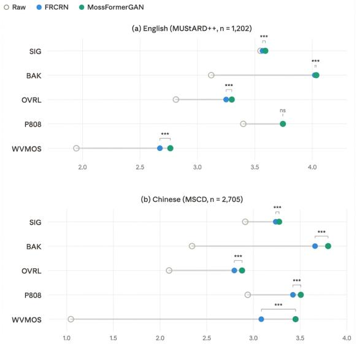

## A Prompt Templates

Figure 6 shows the three prompt templates used across all modality conditions. TEXT-ONLY receives a text-only prompt; SPEECH-ONLY and PROSODY-ONLY share an audio-only prompt; BI-MODAL and BIPROSODY share an audio-withtranscript prompt. All three templates share the same binary classification instruction and differ only in whether the input is text, audio, or audio paired with a transcript, ensuring that any performance difference between conditions cannot be attributed to prompt variation.

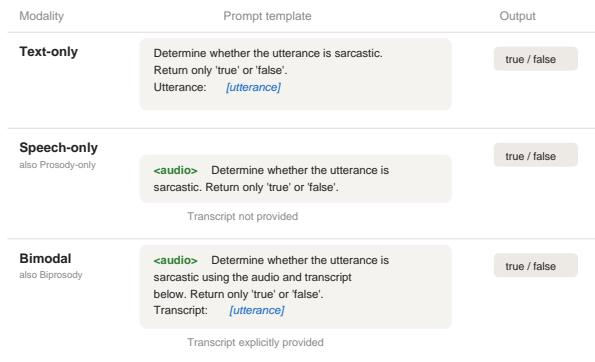  
Figure 6: Prompt templates for each experimental condition. SPEECH-ONLY and PROSODY-ONLY share the same template (audio only); BIMODAL and BIPROSODY share the same template (audio + transcript). Conditions differ in whether the audio carries the full voice signal or only prosodic structure.

## B Speech Enhancement: Full Results

## Perceptual Quality

Figure 7 presents the full DNSMOS P.835, P808, and WVMOS scores comparing raw audio against FRCRN and MossFormerGAN enhancements. Both models significantly improve over raw audio across all metrics (paired t-test, $p < 0 . 0 0 1 )$ MossFormerGAN further outperforms FRCRN on all metrics $( p < 0 . 0 0 1 )$ ), except P808 on English, where the difference is not significant $( p = 0 . 2 3 3 )$ 1

## Raw vs. Enhanced: Downstream Speech-Only F1

Although MossFormerGAN improves perceptual quality, we examine whether this translates to downstream gains in the speech-only sarcasm detection setting. Figure 8 compares speech-only F1 on raw vs. MossFormerGAN-enhanced audio. Panel (a) shows the F1 change (Enhanced — Raw) across train, validation and test splits for each

Figure 7: Perceptual quality scores (DNSMOS P.835) for English (MUStARD++, n=1,202) and Chinese (MSCD, n=2,705). Hollow circles indicate raw audio; filled circles indicate enhanced audio (blue = FRCRN, green = MossFormerGAN). Connecting lines span from raw to the better-performing model. Both models significantly improve over raw across all metrics (paired t-test, p < 0.001). Brackets show pairwise significance between FRCRN and MossFormerGAN: \*\*\* $p < 0 . 0 0 1$ ns = not significant.

language-model combination. Enhancement generally decreases F1, with the largest drops on English. Panel (b) decomposes this into false positive and false negative changes: enhancement consistently reduces FPs (orange bars below zero) but increases FNs (red bars above zero), indicating that the enhanced audio trades missed sarcasm detections for fewer false alarms. The net effect is an F1 decrease driven by the FN increase.

## C Per-Split Results

All models are evaluated zero-shot. The original training split is partitioned into five folds, which are evaluated independently as repeated evaluation runs rather than for model fitting. Table 4 reports the F1 scores for each training fold across all five modality conditions. Figures 9 and 10 show the per-split breakdowns of the main results in §3.1 and §3.2 respectively. The consistent patterns across the training, validation, and test splits confirm that the observed findings are not artefacts of any particular data partition.

(a) F1 Change After Enhancement  
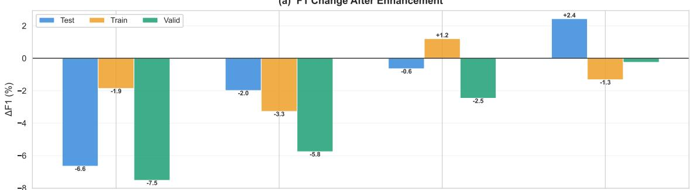

(b) FP & FN Change After Enhancement (↑FN drives ↓F1)  
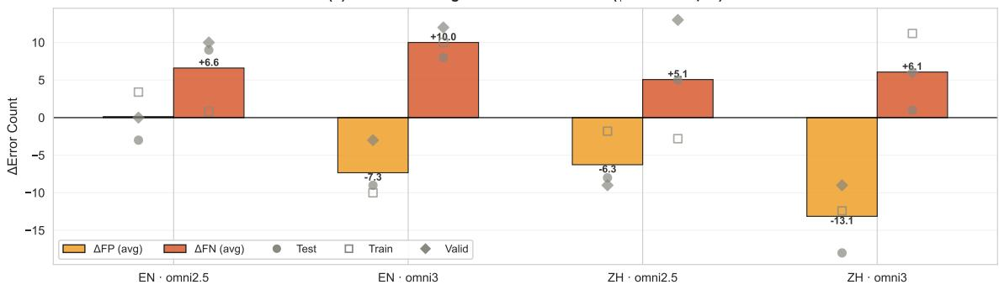  
Figure 8: Downstream impact of speech enhancement on sarcasm detection. (a) F1 change after enhancement across splits and conditions. (b) FP and FN count changes (mean bars with individual split markers); ↑FN drives ↓F1.

## D Acoustic Feature List

Table 5 lists the 66 acoustic features used in Sections 4–6, extracted with Praat/Parselmouth. IOI: inter-onset interval; HNR: harmonics-to-noise ratio; CV: coefficient of variation.

## E Manipulation Targets and Actual Outputs

Table 6 reports the manipulation targets derived from the FP–Control acoustic profiles (§5.2) and the actual PSOLA outputs. √ = on target; ≈ = approximated within acceptable margin; † = target feature redefined (see main text).

## F Naturalness Validation

Table 7 reports the full CER and DNSMOS metrics for manipulated stimuli. CER differences are negligible for Chinese (0.084 vs. 0.079; bootstrap 95 % CI crosses zero) and minimal for English (increase of 0.017). DNSMOS OVRL scores decrease by 0.30 (EN) and 0.17 (ZH). The weak sample-level CER-MOS correlation $( | r | < 0 . 1 5 )$ confirms that perceptual quality changes do not systematically impair intelligibility.

## G Prosodic Feature Ranking (Sarcastic vs. Non-Sarcastic)

Figures 11 and 12 show the top-10 prosodic features distinguishing sarcastic from non-sarcastic utterances, ranked by signed mean Cohen's d across train/valid/test splits (Mann-Whitney U). Positive values indicate higher feature values in sarcastic speech; negative values indicate higher values in non-sarcastic speech. Filled dots beside each bar denote the number of splits (out of 3) reaching significance $( p < 0 . 0 5 )$ .

For Chinese (Figure 11), the effect sizes are large and dominated by rhythm and timing features (pause\_dur. total, duration, num\_onsets), with all top-10 features reaching significance in 3/3 splits. Sarcastic utterances are longer, contain more pauses, and show reduced rhythmic regularity (rhythmic\_regularity, $d < 0 )$ . The largest negative effect is hnr\_min $( d = - 0 . 6 9 )$ , indicating that sarcastic speech reaches lower harmonics-tonoise ratios, consistent with moments of breathier or rougher voice quality.

For English (Figure 12), the strongest discriminators are intensity- and energy-related features (e.g. intensity\_max, rms\_range), with sarcastic utterances exhibiting greater dynamic range. Fundamental frequency features (f0\_median, f0\_mean) show the opposite pattern: sarcastic speech has a lower pitch register overall. Notably, pause\_dur. std ranks 7th by absolute effect size but reaches significance in 0/3 splits, suggesting that its effect is unstable across data partitions.

<table><tr><td>Language</td><td>Model</td><td>Modality</td><td>Fold 1</td><td>Fold 2</td><td>Fold 3</td><td>Fold 4</td><td>Fold 5</td><td>Mean ± SD</td></tr><tr><td rowspan="8">EN</td><td rowspan="4">Omni 2.5</td><td>Text</td><td>60.96</td><td>67.72</td><td>62.56</td><td>62.83</td><td>62.11</td><td> $6 3 . 2 4 \pm 2 . 6 1$ </td></tr><tr><td>Speech</td><td>47.27</td><td>56.41</td><td>54.78</td><td>50.31</td><td>52.76</td><td> $5 2 . 3 1 \pm 3 . 6 2$ </td></tr><tr><td>Prosody</td><td>54.22</td><td>45.16</td><td>52.94</td><td>47.13</td><td>51.95</td><td> $5 0 . 2 8 \pm 3 . 9 2$ </td></tr><tr><td>Bimodal Biprosody</td><td>61.20 54.05</td><td>64.48 62.11</td><td>56.83 60.34</td><td>58.64 54.95</td><td>60.32 60.54</td><td> $6 0 . 2 9 \pm 2 . 8 8$ </td></tr><tr><td>Text</td><td></td><td></td><td></td><td></td><td></td><td> $5 8 . 4 0 \pm 3 . 6 4$ </td></tr><tr><td rowspan="5">Omni 3</td><td>Speech</td><td>66.28 66.67</td><td>68.57</td><td>66.67</td><td>67.80</td><td>66.67</td><td> $6 7 . 2 0 \pm 0 . 9 5$ </td></tr><tr><td></td><td></td><td>70.33</td><td>63.39</td><td>61.29</td><td>71.36</td><td> $6 6 . 6 1 \pm 4 . 3 3$ </td></tr><tr><td>Prosody</td><td>29.36</td><td>16.33</td><td>21.78</td><td>20.75</td><td>30.48</td><td> $2 3 . 7 4 \pm 6 . 0 1$ </td></tr><tr><td>Bimodal</td><td>63.73</td><td>68.00</td><td>63.00</td><td>63.73</td><td>69.19</td><td> $6 5 . 5 3 \pm 2 . 8 5$ </td></tr><tr><td>Biprosody</td><td>59.05</td><td>66.04</td><td>64.79</td><td>63.51</td><td>60.61</td><td> $6 2 . 8 0 \pm 2 . 9 1$ </td></tr><tr><td rowspan="8">ZH</td><td rowspan="5">Omni 2.5</td><td>Text</td><td>61.11</td><td>61.39</td><td>56.63</td><td>58.25</td><td>60.29</td><td> $5 9 . 5 3 \pm 2 . 0 4$ </td></tr><tr><td>Speech</td><td>60.85</td><td>64.42</td><td>62.09</td><td>66.03</td><td>62.16</td><td> $6 3 . 1 1 \pm 2 . 0 8$ </td></tr><tr><td>Prosody</td><td>59.08</td><td>55.82</td><td>60.53</td><td>58.98</td><td>60.74</td><td> $5 9 . 0 3 \pm 1 . 9 6$ </td></tr><tr><td>Bimodal</td><td>66.67</td><td>64.77</td><td>65.16</td><td>65.81</td><td>65.30</td><td> $6 5 . 5 4 \pm 0 . 7 3$ </td></tr><tr><td>Biprosody</td><td>61.17</td><td>66.81</td><td>65.65</td><td>64.26</td><td>62.37</td><td> $6 4 . 0 5 \pm 2 . 3 1$ </td></tr><tr><td>Text</td><td>67.67</td><td>71.10</td><td></td><td></td><td></td><td></td></tr><tr><td rowspan="5"></td><td>Omni 3</td><td>70.34</td><td></td><td>65.52</td><td>67.66</td><td>66.67</td><td> $6 7 . 7 2 \pm 2 . 0 9$ </td></tr><tr><td>Speech</td><td></td><td>66.82</td><td>69.81</td><td>71.93</td><td>69.01</td><td> $6 9 . 5 8 \pm 1 . 8 8$ </td></tr><tr><td>Prosody</td><td>9.30</td><td>13.27</td><td>9.30</td><td>15.24</td><td>10.91</td><td> $1 1 . 6 1 \pm 2 . 6 0$ </td></tr><tr><td>Bimodal</td><td>73.46</td><td>70.74</td><td>70.32</td><td>73.23</td><td>69.60</td><td> $7 1 . 4 7 \pm 1 . 7 6$ </td></tr><tr><td>Biprosody</td><td>67.54</td><td>70.90</td><td>67.43</td><td>72.94</td><td>68.14</td><td> $6 9 . 3 9 \pm 2 . 4 3$ </td></tr></table>

Table 4: Per-fold F1 scores (%) on the original training partition across all five modality conditions. Mean ± SD is computed across the five training folds. All models are evaluated zero-shot; the folds are used as repeated evaluation runs rather than for model fitting

<table><tr><td>Category</td><td>Features</td></tr><tr><td>quency (20)</td><td>Fundamental fre- mean, median, std, min, max, range, IQR, CV, skewness, kurtosis, voiced fraction; velocity mean/std, acceleration mean/std; num. peaks/valleys, peak/valley density, peak-valley ratio</td></tr><tr><td>ergy (17)</td><td>Intensity &amp; en- mean, median, std, min, max, range, CV, skewness, kurtosis; num. peaks, peak density, peak prominence mean/std; RMS mean, std, max, range</td></tr><tr><td>ing (15)</td><td>Rhythm &amp; tim- duration, num. onsets, speech rate; IOI mean, median, std, CV, range, rhyth- mic regularity; num. pauses, pause rate, pause duration mean/std/total, pause frac-</td></tr><tr><td>Voice (14)</td><td>tion quality HNR mean, median, std, min, max; jit- ter, shimmer; spectral centroid mean/std, rolloff mean, bandwidth mean, flatness mean; zero-crossing rate mean/std</td></tr><tr><td>Total</td><td>66 features</td></tr></table>

Table 5: Full acoustic feature set (four categories).

## H False Positive vs. Control Feature Profiles

Figures 13 and 14 show the top-10 features separating false positive (FP) utterances from matched non-sarcastic controls, ranked by signed Cohen's d $( \mathrm { F P - C o n t r o l ) }$ . Features marked with \* reach significance $( p < 0 . 0 5$ , Mann-Whitney U). Dashed lines indicate $| d | = 0 . 2$ (small effect threshold).

For Chinese (Figure 13), all 10 features are significant and positively directed, indicating that FP utterances exhibit higher values than controls. The profile is dominated by F0 features (f0\_mean, f0\_median, f0\_max, f0\_range, f0\_std, f0\_iqr, f0\_peak\_density) and pause irregularity (pause\_duration\_std, pause\_duration\_max). This contrasts with the ground-truth sarcasm signature (Appendix G), where temporal features such as pause\_duration\_total and duration dominate.

For English (Figure 14), only 4 of 10 features reach significance (f0\_max, f0\_range, pause\_rate, num\_pauses). The significant features are all positively directed, with elevated pitch extremes and increased pausing. The increased F0 statistics are directionally opposite to the groundtruth English sarcasm profile, where FO features are negative (sarcastic speech has lower pitch). Two negative features (rhythmic\_regularity, voiced\_fraction) suggest FP utterances are also less rhythmically regular and less continuously voiced than controls.

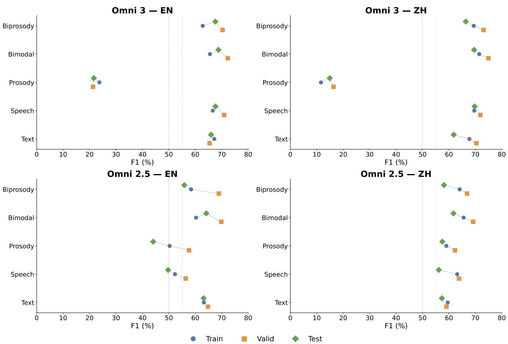  
Figure 9: F1 (%) by modality condition for both models and languages. Each condition shows three points (train, valid, test); tighter clustering indicates greater cross-split stability. Dashed line marks the 50 % chance baseline. PROSODY-ONLY is excluded from the error analysis in §3.2.

## I Reverse Manipulation Results

To provide bidirectional causal evidence, we shifted FP samples toward control-like prosodic targets by reversing the manipulation directions applied in §6.1. Table 8 reports the correction rates, defined as the fraction of FP samples whose prediction flips to non-sarcastic following the reverse manipulation. Partial recovery is expected given that FP samples may carry additional acoustic or contextual features beyond the two targeted dimensions.

## J Gemini 3 Flash Preview: Extended Results

The Omni-derived manipulation template, which targets elevated FO and irregular pausing, transfers to Gemini 3 Flash Preview with non-trivial flip rates across all conditions (§6.3), establishing that the prosodic heuristic is not confined to the

Qwen MLLMs. To characterise Gemini 3's own FP acoustic profile, we applied the same FP-Control acoustic analysis described in §5.2 and derived a language-specific manipulation template from the resulting geometry.

Gemini 3's FP-Control geometry reveals that the prosodic heuristic operates through partially distinct acoustic dimensions across model families. For Chinese, FP utterances are characterised by higher RMS energy, intensity variability, and F0 contour activity, dimensions not targeted by the Omni-derived template, which explains the lower Chinese transfer rates. For English, the FP profile involves elevated central pitch, reduced F0 contour complexity, and slower temporal structure, partially overlapping with the Omni template and consistent with the higher English transfer rates observed in §6.3. The Gemini-specific template, which directly targets these dimensions, produces higher flip rates across both conditions and languages, with the largest gain in English SPEECH-ONLY $( \Delta = + 2 1 . 0 \mathrm { p p } )$ , confirming that the heuristic is operative in Gemini 3 and that the cross-model transfer rates reflect a partial rather than complete instantiation of the same vulnerability.

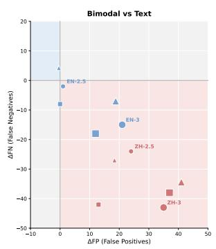

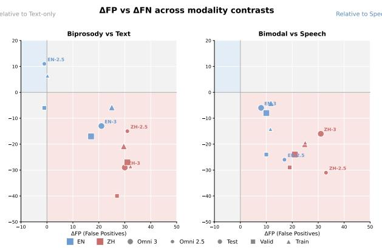

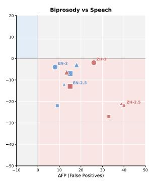

Figure 10: ∆FP vs. ∆FN for four modality contrasts across all three splits. Marker shape encodes split (circle = test, square = valid, triangle = train). Color encodes language (blue = EN, red = ZH); size encodes model (larger = Omni 3.0). The lower-right quadrant pattern replicates consistently across all splits.
<table><tr><td>Lang.</td><td>Feature</td><td>FP-Control</td><td>Target</td><td>Actual</td><td>Status</td></tr><tr><td rowspan="4">ZH</td><td>FO_MEAN</td><td> $+ 1 5 . 6 \mathrm { H z } \left( + 8 . 8 \% \right)$ </td><td>×1.088</td><td>×1.088</td><td>√</td></tr><tr><td>FO_MEDIAN</td><td>+16.0 Hz (+9.3%)</td><td>×1.093</td><td>×1.088</td><td>≈</td></tr><tr><td>PAUSE_DUR. MAX</td><td>+0.18 sec (+27.1%)</td><td>×1.271</td><td>×1.271</td><td>√</td></tr><tr><td>PAUSE_DUR. STD</td><td>+0.07 sec (+41.5%)</td><td>×1.415</td><td> $\sim \times 1 . 4 1 5$ </td><td>≈</td></tr><tr><td rowspan="3">EN</td><td>FO_MAX</td><td>+19.0 Hz (+7.1%)</td><td>×1.071</td><td>×1.088</td><td>≈</td></tr><tr><td>FO_RANGE</td><td> $+ 1 6 . 1 \mathrm { H z } \left( + 1 0 . 4 \% \right)$ </td><td>×1.104</td><td></td><td></td></tr><tr><td>PAUSE DURATION</td><td></td><td>×1.490</td><td>×1.490</td><td>†</td></tr></table>

Table 6: Manipulation targets and actual outputs. FP-Control column shows the observed difference between FP and Control groups from §5.2, which motivates each manipulation magnitude. ${ \checkmark } = \mathbf { o n }$ target; ≈ = approximated within acceptable margin; † = target feature redefined (see text). EN FO\_MAX and F0\_RANGE share a single PSOLA factor (averaged ×1.088), overshooting F0\_MAX and undershooting F0\_RANGE by comparable margins. EN pause insertion was avoided to preserve naturalness; existing pauses are instead elongated by ×1.49.

<table><tr><td rowspan="2">Metric</td><td colspan="2">EN (MUStARD++)</td><td colspan="2">ZH (MSCD)</td></tr><tr><td>Clean</td><td>Manip.</td><td>Clean</td><td>Manip.</td></tr><tr><td>CER</td><td>0.098</td><td> $+ 0 . 0 1 7 ^ { * }$ </td><td>0.084</td><td>-0.005</td></tr><tr><td>DNSMOS OVRL</td><td>2.878</td><td>-0.302*</td><td>3.299</td><td>-0.173*</td></tr><tr><td>∆CER–∆OVRL (|r|): EN = 0.076, ZH = 0.143</td><td></td><td></td><td></td><td></td></tr></table>

Table 7: Clean baseline and change after prosodic manipulation $( n = 1 3 7 \mathrm { E N } ; n = 3 9 1 \mathrm { Z H } )$ . Manipulated column shows the difference from clean (positive CER = degraded intelligibility; negative OVRL = degraded quality). \* denotes significance (bootstrap 95 % CI excludes zero; $p < 0 . 0 5$ across sign, Wilcoxon, and permutation tests). The weak ∆CER-∆OVRL correlation confirms quality degradation does not systematically impair intelligibility at the utterance level.

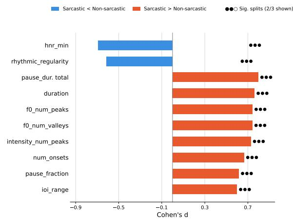  
Figure 11: Chinese (MSCD): top-10 prosodic features ranked by signed Cohen's d. Blue = sarcastic < nonsarcastic; coral = sarcastic > non-sarcastic. All top-10 features significant in 3/3 splits.

## K Chain-of-Thought Reasoning Traces

Omni 3.0 operates in thinking mode, producing explicit chain-of-thought reasoning prior to the final

binary prediction. We present two representative examples illustrating distinct failure mechanisms.

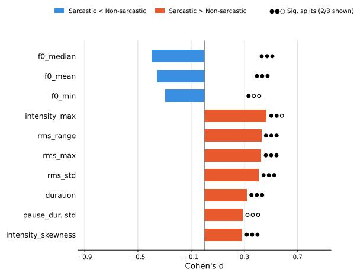  
Figure 12: English (MUStARD++): top-10 prosodic features ranked by signed Cohen's d. Blue = sarcastic < non-sarcastic; coral = sarcastic > non-sarcastic. Dots: filled = significant split $( p < 0 . 0 5 )$ , hollow = not (3 dots = 3 splits).

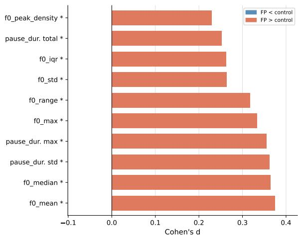  
Figure 13: Chinese (MSCD): top-10 features separating false positives from matched controls, ranked by signed Cohen's d. All features significant $( * \ = \ p \ < \ 0 . 0 5 )$ FP utterances show elevated pitch and irregular pausing relative to controls.

## Example 1: Mismatch Heuristic (English)

Figure 15 presents the reasoning traces for a false positive (ground-truth label: not sarcastic, transcript: “"You had no relationship!!") under both the BIMODAL and BIPROSODY conditions. Both traces follow the same three-step pattern: (1) the model characterises the audio as having exaggerated, playful prosody; (2) it interprets the transcript as conveying serious or factual content; (3) it concludes that the perceived contrast between tone and text constitutes sarcastic irony. The BIPROSODY trace is particularly revealing: despite receiving audio from which lexical content has been removed, the model still constructs a detailed narrative about “playful exaggeration" and “almost laughing quality," attributing these characteristics to prosodic contour alone. The convergence of both traces on the same mismatch conclusion confirms that the false positive is driven by perceived text-prosody incongruence rather than any information recoverable from vocal semantics.

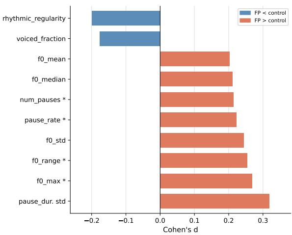

Figure 14: English (MUStARD++): top-10 features separating false positives from matched controls, ranked by signed Cohen's d. Only 4 features reach significance $( * = p < 0 . 0 5 )$ . Coral = FP > Control; blue = FP < Control.
<table><tr><td rowspan="2">Modality</td><td colspan="2">EN</td><td colspan="2">ZH</td></tr><tr><td>Omni 2.5</td><td>Omni 3</td><td>Omni 2.5</td><td>Omni 3</td></tr><tr><td>SPEECH-ONLY</td><td>56.3</td><td>56.3</td><td>53.9</td><td>53.9</td></tr><tr><td>BIMODAL</td><td>45.1</td><td>31.0</td><td>38.9</td><td>35.2</td></tr><tr><td>BIPROSODY</td><td>53.5</td><td>33.8</td><td>29.5</td><td>38.9</td></tr></table>

Table 8: Reverse manipulation correction rates (%): fraction of FP samples that flip to correct non-sarcastic classification after shifting prosodic features toward control-like targets.

## Example 2: Modality Context Effect

Figure 16 presents the traces for a causally manipulated Chinese sample. Under BIMODAL, the model correctly identifies the utterance as a humorous anecdote told with genuine amusement, describing the tone as “light, cheerful, amused with a smiling quality" and predicting false. Under BIPROSODY, the identical prosodic manipulation is instead described as “strained, high-pitched"with “forced laughter that sounds unnatural and mocking," leading the model to conclude that the delivery contradicts the transcript and predict true (false positive).

This divergence illustrates the modality context effect: in BIMODAL, the acoustic content of full speech provides a grounding context that normalises the manipulated prosodic features, while in BIPROsODY, the absence of vocal semantics causes the model to interpret identical prosody as mocking rather than expressive. Prosodic features do not carry fixed perceptual weight for these models but are interpreted relative to the broader acoustic context in which they occur (Corrêa et al., 2025; Sun et al., 2025).

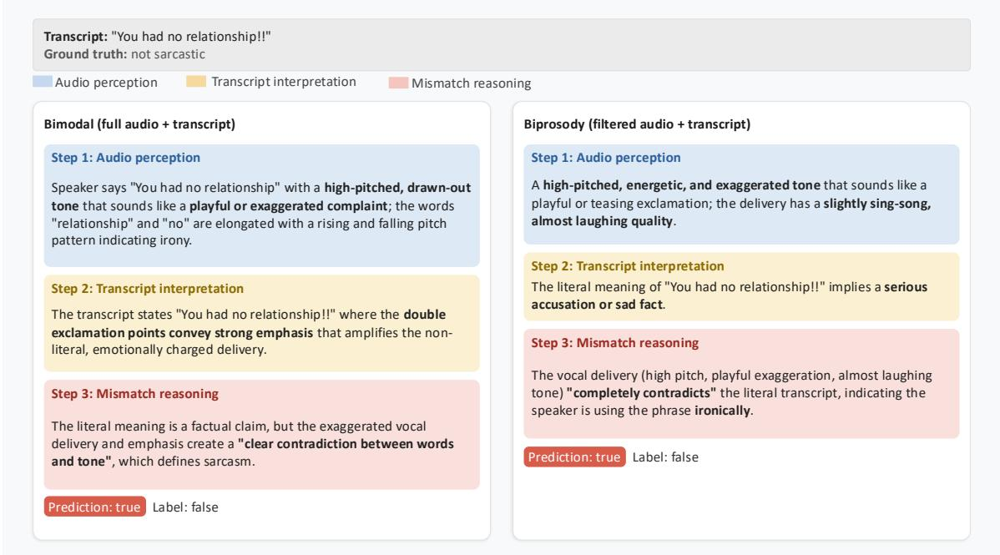  
Figure 15: Example 1: Chain-of-thought traces for a representative false positive under BIMODAL and BIPROSODY. Both traces follow an identical three-step pattern (audio perception, transcript interpretation, mismatch reasoning) and arrive at the same incorrect sarcasm prediction. Key phrases bolded.

<table><tr><td colspan="3"></td><td colspan="2">Flip Rate (%)</td></tr><tr><td>Condition</td><td>Lang.</td><td>Omni</td><td>Gemini (∆)</td><td></td></tr><tr><td rowspan="2">BIMODAL</td><td>EN</td><td>14.3</td><td></td><td>+5.0</td></tr><tr><td>ZH</td><td>5.0</td><td></td><td>+1.2</td></tr><tr><td rowspan="2">SPEECH-ONLY</td><td>EN</td><td>8.9</td><td></td><td>+21.0</td></tr><tr><td>ZH</td><td>10.5</td><td></td><td>+0.0</td></tr></table>

Table 9: FP flip rates (%) for Gemini 3 Flash Preview under the Omni-derived template (Omni) and the change when using the Gemini-specific template (∆ = Gemini — Omni). Positive values indicate higher flip rates under the Gemini-specific template.

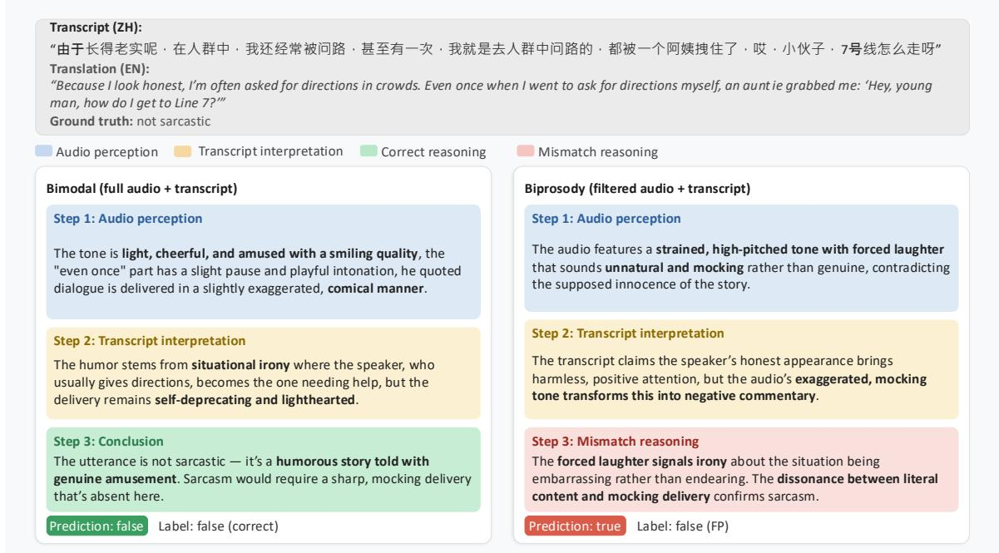  
Figure 16: Example 2: Chain-of-thought traces for a causally manipulated Chinese sample (+8.8% F0) under BIMODAL (correct rejection) and BIPROSODY (false positive). Key phrases bolded.