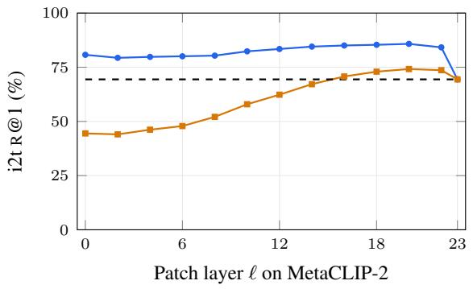
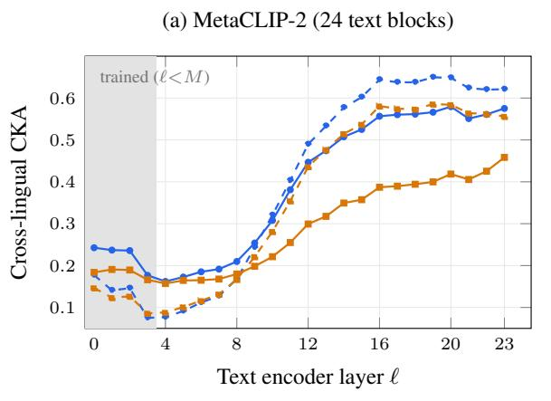
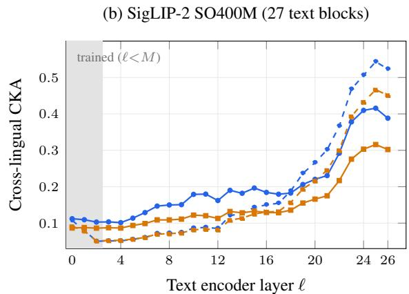
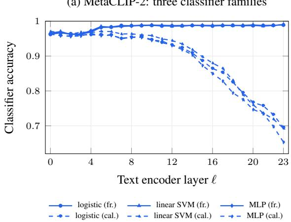
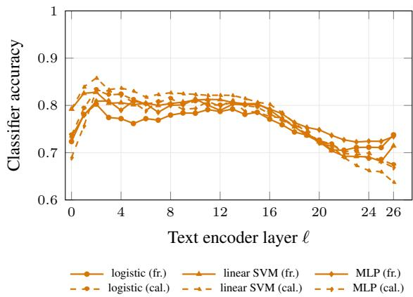
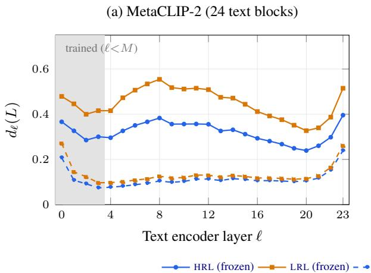
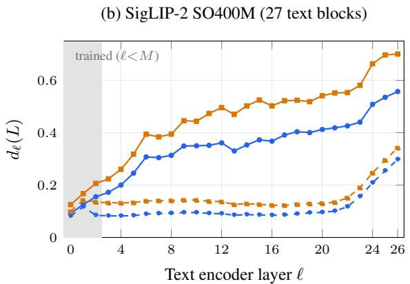
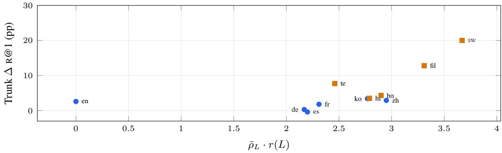
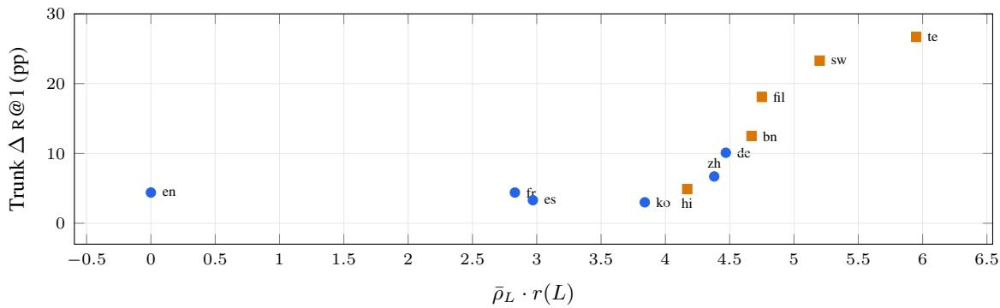

# Where Do Multilingual Vision-Language Encoders Fail on Low-Resource Languages?

Donghoon Han<sup>†</sup> SungHyun Moon<sup>†</sup> Aidyn Zhakatayev Junghun Cha SeungJae Lee Dnotitia Inc.

{dhk1349, sunghyun, aidyn, jhcha, seungjae.lee}@dnotitia.com

## Abstract

Recent multilingual vision–language encoders cover hundreds of languages in a single model, yet on two state-of-the-art instances retrieval on low-resource languages (LRL; e.g. Swahili) trails high-resource ones (HRL; e.g. English) by 30<sup>+</sup> pp. We ask where in the trained encoder this gap is located. Prior modality-gap and cross-lingual subspace work suggests a linear language direction at the output crowds out alignment-relevant geometry. We falsify this: LEACE drives the linear language classifier from > 99% to near chance and iterated INLP to 37–50% while LRL retrieval moves within ±1.5 pp and all tier means within 2.2 pp, tracking random controls. The linear bias is a symptom, not the cause. Instead, the alignmentcausal factor lies along the encoder’s forward path: the EOS (end-of-sequence) hidden state’s per-language trajectory diverges with depth. Substituting the EOS with its parallel English value three blocks before the projector lifts Swahili from 22.1% to 69.1% on one encoder (and reproduces on the other); three controls rule out pooled-position tautology and English specificity. A front-layer trunk that pulls each language’s projection toward the parallelcontent centroid corroborates the diagnosis at training time, recovering +9.6 / +17.1 pp on LRL XM3600 retrieval (1,000-image subset), with consistent gains across three further benchmarks while preserving HRL performance.

## 1 Introduction

Multilingual dual-encoder models map images and text into a shared embedding space for retrieval, classification, and downstream multimodal pipelines across dozens to hundreds of languages (Conneau et al., 2020a; Xue et al., 2021). Recent single-encoder releases—SigLIP-2 (Tschannen et al., 2025) with bidirectional attention and MetaCLIP-2 (Chuang et al., 2025) with causal attention—scale this coverage, but standard image–text retrieval still shows a 30<sup>+</sup> pp Recall@1(R@1) gap between high-resource languages (HRL; e.g. English, French, German) and low-resource languages (LRL; e.g. Bengali, Swahili, Telugu) on MetaCLIP-2 and SigLIP-2, reproduced on XM3600 (Thapliyal et al., 2022), Flickr30k-200 and XTD-200 (Visheratin, 2023), and Babel-ImageNet (Geigle et al., 2024). This suggests that the curse-of-multilinguality issue (Conneau et al., 2020a) persists at the multimodal layer and may affect downstream multilingual multimodal tasks; benchmark-level analyses, however, do not explain where or why representations diverge along the encoder forward path. We localise this gap, test the linear-bias account, and evaluate an alternative through controlled intervention.

A natural starting point. At the output text embedding, language identity is linearly extractable (> 99% classifier accuracy on both encoders). Motivated by modality-gap analyses (Liang et al., 2022) and cross-lingual subspace work (Conneau et al., 2020a; Xue et al., 2021), we test whether this direction displaces alignment-relevant geometry and whether erasing it improves retrieval. With LEACE (Belrose et al., 2023) and INLP (Ravfogel et al., 2020) (Section 4), LEACE reduces classifier accuracy to near chance and INLP attenuates it to 37–50% at rank 128, but LRL retrieval stays within ±1.5 pp and matches same-rank random controls. The signal is easy to erase but appears symptomatic rather than alignment-causal.

Where the causal factor lies. We probe the forward path with EOS (end-of-sequence) activation patching (Vig et al., 2020; Meng et al., 2022): at layer ℓ, we overwrite the target caption’s EOS hidden state with its parallel English value, run the frozen back-half, and score against the image gallery (Section 5). Three blocks before the projector, this rescues LRL retrieval to near the single-source English reference on both encoders; mid-token-patch, random-English-EOS, and source-language generalisation controls rule out pooled-position tautology and English specificity. The causal factor is better described as the EOS hidden state’s per-language forward-path trajectory: LRL values diverge from English at the first measured block and stay further apart with depth, and this divergence—not the output bias direction—controls retrieval.

Trunk calibration as a training-time test of the diagnosis. Because patching requires oracle parallel-content substitution, we fine-tune the first M text-encoder blocks—a front-layer trunk—as a general-input test: each language’s projection moves toward the parallel-content anchor while the back-half, projection head, and vision tower remain frozen (Section 6). Consistent with the trajectory account, the trunk reshapes per-layer geometry (Section 8) and recovers a substantial fraction of LRL retrieval on XM3600 and three further benchmarks while preserving HRL performance (Section 7). We treat this as convergent evidence for the trajectory account, not a re-derivation of patching: a same-depth single-row patch recovers far less than the trunk, while the deep-layer patch reaches a single-source English reference the trunk does not, and a multi-HRL centroid exceeds even that (Section 5.2).

Scope of the causal claim. What we establish is an interventional localisation within trained encoders: in a fixed released encoder the alignmentrelevant failure can be located on, and repaired through, the EOS hidden state’s forward-path trajectory. We do not claim a complete causal account of why that divergence arises during pretraining; data prevalence, tokenisation, attention regime and optimisation dynamics all remain candidate upstream causes (Section 9).

## Contributions.

• Rejecting linear-bias displacement. LEACE erases the language-identifying direction and INLP strongly attenuates it, yet LRL retrieval remains within ±1.5 pp of baseline and no tier mean moves by more than 2.2 pp.

• Mechanistic localisation. EOS-position activation patching with three controls localises the alignment-causal factor to the EOS hidden state’s forward-path trajectory and rescues LRL retrieval to the English-reference level on causal and bidirectional encoders.

• Training-time corroboration. A front-layer trunk yields substantial LRL gains across four benchmarks and reshapes per-layer crosslingual similarity as predicted, targeting the same trajectory-level object as patching without reducing to it.

Scope. We study the text encoder in dual-encoder image-text models. The two main-paper encoders cover the family’s main architectural variants (causal MetaCLIP-2; bidirectional SigLIP-2), and three additional encoders (AltCLIP, NLLB-CLIP-L, mSigLIP; Appendix J) test cross-family generalisation. Generative VLMs and training-time dynamics are out of scope.

## 2 Related Work

Representation geometry and concept erasure. The text–image modality gap was characterised by Liang et al. (2022). Cross-lingual representation analyses using linear probing (Conneau et al., 2020b; Pires et al., 2019) and CKA (Kornblith et al., 2019) suggest universal subspace structure (Chang et al., 2022; Huh et al., 2024). LEACE (Belrose et al., 2023), together with earlier INLP (Ravfogel et al., 2020) and all-but-the-top (Mu et al., 2017), provides closed-form linear concept erasure; related debiasing results show that a linearly extractable concept need not be causal. Motivated by prior geometry work, Section 4 applies such erasure to multilingual vision-language encoder embeddings up to rank 128 and finds no evidence that the language-identifying direction is load-bearing.

Activation patching and partial-encoder distillation. EOS-position activation substitution is a special case of mechanistic-interpretability patching (Vig et al., 2020; Meng et al., 2022; Wang et al., 2023), related to “language surgery” at intermediate layers of multilingual LLMs (Lopo et al., 2025). Section 5.1 adapts patching to dual-encoder retrieval with parallel-content and random-content controls, separating substantive rescue from pooledposition tautology. Section 6’s trunk adapts multilingual sentence-embedding distillation (Reimers and Gurevych, 2020) to a partial-encoder setting (front-M-only, InfoNCE plus centroid-anchored cosine rather than MSE); its novel element is that it targets the trajectory locus identified by patching. The HRL-averaging boost in Section 4.1 is consistent with meta-embedding variance reduction (Coates and Bollegala, 2018).

Data sources. XM3600 (Thapliyal et al., 2022) carries the headline retrieval and all per-layer/backhalf probes; Flickr30k-200 and XTD-200 (Visheratin, 2023), and Babel-ImageNet (Geigle et al., 2024) provide cross-benchmark replication $( \mathsf { A p - }$ pendix D); FLORES-200 devtest (NLLB Team et al., 2022) with COMET-22 (Rei et al., 2022) serve only as the reference parallel corpus and metric for the GLM-5.1 translator-quality check selecting the 11-language trunk training pool (Appendix C).

## 3 Setup and Notation

Models and states. We use two encoders: Meta-CLIP-2 Worldwide-Huge (Chuang et al., 2025), a 24-block causal-attention text tower with dynamic EOS at token-id 2 and a 77-token context, and SigLIP-2 SO400M (Tschannen et al., 2025), a 27-block bidirectional-attention text tower with sticky EOS at position −1 and a 64-token context. Each is evaluated asfrozen (released weights) and trunk-calibrated (the first M text-encoder blocks replaced by a translation-aligned trunk; $M { = } 4$ for MetaCLIP-2 and M=3 for SigLIP-2; Section 6).

Notation. Let $E : \mathcal { X } \xrightarrow { } \mathbb { R } ^ { D }$ be the text encoder, decomposed as $E = \pi \circ \varphi _ { N - 1 } \circ \cdot \cdot \cdot \circ \varphi _ { 0 }$ , with the N blocks numbered from 0 and π the projection head including the final LayerNorm. For a tokenized caption $x ^ { L }$ in language L, let $H _ { k } ( x ^ { L } ) \in \mathbb { R } ^ { n _ { L } \times d }$ be the hidden-state matrix after k blocks, $h _ { k } ( x ^ { L } ) \in$ $\mathbb { R } ^ { d }$ its pooled (EOS) row, and $t _ { L } ( x ) : = E ( x ^ { L } )$ the output text embedding. Block ℓ emits $H _ { \ell + 1 }$ , so $\ell =$ $N { - } 1$ is the projector’s input and $\ell = N { - } 4$ leaves three blocks. Trunk calibration (Section 6) replaces $\varphi _ { 0 } , \ldots , \varphi _ { M - 1 }$ , so its depth-M state is $H _ { M }$ , pooled row $h _ { M }$

Trajectory and its divergence. The forwardpath trajectory of a caption is the sequence of pooled-row hidden states $\big ( h _ { 1 } ( x ^ { L } ) , \dots , \bar { h } _ { N } ( x ^ { L } ) \big )$ it produces, and we measure how far language $L ^ { \prime } s$ trajectory runs from its parallel English counterpart by

$$
d _ { \ell } ( L ) : = \mathbb { E } _ { x } \big [ 1 - \cos \bigl ( h _ { \ell + 1 } ( x ^ { L } ) , h _ { \ell + 1 } ( x ^ { \mathrm { e n } } ) \bigr ) \big ] ,\tag{1}
$$

with x ranging over parallel caption groups. Equation 1 is invariant to rotation and to the per-layer scale of $h _ { \ell + 1 }$ ; the residual $r ( L )$ of Section 6 is its unnormalised $\ell _ { 2 }$ counterpart at the single depth $M .$ where an absolute distance is needed.

Languages and data. The language pool contains 11 languages: HRL-6 (English [en], French [fr], German [de], Spanish [es], Chinese [zh], Korean [ko]) and LRL-5 (Bengali [bn], Filipino [fil], Hindi [hi], Swahili [sw], Telugu [te]). The LRL-5 are the trained-pool subset of the seven low-resource languages designated by Wang et al. (2026) based on WebLI-100B prevalence (0.001– 0.267%, retrieval-independent); Hebrew and Maori are excluded because Hebrew lacks coverage in our XM3600/Flickr30k-200/XTD-200 protocol, and Maori fails the $\mathrm { { C O M E T - 2 2 } } ~ \ge ~ 0 . 8 2$ translatorquality bar under both GLM-5.1 and GPT-5.2 (Appendix C). All other pool languages appear in the standard test splits of XM3600 (Thapliyal et al., 2022), and Flickr30k-200 and XTD-200 (Visheratin, 2023) (Appendix D). The mechanistic image– text experiments use the 1,000-image XM3600 retrieval subset, so cross-lingual pairs share content and visual grounding.

## 4 The Linear Language Direction

We establish two facts about $t _ { L } ( x )$ : language identity is linearly extractable, and cross-lingual averaging lifts retrieval even on the HRL pool. A natural explanation is that averaging cancels this direction and that the same direction gates LRL retrieval; LEACE tests this link and does not support it, suggesting a symptom rather than an alignment-causal factor.

## 4.1 Language Identifiability of the Projected Embedding

We train classifiers on COCO-translated captions and test on disjoint XM3600 to avoid corpusspecific surface patterns. $\mathrm { G P T } { - } 5 . 2 ^ { 1 }$ produced translations into the 13 probe languages; these files will be released with the codebase, so the probe is reproducible without translator access (Appendix G.2). A 13-way logistic-regression classifier on $t _ { L } ( x ) \in$ $\mathbb { R } ^ { D }$ detects source language with 99.8% accuracy on MetaCLIP-2 and 99.7% on SigLIP-2 (chance $1 / 1 3 \approx 7 . 7 \% )$ ; linear SVM and single-hiddenlayer MLP reach 96–98%, so the signal is not classifier-specific. A per-layer probe shows the signal from ℓ=0, not only after the projection head: MetaCLIP-2 stays at 96–99%, while SigLIP-2 stays at 71–83% because bidirectional attention spreads the signal across positions (full curves in Appendix G.2).

<table><tr><td></td><td>MetaCLIP-2 HRL LRL</td><td>HRL</td><td>SigLIP-2 LRL</td></tr><tr><td>base R@1</td><td>78.1</td><td>44.1 63.3</td><td>21.7</td></tr><tr><td>LEACE R@1</td><td>77.5</td><td>43.0</td><td>64.0 21.6</td></tr><tr><td>rand-remove-12 R@1</td><td>78.2</td><td>43.6</td><td>63.0 21.8</td></tr></table>

Table 1: LEACE ablation on XM3600 (1,000 images, 11 trained languages). Entries are i2t R@1 in % for the original embedding, LEACE-projected embedding, and same-rank random orthogonal ablation $( I - V { \bar { V } } ^ { \top } )$ . LEACE drops classifier accuracy to chance $( \sim 9 9 . 8 \%  3  – 5 \%$ , chance $1 / 1 3 \approx 7 . 7 \% ) ^ { \bar { 2 } }$ , while retrieval changes by ≤ 1.5 pp and matches rand-remove-12. Reported INLP checkpoints {12, 64, 128} replicate this; the full sweep additionally includes rank 32 (Appendix G.3).

HRL-averaging boost. Averaging the six HRL embeddings of a parallel caption lifts MetaCLIP-2 retrieval by +17.4 pp on XM3600 (78.1 → 95.5 on HRL-6; Appendix G.7). This generalizes: HRL-pool averaging yields +5.6 to +38.5 pp across five multilingual vision-language encoders (MetaCLIP-2, SigLIP-2, AltCLIP, NLLB-CLIP-L, mSigLIP) on XM3600 and Flickr30k-200 (Visheratin, 2023), and LRL-pool averaging is positive in every (encoder, benchmark) cell, with ≥ +10 pp on the LRL-only pool (Appendix G.8); the centroid geometry behind the boost — pool dispersion, pre-normalisation norms, centroid–image similarity — is in Appendix G.10. If the boost comes from canceling the language-identity direction in Section 4.1, erasing that direction should produce a similar lift; we test this with LEACE.

## 4.2 LEACE: Erasing the Linear Language Direction

LEACE (Belrose et al., 2023) returns the minimumperturbation closed-form projector $P _ { \mathrm { l a n g } }$ under which no linear classifier exceeds chance on the eraser output. It drops classifier accuracy from ≥ 99% to chance, but image-to-text retrieval changes by $\leq \ 1 . 5 \mathrm { p p }$ and matches a same-rank random orthogonal ablation (rand-remove-12, $I - V V ^ { \top }$ ; Table 1). Higher-rank Iterated Null-space Projection (INLP, Ravfogel et al., 2020) gives the same pattern: at ranks {12, 64, 128}, rank-128 erasure drops the classifier to 37–50%, yet LRL retrieval still changes by ≤ 1.5 pp and no tier mean by more than 2.2 pp (Appendix G.3). Thus, the language direction is recoverable, but removing it does not appear retrieval-causal up to rank 128.

Reconciling the averaging boost and the LEACE null. The content redundancy exploited by averaging and the language-identity direction erased by LEACE appear to occupy different subspaces (Appendix G.7). Linear bias displacement is not supported up to rank 128, while the non-linear regime remains inconclusive under an adversarial-MLP eraser (Appendix I.6); the detectable bias is therefore best read as language-identity encoding, not the cause of the retrieval gap.

## 5 Pinpointing the Locus on the Forward-Path Trajectory

Section 4 showed that erasing the linear language direction at the output text embedding leaves LRL retrieval within ±1.5 pp, so that direction is unlikely to be the sole alignment-causal factor; we therefore inspect the encoder’s forward-path trajectory with single-row activation patching (Vig et al., 2020; Meng et al., 2022).

## 5.1 Protocol

For target language T and source language A,

$$
\mathrm { p a t c h } _ { \ell , A \to T } ( x ^ { T } ) : = \pi \circ \varphi _ { N - 1 } \circ \cdot \cdot \cdot \circ \varphi _ { \ell + 1 } ( \widetilde { H } _ { \ell + 1 } ) ,
$$

where $\widetilde { H } _ { \ell + 1 }$ is $H _ { \ell + 1 } ( x ^ { T } )$ with its pooled row replaced by $h _ { \ell + 1 } ( x ^ { A } )$ and all other rows kept; the later blocks are unchanged, so this is a single-row residual-stream intervention.

For each XM3600 image-caption row $( n { = } 1 , 0 0 0 )$ we cache $h _ { \ell + 1 } ( x ^ { \mathrm { e n } } )$ from the parallel English caption at every block; for each $T \neq$ en and stride-2 patch layer ℓ, we substitute only the target EOS row and evaluate against the fixed image embedding gallery. The parallel-English anchor is the EN-swap reference, and norm-matched random Gaussian substitution is the basic control.

## 5.2 Rescue Curves

Rescue curves. Figure 1 shows the MetaCLIP-2 patch sweep. We headline ℓ = N−4, which passes through three unmodified back-half blocks: averaged over the LRL-5 pool, retrieval rises from 44.1% to 73.4% (+29.3 pp), Swahili from 22.1% to 69.1% and Filipino from 39.9% to 73.5%. The best single layer adds little (Swahili 71.0% at $\ell \ = \ 2 2 )$ Cluster bootstrap (B=1,000 row resamples, pairing preserved) gives 95% CIs of $[ + 4 5 . 5 , + 5 2 . 2 ]$ for Swahili and $[ + 3 0 . 1 , + 3 7 . 1 ]$ for Filipino at their best layers (22, 20; Appendix I.4). The norm-matched random Gaussian control collapses retrieval $( \mathrm { H R L } \sim \ 8 0 \  \ 8 . 5 \% , \mathrm { L R L } $ 1.6%), so the rescue is signal-specific rather than norm-driven; SigLIP-2 shows the same pattern with larger deltas because its LRL baselines are lower. Unlike the layer-confined peak typical of prior patching work (Wang et al., 2023), the curve improves toward the near-final region and tends to shrink when more target-language back-half blocks follow the patch; because $\ell = N - 1$ is partly a pooling tautology (see below), the key non-tautological checkpoint is $\ell = N { - } 4$ . Table 2 reports tier-level rescue at $\ell = N { - } 4$ and random-control failure for both encoders.

  
HRL (n=5) LRL (n=5) EN single-source ref.

Figure 1: Tier-averaged XM3600 image-to-text R@1 (1,000 images) across EOS-patch layers ℓ for frozen MetaCLIP-2; dashed line: single-source English reference (69.4%).
<table><tr><td rowspan="2">Encoder</td><td rowspan="2">EN ref.</td><td colspan="2">i2t R@1 (%): base →  $\ell { = } N { - } 4$ </td></tr><tr><td>HRL</td><td>LRL</td></tr><tr><td>MetaCLIP-2 random control</td><td>69.4</td><td> $7 9 . 8  8 5 . 8$  rand 8.5</td><td> $4 4 . 1  7 3 . 4$  rand 1.6</td></tr><tr><td>SigLIP-2</td><td>66.1</td><td> $6 2 . 8  8 1 . 8$ </td><td> $2 1 . 7 \to 6 6 . 6$ </td></tr><tr><td>random control</td><td></td><td>rand 16.4</td><td></td></tr><tr><td></td><td></td><td></td><td>rand 3.2</td></tr></table>

Table 2: XM3600 i2t R@1 (%), baseline to the $\ell { = } N { - } 4$ patch, averaged within non-English HRL and LRL targets (n=5 each). The best layer ℓ<sup>⋆</sup> adds $\leq ~ + 4 . 2$ pp beyond $\ell { = } N { - } 4$ (LRL peaks 74.3/70.8). EN ref.: single-source English reference; random control: normmatched Gaussian EOS at ℓ<sup>⋆</sup>. CIs: Appendix I.4.

Disentangling pooled-position tautology from substantive rescue. $\mathrm { A t } \ell = N - 1$ , the EOS row is the projector’s pooled input, making substitution a near-tautological upper reference. Three controls separate this endpoint from substantive rescue: (a) a non-EOS mid-sentence patch at $\ell = N { - } 1$ leaves LRL retrieval essentially unchanged; (b) the EOS patch at $\ell = N { - } 4$ passes through three unmodified back-half blocks and still rescues Swahili $2 2 . 1  6 9 . 1 \%$ and Filipino $3 9 . 9 \ \to \ 7 3 . 5 \%$ on MetaCLIP-2; and (c) a random English EOS at $\ell = N \cdot$ −4 collapses retrieval below baseline (Meta-CLIP-2 LRL $4 4 . 1  7 . 7 ;$ SigLIP-2 21.7 → 5.2). Thus, the rescue relies on parallel-content English structure, not merely an English-distributed vector. Full per-language and per-layer numbers are in Appendix I.

Generalization beyond English. The rescue is not English-specific: at $\ell ~ = ~ N { - } 4$ , a parallel French EOS lifts Swahili to 78.7% (vs. 69.1% from English at the same depth), and the mean of the six HRL EOS states lifts it to 88.0%, above the single-source English reference. This is consistent with the trajectory account: if alignment depends on the EOS hidden state’s location along a parallelcontent cone, a multi-HRL centroid can sit closer to the cone’s interior than any single EOS and act as a variance-reduced source, paralleling projectoroutput averaging (Section 4.1). The single-source English level is therefore an EN-EOS-swap reference, not a hard upper bound: at $\ell = N { - } 4$ , the English-EOS patch brings Swahili essentially to the EN reference $( 6 9 . 1 \ \mathrm { v s . 6 9 . 4 ; - 0 . 3 p p ) }$ , while 71.0% is the separate best-layer English-EOS peak at $\ell = 2 2$ . Full numbers are in Appendix I.5.

## 6 Trunk Calibration: A Controlled Intervention

Sections 4–5 rule out an output linear-bias account and instead point to the EOS hidden state’s perlanguage forward-path trajectory. Trunk calibration tests this by re-fitting the first M blocks so their depth-M outputs, after the frozen back-half, move toward a shared parallel-content target. We choose depth M as the earliest tractable point on this trajectory: front blocks are trainable and the back-half is frozen. We ask whether shaping that state yields a population-level retrieval lift; its magnitude need not match single-row patching, which uses oracle parallel content at inference and acts deeper along the trajectory (Appendix I.1).

Architecture and objective. Let M be the front-layer depth (M=4 for MetaCLIP-2,

M=3 for SigLIP-2; sweep in Appendix F). The trunk-calibrated text encoder replaces blocks $\{ \varphi _ { 0 } , \ldots , \varphi _ { M - 1 } \}$ with trainable copies $\big \{ \varphi _ { 0 } ^ { \prime } , \dots , \varphi _ { M - 1 } ^ { \prime } \big \}$ initialised from the frozen weights (softfine-tune; hard-reinit ablation in Appendix G.6), while the back-half $\varphi _ { M } , \ldots , \varphi _ { N - 1 } ,$ projector π, and vision tower stay frozen. The loss is at the calibrated projected output, not directly at depth M:

$$
\begin{array} { r l } & { \mathcal { L } _ { \mathrm { t r u n k } } : = \mathcal { L } _ { \mathrm { I n f o N C E } } \big ( \{ z _ { g } ^ { L } \} , \{ a _ { g } \} \big ) } \\ & { \qquad + \lambda \mathbb { E } _ { g , L } \big [ 1 - \langle z _ { g } ^ { L } , a _ { g } \rangle \big ] . } \end{array}\tag{2}
$$

Here $z _ { g } ^ { L } : = E _ { \mathrm { c a l } } ( x _ { g } ^ { L } )$ is the calibrated projected embedding of the language-L caption in parallel group g, and $a _ { g }$ is the frozen-encoder anchor for that group: the renormalised mean of the normalised frozen embeddings over the anchor set A (written out in Appendix B). Embeddings are ℓ -normalised, so the inner product is the cosine. Canonically A is all 11 trained languages; we select it on a joint criterion — strongest training-time paired cosine and centroid alignment at near-best held-out LRL retrieval — and ablate the HRL-6-only and English-only alternatives in Appendix F. Because gradients pass through the frozen back-half, the trunk can reshape only the depth-M state; the sensitivity probe below gives a sanity envelope.

Training data and hyperparameters. Training uses text-only parallel-translation groups over the 11-language pool: English captions from a 1Mcaption subset of CC12M (Changpinyo et al., 2021) are translated by GLM-5.1, a point release in the GLM-5 family (GLM-5 Team et al., 2026). We train with 128 caption-groups for 20,000 AdamW steps, lr $1 . 2 \times 1 0 ^ { - 4 }$ (MetaCLIP-2) $' \_ { 2 . 4 \times 1 0 ^ { - 4 } }$ (SigLIP-2), and ∼ 50M / ∼ 40M trainable parameters. Full recipe and pseudocode are in Appendix B.<sup>3</sup>

Translation-quality sanity check. On the trained pool, GLM-5.1 reaches per-language COMET-22 quality 0.816–0.905; Hindi is the boundary case under GLM-5.1 (0.816) and clears the $\ge ~ 0 . 8 2$ bar under GPT-5.2, while the other ten trained-pool languages clear it under both (Appendix C). Downstream evaluation uses natively-multilingual XM3600 and other professionally-translated benchmarks (Appendix D), so the parallel-translation data enters only through the training objective.

Lipschitz bridge from projected-space loss to depth-M intervention. The loss is computed at the projected output, but only the first M blocks are trainable; the back-half $\psi : = \pi \circ \varphi _ { N - 1 } \circ \cdot \cdot \cdot \circ \varphi _ { M }$ is a fixed map from depth-M hidden-state matrices to projected embeddings, probed along the pooled row with the other rows fixed. Define the per-language depth-M residual

$$
r ( L ) \ : = \ \mathbb { E } _ { x } \big \| h _ { M } ( x ^ { L } ) - h _ { M } ( x ^ { \mathrm { e n } } ) \big \| ,\tag{3}
$$

taking both terms in the same state, so that r(en) = 0. The trunk objective targets ${ \mathit { a } } _ { g } ,$ the 11-language projected anchor of Equation 5. Write $E _ { \mathrm { c a l } } ^ { L  \mathrm { e n } } ( x ) : = \bar { \psi } \big ( \widetilde { H } _ { M } ( x ^ { L } ; \mathrm { e n } ) \big )$ for the pooled-row counterfactual, in which the calibrated depth-M matrix of $x ^ { L }$ keeps every non-pooled row and takes the calibrated English pooled row. If ψ is K-Lipschitz along that coordinate on the trunkproduced states and their pooled-row counterfactuals, then in expectation

$$
\begin{array} { r } { \mathbb { E } _ { \boldsymbol { x } } \big \| \boldsymbol { E } _ { \mathrm { c a l } } ( \boldsymbol { x } ^ { L } ) - \boldsymbol { E } _ { \mathrm { c a l } } ^ { L  \mathrm { e n } } ( \boldsymbol { x } ) \big \| \ \le \boldsymbol { K } \cdot \boldsymbol { r } ( L ) . } \end{array}\tag{4}
$$

The two inputs differ only in the pooled row, and by exactly the residual of Equation 3. It therefore concerns only the pooled-row component: it does not bound the full language-to-English discrepancy, because the non-pooled rows also differ. We read it as a sanity envelope, not an identifiability proof; the converse does not follow from K-Lipschitzness and would require a bi- or inverse-Lipschitz assumption we do not establish. Because only the front blocks are trainable, the loss can only act through the depth-M distribution. Sampled sensitivity ratios average 0.27–0.46 across both encoders and states, and the per-language scatter of ${ \bar { \rho } } _ { L } \cdot r ( L )$ vs. trunk-calibration ∆R@1 is moderate (Pearson 0.55–0.69; Appendix H). Within this envelope, optimizing at the projector is operationally a depth-M intervention—the earliest trainable point on the trajectory identified by Sections 4–5.

## 7 Retrieval as Evidence for the Diagnosis

The forward-path-trajectory diagnosis (Section 5) predicts that retrieval should recover if trunk calibration pulls each language’s depth-M hidden state toward a parallel-content anchor. We test this prediction through XM3600 per-language retrieval, multi-benchmark replication, and additionalencoder replication, using lift size, language coverage, and propagation through the frozen back-half as evidence.

<table><tr><td>Lang</td><td>Tier</td><td>MetaCLIP-2 frozen cal.</td><td>frozen</td><td>SigLIP-2 cal.</td></tr><tr><td>en</td><td>HRL</td><td>69.4</td><td>72.0</td><td>66.1 70.5</td></tr><tr><td>fr</td><td>HRL</td><td>84.4</td><td>86.2</td><td>78.2 82.6</td></tr><tr><td>de</td><td>HRL</td><td>86.5</td><td>86.8</td><td>33.7 43.8</td></tr><tr><td>es</td><td>HRL</td><td>78.0</td><td>77.6</td><td>64.1 67.4</td></tr><tr><td>zh</td><td>HRL</td><td>74.6</td><td>77.5</td><td>63.8 70.5</td></tr><tr><td>ko</td><td>HRL</td><td>75.5</td><td>78.9</td><td>74.0 77.0</td></tr><tr><td>bn</td><td>LRL</td><td>64.7</td><td>69.0</td><td>30.2 42.7</td></tr><tr><td>fil</td><td>LRL</td><td>39.9</td><td>52.7</td><td>26.9 45.0</td></tr><tr><td>hi</td><td>LRL</td><td>49.4</td><td>52.9</td><td>33.6 38.5</td></tr><tr><td>SW</td><td>LRL</td><td>22.1</td><td>42.1</td><td>12.4 35.7</td></tr><tr><td>te</td><td>LRL</td><td>44.3</td><td>52.0</td><td>5.2 31.9</td></tr><tr><td>HRL mean</td><td></td><td>78.1</td><td>79.8</td><td>63.3 68.6</td></tr><tr><td>LRL mean</td><td></td><td>44.1</td><td>53.7</td><td>21.7 38.8</td></tr></table>

Table 3: Per-language image-to-text R@1 (%) on the 1,000-image XM3600 subset, frozen vs. trunkcalibrated. Bold marks calibrated-vs-frozen lift ≥ +5 pp.

XM3600 per-language retrieval. Calibration yields double-digit LRL gains in 6 of 10 language– model pairs: two on MetaCLIP-2 (sw +20.0, fil +12.8) and four on SigLIP-2 (bn +12.5, fil +18.1, sw +23.3, te +26.7), while HRL R@1 is preserved or slightly improved (Table 3); de-SigLIP-2 also rises +10.1 pp from a weak HRL baseline (33.7 → 43.8).

Cross-benchmark replication. Trunk calibration does not appear to overfit XM3600: ∆ is positive on Flickr30k-200, XTD-200, XM3600, and Babel-ImageNet for both encoders (Table 4). Across the four benchmarks, the LRL-5 pool lifts by +7.8 pp on MetaCLIP-2 and +14.9 pp on SigLIP-2, while HRL-6 rises slightly (+1.7 / +3.0 pp). Perlanguage breakdowns are in Appendix E; CVQA (QA-style) is in Appendix D.

Replication on additional vision-language encoders. The diagnosis and trunk recipe also transfer to AltCLIP, NLLB-CLIP-L, and mSigLIP (Appendix J), which differ from the main pair in pooling, text-tower scale, and pretraining objective. Pooler-row patching at ℓ=N−2 substantially rescues LRL retrieval, and the same front-layer trunk recovers +10 to +37 pp on LRL XM3600 and +9 to +51 pp on LRL Flickr30k-200. These results suggest that the phenomenon and intervention are not specific to the MetaCLIP-2/SigLIP-2 pair.

<table><tr><td></td><td colspan="2">MetaCLIP-2</td><td colspan="2">SigLIP-2</td></tr><tr><td>Benchmark</td><td>∆HRL</td><td>∆LRL</td><td>∆HRL</td><td>∆LRL</td></tr><tr><td>Flickr30k-200</td><td>+0.7</td><td>+8.4</td><td>+3.3</td><td>+20.4</td></tr><tr><td>XTD-200</td><td>+2.2</td><td>+9.0</td><td>+3.2</td><td>+19.1</td></tr><tr><td>XM3600 (full)</td><td>+1.4</td><td>+7.5</td><td>+4.3</td><td>+10.7</td></tr><tr><td>Babel-ImageNet</td><td>+2.3</td><td>+6.3</td><td>+1.3</td><td>+9.5</td></tr><tr><td>mean (4 benchmarks)</td><td>+1.7</td><td>+7.8</td><td>+3.0</td><td>+14.9</td></tr></table>

Table 4: Trunk-calibration ∆ in tier-mean performance (pp), by benchmark, for both encoders (canonical 11- language anchor). Metric is i2t R@1 for Flickr30k-200, XTD-200, and XM3600, and top-1 accuracy for Babel-ImageNet. The XM3600 row is the full 3,600- image evaluation suite, not the 1,000-image subset of Table 3. Full table including CVQA in Appendix D; per-language detail in Appendix E.

## 8 Geometric Analysis Through Trunk Calibration

Patching (Section 5.1) localised the alignmentcausal factor along the forward path, and the trunk (Section 6) tests the same diagnosis at training time. We use the calibrated state as a controlled comparison to characterise how trunk calibration changes per-layer geometry. Specifically, we compute crosslingual CKA (Kornblith et al., 2019), a rotationinvariant similarity, at every text-encoder block on 1,000 image-aligned XM3600 captions. We track HRL↔HRL and HRL↔LRL similarities, averaged over the relevant unordered pairs; their gap serves as the geometric counterpart of the retrieval tier gap. Top-K Jaccard and modality-gap corroborations on the same XM3600 caption set are reported in Appendix G.

Frozen geometry. In the frozen state, both within-HRL and HRL–LRL CKA generally rise with depth, but the within-HRL curve remains higher. At the last text block, within-HRL/HRL–LRL CKA is 0.575/0.458 on MetaCLIP-2 and 0.388/0.302 on SigLIP-2; near the projector input, the within-HRL curve is consistently ≈ 0.10–0.12 above the HRL– LRL curve. This mirrors the retrieval tier gap: at the last block, an LRL caption remains farther from its HRL parallel than two HRL parallels are from each other.

What trunk calibration changes. Trunk calibration raises HRL–LRL CKA at the projector input and narrows the gap to the within-HRL curve. On MetaCLIP-2, HRL–LRL CKA increases from 0.458 to 0.556 at ℓ=23 (+0.10); on SigLIP-2, it increases from 0.302 to 0.451 at ℓ=26 (+0.15). Although only the first M blocks are trained, the lift appears at the final block, supporting the trunk mechanism: reshaping the front-half can move depth-M states into a region that the frozen back-half maps to higher cross-lingual similarity. This is consistent with the trajectory account (Section 5): shifting the depth-M representation can be sufficient when the frozen back-half remains competent on the shifted region.



  
HRL–HRL (frozen) HRL–HRL (calibrated) HRL–LRL (frozen) HRL–LRL (calibrated)  
Figure 2: Per-layer cross-lingual CKA on 1,000 image-aligned XM3600 captions and 11 trained languages. Solid: frozen; dashed: trunk-calibrated. The shaded region marks the trunk-trained front blocks (ℓ < M; M=4 on MetaCLIP-2, M=3 on SigLIP-2). Curves show within-pool HRL–HRL and cross-pool HRL–LRL averages. In the frozen state, HRL–LRL lies below HRL–HRL; after calibration, HRL–LRL rises at the projector input on both encoders (numbers in §8 body).

How calibration reaches the later blocks. Only the first M blocks are trained, so the effect on the N − M blocks that follow is what the trunk has to explain. Four measurements converge: crosslingual CKA rises at the projector input (above), the depth-M residual r(L) and the pooled-row envelope of Equation 4 partly account for it (Appendix H), the frozen back-half responds less to pooled-row change when calibrated, and the divergence $d _ { \ell } ( L )$ of Equation 1 falls at every depth with the tier gap shrinking from 0.119 to 0.022 on MetaCLIP-2 and 0.143 to 0.045 on SigLIP-2. Appendix G.11 collects these with a frozen-versuscalibrated d<sub>ℓ</sub>(L) figure, and states the reference points: calibration partially recovers the patched failure mode on general input, while the deep patch and a same-depth multi-HRL centroid are stronger.

Divergence and pretraining prevalence. The divergence this section tracks is also the quantity that lines up with pretraining data volume: across the ten non-English trained languages, the WebLI-100B prevalence proxy correlates negatively with the frozen depth-M residual (Spearman −0.88 on MetaCLIP-2, −0.64 on SigLIP-2; Appendix G.9). We read this as corroborating context rather than a second finding: n=10, and prevalence co-varies with corpus quality and tokeniser coverage, so it cannot separate those accounts (Section 9).

Scope and caveats. CKA measures cross-lingual textual similarity at each layer, not image–text alignment directly. We therefore use it as the geometric quantity through which the trajectory account predicts alignment recovery, not as a standalone alignment metric. Top-K Jaccard and modality-gap scale on the same image-aligned XM3600 captions are reported in Appendix G.

## 9 Discussion

Why two interventions, not one. Patching (Section 5.1) provides the cleanest causal test—singlerow replacement yields full recovery and noise destroys it—but requires a parallel English caption for each query; calibration (Section 6) needs none, and is not a parameterised form of it: at the calibration depth a single-row patch moves LRL by only +1.4 / −0.1 pp, against calibration’s +9.6 / +17.1 (Appendix I.1). The trained pool already makes the asymmetry concrete: at ℓ=N−4 the patch lifts MetaCLIP-2 LRL to 73.4% where the trunk reaches 53.7%, because patching is handed parallel content at inference while the trunk has to generalise from translation supervision, and Equation 4 covers only its pooled-row component (Appendix H).

What the linear bias is. A linear languageidentifying direction is learned (> 99% classifier accuracy), yet erasing it leaves LRL retrieval within ±1.5 pp up to rank 128, so it is causally dissociable from retrieval-relevant structure. The alignmentcausal factor is better described as the non-linear, depth-dependent EOS hidden-state trajectory: bias and alignment coexist linearly, and the failure is structural rather than displacement.

Trajectory divergence as the back-half’s distribution boundary. The trajectory and back-halfdistribution framings describe the same observation: per-language paths leave the HRL hidden-state region on which the back-half is competent. This explains both interventions: an HRL-distribution hidden state at a deep block restores back-half competence under patching, while the trunk pulls front-half states back toward that region. We use the trajectory framing because the divergence is per-language and forward-path-localised; the difference is mainly narrative emphasis.

Alternative upstream causes. Our interventions localise where the failure is expressed in a trained encoder, not what produced it, and three candidates remain live. Tokenisation: the token-count premium over English<sup>4</sup> is 1.19–1.44 for the trained LRLs on MetaCLIP-2 but 1.59–2.83 on SigLIP-2, so LRL captions consume more of a fixed context; yet German is SigLIP-2’s weakest HRL at a premium of 1.31, and calibration lifts it +10.1 pp without touching the tokeniser. Attention regime: a reinitialised front block is partly absorbed by causal MetaCLIP-2 but collapses bidirectional SigLIP-2 at every depth (Appendix G.6), so the regime governs how far a front-half edit propagates—though the tier ordering reproduces across every pooling regime we test (Appendix J). Optimisation dynamics and data volume: pretraining prevalence correlates negatively with front-half divergence (Section 8), consistent with sparse LRL gradient signal leaving the forward path uncorrected, but prevalence co-varies with corpus quality and tokeniser coverage across our pool. Separating these accounts requires controlled pretraining runs, which is out of scope here: the claim of this paper is the interventional localisation, not the explanation.

Diagnostic protocol for new multilingual visionlanguage encoder releases. These measurements form a retraining-free checklist for new multilingual vision-language encoders: per-layer cross-lingual CKA (Section 8) diagnoses the forward-path trajectory; LEACE on the output text embedding (Section 4) tests the linear-biasdisplacement hypothesis; EOS-patch sweeps at ℓ ∈ {N−4, N−1} with parallel-EN / random-EN / mid-token controls (Section 5.1) separate substantive rescue from pooled-position tautology; and per-language back-half sensitivity (Appendix H) characterises its local pooled-row response. We validate the checklist on MetaCLIP-2 and SigLIP-2 and replicate it on AltCLIP (XLM-R-Large CLS, 24L), NLLB-CLIP-L (M2M100 language-code, 24L), and mSigLIP (SigLIP-base sticky-EOS, 12L), which span different pooling regimes and texttower scales; Appendix J. Extension to generative-VLM text encoders such as BLIP-2 and EVA-CLIPmultilingual remains future work.

## 10 Conclusion

Linearly extractable language identity at the output and the alignment-causal mechanism are different phenomena. Concept erasure removes the identity direction with little change to retrieval; the causal factor appears to be the per-language forward-path trajectory of the pooled hidden state. A single-row substitution from a parallel-content anchor three blocks before the projector recovers LRL retrieval on causal and bidirectional encoders, while a frontlayer trunk corroborates the diagnosis and reshapes geometry as predicted.

For multilingual dual-encoder design, this suggests intervening on the trajectory rather than the output embedding: per-language drift is expressed at the depth-M EOS state, making the front blocks a correction site while the back-half remains frozen. The result gives a forward-path-trajectory account of cross-lingual divergence across tested variants— causal, bidirectional, CLS-pooled, and languagecode-pooled—and we will release the EOS-swap protocol, per-language sensitivity probe, and trunk pipeline as benchmark-agnostic diagnostics.

Two steps remain: identifying when the trajectory diverges during pretraining and which optimisation signals shape it, and testing whether the structure appears in text-only multilingual encoders. The take-away is that a linearly visible feature is not, by itself, evidence of a causal one.

## Limitations

Model coverage: two pretrained text encoders in the main paper; appendix extensions to Alt-CLIP, NLLB-CLIP-L, and mSigLIP (Appendix J) span four architectures and three text-encoder families, but generalisation to BLIP-2, EVA-CLIPmultilingual, etc. is an open empirical question.

Vision tower: treated as a fixed reference; visionside bias contribution to the modality-gap denominator is not addressed.

Token-length truncation: SigLIP-2’s 64-token cap can truncate long XM3600 captions in non-Latin-script LRLs, but measured per-language truncation rates on the 1,000-image retrieval subset stay ≤ 0.3% in every (model, language) cell, so the probes of Sections 8 and 6 are uncontaminated. Low absolute cosine: retrieval is driven by relative ordering, not alignment magnitude; trunkcalibration/patching deltas should be read accordingly.

Trunk calibration narrows but does not close the gap: HRL–LRL CKA rises and the tier gap shrinks (Sections 8, 7), but LRL retrieval does not reach HRL parity. Two plausible contributors: (i) the objective targets centroid-aligned projector-space representations but does not fully equalise depth-M distributions across languages; (ii) training data is a 1M-caption CC12M subset translated into the 11- language pool, under-representing genuine LRL surface forms relative to natively-multilingual corpora. Richer objectives, longer training, and nativelymultilingual data are natural next steps.

Meaning of low-resource: we use the term operationally, for low prevalence in web-scale vision– language pretraining data, rather than linguistic resource scarcity in general.

Locus, not sole cause: our intervention identifies a correctable locus on the text-encoder path; the frozen projection head and vision tower may also contribute to the observed gap.

Supervision requirement: trunk calibration needs adequate parallel-text supervision and is demonstrated on five languages passing our MT-quality screen, so languages below that threshold may exhibit additional failure modes, and generalisation beyond the trained LRL-5 remains open.

Scope of the Lipschitz bridge: Equation 4 constrains only the pooled-row component of the calibrated cross-lingual discrepancy, under an assumed conditional Lipschitz constant; trunk calibration also moves the non-pooled rows at depth M, and we do not measure that remainder.

Sensitivity estimates are diagnostic: the ratios of Appendix H are finite-difference quotients at sampled points, so neither their mean nor their maximum certifies a Lipschitz constant — the sampled maximum is a lower bound on the supremum, and the only upper bound we compute, the block-wise spectral product, is too loose to be informative.

Beyond-linear erasure: the falsification covers linear erasure up to rank 128; an adversarial-MLP eraser does not achieve comparable non-linear erasure (Appendix I.6), so whether a non-linear language encoding is alignment-causal remains open. Run-to-run variance: we do not report seed variance for the calibration runs; the bootstrap intervals we do report resample evaluation rows rather than training runs, and are taken at each cell’s best patch layer rather than at the ℓ=N−4 anchor of Table 2. Accordingly, these intervals quantify row-sampling uncertainty conditional on a trained checkpoint and selected layer, rather than variability of the complete training-and-selection pipeline.

Shared evaluation subset: the patching, CKA, residual and sensitivity measurements use the same 1,000 image–caption rows of XM3600, so they are not statistically independent. Agreement among them is therefore convergent evidence within one sample, not independent replication. The crossbenchmark suite provides independently sampled retrieval evidence, but does not repeat the mechanistic probes or test whether their relationships reproduce across datasets.

## Acknowledgements

This research was supported by the ‘Advanced GPU Utilization Support Program’ funded by the Government of the Republic of Korea (Ministry of Science and ICT).

Author Contributions. Donghoon Han led methodology, implementation, experiments, analysis, visualization, and the initial draft. SungHyun Moon led conceptualization, methodological direction, research framing, and substantive revision of the manuscript and rebuttals. Together, they handled the rebuttal and author–reviewer discussion, the resubmission, and the camera-ready manuscript, and jointly shaped the study from conception to completion. Aidyn Zhakatayev and Junghun Cha contributed to discussions of the core idea and experimental validation. SeungJae Lee reviewed the final manuscript.

## References

Pranav Aggarwal and Ajinkya Kale. 2020. Towards zero-shot cross-lingual image retrieval. arXiv preprint arXiv:2012.05107.

Nora Belrose, David Schneider-Joseph, Shauli Ravfogel, Ryan Cotterell, Edward Raff, and Stella Biderman. 2023. Leace: Perfect linear concept erasure in closed form. Advances in Neural Information Processing Systems, 36:66044–66063.

Tyler A Chang, Zhuowen Tu, and Benjamin K Bergen. 2022. The geometry of multilingual language model representations. In Proceedings of the 2022 Conference on Empirical Methods in Natural Language Processing, pages 119–136.

Soravit Changpinyo, Piyush Sharma, Nan Ding, and Radu Soricut. 2021. Conceptual 12m: Pushing webscale image-text pre-training to recognize long-tail visual concepts. In 2021 IEEE/CVF Conference on Computer Vision and Pattern Recognition (CVPR), pages 3557–3567. IEEE.

Zhongzhi Chen, Guang Liu, Bo-Wen Zhang, Qinghong Yang, and Ledell Wu. 2023. Altclip: Altering the language encoder in clip for extended language capabilities. In Findings of the Association for Computational Linguistics: ACL 2023, pages 8666–8682.

Yung-Sung Chuang, Yang Li, Dong Wang, Ching-Feng Yeh, Kehan Lyu, Ramya Raghavendra, Jim Glass, Lifei Huang, Jason Weston, Luke Zettlemoyer, Xinlei Chen, Zhuang Liu, Saining Xie, Scott Yih, Shang-Wen Li, and Hu Xu. 2025. Meta clip 2: A worldwide scaling recipe. In Advances in Neural Information Processing Systems, volume 38, Main Conference, pages 48009–48036. Curran Associates, Inc.

Joshua Coates and Danushka Bollegala. 2018. Frustratingly easy meta-embedding–computing metaembeddings by averaging source word embeddings. In Proceedings ofthe 2018 Conference ofthe North American Chapter of the Association for Computational Linguistics: Human Language Technologies, Volume 2 (Short Papers), pages 194–198.

Alexis Conneau, Kartikay Khandelwal, Naman Goyal, Vishrav Chaudhary, Guillaume Wenzek, Francisco Guzmán, Edouard Grave, Myle Ott, Luke Zettlemoyer, and Veselin Stoyanov. 2020a. Unsupervised cross-lingual representation learning at scale. In Proceedings of the 58th annual meeting of the associationfor computational linguistics, pages 8440–8451.

Alexis Conneau, Shijie Wu, Haoran Li, Luke Zettlemoyer, and Veselin Stoyanov. 2020b. Emerging cross-lingual structure in pretrained language models. In Proceedings of the 58th annual meeting of the association for computational linguistics, pages 6022–6034.

Gregor Geigle, Radu Timofte, and Goran Glavaš. 2024. Babel-imagenet: Massively multilingual evaluation

of vision-and-language representations. In Proceedings of the 62nd Annual Meeting of the Association for Computational Linguistics (Volume 1: Long Papers), pages 5064–5084.

Mor Geva, Roei Schuster, Jonathan Berant, and Omer Levy. 2021. Transformer feed-forward layers are key-value memories. In Proceedings of the 2021 conference on empirical methods in natural language processing, pages 5484–5495.

GLM-5 Team, Aohan Zeng, Xin Lv, Zhenyu Hou, Zhengxiao Du, Qinkai Zheng, Bin Chen, Da Yin, Chendi Ge, Chenghua Huang, Chengxing Xie, Chenzheng Zhu, Congfeng Yin, Cunxiang Wang, Gengzheng Pan, Hao Zeng, Haoke Zhang, Haoran Wang, Huilong Chen, and 167 others. 2026. Glm-5: from vibe coding to agentic engineering. arXiv preprint arXiv:2602.15763.

Minyoung Huh, Brian Cheung, Tongzhou Wang, and Phillip Isola. 2024. Position: The platonic representation hypothesis. In Proceedings of the 41st International Conference on Machine Learning, volume 235 of Proceedings of Machine Learning Research, pages 20617–20642. PMLR.

Aashi Jain, Mandy Guo, Krishna Srinivasan, Ting Chen, Sneha Kudugunta, Chao Jia, Yinfei Yang, and Jason Baldridge. 2021. Mural: Multimodal, multitask representations across languages. In Findings ofthe Associationfor computational Linguistics: EMNLP 2021, pages 3449–3463.

Simon Kornblith, Mohammad Norouzi, Honglak Lee, and Geoffrey Hinton. 2019. Similarity of neural network representations revisited. In International conference on machine learning, pages 3519–3529. PMLR.

Victor Weixin Liang, Yuhui Zhang, Yongchan Kwon, Serena Yeung, and James Y Zou. 2022. Mind the gap: Understanding the modality gap in multi-modal contrastive representation learning. Advances in neural information processing systems, 35:17612–17625.

Joanito Agili Lopo, Muhammad Ravi Shulthan Habibi, Tack Hwa Wong, Muhammad Ilham Ghozali, Fajri Koto, Genta Indra Winata, Peerat Limkonchotiwat, Alham Fikri Aji, and Samuel Cahyawijaya. 2025. Language surgery in multilingual large language models. In Proceedings ofthe 5th Workshop on Multilingual Representation Learning (MRL 2025), pages 438–467.

Kevin Meng, David Bau, Alex Andonian, and Yonatan Belinkov. 2022. Locating and editing factual associations in gpt. Advances in neural information processing systems, 35:17359–17372.

Jiaqi Mu, Suma Bhat, and Pramod Viswanath. 2017. All-but-the-top: Simple and effective postprocessing for word representations. arXiv preprint arXiv:1702.01417.

NLLB Team, Marta R. Costa-jussà, James Cross, Onur Çelebi, Maha Elbayad, Kenneth Heafield, Kevin Heffernan, Elahe Kalbassi, Janice Lam, Daniel Licht, Jean Maillard, Anna Sun, Skyler Wang, Guillaume Wenzek, Al Youngblood, Bapi Akula, Loic Barrault, Gabriel Mejia Gonzalez, Prangthip Hansanti, and 20 others. 2022. No language left behind: Scaling human-centered machine translation. arXiv preprint arXiv:2207.04672.

Telmo Pires, Eva Schlinger, and Dan Garrette. 2019. How multilingual is multilingual bert? In Proceedings of the 57th annual meeting of the association for computational linguistics, pages 4996–5001.

Shauli Ravfogel, Yanai Elazar, Hila Gonen, Michael Twiton, and Yoav Goldberg. 2020. Null it out: Guarding protected attributes by iterative nullspace projection. In Proceedings ofthe 58th annual meeting of the associationfor computational linguistics, pages 7237–7256.

Ricardo Rei, José GC De Souza, Duarte Alves, Chrysoula Zerva, Ana C Farinha, Taisiya Glushkova, Alon Lavie, Luisa Coheur, and André FT Martins. 2022. Comet-22: Unbabel-ist 2022 submission for the metrics shared task. In Proceedings of the Seventh Conference on Machine Translation (WMT), pages 578–585.

Nils Reimers and Iryna Gurevych. 2020. Making monolingual sentence embeddings multilingual using knowledge distillation. In Proceedings of the 2020 conference on empirical methods in natural language processing (EMNLP), pages 4512–4525.

David Romero, Chenyang Lyu, Haryo Akbarianto Wibowo, Teresa Lynn, Injy Hamed, Aditya Nanda Kishore, Aishik Mandal, Alina Dragonetti, Artem Abzaliev, Atnafu Lambebo Tonja, Bontu Fufa Balcha, Chenxi Whitehouse, Christian Salamea, Dan John Velasco, David Ifeoluwa Adelani, David Le Meur, Emilio Villa-Cueva, Fajri Koto, Fauzan Farooqui, and 57 others. 2024. Cvqa: Culturally-diverse multilingual visual question answering benchmark. In Advances in Neural Information Processing Systems, volume 37, pages 11479–11505. Curran Associates, Inc.

Ashish V Thapliyal, Jordi Pont Tuset, Xi Chen, and Radu Soricut. 2022. Crossmodal-3600: A massively multilingual multimodal evaluation dataset. In Proceedings ofthe 2022 Conference on Empirical Methods in Natural Language Processing, pages 715–729.

Michael Tschannen, Alexey Gritsenko, Xiao Wang, Muhammad Ferjad Naeem, Ibrahim Alabdulmohsin, Nikhil Parthasarathy, Talfan Evans, Lucas Beyer, Ye Xia, Basil Mustafa, Olivier Hénaff, Jeremiah Harmsen, Andreas Steiner, and Xiaohua Zhai. 2025. Siglip 2: Multilingual vision-language encoders with improved semantic understanding, localization, and dense features. arXiv preprint arXiv:2502.14786.

Jesse Vig, Sebastian Gehrmann, Yonatan Belinkov, Sharon Qian, Daniel Nevo, Yaron Singer, and Stuart Shieber. 2020. Investigating gender bias in language models using causal mediation analysis. In Proceedings ofthe 34th International Conference on Neural Information Processing Systems, NIPS ’20, Red Hook, NY, USA. Curran Associates Inc.

Alexander Visheratin. 2023. Nllb-clip–train performant multilingual image retrieval model on a budget. arXiv preprint arXiv:2309.01859.

Kevin Ro Wang, Alexandre Variengien, Arthur Conmy, Buck Shlegeris, and Jacob Steinhardt. 2023. Interpretability in the wild: a circuit for indirect object identification in GPT-2 small. In The Eleventh International Conference on Learning Representations.

Xiao Wang, Ibrahim Alabdulmohsin, Daniel Salz, Zhe Li, Keran Rong, and Xiaohua Zhai. 2026. Scaling pre-training to one hundred billion data for vision language models. In Proceedings ofthe IEEE/CVF Conference on Computer Vision and Pattern Recognition (CVPR) Findings, pages 6185–6196.

Linting Xue, Noah Constant, Adam Roberts, Mihir Kale, Rami Al-Rfou, Aditya Siddhant, Aditya Barua, and Colin Raffel. 2021. mt5: A massively multilingual pre-trained text-to-text transformer. In Proceedings ofthe 2021 conference ofthe North American chapter ofthe associationfor computational linguistics: Human language technologies, pages 483–498.

## Appendix Roadmap

The appendices are grouped into four parts. (i) Evidence for main-text claims: per-language patching (Appendix A), pseudocode (Appendix B), and the trunk-training sweep selecting the canonical configuration (Appendix F). (ii) Broader evaluation: five-benchmark tier aggregates (Appendix D) and per-language results (Appendix E). (iii) Robustness probes: translation quality, intralanguage clustering (Appendix C), and further ablations (Appendix G). (iv) Supporting measurements: sampled back-half sensitivity for Equation 4 (Appendix H) and additional patching controls (Appendix I).

## Appendix A: Per-Language Patching Sweep, All Cells

Table 5 complements the ℓ = N−4 tier averages of Table 2 across all four (model, state) cells on XM3600 (1,000 images), reporting the no-patch baseline R@1, the best-layer patched peak R@1 with its layer index, and delta; peaks at $\ell = N - 1$ are pooling references rather than non-tautological rescues. The single-source English reference (“EN ref.”) is the direct English-caption R@1 on the same image set; rows matching it recover to that reference under EOS swap.

## Appendix B: Calibration: Detailed Recipe and Pseudo-code

This appendix gives the training recipe and pseudocode for trunk calibration (Section 6). The loss is computed at the encoder’s projected output, after the frozen back-half and projection head, not at the depth-M hidden state; gradients pass through the frozen back-half into the trainable front blocks, shaping the depth-M distribution via the Lipschitz bridge of Section 6.

Training recipe. Encoder: MetaCLIP-2 Worldwide-Huge (N=24, hidden 1024) or SigLIP-2 SO400M (N=27, hidden 1152). Trainable: first M text-encoder blocks $\left( M { = } 4 ~ / ~ 3 \right)$ initialised from frozen weights (soft fine-tune); frozen: back-half blocks $\varphi _ { M } , \ldots , \varphi _ { N - 1 } .$ , projection head $\pi ,$ , vision tower, and all LayerNorms outside the trainable range. Trainable parameters are ∼ 50M / ∼ 40M. Optimiser: AdamW $( \beta _ { 1 } \mathrm { { = } } 0 . 9$ $\beta _ { 2 } { = } 0 . 9 9 9 $ , weight decay 0.01), gradient clipping at norm 1.0, no LR schedule. Learning rate is $1 . 2 \times 1 0 ^ { - 4 }$ on MetaCLIP-2 and $2 . 4 \times 1 0 ^ { - 4 }$ on

SigLIP-2; $\lambda _ { \mathrm { a l i g n } } { = } 2 \mathrm { ~ / ~ } 1$ are the canonical values from Appendix F. Training uses 128 caption groups for 20,000 steps (∼ 5 GPU-hours per encoder on one H100), drawn from a 1M-caption CC12M subset whose English captions are translated into the other 10 trained-pool languages by GLM-5.1; images are never used during trunk training. The canonical anchor is the per-row centroid of frozen-encoder projected outputs over the full 11-language trained pool, matching Section 6 and Appendix D; HRL-6-only and English-only anchors are ablated in Appendix F. Captions use the encoder’s native tokeniser and sequence cap (77 / 64). Block numbering follows the implementation, with $H _ { k + 1 } = \varphi _ { k } ( H _ { k } )$ and $E = \pi ( H _ { N } )$ for the hidden-state matrices of Section 3: the trainable blocks are text\_model.encoder.layers[0:M], matching $\varphi _ { 0 } , \ldots , \varphi _ { M - 1 }$ of Section 3, and a patch or trajectory read at block ℓ hooks layers[ℓ]’s output. Code and checkpoints will be released at https://github.com/dnotitia/ geometric-bottleneck.

The anchor and the alignment term. For a parallel group g with captions $\{ x _ { g } ^ { L } \} _ { L \in \mathcal { L } }$ , the anchor of Equation 2 is

$$
\begin{array} { r } { a _ { g \mathrm { ~ } } = \mathrm { ~ n o r m } \Big ( \frac { 1 } { | \boldsymbol { A } | } \sum _ { \boldsymbol { L ^ { \prime } } \in \mathcal { A } } \mathrm { n o r m } \big ( \boldsymbol { E } ( \boldsymbol { x } _ { g } ^ { L ^ { \prime } } ) \big ) \Big ) , } \end{array}\tag{5}
$$

i.e. normalise each frozen projected embedding, average over the anchor set A, then renormalise; $A = \mathcal L$ for the canonical variant. Writing the alignment term out over the batch’s groups $\mathcal { G }$

$$
\mathcal { L } _ { \mathrm { a l i g n } } = \frac { 1 } { | \mathcal { G } | | \mathcal { L } | } \sum _ { g \in \mathcal { G } } \sum _ { L \in \mathcal { L } } \bigl [ 1 - \langle z _ { g } ^ { L } , a _ { g } \rangle \bigr ] ,\tag{6}
$$

which is the L\_align line of the pseudocode below: a sample-wise cosine loss between each language’s calibrated embedding and its own group’s anchor, not a distance between per-language centroids. The InfoNCE term uses the same $a _ { g }$ as the positive for all $| { \mathcal { L } } |$ languages of group g, with the other groups’ anchors in the batch as negatives.

Pseudo-code. The text-only forward returns the projected text embedding (text\_proj); for both MetaCLIP-2 and SigLIP-2, this is the L2- normalised get\_text\_features output in the shared image–text space.

<table><tr><td></td><td></td><td></td><td colspan="2">MetaCLIP-2 frozen (EN ref. 69.4)</td><td colspan="3">MetaCLIP-2 cal. (EN ref. 72.0)</td><td colspan="3">SigLIP-2 frozen (EN ref. 66.1)</td><td colspan="3">SigLIP-2 cal. (EN ref. 70.5)</td></tr><tr><td>Lang</td><td>Grp</td><td>base</td><td>peak (l)</td><td>∆</td><td>base</td><td>peak(l)</td><td>∆</td><td>base</td><td>peak (l)</td><td>Δ</td><td>base</td><td>peak(l)</td><td>∆</td></tr><tr><td>fr</td><td>HRL</td><td>84.4</td><td>88.1 (20)</td><td>+3.7</td><td>86.2</td><td>88.6(14)</td><td>+2.4</td><td>78.2</td><td>85.7 (22)</td><td>+7.5</td><td>82.6</td><td>87.6(22)</td><td>+5.0</td></tr><tr><td>de</td><td>HRL</td><td>86.5</td><td>88.6 (20)</td><td>+2.1</td><td>86.8</td><td>89.4 (20)</td><td>+2.6</td><td>33.7</td><td>76.5 (24)</td><td>+42.8</td><td>43.8</td><td>80.9 (24)</td><td>+37.1</td></tr><tr><td>es</td><td>HRL</td><td>78.0</td><td>83.9 (20)</td><td>+5.9</td><td>77.6</td><td>83.4 (20)</td><td>+5.8</td><td>64.1</td><td>81.2 (24)</td><td>+17.1</td><td>67.4</td><td>82.7 (24)</td><td>+15.3</td></tr><tr><td>zh</td><td>HRL</td><td>74.6</td><td>84.6 (20)</td><td>+10.0</td><td>77.5</td><td>87.3 (20)</td><td>+9.8</td><td>63.8</td><td>82.3 (24)</td><td>+18.5</td><td>70.5</td><td>83.7 (24)</td><td>+13.2</td></tr><tr><td>ko</td><td>HRL</td><td>75.5</td><td>83.9 (20)</td><td>+8.4</td><td>78.9</td><td>86.9 (20)</td><td>+8.0</td><td>74.0</td><td>85.4 (24)</td><td>+11.4</td><td>77.0</td><td>86.7 (24)</td><td>+9.7</td></tr><tr><td>bn</td><td>LRL</td><td>64.7</td><td>79.3 (20)</td><td>+14.6</td><td>69.0</td><td>82.2 (20)</td><td>+13.2</td><td>30.2</td><td>74.1 (24)</td><td>+43.9</td><td>42.7</td><td>77.7 (24)</td><td>+35.0</td></tr><tr><td>fil</td><td>LRL</td><td>39.9</td><td>73.5 (20)</td><td>+33.6</td><td>52.7</td><td>76.8 (20)</td><td>+24.1</td><td>26.9</td><td>70.7 (24)</td><td>+43.8</td><td>45.0</td><td>77.5 (24)</td><td>+32.5</td></tr><tr><td>hi</td><td>LRL</td><td>49.4</td><td>73.9 (22)</td><td>+24.5</td><td>52.9</td><td>76.9 (20)</td><td>+24.0</td><td>33.6</td><td>73.7 (24)</td><td>+40.1</td><td>38.5</td><td>74.9 (24)</td><td>+36.4</td></tr><tr><td>SW</td><td>LRL</td><td>22.1</td><td>71.0 (22)</td><td>+48.9</td><td>42.1</td><td>76.2 (22)</td><td>+34.1</td><td>12.4</td><td>69.3 (24)</td><td>+56.9</td><td>35.7</td><td>75.9 (24)</td><td>+40.2</td></tr><tr><td>te</td><td>LRL</td><td>44.3</td><td>73.8 (22)</td><td>+29.5</td><td>52.0</td><td>77.0 (22)</td><td>+25.0</td><td>5.2</td><td>66.1 (26)</td><td>+60.9</td><td>31.9</td><td>73.5 (24)</td><td>+41.6</td></tr></table>

Table 5: Per-language image-to-text R@1 (%) on XM3600 (1,000 images): no-patch baseline, best-layer patched peak with layer index, and delta (pp), for each (model, state) cell. The single-source English reference (EN ref.) appears above each block; rows matching it recover to that reference under EOS swap. Bold ∆ entries are ≥ +50 pp.

```python
Training: trunk calibration
# E_frozen = pi o phi_{N-1} o ... o phi_0
# E_calib = pi o phi_{N-1} o ... o phi_M
# o phi'_{M-1} o ... o phi'_0
# ANCHOR_LANGS: all 11 trained languages
# (ablations: HRL-6 or EN-only)
# TRAIN_LANGS: 11
phi_prime = [copy(phi[l]) for l in range(M)]
freeze(back-half, pi, vision)
for step in 1..T:
batch = sample_parallel(
B groups; each group = 1 EN source
+ 10 GLM-5.1 translations)
# Frozen anchor: centroid of projections
with no_grad():
anchors = []
for L in ANCHOR_LANGS:
f = E_frozen.get_text_features(
**tokenize(batch[L]))
anchors.append(F.normalize(f, dim=-1))
z_anchor = F.normalize(
stack(anchors).mean(0), dim=-1)
# Trainable projected outputs
caps, gids = [], []
for gi, group in enumerate(batch):
for L in TRAIN_LANGS:
caps.append(group[L]); gids.append(gi)
z_query = E_calib.get_text_features(
**tokenize(caps))
z_query = F.normalize(z_query, dim=-1)
# Losses at projected output
logits = (z_query @ z_anchor.T) / tau
L_nce = cross_entropy(logits, gids)
L_align = (1 - (z_query
* z_anchor[gids]).sum(-1)).mean()
loss = L_nce + lambda_align * L_align
loss.backward()
clip_grad(1.0)
optimizer.step()
```

save({"trainable\_layers\_state\_dict":   
[phi\_prime[l].state\_dict()   
for l in range(M)],   
"config": {"M": M,   
"lambda\_align": lambda\_align,   
"trained\_langs": TRAIN\_LANGS}})

Inference: load the trunk   
for l in range(M):   
E.text.encoder.layers[l] \   
.load\_state\_dict(state\_dicts[l])

The two architectures share the training loop and differ only in encoder loading and tokeniser. The temperature τ is fixed at 0.02 throughout.

## Appendix C: Translation-Quality Sanity Check and Intra-Language Clustering

This appendix reports two probes: a COMET-22 sanity check for the translation system used in trunk training (Appendix C.1), and per-language intralanguage cosine structure (Appendix C.2), which Section 4.2 cites as distinct from the LEACE direction.

## C.1 Translation-Quality Sanity Check

The trunk is trained on GLM-5.1-translated parallel captions (Section 6). Reference-based COMET-22 on FLORES-200 devtest (Rei et al., 2022) places GLM-5.1 translations in a narrow adequate-quality range over the 11-language trained pool (HRL-6 + LRL-5): 0.816 (Hindi) to 0.905 (Korean), with Hindi only slightly below the nominal 0.82 cutoff at three-decimal precision. A second reference system, GPT-5.2<sup>5</sup>, gives nearly identical scores (±0.01) and puts all trained-pool languages at or above 0.825. The pool was selected by this LLMtranslator quality screen; candidate languages below the bar were excluded from trunk training. We do not claim a correlation between translation quality and downstream metrics, since the trained-pool COMET range is narrow (≤ 0.09).

<table><tr><td>Lang</td><td>Tier</td><td>|glm-5.1</td><td>gpt-5.2</td></tr><tr><td>fr</td><td>HRL</td><td>0.888</td><td>0.892</td></tr><tr><td>de</td><td>HRL</td><td>0.889</td><td>0.893</td></tr><tr><td>es</td><td>HRL</td><td>0.870</td><td>0.875</td></tr><tr><td>zh</td><td>HRL</td><td>0.895</td><td>0.896</td></tr><tr><td>ko</td><td>HRL</td><td>0.905</td><td>0.909</td></tr><tr><td>bn</td><td>LRL</td><td>0.876</td><td>0.881</td></tr><tr><td>fil</td><td>LRL</td><td>0.853</td><td>0.865</td></tr><tr><td>hi</td><td>LRL</td><td>0.816</td><td>0.825</td></tr><tr><td>SW</td><td>LRL</td><td>0.845</td><td>0.863</td></tr><tr><td>te</td><td>LRL</td><td>0.871</td><td>0.876</td></tr></table>

Table 6: COMET-22 reference-based translation quality on FLORES-200 devtest, using GLM-5.1 and GPT-5.2 as translation systems. Scores are near or above the 0.82 selection threshold for all trained-pool languages; Hindi is the boundary case under GLM-5.1 and clears the threshold under GPT-5.2.

## C.2 Intra-Language Clustering on MetaCLIP-2

The LEACE result of Section 4.2 rules out the language-identity direction as the alignment-causal factor, but the text embedding still has per-language geometric structure. Define

$$
\alpha ( L ) : = \mathbb { E } _ { i \neq j } \left[ 1 - \cos ( t _ { L } ( x _ { i } ) , t _ { L } ( x _ { j } ) ) \right] ,\tag{7}
$$

the mean pairwise cosine distance between distinct same-language captions; smaller α(L) means a narrower same-language cone in R<sup>D</sup>. On frozen MetaCLIP-2 at the final projection layer (3,600 XM3600 captions per language; 10,000 withinlanguage pairs), α(L) shows a tier pattern: HRL ranges 0.56–0.71 (en 0.58, fr 0.68, de 0.71, es 0.66, zh 0.56, ko 0.61), while trained LRL is often tighter (0.38–0.65: sw 0.38, fil 0.43, te 0.54, hi 0.62, bn 0.65). Weaker retrieval is associated with tighter within-language clustering.

This intra-language collapse is distinct from the linear language-identity direction tested in Section 4.2: LEACE removes a low-rank betweenlanguage separation direction, whereas collapse is a per-language radial structure that compresses content into a narrow cone. Removing the identity direction therefore does not undo the collapse, explaining why LEACE leaves retrieval unchanged (Section 4.2) while HRL-averaging (Section 4.1) lifts it by mixing cross-lingual content. The collapse is a separate symptom of low-resourcelanguage representation, and calibration partially mitigates it by reshaping the front-of-encoder distribution.

## Appendix D: Multi-Benchmark Calibration Gains

Table 7 reports calibrated-vs-frozen gains for the canonical trunk (11-language centroid anchor; M=4 for MetaCLIP-2 and M=3 for SigLIP-2; Section 6). HRL-6 and EN-only anchors are ablated in Table 25 (Appendix F). Each cell is the change in mean performance on the benchmark’s language pool. Throughout this appendix and Table 4, HRL is the HRL-6 average including English and LRL the LRL-5 average, both following Section 3; the patching tables (Table 2, Appendix I) instead average the five non-English HRL languages, because English is the patch source there. We evaluate five multilingual suites: Flickr30k-200, XTD-200 (Visheratin, 2023), XM3600 (Thapliyal et al., 2022), Babel-ImageNet (Geigle et al., 2024), and CVQA native-text split (Romero et al., 2024). CVQA’s translation-evaluation split has smaller and noisier deltas.

<table><tr><td></td><td colspan="2">MetaCLIP-2</td><td colspan="2">SigLIP-2</td></tr><tr><td>benchmark</td><td>∆HRL</td><td>∆LRL</td><td>∆HRL</td><td>∆LRL</td></tr><tr><td>Flickr30k-200</td><td>+0.7</td><td>+8.4</td><td>+3.3</td><td>+20.4</td></tr><tr><td>XTD-200</td><td>+2.2</td><td>+9.0</td><td>+3.2</td><td>+19.1</td></tr><tr><td>XM3600 (full)</td><td>+1.4</td><td>+7.5</td><td>+4.3</td><td>+10.7</td></tr><tr><td>Babel-ImageNet</td><td>+2.3</td><td>+6.3</td><td>+1.3</td><td>+9.5</td></tr><tr><td>CVQA (native)</td><td>+1.1</td><td>+1.8</td><td>-3.4</td><td>~0</td></tr><tr><td>mean (4 benchmarks)</td><td>+1.7</td><td>+7.8</td><td>+3.0</td><td>+14.9</td></tr></table>

Table 7: Trunk-calibration gains in tier-mean performance (pp) over the frozen baseline. Metrics are i2t R@1 for Flickr30k-200, XTD-200, and XM3600; top-1 accuracy for Babel-ImageNet; and multiple-choice accuracy for CVQA. Tiers follow Section 3. The bottom row averages the four non-CVQA benchmarks; CVQA is QA-style and excluded.

Overall, the trunk intervention of Section 6 yields measurable LRL gains on all four non-CVQA benchmarks for both encoders, averaging +7.8 pp on MetaCLIP-2 and +14.9 pp on SigLIP-2 across the five-language LRL pool. The larger SigLIP-2 gains reflect its lower frozen LRL baseline and larger room to recover toward the single-source English reference. HRL R@1 is preserved or slightly improved on retrieval benchmarks; the exception is CVQA, where SigLIP-2 regresses on HRL (−3.4 pp) and is flat on LRL, consistent with that benchmark’s higher noise floor on SO400M. The HRL-6-only and EN-only anchor ablations (Table 25) are within ±1–2 pp of the canonical 11-language anchor on trained-LRL mean, so the replication conclusions are not anchor-specific.

## Appendix E: Per-Language Performance on All Benchmarks

Benchmark coverage. This appendix reports per-language image-to-text R@1 (or accuracy for classification-style benchmarks) for frozen and trunk-calibrated states across six multilingual suites. Flickr30k-200 extends Flickr30k captions to 200 languages by professional translation, with a 1,000-image split and i2t R@1. XTD-200 (Visheratin, 2023) is a 200-language COCO-based retrieval suite (1,000 images, i2t R@1). XM3600 (Thapliyal et al., 2022) is a natively multilingual 36-language retrieval suite; we report the full evaluation suite, distinct from the 1,000-image mainpaper subset (Table 3). Babel-ImageNet (Geigle et al., 2024) is multilingual zero-shot ImageNet classification over 1,000 classes. CVQA (Romero et al., 2024) is a culturally grounded 4- way multiple-choice VQA benchmark scored by image–choice-text cosine similarity. XTD-10 (Aggarwal and Kale, 2020) is the original 10-language XTD retrieval suite; four languages (en, es, zh, ko) overlap our trained pool. All evaluations are zeroshot: the trunk is trained once per encoder on the parallel-translation corpus in Section 6 and is not re-tuned per benchmark or language. All retrieval numbers in the per-benchmark subsections below are i2t; Appendix E.1 additionally reports i2t and t2i separately, for both encoders and both states, on the 1,000-image XM3600 subset and Flickr30k-200.

Calibrated state. The cal column uses the canonical 11-language centroid anchor (Section 6) for all (encoder, benchmark, language) cells. The anchor was selected on a held-out 200-image XM3600 dev split (the anchor-variant panel of Appendix F.2, Table 24), not on the test benchmarks below. HRL-6-only and EN-only anchors are ablated in Table 25 (Appendix F); both land within ±1–2 pp of the canonical anchor on LRL retrieval for both

encoders.

## E.1 Per-direction results (i2t and t2i)

Retrieval elsewhere in this paper is reported in the image-to-text (i2t) direction. This subsection reports i2t and text-to-image (t2i) R@1 separately, for both encoders and both states, on the 1,000-image XM3600 subset of Table 3 and on the Flickr30k-200 1,000-image split. Table 8 gives tier-level means; Tables 9 and 10 give per-language detail. The i2t columns coincide with Table 3 (XM3600) and Table 11 (Flickr30k-200). The calibration gains are not an artefact of the reported direction: the LRL-5 tier mean also rises in t2i in all four (encoder, benchmark) cells — +9.7 / +9.0 pp on MetaCLIP-2 and +21.2 / +25.9 pp on SigLIP-2 for XM3600 / Flickr30k-200, comparable to the i2t lifts — while HRL-6 t2i means stay within about a point of frozen; the single negative tier-mean delta in either direction is Flickr30k-200 MetaCLIP-2 HRL-6 t2i (−0.7 pp).

<table><tr><td></td><td></td><td colspan="2">frozen</td><td colspan="2">calibrated</td></tr><tr><td>Encoder</td><td>Tier</td><td>i2t</td><td>t2i</td><td>i2t</td><td>t2i</td></tr><tr><td colspan="6">XM3600 (1,000-image subset)</td></tr><tr><td>MetaCLIP-2 HRL-6 MetaCLIP-2</td><td>LRL-5</td><td>78.1 44.1</td><td>75.3 37.5</td><td>79.8</td><td>76.5</td></tr><tr><td>SigLIP-2</td><td>HRL-6</td><td>63.3</td><td>62.4</td><td>53.7 68.6</td><td>47.2 67.0</td></tr><tr><td>SigLIP-2</td><td>LRL-5</td><td>21.7</td><td>16.7</td><td>38.8</td><td>37.9</td></tr><tr><td colspan="6">Flickr30k-200</td></tr><tr><td>MetaCLIP-2</td><td>HRL-6</td><td>78.3</td><td>77.5</td><td>78.9</td><td>76.8</td></tr><tr><td>MetaCLIP-2</td><td>LRL-5</td><td>60.4</td><td>56.4</td><td>68.7</td><td>65.4</td></tr><tr><td>SigLIP-2</td><td>HRL-6</td><td>63.7</td><td>63.4</td><td>67.0</td><td>66.9</td></tr><tr><td>SigLIP-2</td><td>LRL-5</td><td>25.3</td><td>20.9</td><td>45.7</td><td>46.8</td></tr></table>

Table 8: Tier-mean R@1 (%) by retrieval direction, frozen vs. trunk-calibrated (canonical 11-language anchor), on the 1,000-image XM3600 subset and Flickr30k-200. Tier means average the per-language rows of Tables 9 and 10 (HRL-6 includes English).

## E.2 Flickr30k-200 (i2t R@1)

We report i2t R@1 on the standard 1,000-image split for both encoder states across the 11 trained languages; per-direction (i2t and t2i) results are in Appendix E.1.

## E.3 XTD-200 (R@1)

We report image-to-text R@1 on the standard 1,000-image split for the 11 trained languages.

## E.4 XM3600 (R@1, retrieval-style)

Table 3 reports the 1,000-image main-paper subset;   
below we use the full XM3600 evaluation suite.

<table><tr><td></td><td></td><td colspan="4">MetaCLIP-2</td><td colspan="4">SigLIP-2</td></tr><tr><td></td><td></td><td colspan="2">frozen</td><td colspan="2">calibrated</td><td colspan="2">frozen</td><td colspan="2">calibrated</td></tr><tr><td>Lang</td><td>Grp</td><td>i2t</td><td>t2i</td><td>i2t</td><td>t2i</td><td>i2t</td><td>t2i</td><td>i2t</td><td>t2i</td></tr><tr><td>en</td><td>HRL</td><td>69.4</td><td>68.6</td><td>72.0</td><td>68.1</td><td>66.1</td><td>67.8</td><td>70.5</td><td>66.6</td></tr><tr><td>fr</td><td>HRL</td><td>84.4</td><td>80.7</td><td>86.2</td><td>81.7</td><td>78.2</td><td>80.5</td><td>82.6</td><td>79.4</td></tr><tr><td>de</td><td>HRL</td><td>86.5</td><td>83.0</td><td>86.8</td><td>82.8</td><td>33.7</td><td>26.2</td><td>43.8</td><td>43.7</td></tr><tr><td>es</td><td>HRL</td><td>78.0</td><td>74.6</td><td>77.6</td><td>75.4</td><td>64.1</td><td>65.6</td><td>67.4</td><td>66.8</td></tr><tr><td>zh</td><td>HRL</td><td>74.6</td><td>73.0</td><td>77.5</td><td>76.3</td><td>63.8</td><td>62.5</td><td>70.5</td><td>71.4</td></tr><tr><td>ko</td><td>HRL</td><td>75.5</td><td>71.8</td><td>78.9</td><td>74.5</td><td>74.0</td><td>72.0</td><td>77.0</td><td>74.1</td></tr><tr><td>bn</td><td>LRL</td><td>64.7</td><td>53.2</td><td>69.0</td><td>60.5</td><td>30.2</td><td>21.1</td><td>42.7</td><td>42.8</td></tr><tr><td>fil</td><td>LRL</td><td>39.9</td><td>37.0</td><td>52.7</td><td>46.6</td><td>26.9</td><td>23.6</td><td>45.0</td><td>42.6</td></tr><tr><td>hi</td><td>LRL</td><td>49.4</td><td>40.0</td><td>52.9</td><td>45.2</td><td>33.6</td><td>27.0</td><td>38.5</td><td>36.4</td></tr><tr><td>SW</td><td>LRL</td><td>22.1</td><td>18.2</td><td>42.1</td><td>38.1</td><td>12.4</td><td>9.4</td><td>35.7</td><td>38.7</td></tr><tr><td>te</td><td>LRL</td><td>44.3</td><td>38.9</td><td>52.0</td><td>45.6</td><td>5.2</td><td>2.2</td><td>31.9</td><td>28.9</td></tr><tr><td>HRL-6 mean</td><td></td><td>78.1</td><td>75.3</td><td>79.8</td><td>76.5</td><td>63.3</td><td>62.4</td><td>68.6</td><td>67.0</td></tr><tr><td>LRL-5 mean</td><td></td><td>44.1</td><td>37.5</td><td>53.7</td><td>47.2</td><td>21.7</td><td>16.7</td><td>38.8</td><td>37.9</td></tr></table>

Table 9: Per-language i2t and t2i R@1 (%) on the 1,000-image XM3600 subset, frozen vs. trunk-calibrated. The i2t columns equal Table 3.
<table><tr><td></td><td></td><td colspan="4">MetaCLIP-2</td><td colspan="4">SigLIP-2</td></tr><tr><td></td><td></td><td colspan="2">frozen</td><td colspan="2">calibrated</td><td colspan="2">frozen</td><td colspan="2">calibrated</td></tr><tr><td>Lang</td><td>Grp</td><td>i2t</td><td>t2i</td><td>i2t</td><td>t2i</td><td>i2t</td><td>t2i</td><td>i2t</td><td>t2i</td></tr><tr><td>en</td><td>HRL</td><td>86.3</td><td>84.3</td><td>85.4</td><td>82.2</td><td>86.4</td><td>86.5</td><td>85.3</td><td>83.1</td></tr><tr><td>fr</td><td>HRL</td><td>82.2</td><td>79.6</td><td>82.4</td><td>78.8</td><td>77.7</td><td>79.1</td><td>79.1</td><td>77.1</td></tr><tr><td>de</td><td>HRL</td><td>80.9</td><td>79.2</td><td>80.2</td><td>78.6</td><td>22.5</td><td>16.9</td><td>34.3</td><td>36.1</td></tr><tr><td>es</td><td>HRL</td><td>82.1</td><td>79.9</td><td>80.5</td><td>79.1</td><td>80.9</td><td>83.0</td><td>80.1</td><td>79.5</td></tr><tr><td>zh</td><td>HRL</td><td>70.7</td><td>69.1</td><td>71.8</td><td>70.1</td><td>50.4</td><td>50.4</td><td>57.6</td><td>59.4</td></tr><tr><td>ko</td><td>HRL</td><td>67.5</td><td>72.9</td><td>73.4</td><td>72.1</td><td>64.5</td><td>64.5</td><td>65.6</td><td>66.0</td></tr><tr><td>bn</td><td>LRL</td><td>69.2</td><td>65.0</td><td>72.3</td><td>69.1</td><td>20.3</td><td>16.2</td><td>40.1</td><td>42.6</td></tr><tr><td>fil</td><td>LRL</td><td>61.2</td><td>54.6</td><td>70.3</td><td>64.8</td><td>34.1</td><td>29.4</td><td>53.6</td><td>52.0</td></tr><tr><td>hi</td><td>LRL</td><td>75.7</td><td>71.9</td><td>75.2</td><td>73.1</td><td>58.1</td><td>49.9</td><td>61.6</td><td>62.0</td></tr><tr><td>SW</td><td>LRL</td><td>35.3</td><td>31.2</td><td>56.4</td><td>53.2</td><td>11.7</td><td>8.2</td><td>42.3</td><td>43.5</td></tr><tr><td>te</td><td>LRL</td><td>60.4</td><td>59.3</td><td>69.4</td><td>66.7</td><td>2.2</td><td>0.9</td><td>31.0</td><td>34.1</td></tr><tr><td>HRL-6 mean</td><td></td><td>78.3</td><td>77.5</td><td>78.9</td><td>76.8</td><td>63.7</td><td>63.4</td><td>67.0</td><td>66.9</td></tr><tr><td>LRL-5 mean</td><td></td><td>60.4</td><td>56.4</td><td>68.7</td><td>65.4</td><td>25.3</td><td>20.9</td><td>45.7</td><td>46.8</td></tr></table>

Table 10: Per-language i2t and t2i R@1 (%) on the Flickr30k-200 1,000-image split, frozen vs. trunk-calibrated. The i2t columns equal Table 11.

## E.5 Babel-ImageNet (top-1 classification accuracy)

We report top-1 accuracy over the 1,000 ImageNet classes per trained language; the classification metric is not directly comparable to retrieval R@1.

## E.6 CVQA (native split, accuracy)

CVQA covers es, zh, ko, bn, fil, hi, sw, and te from this paper’s pool; en, fr, and de are outside the native split.

## E.7 XTD-10 (R@1)

XTD-10 covers only en, es, zh, and ko from our pool, all HRL; no LRL mean is reported. The cal column uses the canonical 11-language anchor (Section 6).

Reading these tables. HRL blocks show modest calibration changes (typically ±5 pp, mostly positive, with occasional small regressions), consistent with non-targeted movement toward the 11- language centroid. LRL blocks show consistent double-digit gains on retrieval and substantial gains on Babel-ImageNet. CVQA is noisier because each item is scored by relative similarity among four candidate texts rather than absolute image–text alignment. Single-digit frozen SigLIP-2 LRL cells (te on Flickr30k-200, XTD-200, and Babel-ImageNet) may partly reflect tokenisation and sequence-length constraints, which we do not isolate on these benchmarks; calibration substantially recovers them despite operating at a fixed mid-layer.

<table><tr><td colspan="2"></td><td colspan="2">MetaCLIP-2</td><td colspan="2">SigLIP-2 frozen</td></tr><tr><td>Lang</td><td>Grp</td><td>frozen 86.3</td><td>cal 85.4</td><td>86.4</td><td>cal 85.3</td></tr><tr><td>en fr</td><td>HRL HRL</td><td>82.2</td><td>82.4</td><td>77.7</td><td>79.1</td></tr><tr><td>de</td><td>HRL</td><td>80.9</td><td>80.2</td><td>22.5 80.9</td><td>34.3 80.1</td></tr><tr><td>es</td><td>HRL</td><td>82.1</td><td>80.5</td><td>50.4</td><td>57.6</td></tr><tr><td>zh</td><td>HRL</td><td>70.7</td><td>71.8 73.4</td><td>64.5</td><td>65.6</td></tr><tr><td>ko</td><td>HRL</td><td>67.5</td><td></td><td></td><td>40.1</td></tr><tr><td>bn fil</td><td>LRL LRL</td><td>69.2 61.2</td><td>72.3 70.3</td><td>20.3 34.1</td><td>53.6</td></tr><tr><td>hi</td><td>LRL</td><td>75.7</td><td>75.2</td><td>58.1</td><td>61.6</td></tr><tr><td></td><td></td><td></td><td>56.4</td><td>11.7</td><td>42.3</td></tr><tr><td>SW</td><td>LRL</td><td>35.3</td><td></td><td></td><td></td></tr><tr><td>te</td><td>LRL</td><td>60.4</td><td>69.4</td><td>2.2</td><td>31.0</td></tr></table>

Table 11: Flickr30k-200 i2t R@1 per language (t2i in Table 10).

<table><tr><td colspan="2"></td><td colspan="2">MetaCLIP-2</td><td colspan="2">SigLIP-2</td></tr><tr><td>Lang</td><td>Grp</td><td>frozen</td><td>cal 72.6</td><td>frozen 76.8</td><td>cal 76.6</td></tr><tr><td>en fr</td><td>HRL</td><td>70.1 69.4</td><td>68.6</td><td>69.7</td><td>71.8</td></tr><tr><td>de</td><td>HRL HRL</td><td>68.5</td><td>68.3</td><td>19.5</td><td>27.1</td></tr><tr><td>es</td><td>HRL</td><td>67.5</td><td>69.6</td><td>69.9</td><td>73.3</td></tr><tr><td>zh</td><td>HRL</td><td>60.6</td><td>62.7</td><td>49.2</td><td>52.5</td></tr><tr><td>ko</td><td>HRL</td><td>54.2</td><td>62.0</td><td>57.7</td><td>60.9</td></tr><tr><td>bn</td><td>LRL</td><td>57.5</td><td>60.7</td><td>34.4</td><td>49.7</td></tr><tr><td>fil</td><td>LRL</td><td>51.3</td><td>61.0</td><td>45.4</td><td>60.2</td></tr><tr><td>hi</td><td>LRL</td><td>61.8</td><td>65.5</td><td>55.4</td><td>60.7</td></tr><tr><td></td><td></td><td>27.8</td><td>47.2</td><td>21.1</td><td>44.4</td></tr><tr><td>SW</td><td>LRL</td><td></td><td></td><td></td><td></td></tr><tr><td>te</td><td>LRL</td><td>50.8</td><td>59.7</td><td>4.7</td><td>41.5</td></tr></table>

Table 12: XTD-200 R@1 per language.

## Appendix F: Trunk-Training Hyperparameter and Design Ablation

This appendix reports the sweep used to select the canonical calibrated configuration. Candidates were ranked by training-time paired cosine (en↔others on the 11-language pool, HRL-6 + LRL-5) and held-out retrieval on a 200-image XM3600 subset. The absolute R@1 numbers therefore differ from full-evaluation results (Table 3, Appendix D), since this smaller validation pool is used only for model selection. We sampled 23 MetaCLIP-2 and 30 SigLIP-2 runs across the axes below; “LRL pc” denotes training-time paired cosine averaged over the five LRL languages.

## F.1 MetaCLIP-2 Worldwide-Huge sweep

We vary four axes on MetaCLIP-2—trainable depth M, alignment-loss weight $\lambda _ { \mathrm { a l i g n } }$ , learning rate, and hard re-init vs. soft fine-tune—fixing the other axes in each panel.

<table><tr><td colspan="2"></td><td colspan="2">MetaCLIP-2</td><td colspan="2">SigLIP-2 frozen</td></tr><tr><td>Lang</td><td>Grp</td><td>frozen</td><td>cal 53.1</td><td>47.5</td><td>cal 52.9</td></tr><tr><td>en fr</td><td>HRL HRL</td><td>50.9 71.5</td><td>72.2</td><td>64.9</td><td>67.6</td></tr><tr><td>de</td><td>HRL</td><td>76.2</td><td>75.9</td><td>21.8</td><td>28.6</td></tr><tr><td>es</td><td>HRL</td><td>62.5</td><td>63.4</td><td>48.4</td><td>50.7</td></tr><tr><td>zh</td><td>HRL</td><td>61.7</td><td>63.4</td><td>50.4</td><td>56.4</td></tr><tr><td>ko</td><td>HRL</td><td>61.0</td><td>64.2</td><td>58.1</td><td>60.7</td></tr><tr><td>bn</td><td>LRL</td><td>47.2</td><td>51.9</td><td>17.5</td><td>26.3</td></tr><tr><td>fil</td><td>LRL</td><td>25.7</td><td>35.2</td><td>16.9</td><td>27.7</td></tr><tr><td>hi</td><td>LRL</td><td>34.1</td><td>35.6</td><td>20.8</td><td>23.0</td></tr><tr><td>SW</td><td>LRL</td><td>12.8</td><td>27.9</td><td>6.5</td><td>22.9</td></tr><tr><td>te</td><td>LRL</td><td>28.4</td><td>35.1</td><td>2.5</td><td>17.6</td></tr></table>

Table 13: XM3600 R@1 per language on the full evaluation suite.
<table><tr><td colspan="2">Lang Grp</td><td colspan="2">MetaCLIP-2 frozen cal</td><td colspan="2">SigLIP-2 frozen cal</td></tr><tr><td>en</td><td>HRL</td><td>74.0</td><td>73.5 69.4</td><td>66.8 68.2 59.4</td></tr><tr><td>fr de</td><td>HRL HRL</td><td>66.9 65.6</td><td>69.5</td><td>60.3 23.1 57.8</td></tr><tr><td>es</td><td>HRL</td><td>62.6</td><td>65.0 58.2</td><td>29.3 57.6 59.7</td></tr><tr><td>zh</td><td>HRL</td><td>59.0</td><td>61.4 62.6</td><td>59.5 57.8</td></tr><tr><td>ko</td><td>HRL</td><td>59.6</td><td></td><td>40.0 44.4</td></tr><tr><td>bn</td><td>LRL</td><td>59.9</td><td>64.8</td><td>23.1</td></tr><tr><td>fil</td><td>LRL</td><td>26.3</td><td>32.1</td><td>20.0</td></tr><tr><td>hi</td><td>LRL</td><td>53.8</td><td>58.6</td><td>43.9 46.4</td></tr><tr><td>SW te</td><td>LRL LRL</td><td>15.1 45.4</td><td>24.3 51.9</td><td>10.9 21.1 9.8 37.4</td></tr></table>

Table 14: Babel-ImageNet top-1 classification accuracy per language.

Trainable depth M. Front transformer blocks made trainable; remainder frozen. $\lambda _ { \mathrm { a l i g n } } { = } 1$ , lr = $6 \times 1 0 ^ { - 5 }$ , soft.

Alignment-loss weight $\lambda _ { \mathrm { a l i g n } } .$ Fixed M=4, soft.   
Two learning rates expose the joint surface.

Learning rate. Fixed $M { = } 4 , \lambda _ { \mathrm { a l i g n } } { = } 1$ , soft.

Hard re-init vs. soft fine-tune. Hard re-init drops HRL by ≈ 13 pp and LRL by ≈ 20 pp at comparable learning rate; soft fine-tune, initialised from frozen weights, is needed for the trunk objective to converge.

Selected configuration. The canonical Meta-CLIP-2 calibrated state uses $M { = } 4 , \lambda _ { \mathrm { a l i g n } } { = } 2 ,$ , lr $= 1 . 2 { \times } 1 0 ^ { - 4 }$ , soft fine-tune, and the 11-language centroid anchor—the LRL R@1 maximizer at HRL parity in the sweep.

## F.2 SigLIP-2 SO400M sweep

We sweep the same axes on SigLIP-2 and add an anchor-variant panel, reflecting the dominant interaction observed on MetaCLIP-2. The SigLIP-2 optimum uses a higher learning rate, consistent with different effective gradient magnitudes under bidirectional vs. causal attention.

<table><tr><td colspan="2"></td><td colspan="2">MetaCLIP-2</td><td colspan="2">SigLIP-2</td></tr><tr><td>Lang</td><td>Grp</td><td>frozen</td><td>cal</td><td>frozen</td><td>cal</td></tr><tr><td>es zh</td><td>HRL HRL</td><td>62.5 71.3</td><td>63.7 74.2</td><td>33.3 64.6</td><td>33.9 57.4</td></tr><tr><td>ko</td><td>HRL</td><td>70.7</td><td>70.0</td><td>55.5</td><td>52.1</td></tr><tr><td>bn</td><td>LRL</td><td>62.6</td><td>59.1</td><td>44.4</td><td>39.2</td></tr><tr><td>fil</td><td>LRL</td><td>49.8</td><td>48.3</td><td>28.6</td><td>31.5</td></tr><tr><td>hi</td><td>LRL</td><td>66.7</td><td>68.2</td><td>57.2</td><td>52.7</td></tr><tr><td>SW</td><td>LRL</td><td>44.0</td><td>50.9</td><td>31.5</td><td>34.1</td></tr><tr><td>te</td><td>LRL</td><td>53.5</td><td>59.0</td><td>34.0</td><td>35.0</td></tr></table>

Table 15: CVQA native-split multiple-choice accuracy per language. CVQA is scored by cosine similarity between image and choice-text embeddings; it is not generative VQA. Languages outside the native set (en, fr, de) are excluded.
<table><tr><td colspan="3"></td><td rowspan="2">MetaCLIP-2</td><td rowspan="2">SigLIP-2 frozen</td><td rowspan="2">cal</td></tr><tr><td>Lang</td><td>Grp</td><td>frozen</td><td>cal</td></tr><tr><td>en</td><td>HRL</td><td>70.1</td><td>72.6</td><td>76.8</td><td>76.6</td></tr><tr><td>es</td><td>HRL</td><td>68.4</td><td>70.8</td><td>71.1</td><td>72.2</td></tr><tr><td>zh</td><td>HRL</td><td>65.5</td><td>66.9</td><td>56.7</td><td>59.6</td></tr><tr><td>ko</td><td>HRL</td><td>58.2</td><td>63.0</td><td>56.8</td><td>60.7</td></tr></table>

Table 16: XTD-10 R@1 per language. Covers only four HRL languages in this paper’s pool.

Trainable depth M. $\lambda _ { \mathrm { a l i g n } } { = } 1 , \mathrm { l r } = 1 { \times } 1 0 ^ { - 5 }$   
soft.

Alignment-loss weight $\lambda _ { \mathrm { a l i g n } }$ . Fixed M=3, lr $= 6 { \times } 1 0 ^ { - 5 }$ , soft.

Learning rate. Fixed $M { = } 3 , \lambda _ { \mathrm { a l i g n } } { = } 1$ , soft.

SigLIP-2 LRL R@1 climbs up to $2 . 4 \times 1 0 ^ { - 4 } ;$ higher rates were unstable in pilot runs, collapsing around $\mathrm { l r } \geq 5 { \times } 1 0 ^ { - 4 }$ under bidirectional attention.

Hard re-init. No SigLIP-2 hard-reinit runs survive in the sweep file. Pilot experiments in the predecessor codebase collapsed retrieval to single digits for every tested M, suggesting that reinitialised front blocks emit out-of-distribution states the fixed bidirectional back-half cannot recover, unlike causal MetaCLIP-2 where late tokens can partly attend around the perturbation. We therefore use soft fine-tune for SigLIP-2 calibration.

Anchor variant. Fixed $M { = } 3 , \lambda _ { \mathrm { a l i g n } } { = } 1$ , lr = $2 . 4 \times 1 0 ^ { - 4 }$ , soft.

The 11-language centroid anchor attains the highest training-time paired cosine and centroid alignment with near-best LRL R@1. Although HRLonly slightly leads on LRL R@1, its lower LRL paired cosine supports the 11-language centroid as the canonical target.

<table><tr><td>M</td><td>HRL R@1</td><td>LRL R@1 LRL pc</td></tr><tr><td>2</td><td>0.907</td><td>0.669 0.218</td></tr><tr><td>3</td><td>0.911</td><td>0.681 0.218</td></tr><tr><td>4</td><td>0.911</td><td>0.674 0.218</td></tr><tr><td>5</td><td>0.911</td><td>0.678 0.219</td></tr><tr><td>7</td><td>0.909</td><td>0.678 0.219</td></tr><tr><td>8</td><td>0.910</td><td>0.687 0.219</td></tr></table>

Table 17: MetaCLIP-2 sweep: trainable depth M.
<table><tr><td> $\lambda _ { \mathrm { a l i g n } }$  (lr)</td><td>HRL R@1</td><td>LRL R@1</td><td>LRL pc</td></tr><tr><td>0.5 (6e-5)</td><td>0.910</td><td>0.673</td><td>0.216</td></tr><tr><td>1.0 (6e-5)</td><td>0.911</td><td>0.674</td><td>0.218</td></tr><tr><td>2.0 (6e-5)</td><td>0.911</td><td>0.690</td><td>0.221</td></tr><tr><td>1.0 (1.2e-4)</td><td>0.908</td><td>0.689</td><td>0.221</td></tr><tr><td>2.0 (1.2e-4)</td><td>0.908</td><td>0.706</td><td>0.224</td></tr></table>

Table 18: MetaCLIP-2 sweep: alignment-loss weight $\lambda _ { \mathrm { a l i g n } }$ at two learning rates.

Selected configuration. The canonical SigLIP-2 calibrated state uses $M { = } 3 , ~ \lambda _ { \mathrm { a l i g n } } { = } 1$ , lr = $2 . 4 \times 1 0 ^ { - 4 }$ , soft fine-tune, and the 11-language centroid anchor.

Summary. Across both encoders, M plateaus between 2 and 8, $\lambda _ { \mathrm { a l i g n } } { = } 2$ helps modestly at higher learning rates, and the main interaction is learning rate with anchor choice. MetaCLIP-2 peaks near lr $1 . 2 \times 1 0 ^ { - 4 }$ with $\lambda _ { \mathrm { a l i g n } } { = } 2$ and the 11-language anchor, whereas SigLIP-2 needs about 2× that rate. Hard re-init is unviable bidirectionally and dominated by soft fine-tune causally, making soft finetune canonical for Equation 4.

## F.3 Anchor-Variant Ablation on All Benchmarks

To check that the sweep-selected 11-language centroid is not a subset artifact, we evaluate three anchor variants (11-lang canonical, HRL-6 centroid, EN-only) on the five trained-language benchmarks of Appendix D. Each variant fixes $( M , \lambda _ { \mathrm { a l i g n } } , \mathrm { l r } )$ at the canonical setting and changes only the anchor; HRL-6 and EN-only trunks are retrained from scratch. Table 25 reports the LRL-5 pool mean i2t R@1 for each cell.

The 11-language anchor wins on crossbenchmark mean for both encoders, matching the training-time sweep. Per-cell differences are small $( \le \ 2 \mathsf { p p }$ on MetaCLIP-2, ≤ 6 pp on SigLIP-2

<table><tr><td>lr</td><td>HRL R@1</td><td>LRL R@1 LRL pc</td></tr><tr><td> $_ { 1 \mathrm { e } - 5 }$ </td><td>0.907</td><td>0.645 0.210</td></tr><tr><td> $3 \mathrm { e } { \cdot } 5$ </td><td>0.906</td><td>0.658 0.215</td></tr><tr><td> $6 \mathrm { e } { \cdot } 5$ </td><td>0.911</td><td>0.674 0.218</td></tr><tr><td>1.2e-4</td><td>0.908</td><td>0.689 0.221</td></tr></table>

Table 19: MetaCLIP-2 sweep: learning rate at $M { = } 4$ $\lambda _ { \mathrm { a l i g n } } { = } 1$
<table><tr><td colspan="4">variant (M=4) HRL R@1 LRL R@1 LRL pc</td></tr><tr><td>hard re-init (λ=3, lr 1e-4)</td><td>0.778</td><td>0.501</td><td>0.189</td></tr><tr><td>soft  $( \lambda { = } 1 , \mathrm { l r } ~ 1 . 2 \mathrm { e } { - } 4 )$ </td><td>0.908</td><td>0.689</td><td>0.221</td></tr><tr><td>soft  $( \lambda { = } 2 , \operatorname { l r } 1 . 2 \mathrm { e } { \mathrm { - } } 4 )$ </td><td>0.908</td><td>0.706</td><td>0.224</td></tr></table>

Table 20: MetaCLIP-2 sweep: hard re-init vs. soft finetune of the front M blocks.

Babel-ImageNet) relative to the main patching/calibration deltas, so the conclusions of Sections 7–8 are not anchor-specific.

## Appendix G: Additional Ablations and Detailed Geometric Probes

This appendix collects ablations and detailed geometric probes that sit outside the main sweep of Appendix F.

## G.1 Detailed CKA: Definition

Figure 2 in Section 8 shows the main curves. The CKA definition (Kornblith et al., 2019): for two layer-ℓ hidden-state matrices $H _ { \ell } ^ { A } , H _ { \ell } ^ { B } \in \mathbb { R } ^ { N \times d }$ of N parallel inputs in languages A, B (meancentered rows),

$$
\operatorname { C K A } ( H _ { \ell } ^ { A } , H _ { \ell } ^ { B } ) = { \frac { \left\| ( H _ { \ell } ^ { B } ) ^ { \top } H _ { \ell } ^ { A } \right\| _ { F } ^ { 2 } } { \left\| ( H _ { \ell } ^ { A } ) ^ { \top } H _ { \ell } ^ { A } \right\| _ { F } \cdot \left\| ( H _ { \ell } ^ { B } ) ^ { \top } H _ { \ell } ^ { B } \right\| _ { F } } } .\tag{8}
$$

Cross-metric corroboration. CKA is rotationinvariant; the Top-K=64 positive-activation Jaccard (Geva et al., 2021) adds the “different neurons $\mathrm { f i r e } ^ { \mathbf { , } \mathbf { , } \mathbf { , } }$ interpretation, with the same tier hierarchy at the last block (MetaCLIP-2 frozen 0.229/0.160 for HRL–HRL/LRL; SigLIP-2 0.212/0.158). The text–image modality gap of Liang et al. (2022) provides a natural scale: tier-level language gaps grow monotonically (MetaCLIP-2 30.4/36.7% for HRL– HRL/LRL, SigLIP-2 18.1/25.0%, non-overlapping bootstrap CIs).

## G.2 Layer-wise Language-Identification Classifier

Figure 3 extends the headline language-classifier probe of Section 4.1 from the final projected embedding to every intermediate transformer block, showing how the linear language signal evolves along the forward path on both encoders and both states. Three classifier families (logistic regression, linear SVM, single-hidden-layer MLP) are reported to verify the signal is linear rather than a non-linear artefact of any one probe.

<table><tr><td>M</td><td>HRL R@1</td><td>LRL R@1 LRL pc</td></tr><tr><td>1</td><td>0.817</td><td>0.391 0.066</td></tr><tr><td>2</td><td>0.820</td><td>0.392 0.065</td></tr><tr><td>3</td><td>0.818</td><td>0.392 0.064</td></tr><tr><td>4</td><td>0.820</td><td>0.394 0.064</td></tr><tr><td>6</td><td>0.813</td><td>0.398 0.063</td></tr><tr><td>9</td><td>0.815</td><td>0.398 0.063</td></tr></table>

Table 21: SigLIP-2 sweep: trainable depth M.
<table><tr><td> $\lambda _ { \mathrm { a l i g n } }$ </td><td>HRL R@1 LRL R@1 LRL pc</td><td></td><td></td></tr><tr><td>0.5</td><td>0.829</td><td>0.475</td><td>0.075</td></tr><tr><td>1.0</td><td>0.836</td><td>0.494</td><td>0.075</td></tr><tr><td>2.0</td><td>0.844</td><td>0.504</td><td>0.076</td></tr></table>

Table 22: SigLIP-2 sweep: alignment-loss weight $\lambda _ { \mathrm { a l i g n } } .$

## G.3 Higher-Rank Linear Erasure: INLP-Iterated Sweep

INLP (Ravfogel et al., 2020) iterated to ranks {12, 32, 64, 128} on the projected text embedding, with same-rank random orthogonal-subspace controls. Across both encoders and both states, classifier accuracy decays from $\geq 9 0 \%$ to 37–50% at rank 128, while retrieval stays generally close to the same-rank random control, with deviations of up to 2.9 pp in the reported cells (MetaCLIP-2 frozen LRL at rank 128: 43.8 vs. 40.9). The biasdisplacement falsification of Section 4 is therefore stable from rank 12 to rank 128 on both architectures.

## G.4 Modality vs. Language Gap, Full Table

The text–image modality gap of Liang et al. (2022) provides a natural scale against which to read the cross-lingual gap of Section 8. Table 27 reports the modality gap $\Delta _ { \mathrm { m o d } }$ and the within-HRL and cross-tier $\left( \mathrm { H R L - L R L } \right)$ averaged language gaps as fractions of $\Delta _ { \mathrm { m o d } }$ for both encoders.

## G.5 Trunk training-pool composition: HRL-only trunk damages LRL

The canonical calibrated state trains the front-layer trunk on the 11-language pool (HRL-6 + LRL-5)

(a) MetaCLIP-2: three classifier families  


(b) SigLIP-2: three classifier families  
  
Figure 3: Layer-wise language-classifier accuracy on COCO-translated train / XM3600 test (OOD, 13 languages, chance 7.7%). Logistic, linear SVM, single-hidden-layer MLP curves track within ≤ 3 pp on both encoders in both states—the language signal is a clear linear direction. MetaCLIP-2: frozen 96–99%, calibrated decays to ∼ 65–69% at ℓ=23. SigLIP-2: frozen 71–83%, calibrated 64–86% (∼ 63–70% at ℓ=26).

<table><tr><td>lr</td><td>HRL R@1</td><td>LRL R@1</td><td>LRL pc</td></tr><tr><td>1.5e-5</td><td>0.818</td><td>0.395</td><td>0.063</td></tr><tr><td>3e-5</td><td>0.826</td><td>0.408</td><td>0.064</td></tr><tr><td>6e-5</td><td>0.836</td><td>0.494</td><td>0.075</td></tr><tr><td>1.2e-4</td><td>0.840</td><td>0.576</td><td>0.089</td></tr><tr><td>2.4e-4</td><td>0.833</td><td>0.608</td><td>0.095</td></tr></table>

Table 23: SigLIP-2 sweep: learning rate at $M { = } 3 ,$ $\lambda _ { \mathrm { a l i g n } } { = } 1$

<table><tr><td>anchor</td><td>HRL R@1</td><td>LRL R@1</td><td>LRL pc</td><td>centroid-cos</td></tr><tr><td>en-only</td><td>0.831</td><td>0.576</td><td>0.078</td><td>0.604</td></tr><tr><td>HRL-only</td><td>0.824</td><td>0.624</td><td>0.089</td><td>0.772</td></tr><tr><td>11-lang</td><td>0.833</td><td>0.608</td><td>0.095</td><td>0.823</td></tr></table>

Table 24: SigLIP-2 sweep: anchor variant at M=3, $\lambda _ { \mathrm { a l i g n } } { = } 1 , \mathrm { l r } 2 . 4 { \times } 1 0 ^ { - 4 }$

<table><tr><td rowspan=1 colspan=1>Benchmark</td><td rowspan=1 colspan=1>MetaCLIP-2 LRL-511-langHRL-6 EN</td><td rowspan=1 colspan=1>SigLIP-2 LRL-511-langHRL-6EN</td></tr><tr><td rowspan=5 colspan=1>XM3600 (full)Flickr30k-200XTD-200Babel-ImageNetCVQA (native)</td><td rowspan=1 colspan=1>37.1  35.7 34.6</td><td rowspan=1 colspan=1>23.5  24.1 23.4</td></tr><tr><td rowspan=1 colspan=1>68.7  68.1 67.4</td><td rowspan=1 colspan=1>45.7  47.3 47.0</td></tr><tr><td rowspan=1 colspan=1>58.8  57.4 56.8</td><td rowspan=1 colspan=1>51.3  50.6 49.5</td></tr><tr><td rowspan=1 colspan=1>46.4  45.2 43.9</td><td rowspan=1 colspan=1>34.5  33.2 28.5</td></tr><tr><td rowspan=1 colspan=1>57.1  55.7 55.0</td><td rowspan=1 colspan=1>38.5  36.9 35.7</td></tr><tr><td rowspan=1 colspan=1>x-bench mean</td><td rowspan=1 colspan=1>53.6  52.451.5</td><td rowspan=1 colspan=1>38.7  38.436.8</td></tr></table>

Table 25: Anchor-variant ablation: trained-LRL-5 pool mean i2t R@1 (%) for each anchor variant on each benchmark, both encoders (EN = EN-only). The 11- lang canonical variant wins on cross-benchmark mean for both encoders by 1–2 pp; HRL-6 wins on individual cells (Flickr30k-200 SigLIP-2, XM3600 SigLIP-2) but loses on average; EN-only is dominated everywhere. Same evaluation pipeline as Appendix D.

with the 11-language centroid as anchor. A natural alternative is to use only the 6 HRL languages for both supervision and anchor—arguably cheaper to obtain, and an interesting probe of whether LRL retrieval gains come from LRL exposure or merely from HRL-centroid pull.

The HRL-only trunk’s LRL collapse rules out the “just pull everything toward English” reading: reducing LRL residuals and improving LRL retrieval requires LRL parallel data during training. Equation 4 characterises the pooled-row component once a state is produced; the ablation shows that producing a corrected LRL state requires LRL supervision, since the learned correction does not automatically transfer to distributions the trunk was not trained to shape.

## G.6 Cross-architecture hard re-init catastrophe

Hard re-init—drawing the front M blocks from a fresh random init rather than the pretrained weights—underperforms soft fine-tune by 13– 20 pp on MetaCLIP-2 (Section 6, Appendix F). On bidirectional-attention encoders the gap is far worse.

## G.7 Residual cross-lingual redundancy survives trunk calibration

Section 4.1 reports that averaging the six HRL embeddings of a parallel sentence lifts MetaCLIP-2 HRL R@1 from 78.1% to 95.5% on XM3600. A natural question is whether this averaging benefit disappears after calibration—i.e., whether the trunk’s job is to remove the cross-lingual content redundancy that averaging exploits.

<table><tr><td>k</td><td>clf acc → after</td><td>HRL R@1 (%) INLP</td><td>rand-k</td><td>LRL R@1 (%) INLP</td><td>rand-k</td></tr><tr><td colspan="6">MetaCLIP-2 frozen( (base: HRL 78.1, LRL 44.1)</td></tr><tr><td>12</td><td>0.96</td><td>78.0</td><td>78.1</td><td>44.2</td><td>43.8</td></tr><tr><td>64</td><td>0.59</td><td>77.3</td><td>77.8</td><td>42.9</td><td>43.0</td></tr><tr><td>128</td><td>0.47</td><td>77.3</td><td>76.5</td><td>43.8</td><td>40.9</td></tr><tr><td colspan="6">MetaCLIP-2 calibrated (base: HRL 79.8, LRL 53.7)</td></tr><tr><td>12</td><td>0.57</td><td>79.9</td><td>79.7</td><td>53.5</td><td>53.2</td></tr><tr><td>64</td><td>0.43</td><td>79.2</td><td>79.1</td><td>52.3</td><td>52.3</td></tr><tr><td>128</td><td>0.37</td><td>79.2</td><td>78.1</td><td>52.3</td><td>50.6</td></tr><tr><td colspan="6">SigLIP-2 frozen (base: HRL 63.3, LRL 21.7)</td></tr><tr><td>12</td><td>0.98</td><td>64.8</td><td>63.0</td><td>22.5</td><td>21.6</td></tr><tr><td>64</td><td>0.66</td><td>63.6</td><td>63.7</td><td>21.8</td><td>21.3</td></tr><tr><td>128</td><td>0.50</td><td>62.0</td><td>61.2</td><td>21.2</td><td>20.4</td></tr><tr><td colspan="6">SigLIP-2 calibrated (base: HRL 68.6, LRL 38.8)</td></tr><tr><td>12</td><td>0.70</td><td>68.2</td><td>68.5</td><td>38.8</td><td>38.4</td></tr><tr><td>64</td><td>0.48</td><td>67.2</td><td>68.9</td><td>38.0</td><td>38.6</td></tr><tr><td>128</td><td>0.42</td><td>66.4</td><td>67.5</td><td>37.6</td><td>37.4</td></tr></table>

Table 26: INLP rank sweep on the projected text embedding.

<table><tr><td rowspan="2"></td><td rowspan="2"> $\Delta _ { \mathrm { m o d } }$ </td><td> $\frac { \Delta _ { \mathrm { H R L - H R L } } } { \Delta _ { \mathrm { m o d } } }$ </td><td>△HRL-LRL</td></tr><tr><td></td><td> $\underline { { \Delta _ { \mathrm { m o d } } } }$ </td></tr><tr><td>MetaCLIP-2</td><td>0.855</td><td>30.4% [29.9, 31.1]</td><td>36.7%</td></tr><tr><td rowspan="2">SigLIP-2</td><td>1.121</td><td>18.1%</td><td>[36.1, 37.3] 25.0%</td></tr><tr><td></td><td>[17.5, 18.7]</td><td>[24.1, 25.9]</td></tr></table>

Table 27: Modality gap (cosine distance) and within-HRL / cross-tier HRL–LRL averaged language gaps as fractions of the modality gap on 500 XM3600 images. Brackets give 95% bootstrap CIs from 1,000 resamples of the image pool. The tier ordering HRL–HRL < HRL–LRL is preserved with non-overlapping CIs in both architectures. Summarised in Appendix G.1.

The averaging benefit’s near-invariance under calibration is the same observation viewed from a different angle as the LEACE result: a linear crosslingual structure exists in the projected embedding, it is not what carries alignment, and the trunk is not optimising it away. The trunk intervention of Section 6 acts on alignment-relevant structure, leaving the averaging-relevant content redundancy approximately intact.

## G.8 Cross-lingual averaging across architectures and benchmarks

The HRL-averaging boost is not specific to Meta-CLIP-2 or XM3600. Table 31 extends the probe to five frozen multilingual vision-language encoders— MetaCLIP-2, SigLIP-2, AltCLIP, NLLB-CLIP-L, mSigLIP (Appendix J)—on XM3600 and Flickr30k-200, comparing the per-language mean against a pool centroid (HRL-6 or LRL-5). Embeddings are L2-normalised before averaging and the centroid is renormalised before retrieval; the gallery is the standard 1,000-image subset.

<table><tr><td>Training pool</td><td>HRL R@1 LRL R@1 LRL pc</td><td></td><td></td></tr><tr><td>Frozen (no trunk)</td><td>0.797</td><td>0.381</td><td></td></tr><tr><td>HRL-only trunk (6 langs)</td><td>0.799</td><td>0.16</td><td>0.045</td></tr><tr><td>11-lang trunk (canon.)</td><td>0.836</td><td>0.494</td><td>0.075</td></tr></table>

Table 28: Trunk training-pool ablation on SigLIP-2 SO400M. Training the trunk on only the six HRL languages preserves HRL retrieval but damages LRL retrieval below the frozen baseline (0.381 → 0.16). The 11-language pool—which exposes the trunk to LRL supervision—is essential for LRL gains. LRL retrieval is therefore not a side-effect of HRL-centroid alignment alone; it requires the front-layer trunk to encode paralleltranslation structure for all trained languages.

<table><tr><td>encoder (attn)</td><td>regime</td><td>HRL</td><td>LRL</td></tr><tr><td>MetaCLIP-2 (causal) MetaCLIP-2 (causal)</td><td>hard, λ=3 soft</td><td>0.778 0.908</td><td>0.501 0.706</td></tr><tr><td>SigLIP-2 base (bidir.) SigLIP-2 base (bidir.)</td><td>hard soft</td><td>0.018 0.687</td><td>0.008 0.275</td></tr><tr><td>SigLIP-2 SO400M (bidir.) SigLIP-2 SO400M (bidir.)</td><td>hard, M/N= .33 hard, M/N= .11</td><td>0.018 0.009</td><td>0.008 0.004</td></tr></table>

Table 29: Hard vs. soft re-init outcome across attention regimes (R@1). Causal-attention MetaCLIP-2 tolerates hard re-init with partial degradation; bidirectionalattention SigLIP-2 (both base and SO400M) collapses to near-zero retrieval regardless of M. Reading: under bidirectional attention a re-initialised front emits outof-distribution hidden states the fixed back-half cannot recover; under causal attention late tokens (including pooled EOS) partially route around the perturbation. Soft fine-tune is therefore the only viable regime on SigLIP-2.

The LRL-pool centroid is the more striking result: averaging five individually weak LRL embeddings lifts LRL retrieval by ≥ +10 pp in every (encoder, benchmark) cell, and above 55% on XM3600 LRL for four of five encoders (Meta-CLIP-2 77.8, SigLIP-2 55.0, NLLB-CLIP-L 73.1, mSigLIP 62.0; AltCLIP lags at 18.5, matching its weak frozen baseline). This rules out reading HRLaveraging as “mix in the strong languages until retrieval recovers”: averaging within a weak tier also extracts substantial alignment-relevant content, so cross-lingual redundancy is broader than HRLvs-LRL.

## G.9 Data prevalence vs. front-half divergence

Table 32 pairs each trained language’s pretraining prevalence, as reported in Table 12 of Wang et al. (2026), with its frozen depth-M residual $r ( L )$ (Equation 3, per-language values in Table 36). Rank correlation is negative on both encoders: Spearman −0.88 $\scriptstyle ( p = 0 . 0 0 2 )$ on MetaCLIP-2 and $- 0 . 6 4 \ ( p { = } 0 . 0 5 4 )$ on $\mathrm { S i g L I P } { - 2 }$ over the ten non-English languages, using two-sided exact permutation tests over all 10! label permutations. The last-block trajectory divergence $d _ { N - 1 } ( L )$ gives the same sign $( - 0 . 8 8 / - 0 . 7 9 )$

<table><tr><td>state</td><td>Mean per-language HRL-6R@1</td><td>HRL-averaged R@1</td></tr><tr><td>Frozen</td><td>78.1</td><td> $9 5 . 5 \ : ( + 1 7 . 4 )$ </td></tr><tr><td>Calibrated</td><td>77.1</td><td> $9 4 . 9 \ : ( + 1 7 . 8 )$ </td></tr></table>

Table 30: MetaCLIP-2 on XM3600 captions: HRL-6 per-language mean R@1 and the corresponding HRLaveraged R@1, before and after calibration. Both rows come from the same averaging run, whose calibrated state is an $M { = } 4$ sibling of the canonical trunk, so the two are directly comparable. The $+ 1 7$ pp averaging benefit is essentially unchanged by calibration. Calibration leaves the gap between the two bars essentially unchanged rather than collapsing them onto each other, despite modestly lower absolute values in this sibling run: the cross-lingual content redundancy that averaging exploits is not removed by calibration but is preserved alongside the alignment-relevant signal, consistent with the erasure–retrieval dissociation of Section 4.

This is corroborating context, not a second finding. With $n { = } 1 0$ a rank correlation carries wide uncertainty; prevalence co-varies with corpus quality, tokeniser coverage and script across this pool; and unlike the interventions of Sections 4–5 nothing here is manipulated, so it cannot license a causal reading of pretraining data on divergence.

## G.10 Geometry of the cross-lingual averaging boost

Appendices G.7 and G.8 establish that pool averaging lifts retrieval and that the lift survives calibration. Table 33 reports the geometry behind it: the pre-normalisation norm of individual projected embeddings, the norm of the pool centroid of L2- normalised embeddings (a dispersion measure — 1 would mean the pool is collinear), and the shift in text–image cosine from per-language embeddings to the renormalised centroid.

Two quantities explain the boost. In the frozen state ∥c∥ is 0.77–0.88: the pooled languages disagree enough that averaging cancels languagespecific components while retaining shared content. And the centroid’s cosine to the image exceeds the mean per-language cosine in every cell — +0.063 (HRL) and +0.059 (LRL) on frozen MetaCLIP-2, +0.027 and +0.010 on frozen SigLIP-2 — which is the geometric form of the retrieval lift. After calibration $\| c \|$ rises $( 0 . 7 9 6 \to 0 . 8 7 7$ on MetaCLIP-2 HRL, $0 . 8 1 2  0 . 9 1 6$ on SigLIP-2 HRL), i.e. the pool is more concentrated, and the centroid’s advantage shrinks correspondingly $( + 0 . 0 6 3  + 0 . 0 3 6 ;$ $+ 0 . 0 2 7  + 0 . 0 1 1 )$ while absolute per-language similarity rises. Calibration moves the languages toward each other rather than removing the redundancy averaging exploits.

## G.11 How front-layer calibration reshapes the later trajectory

Section 8 points here for the question the trunk is meant to answer: only the first M blocks are trained, so what happens to the $N - M$ blocks that follow? Four measurements already in this paper answer it from different directions, and Figure 4 adds the divergence measure itself.

(i) Per-layer similarity. Cross-lingual CKA rises at the projector input, twenty blocks past the trained region (Figure 2): $0 . 4 5 8  0 . 5 5 6$ on Meta-CLIP-2, 0.302 → 0.451 on SigLIP-2. (ii) Fronthalf residual. $r ( L )$ shows what the trunk does at its own depth (Table 36); the hidden-state norm roughly doubles under calibration, so the informative quantity is ${ \bar { \rho } } _ { L } \cdot r ( L )$ rather than $r ( L )$ alone. (iii) Back-half sensitivity. The frozen back-half responds unevenly across the frozen manifold (sampled ratios up to 0.81 for MetaCLIP-2 sw) but evenly on the calibrated one ([0.27, 0.33] for all eleven languages, Table 35) — the trunk moves states into a region the frozen back-half handles more stably. (iv) Divergence. Figure 4 plots $d _ { \ell } ( L )$ (Equation 1) at every block. In the frozen state the LRL curve lies above the HRL curve at every depth on both encoders, with a last-block tier gap of 0.119 (MetaCLIP-2) and 0.143 (SigLIP-2); after calibration the LRL divergence falls from 0.515 to 0.261 and from 0.700 to 0.343, and the tier gap to 0.022 and 0.045. Per language, every trained language ends inside [0.22, 0.29] on MetaCLIP-2 and [0.25, 0.37] on SigLIP-2, against frozen spreads of [0.36, 0.62] and [0.48, 0.77].

Together these say the trunk does not merely shift its own output: it moves depth-M states into a region whose image under the frozen back-half is more cross-lingually aligned. The recovery is partial, and the paper is explicit about the reference points. Calibration recovers $+ 9 . 6 / + 1 7 . 1$ pp on LRL (Table 3) where the deep single-row patch reaches 73.4% from a 44.1% baseline on Meta-CLIP-2 LRL, and a multi-HRL centroid at the same depth exceeds even the single-source English reference (Appendix I.5). A same-depth single-row patch at $\ell { = } M .$ , conversely, recovers far less than the trunk (Appendix I.1). Calibration and EOSswap patching therefore act on the same trajectorylevel object and produce convergent geometric changes, calibration on general input rather than an oracle parallel caption. The two remain distinct interventions—the same-depth patch is much weaker, the deep patch stronger—rather than one being a parameterised form of, or a proven bound on, the other.

<table><tr><td rowspan="3"></td><td colspan="6">XM3600 i2t R@1 (%)</td><td colspan="6">Flickr30k-200 i2t R@1 (%)</td></tr><tr><td colspan="3">HRL-6 pool</td><td colspan="3">LRL-5 pool</td><td colspan="3">HRL-6 pool</td><td colspan="3">LRL-5 pool</td></tr><tr><td>mean</td><td>centroid</td><td> $\Delta$ </td><td>mean</td><td>centroid</td><td> $\Delta$ </td><td>mean</td><td>centroid</td><td> $\Delta$ </td><td>mean</td><td>centroid</td><td> $\Delta$ </td></tr><tr><td rowspan="2">MetaCLIP-2 SigLIP-2</td><td>78.1</td><td>95.3</td><td>+17.2</td><td>44.1</td><td>77.8</td><td>+33.7</td><td>78.3</td><td>83.9</td><td>+5.6</td><td>60.4</td><td>76.9</td><td>+16.5</td></tr><tr><td>63.3</td><td>93.3</td><td>+30.0</td><td>21.7</td><td>55.0</td><td>+33.3</td><td>63.7</td><td>86.2</td><td>+22.5</td><td>25.3</td><td>48.3</td><td>+23.0</td></tr><tr><td rowspan="3">AltCLIP NLLB-CLIP-L</td><td>49.2</td><td>87.7</td><td>+38.5</td><td>6.6</td><td>18.5</td><td>+11.9</td><td>48.4</td><td>73.2</td><td>+24.8</td><td>9.1</td><td>19.5</td><td>+10.4</td></tr><tr><td>55.4</td><td>87.8</td><td>+32.4</td><td>38.5</td><td>73.1</td><td>+34.6</td><td>57.3</td><td>63.0</td><td> $+ 5 . 7$ </td><td>48.7</td><td>58.9</td><td>+10.2</td></tr><tr><td>73.5</td><td>95.5</td><td>+22.0</td><td>32.4</td><td>62.0</td><td>+29.6</td><td>68.1</td><td>79.4</td><td> $+ 1 1 . 3$ </td><td>29.6</td><td>46.6</td><td> ${ \bf + 1 7 . 0 }$ </td></tr></table>

Table 31: Per-tier mean i2t R@1 on XM3600 / Flickr30k-200 for the per-language baseline $( ^ { 6 6 } \mathrm { { m e a n } ^ { 3 9 } ) }$ vs. the pool-centroid embedding (“centroid”), at both pool choices (HRL-6 and LRL-5). All five encoders are frozen. HRL-averaging lifts retrieval +5.7 to +38.5 pp in every cell; LRL-averaging is also positive in every cell (two cells clear +33 pp), so cross-lingual content redundancy is not exclusive to the HRL pool. AltCLIP’s smaller LRL-centroid lift reflects its weak frozen LRL baseline (6.6 / 9.1). The MetaCLIP-2 row comes from the independent cross-encoder replication run used for this table; its 0.2 pp difference from Table 30 reflects that separate evaluation artifact.

<table><tr><td>Lang</td><td>prevalence (%)</td><td>r(L), frozen MetaCLIP-2 SigLIP-2</td></tr><tr><td>en</td><td>35.353</td><td></td></tr><tr><td>es</td><td>8.214</td><td>7.08</td></tr><tr><td>de</td><td>3.869</td><td>7.50</td></tr><tr><td>zh</td><td>3.544</td><td>8.67</td></tr><tr><td>fr</td><td>3.354</td><td>7.02</td></tr><tr><td>ko</td><td>2.519</td><td>8.76</td></tr><tr><td>hi</td><td>0.267</td><td>9.22</td></tr><tr><td>bn</td><td>0.113</td><td>8.82 9.18 10.49</td></tr><tr><td>fil</td><td>0.111</td><td>9.02</td></tr><tr><td>SW</td><td>0.046</td><td>6.89 9.58 7.21</td></tr><tr><td>te</td><td>0.036</td><td>9.70</td></tr><tr><td>Spearman ρ</td><td></td><td>9.55 -0.88 -0.64</td></tr></table>

Table 32: Pretraining prevalence (percentage of pages in WebLI-100B, Table 12 of Wang et al., 2026) against the frozen depth-M residual $r ( L )$ ; rows ordered by prevalence. That table designates seven low-resource languages spanning 0.001–0.267% (Section 3), five of which are in our trained pool; it classes Korean as highresource. English is the reference for r(L) and is excluded from the correlation (n=10).

<table><tr><td>cell</td><td>pool</td><td>||tz∥raw</td><td>||e||</td><td>cos(^, v)</td><td>∆ vs. per-lang</td></tr><tr><td>MetaCLIP-2 fr</td><td>HRL-6</td><td> $2 5 . 1 \pm 0 . 9$ </td><td>0.796</td><td>0.309</td><td>+0.063</td></tr><tr><td rowspan="3">MetaCLIP-2 cal</td><td>LRL-5</td><td>26.1 ± 2.4</td><td>0.773</td><td>0.259</td><td>+0.059</td></tr><tr><td>HRL-6</td><td>24.2 ± 0.5</td><td>0.877</td><td>0.290</td><td>+0.036</td></tr><tr><td>LRL-5</td><td>24.9 ± 1.3</td><td>0.865</td><td>0.258</td><td>+0.035</td></tr><tr><td rowspan="2">SigLIP-2 fr</td><td>HRL-6</td><td>33.0 ± 3.1</td><td>0.812</td><td>0.144</td><td>+0.027</td></tr><tr><td>LRL-5</td><td> $3 5 . 6 \pm 2 . 0$ </td><td>0.881</td><td>0.079</td><td>+0.010</td></tr><tr><td rowspan="2">SigLIP-2 cal</td><td>HRL-6</td><td> $3 4 . 1 \pm 2 . 3$ </td><td>0.916</td><td>0.136</td><td>+0.011</td></tr><tr><td>LRL-5</td><td> $3 2 . 2 \pm 1 . 0$ </td><td>0.896</td><td>0.105</td><td>+0.011</td></tr></table>

Table 33: Geometry of pool averaging on the 1,000- image XM3600 subset. $\| t _ { L } \|$ raw: mean ± sample s.d. across the pool’s languages of the per-language mean pre-normalisation norm. ∥c∥: mean norm of the per-row pool centroid of L2-normalised embeddings. cos(ˆc, v): cosine between the renormalised centroid and the paired image embedding. ∆: that cosine minus the mean perlanguage text–image cosine.

## Appendix H: Sampled Sensitivity of the Frozen Back-Half

The envelope of Equation 4 is useful only if the back-half’s response to a change at depth M is numerically small. This appendix reports two measurements per (model, state) cell on XM3600 captions, using the same image-aligned 1,000-caption pool as the headline retrieval experiments: an architecture-only spectral upper bound, and a sampled sensitivity probe along the pooled coordinate. Only the former is a bound; the latter is a diagnostic, for the reasons given at the end of this appendix.

Block-wise spectral-norm upper bound. Each transformer block in ψ combines {q, k, v, out, fc1, fc2} projections with LayerNorms and residual connections. We bound each block by products of spectral norms, then multiply across the back-half. We report a naive “all-six” product and a residual-bound variant replacing each block product with $1 + \mathrm { p r o d } _ { \mathrm { a t t n } } + \mathrm { p r o d } _ { \mathrm { m l p } } ;$

HRL (frozen) LRL (frozen) HRL (calibrated) LRL (calibrated)  


  
Figure 4: Per-layer forward-path divergence $d _ { \ell } ( L )$ (Equation 1) at the EOS position, on 1,000 image-aligned XM3600 captions and the 11 trained languages. Solid: frozen; dashed: trunk-calibrated. Curves are tier means over non-English HRL $\left( n \mathrm { = } 5 \right)$ and LRL-5. Shaded: the trunk-trained front blocks (M=4 on MetaCLIP-2, M=3 on SigLIP-2). Axes and shading match Figure 2 for side-by-side reading; no retraining is involved, only a forward pass of the frozen and calibrated encoders.

Table 34 gives the resulting numbers.

Sampled pooled-row sensitivity. For each model state, 1,000 English XM3600 captions yield $h _ { M } ( x _ { i } ^ { \mathrm { e n } } ) ~ \in ~ \mathbb { R } ^ { d }$ for $\begin{array} { l l l } { \dot { \it { i } } } & { = } & { 1 . . 1 0 0 0 . } \end{array}$ Each $h _ { M }$ is perturbed by norm-controlled Gaussian noise $\delta _ { i , k } \sim \mathcal { N } ( 0 , \sigma _ { k } ^ { 2 } I )$ at six scales $\sigma _ { k }$ from 0.001 to 0.5 times $\| h _ { M } ( x _ { i } ^ { \mathrm { e n } } ) \|$ , with three draws per scale. Because the perturbation moves only the pooled row, we take the ratio through the conditional map

$$
\psi _ { \lnot p } ( h ) : = \psi \big ( H _ { M , \lnot p } , h \big ) ,
$$

which holds the non-pooled rows $H _ { M , \lnot p }$ fixed, and compute

$$
\rho _ { i , k } : = \frac { \| \psi _ { \neg p } ( h _ { M } + \delta _ { i , k } ) - \psi _ { \neg p } ( h _ { M } ) \| } { \| \delta _ { i , k } \| }\tag{9}
$$

and aggregate over $1 , 0 0 0 \cdot 1 8 = 1 8 , 0 0 0$ probe pairs as mean, p95, and maximum. As a perturbation of the full matrix this is supported on the pooled row alone $- \Delta _ { i , k } [ j , : ] = \delta _ { i , k }$ for $j = p$ and 0 otherwise, so $\| \Delta _ { i , k } \| _ { F } = \| \delta _ { i , k } \|$ . A pooled-row-only change is exactly the intervention Section 5.1 performs, so this is the matched probe for the patching result; trunk calibration additionally moves the non-pooled rows, which is why Equation 4 is an envelope on the pooled coordinate rather than on the full depth-M change.

What the sampled ratios do and do not establish. Equation 9 is a finite-perturbation difference quotient at the sampled points, so neither its mean nor its maximum upper-bounds

<table><tr><td>cell</td><td>mean ratio</td><td>max ratio</td></tr><tr><td>MetaCLIP-2 fr</td><td>0.46</td><td>4.56</td></tr><tr><td>MetaCLIP-2 cal</td><td>0.28</td><td>0.76</td></tr><tr><td>SigLIP-2 fr</td><td>0.40</td><td>0.96</td></tr><tr><td>SigLIP-2 cal</td><td>0.27</td><td>0.37</td></tr></table>

Table 34: Sampled pooled-row sensitivity ratios $\rho$ (Equation 9) of the back-half for each (model, state): mean and maximum over 18,000 Gaussian probe pairs at norm-controlled scales on English XM3600 captions. Spectral-norm upper bound (architecture-only): $3 . 6 \times 1 0 ^ { \bar { 5 } 0 }$ (MetaCLIP-2), $1 . 6 \times 1 0 ^ { 6 5 }$ (SigLIP-2)—valid but uninformative. Observed means stay in [0.27, 0.46] across all cells; under calibration the maximum observed ratio drops by 6.0× on MetaCLIP-2 and 2.6× on SigLIP-2. These are sampled ratios, not bounds (see below).

$$
\mathrm { L i p } ( \psi _ { \lnot p } ; S ) = \operatorname* { s u p } _ { h \ne h ^ { \prime } \in S } \frac { \| \psi _ { \lnot p } ( h ) - \psi _ { \lnot p } ( h ^ { \prime } ) \| } { \| h - h ^ { \prime } \| } ,\tag{10}
$$

the constant Equation 4 assumes, with S the trunkproduced states and their pooled-row counterfactuals: the sampled maximum is a lower bound on that supremum, and Gaussian probes at six norm scales cover only a thin slice of S. The spectral product below is the only quantity here that is a genuine upper bound on Equation 10, and it is too loose to use. We therefore read Table 34 and Table 35 as evidence about how the back-half behaves in the region the trunk actually produces—and as a relative comparison between frozen and calibrated states—not as a certificate that Equation 4 holds with K at the tabulated value.

Why the spectral product is uninformative. The naive bound treats every projection as independently maximal, ignoring cancellations across residual branches, the low-dimensional support of $h _ { M }$ , and inter-block LayerNorm renormalisation. The sampled probe instead measures the response of ψ on in-distribution $h _ { M }$ samples, which is the regime Equation 4 is applied in.

Why the sampled ratios decrease under calibration. The $h _ { M }$ inputs to ψ differ by state: frozen cells use pretrained mid-layer activations, whereas calibrated cells use trunk outputs shaped by the projected-centroid objective. Post-trunk states therefore occupy a tighter sub-region in which $\psi$ responds less to a pooled-row change. The mean observed ratio drops by 39% on MetaCLIP-2 and 32% on SigLIP-2, and the maximum observed ratio drops by 6.0× and $2 . 6 \times$ respectively; both directions indicate this tightening and help explain why calibration yields stable retrieval gains rather than amplifying front-half perturbations.

Language-specific sensitivity. The English-only probe of Table 34 hides language variation in backhalf contractivity. Repeating the sample-based probe with $h _ { M }$ drawn from each of the 11 trained languages (1,000 XM3600 captions/lang ×18 perturbation pairs) gives Table 35.

<table><tr><td rowspan=1 colspan=1>langtier</td><td rowspan=1 colspan=1>MetaCLIP-2frozencal.</td><td rowspan=1 colspan=1>SigLIP-2frozencal.</td></tr><tr><td rowspan=1 colspan=1>en  HRL</td><td rowspan=1 colspan=1>0.46 0.28</td><td rowspan=1 colspan=1>0.40 0.27</td></tr><tr><td rowspan=1 colspan=1>fr  HRL</td><td rowspan=1 colspan=1>0.48 0.29</td><td rowspan=1 colspan=1>0.38 0.27</td></tr><tr><td rowspan=1 colspan=1>de  HRL</td><td rowspan=1 colspan=1>0.45 0.29</td><td rowspan=1 colspan=1>0.39 0.29</td></tr><tr><td rowspan=1 colspan=1>es  HRL</td><td rowspan=1 colspan=1>0.48 0.29</td><td rowspan=1 colspan=1>0.39 0.28</td></tr><tr><td rowspan=1 colspan=1>zh  HRL</td><td rowspan=1 colspan=1>0.60 0.30</td><td rowspan=1 colspan=1>0.48 0.29</td></tr><tr><td rowspan=1 colspan=1>ko  HRL</td><td rowspan=1 colspan=1>0.54 0.30</td><td rowspan=1 colspan=1>0.37 0.28</td></tr><tr><td rowspan=1 colspan=1>bn  LRL</td><td rowspan=1 colspan=1>0.60 0.31</td><td rowspan=1 colspan=1>0.44 0.30</td></tr><tr><td rowspan=1 colspan=1>fil  LRL</td><td rowspan=1 colspan=1>0.77 0.31</td><td rowspan=1 colspan=1>0.41 0.30</td></tr><tr><td rowspan=1 colspan=1>hi  LRL</td><td rowspan=1 colspan=1>0.63 0.32</td><td rowspan=1 colspan=1>0.44 0.29</td></tr><tr><td rowspan=1 colspan=1>SW LRL</td><td rowspan=1 colspan=1>0.81 0.33</td><td rowspan=1 colspan=1>0.47 0.30</td></tr><tr><td rowspan=1 colspan=1>te  LRL</td><td rowspan=1 colspan=1>0.66 0.31</td><td rowspan=1 colspan=1>0.40 0.31</td></tr></table>

Table 35: Mean sampled sensitivity ratio of the backhalf, probed at language-specific $h _ { M }$ regions (1,000 XM3600 captions/lang, 18,000 Gaussian perturbation pairs/cell). Bold $> 0 . 7 5$ . Frozen MetaCLIP-2 is tierconditioned (HRL 0.45–0.60; trained LRL reaches 0.77 fil, 0.81 sw); frozen SigLIP-2 is flatter (0.37–0.48, bidirectional attention smooths the response). Calibration pulls every probed language into [0.27, 0.33], a narrower and less responsive operating point.

The frozen back-half does not respond uniformly across the $h _ { M }$ manifold: trained LRLs on Meta-CLIP-2, especially fil and sw, reach ratios $\approx 0 . 8$ so taking the EN-only value ≈ 0.5 as K across languages would understate the Equation 4 envelope. Calibration pulls all 11 trained languages into a single contractive region: every calibrated cell lies in [0.27, 0.33], roughly a 2× tightening on the worst frozen-LRL cells.

Front-half residual $r ( L )$ per language. The complementary quantity in the Equation 4 bound is $r ( L ) : = \mathbb { E } _ { x } \| h _ { M } ( x ^ { L } ) - h _ { M } ( x ^ { \mathrm { e n } } ) \|$ , the distance from each language’s mid-layer pooled state to the parallel English pooled state of the same encoder state. Table 36 reports $r ( L )$ on both encoders and states, computed on XM3600 captions aligned by image key.

<table><tr><td>lang</td><td>tier</td><td>MetaCLIP-2 frozen</td><td>cal.</td><td colspan="2">SigLIP-2 frozen cal.</td></tr><tr><td>en</td><td>HRL</td><td>0.00</td><td>0.00</td><td>0.00</td><td>0.00</td></tr><tr><td>fr</td><td>HRL</td><td>7.02</td><td>7.88 7.47</td><td>6.70</td><td>10.44</td></tr><tr><td>de</td><td>HRL</td><td>7.50</td><td></td><td>6.63</td><td>15.46</td></tr><tr><td>es</td><td>HRL</td><td>7.09</td><td>7.57</td><td>6.54</td><td>10.82</td></tr><tr><td>zh</td><td>HRL</td><td>8.67</td><td>9.80</td><td>8.10</td><td>15.03</td></tr><tr><td>ko</td><td>HRL</td><td>8.76</td><td>9.21</td><td>8.46</td><td>13.57</td></tr><tr><td>bn</td><td>LRL</td><td>9.18</td><td>9.43</td><td>10.49</td><td>15.85</td></tr><tr><td>fil</td><td>LRL</td><td>9.02</td><td>10.66</td><td>6.89</td><td>15.74</td></tr><tr><td>hi</td><td>LRL</td><td>9.22</td><td>8.84</td><td>8.82</td><td>14.45</td></tr><tr><td>SW</td><td>LRL</td><td>9.58</td><td>11.19</td><td>7.21</td><td>17.09</td></tr><tr><td>te</td><td>LRL</td><td>9.70</td><td>8.04</td><td>9.55</td><td>19.17</td></tr><tr><td></td><td></td><td></td><td></td><td></td><td></td></tr><tr><td>mean</td><td> $\| h _ { M }$ </td><td>I～10.2</td><td>2~ 21.1</td><td>～13.6～ 32.1</td><td></td></tr></table>

Table 36: Front-half residual $r ( L ) = \mathbb { E } _ { x } \| h _ { M } ( x ^ { L } ) -$ $h _ { M } ( x ^ { \mathrm { e n } } ) \vert$ ∥, each state measured against its own English reference so that $r ( { \mathrm { e n } } ) = 0 .$ , on both encoders $( M { = } 4$ for MetaCLIP-2, $M { = } 3$ for SigLIP-2; 1,000 image-aligned XM3600 captions/lang). Frozen $r ( L )$ sits in $\sim 7 \mathrm { - } 1 0$ for MetaCLIP-2, $\sim 7 { - } 1 0 . 5 $ for SigLIP-2; under calibration the hidden-state norm $\| h _ { M } \|$ scales up $( \sim 1 0  2 1 $ on MetaCL $. \mathrm { I P - } 2 , \sim 1 4 $ 32 on SigLIP-2), so the relevant scale is the product ${ \bar { \rho } } _ { L } \cdot r ( L )$ rather than $r ( L )$ alone (Table 35 for $\bar { \rho } _ { L } )$ .

After convergence, both the observed back-half response $\bar { \rho } _ { L }$ on the trunk-output support and the relative residual $r ( L ) / \| h _ { M } \|$ stay within a narrow range across the 11-language pool, so the calibrated ${ \bar { \rho } } _ { L } \cdot r ( L )$ lies in [2.2, 3.7] on MetaCLIP-2 and [2.8, 6.0] on SigLIP-2. This is where the Equation 4 envelope is informative as an observed conditional-sensitivity scale rather than a certified bound.

Predictiveness of $\bar { \rho } _ { L } \cdot r ( L )$ for trunk amenability. Equation 4 relates the projected-embedding residual to the pooled-row scale on the trunk’s calibrated $h _ { M }$ output; below we substitute the observed mean ratio $\bar { \rho } _ { L }$ (Table 35) for the assumed constant $K$ . Figure 5 compares this quantity with perlanguage calibration lift $\Delta : = \mathrm { R @ 1 _ { c a l } - R @ 1 _ { f r o z e n } }$ across the 11 trained languages on both encoders $( n { = } 2 2$ pooled). Pearson is moderate (MetaCLIP-2 $\rho { = } 0 . 5 5 , \mathrm { S i g L I P { - } } 2 \rho { = } 0 . 6 9$ , pooled $\rho { = } 0 . 7 0 )$ , while Spearman is strong (MetaCLIP-2 0.79, SigLIP-2 0.91, pooled 0.75). The positive sign mainly reflects baseline difficulty: weak-baseline languages have larger frozen front-half divergence and more headroom for calibration. Thus, the observed conditional-sensitivity scale ranks trained LRLs above HRLs in amenability, but it does not sharply predict per-language lift.

## Appendix I: Additional Patching Controls and Bootstrap Confidence

This appendix reports six controls for the causal interpretation of Section 5.1, Section $^ { 6 , }$ and Section 4: (a) single-row patching at $\ell = M$ to distinguish calibration from a trunk-depth patch; (b) non-EOS patching to separate pooling tautology from substantive rescue; (c) random-English-caption controls, including the non-tautological $\ell = N$ −4 variant; (d) bootstrap confidence intervals; (e) Frenchsource and multi-HRL patching to test English specificity; and (f) a non-linear adversarial eraser probing whether LEACE’s linear-orthogonality result extends beyond linear erasure.

What the patch replaces. Writing $p _ { L }$ for the pooled (EOS) position of a language-L caption, p<sub>T</sub> for the target and $p _ { A }$ for the source, the patched matrix of Section 5.1 is, row by row,

$$
{ \widetilde H } _ { \ell + 1 } ( x ^ { T } ; A ) _ { j , : } = \left\{ { h } _ { \ell + 1 } ( x ^ { A } ) , \begin{array} { l l } { j = p _ { T } , } \\ { H _ { \ell + 1 } ( x ^ { T } ) _ { j , : } , } \end{array}  \right.\tag{11}
$$

so exactly one row changes and every other token state stays at its target-language value. Because the two encoders pool differently (MetaCLIP-2 at a dynamic EOS token, SigLIP-2 at the sticky last position; Section 3), $p _ { A }$ and $p _ { T }$ generally differ. Control (b) below patches $\mathbf { a \ } j \neq p _ { T }$ row instead, isolating the pooled row’s contribution.

## I.1 Patch at $\ell = M :$ trunk calibration $\neq$ single-row patch at trunk depth

If calibration were simply a parametric form of $\mathrm { p a t c h } _ { M , \mathrm { e n }  L } .$ , patching the frozen encoder at depth M should reproduce its gains. It does not (Table 37): $\ell = M$ moves LRL by only −0.1 to +2.5 pp across the four cells, and the best layer in $\{ M { - } 1 , \ldots , M { + } 4 \}$ tops out at $+ 3 . 5 \mathrm { p p }$ , far below calibration’s +9.6–17.1 pp. Calibration therefore appears to restructure the front-half across M trained layers rather than mimic a single-row samedepth patch.

<table><tr><td>cell</td><td>l</td><td>HRL LRL R@1 R@1</td><td>EN ref.</td></tr><tr><td>MetaCLIP-2 fr</td><td>baseline patch@M=4 best in {3..8}</td><td>79.8 44.1 81.0 45.5 82.1 47.6</td><td>69.4</td></tr><tr><td>MetaCLIP-2 cal</td><td>baseline patch@M=4 best in {3..8}</td><td>81.4 53.7 82.6 56.1</td><td>72.0</td></tr><tr><td>SigLIP-2 fr</td><td>baseline patch@M=3 best in {2..7}</td><td>62.8 21.7 63.2 21.6 63.9 22.4</td><td>66.1</td></tr><tr><td>SigLIP-2 cal</td><td>baseline patch@M=3 best in {2..7}</td><td>68.3 38.8 69.6 41.3 42.3</td><td>70.5</td></tr></table>

Table 37: Patching the EOS row at calibration depth M gives at most +2.5 pp on LRL, far below deeplayer patching’s +29.3 pp at $\ell = N { - } 4$ (Table 2); the best layer reaches +30.2 pp and the near-tautological $\ell \ = \ N - 1$ endpoint $+ 2 5 . 3 \mathrm { \ p p }$ The best layer in $\{ M { - } 1 , \ldots , M { + } 4 \}$ reaches only +3.5 pp, so calibration is not a single-row inference-time patch at the same depth.

## I.2 Non-EOS position patching: pooling tautology vs. deep-layer rescue

Because the last-block EOS state is the projector input, an EOS-row patch at $\ell = N { - } 1$ directly overwrites the pooled representation. Three Meta-CLIP-2 frozen diagnostics separate this tautology from substantive rescue (Table 38).

## I.3 Random-English-caption patch: tautological vs. non-tautological versions

This control replaces the EOS row with the EOS hidden state of a different, randomly sampled English caption from the same image set (Table 39). The $\ell = N { - } 1$ version is partly tautological because the replacement is the projector input for another English caption. The $\ell \ = \ N { - } 4$ version leaves three back-half blocks before projection; random-EN still collapses retrieval, whereas parallel-EN approaches the single-source English reference. Thus the rescue appears content-specific, requiring the parallel-content English EOS rather than an English-distributed vector; the SigLIP-2 replication shows the pattern is not specific to causal attention.



SigLIP-2 (Pearson 0.69, Spearman 0.91, n=11)  
  
Figure 5: Per-language observed conditional-sensitivity scale ${ \bar { \rho } } _ { L } \cdot r ( L )$ (calibrated state, XM3600) vs. trunk lift $\Delta : = \mathrm { R @ 1 _ { c a l } - R @ 1 _ { f r o z e n } }$ on XM3600, 11 trained languages per encoder. Blue circles: HRL-6; orange squares: LRL-5. The English point sits at $\bar { \rho } _ { \mathrm { e n } } \cdot r ( \mathrm { e n } ) = 0$ by construction. The Spearman ranking is strong on both encoders, dominated by co-variation with baseline difficulty rather than independent predictive power.

<table><tr><td></td><td>control</td><td>HRL LRL R@1 R@1</td></tr><tr><td>l baseline</td><td>79.8</td><td>44.1</td></tr><tr><td>N−1 = 23</td><td>EOS-patch 69.4</td><td>69.4</td></tr><tr><td>N-1 = 23</td><td>mid-token 79.8</td><td>44.1</td></tr><tr><td> $N - 4 = 2 0$   $N - 4 = 2 0$ </td><td>EOS-patch mid-token</td><td>85.8 73.4 81.0 49.6</td></tr></table>

Table 38: Pooling-tautology control on MetaCLIP-2 frozen. At ℓ=23, EOS patching substitutes the projector input and mid-token patching has no effect. At ℓ=20, three back-half blocks remain: the EOS patch rescues LRL 44.1 → 73.4%, while a mid-token patch gives a smaller +5.5 pp LRL rescue, indicating that non-pooled positions also carry alignment-relevant content. Full perlanguage numbers will be released with the codebase.

## I.4 Bootstrap confidence intervals for the per-language patching deltas

The per-language LRL rescues behind Table 2 are bootstrap-confirmed with 1,000 resamples of the

<table><tr><td>encoder / control</td><td>HRL LRL</td><td>note</td></tr><tr><td>MetaCLIP-2 fr baseline MetaCLIP-2 parallel-EN @ l=23</td><td>79.8 44.1 69.4 69.4</td><td>no patch pooling tautology</td></tr><tr><td>MetaCLIP-2 random-EN @ l=23 MetaCLIP-2 parallel-EN @ l=20</td><td>0.0 0.0 85.8 73.4 34.7</td><td>tautology content-specific</td></tr><tr><td>MetaCLIP-2 random-EN @ l=20</td><td>7.7</td><td>non-taut. null</td></tr><tr><td>SigLIP-2 fr baseline SigLIP-2 parallel-EN @ l=23</td><td>62.8 21.7 81.8 66.6</td><td>no patch</td></tr><tr><td>SigLIP-2 random-EN @ l=23</td><td>35.1 5.2</td><td>content-specific non-taut. null</td></tr></table>

Table 39: Tier-averaged R@1 for the EOS-patch random-EN control. The $\scriptstyle \ell = N - 1$ MetaCLIP-2 pair lies inside the pooling tautology. At non-tautological depth $\ell { = } N { - } 4$ , parallel-EN rescues retrieval near each encoder’s single-source English reference, while random-EN collapses below baseline. The SigLIP-2 replication supports content-specificity beyond causal attention.

1,000 XM3600 image-caption rows. The intervals below are taken at each cell’s best layer $\ell ^ { \star }$ , which is the wider-interval case; Table 2 itself reports the $\ell = N { - } 4$ anchor, whose LRL values are 0.9 (MetaCLIP-2) and 4.2 (SigLIP-2) pp lower. Rows are sampled with replacement and image–caption pairing is preserved. The best layer $\ell ^ { \star }$ in Table 40 is fixed from the full-sample sweep rather than reselected per resample, so the CIs measure retrieval variance at that layer, not joint layer-selection uncertainty. Re-selecting $\ell ^ { \star }$ would modestly widen CIs by about ±0.5–1.5 pp when adjacent layers tie; Table 40 nevertheless shows point estimates well inside their intervals and preserves the tier ordering.

## I.5 Source-language generalisation: French source and multi-HRL averaging

To test English specificity, we repeat the EOS-swap protocol on MetaCLIP-2 frozen with French as a single source and with the mean EOS hidden state across the six HRL languages (en, fr, de, es, zh, ko). Both patch at $\ell = N { - } 4 = 2 0$ , the non-tautological substantive-rescue depth of Section 5.2.

## I.6 Non-linear adversarial eraser: beyond-linear evidence remains inconclusive

The LEACE result (Section 4) shows that a linear projection $P _ { \mathrm { l a n g } }$ can drive linear language-classifier accuracy to chance while leaving retrieval within ±1.5 pp of baseline. We ask whether a non-linear eraser gives the same conclusion. An MLP eraser $f _ { \theta } : \mathbb { R } ^ { \bar { D } }  \mathbb { R } ^ { D }$ is trained on projected text embeddings t with reconstruction loss $\| f ( t ) - t \| ^ { 2 }$ and an adversarial term against a periodically refreshed MLP language classifier; after 50 epochs, f(t) is evaluated with a freshly fit MLP classifier and the image–text retrieval pipeline.

Three readings of Table 42 remain consistent with the data. (i) The adversarial MLP fails to erase language non-linearly: post-eraser classifier accuracy stays ≥ 65%, so retrieval loss may be noise injection. (ii) Reducing language identifiability beyond LEACE may entangle with alignment, so a sufficiently strong non-linear eraser would damage retrieval. (iii) The MLP may induce a distribution shift in f(t) (norm, scale, anisotropy) that the retrieval scorer detects independently of erasure. Reading (iii) would require measuring $\| f ( t ) - t \| / \| t \|$ and cos(f(t), t) and checking whether retrieval loss tracks distortion or post-eraser classifier accuracy; this is not done here. Thus, Table 42 does not settle non-linear orthogonality, but it does not support the strongest extension of LEACE—that language identity is causally orthogonal to alignment at every scale.

Summary of round-1 controls. Across these controls, the last-block EOS patch should not be the sole headline because it is partly a pooling tautology. The substantive claim is that EOS patches at $\ell \in [ N { - } 4 , N { - } 1 ]$ rescue retrieval through the remaining blocks and projector, while non-EOS positions at the same depths contribute smaller alignment-relevant signal. Calibration is not a single-row patch at $\ell = M$ , but a many-sample restructuring of the front-half, for which deep-layer patching provides an empirical oracle reference. Bootstrap CIs on the strongest LRL rescues are tight (±3 pp), and the main-paper point estimates lie within them.

## Appendix J: Generalisation to Other Multilingual Vision-Language Encoders

The main results in Section 7 use two EOS-pooled CLIP-style encoders, MetaCLIP-2 (causal attention) and SigLIP-2 (bidirectional attention). To test whether the phenomenon and front-layer trunk extend beyond this setting, we replicate the frozen gap, pooler-row patching, and trunk calibration on three architecturally distinct multilingual visionlanguage encoders:

• AltCLIP (Chen et al., 2023): XLM-RoBERTa-Large text tower (24 blocks), pooled at position 0 (<s> CLS), with a transformation linear and pre\_LN before the CLIP image–text projection space initialised from OpenAI CLIP ViT-L/14 and frozen.

• NLLB-CLIP-large (Visheratin, 2023): NLLB-200 (M2M100) encoder text tower (24 layers), pooled by a ClsPooler at position 0, the explicit language-code token (e.g. eng\_Latn) prepended by the NLLB tokenizer. Vision tower is SigLIP.

• mSigLIP (google/siglip-basepatch16-256-multilingual): SigLIPbase multilingual text tower (12 blocks, hidden 768), sticky-EOS pooling at position −1 as in SigLIP-2, with contrastive image– text pretraining and a SigLIP-base vision tower.

The 11-language pool (HRL-6: en, fr, de, es, zh, ko; LRL-5: bn, fil, hi, sw, te) and 1,000-image XM3600 retrieval protocol are unchanged. For compute parity, these encoders use the HRL-6 centroid anchor rather than the canonical 11-language centroid (Section 6); on MetaCLIP-2 and SigLIP-2, the two anchors land within ±1–2 pp on LRL (Ap-

<table><tr><td>cell</td><td>lang</td><td> $\ell ^ { \star }$ </td><td>base</td><td>peak</td><td>∆ (95% CI)</td></tr><tr><td>MetaCLIP-2 fr</td><td>SW</td><td>22</td><td>22.1</td><td>71.0</td><td> $+ 4 8 . 9 \left[ + 4 5 . 5 , + 5 2 . 2 \right]$ </td></tr><tr><td></td><td>fil</td><td>20</td><td>39.9</td><td>73.5</td><td> $+ 3 3 . 6 [ + 3 0 . 1 , + 3 7 . 1 ]$ </td></tr><tr><td>MetaCLIP-2 cal</td><td>SW</td><td>22</td><td>42.1</td><td>76.2</td><td> $+ 3 4 . 1 \left[ + 3 0 . 8 , + 3 7 . 4 \right]$ </td></tr><tr><td>SigLIP-2 fr</td><td>te</td><td>26</td><td>5.2</td><td>66.1</td><td> $+ 6 0 . 9 [ + 5 7 . 8 , + 6 4 . 1 ]$ </td></tr><tr><td></td><td>SW</td><td>24</td><td>12.4</td><td>69.3</td><td> $+ 5 6 . 9 [ + 5 3 . 8 , + 5 9 . 8 ]$ </td></tr><tr><td>SigLIP-2 cal</td><td>SW</td><td>24</td><td>35.7</td><td>75.9</td><td> $+ 4 0 . 2 [ + 3 6 . 8 , + 4 3 . 5 ]$ </td></tr></table>

Table 40: Bootstrap 95% CIs (1,000 resamples × 1,000 XM3600 images) for headline per-language EOS-patch rescue at each cell’s fixed best layer ℓ<sup>⋆</sup>. Note that SigLIP-2 te has $\ell ^ { \star } = 2 6 = N - 1$ , the pooling-reference endpoint, so that row is not a non-tautological rescue; the $\ell { = } N { - } 4$ anchor of Table 2 avoids this by construction. Selected LRL languages shown; full table will be released with the codebase.

<table><tr><td>tgt</td><td>tier</td><td>base EN @20 FR @20 avg-HRL @20</td><td></td><td></td></tr><tr><td>SW</td><td>LRL</td><td>22.1 69.1</td><td>78.7</td><td>88.0</td></tr><tr><td>te</td><td>LRL</td><td>44.3 72.1</td><td>81.1</td><td>88.3</td></tr><tr><td>bn</td><td>LRL</td><td>64.7 79.3</td><td>84.6</td><td>91.8</td></tr><tr><td>fil</td><td>LRL</td><td>39.9 73.5</td><td>80.4</td><td>89.0</td></tr><tr><td>hi</td><td>LRL</td><td>49.4 73.0</td><td>82.1</td><td>88.5</td></tr><tr><td colspan="5">single-src. ref. 一 EN 69.4 FR 84.4</td></tr></table>

Table 41: Source-language generalisation of EOS patching on MetaCLIP-2 frozen at $\scriptstyle \ell = N - 4 = 2 0$ (XM3600 1,000 images). EN/FR @20: parallel single-source EOS substitution. avg-HRL @20: average of the six HRL EOS hidden states. avg-HRL dominates every row, lifting trained LRL past 88%, above the French singlesource reference (84.4) and English reference (69.4). The rescue is neither English- nor source-specific; averaging aligned sources parallels the projector-level HRLaveraging boost of Section 4.1.

pendix F), so the qualitative conclusions are unlikely to be anchor-specific. We use “pooler-row patching” for position-0 or sticky-EOS patching and patch at $\ell = N { - } 2$ to avoid the final pooledinput tautology. The trunk uses the same 1Mcaption CC12M parallel-translation subset as the main experiments (Section 6).

Frozen tier gap reproduces. The frozen HRL/LRL retrieval gap appears on all three additional encoders (Table 43). Absolute scores vary with pretraining: NLLB-CLIP-L’s MT text tower gives the highest LRL baseline (38.5%) and smallest gap (16.8 pp), while AltCLIP has the lowest LRL baseline (6.6%, including a broken Korean cell at 3.9%). Still, HRL > LRL holds across pooling regimes (CLS / language-code / sticky-EOS), tower scales (12–27 blocks), and pretraining objectives (CLIP / MLM / MT / contrastive).

Single-row pooler patching at ℓ = N−2. Patching the pooled row (CLS for AltCLIP; languagecode token for NLLB-CLIP; sticky-EOS for mSigLIP) at $\ell = N { - } 2$ substantially rescues LRL retrieval on all three encoders. Per-language peaks (Table 44) mirror the main encoders: weak LRLs move toward the single-source English reference, HRLs improve less because baselines are stronger, and the random-Gaussian control destroys retrieval (omitted; matches the main paper).

Scale and explicit alignment as modifiers. Existing public evidence suggests that data scale, language balancing, and translation-pair supervision reduce the magnitude of the LRL gap without eliminating it in current encoders. WebLI-100B scaling and LRL upsampling improve low-resource retrieval (Wang et al., 2026), while MetaCLIP-2 still exhibits a substantial tier gap despite worldwide multilingual curation and scaling (Chuang et al., 2025). Translation-pair supervision in MURAL (Jain et al., 2021) and the translation-pretrained NLLB-CLIP-L tower (Visheratin, 2023) provides a complementary comparison: NLLB-CLIP-L has the smallest gap among the five encoders here, but a 16.8 pp gap remains (Table 43). Trunk calibration uses related parallel-text supervision at a localised post-hoc intervention site; it is not equivalent to integrating cross-lingual alignment throughout backbone pretraining.

Trunk calibration reproduces with the same recipe. The Section 6 recipe ports directly: soft fine-tune of the first M blocks, parallel centroid anchor in frozen-projector space (HRL-6 for compute parity), InfoNCE + λ=2 alignment, 20,000 AdamW steps, lr $1 . 2 \times 1 0 ^ { - 4 }$ , and the ∼ 1Mcaption CC12M parallel subset. We sweep $M \in$ {2, 3, 4, 5} on AltCLIP and NLLB-CLIP-L, and $M \in \{ 2 , 3 , 4 \}$ on mSigLIP; best-M is chosen by held-out projected cosine on translated CC12M

<table><tr><td>cell</td><td colspan="2">MLP-clf acc before after</td><td>i2t R@1 (base → eraser) HRL</td><td>LRL</td></tr><tr><td></td><td></td><td></td><td></td><td></td></tr><tr><td>MetaCLIP-2 fr MetaCLIP-2 cal</td><td>0.998 0.870</td><td>0.975 0.650</td><td> $7 8 . 1  6 1 . 6$   $7 9 . 8  5 2 . 9$ </td><td> $4 4 . 1  2 7 . 3$   $5 3 . 7  2 6 . 4$ </td></tr><tr><td>SigLIP-2 fr</td><td>0.997</td><td>0.982</td><td> $6 3 . 3  6 0 . 5$ </td><td> $2 1 . 7  1 9 . 1$ </td></tr><tr><td> $\mathrm { S i g L I P } { - 2 } \mathrm { c a l }$ </td><td>0.950</td><td>0.811</td><td> $6 8 . 6  5 7 . 3$ </td><td> $3 8 . 8  2 9 . 2$ </td></tr></table>

Table 42: Non-linear adversarial MLP eraser on projected text embeddings. A re-fit MLP classifier on f(t) still recovers 65–98% language accuracy (chance $\sim 7 . 7 \% )$ , so the eraser does not achieve non-linear LEACE-style erasure; its retrieval cost (−2 to −27 pp) also differs from LEACE’s linear-orthogonality result. Three compatible readings are discussed below.

<table><tr><td>Model</td><td>Text tower</td><td>|HRL R@1 LRL R@1</td><td></td><td>Gap (pp)</td></tr><tr><td>MetaCLIP-2 (main)</td><td>CLIP 24L</td><td>78.1</td><td>44.1</td><td>34.0</td></tr><tr><td>SigLIP-2 (main)</td><td>CLIP 27L</td><td>63.3</td><td>21.7</td><td>41.6</td></tr><tr><td>AltCLIP</td><td>XLM-R-L 24L</td><td>49.2</td><td>6.6</td><td>42.6</td></tr><tr><td>NLLB-CLIP-L</td><td>NLLB-200 24L</td><td>55.4</td><td>38.5</td><td>16.8</td></tr><tr><td>mSigLIP</td><td>SigLIP-base 12L</td><td>73.5</td><td>32.4</td><td>41.1</td></tr></table>

Table 43: Frozen image-to-text R@1 averaged within each tier on XM3600 (1,000-image subset). The HRL/LRL gap reproduces on all three additional encoders. NLLB-CLIP’s smaller gap reflects its 200- language MT pretraining: LRL baselines are higher than on the CLIP-family encoders, but a 16.8 pp gap persists. AltCLIP’s Korean baseline is broken (3.9%); we treat Korean as LRL for AltCLIP only in subsequent per-language analyses.

pairs. Table 45 reports tier-averaged R@1 deltas at the best-M for each (model, benchmark) cell.

Absolute retrieval after trunk calibration. The deltas above translate to the following calibrated retrieval numbers on the 1,000-image XM3600 / Flickr30k-200 subsets:

Interpretation. The frozen tier gap, pooler-row patching diagnosis, and trunk-calibration recipe transfer to encoders that differ in text pretraining (MLM, MT, contrastive image–text), pooling (CLS / language-code / sticky-EOS), text scale (24 / 24 / 12 layers), and vision tower (CLIP ViT-L or SigLIP). NLLB-CLIP-L’s smaller lifts are consistent with its stronger MT-pretrained baseline, while AltCLIP’s large lifts reflect a weak frozen LRL baseline. mSigLIP shows the recipe also works on a smaller 12-layer tower, with best M=4 $( M / N \approx 1 / 3 )$ , consistent with the same depthfraction region observed on MetaCLIP-2.

<table><tr><td>Lang</td><td colspan="2">AltCLIP (l=22) base</td><td colspan="2">NLLB-CLIP-L (l=22)</td><td colspan="2">mSigLIP (l=10) base peak</td></tr><tr><td>en</td><td>64.3</td><td>peak</td><td>base 53.9</td><td>peak</td><td>68.5</td><td></td></tr><tr><td>fr</td><td>58.8</td><td> $7 0 . 4 \left( + 1 1 . 6 \right)$ </td><td>62.6</td><td> $6 2 . 8 \left( + 0 . 2 \right)$ </td><td>80.9</td><td> $8 2 . 4 \left( + 1 . 5 \right)$ </td></tr><tr><td>de</td><td>43.9</td><td> $6 6 . 1 \dot { ( } + 2 2 . 2 \dot { ) }$ </td><td>56.3</td><td> $6 1 . 6 \left( + 5 . 3 \right)$ </td><td>86.3</td><td> $8 5 . 4 \left( - 0 . 9 \right)$ </td></tr><tr><td>es</td><td>53.4</td><td> $6 8 . 7 \left( + 1 5 . 3 \right)$ </td><td>54.9</td><td> $6 0 . 4 \left( + 5 . 5 \right)$ </td><td>75.6</td><td> $7 9 . 5 \left( + 3 . 9 \right)$ </td></tr><tr><td>zh</td><td>70.9</td><td></td><td>51.2</td><td>60.8(+9.6)</td><td>58.2</td><td> $7 6 . 2 \ : ( \dot { + } 1 8 . 0 ) $ </td></tr><tr><td>ko</td><td>3.9</td><td> $7 4 . 0 \dot { ( } + 3 . 1 ) $  58.7(+54.8)</td><td>53.3</td><td>61.0 (+7.7)</td><td>71.5</td><td> $7 9 . 5 \dot { ( + 8 . 0 ) } \dot { }$ </td></tr><tr><td></td><td></td><td></td><td></td><td></td><td></td><td></td></tr><tr><td>bn</td><td>1.8</td><td>61.1 (+59.3)</td><td>57.6</td><td> $6 2 . 7 \left( + 5 . 1 \right)$ </td><td>45.9</td><td>71.9 (+26.0)</td></tr><tr><td>fil</td><td>16.5</td><td>61.5(+45.0)</td><td>18.7</td><td> $5 4 . 6 \ : ( + 3 5 . 9 )$ </td><td>41.1</td><td> $6 7 . 0 \dot { ( } + 2 5 . 9 \dot { ) }$ </td></tr><tr><td>hi</td><td>4.9</td><td> $6 0 . 5 \left( + 5 5 . 6 \right)$ </td><td>44.6</td><td> $5 9 . 3 \left( + 1 4 . 7 \right)$ </td><td>37.2</td><td> $6 7 . 3 \left( + 3 0 . 1 \right)$ </td></tr><tr><td>SW</td><td>6.5</td><td> $6 0 . 8 \left( + 5 4 . 3 \right)$ </td><td>26.1</td><td> $5 6 . 6 \left( + 3 0 . 5 \right)$ </td><td>25.6</td><td> $6 1 . 7 \dot { ( } + 3 6 . 1 \dot { ) }$ </td></tr><tr><td>te</td><td></td><td>3.3 59.6 (+56.3)</td><td>45.7</td><td> $5 9 . 4 \dot { ( + 1 3 . 7 ) }$ </td><td>12.1</td><td> $5 6 . 2 \left( + 4 4 . 1 \right)$ </td></tr></table>

Table 44: Per-language i2t R@1 on XM3600 (1,000 images): frozen baseline and best pooler-row patched peak at ℓ = N−2 for each additional encoder. The English-ceiling-tautology layer ℓ = N−1 is excluded. Weak-baseline LRLs lift most, matching the main-paper pattern.

<table><tr><td>Model</td><td>XM3600∆ HRL LRL</td><td>HRL</td><td>Flickr30k-200 ∆ LRL</td><td></td><td>best- M</td></tr><tr><td>MetaCLIP-2 (main)</td><td>+1.7</td><td>+9.6</td><td>+0.7</td><td>+8.4</td><td>4</td></tr><tr><td>SigLIP-2 (main)</td><td>+5.3</td><td>+17.1</td><td>+3.3</td><td>+20.4</td><td>3</td></tr><tr><td>AltCLIP</td><td>+15.4</td><td>+37.2</td><td>+17.5</td><td>+51.3</td><td>5</td></tr><tr><td>NLLB-CLIP-L</td><td>+4.6</td><td>+10.3</td><td>+2.3</td><td>+9.4</td><td>5</td></tr><tr><td>mSigLIP</td><td>+2.7</td><td>+17.6</td><td>+3.6</td><td>+26.7</td><td>4</td></tr></table>

Table 45: Trunk-calibration ∆ R@1 (calibrated − frozen, tier-averaged, pp) on the 1,000-image XM3600 subset and the Flickr30k-200 1,000-image split, 11- language pool, tiers averaged as HRL-6 (English included) and LRL-5. Best-M is chosen by held-out projected cosine on CC12M parallel rows. The three additional encoders use the HRL-6 centroid anchor at each model’s best M for compute parity; the MetaCLIP-2 and SigLIP-2 rows are the canonical 11-languageanchor results repeated for reference: their XM3600 column is the 1,000-image subset of Table 3 rather than the full suite, and their Flickr30k-200 column matches Table 4. All tiers are HRL-6 (English included) and LRL-5. AltCLIP’s large lifts reflect its weak frozen LRL baseline (6.6 / 9.1); NLLB-CLIP-L’s smaller lifts reflect its MT-pretrained high baseline (38.5).
<table><tr><td>Model</td><td>XM3600 HRL LRL</td><td>Flickr30k-200 HRL</td><td>LRL</td></tr><tr><td>AltCLIP (frozen)</td><td>49.2</td><td>6.6 48.4</td><td>9.1</td></tr><tr><td>AltCLIP (cal. M=5) NLLB-CLIP-L (frozen)</td><td>64.6 43.8</td><td>65.9</td><td>60.4 48.7</td></tr><tr><td>NLLB-CLIP-L (cal. M=5)</td><td>55.4 60.0</td><td>38.5 57.3 48.8 59.6</td><td>58.1</td></tr><tr><td>mSigLIP (frozen)</td><td>73.5</td><td>32.4 68.1</td><td>29.6</td></tr><tr><td>mSigLIP (cal. M=4)</td><td>76.2 50.0</td><td>71.6</td><td>56.3</td></tr></table>

Table 46: Frozen vs. trunk-calibrated R@1 averaged within each tier on XM3600 / Flickr30k-200 (1,000 images each). Tier-gap closure (HRL–LRL, pp): Alt-CLIP 42.6 → 20.8 / 39.4 → 5.5; NLLB-CLIP-L $1 6 . 8  1 1 . 2 / 8 . 6  1 . 5 ;$ mSigLIP 41.1 → 26.2 / $3 8 . 4  1 5 . 3 .$