# WORLDBENCH: Culturally Grounded Benchmark for Multilingual Agents

Leonardo Ranaldi (•) Sherrie Shen(•) Jushi Kai(•,◦) Alexandra Birch(•)

(•) ILCC, School of Informatics, University of Edinburgh

(◦) School of Artificial Intelligence, Shanghai Jiao Tong University {first\_name.last\_name}@ed.ac.uk

## Abstract

Despite the growing use of LLM-powered agents to solve multi-step tasks in complex environments, existing benchmarks rarely test state preservation, performance across languages, and application to realistic, grounded scenarios. To address these concerns, we present WORLDBENCH: a comprehensive, multilingual benchmark of genuine, personagrounded everyday workflows, where agents can act in a sandbox via structured actions. WORLDBENCH comprises 1,600 tasks across seven languages and eight cultures, filtered and refined through feedback from human annotators with language- and culture-specific expertise. For evaluation, we extend metrics from previous works and introduce Constrained Task Success (CTS), which combines natural language instructions and testbeds to score task completion, minimal modification, and other complementary metrics through deterministic and LLM-as-a-Judge evaluations. Our experiments show that frontier models reach only 49.2% CTS, with all models demonstrating large gaps between correctness and environment preservation. We thereby show that current agents remain brittle in multilingual, agentic scenarios, especially for long-horizon tasks and under state-preservation constraints1

## 1 Introduction

Since the introduction of LLM-powered agents to the workplace, the tasks required of them have grown increasingly complex. Compared to deterministic, one-shot tasks, agents today are expected to tackle complex problems that require interacting with environments and make use of several tools (Lin et al., 2025; Boisvert et al., 2025; Wang et al., 2024). Completing such tasks requires identifying relevant files, interpreting contextual constraints, executing tool calls, and stopping with a valid final state (Wang et al., 2025b; Yue et al., 2026). For instance, updating a reimbursement sheet requires locating the correct form, filling in the proper information by finding receipts scattered across emails on various dates, and submitting it to one’s manager for approval.

Reliable evaluation for such settings remains difficult, with agentic benchmarks focusing on web navigation (Deng et al., 2023; Wang et al., 2025a), tool use (Huang et al., 2024), coding (Deng et al., 2025), or operating-system control (Zhou et al., 2024; Xie et al., 2024; Liu et al., 2025). While these resources have advanced the study of interactive LLMs, three problems remain underexplored. The first, contextual grounding: tasks are often expressed as generic instructions, whereas in realworld workflows, tasks are shaped by the role, location, language, and working habits or use cases of a specific user. An agent that ignores this context may act on the wrong assumptions. The second, state preservation: a model may produce the requested output while accidentally changing an unrelated spreadsheet, deleting a file, or overwriting a record that should have remained untouched. Correctness-only scoring or task goal completion misses this failure, despite it being critical in practical workflows. The third is multilingual coverage: many benchmarks are built primarily in English and then translated, leaving it an open question as to whether agents behave reliably across languages and culturally-specific scenarios.

We introduce WORLDBENCH, a comprehensive and culturally grounded multilingual benchmark. Each task is grounded in a everyday scenario of a persona, then settled with a natural-language instruction, testbed, and set of evaluation functions. Agents can operate in a sandboxed environment via an action interface, observing the output, continuing for steps, and finishing either when they emit a command or when reach the iteration cap.

Figure 1 summarises the construction and validation pipeline. WORLDBENCH combines humangenerated seeds, automated generation, followed by language- and culture-specific human validation. Unlike multilingual benchmarks derived from a shared translated task pool, each WORLDBENCH setting is constructed and audited directly within its target language and cultural context. Complementing the foundational benchmarks Deng et al. (2023); Xie et al. (2024); Liu et al. (2025), we introduce culturally grounded, native-language filebased workflows and evaluate both task correctness and preservation of the surrounding environment.

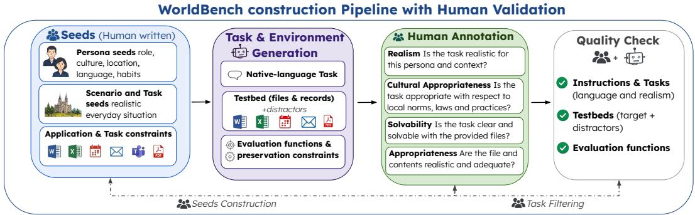  
Figure 1: WORLDBENCH construction and validation pipeline. Human-written persona, scenario, and seeds are expanded via automated generation, then filtered and refined using language- and culture-specific annotators.

To improve benchmark quality, generated tasks are filtered and revised through feedback from human annotators with language- and culture-specific expertise. Annotators assess whether each task is realistic for the persona, appropriate for the local context, solvable from the supplied files, and supported by plausible testbed information. Their feedback is used to remove invalid instances and refine instructions, files, and evaluation criteria.

We design the benchmark to measure whether an agent can solve a task without damaging its workspace. Hence, we introduce Constrained Task Success (CTS), a task-level final-state metric where a task receives CTS only when every task-specific evaluation function passes and the preservation constraint holds. The metric distinguishes nominal task completion from completion that leaves unrelated states intact. It complements intermediate trajectory metrics, which measure partial progress but do not establish whether the final environment is correct. This distinction is important in real environments containing multiple files, notes, spreadsheets, and related distractors. Accordingly, in WORLDBENCH testbeds, we build testbeds that contain distractors, ambiguous records, and other constraints to identify inappropriate changes.

WORLDBENCH studies multilingual robustness across seven different languages: English (US and UK), Italian, Portuguese, Spanish, French, German, and Chinese. Personas, tasks, documents, calendars, and emails are localised to each cultural and linguistic context, while the evaluation logic remains consistent. This design supports comparison across compositionally aligned settings while preserving language- and locale-specific conventions.

We evaluate nine frontier LLM agents on WORLDBENCH. The strongest model reaches 49.2% CTS, while the weakest achieves 10.8%. Across models, pass rate is higher than CTS, indicating that many apparently correct trajectories modify files outside the target. We also find a stable language gradient, with English settings leading and Chinese trailing across every model. Finally, we conduct a failure analysis which shows that wrong final states, edits, iteration-limit hits, malformed actions, and execution errors contribute to the limitations. The contributions of this work are:

• We present WORLDBENCH, a multilingual agentic benchmark for culturally grounded tasks, with instances refined by human annotators across seven languages and eight cultures.

• We define a task construction pipeline that turns personas, applications, and constraint seeds into localised instructions, concrete testbeds, and executable evaluators.

• We introduce CTS, a headline metric that pairs task correctness with preservation of non-target files, together with diagnostic metrics that expose collateral edits, long trajectories, malformed actions, and failed executions.

• We provide an empirical evaluation of nine LLM agents and show that they remain brittle under long-horizon execution, multilingual localisation, and preservation constraints.

## 2 Related Work

Language agent benchmarks. Recent work evaluates LLM agents in interactive environments that require planning, tool use, and feedback-driven decision-making. Representative settings include web navigation (Deng et al., 2023; Zhou et al., 2024; Koh et al., 2024; Wang et al., 2025a), shopping and task-oriented interaction (Yao et al., 2023; Kim et al., 2026), operating-system control (Xie et al., 2024), multi-turn tool use (Ma et al., 2024; Liu et al., 2025), and executable programming environments (Yang et al., 2023; Deng et al., 2025). WORLDBENCH provides a complementary setting in which agents must act for a culturally-situated persona within a file-based world while preserving files outside the target set. Recent file-based and multi-application benchmarks move agent evaluation towards long-horizon workflows with heterogeneous tools and state (Wang et al., 2025b).

Document understanding and file-based workflows. Document understanding benchmarks traditionally focus on extracting information from forms, receipts, invoices, tables, or visually rich documents (Mathew et al., 2021; Gong et al., 2025; Zhang et al., 2026). These tasks test document interpretation but do not require agents to maintain a workspace, modify artefacts, or preserve unrelated state during multi-step execution. Recent agent benchmarks address richer file-based workflows, but are typically centred on English scenarios and do not make culturally grounded multilingual task construction the core design goal. WORLDBENCH targets this gap by combining documents, spreadsheets, messages, calendar records, PDFs, shell commands, and generated notes into executable tasks that are built and audited across languages.

Synthetic benchmark construction. Synthetic data generation has been widely used to create instruction-following corpora and task variants from compact seeds (Wang et al., 2023; Xu et al., 2025; Chim et al., 2025; Gill et al., 2025). For agent evaluation, generation is more demanding because each task must contain a coherent state, a solvable instruction, and an executable evaluator (Fang et al., 2025; Alismail and Lanquillon, 2025). WORLD-BENCH treats generated tasks as complete artefacts: each instance includes localised text, files, and evaluation functions. The benchmark is then filtered and refined via feedback from human annotators, who assess task authenticity, cultural reliability, file sufficiency, and evaluator correctness.

Multilingual agent evaluation. LLM evaluation is still English-centred. Recent multilingual agent benchmarks show that performance and safety can degrade when agents are evaluated beyond English (Wang et al., 2025a). However, multilingual coverage is often obtained by translating existing English-centred tasks into other languages (Hofman et al., 2026). This design is useful for controlled comparison, but it can leave the underlying scenarios, user assumptions, and artefacts tied to the source language. WORLDBENCH follows a different construction principle: tasks are generated, localised, and human-annotated from the start within each language setting. Personas, tasks, files, and evaluation criteria are therefore aligned with the target language and cultural context, while the evaluation logic remains shared across languages.

## 3 WORLDBENCH Benchmark

Agentic evaluation must account for the worlds in which actions take effect. While recent agents can follow instructions in isolated tool-use settings, realistic workflows require coordinating operations across heterogeneous environments, where different cultures, interactions, and languages may be present, all while preserving the surrounding state. This is challenging because an agent must identify the relevant artefacts, operate within a constrained space, and terminate with a valid final state.

To evaluate these capabilities, we introduce WORLDBENCH, a culturally-grounded multilingual benchmark for agentic tasks. WORLDBENCH contains 1,600 tasks across seven languages and eight cultures. Each task pairs a persona-grounded instruction with a sandbox, structured action interface, and final-state evaluation functions. The benchmark is constructed from human-written seeds, materialised into task environments, and assessed through a stratified human audit with language- and culture-specific annotators. Figure 1 summarises the construction and Figure 2 execution pipelines. We describe the task formulation (§ 3.1), persona and language design (§ 3.2), tool environment (§ 3.3), and autonomous workflow (§ 3.4). We then present benchmark construction (§ 3.5) and the evaluation protocol (§ 3.6).

## 3.1 Task Formulation

We formulate an agentic task as a goal-directed interaction between an LLM-based agent and a sandboxed environment. Each task consists of a targetlanguage instruction associated with a persona situated in an environment with a state, an available tool set, and a set of final-state evaluation criteria. These elements correspond to the persona & task, environment, agent-execution, and final-state components in Figure 2. The persona identifies the user on whose behalf the agent acts and grounds the task in a role, location, and working context. The task instruction specifies the goal to be completed, while the initial state contains the relevant artefacts and related distractors. The evaluation define the properties that must hold when execution ends. This formulation is designed to test grounded execution since the agent cannot solve a task by producing an answer in isolation; instead, it must inspect the available artefacts, select appropriate tools, execute actions, and leave the environment in a valid final state. This makes WORLDBENCH suitable for evaluating long-horizon behaviour and tool coordination.

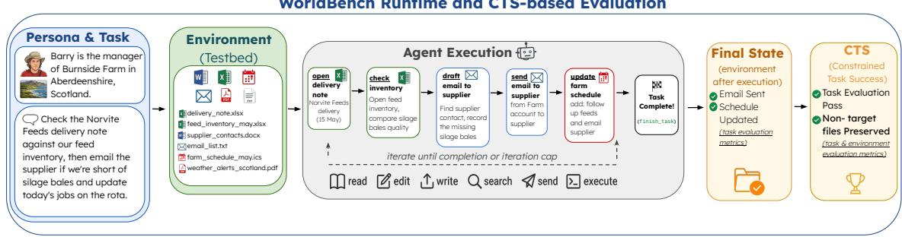  
Figure 2: WORLDBENCH runtime and final-state evaluation. The agent executes structured actions, after which the resulting state is evaluated for task completion and preservation of non-target files.

## 3.2 Personas and Native-Language Task Construction

A central goal of WORLDBENCH is to evaluate agents in culturally grounded settings. WORLD-BENCH covers persona-related tasks in seven different languages: English, Italian, Portuguese, Spanish, French, German, and Chinese. The benchmark is organised by language and culturally grounded via the persona’s location and context.

Each persona specifies a concrete user, including name, role, locale, language, and relevant context. These attributes determine which activities, artefacts, registers, dates, currencies, organisations, and assumptions are appropriate for the task.

The personas and tasks are not obtained by translating a single language pool. They are constructed within the target setting; hence, names, currencies, file contents, documents, and contextual assumptions are aligned with the corresponding locale. The evaluation logic is shared across settings, enabling comparison while preserving language- and location-specific variation.

## 3.3 Tool Environment & Workflow

WORLDBENCH exposes a heterogeneous tool environment that covers the main artefact types required by the tasks. Each tool family is associated with a restricted set of operations, Table 1 summarises the tool families used in the benchmark.

<table><tr><td>Tool family Operations</td><td></td></tr><tr><td></td><td>Spreadsheet Read tabular records and edit cell values.</td></tr><tr><td>Document PDF</td><td>Read, create, and update text documents. Read PDF content and support conversion-</td></tr><tr><td>Messaging</td><td>oriented operations. Inspect message records and compose messages.</td></tr><tr><td>Calendar Shell</td><td>List events and create non-overlapping entries. Execute filesystem commands inside the sand-</td></tr><tr><td></td><td>box.</td></tr><tr><td>System</td><td>Manage global control actions and terminate execution.</td></tr></table>

Table 1: Tools and operations in WORLDBENCH.

The tool environment creates a broad action space, but only a subset of operations is appropriate at any point in a trajectory. The agent must therefore decide which artefact to inspect, which tool to use, and how to parameterise the next action. To trace execution, we record errors in tool choice, invalid arguments, repeated operations, and premature termination.

## 3.4 Autonomous Workflow

We model the interaction as a transition system $\mathcal { W } = ( S , A , O , \delta )$ , where S is the space of environment states, A is the structured action space, O is the observation space, and $\delta : S \times A \to S \times O$ is the transition function. At step t, the agent selects an action $a _ { t } \in A$ . The environment executes the action, updates the sandbox state, and returns an observation $o _ { t }$ . The execution history is represented as $H _ { t } = [ ( a _ { 1 } , o _ { 1 } ) , \dots , ( a _ { t - 1 } , o _ { t - 1 } ) ]$ . Figure 2 shows this execution protocol. The agent receives a persona-grounded task, interacts with the testbed via structured actions, and is evaluated from the resulting final state.

The agent conditions its next action on the task instruction, available tool descriptions, and $H _ { t }$ . Observations are rendered in text and preserve the information needed for subsequent decisions. Depending on the operation, they may contain document content, spreadsheet values, command outputs, calendar entries, generated messages, or execution errors. Execution proceeds until the agent emits a termination action or reaches the iteration cap. The final state is then passed to the evaluation functions. This workflow allows WORLDBENCH to measure whether the agent can build a coherent action trajectory, use observations effectively, and stop after reaching the intended final state.

## 3.5 Benchmark Construction

WORLDBENCH is constructed through a seeddriven construction pipeline comprising task synthesis, testbed synthesis, and human audit. The purpose is to create executable tasks that are heterogeneous, culturally grounded, and auditable.

Task Synthesis Construction begins from three types of human-written seeds. A persona seed specifies the user’s role, location, language, and working context. A scenario seed describes a plausible activity for that persona. An applicationand-constraint seed identifies the required tools, intended outputs, forbidden outcomes, and preservation requirements.

These elements are expanded into a nativelanguage instruction and a specification of the artefacts required by the task. The resulting scenario must be reliable for the persona and solvable through the supported tool environment.

Testbed Synthesis The testbed synthesis stage materialises the task environment. Spreadsheets, PDFs, documents, calendars and text files are populated with task-relevant values; documents contain persona-consistent prose; mailboxes contain message records; and calendars contain events required by scheduling tasks. Each testbed also includes 20 distractor artefacts containing similar filenames, overlapping entities, related records, or outdated versions of target documents. Distractors increase the need for precise artefact selection and support the evaluation of workspace preservation.

Human Audit The candidate task pool is reviewed by annotators with language- and culturespecific expertise before final inclusion. Annotators examine whether each task is realistic for the persona, appropriate for its local context, and solvable from the supplied artefacts. For each file, they also assess whether the type and amount of information are plausible for that document format.

The audit identifies problems that automatic validation cannot reliably capture, including culturally implausible scenarios, unnatural document contents, insufficient evidence, and evaluation criteria that under-specify the intended outcome. Appendix F reports the construction statistics, review procedure, and annotation questions.

## 3.6 Evaluation Protocol

Each task is evaluated from the final state. WORLD-BENCH combines deterministic evaluation with LLM-as-a-judge evaluation. Deterministic functions check properties that can be verified directly, including required or forbidden content, spreadsheet cell values, file existence, and calendar consistency. Judge-based functions are used for openended artefacts, such as messages or notes.

A task passes when all its task-specific evaluation functions succeed. These functions may inspect several properties across one or more files, spreadsheet cells, calendar entries, or message artefacts. Pass rate therefore measures complete satisfaction of the task-specific final-state criteria.

Pass rate does not establish whether the surrounding workspace remains unchanged. WORLD-BENCH individually checks whether any non-target file differs between the initial and final sandbox states. Preservation rate measures the proportion of tasks for which all pre-existing non-target files remain intact. Their conjunction yields CTS, which we formally define in § 4.1.

Evaluation Functions Each task is connected to one or more evaluation functions, either deterministic or LLM-based. The deterministic functions verify exact properties of the final filesystem, while the judge-based functions evaluate open-ended messages and notes against a task-specific rubric. Table 2 summarises the evaluation functions; implementation details in Appendices C and D.

<table><tr><td>Function</td><td>What it checks</td></tr><tr><td>contain</td><td>Required text appears in a target file.</td></tr><tr><td>not_contain</td><td>Prohibited text is absent from a tar- get file.</td></tr><tr><td>excel_cell_value</td><td>A spreadsheet cell contains the ex- pected value.</td></tr><tr><td>file_exist</td><td>A required output file has been cre- ated.</td></tr><tr><td></td><td>calendar_no_overlap Calendar events satisfy a non- overlap constraint.</td></tr><tr><td>evaluate_email</td><td>A generated email satisfies the rubric.</td></tr><tr><td>evaluate_note</td><td>A generated note satisfies the rubric.</td></tr></table>

Table 2: Evaluation functions used in WORLDBENCH.

## 4 Experiments

## 4.1 Metrics

The headline metric is Constrained Task Success (CTS). For each task t, pass(t) is true when all task-specific evaluation functions succeed on the final sandbox state computed once for the complete task. For instance, a task requiring both a spreadsheet update and an email passes only if both outputs satisfy their respective evaluators.

We define preserve(t) as the condition in which every non-target file remains unchanged between the initial and final states. Target files are identified from the task evaluators; all other pre-existing files must remain present and byte-identical. Then,

$$
\mathbf { C T S } ( t ) = \operatorname { p a s s } ( t ) \wedge \operatorname { p r e s e r v e } ( t ) .
$$

CTS extends final-state task success (Wang et al., 2024; Xie et al., 2024) with a workspacepreservation condition. The check is binary and operates at file level: any modification to a non-target file causes failure, while changes within target files are assessed by task-specific evaluators.

We report pass rate, preservation rate, mean steps on solved tasks, malformed actions per task, execution failures, iteration-cap hits, and clean termination rate. The gap between pass rate and CTS captures tasks that satisfy the final-state criteria but violate preservation. We further report CTS by language and tool family, pass rate by evaluation function, and trajectory-level events linking collateral edits to specific actions.

## 4.2 Models and Protocols

We evaluate nine LLM-based agents: Gemini-3.1- Pro, Gemini-3.5-Flash, GPT-5, GPT-4o, Qwen-3-32B, Qwen-3-4B, Llama-3.3-70B, Llama-3.1- 8B, and EuroLLM-9B. All agents use the same prompts, action schema, environment, and configurations. Details are in Appendix A.

Each task is run once per model, using the protocol in Appendix B. We record the trajectory, final environment state, evaluation outcomes, and diagnostic events, reporting percentages for CTS, pass rate, preservation, iteration-cap hits, and clean terminations, as well as mean counts for malformed actions and mean trajectory on solved tasks.

## 5 Results

## 5.1 Main Results

Gemini-3.1-Pro, GPT-5, and Qwen-3-32B lead the pack at 49.2%, 48.8%, and 48.0% CTS respectively. GPT-4o and Gemini-3.5-Flash follow at 38.6% and 34.6% CTS, with the remaining models scoring between 24.1% and 10.8% CTS.

Table 3 and Figure 3 show that current LLMbased agents struggle on WORLDBENCH. Gemini-3.1-Pro, GPT-5, and Qwen-3-32B achieve the highest scores, but their CTS still remain under 50%. GPT-4o, Gemini-3.5-Flash and Llama-3.3- 70B rank in the middle, and the rest of the models perform worse. These results indicate that strong capability does not directly translate into reliable execution once tasks are grounded in a contextdependent world.

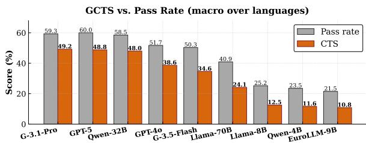  
Figure 3: CTS vs pass rate. The arrows represent the penalty introduced by the preservation constraint.

The Preservation Gap Table 3 displays that for every model, pass rate exceeds CTS by a broad margin. The gap ranges from 10.1 for Gemini-3.1- Pro to 16.8 for Llama-3.3-70B and increases as overall capability decreases. In less performant models, the test pass rate is low enough that few trajectories survive long enough to make a change. The difference between pass rate and CTS embodies the lack of environmental preservation: agents that complete the process while leaving changes in files that should have remained unedited.

<table><tr><td>Model</td><td>CTS↑</td><td>PASS↑</td><td>PRESV.↑</td><td>STEPS↓</td><td>MALF./TASK↓</td><td>HITMAX↓</td><td>CLEAN↑</td></tr><tr><td>Gemini-3.1-Pro</td><td>49.2</td><td>59.3</td><td>82.5</td><td>8.7</td><td>0.40</td><td>10%</td><td>88%</td></tr><tr><td>GPT-5</td><td>48.8</td><td>60.0</td><td>81.3</td><td>7.5</td><td>0.60</td><td>17%</td><td>82%</td></tr><tr><td>Qwen-3-32B</td><td>48.0</td><td>58.5</td><td>80.5</td><td>8.2</td><td>0.75</td><td>19%</td><td>78%</td></tr><tr><td>GPT-40</td><td>38.6</td><td>51.7</td><td>73.9</td><td>10.4</td><td>0.90</td><td>17%</td><td>79%</td></tr><tr><td>Gemini-3.5-Flash</td><td>34.6</td><td>50.3</td><td>66.0</td><td>12.6</td><td>1.70</td><td>25%</td><td>68%</td></tr><tr><td>Llama-3.3-70B</td><td>24.1</td><td>40.9</td><td>58.7</td><td>13.9</td><td>2.60</td><td>34%</td><td>58%</td></tr><tr><td>Llama-3.1-8B</td><td>12.5</td><td>25.2</td><td>49.6</td><td>18.2</td><td>4.50</td><td>52%</td><td>41%</td></tr><tr><td>Qwen-3-4B</td><td>11.6</td><td>23.5</td><td>48.0</td><td>18.8</td><td>4.80</td><td>55%</td><td>38%</td></tr><tr><td>EuroLLM-9B</td><td>10.8</td><td>21.5</td><td>50.2</td><td>19.5</td><td>5.10</td><td>58%</td><td>35%</td></tr></table>

Table 3: Macro-averaged results on WORLDBENCH across eight cultures and all tool sets. CTS combines complete task-level evaluator success with preservation of the non-target workspace; PASS and PRESV. report these components separately. STEPS is the mean number of actions on passed tasks. MALF./TASK, HITMAX, and CLEAN denote malformed actions per task, iteration-cap hits, and termination via finish\_task.
<table><tr><td>Model</td><td>EN-US</td><td>EN-UK</td><td>IT</td><td>PT</td><td>ES</td><td>FR</td><td>DE</td><td>ZH</td><td>AVG.</td></tr><tr><td>Gemini-3.1-Pro</td><td>58.4</td><td>56.8</td><td>49.1</td><td>46.9</td><td>49.9</td><td>47.7</td><td>46.2</td><td>38.6</td><td>49.2</td></tr><tr><td>GPT-5</td><td>57.4</td><td>56.9</td><td>48.1</td><td>45.7</td><td>48.9</td><td>46.9</td><td>47.7</td><td>38.8</td><td>48.8</td></tr><tr><td>Qwen-3-32B</td><td>56.0</td><td>55.5</td><td>46.5</td><td>44.5</td><td>47.0</td><td>45.5</td><td>45.5</td><td>43.5</td><td>48.0</td></tr><tr><td>GPT-40</td><td>44.7</td><td>43.4</td><td>40.4</td><td>36.8</td><td>39.7</td><td>39.7</td><td>35.4</td><td>28.7</td><td>38.6</td></tr><tr><td>Gemini-2.5-Pro</td><td>43.5</td><td>41.8</td><td>38.0</td><td>36.7</td><td>38.3</td><td>35.8</td><td>34.7</td><td>28.6</td><td>37.4</td></tr><tr><td>Gemini-3.5-Flash</td><td>38.7</td><td>38.4</td><td>31.7</td><td>31.5</td><td>32.6</td><td>33.6</td><td>30.2</td><td>25.7</td><td>34.6</td></tr><tr><td>Llama-3.3-70B</td><td>28.6</td><td>27.6</td><td>22.5</td><td>23.5</td><td>26.3</td><td>21.8</td><td>23.5</td><td>18.0</td><td>24.1</td></tr><tr><td>Llama-3.1-8B</td><td>15.5</td><td>15.0</td><td>12.0</td><td>11.5</td><td>12.5</td><td>11.8</td><td>12.2</td><td>9.5</td><td>12.5</td></tr><tr><td>Qwen-3-4B</td><td>13.8</td><td>13.3</td><td>10.0</td><td>11.1</td><td>10.7</td><td>9.8</td><td>10.3</td><td>13.8</td><td>11.6</td></tr><tr><td>EuroLLM-9B</td><td>12.5</td><td>12.0</td><td>11.2</td><td>10.5</td><td>11.0</td><td>10.8</td><td>10.9</td><td>7.5</td><td>10.8</td></tr></table>

Table 4: Per-language CTS scores.

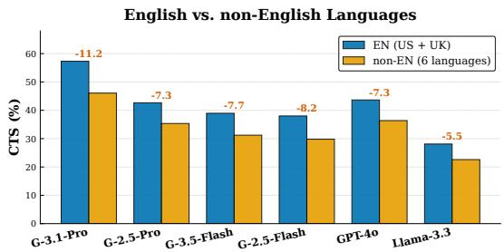  
Figure 4: English versus non-English CTS per model.

## 5.2 Multilingual Robustness

Table 4 and Figure 4 show that English generally yield the highest CTS, while Chinese is among the most difficult settings for most models. The Qwen models are the main exception: their decline on Chinese is smaller, and Qwen-3-32B gets the highest Chinese. These differences may reflect multilingual instruction following, localised document conventions, and variation in difficulty across constructed settings. We interpret them as setting-level performance gaps. In Appendix K we discuss the limits of cross-locale comparability.

## 5.3 Application and Evaluator Effects

Figure 5 compares pass rate and CTS across applications. Calendar and document tasks achieve higher scores, while messaging and shell tasks show lower CTS and larger preservation gaps. Their difficulty therefore reflects both incomplete execution and collateral modifications.

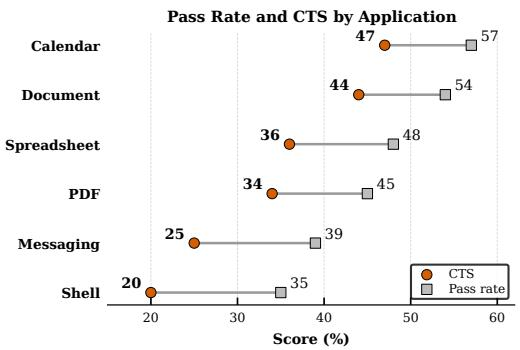  
Figure 5: Pass rate and CTS by application family; connecting segments indicate preservation gaps.

Figure 6 shows that deterministic functions, including file-existence and spreadsheet-cell checks, achieve higher pass rates than the email and note evaluators. Open-ended outputs therefore remain more difficult to satisfy. Appendices C and I report the judging protocol and robustness analysis.

Task complexity. Figure 7 reports CTS for each model across the four reference-solution-length bins. Performance generally declines as tasks require more substantive actions. This analysis measures intrinsic task complexity, while Appendix H examines the trajectories produced by agents.

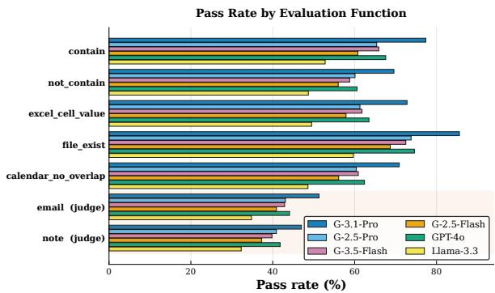  
Figure 6: Pass rate by evaluation function.

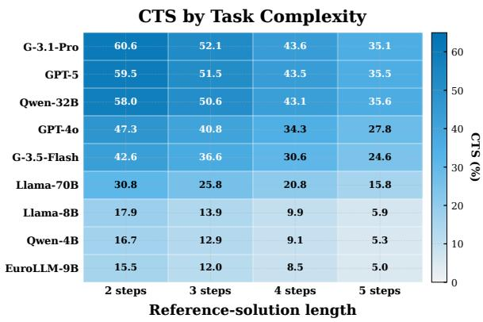  
Figure 7: CTS by model and reference-solution-length.

## 5.4 Failure Modes

To examine how agents fail, we classify each failed trajectory into one of five categories: wrong output, collateral edit, iteration-cap hit, malformed loop, or execution error. Each trajectory is assigned one failure mode according to the final outcome and recorded execution. Figure 8 reports the share of failed tasks assigned to each category for every model, showing that wrong output is the largest category for stronger models, with collateral edits remaining substantial across all agents. Iterationcap hits increase as performance decreases and form the largest category for the smallest models, accounting for up to 43% of failures in the case of EuroLLM-9B. Table 3 shows that lower-CTS models execute more steps, produce more malformed actions, terminate cleanly less often, and reach the iteration cap continually (details in Appendix G).

Appendix J provides a manual error analysis and Appendix H reports trajectory-length results for all models. Finally, Appendix L reports some execution examples.

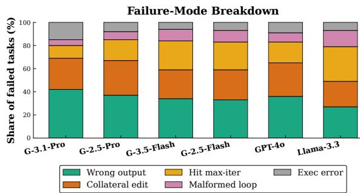  
Figure 8: Failure-mode breakdown per task per model.

## 6 Discussion

The results point to three limitations of current agents. First, agents lack a reliable notion of workspace safety. While they can identify a target artefact, they still add noise in neighbouring files. Second, long-horizon execution remains brittle. Once a trajectory extends beyond the solution path, errors compound quickly. Third, multilingual performance remains unstable. In parallel, these findings suggest that agents need stronger state tracking, explicit preservation objectives, and better localisation-aware action grounding. The nature of WORLDBENCH is also important because it allows for new personas, languages, and patterns to be added through seeds, and it also allows fresh tasks to be created when contamination is suspected.

## 7 Conclusion

We introduced WORLDBENCH, a multilingual, persona-grounded benchmark for executable agentic tasks. WORLDBENCH materialises testbeds, evaluates the final system state using deterministic and judge-based functions, and uses CTS to enforce both correctness and preservation. We experiment with different LLM-based agents; the best model does not surpass 50% CTS. All models exhibit a notable preservation gap, and performance degrades outside English. These results show that environment preservation and multilingual robustness are central requirements for reliable agents and that both should be measured explicitly.

## Limitations

WORLDBENCH evaluates structured, file-based workflows via a fixed action interface. This supports reproducible experiments on documents, spreadsheets, calendars, and filesystem operations, but excludes visual desktop control and live web interaction, which have not been included in this version to maximise reproducibility, but are intended to be incorporated in future development versions.

Two open-ended evaluators use an LLM judge, whose agreement with human annotations and alternative judges is examined in Appendix I. Each task is executed once per model under a fixed decoding configuration.

## Ethics Statement

WORLDBENCH uses synthetic personas and synthetic data. The benchmark is designed to avoid private information and personally identifying records from real users. The main ethical risks concern the evaluation of systems that may be deployed in sensitive workplace contexts. We emphasise preservation, auditability, and failure reporting. During manuscript preparation, an LLM was used for drafting and editing support. The authors reviewed all text and remain fully responsible for the scientific claims, results, and final content.

## References

Ahmad Alismail and Carsten Lanquillon. 2025. A survey of llm-based methods for synthetic data generation and the rise of agentic workflows. In Artificial Intelligence in HCI, pages 119–135, Cham. Springer Nature Switzerland.

Léo Boisvert, Megh Thakkar, Maxime Gasse, Massimo Caccia, Thibault Le Sellier De Chezelles, Quentin Cappart, Nicolas Chapados, Alexandre Lacoste, and Alexandre Drouin. 2025. Workarena++: Towards compositional planning and reasoningbased common knowledge work tasks. Preprint, arXiv:2407.05291.

Jenny Chim, Julia Ive, and Maria Liakata. 2025. Evaluating synthetic data generation from user generated text. Computational Linguistics, 51(1):191–233.

Xiang Deng, Jeff Da, Edwin Pan, Yannis Yiming He, Charles Ide, Kanak Garg, Niklas Lauffer, Andrew Park, Nitin Pasari, Chetan Rane, Karmini Sampath, Maya Krishnan, Srivatsa Kundurthy, Sean Hendryx, Zifan Wang, Vijay Bharadwaj, Jeff Holm, Raja Aluri, Chen Bo Calvin Zhang, and 3 others. 2025. Swebench pro: Can ai agents solve long-horizon software engineering tasks? Preprint, arXiv:2509.16941.

Xiang Deng, Yu Gu, Boyuan Zheng, Shijie Chen, Samuel Stevens, Boshi Wang, Huan Sun, and Yu Su. 2023. Mind2web: Towards a generalist agent for the web. Preprint, arXiv:2306.06070.

Jinyuan Fang, Yanwen Peng, Xi Zhang, Yingxu Wang, Xinhao Yi, Guibin Zhang, Yi Xu, Bin Wu, Siwei Liu,

Zihao Li, Zhaochun Ren, Nikos Aletras, Xi Wang, Han Zhou, and Zaiqiao Meng. 2025. A comprehensive survey of self-evolving ai agents: A new paradigm bridging foundation models and lifelong agentic systems. Preprint, arXiv:2508.07407.

Alexander Gill, Abhilasha Ravichander, and Ana Marasovic. 2025. What has been lost with synthetic evaluation? In Findings ofthe Associationfor Computational Linguistics: EMNLP 2025, pages 9902– 9945, Suzhou, China. Association for Computational Linguistics.

Ziyu Gong, Chengcheng Mai, and Yihua Huang. 2025. Mhier-rag: Multi-modal rag for visual-rich document question-answering via hierarchical and multigranularity reasoning. Preprint, arXiv:2508.00579.

Omer Hofman, Jonathan Brokman, Oren Rachmil, Shamik Bose, Vikas Pahuja, Toshiya Shimizu, Trisha Starostina, Kelly Marchisio, Seraphina Goldfarb-Tarrant, and Roman Vainshtein. 2026. MAPS: A multilingual benchmark for agent performance and security. In Findings of the Association for Computational Linguistics: EACL 2026, pages 821–845, Rabat, Morocco. Association for Computational Linguistics.

Shijue Huang, Wanjun Zhong, Jianqiao Lu, Qi Zhu, Jiahui Gao, Weiwen Liu, Yutai Hou, Xingshan Zeng, Yasheng Wang, Lifeng Shang, Xin Jiang, Ruifeng Xu, and Qun Liu. 2024. Planning, creation, usage: Benchmarking LLMs for comprehensive tool utilization in real-world complex scenarios. In Findings of the Associationfor Computational Linguistics: ACL 2024, pages 4363–4400, Bangkok, Thailand. Association for Computational Linguistics.

Sunghwan Kim, Ryang Heo, Yongsik Seo, Jinyoung Yeo, and Dongha Lee. 2026. Agenticshop: Benchmarking agentic product curation for personalized web shopping. Preprint, arXiv:2602.12315.

Jing Yu Koh, Robert Lo, Lawrence Jang, Vikram Duvvur, Ming Lim, Po-Yu Huang, Graham Neubig, Shuyan Zhou, Russ Salakhutdinov, and Daniel Fried. 2024. VisualWebArena: Evaluating multimodal agents on realistic visual web tasks. In Proceedings ofthe 62nd Annual Meeting ofthe Associationfor Computational Linguistics (Volume 1: Long Papers), pages 881–905, Bangkok, Thailand. Association for Computational Linguistics.

Haohan Lin, Zhiqing Sun, Sean Welleck, and Yiming Yang. 2025. Lean-star: Learning to interleave thinking and proving. Preprint, arXiv:2407.10040.

Xiao Liu, Hao Yu, Hanchen Zhang, Yifan Xu, Xuanyu Lei, Hanyu Lai, Yu Gu, Hangliang Ding, Kaiwen Men, Kejuan Yang, Shudan Zhang, Xiang Deng, Aohan Zeng, Zhengxiao Du, Chenhui Zhang, Sheng Shen, Tianjun Zhang, Yu Su, Huan Sun, and 3 others. 2025. Agentbench: Evaluating llms as agents. Preprint, arXiv:2308.03688.

Chang Ma, Junlei Zhang, Zhihao Zhu, Cheng Yang, Yujiu Yang, Yaohui Jin, Zhenzhong Lan, Lingpeng Kong, and Junxian He. 2024. Agentboard: An analytical evaluation board of multi-turn llm agents. Preprint, arXiv:2401.13178.

Minesh Mathew, Dimosthenis Karatzas, and C. V. Jawahar. 2021. Docvqa: A dataset for vqa on document images. Preprint, arXiv:2007.00398.

Peng Wang, Ruihan Tao, Qiguang Chen, Mengkang Hu, and Libo Qin. 2025a. X-WebAgentBench: A multilingual interactive web benchmark for evaluating global agentic system. In Findings of the Association for Computational Linguistics: ACL 2025, pages 19320–19335, Vienna, Austria. Association for Computational Linguistics.

Weixuan Wang, Dongge Han, Daniel Madrigal Diaz, Jin Xu, Victor Rühle, and Saravan Rajmohan. 2025b. Odysseybench: Evaluating llm agents on long-horizon complex office application workflows. Preprint, arXiv:2508.09124.

Yizhong Wang, Yeganeh Kordi, Swaroop Mishra, Alisa Liu, Noah A. Smith, Daniel Khashabi, and Hannaneh Hajishirzi. 2023. Self-instruct: Aligning language models with self-generated instructions. Preprint, arXiv:2212.10560.

Zilong Wang, Yuedong Cui, Li Zhong, Zimin Zhang, Da Yin, Bill Yuchen Lin, and Jingbo Shang. 2024. Officebench: Benchmarking language agents across multiple applications for office automation. Preprint, arXiv:2407.19056.

Tianbao Xie, Danyang Zhang, Jixuan Chen, Xiaochuan Li, Siheng Zhao, Ruisheng Cao, Toh Jing Hua, Zhoujun Cheng, Dongchan Shin, Fangyu Lei, Yitao Liu, Yiheng Xu, Shuyan Zhou, Silvio Savarese, Caiming Xiong, Victor Zhong, and Tao Yu. 2024. Osworld: Benchmarking multimodal agents for openended tasks in real computer environments. Preprint, arXiv:2404.07972.

Can Xu, Qingfeng Sun, Kai Zheng, Xiubo Geng, Pu Zhao, Jiazhan Feng, Chongyang Tao, Qingwei Lin, and Daxin Jiang. 2025. Wizardlm: Empowering large pre-trained language models to follow complex instructions. Preprint, arXiv:2304.12244.

John Yang, Akshara Prabhakar, Karthik Narasimhan, and Shunyu Yao. 2023. Intercode: Standardizing and benchmarking interactive coding with execution feedback. Preprint, arXiv:2306.14898.

Shunyu Yao, Howard Chen, John Yang, and Karthik Narasimhan. 2023. Webshop: Towards scalable realworld web interaction with grounded language agents. Preprint, arXiv:2207.01206.

Ling Yue, Kushal Raj Bhandari, Ching-Yun Ko, Dhaval Patel, Shuxin Lin, Nianjun Zhou, Jianxi Gao, Pin-Yu Chen, and Shaowu Pan. 2026. From static templates to dynamic runtime graphs: A survey of workflow optimization for llm agents. Preprint, arXiv:2603.22386.

Boyang Zhang, Sebastián G. Acosta, Preston Carlson, Sacha Bron, Pierre-Loïc Doulcet, Daniel B. Ospina, and Simon Suo. 2026. Parsebench: A document parsing benchmark for ai agents. Preprint, arXiv:2604.08538.

Shuyan Zhou, Frank F. Xu, Hao Zhu, Xuhui Zhou, Robert Lo, Abishek Sridhar, Xianyi Cheng, Tianyue Ou, Yonatan Bisk, Daniel Fried, Uri Alon, and Graham Neubig. 2024. Webarena: A realistic web environment for building autonomous agents. Preprint, arXiv:2307.13854.

## A Model Versions

Model Checkpoint / version   
Gemini-3.1-Pro Gemini API (gemini-3.1-pro).   
Gemini-3.5-Flash Gemini API (gemini-3.5-flash).   
GPT-5 OpenAI Responses API (gpt-5).   
GPT-4o OpenAI API (gpt-4o)   
Llama-3.3-70B meta-llama/Llama-3.3-70B-Instruct.   
Llama-3.1-8B meta-llama/Llama-3.1-8B-Instruct.   
EuroLLM-9B EuroLLM/EuroLLM-9B-Instruct.   
Qwen3-32B and 4B Qwen/Qwen3-32B and 4B.  
Table 5: We evaluate proprietary models via official APIs and open-weight models locally on an architecture equipped with two A40GPUs(48GBVRAM).

## B Prompts and Execution Details

WORLDBENCH ’s execution and evaluation take place through a series of steps for language, task and scenario where the agent receives task, apps, execution history, and action schema. For construction, it must return one action encoded in JSON. Responses that do not contain a JSON trigger a retry with an explicit reminder, and the action is counted as malformed when the retry fails. Malformed actions leave the sandbox unchanged, and the agent may recover on the next step. Files are reachable under data, which is rewritten to the real sandbox path before each command executes.

Agent Message. At the beginning of the interactions, we define the context via a system message. It is defined once per task from the persona (context and user), and the introduction line of each available app.

## Agent Message

You are an AI assistant acting for the following user: {persona}

You can interact with an operating system and use apps to solve the task.

You must follow the instructions and use the JSON. You can only generate one action at a time.

Your response MUST be a single JSON action and NOTHING ELSE: no explanation, no markdown. Output only the JSON.

Once you have read the information you need, take the action that modifies or creates the required file. Reading the same file twice is wasteful; prefer acting over inspecting.

To edit a Word or Excel file, use the dedicated word/excel app actions (for example word write\_to\_file).

When the task is complete, finish with {’app’: ’system’, ’action’: ’finish\_task’}.

You can find files for your task in /testbed/data. If you don’t know the filenames, please switch to shell app and call commands to list the directory.

App-Selection Prompt. Before any app is selected, the agent is asked to switch to one of the available apps.

App-Selection Prompt   
#Task: {task}   
#History: {history}   
#Available apps: {available\_apps}   
#Instruction:   
- choose an app from the available apps: {’app’:   
’system’, ’action’: ’switch\_app’, ’target\_app’:   
[THE\_APP\_YOU\_CHOOSE]}   
#Command:

Action-Selection Prompt. Once an app is active, the action space is restricted to that app’s operations, augmented by app switching and task termination. The demonstration line of every available action is inlined in {detailed\_instruction}.

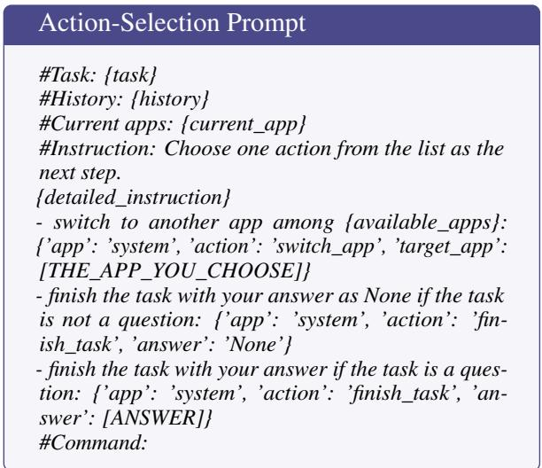

Each history entry is rendered as - Step i: {action} -> [{observation}], the agent conditions every decision on the full sequence of previous actions and their observed outputs.

## C LLM-as-a-Judge Evaluation

Two evaluation functions, evaluate\_email and evaluate\_note, are judged by a held-out model. First, they perform a case-insensitive keyword check on the extracted document text and fail directly if a required keyword is missing. The surviving text is then passed to the judge together with the task-specific criteria. The judge runs at temperature 0 with an output cap of 10 tokens, and its verdict is read as a pass if the response contains YES.

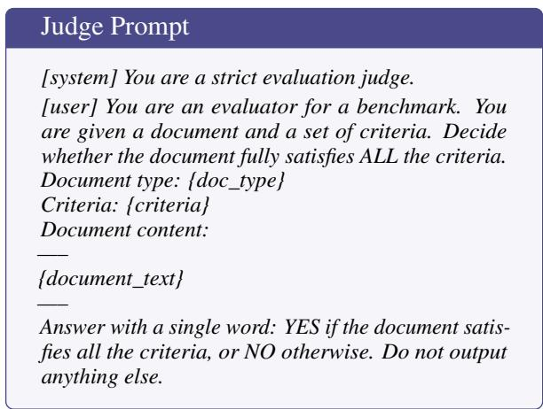

When a task supplies no explicit criteria, the following defaults are used.

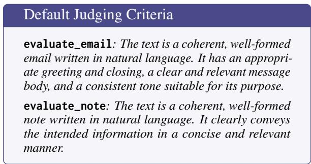

## D Deterministic Evaluation Functions

The five deterministic functions read the sandbox’s final state and verify its exact properties. evaluate\_contain extracts the text of the target file according to its document type spreadsheets, Word documents, PDFs, plain text, calendars, and mailboxes) and then checks that every required keyword occurs as a case-insensitive substring; numeric keywords are compared after thousands separators are stripped. evaluate\_not\_contain is its negation. evaluate\_file\_exist checks that a required output file has been created. evaluate\_excel\_cell\_value verifies that each declared cell holds the expected value at the declared row and column. evaluate\_calendar\_no\_overlap parses the user’s calendar, sorts the events by start time, and fails when any event ends after the next one begins.

## E Execution Hyper-parameters

Generally, trajectories terminate in one of three ways. The agent emits finish\_task, which counts as a clean termination. The agent repeats an identical action more times in a row, which is detected by a sliding window and converted into a got\_stuck signal. The agent reaches the iteration cap, which is recorded as an iteration-cap hit and reported in Table 3.

<table><tr><td>Parameter</td><td>Value</td></tr><tr><td>Iteration cap</td><td>30 steps per task.</td></tr><tr><td>Actions per step</td><td>Exactly one JSON action object.</td></tr><tr><td>Agent temperature</td><td>[0,1], with 1024 max tokens.</td></tr><tr><td>Judge temperature</td><td>[0,1], with 10 max tokens.</td></tr><tr><td>Malformed-action retry</td><td>One retry with an explicit JSON reminder.</td></tr><tr><td>Stagnation detection</td><td>5 identical consecutive actions trigger got_stuck.</td></tr><tr><td>Sandbox</td><td>Fresh copy of the testbed per task.</td></tr><tr><td>Result writing</td><td>Atomic writes after every task.</td></tr><tr><td>Distractors</td><td>15–20 per testbed.</td></tr></table>

Table 6: Execution settings. We use the most deterministic temperature, based on the documentation for the model used.

## F Benchmark Construction and Human Audit

## F.1 Human-Written Seeds

For each language–locale setting, construction begins from a human-written core of 20 culturally situated personas. Each persona specifies a role, location, language, and relevant working context. Human contributors write and supervise four realistic tasks for each persona, yielding 80 human-written seed tasks per setting.

These seeds define the intended relationships between persona characteristics, local context, task requirements, testbed artefacts, and evaluation targets. They also provide examples for the subsequent augmentation stage.

## F.2 Persona and Task Augmentation

Starting from the human-written seed pool, the construction pipeline generates 30 additional personas for each language–locale setting. Each augmented persona is associated with five or six candidate tasks, producing between 150 and 180 augmented task candidates per setting.

Together, the human-written and augmented pools contain 50 personas and between 230 and 260 candidate tasks for each setting. Candidate personas and tasks are generated directly within their target language and locale.

## F.3 Human Audit Procedure

The candidate tasks are reviewed by annotators with relevant language and cultural expertise before inclusion in the final benchmark. Annotators inspect the persona, task instruction, supplied artefacts, and expected outcome.

<table><tr><td>Construction stage</td><td>Per setting</td><td>Total</td></tr><tr><td>Human-written personas Human-written seed tasks Augmented personas</td><td>20 80 30</td><td>160 640 240</td></tr><tr><td>Augmented task candidates Candidate tasks before audit</td><td>150-180 230-260</td><td>1,200-1,440 1,840–2,080</td></tr><tr><td>Retained personas</td><td>50</td><td>400</td></tr></table>

Table 7: Construction and filtering of WORLDBENCH across the eight language–locale settings. Candidatetask totals vary because each augmented persona is associated with five or six tasks.

The audit examines whether each task is realistic for the corresponding persona, appropriate for its local context, and solvable from the provided files. Annotators additionally assess whether the type and amount of information contained in each artefact are plausible for the corresponding document format. Free-text feedback is requested whenever a task is judged unrealistic, culturally inappropriate, insufficiently specified, or unsupported by the supplied artefacts. This feedback is used to revise task instructions, testbed contents, and evaluation criteria, or to remove the candidate task when the identified problem cannot be resolved.

The audit involved annotators, with 40 assigned to each language–locale setting. Each candidate task received one annotation, and 25% of the pool was double-annotated. Disagreements were resolved via internal author discussion. Annotators were compensated at 12(GBP/h). Annotators were born in and residents of the country corresponding to the target setting, were fluent in the relevant language, and had sufficient digital literacy to inspect documents, spreadsheets, CSV files, and PDFs. They inspected the persona, task instruction, artefacts, and expected outcome.

Annotation Questions For each task, annotators answer the following questions:

1. Is this a realistic task that the persona is likely to perform under the described circumstances?

2. Is the task realistic with respect to the places, laws, organisations, culture, and locationspecific characteristics described in the scenario?

3. What information contained in each supplied file is necessary to complete the task?

4. Is the type of information realistic for this document format?

5. Is the amount of information realistic for this document format?

Negative judgements are accompanied by freetext feedback that describes the problem and the required revision.

## F.4 Filtering and Final Balancing

The annotation results are used as a filtering and revision mechanism. Tasks with recoverable problems are revised and checked again, whereas invalid or culturally implausible instances are removed. Following human review, the benchmark is balanced to 200 tasks and 50 distinct personas for each of the eight language–locale settings. The final benchmark therefore contains 1,600 tasks and 400 personas, with an average of four retained tasks per persona.

## G Step Budget

The iteration cap bounds how much exploration an agent may perform, and a low CTS could reflect an insufficient budget instead of a genuine limitation. We rerun the benchmark with caps of 10, 20, 30, 40, and 50 steps and report CTS in Table 8.

<table><tr><td>Model</td><td>10</td><td>20</td><td>30</td><td>40</td><td>50</td></tr><tr><td>Gemini-3.1-Pro</td><td>38.4</td><td>47.1</td><td>49.2</td><td>49.6</td><td>49.5</td></tr><tr><td>GPT-40</td><td>27.3</td><td>36.2</td><td>38.6</td><td>39.4</td><td>39.5</td></tr><tr><td>Gemini-3.5-Flash</td><td>21.6</td><td>31.5</td><td>34.6</td><td>35.8</td><td>36.0</td></tr><tr><td>Llama-3.3-70B</td><td>13.2</td><td>21.0</td><td>24.1</td><td>25.6</td><td>26.0</td></tr><tr><td>Llama-3.1-8B</td><td>6.1</td><td>10.4</td><td>12.5</td><td>13.4</td><td>13.7</td></tr><tr><td>EuroLLM-9B</td><td>5.2</td><td>8.9</td><td>10.8</td><td>11.6</td><td>11.9</td></tr></table>

Table 8: CTS under increasing iteration caps. The column in bold is the cap used throughout the paper.

Performance increases between 10 and 30 steps, and between 30 and 50 steps; gains range from 0.3 to 1.9 CTS across the evaluated subset. Agents that fail at 30 steps continue to fail at 50, since additional steps are spent on repeated inspections and unproductive edits instead of on recovery. The weaker models benefit slightly more from a larger budget, which is consistent with their higher iteration-cap hit rate in Table 3, and even for them the extra budget converts into fewer than two additional points.

## H Trajectory Length by Model

Figure 9 examines the relationship between executed trajectory length and CTS for all nine evaluated models. For each model, we pool the 1,600 task executions across the eight language-locale settings and group them into three-action-trajectory bins. Each marker reports the proportion of tasks achieving CTS within the corresponding bin. Bins containing fewer than 20 task executions are omitted to reduce the influence of unstable estimates.

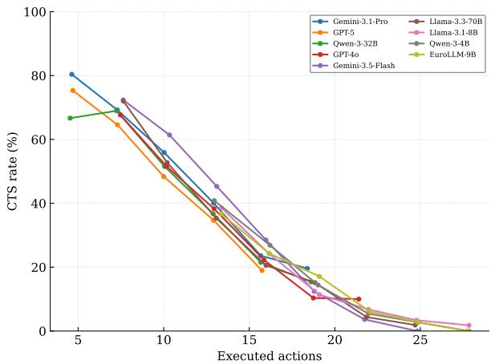  
Figure 9: CTS rate by trajectory length for the evaluated models.

Across models, CTS generally decreases as trajectories become longer. The decline is particularly pronounced once execution exceeds the typical length of successful trajectories. Stronger models retain a higher success rate in the shorter bins, whereas weaker models more frequently produce long trajectories without reaching a valid and preserved final state.

## I Judge Robustness

Two of the seven evaluation functions depend on an LLM judge, introducing a source of variance that the deterministic functions lack. We therefore rerun the judged evaluations with three-judge models and compare each against a human reference on 400 doubly annotated items.

<table><tr><td>Judge</td><td>Email Note</td><td>κ</td><td>Acc.</td></tr><tr><td>GPT-40</td><td>51.3 47.0</td><td>0.79</td><td>91.2</td></tr><tr><td>Gemini-3.5</td><td>52.8</td><td>48.6 0.76</td><td>89.8</td></tr><tr><td>Claude-Sonnet-4</td><td>50.4</td><td>46.2 0.81</td><td>92.4</td></tr><tr><td>Majority vote</td><td>51.5</td><td>47.3 0.84</td><td>93.6</td></tr><tr><td>Human reference</td><td>49.7</td><td>45.1</td><td></td></tr></table>

Table 9: Judge robustness on the two judged functions, averaged over models and languages. Email and Note report pass rate (%). κ is Cohen’s kappa against the human reference, and Acc. is raw agreement (%).

The three judges agree with one another on 94.1% of items, so the choice of judge shifts the reported pass rate by at most 2.4 points on either function. Agreement with the human reference is substantial throughout, with Cohen’s kappa between 0.76 and 0.81, and a majority vote raises it to 0.84. All three judges are slightly more permissive than the human annotators, as expected, given that the default criteria reward well-formedness and do not penalise minor factual drift. The ranking of the valuated agents is identical under all three judges and under the human reference, so the conclusions of §5 do not depend on the judge.

## J Recurring Error Patterns

We inspect 400 failed trajectories, stratified by model and language, and group them into six recurring patterns. Table 10 reports the share of failures attributable to each pattern split by language.

<table><tr><td>Pattern</td><td>All</td><td>EN</td><td>non-EN</td></tr><tr><td>Distractor capture</td><td>24.6</td><td>27.1</td><td>22.8</td></tr><tr><td>Redundant inspection</td><td>19.1</td><td>21.4</td><td>17.5</td></tr><tr><td>Shell over-reach</td><td>17.8</td><td>19.6</td><td>16.5</td></tr><tr><td>Locale mismatch</td><td>15.2</td><td>6.8</td><td>21.4</td></tr><tr><td>Premature termination</td><td>13.7</td><td>14.9</td><td>12.7</td></tr><tr><td>Schema violation</td><td>9.6</td><td>10.2</td><td>9.1</td></tr></table>

Table 10: Recurring error patterns over manually inspected failed trajectories. Shares are computed within each column and sum to 100%.

We define the following patterns. Distractor capture occurs when the agent edits a file whose name resembles the target, and a task asking for budget\_2024.xlsx leaves budget\_2023.xlsx modified as well. Redundant inspection occurs when the agent reads the same artefact repeatedly without acting, which eventually triggers the stagnation signal. Shell over-reach occurs when the agent issues a shell command where a dedicated app action exists, and a recursive copy or a wildcard removal touches several non-target files at once. Localisation mismatch occurs when the agent writes values in the conventions of the wrong setting, such as an American date order in an Italian task or a decimal point where a decimal comma is expected. Premature termination occurs when the agent emits finish\_task after satisfying only the first of several evaluation functions. Schema violation occurs when the agent emits prose, a code fence, or an action with a missing argument.

We can report two main observations. First, distractor capture and shell over-reach together account for 42.4% of failures, and both are preservation failures by construction, which explains the width of the gap between pass rate and CTS. Second, locale mismatch is the only pattern whose share varies substantially by language, rising from 6.8% in English settings to 21.4% in non-English settings and peaking at 26.9% in Chinese. This pattern is therefore the principal mechanism underlying the language gradient in §5, and it is a grounding failure, since the agents parse the instruction correctly and then emit values under the conventions of the wrong locale.

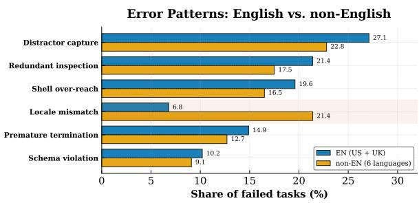  
Figure 10: Failures by error pattern in the English and non-English settings.

## K Benchmark Composition

Task complexity. We measure the complexity of a task as the number of substantive actions in its reference solution, excluding app switches and the final termination action. A two-step task typically involves reading one artefact and applying one edit, whereas a five-step task requires the agent to gather information from several files before producing the required output. Figure 11 reports the distribution. Tasks span two to five steps, with three-step tasks forming the largest group (32.5%) and five-step tasks the smallest (16.5%), for a mean reference length of 3.3 steps. The observed trajectories in §5 are longer than the reference solutions, with about 7/8 steps for the strongest model on solved tasks, which indicates that even successful agents spend most of their budget on exploration.

<table><tr><td>Missing figure file:</td></tr><tr><td>figures/task_complexity.pdf</td></tr></table>

Figure 11: Distribution of task complexity, measured as the number of actions in the reference solution.

Topics. Each task inherits a topic from the concerns of its Persona. Figure 12 groups the 1,600 tasks into six topic families. Finance and accounting tasks, which centre on spreadsheet manipulation, form the largest family, followed by scheduling and correspondence, which exercise the calendar and email tools. Reporting tasks combine reading across artefacts with document authoring; travel and expense tasks mix spreadsheets with correspondence; and records and administration tasks concern file organisation and retrieval. Every topic family appears in every language setting.

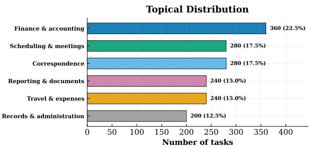  
Figure 12: Topic distribution.

Evaluation targets. Table 11 reports how often each evaluation function is attached to a task. Content containment is the most frequent target, since most tasks require specific information to appear in a specific artefact, and it is often combined with its negation to verify that distractor content was not propagated. Spreadsheet cell checks and file existence cover the structured and generative tasks respectively, and the two judge-based functions account for slightly over a tenth of all attachments, which bounds the influence of the judge on the headline scores.

<table><tr><td>Function</td><td>Share</td><td>Typical target</td></tr><tr><td>contain</td><td>41%</td><td>Required content in the target artefact</td></tr><tr><td>excel_cell_value</td><td>18%</td><td>Structured numeric edits</td></tr><tr><td>file_exist</td><td>14%</td><td>Creation of a required output file</td></tr><tr><td>not_contain</td><td>9%</td><td>Distractor content not propagated</td></tr><tr><td>calendar_no_overlap</td><td>7%</td><td>Consistent scheduling</td></tr><tr><td>evaluate_email</td><td>6%</td><td>Communicative adequacy of emails</td></tr><tr><td>evaluate_note</td><td>5%</td><td>Communicative adequacy of notes</td></tr></table>

Table 11: Share of evaluation functions.

Language balance. The benchmark is balanced at the aggregate level; each language–locale setting contains 200 tasks, with the same distribution of reference trajectory lengths. We additionally control the distributions of topic families, application types, and evaluation functions across settings.

Cross-Locale Comparability The task sets are independently constructed within each setting, without translations or item-level counterparts of tasks in the other settings. We instead balance their aggregate distributions with respect to the number of tasks, topic families, application types, evaluation functions, and reference trajectory lengths. This construction preserves native language use and locale-specific conventions. They may reflect a combination of multilingual instruction following, localised document conventions, cultural grounding, and residual task variation, and should not be interpreted as isolated causal effects of language.

## L Examples

We report three examples of WORLDBENCH, from the EN-UK, FR, and IT. Each instance shows the persona, the native-language instruction, the evaluation configuration, and the trajectory executed in the sandbox. We report some inference from Gemini-3.1-Pro as the backbone model.

Successful execution. Figure 13 reports an EN-UK instance evaluated by one deterministic function and one judge-based function. The agent inspects the delivery note, writes the required status into the target cell, and sets the note requested by the instruction, while the superseded copy of the ledger remains untouched. Both functions succeed, and the 17 pre-existing non-target artefacts remain identical, hence pass(t) ∧ preserve(t) holds and the task receives CTS. Figure 14 reports a French instance consisting of two applications and evaluated by a spreadsheet-cell check together with a containment check over the mailbox. The retained amount follows from the conventional mileage rate recorded in the testbed and is expressed with a decimal comma, which is the convention declared by the containment keyword; hence an agent that emits 42.56 fails the check even when the underlying arithmetic is correct.

Failed execution. Figure 15 reports an Italian instance in which the task-specific evaluator succeeds whilst preservation fails. The testbed contains a superseded copy of the deadline register, and the agent writes the required status into that copy before locating the current one. The deterministic check inspects the target file alone and returns pass(t) = true, whereas scadenze\_pratiche\_2025.xlsx differs from its initial state, which gives preserve(t) = false and CTS(t) = 0. This is the distractor-capture pattern of Appendix J, which accounts for 24.6% of the manually inspected failures and remains invisible to correctness-only scoring. The lower part of the same figure reports a locale-mismatch variant, where the instruction additionally requires a reminder letter carrying the outstanding balance, and the agent recovers the correct figure whilst emitting it under the conventions of the wrong locale, which causes the containment check to fail on a preserved workspace.

Setting EN-UK Applications shell, excel, word Testbed 18 artefacts, 16 distractors Outcome CTS = 1   
Persona. Rhodri manages stock control for a community pharmacy in Cardiff. He reconciles wholesaler delivery notes   
against the branch ledger, records short deliveries for the responsible pharmacist, and keeps the controlled-drug paperwork   
ready for inspection.   
Task. Reconcile the March wholesaler delivery note with the branch stock ledger, record the short-delivered line in the   
ledger, and leave a note for the responsible pharmacist naming the affected product.   
Evaluation configuration.   
[{"function": "evaluate\_excel\_cell\_value",   
"args": {"file": "./data/stock\_ledger\_cardiff.xlsx",   
"matches": [{"row": 4, "col": 3, "value": "Short delivery"}]}},   
{"function": "evaluate\_note",   
"args": {"file": "./data/short\_delivery\_note.docx", "doc\_type": "docx",   
"keywords": ["Amoxicillin 500mg", "short delivery"]}}]   
Executed trajectory.   
Step 0: {'app': 'system', 'action': 'switch\_app', 'target\_app': 'shell'}   
-> [Successfully switched to app: shell]   
Step 1: {'app': 'shell', 'action': 'command', 'command': 'ls data'}   
-> [cd\_destruction\_log.txt controlled\_drugs\_register.xlsx   
counter\_stock\_note.txt credit\_claims\_2025.xlsx   
delivery\_note\_february\_2026.txt delivery\_note\_march\_2026.txt   
stock\_ledger\_cardiff.xlsx stock\_ledger\_cardiff\_2025.xlsx   
stock\_take\_february\_2026.xlsx wholesaler\_terms\_cambrian.txt]   
Step 2: {'app': 'shell', 'action': 'command',   
'command': 'cat data/delivery\_note\_march\_2026.txt'}   
-> [Cambrian Medical Supplies - delivery note 12 March 2026   
Account: Pontcanna Community Pharmacy, Cardiff   
Paracetamol 500mg caps: ordered 100, delivered 100   
Amoxicillin 500mg caps: ordered 60, delivered 40   
Ibuprofen 200mg tabs: ordered 50, delivered 50]   
Step 3: {'app': 'system', 'action': 'switch\_app', 'target\_app': 'excel'}   
-> [Successfully switched to app: excel]   
Step 4: {'app': 'excel', 'action': 'read\_file',   
'file\_path': './data/stock\_ledger\_cardiff.xlsx'}   
-> [The following is the table from the excel file:   
(1, 1): Product (1, 2): Ordered (1, 3): Delivery status   
(2, 1): Paracetamol 500mg caps (2, 2): 100 (2, 3): Received in full   
(3, 1): Ibuprofen 200mg tabs (3, 2): 50 (3, 3): Received in full   
(4, 1): Amoxicillin 500mg caps (4, 2): 60 (4, 3): Awaiting check]   
Step 5: {'app': 'excel', 'action': 'set\_cell',   
'file\_path': './data/stock\_ledger\_cardiff.xlsx',   
'row\_idx': 4, 'column\_idx': 3, 'text': 'Short delivery'}   
-> [Successfully write text to ./data/stock\_ledger\_cardiff.xlsx]   
Step 6: {'app': 'system', 'action': 'switch\_app', 'target\_app': 'word'}   
-> [Successfully switched to app: word]   
Step 7: {'app': 'word', 'action': 'create\_new\_file',   
'file\_path': './data/short\_delivery\_note.docx'}   
-> [Successfully create new file ./data/short\_delivery\_note.docx]   
Step 8: {'app': 'word', 'action': 'write\_to\_file',   
'file\_path': './data/short\_delivery\_note.docx',   
'contents': 'Note for the responsible pharmacist. The Cambrian Medical   
Supplies delivery of 12 March 2026 is a short delivery. Amoxicillin   
500mg caps: 40 units received against 60 ordered. The ledger has been   
updated and a credit claim will be raised for the outstanding 20   
units. Rhodri'}   
-> [Successfully write contents to ./data/short\_delivery\_note.docx]   
Step 9: {'app': 'system', 'action': 'finish\_task', 'answer': 'None'}   
-> [Task finished]   
Outcome. evaluate\_excel\_cell\_value matches (4, 3): Short delivery and evaluate\_note passes both the   
keyword filter and the judge. No non-target artefact is modified, hence CTS(t) = 1.  
Figure 13: EN-UK instance solved under both conditions of CTS. The agent reads the evidence artefact once, edits the target cell, and creates the required note without touching the superseded copy of the ledger.

Setting FR Applications excel, email Testbed 19 artefacts, 16 distractors Outcome CTS = 1   
Persona. Amélie est coordinatrice administrative dans une association d’aide à domicile à Lyon. Elle contrôle les notes de   
frais des intervenants au regard des indemnités kilométriques conventionnelles, tient à jour le suivi des remboursements et   
transmet les dossiers validés à la trésorière pour la paie.   
Task. Vérifie la note de frais de Karim au regard des indemnités kilométriques conventionnelles, mets à jour le suivi des   
remboursements et préviens la trésorière par courriel du montant retenu. (Gloss: check the expense claim against the   
conventional mileage allowance, update the reimbursement tracker, and inform the treasurer of the retained amount by   
email.)   
Evaluation configuration.   
[{"function": "evaluate\_excel\_cell\_value",   
"args": {"file": "./data/suivi\_remboursements\_lyon.xlsx",   
"matches": [{"row": 3, "col": 4, "value": "Validé"}]}},   
{"function": "evaluate\_contain",   
"args": {"doc\_type": "email", "username": "amelie",   
"keywords": ["Karim Benali", "42,56"]}}]   
Executed trajectory.   
Step 0: {'app': 'system', 'action': 'switch\_app', 'target\_app': 'excel'}   
-> [Successfully switched to app: excel]   
Step 1: {'app': 'excel', 'action': 'read\_file',   
'file\_path': './data/note\_frais\_karim.xlsx'}   
-> [The following is the table from the excel file:   
(1, 1): Intervenant (1, 2): Mois (1, 3): Kilomètres (1, 4): Statut   
(2, 1): Karim Benali (2, 2): mars 2026 (2, 3): 112   
(2, 4): À traiter]   
Step 2: {'app': 'excel', 'action': 'read\_file',   
'file\_path': './data/indemnites\_kilometriques\_2026.xlsx'}   
-> [The following is the table from the excel file:   
(1, 1): Année (1, 2): Véhicule (1, 3): Tarif par km   
(1, 4): Plafond mensuel   
(2, 1): 2026 (2, 2): Automobile (2, 3): 0,38 (2, 4): 250,00   
(3, 1): 2026 (3, 2): Deux-roues (3, 3): 0,16 (3, 4): 250,00]   
Step 3: {'app': 'excel', 'action': 'set\_cell',   
'file\_path': './data/suivi\_remboursements\_lyon.xlsx',   
'row\_idx': 3, 'column\_idx': 4, 'text': 'Validé'}   
-> [Successfully write text to ./data/suivi\_remboursements\_lyon.xlsx]   
Step 4: {'app': 'system', 'action': 'switch\_app', 'target\_app': 'email'}   
-> [Successfully switched to app: email]   
Step 5: {'app': 'email', 'action': 'send\_email', 'sender': 'amelie',   
'recipient': 'claire',   
'subject': 'Note de frais mars 2026 - Karim Benali',   
'content': 'Bonjour Claire, la note de frais de Karim Benali pour mars   
2026 est validée. Le montant retenu est de 42,56 EUR, soit 112 km au   
tarif conventionnel de 0,38 EUR par km, sous le plafond mensuel de   
250,00 EUR. Le suivi est à jour, à intégrer à la paie de mars.   
Cordialement, Amélie'}   
-> [Successfully sent email to claire.]   
Step 6: {'app': 'system', 'action': 'finish\_task', 'answer': 'None'}   
-> [Task finished]   
Outcome. The tracker cell matches (3, 4): Validé and the mailbox of the persona contains both keywords, hence   
pass(t) = true. The mileage table, the expense claim and the remaining artefacts are unchanged, and the two .eml files   
written by the send action are new artefacts, hence CTS(t) = 1.  
Figure 14: FR instance solved under both conditions of CTS. The retained amount is derived from the conventional rate held in the testbed and written with a decimal comma, which is the convention declared by the containment keyword.

Setting IT Applications shell, excel Testbed 18 artefacts, 16 distractors Outcome CTS = 0 with pass(t) = true   
Persona. Giulia è responsabile di segreteria in uno studio tecnico di Bologna. Gestisce il registro delle pratiche edilizie,   
controlla i termini di ultimazione dei lavori comunicati dallo Sportello Unico e prepara i solleciti.   
Task. Controlla la pratica SCIA-2023-114 nel registro delle scadenze dell’anno in corso e segna la pratica come scaduta.   
(Gloss: check case SCIA-2023-114 in the current-year deadline register and mark the case as expired.)   
Evaluation configuration.   
[{"function": "evaluate\_excel\_cell\_value",   
"args": {"file": "./data/scadenze\_pratiche\_2026.xlsx",   
"matches": [{"row": 5, "col": 3, "value": "Scaduta"}]}}]   
Executed trajectory.   
Step 0: {'app': 'system', 'action': 'switch\_app', 'target\_app': 'shell'}   
-> [Successfully switched to app: shell]   
Step 1: {'app': 'shell', 'action': 'command', 'command': 'ls data'}   
-> [agenda\_sopralluoghi.txt computo\_metrico\_verdi.txt   
comunicazioni\_comune.txt corrispondenza\_bianchi.txt ..   
scadenze\_pratiche\_2025.xlsx scadenze\_pratiche\_2026.xlsx ...]   
Step 2: {'app': 'system', 'action': 'switch\_app', 'target\_app': 'excel'}   
-> [Successfully switched to app: excel]   
Step 3: {'app': 'excel', 'action': 'read\_file',   
'file\_path': './data/scadenze\_pratiche\_2025.xlsx'}   
-> [The following is the table from the excel file:   
(1, 1): Pratica (1, 2): Committente (1, 3): Stato ... (1, 5): Saldo   
.. (5, 1): SCIA-2023-114 (5, 2): Bianchi S.r.l. (5, 3): In corso   
(5, 4): 15/06/2026 (5, 5): 1.250,50]   
Step 4: {'app': 'excel', 'action': 'set\_cell',   
'file\_path': './data/scadenze\_pratiche\_2025.xlsx',   
'row\_idx': 5, 'column\_idx': 3, 'text': 'Scaduta'} <-- collateral edit   
-> [Successfully write text to ./data/scadenze\_pratiche\_2025.xlsx]   
Step 5: {'app': 'excel', 'action': 'read\_file',   
'file\_path': './data/scadenze\_pratiche\_2026.xlsx'}   
-> [The following is the table from the excel file:   
(1, 1): Pratica (1, 2): Committente (1, 3): Stato ... (1, 5): Saldo   
... (5, 1): SCIA-2023-114 (5, 2): Bianchi S.r.l. (5, 3): In corso   
(5, 4): 15/06/2026 (5, 5): 1.250,50]   
Step 6: {'app': 'excel', 'action': 'set\_cell',   
'file\_path': './data/scadenze\_pratiche\_2026.xlsx',   
'row\_idx': 5, 'column\_idx': 3, 'text': 'Scaduta'}   
-> [Successfully write text to ./data/scadenze\_pratiche\_2026.xlsx]   
Step 7: {'app': 'system', 'action': 'finish\_task', 'answer': 'None'}   
-> [Task finished]   
Outcome. The evaluator matches (5, 3): Scaduta in the target register, hence pass(t) = true, whereas one of the 17   
non-target artefacts differs from its initial state, which gives preserve(t) = false and CTS(t) = 0.   
Locale-mismatch variant. The instruction additionally requires the reminder letter, and the configuration is extended with   
evaluate\_contain on ./data/sollecito\_bianchi.docx for the keywords "SCIA-2023-114" and "1.250,50".   
Step 5: {'app': 'word', 'action': 'write\_to\_file',   
'file\_path': './data/sollecito\_bianchi.docx',   
'contents': 'Spett.le Bianchi S.r.l., il termine di ultimazione dei   
lavori della pratica SCIA-2023-114 e decorso il 15/06/2026. Risulta   
un saldo oneri di euro 1250.50 da versare entro trenta giorni.'}   
-> [Successfully write contents to ./data/sollecito\_bianchi.docx]   
The agent recovers the outstanding balance and writes it under conventions that the setting does not use, which fails the   
containment check on an otherwise preserved workspace and yields pass(t) = false with CTS(t) = 0.  
Figure 15: IT instance that satisfies the task-specific evaluator whilst violating the preservation constraint. The collateral edit at Step 4 is the distractor-capture pattern of Appendix J, and the variant below reproduces the locale-mismatch pattern underlying the language.