# What Does an Agentic Software Engineering Benchmark Measure? Profiling Task Demands and Agent Behaviour Beyond What Category Labels Reveal

Radin Shayanfar, Keheliya Gallaba, Ahmed E. Hassan

Queen's University

radin.shayanfar@queensu.ca, gallabak@sigsoft.ca, ahmed@cs.queensu.ca

## Abstract

Agentic software engineering benchmarks are typically summarized by nominal category labels such as "bug fix" or “feature implementation," yet benchmarks carrying the same label are built through very different curation pipelines. A label thus reveals little about the engineering work a benchmark demands. We introduce the Spread–Novelty-Centrality (SNC) profile, a three-axis characterization of the demands of repository-level coding tasks, grounded in empirical software engineering research. We apply the profile to five widely used benchmarks and 14,922 trajectories of two model families at three scales, and report three findings. (1) A label is an unreliable proxy for task demands, as every pair of benchmarks is statistically separated on at least two SNC axes, and the separations trace back to specific curation decisions. (2) Agent behaviour reveals demands that the human-written gold solution cannot. Agents produce larger solutions than the gold where problem statements withhold hints and smaller ones where curation inflates the gold. How a task is phrased shapes what an agent produces. (3) Task demands correlate with success uniformly, with resolved runs concentrating in the low-SNC region for every family and scale, whereas the behavioural signatures of success are family-specific. Claude succeeds by matching the scope of the gold solution, and its parity share on files rises from 0.17 at the smallest scale to 0.54 at the largest. Qwen succeeds by exceeding the gold scope at every scale, and editing too little marks failure for both families.

Code — https://github.com/radinshayanfar/task\_snc

## 1 Introduction

Large Language Models (LLMs) have rapidly expanded the scope of software engineering (SE) tasks they can attempt. A few years ago, the AI-solvable slice of SE was limited to function-level code completion from a docstring (Chen et al. 2021) or self-contained competitive-programming problems (Li et al. 2022), with no surrounding codebase. The frontier has since moved to agentic repository-scale tasks, in which an agent must localize, modify, and verify changes inside a real codebase (Guo et al. 2025). These tasks range from narrow, well-localized patches (Jimenez et al. 2024), through feature additions spanning multiple files (Chen, Li, and Li 2025), to full repository generation from a specification (Ding et al. 2025). This range reflects the growing autonomy of coding agents (Jiang, Lo, and Liu 2025).

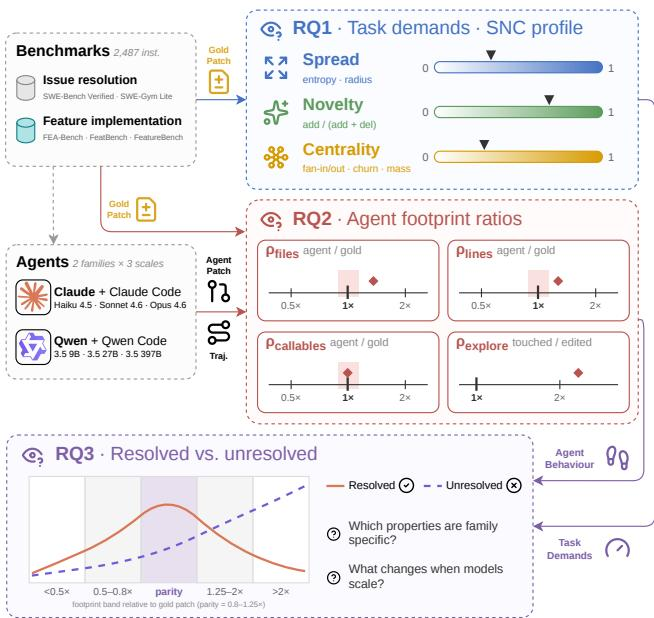  
Figure 1: Study overview. We introduce the SNC profile and compute the task demands of five agentic SE benchmarks from their gold patches (RQ1), analyze agents behavioural footprint ratios relative to the gold patch (RQ2), and contrast resolved and unresolved runs of six agent configurations, uncovering family-specific success behaviours and a scale effect (RQ3).

However, the vocabulary the field uses to compare benchmarks has not kept pace. Benchmark papers typically summarize their task collections with a nominal category label (e.g., bug fix or feature implementation (FI)), and the community reads a model's score on a benchmark as its proficiency in that category. Recent evidence (Shibaev et al. 2026) undermines this reading, showing that gains from tuning on one agentic SE benchmark transfer weakly even to seemingly similar tasks. We argue that benchmarks differ in ways their labels conceal. Nearly all follow the same construction pipeline, selecting Pull Requests (PRs) from GitHub, filtering for criteria such as quality or testability, and composing a natural-language problem statement. However, the decisions at each step vary widely. Because of these pipeline differences, compounded by the inherently fuzzy boundaries of the categories themselves, two benchmarks that share a label can demand different change scopes and engineering knowledge. What benchmark papers currently report as their differences (i.e., aggregate statistics such as problem-statement and gold solution length) characterizes a benchmark's surface and running cost, not which benchmark suits a given evaluation goal (Bean et al. 2025). The field needs a principled, SE-grounded lens on agentic SE benchmarks that is capable of answering three linked questions, which we address as three Research Questions (RQs). What kind of engineering work do a benchmark's tasks demand? How do agents behave when performing that work? And how do task demands and agent behaviours correlate with successful resolution?

RQ1: Do benchmarks with the same nominal label demand the same kind of engineering work? To measure task demands quantitatively, we introduce the Spread Novelty–Centrality (SNC) profile, three dimensions rooted in empirical SE research. Spread captures how widely a change is distributed across the codebase, Novelty the degree to which it introduces new code versus removing existing code, and Centrality the architectural significance of the touched code. Computed over a task's gold patch (solution), the SNC profile characterizes what kind of SE work a task requires, a gap that neither nominal labels nor aggregate statistics fill. We compute it for five prominent agentic SE benchmarks, comprising two widely used issue-resolution benchmarks and three FI ones, and find that they occupy distinct SNC regions even when their labels agree. Most strikingly, the three FI benchmarks separate clearly from one another, so despite sharing a stated goal they impose substantially different engineering demands.

RQ2: What does a state-of-the-art agent's behaviour reveal about the demands of each benchmark? A gold patch is only one reference solution. It is human-written, an agent may resolve the same task differently, and it is divorced from how the problem is worded. Indeed, a benchmark that all but spells out the solution demands less than one offering only a few clues. To surface demands that the gold patch alone cannot, we study the patches and trajectories of a stateof-the-art agent's resolved runs, measuring how verbose its patch is relative to the gold patch and how broadly it explores relative to what it edits. We find that verbosity tracks benchmark construction, over-shooting the gold scope where hints are absent and under-shooting it where gold patches are inflated, while exploration breadth is indistinguishable across benchmarks. Therefore, how a task is phrased, not just what change it requires, shapes what an agent produces.

RQ3: What separates resolved from unresolved runs across model families and scales? RQ1 and RQ2 are descriptive, and their value rests on whether the measured properties bear on outcomes. Otherwise, the SNC profile and the behavioural footprints would capture the shape of tasks and agent behaviour without measuring what resolution demands. We contrast resolved and unresolved runs of six agent configurations, two model families (Claude and Qwen) at three scales each, on both the SNC metrics and the footprint ratios. The task correlates of resolution are largely invariant, with resolved runs concentrating in the low-SNC bins for every family and size. On the other hand, the behavioural signatures are family-specific. Claude resolves at scope parity with the gold patch and alone tightens toward parity as scale grows, Qwen resolves by over-producing, and under-editing marks failure for both.

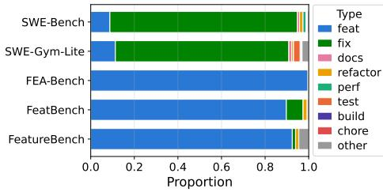  
Figure 2: Distribution of problem statements across the five benchmarks under the Conventional Commits taxonomy.

## 2 Background and Related Work

## 2.1 Benchmarks in Software Engineering

Many benchmarks now evaluate LLM-based coding agents (Jimenez et al. 2024; Guo et al. 2025; Jiang, Lo, and Liu 2025). Most share a common structure, in which the agent receives a natural-language problem statement and a real repository, and must produce a code change that passes unit tests. The tasks range from repairing a well-scoped defect to implementing a feature across multiple files and modules. We study five widely used benchmarks spanning issue resolution and FI, which we review below.

SWE-bench (Jimenez et al. 2024) draws tasks from real GitHub issues, pairing each issue with its merged PR and keeping only cases whose PR introduces unit tests that flip from failing to passing. SWE-bench Verified (Chowdhury et al. 2024) is a subset human-screened for well-specified issues and reliable tests.

SWE-Gym (Pan et al. 2025) shares SWE-bench's task formulation but serves as a training environment, sourcing repositories disjoint from SWE-bench's.

FEA-Bench (Li et al. 2025) defines a feature as a PR that adds new components (functions or classes) and supplies their signatures and docstrings as hints. The hints enable unit test evaluation.

FeatBench (Chen, Li, and Li 2025) admits only PRs modifying existing functions without adding or deleting any. An LLM rewrites each PR as a hint-free problem statement.

FeatureBench (Zhou et al. 2026) reverses the pipeline, carving out the source lines covered by selected tests as the task target, with at least 100 lines and 10 fail-to-pass tests each. Most tasks in the full subset provide hints, namely the interface signatures of the carved-out code left as stubs.

## 2.2 Nominal Task Categories Across Benchmarks

The field typically summarizes a benchmark with a single category label such as “bug fix" or “feature implementation." Several studies unify such labels through the Conventional Commits specification (Conventional Commits 2019; Li, Zhang, and Hassan 2025; Zeng et al. 2025; Li et al. 2024; Watanabe et al. 2026). For a uniform taxonomy across our five benchmarks, we apply the LLM classification of Li, Zhang, and Hassan (2025) to every problem statement.

Figure 2 shows the results of the problem statement classification, which broadly matches each benchmark's stated scope. SWE-bench and SWE-Gym are dominated by fix and the three FI benchmarks by feat. The distribution also exposes the limitation of label-based summaries. Although FeatBench and FeatureBench share a near-identical label profile, they construct their tasks in very different ways. The labels cannot surface this difference, which the SNC profile of Section 4 is designed to measure.

## 2.3 Benchmark Quality

Recent works have examined the quality and validity of LLM benchmarks more broadly (Bean et al. 2025; Reuel et al. 2024). Specific to SWE-bench, studies have raised concerns about data contamination (Liang, Garg, and Moghaddam 2025), the mismatch between formal issue descriptions and realistic developer queries (Garg, Steenhoek, and Huang 2025), and inflated success rates caused by weak test suites (Yu et al. 2026). Broader concerns include randomness in agentic evaluations (Bjarnason, Silva, and Monperrus 2026), hidden biases in competitive programming benchmarks (Zheng et al. 2026), and the reliability and quality of instructed code-editing benchmarks (Ebrahimi and Rajbahadur 2026). Our work complements these efforts by providing a quantitative, metrics-driven characterization of what agentic SE benchmarks demand from an agent.

## 3 Study Design

This section describes the benchmarks, agents, and models we study, and the evaluation harness used to execute all runs. Figure 1 illustrates an overview of our study.

Benchmarks We study the five benchmarks reviewed in Section 2.2 and summarized in Table 1, totalling 2,487 instances. For SWE-bench we use the Verified subset, and for SWE-Gym the Lite subset. Although SWE-Gym is intended as a training environment, we include it because the SNC profile characterizes tasks regardless of intended use, and it supplies a second issue-resolution benchmark.

Agents and Models We evaluate two model families at three scales each. The Claude family, run under Claude Code (Anthropic 2025), comprises Claude Haiku 4.5, Sonnet 4.6, and Opus 4.6 as its small (S), medium (M), and large (L) scale points; the Qwen family, run under Qwen Code, comprises Qwen 3.5 9B, 27B, and 397B-A17B (Qwen Team 2026). The scale points enable the cross-family contrasts of Section $^ { 6 , }$ and Claude Opus 4.6, our highest-performing configuration, serves as the reference agent of Section 5.

Evaluation Harness All runs use Harbor (Harbor Framework Team 2026), a unified evaluation harness. Since Harbor does not support FEA-Bench, we converted its tasks to the Harbor format and will release them for the community. The full study comprises 30 runs and 14,922 agent trajectories. We use default decoding parameters for all agents.

## 4 RQ1: Do Benchmarks with the Same Nominal Label Demand the Same Kind of Engineering Work?

## 4.1 Motivation

Section 2.2 showed that nominal task categories summarize benchmark contents only coarsely. Benchmarks that share a label are built through different curation pipelines, which diverge in repository selection, PR filtering, problem-statement formulation, and the information given to the agent. Tasks carrying the same label may thus impose different engineering demands. Measuring whether they do, and by how much, requires a characterization beyond nominal categories.

We propose the SNC profile with three axes grounded in empirical SE research: Spread, Novelty, and Centrality, which together describe what kind of engineering work a task requires. We compute the profile for all 2,487 instances of the five benchmarks and ask whether benchmarks sharing a label separate along the three axes, and whether the separation reflects their construction.

## 4.2 Notation

For an instance i, let patch $\mathcal { P } _ { i }$ denote a set of diff changes at base commit $c _ { i } ,$ with $\bar { \boldsymbol { f } }$ ranging over files in $\mathcal { P } _ { i }$ . We write $\mathbf { t } _ { i } =$ (Spread $( \mathcal { P } _ { i } ^ { * } )$ , Novelty $( \bar { \mathcal { P } } _ { i } ^ { * } )$ , Centrality $\left( \mathcal { P } _ { i } ^ { * } \right)$ ) for the task's SNC profile, where $\mathcal { P } _ { i } ^ { * }$ denotes the gold patch.

## 4.3 Spread

Spread captures how widely a unit of work is distributed across the codebase. Intuitively, tasks that affect distant parts of the directory tree, or require co-changing several files evenly with no single file dominating the edit, are harder to implement than tasks concentrated in a single place. We measure Spread through two indicators.

Normalized entropy Hassan (2009) defines changecomplexity entropy and shows that high-entropy files are more fault-prone. Intuitively, an edit dominated by one or a few files is easier to carry out than one spread evenly across many. We therefore adopt the same concept and argue that higher entropy means higher demand. Given a distribution $P ^ { \bullet } = ( p _ { 1 } , \ldots \cdot , p _ { n } )$ of activities over the n files,

$$
H _ { n } ( P ) = - { \frac { 1 } { \log _ { 2 } n } } \sum _ { k = 1 } ^ { n } p _ { k } \log _ { 2 } p _ { k } \ \in [ 0 , 1 ] ,
$$

with $H _ { n } = 0$ when $n = 1$ . When computed over a patch $\mathcal { P } _ { i } ,$

$$
p _ { k } = \frac { \Delta _ { k } } { \sum _ { f \in \mathcal { P } _ { i } } \Delta _ { f } } , \quad \Delta _ { f } = | \mathrm { a d d } ( f ) | + | \mathrm { d e l } ( f ) | ,
$$

where add(f) and $\operatorname { d e l } ( f )$ are the added and deleted lines in file $f ,$ and n is the number of files in $\mathcal { P } _ { i }$ . Unlike Hassan, we compute entropy over a single patch, with the log2 n normalization keeping values comparable across patch sizes.

Radius Inspired by Nashid et al. (2025), we measure how far apart the touched files are within the repository's directory tree. For a file $f$ with path $d _ { 1 } / d _ { 2 } / \dots / \dot { d } _ { k } / f$ relative to the repository root, let

$$
\operatorname { A n c } ( f ) = \{ d _ { 1 } , \ d _ { 1 } / d _ { 2 } , \ . \ . . , \ d _ { 1 } / \cdot \cdot \cdot / d _ { k } \}
$$

be its set of ancestor directory paths. The radius is then

$$
R ( \mathcal { P } _ { i } ) = \frac { \left| \bigcup _ { f \in \mathcal { P } _ { i } } \operatorname { A n c } ( f ) \right| } { \left| D _ { \mathrm { r e p o } } \right| } \ \in [ 0 , 1 ] ,
$$

where the normalization term $D _ { \mathrm { r e p o } }$ is the set of all directory nodes in the repository tree, allowing for comparison across different repositories.

Where entropy is blind to file locations, radius is blind to change volume, as two patches touching files in the same directories receive the same radius regardless of how many lines each contributes. The two indicators complement each other, one capturing volume concentration and the other structural distance.

## 4.4 Novelty

Novelty captures the degree to which a change introduces new code versus removing existing code. The two demand different kinds of engineering work. Writing new code requires designing structure that fits the surrounding system, whereas removing or replacing code requires understanding what is already there and what depends on it. This balance is not captured by change volume alone. We compute Novelty from the unified diff of a patch $\mathcal { P }$ against the base commit:

$$
\operatorname { N o v e l t y } ( { \mathcal { P } } ) = { \frac { \left| \operatorname { a d d } ( { \mathcal { P } } ) \right| } { \left| \operatorname { a d d } ( { \mathcal { P } } ) \right| + \left| \operatorname* { d e l } ( { \mathcal { P } } ) \right| } } \ \in [ 0 , 1 ] .
$$

Purely additive changes score at the top of the range, pure removals at the bottom, and in-place rewrites near the middle.

## 4.5 Centrality

Centrality captures the architectural significance of the code a task changes: how central it sits in the dependency structure, how actively it has been evolving, and how complex it is. We measure Centrality through four indicators.

Fan-in and fan-out A module's position in the import graph reflects its architectural role. Fan-in counts the modules that depend on a given module, and a high value marks a widely-relied-upon core abstraction. Fan-out counts the modules it depends on, and a high value indicates a coordination point whose modification demands broader familiarity with the codebase.

For a patch ${ \mathcal P } ,$ let $\mathcal { M } ( \mathcal { P } )$ be the set of repository modules containing callables modified by ${ \mathcal { P } } _ { : }$ let $\mathcal { M } _ { \mathrm { r e p o } } ^ { \mathrm { ~ \tiny ~ \star ~ } }$ be the set of all modules in the repository, and let in( $M )$ and out(M) count the modules that import M and that M imports, respectively. Then

$$
\operatorname { F a n I n } ( { \mathcal { P } } ) = { \frac { \sum _ { M \in { \mathcal { M } } ( { \mathcal { P } } ) } \operatorname { i n } ( M ) } { \sum _ { M ^ { \prime } \in { \mathcal { M } } _ { \mathrm { r e p o } } } \operatorname { i n } ( M ^ { \prime } ) } } ,
$$

and FanOut(P) is defined analogously with out replacing in.

Churn Files modified frequently in the recent past tend to sit on a project's hot path, in actively evolving subsystems where requirements are still being worked out (Munson and Elbaum 1998). Changes to high-churn code engage a moving target rather than settled structure. Let S be the set of files modified by $\mathcal { P } _ { i }$ . We estimate churn as the probability that a randomly picked recent commit touched at least one file in S. Let $c _ { i }$ be the base commit and $t ( c )$ the committer date of a commit c. Let

$$
\mathcal { C } _ { w } ( c _ { i } ) = \{ c : c \in \operatorname { a n c e s t o r s } ( c _ { i } ) , t ( c _ { i } ) - t ( c ) \le 1 8 0 \operatorname { d a y s } \}
$$

be the commits in the 180-day history window before $c _ { i } .$ This is a conventional window length in the literature (Shrikanth, Majumder, and Menzies 2021; Zimmermann, Premraj, and Zeller 2007). Letting files(c) denote the set of files touched by commit c,

$$
\mathrm { C h u r n } ( \mathcal { P } ) = \frac { \left| \left\{ c \in \mathcal { C } _ { w } ( c _ { i } ) : \mathrm { f l e s } ( c ) \cap S \neq \emptyset \right\} \right| } { \left| \mathcal { C } _ { w } ( c _ { i } ) \right| } \ \in [ 0 , 1 ] .
$$

Mass A long, highly-branched function carries more architectural weight than a long-but-simple or short-but-branched one. Mass (Orlanski et al. 2026) captures this, combining a callable $f ^ { \mathrm { { ' } } } \mathrm { { s } }$ size in source lines with its McCabe's cyclomatic complexity (McCabe 1976). We aggregate mass $( { \dot { f } } )$ to the patch level as

$$
\operatorname { M a s s } ( \mathcal { P } ) = \frac { \sum _ { f \in \mathcal { F } ( \mathcal { P } ) } \operatorname* { m a s s } ( f ) } { \sum _ { f ^ { \prime } \in \mathcal { F } _ { \mathrm { r e p o } } } \operatorname* { m a s s } ( f ^ { \prime } ) } ,
$$

where $\mathcal { F } ( \mathcal { P } )$ is the set of callables modified by $\mathcal { P }$ and $\mathcal { F } _ { \mathrm { r e p o } }$ is the set of all callables in the repository.

## 4.6 Results

For every benchmark instance we compute the continuous SNC indicators over the gold patch. Figure 6 reports perbenchmark radar plots over all seven indicators.

For statistical comparison, we reduce each axis to a single scalar on a common scale. Novelty is already a scalar in $[ 0 , 1 ]$ and enters directly. For Centrality we apply $\log _ { 1 0 }$ to each of its four heavy-tailed indicators and take their unweighted mean. For Spread we use radius alone, since entropy is forced to 0 on single-file patches, which dominate SWE-bench and SWE-Gym Lite, and aggregating it with the other indicators would distort the aggregate. As radius is small and right-skewed, we log-transform the Spread axis. The per-axis scalars live on incomparable ranges, and we therefore z-score each axis across the pooled instances and min-max map the result to [0, 1]. To test whether two benchmarks are distinguishable on an axis, we apply the Scott-Knott Effect Size Difference (ESD) test (Scott and Knott 1974; Tantithamthavorn et al. 2017), which partitions the benchmarks into clusters whose mean ranks differ at $\alpha = 0 . 0 5$ with effect size $| d | \geq 0 . 2 .$ Benchmarks sharing a cluster are indistinguishable on that axis. We run the test on each of the three axes and report the cluster orderings in Figure 3.

Every axis separates benchmarks that share a nominal label On each SNC axis, Scott-Knott ESD partitions the five benchmarks into four distinct clusters (Figure $^ { 3 ) , }$ and the groupings differ across axes, leaving every pair of benchmarks separated on at least two of the three. The two fixdominated benchmarks (SWE-bench and SWE-Gym Lite)

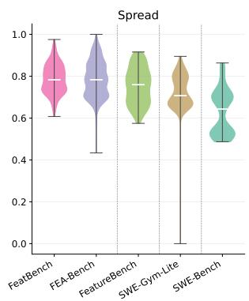

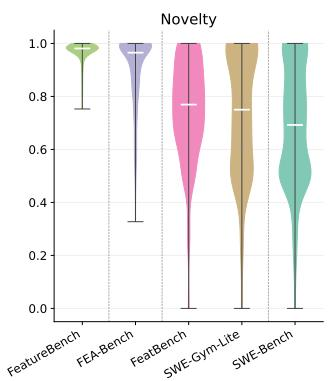

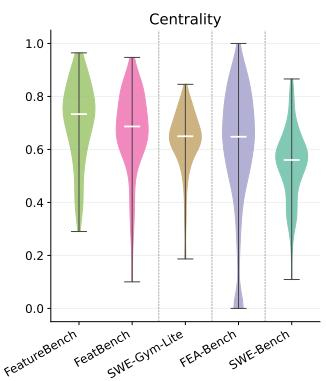  
Figure 3: Scott-Knott ESD cluster orderings on the three aggregated SNC axes. Dashed vertical separators mark cluster boundaries, and benchmarks within an uninterrupted stretch are statistically indistinguishable on that axis.

fall in different clusters on every axis, and the three featdominated benchmarks never all share a cluster. The orderings follow a broad trend, with the FI benchmarks occupying the higher regions of each axis. Therefore, benchmarks sharing a nominal label differ in their SNC profles and demand measurably different engineering work.

Construction decisions leave visible fingerprints The SNC space surfaces the downstream consequences of curation choices that categorical labels conflate. We highlight three fingerprints across the FI benchmarks.

FeatBench's testability filter compresses Novelty. To pin a fixed target surface for unit test evaluation, FeatBench admits only PRs that modify existing functions without adding or deleting any, pushing its gold patches toward in-place rewrites. Scott-Knott ESD places FeatBench in the same Novelty cluster as SWE-Gym Lite, a bug fix benchmark, and well below the other two FI benchmarks.

FeatureBench's test-irst carve-out saturates Novelty. FeatureBench's Novelty concentrates near 1.0 with a tight interquartile range, well above the other two FI benchmarks. Since the feature-related lines are carved out (Section 2.2), the gold patch only adds them back, saturating Novelty. This displaces the tasks from natural feature work, which typically interleaves additions with edits and removals.

FEA-Bench has the lowest Centrality among FI benchmarks. FEA-Bench selects PRs that add new components. New components have no incoming imports (FanIn ≈ 0), no prior history (low churn), and little accreted complexity (modest Mass), biasing FEA-Bench toward the low-Centrality region, below both FeatBench and FeatureBench.

## 5 RQ2: What Does a State-of-the-Art Agent's Behaviour Reveal About the Demands of Each Benchmark?

## 5.1 Motivation

RQ1 characterizes each task by the SNC profile of its gold patch. A gold patch is informative but partial in two ways. First, it is a single human-written reference. An agent that resolves the same task may take a different route, touching different files, writing more or fewer lines, or restructuring the change entirely. None of this is visible from the gold patch alone. Second, the gold patch is divorced from the problem statement. Two tasks can share an identical gold patch yet make different demands depending on how much the wording reveals. A task that all but states the solution asks less of an agent than one offering only a few clues, and the SNC profile of the gold patch is blind to this distinction.

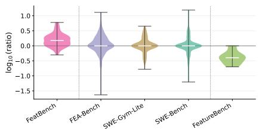

(a) Patch verbosity: callables touched in agent patch to gold patch  
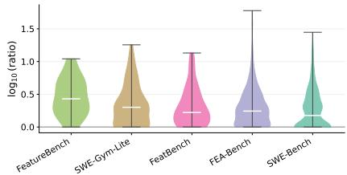  
(b) Exploration breadth: files touched to files in the patch  
Figure 4: Agent behaviour footprints on the tasks Claude Opus 4.6 resolves. Full version in Figure 7 in Appendix.

To surface demands the gold patch alone cannot, we add a behaviour-grounded lens. We take the highest-performing agent in our study, Claude Opus 4.6 paired with Claude Code restrict attention to the tasks it resolves, and study its induced patches and trajectories. Comparing only resolved runs reads each pair as two correct solutions to the same task, isolating the shape of a solution from whether it was solved at all. We ask how the agent's successful solutions compare to the gold patch in scope and in the exploration behind them, and whether those footprints vary across benchmarks.

## 5.2 Approach

We analyze the 1,083 instances Claude Opus 4.6 resolves across the five benchmarks. Following the notation of Section $^ { 4 , }$ for a resolved instance i let $\mathcal { P } _ { i } ^ { * }$ denote the gold patch, $\mathcal { P } _ { i } ^ { A }$ the patch induced by the agent's run, and $\mathcal { T } _ { i } ^ { A }$ the agent's trajectory. We adopt two behavioural lenses.

Patch verbosity Let $m ( \mathcal { P } )$ be a patch size metric, where $m \in \{$ files, lines, callables }. files $( \mathcal { P } )$ is the number of distinct files modified by $\mathcal { P } _ { \cdot }$ lines $( \mathcal { P } ) \stackrel { \cdot } { = } \left| \operatorname { a d d } ( \mathcal { P } ) \right| + \left| \operatorname { d e l } ( \mathcal { P } ) \right|$ is the number of lines added plus deleted, and callables $\left( { \mathcal { P } } \right) { \overset { \cdot } { = } }$ $| \mathcal F ( \mathcal P ) |$ is the number of distinct callables modified, with $\mathcal F ( \cdot )$ as in Section 4.5. For each metric we form

$$
\rho _ { m } ( i ) = \log _ { 1 0 } \frac { m ( \mathcal { P } _ { i } ^ { A } ) } { m ( \mathcal { P } _ { i } ^ { * } ) } .
$$

A positive $\rho _ { m } ( i )$ means the agent's solution is more verbose than the gold patch along $m ,$ a negative one more compact, and $\rho _ { m } ( i ) \approx 0$ marks parity.

Exploration breadth Let files $( \mathcal { T } _ { i } ^ { A } )$ be the number of distinct files the agent touches over its trajectory, where a touch is any read or edit event. We form

$$
\rho _ { \mathrm { e x p l o r e } } ( i ) = \log _ { 1 0 } \frac { \mathrm { f l e s } ( \mathcal { T } _ { i } ^ { A } ) } { \mathrm { f l e s } ( \mathcal { P } _ { i } ^ { A } ) } .
$$

This ratio measures how much wider the agent's exploration is than the edit it eventually commits. Since every modified file is touched, files $( \mathcal { P } _ { i } ^ { A } ) \overset { \cdot } { \leq } \operatorname { f i l e s } ( \mathcal { T } _ { i } ^ { A } )$ holds for all i.

We call the four ratios $\begin{array} { r c l } { \pmb { \rho } _ { i } } & { = } & { \big ( \rho _ { \mathrm { f i l e s } } ( i ) , \quad \rho _ { \mathrm { l i n e s } } ( i ) } \end{array}$ $\rho _ { \mathrm { c a l l a b l e s } } ( i ) , \ \rho _ { \mathrm { e x p l o r e } } ( i ) )$ the agent behaviour footprint of instance i.

## 5.3 Results

For the ratios $\rho _ { i }$ we apply the same Scott-Knott ESD test as in Section 4. Figure 4 reports ρcallables and $\rho _ { \mathrm { e x p l o r e } } ,$ and Figure 7 in the Appendix the full footprint orderings.

Agents over-produce on FeatBench and under-produce on FeatureBench, while matching gold elsewhere On all three verbosity metrics, patches on FeatBench are the most verbose relative to gold, patches on FeatureBench the most compact, and the medians of the other three benchmarks sit near parity $( \rho _ { m } \approx 0 )$ . FeatBench provides no hints or pinned target surface, and the agent produces larger patches than the gold patch across files, lines, and callables. FeatureBench's compact patches suggest that its curation removes more code than the task demands, inflating the gold patch. Consistent with this, 33.8% of its gold-patch lines are comments or docstrings, which the agent can omit while still resolving the task.

The near-parity of the remaining benchmarks is equally legible. FEA-Bench's signature hints pin the agent's solution surface to the gold patch almost by construction. SWE-bench and SWE-Gym Lite pose the structurally simplest tasks in our set (Section 4), and the agent reproduces compact fixes without detours. The contrast between hint-rich FEA-Bench at parity and hint-free FeatBench above it suggests that the wording of the problem statement, not only the required change, shapes what the agent produces.

Agent exploration breadth is uniform across benchmarks Scott-Knott ESD places all five benchmarks in a single cluster on $\rho _ { \mathrm { e x p l o r e } }$ (Figure 4b). Broad reading followed by narrow editing thus appears to be a property of the agent rather than a response to the task. Within the cluster, the median ordering is suggestive but not statistically significant. FEA-Bench's hints localize the agent, reducing exploration. SWEbench stays low despite the small denominators of its small patches, reinforcing the contamination concern (Liang, Garg, and Moghaddam 2025). FeatureBench tops the ordering because its blanked stubs force the agent to survey far more code than it edits.

## 6 RQ3: What Separates Resolved from Unresolved Runs Across Model Families and Scales?

## 6.1 Motivation

RQ1 characterizes tasks by the SNC profile of their gold patches, and RQ2 characterizes the successful behavioural footprint of a single top-performing agent. The extent to which these characteristics account for agent outcomes, however, remains unexamined. Both lenses are descriptive so far, and their value rests on this link. If resolved and unresolved runs were indistinguishable on the SNC axes, the demand differences of RQ1 would have no bearing on what agents actually find difficult. The same holds on the behavioural side. If the footprints of resolved and unresolved runs coincided, the signatures of RQ2 would describe agent style without isolating the behaviours that success requires, offering model and harness builders no useful signal about what their agents lack. Therefore, we ask which task demands and behavioural properties separate resolved from unresolved runs, and whether these correlates hold across model families and scales.

## 6.2 Approach

We use all six agent configurations of our study (Section 3) across the five benchmarks, computing the SNC metrics and agent behavioural ratios $\rho$ for every (instance, agent) pair. Unlike RQ2, which was restricted to the resolved instances of a single agent, we include every attempted instance.

We contrast resolved and unresolved runs, stratified by family and scale, on both feature blocks. Each SNC metric is discretized into up to six quantile bins, merging adjacent cut points with identical values, so concentrated distributions yield fewer bins. Each behavioural ratio is discretized into five multiplicative bands around parity with the gold patch $( < 0 . 5 \times , \bar { 0 . 5 } - 0 . 8 \times , 0 . 8 - 1 . 2 5 \times , \bar { 1 . 2 5 - 2 } \times , > 2 \times )$ . We then compare the bin distributions conditioned on outcome.

## 6.3 Results

Figures 5a and 5b contrast resolved and unresolved runs on SNC metrics and the behavioural footprint ratios, respectively, with the full versions in Figures 8 and 9 in the $\mathsf { A p - }$ pendix. Each panel reports, for one metric (columns) and one scale (rows), the share of runs falling in each bin conditioned on outcome. Table 2 shows these differences are statistically

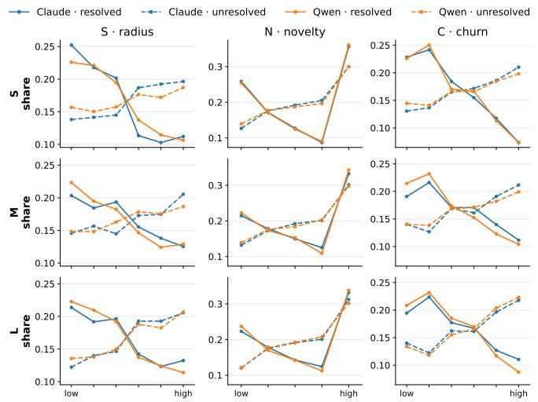  
(a) Gold-patch SNC distributions, over quantile bins of each SNC indicator.

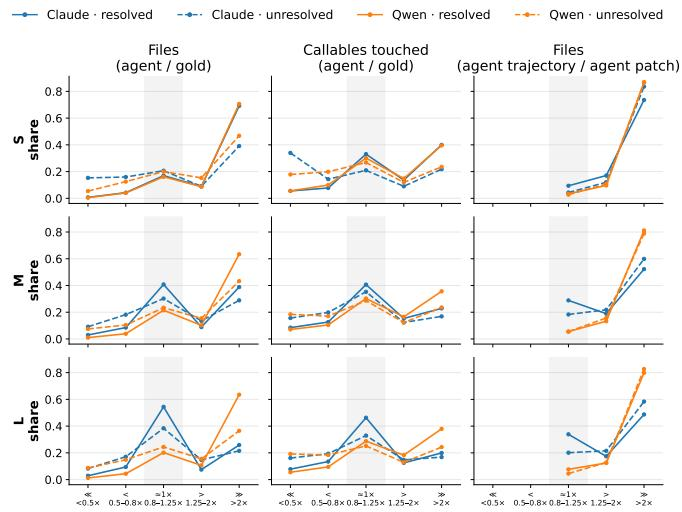  
(b) Behavioural footprints, over five multiplicative bands relative to the gold patch. The shaded region is the parity band (0.8×-1.25×).

Figure 5: Resolved versus unresolved runs across models, conditioned on outcome. Full version in Figures 8 in the Appendix

significant across all models and dimensions, except ρexplore of Qwen S and M.

Resolved runs concentrate in the low SNC bins for every family and scale In Figure 5a, resolved mass concentrates in the low bins while unresolved mass shifts toward the high bins of nearly every indicator. Novelty is the exception, with resolved runs at both extremes. Changes at either extreme engage little of the existing implementation, whereas midrange Novelty marks in-place rewrites that must integrate new code into existing behaviour. It is in this mid-range where unresolved runs hold a larger share than resolved runs. Claude and Qwen show the same trend from S to L within each outcome, suggesting that the same gold patch properties are associated with resolution for both families at every scale.

Success signatures split by family: Claude resolves at parity, Qwen by over-producing The footprint band that marks success differs by family. Claude's resolved runs peak in the parity band, most cleanly on callables, where their share exceeds the unresolved share at every scale. Qwen's resolved runs instead place most of their mass in the > 2× band (0.6 to 0.7 on files), with a much lower parity share (≈ 0.2 on files) across scales. The lone exception is smallscale Claude, whose resolved runs also crowd the > 2× band on files and lines. Since the two families run under different harnesses (Claude Code and Qwen Code), this contrast may reflect the harness as much as the model. However, underediting marks failure for both families, as unresolved runs sit deeper in the sub-parity bands in nearly every panel.

Claude behaviour tightens with scale; Qwen does not As Figure 5b illustrates, Claude's parity with the gold patch rises with model size. The parity share among resolved runs climbs on all three patch verbosity metrics, on files from 0.17 at S to 0.41 at M and 0.54 at L. Exploration becomes more focused in step, with larger Claude models reading fewer files that they never edit. On $\rho _ { \mathrm { e x p l o r e } } ,$ , the resolved parity share moves from 0.09 at S to 0.34 at L, above its unresolved runs. Qwen shows no such shift, with resolved runs pinned above 2× on both verbosity and exploration at every scale (≈ 0.8 on exploration throughout). Scale makes Claude more targeted but leaves Qwen's strategy fixed. We leave investigating this difference to future work.

## 7 Implications

Our findings carry implications for four groups.

Model trainers Profiling a training corpus along the SNC axes shows which task demands it covers, beyond umbrella terms such as bug fix or feature implementation. Shibaev et al. (2026) show that gains from tuning on one agentic SE benchmark transfer weakly even to seemingly adjacent tasks. RQ1 offers a task-level explanation, since benchmarks under the same label occupy different SNC regions, therefore, a score on a benchmark confined to a narrow region is evidence about that region alone. The same reasoning applies to synthetic data. Generators such as SWE-smith (Yang et al. 2025) produce task instances by the tens of thousands, and computing the profile at generation time would let trainers steer synthesis away from the low-SNC mass where resolution is already reliable (RQ3). We therefore recommend that trainers (1) report evaluation results stratified by SNC region rather than as a single benchmark score, and (2) profile a candidate benchmark or generator against the corpora already in the training mix, prioritizing whichever covers an unrepresented region.

Tool and harness builders The family-specific signatures make scope policy a per-model setting (RQ3). Claude resolves at gold-patch parity while Qwen resolves by exceeding it, therefore a fixed minimal-diff default would fit one family at the cost of the other. The appropriate setting also shifts with model size. Small Claude models over-produce much as Qwen does and tighten toward parity only at medium and large scales, making localization aids pay off most at the small end. Under-editing, in contrast, marks failure for every family and scale, and the sub-parity band holds a larger share of unresolved than resolved runs in nearly every configuration we studied. Builders can act on both observations by (1) exposing scope guidance, such as minimal-diff instructions, as a configurable per-model setting rather than a fixed prompt, and (2) adding a runtime check that flags a patch far below the expected scope and routes it to a second pass or to a stronger model.

K.; Batra, H.; Deb, O.; Beharry, E.; Emde, C.; Foster, T.;

Benchmark authors Computing the SNC profile during construction reveals when a curation choice narrows the task distribution (RQ1). FeatBench's modify-only constraint compresses Novelty and FeatureBench's test-first carve-out saturates it, yet neither difference is visible from the labels. A uniform profile would also let the community compare demands rather than labels, complementing datasheets for datasets (Gebru et al. 2021) and recent calls for construct validity in LLM benchmarks (Bean et al. 2025; Reuel et al. 2024). The profile further identifies regions of the task space that no current benchmark emphasizes. High-Spread work on high-Centrality code is the clearest example, and since unresolved runs concentrate in the high bins of both axes, it is also where new benchmarks would add the most evidence. We suggest two additions to benchmark release practice, namely (1) publishing the per-instance SNC profile with the dataset so that users can subset or stratify by demand, and (2) stating which SNC regions the curation pipeline excludes, in the same way datasheets document a dataset's collection process and recommended uses.

Software engineers Our profile is computed over a completed change, but an engineer can estimate before delegating where a planned change will land, in how spread out it is and how central the affected code is. The family signatures matter for review effort as well, a growing concern as agent-authored pull requests reach real projects (Watanabe et al. 2026; Li, Zhang, and Hassan 2025). Qwen's overproduced patches take more effort to review than Claude's gold-scope ones even when both resolve the task, and the smaller Claude models over-produce where the larger ones sit at parity. Concretely, an engineer can (1) delegate singlefile, low-Centrality changes to smaller agents, since agents of every family and scale resolve low-SNC tasks reliably, and reserve high-Centrality changes for stronger models and closer oversight (RQ3), and (2) weigh the lower cost and faster turnaround of a smaller agent against the review effort its patches will demand.

## 8 Conclusion

We introduced the SNC profile, which characterizes repository-level coding tasks along Spread, Novelty, and Centrality, and applied it to five benchmarks and the runs of six agent configurations on them. Benchmarks that share a nominal label demand measurably different work, with the separations tracing back to curation decisions (RQ1). Agent behaviour exposes demands that the gold patch cannot, as patch verbosity tracks how much each benchmark's problem statements reveal (RQ2). The task correlates of success hold across families and scales, whereas the behavioural signatures are family-specific. Claude resolves at gold-patch parity and tightens with scale, Qwen over-produces at every scale, and under-editing marks failure for both families (RQ3).

Limitations All five benchmarks are Python-only, and several SNC indicators depend on language-aware analysis. Therefore, extending the profile to other languages requires per-language tooling. The benchmarks also cover only issue resolution and FI. Other task types, such as the multi-file refactorings of RefactorBench (Gautam et al. 2025), plausibly occupy distinct SNC regions. Since the profile applies to any task with a reference patch, broadening the task mix is the extension that we consider most valuable.

## References

Anthropic. 2025. Claude Code by Anthropic | AI Coding Agent, Terminal, IDE. https://claude.com/product/claudecode.

Bean, A. M.; Kearns, R. O.; Romanou, A.; Hafner, F. S.; Mayne, H.; Batzner, J.; Foroutan, N.; Schmitz, C.; Korgul,

Magomere, J.; Rystrøm, J.; Sotnikova, A.; Yang, Y.; Zhao, Y.; Bibi, A.; Bosselut, A.; Clark, R.; Cohan, A.; Foerster,

J. N.; Gal, Y.; Hale, S. A.; Raji, I. D.; Summerfield, C.; Torr, P.; Ududec, C.; Rocher, L.; and Mahdi, A. 2025. Measuring what Matters: Construct Validity in Large Language Model Benchmarks. In The Thirty-ninth Annual Conference on Neural Information Processing Systems Datasets and Benchmarks Track.

Benjamini, Y.; and Hochberg, Y. 1995. Controlling the False Discovery Rate: A Practical and Powerful Approach to Multiple Testing. Journal of the Royal Statistical Society: Series B (Methodological), 57(1): 289–300.

Bjarnason, B. H.; Silva, A.; and Monperrus, M. 2026. On Randomness in Agentic Evals. arXiv preprint arXiv:2602.07150.

Chen, H.; Li, C.; and Li, J. 2025. FeatBench: Evaluating Coding Agents on Feature Implementation for Vibe Coding. arXiv preprint arXiv:2509.22237.

Chen, M.; Tworek, J.; Jun, H.; Yuan, Q.; Pinto, H. P. D. O.; Kaplan, J.; Edwards, H.; Burda, Y.; Joseph, N.; Brockman, G.; et al. 2021. Evaluating large language models trained on code. arXiv preprint arXiv:2107.03374.

Chowdhury, N.; Aung, J.; Shern, C. J.; Jaffe, O.; Sherburn, D.; Starace, G.; Mays, E.; Dias, R.; Aljubeh, M.; Glaese,

M.; Jimenez, C. E.; Yang, J.; Ho, L.; Patwardhan, T.; Liu, K.; and Madry, A. 2024. Introducing SWE-bench Verified. Accessed: July 2026.

Conventional Commits. 2019. Conventional Commits. https: //www.conventionalcommits.org. Accessed: April 2026.

Cramér, H. 1946. Mathematical Methods of Statistics. Princeton University Press.

Ding, J.; Long, S.; Pu, C.; Zhou, H.; Gao, H.; Gao, X.; He, C.; Hou, Y.; Hu, F.; Li, Z.; et al. 2025. NL2Repo-Bench: Towards Long-Horizon Repository Generation Evaluation of Coding Agents. arXiv preprint arXiv:2512.12730.

Ebrahimi, A. M.; and Rajbahadur, G. K. 2026. Edit, But Verify: An Empirical Audit of Instructed Code-Editing Benchmarks. arXiv preprint arXiv:2604.05100.

Garg, S.; Steenhoek, B.; and Huang, Y. 2025. Saving SWE-Bench: A Benchmark Mutation Approach for Realistic Agent Evaluation. arXiv preprint arXiv:2510.08996.

Gautam, D.; Garg, S.; Jang, J.; Sundaresan, N.; and Zilouchian, R. 2025. Refactorbench: Evaluating stateful reasoning in language agents through code. In International Conference on Learning Representations, volume 2025, 43131–43162.

Gebru, T.; Morgenstern, J.; Vecchione, B.; Vaughan, J. W.; Wallach, H.; Daumé III, H.; and Crawford, K. 2021. Datasheets for Datasets. Communications of the ACM, 64(12): 86–92.

Guo, J.; Huang, S.; Li, M.; Huang, D.; Chen, X.; Zhang, R.; Guo, Z.; Yu, H.; Yiu, S.-M.; Lio, P.; et al. 2025. A Comprehensive Survey on Benchmarks and Solutions in Software Engineering of LLM-Empowered Agentic System. arXiv preprint arXiv:2510.09721.

Harbor Framework Team. 2026. Harbor: A framework for evaluating and optimizing agents and models in container environments. Version v0.16.1. https://doi.org/10. 5281/zenodo.20953922.

Hassan, A. E. 2009. Predicting faults using the complexity of code changes. In Proceedings of the 31st International Conference on Software Engineering, 78–88.

Jiang, Z.; Lo, D.; and Liu, Z. 2025. Agentic Software Issue Resolution with Large Language Models: A Survey. arXiv preprint arXiv:2512.22256.

Jimenez, C. E.; Yang, J.; Wettig, A.; Yao, S.; Pei, K.; Press, O.; and Narasimhan, K. R. 2024. SWE-bench: Can Language Models Resolve Real-world Github Issues? In The Twelfth International Conference on Learning Representations.

Li, C.; Xu, Z.; Di, P.; Wang, D.; Li, Z.; and Zheng, Q. 2024. Understanding Code Changes Practically with Small-Scale Language Models. In Proceedings of the 39th IEEE/ACM International Conference on Automated Software Engineering, ASE '24, 216–228. New York, NY, USA: Association for Computing Machinery. ISBN 9798400712487.

Li, H.; Zhang, H.; and Hassan, A. E. 2025. The rise of ai teammates in software engineering (se) 3.0: How autonomous coding agents are reshaping software engineering. arXiv preprint arXiv:2507.15003.

Li, W.; Zhang, X.; Guo, Z.; Mao, S.; Luo, W.; Peng, G.; Huang, Y.; Wang, H.; and Li, S. 2025. FEA-bench: A benchmark for evaluating repository-level code generation for feature implementation. In Proceedings of the 63rd Annual Meeting of the Association for Computational Linguistics (Volume 1: Long Papers), 17160–17176.

Li, Y.; Choi, D.; Chung, J.; Kushman, N.; Schrittwieser, J.; Leblond, R.; Eccles, T.; Keeling, J.; Gimeno, F.; Dal Lago, A.; et al. 2022. Competition-level code generation with alphacode. Science, 378(6624): 1092–1097.

Liang, S.; Garg, S.; and Moghaddam, R. Z. 2025. The SWE-Bench Illusion: When State-of-the-Art LLMs Remember Instead of Reason. In NeurIPS 2025 Workshop on Bridging Language, Agent, and World Models for Reasoning and Planning.

McCabe, T. 1976. A Complexity Measure. IEEE Transactions on Software Engineering, SE-2(4): 308–320.

Munson, J.; and Elbaum, S. 1998. Code churn: a measure for estimating the impact of code change. In Proceedings. International Conference on Software Maintenance (Cat. No. 98CB36272), 24–31.

Nashid, N.; Ding, D.; Gallaba, K.; Hassan, A. E.; and Mesbah, A. 2025. Characterizing Multi-Hunk Patches: Divergence, Proximity, and LLM Repair Challenges. In 2025 40th IEEE/ACM International Conference on Automated Software Engineering (ASE), 1629–1641.

Orlanski, G.; Roy, D.; Yun, A.; Shin, C.; Gu, A.; Ge, A.; Adila, D.; Roberts, N.; Sala, F.; and Albarghouthi, A. 2026. SlopCodeBench: Benchmarking How Coding Agents Degrade Over Long-Horizon Iterative Tasks. arXiv preprint arXiv:2603.24755.

Pan, J.; Wang, X.; Neubig, G.; Jaitly, N.; Ji, H.; Suhr, A.; and Zhang, Y. 2025. Training Software Engineering Agents and Verifiers with SWE-Gym. In Forty-second International Conference on Machine Learning.

Qwen Team. 2026. Qwen3.5: Towards Native Multimodal Agents. Accessed: Februrary 2026.

Reuel, A.; Hardy, A.; Smith, C.; Lamparth, M.; Hardy, M.; and Kochenderfer, M. J. 2024. BetterBench: Assessing AI Benchmarks, Uncovering Issues, and Establishing Best Practices. In Advances in Neural Information Processing Systems (NeurIPS).

Scott, A. J.; and Knott, M. 1974. A Cluster Analysis Method for Grouping Means in the Analysis of Variance. Biometrics, 30(3): 507–512.

Shibaev, E.; Vera, K.; Galimzyanov, T.; Evtikhiev, M.; Terna, A.; Rabatin, R.; Kudashev, T.; Bryksin, T.; Puchkova, A.; Bartak, P.; Bogomolov, E.; and Titov, S. 2026. Don't Claim Benchmark-Oriented Optimization Improves General Coding Capability — Diverse Evaluation Is Required. In Deep Learning for Code: Towards Human-Centered Coding Agents.

Shrikanth, N.; Majumder, S.; and Menzies, T. 2021. Early life cycle software defect prediction. why? how? In 2021 IEEE/ACM 43rd International Conference on Software Engineering (ICSE), 448–459. IEEE.

Tantithamthavorn, C.; McIntosh, S.; Hassan, A. E.; and Matsumoto, K. 2017. An Empirical Comparison of Model Validation Techniques for Defect Prediction Models. IEEE Transactions on Software Engineering, 43(1): 1–18.

Watanabe, M.; Li, H.; Kashiwa, Y.; Reid, B.; Iida, H.; and Hassan, A. E. 2026. On the Use of Agentic Coding: An Empirical Study of Pull Requests on GitHub. ACM Trans. Softw. Eng. Methodol. Just Accepted.

Yang, J.; Lieret, K.; Jimenez, C. E.; Wettig, A.; Khandpur,K.; Zhang, Y.; Hui, B.; Press, O.; Schmidt, L.; and Yang, D.

2025. SWE-smith: Scaling Data for Software Engineering Agents. arXiv preprint arXiv:2504.21798.

Yu, B.; Cao, Y.; Zhang, Y.; Lin, L.; Xu, J.; Zhong, Z.; Xu, Q.; Wang, G.; Cao, J.; Cheung, S.-C.; et al. 2026. SWE-ABS: Adversarial Benchmark Strengthening Exposes Inflated Success Rates on Test-based Benchmark. arXiv preprint arXiv:2603.00520.

Zeng, Q.; Zhang, Y.; Qiu, Z.; and Liu, H. 2025. A First Look at Conventional Commits Classification. In Proceedings of the IEEE/ACM 47th International Conference on Software Engineering, ICSE ’25, 2277–2289. IEEE Press. ISBN 9798331505691.

Zheng, S.; Dong, X.; Liu, X.; Oliva, G.; Yong, C. C.; Lin, D.; Chen, B.; Wang, S.; and Hassan, A. E. 2026. When Elo Lies: Hidden Biases in Codeforces-Based Evaluation of Large Language Models. arXiv preprint arXiv:2602.05891.

Zhou, Q.; Zhang, J.; Wang, H.; Hao, R.; Wang, J.; Han, M.; Yang, Y.; Wu, S.; Pan, F.; Fan, L.; Tu, D.; and Zhang, Z. 2026. FeatureBench: Benchmarking Agentic Coding for Complex Feature Development. In The Fourteenth International Conference on Learning Representations.

Zimmermann, T.; Premraj, R.; and Zeller, A. 2007. Predicting defects for eclipse. In Third international workshop on predictor models in software engineering (PROMISE'07: ICSE workshops 2007), 9–9. IEEE.

## A Appendix

Table 1: The five studied benchmarks (2,487 instances in total). PS denotes the problem statement given to the agent.
<table><tr><td>Benchmark</td><td>Inst.</td><td>Task type PS source</td><td></td><td>Hints</td></tr><tr><td>SWE-bench Verified</td><td>500</td><td>Issue res.</td><td>GitHub issue</td><td>No</td></tr><tr><td>SWE-Gym Lite</td><td>230</td><td>Issue res.</td><td>GitHub issue</td><td>No</td></tr><tr><td>FEA-Bench</td><td>1,401</td><td>FI</td><td>PR metadata</td><td>Yes</td></tr><tr><td>FeatBench</td><td>156</td><td>FI</td><td>PR metadata</td><td>No</td></tr><tr><td>FeatureBench</td><td>200</td><td>FI</td><td>Test coverage</td><td>Yes</td></tr></table>

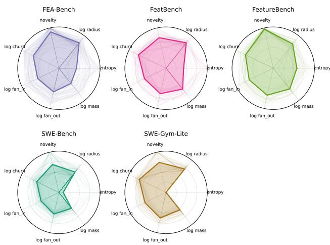  
Figure 6: Per-benchmark radar plots over the seven SNC indicators across the 5 studied benchmarks. Each faint line traces a single instance; the bold polygon is the per-benchmark median.

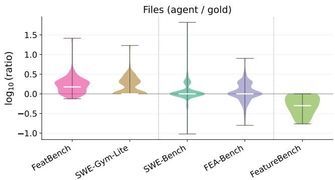  
(a) Patch verbosity: files touched in agent patch to gold patch

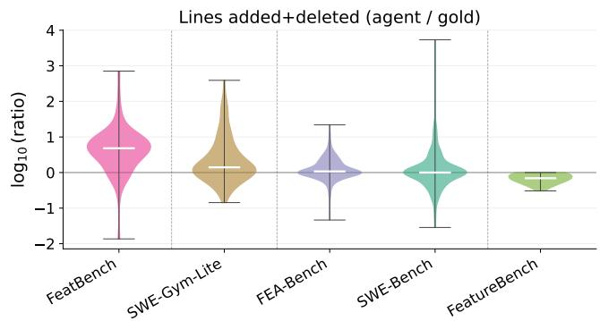  
(b) Patch verbosity: total lines changed in agent patch to gold patch

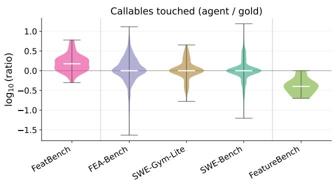  
(c) Patch verbosity: callables touched in agent patch to gold patch

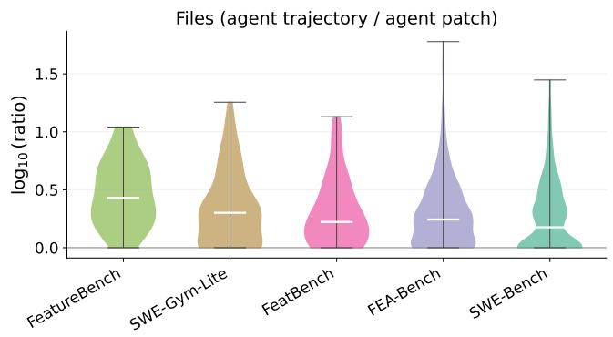  
(d) Exploration breadth: files touched over the trajectory to files in the final agent patch

Figure 7: Agent behaviour footprints on the tasks Claude Opus 4.6 resolves. Each panel shows the per-instance $\log _ { 1 0 }$ ratio with Scott-Knott ESD clusters, where 0 denotes parity. Panels (a)–(c) compare the agent's resolved patch to the gold patch; panel (d) compares the agent's trajectory to its final patch, and all five benchmarks fall in a single cluster there.

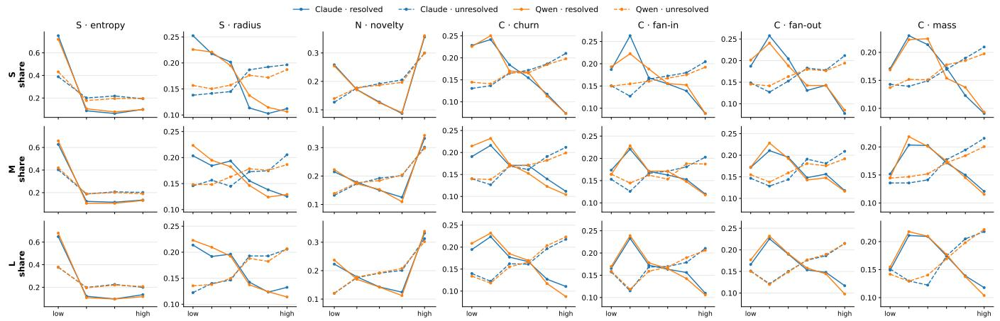  
Figure 8: Full version of Figure 5a. Resolved versus unresolved gold patch SNC distributions across all model families and scales. Each panel shows the distribution of runs over quantile bins of one SNC indicator (columns) at one scale (rows), conditioned on outcome.

Table 2: Resolved vs. unresolved separation per (model, feature). Each cell reports the $p \textmd { - }$ value with significance stars from a $\chi ^ { 2 }$ test of independence between the resolution outcome and the binned feature, followed by Cramér's V (Cramér 1946) after the slash. Since each sub-table runs many such tests, the p-values are Benjamini-Hochberg FDR-corrected within it (Benjamini and Hochberg 1995) $( ^ { * } p < 0 . 0 5 , ^ { * * } p < \mathrm { \bar { 0 } } . 0 1 , ^ { * * * } p < 0 . 0 \dot { 0 } 1 )$ . Additionally, at these sample sizes $( n > 2 , 0 0 0$ per cell) statistical significance is near-automatic, so we also report Cramér's V as a sample-size-independent effect size, where $0 . 1 / 0 . 3 / 0 . 5$ is small/medium/large. Every model separates resolved from unresolved tasks on essentially all dimensions, with 22 of 24 footprint cells and all 42 SNC cells significant at BH-adjusted $p < 0 . 0 5$ and Cramér's V up to 0.40 (median 0.20); the only exceptions are Qwen's trajectory/patch ratio $( V \le 0 . 0 3 )$
<table><tr><td>model</td><td>files</td><td></td><td>lines</td><td>callables</td><td>traj/patch</td></tr><tr><td>C-S haiku</td><td> $2 \mathrm { e } { - } 3 9 ^ { \ast \ast \ast } / 0 . 3 8$ </td><td> ${ 7 \mathrm { e } } { - 3 0 } ^ { * * * } \ / \ 0 . 3 3$ </td><td></td><td> $5 \mathrm { e } { - } 3 1 ^ { \ast \ast \ast } / 0 . 4 0$ </td><td> $2 \mathrm { e } { - } 0 5 ^ { \ast \ast \ast } / 0 . 1 3$ </td></tr><tr><td>C-M sonnet</td><td> $4 \mathrm { e } { - } 2 3 ^ { \ast \ast \ast } / 0 . 2 3$ </td><td> $7 \mathrm { e } { - } 0 4 ^ { \ast \ast \ast } / 0 . 1 0$ </td><td></td><td> $6 \mathrm { e } { - } 0 9 ^ { \ast \ast \ast } / 0 . 1 6$ </td><td> $\mathsf { l e { - } } 0 7 ^ { \ast \ast \ast } / 0 . 1 2$ </td></tr><tr><td>C-L opus</td><td> $6 \mathrm { e } { - } 2 1 ^ { \ast \ast \ast } / 0 . 2 3$ </td><td> $3 \mathrm { e } { - } 0 9 ^ { * * * } / 0 . 1 5$ </td><td></td><td> ${ 3 \mathrm { e } \mathrm { - } 1 0 } ^ { \ast \ast \ast } / 0 . 1 8$ </td><td> $3 \mathrm { e } { - } 1 0 ^ { \ast \ast \ast } / 0 . 1 5$ </td></tr><tr><td> $\mathrm { Q } { \cdot } \mathrm { S } 9 \mathrm { b }$ </td><td> $\mathrm { l e { - } } 2 3 ^ { \ast \ast \ast } / 0 . 2 4$ </td><td> $\boldsymbol { 1 \mathrm { e } { - } } 0 6 ^ { * * * } / 0 . 1 3$ </td><td></td><td> $2 \mathrm { e } { - } 1 6 ^ { \ast \ast \ast } / 0 . 2 3$ </td><td> $0 . 6 0 / 0 . 0 2$ </td></tr><tr><td> $\mathbf { Q } \mathbf { - } \mathbf { M } 2 7 \mathbf { b }$ </td><td> $4 \mathrm { e } { - } 2 3 ^ { \ast \ast \ast } / 0 . 2 4$ </td><td> $5 \mathrm { e } { - } 1 2 ^ { { \ast } { \ast } { \ast } } / 0 . 1 8$ </td><td></td><td> $2 \mathrm { e } { - } 1 3 ^ { \ast \ast \ast } / 0 . 2 1$ </td><td> $0 . 3 6 / 0 . 0 3$ </td></tr><tr><td> $\mathrm { Q - L } 3 9 7 \mathrm { b }$ </td><td> $8 \mathrm { e } { - } 4 3 ^ { \ast \ast \ast } / 0 . 3 1$ </td><td> $2 \mathrm { e } { - } 1 9 ^ { \ast \ast \ast } / 0 . 2 1$ </td><td></td><td> $5 \mathrm { e } { - } 2 4 ^ { \ast \ast \ast } / 0 . 2 6$ </td><td> ${ 8 \mathrm { e } } { - } 0 3 ^ { \ast \ast } / 0 . 0 7$ </td></tr></table>

<table><tr><td>model</td><td>entropy</td><td></td><td>radius</td><td>novelty</td><td></td><td>churn</td><td></td><td>fan-in</td><td></td><td>fan-out</td><td></td><td>mass</td></tr><tr><td>C-S haiku</td><td> $6 \mathrm { e } { - } 5 6 ^ { \ast \ast } / 0 . 3 5$ </td><td> $\mathrm { l e } { - 2 4 } ^ { \ast \ast \ast } / 0 . 2 4$ </td><td></td><td> $7 \mathrm { e } { - } 2 2 ^ { \ast \ast } / 0 . 2 2$ </td><td></td><td> $3 \mathrm { e } { - } 2 6 ^ { \ast \ast \ast } / 0 . 2 5$ </td><td></td><td> ${ 3 \mathrm { e } { - } 2 0 } ^ { \ast \ast \ast } / 0 . 2 2$ </td><td></td><td> $7 \mathrm { e } { - } 2 5 ^ { \ast \ast } / 0 . 2 4$ </td><td></td><td> $4 \mathrm { e } { - } 1 8 ^ { \ast \ast \ast } / 0 . 2 1$ </td></tr><tr><td>C-M sonnet</td><td> $9 \mathrm { e } { - } 2 4 ^ { \ast \ast \ast } / 0 . 2 3$ </td><td> $4 \mathrm { e } { - } 0 9 ^ { \ast \ast \ast } / 0 . 1 5$ </td><td></td><td>9e-10*** / 0.15 5e-15*** /0.19</td><td></td><td></td><td></td><td> ${ 8 \mathrm { e } { - } 1 1 } ^ { \ast \ast \ast } / 0 . 1 6$ </td><td></td><td> $3 \mathrm { e } { - } 1 3 ^ { \ast \ast \ast } / 0 . 1 8$ </td><td></td><td> $3 \mathrm { e } { - } 1 2 ^ { \ast \ast } / 0 . 1 7$ </td></tr><tr><td>C-L opus</td><td> $5 \mathrm { e } { - } 3 5 ^ { \ast \ast \ast } / 0 . 2 8$ </td><td> $\mathrm { 1 e - 1 6 ^ { * * * } / 0 . 2 0 3 e - 1 2 ^ { * * * } / 0 . 1 7 5 e - 1 9 ^ { * * * } / 0 . 2 1 }$ </td><td></td><td></td><td></td><td></td><td></td><td> $\mathrm { 1 e - 1 5 ^ { \ast \ast \ast } } / 0 . 1 9$ </td><td></td><td> $4 \mathrm { e } { - } 1 5 ^ { \ast \ast \ast } / 0 . 1 9$ </td><td></td><td> $6 \mathrm { e } { - } 1 8 ^ { \ast \ast \ast } / 0 . 2 1$ </td></tr><tr><td>Q-S 9b</td><td> $4 \mathrm { e } { - } 3 1 ^ { \ast \ast \ast } / 0 . 2 6$ </td><td> $ 2 \mathrm { e } { - 1 } \downarrow ^ { \ast \ast \ast } /  0 . 1 6 \ : \ : 7 \mathrm { e } { - 1 6 } ^ { \ast \ast \ast } /  0 . 1 9 \ : \ : 3 \mathrm { e } { - 2 0 } ^ { \ast \ast \ast } /  0 . 2 2 $ </td><td></td><td></td><td></td><td></td><td></td><td> $2 \mathrm { e } { - } 0 9 ^ { \ast \ast \ast } / 0 . 1 5$ </td><td></td><td> $2 \mathrm { e } { - } 1 4 ^ { \ast \ast } / 0 . 1 8$ </td><td></td><td> $\mathsf { 1 e { - } } 1 2 ^ { \ast \ast \ast } / 0 . 1 7$ </td></tr><tr><td>Q-M 27b</td><td> $\mathrm { l e } { - 2 4 } ^ { \ast \ast \ast } / 0 . 2 3$ </td><td> $\displaystyle 1 \mathrm { e } { - } 0 8 ^ { \ast \ast \ast } ~ / 0 . 1 5 ~ \mathrm { 9 } \mathrm { e } { - } 1 1 ^ { \ast \ast \ast } ~ / 0 . 1 6 ~ 5 \mathrm { e } { - } 1 6 ^ { \ast \ast \ast } ~ / 0 . 1 9$ </td><td></td><td></td><td></td><td></td><td></td><td> $8 \mathrm { e } { - } 0 8 ^ { \ast \ast \ast } / 0 . 1 4$ </td><td></td><td> $5 \mathrm { e } { - } 1 0 ^ { \ast \ast \ast } / 0 . 1 6$ </td><td></td><td> $3 \mathrm { e } { - } 0 9 ^ { \ast \ast \ast } / 0 . 1 5$ </td></tr><tr><td>Q-L 397b</td><td> $2 \mathrm { e } { - } 4 2 ^ { \ast \ast \ast } / 0 . 3 0$ </td><td> $6 \mathrm { e } { - } 1 9 ^ { \ast \ast \ast } / 0 . 2 1$ </td><td></td><td> $5 \mathrm { e } { - } 1 7 ^ { \ast \ast \ast } / 0 . 1 9 4 \mathrm { e } { - } 3 0 ^ { \ast \ast \ast } / 0 . 2 6$ </td><td></td><td></td><td></td><td> $\mathrm { l e } { - } 1 7 ^ { \ast \ast \ast } / 0 . 2 0$ </td><td></td><td> $3 \mathrm { e } { - } 2 0 ^ { \ast \ast \ast } / 0 . 2 1$ </td><td></td><td> $2 \mathrm { e } { - } 1 9 ^ { \ast \ast \ast } / 0 . 2 1$ </td></tr></table>

(b) Gold patch SNC metrics, per task-distribution quantile bin.

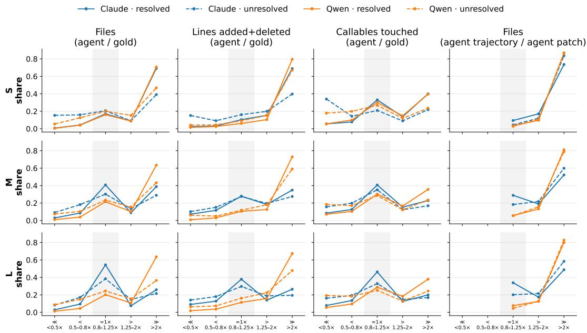  
Figure 9: Full version of Figure 5b. Resolved versus unresolved agent behavioural footprints across all model families and scales. Each panel shows the distribution of runs over five multiplicative bands relative to parity with the gold patch, conditioned on outcome. The shaded region is the parity band $( 0 . 8 { \times } { - } 1 . 2 \bar { 5 } { \times } )$