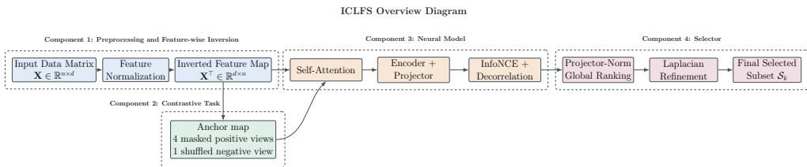
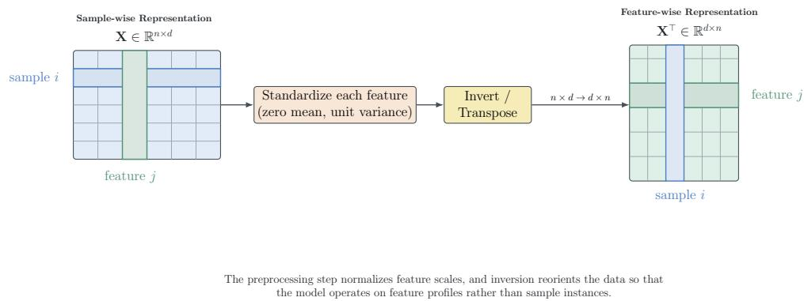
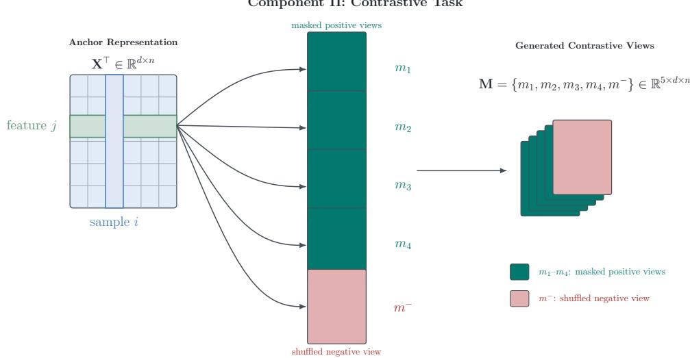

# When Features Become Instances: Inverted Contrastive Learning for Unsupervised Feature Selection

Utsab Ghosh1\* and Roshni Chakraborty1

1ABV-Indian Institute of Information Technology and Management, Gwalior, India.

## Abstract

Unsupervised feature selection (UFS) seeks a compact subset of informative features without access to class labels, making feature utility difficult to define. Existing UFS methods therefore rely on indirect structural criteria, such as similarity preservation, locality, sparsity, cluster geometry, or reconstruction quality. In this paper, we instead study UFS through representation consistency and propose Inverted Contrastive Learning for Unsupervised Feature Selection (ICLFS), a feature-wise contrastive framework that reformulates UFS as a representation learning problem over features rather than samples. ICLFS first inverts the data matrix so that each feature is represented by its sample-profile vector, then constructs multiple masked positive views together with a shuffled negative view, and learns projector-space representations that remain consistent across these structured perturbations under an InfoNCE-based objective. Motivated by recent findings that cosine-based and InfoNCE-based training affect embedding norms, we use projector-space embedding magnitude as the saliency signal for ranking features. To further improve separation among features, we incorporate a decorrelation regularizer that encourages distinct features to occupy more separated regions of the learned embedding space. The resulting norm-based ranking is subsequently refined through Laplacian-Gated Ranking Correction, which suppresses locally redundant candidates while preserving salient ones. Extensive experiments on 12 benchmark datasets show that ICLFS achieves the best clustering accuracy on 10 datasets against both classical and neural baselines under the standard clustering-based UFS evaluation protocol, while remaining competitive on the other two. These results show that feature-wise contrastive representation consistency provides a strong and effective alternative to neighborhood, cluster, and reconstruction-based UFS formulations.

Keywords: Unsupervised feature selection, Contrastive learning, Representation learning, Self-supervised learning, High-dimensional data

## 1 Introduction

High-dimensional datasets commonly include noisy, redundant, and only weakly informative features, which can impair clustering performance and complicate exploratory analysis [1, 2]. This issue is particularly prominent in domains such as biomedicine [3], text mining [4], and image retrieval [4], where the feature dimension can be very large relative to the number of available samples, and only a fraction of the measured variables may capture the true structure of the data. In supervised feature selection, labels guide the identification of predictive features and help eliminate irrelevant or redundant variables [1, 3]. In many real-world scenarios, however, labeled data are scarce, while unlabeled data are much more abundant [1], making direct supervised selection impractical. Unsupervised feature selection (UFS) addresses this setting by selecting a compact subset of informative features without relying on label information, thereby improving interpretability, reducing redundancy, and facilitating downstream learning [2].

As no label signal is available, UFS is commonly formulated through indirect structural criteria rather than task-level supervision. Existing methods typically assess feature usefulness through properties such as similarity preservation, locality, sparsity, or cluster geometry [4]. As a result, feature relevance must be inferred from the intrinsic organization of the data itself, making robust feature identification considerably more challenging in high-dimensional settings [2, 4–6]. Existing research works in this area can be broadly grouped according to the structural principles used in their proposed approaches. For example, filter-style methods such as Laplacian Score (LS) rank features according to their ability to preserve local neighborhood relations [7]. Spectral Feature Selection (SPEC) evaluates features within a spectral graph-theoretic framework derived from structural similarity [8], whereas Multi-Cluster Feature Selection (MCFS) emphasizes preservation of latent multi-cluster structure [9]. Subsequently, several research works focus on recovering more discriminative unlabeled structure. For instance, Nonnegative Discriminative Feature Selection (NDFS) jointly learns latent cluster assignments and sparse feature weights through nonnegative spectral analysis [10]. More recently, neural approaches such as Concrete Autoencoders (CAE) have framed feature selection through reconstruction objectives, selecting subsets of features that best reconstruct the original input [11] and LS-CAE [12]. Despite their empirical effectiveness, these approaches mainly focus on surrogate principles, such as, neighborhood preservation, latent cluster recovery, or reconstruction quality. In contrast we assess feature utility through the consistency of learned feature representations across masked feature views, i.e., systematically constructed views that partially mask the observed feature profile while preserving the identity of the underlying feature.

This motivates studying UFS through representation consistency rather than through a single predefined structural heuristic. In this paper, we approach UFS from a feature-wise contrastive learning perspective, where each feature is paired with multiple masked positive views and optimized through an InfoNCE-based objective in the learned representation space [13]. However, Wang et al. [14] and Zhang et al. [15] showed that cosine-based training affects embedding norms and that these norms in turn affect gradient magnitudes. More recently, Draganov et al. [16] showed that optimizing InfoNCE increases these embedding norms across self-supervised learning methods and argued that this may occur when the network treats frequently reinforced samples as more prototypical. Additionally, embedding magnitude has been observed to serve as a measure of model certainty [17, 18]. Therefore, in this paper, we propose projector-space embedding magnitude as a saliency signal for unsupervised feature selection. Based on this idea, we propose an Inverted Contrastive Learning for Unsupervised Feature Selection (ICLFS), a feature-wise contrastive framework that reformulates UFS as a representation learning problem over features rather than samples. ICLFS first inverts the data matrix so that each feature is represented by its sample-profile vector, then constructs multiple masked positive views and learns projector-space representations that remain consistent across them under an InfoNCE-based [13] objective. To further improve separation among features, we also include a decorrelation regularizer that encourages distinct features to occupy more separated regions of the learned embedding space. After optimization, features are ranked according to the norm of their projector-space embeddings, and this ranking is subsequently refined through Laplacian-Gated Ranking Correction that suppresses locally redundant candidates while preserving highly salient ones.

Our exhaustive empirical evaluation shows that ICLFS achieves the best clustering accuracy on 10 of the 12 benchmark datasets against both classical and neural baselines under the standard clustering-based UFS evaluation protocol [12]. Our empirical evaluations indicate that ICLFS outperforms existing methods in k-means clustering accuracy by 0.47% to 2.74% on ARCENE, 0.44% to 1.20% on BASEHOCK, 1.85% to 12.37% on COIL20, 0.44% to 19.91% on GISETTE, 8.40% to 14.24% on LUNG, 11.25% to 15.16% on NCI9, 0.94% to 1.64% on PCMAC, 23.19% to 27.89% on PROSTATE, 4.57% to 7.69% on TOX171, and 2.81% to 15.78% on WARPPIE10P. We observe that ICLFS achieves the largest gains on PROSTATE, with an improvement range of 23.19% to 27.89%, followed by GISETTE, WARPPIE10P, NCI9, and LUNG. On the two datasets where ICLFS does not achieve the top result, the margin relative to the baseline range is -4.51% to 12.09% on ALLAML and -0.41% to 1.23% on RELATHE, indicating that RELATHE remains highly competitive whereas LS-CAE is the stronger feature selector for ALLAML.

The main contributions of this paper are as follows:

• We introduce Inverted Contrastive Learning with Feature Screening (ICLFS), a featurewise unsupervised feature selection framework that reformulates UFS as a contrastive representation learning problem by treating features, rather than samples, as the learning instances.

• We develop a ranking mechanism based on projector-space embedding norms, together with a post hoc Laplacian-Gated Ranking Correction stage, to produce a global feature ranking that can be truncated to obtain feature subsets at different target cardinalities.

• We show that the proposed framework performs competitively against both classical and neural UFS baselines across a diverse benchmark suite, achieving the best clustering accuracy on 10 of 12 datasets under the standard clustering-based evaluation protocol. On the remaining two datasets, ICLFS achieves a tied second-best result on RELATHE and remains competitive on ALLAML, where the strongest performance is obtained by LS-CAE.

• We provide empirical evidence that feature-wise contrastive representation consistency offers an effective alternative to neighborhood-, cluster-, and reconstruction-based optimization proxies for unsupervised feature selection.

The remainder of this paper is organized as follows. Section 2 reviews the most relevant prior work in unsupervised feature selection and related representation-learning directions. Section 3 presents the proposed ICLFS framework, including its feature-wise formulation, model architecture, optimization objective, and redundancy-aware refinement stage. Section 4 describes the benchmark datasets, evaluation protocol, and implementation details. Section 5 reports the comparative, ablation, and analytical results. Finally, Section 6 concludes the paper and outlines directions for future work.

The implementation associated with this work is publicly available at: https://github.com/ neilghos/ICLFS.

## 2 Related Work

Unsupervised feature selection (UFS) aims to identify a compact subset of informative features without access to class labels. Unlike supervised feature selection, where discriminative relevance can be measured directly against a target variable, UFS must rely on indirect structural principles such as local manifold preservation, cluster consistency, sparsity, or reconstruction quality. As a result, the design of effective UFS methods is closely tied to the choice of surrogate objective used to approximate feature utility. Existing work in this area can be broadly grouped into classical graph- and spectral-based methods, reconstruction-driven deep models, and more recent representation learning approaches.

## 2.1 Classical Unsupervised Feature Selection

A large body of early UFS work is based on graph structure and spectral analysis. Laplacian Score (LS) ranks features according to how well they preserve local neighborhood structure, under the intuition that informative features should respect the intrinsic manifold geometry of the data [7]. Spectral Feature Selection (SPEC) extends this perspective by evaluating features through a spectral graph-theoretic framework that measures consistency with the global structure encoded by the similarity graph [8]. Multi-Cluster Feature Selection (MCFS) further develops this line of work by selecting features that best preserve latent multi-cluster structure through spectral embedding and sparse regression [9]. These methods are influential and often effective, but they are fundamentally tied to predefined similarity graphs or spectral surrogates, which may not fully capture richer feature interactions.

Another important classical direction seeks to learn feature importance jointly with latent discriminative or clustering structure. Unsupervised Discriminative Feature Selection (UDFS) follows this idea by combining discriminative analysis with sparsity regularization in a labelfree setting, thereby encouraging the selection of features that preserve latent separability without access to class labels. Nonnegative Discriminative Feature Selection (NDFS) further combines spectral clustering with nonnegative sparse feature selection, allowing cluster structure and feature selection to reinforce one another [10]. Such methods are generally more adaptive than simple filter-based ranking schemes, but they still remain closely coupled to cluster-recovery objectives and may become sensitive to graph quality or optimization difficulty in high-dimensional settings.

## 2.2 Deep and Reconstruction-Based Feature Selection

With the rise of deep learning, reconstruction-based and differentiable frameworks became a major direction for UFS. Concrete Autoencoders (CAE) learn a discrete feature subset through differentiable subset selection, optimizing the selected features for reconstruction of the original input [11]. Around the same period, Differentiable Unsupervised Feature Selection (DUFS) [19] further reflected the move toward differentiable UFS by introducing a gated Laplacian-based objective that learns feature selection within a continuous optimization framework. More recently, LS-CAE enriched the reconstruction-based paradigm by combining autoencoder reconstruction with additional mechanisms designed to discard nuisance and correlated features while preserving structural information [12].

These methods are often strong empirical baselines, but their primary learning signal remains tied to reconstruction, surrogate prediction, or differentiable selection objectives rather than to feature-level relational consistency. As a result, they may preserve features that are useful for input recovery or proxy optimization without necessarily emphasizing those that are most informative for downstream partition structure or non-redundant relational organization.

More broadly, deep UFS methods based on autoencoders, sparse bottlenecks, or embedded selectors typically focus on compressive representation quality rather than explicitly modeling feature-to-feature contrastive relations. This leaves a gap between reconstruction-oriented selection and relational feature ranking, especially in settings where the key challenge is not input recovery but the identification of discriminative, complementary, and cluster-relevant features. A recent related direction is Spectral Self-supervised Feature Selection (SSFS) [20], which combines graph spectral structure with self-supervised surrogate learning for feature ranking. While distinct in formulation, it likewise illustrates the broader move beyond fixed classical filters toward more adaptive unsupervised feature selection objectives.

## 2.3 Contrastive and Self-Supervised Representation Learning

Contrastive learning has become a central paradigm in self-supervised representation learning, particularly in domains where multiple views of the same instance can be constructed and used to learn invariant embeddings. However, most contrastive methods are formulated at the sample level: individual data points are treated as instances, augmented sample views are contrasted, and the resulting representation space is optimized for instance discrimination. This standard setup does not directly address the central goal of unsupervised feature selection, where the objective is to assess the utility offeatures rather than samples.

Only limited attention has been given to adapting contrastive principles to a feature-centric unsupervised feature selection setting. In particular, existing approaches rarely invert the data matrix and treat features as learning instances in their own right. As a result, most contrastive objectives remain misaligned with the core requirement of UFS: assigning meaningful saliency to features based on their stability and informativeness under multiple unsupervised views. This creates an opening for a feature-wise contrastive formulation in which representation consistency is used as the basis for feature ranking.

Recent work further strengthens this motivation by showing that contrastive optimization can induce informative behavior in embedding norms even when similarity is computed on normalized representations. Wang et al. [14] and Zhang et al. [15] showed that cosine-based training affects embedding norms and that these norms influence gradient magnitudes during optimization. More recently, Draganov et al. [16] showed that optimizing InfoNCE systematically increases embedding norms across self-supervised learning methods and argued that this behavior may arise when frequently reinforced samples are treated as more prototypical in the learned representation space. Related work has also connected embedding magnitude to confidence- and certainty-related behavior in representation learning [17, 18]. Taken together, these observations suggest that projector-space embedding norm can serve not only as a training byproduct, but also as a potentially meaningful signal for feature saliency in a feature-wise contrastive learning framework.

## 2.4 Feature Interaction Modeling and Redundancy Control

A persistent challenge in UFS is that informative features must be not only individually useful but also collectively non-redundant. In classical methods, redundancy is often handled indirectly through graph-based structure preservation, spectral objectives, or sparsity-inducing formulations, which aim to discourage the selection of features that contribute overlapping structural information. In more recent neural approaches, redundancy control is typically introduced through the learning objective itself. CAE relies primarily on reconstruction quality, LS-CAE supplements reconstruction with additional structure-aware criteria to suppress nuisance and correlated features, and DUFS uses a differentiable gated Laplacian objective to regularize selection within a continuous optimization framework.

Despite these advances, explicit redundancy control is still usually embedded inside a particular scoring or training objective rather than paired with a separate deterministic refinement stage after representation learning. As a result, existing methods seldom combine learned feature representations, structured multi-view perturbation, explicit inter-feature interaction modeling, and post hoc redundancy-aware filtering within a single coherent framework. This is particularly limiting in high-dimensional settings, where strongly ranked features may still be highly correlated, and where a learned representation space may benefit from an additional refinement step that suppresses locally redundant selections without discarding globally salient features.

## 2.5 Positioning of the Proposed Method

The proposed ICLFS framework is motivated by the above limitations. Unlike classical graphbased ranking methods, ICLFS does not rely solely on fixed similarity proxies or spectral consistency criteria. Unlike reconstruction-driven autoencoder approaches, it is not trained primarily to recover the input. Instead, it formulates unsupervised feature selection as a feature-level contrastive representation learning problem by inverting the data matrix and treating each feature profile as an individual learning instance. Structured multi-view masking supplies complementary positive views, the interaction module models dependencies across features, and a Laplacian-based refinement stage suppresses locally redundant selections in the final ranked set. In this way, ICLFS unifies contrastive representation learning, inter-feature interaction modeling, and redundancy-aware refinement within a single UFS framework.

## 3 Proposed Approach

In this section, we present the proposed ICLFS framework for unsupervised feature selection. We first formalize the problem setting and summarize the overall pipeline, and then describe the four main components of the framework, i.e., preprocessing and feature-wise inversion, contrastive view construction, the neural model together with its optimization strategy, followed by the final selection and refinement stage.

## 3.1 Problem Statement

This subsection formalizes the unsupervised feature selection problem that the proposed framework aims to solve. It also clarifies the selection objective that motivates the subsequent feature-wise contrastive formulation.

Let the unlabeled data matrix be denoted by

$$
\mathbf { X } \in \mathbb { R } ^ { n \times d } ,\tag{1}
$$

where n is the number of samples and d is the number of features. Rows of X correspond to samples and columns correspond to measured variables. In unsupervised feature selection, the objective is to identify a subset of feature indices

$$
S _ { k } \subseteq \{ 1 , \dots , d \} , \qquad | S _ { k } | = k ,\tag{2}
$$

such that the resulting reduced data matrix

$$
\mathbf { X } _ { { \mathcal { S } } _ { k } } \in \mathbb { R } ^ { n \times k } ,\tag{3}
$$

retains the most informative structure of the original data according to an unsupervised selection criterion. As shown in Eq. 2, the task is to select exactly k features from the full feature index set, and Eq. 3 gives the corresponding reduced representation. Since no class labels are available, this structure must be inferred from the organization of the data itself, such as feature dependencies, sample similarity, local neighborhood structure, or learned representation consistency. Rather than learning a separate model for each target cardinality, we learn a single feature-ordering mechanism from which the subset $S _ { k }$ in Eq. 2 can be obtained for any target cardinality k. In the proposed framework, this is achieved by first learning an ordering over features and then refining cardinality-specific selections from that ordering. We next summarize the proposed framework used to obtain these subsets.

## 3.2 Overview

This subsection provides a high-level overview of the proposed framework used to learn the feature-scoring and selection mechanism introduced in the problem statement. As shown in Fig. 1, the framework is organized into four components: Component I (Preprocessing and Feature-wise Inversion), Component II (Contrastive Task), Component III (Neural Model), and Component IV (Selector). Component I transforms the input data matrix X into the inverted feature map $\mathbf { X } ^ { \top }$ , in which each feature is represented across the full sample set. Component II constructs multiple masked positive feature maps together with a shuffled negative feature map and stacks them into the generated feature-map tensor M to define the unsupervised contrastive task. Component III processes the anchor feature map $\mathbf { X } ^ { \top }$ and the generated feature-map tensor M through self-attention, nonlinear encoding, projection, and optimization to learn feature-wise contrastive embeddings. Finally, Component IV derives an initial projector-norm ranking from the stacked projector output $\mathcal { Z }$ and applies Laplacian-Gated Ranking Correction (LGRC) as a last-mile refinement to obtain the final selected subset. In the next subsection, Section 3.3, we begin with Component I (Preprocessing and Feature-wise Inversion).

  
Fig. 1: Component-wise overview of the proposed Inverted Contrastive Learning for Unsupervised Feature Selection (ICLFS) framework. [Component 1: Preprocessing and Feature-wise Inversion] normalizes the input matrix and inverts it into a feature-wise map. [Component 2: Contrastive Task] generates the masked positive views and shuffled negative view that define the unsupervised contrastive objective. [Component 3: Neural Model] processes the anchor map and generated views through the self-attention, encoder, and projector modules and optimizes the resulting embeddings using the InfoNCE objective together with the decorrelation regularizer. [Component 4: Selector] ranks features by projector-space norm and refines the top-ranked candidates through Laplacian-Gated Ranking Correction (LGRC) to produce the final selected subset.

## 3.3 Component I: Preprocessing and Feature-wise Inversion

This component establishes the input representation on which the rest of the proposed framework is built. Since ICLFS defines the contrastive task over features rather than over samples, the sample-wise data matrix $\mathbf { X } \in \mathbb { R } ^ { n \times d }$ introduced in Eq. 1 must first be preprocessed and then converted into a feature-wise representation in which each feature becomes a learning instance.

As defined in Eq. 1, X is represented in the usual sample-wise form, with rows corresponding to samples and columns corresponding to features. To reduce scale imbalance across the feature columns of X and to prevent subsequent representation learning from being dominated by variables with larger raw magnitudes, we standardize X across samples so that each feature has zero mean and unit variance. After preprocessing, we transpose the input data matrix X in Eq. 1 to obtain the inverted feature map

$$
\mathbf { X } ^ { \top } \in \mathbb { R } ^ { d \times n } ,\tag{4}
$$

as shown in Eq. 4. In the inverted feature map $\mathbf { X } ^ { \top }$ , each row corresponds to one feature observed across all n samples.Accordingly, the j-th row of $\mathbf { X } ^ { \top }$ is written as

$$
\mathbf { x } _ { j } \in \mathbb { R } ^ { n } ,\tag{5}
$$

  
Fig. 2: Component I: preprocessing and feature-wise inversion. The sample-wise data matrix $\mathbf { X } \in \mathbb { R } ^ { n \times d }$ is standardized and transposed to obtain the inverted feature map $\mathbf { X } ^ { \top } \in \mathbb { R } ^ { d \times n }$ where each row represents one feature across the full sample set.

where Eq. 5 defines the sample-profile vector of feature j, which serves as one feature instance in the proposed framework.

As illustrated in Fig. 2, the preprocessing and inversion step converts the sample-wise data matrix X in Eq. 1 into the inverted feature map $\mathbf { X } ^ { \top }$ in Eq. 4. This inverted feature map $\mathbf { X } ^ { \top }$ serves as the input representation of the proposed framework, allowing all features to be processed jointly within a single batch so that the subsequent interaction module can capture dependencies among them before contrastive optimization is applied. Based on the featurewise representation defined by $\operatorname { E q . }$ 4 and Eq. 5, the proposed framework is designed to learn a feature-scoring and ranking mechanism from which the selected subset $\scriptstyle { S _ { k } }$ for any target cardinality k is obtained, consistent with the problem formulation in Eq. 2. We next construct the masked and shuffled views that instantiate the contrastive task.

## 3.4 Component II: Contrastive Task

This component defines the unsupervised contrastive task used to learn feature saliency from the feature-wise representation introduced in Component I. Figure 3 summarizes the corresponding view-generation process. The task is designed to create multiple positive observations of the same feature together with a mismatched observation, so that the model can identify features whose representations remain stable under structured perturbation without using class labels or predefined targets. This design is also motivated by recent findings on InfoNCE-based representation learning. In particular, Draganov et al. [16] showed that InfoNCE optimization can increase embedding norms, particularly for instances that are more frequently reinforced or that occupy denser regions of the learned representation space.

In the proposed framework, the positive views are constructed as masked versions of the same feature so that they preserve its identity under partial observation, whereas the negative view is constructed by shuffling the sample order of that same feature so that it disrupts the original sample-aligned structure while remaining derived from the same underlying signal.

  
Fig. 3: Component II: contrastive task. Starting from the anchor feature map $\mathbf { X } ^ { \top }$ , four masked positive feature maps and one shuffled negative feature map are generated and stacked to define the feature-wise contrastive view set used for training.

This makes the explicit negative more comparable to the anchor than an unrelated feature would be, because the contrast is formed between structure-preserving and structure-disrupting transformations of the same feature rather than between two different features that may differ for many unrelated reasons. Features that remain stable across the masked positive views therefore receive more consistent contrastive reinforcement, which motivates the later use of projector-space embedding norm as a feature saliency signal.

To construct the positive and negative views, we take the inverted feature map $\mathbf { X } ^ { \top }$ defined in Eq. 4 as the anchor feature map. From this anchor feature map, four masked feature maps $\mathbf { m } _ { 1 } , \mathbf { m } _ { 2 } , \mathbf { m } _ { 3 } , \mathbf { m } _ { 4 }$ are constructed as positive views, while the shuffled feature map $\mathbf { m } ^ { - }$ is constructed as an explicit negative view. The remaining feature instances within each feature map act as implicit negatives through the contrastive objective. This yields the feature-level contrastive formulation used in the proposed method.

Formally, starting from the anchor feature map $\mathbf { X } ^ { \top }$ defined in $\operatorname { E q . 4 } ,$ we generate four masked positive feature maps and one shuffled negative feature map,

$$
\mathbf { m } _ { 1 } , \mathbf { m } _ { 2 } , \mathbf { m } _ { 3 } , \mathbf { m } _ { 4 } , \mathbf { m } ^ { - } \in \mathbb { R } ^ { d \times n } .\tag{6}
$$

As shown in Eq. 6, all generated feature maps retain the same $d \times n$ structure as the anchor feature map in Eq. 4. The generated feature maps are defined as follows:

• m1: a light-mask feature map obtained by applying a light masking operation to each feature instance in $\mathbf { X } ^ { \top }$

$\mathbf { m } _ { 2 } \colon$ a heavy-mask feature map obtained by applying a heavier masking operation to each feature instance in $\mathbf { X } ^ { \top }$

• m : a complementary masked feature map constructed from one masked subset of each feature instance in $\mathbf { X } ^ { \top }$

$\mathbf { m } _ { 4 } \colon$ a second complementary masked feature map constructed with controlled overlap relative $\mathbf { t o } \mathbf { m } _ { 3 }$

• m−: a shuffled negative feature map obtained by randomly permuting the sample order within each feature instance in $\mathbf { X } ^ { \top }$

The masked feature maps preserve the identity of each underlying feature under partial observation, whereas the shuffled feature map disrupts the original sample-aligned structure of every feature instance while preserving its marginal values, thereby providing an explicit mismatched view. The exact masking ratios and overlap settings used to construct these feature maps are given in Section 4.3. The generated feature maps are stacked as

$$
\mathbf { M } = \left[ \mathbf { m } _ { 1 } , \mathbf { m } _ { 2 } , \mathbf { m } _ { 3 } , \mathbf { m } _ { 4 } , \mathbf { m } ^ { - } \right] \in \mathbb { R } ^ { 5 \times d \times n } ,\tag{7}
$$

as illustrated in Fig. 3. Thus, Eq. 7 collects all generated feature maps into a single stacked generated feature-map tensor that is used in the subsequent neural model. For the j-th feature, the corresponding row-wise views are $\mathbf { m } _ { 1 } [ j , : ] , \mathbf { m } _ { 2 } [ j , : ] , \mathbf { m } _ { 3 } [ j , : ] , \mathbf { m } _ { 4 } [ j , : ]$ , and $\mathbf { m } ^ { - } [ j , : ]$ , which define the positive and negative observations associated with the anchor feature vector $\mathbf { x } _ { j }$ in Eq. 5. We next describe how the anchor feature map $\mathbf { X } ^ { \top }$ and the stacked generated feature-map tensor M are processed by the neural model.

## 3.5 Component III: Neural Model

This component describes the neural model that transforms the anchor feature map $\mathbf { X } ^ { \top }$ in Eq. 4 and the generated feature-map tensor M in Eq. 7 into feature-wise encoder and projector embeddings. Specifically, the neural model consists of an encoder that produces latent feature embeddings, a projector that maps these embeddings into the contrastive space, and the model-scaling and optimization choices used to train them.

## 3.5.1 Encoder

This subsection describes the encoder used to transform the anchor feature map $\mathbf { X } ^ { \top }$ and the generated feature maps in M into latent feature embeddings. In high-dimensional data, the usefulness of a feature is often not purely an individual property, but may also depend on its relation to the remaining features in the dataset. For this reason, in ICLFS the encoder first applies a self-attention layer to model inter-feature relations. The resulting feature map is then transformed by nonlinear layers into an encoder embedding matrix.

Let

$$
\mathbf { V } \in \mathbb { R } ^ { d \times n } ,\tag{8}
$$

denote an input feature map, where V may be the anchor feature map $\mathbf { X } ^ { \top }$ or one of the generated feature maps contained in M. The encoder first applies a self-attention layer across the rows of $\mathbf { V } ;$ in our implementation, this layer uses a single attention head. In this formulation, each row corresponds to one feature instance, and its n-dimensional sample-profile vector serves as the corresponding representation. This allows each feature instance to attend to all other feature instances within the same feature map before row-wise encoding is applied.

The attention-mixed feature map is then passed through a two-stage multilayer perceptron encoder, applied row-wise. The first encoder linear layer maps each feature instance into an intermediate hidden representation of dimension $d _ { e } ,$ followed by batch normalization, LeakyReLU activation, and dropout. This intermediate hidden matrix is written as

$$
{ \bf E } ^ { ( { \bf V } ) } \in \mathbb { R } ^ { d \times d _ { e } } ,\tag{9}
$$

The second encoder linear layer then maps $\mathbf { E } ^ { ( \mathbf { V } ) }$ into the encoder embedding matrix shown in Eq. 10:

$$
\mathbf { H } ^ { ( \mathbf { V } ) } \in \mathbb { R } ^ { d \times d _ { h } } ,\tag{10}
$$

where $d _ { h }$ denotes the encoder embedding dimension, and the j-th row

$$
\mathbf { h } _ { j } ^ { ( \mathbf { V } ) } \in \mathbb { R } ^ { d _ { h } }\tag{11}
$$

denotes the final encoder embedding of feature $j$ for the input feature map $\mathbf { V } .$ Thus, each input feature map is first mapped to the intermediate hidden matrix $\mathbf { E } ^ { ( \mathbf { V } ) }$ and then to the final embedding matrix $\mathbf { H } ^ { ( \mathbf { V } ) }$ , whose rows represent the latent embeddings of all d features.

When the encoder is applied to the anchor feature map $\mathbf { X } ^ { \top }$ , the resulting encoder embedding matrix is

$$
\mathbf { H } ^ { ( a ) } \in \mathbb { R } ^ { d \times d _ { h } } .\tag{12}
$$

Likewise, when the encoder is applied to each generated feature map in M, it produces the generated encoder embedding collection

$$
\bar { \mathbf { H } } = \left[ \mathbf { H } ^ { ( 1 ) } , \mathbf { H } ^ { ( 2 ) } , \mathbf { H } ^ { ( 3 ) } , \mathbf { H } ^ { ( 4 ) } , \mathbf { H } ^ { ( - ) } \right] \in \mathbb { R } ^ { 5 \times d \times d _ { h } } ,\tag{13}
$$

where ${ \bf H } ^ { ( 1 ) } , { \bf H } ^ { ( 2 ) } , { \bf H } ^ { ( 3 ) } , { \bf H } ^ { ( 4 ) }$ , and $\mathbf { H } ^ { ( - ) }$ denote the embedding matrices corresponding to the feature maps m , m , m , m , and m−, respectively.

Combining the anchor encoder embedding matrix with the generated encoder embedding matrices gives

$$
\mathcal { H } = \left[ \mathbf { H } ^ { ( a ) } , \mathbf { H } ^ { ( 1 ) } , \mathbf { H } ^ { ( 2 ) } , \mathbf { H } ^ { ( 3 ) } , \mathbf { H } ^ { ( 4 ) } , \mathbf { H } ^ { ( - ) } \right] \in \mathbb { R } ^ { 6 \times d \times d _ { h } } ,\tag{14}
$$

which forms the input to the projector. Thus, each embedding matrix in corresponds to the anchor feature map or one of the generated feature maps, and row j within that embedding matrix gives the latent embedding of feature $j .$

These encoder feature embeddings are next passed to the projector, which maps them into the contrastive embedding space used by the training objective in Section 3.5.4.

## 3.5.2 Projector

This subsection describes the projector that maps the encoder output  in Eq. 14 into the contrastive embedding space. Within the proposed framework, the projector plays a dual role: its normalized outputs define the space in which the InfoNCE objective is optimized, while its unnormalized outputs retain the embedding magnitudes that are later used for feature ranking. This separation is important because the encoder output  captures latent feature structure, whereas the projector output defines the representation space used both for contrastive optimization and for the final norm-based saliency criterion.

Formally, each embedding matrix in $\mathcal { H }$ is passed through the projector to produce a corresponding projector embedding matrix. When the projector is applied to the anchor embedding matrix $\mathbf { H } ^ { ( a ) }$ , it produces

$$
\mathbf { Z } ^ { ( a ) } \in \mathbb { R } ^ { d \times d _ { z } } ,\tag{15}
$$

where $\mathbf { Z } ^ { ( a ) }$ denotes the anchor projector embedding matrix. Likewise, when the projector is applied to the generated embedding collection H¯ in Eq. 13, it produces the generated projector embedding collection

$$
\bar { \mathbf { Z } } = \left[ \mathbf { Z } ^ { ( 1 ) } , \mathbf { Z } ^ { ( 2 ) } , \mathbf { Z } ^ { ( 3 ) } , \mathbf { Z } ^ { ( 4 ) } , \mathbf { Z } ^ { ( - ) } \right] \in \mathbb { R } ^ { 5 \times d \times d _ { z } } ,\tag{16}
$$

where ${ \bf Z } ^ { ( 1 ) } , { \bf Z } ^ { ( 2 ) } , { \bf Z } ^ { ( 3 ) } , { \bf Z } ^ { ( 4 ) }$ , and ${ \bf Z } ^ { ( - ) }$ denote the projector embedding matrices corresponding to ${ \bf H } ^ { ( 1 ) } , { \bf H } ^ { ( 2 ) } , { \bf H } ^ { ( 3 ) } , { \bf H } ^ { ( 4 ) }$ , and $\mathbf { H } ^ { ( - ) }$ , respectively.

Combining the anchor projector embedding matrix with the generated projector embedding matrices gives

$$
\mathcal { Z } = \left\lceil \mathbf { Z } ^ { ( a ) } , \mathbf { Z } ^ { ( 1 ) } , \mathbf { Z } ^ { ( 2 ) } , \mathbf { Z } ^ { ( 3 ) } , \mathbf { Z } ^ { ( 4 ) } , \mathbf { Z } ^ { ( - ) } \right\rceil \in \mathbb { R } ^ { 6 \times d \times d _ { z } } ,\tag{17}
$$

which forms the stacked projector embedding collection used by the contrastive objective, where row $j$ in each projector embedding matrix gives the $d _ { z }$ -dimensional embedding of feature $j .$

The projector is implemented as a residual multilayer perceptron composed of two projector blocks followed by a final linear projection. Each projector block consists of a linear transformation, batch normalization, and ReLU activation. For an input embedding matrix $\mathbf { H } ^ { ( \mathbf { V } ) }$ , the first projector block maps each row into an intermediate projector hidden representation of dimension $d _ { p }$ , written as

$$
\mathbf { U } ^ { ( 1 ) } \in \mathbb { R } ^ { d \times d _ { p } } ,
$$

and the second projector block maps $\mathbf { U } ^ { ( 1 ) }$ to a second hidden representation

(18)

$$
\mathbf { U } ^ { ( 2 ) } \in \mathbb { R } ^ { d \times d _ { p } } .\tag{19}
$$

The residual projector representation is then formed as

$$
\mathbf { U } ^ { \mathrm { r e s } } = \mathbf { U } ^ { ( 1 ) } + \mathbf { U } ^ { ( 2 ) } ,\tag{20}
$$

and this summed representation is finally mapped by a linear layer to the projector output space $\mathbb { R } ^ { d \times d _ { z } }$ . Thus, the projector first lifts the encoder embeddings into a hidden projector space of dimension $d _ { p }$ before producing the final projector embedding matrix $\mathbf { Z } ^ { ( \mathbf { V } ) } \in \tilde { \mathbb { R } } ^ { d \times d _ { z } }$ The layer-wise architecture is summarized in Table 1.

The encoder-projector architecture described above is instantiated at two different scales depending on the sample size of the dataset. This design choice reflects the fact that, in the proposed feature-wise formulation, the effective input dimensionality and the amount of available training signal are both directly influenced by the number of samplesCHECK this probably should come before you check else we decide later where to keep.

Table 1: Architecture of Component III (Neural Model). The encoder applies a self-attention layer followed by two row-wise linear transformations, where the first is followed by batch normalization, LeakyReLU activation, and dropout. The projector is a residual multilayer perceptron in which each projector block consists of a linear layer followed by batch normalization and ReLU activation.
<table><tr><td>Layer</td><td>Input</td><td>Output</td></tr><tr><td>Input feature map</td><td> $\mathbf { V } \in \mathbb { R } ^ { d \times n }$ </td><td> $\mathbb { R } ^ { d \times n }$ </td></tr><tr><td>Self-attention</td><td> $\mathbb { R } ^ { d \times n }$ </td><td> $\mathbb { R } ^ { d \times n }$ </td></tr><tr><td>Encoder linear layer 1</td><td> $\mathbb { R } ^ { d \times n }$ </td><td> $\mathbf { E } ^ { ( \mathbf { V } ) } \in \mathbb { R } ^ { d \times d _ { e } }$ </td></tr><tr><td>Encoder linear layer 2</td><td> $\mathbf { E } ^ { ( \mathbf { V } ) } \in \mathbb { R } ^ { d \times d _ { e } }$ </td><td> $\mathbf { H } ^ { ( \mathbf { V } ) } \in \mathbb { R } ^ { d \times d _ { h } }$ </td></tr><tr><td>Projector block 1</td><td> $\mathbf { H } ^ { ( \mathbf { V } ) } \in \mathbb { R } ^ { d \times d _ { h } }$ </td><td> $\mathbf { U } ^ { ( 1 ) } \in \mathbb { R } ^ { d \times d _ { p } }$ </td></tr><tr><td>Projector block 2</td><td> $\mathbf { U } ^ { ( 1 ) } \in \mathbb { R } ^ { d \times d _ { p } }$ </td><td> $\mathbf { U } ^ { ( 2 ) } \in \mathbb { R } ^ { d \times d _ { p } }$ </td></tr><tr><td>Residual add</td><td> $\mathbf { U } ^ { ( 1 ) } , \mathbf { U } ^ { ( 2 ) } \in \mathbb { R } ^ { d \times d _ { p } }$ </td><td> ${ \bf U } ^ { \mathrm { r e s } } \in \mathbb { R } ^ { d \times d _ { p } }$ </td></tr><tr><td>Projector output layer</td><td> ${ \bf U } ^ { \mathrm { r e s } } \in \mathbb { R } ^ { d \times d _ { p } }$ </td><td> $\mathbf { Z } ^ { ( \mathbf { V } ) } \in \mathbb { R } ^ { d \times d _ { z } }$ </td></tr></table>

## 3.5.3 Sample-Aware Model Scaling

In the proposed model, the effective input dimensionality depends directly on the number of samples available in a dataset, since each feature is represented by its sample-profile vector. Prior work in contrastive self-supervised learning has shown that representation quality is sensitive to architectural choices, and that stronger performance can often be obtained with larger models and richer optimization settings [21, 22]. At the same time, when the number of available training instances is limited, excessive architectural capacity can make optimization less data-efficient and increase the risk of over-parameterization.

Motivated by this tradeoff, we examined architectural choices across the benchmark suite and observed a consistent sample-count-dependent trend in our preliminary experiments: smaller-sample datasets favored lighter encoder and projector configurations, whereas largersample datasets benefited from larger ones. We therefore adopt two fixed sample-aware architectural regimes, which help reduce underfitting for larger-sample datasets while avoiding unnecessary over-parameterization for smaller-sample datasets. The exact architectural configurations for the two regimes are provided in Section 4.3.

## 3.5.4 Optimization Objective

Having defined the encoder and projector feature embeddings, we now specify the objective used to train the proposed framework. The training objective combines a contrastive term, $\mathcal { L } _ { \mathrm { c o n } } ^ { ( m ) }$ , which encourages consistency between the anchor map and each masked positive map while distinguishing them from mismatched structure, with an inter-feature decorrelation term, $\mathcal { L } _ { \mathrm { d e c o r r } }$ , which discourages different features from collapsing to overly similar projector-space representations.

Contrastive Loss We optimize the proposed framework with an InfoNCE-based contrastive loss, which is a standard objective for learning aligned representations from multiple views of the same underlying instance while separating them from mismatched instances [13]. In the present feature-wise setting, the anchor map and the masked positive maps provide multiple views of the same feature, while the shuffled map provides an explicit mismatched view. This choice is also supported by recent findings on self-supervised representation learning. Prior work has shown that even when similarities are computed on normalized embeddings, contrastive optimization still affects the magnitudes and gradient behavior of the underlying raw representations [14, 15]. More recently, Draganov et al. [16] showed that InfoNCE-based training systematically increases embedding norms and argued that larger norms are often associated with more reinforced or more prototypical instances in the learned representation space. Since our final feature ranking is derived from projector-space embedding norm, we optimize the model with an InfoNCE-style objective in order to utilize this norm-sensitive contrastive behavior as a feature-saliency signal.

From Section 3.5.2, the projector produces the stacked projector output $\mathcal { Z }$ shown in Eq. 17, where $\mathbf { Z } ^ { ( a ) } \in \mathbb { R } ^ { d \times d _ { z } }$ is the projector embedding matrix corresponding to the anchor map $\mathbf { X } ^ { \top } , \mathbf { Z } ^ { ( 1 ) } , \mathbf { Z } ^ { ( 2 ) } , \mathbf { Z } ^ { ( 3 ) } , \mathbf { Z } ^ { ( 4 ) }$ are the projector embedding matrices corresponding to the masked positive feature maps $\mathbf { m } _ { 1 } , \mathbf { m } _ { 2 } , \mathbf { m } _ { 3 } , \mathbf { m } _ { 4 } .$ , respectively, and ${ \bf Z } ^ { ( - ) }$ is the projector embedding matrix corresponding to the shuffled negative feature map $\mathbf { m } ^ { - }$

For each positive-view index $\iota \in \{ 1 , 2 , 3 , 4 \}$ , let $\hat { \mathbf { Z } } ^ { ( a ) } , \hat { \mathbf { Z } } ^ { ( m ) }$ , and $\hat { \mathbf { Z } } ^ { ( - ) }$ denote the rowwise ℓ -normalized versions of $\mathbf { Z } ^ { ( a ) } , \mathbf { Z } ^ { ( m ) }$ , and $\mathbf { Z } ^ { ( - ) }$ , respectively. Then, for feature $j ,$ , the corresponding normalized projector-space embeddings are $\hat { \mathbf { z } } _ { i } ^ { ( a ) } , \hat { \mathbf { z } } _ { i } ^ { ( m ) }$ , and $\hat { \mathbf { z } } _ { i } ^ { ( - ) }$

For each masked positive-view index m $\in \{ 1 , \ldots , 4 \}$ , we optimize an InfoNCE-style objective [13] given by

$$
\mathcal { L } _ { \mathrm { c o n } } ^ { ( m ) } = - \frac { 1 } { d } \sum _ { j = 1 } ^ { d } \log \frac { \exp \left( \left. \hat { \mathbf { z } } _ { j } ^ { ( a ) } , \hat { \mathbf { z } } _ { j } ^ { ( m ) } \right. / \tau \right) } { \sum _ { \ell = 1 } ^ { d } \exp \left( \left. \hat { \mathbf { z } } _ { j } ^ { ( a ) } , \hat { \mathbf { z } } _ { \ell } ^ { ( m ) } \right. / \tau \right) + \exp \left( \left. \hat { \mathbf { z } } _ { j } ^ { ( a ) } , \hat { \mathbf { z } } _ { j } ^ { ( - ) } \right. / \tau \right) } .\tag{21}
$$

Here, $( \hat { \mathbf { z } } _ { j } ^ { ( a ) } , \hat { \mathbf { z } } _ { j } ^ { ( m ) } )$ forms the positive pair for feature $j ,$ the embeddings of all other features in the current masked map act as implicit negatives through the summation over $\ell ,$ and the shuffled embedding $\hat { \mathbf { z } } _ { j } ^ { ( - ) }$ contributes an additional explicit negative. This objective encourages each anchor feature embedding to align with the corresponding embedding of its masked positive view while separating it from mismatched structure, thereby favoring perturbation-consistent projector-space representations.

Inter-Feature Decorrelation Regularizer. Contrastive consistency alone does not guarantee distinct projector-space representations. In particular, correlated features may remain close in the learned representation space and therefore yield similar saliency scores. To discourage this, we introduce an inter-feature decorrelation regularizer on the normalized anchor projector embeddings. Let

$$
\hat { \mathbf { Z } } ^ { ( a ) } \in \mathbb { R } ^ { d \times d _ { z } }\tag{22}
$$

denote the normalized anchor projector embedding matrix for all d features, and let

$$
\mathbf { C } ^ { ( a ) } = \hat { \mathbf { Z } } ^ { ( a ) } \hat { \mathbf { Z } } ^ { ( a ) \top }\tag{23}
$$

denote the corresponding inter-feature cosine-similarity matrix. The regularizer is defined as

$$
\mathcal { L } _ { \mathrm { d e c o r r } } = \frac { 1 } { d ^ { 2 } } \left. \mathbf { C } ^ { ( a ) } - \mathbf { I } _ { d } \right. _ { F } ^ { 2 } ,\tag{24}
$$

which suppresses off-diagonal similarities between distinct projector embeddings while preserving unit self-similarity along the diagonal. In this way, it encourages each feature to occupy a more distinct location in projector space.

Total Loss In implementation, the decorrelation regularizer in Eq. 24 is applied alongside each positive-view contrastive term. Within each optimization step, the four positive views are processed sequentially, and gradients from the corresponding four loss terms are accumulated across the full positive-view loop. For each positive view, the model recomputes the anchor projector embedding matrix $\mathbf { Z } ^ { ( a ) }$ , the shuffled-negative projector embedding matrix ${ \bf Z } ^ { ( - ) }$ , and the current masked positive projector embedding matrix ${ \mathbf Z } ^ { ( m ) }$ . A single optimizer update is then performed after the complete four-view loop. The resulting training objective is

$$
\mathcal { L } = \sum _ { m = 1 } ^ { 4 } \left( \frac { 1 } { 4 } \mathcal { L } _ { \mathrm { c o n } } ^ { ( m ) } + \lambda _ { \mathrm { d e c o r r } } \mathcal { L } _ { \mathrm { d e c o r r } } \right) ,\tag{25}
$$

where $\lambda _ { \mathrm { d e c o r r } }$ controls the contribution of the decorrelation regularizer relative to the contrastive term. Thus, the total objective in Eq. 25 introduces a dataset-dependent balance between contrastive alignment and inter-feature separation through $\lambda _ { \mathrm { d e c o r r } }$ . Since the strength of this regularization affects how aggressively the model discourages similarity among feature embeddings in $\mathbf { Z } ^ { ( a ) }$ , its setting must be matched to the scale of the dataset and the available training signal.

## 3.5.5 Sample-Aware Decorrelation Scaling

The effect of the decorrelation penalty was also examined across datasets of different sample sizes in our preliminary experiments. We observed that smaller-sample datasets, such as ALLAML $( n = 7 2 )$ and PROSTATE (n = 102), favored a weaker decorrelation weight, whereas larger-sample datasets, such as COIL20 (n = 1440) and BASEHOCK $( n = 1 9 9 3 )$ , benefited from a stronger one. Based on this empirical trend, we use two fixed sample-aware decorrelation regimes. This choice helps avoid over-penalizing feature similarity when the number of available training instances is limited, while providing stronger redundancy control on datasets with substantially larger sample sizes. The exact values used for the two regimes are given in Section 4.3.

## 3.6 Component IV: Selector

This component describes how the learned projector-side representations are converted into the final selected feature subset. It consists of two stages: the Feature Selection Criterion, which provides the primary global ordering of features through projector-norm ranking, and Laplacian-Gated Ranking Correction $( L G R C )$ , which performs a final post hoc localitypreservation pass on the highest-ranked candidates. Thus, the projector-norm ranking provides the main selection signal, while LGRC acts only as a last-mile correction before the final subset is returned.

## 3.6.1 Feature Selection Criterion

This subsection introduces the first-stage ranking criterion used to extract an initial global ordering of features from the trained projector outputs. The ranking is derived from the anchorside projector output because the anchor feature map $\mathbf { X } ^ { \top }$ in Eq. 4 corresponds to the original transposed feature representation used by the proposed framework. This choice is supported by prior work showing that, even when self-supervised contrastive objectives are computed on normalized representations, the magnitudes of the underlying embeddings still influence optimization dynamics and can encode model confidence or prototypicality. In particular, Draganov et al. [16] showed that InfoNCE-based training systematically grows embedding norms and that higher norms are often associated with more reinforced or denser regions of the learned representation space. Related work has likewise connected embedding magnitude to confidence- and uncertainty-related behavior in representation learning [17, 18].

From the stacked projector output  in Eq. 17, we retain the anchor projector embedding matrix $\mathbf { Z } ^ { ( a ) } \in \mathbb { R } ^ { d \times d _ { z } }$ introduced in Eq. 15. Its j-th row, $\mathbf { z } _ { j } ^ { ( a ) } \in \mathbb { R } ^ { d _ { z } }$ , denotes the final projector embedding of feature $j .$ . We then use the $\ell _ { 2 }$ -norm of the raw anchor-side projector output as the initial saliency signal. For feature $j ,$ , this norm is defined as

$$
\| \mathbf { z } _ { j } ^ { ( a ) } \| _ { 2 } = \left( \sum _ { \ell = 1 } ^ { d _ { z } } \left( z _ { j , \ell } ^ { ( a ) } \right) ^ { 2 } \right) ^ { 1 / 2 } ,\tag{26}
$$

and the corresponding saliency score is written as

$$
s _ { j } = \| \mathbf { z } _ { j } ^ { ( a ) } \| _ { 2 } .\tag{27}
$$

Sorting features in descending order of $s _ { j }$ yields the initial global ranking

$$
\mathcal { \widehat { R } } = ( \hat { r } _ { 1 } , \hat { r } _ { 2 } , \ldots , \hat { r } _ { d } ) ,\tag{28}
$$

where

$$
s _ { \hat { r } _ { 1 } } \geq s _ { \hat { r } _ { 2 } } \geq \cdot \cdot \cdot \geq s _ { \hat { r } _ { d } } .\tag{29}
$$

Thus, $\hat { r } _ { 1 }$ is the feature index with the largest projector norm, $\boldsymbol { { \hat { r } } _ { 2 } }$ is the feature index with the second-largest projector norm, and so on. As defined in $\operatorname { E q }$ . 28, this norm-based ordering is learned from a single training run and serves as the candidate ranking passed to LGRC.

## 3.6.2 Laplacian-Gated Ranking Correction

The projector-norm ranking $\widehat { \mathcal { R } }$ in Eq. 28 is learned once and provides the primary global ordering of all d features. Because this ordering is based on individual embedding magnitudes, it does not explicitly assess how well each retained feature preserves the local neighborhood structure of the input data. LGRC therefore applies a post hoc, cardinality-specific correction to the highest-ranked candidates without retraining the neural model. Under the evaluation protocol in Section 4.1, LGRC is executed independently for each target cardinality $k \in$ 50, 100, 150, 200, 250, 300 .

For a target cardinality k, LGRC receives the complete projector-norm ranking $\widehat { \mathcal { R } } =$ $\big ( \hat { r } _ { 1 } , \dots , \hat { r } _ { d } \big )$ , ordered by the descending saliency scores in Eq. 29. From the top of this ranking, we form the candidate pool

$$
\mathcal { P } _ { k } = \{ \hat { r } _ { 1 } , \hat { r } _ { 2 } , \hdots , \hat { r } _ { p } \} ,\tag{30}
$$

where $p = | \mathcal { P } _ { k } |$ is the candidate-pool size associated with k and is controlled by a fixed pool multiplier $\alpha \geq 1$ . In implementation, the realized integer-valued pool size is

$$
p = \operatorname* { m i n } \bigl ( d , \operatorname { r o u n d } ( \alpha k ) \bigr ) .\tag{31}
$$

The remaining features $\{ \hat { r } _ { p + 1 } , \hat { r } _ { p + 2 } , \hdots , \hat { r } _ { d } \}$ retain their original order and form the reserve list from which replacements are drawn.

We compute a Laplacian score $\ell _ { j }$ for every feature $j$ from the input matrix X [7], where a lower score indicates stronger preservation of the local sample-neighborhood structure. Let $\mathscr { L } _ { \mathrm { f i n } } = \{ \ell _ { j } : \ell _ { j }$ is finite, $j = 1 , \ldots , d \}$ denote the set of finite Laplacian scores. Given a fixed percentile level $q ,$ , the gating threshold is defined by

$$
\gamma _ { q } = \mathrm { Q u a n t i l e } _ { q } ( { \mathcal { L } } _ { \mathrm { f i n } } ) ,\tag{32}
$$

with the convention that $\gamma _ { q } = + \infty \mathrm { i f } \mathcal { L } _ { \mathrm { f i n } }$ is empty. At each iteration, the feature in $\mathcal { P } _ { k }$ with the largest Laplacian score is identified. If this score exceeds $\gamma _ { q }$ , the feature is removed and replaced by the next available feature from the reserve list. The updated pool is evaluated again, and this process continues until its largest retained Laplacian score does not exceed $\gamma _ { q }$ or until the reserve list is exhausted.

After the correction step, the features retained in $\mathcal { P } _ { k }$ are restored to their original descending projector-norm order in $\widehat { \mathcal { R } }$ . The top $k$ entries of this corrected pool form the final selected subset

$$
{ \cal S } _ { k } = \{ r _ { 1 } ^ { ( k ) } , r _ { 2 } ^ { ( k ) } , . . . , r _ { k } ^ { ( k ) } \} .\tag{33}
$$

Thus, LGRC retains projector norm as the primary saliency criterion while preventing candidates with poor locality preservation from dominating the selected subset. Algorithm 1 summarizes the complete procedure. The pool multiplier α, percentile level $q ,$ and internal Laplacian graph-construction settings are specified in Section 4.3.

## 4 Experiments

In this Section, we describe the evaluation protocol used to assess the feature subsets selected by ICLFS and the baseline methods against which it is compared followed by the implementation details and experimental settings.

## 4.1 Evaluation Protocol

Following prior UFS work [10, 12], we evaluate the feature selection quality of ICLFS through downstream clustering performance. Specifically, we follow the evaluation protocol used in

Algorithm 1: Laplacian-Gated Ranking Correction   
Input: Input data matrix X, initial projector-norm ranking $\widehat { \mathcal { R } } = ( \hat { r } _ { 1 } , \ldots , \hat { r } _ { d } )$ , target   
cardinality $k ,$ pool multiplier $\alpha ,$ percentile level $q$   
Output: Refined selected subset $S _ { k }$   
Set the candidate-pool size as $p =$ min $. ( d ,$ round $\scriptstyle { \mathrm { l } } ( \alpha k ) ) ;$   
Construct the ranked candidate set $\mathcal { P } _ { k } = \{ \hat { r } _ { 1 } , \hat { r } _ { 2 } , \hdots , \hat { r } _ { p } \} ;$   
Compute a Laplacian score $\ell _ { j }$ for each original feature using $\mathbf { X } ;$   
Collect the finite Laplacian scores into ${ \mathcal L } _ { \mathrm { f i n } } ;$   
Set $\gamma _ { q }$ to the q-quantile of ${ \mathcal { L } } _ { \mathrm { f i n } } ;$ if ${ \mathcal L } _ { \mathrm { { f i n } } }$ is empty, set $\gamma _ { q } = + \infty ;$   
Set the reserve-pool pointer to the first ranked feature outside $\mathcal { P } _ { k } ;$   
while reservefeatures remain available do   
Identify the feature in $\mathcal { P } _ { k }$ with the largest Laplacian score;   
if its score is no larger than $\gamma _ { q }$ then   
break;   
end   
Remove the worst-scoring feature from $\mathcal { P } _ { k } \mathrm { : }$   
Insert the next available feature from $\widehat { \mathcal { R } }$ that is not already in $\mathcal { P } _ { k } ;$   
Advance the reserve-pool pointer;   
end   
Reorder the corrected pool $\mathcal { P } _ { k }$ according to the original descending projector-norm   
order in $\textstyle { \widehat { \mathcal { R } } } ;$   
Return the top k features of the reordered set as $s _ { k } ;$

LS-CAE [12]. For each baseline, we select feature subsets with cardinality

$$
a \in \{ 5 0 , 1 0 0 , 1 5 0 , 2 0 0 , 2 5 0 , 3 0 0 \} ,
$$

run k-means clustering [23] on the selected features 20 times, and compute clustering accuracy for each run. Clustering accuracy is measured after optimally matching cluster assignments to ground-truth labels using the Hungarian algorithm [24]. For each feature cardinality a, we calculate the mean and standard deviation of clustering accuracy across the 20 runs. Finally, for each dataset, we report the highest mean clustering accuracy among the six evaluated feature subset sizes, with the corresponding feature count shown in parentheses. All baseline methods are evaluated under the same protocol.

## 4.2 Datasets

We evaluate ICLFS on twelve benchmark datasets drawn from the scikit-feature repository.1 The benchmark spans image, biomedical, text, and mass-spectrometry domains and follows a widely used UFS evaluation suite. Across these datasets, the number of samples ranges from 60 to 7000, while the number of features ranges from 1024 to 10,000. The benchmark also includes both binary-class and multi-class settings across heterogeneous domains, thereby providing a diverse test bed for evaluating whether a feature selection method generalizes across different structural regimes. A summary of the datasets is given in Table 2.

Table 2: Summary of benchmark datasets.
<table><tr><td>Dataset</td><td>Samples</td><td>Features</td><td>Classes</td><td>Domain</td></tr><tr><td>ALLAML</td><td>72</td><td>7129</td><td>2</td><td>Biological</td></tr><tr><td>ARCENE</td><td>200</td><td>10000</td><td>2</td><td>Mass spectrometry</td></tr><tr><td>BASEHOCK</td><td>1993</td><td>4862</td><td>2</td><td>Text</td></tr><tr><td>COIL20</td><td>1440</td><td>1024</td><td>20</td><td>Image</td></tr><tr><td>GISETTE</td><td>7000</td><td>5000</td><td>2</td><td>Handwritten digit / text-like</td></tr><tr><td>LUNG</td><td>203</td><td>3312</td><td>5</td><td>Biological</td></tr><tr><td>NCI9</td><td>60</td><td>9712</td><td>9</td><td>Biological</td></tr><tr><td>PCMAC</td><td>1943</td><td>3289</td><td>2</td><td>Text</td></tr><tr><td>PROSTATE</td><td>102</td><td>5966</td><td>2</td><td>Biological</td></tr><tr><td>RELATHE</td><td>1427</td><td>4322</td><td>2</td><td>Text</td></tr><tr><td>TOX171</td><td>171</td><td>5748</td><td>4</td><td>Biological / toxicology</td></tr><tr><td>WARPPIE10P</td><td>210</td><td>2420</td><td>10</td><td>Image</td></tr></table>

## 4.3 Implementation Details

Our method is implemented in PyTorch and trained for 100 epochs using the Adam optimizer with learning rate $1 0 ^ { - 3 }$ and weight decay $1 0 ^ { - 4 }$ . The self-attention module uses a single head, and the contrastive temperature is fixed at $\tau = 0 . 0 5$ . For masked-view generation, we use a light-mask keep ratio of 0.90, a heavy-mask keep ratio of 0.60, and a complementary masked pair constructed with keep ratio 0.50 and overlap ratio 0.10.

Following the sample-aware architectural and decorrelation regimes described in Sections 3.5.3 and 3.5.5, we use two sample-size-aware training regimes:

• Lower-sample regime $\mathcal { R } _ { \mathrm { s m a l l } } \colon$ this regime is used for ALLAML, ARCENE, LUNG, NCI9, PROSTATE, TOX171, and WARPPIE10P. It uses encoder hidden dimension $d _ { e } = 1 6 \AA$ , encoder embedding dimension $d _ { h } = 5 1 2$ , projector hidden dimension $d _ { p } = 1 2 8$ projector output dimension $d _ { z } = 1 6$ , and decorrelation weight $\lambda _ { \mathrm { d e c o r r } } = 0 . 2 0$

• Higher-sample regime $\mathcal { R } _ { \mathrm { l a r g e } } \mathrm { : }$ : this regime is used for BASEHOCK, COIL20, GISETTE, PCMAC, and RELATHE. It uses encoder hidden dimension $d _ { e } = 6 4$ , encoder embedding dimension $d _ { h } = 1 4 4 0$ , projector hidden dimension $d _ { p } = 2 0 4 8$ , projector output dimension $d _ { z } = 3 2$ , and decorrelation weight $\lambda _ { \mathrm { d e c o r r } } = 0 . 4 0$

For the post hoc Laplacian-Gated Ranking Correction stage, we use a candidate-pool multiplier of $\alpha = 1 . 5$ and a percentile level of $q = 0 . 7 5$ for the gating threshold $\gamma _ { q } .$ The affinity graph is constructed with a 3-nearest-neighbor cosine-distance graph and a heat-kernel weighting scheme, where the kernel bandwidth is set from the mean nonzero neighborhood distance. Each optimization step operates on the full inverted data matrix $\mathbf { X } ^ { \top } \in \mathbb { R } ^ { \top \times n }$ , so all d feature instances are processed jointly in a single batch without shuffling. To reduce memory usage, the four positive-view terms are processed sequentially within each optimization step:

for each view, the model recomputes the anchor, shuffled negative, and current positive-view embeddings, and gradients are accumulated across the full four-view loop before a single optimizer update is applied. Experiments were run on an NVIDIA RTX 5060 Ti with 16 GB of GPU memory, an AMD Ryzen 5 3600X CPU, and 8 GB of system RAM. Code is available at.

Table 3: Dataset-specific architectural and decorrelation regimes used by ICLFS.
<table><tr><td>Dataset</td><td>Regime</td><td>Settings</td></tr><tr><td>ALLAML</td><td> $\mathcal { R } _ { \mathrm { s m a l l } }$ </td><td> $d _ { e } = 1 6 , d _ { h } = 5 1 2 , d _ { p } = 1 2 8 , d _ { z } = 1 6 , \lambda _ { \mathrm { d e c o r r } } = 0 . 2 0$ </td></tr><tr><td>ARCENE</td><td> $\mathcal { R } _ { \mathrm { s m a l l } }$ </td><td> $d _ { e } = 1 6 , \ \dot { d _ { h } } = 5 1 2 , \ \dot { d _ { p } } = 1 2 8 , \ d _ { z } = 1 6 , \ \lambda _ { \mathrm { d e c o r r } } = 0 . 2 0$ </td></tr><tr><td>LUNG</td><td></td><td> $d _ { e } = 1 6 , d _ { h } = 5 1 2 , d _ { p } = 1 2 8 , d _ { z } = 1 6 , \lambda _ { \mathrm { d e c o r r } } = 0 . 2 0$ </td></tr><tr><td>NCI9</td><td> $\mathcal { R } _ { \mathrm { s m a l l } }$ </td><td> $d _ { e } = 1 6 , ~ d _ { h } = 5 1 2 , ~ \dot { d _ { p } } = 1 2 8 , ~ d _ { z } = 1 6 , ~ \lambda _ { \mathrm { d e c o r r } } = 0 . 2 0$ </td></tr><tr><td>PROSTATE</td><td> $\mathcal { R } _ { \mathrm { s m a l l } }$ </td><td> $d _ { e } = 1 6 , ~ d _ { h } = 5 1 2 , ~ \dot { d _ { p } } = 1 2 8 , ~ d _ { z } = 1 6 , ~ \lambda _ { \mathrm { d e c o r r } } = 0 . 2 0$ </td></tr><tr><td>TOX171</td><td> $\mathcal { R } _ { \mathrm { s m a l l } }$   $\mathcal { R } _ { \mathrm { s m a l l } }$ </td><td> $d _ { e } = 1 6 , ~ d _ { h } = 5 1 2 , ~ \dot { d _ { p } } = 1 2 8 , ~ d _ { z } = 1 6 , ~ \lambda _ { \mathrm { d e c o r r } } = 0 . 2 0$ </td></tr><tr><td>WARPPIE10P</td><td> $\mathcal { R } _ { \mathrm { s m a l l } }$ </td><td> $d _ { e } = 1 6 , ~ d _ { h } = 5 1 2 , ~ d _ { p } = 1 2 8 , ~ d _ { z } = 1 6 , ~ \lambda _ { \mathrm { d e c o r r } } = 0 . 2 0$ </td></tr><tr><td>BASEHOCK</td><td> $\underline { { \mathcal { R } } } _ { \mathrm { l a r g e } }$ </td><td> $d _ { e } = 6 4 , d _ { h } = 1 4 4 0 , d _ { p } = 2 0 4 8 , d _ { z } = 3 2 , \lambda _ { \mathrm { d e c o r r } } = 0 . 4 0$ </td></tr><tr><td>COIL20</td><td> $\mathcal { R } _ { \mathrm { l a r g e } }$ </td><td> $d _ { e } = 6 4 , d _ { h } = 1 4 4 0 , d _ { p } = 2 0 4 8 , d _ { z } = 3 2 , \lambda _ { \mathrm { d e c o r r } } = 0 . 4 0$ </td></tr><tr><td>GISETTE</td><td> $\mathcal { R } _ { \mathrm { l a r g e } }$ </td><td> $d _ { e } = 6 4 , d _ { h } = 1 4 4 0 , d _ { p } = 2 0 4 8 , d _ { z } = 3 2 , \lambda _ { \mathrm { d e c o r r } } = 0 . 4 0$ </td></tr><tr><td>PCMAC</td><td> ${ \mathcal { R } } _ { \mathrm { l a r g e } }$ </td><td> $d _ { e } = 6 4 , d _ { h } = 1 4 4 0 , d _ { p } = 2 0 4 8 , d _ { z } = 3 2 , \lambda _ { \mathrm { d e c o r r } } = 0 . 4 0$ </td></tr><tr><td>RELATHE</td><td></td><td> $\begin{array} { r l } { \mathcal { R } _ { \mathrm { l a r g e } } ^ { \mathrm { ~ ~ } } } & { { } d _ { e } = 6 4 , d _ { h } = 1 4 4 0 , \ d _ { p } = 2 0 4 8 , d _ { z } = 3 2 , \lambda _ { \mathrm { d e c o r r } } = 0 . 4 0 } \end{array}$ </td></tr></table>

## 4.4 Comparison with Existing Research Works

We compare the performance of ICLFS against the following unsupervised feature selection baselines: Laplacian Score (LS) [7], Multi-Cluster Feature Selection (MCFS) [9], Nonnegative Discriminative Feature Selection (NDFS) [10],Spectral Feature Selection (SPEC) [8], (iv) Concrete Autoencoder (CAE) [11], and (v) LS-CAE [12]. To measure the performance of each method, we evaluated ICLFS and the baselines under the same protocol described in 4.1.

## 5 Results and Analysis

In this Section, we compare ICLFS against existing UFS baselines and examine the contribution of its main design components. The goal is to assess whether the proposed feature-wise contrastive formulation yields more effective feature rankings under the evaluation protocol described above in comparison to existing research works.

## 5.1 Comparison with Existing Research Works

Table 4 reports the clustering accuracy (%) achieved by ICLFS and the competing methods across the evaluated feature subset sizes $a \in \{ 5 0 , 1 0 0 , 1 5 0 , 2 0 0 , 2 5 0 , 3 0 0 \}$ . Overall, ICLFS achieves the highest clustering accuracy on 10 of the 12 benchmark datasets, a tied secondhighest accuracy on RELATHE, and a lower result on ALLAML. On RELATHE, ICLFS attains 55.46%, matching LS-CAE and remaining below the best-performing baseline, CAE, at 55.87%. On ALLAML, ICLFS attains 66.60%, whereas the strongest result is obtained by LS-CAE at 71.11%, followed by MCFS and SPEC at 70.83%.

Among the datasets on which ICLFS achieves the best result, the largest gains over the strongest competing baseline are observed on PROSTATE, where CAE attains 60.78% and ICLFS reaches 83.97%, on NCI9, where LS attains 41.08% and ICLFS reaches 52.33%, and on LUNG, where MCFS attains 59.26% and ICLFS reaches 67.66%. Additional improvements are observed on TOX171, where CAE attains 50.20% and ICLFS reaches 54.77%; on WARPPIE10P, where SPEC attains 41.33% and ICLFS reaches 44.14%; on COIL20, where SPEC attains 66.83% and ICLFS reaches 68.68%; on PCMAC, where CAE attains 51.31% and ICLFS reaches 52.25%; on GISETTE, where LS-CAE attains 75.98% and ICLFS reaches 76.42%; on ARCENE, where NDFS and LS-CAE each attain 64.70% and ICLFS reaches 65.17%; and on BASEHOCK, where CAE attains 51.44% and ICLFS reaches 51.88%.

Dataset-wise, ICLFS attains the top result on ARCENE, BASEHOCK, COIL20, GISETTE, LUNG, NCI9, PCMAC, PROSTATE, TOX171, and WARPPIE10P; the tied second-highest result on RELATHE; and a lower result on ALLAML, where LS-CAE, MCFS, and SPEC remain stronger. Across the full benchmark suite, the strongest non-ICLFS baselines are LS-CAE on ALLAML and CAE on RELATHE. These results indicate that the proposed inverted contrastive formulation provides a strong and broadly effective alternative to existing unsupervised feature selection methods across a diverse set of benchmark domains.

Table 4: Best clustering accuracy (%) under the standard feature-count sweep. Each entry reports mean accuracy  standard deviation, with the selected feature count in parentheses. Best is shown in bold and second best is underlined. NDFS on NCI9 is unavailable because it exceeded system RAM during baseline evaluation.
<table><tr><td>Dataset</td><td>LS</td><td>MCFS</td><td>NDFS</td><td>SPEC</td><td>CAE</td><td>LS-CAE</td><td>ICLFS</td></tr><tr><td>ALLAML</td><td>63.61 ± 6.70 (150)</td><td>70.83 ± 2.74 (100)</td><td>67.08 ± 7.80 (200)</td><td>70.83 ± 4.26 (50)</td><td>54.51 ± 1.86 (200)</td><td>71.11 ± 0.56 (300)</td><td>66.60 ± 1.20 (100)</td></tr><tr><td>ARCENE</td><td>63.88 ± 2.74 (100)</td><td>63.90 ± 2.14 (250)</td><td>64.70 ± 2.24 (100)</td><td>64.15 ± 2.23 (300)</td><td>62.43 ± 1.73 (300)</td><td>64.70 ± 2.74 (300)</td><td>65.17 ± 1.21 (250)</td></tr><tr><td>BASEHOCK</td><td>50.87 ± 1.15 (300)</td><td>51.21 ± 1.27 (250)</td><td>50.68 ± 0.72 (100)</td><td>50.94 ± 1.40 (100)</td><td>51.44 ± 1.12 (250)</td><td>50.95 ± 1.00 (50)</td><td>51.88 ± 1.13 (100)</td></tr><tr><td>COIL20</td><td>56.31 ± 2.21 (300)</td><td>60.78 ± 3.03 (200)</td><td>57.86 ± 4.48 (300)</td><td>66.83 ± 2.85 (300)</td><td>64.07 ± 3.08 (250)</td><td>64.76 ± 4.14 (250)</td><td>68.68 ± 2.69 (150)</td></tr><tr><td>GISETTE</td><td>59.08 ± 6.24 (250)</td><td>63.87 ± 9.14 (150)</td><td>62.13 ± 6.20 (300)</td><td>68.35 ± 0.10 (250)</td><td>56.51 ± 0.04 (50)</td><td>75.98 ± 0.22 (200)</td><td>76.42 ± 0.04 (250)</td></tr><tr><td>LUNG</td><td>57.07 ± 4.20 (250)</td><td>59.26 ± 4.19 (100)</td><td>54.53 ± 5.65 (150)</td><td>57.27 ± 5.59 (50)</td><td>53.42 ± 5.21 (250)</td><td>57.27 ± 4.77 (200)</td><td>67.66 ± 7.17 (300)</td></tr><tr><td>NCI9</td><td>41.08 ± 3.62 (300)</td><td>37.83 ± 4.09 (300)</td><td></td><td>40.33 ± 2.51 (250)</td><td>39.08 ± 3.78 (300)</td><td>37.17 ± 4.05 (250)</td><td>52.33 ± 3.67 (100)</td></tr><tr><td>PCMAC</td><td>50.61 ± 0.28 (300)</td><td>50.67 ± 0.47 (150)</td><td>50.81 ± 0.70 (300)</td><td>50.86 ± 0.54 (300)</td><td>51.31 ± 0.99 (100)</td><td>50.78 ± 0.74 (200)</td><td>52.25 ± 1.33 (50)</td></tr><tr><td>PROSTATE</td><td>57.21 ± 0.47 (100)</td><td>57.84 ± 0.00 (50)</td><td>56.08 ± 0.39 (50)</td><td>57.55 ± 0.45 (100)</td><td>60.78 ± 0.00 (50)</td><td>59.85 ± 0.58 (100)</td><td>83.97 ± 0.47 (50)</td></tr><tr><td>RELATHE</td><td>54.23 ± 0.94 (100)</td><td>54.94 ± 1.26 (250)</td><td>54.57 ± 1.48 (300)</td><td>54.38 ± 0.84 (150)</td><td>55.87 ± 1.03 (250)</td><td>55.46 ± 1.06 (300)</td><td>55.46 ± 1.62 (200)</td></tr><tr><td>TOX171</td><td>49.09 ± 2.96 (150)</td><td>47.31 ± 3.18 (200)</td><td>47.08 ± 3.42 (200)</td><td>48.45 ± 0.03 (50)</td><td>50.20 ± 3.77 (300)</td><td>49.77 ± 2.88 (50)</td><td>54.77 ± 4.53 (100)</td></tr><tr><td>WARPPIE10P</td><td>37.43 ± 3.08 (100)</td><td>31.57 ± 2.74 (200)</td><td>39.64 ± 3.26 (50)</td><td>41.33 ± 3.39 (50)</td><td>28.36 ± 1.47 (250)</td><td>32.57 ± 2.02 (100)</td><td>44.14 ± 3.02 (50)</td></tr></table>

## 5.2 Ablation Study

We evaluate the contribution of the components of ICLFS through a progressive ablation. Starting from the complete ICLFS model, we first remove Laplacian-Gated Ranking Correction (LGRC) to obtain ICLFS-WL. We then additionally remove the decorrelation regularizer, yielding ICLFS-WLD, followed by disabling the attention layer to form ICLFS-WLDA. Finally, we replace the structured four-view masking scheme with a single random-masked positive view, resulting in ICLFS-WLDAR. This progression defines a hierarchy of increasingly simplified variants and allows us to isolate the effect of LGRC, decorrelation-aware regularization, relational feature interaction, and structured multi-view augmentation. Table 5 reports a progressive ablation of the proposed framework. Removing LGRC first (ICLFS-WL) causes only small drops relative to the full model, namely 0.51% on COIL20, 0.34% on PCMAC, 0.64% on PROSTATE, and 1.14% on WARPPIE10P, while ARCENE remains unchanged. This pattern indicates that the core contrastive ranking framework is already robust, and that LGRC acts primarily as a final locality-aware refiner rather than as the main source of performance.

In contrast, once ablations enter the core representation-learning pipeline, the degradation becomes substantially larger. Removing the decorrelation regularizer in addition to LGRC (ICLFS-WLD) reduces accuracy by 1.27% on ARCENE, 3.27% on COIL20, 0.51% on PCMAC, 14.51% on PROSTATE, and 8.54% on WARPPIE10P relative to the full model. Disabling the attention layer as well (ICLFS-WLDA) produces even larger drops on ARCENE (8.87%), COIL20 (9.90%), PCMAC (1.12%), and PROSTATE (12.21%), while WARPPIE10P remains only slightly below the full model by 0.83%. Finally, replacing the structured fourview masking design with a single random-masked positive view (ICLFS-WLDAR) causes the largest declines on several datasets, including 6.17% on ARCENE, 6.56% on COIL20, 26.91% on PROSTATE, and 6.71% on WARPPIE10P, although it yields a local improvement of 1.01% on PCMAC. Overall, these results show that the largest performance losses arise when core components of the proposed representation-learning pipeline are removed, thereby supporting the design choice of structured multi-view contrastive learning, attention-based feature interaction, and projector-space decorrelation as the main drivers of ICLFS.

Table 5: Ablation study using best clustering accuracy (%). ‘ICLFS-WL‘ removes LGRC, ‘ICLFS-WLD‘ removes the decorrelation regularizer in addition, ‘ICLFS-WLDA‘ further disables the attention layer, and ‘ICLFS-WLDAR‘ replaces the structured four-view masking scheme with a single random-masked positive view.
<table><tr><td>Dataset</td><td>ICLFS</td><td>ICLFS-WL</td><td>ICLFS-WLD</td><td>ICLFS-WLDA</td><td>ICLFS-WLDAR</td></tr><tr><td>ARCENE</td><td>65.17</td><td>65.17</td><td>63.90</td><td>56.30</td><td>59.00</td></tr><tr><td>COIL20</td><td>68.68</td><td>68.17</td><td>65.41</td><td>58.78</td><td>62.12</td></tr><tr><td>PCMAC</td><td>52.25</td><td>51.91</td><td>51.74</td><td>51.13</td><td>53.26</td></tr><tr><td>PROSTATE</td><td>83.97</td><td>83.33</td><td>69.46</td><td>71.76</td><td>57.06</td></tr><tr><td>WARPPIE10P</td><td>44.14</td><td>43.00</td><td>35.60</td><td>43.31</td><td>37.43</td></tr></table>

## 5.3 Alternate Selection Criterion

Our default feature ranking criterion uses the projector-side embedding norm

$$
s _ { j } = \| \mathbf { z } _ { j } ^ { ( a ) } \| _ { 2 } .
$$

To assess whether the learned representations contain useful ranking signal beyond this default choice, we compare it against several alternative scoring rules derived from the encoder and projector outputs. In addition to z-norm, we evaluate h-norm, which ranks features by the encoder-space magnitude $\| \mathbf { h } _ { j } ^ { ( a ) } \| _ { 2 }$ , as well as two fusion rules that combine encoder-side and projector-side information.

Let

$$
\tilde { h } _ { j } \in [ 0 , 1 ] , \qquad \tilde { z } _ { j } \in [ 0 , 1 ]
$$

Table 6: Best clustering accuracy (%) under alternative feature scoring criteria on a representative 5-dataset subset. Best is in bold and second best is underlined. Tied best entries are all bolded.
<table><tr><td>Dataset</td><td>z-norm</td><td>h-norm</td><td>Weighted Sum</td><td>Harmonic-hz</td></tr><tr><td>ARCENE</td><td> ${ \bf 6 5 . 1 7 \pm 1 . 2 1 \ ( 2 5 0 ) }$ </td><td> $6 3 . 3 0 \pm 0 . 7 1 \ : ( 3 0 0 )$ </td><td> $6 4 . 3 5 \pm 1 . 4 9 ( 1 0 0 )$ </td><td> $6 4 . 3 0 \pm 1 . 4 5 ( 1 5 0 )$ </td></tr><tr><td>PCMAC</td><td> $\pm 2 . 2 5 \pm 1 . 3 3 ( \pm 0 )$ </td><td> $5 0 . 9 1 \pm 0 . 7 8 ( 2 5 0 )$ </td><td> $\overline { { 5 1 . 2 7 \pm 0 . 5 7 ( 5 0 ) } }$ </td><td> $5 1 . 0 6 \pm 0 . 6 7 ( 1 0 0 )$ </td></tr><tr><td>WARPPIE10P</td><td> $\mathbf { 4 4 . 1 4 \pm 3 . 0 2 \ : ( 5 0 ) }$ </td><td> $3 6 . 9 5 \pm 3 . 0 1 ( 5 0 )$ </td><td> $\overline { { 4 3 . 3 6 \pm 4 . 1 8 \ : ( 5 0 ) } }$ </td><td> $4 1 . 3 8 \pm 2 . 6 1 ( 5 0 )$ </td></tr><tr><td>COIL20</td><td> $\mathbf { 6 8 . 6 8 \pm 2 . 6 9 \ ( 1 5 0 ) }$ </td><td> $6 6 . 0 3 \pm 2 . 8 2 ( 1 5 0 )$ </td><td> $6 6 . 9 1 \pm 3 . 0 6 ( 1 5 0 )$ </td><td> $6 6 . 7 7 \pm 2 . 7 1 \ : ( 2 0 0 )$ </td></tr><tr><td>PROSTATE</td><td> $8 3 . 9 7 \pm 0 . 4 7 \ : ( 5 0 )$ </td><td> $8 1 . 5 7 \pm 1 0 . 0 9 ( 5 0 )$ </td><td> $\overline { { { \bf 8 4 . 3 1 \pm 0 . 0 0 \left( 5 0 \right) } } }$ </td><td> $8 3 . 4 8 \pm 1 . 4 3 ( 5 0 )$ </td></tr></table>

denote the min-max normalized versions of $\Vert \mathbf { h } _ { j } ^ { ( a ) } \Vert _ { 2 }$ and $\| \mathbf { z } _ { j } ^ { ( a ) }$ 2, respectively. We then define a weighted-sum criterion

$$
s _ { j } ^ { \mathrm { w s } } = 0 . 3 5 \tilde { h } _ { j } + 0 . 6 5 \tilde { z } _ { j } ,
$$

which places greater weight on the projector-side signal, a harmonic-fusion criterion

$$
s _ { j } ^ { \mathrm { h a r m } } = \frac { 2 \tilde { h } _ { j } \tilde { z } _ { j } } { \tilde { h } _ { j } + \tilde { z } _ { j } + \epsilon } ,
$$

where ϵ is a small constant for numerical stability.

Table 6 compares these alternative scoring rules across the five evaluated datasets. The results show that the default projector-norm criterion remains the strongest overall choice. In particular, z-norm achieves the best clustering accuracy on ARCENE, PCMAC, WARPPIE10P, and COIL20, indicating that the anchor-side projector embedding magnitude provides the most stable ranking signal across these datasets. The margins are especially clear on WARPPIE10P, where z-norm reaches 44.14% compared with 43.36% for Weighted Sum and 41.38% for Harmonic-hz, and on COIL20, where it reaches 68.68% compared with 66.91% and 66.77%, respectively.

The main exception is PROSTATE, where the Weighted Sum rule achieves the best result at 84.31%, slightly exceeding the default z-norm score of 83.97%. This suggests that, on some datasets, encoder-side magnitude and projector-side magnitude may provide complementary ranking information when combined at the score level. However, this advantage is not consistent across the remaining datasets, where the fused criteria either remain below the default rule or only approach it marginally.

The h-norm criterion is the weakest overall, which indicates that encoder-side magnitude alone does not provide as reliable a feature ranking signal as the projector-side embedding norm learned under the contrastive objective. Overall, these results support the robustness of the default projector-norm ranking rule, while also showing that simple score-level fusion can occasionally offer a modest benefit on specific datasets.

## 6 Conclusion

In this paper, we proposed Inverted Contrastive Learning for Unsupervised Feature Selection (ICLFS), a feature-wise contrastive framework that reformulates unsupervised feature selection as a representation learning problem over features rather than samples. By inverting the data matrix, constructing multiple masked positive views together with a shuffled negative view, and optimizing the resulting feature-wise representations under an InfoNCE-based objective, the proposed framework learns projector-space embeddings whose magnitudes provide an effective saliency signal for feature ranking. To further improve feature separation and reduce redundancy, we combined this ranking mechanism with an inter-feature decorrelation regularizer and a final Laplacian-Gated Ranking Correction stage.

Extensive experiments on 12 benchmark datasets showed that ICLFS achieves the best clustering accuracy on 10 datasets against both classical and neural baselines under the standard clustering-based UFS evaluation protocol, while remaining competitive on the remaining two. These results indicate that feature-wise contrastive representation consistency provides a strong and broadly effective alternative to neighborhood-, cluster-, and reconstruction-based formulations of unsupervised feature selection.

Future work will explore how this feature-wise representation learning framework can be extended beyond the present ranking-based setting to support other forms of feature selection, including alternative subset selection criteria, task-adaptive selection strategies, and hybrid selection mechanisms built directly on learned feature representations. More broadly, this direction may help establish a more general representation-learning foundation for unsupervised feature selection.

## Declaration of Competing Interest

The authors have no relevant financial or non-financial interests to disclose.

## References

[1] Guyon, I., Elisseeff, A.: An introduction to variable and feature selection. Journal of machine learning research 3(Mar), 1157–1182 (2003)

[2] Li, J., Cheng, K., Wang, S., Morstatter, F., Trevino, R.P., Tang, J., Liu, H.: Feature selection: A data perspective. ACM computing surveys (CSUR) 50(6), 1–45 (2017)

[3] Saeys, Y., Inza, I., Larrañaga, P.: A review of feature selection techniques in bioinformatics. Bioinformatics 23(19), 2507–2517 (2007) https://doi.org/10.1093/bioinformatics/ btm344

[4] Cai, J., Luo, J., Wang, S., Yang, S.: Feature selection in machine learning: A new perspective. Neurocomputing 300, 70–79 (2018) https://doi.org/10.1016/j.neucom.2017. 11.077

[5] García-Torres, M., Gómez-Vela, F., Melián-Batista, B., Moreno-Vega, J.M.: Highdimensional feature selection via feature grouping: A variable neighborhood search

[6] Urbanowicz, R.J., Meeker, M., La Cava, W., Olson, R.S., Moore, J.H.: Relief-based feature selection: Introduction and review. Journal of biomedical informatics 85, 189–203 (2018)

[7] He, X., Cai, D., Niyogi, P.: Laplacian score for feature selection. Advances in neural information processing systems 18 (2005)

[8] Zhao, Z., Liu, H.: Spectral feature selection for supervised and unsupervised learning. In: Proceedings of the 24th International Conference on Machine Learning, pp. 1151–1157 (2007)

[9] Cai, D., Zhang, C., He, X.: Unsupervised feature selection for multi-cluster data. In: Proceedings of the 16th ACM SIGKDD International Conference on Knowledge Discovery and Data Mining, pp. 333–342 (2010)

[10] Li, Z., Yang, Y., Liu, J., Zhou, X., Lu, H.: Unsupervised feature selection using nonnegative spectral analysis. In: Proceedings of the AAAI Conference on Artificial Intelligence, vol. 26, pp. 1026–1032 (2012)

[11] Balın, M.F., Abid, A., Zou, J.: Concrete autoencoders: Differentiable feature selection and reconstruction. In: Proceedings of the 36th International Conference on Machine Learning. Proceedings of Machine Learning Research, vol. 97, pp. 444–453. PMLR, ??? (2019). https://proceedings.mlr.press/v97/balin19a.html

[12] Shaham, U., Lindenbaum, O., Svirsky, J., Kluger, Y.: Deep unsupervised feature selection by discarding nuisance and correlated features. Neural Networks 152, 34–43 (2022)

[13] Oord, A.v.d., Li, Y., Vinyals, O.: Representation learning with contrastive predictive coding. arXiv preprint arXiv:1807.03748 (2018)

[14] Wang, F., Xiang, X., Cheng, J., Yuille, A.L.: Normface: L2 hypersphere embedding for face verification. In: Proceedings of the 25th ACM International Conference on Multimedia, pp. 1041–1049 (2017)

[15] Zhang, D., Li, Y., Zhang, Z.: Deep metric learning with spherical embedding. Advances in Neural Information Processing Systems 33, 18772–18783 (2020)

[16] Draganov, A., Vadgama, S., Damrich, S., Böhm, J.N., Maes, L., Kobak, D., Bekkers, E.J.: On the importance of embedding norms in self-supervised learning. In: Forty-second International Conference on Machine Learning

[17] Scott, T.R., Gallagher, A.C., Mozer, M.C.: von mises-fisher loss: An exploration of embedding geometries for supervised learning. In: Proceedings of the IEEE/CVF International Conference on Computer Vision, pp. 10612–10622 (2021)

[18] Kirchhof, M., Kasneci, E., Oh, S.J.: Probabilistic contrastive learning recovers the correct

aleatoric uncertainty of ambiguous inputs. In: International Conference on Machine Learning, pp. 17085–17104 (2023). PMLR

[19] Lindenbaum, O., Shaham, U., Peterfreund, E., Svirsky, J., Casey, N., Kluger, Y.: Differentiable unsupervised feature selection based on a gated laplacian. Advances in neural information processing systems 34, 1530–1542 (2021)

[20] Segal, D., Lindenbaum, O., Jaffe, A.: Spectral self-supervised feature selection. Transactions on Machine Learning Research

[21] Chen, T., Kornblith, S., Norouzi, M., Hinton, G.: A simple framework for contrastive learning of visual representations. In: International Conference on Machine Learning, pp. 1597–1607 (2020). PmLR

[22] Cao, Y.-H., Wu, J.: Rethinking self-supervised learning: Small is beautiful. arXiv preprint arXiv:2103.13559 (2021)

[23] MacQueen, J.: Multivariate observations. In: Proceedings Ofthe 5th Berkeley Symposium on Mathematical Statisticsand Probability, vol. 1, pp. 281–297 (1967). University of California press Oakland, CA, USA

[24] Munkres, J.: Algorithms for the assignment and transportation problems. Journal of the society for industrial and applied mathematics 5(1), 32–38 (1957)