# When Tokenization is Secretly Output Supervision

Tanja Baeumel1,2,3 Josef van Genabith1,2 Simon Ostermann1,3

1German Research Center for AI (DFKI) 2 Saarland University 3Center for European Research in Trusted AI (CERTAIN) tanja.baeumel@dfki.de

## Abstract

Tokenization in language models is treated by default as an input preprocessing decision. We argue that this framing is incomplete: in autoregressive models, tokenizer granularity determines what the model must resolve in a single forward pass, and therefore the supervision signal it receives. This affects both the difficulty of the learning problem and the representations that emerge inside the model. We test this in a controlled experiment on numeric reasoning with a novel decoupling of input and output tokenization. As the output supervision view predicts, differences in task performance, training dynamics, and model internals are induced by output tokenization and largely invariant to input tokenization. This may matter in practice, because models with different tokenization strategies differ not only in input representation but in the task they were trained on. Comparisons between models may thus partly reflect task definition rather than ability. A survey of 120 recent \*CL papers on numeric reasoning confirms that this is rarely acknowledged: only about 10% report the numeric tokenization of the models they evaluate, while 69% compare across tokenization, and thus supervision, regimes without reporting it. While prior work documents that tokenization consistently affects model performance, there is no principled account of why. We argue that framing tokenization as output supervision provides that account.

## 1 Introduction

Tokenization is by default treated as an input preprocessing decision in autoregressive language models: a function that maps raw text to discrete tokens before the model processes them. In this position paper, we argue that this framing is incomplete and introduce a new perspective on tokenization as output supervision. We argue that the granularity of output tokens determines what a model must resolve in a single forward pass, and therefore the unit over which the training loss is computed.

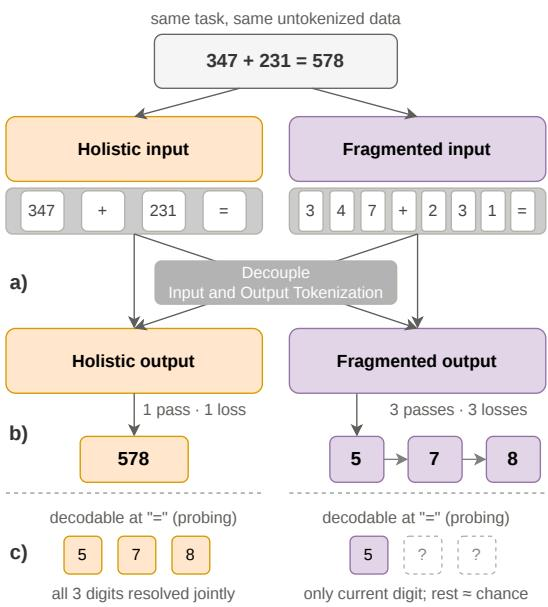  
Figure 1: We argue that tokenization in transformer models provides a supervision signal, because it determines the output granularity and thus the task to be solved per forward pass. We support our argument with experimental evidence where we (a) decouple input from output tokenization to demonstrate that differences in (b) learning task difficulty and (c) model internal representations are due to the output tokenization scheme.

The reason is straightforward: In autoregressive training, the model produces a distribution over the next token at each step, and the training loss is computed over exactly that token. Output token boundaries therefore define the atomic unit of supervision, and the granularity of the tokenizer determines the granularity of the learning problem the model is trained to solve. A model that must emit a coarser output token faces a fundamentally different learning problem compared to one that emits the same output at finer token granularity, even when the untokenized ground truth is shared between both learning problems.

We argue that this output supervision view is an important missing piece to understand why tokenization consistently affects model performance, which has been empirically observed across arithmetic (Singh and Strouse, 2024; Zhou et al., 2024b; Zhang et al., 2025), temporal reasoning (Bhatia et al., 2025), code analysis (Mostafa et al., 2025), genomics (Lindsey et al., 2025), and is actively discussed for morphology (García et al., 2025; Dang et al., 2025; Arnett and Bergen, 2025). Throughout, tokenization is largely viewed as a matter of input representation, and the supervision perspective has not been examined directly.

Interestingly, in supervised learning, the granularity of the prediction target is uncontroversially an important task design decision: a model trained to predict word-level labels and one trained to predict character-level labels are not solving the same problem (Søgaard and Goldberg, 2016), and models trained on coarser targets learn coarser, less discriminative representations than those trained on fine-grained ones (Chen et al., 2018).

In this paper we develop a conceptual framework for tokenization as output supervision in autoregressive decoder models, and show that tokenizer granularity shapes task performance, training dynamics, and model-internal representations. We build the argument in three steps, using arithmetic as a controlled testbed. First, we replicate the wellestablished finding that tokenization affects task performance and training dynamics, and show, via a novel decoupling of input and output tokenization, that this effect is driven by the output side. Models sharing an output tokenization regime behave alike regardless of how their inputs are encoded. Second, we ask whether output supervision also shapes what models internally represent. We propose the minimal computation hypothesis: models resolve what their output supervision requires, and are under no direct pressure to resolve more. Probing confirms this, but also exposes a tension. A task can require future information that the loss at that position never rewards, and we find models partially resolve such information anyway. We discuss whether this gap between what training rewards and what a task requires may be part of why some learning problems are much harder than they look. Third, we examine what this means in practice. Production LLMs differ in tokenization granularity, so comparing them means comparing models trained under different output supervision regimes. As a case study we survey 120 recent \*CL papers on numeric reasoning and find that fewer than 10% report numeric tokenization granularity, while 69% compare models across regimes without noting it. Conclusions attributed to numeric reasoning ability may thus partly reflect differences in task definition.

## 2 A New Perspective: Tokenization Defines the Task to Solve

We develop our argument through the lens of tokenization of integers, which provides a well-defined testbed. The theoretical argument generalizes to any domain where tokens have internal compositional structure, as we discuss in Section 6.

We distinguish two idealised tokenization regimes. Under holistic tokenization, a multicomponent unit (such as a multi-digit integer 578 (or a morphologically complex word like unbelievable1)) is represented as a single token ([578]), while underfragmented tokenization, the same multi-component unit is decomposed into multiple tokens ([5, 7, 8]), according to its subcomponents (here, digits, or in the case of [un, believ, able] into morphemes)2. In practice, holistic tokenization is an idealization, and what matters is the granularity of fragmentation, i.e., how coarsely a unit is segmented relative to its compositional structure.

## 2.1 Output Tokens as Units of Computation

Most language models are trained autoregressively, producing a distribution over the next token position at each step, i.e., the supervision signal at one time step is exactly one token. Whatever computation is necessary to produce the correct output must be completed within a single forward pass.

Key claim: In autoregressive models, output tokenization determines supervision granularity and thereby shapes training dynamics and internal representations.

Consider a running example of three-digit addition: 347 + 231 = 578. A model with holistic numeric tokenization, as exemplified by Llama 3, Pythia, and OlMo 2 (Grattafiori et al., 2024; Biderman et al., 2023; OLMo et al., 2025), which encode multi-digit integers as single tokens, receives four input tokens ([347, +, 231, =]) and must emit one output token ([578]). A model with fragmented numeric tokenization, exemplified by Qwen 2, Mistral, and Gemma 2 (Yang et al., 2024; Jiang et al., 2023; Team et al., 2024), which tokenize numbers digit-by-digit, receives eight input tokens ([3, 4, 7, +, 2, 3, 1, =]) and emits three output tokens across three successive forward passes ([5, 7, 8]). While the abstract task is identical, the learning problem that is to be solved is fundamentally different.

Under holistic tokenization, the model must jointly determine all three result digits in a single forward pass. The learning signal thus rewards correctness of the complete token 578 and penalizes any error in it, with no signal about which digit contributed to the failure. Under fragmented tokenization, the model only needs to output the first result digit on its first pass; the remaining result digits can be deferred, and computed with previously generated digits available as context. This encourages a step-wise computation, building the output one position at a time with position-specific learning signals at each step3.

This difference in granularity has a direct consequence for the structure of the supervision, while not affecting the overall probability of producing the correct result. Restricted to valid result tokens, a random baseline scores 1/10 per forward pass under fragmented tokenization versus 1/1000 under holistic tokenization. End-to-end the two are matched: emitting the full result at random succeeds with probability $( 1 / 1 0 ) ^ { 3 } = 1 / 1 0 0 0$ in both regimes. What differs is how that difficulty is distributed across the supervision signal. Holistic supervision computes a single loss over the atomic token 578, so an error carries no information about which digit was responsible and awards no partial credit for the digits that were correct. Fragmented supervision decomposes the same target into three 10-way predictions, each with its own loss, giving position-specific credit assignment and an objective that can be satisfied one digit at a time. The two conditions are therefore not two presentations of the same problem, but structurally different learning problems that happen to share a ground truth in the untokenized data.

We do not claim that output tokenization is the sole determinant of what a model learns. Architecture, training data, optimizer, and model scale all shape learned representations. Our claim is narrower: output token granularity defines a constraint on what the model must resolve per forward pass, and this constraint leaves a detectable signature in task performance and internal representations that has been systematically overlooked.

## 2.2 The Minimal Computation Hypothesis

The output supervision view of tokenization makes a concrete prediction about internal representations. At a given position, the loss supervises exactly one token. Under fragmented supervision, it therefore rewards the current output sub-component and nothing beyond it. For example, for an input [3, 4, 7, +, 2, 3, 1, =] producing [5] is rewarded, while there is no gradient reward (nor penalty) for already ‘knowing’ subsequent result digits 7 and 8. We hypothesize that models resolve what their output supervision demands and are under no direct pressure to resolve more, and call this the minimal computation hypothesis.

This hypothesis is a claim about what training rewards, and not necessarily about what a model is capable of representing. Where the task itself demands more than the loss rewards at a given position, an interesting tension arises; we return to this in Section 6.1.

Predictions. The minimal computation hypothesis makes two concrete, falsifiable predictions about internal representations of autoregressive decoder models. First, under fragmented supervision, only the currently required output sub-component (result digit 5 in our running example) should be ‘internally generated’ by the model and therefore decodable from intermediate representations; subsequent sub-components (result digits 7 and 8) should remain at chance level when probed. Second, under holistic supervision, all sub-components (result digits 5, 7, and 8 in our running example) must be resolved simultaneously as a single token 578 because all of them are required for the token to be generated, and should therefore all be decodable from the residual stream.

## 3 Controlled Evidence for the Output Supervision View

We present experimental evidence for our claim that tokenization is output supervision in three steps: Using a minimal example, we show that tokenization affects task performance and training dynamics (Section 3.2). We then show through a novel decoupling of input and output tokenization that this effect is driven primarily by the output side (Section 3.3). Finally, we use probing classifiers to test the minimal computation hypothesis (Section 3.4).

## 3.1 Experimental Setup, Architecture, Data and Training

We train small decoder-only transformer models on 3-digit integer addition $( \mathrm { e } . \mathrm { g } . , 3 4 7 + 2 3 1 = 5 7 8 )$ from scratch, identical in architecture (4 layers, $d _ { \mathrm { m o d e l } } = 2 5 6$ , 4 attention heads), training data, and optimizer, differing only in how numbers are tokenized. All models share a joint vocabulary of 1003 tokens: the integers 0–999, plus +, =, and PAD. The tokenization conditions differ only in which subset of integer tokens they use: fragmented models represent each digit as its own token, drawing only from $0 , . . . , 9 ;$ holistic models represent each threedigit number as a single token, drawing from the full range $0 , . . . , 9 9 9 ^ { 4 }$ . Models are trained for 200,000 steps with a batch size of 256, across 10 random seeds and a grid of learning rates and weight decays. Full architecture and training details are provided in Appendix A.

We adopt little-endian digit order, encoding numbers least-significant digit first $( \mathbf { e . g . , 3 4 7 + 2 3 1 } =$ 578 is reversed and becomes $7 4 3 + 1 3 2 = 8 7 5 )$ This makes addition strictly left-to-right, so each output digit can be computed without needing information from future result digits. Gradient reward and task requirement thus coincide, which makes this the cleanest case for the argument we develop.

## 3.2 Tokenization Affects Task Performance

We train two models $\mathrm { M _ { F } }$ withfragmented tokenization and $\mathrm { M _ { H } }$ with holistic tokenization. Figure 2 shows training loss and evaluation accuracy for the best hyperparameter setting across seeds. $\mathrm { M _ { F } }$ converges reliably and fast across all seeds; $\mathrm { M _ { H } }$ does not converge reliably and achieves substantially lower accuracy: Predicting the whole number in one go is apparently a much harder task. Results across all hyperparameter settings are provided in Appendix B.

This replicates the well-established finding that tokenization affects task performance. Viewed through the lens of output supervision, the reason is already visible in the task structure: as predicted in Section 2.1, the two tokenization regimes differ dramatically in the difficulty of the task they introduce, as generating the whole 3-digit integer at once is much harder than generating it digit by digit. Importantly, we do not take this as evidence that fragmented tokenization is superior; our goal is to isolate what drives the difference.

## 3.3 Output Tokenization Affects Task Performance

To isolate whether the performance difference is due to input representation or output supervision, we decouple input and output tokenization using a factorial design. For that we train two additional models, $\mathrm { M } _ { \mathrm { F _ { i n } , H _ { o u t } } }$ with fragmented input and holistic output tokenization $( [ 3 , 4 , 7 , + , 2 , 3 , 1 , = , 5 7 8 ] )$ , and $\mathrm { M _ { H _ { i n } , F _ { o u t } } }$ with holistic input andfragmented output tokenization $( [ 3 4 7 , + , 2 3 1 , = , 5 , 7 , 8 ] )$ . By comparing $\mathrm { M } _ { \mathrm { F _ { i n } , H _ { o u t } } }$ and $\mathrm { M } _ { \mathrm { H } _ { \mathrm { i n } } , \mathrm { F } _ { \mathrm { o u t } } }$ to $\mathrm { M _ { F } }$ and $\mathrm { M _ { H } }$ with respect to task performance and training dynamics, we are able to observe whether models behave more similarly if they share output or input tokenization regime. If output tokenization is the main driver for task performance, as we predict, conditions sharing an output tokenization regime should show similar task performance and training dynamics (denoted by ≃) regardless of input encoding (i.e., we expect: $\mathrm { M _ { F } \simeq M _ { H _ { i n } , F _ { o u t } } }$ and $\mathrm { M _ { H } } \simeq \mathrm { M _ { F _ { i n } , H _ { o u t } } } )$

The tokenization decoupling is implemented at the data level, with input operands and output results tokenized by separate functions, drawing from the shared vocabulary introduced in Section 3.1. Cross-entropy loss is computed only over output tokens (i.e., all tokens after the = sign) so the gradient signal received during training is determined entirely by output tokenization.

Figure 3 shows training loss and evaluation accuracy for the best hyperparameter setting across seeds. As predicted, models sharing an output tokenization regime have similar task performance and training dynamics, i.e., indeed $\mathrm { M _ { F _ { i n } , H _ { o u t } } \simeq M _ { H } }$ and $\mathrm { M _ { H _ { i n } , F _ { o u t } } \simeq M _ { F } }$ . The granularity of output tokenization, regardless of how the inputs are encoded, thus determines training dynamics and task

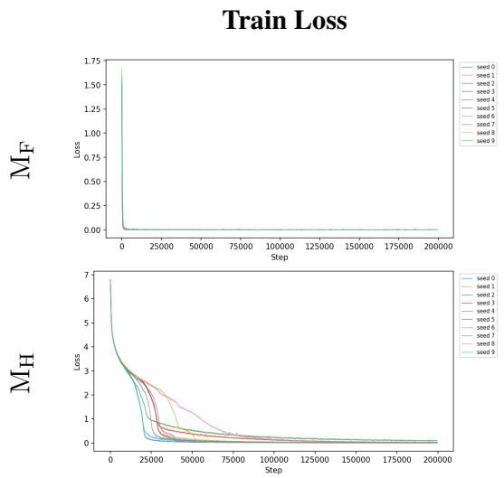

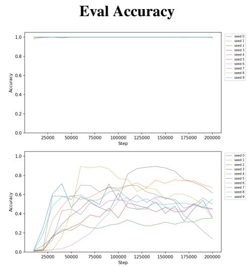  
Figure 2: Training Loss and Evaluation Accuracy across seeds for the best hyperparameter setting $( \mathrm { l r : = 0 . 0 0 0 1 }$ , wd $: = 0 . 0 1 $ of $\mathrm { M _ { F } }$ and $\mathrm { M _ { H } . \mathrm { M _ { F } } }$ reliably reaches ceiling accuracy and converges fast. $\mathrm { M _ { H } }$ does not converge reliably across seeds and reaches lower accuracy. Results for all hyperparameter settings in Appendix B.

performance.

## 3.4 Output Tokenization Shapes Model Internals

Having established that output tokenization drives task performance, we ask whether output tokenization also shapes model internal representations, as predicted by the minimal computation hypothesis. Specifically, a model with fragmented output tokenization is predicted to have no gradient pressure to represent future result digits in the littleendian number convention. For example, for an input $" 3 4 7 + 2 3 1 = "$ (irrespective of whether it is tokenized in a fragmented way [3, 4, 7, +, 2, 3, 1, =] or tokenized in a holistic way [347, +, 231, =]) the minimal computation hypothesis predicts that the model has only resolved the first result digit 5, but not subsequent result digits 7 and 8. If this is the case only the result digit 5 should be represented within the model. In contrast, a model trained with holistic output tokenization has to generate the whole number 578, and thus the individual result digits should be represented within the model.

We test this prediction of result-digit availability with probing classifiers. Linear probes are trained on residual stream activations at the = token position, i.e., the point at which the model must have assembled all information necessary to begin generating output. For each condition we use the five checkpoints with highest task accuracy (Table 1), and train separate probes for each digit position of the result (units, tens, hundreds) at each layer. Details and results of MLP probes and circular probes (Nanda et al., 2023), which tell the same qualitative story, as well as details on the selected model checkpoints are provided in Appendix C.

<table><tr><td>Condition</td><td>Exact Match</td><td>Hundreds</td><td>Tens</td><td>Units</td></tr><tr><td>MF</td><td>1.000</td><td>1.000</td><td>1.000</td><td>1.000</td></tr><tr><td rowspan="3"> $\mathrm { M } _ { \mathrm { F _ { i n } , H _ { o u t } } }$ </td><td>±.000</td><td>±.000</td><td>±.000</td><td>±.000</td></tr><tr><td>0.989</td><td>0.997</td><td>0.993</td><td>0.998</td></tr><tr><td>±.012</td><td>±.004</td><td>±.012</td><td>±.002</td></tr><tr><td> $\mathrm { M } _ { \mathrm { H } _ { \mathrm { i n } } , \mathrm { F } _ { \mathrm { o u t } } }$ </td><td>0.986</td><td>0.999</td><td>0.994</td><td>0.992</td></tr><tr><td rowspan="3"> $\mathrm { M _ { H } }$ </td><td>±.009</td><td>±.001</td><td>±.006</td><td>±.007</td></tr><tr><td>0.853</td><td>0.964</td><td>0.922</td><td>0.857</td></tr><tr><td>±.050</td><td>±.012</td><td>±.018</td><td>±.050</td></tr></table>

Table 1: Evaluation accuracy on a held-out random test set (500 samples), mean ± standard deviation across the model checkpoints probes are trained on. Per-digit accuracy reports the fraction of examples where each digit position of the result is correct.

Figure 4 shows linear probe accuracy for each digit position across layers. Under fragmented output tokenization $( \mathrm { M _ { F } , \ : M _ { H _ { i n } , F _ { o u t } } ) }$ , only the first result digit (units) is decodable. The tens and hundreds digits remain near chance at every layer. This is what the minimal computation hypothesis predicts: the model does not develop representations for output sub-components it is not yet supervised to produce. Under holistic output tokenization $( \mathrm { M _ { H } , \ M _ { F _ { i n } , H _ { o u t } } ) }$ , all three result digits become available by the last layer. In one fell swoop, the model is forced to jointly resolve the full result in a single forward pass, and its internal representations reflect this from the earliest layers. Crucially, this pattern tracks the output axis of the factorial design, not the input axis $( \mathrm { M _ { F } \simeq M _ { H _ { i n } , F _ { o u t } } }$ $\mathrm { M _ { H } ~ \simeq ~ \mathrm { M _ { F _ { i n } , H _ { o u t } } ) } }$ , i.e., what the model internally resolves is determined by output tokenization. Fragmented output tokenization induces a genuinely sequential task. The model does not merely emit digits one at a time, it computes them one at a time, not representing future output components until the supervision signal demands them. Holistic output tokenization induces the opposite, a parallel task in which all sub-components must be jointly resolved from the start.

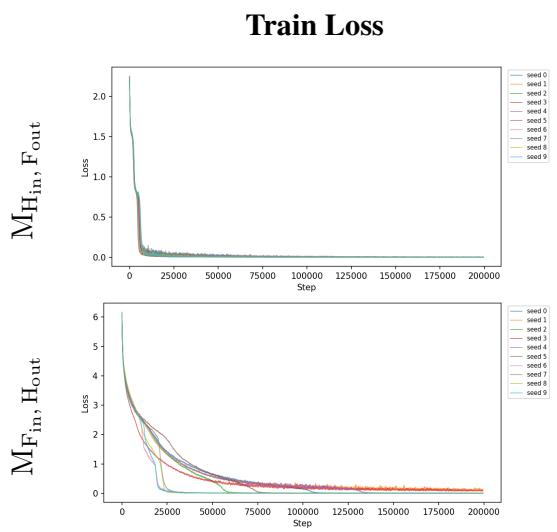

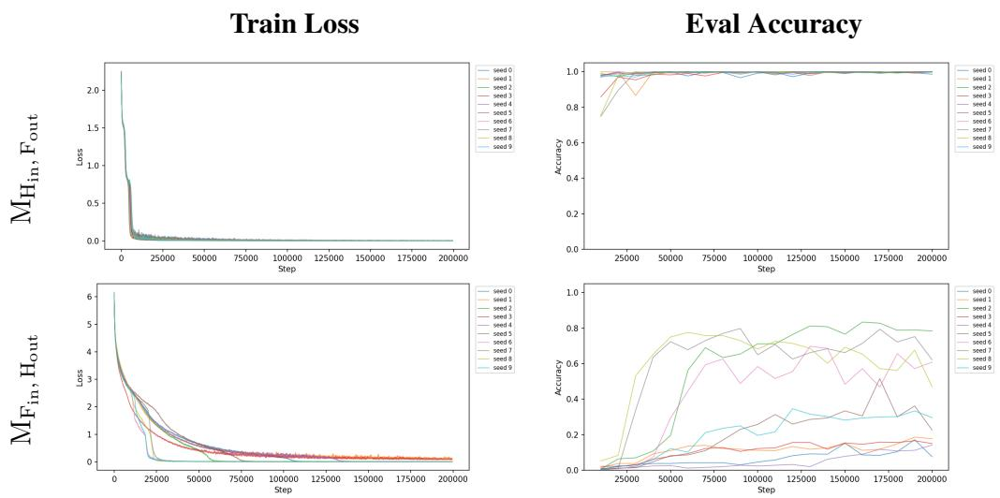

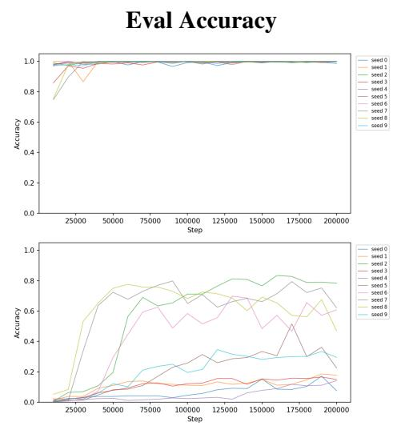  
Figure 3: Training Loss and Evaluation Accuracy across seeds for the best hyperparameter setting $( \mathrm { l r : = 0 . 0 0 0 1 }$ , wd $: = 0 . 0 1 )$ of $\mathrm { M } _ { \mathrm { H } _ { \mathrm { i n } } , \mathrm { F } _ { \mathrm { o u t } } }$ and $\mathrm { M } _ { \mathrm { F _ { i n } , H _ { o u t } } } .$ Training loss trajectory and evaluation accuracy are comparable between $\mathrm { M } _ { \mathrm { F _ { \mathrm { i n } } , \mathrm { H } _ { \mathrm { o u t } } } }$ and M , and between $\mathrm { M } _ { \mathrm { H } _ { \mathrm { i n } } , \mathrm { F } _ { \mathrm { o u t } } }$ and $\mathrm { M _ { F } }$ , confirming that output tokenization affects task performance. Results for all hyperparameter settings in Appendix B.

## 4 Tokenization Goes Unreported: A Survey of Reporting Practice

## 4.1 Motivation

We have established that tokenization defines the supervision regime a model is trained under. Production LLMs differ systematically in numeric tokenization granularity. Comparing such models on arithmetic benchmarks therefore inevitably means comparing models trained under different output supervision regimes even if they were trained on comparable (prior to tokenization) data. This section documents that this is widely unacknowledged in the \*CL community.

## 4.2 Method

We extract all papers published to the main or findings tracks of ACL, EMNLP, NAACL, and EACL in 2024 and 2025 whose titles contain math, numer (such as in numeric), number, or arithmetic, manually filtering for topical fit (excluding e.g. task arithmetic, social numeracy). This retrieves 120 papers on mathematical or numeric reasoning. For each, we search the full text for the substring token and manually determine whether the distinction between digit-level and multi-digit numeric tokenization is explicitly mentioned and whether crossmodel comparisons account for it. Full methodology and inclusion criteria are provided in Appendix E.

## 4.3 Results

Fewer than 1 in 10 papers (11/120, 9.2%) explicitly mention the numeric tokenization strategy of the models they evaluate. Of the remaining 109, 83 actively compare models across fragmented and holistic tokenization without flagging it or controlling for supervision regime; 20 evaluate only one type without justifying the restriction; 6 are unresolvable due to closed-source or undisclosed tokenizers. Notably, even among the 11 papers that do mention tokenization, none frames the distinction in terms of output supervision, i.e., the consistent framing, when tokenization appears at all, is as an input representation choice. The most consequential figure is the 83 papers that compare models across incompatible supervision regimes without flagging it, risking conflation of differences in task definition with differences in reasoning ability.

Implications. When a paper reports that model A outperforms model B on an arithmetic benchmark, and A uses holistic output tokenization while B uses fragmented output tokenization, the comparison does not support a conclusion about reasoning ability alone, but conflates reasoning ability with supervision regime. This is not a flaw in the analysis of any individual paper, but reflects a systematic gap in reporting practice. The practical impact of this omission will vary, in some comparisons the supervision regime difference may be small, in others decisive, but it cannot be assessed without reporting. We thus propose that tokenization strategy should be reported as a standard model descriptor alongside architecture, parameter count, and training data. More broadly, this case illustrates that benchmark comparisons between models can conflate task performance with task definition when models differ along dimensions that restructure the learning problem. Claims about progress that do not account for such structural differences risk measuring the difficulty of the learning problem as much as the capability of the model.

Fragmented Output  
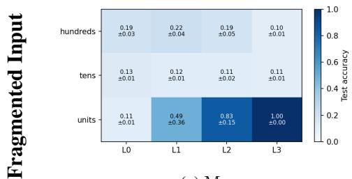  
(a) MF

Holistic Output  
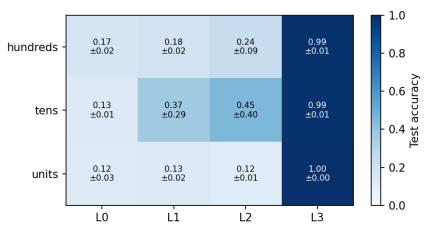

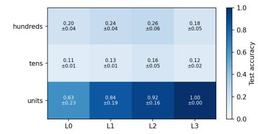  
(c) $\mathrm { M } _ { \mathrm { H } _ { \mathrm { i n } } , \mathrm { F } _ { \mathrm { o u t } } }$

(b) MFin, Hout  
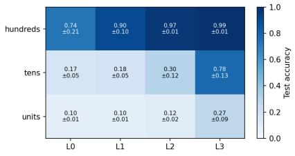  
(d) MH  
Figure 4: Linear probe accuracy for individual result digits across layers. Values are mean probe accuracy ± standard deviation across the five probes trained per condition. At Layer 3, models with holistic output tokenization simultaneously encode all three digit positions5; models with fragmented output tokenization encode the first digit (unit digit, due to little endian convention), with subsequent digit positions remaining closer to chance across layers.

## 5 Related Work

Tokenization and Task Performance. Subword tokenization is standard in NLP (Sennrich et al.,

2016; Kudo and Richardson, 2018) and is treated almost universally as an input preprocessing decision, including in work on what makes tokenizers effective, which examines compression (Goldman et al., 2024; Schmidt et al., 2024) and vocabulary design (Ali et al., 2024; Lotz et al., 2025; Chizhov et al., 2024). He et al. (2020) is a notable exception, treating source and target segmentation as distinct problems in machine translation, but motivates this by translation quality rather than by claims about what models learn. Schmidt et al. (2024) explicitly ask what makes tokenization effective beyond compression but do not look at the output side.

Prior work further documents that tokenization affects outcomes across arithmetic (Singh and Strouse, 2024; Zhou et al., 2024b; Zhang et al., 2025), temporal reasoning (Bhatia et al., 2025), code analysis (Mostafa et al., 2025), genomics (Lindsey et al., 2025), and against tokenization bias more broadly (Phan et al., 2024). Morphology is the contested case. Whether morphologically complex languages are harder to model is itself disputed (Cotterell et al., 2018; Gerz et al., 2018; Park et al., 2021), and results on tokenization’s role are mixed: García et al. (2025) report gains from morphology-aware tokenization for Spanish, while Dang et al. (2025) find comparable average performance between subword and character-level tokenization across 17 languages, and Arnett and

Bergen (2025) find no support for morphological alignment as an explanation for cross-linguistic performance gaps. Poelman et al. (2025) attribute the conflicting evidence to confounds in experimental setup, a diagnosis that parallels our own. We therefore treat morphology as motivating the generality of our framing rather than as evidence for it.

Supervision Granularity in Non-Autoregressive Settings. In supervised learning, prediction target granularity shapes learned representations: coarser labels yield coarser features (Chen et al., 2018), and in multi-task NLP, auxiliary supervision granularity determines what representations emerge and at what depth (Søgaard and Goldberg, 2016).

Internal Mechanisms of Arithmetic. Recent work has investigated numeric tokenization effects on numeric representations and reasoning mechanisms in LLMs (Levy and Geva, 2025; Baeumel et al., 2025a,b). Baeumel et al. (2025a) find that models with coarse numeric tokenization develop three digit-position-specific processing pathways while those with digit-wise tokenization develop only one. We hypothesize that this pattern is a consequence of output supervision regime.

## 6 Discussion

## 6.1 Gradient Reward versus Task Requirement: The Big-endian Case

A natural objection to the minimal computation hypothesis is that autoregressive models are already known to represent information about tokens beyond the immediate next one (Shai et al., 2024; Wu et al., 2024a; Pal et al., 2023). This is not a contradiction, but it does require a distinction about whether a task requires more than its loss rewards. Gradient reward is what the loss actually supervises at a given position, i.e., exactly the current output token. Task requirement is what must in fact be resolved to produce that token correctly.

To separate gradient reward and task requirement, we repeat our experiments in big-endian digit order, where carry information propagates right to left, so the first result digit cannot be reliably predicted without resolving whether a carry arrives from digits that are supervised only later. Gradient reward is unchanged (one token at a time) while the task requirement now extends beyond it. We therefore expect above-chance decodability of future result digits in the fragmented output conditions $( \mathrm { M _ { F } , M _ { H _ { i n } , F _ { o u t } } ) }$ , despite the absence of gradient pressure to represent them. Training and probing details and results are in Appendix D. Our results support this hypothesis: In fragmented output models that solve the big-endian task with high accuracy (Table 3), future result digits become decodable well above chance. Relative to littleendian, final-layer linear probe accuracy for the second result digit rises from $0 . 1 1  0 . 2 9 ( \mathrm { M } _ { \mathrm { F } } )$ and $0 . 1 2  0 . 6 9 ( \mathrm { M } _ { \mathrm { H } _ { \mathrm { i n } } , \mathrm { F } _ { \mathrm { o u t } } } )$ , and for the third result digit from 0.10 → 0.13 and $0 . 1 8  0 . 5 6$ Decodability is consistently higher for the adjacent digit than for the more distant one, consistent with a carry from the adjacent position affecting the current digit more often.

Objection and hypothesis thus simultaneously hold: gradient reward tracks only the current token, and task-forced lookahead is represented anyway. The pattern is in line with the breadcrumbs hypothesis (Wu et al., 2024a) which predicts that future information is represented because it is already beneficial to the current generation step. Carry information is decodable not because the model set out to represent “the tens digit”, but because the currently-due digit cannot be computed without it.

This leaves a gap between what training rewards and what a task requires. Anything falling into it must be acquired as a byproduct of getting the currently-rewarded token right, with no gradient insisting it be done completely or robustly. This gap is not unique to addition; any output tokenization whose granularity is misaligned with the dependencies the task requires (e.g., long-range syntactic dependencies) will face the same problem. Tokenization therefore determines not only what a model is trained to output, but which parts of the task it is ever directly accountable for. Whether the size of this gap predicts where lookahead-dependent tasks become brittle - with the systematic lookahead limitation reported for LLMs (Baeumel et al., 2025b) as one candidate - is a testable consequence of reading tokenization as supervision that we leave to future work.

## 6.2 Does the Output Supervision View Hold at Production Scale?

Our controlled experiment requires training from scratch, as we vary input and output tokenization independently. Production-scale LLMs share a single tokenizer across input and output and cannot be manipulated in this way. The core argument is scale-independent: autoregressive training computes loss over output tokens regardless of model size, so the supervision impact of output token granularity holds at any scale. There is indirect evidence of tokenization granularity affecting learned task granularity in LLMs. Baeumel et al. (2025a) find that production-scale LLMs with holistic numeric tokenization develop three digit-position-specific arithmetic circuits while those with fragmented numeric tokenization develop only one. The evidence is indirect because these models share a single tokenizer across input and output, so output supervision cannot be isolated from input representation. Direct evidence at scale remains future work. More broadly, a substantial body of work documents that tokenization affects arithmetic performance in frontier LLMs (Singh and Strouse, 2024; Zhou et al., 2024b; Zhang et al., 2025). These studies treat tokenization as an input-side variable and do not isolate output supervision as the responsible factor. Our framework offers an explanation: performance differences between models with holistic and fragmented tokenization may reflect differences in the task each model was trained to solve, not just differences in input representation.

## 6.3 Does the Output Supervision View Extend Beyond Arithmetic?

Arithmetic serves as our proof of concept, but we expect the output supervision view of tokenization to extend to domains where output tokens have internal compositional structure. A model that emits a morphologically complex word as a single token faces a different learning problem than one that emits its morphemes. The same holds for date expressions in temporal reasoning and for identifiers and literals in code generation. Prior work investigates tokenization effects in exactly these domains: date expressions as a bottleneck for temporal reasoning (Bhatia et al., 2025) and code analysis (Mostafa et al., 2025), where the that is established but the why is not. For morphology the picture is less settled (Section 5), and the studies closest to our framing evaluate encoder-only (García et al., 2025) or encoder-decoder (Dang et al., 2025) models rather than decoder-only ones. Our framework supplies a candidate explanation: performance differences reflect differences in output supervision regime, which induce structurally different learning problems. Whether this explanation accounts for the documented effects, and whether the representational signatures we observe in arithmetic replicate in these domains, remains an open empirical question for future work.

## 7 Conclusion

Tokenization is typically treated as a preprocessing decision made once, upstream of everything else that matters. We argue that because autoregressive language models are trained to predict output tokens, tokenizer granularity determines the unit of supervision during training. Tokenization thus shapes not only how inputs are represented, but also what problem the model is trained to solve.

Using arithmetic as a controlled testbed, our 2x2 factorial experiment decoupling input and output tokenization shows that output tokenization drives differences in task performance and training dynamics. We develop the minimal computation hypothesis, confirm it via probing, and use it to expose a tension between what training rewards and what a task requires when the task demands lookahead. Our survey of 120 recent publications documents how widely the potential impact of tokenization regimes goes unnoticed: fewer than 10% of papers on mathematical reasoning in LLMs report tokenization strategies, while the majority draw conclusions about reasoning ability from comparisons that risk conflating task definition with task performance.

We draw three concrete consequences for practice. First, output tokenization regime on taskrelevant tokens (e.g., numerical tokenization for math, morphological tokenization for morphology) should be reported as a standard model descriptor alongside architecture, parameter count, and training data, echoing recent calls to treat tokenization as a modeling decision (Alqahtani et al., 2026). Second, capability comparisons should where possible be stratified by output supervision regime. Third, mechanistic claims about how models internally represent structured outputs are claims about a model under a specific supervision regime and should be qualified accordingly.

The output supervision view extends rather than replaces existing perspectives on tokenization, which have focused on input representation, compression, vocabulary construction, and linguistic structure. Recognizing it is a prerequisite for valid cross-model comparison wherever output tokens have internal compositional structure. Given the field’s reliance on benchmark comparisons, this is one place where the validity of those comparisons has been silently assumed rather than established.

## Limitations

Our experiment is limited to three-digit addition with small models trained from scratch. Though we argue that the core argument is scale-independent, we cannot predict the magnitude of the effect of different tokenization strategies on model performance in practice. In the works studied in our survey the confound introduced by cross-tokenizer comparison may be very small in practice in some cases, and meaningful in other work. This is not something we can estimate.

Our argument also concerns standard next-tokenprediction training, where the loss is computed over exactly one output token per position. Post-training objectives that supply intermediate or sequencelevel signal (process supervision, preference optimization over full solutions, RL with outcome rewards), and inference protocols that let a model externalize intermediate results before committing to an answer, change what a model is effectively supervised to resolve per forward pass. How output token granularity interacts with these regimes is beyond the scope of our experiment.

Probing classifiers measure decodability, not presence or absence of information. Our results establish that future digit positions are not geometrically accessible in fragmented models, not that the information is absent. We report MLP probes alongside linear probes to partially address this: if a non-linear probe cannot decode a signal, it is less likely to be present than if only a linear probe fails.

Finally, the survey relies on keyword search over paper titles and manual annotation by the authors, both of which may introduce errors.

## Acknowledgements

We thank Gerrit Großmann and Christian Schuler for their helpful feedback on the paper draft. We further thank Amelie Seyfried for assisting with the tokenization annotation in the literature survey. This research was supported by the German Federal Ministry of Research, Technology and Space (BMFTR) as part of the project TRAILS (01IW24005). AI assistance was used to improve the clarity and fluency of the writing, to help refine phrasing and structure, and to support exploratory literature search and organization. All scientific claims, interpretations, and conclusions remain the responsibility of the authors. We further thank the anonymous reviewers for their helpful comments.

## References

Kawsar Ahmed, Md Osama, Omar Sharif, Eftekhar Hossain, and Mohammed Moshiul Hoque. 2025. Ben-NumEval: A benchmark to assess LLMs’ numerical reasoning capabilities in Bengali. In Findings of the Associationfor Computational Linguistics: ACL 2025, pages 17782–17799, Vienna, Austria. Association for Computational Linguistics.

Mehdi Ali, Michael Fromm, Klaudia Thellmann, Richard Rutmann, Max Lübbering, Johannes Leveling, Katrin Klug, Jan Ebert, Niclas Doll, Jasper Buschhoff, Charvi Jain, Alexander Weber, Lena Jurkschat, Hammam Abdelwahab, Chelsea John, Pedro Ortiz Suarez, Malte Ostendorff, Samuel Weinbach, Rafet Sifa, Stefan Kesselheim, and Nicolas Flores-Herr. 2024. Tokenizer choice for LLM training: Negligible or crucial? In Findings of the Association for Computational Linguistics: NAACL 2024, pages 3907–3924. Association for Computational Linguistics.

Sawsan Alqahtani, Mir Tafseer Nayeem, Md Tahmid Rahman Laskar, Tasnim Mohiuddin, and M Saiful Bari. 2026. Stop taking tokenizers for granted: They are core design decisions in large language models. In Proceedings of the 19th Conference of the European Chapter of the Association for Computational Linguistics (Volume 1: Long Papers), pages 8410–8432, Rabat, Morocco. Association for Computational Linguistics.

Catherine Arnett and Benjamin Bergen. 2025. Why do language models perform worse for morphologically complex languages? In Proceedings of the 31st International Conference on Computational Linguistics, pages 6607–6623, Abu Dhabi, UAE. Association for Computational Linguistics.

Yuya Asano, Diane Litman, and Erin Walker. 2025. Can LLMs simulate the same correct solutions to freeresponse math problems as real students? In Proceedings ofthe 2025 Conference on Empirical Methods in Natural Language Processing, pages 16336–16365, Suzhou, China. Association for Computational Linguistics.

Tanja Baeumel, Daniil Gurgurov, Yusser Al Ghussin, Josef Van Genabith, and Simon Ostermann. 2025a. Modular arithmetic: Language models solve math digit by digit. In Proceedings of the 14th International Joint Conference on Natural Language Processing and the 4th Conference of the Asia-Pacific Chapter of the Association for Computational Linguistics (Findings), pages 1380–1409, Mumbai, India. The Asian Federation of Natural Language Processing and The Association for Computational Linguistics.

Tanja Baeumel, Josef Van Genabith, and Simon Ostermann. 2025b. The lookahead limitation: Why multioperand addition is hard for LLMs. In Proceedings of the 8th BlackboxNLP Workshop: Analyzing and

Interpreting Neural Networks for NLP, pages 250– 262, Suzhou, China. Association for Computational Linguistics.

Ruiqiao Bai, Xue Han, Shuo Lei, Junlan Feng, Yanyan Luo, and Chao Deng. 2025. Self-attention-based graph-of-thought for math problem solving. In Findings of the Association for Computational Linguistics: ACL 2025, pages 6112–6125, Vienna, Austria. Association for Computational Linguistics.

Leonardo Bertolazzi, Philipp Mondorf, Barbara Plank, and Raffaella Bernardi. 2025. The validation gap: A mechanistic analysis of how language models compute arithmetic but fail to validate it. In Proceedings of the 2025 Conference on Empirical Methods in Natural Language Processing, pages 29387–29424, Suzhou, China. Association for Computational Linguistics.

Gagan Bhatia, Maxime Peyrard, and Wei Zhao. 2025. Date fragments: A hidden bottleneck of tokenization for temporal reasoning. In Proceedings of the 2025 Conference on Empirical Methods in Natural Language Processing, pages 3201–3219, Suzhou, China. Association for Computational Linguistics.

Antara Raaghavi Bhattacharya, Isabel Papadimitriou, Kathryn Davidson, and David Alvarez-Melis. 2025. Investigating the interaction of linguistic and mathematical reasoning in language models using multilingual number puzzles. In Proceedings of the 2025 Conference on Empirical Methods in Natural Language Processing, pages 28322–28332, Suzhou, China. Association for Computational Linguistics.

Stella Biderman, Hailey Schoelkopf, Quentin Gregory Anthony, Herbie Bradley, Kyle O’Brien, Eric Hallahan, Mohammad Aflah Khan, Shivanshu Purohit, Usvsn Sai Prashanth, Edward Raff, Aviya Skowron, Lintang Sutawika, and Oskar Van Der Wal. 2023. Pythia: A suite for analyzing large language models across training and scaling. In Proceedings of the 40th International Conference on Machine Learning, volume 202 of Proceedings of Machine Learning Research, pages 2397–2430. PMLR.

Pedro Calais, Gabriel Franco, Zilu Tang, Themistoklis Nikas, Wagner Meira Jr., Evimaria Terzi, and Mark Crovella. 2025. Disentangling text and math in word problems: Evidence for the bidimensional structure of large language models’ reasoning. In Findings of the Associationfor Computational Linguistics: ACL 2025, pages 12671–12688, Vienna, Austria. Association for Computational Linguistics.

Lang Cao, Yingtian Zou, Chao Peng, Renhong Chen, Wu Ning, and Yitong Li. 2025. Step guided reasoning: Improving mathematical reasoning using guidance generation and step reasoning. In Proceedings of the 2025 Conference on Empirical Methods in Natural Language Processing, pages 21101–21118, Suzhou, China. Association for Computational Linguistics.

Changyu Chen, Xiting Wang, Ting-En Lin, Ang Lv, Yuchuan Wu, Xin Gao, Ji-Rong Wen, Rui Yan, and Yongbin Li. 2024a. Masked thought: Simply masking partial reasoning steps can improve mathematical reasoning learning of language models. In Proceedings ofthe 62nd Annual Meeting ofthe Association for Computational Linguistics (Volume 1: Long Papers), pages 5872–5900, Bangkok, Thailand. Association for Computational Linguistics.

Chung-Chi Chen, Hiroya Takamura, Ichiro Kobayashi, and Yusuke Miyao. 2024b. The impact of language on arithmetic proficiency: A multilingual investigation with cross-agent checking computation. In Proceedings ofthe 2024 Conference ofthe North American Chapter ofthe Associationfor Computational Linguistics: Human Language Technologies (Volume 2: Short Papers), pages 631–637, Mexico City, Mexico. Association for Computational Linguistics.

Guoxin Chen, Minpeng Liao, Chengxi Li, and Kai Fan. 2024c. Step-level value preference optimization for mathematical reasoning. In Findings of the Associationfor Computational Linguistics: EMNLP 2024, pages 7889–7903, Miami, Florida, USA. Association for Computational Linguistics.

Nuo Chen, Ning Wu, Jianhui Chang, Linjun Shou, and Jia Li. 2024d. ControlMath: Controllable data generation promotes math generalist models. In Proceedings ofthe 2024 Conference on Empirical Methods in Natural Language Processing, pages 12201–12217, Miami, Florida, USA. Association for Computational Linguistics.

Nuo Chen, Zinan Zheng, Ning Wu, Ming Gong, Dongmei Zhang, and Jia Li. 2024e. Breaking language barriers in multilingual mathematical reasoning: Insights and observations. In Findings ofthe Association for Computational Linguistics: EMNLP 2024, pages 7001–7016, Miami, Florida, USA. Association for Computational Linguistics.

Zhuo Chen, Ruizhou Ding, Ting-Wu Chin, and Diana Marculescu. 2018. Understanding the impact of label granularity on cnn-based image classification. In 2018 IEEE International Conference on Data Mining Workshops (ICDMW), pages 895–904.

Zhuofan Chen, Jiyuan He, Yichi Zhang, Xing Hu, Haoxing Wen, Jun Bai, and Wenge Rong. 2025. CogAtom: From cognitive atoms to olympiad-level mathematical reasoning in large language models. In Findings of the Association for Computational Linguistics: EMNLP 2025, pages 24108–24125, Suzhou, China. Association for Computational Linguistics.

Ziling Cheng, Meng Cao, Leila Pishdad, Yanshuai Cao, and Jackie CK Cheung. 2025. Can LLMs reason abstractly over math word problems without CoT? disentangling abstract formulation from arithmetic computation. In Proceedings ofthe 2025 Conference on Empirical Methods in Natural Language Processing, pages 14306–14333, Suzhou, China. Association for Computational Linguistics.

Pavel Chizhov, Catherine Arnett, Elizaveta Korotkova, and Ivan P. Yamshchikov. 2024. BPE gets picky: Efficient vocabulary refinement during tokenizer training. In Proceedings of the 2024 Conference on Empirical Methods in Natural Language Processing, pages 16587–16604, Miami, Florida, USA. Association for Computational Linguistics.

Bryan R Christ, Zachary Gottesman, Jonathan Kropko, and Thomas Hartvigsen. 2025. Math neurosurgery: Isolating language models’ math reasoning abilities using only forward passes. In Proceedings of the 63rd Annual Meeting of the Association for Computational Linguistics (Volume 1: Long Papers), pages 24803–24840, Vienna, Austria. Association for Computational Linguistics.

Alessio Cocchieri, Luca Ragazzi, Giuseppe Tagliavini, Lorenzo Tordi, Antonella Carbonaro, and Gianluca Moro. 2025. Can large language models win the international mathematical games? In Proceedings of the 2025 Conference on Empirical Methods in Natural Language Processing, pages 9645–9671, Suzhou, China. Association for Computational Linguistics.

Ryan Cotterell, Sabrina J. Mielke, Jason Eisner, and Brian Roark. 2018. Are all languages equally hard to language-model? In Proceedings of the 2018 Conference of the North American Chapter of the Associationfor Computational Linguistics: Human Language Technologies, Volume 2 (Short Papers), pages 536–541, New Orleans, Louisiana. Association for Computational Linguistics.

Thao Anh Dang, Limor Raviv, and Lukas Galke. 2025. Tokenization and morphology in multilingual language models: A comparative analysis of mT5 and ByT5. In Proceedings ofthe 8th International Conference on Natural Language and Speech Processing (ICNLSP-2025), pages 242–257, Southern Denmark University, Odense, Denmark. Association for Computational Linguistics.

Arash Gholami Davoodi, Seyed Pouyan Mousavi Davoudi, and Pouya Pezeshkpour. 2025. LLMs are not intelligent thinkers: Introducing mathematical topic tree benchmark for comprehensive evaluation of LLMs. In Proceedings of the 2025 Conference ofthe Nations ofthe Americas Chapter ofthe Associationfor Computational Linguistics: Human Language Technologies (Volume 1: Long Papers), pages 3127–3140, Albuquerque, New Mexico. Association for Computational Linguistics.

Xiang Fei, Jinghui Lu, Qi Sun, Hao Feng, Yanjie Wang, Wei Shi, An-Lan Wang, Jingqun Tang, and Can Huang. 2025. Advancing sequential numerical prediction in autoregressive models. In Proceedings of the 63rd Annual Meeting of the Association for Computational Linguistics (Volume 2: Short Papers), pages 562–574, Vienna, Austria. Association for Computational Linguistics.

Guhao Feng, Kai Yang, Yuntian Gu, Xinyue Ai, Shengjie Luo, Jiacheng Sun, Di He, Zhenguo Li,

and Liwei Wang. 2025. How numerical precision affects arithmetical reasoning capabilities of LLMs. In Findings ofthe Associationfor Computational Linguistics: ACL 2025, pages 46–85, Vienna, Austria. Association for Computational Linguistics.

Wanyong Feng, Jaewook Lee, Hunter McNichols, Alexander Scarlatos, Digory Smith, Simon Woodhead, Nancy Ornelas, and Andrew Lan. 2024. Exploring automated distractor generation for math multiple-choice questions via large language models. In Findings of the Association for Computational Linguistics: NAACL 2024, pages 3067–3082, Mexico City, Mexico. Association for Computational Linguistics.

Nigel Fernandez, Alexander Scarlatos, Wanyong Feng, Simon Woodhead, and Andrew Lan. 2024. DiVERT: Distractor generation with variational errors represented as text for math multiple-choice questions. In Proceedings of the 2024 Conference on Empirical Methods in Natural Language Processing, pages 9063–9081, Miami, Florida, USA. Association for Computational Linguistics.

Andrew Gambardella, Yusuke Iwasawa, and Yutaka Matsuo. 2024. Language models do hard arithmetic tasks easily and hardly do easy arithmetic tasks. In Proceedings ofthe 62nd Annual Meeting ofthe Associationfor Computational Linguistics (Volume 2: Short Papers), pages 85–91, Bangkok, Thailand. Association for Computational Linguistics.

Bofei Gao, Zefan Cai, Runxin Xu, Peiyi Wang, Ce Zheng, Runji Lin, Keming Lu, Dayiheng Liu, Chang Zhou, Wen Xiao, Tianyu Liu, and Baobao Chang. 2025. LLM critics help catch bugs in mathematics: Towards a better mathematical verifier with natural language feedback. In Findings ofthe Association for Computational Linguistics: ACL 2025, pages 14588–14604, Vienna, Austria. Association for Computational Linguistics.

Alba Táboas García, Piotr Przybyła, and Leo Wanner. 2025. Exploring morphology-aware tokenization: A case study on Spanish language modeling. In Proceedings of the 2025 Conference on Empirical Methods in Natural Language Processing, pages 30505–30518, Suzhou, China. Association for Computational Linguistics.

Daniela Gerz, Ivan Vulic, Edoardo Ponti, Jason Narad-´ owsky, Roi Reichart, and Anna Korhonen. 2018. Language modeling for morphologically rich languages: Character-aware modeling for word-level prediction. Transactions of the Association for Computational Linguistics, 6:451–465.

Omer Goldman, Avi Caciularu, Matan Eyal, Kris Cao, Idan Szpektor, and Reut Tsarfaty. 2024. Unpacking tokenization: Evaluating text compression and its correlation with model performance. In Findings of the Associationfor Computational Linguistics: ACL 2024, pages 2274–2286, Bangkok, Thailand. Association for Computational Linguistics.

Aaron Grattafiori, Abhimanyu Dubey, Abhinav Jauhri, Abhinav Pandey, Abhishek Kadian, Ahmad Al-Dahle, Aiesha Letman, Akhil Mathur, Alan Schelten, Alex Vaughan, et al. 2024. The llama 3 herd of models. arXiv preprint arXiv:2407.21783.

Pei Guo, WangJie You, Juntao Li, Yan Bowen, and Min Zhang. 2024. Exploring reversal mathematical reasoning ability for large language models. In Findings ofthe Associationfor Computational Linguistics: ACL 2024, pages 13671–13685, Bangkok, Thailand. Association for Computational Linguistics.

Xiaotian Han, Yiren Jian, Xuefeng Hu, Haogeng Liu, Yiqi Wang, Qihang Fan, Yuang Ai, Huaibo Huang, Ran He, Zhenheng Yang, and Quanzeng You. 2025. InfiMM-WebMath-40B: Advancing multimodal pretraining for enhanced mathematical reasoning. In Findings ofthe Associationfor Computational Linguistics: EMNLP 2025, pages 14221–14231, Suzhou, China. Association for Computational Linguistics.

Xuanli He, Gholamreza Haffari, and Mohammad Norouzi. 2020. Dynamic programming encoding for subword segmentation in neural machine translation. In Proceedings of the 58th Annual Meeting of the Association for Computational Linguistics, pages 3042–3051, Online. Association for Computational Linguistics.

Pengfei Hong, Navonil Majumder, Deepanway Ghosal, Somak Aditya, Rada Mihalcea, and Soujanya Poria. 2025. Evaluating LLMs’ mathematical and coding competency through ontology-guided interventions. In Findings of the Association for Computational Linguistics: ACL 2025, pages 22811–22849, Vienna, Austria. Association for Computational Linguistics.

Xijie Huang, Li Lyna Zhang, Kwang-Ting Cheng, Fan Yang, and Mao Yang. 2024. Fewer is more: Boosting math reasoning with reinforced context pruning. In Proceedings of the 2024 Conference on Empirical Methods in Natural Language Processing, pages 13674–13695, Miami, Florida, USA. Association for Computational Linguistics.

Hyeonbin Hwang, Doyoung Kim, Seungone Kim, Seonghyeon Ye, and Minjoon Seo. 2024. Selfexplore: Enhancing mathematical reasoning in language models with fine-grained rewards. In Findings of the Association for Computational Linguistics: EMNLP 2024, pages 1444–1466, Miami, Florida, USA. Association for Computational Linguistics.

Kushal Jain, Moritz Miller, Niket Tandon, and Kumar Shridhar. 2025. First-step advantage: Importance of starting right in multi-step math reasoning. In Findings ofthe Associationfor Computational Linguistics: ACL 2025, pages 766–778, Vienna, Austria. Association for Computational Linguistics.

Albert Q. Jiang, Alexandre Sablayrolles, Arthur Mensch, Chris Bamford, Devendra Singh Chaplot, Diego de las Casas, Florian Bressand, Gianna Lengyel, Guillaume Lample, Lucile Saulnier, Lélio Renard Lavaud,

Marie-Anne Lachaux, Pierre Stock, Teven Le Scao, Thibaut Lavril, Thomas Wang, Timothée Lacroix, and William El Sayed. 2023. Mistral 7b. Preprint, arXiv:2310.06825.

Weisen Jiang, Han Shi, Longhui Yu, Zhengying Liu, Yu Zhang, Zhenguo Li, and James Kwok. 2024. Forward-backward reasoning in large language models for mathematical verification. In Findings of the Associationfor Computational Linguistics: ACL 2024, pages 6647–6661, Bangkok, Thailand. Association for Computational Linguistics.

Marek Kadlcík and Michal Štefánik. 2024.ˇ Self-training language models for arithmetic reasoning. In Findings ofthe Associationfor Computational Linguistics: EMNLP 2024, pages 12378–12386, Miami, Florida, USA. Association for Computational Linguistics.

Kuei-Chun Kao, Ruochen Wang, and Cho-Jui Hsieh. 2024. Solving for X and beyond: Can large language models solve complex math problems with morethan-two unknowns? In Findings ofthe Association for Computational Linguistics: EMNLP 2024, pages 16821–16843, Miami, Florida, USA. Association for Computational Linguistics.

Taku Kudo and John Richardson. 2018. SentencePiece: A simple and language independent subword tokenizer and detokenizer for neural text processing. In Proceedings of the 2018 Conference on Empirical Methods in Natural Language Processing: System Demonstrations, pages 66–71, Brussels, Belgium. Association for Computational Linguistics.

Eldar Kurtic, Amir Moeini, and Dan Alistarh. 2024. Mathador-LM: A dynamic benchmark for mathematical reasoning on large language models. In Proceedings ofthe 2024 Conference on Empirical Methods in Natural Language Processing, pages 17020–17027, Miami, Florida, USA. Association for Computational Linguistics.

Joshua Ong Jun Leang, Aryo Pradipta Gema, and Shay B. Cohen. 2025. CoMAT: Chain of mathematically annotated thought improves mathematical reasoning. In Proceedings ofthe 2025 Conference on Empirical Methods in Natural Language Processing, pages 20245–20274, Suzhou, China. Association for Computational Linguistics.

Amit Arnold Levy and Mor Geva. 2025. Language models encode numbers using digit representations in base 10. In Proceedings ofthe 2025 Conference of the Nations of the Americas Chapter of the Associationfor Computational Linguistics: Human Language Technologies (Volume 2: Short Papers), pages 385–395, Albuquerque, New Mexico. Association for Computational Linguistics.

Chengpeng Li, Zheng Yuan, Hongyi Yuan, Guanting Dong, Keming Lu, Jiancan Wu, Chuanqi Tan, Xiang Wang, and Chang Zhou. 2024a. MuggleMath: Assessing the impact of query and response augmentation on math reasoning. In Proceedings ofthe 62nd

Annual Meeting of the Association for Computational Linguistics (Volume 1: Long Papers), pages 10230– 10258, Bangkok, Thailand. Association for Computational Linguistics.

Chengzhi Li, Heyan Huang, Ping Jian, Zhen Yang, Chenxu Wang, and Yifan Wang. 2025a. Memory or reasoning? explore how LLMs compute mixed arithmetic expressions. In Findings of the Association for Computational Linguistics: ACL 2025, pages 5742–5763, Vienna, Austria. Association for Computational Linguistics.

Haolong Li, Yu Ma, Yinqi Zhang, Chen Ye, and Jie Chen. 2024b. Exploring mathematical extrapolation of large language models with synthetic data. In Findings of the Association for Computational Linguistics: ACL 2024, pages 936–946, Bangkok, Thailand. Association for Computational Linguistics.

Haoyang Li, Xuejia Chen, Zhanchao Xu, Darian Li, Nicole Hu, Fei Teng, Yiming Li, Luyu Qiu, Chen Jason Zhang, Li Qing, and Lei Chen. 2025b. Exposing numeracy gaps: A benchmark to evaluate fundamental numerical abilities in large language models. In Findings of the Association for Computational Linguistics: ACL 2025, pages 20004–20026. Association for Computational Linguistics.

Nianqi Li, Zujie Liang, Siyu Yuan, Jiaqing Liang, Feng Wei, and Yanghua Xiao. 2025c. MultiLingPoT: Boosting mathematical reasoning in LLMs through multilingual program integration. In Findings ofthe Associationfor Computational Linguistics: EMNLP 2025, pages 19794–19811, Suzhou, China. Association for Computational Linguistics.

Qintong Li, Leyang Cui, Xueliang Zhao, Lingpeng Kong, and Wei Bi. 2024c. GSM-plus: A comprehensive benchmark for evaluating the robustness of LLMs as mathematical problem solvers. In Proceedings ofthe 62nd Annual Meeting ofthe Association for Computational Linguistics (Volume 1: Long Papers), pages 2961–2984, Bangkok, Thailand. Association for Computational Linguistics.

Xiaoyuan Li, Wenjie Wang, Moxin Li, Junrong Guo, Yang Zhang, and Fuli Feng. 2024d. Evaluating mathematical reasoning of large language models: A focus on error identification and correction. In Findings of the Associationfor Computational Linguistics: ACL 2024, pages 11316–11360, Bangkok, Thailand. Association for Computational Linguistics.

Xin Li, Mengbing Liu, Li Wei, Jiancheng An, Merouane Abdelkader Debbah, and Chau Yuen. 2025d. WirelessMathBench: A mathematical modeling benchmark for LLMs in wireless communications. In Findings of the Association for Computational Linguistics: ACL 2025, pages 10984–11009, Vienna, Austria. Association for Computational Linguistics.

Minpeng Liao, Chengxi Li, Wei Luo, Wu Jing, and Kai Fan. 2024. MARIO: MAth reasoning with code interpreter output - a reproducible pipeline. In Findings of

the Association for Computational Linguistics: ACL 2024, pages 905–924, Bangkok, Thailand. Association for Computational Linguistics.

Honglin Lin, Zhuoshi Pan, Qizhi Pei, Xin Gao, Yu Li, Mengzhang Cai, Conghui He, and Lijun Wu. 2025. MetaLadder: Ascending mathematical solution quality via analogical-problem reasoning transfer. In Findings ofthe Associationfor Computational Linguistics: EMNLP 2025, pages 4328–4354, Suzhou, China. Association for Computational Linguistics.

LeAnn M Lindsey, Nicole L Pershing, Anisa Habib, Keith Dufault-Thompson, W Zac Stephens, Anne J Blaschke, Xiaofang Jiang, and Hari Sundar. 2025. The impact of tokenizer selection in genomic language models. Bioinformatics, 41(9):btaf456.

Chengwu Liu, Ye Yuan, Yichun Yin, Yan Xu, Xin Xu, Zaoyu Chen, Yasheng Wang, Lifeng Shang, Qun Liu, and Ming Zhang. 2025a. Safe: Enhancing mathematical reasoning in large language models via retrospective step-aware formal verification. In Proceedings of the 63rd Annual Meeting of the Association for Computational Linguistics (Volume 1: Long Papers), pages 12171–12186, Vienna, Austria. Association for Computational Linguistics.

Hongwei Liu, Zilong Zheng, Yuxuan Qiao, Haodong Duan, Zhiwei Fei, Fengzhe Zhou, Wenwei Zhang, Songyang Zhang, Dahua Lin, and Kai Chen. 2024. MathBench: Evaluating the theory and application proficiency of LLMs with a hierarchical mathematics benchmark. In Findings ofthe Associationfor Computational Linguistics: ACL 2024, pages 6884–6915, Bangkok, Thailand. Association for Computational Linguistics.

Wenhao Liu, Zhenyi Lu, Xinyu Hu, Jerry Zhang, Dailin Li, Jiacheng Cen, Huilin Cao, Haiteng Wang, Yuhan Li, Xie Kun, Dandan Li, Pei Zhang, Chengbo Zhang, Yuxiang Ren, Xiaohong Huang, and Yan Ma. 2025b. STORM-BORN: A challenging mathematical derivations dataset curated via a human-in-the-loop multiagent framework. In Findings of the Association for Computational Linguistics: ACL 2025, pages 23938– 23958, Vienna, Austria. Association for Computational Linguistics.

Yan Liu, Minghui Zhang, Bojian Xiong, Yifan Xiao, Yinong Sun, Yating Mei, Longyu Zeng, Jingchao Yang, Yang Wang, and Deyi Xiong. 2025c. HighMATH: Evaluating math reasoning of large language models in breadth and depth. In Findings of the Association for Computational Linguistics: EMNLP 2025, pages 10241–10253, Suzhou, China. Association for Computational Linguistics.

Yufang Liu, Yao Du, Tao Ji, Jianing Wang, Yang Liu, Yuanbin Wu, Aimin Zhou, Mengdi Zhang, and Xunliang Cai. 2025d. The role of visual modality in multimodal mathematical reasoning: Challenges and insights. In Proceedings of the 63rd Annual Meeting of the Association for Computational Linguistics (Volume 1: Long Papers), pages 22596–22611, Vienna, Austria. Association for Computational Linguistics.

Zihan Liu, Yang Chen, Mohammad Shoeybi, Bryan Catanzaro, and Wei Ping. 2025e. AceMath: Advancing frontier math reasoning with post-training and reward modeling. In Findings of the Associationfor Computational Linguistics: ACL 2025, pages 3993–4015, Vienna, Austria. Association for Computational Linguistics.

Ilya Loshchilov and Frank Hutter. 2019. Decoupled weight decay regularization. Preprint, arXiv:1711.05101.

Jonas F. Lotz, António V. Lopes, Stephan Peitz, Hendra Setiawan, and Leonardo Emili. 2025. Beyond text compression: Evaluating tokenizers across scales. In Proceedings of the 63rd Annual Meeting of the Associationfor Computational Linguistics (Volume 1: Long Papers), pages 32155–32173, Vienna, Austria. Association for Computational Linguistics.

Zimu Lu, Aojun Zhou, Houxing Ren, Ke Wang, Weikang Shi, Junting Pan, Mingjie Zhan, and Hongsheng Li. 2024. MathGenie: Generating synthetic data with question back-translation for enhancing mathematical reasoning of LLMs. In Proceedings of the 62nd Annual Meeting of the Association for Computational Linguistics (Volume 1: Long Papers), pages 2732–2747, Bangkok, Thailand. Association for Computational Linguistics.

Li Lucy, Tal August, Rose E Wang, Luca Soldaini, Courtney Allison, and Kyle Lo. 2024. Math-Fish: Evaluating language model math reasoning via grounding in educational curricula. In Findings ofthe Associationfor Computational Linguistics: EMNLP 2024, pages 5644–5673, Miami, Florida, USA. Association for Computational Linguistics.

Wenyang Luo, Wayne Xin Zhao, Jing Sha, Shijin Wang, and Ji-Rong Wen. 2025. MMATH: A multilingual benchmark for mathematical reasoning. In Findings of the Association for Computational Linguistics: EMNLP 2025, pages 11187–11202, Suzhou, China. Association for Computational Linguistics.

Thang Luong, Dawsen Hwang, Hoang H Nguyen, Golnaz Ghiasi, Yuri Chervonyi, Insuk Seo, Junsu Kim, Garrett Bingham, et al. 2025. Towards robust mathematical reasoning. In Proceedings of the 2025 Conference on Empirical Methods in Natural Language Processing, pages 35418–35442, Suzhou, China. Association for Computational Linguistics.

Rahmad Mahendra, Damiano Spina, Lawrence Cavedon, and Karin Verspoor. 2025. Evaluating numeracy of language models as a natural language inference task. In Findings of the Association for Computational Linguistics: NAACL 2025, pages 8351–8376, Albuquerque, New Mexico. Association for Computational Linguistics.

Siddarth Mamidanna, Daking Rai, Ziyu Yao, and Yilun Zhou. 2025. All for one: LLMs solve mental math at the last token with information transferred from other tokens. In Proceedings of the 2025 Conference on

Empirical Methods in Natural Language Processing, pages 30747–30760, Suzhou, China. Association for Computational Linguistics.

Yujun Mao, Yoon Kim, and Yilun Zhou. 2024. CHAMP: A competition-level dataset for fine-grained analyses of LLMs’ mathematical reasoning capabilities. In Findings ofthe Associationfor Computational Linguistics: ACL 2024, pages 13256–13274, Bangkok, Thailand. Association for Computational Linguistics.

Jordan Meadows, Marco Valentino, Damien Teney, and Andre Freitas. 2024. A symbolic framework for evaluating mathematical reasoning and generalisation with transformers. In Proceedings of the 2024 Conference of the North American Chapter of the Associationfor Computational Linguistics: Human Language Technologies (Volume 1: Long Papers), pages 1505–1523, Mexico City, Mexico. Association for Computational Linguistics.

Ahmed Mostafa, Raisul Arefin Nahid, and Samuel Mulder. 2025. How different tokenization algorithms impact llms and transformer models for binary code analysis. In Proceedings 2025 Workshop on Binary Analysis Research, BAR 2025. Internet Society.

Neel Nanda, Lawrence Chan, Tom Lieberum, Jess Smith, and Jacob Steinhardt. 2023. Progress measures for grokking via mechanistic interpretability. Preprint, arXiv:2301.05217.

Team OLMo, Pete Walsh, Luca Soldaini, Dirk Groeneveld, Kyle Lo, Shane Arora, Akshita Bhagia, Yuling Gu, Shengyi Huang, Matt Jordan, et al. 2025. 2 olmo 2 furious. Preprint, arXiv:2501.00656.

Jialin Ouyang. 2025. TreeCut: A synthetic unanswerable math word problem dataset for LLM hallucination evaluation. In Proceedings of the 63rd Annual Meeting of the Association for Computational Linguistics (Volume 2: Short Papers), pages 1073–1085, Vienna, Austria. Association for Computational Linguistics.

Koyena Pal, Jiuding Sun, Andrew Yuan, Byron Wallace, and David Bau. 2023. Future lens: Anticipating subsequent tokens from a single hidden state. In Proceedings of the 27th Conference on Computational Natural Language Learning (CoNLL), pages 548–560, Singapore. Association for Computational Linguistics.

Zhuoshi Pan, Yu Li, Honglin Lin, Qizhi Pei, Zinan Tang, Wei Wu, Chenlin Ming, H. Vicky Zhao, Conghui He, and Lijun Wu. 2025. LEMMA: Learning from errors for MatheMatical advancement in LLMs. In Findings ofthe Associationfor Computational Linguistics: ACL 2025, pages 11615–11639, Vienna, Austria. Association for Computational Linguistics.

Hyunji Hayley Park, Katherine J. Zhang, Coleman Haley, Kenneth Steimel, Han Liu, and Lane Schwartz. 2021. Morphology matters: A multilingual language modeling analysis. Transactions ofthe Association for Computational Linguistics, 9:261–276.

Qizhi Pei, Lijun Wu, Zhuoshi Pan, Yu Li, Honglin Lin, Chenlin Ming, Xin Gao, Conghui He, and Rui Yan. 2025. MathFusion: Enhancing mathematical problem-solving of LLM through instruction fusion. In Proceedings of the 63rd Annual Meeting of the Associationfor Computational Linguistics (Volume 1: Long Papers), pages 7400–7420, Vienna, Austria. Association for Computational Linguistics.

Quang Hieu Pham, Thuy Duong Nguyen, Tung Pham, Anh Tuan Luu, and Dat Quoc Nguyen. 2025. Cloze-Math: Improving mathematical reasoning in language models by learning to fill equations. In Findings ofthe Associationfor Computational Linguistics: ACL 2025, pages 14322–14329, Vienna, Austria. Association for Computational Linguistics.

Buu Phan, Marton Havasi, Matthew Muckley, and Karen Ullrich. 2024. Understanding and mitigating tokenization bias in language models. Preprint, arXiv:2406.16829.

Wessel Poelman, Thomas Bauwens, and Miryam de Lhoneux. 2025. Confounding factors in relating model performance to morphology. In Proceedings of the 2025 Conference on Empirical Methods in Natural Language Processing, pages 7262–7287, Suzhou, China. Association for Computational Linguistics.

Gregory Polyakov, Christian Hepting, Carsten Eickhoff, and Seyed Ali Bahrainian. 2025. Interpretability analysis of arithmetic in-context learning in large language models. In Proceedings ofthe 2025 Conference on Empirical Methods in Natural Language Processing, pages 1758–1777, Suzhou, China. Association for Computational Linguistics.

Cheng Qian, Hongyi Du, Hongru Wang, Xiusi Chen, Yuji Zhang, Avirup Sil, ChengXiang Zhai, Kathleen McKeown, and Heng Ji. 2025. ModelingAgent: Bridging LLMs and mathematical modeling for real-world challenges. In Findings ofthe Associationfor Computational Linguistics: EMNLP 2025, pages 1599–1633, Suzhou, China. Association for Computational Linguistics.

Daking Rai and Ziyu Yao. 2024. An investigation of neuron activation as a unified lens to explain chainof-thought eliciting arithmetic reasoning of LLMs. In Proceedings of the 62nd Annual Meeting of the Associationfor Computational Linguistics (Volume 1: Long Papers), pages 7174–7193, Bangkok, Thailand. Association for Computational Linguistics.

Craig W Schmidt, Varshini Reddy, Haoran Zhang, Alec Alameddine, Omri Uzan, Yuval Pinter, and Chris Tanner. 2024. Tokenization is more than compression. In Proceedings of the 2024 Conference on Empirical Methods in Natural Language Processing, pages 678–702, Miami, Florida, USA. Association for Computational Linguistics.

Eli Schwartz, Leshem Choshen, Joseph Shtok, Sivan Doveh, Leonid Karlinsky, and Assaf Arbelle. 2024.

NumeroLogic: Number encoding for enhanced LLMs’ numerical reasoning. In Proceedings of the 2024 Conference on Empirical Methods in Natural Language Processing, pages 206–212, Miami, Florida, USA. Association for Computational Linguistics.

Rico Sennrich, Barry Haddow, and Alexandra Birch. 2016. Neural machine translation of rare words with subword units. In Proceedings of the 54th Annual Meeting of the Association for Computational Linguistics (Volume 1: Long Papers), pages 1715–1725, Berlin, Germany. Association for Computational Linguistics.

Adam S. Shai, Sarah E. Marzen, Lucas Teixeira, Alexander Gietelink Oldenziel, and Paul M. Riechers. 2024. Transformers represent belief state geometry in their residual stream. In Advances in Neural Information Processing Systems, volume 37, pages 75012–75034. Curran Associates, Inc.

Wenhao Shi, Zhiqiang Hu, Yi Bin, Junhua Liu, Yang Yang, See-Kiong Ng, Lidong Bing, and Roy Ka-Wei Lee. 2024. Math-LLaVA: Bootstrapping mathematical reasoning for multimodal large language models. In Findings of the Association for Computational Linguistics: EMNLP 2024, pages 4663–4680, Miami, Florida, USA. Association for Computational Linguistics.

Aaditya K. Singh and DJ Strouse. 2024. Tokenization counts: the impact of tokenization on arithmetic in frontier llms. Preprint, arXiv:2402.14903.

Joykirat Singh, Akshay Nambi, and Vibhav Vineet. 2025. Exposing the achilles’ heel: Evaluating LLMs ability to handle mistakes in mathematical reasoning. In Proceedings of the 63rd Annual Meeting of the Associationfor Computational Linguistics (Volume 1: Long Papers), pages 27044–27065, Vienna, Austria. Association for Computational Linguistics.

Anders Søgaard and Yoav Goldberg. 2016. Deep multitask learning with low level tasks supervised at lower layers. In Proceedings of the 54th Annual Meeting of the Associationfor Computational Linguistics (Volume 2: Short Papers), pages 231–235, Berlin, Germany. Association for Computational Linguistics.

Pragya Srivastava, Manuj Malik, Vivek Gupta, Tanuja Ganu, and Dan Roth. 2024. Evaluating LLMs’ mathematical reasoning in financial document question answering. In Findings ofthe Associationfor Computational Linguistics: ACL 2024, pages 3853–3878, Bangkok, Thailand. Association for Computational Linguistics.

Kv Aditya Srivatsa and Ekaterina Kochmar. 2024. What makes math word problems challenging for LLMs? In Findings ofthe Associationfor Computational Linguistics: NAACL 2024, pages 1138–1148, Mexico City, Mexico. Association for Computational Linguistics.

Kv Aditya Srivatsa, Kaushal Kumar Maurya, and Ekaterina Kochmar. 2025. LLMs cannot spot math errors, even when allowed to peek into the solution. In Proceedings of the 2025 Conference on Empirical Methods in Natural Language Processing, pages 10914–10928, Suzhou, China. Association for Computational Linguistics.

Kai Sun, Yushi Bai, Ji Qi, Lei Hou, and Juanzi Li. 2024. MM-MATH: Advancing multimodal math evaluation with process evaluation and fine-grained classification. In Findings of the Association for Computational Linguistics: EMNLP 2024, pages 1358–1375, Miami, Florida, USA. Association for Computational Linguistics.

Wei Sun, Qianlong Du, Fuwei Cui, and Jiajun Zhang. 2025a. An efficient and precise training data construction framework for process-supervised reward model in mathematical reasoning. In Proceedings of the 63rd Annual Meeting of the Association for Computational Linguistics (Volume 1: Long Papers), pages 4292–4305, Vienna, Austria. Association for Computational Linguistics.

Yucheng Sun, Alessandro Stolfo, and Mrinmaya Sachan. 2025b. Probing for arithmetic errors in language models. In Proceedings ofthe 2025 Conference on Empirical Methods in Natural Language Processing, pages 8111–8128, Suzhou, China. Association for Computational Linguistics.

Zichen Tang, Haihong E, Ziyan Ma, Haoyang He, Jiacheng Liu, Zhongjun Yang, Zihua Rong, Rongjin Li, Kun Ji, Qing Huang, Xinyang Hu, Yang Liu, and Qianhe Zheng. 2025. FinanceReasoning: Benchmarking financial numerical reasoning more credible, comprehensive and challenging. In Proceedings of the 63rd Annual Meeting of the Association for Computational Linguistics (Volume 1: Long Papers), pages 15721–15749, Vienna, Austria. Association for Computational Linguistics.

Gemma Team, Morgane Riviere, Shreya Pathak, Pier Giuseppe Sessa, Cassidy Hardin, Surya Bhupatiraju, Léonard Hussenot, et al. 2024. Gemma 2: Improving open language models at a practical size. Preprint, arXiv:2408.00118.

Shi-Yu Tian, Zhi Zhou, Kun-Yang Yu, Ming Yang, Lin-Han Jia, Lan-Zhe Guo, and Yu-Feng Li. 2025. VCSearch: Bridging the gap between well-defined and ill-defined problems in mathematical reasoning. In Proceedings of the 2025 Conference on Empirical Methods in Natural Language Processing, pages 12710–12731, Suzhou, China. Association for Computational Linguistics.

Ante Wang, Linfeng Song, Ye Tian, Baolin Peng, Lifeng Jin, Haitao Mi, Jinsong Su, and Dong Yu. 2024a. Self-consistency boosts calibration for math reasoning. In Findings of the Association for Computational Linguistics: EMNLP 2024, pages 6023–6029, Miami, Florida, USA. Association for Computational Linguistics.

Junling Wang, Anna Rutkiewicz, April Wang, and Mrinmaya Sachan. 2025a. Generating pedagogically meaningful visuals for math word problems: A new benchmark and analysis of text-to-image models. In Findings ofthe Associationfor Computational Linguistics: ACL 2025, pages 11229–11257, Vienna, Austria. Association for Computational Linguistics.

Peiyi Wang, Lei Li, Zhihong Shao, Runxin Xu, Damai Dai, Yifei Li, Deli Chen, Yu Wu, and Zhifang Sui. 2024b. Math-shepherd: Verify and reinforce LLMs step-by-step without human annotations. In Proceedings ofthe 62nd Annual Meeting ofthe Association for Computational Linguistics (Volume 1: Long Papers), pages 9426–9439, Bangkok, Thailand. Association for Computational Linguistics.

Rose Wang, Qingyang Zhang, Carly Robinson, Susanna Loeb, and Dorottya Demszky. 2024c. Bridging the novice-expert gap via models of decision-making: A case study on remediating math mistakes. In Proceedings ofthe 2024 Conference ofthe North American Chapter ofthe Associationfor Computational Linguistics: Human Language Technologies (Volume 1: Long Papers), pages 2174–2199, Mexico City, Mexico. Association for Computational Linguistics.

Yu Wang, Nan Yang, Liang Wang, Furu Wei, and Fuli Feng. 2025b. Examining false positives under inference scaling for mathematical reasoning. In Proceedings ofthe 2025 Conference on Empirical Methods in Natural Language Processing, pages 12501–12520, Suzhou, China. Association for Computational Linguistics.

Chengwei Wei, Bin Wang, Jung-jae Kim, Guimei Liu, and Nancy F. Chen. 2025. CoinMath: Harnessing the power of coding instruction for math LLM. In Findings ofthe Associationfor Computational Linguistics: ACL 2025, pages 786–797, Vienna, Austria. Association for Computational Linguistics.

Wilson Wu, John X. Morris, and Lionel Levine. 2024a. Do language models plan ahead for future tokens? Preprint, arXiv:2404.00859.

Yanan Wu, Jie Liu, Xingyuan Bu, Jiaheng Liu, Zhanhui Zhou, Yuanxing Zhang, Chenchen Zhang, Zhiqi Bai, Haibin Chen, Tiezheng Ge, Wanli Ouyang, Wenbo Su, and Bo Zheng. 2024b. ConceptMath: A bilingual concept-wise benchmark for measuring mathematical reasoning of large language models. In Findings of the Associationfor Computational Linguistics: ACL 2024, pages 6815–6839, Bangkok, Thailand. Association for Computational Linguistics.

Zhenyu Wu, Qingkai Zeng, Zhihan Zhang, Zhaoxuan Tan, Chao Shen, and Meng Jiang. 2025. Enhancing mathematical reasoning in LLMs by stepwise correction. In Proceedings of the 63rd Annual Meeting of the Association for Computational Linguistics (Volume 1: Long Papers), pages 21602–21623, Vienna, Austria. Association for Computational Linguistics.

Xisheng Xiao and Hanlin Zhao. 2025. From a and B to A+B: Can large language models solve compositional math problems? In Proceedings of the 2025 Conference on Empirical Methods in Natural Language Processing, pages 13057–13078, Suzhou, China. Association for Computational Linguistics.

Roy Xie, Chengxuan Huang, Junlin Wang, and Bhuwan Dhingra. 2024. Adversarial math word problem generation. In Findings ofthe Associationfor Computational Linguistics: EMNLP 2024, pages 5075–5093, Miami, Florida, USA. Association for Computational Linguistics.

Yue Xin, Chen Shen, Shaotian Yan, Xiaosong Yuan, Yaoming Wang, Xiaofeng Zhang, Chenxi Huang, and Jieping Ye. 2025. SalaMAnder: Shapley-based mathematical expression attribution and metric for chain-of-thought reasoning. In Findings of the Associationfor Computational Linguistics: EMNLP 2025, pages 8558–8577, Suzhou, China. Association for Computational Linguistics.

Ancheng Xu, Minghuan Tan, Lei Wang, Min Yang, and Ruifeng Xu. 2024a. NUMCoT: Numerals and units of measurement in chain-of-thought reasoning using large language models. In Findings of the Associationfor Computational Linguistics: ACL 2024, pages 14268–14290, Bangkok, Thailand. Association for Computational Linguistics.

Huimin Xu, Xin Mao, Feng-Lin Li, Xiaobao Wu, Wang Chen, Wei Zhang, and Anh Tuan Luu. 2025a. Fullstep-DPO: Self-supervised preference optimization with step-wise rewards for mathematical reasoning. In Findings of the Association for Computational Linguistics: ACL 2025, pages 24343–24356, Vienna, Austria. Association for Computational Linguistics.

Huimin Xu, Xin Mao, Feng-Lin Li, Xiaobao Wu, Wang Chen, Wei Zhang, and Anh Tuan Luu. 2025b. SCOPE: Compress mathematical reasoning steps for efficient automated process annotation. In Findings of the Association for Computational Linguistics: ACL 2025, pages 24382–24394, Vienna, Austria. Association for Computational Linguistics.

Xingcheng Xu, Zibo Zhao, Haipeng Zhang, and Yanqing Yang. 2025c. Principled understanding of generalization for generative transformer models in arithmetic reasoning tasks. In Proceedings of the 63rd Annual Meeting of the Association for Computational Linguistics (Volume 1: Long Papers), pages 4721– 4747, Vienna, Austria. Association for Computational Linguistics.

Yifan Xu, Xiao Liu, Xinghan Liu, Zhenyu Hou, Yueyan Li, Xiaohan Zhang, Zihan Wang, Aohan Zeng, Zhengxiao Du, Zhao Wenyi, Jie Tang, and Yuxiao Dong. 2024b. ChatGLM-math: Improving math problem-solving in large language models with a self-critique pipeline. In Findings of the Association for Computational Linguistics: EMNLP 2024, pages 9733–9760, Miami, Florida, USA. Association for Computational Linguistics.

Yang Yan, Yu Lu, Renjun Xu, and Zhenzhong Lan. 2025a. Do large language models truly grasp addition? a rule-focused diagnostic using two-integer arithmetic. In Proceedings of the 2025 Conference on Empirical Methods in Natural Language Processing, pages 13467–13483, Suzhou, China. Association for Computational Linguistics.

Yibo Yan, Jiamin Su, Jianxiang He, Fangteng Fu, Xu Zheng, Yuanhuiyi Lyu, Kun Wang, Shen Wang, Qingsong Wen, and Xuming Hu. 2025b. A survey of mathematical reasoning in the era of multimodal large language model: Benchmark, method & challenges. In Findings ofthe Associationfor Computational Linguistics: ACL 2025, pages 11798–11827, Vienna, Austria. Association for Computational Linguistics.

An Yang, Baosong Yang, Binyuan Hui, Bo Zheng, Bowen Yu, Chang Zhou, Chengpeng Li, Chengyuan Li, Dayiheng Liu, et al. 2024. Qwen2 technical report. Preprint, arXiv:2407.10671.

Bo Yang, Qingping Yang, Yingwei Ma, and Runtao Liu. 2025a. UTMath: A benchmark for math evaluation with unit test. In Findings of the Association for Computational Linguistics: EMNLP 2025, pages 5899–5915, Suzhou, China. Association for Computational Linguistics.

Linyao Yang, Jian-Tao Huang, Yafei Lu, Zhenhui Jessie Li, and Guirong Xue. 2025b. The emperor’s new reasoning: Format imitation overshadows genuine mathematical understanding in SFT. In Proceedings of the 2025 Conference on Empirical Methods in Natural Language Processing, pages 21087–21100, Suzhou, China. Association for Computational Linguistics.

Wen Yang, Minpeng Liao, and Kai Fan. 2025c. Markov chain of thought for efficient mathematical reasoning. In Proceedings of the 2025 Conference of the Nations ofthe Americas Chapter ofthe Association for Computational Linguistics: Human Language Technologies (Volume 1: Long Papers), pages 7132– 7157, Albuquerque, New Mexico. Association for Computational Linguistics.

Zhaohui Yang, Chenghua He, Xiaowen Shi, Shihong Deng, Linjing Li, Qiyue Yin, and Daxin Jiang. 2025d. Beyond the first error: Process reward models for reflective mathematical reasoning. In Findings ofthe Associationfor Computational Linguistics: EMNLP 2025, pages 4711–4728, Suzhou, China. Association for Computational Linguistics.

Shuo Yin, Weihao You, Zhilong Ji, Guoqiang Zhong, and Jinfeng Bai. 2024. MuMath-code: Combining tool-use large language models with multiperspective data augmentation for mathematical reasoning. In Proceedings of the 2024 Conference on Empirical Methods in Natural Language Processing, pages 4770–4785, Miami, Florida, USA. Association for Computational Linguistics.

Weihao You, Shuo Yin, Xudong Zhao, Zhilong Ji, Guoqiang Zhong, and Jinfeng Bai. 2024. MuMath: Multiperspective data augmentation for mathematical reasoning in large language models. In Findings of the Associationfor Computational Linguistics: NAACL 2024, pages 2932–2958, Mexico City, Mexico. Association for Computational Linguistics.

Erxin Yu, Jing Li, Ming Liao, Qi Zhu, Boyang Xue, Minghui Xu, Baojun Wang, Lanqing Hong, Fei Mi, and Lifeng Shang. 2025a. Self-error-instruct: Generalizing from errors for LLMs mathematical reasoning. In Proceedings of the 63rd Annual Meeting of the Association for Computational Linguistics (Volume 1: Long Papers), pages 8504–8519, Vienna, Austria. Association for Computational Linguistics.

Yiyao Yu, Yuxiang Zhang, Dongdong Zhang, Xiao Liang, Hengyuan Zhang, Xingxing Zhang, Mahmoud Khademi, Hany Hassan Awadalla, Junjie Wang, Yujiu Yang, and Furu Wei. 2025b. Chain-of-reasoning: Towards unified mathematical reasoning in large language models via a multi-paradigm perspective. In Proceedings of the 63rd Annual Meeting of the Associationfor Computational Linguistics (Volume 1: Long Papers), pages 24914–24937, Vienna, Austria. Association for Computational Linguistics.

Zeping Yu and Sophia Ananiadou. 2024. Interpreting arithmetic mechanism in large language models through comparative neuron analysis. In Proceedings ofthe 2024 Conference on Empirical Methods in Natural Language Processing, pages 3293–3306, Miami, Florida, USA. Association for Computational Linguistics.

Changyu Zeng, Yifan Wang, Zimu Wang, Wei Wang, Zhengni Yang, Muyi Bao, Jimin Xiao, Anh Nguyen, and Yutao Yue. 2025. NUMINA: A natural understanding benchmark for multi-dimensional intelligence and numerical reasoning abilities. In Findings of the Association for Computational Linguistics: EMNLP 2025, pages 22575–22590, Suzhou, China. Association for Computational Linguistics.

Lan Zhang, Xin Quan, and Andre Freitas. 2024a. Consistent autoformalization for constructing mathematical libraries. In Proceedings ofthe 2024 Conference on Empirical Methods in Natural Language Processing, pages 4020–4033, Miami, Florida, USA. Association for Computational Linguistics.

Shaowei Zhang and Deyi Xiong. 2025. Debate4MATH: Multi-agent debate for fine-grained reasoning in math. In Findings of the Association for Computational Linguistics: ACL 2025, pages 16810–16824, Vienna, Austria. Association for Computational Linguistics.

Xiang Zhang, Juntai Cao, Jiaqi Wei, Yiwei Xu, and Chenyu You. 2025. Tokenization constraints in llms: A study of symbolic and arithmetic reasoning limits. Preprint, arXiv:2505.14178.

Yidan Zhang, Mingfeng Xue, Dayiheng Liu, and Zhenan He. 2024b. Rationales for answers to simple

math word problems confuse large language models. In Findings of the Association for Computational Linguistics: ACL 2024, pages 8853–8869, Bangkok, Thailand. Association for Computational Linguistics.

Zhihan Zhang, Tao Ge, Zhenwen Liang, Wenhao Yu, Dian Yu, Mengzhao Jia, Dong Yu, and Meng Jiang. 2024c. Learn beyond the answer: Training language models with reflection for mathematical reasoning. In Proceedings of the 2024 Conference on Empirical Methods in Natural Language Processing, pages 14720–14738, Miami, Florida, USA. Association for Computational Linguistics.

Jun Zhao, Jingqi Tong, Yurong Mou, Ming Zhang, Qi Zhang, and Xuanjing Huang. 2024a. Exploring the compositional deficiency of large language models in mathematical reasoning through trap problems. In Proceedings of the 2024 Conference on Empirical Methods in Natural Language Processing, pages 16361–16376, Miami, Florida, USA. Association for Computational Linguistics.

Xueliang Zhao, Xinting Huang, Wei Bi, and Lingpeng Kong. 2024b. SEGO: Sequential subgoal optimization for mathematical problem-solving. In Proceedings of the 62nd Annual Meeting of the Association for Computational Linguistics (Volume 1: Long Papers), pages 7544–7565, Bangkok, Thailand. Association for Computational Linguistics.

Xueliang Zhao, Wei Wu, Jian Guan, and Lingpeng Kong. 2025a. PromptCoT: Synthesizing olympiad-level problems for mathematical reasoning in large language models. In Findings of the Association for Computational Linguistics: ACL 2025, pages 18167– 18188, Vienna, Austria. Association for Computational Linguistics.

Yilun Zhao, Guo Gan, Chengye Wang, Chen Zhao, and Arman Cohan. 2025b. Are multimodal LLMs robust against adversarial perturbations? RoMMath: A systematic evaluation on multimodal math reasoning. In Proceedings of the 2025 Conference of the Nations ofthe Americas Chapter ofthe Association for Computational Linguistics: Human Language Technologies (Volume 1: Long Papers), pages 11653– 11665, Albuquerque, New Mexico. Association for Computational Linguistics.

Yilun Zhao, Hongjun Liu, Yitao Long, Rui Zhang, Chen Zhao, and Arman Cohan. 2024c. Financemath: Knowledge-intensive math reasoning in finance domains. In Proceedings of the 62nd Annual Meeting of the Association for Computational Linguistics (Volume 1: Long Papers), pages 12841–12858, Bangkok, Thailand. Association for Computational Linguistics.

Yilun Zhao, Yitao Long, Hongjun Liu, Ryo Kamoi, Linyong Nan, Lyuhao Chen, Yixin Liu, Xiangru Tang, Rui Zhang, and Arman Cohan. 2024d. DocMath-eval: Evaluating math reasoning capabilities of LLMs in understanding long and specialized documents. In Proceedings ofthe 62nd Annual Meeting of the Association for Computational Linguistics (Volume 1: Long Papers), pages 16103–16120,

Bangkok, Thailand. Association for Computational Linguistics.

Chujie Zheng, Zhenru Zhang, Beichen Zhang, Runji Lin, Keming Lu, Bowen Yu, Dayiheng Liu, Jingren Zhou, and Junyang Lin. 2025. ProcessBench: Identifying process errors in mathematical reasoning. In Proceedings of the 63rd Annual Meeting of the Associationfor Computational Linguistics (Volume 1: Long Papers), pages 1009–1024, Vienna, Austria. Association for Computational Linguistics.

Danna Zheng, Mirella Lapata, and Jeff Pan. 2024. Archer: A human-labeled text-to-SQL dataset with arithmetic, commonsense and hypothetical reasoning. In Proceedings ofthe 18th Conference ofthe European Chapter of the Association for Computational Linguistics (Volume 1: Long Papers), pages 94–111, St. Julian’s, Malta. Association for Computational Linguistics.

Yue Zhou, Yada Zhu, Diego Antognini, Yoon Kim, and Yang Zhang. 2024a. Paraphrase and solve: Exploring and exploiting the impact of surface form on mathematical reasoning in large language models. In Proceedings of the 2024 Conference of the North American Chapter of the Association for Computational Linguistics: Human Language Technologies (Volume 1: Long Papers), pages 2793–2804, Mexico City, Mexico. Association for Computational Linguistics.

Zhejian Zhou, JIayu Wang, Dahua Lin, and Kai Chen. 2024b. Scaling behavior for large language models regarding numeral systems: An example using pythia. In Findings ofthe Associationfor Computational Linguistics: EMNLP 2024, pages 3806–3820, Miami, Florida, USA. Association for Computational Linguistics.

Dan Zhu, Tianqiao Liu, and Zitao Liu. 2025. StatsChartMWP: A dataset for evaluating multimodal mathematical reasoning abilities on math word problems with statistical charts. In Findings ofthe Associationfor Computational Linguistics: EMNLP 2025, pages 12944–12954, Suzhou, China. Association for Computational Linguistics.

## A Experimental Setup

## A.1 Task and Data

We train models on three-digit integer, two-operand addition: given operands $x , y ~ \in ~ [ 0 , 9 9 9 ]$ with $x + y \leq 9 9 9$ , predict the result $z \ = \ x + y .$ Training problems are sampled by drawing $z \sim$ Uniform(0, 999), then $x \sim \mathrm { U n i f o r m } ( 0 , z )$ , with $y = z - x ,$ ensuring uniform coverage of the result space. A fixed held-out evaluation set of 500 problems randomly sampled from the distribution once is excluded from training throughout. All integers are zero-padded to three digits before tokenization.

## A.2 Tokenization Conditions

We vary input and output tokenization independently, yielding four conditions in a $2 \times 2$ factorial design. Under fragmented number tokenization (F), each digit is a separate token from $\{ 0 , \ldots , 9 \}$ . Under holistic number tokenization (H), each operand or result is encoded as a single token from $\{ 0 , \ldots , 9 9 9 \}$ This yields four conditions: FF (fragmented-in, fragmented-out), FH (fragmented-in, holistic-out), HF (holistic-in, fragmented-out), and HH (holistic-in, holistic-out). All conditions share a joint vocabulary of 1003 tokens: integers 0–999 plus special tokens for + (index 1000), = (index 1001), and PAD (index 1002).

## A.3 Model Architecture

All models are decoder-only transformers trained from scratch. The architecture is identical across all four conditions: 4 layers, model dimension $d _ { \mathrm { m o d e l } } ~ = ~ 2 5 6$ , 4 attention heads $( d _ { \mathrm { h e a d } } ~ = ~ 6 4 )$ MLP dimension $d _ { \mathrm { m l p } } = 1 0 2 4$ , ReLU activations, no layer normalization. The embedding and unembedding matrices share the joint vocabulary of 1003 tokens. This yields approximately 3.4M parameters. Models are trained with teacher forcing; cross-entropy loss is computed only over output token positions using a binary loss mask.

## A.4 Optimization and Compute

All models are trained with AdamW (Loshchilov and Hutter, 2019) with $\beta _ { 1 } = 0 . 9 , \beta _ { 2 } = 0 . 9 8$ , batch size 256, and a linear learning rate warmup over the first 10 steps. Training runs for up to 200,000 steps. We train 10 seeds per condition and report results averaged across seeds. The seeds are 193, 237, 378, 416, 598, 623, 705, 891, 974, 273.

We train 4 input-output tokenizer conditions x 3 learning rates x 6 weight decays x 10 seeds =

720 models in total. Each run trains for 200,000 steps and takes approximately 30 minutes, giving a total training budget of roughly 360 GPU hours. Experiments were run on Nvidia RTX 3090, RTX A6000, and H100 GPUs.

## B Training Loss and Evaluation Curves

We provide training loss curves and evaluation accuracy curves for all hyperparameters in Figures 5, 6, 7, 8, 9, 10, 11, 12.

## C Probing Classifiers

To analyse the internal representations of trained models, we train probing classifiers on the residual stream at the ’=’ token position, i.e., the point at which the model must have computed all information necessary to generate the first output token. Probe training data consists of 5,000 randomly sampled addition problems disjoint from the evaluation set. Hidden states are extracted after each of the four transformer blocks, yielding activations of shape [n\_examples, n\_layers, $d _ { \mathrm { m o d e l } } ]$

For each layer and each of the three result digit positions (hundreds, tens, units), we train separate probes to predict the corresponding digit value (0 - 9) from the residual stream. Three probe types are used. The linear probe is a single linear layer optimized with cross-entropy loss. The MLP probe adds one hidden layer of 64 units with ReLU activation. The circular probe maps the residual stream to a 2D sine/cosine embedding and decodes by nearest-class angle (Nanda et al., 2023), optimized with MSE loss. All probes are trained for 1,000 epochs with the Adam optimizer at learning rate 10−3, using an 80/20 train/test split. In total we thus train probes for 3 digit positions × 4 layers × 3 probe types × 4 input-output tokenizer conditions x 5 model checkpoints per condition = 720 probing classifiers, each taking approximately 1 minute, adding approximately 12 GPU hours. Experiments were run on Nvidia RTX 3090.

Probes are trained on the five best model checkpoints across different seeds per condition (input tokenization x output tokenization), see Table 2.

Linear Probe Results. Figure 4 shows a clear pattern consistent with the minimal computation hypothesis. At Layer 3, models with holistic output tokenization simultaneously encode all three result digit positions; models with fragmented output tokenization encode only the first digit (the units digit under little-endian convention), with subsequent digit positions remaining near chance across all layers.

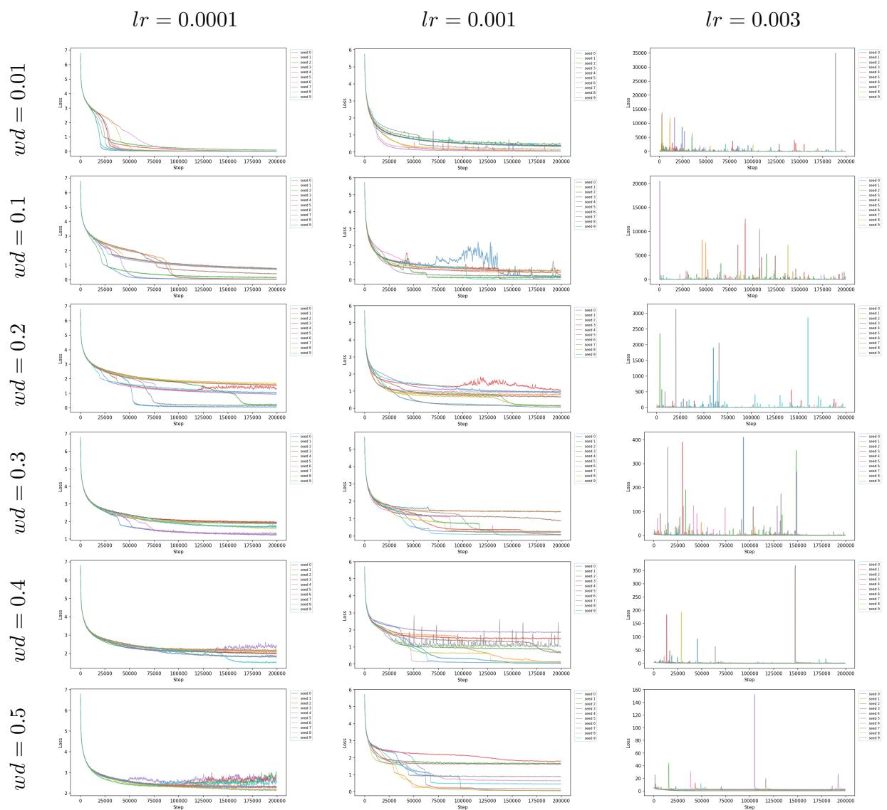  
Figure 5: $\mathrm { M _ { H } }$ - Train Loss across epochs, on different hyperparameters

MLP Probe Results. Figure 13 tells the same qualitative story with slightly stronger signal overall. One deviation worth noting is the above-chance accuracy on tens and hundreds digits at layers 1 and 2 for $\mathrm { M _ { H _ { i n } , F _ { o u t } } }$ . We attribute this to probe capacity rather than genuine representational content: the pattern does not persist into layer 3, suggesting the probe is partially solving the task itself rather than decoding an internally generated representation. The same pattern is absent with the weaker linear probe, which supports this interpretation and thus does not affect our conclusions.

Circular Probe Results. Figure 14 is broadly consistent with the linear and MLP results: fragmented output models encode only the units digit, while holistic output models encode all three. One exception is $\mathrm { M _ { H } }$ , where the circular probes fail to recover the output digit signal despite the models achieving good task performance. We attribute this to the result digits not being encoded in a circular (modular) format in these models rather than their absence, as the gap between probe accuracy and task accuracy supports this interpretation.

## D Big-Endian Ablation

In little-endian digit order the generation order of tokens aligns with the direction of carry propagation, so at every position the information required to emit the current digit is exactly the information the loss at that position supervises. No lookahead into the future is required to solve the task. We repeat our experiments with standard, big-endian digit order to observe how model internal representation of future result digits changes, when future information has to be resolved in order to correctly solve the task.

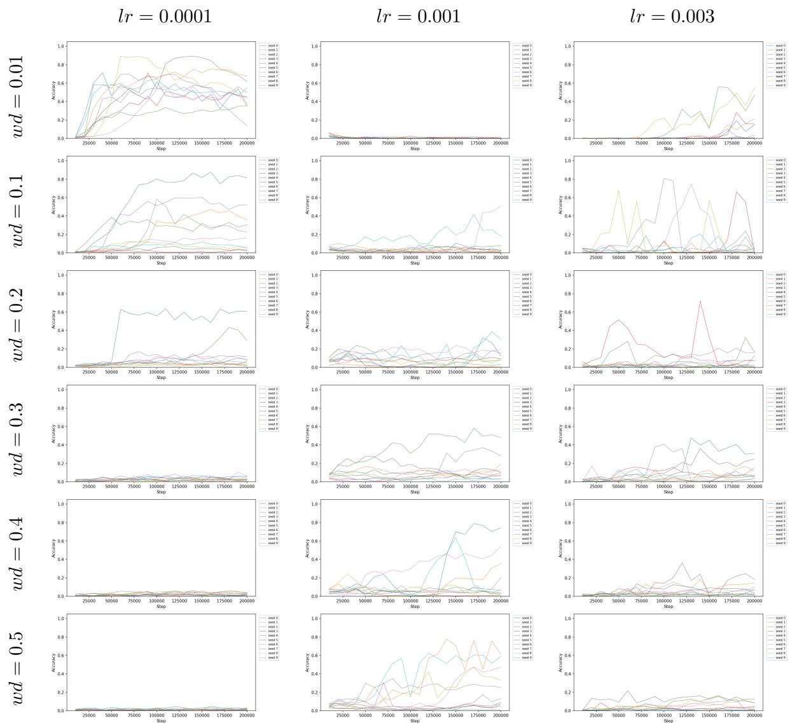  
Figure 6: $\mathrm { M _ { H } }$ - Evaluation Accuracy across epochs, on different hyperparameters

Training. Training is identical to the little-endian setting in every respect except digit order. We select the four highest-accuracy checkpoints per condition for probing (Table 3).

Probing. Probes are trained exactly as described in Appendix C, only under big endian convention the first result digit is labeled as hundreds digit, the second as tens, and the final as units digit.

Results. Figures 15, 16, and 17 show the digitwise probing results on models trained under bigendian number convention. As expected, decodability of future result digits is above chance in layer 3 for the fragmented output models, showcasing the effect of the model having to at the very least somewhat resolve future information to accurately solve the task, even in the absence of direct gradient pressure.

Decodability is higher for the immediately following result digit than for the third: a carry from the adjacent position affects the current digit more often than one propagating from two positions away. Even at this very small scale, this is reminiscent of the single-digit lookahead heuristic that production-scale LLMs display (Baeumel et al., 2025b).

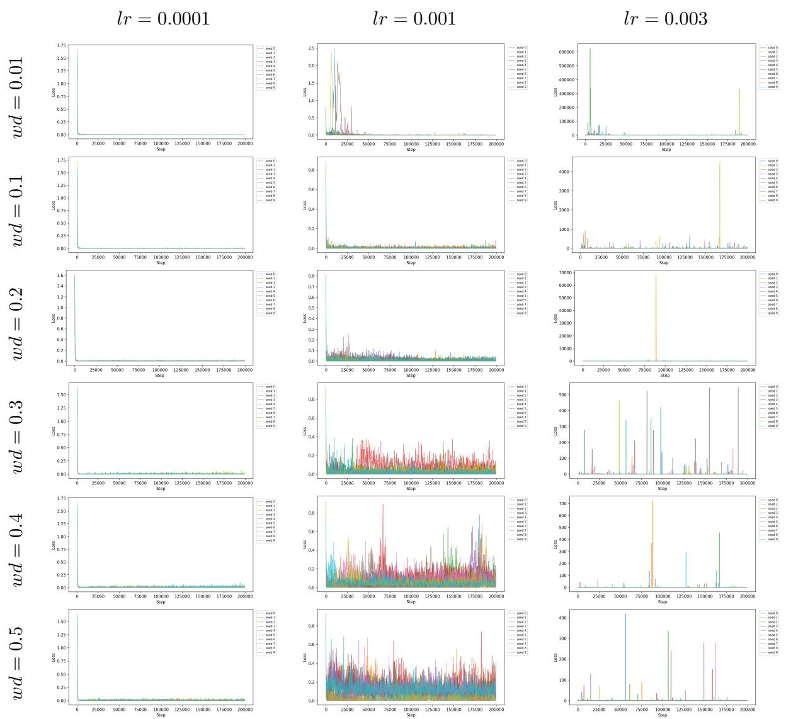  
Figure 7: MF - Train Loss across epochs, on different hyperparameters

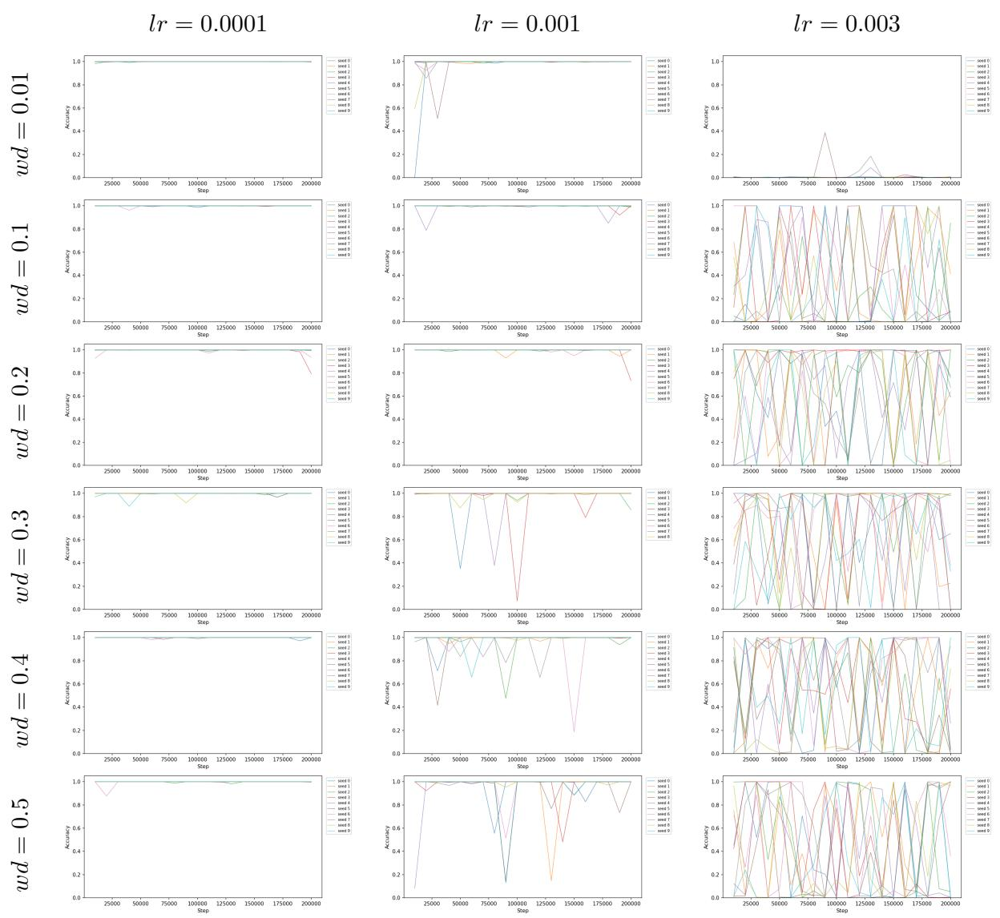  
Figure 8: MF - Evaluation Accuracy across epochs, on different hyperparameters

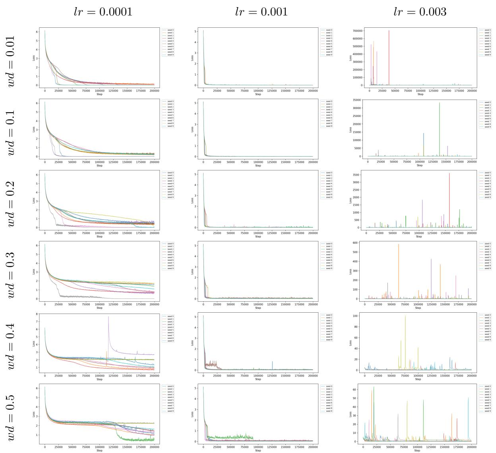  
Figure 9: $\mathrm { M } _ { \mathrm { F _ { \mathrm { i n } } , \mathrm { H } _ { \mathrm { o u t } } } }$ - Train Loss across epochs, on different hyperparameters

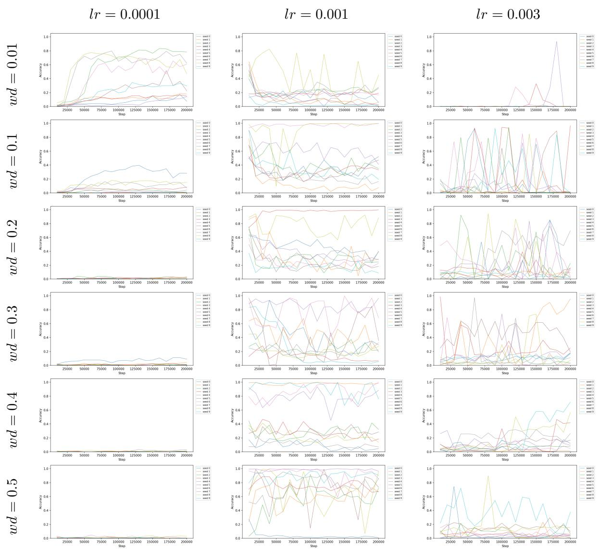  
Figure 10: $\mathrm { M } _ { \mathrm { F _ { \mathrm { i n } } , \mathrm { H } _ { \mathrm { o u t } } } }$ - Evaluation Accuracy across epochs, on different hyperparameters

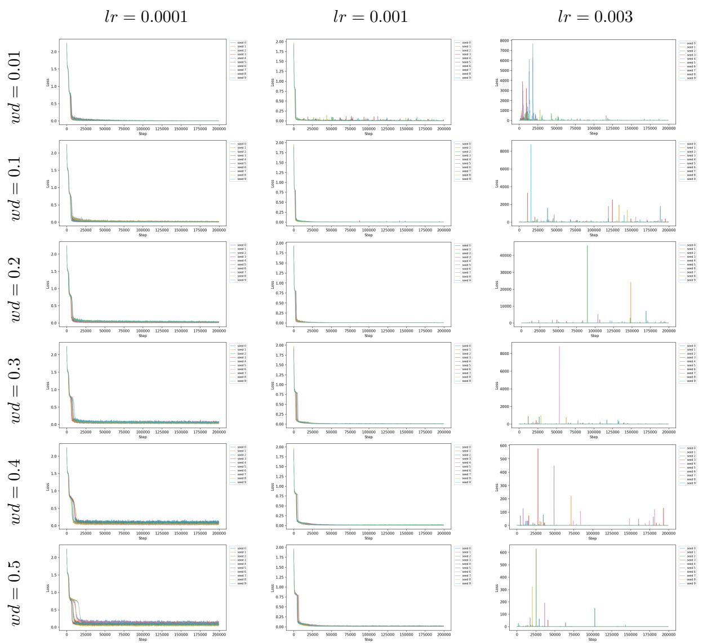  
Figure 11: $\mathrm { M } _ { \mathrm { H } _ { \mathrm { i n } } , \mathrm { F } _ { \mathrm { o u t } } }$ - Train Loss across epochs, on different hyperparameters

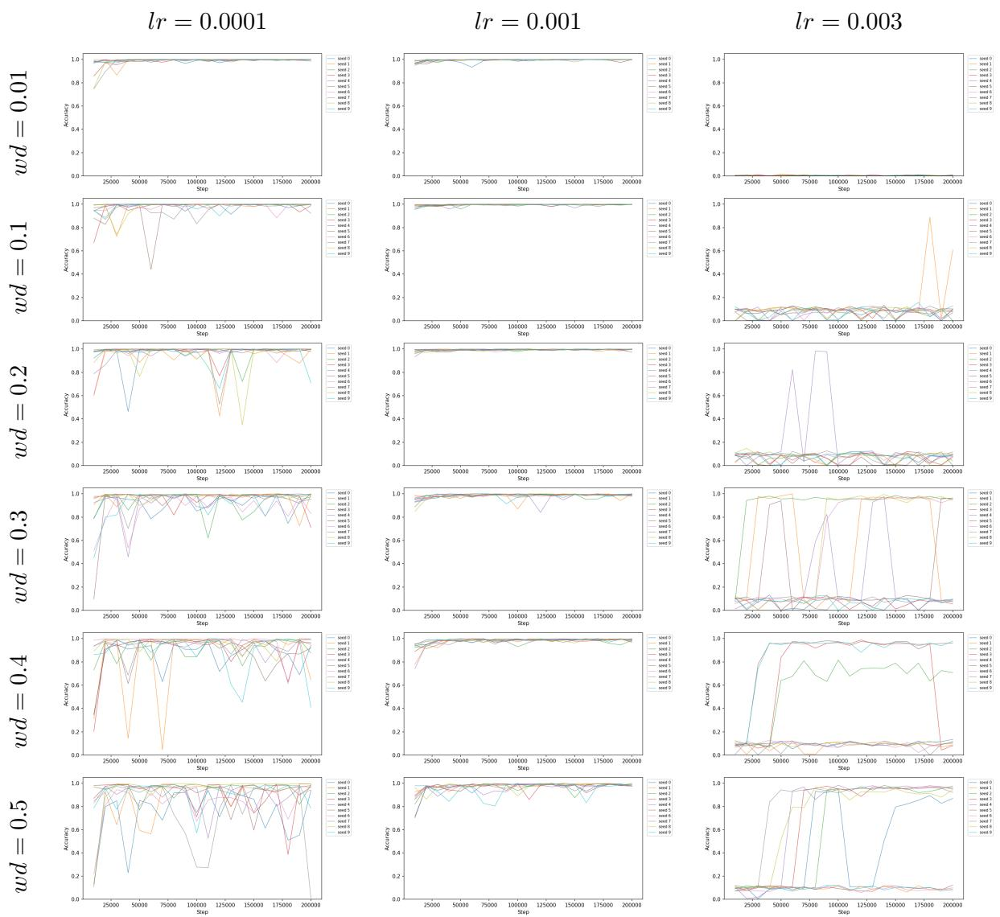  
Figure 12: $\mathrm { M } _ { \mathrm { H } _ { \mathrm { i n } } , \mathrm { F } _ { \mathrm { o u t } } }$ - Evaluation Accuracy across epochs, on different hyperparameters

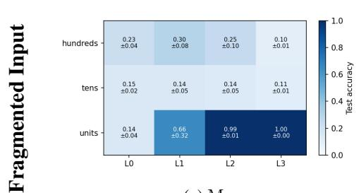  
(a) MF

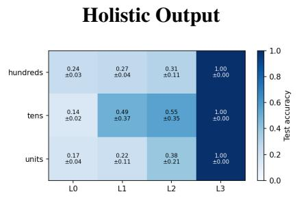  
(b) MFin, Hout

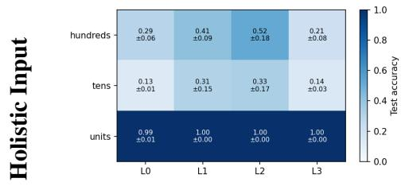  
(c) $\mathrm { M } _ { \mathrm { H } _ { \mathrm { i n } } , \mathrm { F } _ { \mathrm { o u t } } }$

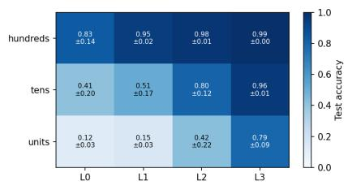  
(d) MH  
Figure 13: MLP probe accuracy for individual result digits across layers, in little endian number convention. Values are mean probe accuracy ± standard deviation across the five probes trained per condition (Table 2).

<table><tr><td colspan="7"></td><td colspan="3">Per-digit acc.</td></tr><tr><td>Condition</td><td>lr</td><td>wd</td><td>Seed</td><td>Step</td><td>Exact</td><td>U</td><td>T</td><td>H</td></tr><tr><td rowspan="5"> $\mathrm { M _ { F } }$ </td><td>0.0001</td><td>0.01</td><td>891</td><td>60,000</td><td>1.000</td><td>1.000</td><td>1.000</td><td>1.000</td></tr><tr><td>0.0001</td><td>0.01</td><td>598</td><td>140,000</td><td>1.000</td><td>1.000</td><td>1.000</td><td>1.000</td></tr><tr><td>0.0001</td><td>0.1</td><td>193</td><td>160,000</td><td>1.000</td><td>1.000</td><td>1.000</td><td>1.000</td></tr><tr><td>0.0001</td><td>0.2</td><td>623</td><td>80,000</td><td>1.000</td><td>1.000</td><td>1.000</td><td>1.000</td></tr><tr><td>0.0001</td><td>0.4</td><td>273</td><td>120,000</td><td>1.000</td><td>1.000</td><td>1.000</td><td>1.000</td></tr><tr><td rowspan="5"> $\mathrm { M } _ { \mathrm { F _ { i n } , \mathrm { H } _ { o u t } } }$ </td><td>0.001</td><td>0.1</td><td>623</td><td>30,000</td><td>0.994</td><td>0.998</td><td>0.998</td><td>0.998</td></tr><tr><td>0.001</td><td>0.1</td><td>891</td><td>100,000</td><td>0.998</td><td>1.000</td><td>1.000</td><td>0.998</td></tr><tr><td>0.001</td><td>0.2</td><td>378</td><td>50,000</td><td>0.994</td><td>0.994</td><td>1.000</td><td>1.000</td></tr><tr><td>0.001</td><td>0.5</td><td>623</td><td>40,000</td><td>0.992</td><td>0.998</td><td>0.994</td><td>1.000</td></tr><tr><td>0.001</td><td>0.5</td><td>974</td><td>50,000</td><td>0.968</td><td>1.000</td><td>0.972</td><td>0.990</td></tr><tr><td rowspan="5"> $\mathrm { M } _ { \mathrm { H } _ { \mathrm { i n } } , \mathrm { F } _ { \mathrm { o u t } } }$ </td><td>0.001</td><td>0.4</td><td>416</td><td>50,000</td><td>0.986</td><td>0.986</td><td>0.998</td><td>0.998</td></tr><tr><td>0.001</td><td>0.4</td><td>598</td><td>50,000</td><td>0.976</td><td>0.986</td><td>0.988</td><td>0.998</td></tr><tr><td>0.001</td><td>0.4</td><td>273</td><td>200,000</td><td>0.984</td><td>1.000</td><td>0.986</td><td>0.998</td></tr><tr><td>0.001</td><td>0.4</td><td>891</td><td>200,000</td><td>1.000</td><td>1.000</td><td>1.000</td><td>1.000</td></tr><tr><td>0.001</td><td>0.4</td><td>974</td><td>200,000</td><td>0.986</td><td>0.988</td><td>0.996</td><td>1.000</td></tr><tr><td rowspan="5"> $\mathrm { M _ { H } }$ </td><td>0.0001</td><td>0.01</td><td>891</td><td>60,000</td><td>0.894</td><td>0.894</td><td>0.934</td><td>0.966</td></tr><tr><td>0.0001</td><td>0.01</td><td>598</td><td>140,000</td><td>0.894</td><td>0.902</td><td>0.926</td><td>0.954</td></tr><tr><td>0.0001</td><td>0.1</td><td>193</td><td>160,000</td><td>0.878</td><td>0.880</td><td>0.902</td><td>0.952</td></tr><tr><td>0.001</td><td>0.4</td><td>193</td><td>170,000</td><td>0.790</td><td>0.792</td><td>0.942</td><td>0.982</td></tr><tr><td>0.003</td><td>0.1</td><td>416</td><td>100,000</td><td>0.808</td><td>0.816</td><td>0.904</td><td>0.966</td></tr></table>

Table 2: Checkpoints selected for probing, with exact-match and per-digit accuracy on the held-out test set. Digit positions are given in generation order under the little-endian convention: units (U), tens (T), hundreds (H).

Fragmented Output  
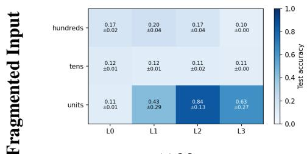  
(a) MF

Holistic Output  
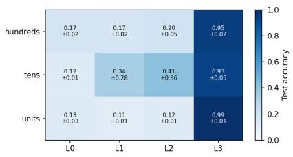

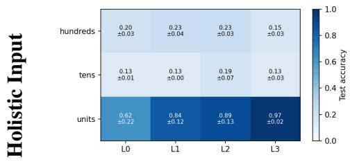  
(c) $\mathrm { M } _ { \mathrm { H } _ { \mathrm { i n } } , \mathrm { F } _ { \mathrm { o u t } } }$

(b) $\mathrm { M } _ { \mathrm { F } _ { \mathrm { i n } } , \mathrm { H } _ { \mathrm { o u t } } }$  
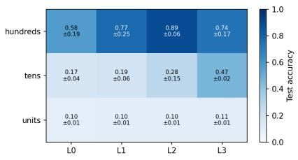  
(d) $\mathrm { M _ { H } }$  
Figure 14: Circular probe accuracy for individual result digits across layers, in little endian number convention. Values are mean probe accuracy ± standard deviation across the five probes trained per condition (Table 2).

<table><tr><td>Condition</td><td>lr</td><td>wd</td><td>Seed</td><td>Step</td><td>Accuracy</td></tr><tr><td rowspan="2"> $\mathrm { M _ { F } }$ </td><td>0.001</td><td>0.2</td><td>123</td><td>70,000</td><td rowspan="2">1.000 1.000</td></tr><tr><td>0.001 0.001</td><td>0.2 0.2</td><td>155 200</td><td>40,000</td></tr><tr><td rowspan="2"></td><td>0.001</td><td>0.2</td><td>832</td><td>130,000 90,000</td><td>1.000 1.000</td></tr><tr><td>0.001</td><td>0.2</td><td>155</td><td>150,000</td><td>1.000</td></tr><tr><td> $\mathrm { M } _ { \mathrm { F } _ { \mathrm { i n } } , \mathrm { H } _ { \mathrm { o u t } } }$ </td><td>0.001 0.001 0.001 0.001</td><td>0.4 0.4 0.5 0.2</td><td>456 832 155 123</td><td>40,000 20,000 40,000</td><td>0.928 0.942 0.956</td></tr><tr><td> $\mathrm { M } _ { \mathrm { H } _ { \mathrm { i n } } , \mathrm { F } _ { \mathrm { o u t } } }$ </td><td>0.001 0.001 0.001</td><td>0.2 0.2 0.2</td><td>155 456 832</td><td>110,000 140,000 170,000 160,000</td><td>1.000 1.000 1.000 1.000</td></tr><tr><td> $\mathrm { M _ { H } }$ </td><td>0.001 0.001 0.001 0.001</td><td>0.5 0.3 0.3 0.3</td><td>456 155 193 273</td><td>90,000 80,000 150,000 130,000</td><td>0.930 0.870 0.900 0.896</td></tr></table>

Table 3: Big-endian model checkpoints with highest task accuracy on held-out test set. Used in probing.

Fragmented Output  
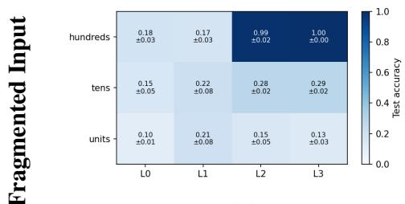  
(a) MF

Holistic Output  
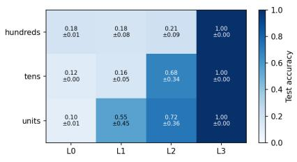

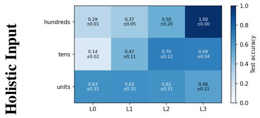  
(c) $\operatorname { M } _ { \mathrm { H } _ { \mathrm { i n } } , \mathrm { F } _ { \mathrm { o u t } } }$

(b) $\mathrm { M } _ { \mathrm { F } _ { \mathrm { i n } } , \mathrm { H } _ { \mathrm { o u t } } }$  
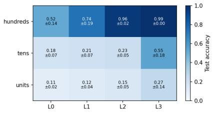  
(d) $\mathrm { M _ { H } }$  
Figure 15: Big endian ablation: Linear probe accuracy for individual result digits across layers, in big endian number convention. Values are mean probe accuracy ± standard deviation across the four probes trained per condition (Table 3).

Fragmented Output  
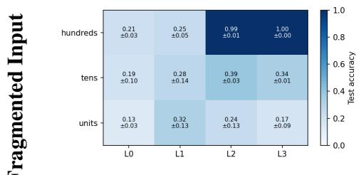  
(a) MF

Holistic Output  
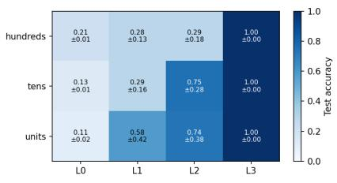  
(b) M $\mathbf { F _ { i n } } , \mathbf { H _ { o u t } }$

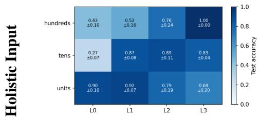  
(c) $\mathrm { M } _ { \mathrm { H } _ { \mathrm { i n } } , \mathrm { F } _ { \mathrm { o u t } } }$

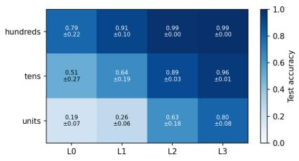  
(d) $\mathrm { M _ { H } }$  
Figure 16: Big endian ablation: MLP probe accuracy for individual result digits across layers, in big endian number convention. Values are mean probe accuracy ± standard deviation across the four probes trained per condition (Table 3).

Fragmented Output  
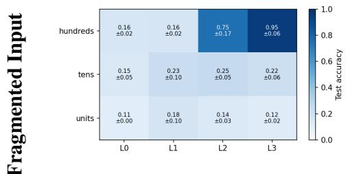  
(a) $\mathrm { M } _ { \mathrm { F } }$

Holistic Output  
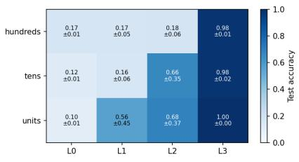

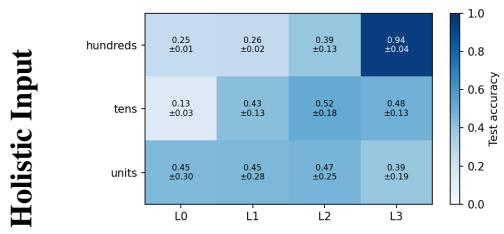  
(c) $\mathrm { M } _ { \mathrm { H } _ { \mathrm { i n } } , \mathrm { F } _ { \mathrm { o u t } } }$

(b) $\mathrm { M } _ { \mathrm { F _ { i n } } } , \mathrm { H } _ { \mathrm { o u t } }$  
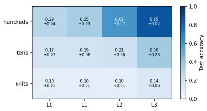  
(d) $\mathrm { M _ { H } }$  
Figure 17: Big endian ablation: Circular probe accuracy for individual result digits across layers, in big endian number convention. Values are mean probe accuracy ± standard deviation across the four probes trained per condition (Table 3).

## E Survey Details

This appendix documents the methodology and full results of the survey reported in Section 4.

## E.1 Method

Paper retrieval. We extract all papers published to the main conference or findings tracks of ACL, EMNLP, NAACL, and EACL in 2024–2025 whose titles contain the substrings math, numer (as in numeric), number, or arithmetic.

Topical filtering. We manually inspect each paper for topical fit and apply the following inclusion and exclusion criteria.

Included: papers whose primary experimental contribution involves LLMs being tasked directly with an arithmetic or numeric reasoning problem, specifically:

• papers that propose a benchmark or dataset for a math-related ability;

• papers that present methods for generating math problems or response options;

• papers that propose a framework or training method for improving LLM performance on math-related tasks;

• papers that introduce a new model targeting math-related tasks.

The overarching criterion is: does the paper contain experimental results in which LLMs are tasked with an arithmetic or numeric reasoning problem, and would different tokenization strategies possibly affect those results?

## Excluded:

• papers that are not related to arithmetic or numeric reasoning at all, but where the keyword search gave a false positive (e.g., work on task arithmetic)

• papers where the math task has no arithmetic component (e.g., purely logical or symbolic tasks);

• papers whose primary focus is LLMs acting as an intermediate step for another tool (e.g., converting problems to code or formal language before solving them);

• papers focused on pedagogy or educational applications rather than on measuring reasoning ability;

• papers where the primary task is multimodal in a way that does not centre on numeric reasoning ability (e.g., converting handwritten equations to text);

• papers on numerical understanding tasks (e.g., numerical claim verification, numerical NLI) where the tokenization of integers in isolation would not affect the result.

When a paper was borderline, we classified it as not fitting. This filtering leaves 120 papers about mathematical or numeric reasoning (Rai and Yao, 2024; Gambardella et al., 2024; Lu et al., 2024; Li et al., 2024c; Chen et al., 2024a; Zhao et al., 2024b; Wang et al., 2024b; Li et al., 2024a; Zhao et al., 2024c,d; Srivastava et al., 2024; Jiang et al., 2024; Wu et al., 2024b; Liu et al., 2024; Zhang et al., 2024b; Liao et al., 2024; Li et al., 2024b,d; Mao et al., 2024; Guo et al., 2024; Xu et al., 2024a, 2025c; Li et al., 2025a; Feng et al., 2025; Wu et al., 2025; Liu et al., 2025d; Christ et al., 2025; Yu et al., 2025b; Singh et al., 2025; Sun et al., 2025a; Pei et al., 2025; Yu et al., 2025a; Zheng et al., 2025; Liu et al., 2025a; Ouyang, 2025; Hong et al., 2025; Liu et al., 2025b; Xu et al., 2025a,b; Liu et al., 2025e; Bai et al., 2025; Jain et al., 2025; Wei et al., 2025; Li et al., 2025d; Wang et al., 2025a; Pan et al., 2025; Yan et al., 2025b; Calais et al., 2025; Pham et al., 2025; Gao et al., 2025; Zhang and Xiong, 2025; Zhao et al., 2025a; Tang et al., 2025; Fei et al., 2025; Li et al., 2025b; Ahmed et al., 2025; Zheng et al., 2024; Yu and Ananiadou, 2024; Kadlcík and Štefánikˇ , 2024; Zhang et al., 2024a; Yin et al., 2024; Fernandez et al., 2024; Chen et al., 2024d; Huang et al., 2024; Zhang et al., 2024c; Zhao et al., 2024a; Kurtic et al., 2024; Shi et al., 2024; Xie et al., 2024; Lucy et al., 2024; Wang et al., 2024a; Chen et al., 2024e,c; Xu et al., 2024b; Sun et al., 2024; Hwang et al., 2024; Kao et al., 2024; Schwartz et al., 2024; Zhou et al., 2024b; Bertolazzi et al., 2025; Sun et al., 2025b; Yan et al., 2025a; Cheng et al., 2025; Polyakov et al., 2025; Leang et al., 2025; Yang et al., 2025b; Cao et al., 2025; Bhattacharya et al., 2025; Mamidanna et al., 2025; Luong et al., 2025; Cocchieri et al., 2025; Srivatsa et al., 2025; Wang et al., 2025b; Tian et al., 2025; Xiao and Zhao, 2025; Asano et al., 2025; Li et al., 2025c; Chen et al., 2025; Lin et al., 2025; Yang et al., 2025d,a; Xin et al., 2025; Liu et al., 2025c; Luo et al., 2025; Zhu et al., 2025; Han et al., 2025; Qian et al., 2025; Zeng et al., 2025; Chen et al., 2024b; You et al., 2024; Feng et al., 2024;

Srivatsa and Kochmar, 2024; Wang et al., 2024c; Zhou et al., 2024a; Meadows et al., 2024; Davoodi et al., 2025; Yang et al., 2025c; Zhao et al., 2025b; Mahendra et al., 2025).

Tokenization annotation. For each of the 120 papers we (i) record all model families evaluated, (ii) search the full text for the substring token, and (iii) manually inspect every occurrence to determine whether the distinction between digit-level and multi-digit numeric tokenization is explicitly mentioned and whether any cross-model comparison accounts for that distinction.

Model categorisation. For open-source models with a publicly available tokenizer file on HuggingFace, we inspect the vocabulary to identify the largest integer encoded as a single token. We classify a model as using multi-digit tokenization if multi-digit integers are single tokens (e.g. up to 999), and as using digit-level tokenization if only single digits 0-9 receive dedicated tokens. For proprietary or closed-source models whose tokenizer is not publicly documented, we do not assign a category. A paper is classified as comparing across supervision regimes if at least one evaluated model uses holistic tokenization and at least one uses fragmented tokenization, based on the identifiable models. Table 4 lists the tokenization type for the most commonly evaluated model families.

<table><tr><td>Model family</td><td>Numeric tokenization</td></tr><tr><td>GPT-2 GPT-J GPT-NeoX</td><td>Multi-Digit Tokens Multi-Digit Tokens Multi-Digit Tokens</td></tr><tr><td>GPT-3.5 Turbo Pythia Llama 3 / 3.1 / 3.2 OLMo 2 DeepSeek-R1 Phi-4</td><td>Multi-Digit Tokens Multi-Digit Tokens Multi-Digit Tokens Multi-Digit Tokens Multi-Digit Tokens Multi-Digit Tokens</td></tr><tr><td>Llama 2 / Llama-7B Mistral Gemma / Gemma 2 / Gemma 3 Qwen / Qwen 2 / Qwen 2.5 Qwen2-VL CodeLlama Deepseek-Coder-6.7B DeepSeek-Math-7B</td><td>Single-Digit Tokens Single-Digit Tokens Single-Digit Tokens Single-Digit Tokens Single-Digit Tokens Single-Digit Tokens Single-Digit Tokens Single-Digit Tokens Single-Digit Tokens</td></tr></table>

Table 4: Numeric tokenization type for commonly evaluated model families. Classification is based on inspection of publicly available tokenizer vocabularies on HuggingFace. Proprietary models are omitted.

## E.2 Results

Of the 120 retained papers, 11 (9.2%) explicitly mention the numeric tokenization strategy of the models they evaluate (Mamidanna et al., 2025; Sun et al., 2025b; Bertolazzi et al., 2025; Zhou et al., 2024b; Schwartz et al., 2024; Xie et al., 2024; Li et al., 2025b; Fei et al., 2025; Feng et al., 2025; Xu et al., 2025c; Gambardella et al., 2024). The remaining 109 make no mention of numeric tokenization granularity.

Of the 109 papers that do not mention tokenization:

• 83 actively compare models from both holistic and fragmented tokenization families without flagging the difference or controlling for it, treating models operating under structurally different supervision regimes as interchangeable baselines;

• 20 evaluate models from only one tokenization type;

• 6 cannot be resolved because at least one evaluated model is closed-source or uses an undisclosed tokenizer.

Of the 11 papers that do mention tokenization, none frames the distinction in terms of output supervision. When tokenization is mentioned at all, it is consistently treated as an input representation choice. Three of the eleven explicitly compare models with different tokenization schemes and discuss implications for comparison; four restrict evaluation to one tokenization type while citing it as a methodological choice; two work with models trained from scratch, so tokenization is discussed as part of the experimental design; and two mention tokenization only in the context of related work or motivation, without evaluating its effect.

Important caveat. We do not claim that the supervision-regime confound is decisive in every one of the 83 papers that compare across tokenization types. We claim that its potential impact cannot be assessed from the published record, because tokenization strategy is not reported. The practical consequence ranges from negligible to decisive depending on the specific comparison and task, but without reporting it is impossible to know which.