# TRACE: Single-Pass Decoding-Trace Risk Localization for Generation Calibration

Yuebin Xu, Xuemei Peng, Junlan Chen, Zhiyi Chen, Zeyi Wen The Hong Kong University of Science and Technology (Guangzhou) {yxu349,xpeng558,jchen421,zchen986,wenzeyi}@hkust-gz.edu.cn

## Abstract

Reliable confidence estimation is essential for large language model deployment. However, answer-level calibration remains challenging because generation errors are often localized: a response may be fluent and high-probability overall while still failing at a critical number, entity, or factual claim. Existing estimators compress token probabilities, sequence likelihoods, entropy, or beam statistics into a global score, which can dilute such local risk signals. We propose TRACE, a single-pass, decodedanswer-preserving confidence estimator that treats decoding-time uncertainty as a trajectory through three steps: (i) recording tokenlevel surprisal and predictive entropy during decoding, (ii) applying local risk operators to preserve uncertainty spikes, and (iii) converting localized trace risk into answer-level confidence. TRACE produces a label-free risk score, while TRACE+ calibrates trace-only features into probabilities using a held-out split, without extra generations or external verifiers. We evaluate four tasks against 19 calibration baselines, and TRACE+ reduces Brier from 0.149 to 0.137 and improves AUROC from 0.758 to 0.792 over the strongest likelihood baseline. Across seven LLMs, TRACE+ improves over the best non-TRACE baseline pool from 0.136 to 0.120 Brier and from 0.764 to 0.817 AU-ROC. Results show localizing decoding-time risk provides a general approach to calibration.

## 1 Introduction

Large language models (LLMs) are increasingly deployed in generation settings where users need not only an answer, but also a reliable estimate of whether that answer is correct (Guo et al., 2017; Desai and Durrett, 2020; Jiang et al., 2021). This problem is more challenging than standard classification calibration: a generated answer is a sequence of tokens, correctness may depend on a single number, entity, or factual claim, and a fluent response can still be wrong (Kadavath et al., 2022; Manakul et al., 2023; Kuhn et al., 2023). We study general generation calibration: estimating the answer-level correctness probability of a decoded response across diverse generation tasks.

A common approach is to compress the decoded answer into a single global confidence score, such as maximum token probability, mean token probability, length-normalized log-probability, total sequence likelihood, or average token entropy (Guo et al., 2017; Yona et al., 2022; Aichberger et al., 2026). Recent single-pass and near-single-pass methods further exploit beam-distribution statistics (Flores et al., 2025) or semantic reweighting (Duan et al., 2024; Bakman et al., 2024). While effective in many cases, these methods largely summarize a generation as a sequence-level statistic. This can erase an important part of the decoding process: where uncertainty occurs. A response may appear confident on average while becoming locally unstable at the critical step where a wrong digit, entity, or factual attribution is produced.

Multi-sample uncertainty estimators address generation uncertainty from another direction by comparing multiple sampled outputs or semantic equivalence classes (Manakul et al., 2023; Kuhn et al., 2023). However, these methods require additional generations and may change the inference workflow, which can be costly when confidence estimates are needed for every answer. We therefore focus on a stricter and more deployment-oriented setting: single-pass, decoded-answer-preserving confidence estimation. In this setting, all methods score the same decoded answer and do not use extra samples, retrieval, external verifiers, or LLM-as-a-judge labels at actual inference time.

Our key observation is that decoding-time uncertainty should be treated as a token-level trajectory rather than immediately collapsed into a global score. Local entropy, surprisal, and risk peaks can appear near the critical answer span in real errors, such as a wrong number in arithmetic reasoning, a wrong entity in open-domain QA, or an unsupported factual claim in truthfulness-sensitive generation. These local peaks are not direct labels of token-level error, but they are informative indicators of answer-level risk. Figure 1 provides an overview of the empirical gains from this tracebased design across tasks and model families.

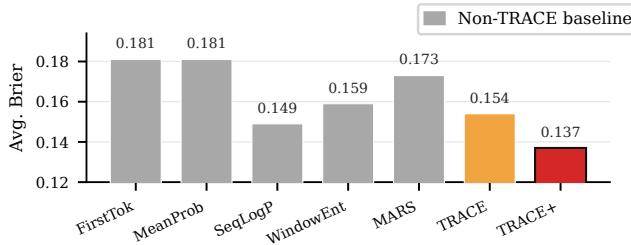  
(a) Average calibration error

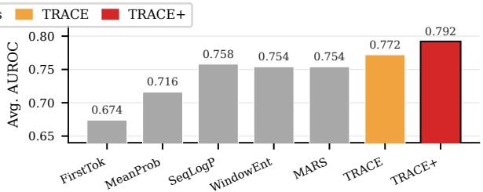  
(b) Average ranking quality

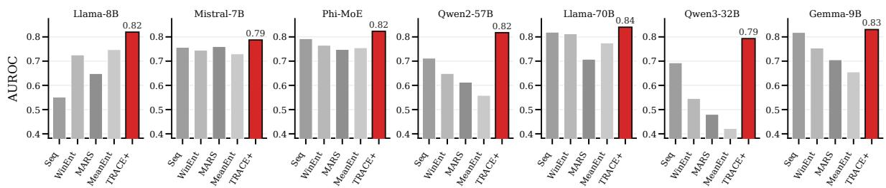  
(c) AUROC across models  
Figure 1: Main experimental results. (a) Average Brier score across MLQA, SVAMP, TriviaQA, and TruthfulQA, where lower is better. (b) Average AUROC across the same tasks, where higher is better. (c) Cross-model AUROC in the main experiments. Gray, orange, and red bars denote representative non-TRACE baselines, TRACE, and TRACE+, respectively. TRACE improves over standard sequence-level baselines, and TRACE+ achieves the strongest overall performance across both tasks and model families.

Based on this observation, we propose TRACE, a single-pass confidence estimator based on decoding-trace risk localization. Given a fixed decoded answer, TRACE records token-level surprisal and predictive entropy during the original generation pass, but instead of immediately averaging them, it applies local risk operators that preserve position-sensitive uncertainty spikes. We further introduce TRACE+, which maps traceonly features to calibrated probabilities using a lightweight calibrator trained on a held-out calibration split. Thus, TRACE is label-free, while TRACE+ uses supervised post-hoc calibration requiring only decoding-trace features at inference.

We evaluate TRACE and TRACE+ on multilingual QA, arithmetic reasoning, open-domain QA, and truthfulness-sensitive generation. Across four tasks, 19 confidence estimators, and seven LLMs, TRACE+ achieves the best average Brier score and

AUROC, transfers across model families and scales, and remains strong without conventional selectedtoken likelihood summaries. Our contributions are:

• We formalize and evaluate generation calibration under a single-pass protocol, where all methods score the same generated answer without extra samples, retrieval, or external verifiers.

• We propose TRACE and TRACE+, which estimate answer-level confidence from localized surprisal and entropy patterns in the decoding trace, rather than relying on global sequential summaries that dilute critical uncertainty spikes.

• We evaluate across four tasks, 19 confidenceestimating baselines, and seven LLMs, showing that TRACE+ achieves the best average Brier score and AUROC across diverse models.

## 2 Related Work

Calibration and single-pass confidence. Confidence estimation is commonly framed as calibration, where predicted confidence should match empirical correctness (Platt, 1999; Niculescu-Mizil and Caruana, 2005; Naeini et al., 2015; Guo et al., 2017; Kuleshov et al., 2018). In NLP, language models and QA systems are often miscalibrated, especially under distribution shift or when probabilities are used directly as confidence (Desai and Durrett, 2020; Jiang et al., 2021; Kadavath et al., 2022). Generation confidence estimators therefore derive answer-level scores from decoding statistics, including maximum softmax probability (Hendrycks and Gimpel, 2017; Guo et al., 2017), mean/minimum token probability, lengthnormalized log-probability, sequence likelihood, and entropy (Yona et al., 2022; Malinin and Gales, 2021; Aichberger et al., 2026). Recent methods further use first-token confidence (Chen et al., 2026), entropy dynamics (Zhu et al., 2026), uncertainty patterns over generated sequences (Manakul et al., 2023), and beam-distribution statistics (Flores et al., 2025). These estimators are efficient, but many compress decoding into a global sequence-level score; TRACE instead preserves localized surprisal and entropy patterns along the decoding trajectory.

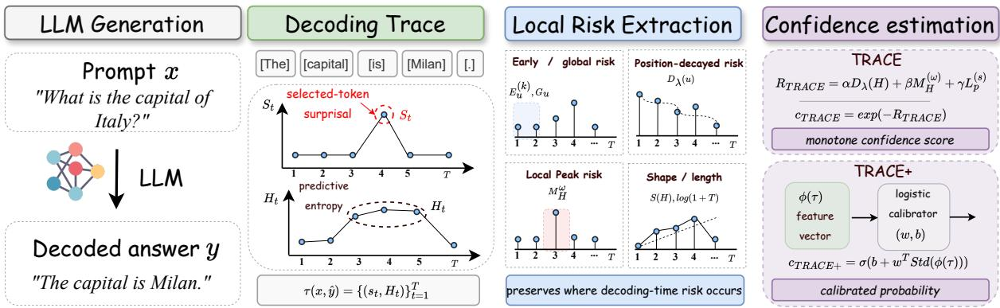  
Figure 2: Overview of TRACE and TRACE+. Given a prompt and a decoded answer, TRACE extracts token-level surprisal and predictive entropy from the decoding trace, localizes risk through early/global, position-decayed, local-peak, and shape/length operators, and converts the resulting risk into a monotone confidence score. TRACE+ further standardizes trace features and applies a lightweight logistic calibrator to produce a calibrated probability.

Multi-sample and semantic uncertainty. Another line of work estimates uncertainty through self-evaluation or semantic comparison. Selfconsistency and sampling-based methods use agreement across completions as reliability evidence (Wang et al., 2023; Manakul et al., 2023), while semantic entropy measures uncertainty over meaning-level equivalence classes (Kuhn et al., 2023). Related work also studies verbalized confidence, self-evaluation, and whether models can assess the truth of their own answers (Kadavath et al., 2022; Lin et al., 2022a; Tian et al., 2023; Xiong et al., 2024). These methods can reveal uncertainty beyond a single decoded answer, but require extra samples or inference procedures. TRACE instead targets a decoded-answer-preserving setting without extra sampling, retrieval, external verifiers, or LLM-as-a-judge labels. It is also related to Token-

SAR and MARS, which reweight tokens or sentences by semantic relevance or meaning contribution (Duan et al., 2024; Bakman et al., 2024); however, TRACE asks where decoding-time risk becomes locally concentrated rather than which generated components are semantically important.

## 3 Method

## 3.1 Problem Formulation

Given a decoded answer yˆ for prompt x, we estimate an answer-level confidence score $c ( x , \hat { y } )$ where larger values indicate higher likelihood of correctness, following standard confidencecalibration practice (Guo et al., 2017; Desai and Durrett, 2020; Jiang et al., 2021). We focus on a decoded-answer-preserving setting: all methods score the same $\hat { y }$ after generation, without extra samples, retrieval, or external verifiers. Let z ∈ {0, 1} denote task-specific correctness. TRACE is label-free, while TRACE+ uses labels only on a held-out calibration split to map trace-derived features to calibrated probabilities,

$$
\hat { p } ( z = 1 \mid x , \hat { y } ) = g ( r ( x , \hat { y } ) ) .
$$

This follows standard post-hoc calibration practice (Platt, 1999; Zadrozny and Elkan, 2002; Niculescu-Mizil and Caruana, 2005). For Brier and ECE, TRACE and all baselines use the same held-out calibration protocol (Brier, 1950; Naeini et al., 2015).

## 3.2 Method Overview

Figure 2 summarizes the TRACE pipeline. Given a prompt and a fixed decoded answer, TRACE proceeds in four steps. (i) LLM generation. The model generates an answer under the original decoding policy; TRACE keeps this answer fixed. (ii) Decoding trace construction. During the same pass, TRACE records selected-token surprisal and predictive entropy at each decoding step. (iii) Local risk extraction. TRACE applies early/global, position-decayed, local-peak, and shape/length operators to preserve localized uncertainty. (iv) Confidence estimation. TRACE produces a label-free monotone confidence score, while TRACE+ calibrates trace-derived features into answer-level probabilities using a held-out split.

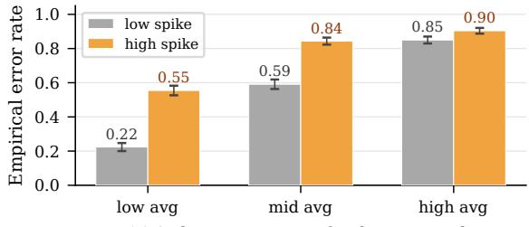  
(a) Spikes raise error at fixed average risk

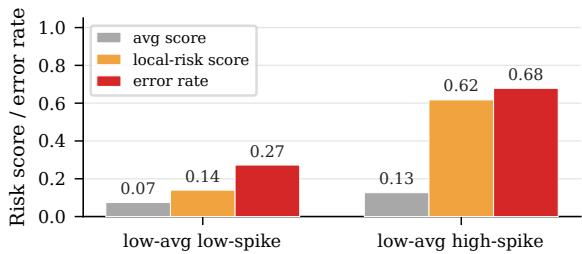  
(b) Average scores hide low-average spike failures  
Figure 3: Token-level spike evidence for TRACE. (a) At comparable average-risk levels, high-spike samples have substantially higher empirical error rates than lowspike samples. (b) Among low-average-risk samples, average-based scores remain low even when local-risk scores and empirical error rates rise sharply.

## 3.3 Decoding Traces as Local Risk Signals

Global confidence estimators such as mean token probability, mean entropy, or sequence likelihood collapse a generated answer into a single scalar. While this captures overall uncertainty, it discards where uncertainty occurs during decoding. This location information is often decisive: an answer can appear fluent overall yet fail at a final digit, an entity name, or one unsupported factual claim.

Figure 3 motivates preserving local decoding structure: within bins of similar average risk, stronger local spikes correspond to higher empirical error rates, and low-average but high-spike examples are underestimated by average-based scores. These diagnostic results show that local instability provides risk information beyond global summaries alone (Appendix A). We therefore model decodingtime uncertainty as an ordered trajectory rather than collapsing it into a sequence-level statistic.

From the original generation pass, without extra generation and without changing the decoded answer, TRACE records two token-level signals at each decoding step t under $P _ { \theta } ( \cdot \mid x , \hat { y } _ { < t } )$ . The first is selected-token surprisal,

$$
s _ { t } = - \log P _ { \theta } ( \hat { y } _ { t } \mid x , \hat { y } _ { < t } ) ,
$$

which measures uncertainty about the token actually generated. The second is predictive entropy,

$$
H _ { t } = - \sum _ { v \in \mathcal { V } } P _ { \theta } ( v \mid x , \hat { y } _ { < t } ) \log P _ { \theta } ( v \mid x , \hat { y } _ { < t } ) ,
$$

which measures how diffuse the full candidate distribution is. The token-level decoding trace is

$$
\tau ( x , \hat { y } ) = \{ ( s _ { t } , H _ { t } ) \} _ { t = 1 } ^ { T } .
$$

TRACE uses this ordered trace to preserve where decoding-time risk occurs.

## 3.4 TRACE: From Local Risk to Confidence

TRACE converts the token-level decoding trace into an answer-level confidence score while preserving localized risk. Rather than averaging the entire trace into one global statistic, TRACE combines three complementary risk operators that capture different failure modes: position-decayed entropy risk, maximum local-window entropy risk, and length-normalized selected-token surprisal:

$$
\begin{array} { c } { { R _ { \mathrm { T R A C E } } ( x , \hat { y } ) = \alpha D _ { \lambda } ( H ) + \beta M _ { H } ^ { ( w ) } + \gamma L _ { \rho } ( s ) , } } \\ { { L _ { \rho } ( s ) = \displaystyle \frac { \sum _ { t = 1 } ^ { T } s _ { t } } { T ^ { \rho } } . } } \end{array}\tag{1}
$$

Here, $D _ { \lambda } ( H )$ emphasizes uncertainty at position-dependent decoding steps, $M _ { H } ^ { ( w ) }$ preserves the highest local-window entropy risk, and $L _ { \rho } ( s )$ captures selected-token surprisal with length normalization. The coefficients $\alpha , \beta , \gamma \ge 0$ satisfy $\alpha + \beta + \gamma = 1 ; \lambda , w$ , and $\rho$ control the decay rate, local window size, and length normalization. We use one fixed hyperparameter configuration across tasks and models, without fitting these hyperparameters on evaluation labels. TRACE converts risk to a monotone confidence score:

$$
c _ { \mathrm { T R A C E } } ( \boldsymbol { x } , \hat { \boldsymbol { y } } ) = \exp ( - R _ { \mathrm { T R A C E } } ( \boldsymbol { x } , \hat { \boldsymbol { y } } ) ) .
$$

This score is used directly for ranking metrics and should not be interpreted as a calibrated probability before post-hoc calibration. Full feature definitions are provided in Appendix B.

## 3.5 TRACE+: Calibrated Trace Confidence

TRACE+ learns how to map trace-derived risk patterns to calibrated probabilities. For each decoded answer, we construct a trace-only feature vector $\phi ( \tau )$ from the same decoding trace, including early and global entropy confidence, answer length, entropy slope, and position-decayed entropy and surprisal confidence. We intentionally exclude conventional selected-token likelihood summaries, such as minimum token probability, geometric mean token probability, and low-probability token rate; these are included only in the “+ seq. likelihood” ablation. We train a lightweight logistic calibrator on a held-out calibration split:

$$
\begin{array} { r } { c _ { \mathrm { T R A C E + } } ( x , \hat { y } ) = \sigma \left( b + \mathbf { w } ^ { \top } \mathrm { S t d } ( \phi ( \tau ) ) \right) , } \end{array}
$$

where Std(·) standardizes each feature using calibration-split statistics. The calibrator is not an answer verifier, does not inspect the answer semantically, and does not use alternative generations. TRACE and TRACE+ require no additional decoding passes and use only token-level probabilities and entropies from the original generation.

## 4 Experiments

## 4.1 Experimental Setup

Tasks and Models. We evaluate general generation calibration on MLQA (Lewis et al., 2020), SVAMP (Patel et al., 2021), TriviaQA (Joshi et al., 2017), and TruthfulQA (Lin et al., 2022b), covering multilingual QA, arithmetic reasoning, open-domain QA, and truthfulness-sensitive generation. We use Qwen2.5-7B-Instruct (Yang et al., 2024b) for the main comparison and seven additional LLMs for generalizability and cross-model evaluation: Llama-3.1-8B/70B-Instruct (Grattafiori et al., 2024), Mistral-7B-Instruct-v0.3 (Jiang et al., 2023), Phi-3.5-MoE-Instruct (Abdin et al., 2024), Qwen2-57B-A14B (Yang et al., 2024a), Qwen3- 32B (Yang et al., 2025), and Gemma-2-9B (Team et al., 2024). We report Brier score (Brier, 1950), ECE (Naeini et al., 2015), and AUROC (Fawcett, 2006); Brier and ECE evaluate probability calibration, while AUROC measures confidence ranking and selective-prediction risk on shared decoded outputs across generation settings.

Baselines and Implementation Details. We compare TRACE with 19 baselines from five families: (i) token/sequence likelihood scores, including First-Token Prob (Chen et al., 2026), Mean-Prob, length-normalized LogP, SeqLogP / Total NLL, MinProb, and high-probability token rate (Chrabaszcz et al., 2026; Aichberger et al., 2026; Bakman et al., 2024); (ii) entropy/position scores, including mean/max entropy, first-k entropy (Chen et al., 2026), and last-k entropy (Li et al., 2026); (iii) trajectory diagnostics, including windowed entropy (Sriramanan et al., 2024), entropy variance/slope (Zhu et al., 2026), and token-probability slope (Shapiro et al., 2026); (iv) near-single-pass beam scores, including Beam-Ratio, Beam-TailThinness, and Beam Entropy (Flores et al., 2025); and (v) semantic reweighting scores, including TokenSAR (Duan et al., 2024) and MARS (Bakman et al., 2024). All methods score the same decoded answer; beam methods only add beam statistics from the same prompt. AUROC uses raw ranking scores, Brier uses heldout calibrated probabilities, and results are averaged over 20 random calibration/evaluation splits. Table 10 summarizes the main inference assumptions, and Appendix D gives the full interpretation of comparison and implementations.

## 4.2 Experimental Results

Main results. Table 1 compares TRACE+ with likelihood-, entropy-, trajectory-, beam-, and semantic-reweighting confidence estimators on four generation tasks. We make two observations. (i) TRACE+ achieves the best average calibration and discrimination performance, obtaining the lowest average Brier score and the highest average AUROC among all methods. Compared with the strongest non-TRACE method on the average columns, SeqLogP / Total NLL, TRACE+ reduces average Brier from 0.149 to 0.137 and improves average AUROC from 0.758 to 0.792. TRACE+ also attains the best Brier score on all four tasks and the best AUROC on TriviaQA; on MLQA and TruthfulQA, its AUROC is secondbest, while on SVAMP it trails beam-distribution methods in AUROC but still gives the lowest Brier score. (ii) Strong baselines are task-dependent: SeqLogP / Total NLL performs best on MLQA, beamdistribution statistics are strongest on SVAMP, and semantic reweighting helps on TruthfulQA, but none is consistently best across tasks. TruthfulQA is highly imbalanced (86/817 correct), for which a constant base-rate predictor obtains a Brier score of 0.0942; hence Brier differences are compressed despite larger AUROC differences. TRACE+ is more stable because it aggregates localized decodingtrace evidence under the same decoded-answer setting, yielding consistently stronger average performance overall without changing the model outputs.

<table><tr><td rowspan="2">Method</td><td colspan="2">MLQA</td><td colspan="2">SVAMP</td><td colspan="2">TriviaQA</td><td colspan="2">TruthfulQA</td><td colspan="2">Avg.</td></tr><tr><td>Brier ↓ AUROC ↑</td><td></td><td>Brier ↓</td><td>AUROC↑</td><td>Brier ↓</td><td>AUROC↑</td><td>Brier ↓</td><td>AUROC↑</td><td></td><td>Brier ↓ AUROC ↑</td></tr><tr><td colspan="9">Token- and sequence-level confidence baselines</td><td></td></tr><tr><td>First-Token Prob (Chen et al., 2026)</td><td>0.230</td><td>0.580</td><td>0.211</td><td>0.721</td><td>0.188</td><td>0.806</td><td>0.094</td><td>0.590</td><td>0.181</td><td>0.674</td></tr><tr><td>MeanProb (Flores et al., 2025)</td><td>0.228</td><td>0.692</td><td>0.196</td><td>0.782</td><td>0.206</td><td>0.774</td><td>0.094</td><td>0.615</td><td>0.181</td><td>0.716</td></tr><tr><td>Len-Norm LogP (Bakman et al., 2024)</td><td>0.226</td><td>0.694</td><td>0.192</td><td>0.778</td><td>0.198</td><td>0.783</td><td>0.094</td><td>0.619</td><td>0.178</td><td>0.719</td></tr><tr><td>SeqLogP / Total NLL (Aichberger et al., 2026)</td><td>0.174</td><td>0.812</td><td>0.146</td><td>0.791</td><td>0.182</td><td>0.811</td><td>0.093</td><td>0.619</td><td>0.149</td><td>0.758</td></tr><tr><td>MinProb (Manakul et al., 2023)</td><td>0.214</td><td>0.741</td><td>0.184</td><td>0.745</td><td>0.186</td><td>0.795</td><td>0.094</td><td>0.585</td><td>0.169</td><td>0.717</td></tr><tr><td>Mean Token Entropy (Flores et al., 2025)</td><td>0.222</td><td>0.697</td><td>0.170</td><td>0.816</td><td>0.188</td><td>0.796</td><td>0.093</td><td>0.626</td><td>0.168</td><td>0.734</td></tr><tr><td>Max Token Entropy (Manakul et al., 2023)</td><td>0.218</td><td>0.745</td><td>0.182</td><td>0.763</td><td>0.180</td><td>0.820</td><td>0.093</td><td>0.613</td><td>0.168</td><td>0.735</td></tr><tr><td>High-Prob Token Rate (Chrabaszcz et al., 2026)</td><td>0.227</td><td>0.663</td><td>0.178</td><td>0.751</td><td>0.214</td><td>0.719</td><td>0.093</td><td>0.610</td><td>0.178</td><td>0.686</td></tr><tr><td>First-k Entropy (Chen et al., 2026)</td><td>0.218</td><td>0.688</td><td>0.170</td><td>0.811</td><td>0.182</td><td>0.806</td><td>0.093</td><td>0.629</td><td>0.166</td><td>0.734</td></tr><tr><td>Last-k Entropy (Li et al., 2026)</td><td>0.227</td><td>0.600</td><td>0.170</td><td>0.801</td><td>0.212</td><td>0.722</td><td>0.094</td><td>0.553</td><td>0.176</td><td>0.669</td></tr><tr><td colspan="9">Trajectory, beam-distribution, and semantic baselines</td><td></td></tr><tr><td>Windowed Entropy (Sriramanan et al., 2024)</td><td>0.205</td><td>0.753</td><td>0.164</td><td>0.817</td><td>0.176</td><td>0.822</td><td>0.093</td><td>0.625</td><td>0.159</td><td>0.754</td></tr><tr><td>Entropy Variance (Zhu et al., 2026)</td><td>0.221</td><td>0.706</td><td>0.201</td><td>0.713</td><td>0.198</td><td>0.775</td><td>0.093</td><td>0.624</td><td>0.178</td><td>0.705</td></tr><tr><td>Entropy Slope (Zhu et al., 2026)</td><td>0.234</td><td>0.445</td><td>0.202</td><td>0.351</td><td>0.196</td><td>0.235</td><td>0.094</td><td>0.435</td><td>0.181</td><td>0.366</td></tr><tr><td>Token-Prob Slope (Shapiro et al., 2026)</td><td>0.232</td><td>0.434</td><td>0.206</td><td>0.360</td><td>0.205</td><td>0.254</td><td>0.094</td><td>0.439</td><td>0.184</td><td>0.372</td></tr><tr><td>Beam-Ratio (Flores et al., 2025)</td><td>0.223</td><td>0.634</td><td>0.137</td><td>0.850</td><td>0.219</td><td>0.701</td><td>0.094</td><td>0.537</td><td>0.168</td><td>0.681</td></tr><tr><td>Beam-TailThinness (Flores et al., 2025)</td><td>0.219</td><td>0.682</td><td>0.132</td><td>0.887</td><td>0.208</td><td>0.738</td><td>0.094</td><td>0.550</td><td>0.163</td><td>0.714</td></tr><tr><td>Beam Entropy (Flores et al., 2025)</td><td>0.220</td><td>0.674</td><td>0.131</td><td>0.885</td><td>0.209</td><td>0.734</td><td>0.094</td><td>0.550</td><td>0.164</td><td>0.711</td></tr><tr><td>TokenSAR (Duan et al., 2024)</td><td>0.225</td><td>0.659</td><td>0.185</td><td>0.841</td><td>0.193</td><td>0.793</td><td>0.093</td><td>0.661</td><td>0.174</td><td>0.739</td></tr><tr><td>MARS (Bakman et al., 2024)</td><td>0.224</td><td>0.726</td><td>0.184</td><td>0.843</td><td>0.189</td><td>0.802</td><td>0.093</td><td>0.645</td><td>0.173</td><td>0.754</td></tr><tr><td>TRACE</td><td>0.197</td><td>0.786</td><td>0.161</td><td>0.825</td><td>0.168</td><td>0.835</td><td>0.092</td><td>0.641</td><td>0.154</td><td>0.772</td></tr><tr><td>TRACE+</td><td>0.173</td><td>0.803</td><td>0.124</td><td>0.864</td><td>0.160</td><td>0.847</td><td>0.091</td><td>0.654</td><td>0.137</td><td>0.792</td></tr></table>

Table 1: Main comparison on general generation calibration. All methods score the same decoded answer; beambased methods additionally use beam statistics from the same prompt.

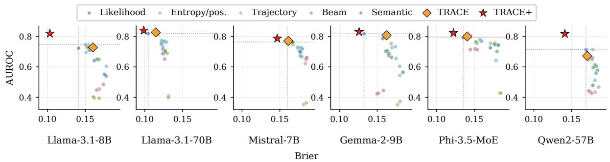  
Figure 4: Cross-model estimator landscape. Each point denotes one estimator averaged over SVAMP, TriviaQA, and TruthfulQA. Upper-left is better; dotted lines mark the best non-TRACE Brier and AUROC.

Broader UQ comparison. We further compare TRACE with broader uncertainty-estimation paradigms, including LARS (Yaldiz et al., 2025), P(True) (Kadavath et al., 2022), verbalized confidence (Tian et al., 2023), and an internal-state probe (Ji et al., 2024). TRACE achieves the strongest average AUROC among methods requiring neither extra inference, hidden-state access, nor labeled training, while TRACE+ achieves the best overall Brier score and AUROC. Full results and inference requirements are in Appendix E.1.

Cross-model generalization. Table 2 evaluates TRACE+ across seven LLMs against the full competitive non-TRACE baseline pool. Best Non-TRACE is a per-metric oracle separately over all available non-TRACE estimators, averaged over SVAMP, TriviaQA, and TQA-Gen, so TRACE+ is compared with the strongest available baseline rather than a fixed method. Overall, TRACE+ reduces average Brier from 0.136 to 0.120 and improves AUROC from 0.764 to 0.817, with tasklevel gains in 21/21 Brier and 17/21 AUROC settings. Figure 4 shows the estimator landscape varying model families, where each point is one estimator averaged over the three tasks. TRACE+ lies

Mean aggregation TRACE local peak

<table><tr><td rowspan="2">Model</td><td rowspan="2">Avg. Acc.</td><td colspan="2">Best Non-TRACE</td><td colspan="2">TRACE+</td><td colspan="2">Improvement</td><td colspan="2">Task Wins</td></tr><tr><td>Brier ↓</td><td>AUROC↑</td><td>Brier ↓</td><td>AUROC ↑</td><td>∆Brier ↑</td><td>∆AUROC ↑</td><td>Brier</td><td>AUROC</td></tr><tr><td>Llama-3.1-8B-Instruct</td><td>0.396</td><td>0.141</td><td>0.747</td><td>0.102</td><td>0.819</td><td>+0.039</td><td>+0.072</td><td>3/3</td><td>3/3</td></tr><tr><td>Mistral-7B-Instruct-v0.3</td><td>0.438</td><td>0.160</td><td>0.763</td><td>0.146</td><td>0.790</td><td>+0.014</td><td>+0.027</td><td>3/3</td><td>2/3</td></tr><tr><td>Phi-3.5-MoE-Instruct</td><td>0.431</td><td>0.135</td><td>0.793</td><td>0.121</td><td>0.827</td><td>+0.014</td><td>+0.034</td><td>3/3</td><td>3/3</td></tr><tr><td>Qwen2-57B-A14B</td><td>0.371</td><td>0.169</td><td>0.714</td><td>0.143</td><td>0.819</td><td>+0.026</td><td>+0.105</td><td>3/3</td><td>2/3</td></tr><tr><td>Llama-3.1-70B-Instruct</td><td>0.592</td><td>0.104</td><td>0.819</td><td>0.098</td><td>0.844</td><td>+0.007</td><td>+0.024</td><td>3/3</td><td>2/3</td></tr><tr><td>Qwen3-32B</td><td>0.242</td><td>0.113</td><td>0.693</td><td>0.108</td><td>0.791</td><td>+0.005</td><td>+0.097</td><td>3/3</td><td>3/3</td></tr><tr><td>Gemma-2-9B</td><td>0.454</td><td>0.133</td><td>0.818</td><td>0.126</td><td>0.832</td><td>+0.007</td><td>+0.014</td><td>3/3</td><td>2/3</td></tr><tr><td>Overall</td><td>0.418</td><td>0.136</td><td>0.764</td><td>0.120</td><td>0.817</td><td>+0.016</td><td>+0.053</td><td>21/21</td><td>17/21</td></tr></table>

Table 2: Cross-model generalization against the full non-TRACE baseline pool. Metrics are averaged over SVAMP, TriviaQA, and TQA-Gen. Best Non-TRACE reports the strongest value achieved by any non-TRACE estimator.

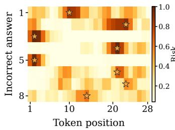  
(a) Local risk

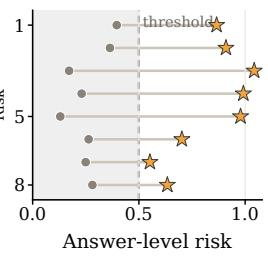  
(b) Aggregated risk  
Figure 5: Local-risk aggregation analysis. Panel (a) shows real incorrect generations with localized decoding-risk peaks. Panel (b) compares mean aggregation with TRACE local-peak risk on the same examples.

near the upper-left frontier, while different baseline families occupy model-dependent regions. Together, the table and figure show that TRACE+ reliably transfers across model families and scales.

## 4.3 Analysis and Ablations

Local-risk aggregation analysis. Figure 5 examines whether TRACE captures risk that is lost by global aggregation. We select real incorrect generations from the main evaluation set whose decoding traces contain localized high-risk regions, and compute two scores on the same traces: mean aggregation, which averages token-level risk over the whole answer, and TRACE local-peak risk, which preserves the largest localized risk region. As shown in Figure 5(a), many incorrect answers contain sparse risk peaks rather than uniformly high uncertainty. Figure 5(b) shows that mean aggregation often assigns these examples modest answer-level risk because the peak is diluted by many low-risk tokens, whereas TRACE local-peak risk remains high. This supports our central hypothesis that answer-level failures can be locally concentrated in the decoding trajectory, and that preserving local risk structure provides information beyond global likelihood or entropy summaries.

<table><tr><td>Variant</td><td>Brier ↓</td><td>AUROC ↑</td><td>ECE↓</td></tr><tr><td>TRACE (raw)</td><td>0.182</td><td>0.772</td><td>0.163</td></tr><tr><td>TRACE + scalar calib.</td><td>0.154</td><td>0.772</td><td>0.092</td></tr><tr><td>Learned  $( D , M , L )$ </td><td>0.140</td><td>0.778</td><td>0.054</td></tr><tr><td>TRACE+</td><td>0.137</td><td>0.792</td><td>0.054</td></tr></table>

Table 3: Bridge from TRACE to TRACE+, comparing calibration, learned operators, and richer trace features.

Localized-error analysis. We further evaluate whether TRACE is particularly effective on localized errors, where correctness depends on a compact semantic span. We distinguish these from globally diffuse failures and match each error slice with correct answers by task and answer length. TRACE+ improves localized-error AUROC from 0.778 for the strongest non-TRACE baseline to 0.805, while TRACE reaches 0.796. Across number/arithmetic, entity/span, and factual-claim errors, TRACE+ obtains AUROC of 0.927, 0.836, and 0.607, respectively. These results show that localized decoding-trace uncertainty is informative when correctness hinges on a compact critical span. Detailed results are provided in Appendix E.3.

TRACE operator analysis. We next examine the contribution of the three risk operators in the TRACE score. Using position-decayed entropy D, local-window entropy M, or length-normalized surprisal L alone gives average AUROC of 0.751, 0.754, and 0.758, respectively, while their fixed combination improves to 0.772. A learned combination of the three operators reaches 0.776, indicating that the fixed TRACE formulation captures most of the benefit without task-specific fitting. Controlled perturbations show that disrupting risk positions reduces ranking quality, supporting position-sensitive local aggregation. Performance remains stable across broad variations of α, β, γ, λ, w, and ρ. Full results are provided in Appendix E.4.

<table><tr><td rowspan="2">Variant</td><td colspan="2">Main</td><td colspan="2">Cross</td></tr><tr><td>Brier ↓</td><td>AUROC↑</td><td>Brier ↓</td><td>AUROC ↑</td></tr><tr><td>TRACE+</td><td>0.137</td><td>0.792</td><td>0.120</td><td>0.817</td></tr><tr><td>+ seq. likelihood</td><td>0.139</td><td>0.787</td><td>0.121</td><td>0.816</td></tr><tr><td>w/o local entropy</td><td>0.138</td><td>0.786</td><td>0.121</td><td>0.812</td></tr><tr><td>w/o local surprisal</td><td>0.137</td><td>0.792</td><td>0.121</td><td>0.815</td></tr><tr><td>w/o trajectory slope</td><td>0.136</td><td>0.792</td><td>0.123</td><td>0.808</td></tr><tr><td>w/o length</td><td>0.151</td><td>0.757</td><td>0.127</td><td>0.792</td></tr><tr><td>Entropy-local only</td><td>0.150</td><td>0.760</td><td>0.129</td><td>0.786</td></tr><tr><td>Likelihood-local only</td><td>0.144</td><td>0.770</td><td>0.129</td><td>0.782</td></tr></table>

Table 4: Ablation of TRACE+ components in main and cross-model settings, reporting Brier and AUROC for feature removals and local-risk-only variants.

From TRACE to TRACE+. We further examine whether TRACE+ gains arise only from calibrating the fixed TRACE score or from richer trace features. As shown in Table 3, calibrating the TRACE scalar improves Brier from 0.182 to 0.154 while leaving AUROC unchanged at 0.772. Learning the three core operators further improves to 0.140 Brier and 0.778 AUROC, while the full TRACE+ reaches 0.137 and 0.792. Thus, TRACE+ improves ranking as well as probability calibration, showing that its gains extend beyond scalar post-hoc calibration.

TRACE+ feature ablations. Table 4 evaluates TRACE+ feature variants in the main four-task and seven-model cross-model settings. Our final TRACE+ uses only trace-derived features, excluding conventional selected-token likelihood summaries. Adding minimum token probability, geometric mean token probability, and lowprobability token rate slightly hurts performance, reducing main-setting AUROC from 0.792 to 0.787 and cross-model AUROC from 0.817 to 0.816. Feature-removal results further show that the trace signals are complementary. Entropy-only and likelihood-only variants are consistently weaker than TRACE+, while removing trajectory slope gives a marginal main-setting Brier gain but reduces cross-model AUROC from 0.817 to 0.808. We therefore retain the full trace-only feature set for stronger overall cross-model robustness.

Semantic fusion analysis. We further test whether localized trace risk is complementary to semantic reweighting. As shown in Table 5, adding TRACE components improves MARS (Bakman et al., 2024) from 0.173/0.754 to 0.141/0.775 Brier/AUROC and TokenSAR (Duan et al., 2024) from 0.174/0.738 to 0.141/0.781. Conversely, adding MARS to TRACE+ slightly worsens both metrics, while TokenSAR raises AUROC only marginally from 0.7920 to 0.7959 without improving Brier. Thus, localized trace risk strengthens semantic estimators, whereas semantic scores add little additional information beyond TRACE+.

<table><tr><td>Method</td><td>Brier ↓</td><td>AUROC ↑</td></tr><tr><td>MARS (Bakman et al., 2024)</td><td>0.1730</td><td>0.7540</td></tr><tr><td>MARS + TRACE</td><td>0.1410</td><td>0.7750</td></tr><tr><td>TokenSAR (Duan et al., 2024)</td><td>0.1740</td><td>0.7380</td></tr><tr><td>TokenSAR + TRACE</td><td>0.1410</td><td>0.7810</td></tr><tr><td>TRACE+</td><td>0.1371</td><td>0.7920</td></tr><tr><td>TRACE+ + MARS</td><td>0.1376</td><td>0.7910</td></tr><tr><td>TRACE+ + TokenSAR</td><td>0.1374</td><td>0.7959</td></tr></table>

Table 5: Semantic fusion between TRACE and the semantic confidence estimators MARS and TokenSAR.

Calibration-size robustness. Figure 6 (a) evaluates how TRACE+ scales with the size of the heldout calibration split on MLQA, SVAMP, TriviaQA, and TruthfulQA. With only 5% calibration data, TRACE+ already matches the strongest baseline in Brier score, although its AUROC is less stable. As the calibration split increases, TRACE+ improves consistently: from 20% onward, it achieves both the lowest Brier score and the highest AUROC among all compared estimators. At the default 35% split, TRACE+ obtains 0.137 Brier and 0.792 AUROC, outperforming SeqLogP / Total NLL at 0.148 Brier and 0.762 AUROC. This suggests that TRACE+ benefits from a modest calibration set, but does not require a large labeled split.

Reliability and selective prediction. Figure 6 (b) provides a complementary view of how the calibrated confidence scores behave. In the reliability diagram, TRACE+ stays close to the diagonal across confidence bins, indicating that its predicted confidence better matches empirical accuracy. The risk-coverage curve evaluates selective prediction by retaining the most confident answers at each coverage level under a rejection setting. TRACE+ yields lower risk over most coverage levels, showing that its confidence scores are useful not only as calibrated probabilities, but also for ranking which answers should be trusted in downstream use.

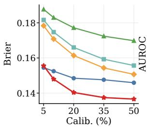

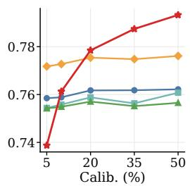  
(a) Calibration-size robustness

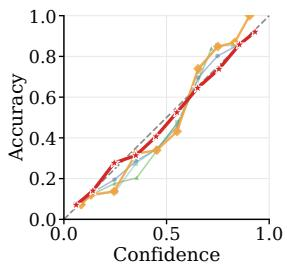

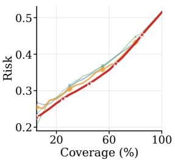  
(b) Reliability and selective prediction

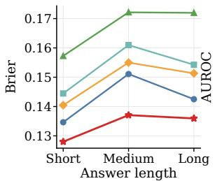

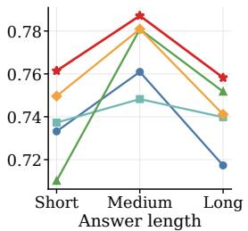  
(c) Length-stratified robustness  
Figure 6: Robustness and reliability analyses. TRACE+ remains strong across calibration sizes, reliability/selective prediction, and answer-length strata.

Length-stratified robustness. Figure 6 (c) tests whether TRACE+ mainly exploits answer-length effects. We split examples into short, medium, and long groups according to generated answer length and evaluate all methods under the same calibration protocol. TRACE+ maintains the lowest Brier score across all three groups and achieves the strongest AUROC in each group across length strata. The advantage remains clear for long answers, where sequence-likelihood scores are more sensitive to accumulated token probabilities. This indicates that TRACE+ is not simply learning a length proxy, but captures localized decoding-risk evidence that remains useful across lengths. Detailed results corresponding to Figure 6 are provided for completeness in Appendix E.5.

Cross-task calibration transfer. We further evaluate a stricter transfer setting where the calibrator is trained on three source tasks and directly evaluated on a held-out target task without target-task calibration labels. As shown in Table 6, TRACE+ preserves competitive correctness ranking: it slightly improves AUROC on MLQA (0.814 vs. 0.813) and TruthfulQA (0.659 vs. 0.644), while remaining close on SVAMP (0.842 vs. 0.843) and TriviaQA (0.832 vs. 0.835). However, Brier score degrades on tasks with substantially different correctness priors, especially MLQA (0.347 vs. 0.264) and TruthfulQA (0.212 vs. 0.137). This indicates that decoding-trace features transfer better as ranking signals than as fully calibrated probabilities, and supports our use of a small held-out target calibration split for TRACE+ in the main protocol.

<table><tr><td rowspan="2">Target</td><td colspan="2">Best Non-TRACE</td><td colspan="2">TRACE+</td><td colspan="2">Gain</td></tr><tr><td>Brier ↓ AUROC ↑ I</td><td></td><td></td><td>Brier ↓ AUROC ↑ Brier ↑ AUROC ↑</td><td></td><td></td></tr><tr><td>MLQA</td><td>0.264</td><td>0.813</td><td>0.347</td><td>0.814</td><td>-0.083</td><td>+0.001</td></tr><tr><td>SVAMP</td><td>0.144</td><td>0.843</td><td>0.140</td><td>0.842</td><td>+0.004</td><td>-0.001</td></tr><tr><td>TriviaQA</td><td>0.182</td><td>0.835</td><td>0.169</td><td>0.832</td><td>+0.013</td><td>-0.003</td></tr><tr><td>TruthfulQA</td><td>0.137</td><td>0.644</td><td>0.212</td><td>0.659</td><td>-0.075</td><td>+0.016</td></tr></table>

Table 6: Cross-task transfer against the strongest sourcecalibrated baseline on unseen held-out target tasks.

## 5 Conclusion

In this paper, we study general generation calibration and propose TRACE, a single-pass confidence estimator that models decoding-time uncertainty as a structured token-level trajectory. TRACE combines position-sensitive, local-peak, and length-normalized local risk operators to produce a label-free confidence score. TRACE+ learns richer trace features with a lightweight held-out calibrator to produce calibrated correctness probabilities. Across 19 baselines and eight LLMs, TRACE consistently improves correctness ranking over standard likelihood and entropy estimators, while TRACE+ further improves calibration and ranking, achieving the best overall Brier score and AUROC. Ablations show gains arise from localized decoding-trace evidence and remain robust across models, answer lengths, and calibration sizes.

## Limitations

TRACE requires token-level probabilities or entropy during decoding, which may be unavailable from closed-source APIs. Since TRACE estimates confidence from a single decoded answer, it complements retrieval, multi-sample consistency, and external verification for factual errors with little decoding-time instability. TRACE+ further requires a representative held-out calibration split.

## Acknowledgments

This work was supported by the National Natural Science Foundation of China (NSFC) under Grant No. 62306256 and the Natural Science Foundation of Guangdong Province under Grant No. 2025A1515010261.

## References

Marah Abdin, Jyoti Aneja, Hany Awadalla, Ahmed Awadallah, Ammar Ahmad Awan, Nguyen Bach, Amit Bahree, Arash Bakhtiari, Jianmin Bao, Harkirat Behl, Alon Benhaim, Misha Bilenko, Johan Bjorck, Sébastien Bubeck, Martin Cai, Qin Cai, Vishrav Chaudhary, Dong Chen, Dongdong Chen, and 110 others. 2024. Phi-3 technical report: A highly capable language model locally on your phone. Preprint, arXiv:2404.14219.

Lukas Aichberger, Kajetan Schweighofer, and Sepp Hochreiter. 2026. Rethinking uncertainty estimation in llms: A principled single-sequence measure. In International Conference on Learning Representations.

Yavuz Faruk Bakman, Duygu Nur Yaldiz, Baturalp Buyukates, Chenyang Tao, Dimitrios Dimitriadis, and Salman Avestimehr. 2024. MARS: Meaningaware response scoring for uncertainty estimation in generative LLMs. In Proceedings ofthe 62nd Annual Meeting of the Association for Computational Linguistics (Volume 1: Long Papers), pages 7752–7767, Bangkok, Thailand. Association for Computational Linguistics.

Glenn W. Brier. 1950. Verification of forecasts expressed in terms of probability. Monthly Weather Review, 78(1):1–3.

Wei Chen, Guoyang Ju, and Yuanyuan Qi. 2026. How confident is the first token? an uncertaintycalibrated prompt optimization framework for large language model classification and understanding. arXiv preprint arXiv:2603.18009.

Maciej Chrabaszcz, Aleksander Szymczyk, Marcin Sendera, Tomasz Trzcinski, and Sebastian Cygert. 2026. Monitoring the internal monologue: Probe trajectories reveal reasoning dynamics. In Mechanistic Interpretability Workshop at ICML 2026.

Shrey Desai and Greg Durrett. 2020. Calibration of pre-trained transformers. In Proceedings ofthe 2020 Conference on Empirical Methods in Natural Language Processing.

Jinhao Duan, Hao Cheng, Shiqi Wang, Alex Zavalny, Chenan Wang, Renjing Xu, Bhavya Kailkhura, and Kaidi Xu. 2024. Shifting attention to relevance: Towards the predictive uncertainty quantification of free-form large language models. In Proceedings of the 62nd Annual Meeting of the Association for Computational Linguistics (Volume 1: Long Papers),

pages 5050–5063, Bangkok, Thailand. Association for Computational Linguistics.

Tom Fawcett. 2006. An introduction to ROC analysis.Pattern Recognition Letters, 27(8):861–874.

Lorenzo Jaime Yu Flores, Ori Ernst, and Jackie CK Cheung. 2025. Improving the calibration of confidence scores in text generation using the output distribution’s characteristics. In Proceedings ofthe 63rd Annual Meeting ofthe Associationfor Computational Linguistics (Volume 2: Short Papers), pages 172– 182, Vienna, Austria. Association for Computational Linguistics.

Aaron Grattafiori, Abhimanyu Dubey, Abhinav Jauhri, Abhinav Pandey, Abhishek Kadian, Ahmad Al-Dahle, Aiesha Letman, Akhil Mathur, Alan Schelten, Alex Vaughan, et al. 2024. The llama 3 herd of models. arXiv preprint arXiv:2407.21783.

Chuan Guo, Geoff Pleiss, Yu Sun, and Kilian Q. Weinberger. 2017. On calibration of modern neural networks. In Proceedings of the 34th International Conference on Machine Learning, volume 70 of Proceedings of Machine Learning Research, pages 1321– 1330. PMLR.

Dan Hendrycks and Kevin Gimpel. 2017. A baseline for detecting misclassified and out-of-distribution examples in neural networks. In International Conference on Learning Representations.

Ziwei Ji, Delong Chen, Etsuko Ishii, Samuel Cahyawijaya, Yejin Bang, Bryan Wilie, and Pascale Fung. 2024. LLM internal states reveal hallucination risk faced with a query. In Proceedings ofthe 7th BlackboxNLP Workshop: Analyzing and Interpreting Neural Networksfor NLP, pages 88–104. Association for Computational Linguistics.

Albert Q. Jiang, Alexandre Sablayrolles, Arthur Mensch, Chris Bamford, Devendra Singh Chaplot, Diego de las Casas, Florian Bressand, Gianna Lengyel, Guillaume Lample, Lucile Saulnier, Lélio Renard Lavaud, Marie-Anne Lachaux, Pierre Stock, Teven Le Scao, Thibaut Lavril, Thomas Wang, Timothée Lacroix, and William El Sayed. 2023. Mistral 7b. arXiv preprint arXiv:2310.06825.

Zhengbao Jiang, Jun Araki, Haibo Ding, and Graham Neubig. 2021. How can we know when language models know? on the calibration of language models for question answering. In Transactions of the Association for Computational Linguistics, volume 9, pages 962–977.

Mandar Joshi, Eunsol Choi, Daniel Weld, and Luke Zettlemoyer. 2017. TriviaQA: A large scale distantly supervised challenge dataset for reading comprehension. In Proceedings of the 55th Annual Meeting of the Association for Computational Linguistics (Volume 1: Long Papers), pages 1601–1611. Association for Computational Linguistics.

Saurav Kadavath, Tom Conerly, Amanda Askell, Tom Henighan, Dawn Drain, Ethan Perez, Nicholas Schiefer, Zac Hatfield Dodds, Nova DasSarma, Eli Tran-Johnson, Scott Johnston, Sheer El-Showk, Andy Jones, Nelson Elhage, Tristan Hume, Anna Chen, Yuntao Bai, Samuel R. Bowman, Stanislav Fort, and 17 others. 2022. Language models (mostly) know what they know. In arXiv preprint arXiv:2207.05221.

Lorenz Kuhn, Yarin Gal, and Sebastian Farquhar. 2023. Semantic uncertainty: Linguistic invariances for uncertainty estimation in natural language generation. In International Conference on Learning Representations.

Volodymyr Kuleshov, Nathan Fenner, and Stefano Ermon. 2018. Accurate uncertainties for deep learning using calibrated regression. In Proceedings of the 35th International Conference on Machine Learning, volume 80 of Proceedings of Machine Learning Research, pages 2796–2804. PMLR.

Patrick Lewis, Barlas Oguz, Ruty Rinott, Sebastian Riedel, and Holger Schwenk. 2020. MLQA: Evaluating cross-lingual extractive question answering. In Proceedings of the 58th Annual Meeting of the Association for Computational Linguistics, pages 7315– 7330. Association for Computational Linguistics.

Xiaomin Li, Zhou Yu, Ziji Zhang, Yingying Zhuang, Swair Shah, Narayanan Sadagopan, and Anurag Beniwal. 2026. Semantic volume: Quantifying and detecting both external and internal uncertainty in llms. In Proceedings of the AAAI Conference on Artificial Intelligence, volume 40, pages 31751–31759.

Stephanie Lin, Jacob Hilton, and Owain Evans. 2022a. Teaching models to express their uncertainty in words. Transactions on Machine Learning Research.

Stephanie Lin, Jacob Hilton, and Owain Evans. 2022b. TruthfulQA: Measuring how models mimic human falsehoods. In Proceedings ofthe 60th Annual Meeting ofthe Associationfor Computational Linguistics (Volume 1: Long Papers), pages 3214–3252. Association for Computational Linguistics.

Andrey Malinin and Mark Gales. 2021. Uncertainty estimation in autoregressive structured prediction. In International Conference on Learning Representations.

Potsawee Manakul, Adian Liusie, and Mark Gales. 2023. Selfcheckgpt: Zero-resource black-box hallucination detection for generative large language models. In Proceedings of the 2023 conference on empirical methods in natural language processing, pages 9004– 9017.

Mahdi Pakdaman Naeini, Gregory Cooper, and Milos Hauskrecht. 2015. Obtaining well calibrated probabilities using bayesian binning. In Proceedings of the AAAI conference on artificial intelligence, volume 29.

Alexandru Niculescu-Mizil and Rich Caruana. 2005. Predicting good probabilities with supervised learning. In Proceedings ofthe 22nd International Conference on Machine Learning, ICML ’05, page 625–632, New York, NY, USA. Association for Computing Machinery.

Arkil Patel, Satwik Bhattamishra, and Navin Goyal. 2021. Are NLP models really able to solve simple math word problems? In Proceedings of the 2021 Conference of the North American Chapter of the Associationfor Computational Linguistics: Human Language Technologies, pages 2080–2094. Association for Computational Linguistics.

John C. Platt. 1999. Probabilistic outputs for support vector machines and comparisons to regularized likelihood methods. In Advances in Large Margin Classifiers, pages 61–74. MIT Press.

Ahmad Shapiro, Karan Taneja, and Ashok Goel. 2026. Halt: Hallucination assessment via log-probs as time series. arXiv preprint arXiv:2602.02888.

Gaurang Sriramanan, Siddhant Bharti, Vinu Sankar Sadasivan, Shoumik Saha, Priyatham Kattakinda, and Soheil Feizi. 2024. Llm-check: Investigating detection of hallucinations in large language models. Advances in neural information processing systems, 37:34188–34216.

Gemma Team, Morgane Riviere, Shreya Pathak, Pier Giuseppe Sessa, Cassidy Hardin, Surya Bhupatiraju, Léonard Hussenot, Thomas Mesnard, Bobak Shahriari, Alexandre Ramé, et al. 2024. Gemma 2: Improving open language models at a practical size. arXiv preprint arXiv:2408.00118.

Katherine Tian, Eric Mitchell, Allan Zhou, Archit Sharma, Rafael Rafailov, Huaxiu Yao, Chelsea Finn, and Christopher D. Manning. 2023. Just ask for calibration: Strategies for eliciting calibrated confidence scores from language models fine-tuned with human feedback. In Proceedings of the 2023 Conference on Empirical Methods in Natural Language Processing, pages 5433–5442. Association for Computational Linguistics.

Xuezhi Wang, Jason Wei, Dale Schuurmans, Quoc V. Le, Ed H. Chi, Sharan Narang, Aakanksha Chowdhery, and Denny Zhou. 2023. Self-consistency improves chain of thought reasoning in language models. In International Conference on Learning Representations.

Miao Xiong, Zhiyuan Hu, Xinyang Lu, Yifei Li, Jie Fu, Junxian He, and Bryan Hooi. 2024. Can LLMs express their uncertainty? an empirical evaluation of confidence elicitation in LLMs. In International Conference on Learning Representations.

Duygu Nur Yaldiz, Yavuz Faruk Bakman, Baturalp Buyukates, Chenyang Tao, Anil Ramakrishna, Dimitrios Dimitriadis, Jieyu Zhao, and Salman Avestimehr. 2025. Do not design, learn: A trainable scoring function for uncertainty estimation in generative

LLMs. In Findings of the Association for Computational Linguistics: NAACL 2025, pages 691–713. Association for Computational Linguistics.

An Yang, Anfeng Li, Baosong Yang, Beichen Zhang, Binyuan Hui, Bo Zheng, Bowen Yu, Chang Gao, Chengen Huang, Chenxu Lv, Chujie Zheng, Dayiheng Liu, Fan Zhou, Fei Huang, Feng Hu, Hao Ge, Haoran Wei, Huan Lin, Jialong Tang, and 41 others. 2025. Qwen3 technical report. Preprint, arXiv:2505.09388.

An Yang, Baosong Yang, Binyuan Hui, Bo Zheng, Bowen Yu, Chang Zhou, Chengpeng Li, Chengyuan Li, Dayiheng Liu, Fei Huang, Guanting Dong, Haoran Wei, Huan Lin, Jialong Tang, Jialin Wang, Jian Yang, Jianhong Tu, Jianwei Zhang, Jianxin Ma, and 43 others. 2024a. Qwen2 technical report. Preprint, arXiv:2407.10671.

An Yang, Baosong Yang, Beichen Zhang, Binyuan Hui, Bo Zheng, Bowen Yu, Chengyuan Li, Dayiheng Liu, Fei Huang, Haoran Wei, et al. 2024b. Qwen2.5 technical report. arXiv preprint arXiv:2412.15115.

Gal Yona, Amir Feder, and Itay Laish. 2022. Useful confidence measures: Beyond the max score. Preprint, arXiv:2210.14070.

Bianca Zadrozny and Charles Elkan. 2002. Transforming classifier scores into accurate multiclass probability estimates. In Proceedings of the Eighth ACM SIGKDD International Conference on Knowledge Discovery and Data Mining, KDD ’02, page 694–699, New York, NY, USA. Association for Computing Machinery.

Chenghua Zhu, Siyan Wu, Xiangkang Zeng, Zishan Xu, Zhaolu Kang, Yifu Guo, Yuquan Lu, Junduan Huang, and Guojing Zhou. 2026. Edis: Diagnosing llm reasoning via entropy dynamics. arXiv preprint arXiv:2602.01288.

## Appendix Contents

A Localized Risk Spike Analysis B TRACE Feature Definitions C Protocol Comparison D Baseline and Protocol Details E Supplementary Experimental Results E.1 Comparison with Broader UQ Methods E.2 Detailed Cross-Model Results E.3 Localized-Error Analysis E.4 TRACE Operator Analysis E.5 Robustness and Reliability Analyses

## A Localized Risk Spike Analysis

This section reports the tabular data and additional modeling results corresponding to Figure 3 in the main paper. The goal is to make the localizedrisk analysis fully reproducible and to quantify the trends visualized in the figure. For each decoded answer, we compute the mean token-level risk, which represents global aggregation, and a spike gap, defined as the excess of the largest local-risk region over the global mean. Table 7 reports the underlying strata used in the figure: examples are grouped by mean risk and then split into low- and high-spike groups. Within the same mean-risk stratum, highspike examples consistently have higher incorrect rates, showing that localized spikes provide risk information beyond global mean aggregation.

<table><tr><td>Mean risk Spike gap</td><td></td><td>n Mean risk Spike gap Incorr. rate</td></tr><tr><td>Low Low</td><td>313</td><td>0.064 0.023</td></tr><tr><td>Low High</td><td>312</td><td>0.224 0.090 0.182 0.554</td></tr><tr><td>Mid Low</td><td>313</td><td>0.178 0.102 0.591</td></tr><tr><td>Mid High</td><td>313 0.189</td><td>0.390 0.843</td></tr><tr><td>High Low</td><td>313 0.377</td><td>0.139 0.850</td></tr><tr><td>High High</td><td>312 0.321</td><td>0.454 0.904</td></tr></table>

Table 7: Incorrect rates by mean risk and spike gap.

Table 8 gives a complementary modeling view of the same phenomenon. Mean risk alone provides a strong global summary, but adding spike-gap information improves AUROC from 0.774 to 0.808 and reduces Brier from 0.179 to 0.164. The full TRACE local-feature set further improves to 0.818 AUROC and 0.159 Brier, confirming that the visual pattern in Figure 3 corresponds to measurable predictive signal.

<table><tr><td>Feature set</td><td>AUROC ↑</td><td>Brier ↓</td></tr><tr><td>Mean risk</td><td> $0 . 7 7 4 \pm 0 . 0 1 5$ </td><td> $0 . 1 7 9 \pm 0 . 0 0 4$ </td></tr><tr><td>Max token risk</td><td> $0 . 7 8 4 \pm 0 . 0 1 4$ </td><td> $0 . 1 7 3 \pm 0 . 0 0 5$ </td></tr><tr><td>Spike gap</td><td> $0 . 7 6 1 \pm 0 . 0 1 8$ </td><td> $0 . 1 8 4 \pm 0 . 0 0 5$ </td></tr><tr><td>Mean risk + spike gap</td><td> $0 . 8 0 8 \pm 0 . 0 1 3$ </td><td> $0 . 1 6 4 \pm 0 . 0 0 5$ </td></tr><tr><td>TRACE local features</td><td> $\mathbf { 0 . 8 1 8 \pm 0 . 0 1 2 }$ </td><td> $\mathbf { 0 . 1 5 9 \pm 0 . 0 0 5 }$ </td></tr></table>

Table 8: Predictive value of localized risk features.

## B TRACE Feature Definitions

This section summarizes the features used by TRACE and TRACE+. For each decoded answer, we record the selected-token probability and the predictive entropy at each decoding step. These values form two token-level traces: selected-token surprisal and token entropy. TRACE estimates answerlevel risk from the structure of this decoding trace, with emphasis on where uncertainty appears rather than only how large the average uncertainty is.

TRACE score. TRACE combines three fixed risk signals. First, it uses a position-decayed entropy score, which gives more weight to uncertainty at earlier decoding steps. Second, it uses the maximum entropy over a short local window, which preserves localized uncertainty spikes. Third, it uses a length-normalized total surprisal term, which retains selected-token likelihood information without applying the full penalty of unnormalized sequence likelihood. In all experiments, TRACE uses the same fixed configuration:

$$
\begin{array} { r l } { { } } & { { R _ { \mathrm { T R A C E } } = 0 . 4 0 D _ { 2 } ( H ) + 0 . 4 0 M _ { H } ^ { ( 4 ) } } } \\ { { } } & { { + 0 . 2 0 L _ { 1 / 4 } ( s ) , } } \end{array}\tag{2}
$$

where $D _ { 2 } ( H )$ is the position-decayed entropy score, $M _ { H } ^ { ( 4 ) }$ is the maximum four-token entropy window, and $L _ { 1 / 4 } ( s )$ is the length-normalized surprisal term. The raw TRACE confidence is ex $\scriptstyle \operatorname { \mathrm { : p } } ( - R _ { \mathrm { T R A C E } } )$ ). This score is used directly for ranking metrics; for Brier score and ECE, it is calibrated with the same held-out protocol as the baselines.

TRACE+ features. TRACE+ uses a lightweight logistic calibrator over trace-derived features. Table 9 summarizes the feature groups. The final TRACE+ variant removes conventional selectedtoken likelihood summaries, so the reported TRACE+ results use only trace-localization features. The last three rows in Table 9 are included only in the “+ seq. likelihood” ablation.

<table><tr><td>Method</td><td>Same</td><td>Single</td><td>Extra</td><td>Sem.</td><td>Calib.</td></tr><tr><td>Likelihood / entropy</td><td>√</td><td>√</td><td>x</td><td>x</td><td>x</td></tr><tr><td>Beam-based scores</td><td>√</td><td>△</td><td>x</td><td>x</td><td>x</td></tr><tr><td>TokenSAR</td><td>√</td><td>√</td><td>x</td><td>√</td><td>x</td></tr><tr><td>MARS</td><td>√</td><td>√</td><td>x</td><td>√</td><td>x</td></tr><tr><td>SelfCheckGPT</td><td>√</td><td>x</td><td>√</td><td>△</td><td>x</td></tr><tr><td>Semantic Entropy</td><td>x</td><td>x</td><td>√</td><td>√</td><td>x</td></tr><tr><td>TRACE</td><td>√</td><td>√</td><td>x</td><td>x</td><td>x</td></tr><tr><td>TRACE+</td><td>√</td><td>√</td><td>x</td><td>x</td><td>√</td></tr></table>

Table 10: Protocol comparison of confidence estimators by answer preservation, single-pass inference, extra generations, semantic modeling, and calibration.

<table><tr><td>Group</td><td>Features</td></tr><tr><td>Early entropy Global entropy Length Trajectory Local entropy</td><td>First-3 entropy confidence Mean entropy confidence Log answer length Entropy slope Decayed entropy confidence (λ=2, 4)</td></tr><tr><td>Local surprisal</td><td>Decayed surprisal confidence (λ=2,4) Excluded likelihood Minimum token probability Excluded likelihood Geometric mean token probability</td></tr></table>

Table 9: TRACE+ feature groups and definitions.

## C Protocol comparison

This section summarizes the inference assumptions of representative confidence estimators. Table 10 compares whether each method scores the original decoded answer, can be computed from a single generation pass, requires additional generations, uses a semantic modeling component, or learns a held-out calibrator. Likelihood- and entropy-based scores are inexpensive and single-pass, but they typically collapse the decoding trace into global statistics. Beam-based scores still preserve the evaluated answer, but require additional beam statistics from the same prompt. Sampling-based methods such as SelfCheckGPT and Semantic Entropy can capture uncertainty beyond a single decoded answer, but require extra generations and may no longer score exactly the same answer under the same inference workflow. TRACE is designed for the stricter single-pass, decoded-answer-preserving setting, while TRACE+ adds only a lightweight held-out calibrator for calibrated probabilities.

## D Baseline and Protocol Details

We compare TRACE+ against a broad pool of single-pass and near-single-pass confidence estimators. For a generated answer of length T, let $p _ { t }$ denote the probability assigned to the selected token at decoding step t, and let Ht denote the predictive entropy at that step. All likelihood- and entropybased baselines are computed from the same generation trace used by TRACE.

## Token- and sequence-likelihood baselines.

• First-Token Prob. Probability assigned to the first generated token (Chen et al., 2026).

• MeanProb. Arithmetic mean of selected-token probabilities over the generated answer (Yona et al., 2022; Flores et al., 2025).

• Len-Norm LogP. Length-normalized sequence likelihood, exp $\begin{array} { r } { \left( \frac { 1 } { T } \sum _ { t = 1 } ^ { T } \log p _ { t } \right) } \end{array}$ (Yona et al., 2022; Bakman et al., 2024).

• SeqLogP / Total NLL. Unnormalized sequence likelihood, exp $\left( \sum _ { t = 1 } ^ { T } \log p _ { t } \right)$ , which preserves answer-length effects (Aichberger et al., 2026).

• MinProb. Minimum selected-token probability over the generated answer (Manakul et al., 2023).

• High-Prob Token Rate. Fraction of generated tokens whose selected-token probability exceeds a fixed highconfidence threshold, adapted from probability-bin trajectory summaries (Chrabaszcz et al., 2026).

## Entropy- and position-based baselines.

• Mean Token Entropy. Negative mean token entropy over the generated answer (Yona et al., 2022; Flores et al., 2025).

• Max Token Entropy. Negative maximum token entropy over the generated answer (Manakul et al., 2023).

• First-k Entropy. Negative mean entropy over the first k generated positions, extending last-token entropy used in prior uncertainty estimation (Chen et al., 2026).

• Last-k Entropy. Negative mean entropy over the last k generated positions (Li et al., 2026).

## Trajectory-diagnostic baselines.

• Windowed Entropy. Minimum local-window uncertainty score along the decoding trajectory (Sriramanan et al., 2024).

• Entropy Variance. Negative variance of token entropies along the decoding trajectory (Zhu et al., 2026).

• Entropy Slope. Negative linear slope of token entropy over decoding positions (Zhu et al., 2026).

• Token-Prob Slope. Linear slope of selected-token probabilities over decoding positions, motivated by temporal log-probability modeling (Shapiro et al., 2026).

## Beam-distribution baselines.

• Beam-Ratio. Probability gap between the best beam and lower-ranked beams (Flores et al., 2025).

• Beam-TailThinness. Concentration of normalized beamlevel sequence probabilities (Flores et al., 2025).

• Beam Entropy. Negative entropy of the normalized beamlevel sequence distribution (Flores et al., 2025).

## Semantic-reweighting baselines.

• TokenSAR. Token-likelihood aggregation reweighted by token semantic relevance (Duan et al., 2024).

• MARS. Meaning-aware token-likelihood aggregation using semantic contribution weights (Bakman et al., 2024).

Scoring and calibration protocol. For AUROC, we use the raw score direction after converting uncertainty values into confidence scores when necessary. For Brier score and ECE, each scalar baseline score is mapped to a calibrated probability using the same held-out calibration split as TRACE+. Beam-Ratio, Beam-TailThinness, and Beam Entropy rely on beam-level output-distribution statistics from the same prompt, and are therefore near-single-pass rather than strictly singlepass. TokenSAR and MARS use semantic relevance or contribution weights to reweight token-level likelihood signals.

Protocol assumptions. Table 10 compares representative confidence-estimation protocols along five inference assumptions:

• Same indicates whether a method scores the original decoded answer without replacing it.

• Single indicates whether the method can be computed from a single decoding pass.

• Extra indicates whether additional generations are required.

• Sem. indicates whether the method uses a semantic module, such as semantic relevance scoring, semantic equivalence grouping, or semantic consistency checking.

• Calib. indicates whether the method itself learns a held-out calibrator.

## Protocol comparison details.

• Likelihood and entropy baselines. These methods are single-pass and answer-preserving, but reduce the decoding process to global token- or sequence-level statistics (Yona et al., 2022; Aichberger et al., 2026).

• Beam-distribution methods. These methods also preserve the evaluated answer, but require beam-level statistics from the same prompt; we therefore mark them as near-singlepass (Flores et al., 2025).

• Semantic reweighting methods. TokenSAR (Duan et al., 2024) and MARS (Bakman et al., 2024) remain answer-preserving, but use semantic relevance or meaningcontribution estimates to reweight token-level likelihood signals.

• Sampling-based methods. SelfCheckGPT requires additional generations and may optionally use semantic comparison across sampled responses (Manakul et al., 2023).

• Semantic Entropy. Semantic Entropy requires multiple generations and semantic equivalence modeling, and therefore does not operate on a single fixed decoded answer (Kuhn et al., 2023).

## TRACE protocol.

• TRACE. TRACE differs from the above alternatives by using only the token-level decoding trace of the original answer: selected-token surprisal, predictive entropy, and localized trajectory features. It does not require additional samples, semantic modules, external verifiers, or LLM-asa-judge labels.

• TRACE+. TRACE+ uses the same trace-only features at inference time, but learns a lightweight held-out calibrator to map trace-derived risk patterns into calibrated answerlevel probabilities.

• Calibration fairness. For fair comparison on probability metrics, scalar baselines are also mapped through the same held-out calibration protocol when computing Brier score and ECE.

## E Supplementary Experimental Results

## E.1 Comparison with Broader UQ Methods

We additionally compare TRACE and TRACE+ with uncertainty-estimation methods beyond tokenlikelihood, entropy, and semantic-reweighting baselines. These include LARS (Yaldiz et al., 2025),

P(True) (Kadavath et al., 2022), verbalized confidence (Tian et al., 2023), and an internal-state probe (Ji et al., 2024).

Table 12 reports average performance over MLQA, SVAMP, TriviaQA, and TruthfulQA, together with the additional requirements of each method: E denotes extra inference, H hidden-state access, L labeled training, and C held-out calibration labels. TRACE achieves the best AUROC without extra inference or training, while TRACE+ achieves the best overall Brier and AUROC with held-out calibration labels.

## E.2 Detailed Cross-Model Results

Table 13 reports the non-TRACE estimators that define the Best Non-TRACE columns in Table 2. The best Brier and best AUROC estimators are selected independently for each target model after averaging over SVAMP, TriviaQA, and TruthfulQA. Table 11 further expands the task-level comparisons used to compute the Task Wins columns.

## E.3 Localized-Error Analysis

We further analyze whether decoding-trace localization is particularly useful for errors whose correctness depends on a compact semantic span. We divide incorrect generations into two groups. Localized errors are failures determined by a compact part of the answer, including number/arithmetic errors, incorrect entities or spans, and unsupported factual claims. Global errors include off-topic, incoherent, abstaining, or multi-span failures. For each error slice, we compare against correct answers matched by task and answer length.

Localized versus global errors. Table 14 reports discrimination performance for localized and global errors. TRACE and TRACE+ improve localized-error AUROC from 0.778 for the strongest non-TRACE baseline to 0.796 and 0.805, respectively. The advantage also holds at low-FPR operating points: TRACE performs best at 5% FPR, while TRACE+ achieves the highest TPR at 10% and 20% FPR and the strongest partial AU-ROC below 10% FPR. For global errors, the fixed TRACE score achieves the highest AUROC among the compared methods. These results suggest that preserving localized decoding uncertainty is particularly useful for compact-span failures, while the fixed TRACE aggregation also remains effective for more diffuse generation errors.

<table><tr><td rowspan="2">Model</td><td rowspan="2">Task</td><td colspan="4">Brier comparison</td><td colspan="4">AUROC comparison</td></tr><tr><td>Best estimator</td><td>Base ↓</td><td>TRACE+↓</td><td>Δ↑</td><td>Best estimator</td><td>Base ↑</td><td>TRACE+ ↑</td><td>Δ↑</td></tr><tr><td>Llama-3.1-8B</td><td>SVAMP</td><td>High-Prob Token Rate</td><td>0.134</td><td>0.064</td><td>+0.071</td><td>Mean Token Entropy</td><td>0.939</td><td>0.974</td><td>+0.035</td></tr><tr><td></td><td>TriviaQA</td><td>First-Token Prob.</td><td>0.161</td><td>0.158</td><td></td><td>+0.003 First-Token Prob.</td><td>0.798</td><td>0.801</td><td>+0.003</td></tr><tr><td></td><td>TQA-Gen</td><td>First-Token Prob.</td><td>0.088</td><td>0.085</td><td>+0.003</td><td>First-Token Prob.</td><td>0.646</td><td>0.683</td><td>+0.037</td></tr><tr><td>Mistral-7B</td><td>SVAMP</td><td>SeqLogP / Total NLL</td><td>0.190</td><td>0.178</td><td></td><td>+0.012 TokenSAR</td><td>0.824</td><td>0.808</td><td>-0.016</td></tr><tr><td></td><td>TriviaQA</td><td>First-Token Prob.</td><td>0.180</td><td>0.165</td><td>+0.015</td><td>Max Token Entropy</td><td>0.799</td><td>0.823</td><td>+0.024</td></tr><tr><td></td><td>TQA-Gen</td><td>Windowed Entropy</td><td>0.104</td><td>0.096</td><td></td><td>+0.008 First-k Entropy</td><td>0.694</td><td>0.739</td><td>+0.046</td></tr><tr><td>Phi-3.5-MoE</td><td>SVAMP</td><td>SeqLogP / Total NLL</td><td>0.119</td><td>0.105</td><td></td><td>+0.014 SeqLogP / Total NLL</td><td>0.923</td><td>0.928</td><td>+0.004</td></tr><tr><td></td><td>TriviaQA</td><td>First-Token Prob.</td><td>0.190</td><td>0.174</td><td>+0.016</td><td>First-Token Prob.</td><td>0.761</td><td>0.784</td><td>+0.024</td></tr><tr><td></td><td>TQA-Gen</td><td>First-k Entropy</td><td>0.089</td><td>0.084</td><td></td><td>+0.005 First-k Entropy</td><td>0.743</td><td>0.768</td><td>+0.025</td></tr><tr><td>Qwen2-57B</td><td>SVAMP</td><td>Beam-TailThinness</td><td>0.174</td><td>0.154</td><td>+0.020</td><td>Max Token Entropy</td><td>0.567</td><td>0.848</td><td>+0.281</td></tr><tr><td></td><td>TriviaQA</td><td>MinProb</td><td>0.185</td><td>0.180</td><td>+0.006</td><td>Max Token Entropy</td><td>0.781</td><td>0.780</td><td>-0.001</td></tr><tr><td></td><td>TQA-Gen</td><td>SeqLogP / Total NLL</td><td>0.099</td><td>0.096</td><td></td><td>+0.004 SeqLogP / Total NLL</td><td>0.821</td><td>0.828</td><td>+0.007</td></tr><tr><td>Llama-3.1-70B</td><td>SVAMP</td><td>SeqLogP / Total NLL</td><td>0.095</td><td>0.085</td><td>+0.010</td><td>Last-k Entropy</td><td>0.895</td><td>0.889</td><td>-0.007</td></tr><tr><td></td><td>TriviaQA</td><td>SeqLogP / Total NLL</td><td>0.116</td><td>0.108</td><td>+0.008</td><td>SeqLogP / Total NLL</td><td>0.842</td><td>0.853</td><td>+0.011</td></tr><tr><td></td><td>TQA-Gen</td><td>SeqLogP / Total NLL</td><td>0.102</td><td>0.100</td><td>+0.003</td><td>SeqLogP / Total NLL</td><td>0.773</td><td>0.789</td><td>+0.016</td></tr><tr><td>Qwen3-32B</td><td>SVAMP</td><td>MARS</td><td>0.020</td><td>0.017</td><td>+0.003</td><td>Entropy Slope</td><td>0.836</td><td>0.871</td><td>+0.035</td></tr><tr><td></td><td>TriviaQA</td><td>First-Token Prob.</td><td>0.212</td><td>0.207</td><td>+0.005</td><td>First-Token Prob.</td><td>0.720</td><td>0.728</td><td>+0.007</td></tr><tr><td></td><td>TQA-Gen</td><td>First-Token Prob.</td><td>0.107</td><td>0.099</td><td>+0.007</td><td>First-Token Prob.</td><td>0.736</td><td>0.773</td><td>+0.037</td></tr><tr><td>Gemma-2-9B</td><td>SVAMP</td><td>Beam-TailThinness</td><td>0.161</td><td>0.155</td><td>+0.006</td><td>SeqLogP / Total NLL</td><td>0.828</td><td>0.851</td><td>+0.023</td></tr><tr><td></td><td>TriviaQA</td><td>SeqLogP / Total NLL</td><td>0.140</td><td>0.132</td><td>+0.007</td><td>SeqLogP / Total NLL</td><td>0.878</td><td>0.878</td><td>-0.001</td></tr><tr><td></td><td>TQA-Gen</td><td>SeqLogP / Total NLL</td><td>0.090</td><td>0.089</td><td>+0.000</td><td>SeqLogP / Total NLL</td><td>0.748</td><td>0.768</td><td>+0.020</td></tr></table>

Table 11: Task-level details for cross-model generalization.

<table><tr><td>Method</td><td>Req.</td><td>Brier ↓</td><td>AUROC ↑</td></tr><tr><td>MARS</td><td>一</td><td>0.173</td><td>0.754</td></tr><tr><td>TokenSAR</td><td>一</td><td>0.174</td><td>0.738</td></tr><tr><td>LARS</td><td>L</td><td>0.157</td><td>0.758</td></tr><tr><td>P(True)</td><td>E</td><td>0.178</td><td>0.715</td></tr><tr><td>Verbalized conf.</td><td>E</td><td>0.183</td><td>0.697</td></tr><tr><td>Internal-state probe</td><td>H+L</td><td>0.159</td><td>0.766</td></tr><tr><td>TRACE</td><td>一</td><td>0.154</td><td>0.772</td></tr><tr><td>TRACE+</td><td>C</td><td>0.137</td><td>0.792</td></tr></table>

Table 12: Comparison with uncertainty-estimation meth ods for answer-level confidence and ranking.

Localized-error subtypes. We decompose the localized set into number/arithmetic, entity/span, and factual-claim errors. As shown in Table 18, TRACE+ achieves the strongest AUROC on all three subtypes, reaching 0.927, 0.836, and 0.607, respectively. Compared with the strongest non-TRACE baseline for each subtype, these correspond to gains of 0.048, 0.035, and 0.018. The improvement is largest for number/arithmetic and entity/span errors, where correctness often turns on a short critical token span. The trend persists for factual-claim errors despite a smaller subset.

## E.4 TRACE Operator Analysis

This section provides additional analysis of the three operators used in the fixed TRACE score: position-decayed entropy D, local-window entropy M, and length-normalized surprisal L. We examine their individual contributions, the importance of preserving positional structure, and robustness to the fixed hyperparameter configuration.

Operator contributions. Table 15 compares each operator individually with their fixed and learned combinations. The three individual operators obtain similar but complementary discrimination performance, with average AUROC ranging from 0.751 to 0.758. Combining them in TRACE improves AUROC to 0.772, while a learned combination of the same operator outputs reaches 0.776. Thus, the fixed TRACE aggregation captures most of the benefit of combining the three risk signals without task-specific fitting.

Position sensitivity. We further test whether TRACE benefits from where risk occurs along the decoding trajectory rather than only from the overall distribution of token-level risk. We perturb the positions of the risk signals while preserving their values and recompute the TRACE ranking score. As shown in Table 17, this perturbation consistently reduces AUROC across all four tasks, lowering the average from 0.772 to 0.755. The result indicates that the ordering and location of uncertainty provide useful information beyond the marginal magnitude of token-level risk.

Hyperparameter sensitivity. We evaluate the robustness of TRACE to its fixed hyperparameters by varying one parameter at a time. When varying one mixture weight, the other two weights are renormalized according to their original ratio. As shown in Table 16, performance remains stable across broad parameter ranges. Across all tested settings, Brier varies from 0.152 to 0.160 and AUROC from 0.763 to 0.775, indicating that TRACE does not rely on a narrow hyperparameter configuration.

<table><tr><td>Model</td><td colspan="3">Best Non-TRACE for Brier</td><td colspan="3">Best Non-TRACE for AUROC</td><td colspan="2">TRACE+</td></tr><tr><td></td><td>Estimator</td><td>Brier ↓</td><td>∆Brier ↑</td><td>Estimator</td><td>AUROC ↑</td><td>∆AUROC ↑</td><td>Brier ↓</td><td>AUROC ↑</td></tr><tr><td>Llama-3.1-8B-Instruct</td><td>High-Prob Token Rate</td><td>0.141</td><td>+0.039</td><td>Mean Token Entropy</td><td>0.747</td><td>+0.072</td><td>0.102</td><td>0.819</td></tr><tr><td>Mistral-7B-Instruct-v0.3</td><td>SeqLogP / Total NLL</td><td>0.160</td><td>+0.014</td><td>TokenSAR</td><td>0.763</td><td>+0.027</td><td>0.146</td><td>0.790</td></tr><tr><td>Phi-3.5-MoE-Instruct</td><td>SeqLogP / Total NLL</td><td>0.135</td><td>+0.014</td><td>SeqLogP / Total NLL</td><td>0.793</td><td>+0.034</td><td>0.121</td><td>0.827</td></tr><tr><td>Qwen2-57B-A14B</td><td>SeqLogP / Total NLL</td><td>0.169</td><td>+0.026</td><td>Max Token Entropy</td><td>0.714</td><td>+0.105</td><td>0.143</td><td>0.819</td></tr><tr><td>Llama-3.1-70B-Instruct</td><td>SeqLogP / Total NLL</td><td>0.104</td><td>+0.007</td><td>SeqLogP / Total NLL</td><td>0.819</td><td>+0.024</td><td>0.098</td><td>0.844</td></tr><tr><td>Qwen3-32B</td><td>First-Token Prob.</td><td>0.113</td><td>+0.005</td><td>SeqLogP / Total NLL</td><td>0.693</td><td>+0.097</td><td>0.108</td><td>0.791</td></tr><tr><td>Gemma-2-9B</td><td>SeqLogP / Total NLL</td><td>0.133</td><td>+0.007</td><td>SeqLogP / Total NLL</td><td>0.818</td><td>+0.014</td><td>0.126</td><td>0.832</td></tr></table>

Table 13: Best averaged non-TRACE estimators in the cross-model study.
<table><tr><td rowspan="2">Method</td><td colspan="2">AUROC↑</td><td colspan="4">Localized errors</td><td>Global errors</td></tr><tr><td>Loc.</td><td>Glob.</td><td>TPR@5%↑</td><td>TPR@10% ↑</td><td>TPR@20% ↑</td><td>pAUC@10% ↑</td><td>TPR@10%↑</td></tr><tr><td>SeqLogP</td><td>0.763</td><td>0.767</td><td>0.190</td><td>0.395</td><td>0.555</td><td>0.572</td><td>0.330</td></tr><tr><td>WindowEnt</td><td>0.778</td><td>0.754</td><td>0.245</td><td>0.378</td><td>0.664</td><td>0.599</td><td>0.371</td></tr><tr><td>MARS</td><td>0.778</td><td>0.789</td><td>0.308</td><td>0.494</td><td>0.637</td><td>0.620</td><td>0.330</td></tr><tr><td>TRACE</td><td>0.796</td><td>0.796</td><td>0.346</td><td>0.471</td><td>0.691</td><td>0.618</td><td>0.474</td></tr><tr><td>TRACE+</td><td>0.805</td><td>0.744</td><td>0.272</td><td>0.521</td><td>0.692</td><td>0.648</td><td>0.423</td></tr></table>

Table 14: Localized- and global-error discrimination.

<table><tr><td>Variant</td><td>Avg. AUROC ↑</td></tr><tr><td>Position-decayed entropy D</td><td>0.751</td></tr><tr><td>Local-window entropy M</td><td>0.754</td></tr><tr><td>Length-normalized surprisal L</td><td>0.758</td></tr><tr><td>TRACE (D + M + L)</td><td>0.772</td></tr><tr><td>Learned (D, M, L)</td><td>0.776</td></tr></table>

Table 15: Operator-level analysis of TRACE components and their fusion.
<table><tr><td>Param.</td><td>Values tested</td><td>Brier ↓</td><td>AUROC↑</td></tr><tr><td>α</td><td>0.2-0.6</td><td>0.154–0.1550.767–0.775</td><td></td></tr><tr><td>β</td><td>0.2-0.6</td><td>0.154–0.1560.767–0.774</td><td></td></tr><tr><td>γ</td><td>0.1-0.4</td><td></td><td>0.153-0.1560.769–0.772</td></tr><tr><td>λ</td><td>1, 2, 4,8</td><td></td><td>0.154–0.1560.763-0.774</td></tr><tr><td>w</td><td>2,4,6,8</td><td>0.153-0.1560.769–0.774</td><td></td></tr><tr><td>ρ</td><td>0,.125, .25, .5, .75,1 0.152–0.1600.766–0.773</td><td></td><td></td></tr></table>

Table 16: Hyperparameter sensitivity analysis.

## E.5 Robustness and Reliability Analyses

This section provides the tabular data underlying Figure 6. We test whether TRACE+ remains stable under three conditions: calibration-set size, calibrated confidence and selective prediction, and answer length. Results are averaged over MLQA, SVAMP, TriviaQA, and TruthfulQA using the main evaluation split protocol. Table 19 reports performance as the calibration split increases from 5% to 50%, testing whether TRACE+ requires a labeled calibration set. Table 20 reports ECE, Brier, AUROC, and selective-prediction risk at coverage levels, evaluating confidence reliability and its usefulness for deciding which answers to trust. For Table 20, metrics here are computed after pooling predictions across tasks within each split. Table 21 reports performance on short, medium, and long an-

<table><tr><td>Task</td><td>Original ↑</td><td>Position-shifted ↑</td></tr><tr><td>MLQA</td><td>0.786</td><td>0.769</td></tr><tr><td>SVAMP</td><td>0.825</td><td>0.809</td></tr><tr><td>TriviaQA</td><td>0.835</td><td>0.811</td></tr><tr><td>TruthfulQA</td><td>0.641</td><td>0.630</td></tr><tr><td>Average</td><td>0.772</td><td>0.755</td></tr></table>

Table 17: AUROC under risk-position perturbation.

<table><tr><td>Method</td><td>Number/ Arithmetic (n = 92)</td><td>Entity/ Span (n = 438)</td><td>Factual Claim (n = 65)</td><td>Overall Localized (n = 595)</td></tr><tr><td>SeqLogP</td><td>0.845</td><td>0.801</td><td>0.528</td><td>0.757</td></tr><tr><td>WindowEnt</td><td>0.868</td><td>0.801</td><td>0.556</td><td>0.770</td></tr><tr><td>MARS</td><td>0.879</td><td>0.796</td><td>0.589</td><td>0.768</td></tr><tr><td>TRACE</td><td>0.871</td><td>0.821</td><td>0.569</td><td>0.784</td></tr><tr><td>TRACE+</td><td>0.927</td><td>0.836</td><td>0.607</td><td>0.805</td></tr></table>

Table 18: AUROC on localized-error subtypes.

<table><tr><td colspan="2">Calib. Metric</td><td>SeqLogP WinEnt MARS TRACE TRACE+</td><td></td></tr><tr><td rowspan="2">5%</td><td>Brier</td><td>0.154</td><td>0.182 0.188 0.178 0.156</td></tr><tr><td>AUROC</td><td>0.758</td><td>0.754 0.754 0.772 0.739</td></tr><tr><td rowspan="2">10%</td><td>Brier</td><td>0.152</td><td>0.175 0.183 0.171 0.148</td></tr><tr><td>AUROC</td><td>0.759</td><td>0.756 0.755 0.773 0.761</td></tr><tr><td rowspan="2">20%</td><td>Brier AUROC</td><td>0.148</td><td>0.166 0.177 0.161 0.140</td></tr><tr><td></td><td>0.762</td><td>0.759 0.757 0.775 0.778</td></tr><tr><td rowspan="2">35%</td><td>Brier</td><td>0.148</td><td>0.159 0.172 0.154 0.137</td></tr><tr><td>AUROC</td><td>0.762</td><td>0.756 0.755 0.775 0.792</td></tr><tr><td rowspan="2">50%</td><td>Brier</td><td>0.146 0.156</td><td>0.170 0.151 0.137</td></tr><tr><td>AUROC</td><td>0.762</td><td>0.761 0.757 0.776 0.793</td></tr></table>

Table 19: Calibration-size robustness in Brier/AUROC.
<table><tr><td colspan="5">Method ECE↓ Brier ↓ AUROC ↑ R@10 ↓R@50 ↓ R@90↓</td></tr><tr><td>SeqLogP</td><td>0.036 0.146</td><td>0.826</td><td>0.262</td><td>0.352 0.474</td></tr><tr><td>WinEnt</td><td>0.058 0.149</td><td>0.826</td><td>0.256 0.357</td><td>0.476</td></tr><tr><td>MARS</td><td>0.048 0.159</td><td>0.783</td><td>0.242 0.357</td><td>0.479</td></tr><tr><td>TRACE</td><td>0.059 0.144</td><td>0.830</td><td>0.251</td><td>0.350 0.473</td></tr><tr><td>TRACE+</td><td>0.013 0.134</td><td>0.877</td><td>0.239</td><td>0.331 0.474</td></tr></table>

Table 20: Reliability and selective-prediction results.

swers, testing whether TRACE+ remains effective across generation lengths.
<table><tr><td>Method</td><td>Short</td><td>Medium</td><td>Long</td></tr><tr><td>SeqLogP</td><td>0.135/0.733</td><td>0.151/0.761</td><td>0.142/0.717</td></tr><tr><td>WinEnt</td><td>0.144/0.737</td><td>0.161/0.748</td><td>0.154/0.740</td></tr><tr><td>MARS</td><td>0.157/0.710</td><td>0.172/0.781</td><td>0.172/0.752</td></tr><tr><td>TRACE</td><td>0.140/0.750</td><td>0.155/0.781</td><td>0.151/0.741</td></tr><tr><td>TRACE+</td><td>0.128/0.761</td><td>0.137/0.792</td><td>0.136/0.758</td></tr></table>

Table 21: Length-stratified robustness in Brier/AUROC.

These results show that TRACE+ is robust across evaluated calibration sizes, produces reliable confidence scores after calibration, and remains effective across answer-length strata. They also provide the values corresponding to the curves in Figure 6, facilitating robustness and reliability analyses.