# TRACING THE EVOLUTION OF ORACLE BONE CHARAC-TERS ACROSS THREE MILLENNIA

Tianhao Fu1,∗ Xinxin Xu2,∗ Spike Wang1 Cunyi Kang3 Jian Cao2 Xixin Cao2

1Fulcrum.AI 2Peking University 3Independent

## ABSTRACT

Of the approximately 4,500 Oracle Bone Inscription (OBI) characters discovered from the Shang dynasty, only about 1,600 have been deciphered. Many computational approaches compare OBI with glyphs from one historical period at a time. However, during the evolution of Chinese characters, significant structural or semantic changes often occur in uncertain dynasties. A single-period reference may be insufficient when relevant forms change substantially between observed eras. Therefore, we propose the Manifold-based Script Evolution Framework (MSEF), a framework that models the evolution series (OBI, Bronze, Seal, Clerical, Regular) of Chinese characters as the continual evolution of a manifold space. MSEF represents each character as an era-specific manifold point and learns continuous inter-era transition rules via Neural Ordinary Differential Equations. Both manifold space and transition dynamics can be trained end-to-end through character evolution pairs across any two eras. To support this training scheme, the manuscript describes FGCCES as a cross-era dataset with fine-grained temporal and regional metadata. The current public release contains only the CCAMC source corpus; FGCCES-derived annotations, features, and experiment splits are not included. Based on MSEF, we propose the Cascaded Bidirectional Evolutionary Decipherment (CBED) algorithm, where forward predictions recall potential candidates and backward consistency checking filters false matches, intended to reduce errors that can arise from single-period comparisons. To ground our approach, we provide a pre-exploratory diagnosis of existing generative and retrieval paradigms, showing why continuous manifold dynamics are well suited for fragmented cross-era script data. We further conduct mechanistic post-analysis, showing that the learned representations and transition dynamics capture patterns consistent with known paleographic transformations. The reported experiments cover three benchmarks and the manuscript-described FGCCES evaluation. Some benchmark adapters, aggregate calculations, split artifacts, and significance tests remain unverified; the reported scores should therefore be read within those limits. This work opens the possibility of using continuous manifold dynamics in cross-era paleographic decipherment. Project page: https://fulcrum-xai.github.io/.

## 1 INTRODUCTION

Oracle Bone Inscription (OBI) is an important source for studying early Chinese writing and Shang history (Keightley, 1985). Chinese characters evolve over three millennia from Shang dynasty OBI, through Zhou dynasty Bronze Inscriptions, Qin dynasty Seal Script, Han dynasty Clerical Script, to modern Regular Script. Figure 1 illustrates the evolution process. Among the approximately 4,500 OBI characters discovered, only about 1,600 (35.6%) have been deciphered (Keightley, 1985; Li et al., 2020). Deciphering the remaining ∼2,900 characters would unlock invaluable insights into early Chinese civilization (Wang & Deng, 2024), yet this process often takes years per character due to the need to thoroughly examine structural features and semantic patterns across different eras. The emergence of AI technologies presents a novel frontier for OBI deciphering. Current approaches generally fall into two categories: (1) compare OBI with modern simplified

Chinese by image retrieval (Meng et al., 2018; Hu et al., 2024) or generate modern simplified Chinese (Chang et al., 2022; Li et al., 2023c), sometimes incorporating semantic information (Chen et al., 2024); and (2) compare OBI with other historical scripts such as Bronze (Wu et al., 2025).

The first type attempts direct mappings from OBIto-modern, ignoring critical intermediate stages (Guo et al., 2015; Zhang et al., 2019; Li et al., 2023b). Such mappings may be challenged when relevant forms change substantially between observed eras. The second type, while incorporating multi-era comparisons, treats historical scripts as independent static sets. For instance, Cross-Font (Wu et al., 2025) processes multi-era data but does not explicitly model temporal dynamics, which may limit retrieval when glyph forms change substantially between the periods being compared. Character lineages may end be-

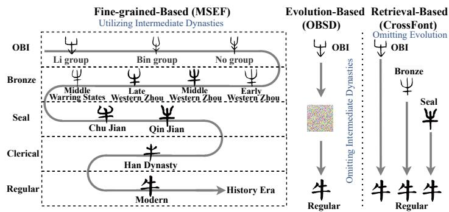  
Figure 1: Evolution of Chinese script. Taking the character “Ox” as an example, this figure demonstrates the evolution of Chinese characters across five historical periods. This character underwent a significant morphological change in early bronze script, then later reverted to a form similar to its oracle bone appearance. A method restricted to bronze forms could assign low similarity to this particular pair. The example motivates evaluating evidence across multiple periods, though it does not by itself establish an error rate for single-period methods.

fore later periods. Methods that require candidates at every period may therefore compare against forms with no surviving lineage. MSEF includes a survival component intended to estimate when a candidate path should terminate; its empirical calibration is not established by the reported results (Appendix V). This motivates evaluating methods that use evidence from multiple periods when it is available, while accounting for missing or terminated character lineages. So we propose the Manifold-based Script Evolution Framework (MSEF) (Bottéro, 1996; Meila & Zhang, 2024),˘ modeling character evolution as continuous flow through a shared manifold space directly. Specifically, (1) under MSEF, each historical period defines an era-conditioned representation in a shared high-dimensional coordinate space, where each observed glyph corresponds to a point. Inter-period transitions are governed by continuous, invertible Neural Ordinary Differential Equations (Neural ODE) (Chen et al., 2018; Rubanova et al., 2019). (2) We implement the manifold using a timeconditioned transformer mapping feature vectors to coordinates, with a spectrally-normalized network for the ODE ensuring continuous transitions. (3) Furthermore, we additionally introduce a survival network that predicts character extinction probability across dynasties. To support MSEF training, we construct a fine-grained dataset containing complete and partial evolution chains and their available pairwise correspondences. Based on trained MSEF, we propose Cascaded Bidirectional Evolutionary Decipherment (CBED), which performs forward cascade retrieval with a survival mechanism to terminate extinct paths, followed by backward verification via inverse ODE flows with step-wise pruning for evolutionary consistency. The final architecture proposed in this paper is the culmination of systematic theoretical derivation and experimental exploration. In our pre-exploratory analysis (Appendix C), we delineate this research trajectory: First, we systematically diagnose existing generative and retrieval paradigms, revealing failure modes associated with not explicitly modeling intermediate stages of script evolution. Second, we return to first principles to model the labeled evolution chains as a duality of a shared correspondence identity and a variant visual surface across historical periods. Third, we conduct a quantitative analysis to identify distinct morphological evolution clusters, empirically mapping baseline vulnerabilities to non-monotone and abrupt historical transitions. Finally, we examine alternative solutions, examining the performance of incremental patches and the design of discrete rule-based alternatives. These diagnostic findings motivate our proposed MSEF powered by Neural ODEs. The manuscript reports quantitative evaluations of MSEF, the fully trained model inherently presents as a complex black box. To better understand its underlying mechanisms and to examine the model’s reported behavior, we conduct a mechanistic post-analysis (Appendix D). Our framework design centers on several critical components, notably the continuous manifold character representations, the Neural ODE inter-era transition dynamics, and the survival net. By employing mechanistic interpretability visualizations, including causal saliency maps and attention circuit diagrams, we conduct fine-grained analyses on each of these modules. These analyses characterize information-routing patterns and morphodynamic regularities consistent with known paleographic transformations; they do not independently exclude memorization. Our contributions are:

• We propose a Manifold-based Script Evolution Framework (MSEF) which could model the evolution series (OBI, Bronze, Seal, Clerical, Regular) of Chinese characters as the continual evolution of a manifold space. Such a framework contains a manifold net for representing the period, Neural ODE for representing inter-period transitions, and survival net for representing character survival across periods.

• We describe FGCCES as a fine-grained cross-era dataset. The current public repository contains the CCAMC source corpus only; FGCCES-derived correspondences, annotations, features, and experiment splits are not included.

• We introduce a Cascaded Bidirectional Evolutionary Decipherment (CBED) mechanism that employs forward cascaded retrieval with backward verification, providing temporal consistency validation. The mechanism is intended to use intermediate-era evidence when available; its empirical benefit requires verified matched evaluations.

• The manuscript reports experiments on three benchmarks and the FGCCES evaluation, but unresolved split, adapter, aggregation, and comparison evidence limit comparative conclusions (Appendix V).

## 2 MANIFOLD-BASED SCRIPT EVOLUTION FRAMEWORK (MSEF)

In this section, we describe the proposed MSEF and corresponding CBED. We first present our observation and intuition of the Chinese character evolution in Section 2.1, and then introduce the theoretical form of the evolution of Chinese characters in Section 2.2, which unifies distinct historical eras into a single evolving manifold governed by differential equations. After that, we introduce how we implement and train such a mathematical model in Sections 2.3 and 2.4. Finally, by learning the vector field of character evolution, MSEF allows us to project ancient scripts forward to predict their modern counterparts and trace modern characters backward to verify their origins. Such a CBED algorithm is illustrated in Section 2.5.

## 2.1 INTUITION: SCRIPT EVOLUTION AS CONTINUOUS FLOW

Figure 2 visualizes the continuous evolution using “ox” as an example. Tracing the evolution from the OBI to the Regular, we observe that despite drastic stylistic shifts, the character retains recognizable structural components. In such a situation, we must apply temporal modeling to textual evolution to capture these uncertain shifts, thereby enhancing decoding accuracy. More cases of these uncertain change patterns are provided in Appendix P. We model this dynamic evolution process as a continuous flow through a shared geometric space. All characters are points in a high-dimensional manifold M. As time progresses, each point moves along a smooth trajectory governed by learnable dynamics. This allows us to trace any ancient character forward to find its modern correspondent and trace backward to verify consistency. To handle distinct representational vocabularies of different eras, we assign each era a distinct manifold space $\mathcal { M } _ { t }$ connected by continuous transitions.

## 2.2 MANIFOLD-BASED SCRIPT EVOLUTION FRAMEWORK THEORY

Building on the intuition above, we now formalize our framework. We establish three foundational assumptions. Assumption 1 (Shared Manifold Space). All scripts across eras share an underlying d-dimensional manifold (M, t), where d captures the essential dimensionality of character semantics and structure, and t denotes the different dynasties. We empirically examine this geometric structure in Appendix Q, where visualizing local neighborhoods reveals distinct clusters of visually and semantically related characters. Assumption 2 (Continuous Manifold Transition Dynamics). Character evolution follows continuous dynamics governed by a velocity field. Let $\mathbf { z } ( t ) \in \dot { \mathbb { R } } ^ { d }$ denote the coordinates of a character’s manifold in normalized time $t \in [ 0 , 1 ]$ (with OBI times in [0, 0.30)

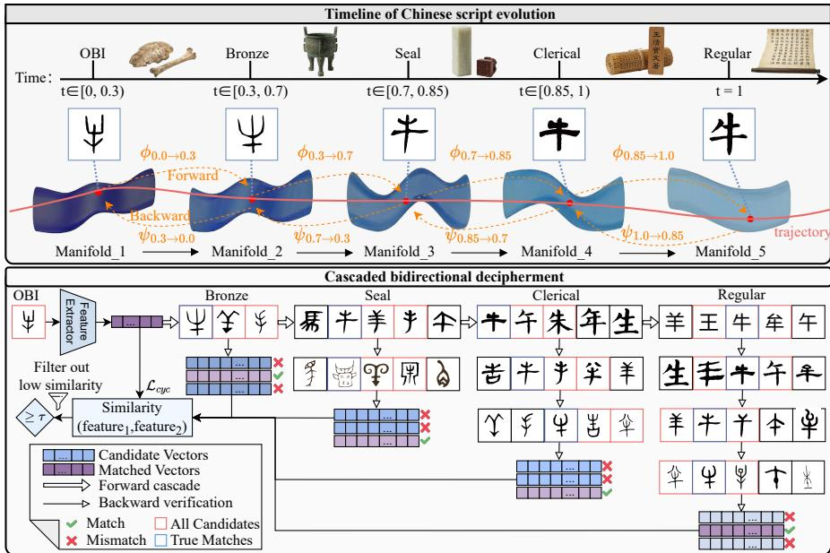  
Figure 2: Overview of MSEF. Top: Continuous Manifold Evolution. The framework models the 3,000-year evolution of Chinese script as a continuous trajectory (red line) through era-specific manifolds $\mathcal { M } _ { t } .$ , conditioned on normalized time t (from OBI $t = 0 . 0$ to Regular $t = 1 . 0 )$ . The intervals of t define an ordered model-time coordinate; their lengths are not proportional to calendaryear durations. Neural ODEs govern the continuous transitions via forward flows ϕ and backward flows ψ. Specifically, each historical period manifold is represented in a shared high-dimensional coordinate space, where each observed glyph corresponds to a point. Inter-period point transitions are governed by the continuous neural ODE. Such a framework enables us to derive candidate character solutions for any dynasty within the character manifold space by leveraging any given dynasty. This facilitates the design of subsequent bidirectional cascading decryption algorithms. Bottom: Cascaded Bidirectional Decipherment. The inference process consists of two stages: (1) Forward Recall: Given an OBI query, the model progressively infers its coordinate in subsequent eras (Bronze → Seal → Clerical → Regular) to retrieve candidate sets. (2) Backward Verification: Candidates from the modern era are traced back through history via inverse flows. At each reverse transition, candidates showing large reconstruction errors (marked with ✗) are pruned step-by-step. The final decipherment is determined by the backward compatibility with the original OBI encoding.

and $t = 1$ for Regular). The evolution is described by:

$$
\frac { d \mathbf { z } } { d t } = \mathbf { v } ( \mathbf { z } , t ; \pmb \theta )\tag{1}
$$

where v is a learnable velocity field parameterized by θ. This equation implies that the rate of a character’s transformation is determined by both its current position in the manifold and the specific historical era. Assumption 3 (Survival Probability). Some characters became obsolete over time. We model the survival probability $s ( \mathbf { z } , t ) \in [ 0 , 1 ]$ as a learnable function. Flow Operators. Let ${ \bf z } _ { a } ( u )$ solve Equation 1 with ${ \bf z } _ { a } ( t _ { 1 } ) = { \bf a }$ , and let ${ \bf z } _ { b } ( u )$ solve it backward with ${ \bf z } _ { b } ( t _ { 2 } ) = { \bf b }$ . We define:

$$
\phi _ { t _ { 1 } \to t _ { 2 } } ( \mathbf { a } ) = \mathbf { a } + \int _ { t _ { 1 } } ^ { t _ { 2 } } \mathbf { v } ( \mathbf { z } _ { a } ( u ) , u ) d u ,\tag{2}
$$

$$
\psi _ { t _ { 2 } \to t _ { 1 } } ( \mathbf { b } ) = \mathbf { b } - \int _ { t _ { 1 } } ^ { t _ { 2 } } \mathbf { v } ( \mathbf { z } _ { b } ( u ) , u ) d u .\tag{3}
$$

The forward flow ϕ traces a character forward in time, while the backward flow ψ traces it backward. Under the regularity assumptions in Appendix I, the exact flows are inverses: $\psi _ { t _ { 2 }  t _ { 1 } } = \phi _ { t _ { 1 }  t _ { 2 } } ^ { - 1 }$ . This latent-space invertibility enables bidirectional verification. Time Encoding. We assign ordered modeltime intervals to historical periods: OBI $( t = 0 . 0 0 \ – 0 . 3 0$ , with fine-grained scribal-group metadata), Bronze $( t = 0 . 3 0 – 0 . 7 0 )$ , Seal $( t = 0 . 7 0 \ – 0 . 8 5 )$ , Clerical $( t = 0 . 8 5 \substack { - 1 . 0 0 } )$ , Regular $( t = 1 . 0 0 )$ . Table 1 provides details. Fine-grained assignments must follow the record-to-time convention in Appendix K, rather than treating every scribal-group label as an equally spaced chronological period.

Table 1: Time encoding for historical periods. Subperiod details are provided in Appendix K.
<table><tr><td>Period</td><td>Time t</td><td>Historical Date</td></tr><tr><td>OBI</td><td>0.00-0.30</td><td>c. 1200–1050 BCE</td></tr><tr><td>Bronze</td><td>0.30–0.70</td><td>c. 1050–250 BCE</td></tr><tr><td>Seal</td><td>0.70–0.85</td><td>c. 220 BCE</td></tr><tr><td>Clerical</td><td>0.85-1.00</td><td>c. 200 CE</td></tr><tr><td>Regular</td><td>1.00</td><td>c. 600 CE-present</td></tr></table>

## 2.3 MANIFOLD-BASED SCRIPT EVOLUTION FRAMEWORK NEURAL IMPLEMENTATION

Our framework comprises three interconnected neural components: a manifold encoder, a velocity field network, and a survival prediction network. Input Representation. For each character c in dynasty t, we extract a 352-dimensional feature vector $\bar { \mathbf { x } _ { c } ^ { t } } \in \mathbb { R } ^ { 3 5 2 }$ specifically designed for paleographic analysis. This representation aggregates five complementary modalities: Visual, Structural, Semantic, Contextual, and Spatiotemporal. Detailed definitions of characteristics and aggregation mechanisms are provided in the Appendix L. Manifold Encoder. Manifold mapping $\mathcal { M } ( \mathbf { x } _ { c } ^ { t } , t )$ projects the input feature vector into a learned high-dimensional manifold space. We implement this encoder as a 12-layer transformer that maps the 352-dimensional input to coordinates $\mathbf { z } _ { c } ^ { t } \in \mathbb { R } ^ { d }$ with the manifold dimension $d = 2 5 6$ Velocity Field. The velocity network $\mathbf { v } ( \mathbf { z } , t )$ models the temporal dynamics on the manifold. Given the manifold coordinates $\mathbf { z } _ { c } ^ { t }$ of character c in dynasty t, solving the Neural ODE yields the predicted representation $\widetilde { \mathbf { z } } _ { c } ^ { t _ { j } } = \phi _ { t  t _ { j } } ( \mathbf { z } _ { c } ^ { t } )$ at a later observation time $t _ { j }$ . We parameterize the velocity field as a 3-layer MLP with spectral normalization and Tanh activations to ensure Lipschitz continuity. Survival Network. The survival network $\mathbf { \nabla } S ( \mathbf { z } _ { c } ^ { 0 } , t )$ predicts the probabilities of character extinction. It takes as input the representation of the oracle bone period manifold $ { \mathbf { z } } _ { c } ^ { 0 }$ along with a target dynasty t, and outputs the probability that character c becomes extinct by the dynasty t. This component is implemented as an MLP. We write its extinction output as $e ( \mathbf { z } _ { c } ^ { 0 } , t ) \mathbf { \bar { \Psi } } = S ( \mathbf { z } _ { c } ^ { 0 } , t )$ and the corresponding survival probability as $s = 1 - e .$ Continuous Time Encoding. To enable the Neural ODE to capture the authentic continuous dynamics of script evolution, we implement an ordered stochastic interval sampling scheme for the temporal variable t. During training, for any given character feature $\mathbf { x } _ { c } ^ { t } \in \mathbb { R } ^ { 3 5 2 }$ , the corresponding dynasty t is not treated as a fixed scalar but is randomly sampled from its era-specific interval defined in Table 1. Crucially, when processing evolution pairs or chains, we enforce a strict monotonicity constraint $t _ { 1 } < t _ { 2 } < \cdots < t _ { 5 }$ within the range [0, 1], with Regular script fixed at $t = 1$ . This strategy ensures that the temporal input t functions as a continuous variable during the optimization process. By supervising the model across these dense stochastic intervals, we train the Neural ODE to learn a smooth, time-dependent velocity field $v ( z , t )$ that generalizes the character transformation as a continuous flow through the manifold space, rather than a sequence of discrete, independent mappings between eras.

## 2.4 MANIFOLD-BASED SCRIPT EVOLUTION FRAMEWORK TRAINING

We train MSEF in an end-to-end manner. Specifically, for a given character, we obtain its corresponding tuples across different dynasties. Based on these data, we optimize our three neural components by minimizing the differences between the characters’ transformations between two dynasties. Ideally, the high-dimensional feature of a character transformed from dynasty t to dynasty $\overline { { t ^ { \prime } } }$ should match the high-dimensional feature of that character directly computed for dynasty $t ^ { \prime } .$ . Let $\mathcal { P }$ denote the available supervised cross-era pairs:

$$
\mathcal { P } = \mathcal { P } _ { \mathrm { a d j } } \cup \mathcal { P } _ { \mathrm { s k i p } } .\tag{4}
$$

Complete chains are recorded separately, rather than added to a pair count. The counting units are specified in Appendix H.

## 2.4.1 MULTI-SCALE LOSS FUNCTIONS

We train the MSEF using five complementary loss functions to ensure both local continuity and global consistency. Adjacent-Era Loss enforces local evolution between consecutive periods. Cross-Era Loss captures mid-range patterns for non-adjacent pairs. Full-Chain Loss prevents drift over the complete trajectory. Cycle Consistency Loss measures numerical round-trip consistency (Zhu et al., $2 0 1 \bar { 7 } ) ;$ exact invertibility follows from the flow assumptions. Finally, Survival Loss trains the extinction predictor using binary cross-entropy to distinguish between existing and extinct characters. The total objective is:

$$
\begin{array} { r } { \mathcal { L } _ { \mathrm { e v o l u t i o n } } = \lambda _ { 1 } \mathcal { L } _ { \mathrm { a d j } } + \lambda _ { 2 } \mathcal { L } _ { \mathrm { s k i p } } + \lambda _ { 3 } \mathcal { L } _ { \mathrm { f u l l } } + \lambda _ { 4 } \mathcal { L } _ { \mathrm { c y c } } , \quad \mathcal { L } _ { \mathrm { s u r v } } = \mathrm { B C E } ( s ( \mathbf { z } _ { c } ^ { 0 } , t ) , y _ { c , t } ) . } \end{array}\tag{5}
$$

Detailed definitions of each loss term are provided in Appendix F.

## 2.4.2 OPTIMIZATION STRATEGY

We adopt a decoupled training approach to ensure optimization stability. The manifold mapping networks and Neural ODE dynamics are trained end-to-end with $\scriptstyle { \mathcal { L } } _ { \mathrm { e v o l u t i o n } }$ in Equation 5. The extinction predictor has a separate objective $\mathcal { L } _ { \mathrm { s u r v } }$ . Only examples providing an OBI representation and a specified survival label contribute to the survival objective; an arbitrary cross-era pair does not supply such supervision.

## 2.5 CASCADED BIDIRECTIONAL EVOLUTIONAL DECIPHERMENT WITH MANIFOLD-BASED FRAMEWORK

With the trained MSEF model, we perform character decipherment through a bidirectional retrievaland-verification strategy. Given an undeciphered OBI, we encode it into the manifold space and solve the Neural ODE to obtain its representation in the bronze script space. We retrieve the top-k most similar bronze characters, then repeat this process through subsequent dynasties. All retrieved characters form a candidate set. For each candidate in later scripts, we map it back to earlier script spaces and compute similarity with existing candidates. Those with low similarity are discarded. The final decipherment result consists of candidates that pass both forward and backward checks. Detailed pseudocode is provided in Appendix G.

## 2.5.1 FORWARD RETRIEVAL VIA CROSS-ERA PROJECTION.

Given an OBI query with aggregated feature vector Xq, we utilize the shared network to infer its representation in subsequent eras. Instead of a single jump, we perform a progressive cascade. We first encode the query at its assigned OBI time $t _ { 0 } \colon \bar { z } _ { t _ { 0 } } ^ { q } = \bar { \mathcal { M } } ( \mathbf { X } ^ { q } , \bar { t } _ { 0 } ; \theta )$ . For each later checkpoint $t _ { k }$ we solve the learned dynamics:

$$
z _ { t _ { k } } ^ { q } = \phi _ { t _ { k - 1 }  t _ { k } } ( z _ { t _ { k - 1 } } ^ { q } )\tag{6}
$$

We then retrieve the top-candidates from the database $\mathcal { D } _ { t _ { k } }$ by mapping them to the same space. Specifically, for a candidate character c in the era $t _ { k }$ with aggregated feature $\mathbf { X } ^ { c }$ , we compute its coordinate $\dot { z } _ { t _ { k } } ^ { c } = \mathcal { M } ( \mathbf { X } ^ { c } , t _ { k } ; \theta )$ and calculate the similarity with $\dot { z } _ { t _ { k } } ^ { q }$ . This forward pass generates a candidate set $\mathcal { C } _ { R e g u l a r }$ of modern characters that are plausible descendants of the OBI query. We restrict the survival check to transitions $t _ { O B I } \  \ t _ { S e a l }$ . For eras $t \ > t _ { S e a l }$ , no additional survival-based rejection is applied; cumulative survival is not reset to one.

## 2.5.2 BACKWARD VERIFICATION VIA STEP-WISE PRUNING.

To account for the one-to-many nature of Chinese character correspondences, CBED uses set-valued candidate retrieval and bidirectional reachability. This discrete retrieval relation need not be bijective. It is distinct from the invertibility of the latent ODE flow under the assumptions in Appendix I. To verify a candidate $c \in \mathcal { C } _ { R e g u l a r }$ , we reverse the cascade process using a stepwise pruning strategy. We trace the candidate through history by $t _ { R e g u l a r }  t _ { C l e r i c a l }  \cdot \cdot \cdot  t _ { O B I }$ . At each backward transition $t _ { i + 1 } \to t _ { i }$ , we apply the inverse flow operator to the candidate’s coordinate:

$$
\hat { z } _ { t _ { i } } = \psi _ { t _ { i + 1 }  t _ { i } } ( \hat { z } _ { t _ { i + 1 } } )\tag{7}
$$

We then compare this backward-projected point $\hat { z } _ { t _ { i } }$ with the candidate’s actual prototype embedding obtained via $\mathbf { \bar { \mathcal { M } } } ( X _ { t _ { i } } ^ { c } , t _ { i } ; \theta )$ in the era $t _ { i } .$ Candidate paths that exceed a divergence threshold $\epsilon _ { t }$ are pruned. Checks use available intermediate prototypes; missing glyph observations are skipped, not replaced by zero vectors. Finally, for candidates that survive the pruning process back to the OBI era, we compute the cosine similarity between their final projected coordinate zˆ and the query’s observed embedding $z _ { O B I } ^ { q } = \mathcal { M } ( \dot { X } ^ { q } , t _ { O B I } ; \theta )$ . The candidate with the highest valid-path cosine similarity is selected as the final deciphering result, following the aggregation rule in Appendix G. Algorithm 1 provides the detailed steps. The algorithm covers all five script periods and returns an abstention when no candidate path passes verification. To illustrate this mechanism, we return to the $\mathbf { \ddot { \eta } } _ { 0 \mathbf { X } } \mathbf { \vec { \eta } } ^ { * }$ example. As shown in Figure 2, when the forward cascade retrieves candidates such as “牛” (correct), $\cdot 6 \cdot 4 ^ { , , }$ (visually similar), and $\cdots \sumint \limits _ { 0 } ^ { \infty } d x$ (semantically related), the backward verification becomes critical. By projecting these candidates back to the OBI manifold, the model predicts their ancient latent representations. The backward representation o $\cdots + \frac { \cdots } { 2 }$ is consistent with the query’s encoding, whereas $\cdots -$ and $\cdots \sum \limits _ { E } , ,$ result in significant reconstruction errors in the latent comparison. This comparison allows the system to filter out false positives that survive the forward pass, effectively enforcing evolutionary consistency.

Table 2: Single-round decipherment on HUST-OBS and EVOBC. We follow Guan et al. (2024)’s protocol. The scores are reported under the cited protocol; adapters and information-matched comparisons are not independently verified.
<table><tr><td>Eval. Metric</td><td colspan="6">Pix2Pix CycleGAN BBDM CDE OBSD MSEF</td></tr><tr><td>OBS-OCR</td><td>Top-1</td><td>0.0</td><td>0.0</td><td>19.5</td><td>31.0</td><td>41.0</td><td>71.5</td></tr><tr><td>OBS-OCR</td><td>Top-10</td><td>0.0</td><td>0.0</td><td>29.5</td><td>47.5</td><td>50.5</td><td>82.0</td></tr><tr><td>OBS-OCR</td><td>Top-20</td><td>0.0</td><td>0.0</td><td>34.5</td><td>50.0</td><td>54.5</td><td>84.5</td></tr><tr><td>OBS-OCR</td><td>Top-50</td><td>4.5</td><td>8.5</td><td>39.0</td><td>52.5</td><td>58.0</td><td>86.5</td></tr><tr><td>OBS-OCR Top-100</td><td></td><td>13.0</td><td>19.0</td><td>42.0</td><td>56.0</td><td>61.0</td><td>88.0</td></tr><tr><td>OBS-OCR Top-200</td><td></td><td>20.0</td><td>37.5</td><td>46.0</td><td>59.5</td><td>62.5</td><td>89.0</td></tr><tr><td>OBS-OCR Top-500</td><td></td><td>21.5</td><td>60.0</td><td>58.0</td><td>64.0</td><td>64.5</td><td>90.0</td></tr><tr><td>Paddle</td><td>Top-1</td><td>0.0</td><td>0.0</td><td>7.0</td><td>19.0</td><td>30.0</td><td>58.5</td></tr></table>

## 3 EXPERIMENTS

We conducted extensive experiments to answer three research questions: RQ1: What benchmark scores does the manuscript report for MSEF, and what limits their interpretation? RQ2: What is the contribution of each component? RQ3: What interpretability analyses and expert-evaluation results does the manuscript report, and what evidence is available to assess them?

## 3.1 EXPERIMENTAL SETUP

Dataset. The manuscript identifies FGCCES as its training resource; its final manifest and split files are unavailable for verification and are not included in the public release. Unlike prior works that rely on a single representative glyph per era, we describe FGCCES as having fine-grained temporal and regional metadata; see Appendix R for examples. The paper does not claim priority over earlier cross-era resources such as EVOBC. Specifically, our dataset includes:

1. Character images corresponding to each dynastic period for every character. 2. Excavation information related to each character. 3. Definitions for each deciphered character. The manuscript identifies jgwlbq, CCAMC, and BNU as sources, with coverage varying across characters and periods. Under the stated feature convention, unavailable feature components may be zero-filled; missing glyph observations are not synthesized and are skipped by CBED when no prototype is available. The manuscript reports 1,358 character categories and an intended character-disjoint train/validation/test protocol. The final FGCCES manifest, split counts, and overlap audit are unavailable for verification, and the FGCCES artifacts are not in the public repository (Appendix H).

Baselines. We compare against methods spanning three categories: (1) Image-to-image translation: Pix2Pix (Isola et al., 2017), CycleGAN (Zhu et al., 2017), DRIT++ (Lee et al., 2019), Palette (Saharia et al., 2022a), BBDM (Li et al., 2023a), CDE (Saharia et al., 2022b); (2) OBI-specific generative models: Sundial-GAN (Chang et al., 2022), OBSD (Guan et al., 2024), Diff-Oracle (Li et al., 2023c), OracleFusion (Li et al., 2025b); and (3) Cross-modal methods: CrossFont (Wu et al., 2025), OracleSage (Jiang et al., 2024), OracleAgent (Li et al., 2025a). For methods without public code, the manuscript reports paper-based reimplementations and cites Paper2Code as a reference where applicable (Seo et al., 2025). Reproduction logs, hyperparameter parity, output adapters, and split parity are not sufficiently documented to verify exact equivalence. Appendix O.10 describes the reported Neural ODE and diffusion-based probability-flow ODE comparison; its implementation and evaluation parity remain unverified. Metrics. Following (Wu et al., 2025; Guan et al., 2024), we employ: (1) Top-K accuracy for generation-based evaluation $( \mathsf { K } \in \{ 1$ , 10, 20, 50, 100, 200, 500}); (2) Recall@K and Average Precision (AP) for retrieval tasks; (3) Multi-choice accuracy for PictOBI-20k. Implementation Details. For ODE integration, we use the dopri5 solver with tolerances of 10−5. Training uses AdamW (Loshchilov & Hutter, 2017) with learning rate $1 0 ^ { - 4 }$ , batch size 256, for 100 epochs (∼18 hours on 2 NVIDIA H100 GPUs). We report mean±std across 5 runs.

Table 3: Results on PictOBI-20k. MSEF subgroup and overall scores are reported; the aggregation is not verified as a common-population average.
<table><tr><td>Model</td><td>Params</td><td>Normal</td><td>Complex</td><td>Overall</td></tr><tr><td>Random (4-choice)</td><td></td><td>25.00</td><td>25.00</td><td>25.00</td></tr><tr><td>GPT-4o-2024-11-20</td><td></td><td>26.31</td><td>25.52</td><td>26.23</td></tr><tr><td>Gemini 2.5 Pro</td><td></td><td>55.22</td><td>39.44</td><td>53.66</td></tr><tr><td>Claude 4 Sonnet</td><td></td><td>35.93</td><td>25.92</td><td>34.94</td></tr><tr><td>GLM-4.5V-106B</td><td>106B</td><td>33.19</td><td>27.11</td><td>32.48</td></tr><tr><td>Qwen2.5-VL-72B</td><td>72B</td><td>25.41</td><td>24.98</td><td>25.36</td></tr><tr><td>InternVL3-78B</td><td>78B</td><td>52.29</td><td>36.38</td><td>50.71</td></tr><tr><td>InternVL3-38B</td><td>38B</td><td>52.71</td><td>39.51</td><td>51.40</td></tr><tr><td>MSEF (Ours)</td><td>140M</td><td>74.82</td><td>53.24</td><td>72.18</td></tr></table>

Table 4: Reported FGCCES score summaries. Run-level records and significance tests are unavailable for independent verification.
<table><tr><td>Method</td><td>R@1</td><td>R@5</td><td>R@10</td><td>R@1%</td><td>AP</td></tr><tr><td>Diff-Oracle (2023)</td><td> $5 2 . 1 \pm 1 . 3$ </td><td> $6 8 . 9 2 1 . 6 $ </td><td> $7 7 . 4 \pm 1 . 2$ </td><td> $8 5 . 2 { \pm } 1 . 0 $ </td><td>0.56</td></tr><tr><td>OracleFusion (2025)</td><td> $5 8 . 3 { \pm } 1 . 2 $ </td><td> $7 4 . 5 { \pm } 1 . 3 $ </td><td> $8 1 . 2 { \pm } 1 . 1 $ </td><td> $8 8 . 1 { \pm } 0 . 9 $ </td><td>0.62</td></tr><tr><td>CrossFont (2025)</td><td> $5 4 . 6 { \pm } 1 . 4 $ </td><td> $7 0 . 8 { \pm } 1 . 4 $ </td><td> $7 8 . 5 { \pm 1 . 2 }$ </td><td> $8 6 . 5 { \pm } 1 . 0 $ </td><td>0.58</td></tr><tr><td>OracleSage (2024)</td><td> $6 0 . 1 \pm 1 . 1$ </td><td> $7 6 . 2 { \pm } 1 . 2 $ </td><td> $8 2 . 8 { \pm } 1 . 0 $ </td><td>89  $. 5 { \pm } 0 . 8$ </td><td>0.64</td></tr><tr><td>OracleAgent (2025)</td><td> $6 2 . 8 { \pm } 1 . 0 $ </td><td> $7 7 . 9 2 1 . 1$ </td><td> $8 4 . 6 { \pm } 0 . 9 \ \AA$ </td><td> $9 0 . 8 { \pm } 0 . 7 $ </td><td>0.67</td></tr><tr><td>MSEF (Ours)</td><td> $7 2 . 5 { \pm } 0 . 8 $ </td><td> ${ \bf 8 6 . 5 \pm 0 . 6 }$ </td><td> ${ \bf 9 1 . 8 { \pm } 0 . 5 }$ </td><td> ${ \bf 9 5 . 6 { \pm } 0 . 4 }$ </td><td>0.78</td></tr></table>

## 3.2 MAIN RESULTS (RQ1)

Results on HUST-OBS and EVOBC Benchmarks. Following Guan et al. (2024), we evaluate using OBS-OCR and PaddleOCR. Table 2 presents single-round decipherment results. The table reports MSEF at 71.5% Top-1 accuracy on OBS-OCR, an arithmetic difference from OBSD of 30.5 percentage points. The output adapter and information-matched protocol are not documented sufficiently for verification, so these values are reported without claiming a confirmed method advantage. Multi-round decipherment results are shown in Appendix O.1. Comparison with LMMs on PictOBI-20k. Table 3 compares MSEF with the seven displayed LMM baselines on PictOBI-20k’s 4-choice visual decipherment task (Chen et al., 2025). The manuscript reports 74.82% on Normal cases and 53.24% on Complex cases for the 140M model, with 72.18% overall. The subgroup denominators and aggregation rule do not reconcile with the displayed LMM summaries; 72.18% is therefore not treated as a verified common-population aggregate or a confirmed head-to-head advantage. Reported FGCCES Benchmark Summaries. Table 4 reproduces reported retrieval scores for the manuscript-described FGCCES-Test and specialized methods (2023–2025). The table reports 72.5% Recall@1 for MSEF and 62.8% for OracleAgent, an arithmetic difference of 9.7 points. The final FGCCES split artifact, candidate sets, and statistical comparison are unavailable for verification, so these values do not establish a verified head-to-head advantage. The exploratory

Table 5: Reported ablation scores on FGCCES. Significance symbols are retained from the source report but not independently verified.
<table><tr><td>Configuration</td><td>R@1</td><td>Δ</td></tr><tr><td>Full MSEF</td><td>72.5±0.8</td><td></td></tr><tr><td>Data utilization</td><td></td><td></td></tr><tr><td>Complete chains only</td><td> $5 2 . 8 { \pm } 1 . 3 $ </td><td> $\cdot 1 9 . 7 ^ { \dagger }$ </td></tr><tr><td>w/o fine-grained subperiods</td><td> $6 8 . 3 { \pm } 0 . 9$ </td><td> $- 4 . 2 ^ { \dagger }$ </td></tr><tr><td>Architecture components</td><td></td><td></td></tr><tr><td>Single manifold (no Neural ODE)</td><td> $6 2 . 2 { \pm } 1 . 1 $ </td><td> $- 1 0 . 3 ^ { \dagger }$ </td></tr><tr><td>w/o cascaded retrieval</td><td> $6 4 . 0 { \pm } 1 . 0 $ </td><td> $- 8 . 5 ^ { \dagger }$ </td></tr><tr><td>w/o bidirectional verification</td><td> $6 6 . 3 { \pm } 0 . 9$ </td><td> $- 6 . 2 ^ { \dagger }$ </td></tr><tr><td>w/o step-wise pruning</td><td> $6 8 . 8 { \pm } 0 . 9$ </td><td> $- 3 . 7 ^ { \dagger }$ </td></tr><tr><td>w/o dynamic features</td><td> $6 7 . 5 { \pm } 0 . 9 $ </td><td> $- 5 . 0 ^ { \dagger }$ </td></tr><tr><td>Training objectives</td><td></td><td></td></tr><tr><td>w/o multi-scale losses</td><td> $6 8 . 4 \pm 0 . 9$ </td><td> $- 4 . 1 ^ { \dagger }$ </td></tr><tr><td>w/o cycle consistency</td><td> $6 9 . 0 { \pm } 0 . 8 $ </td><td> $- 3 . 5 ^ { \dagger }$ </td></tr><tr><td>w/o survival prediction</td><td> $7 1 . 2 { \pm } 0 . 8 $ </td><td> $- 1 . 3 ^ { * }$ </td></tr></table>

Table 6: Expert-evaluation percentages reported in the manuscript for 100 challenging cases; caselevel records are unavailable for independent verification.
<table><tr><td>Evaluation Outcome</td><td>Pct.</td></tr><tr><td>Agrees with expert consensus</td><td>72%</td></tr><tr><td>Disagrees, later validated</td><td>12%</td></tr><tr><td>Disagrees, experts maintain</td><td>16%</td></tr></table>

Joint-Consistent CrossFont result also reaches 72.5% R@1 (Appendix C.1.2); a method advantage over that comparator requires matched evaluation protocols. Appendix O.5 discusses the fairness of MSEF’s cross-era data utilization.

## 3.3 ABLATION STUDIES (RQ2)

Component Ablation Study. Table 5 retains manuscript-reported FGCCES ablation scores. Run configurations and significance annotations cannot be independently verified; differences do not establish causal component contributions. (1) Data Utilization: The reported complete-chain configuration is 19.7 points below the full-model point estimate. This unverified comparison does not establish that chain completeness alone caused the difference. (2) Manifold Modeling: The reported static-manifold configuration is 10.3 points below the full-model point estimate; without verified matched runs, this is descriptive rather than evidence for a component effect. (3) Inference Mechanism: The reported no-cascade and no-verification configurations are 8.5 and 6.2 points below the full-model point estimate. These unverified differences do not establish the mechanism’s causal effect. Appendix O.11 reports a micro-level ablation of backward verification; its underlying records are unavailable for independent verification. Effect of Intermediate Eras. The manuscript reports 61.2% for a two-era configuration and 72.5% for the five-era configuration. Intermediate increments are not interpreted as isolated era effects because coverage and supervision vary, and the underlying runs are unavailable for verification. These unverified scores are descriptive only; the underlying runs are unavailable for independent inspection.

## 3.4 EXPERT EVALUATION AND ANALYSIS (RQ3)

Blind Expert Evaluation. The manuscript reports that two experts assessed 100 challenging FGCCES-Test cases (Table 6), with 72% agreement, 12% later-validated disagreements, and 16% unresolved disagreements. Case-level evidence and validation records for the 12 cases are unavailable

for independent verification. Error analysis and the interpretation of confidence scores are discussed in Appendices O.6 and O.7.

## 4 CONCLUSION

We described MSEF, a framework for representing script forms in a time-conditioned latent space and modeling transitions with a Neural ODE. By modeling each era with its own manifold space and learning inter-era transitions via Neural ODE, MSEF enables training on incomplete chains and bidirectional verification for temporal consistency. Reported benchmark scores are preliminary summaries; unresolved dataset manifests, adapters, aggregation, and comparison details prevent firm conclusions about comparative performance.

## REFERENCES

Marin Biloš, Johanna Sommer, Syama Sundar Rangapuram, Tim Januschowski, and Stephan Günnemann. Neural flows: Efficient alternative to neural odes. Advances in neural information processing systems, 34:21325–21337, 2021.

Françoise Bottéro. The origin and early development of the chinese writing system, 1996.

Xiang Chang, Fei Chao, Changjing Shang, and Qiang Shen. Sundial-gan: A cascade generative adversarial networks framework for deciphering oracle bone inscriptions. In Proceedings of the 30th ACM international conference on multimedia, pp. 1195–1203, 2022.

Ricky TQ Chen, Yulia Rubanova, Jesse Bettencourt, and David K Duvenaud. Neural ordinary differential equations. Advances in neural information processing systems, 31, 2018.

Zijian Chen, Tingzhu Chen, Wenjun Zhang, and Guangtao Zhai. Obi-bench: Can lmms aid in study of ancient script on oracle bones? arXiv preprint arXiv:2412.01175, 2024.

Zijian Chen, Wenjie Hua, Jinhao Li, Lirong Deng, Fan Du, Tingzhu Chen, and Guangtao Zhai. Pictobi-20k: Unveiling large multimodal models in visual decipherment for pictographic oracle bone characters. arXiv preprint arXiv:2509.05773, 2025.

Emilien Dupont, Arnaud Doucet, and Yee Whye Teh. Augmented neural odes. Advances in neural information processing systems, 32, 2019.

Junheng Gao and Xun Liang. Distinguishing oracle variants based on the isomorphism and symmetry invariances of oracle-bone inscriptions. IEEE access, 8:152258–152275, 2020.

Haisu Guan, Huanxin Yang, Xinyu Wang, Shengwei Han, Yongge Liu, Lianwen Jin, Xiang Bai, and Yuliang Liu. Deciphering oracle bone language with diffusion models. arXiv preprint arXiv:2406.00684, 2024.

Jun Guo, Changhu Wang, Edgar Roman-Rangel, Hongyang Chao, and Yong Rui. Building hierarchical representations for oracle character and sketch recognition. IEEE Transactions on Image Processing, 25(1):104–118, 2015.

Zhikai Hu, Yiu-ming Cheung, Yonggang Zhang, Peiying Zhang, and Pui-ling Tang. Componentlevel oracle bone inscription retrieval. In Proceedings of the 2024 International Conference on Multimedia Retrieval, pp. 647–656, 2024.

Phillip Isola, Jun-Yan Zhu, Tinghui Zhou, and Alexei A Efros. Image-to-image translation with conditional adversarial networks. In Proceedings ofthe IEEE conference on computer vision and pattern recognition, pp. 1125–1134, 2017.

Alan Julian Izenman. Introduction to manifold learning. Wiley Interdisciplinary Reviews: Computational Statistics, 4(5):439–446, 2012.

Hanqi Jiang, Yi Pan, Junhao Chen, Zhengliang Liu, Yifan Zhou, Peng Shu, Yiwei Li, Huaqin Zhao, Stephen Mihm, Lewis C Howe, et al. Oraclesage: Towards unified visual-linguistic understanding of oracle bone scripts through cross-modal knowledge fusion. arXiv preprint arXiv:2411.17837, 2024.

Yifan Jin and Xi Yang. Interactively rejioning 2d oracle bone fragments based on contour matching. In 2023 9th International Conference on Virtual Reality (ICVR), pp. 163–170. IEEE, 2023.

David N Keightley. Sources of Shang history: the oracle-bone inscriptions ofBronze Age China. Univ of California Press, 1985.

Hyeongju Kim, Hyeonseung Lee, Woo Hyun Kang, Joun Yeop Lee, and Nam Soo Kim. Softflow: Probabilistic framework for normalizing flow on manifolds. Advances in Neural Information Processing Systems, 33:16388–16397, 2020.

Hsin-Ying Lee, Hung-Yu Tseng, Qi Mao, Jia-Bin Huang, Yu-Ding Lu, Maneesh Singh, and Ming-Hsuan Yang. Drit++: Diverse image-to-image translation via disentangled representations. arXiv preprint arXiv:1905.01270, 2019.

Bang Li, Qianwen Dai, Feng Gao, Weiye Zhu, Qiang Li, and Yongge Liu. Hwobc-a handwriting oracle bone character recognition database. In Journal of Physics: Conference Series, volume 1651, pp. 012050. IOP Publishing, 2020.

Bo Li, Kaitao Xue, Bin Liu, and Yu-Kun Lai. Bbdm: Image-to-image translation with brownian bridge diffusion models. In Proceedings of the IEEE/CVF conference on computer vision and pattern Recognition, pp. 1952–1961, 2023a.

Caoshuo Li, Zengmao Ding, Xiaobin Hu, Bang Li, Donghao Luo, Xu Peng, Taisong Jin, Yongge Liu, Shengwei Han, Jing Yang, et al. Oracleagent: A multimodal reasoning agent for oracle bone script research. arXiv preprint arXiv:2510.26114, 2025a.

Caoshuo Li, Zengmao Ding, Xiaobin Hu, Bang Li, Donghao Luo, AndyPian Wu, Chaoyang Wang, Chengjie Wang, Taisong Jin, Seven Shu, et al. Oraclefusion: Assisting the decipherment of oracle bone script with structurally constrained semantic typography. In Proceedings ofthe IEEE/CVF International Conference on Computer Vision, pp. 19893–19902, 2025b.

Donghao Li and Binfang Du. Research on oracle bone inscription segmentation and recognition model based on deep learning. In 2024 IEEE 4th International Conference on Electronic Technology, Communication and Information (ICETCI), pp. 1309–1314. IEEE, 2024.

Jing Li, Qiu-Feng Wang, Kaizhu Huang, Xi Yang, Rui Zhang, and John Y Goulermas. Towards better long-tailed oracle character recognition with adversarial data augmentation. Pattern Recognition, 140:109534, 2023b.

Jing Li, Qiu-Feng Wang, Siyuan Wang, Rui Zhang, Kaizhu Huang, and Erik Cambria. Diff-oracle: Deciphering oracle bone scripts with controllable diffusion model. arXiv preprint arXiv:2312.13631, 2023c.

Ilya Loshchilov and Frank Hutter. Decoupled weight decay regularization. arXiv preprint arXiv:1711.05101, 2017.

Marina Meila and Hanyu Zhang. Manifold learning: What, how, and why.˘ Annual Review ofStatistics and Its Application, 11(1):393–417, 2024.

Lin Meng, Naoki Kamitoku, and Katsuhiro Yamazaki. Recognition of oracle bone inscriptions using deep learning based on data augmentation. In 2018 metrologyfor archaeology and cultural heritage (MetroArchaeo), pp. 33–38. IEEE, 2018.

Yulia Rubanova, Ricky TQ Chen, and David K Duvenaud. Latent ordinary differential equations for irregularly-sampled time series. Advances in neural information processing systems, 32, 2019.

Chitwan Saharia, William Chan, Huiwen Chang, Chris Lee, Jonathan Ho, Tim Salimans, David Fleet, and Mohammad Norouzi. Palette: Image-to-image diffusion models. In ACM SIGGRAPH 2022 conference proceedings, pp. 1–10, 2022a.

Chitwan Saharia, Jonathan Ho, William Chan, Tim Salimans, David J Fleet, and Mohammad Norouzi. Image super-resolution via iterative refinement. IEEE transactions on pattern analysis and machine intelligence, 45(4):4713–4726, 2022b.

Minju Seo, Jinheon Baek, Seongyun Lee, and Sung Ju Hwang. Paper2code: Automating code generation from scientific papers in machine learning. arXiv preprint arXiv:2504.17192, 2025.

Mei Wang and Weihong Deng. A dataset of oracle characters for benchmarking machine learning algorithms. Scientific Data, 11(1):87, 2024.

Zhicong Wu, Qifeng Su, Ke Gu, and Xiaodong Shi. A cross-font image retrieval network for recognizing undeciphered oracle bone inscriptions. In International Conference on Intelligent Computing, pp. 196–208. Springer, 2025.

Yi-Kang Zhang, Heng Zhang, Yong-Ge Liu, Qing Yang, and Cheng-Lin Liu. Oracle character recognition by nearest neighbor classification with deep metric learning. In 2019 International Conference on Document Analysis and Recognition (ICDAR), pp. 309–314. IEEE, 2019.

Qianqian Zhen, Liang Wu, and Guoying Liu. An oracle bone inscriptions detection algorithm based on improved yolov8. Algorithms, 17(5):174, 2024.

Jun-Yan Zhu, Taesung Park, Phillip Isola, and Alexei A Efros. Unpaired image-to-image translation using cycle-consistent adversarial networks. In Proceedings of the IEEE international conference on computer vision, pp. 2223–2232, 2017.

## A APPENDIX ROADMAP

Scope of the supplementary evidence. The appendix separates mathematical consequences of the stated model from experimental summaries. Numerical summaries without a documented samplelevel protocol are explicitly identified below as unvalidated observations; they are not additional verified comparisons. In particular, unspecified implementation choices are not replaced with assumed settings, and a retained table does not establish that its configuration matches another table. These distinctions also limit the interpretation of the corresponding main-text summaries. The appendix provides methodological details, supplementary analyses, and documentation supporting the main paper.

Background and motivation. Appendix B discusses related work. Appendix C presents exploratory analyses motivating multi-era modeling and candidate verification. These analyses motivate design choices rather than establish the necessity of a unique architecture.

Representation and dynamics diagnostics. Appendix D examines input sensitivity, attention patterns, latent geometry, survival scores, and vector analogies. These analyses characterize model behavior; they do not independently establish historical causality, equivalence to human cognition, or the absence of memorization.

Method and implementation. Appendix E summarizes the model. Appendix F defines the training objectives. Appendix G specifies CBED inference. Appendices K, L, and M describe time encoding, feature extraction, and implementation settings.

Dataset. Appendices H and N describe dataset organization, counting units, splits, and provenance.   
Appendix R illustrates the available temporal and scribal-group annotations.

Theory and empirical diagnostics. Appendix I states the regularity assumptions and properties of the latent ODE flow. Appendix J distinguishes conditional mathematical results from finite-sample diagnostics. Appendix Q visualizes local retrieval neighborhoods.

Additional experiments. Appendix O reports supplementary evaluations, ablation analyses, computational measurements, and benchmark-specific protocol requirements. Error analysis and confidence evaluation appear in Appendices O.6 and O.7. Appendices O.10 and O.11 examine alternative dynamics and backward verification.

## B RELATED WORK

Our work connects continuous-time representation learning with computational analysis of Oracle Bone Inscriptions.

## B.1 MANIFOLD LEARNING AND CONTINUOUS-TIME MODELS

Manifold learning studies low-dimensional structure in high-dimensional observations (Izenman, 2012). Neural ODEs parameterize the derivative of a latent state and compute transformations through numerical integration (Chen et al., 2018). Latent ODEs explicitly address irregularly sampled observations and variable temporal gaps (Rubanova et al., 2019). Augmented Neural ODEs and neural flows investigate alternative parameterizations and representational properties of continuoustime models (Dupont et al., 2019; Biloš et al., 2021). Related flow-based methods also study probability modeling for data with manifold structure (Kim et al., 2020). Accordingly, incomplete observations and continuous time are not capabilities unique to MSEF. Our focus is their use in cross-era glyph representation learning, together with candidate retrieval and verification against available intermediate-era evidence.

## B.2 COMPUTATIONAL OBI ANALYSIS

Computational OBI research includes recognition, retrieval, image generation, and multimodal analysis (Jin & Yang, 2023; Zhen et al., 2024; Gao & Liang, 2020). Recognition methods address identification within labeled character inventories (Li & Du, 2024). Generative approaches include Sundial-GAN (Chang et al., 2022), Diff-Oracle (Li et al., 2023c), and OBSD (Guan et al., 2024). Retrieval methods include cross-font comparison with historical reference glyphs (Wu et al., 2025). OBI-Bench, OracleSage, and OracleAgent investigate multimodal understanding and reasoning (Chen et al., 2024; Jiang et al., 2024; Li et al., 2025a). MSEF differs in jointly learning time-conditioned latent representations and inter-era dynamics from observed correspondences, followed by candidatelevel backward verification. This distinction does not imply that competing methods cannot be augmented with temporal information. Such augmentations are important comparators, including the sequence-consistency baseline examined in Appendix C.

## C PRE-EXPLORATORY STEP-BY-STEP RESEARCH

This section presents exploratory analyses motivating multi-era modeling and candidate verification. These analyses concern the specific implementations and datasets examined. They do not establish architectural impossibility results or prove that every component of MSEF is necessary.

## C.1 DIAGNOSING EXISTING PARADIGMS

We consider generation-based and retrieval-based approaches. Generation-based methods predict a target-script representation or image. Retrieval-based methods rank glyphs in a reference collection. Their performance depends on the available inputs, reference data, training supervision, and evaluation interface. Table 7 restates selected results from the main paper without combining different models under a single “best paradigm” label.

Table 7: Selected baseline results under their stated benchmark protocols. Values across different benchmarks are not directly comparable.
<table><tr><td>Method</td><td>Evaluation Reported value (%)</td></tr><tr><td>OBSD</td><td>HUST-OBS/EVOBC, OBS-OCR Top-1</td></tr><tr><td></td><td>41.0 52.1</td></tr><tr><td>Diff-Oracle FGCCES, R@1 CrossFont FGCCES, R@1</td><td>54.6</td></tr></table>

## C.1.1 GENERATION PERFORMANCE AND EVOLUTIONARY COMPLEXITY

We examine how the reported generation results vary with glyph-distance categories and an abrupttransition label. A finite difference between observed glyphs is not itself a test of mathematical continuity. The reported accuracy is lower for the high-distance and abrupt-transition groups. This association motivates evaluating intermediate-era evidence, but does not identify a unique cause of failure or rule out alternative generative architectures.

## C.1.2 RETRIEVAL WITH TEMPORAL CONSISTENCY

We compare independent CrossFont retrieval with an augmentation that combines candidate sets through known cross-era correspondences and cumulative similarity scores. The reported OBI-to-Regular result of 72.5 has the same point estimate as MSEF in Table 4. If the evaluation protocols match, these results do not establish an R@1 advantage of MSEF over the augmented CrossFont baseline. The supplied summaries do not establish matching splits, reference graphs, features, candidate vocabularies, or search budgets. The equality of the two point estimates is therefore disclosed without claiming a controlled tie or an advantage over the augmented comparator. An advantage over the unaugmented OracleAgent result does not isolate the contribution of continuous dynamics.

Table 8: Unvalidated generation-accuracy summary by complexity label. The three distance-group counts sum to 1,007; the membership relationship of the 112 abrupt-transition examples is not established. The four rows are not treated as a disjoint partition.
<table><tr><td>Group</td><td>Count</td><td>Top-1 (%)</td><td>Difference from Low</td></tr><tr><td>Low, distance &lt; 0.3</td><td>228</td><td>67.5</td><td></td></tr><tr><td>Medium, distance 0.3–0.6</td><td>445</td><td>48.3</td><td>-19.2</td></tr><tr><td>High, distance &gt; 0.6</td><td>334</td><td>22.7</td><td>-44.8</td></tr><tr><td>Abrupt transition</td><td>112</td><td>14.2</td><td>-53.3</td></tr></table>

Table 9: Reported CrossFont retrieval with and without sequence-consistency filtering.
<table><tr><td>Era pair</td><td>Independent R@1</td><td>Joint-consistent R@1</td><td>Gain</td></tr><tr><td>OBI → Bronze</td><td>61.2</td><td>74.8</td><td>13.6</td></tr><tr><td>OBI → Seal</td><td>58.4</td><td>71.3</td><td>12.9</td></tr><tr><td>OBI → Clerical</td><td>56.7</td><td>69.5</td><td>12.8</td></tr><tr><td>OBI → Regular</td><td>54.6</td><td>72.5</td><td>17.9</td></tr></table>

## C.1.3 IMPLICATIONS FOR MODEL DESIGN

The exploratory results suggest that intermediate-era evidence can be useful. They leave open whether the principal benefit comes from representation learning, additional supervision, candidate-graph access, or the dynamics parameterization. These factors require matched comparisons.

## C.2 CHARACTER IDENTITY AND ERA-SPECIFIC FORM

## C.2.1 SHARED CORRESPONDENCE LABELS AND VARIABLE GLYPHS

Verified correspondence labels allow different historical glyph observations to supervise a shared representation. For selected pictographic examples, such as “Ox”, “Sun”, and “Mountain”, this relation can be illustrated using a common referent and varying glyph forms. This is a modeling abstraction for the labeled correspondences, not an assumption that every character preserves an invariant meaning throughout history.

## C.2.2 TEMPORAL REGULARITY AS A MODELING PRIOR

MSEF uses continuous latent dynamics as an inductive bias. Sparse glyph observations do not identify a unique continuous historical trajectory. A smooth latent path can coexist with substantial differences between observed glyph images. The previously reported fraction of transitions within two standard deviations of a distance mean is a distributional summary, not a proof of temporal continuity.

## C.3 EVOLUTION PATTERN CLUSTERS AND BASELINE VULNERABILITIES

## C.3.1 STRUCTURAL FEATURES

We analyze seven structural descriptors of observed glyphs. These descriptors are used for exploratory analysis and are distinct from the full 352-dimensional model input. Missing glyph observations are not treated as measured zero-valued glyphs in this analysis.

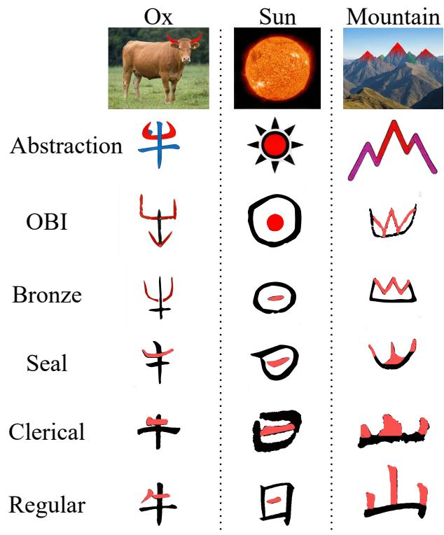

Figure 3: Selected examples of shared correspondence labels and era-specific glyph forms. These examples do not imply universal semantic invariance.  
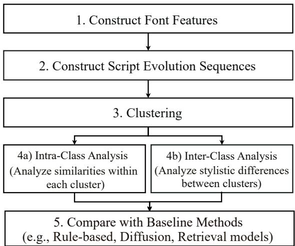  
Figure 4: Exploratory workflow: feature construction, cross-era sequence organization, clustering, and baseline error analysis.

## C.3.2 CLUSTERING PROCEDURE

The counts in Table 11 sum to 881. This is a separate reported summary from the 1,007 distancegroup examples in Table 8; no common sample population is established by these aggregates. The summaries are not pooled to estimate dataset-wide frequencies. The exploratory pipeline applies

Table 10: Structural descriptors used in the exploratory analysis.
<table><tr><td>Feature</td><td>Description</td></tr><tr><td>Stroke count</td><td>Number of identified strokes</td></tr><tr><td>Inflection points</td><td>Direction changes in the contour</td></tr><tr><td>Endpoint count</td><td>Number of open stroke tips</td></tr><tr><td>Mean endpoint distance</td><td>Mean pairwise endpoint distance</td></tr><tr><td>Horizontal/vertical ratio</td><td>Relative stroke orientations</td></tr><tr><td>Enclosed area ratio</td><td>Fraction of enclosed glyph area</td></tr><tr><td>Symmetry score</td><td>Bilateral symmetry measure</td></tr></table>

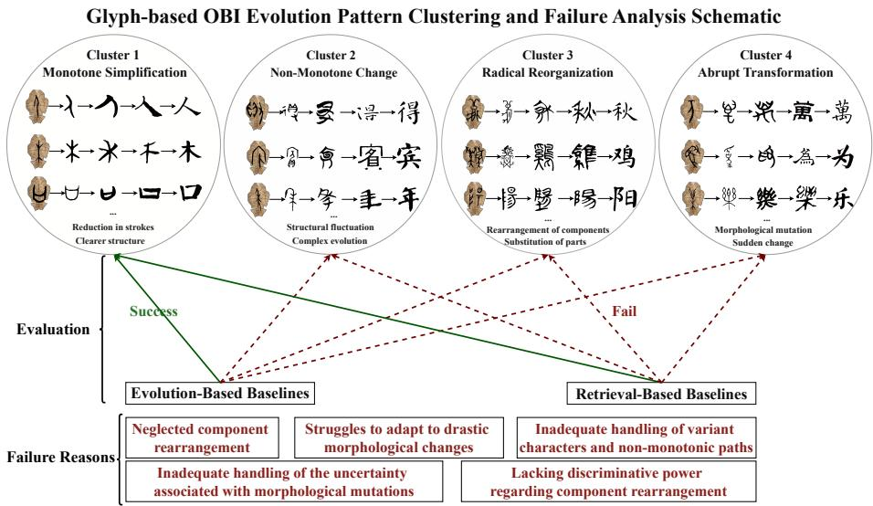  
Figure 5: Illustration of the reported exploratory cluster labels. The diagram is not an independent test of baseline failure mechanisms.

per-feature clustering and combines assignments through a co-association matrix and hierarchical clustering. The reported four-cluster solution is summarized below.

Table 11: Reported exploratory cluster membership counts.
<table><tr><td>ID</td><td>Description Count</td></tr><tr><td>A</td><td>Monotone simplification</td></tr><tr><td>B Non-monotone change</td><td>312 224</td></tr><tr><td>C Radical reorganization</td><td>158</td></tr><tr><td>D Abrupt transformation</td><td>187</td></tr></table>

## C.3.3 CLUSTER-CONDITIONED ERRORS

These results describe different error distributions across the reported groups. They do not show that either method fails on every sample outside Cluster A, or prove that the clustering labels identify causal failure mechanisms.

Table 12: Reported error percentages conditional on the exploratory cluster assignments.
<table><tr><td>Cluster</td><td>Description</td><td>Generation error</td><td>CrossFont error</td></tr><tr><td>A</td><td>Monotone simplification</td><td>31.2</td><td>28.6</td></tr><tr><td>B</td><td>Non-monotone change</td><td>57.8</td><td>63.5</td></tr><tr><td>C</td><td>Radical reorganization</td><td>52.3</td><td>70.8</td></tr><tr><td>D</td><td>Abrupt transformation</td><td>68.4</td><td>41.2</td></tr></table>

Table 13: Reported results for particular baseline augmentations. These values are not architectural performance ceilings.
<table><tr><td>Family</td><td>Configuration</td><td>Metric</td><td>Value</td></tr><tr><td>Retrieval</td><td>Baseline</td><td>R@1</td><td>62.8</td></tr><tr><td>Retrieval</td><td>+ Era fusion</td><td>R@1</td><td>65.2</td></tr><tr><td>Retrieval</td><td>+ Temporal constraint</td><td>R@1</td><td>67.4</td></tr><tr><td>Generation</td><td>Baseline</td><td>Top-1</td><td>41.0</td></tr><tr><td>Generation</td><td>+ Era conditioning</td><td>Top-1</td><td>47.3</td></tr><tr><td>Generation</td><td>+ Consistency loss</td><td>Top-1</td><td>51.8</td></tr></table>

## C.4 FROM EXPLORATORY FINDINGS TO MSEF

## C.4.1 INCREMENTAL AUGMENTATIONS

The results show gains for the tested augmentations. They do not exclude stronger augmentations or alternative architectures. In particular, the 67.4 result cannot be presented as a general retrieval ceiling in view of Table 9.

## C.4.2 A SHARED LATENT REPRESENTATION

A shared latent representation offers a common space for comparing observations across eras. Time conditioning represents era dependence, while the learned flow models transitions between latent states. Two-dimensional projections can illustrate local structure, but do not prove the existence of a particular data manifold or preservation of high-dimensional topology.

## C.4.3 RULE-BASED ALTERNATIVES

Rule-based models provide an interpretable alternative to learned dynamics. Their scalability and accuracy depend on the chosen rule representation, learning procedure, and vocabulary.

## C.4.4 CONTINUOUS-TIME DYNAMICS

Neural ODEs parameterize a latent velocity field and allow evaluation at selected integration times (Chen et al., 2018). MSEF associates this time coordinate with an ordered script-period convention. The coordinate is not a linear calendar-year scale. Time-conditioned discrete models, normalizing flows, and diffusion-based constructions remain relevant alternatives. The comparison in Appendix O.10 concerns a particular implemented baseline rather than all members of these model families.

## C.4.5 BACKWARD CANDIDATE VERIFICATION

Backward verification starts from an observed candidate representation and compares its predicted earlier states with available reference observations and the query. This differs from integrating a query forward and immediately reversing the same numerical trajectory. Appendix O.11 reports the corresponding ablation. In Table 5, removing bidirectional verification changes R@1 from 72.5 to 66.3. The 64.0 row removes cascaded retrieval and represents a different configuration. Overall, these analyses motivate explicit multi-era modeling and verification, but do not establish Neural ODEs as the uniquely valid solution.

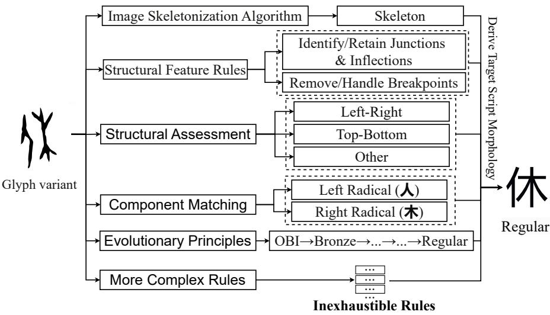  
Figure 6: Schematic rule-based matching pipeline. A schematic branching structure is not a proof that finite rule enumeration is mathematically impossible.

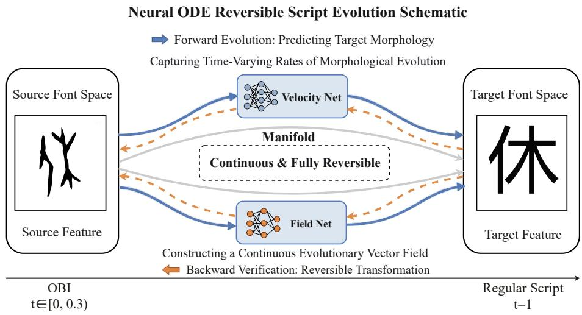  
Figure 7: Continuous-time latent modeling under the time convention in Appendix K. The diagram does not establish recovery of a unique physical historical trajectory.

## D POST-ANALYSIS: REPRESENTATION AND DYNAMICS DIAGNOSTICS

This section examines the behavior of the learned representations, dynamics, and survival scores. The analyses are diagnostic: they do not establish equivalence to human cognition, historical causality, or the absence of memorization.

## D.1 SPATIAL ATTRIBUTION ACROSS ERAS

Figure 8 presents spatial attribution examples for selected characters. Corresponding highlighted structures across eras can suggest sensitivity to recurring glyph components. They are not, by them selves, evidence of a learned invariant semantic core. Because the encoder consumes precomputed features, pixel-level attribution requires an explicit mapping between image perturbations and the resulting features.

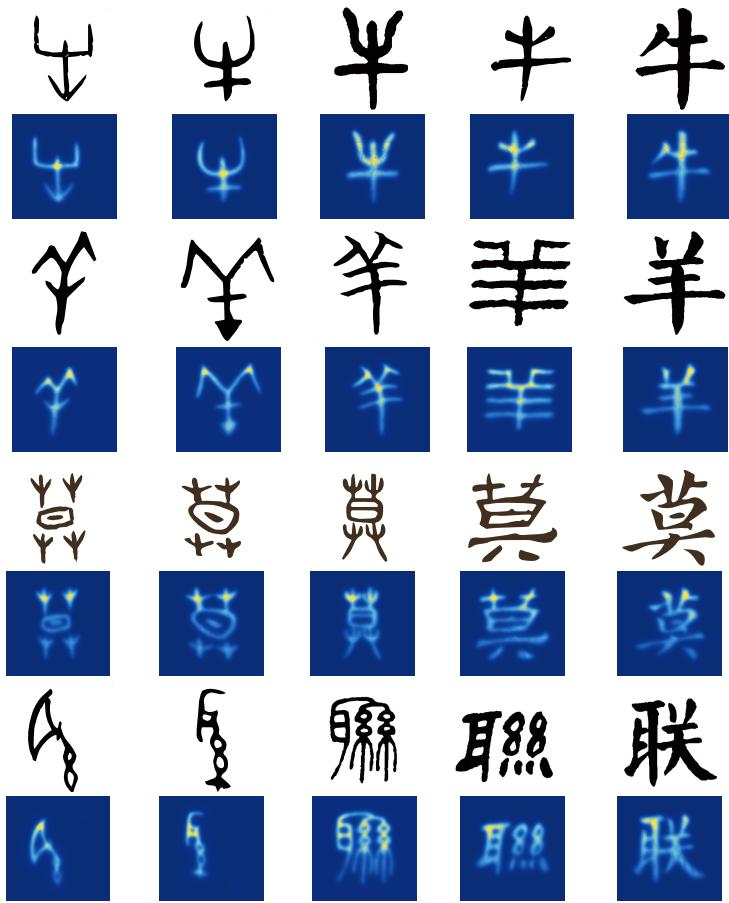  
Figure 8: Spatial attribution examples across script periods. Highlighted regions describe the selected attribution procedure, not direct measurements of historical evolutionary laws.

## D.2 SALIENCY-BASED SENSITIVITY ANALYSIS

We compare intact glyphs with high-saliency and low-saliency occlusions. Matched occlusion area controls one aspect of the perturbation, but does not control every possible change in glyph structure. For a declared compatibility score r, define

$$
\Delta _ { \mathrm { h i g h } } = r ( x ) - r ( x _ { \mathrm { h i g h } } ) , \qquad \Delta _ { \mathrm { l o w } } = r ( x ) - r ( x _ { \mathrm { l o w } } ) .
$$

The displayed examples provide a local sensitivity analysis. Population-level conclusions require aggregate results over a specified sample and appropriate perturbation controls.

## D.3 LATENT GEOMETRY AND TRAJECTORIES

Figure 10 illustrates low-dimensional projections of latent representations and selected trajectories. Distances and apparent curvature in a projection need not equal those in the original latent space. A regular ODE trajectory is continuous. A jagged plotted polyline can reflect sparse sampling, projection, or large but continuous changes; it is not evidence of an actual discontinuity in the latent ODE solution. Similarly, removing points from a displayed graph does not establish historical extinction or improved numerical conditioning.

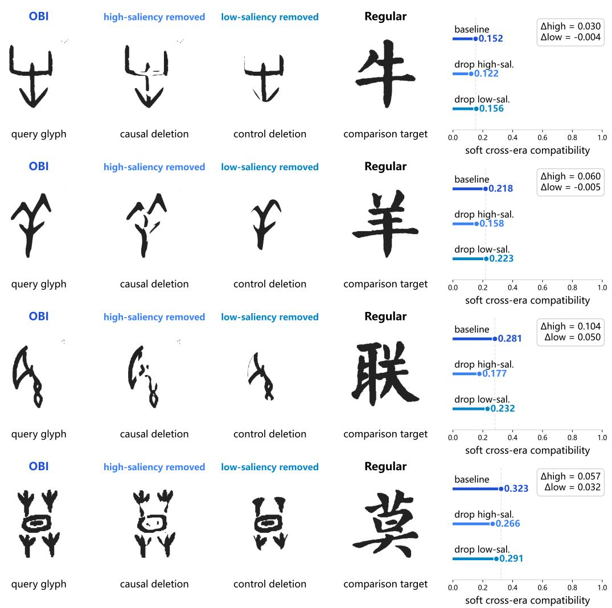  
Figure 9: Compatibility-score changes under high-saliency and low-saliency occlusions for the displayed examples. Effects vary across examples and should not be described as uniformly catastrophic or negligible.

## D.4 ATTENTION PATTERNS AND MODALITY ROUTING

The displayed graphic contains 144 head entries. With the 12-layer encoder in the main text, this would correspond to 12 heads per layer only if all layers contribute equally to that graphic. This conditional arithmetic is not a checkpoint-level architecture specification. The 256-dimensional output does not determine the internal Transformer width or head count. Attention diagnostics must correspond to the encoder used for the reported results. For L layers and H heads per layer, the number of heads is LH.

Attention weights alone do not establish causal importance or disentanglement. These interpretations require interventions and controls beyond inspection of the attention matrix.

## D.5 ACTIVATION INTERVENTIONS AND MODALITY CONTRIBUTIONS

Zeroing an activation and replacing it with an activation from another input are different interventions. The supplied analysis does not identify the intervention sufficiently to attribute an effect to either operation. The following equations distinguish possible reporting quantities; they do not establish

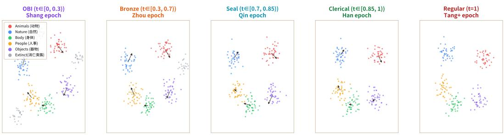

Focus Character Trajectories Through Manifold Space  
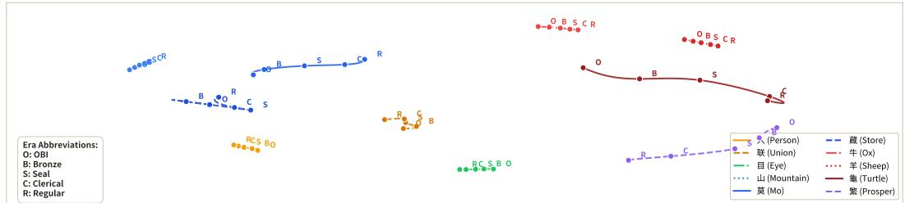  
Figure 10: Visualization of latent representations and selected trajectories. Projected cluster structure is an exploratory diagnostic rather than a proof of topological preservation or historical causality.

which quantity was measured. For retrieval, a target-versus-distractor margin can be defined as

$$
m ( q ) = r ( c ^ { + } , q ) - r ( c ^ { - } , q ) ,
$$

where $c ^ { + }$ is a valid target and $c ^ { - }$ is a specified distractor. An intervention effect is then

$$
\Delta m = m _ { \mathrm { o r i g i n a l } } - m _ { \mathrm { i n t e r v e n e d } } .
$$

This definition distinguishes a retrieval-score margin from a classification logit difference. The earlier activation-intervention graphic is omitted from the quantitative analysis because its labels (classification-logit drop, causal importance, and polysemanticity) are not tied to an identified estima tor in the available specification. In particular, its plotted values are not relabeled as measurements of $\Delta m$ or $P I ( i )$ merely by changing a caption. For nonnegative modality contributions $a _ { i , m }$ , with $\textstyle \sum _ { m } a _ { i , m } > 0$ , define

$$
\widehat { a } _ { i , m } = \frac { a _ { i , m } } { \sum _ { m ^ { \prime } = 1 } ^ { 5 } a _ { i , m ^ { \prime } } } , \qquad P I ( i ) = \exp \left( - \sum _ { m = 1 } ^ { 5 } \widehat { a } _ { i , m } \log \widehat { a } _ { i , m } \right) ,
$$

using $0 \log 0 = 0$ . Then $P I ( i ) \in [ 1 , 5 ]$ measures the effective number of contributing modalities under this construction. This index alone does not prove semantic superposition, orthogonality, or a causal role for particular latent dimensions.

## D.6 SURVIVAL-SCORE LANDSCAPES

Survival-score visualizations describe the output of a predictive module. They are not direct measurements of linguistic fitness or historical selection pressures.

Survival and extinction notation. Throughout the formulation, $e _ { \omega } = s$ denotes the extinction output and $s _ { \omega } = 1 - e _ { \omega }$ denotes survival. The earlier landscape graphic used S on an axis labeled survival; its numeric output convention is not established by the available plotting description. That graphic is omitted rather than silently complementing its values or assigning it a different output. A small score does not mathematically terminate the ODE. Rejection occurs only through an explicit inference rule. If the output is interpreted as cumulative survival for the same initial lineage, it must be non-increasing with target time. A transition from a low score to a high score does not establish the birth of a new character.

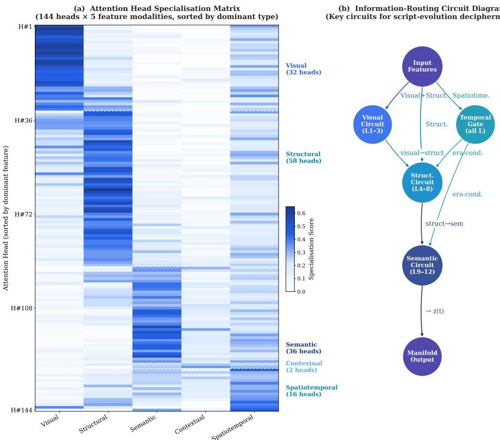  
Figure 11: Retained, unvalidated attention-pattern visualization. The graphic shows 144 entries, but its correspondence to the reported checkpoint is not independently established here. Head preferences are descriptive, not causal or cognitive evidence.

## D.7 LATENT VECTOR ARITHMETIC

Vector analogies provide exploratory tests of local representation structure. For example, a cross-era analogy can be written as

$$
a = z _ { \mathrm { O B I } } ^ { \mathrm { O x } } - z _ { \mathrm { R e g u l a r } } ^ { \mathrm { O x } } + z _ { \mathrm { R e g u l a r } } ^ { \mathrm { S h e e p } } .
$$

The existing example reports a cosine similarity of 0.563 between a and $z _ { \mathrm { O B I } } ^ { \mathrm { S h e e p } }$ , compared with a random-reference value of 0.035. These values characterize that example only. Ratios to near-zero random cosine values are not used as the principal effect measure. A broader evaluation should specify the analogy set, candidate vocabulary, rank-based metric, and random controls. Because semantic embeddings are included among the inputs, these results must not be described as emerging without linguistic information.

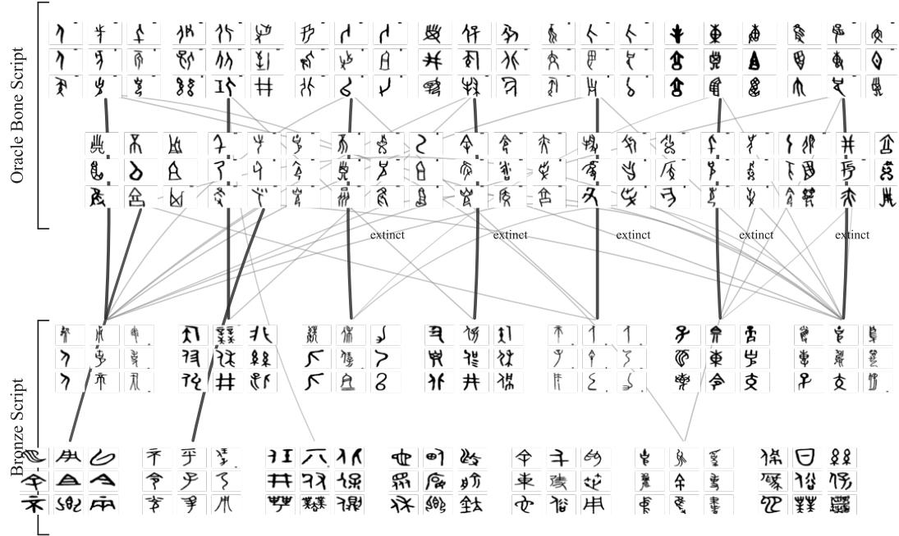  
Figure 12: Reference variant network before the illustrated filtering procedure.

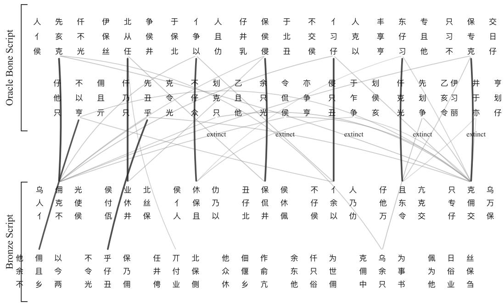  
Figure 13: Reference network after the illustrated filtering procedure. Reduced graph size does not establish the historical invalidity of removed variants.

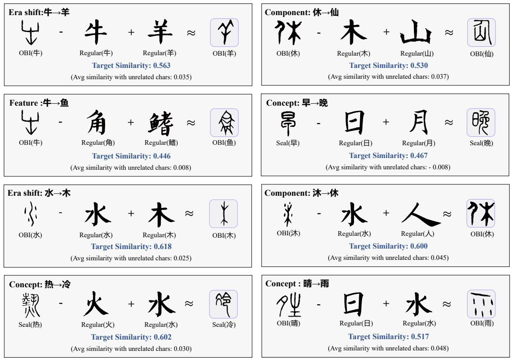  
Figure 14: Selected latent vector analogies. Individual examples do not establish a globally characterindependent transformation operator or disentangled semantic components.

## E FULL METHOD DETAILS

MSEF consists of a time-conditioned encoder, a latent velocity field, and a survival-score module.   
CBED uses their outputs for candidate retrieval and backward verification.

## E.1 FEATURE REPRESENTATION

For an observed glyph x assigned time t, the input feature vector is

$$
X = [ f _ { \mathrm { v i s } } ; f _ { \mathrm { s t r } } ; f _ { \mathrm { s e m } } ; f _ { \mathrm { c t x } } ; f _ { \mathrm { s t } } ] \in \mathbb { R } ^ { 3 5 2 } ,
$$

with dimensions 128, 64, 64, 64, and 32, respectively. Extraction and missing-feature handling are described in Appendix L.

## E.2 TIME CONDITIONING

The model uses the ordered time convention in Appendix K. Script type, scribal group, and archaeological date range are distinct metadata fields. A missing date is not an additional historical era.

## E.3 ENCODING AND EVOLUTION

Write

$$
E _ { \theta } ( X , t ) : = \mathcal { M } ( X , t ; \theta ) .
$$

An observed glyph is encoded at its assigned observation time:

$$
z _ { t } = E _ { \theta } ( X _ { t } , t ) .
$$

Its predicted state at another time u is

$$
\widetilde { z } _ { u } = \phi _ { t  u } ( z _ { t } ) .
$$

In general,

$$
E _ { \theta } ( X _ { t } , u ) \neq \phi _ { t  u } ( E _ { \theta } ( X _ { t } , t ) ) .
$$

Changing the encoder’s time argument is therefore not interchangeable with ODE integration. Neigh borhood visualizations are provided in Appendix Q.

## E.4 ARCHITECTURE

The main-text configuration uses a 12-layer Transformer encoder with a 256-dimensional output. The velocity field is a 3-layer MLP with spectral normalization and Tanh activations. The survival module is an MLP conditioned on the initial OBI representation and target time. The available architecture settings are listed in Appendix M.

## E.5 OPTIMIZATION AND INFERENCE

The encoder and velocity field are optimized using the evolution objectives in Appendix F. The survival objective has separate labels; its gradient routing is an implementation detail not determined by the objective alone. CBED first obtains candidate glyphs from later eras, then compares backward predicted states with available reference prototypes and the query. Algorithm 1 specifies the proposed consistent inference procedure.

## F FULL LOSS DEFINITIONS

Indexing convention. In pair sums, $( c , i , j )$ denotes a particular observed correspondence record, including its glyph variants, rather than one record per identity and era pair. In the complete-chain sum below, $c \in \mathcal { C } _ { \mathrm { c o m p l e t e } }$ indexes a chain record; several chain records can share a character identity. This avoids conflating glyph paths with unique characters. Let $E _ { \theta } ( X , t ) : = \mathcal { M } ( X , t ; \theta )$ . For an observed glyph of character c at time $t _ { i } ,$ write

$$
z _ { i } ^ { c } = E _ { \theta } ( X _ { i } ^ { c } , t _ { i } ) .
$$

Let $\mathcal { P } _ { \mathrm { a d j } }$ and $\mathcal { P } _ { \mathrm { s k i p } }$ contain verified training pairs from adjacent and non-adjacent script periods, respectively. Let

$$
\mathcal { P } = \mathcal { P } _ { \mathrm { a d j } } \cup \mathcal { P } _ { \mathrm { s k i p } } .
$$

A complete chain is a separate record in $\mathcal { C } _ { \mathrm { c o m p l e t e } } ,$ , not an additional unit to be added to a pair count.

## F.1 EVOLUTION OBJECTIVES

For nonempty supervision sets, define

$$
\mathcal { L } _ { \mathrm { a d j } } = \frac { 1 } { \vert \mathcal { P } _ { \mathrm { a d j } } \vert } \sum _ { ( c , i , j ) \in \mathcal { P } _ { \mathrm { a d j } } }  \phi _ { t _ { i }  t _ { j } } ( z _ { i } ^ { c } ) - z _ { j } ^ { c }  _ { 2 } ^ { 2 } ,\tag{8}
$$

$$
\mathcal { L } _ { \mathrm { s k i p } } = \frac { 1 } { | \mathcal { P } _ { \mathrm { s k i p } } | } \sum _ { ( c , i , j ) \in \mathcal { P } _ { \mathrm { s k i p } } } \left\| \phi _ { t _ { i } \to t _ { j } } ( z _ { i } ^ { c } ) - z _ { j } ^ { c } \right\| _ { 2 } ^ { 2 } ,\tag{9}
$$

$$
\mathcal { L } _ { \mathrm { f u l l } } = \frac { 1 } { \left| \mathcal { C } _ { \mathrm { c o m p l e t e } } \right| } \sum _ { c \in \mathcal { C } _ { \mathrm { c o m p l e t e } } } \left\| \phi _ { t _ { 0 } ^ { c } \to t _ { 4 } ^ { c } } ( z _ { 0 } ^ { c } ) - z _ { 4 } ^ { c } \right\| _ { 2 } ^ { 2 } ,\tag{10}
$$

$$
\mathcal { L } _ { \mathrm { c y c } } = \frac { 1 } { | \mathcal { P } | } \sum _ { ( c , i , j ) \in \mathcal { P } } \left\| \psi _ { t _ { j } \to t _ { i } } \left( \phi _ { t _ { i } \to t _ { j } } ( z _ { i } ^ { c } ) \right) - z _ { i } ^ { c } \right\| _ { 2 } ^ { 2 } .\tag{11}
$$

The endpoints in ${ \mathcal { L } } _ { \mathrm { f u l l } }$ are the assigned observation times of the chain. They are not automatically zero and one when record-specific times are used.

Meaning of the full-chain term. ${ \mathcal { L } } _ { \mathrm { f u l l } }$ is an endpoint-alignment loss on complete chains. It compares the first and last observations, not every intermediate observation. If the same endpoint pair is also included in $\mathcal { P } _ { \mathrm { s k i p } } .$ , the term reweights that endpoint supervision; it is not an independent intermediate-path constraint. Intermediate observations enter through the observed pair losses and candidate verification.

The evolution objective is

$$
{ \mathcal { L } } _ { \mathrm { e v o l u t i o n } } = \lambda _ { \mathrm { a d j } } { \mathcal { L } } _ { \mathrm { a d j } } + \lambda _ { \mathrm { s k i p } } { \mathcal { L } } _ { \mathrm { s k i p } } + \lambda _ { \mathrm { f u l l } } { \mathcal { L } } _ { \mathrm { f u l l } } + \lambda _ { \mathrm { c y c } } { \mathcal { L } } _ { \mathrm { c y c } } .
$$

When a minibatch contains no examples for a term, that term contributes zero rather than dividing by an empty-set size.

## F.2 SURVIVAL SUPERVISION

We use $s _ { \omega } ( z _ { 0 } ^ { c } , t )$ ) to denote the target-era survival score, with label $y _ { c , t } = 1$ for supported survival and $y _ { c , t } = 0$ for a documented negative outcome under the annotation protocol. If the implemented network outputs extinction probability $e _ { \omega } .$ then

$$
s _ { \omega } = 1 - e _ { \omega } .
$$

For labeled examples $\mathcal { D } _ { s }$

$$
\mathcal { L } _ { \mathrm { s u r v } } = - \frac { 1 } { | \mathcal { D } _ { s } | } \sum _ { ( c , t , y ) \in \mathcal { D } _ { s } } \left[ y \log s _ { \omega } ( z _ { 0 } ^ { c } , t ) + ( 1 - y ) \log ( 1 - s _ { \omega } ( z _ { 0 } ^ { c } , t ) ) \right] .\tag{12}
$$

Absence of an excavated or catalogued descendant is not automatically a confirmed negative label.   
Unknown outcomes require separate treatment.

## F.3 GRADIENT PATHS

Let $\theta , \eta ,$ , and ω parameterize the encoder, velocity field, and survival module, respectively. The evolution objective supplies gradients with respect to θ and $\eta ,$ while the survival objective supplies a gradient with respect to ω. If the OBI encoding remains connected to the encoder, the chain rule additionally gives

$$
\nabla _ { \boldsymbol { \theta } } \mathcal { L } _ { \mathrm { s u r v } } = ( D _ { \boldsymbol { \theta } } E _ { \boldsymbol { \theta } } ) ^ { \top } \nabla _ { z _ { 0 } } \mathcal { L } _ { \mathrm { s u r v } } .
$$

With a detached encoding this contribution is zero. These are different implementations, not consequences of using separate loss names. The available configuration does not identify which gradient route produced the reported checkpoints, so neither route is asserted as a verified implementation here. Examples without an observed OBI input do not supply $z _ { \mathrm { 0 } }$ for this loss.

## F.4 INTERPRETATION OF CYCLE CONSISTENCY

For the same velocity field and exact integration,

$$
\psi _ { t _ { j } \to t _ { i } } \circ \phi _ { t _ { i } \to t _ { j } } = \mathrm { i d } .
$$

Thus the round-trip loss primarily measures numerical self-consistency. It does not independently establish correct cross-era correspondence. Candidate verification instead compares

$$
\psi _ { t _ { j }  t _ { i } } ( z _ { j } ^ { c } )
$$

with the observed query encoding. The candidate representation is an independently observed target state rather than the query’s own forward prediction.

## F.5 DISCRIMINATIVE REPRESENTATION REQUIREMENTS

The alignment objectives alone admit a degenerate solution:

$$
E _ { \theta } ( X , t ) \equiv a , \qquad v _ { \eta } ( z , t ) \equiv 0 .
$$

All four evolution losses are then zero, although the representation cannot distinguish characters. This is a counterexample to a guarantee of discriminative learning from these objectives alone; it does not prove that the reported training runs actually converged to that solution. Freezing an offline feature extractor alone does not prevent a subsequent trainable encoder from becoming constant. The manuscript does not document an implemented anti-collapse mechanism sufficient to exclude this solution. Consequently, no such guarantee is claimed, and no unrun contrastive, classification, triplet, or variance loss is added to explain existing results.

## G FULL CBED ALGORITHM

Output scope. CBED returns Regular-script candidate identities or abstains. A low survival score rejects the entire query in this algorithm; it does not return an early-era reading for a character without a Regular-script descendant. Abstention records model rejection, not a confirmed historical extinction. This section specifies CBED using ODE-based forward prediction and backward checks at available reference observations.

## G.1 INPUTS AND REFERENCE INFORMATION

Let

$$
t _ { 0 } < t _ { 1 } < t _ { 2 } < t _ { 3 } < t _ { 4 }
$$

be the declared inference checkpoints for OBI, Bronze, Seal, Clerical, and Regular scripts. For clarity, the pseudocode uses one checkpoint per era. Finer-grained observations add assigned times to the ordered sequence. A comparison uses the same assigned time for the prototype and prediction; a prototype recorded at a different time needs an explicit transport operation. This algorithmic convention does not supply the missing numeric subperiod-to-time mapping. Let $\mathcal { D } _ { j }$ contain reference observations assigned to checkpoint $t _ { j }$ , with embeddings

$$
z _ { j } ^ { c } = E _ { \theta } ( X _ { j } ^ { c } , t _ { j } ) .
$$

The reference graph $\mathcal { G } _ { \mathrm { r e f } }$ contains only correspondences permitted by the evaluation protocol. It excludes held-out query identity labels and query-to-descendant answer edges. For previously retrieved observations A, Reach $( A , t _ { j } ; \mathcal { G } _ { \mathrm { r e f } } )$ returns reachable reference observations at $t _ { j }$ through permitted time-ordered edges.

## G.2 REFERENCE PATHS AND MISSING ERAS

A reference path p for candidate c identifies a Regular-script prototype and any available intermediateera prototypes associated with it. An unavailable intermediate observation is represented as missing, not as a zero vector. When no intermediate reference observations exist, a path containing only the Regular prototype is allowed. Its verification is endpoint-only and must not be described as independently verified at every era. Let $\mathcal { P } ( c )$ denote the permitted paths for candidate c.

## G.3 PATH SCORES

For a path that passes the available checks, let $ { \widetilde { z } } _ { 0 } ^ { p }$ be its backward-predicted OBI state. Define

$$
r _ { p } ( q ) = \frac { \langle \widehat { z } _ { 0 } ^ { p } , z _ { 0 } ^ { q } \rangle } { \operatorname* { m a x } \{ \| \widehat { z } _ { 0 } ^ { p } \| _ { 2 } \| z _ { 0 } ^ { q } \| _ { 2 } , \varepsilon _ { \mathrm { c o s } } \} } , \qquad \varepsilon _ { \mathrm { c o s } } > 0 .
$$

The candidate score is

$$
r ( c , q ) = \operatorname* { m a x } _ { p \in \mathcal { P } _ { \mathrm { o k } } ( c ) } r _ { p } ( q ) .
$$

A candidate with no valid path is excluded. This aggregation scores paths before combining their evidence; it does not average incompatible latent coordinates into a potentially misleading intermediate point.

Survival checks. The algorithm applies survival checks only through the Seal checkpoint. It does not reset cumulative survival to one after that checkpoint. Low survival score and failure of candidate verification are recorded as different rejection reasons.

No implicit re-anchoring. Forward query states are propagated by the ODE. Candidate retrieval expands a reference set; it does not reset the query state to the nearest reference prototype. By the flow-composition property, splitting exact integration into more segments does not change the final query state. Additional information in the cascade comes from intermediate reference retrieval, permitted graph expansion, and observed-prototype checks, not segmentation of the same integral alone.

Scores and evaluation. Compatibility scores are not calibrated probabilities. The score formula alone does not specify tie-breaking; the current summary also does not specify the verification thresholds or path-enumeration limits. These omissions limit exact reproduction of rankings. Retrieval metrics are computed after deduplicating candidate identities. For closed-set evaluation, an abstention counts as an incorrect prediction rather than removing the query from the denominator.

Algorithm 1 CBED with observed-checkpoint verification   
Require: Query $q ;$ checkpoints $\{ t _ { j } \} _ { j = 0 } ^ { 4 } ;$ reference database $\{ \mathcal { D } _ { j } \}$ ; permitted graph $\mathcal { G } _ { \mathrm { r e f } } .$ ; encoder $E ;$ flows   
$\phi ,$ ψ; retrieval depth $K ;$ survival threshold $\tau _ { s } ;$ verification thresholds $\{ \epsilon _ { j } \} _ { j = 0 } ^ { 3 }$   
Ensure: Ranked candidates with compatibility scores, or abstention with a recorded reason   
1: $X ^ { q } \gets$ EXTRACTPERMITTEDFEATURES(q)   
2: $z _ { 0 } ^ { q } \gets E ( X ^ { q } , t _ { 0 } )$   
3: $\widetilde { z } _ { 0 } ^ { q }  z _ { 0 } ^ { q }$   
4: $A  \emptyset$   
5: for $j = 1 , 2 , 3 ,$ 4 do   
6: $\mathbf { i f } \ j \le 2$ and $s ( z _ { 0 } ^ { q } , t _ { j } ) < \tau _ { s }$ then   
7: return ABSTAIN: low survival score   
8: end if   
9: $\widetilde { z } _ { j } ^ { q } \gets \phi _ { t _ { j - 1 }  t _ { j } } ( \widetilde { z } _ { j - 1 } ^ { q } )$   
10: $\begin{array} { r } { \dot { N } _ { j } \gets \mathrm { T o p K } ( \dot { \tilde { z } } _ { j } ^ { q } , \dot { \mathcal { D } } _ { j } , K ) } \end{array}$   
11: $C _ { j } \gets N _ { j } \cup \mathrm { R e a c h } ( A , t _ { j } ; \mathcal { G } _ { \mathrm { r e f } } )$   
12: $\overset { \cdot } { A ^ { \prime } }  A \overset { \cdot } { \cup } C _ { j }$   
13: end for   
14: $R \gets \emptyset$   
15: for each distinct candidate identity c in $C _ { 4 }$ do   
16: $V _ { c } \gets \emptyset$   
17: for each permitted reference path $p \in \mathcal { P } ( c )$ do   
18: $\widehat { z } \gets \widehat { z } _ { 4 } ^ { p }$   
19: valid ← true   
20: for $j = 3 , 2 , 1 , 0$ do   
21: if valid then   
22: $\widehat { z } \gets \psi _ { t _ { j + 1 }  t _ { j } } ( \widehat { z } )$   
23: $u \gets \mathrm { M I S S I N G }$   
24: $\mathbf { i f } \ j = 0$ then   
25: $u  z _ { 0 } ^ { q }$   
26: else   
27: if prototype $z _ { j } ^ { p }$ is observed then   
28: $u  z _ { j } ^ { p }$   
29: end if   
30: end if   
31: if $u \ne$ MISSING and $\| \widehat { z } - u \| _ { 2 } > \epsilon _ { j }$ then   
32: valid ← false   
33: end if   
34: end if   
35: end for   
36: if valid then   
37: $V _ { c } \gets V _ { c } \cup \{ r _ { p } ( q ) \}$   
38: end if   
39: end for   
40: if $V _ { c } \neq \emptyset$ then   
41: $R \dot {  } R \cup \{ ( c ,$ max $V _ { c } ) \}$   
42: end if   
43: end for   
44: if $R = \emptyset$ then   
45: return ABSTAIN: no consistent candidate   
46: end if   
47: return R sorted by decreasing compatibility score

## H DATASET DETAILS

## H.1 COUNTING UNITS

The main text reports 1,358 character categories. The available summaries do not establish final train/validation/test identity counts, per-era image counts, distinct pair counts, complete-chain counts, or survival-label counts. Accordingly, Table 14 defines units but is not presented as a completed numerical dataset manifest. Neither the 586 nor the 1,500 historical chain figure is adopted as a verified replacement count. We distinguish four units: a character identity, an observed glyph image, a cross-era correspondence pair, and an evolutionary chain. A correspondence pair identifies two observed glyph records and their script periods. A complete chain identifies linked observations across all five periods. Multiple glyph variants can produce several pairs or paths for the same character identity.

Table 14: Definitions of counting units used for FGCCES.
<table><tr><td>Record type</td><td>Definition</td></tr><tr><td>Character identity</td><td>Distinct correspondence label</td></tr><tr><td>Glyph observation</td><td>A recorded image in a script period</td></tr><tr><td>Correspondence pair</td><td>Two linked observed glyph records</td></tr><tr><td>Complete chain</td><td>Linked observations across all five periods</td></tr></table>

## H.2 SOURCES AND MISSING FEATURES

FGCCES combines records from jgwlbq, CCAMC, and the BNU character resources. Unavailable feature entries are zero-filled under the feature convention in Appendix L. A missing feature, a missing glyph observation, an unknown correspondence, and a confirmed negative lineage outcome are different states. They must not be collapsed into the same training label.

## H.3 TRAIN, VALIDATION, AND TEST SEPARATION

The intended evaluation uses character-disjoint training, validation, and test sets. Under this split definition, variants belonging to one held-out identity stay on the same identity side of the training/evaluation boundary. The text specifies the intended protocol; it does not certify a completed artifact-overlap or cross-benchmark leakage audit.

Query-side information. The intended simulated-undeciphered protocol excludes query answer identities, answer definitions, and answer-dependent annotations from feature construction. Actual per-benchmark masking records are not supplied in the available summary.

Candidate-side information. Public reference glyphs and permitted later-era correspondences are distinct from the held-out query’s answer information. Matching a dataset name does not establish that competing systems had the same candidate-side information.

Cross-benchmark overlap. Shared source collections can overlap in images, glyph variants, identities, and artifact context. Character-disjoint splitting alone does not rule out these channels, including indirect answer information in neighboring same-identity variants. No completed crosssource overlap audit is claimed here.

## H.4 FINE-GRAINED VISUALIZATION

Appendix R illustrates the retained scribal-group and subperiod metadata.

## H.5 COMPARISON WITH EXISTING RESOURCES

Appendix N distinguishes FGCCES correspondence records from recognition and multimodal benchmark resources.

## I THEORETICAL FOUNDATIONS

The following results concern the ODE in the Euclidean latent coordinates used by the model. They do not prove that the observed glyph data form a smooth manifold or that the feature encoder is invertible.

## I.1 REGULARITY ASSUMPTIONS

Let

$$
v : \mathbb { R } ^ { d } \times [ 0 , 1 ] \to \mathbb { R } ^ { d }
$$

be continuous in time and continuously differentiable in the latent state, with jointly continuous state Jacobian. Assume that v is uniformly globally L-Lipschitz in the state and that

$$
\operatorname* { s u p } _ { t \in [ 0 , 1 ] } \left\| v ( 0 , t ) \right\| < \infty .
$$

These are sufficient assumptions for the flow properties below. A finite-sample estimate of a Lipschitz ratio is not a certificate that these assumptions hold globally.

## I.2 EXISTENCE, UNIQUENESS, AND INVERTIBILITY

Proposition: regular latent flow. Under the stated assumptions, the initial-value problem

$$
\begin{array} { r } { \dot { z } ( t ) = v ( z ( t ) , t ) , \qquad z ( s ) = z _ { s } } \end{array}
$$

has a unique solution throughout [0, 1]. The flow $\phi _ { s  t }$ is a $C ^ { 1 }$ diffeomorphism, with

$$
\phi _ { s  t } ^ { - 1 } = \phi _ { t  s } .
$$

Proof. Uniform Lipschitz continuity gives local existence and uniqueness. The bound

$$
\| v ( z , t ) \| \leq L \| z \| + \operatorname* { s u p } _ { u } \| v ( 0 , u ) \|
$$

prevents finite-time escape on the bounded time interval. Continuous differentiability of the vector field gives differentiable dependence on the initial condition. Solving the same ODE backward from time t recovers the unique initial state at s. □

## I.3 COMPOSITION

For any $s , t , u \in [ 0 , 1 ] ,$

$$
\phi _ { s \to u } = \phi _ { t \to u } \circ \phi _ { s \to t } .
$$

Proof. Both sides solve the same initial-value problem from time $s ,$ so uniqueness implies equality. □

A deterministic latent flow therefore does not split a single initial point into multiple endpoints. Multiple glyph candidates arise from the observation and retrieval relation, not from non-uniqueness of the ODE solution.

## I.4 MANIFOLD DIMENSION

The main configuration uses d = 256. A dimension comparison must keep the dataset, evaluation protocol, encoder family, and parameter-counting convention explicit.

## J MANIFOLD SPACE VALIDATION

This section separates conditional mathematical properties from empirical diagnostics of a particular trained model.

## J.1 CONDITIONAL PROPERTIES AND DIAGNOSTICS

## J.1.1 CONTINUITY AND SENSITIVITY

Under Appendix I’s assumptions, Grönwall’s inequality gives

$$
\| \phi _ { s \to t } ( z _ { 1 } ) - \phi _ { s \to t } ( z _ { 2 } ) \| \leq e ^ { L | t - s | } \| z _ { 1 } - z _ { 2 } \| .
$$

A velocity bound additionally requires a bounded region of interest or a separate bound on the network output. It does not follow from local Lipschitz continuity alone.

Table 15: Reported finite-sample sensitivity diagnostics. Sampled maxima are not certified global bounds.
<table><tr><td>Reported quantity</td><td>Value</td></tr><tr><td>Estimated velocity-field Lipschitz ratio</td><td>2.34</td></tr><tr><td>Estimated flow Lipschitz ratio</td><td>8.7</td></tr><tr><td>Maximum sampled velocity norm</td><td>2.51</td></tr><tr><td>Mean adjacent-era distance</td><td>0.82</td></tr><tr><td>Reported trajectory smoothness statistic</td><td>0.15</td></tr></table>

## J.1.2 NUMERICAL ROUND-TRIP CONSISTENCY

For exact integration of the same field,

$$
\psi _ { t  s } \circ \phi _ { s  t } = \mathrm { i d } .
$$

Numerical implementations can have nonzero round-trip error. A small round-trip error does not

Table 16: Reported numerical consistency measurements. They are distinct from candidateidentification accuracy.
<table><tr><td>Metric</td><td>Value</td></tr><tr><td>OBI → Bronze → OBI error</td><td>0.023</td></tr><tr><td>OBI → Seal → OBI error</td><td>0.041</td></tr><tr><td>OBI → Regular → OBI error</td><td>0.068</td></tr><tr><td>Composition error</td><td>0.015</td></tr></table>

establish correct historical correspondence. Conversely, a difficult glyph or a rejected candidate does not establish ODE stiffness. The survival module does not provide a mathematical guarantee against stiffness. Such a claim would require solver diagnostics, not merely lower retrieval error after rejection.

## J.1.3 CONDITIONAL PROXIMITY

Suppose the initial encoder is LE-Lipschitz and $\lVert X _ { 1 } - X _ { 2 } \rVert \leq \delta$ . Then

$$
\| \phi _ { s  t } ( E ( X _ { 1 } , s ) ) - \phi _ { s  t } ( E ( X _ { 2 } , s ) ) \| \leq e ^ { L | t - s | } L _ { E } \delta .
$$

This follows by applying the encoder bound and then the flow bound. Shared semantic labels do not automatically imply the feature-distance premise. An upper distance bound also does not prove separation between different semantic groups.

Table 17: Reported radical-conditioned geometry. These are descriptive clustering measurements, not proofs of semantic preservation.
<table><tr><td>Metric</td><td>OBI</td><td>Bronze</td><td>Seal</td><td>Clerical</td><td>Regular</td></tr><tr><td>Intra-radical distance</td><td>1.35</td><td>1.28</td><td>1.18</td><td>1.12</td><td>1.08</td></tr><tr><td>Inter-radical distance</td><td>3.52</td><td>3.68</td><td>3.85</td><td>3.92</td><td>4.05</td></tr><tr><td>Distance ratio</td><td>2.61</td><td>2.88</td><td>3.26</td><td>3.50</td><td>3.75</td></tr><tr><td>Silhouette score</td><td>0.45</td><td>0.48</td><td>0.52</td><td>0.55</td><td>0.58</td></tr></table>

## J.1.4 VELOCITY DIRECTION

Let

$$
u = v ( z _ { 1 } ( t ) , t ) , \qquad w = v ( z _ { 2 } ( t ) , t ) .
$$

Assume

$$
\operatorname* { m i n } ( \| u \| , \| w \| ) \geq m > 0 , \qquad \| z _ { 1 } ( s ) - z _ { 2 } ( s ) \| \leq \delta .
$$

For $t \geq s ,$

$$
1 - \cos ( u , w ) \leq \frac { L ^ { 2 } e ^ { 2 L ( t - s ) } \delta ^ { 2 } } { 2 m ^ { 2 } } .
$$

Indeed,

$$
2 \| u \| \| w \| ( 1 - \cos ( u , w ) ) = \| u - w \| ^ { 2 } - ( \| u \| - \| w \| ) ^ { 2 } \leq \| u - w \| ^ { 2 } ,
$$

and the flow and velocity Lipschitz bounds bound $\lVert u - w \rVert$ . Without a nonzero speed lower bound, nearby states need not have aligned velocities.

Table 18: Unvalidated velocity-cosine and trajectory-angle summaries. The two columns are distinct reported quantities; the angle estimator is unspecified and is not inferred by applying arccos to a mean cosine.
<table><tr><td>Pair type</td><td>Velocity cosine</td><td>Trajectory angle</td></tr><tr><td>Same radical</td><td>0.78</td><td>11.2°</td></tr><tr><td>Same semantic category</td><td>0.71</td><td>15.8°</td></tr><tr><td>High co-occurrence</td><td>0.65</td><td>19.3°</td></tr><tr><td>Different radical</td><td>0.35</td><td>42.5°</td></tr><tr><td>Random pairs</td><td>0.31</td><td>45.7°</td></tr></table>

## J.1.5 BOUNDED VOLUME DISTORTION

If

$$
| \nabla \cdot v ( z , t ) | \leq C
$$

on the trajectories of a measurable set A with positive finite volume, then

$$
e ^ { - C | t - s | } \leq \frac { \mathrm { V o l } ( \phi _ { s  t } ( A ) ) } { \mathrm { V o l } ( A ) } \leq e ^ { C | t - s | } .
$$

Proof. The Jacobian determinant satisfies

$$
\operatorname* { d e t } D \phi _ { s \to t } ( z ) = \exp \left( \int _ { s } ^ { t } \nabla \cdot v ( z ( u ) , u ) d u \right) .
$$

Bounding the integral and applying change of variables gives the volume bounds.

This result bounds volume distortion. It does not imply volume preservation or an expected Jacobian determinant of one.

Table 19: Reported volume-related diagnostics. A sampled maximum divergence is not a certified supremum over the state space.
<table><tr><td>Reported quantity</td><td>Value</td></tr><tr><td>Mean absolute divergence</td><td>0.08</td></tr><tr><td>Maximum sampled absolute divergence</td><td>0.35</td></tr><tr><td>Estimated OBI-to-Regular volume ratio</td><td>1.12</td></tr><tr><td>Mean Jacobian determinant</td><td>1.08</td></tr></table>

## J.1.6 TRAJECTORY PERTURBATION BOUND

Let zb and $z ^ { * }$ solve the learned and a reference dynamics, respectively. Assume the learned field is L-Lipschitz and

$$
\| \widehat { v } ( z , u ) - v ^ { * } ( z , u ) \| \leq \epsilon
$$

on the relevant domain. For $t \geq s ,$ let

$$
E ( u ) = \| \widehat { z } ( u ) - z ^ { * } ( u ) \| ,
$$

and $L > 0 ,$

$$
E ( t ) \leq e ^ { L ( t - s ) } E ( s ) + \frac { \epsilon } { L } \left( e ^ { L ( t - s ) } - 1 \right) .
$$

For $L = 0 ,$

$$
E ( t ) \leq E ( s ) + \epsilon ( t - s ) .
$$

Proof. Almost everywhere,

$$
\dot { E } ( u ) \leq L E ( u ) + \epsilon .
$$

The integrated inequality gives the result. At zero error, the same argument can be formulated using the upper right Dini derivative. □

This is a conditional perturbation bound. It does not prove optimizer convergence, statistical consistency, or recovery of a known true historical vector field.

Intermediate corrections. Segmenting integration does not change the exact flow. If an additional correction operator satisfies

$$
E _ { i } ^ { + } \leq \rho _ { i } E _ { i } ^ { - } + \delta _ { i } ,
$$

then

$$
\begin{array} { r l } & { E _ { i } ^ { - } \le e ^ { L \Delta t _ { i } } E _ { i - 1 } ^ { + } + \displaystyle \frac { \epsilon } { L } ( e ^ { L \Delta t _ { i } } - 1 ) , } \\ & { E _ { i } ^ { + } \le \rho _ { i } \left[ e ^ { L \Delta t _ { i } } E _ { i - 1 } ^ { + } + \displaystyle \frac { \epsilon } { L } ( e ^ { L \Delta t _ { i } } - 1 ) \right] + \delta _ { i } . } \end{array}
$$

For $L = 0 ;$ , the factor $\epsilon ( e ^ { L \Delta t _ { i } } - 1 ) / L$ is replaced by its limit $\epsilon \Delta t _ { i }$ . An improvement requires conditions on the correction operator. Nearest-neighbor retrieval does not automatically satisfy such conditions. The candidate expansion in Algorithm 1 does not itself reset the query state.

## J.1.7 DENSITY EVOLUTION AS BACKGROUND

For a smooth probability density transported by the latent flow, the instantaneous change-of-variables relation is

$$
\frac { d } { d t } \log p ( z ( t ) , t ) = - \nabla \cdot v ( z ( t ) , t ) ,
$$

as used in continuous normalizing flows (Chen et al., 2018). Subject to the required integrability conditions, the differential entropy satisfies

$$
\frac { d H ( t ) } { d t } = \mathbb { E } _ { p _ { t } } [ \nabla \cdot v ( z , t ) ] .
$$

These identities are background properties of transported continuous densities. They do not implement the survival module, prove historical standardization, or imply that distinct points merge under a bijective finite-time flow. Mean absolute divergence does not determine the sign of entropy change.

## J.2 VELOCITY FIELD ANALYSIS

## J.2.1 MAGNITUDE BY ERA

These values depend on latent scaling and the selected time coordinate. They are not changes per calendar year. Under a differentiable, strictly increasing reparameterization $u = g ( t )$ with $g ^ { \prime } ( \bar { t } ) > 0$

$$
\frac { d z } { d u } = \frac { v ( z , t ) } { g ^ { \prime } ( t ) } .
$$

Consequently, comparisons of historical change rates require an explicitly justified time scale.

Table 20: Reported latent velocity magnitudes under the experimental coordinate system.
<table><tr><td>Transition</td><td>Mean norm</td><td>Standard deviation</td></tr><tr><td>OBI → Bronze</td><td>1.85</td><td>0.42</td></tr><tr><td>Bronze → Seal</td><td>1.42</td><td>0.31</td></tr><tr><td>Seal → Clerical</td><td>1.12</td><td>0.25</td></tr><tr><td>Clerical → Regular</td><td>0.45</td><td>0.12</td></tr></table>

## J.2.2 DIRECTION BY ERA

Table 21 retains the reported direction-summary series. The estimator behind “direction statistic” and the rule behind “clusters for 80%” are not specified. These entries are unvalidated observations, not a measured entropy, a certified dispersion statistic, or evidence of historical standardization. No missing estimator is inferred from their numeric range.

Table 21: Reported direction-dispersion diagnostics.
<table><tr><td>Era</td><td>Direction statistic</td><td>Clusters for 80%</td></tr><tr><td>OBI</td><td>0.42</td><td>5</td></tr><tr><td>Bronze</td><td>0.31</td><td>4</td></tr><tr><td>Seal</td><td>0.25</td><td>3</td></tr><tr><td>Clerical</td><td>0.18</td><td>2</td></tr><tr><td>Regular</td><td>0.12</td><td>2</td></tr></table>

## J.2.3 CHARACTER-TYPE ANALYSIS

Table 22: Reported velocity norms by character-type annotation.
<table><tr><td>Type</td><td>OBI-Br</td><td>Br-Se</td><td>Se-Cl</td><td>Cl-Re</td></tr><tr><td>Pictographic</td><td>2.15</td><td>1.58</td><td>1.25</td><td>0.52</td></tr><tr><td>Indicative</td><td>1.92</td><td>1.45</td><td>1.18</td><td>0.48</td></tr><tr><td>Ideographic</td><td>1.78</td><td>1.42</td><td>1.12</td><td>0.45</td></tr><tr><td>Phono-semantic</td><td>1.65</td><td>1.35</td><td>1.05</td><td>0.42</td></tr></table>

Character-type labels describe the analysis groups. Their association with velocity does not establish a causal mechanism.

## J.3 LOCAL NEIGHBORHOOD ILLUSTRATION

Figure 15 illustrates a local neighborhood around an Ox anchor and a dissimilar Wood reference. It is a schematic, not the empirical radical-group scatter plot suggested by an earlier caption. Its displayed proximity therefore carries no quantitative distance or clustering guarantee.

## J.4 SUMMARY

The conditional results characterize the latent ODE under explicit assumptions. The empirical measurements describe a finite set of representations and trajectories. Neither low-dimensional visualization nor small numerical round-trip error establishes historical correctness, global semantic preservation, or absence of memorization.

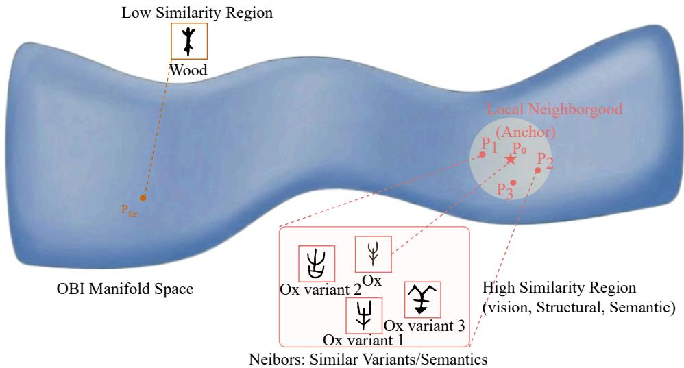  
Figure 15: Schematic local neighborhood around an $\mathrm { O B I \ ^ { 6 6 } O x ^ { 9 } }$ anchor. Nearby points illustrate similar variants or semantic associations; the distant “Wood” example illustrates a dissimilar reference. The surface is an illustration, not a measured radical-group scatter plot.

## K TIME ENCODING DETAILS

The following specifies the ordered era intervals and their interpretation. A record-level numeric time map, within-interval sampling distribution, and fixed inference anchors are not present in the available configuration. Thus the era intervals do not constitute a complete executable fine-grained time assignment. No uniform sampling rule or equally spaced scribal-group chronology is assumed.

## K.1 ORDERED TIME COORDINATE

We use the ordered script-period convention declared in Table 1:

$$
\begin{array} { r l } & { \quad I _ { \mathrm { O B I } } = [ 0 , 0 . 3 0 ) , } \\ & { I _ { \mathrm { B r o n z e } } = [ 0 . 3 0 , 0 . 7 0 ) , } \\ & { \quad I _ { \mathrm { S e a l } } = [ 0 . 7 0 , 0 . 8 5 ) , } \\ & { I _ { \mathrm { C l e r i c a l } } = [ 0 . 8 5 , 1 ) , } \\ & { \quad t _ { \mathrm { R e g u l a r } } = 1 . } \end{array}
$$

These intervals are model coordinates rather than durations proportional to calendar years. Their ordering is a modeling convention and does not assert that script categories occupy non-overlapping archaeological date ranges.

## K.2 FINE-GRAINED METADATA

Scribal group, regional provenance, script category, and archaeological date range are recorded separately. A scribal-group label is not automatically an ordered chronological bin. The label None denotes an unclassified sample, not an additional historical period.

## K.3 TRAINING AND INFERENCE TIMES

During training, the stated interval-sampling procedure samples times within the permitted intervals while preserving the order of supervised correspondences. Sampling additional time values does not create additional historical observations or determine a unique trajectory between observed eras.

## K.4 CONSEQUENCES FOR INTERPRETATION

Latent velocities depend on the chosen time parameterization. Accordingly, velocity magnitude is interpreted as change per unit model time, not as a measured rate of script change per year.

## L FEATURE EXTRACTION DETAILS

The input is a 352-dimensional concatenation of five feature groups:

$$
X = [ f _ { \mathrm { v i s } } ; f _ { \mathrm { s t r } } ; f _ { \mathrm { s e m } } ; f _ { \mathrm { c t x } } ; f _ { \mathrm { s t } } ] .
$$

## L.1 VISUAL FEATURES: 128 DIMENSIONS

The visual representation contains contour descriptors (32 dimensions), stroke descriptors (32), topological descriptors (16), symmetry descriptors (16), and density/appearance descriptors (32).

## L.2 STRUCTURAL FEATURES: 64 DIMENSIONS

The structural representation contains character-formation encoding (6 dimensions), component/radical representation (42), and spatial-layout representation (16). Image-observable structural annotations are distinguished from annotations that require a known modern reading.

## L.3 SEMANTIC FEATURES: 64 DIMENSIONS

The semantic block encodes dictionary definitions using a BERT-based representation followed by the dimensionality reduction used in the implementation. In the intended undeciphered-query protocol, the answer definition is unavailable and its semantic block is zero-filled. Providing that definition to a labeled benchmark query would instead evaluate a different information setting; the benchmark labels alone do not establish that the masking was actually executed.

## L.4 CONTEXT FEATURES: 64 DIMENSIONS

Let $\mathcal { N } ( c )$ be the other observed characters on the same archaeological artifact. Define

$$
h ^ { c ^ { \prime } } = [ f _ { \mathrm { v i s } } ^ { c ^ { \prime } } ; f _ { \mathrm { s t r } } ^ { c ^ { \prime } } ; f _ { \mathrm { s e m } } ^ { c ^ { \prime } } ] \in \mathbb { R } ^ { 2 5 6 } .
$$

Making the projection explicit,

$$
f _ { \mathrm { c t x } } ^ { c } = \left\{ \begin{array} { l l } { W _ { \mathrm { c t x } } \displaystyle \frac { 1 } { | \mathcal { N } ( c ) | } \sum _ { c ^ { \prime } \in \mathcal { N } ( c ) } h ^ { c ^ { \prime } } , } & { | \mathcal { N } ( c ) | > 0 , } \\ { 0 \in \mathbb { R } ^ { 6 4 } , } & { | \mathcal { N } ( c ) | = 0 , } \end{array} \right.
$$

where

$$
W _ { \mathrm { c t x } } \in \mathbb { R } ^ { 6 4 \times 2 5 6 } .
$$

## L.5 SPATIOTEMPORAL FEATURES: 32 DIMENSIONS

The spatiotemporal block contains a 16-dimensional temporal/provenance encoding and a 16- dimensional spatial encoding. The temporal information describing the observed artifact is distinct from the target time supplied to the dynamics. Transporting a latent state does not change the query artifact’s actual provenance.

## L.6 MISSING FEATURES AND EVALUATION AVAILABILITY

Unavailable feature entries are zero-filled. This preserves input dimensionality but does not imply that missingness has no effect on prediction. Table 23 gives the intended information boundary. It is a protocol specification, not a retrospective verification of every benchmark run. Candidate-side reference information is distinct from query-side answer information.

Table 23: Intended information-access rules; execution is not certified by this table.
<table><tr><td>Field</td><td>Query side</td><td>Training/reference side</td></tr><tr><td>Glyph and provenance</td><td>Observed image and artifact metadata</td><td>Observed reference records</td></tr><tr><td>Answer identity</td><td>Excluded from model input</td><td>Training identities only; candidate labels are reference outputs</td></tr><tr><td>Dictionary definition</td><td>Query answer definition excluded; un- available block zero-filled</td><td>Definitions of permitted reference identi- ties</td></tr><tr><td>Structural annotation</td><td>Image-observable components only; no answer-dependent labels</td><td>Permitted reference annotations</td></tr><tr><td>Artifact context</td><td>Available neighbors; no hidden query an- swer or answer-equivalent variant</td><td>Separate from proof of artifact-disjoint splitting</td></tr><tr><td>Correspondence graph</td><td>No held-out query-to-answer edges</td><td>Only permitted reference correspon- dences</td></tr></table>

## L.7 SCOPE OF END-TO-END TRAINING

The offline feature pipeline is distinct from the trainable encoder and dynamics. Here, end-to-end optimization refers to the trainable components explicitly connected by the objectives in Appendix F. We do not infer the necessity of handcrafted features from unreported comparisons with deep image encoders. Any such comparison requires matched data, training budgets, and evaluation conditions.

## M IMPLEMENTATION DETAILS

Scope of the configuration. The settings below preserve the documented configuration. The Transformer hidden width, heads per layer, feed-forward width, feature-to-token construction, precise time injection, checkpoint selection, seed list, and per-checkpoint pruning thresholds are not specified. The 140M headline and the 144-head graphic cannot be reconstructed from the 352-dimensional input and 256-dimensional output alone. No undocumented encoder is introduced to reconcile the parameter count. The configuration below follows the architecture and training setup declared in the main text.

## M.1 ARCHITECTURE

The encoder is a 12-layer Transformer producing a 256-dimensional latent representation. The velocity network is a 3-layer MLP with spectral normalization and Tanh activations. The survival module is conditioned on the initial OBI representation and target time.

## M.2 NUMERICAL INTEGRATION

Forward and backward integrations use the same learned velocity field. Solver tolerances control numerical error estimates; they do not guarantee exact reversibility or correct character correspondence.

## M.3 OPTIMIZATION

The survival supervision objective is defined in Appendix F. A separate survival objective does not imply that every cross-era pair supplies a survival label.

## M.4 PARAMETER COUNTS AND TIMING

Parameter counts distinguish trainable model parameters from frozen feature extractors. Timing distinguishes offline preprocessing, index construction, model inference, and candidate verification. The main text reports approximately 18 hours on two NVIDIA H100 GPUs for a training run. Appendix S gives the corresponding accounting.

Table 24: Architecture and optimization configuration.
<table><tr><td>Setting</td><td>Value</td></tr><tr><td>Input dimension Latent dimension Encoder layers</td><td>352 256 12 Transformer layers</td></tr><tr><td>Velocity network Velocity activation</td><td>3-layer MLP Tanh</td></tr><tr><td>Velocity normalization</td><td>Spectral normalization</td></tr><tr><td>ODE solver</td><td> $\mathsf { d o p r i } 5$ </td></tr><tr><td>Relative tolerance</td><td> $1 0 ^ { - 5 }$ </td></tr><tr><td>Absolute tolerance</td><td></td></tr><tr><td></td><td> $1 0 ^ { - 5 }$ </td></tr><tr><td>Optimizer</td><td> $\mathrm { A d a m W }$ </td></tr><tr><td>Learning rate</td><td> $1 0 ^ { - 4 }$ </td></tr><tr><td>Weight decay</td><td> $1 0 ^ { - 4 }$ </td></tr><tr><td>Batch size</td><td></td></tr><tr><td></td><td>256</td></tr><tr><td>Training epochs</td><td>100</td></tr><tr><td>Gradient clipping norm</td><td>1.0</td></tr><tr><td>Independent runs</td><td>5</td></tr><tr><td> $\lambda _ { \mathrm { a d j } }$ </td><td>1.0</td></tr><tr><td> $\lambda _ { \mathrm { s k i p } }$ </td><td>0.5</td></tr><tr><td> $\lambda _ { \mathrm { f u l l } }$ </td><td>0.3</td></tr><tr><td> $\lambda _ { \mathrm { c y c } }$ </td><td>0.5</td></tr><tr><td>Per-checkpoint retrieval depth</td><td>5</td></tr><tr><td>Survival-score threshold</td><td>0.1</td></tr></table>

## N DATASET CONSTRUCTION DETAILS

Relation to prior cross-era data. EVOBC already provides a character-evolution resource spanning six historical stages.1 FGCCES is positioned here by its fine-grained metadata and organization of partial correspondences, not by a claim that no earlier cross-era dataset exists. The available documentation does not establish priority for the broader category of unified cross-era datasets.

## N.1 SOURCE RECORDS

FGCCES combines OBI records from jgwlbq, Bronze-script records from CCAMC, and later-script records from the BNU character resources. Each released correspondence should be traceable to its source glyph records and supporting documentation.

## N.2 CORRESPONDENCE VERIFICATION

The construction process uses dictionary cross-references and expert assessment of candidate correspondences. The dictionaries cited in the source manuscript include Shuowen Jiezi, Jiaguwen Zidian, and Jinwen Bian. Disputed correspondences should remain distinguishable from agreed correspondences. Variant-level paths should retain the provenance of each edge.

## N.3 PAIRS, CHAINS, AND AVAILABILITY

The data support training from partial correspondences rather than only complete five-era chains. Counts use the units defined in Appendix H. The earlier aggregate availability chart is omitted because its source-level character totals and 1.5K+ complete-chain bar are not reconciled with a final FGCCES manifest. Table 14 defines the four units; it does not contain numerical counts against which that chart could be verified. Partial correspondences remain a supported data organization without assigning an unverified aggregate size.

## N.4 COMPARISON WITH EXISTING RESOURCES

FGCCES emphasizes cross-era correspondence records and associated provenance. Recognition datasets and multimodal benchmarks serve related but different evaluation purposes. We do not

Table 25: Roles of selected existing resources and FGCCES. This table compares task focus, not dataset scale.
<table><tr><td>Resource</td><td>Role in this comparison</td></tr><tr><td>Oracle-241</td><td>Character recognition</td></tr><tr><td>OBC306</td><td>Character recognition</td></tr><tr><td>OBI-IJDH</td><td>OBI image resource</td></tr><tr><td>OracleSage</td><td>Multimodal OBI resource</td></tr><tr><td>EVOBC</td><td>Multi-era character evolution resource</td></tr><tr><td>FGCCES</td><td>Cross-era correspondence records</td></tr></table>

equate the MSEF model with the FGCCES dataset, or equate a pair count with a complete-chain count.

## O ADDITIONAL EXPERIMENTAL RESULTS

Interpretation of retained summaries. Tables explicitly labeled unvalidated preserve supplied aggregate observations without asserting that their protocols have been reconstructed. They are not used to establish a matched method advantage, a calibrated success probability, or a commonhardware speedup. No absent log, adapter, seed, or sample-level record is inferred from the displayed numbers. This section supplements the main experiments. Benchmark-specific inputs, candidate collections, and aggregation rules are distinguished explicitly.

## O.1 MULTI-ROUND DECIPHERMENT

Repeated identical inference from a deterministic model does not produce additional candidates. A multi-round evaluation therefore requires a specified source of variation or a rule for selecting different ranked candidates. For attempts $\widehat { y } _ { q } ^ { ( 1 ) } , \ldots , \widehat { y } _ { q } ^ { ( n ) }$ and valid-answer set $Y _ { q } ,$ a cumulative hit rate is

$$
H _ { n } = \frac { 1 } { | Q | } \sum _ { q \in Q } \mathbf { 1 } \left[ \exists r \leq n : \widehat { y } _ { q } ^ { ( r ) } \in Y _ { q } \right] .
$$

This is not the same as single-attempt Top-1 accuracy, OCR Top-K, or recall at rank n. The definition of $H _ { n }$ does not establish that the retained score series in Table 26 was computed using that definition. Repeated deterministic inference alone cannot produce additional attempts.

Table 26: Unvalidated multi-round score summaries (percent). Attempt generation, feedback, and duplicate handling are not identified by the supplied records; these values are not established cumulative hit rates or evidence of independent candidate diversity.
<table><tr><td>Method</td><td>1</td><td>2</td><td>3</td><td>5</td><td>8</td><td>10</td></tr><tr><td>OBS-OCR</td><td></td><td></td><td></td><td></td><td></td><td></td></tr><tr><td>OBSD</td><td>41.0</td><td>56.0</td><td>67.5</td><td>76.5</td><td>79.5</td><td>80.0</td></tr><tr><td>MSEF</td><td>71.5</td><td>80.5</td><td>85.0</td><td>88.5</td><td>90.5</td><td>91.0</td></tr><tr><td>PaddleOCR</td><td></td><td></td><td></td><td></td><td></td><td></td></tr><tr><td>OBSD</td><td>30.0</td><td>40.0</td><td>46.0</td><td>53.0</td><td>57.5</td><td>58.5</td></tr><tr><td>MSEF</td><td>58.5</td><td>67.0</td><td>72.5</td><td>77.0</td><td>79.5</td><td>80.5</td></tr></table>

## O.2 BENCHMARK-SPECIFIC RESULTS

FGCCES ranks character/glyph candidates. PictOBI-20k instead asks a model to choose a real-object image corresponding to an OBI image (Chen et al., 2025). The available MSEF specification does not identify an encoder of those object images or a glyph-to-option adapter. Likewise, it does not identify whether the OCR interface consumes retrieved glyph images or directly scores character identities. OCR Top-K and the retrieval model’s own Top-K are different rankings. Thus the native retrieval algorithm alone does not establish comparability of the PictOBI and OCR scores.

Aggregation of PictOBI subgroups. For disjoint Normal and Complex groups on a common test population, micro-averaging gives $A = w A _ { \mathrm { N o r m a l } } + ( 1 - w ) A _ { \mathrm { C o m p l e x } } ,$ with a common w across models. The displayed Gemini and Claude summaries imply w $\simeq 0 . 9 0 1 1$ , whereas the MSEF summary implies $w \simeq 0 . 8 7 7 7$ . The supplied subgroup denominators and aggregation rule do not resolve this difference. The reported 72.18 is not replaced by a newly inferred accuracy, and is not treated here as a verified common-population micro-average.

Baseline-column provenance. The supplied review identifies an attribution issue in the Pix2Pix column of Table 2: its Top-50/100/200/500 values (4.5, 13.0, 20.0, 21.5) correspond to a DRIT++ series in the cited source. Without a reproduction log identifying that column, the appendix does not interpret it as a verified independent Pix2Pix reproduction or use it to draw a method-specific conclusion. This issue is separate from the MSEF output adapter.

Table 27: Main-text score summaries under different prediction interfaces. Differences are arithmetic only: task adapters and information matching are not established, and the PictOBI aggregate has an unresolved subgroup-weighting convention.
<table><tr><td>Evaluation</td><td>Comparator</td><td>MSEF</td><td>Difference</td></tr><tr><td>OBS-OCR Top-1</td><td>OBSD: 41.0</td><td>71.5</td><td>30.5</td></tr><tr><td>PictOBI accuracy</td><td>Gemini: 53.66</td><td>72.18</td><td>18.52</td></tr><tr><td>FGCCES R@1</td><td>OracleAgent: 62.8</td><td>72.5</td><td>9.7</td></tr></table>

The metrics differ in their prediction spaces and evaluation interfaces. We do not infer robustness merely because the reported values are numerically similar.

## O.3 ADDITIONAL ABLATION STUDIES

Table 28: Reported retrieval results by era pair.
<table><tr><td>Task</td><td>R@1</td><td>R@5</td></tr><tr><td>OBI → Bronze</td><td> $8 0 . 2 \pm 0 . 9$ </td><td> $9 0 . 5 \pm 0 . 7$ </td></tr><tr><td>Bronze → Seal</td><td> $8 5 . 5 \pm 0 . 7$ </td><td> $9 3 . 8 \pm 0 . 5$ </td></tr><tr><td>Seal → Clerical</td><td> $8 7 . 8 \pm 0 . 6$ </td><td> $9 5 . 2 \pm 0 . 4$ </td></tr><tr><td>Clerical → Regular</td><td> $8 9 . 2 \pm 0 . 5$ </td><td> $9 6 . 0 \pm 0 . 3$ </td></tr><tr><td>OBI → Seal</td><td> $7 4 . 5 \pm 1 . 0$ </td><td> $8 6 . 2 \pm 0 . 8$ </td></tr><tr><td>OBI → Clerical</td><td> $7 3 . 2 \pm 1 . 1$ </td><td> $8 5 . 0 \pm 0 . 9$ </td></tr><tr><td>OBI → Regular</td><td> $7 2 . 5 \pm 0 . 8$ </td><td> $8 6 . 5 \pm 0 . 6$ </td></tr></table>

Differences between tasks can also reflect candidate-set size, query composition, and available reference coverage. They are not attributed solely to historical standardization.

## O.4 EFFECT OF INTERMEDIATE ERAS

The reported results increase as eras are added. Because supervision and reference coverage also change, this experiment does not isolate the effect of the number of integration checkpoints.

Table 29: Unvalidated era-augmentation summary A. This identifier denotes a report series, not a verified run configuration. Unreconciled pair counts are omitted.
<table><tr><td>Eras</td><td>R@1</td><td>R@5</td></tr><tr><td>OBI, Regular</td><td> $6 1 . 2 \pm 1 . 2$ </td><td> $7 6 . 5 \pm 1 . 0$ </td></tr><tr><td>+ Bronze</td><td> $6 5 . 7 \pm 1 . 0$ </td><td> $8 0 . 8 \pm 0 . 8$ </td></tr><tr><td>+ Seal</td><td> $6 9 . 5 \pm 0 . 9$ </td><td> $8 4 . 2 \pm 0 . 7$ </td></tr><tr><td>+ Clerical</td><td> $7 2 . 5 \pm 0 . 8$ </td><td> $8 6 . 5 \pm 0 . 6$ </td></tr></table>

## O.5 FAIRNESS OF CROSS-ERA DATA UTILIZATION

Summaries A and B report different intermediate scores: 61.2 versus 63.5 for the two-era case, 65.7 versus 66.8 after Bronze, and 69.5 versus 70.2 after Seal. Their run identifiers, split correspondence, and reference-access differences are not established. The series are therefore neither pooled nor described as replications, and the absent configuration difference is not invented. Using additional cross-era evidence is a useful capability, but it does not eliminate the need for matched comparisons. Training examples, feature availability, candidate vocabularies, and inference-time reference graphs are separate resources. The 0.7-point difference between 63.5 and 62.8 does not alone establish

Table 30: Unvalidated restricted-supervision summary B. Configuration equivalence with summary A is not established; no matched-information advantage is inferred. Unreconciled pair/chain counts are omitted.
<table><tr><td>Reported configuration</td><td>R@1</td></tr><tr><td>OracleSage OracleAgent</td><td>60.1 62.8</td></tr><tr><td>MSEF, OBI–Modern only</td><td> $6 3 . 5 \pm 1 . 1$ </td></tr><tr><td>MSEF, complete chains only</td><td> $5 2 . 8 \pm 1 . 3$ </td></tr><tr><td>MSEF, + Bronze</td><td> $6 6 . 8 \pm 1 . 0$ </td></tr><tr><td>MSEF, + Seal</td><td> $7 0 . 2 \pm 0 . 9$ </td></tr><tr><td>MSEF, full</td><td> $7 2 . 5 \pm 0 . 8$ </td></tr></table>

a statistically reliable methodological advantage. Uncertainty and a specified comparison test are required. Joint-Consistent CrossFont from Table 9 must also be considered: its reported OBI-to-Regular point estimate equals 72.5.

## O.6 ERROR ANALYSIS

The original analysis assigns 200 failure cases to the categories below. These categories describe observed failure contexts, not mutually exclusive causal explanations of model error. Damage and

Table 31: Reported coding of 200 failure cases.
<table><tr><td>Assigned category</td><td>Share (%)</td></tr><tr><td>Glyph damage</td><td>45</td></tr><tr><td>Character splitting or correspondence ambiguity</td><td>28</td></tr><tr><td>Scribal variants</td><td>16</td></tr><tr><td>Other/model-related diagnostics</td><td>11</td></tr></table>

variation are also conditions a decipherment model is expected to handle. The table therefore does not justify the claim that only 11 percent of errors are model limitations.

## O.7 COMPATIBILITY SCORES AND CALIBRATION SCOPE

No numerical calibration result is established from the available aggregate summaries. The equations below define a possible per-query analysis rather than report a completed calibration experiment. Empty bins are omitted, and all quantities refer to the same evaluation population. Calibration conditional on accepted queries would need its acceptance coverage reported separately. A normalized retrieval score is not automatically a calibrated probability. Let Q be the declared evaluation population, $p _ { q }$ a confidence value, and $a _ { q } \in \{ 0 , \bar { 1 } \}$ the corresponding correctness indicator. For confidence bins $B _ { b }$ , define

$$
\operatorname { a c c } ( B _ { b } ) = { \frac { 1 } { | B _ { b } | } } \sum _ { q \in B _ { b } } a _ { q } ,
$$

$$
\mathrm { c o n f } ( B _ { b } ) = \frac { 1 } { \left| B _ { b } \right| } \sum _ { q \in B _ { b } } p _ { q } ,
$$

$$
\mathrm { E C E } = \sum _ { b } \frac { | B _ { b } | } { | Q | } \left| \operatorname { a c c } ( B _ { b } ) - \operatorname { c o n f } ( B _ { b } ) \right| .
$$

For micro-averaging over the same population,

$$
\operatorname { A c c } ( Q ) = \sum _ { b } { \frac { | B _ { b } | } { | Q | } } \operatorname { a c c } ( B _ { b } ) .
$$

## O.8 SCRIBAL-GROUP ANALYSIS

Table 32 retains group-specific score summaries. The earlier count column summed to 1,400, but its unit and deduplication convention were not identified. It is omitted rather than relabeled as images, identities, or artifacts without evidence. The five named groups are a subset of the metadata labels, not an exhaustive chronology. Without common candidate sets and sampling records, these differences do not establish historical causes of accuracy.

Table 32: Unvalidated score summaries for five named scribal groups. The count column is omitted because its counting unit is unresolved.
<table><tr><td>Group</td><td>R@1</td><td>R@5</td></tr><tr><td>Bin</td><td> $7 5 . 8 \pm 0 . 9$ </td><td> $8 8 . 5 \pm 0 . 7$ </td></tr><tr><td>Li</td><td> $7 3 . 5 \pm 1 . 0$ </td><td> $8 6 . 8 \pm 0 . 8$ </td></tr><tr><td>Chu</td><td> $7 2 . 2 \pm 1 . 1$ </td><td> $8 5 . 5 \pm 0 . 9$ </td></tr><tr><td>Zi</td><td> $7 0 . 5 \pm 1 . 2$ </td><td> $8 3 . 8 \pm 1 . 0$ </td></tr><tr><td>Huang</td><td> $6 8 . 2 \pm 1 . 3$ </td><td> $8 1 . 5 \pm 1 . 1$ </td></tr></table>

## O.9 COMPUTATIONAL EFFICIENCY

Table 33: Unvalidated computational summaries. Common hardware, batching, precision, timing boundaries, and parameter-counting scope are not established; no cross-method speed or memory advantage is inferred.
<table><tr><td>Method</td><td>Seconds/query</td><td>Parameters</td><td>GPU memory</td></tr><tr><td>OBSD</td><td>0.85</td><td>89M</td><td>8GB</td></tr><tr><td>OracleFusion</td><td>0.95</td><td>89M</td><td>8GB</td></tr><tr><td>OracleSage</td><td>1.8</td><td>7B</td><td>24GB</td></tr><tr><td>OracleAgent</td><td>2.3</td><td>7B</td><td>28GB</td></tr><tr><td>MSEF</td><td>0.18</td><td>140M</td><td>6GB</td></tr></table>

Using the displayed parameter counts, $7 \mathrm { B } / 1 4 0 \mathrm { M } = 5 0 .$ , not 580. This arithmetic does not verify that the parameter-counting scopes are comparable.

## O.10 COMPARISON WITH A DIFFUSION-BASED PROBABILITY-FLOW ODE

The value 0.023 in Table 16 denotes an OBI–Bronze–OBI round trip, whereas 0.068 denotes an OBI– Regular–OBI round trip. Neither is substituted into a cross-model comparison without a matched integration path, solver, and state-normalization convention. The baseline schedule, conditioning, and supervision are not fully specified, so the retained retrieval summaries are not a controlled comparison of all probability-flow and Neural ODE models. This comparison concerns the particular probability-flow ODE baseline implemented for the experiment. It does not establish limitations of every diffusion-based or time-conditioned model.

Table 34: Unvalidated retrieval summaries for two dynamics parameterizations. The previous cycleerror column is omitted because its integration paths are not matched.
<table><tr><td>Model</td><td>R@1</td><td>R@5</td></tr><tr><td>Diffusion PF-ODE</td><td>61.4</td><td>76.8</td></tr><tr><td>MSEF Neural ODE</td><td>72.5</td><td>86.5</td></tr></table>

A smaller numerical cycle error is not independent proof of semantic correctness or topological superiority.

## O.11 BACKWARD VERIFICATION AND STEP-WISE PRUNING

Let $C _ { q }$ be the forward candidate set and $Y _ { q }$ the set of valid answers. Define

$$
T P _ { q } = C _ { q } \cap Y _ { q } , \qquad F P _ { q } = C _ { q } \setminus Y _ { q } .
$$

For retained candidates $C _ { q } ^ { \mathrm { k e e p } }$ , the candidate-weighted false-positive removal rate is

$$
\mathrm { F P D R } = \frac { \sum _ { q } | F P _ { q }  \setminus C _ { q } ^ { \mathrm { k e e p } } | } { \sum _ { q } | F P _ { q } | } .
$$

The true-positive retention rate is

$$
\mathrm { T P R } = \frac { \sum _ { q } | T P _ { q } \cap C _ { q } ^ { \mathrm { k e e p } } | } { \sum _ { q } | T P _ { q } | } .
$$

These metrics are defined only for nonzero denominators.

Table 35: Unvalidated candidate-filtering diagnostics. The analyzed candidate population and weighting are not established; the percentages are not independently verified estimates of the FPDR and TPR definitions in the text.
<table><tr><td>Candidate type</td><td>Mean backward error</td><td>Removal</td><td>Retention</td></tr><tr><td>Valid targets</td><td>0.025</td><td>1.2%</td><td>98.8%</td></tr><tr><td>Distractors</td><td>0.142</td><td>82.4%</td><td>17.6%</td></tr></table>

In Table 5, removing bidirectional verification changes R@1 from 72.5 to 66.3, a difference of 6.2 percentage points. Removing cascaded retrieval gives 64.0 and is a different ablation. The diagnostic score separation supports testing a verification rule. It does not guarantee rejection of all incorrect candidates or retention of every valid answer.

## O.12 SCOPE OF EXPERT AGREEMENT AND SIGNIFICANCE CLAIMS

The main text reports outcomes for 100 cases in a 72/12/16 split. Agreement with experts, acceptance after further discussion, and validation by independent historical evidence are distinct outcomes. The available summary does not identify case-level supporting sources, validation dates, or adjudication records for the 12 cases labeled “later validated”. That category is therefore not interpreted here as independently confirmed new decipherments.

The main-text significance symbols are retained source assertions, not tests recomputed in this appendix. Means and standard deviations across five runs alone do not determine a paired test: the pairing, unit of analysis, test statistic, and treatment of multiple comparisons also matter. No additional p-value or significance conclusion is inferred from those aggregates.

## P EXTENDED CASE STUDIES AND RETRIEVAL GALLERY

The main text uses “Ox” to illustrate candidate retrieval and verification. This section presents additional retrieval examples across different glyph structures.

## P.1 FULL RETRIEVAL GALLERY

Figure 16 displays Top-5 Bronze candidates for 40 selected OBI queries.

Visual and semantic distractors. Selected queries have candidates sharing visual components or semantic associations. These examples illustrate the ambiguity of nearest-neighbor retrieval.

Scope of the visualization. The gallery shows reference glyphs retrieved from a database. It does not demonstrate generation of previously unobserved ancient glyph images.

Failure cases and selection. A selected gallery does not establish that the correct answer is always retrieved within the first five positions. Aggregate recall and rejection statistics must be reported separately.

<table><tr><td rowspan=1 colspan=18>Query (OBI)    Top-5 Candidates (Bronze)   Query (OBI)    Top-5 Candidates (Bronze)</td></tr><tr><td rowspan=2 colspan=1>日</td><td rowspan=2 colspan=1>Sun</td><td rowspan=2 colspan=1>O</td><td rowspan=2 colspan=1>D</td><td rowspan=2 colspan=1>8</td><td rowspan=2 colspan=1>A</td><td rowspan=2 colspan=1>D</td><td rowspan=2 colspan=1></td><td rowspan=2 colspan=2>1</td><td></td><td rowspan=2 colspan=2>Person</td><td rowspan=2 colspan=1>7</td><td rowspan=2 colspan=1>大</td><td rowspan=2 colspan=1>人</td><td rowspan=2 colspan=1>來</td><td rowspan=2 colspan=1>大</td></tr><tr><td rowspan=1 colspan=3></td></tr><tr><td rowspan=1 colspan=1>D</td><td rowspan=1 colspan=1>Moon</td><td rowspan=1 colspan=1>D</td><td rowspan=1 colspan=1>D</td><td rowspan=1 colspan=1>A</td><td rowspan=1 colspan=1></td><td rowspan=1 colspan=1>月</td><td rowspan=1 colspan=1></td><td rowspan=1 colspan=2>y</td><td rowspan=1 colspan=2>Hea</td><td rowspan=1 colspan=2>Head</td><td rowspan=1 colspan=1>岁</td><td rowspan=1 colspan=1>Y</td><td rowspan=1 colspan=1>月</td><td rowspan=1 colspan=1>台</td></tr><tr><td rowspan=1 colspan=1>M</td><td rowspan=1 colspan=1>Mountain</td><td rowspan=1 colspan=1></td><td rowspan=1 colspan=1>征</td><td rowspan=1 colspan=1>と</td><td rowspan=1 colspan=1>1</td><td rowspan=1 colspan=1>X</td><td rowspan=1 colspan=1></td><td rowspan=1 colspan=2></td><td rowspan=2 colspan=3>EyeEar</td><td rowspan=1 colspan=1>月</td><td rowspan=1 colspan=1>臣</td><td rowspan=1 colspan=1>肖</td><td rowspan=1 colspan=1>9</td><td rowspan=1 colspan=1></td></tr><tr><td rowspan=1 colspan=1>分</td><td rowspan=1 colspan=1>Water</td><td rowspan=1 colspan=1></td><td rowspan=1 colspan=1>12</td><td rowspan=1 colspan=1>i</td><td rowspan=1 colspan=1>网</td><td rowspan=1 colspan=1>B</td><td rowspan=1 colspan=1></td><td rowspan=1 colspan=2>3</td><td rowspan=1 colspan=1>3</td><td rowspan=1 colspan=1>5</td><td rowspan=1 colspan=1></td><td rowspan=1 colspan=1>以</td><td rowspan=1 colspan=1>C</td></tr><tr><td rowspan=1 colspan=1>E</td><td rowspan=1 colspan=1>Rain</td><td rowspan=1 colspan=1>心</td><td rowspan=1 colspan=1>风</td><td rowspan=1 colspan=1>1</td><td rowspan=1 colspan=1></td><td rowspan=1 colspan=1>昌田</td><td rowspan=1 colspan=1></td><td rowspan=1 colspan=2>E</td><td rowspan=1 colspan=3>Mouth</td><td rowspan=1 colspan=1>日</td><td rowspan=1 colspan=1>D</td><td rowspan=1 colspan=1>O</td><td rowspan=1 colspan=1>否</td><td rowspan=1 colspan=1>出</td></tr><tr><td rowspan=1 colspan=1>à</td><td rowspan=1 colspan=1>Fire</td><td rowspan=1 colspan=1></td><td rowspan=1 colspan=1>M</td><td rowspan=1 colspan=1>出</td><td rowspan=1 colspan=1>杰</td><td rowspan=1 colspan=1>大</td><td rowspan=1 colspan=1></td><td rowspan=1 colspan=2>È</td><td rowspan=1 colspan=3>Paw</td><td rowspan=1 colspan=1>a</td><td rowspan=1 colspan=1>$</td><td rowspan=1 colspan=1>3</td><td rowspan=1 colspan=1>引</td><td rowspan=1 colspan=1>S</td></tr><tr><td rowspan=1 colspan=1>Δ</td><td rowspan=1 colspan=1>Earth</td><td rowspan=1 colspan=1>上</td><td rowspan=1 colspan=1>士</td><td rowspan=1 colspan=1></td><td rowspan=1 colspan=1>事</td><td rowspan=1 colspan=1></td><td rowspan=1 colspan=1></td><td rowspan=1 colspan=2>3</td><td rowspan=1 colspan=3>Heart</td><td rowspan=1 colspan=1>8</td><td rowspan=1 colspan=1>片</td><td rowspan=1 colspan=1>命</td><td rowspan=1 colspan=1>思</td><td rowspan=1 colspan=1>遇</td></tr><tr><td rowspan=1 colspan=1>三</td><td rowspan=1 colspan=1>Air</td><td rowspan=1 colspan=1>三</td><td rowspan=1 colspan=1>三</td><td rowspan=1 colspan=1>气</td><td rowspan=1 colspan=1>T</td><td rowspan=1 colspan=1>天</td><td rowspan=1 colspan=1></td><td rowspan=1 colspan=2>E</td><td rowspan=1 colspan=3>Tooth</td><td rowspan=1 colspan=1>日</td><td rowspan=1 colspan=1>5</td><td rowspan=1 colspan=1>一</td><td rowspan=1 colspan=1>≥3</td><td rowspan=1 colspan=1>C</td></tr><tr><td rowspan=1 colspan=1>2</td><td rowspan=2 colspan=1>LightningField</td><td rowspan=1 colspan=1>2</td><td rowspan=1 colspan=1>零</td><td rowspan=1 colspan=1>μ</td><td rowspan=1 colspan=1>3</td><td rowspan=1 colspan=1>隐</td><td rowspan=1 colspan=1></td><td rowspan=1 colspan=2>今</td><td rowspan=1 colspan=2>Body</td><td rowspan=1 colspan=2>Body</td><td rowspan=1 colspan=1>4</td><td rowspan=1 colspan=1>8</td><td rowspan=1 colspan=1>1</td><td rowspan=1 colspan=1>丰</td></tr><tr><td rowspan=1 colspan=1>囲</td><td rowspan=1 colspan=1>田</td><td rowspan=1 colspan=1>+</td><td rowspan=1 colspan=1>山</td><td rowspan=1 colspan=1>ΦΦ</td><td rowspan=1 colspan=1>甲</td><td rowspan=1 colspan=1></td><td rowspan=1 colspan=2>中</td><td rowspan=1 colspan=3>Woman</td><td rowspan=1 colspan=1>中</td><td rowspan=1 colspan=1>車</td><td rowspan=1 colspan=1>申</td><td rowspan=1 colspan=1>秀</td><td rowspan=1 colspan=1>中</td></tr><tr><td rowspan=1 colspan=1></td><td rowspan=1 colspan=1>Horse</td><td rowspan=1 colspan=1>X</td><td rowspan=1 colspan=1>#</td><td rowspan=1 colspan=1>望</td><td rowspan=1 colspan=1>星</td><td rowspan=1 colspan=1>豕</td><td rowspan=1 colspan=1></td><td rowspan=1 colspan=2>业</td><td rowspan=1 colspan=3>Child</td><td rowspan=1 colspan=1>t</td><td rowspan=1 colspan=1>f</td><td rowspan=1 colspan=1>4</td><td rowspan=1 colspan=1>早</td><td rowspan=1 colspan=1>C</td></tr><tr><td rowspan=1 colspan=1>4</td><td rowspan=1 colspan=1>0x</td><td rowspan=1 colspan=1>曼</td><td rowspan=1 colspan=1>r</td><td rowspan=1 colspan=1>伞</td><td rowspan=1 colspan=1>4</td><td rowspan=1 colspan=1>4</td><td rowspan=1 colspan=1></td><td rowspan=1 colspan=2>十</td><td rowspan=1 colspan=3>King</td><td rowspan=1 colspan=1>王</td><td rowspan=1 colspan=1>王</td><td rowspan=1 colspan=1>堂</td><td rowspan=1 colspan=1>美</td><td rowspan=1 colspan=1>H</td></tr><tr><td rowspan=1 colspan=1>F</td><td rowspan=1 colspan=1>Sheep</td><td rowspan=1 colspan=1>r</td><td rowspan=1 colspan=1>4</td><td rowspan=1 colspan=1>美</td><td rowspan=1 colspan=1>n</td><td rowspan=1 colspan=1>義</td><td rowspan=1 colspan=1></td><td rowspan=1 colspan=2>A</td><td rowspan=1 colspan=3>Minister</td><td rowspan=1 colspan=1>é</td><td rowspan=1 colspan=1>金</td><td rowspan=1 colspan=1>照</td><td rowspan=1 colspan=1>圈</td><td rowspan=1 colspan=1>è</td></tr><tr><td rowspan=1 colspan=1>食</td><td rowspan=1 colspan=1>Fish</td><td rowspan=1 colspan=1>你</td><td rowspan=1 colspan=1>國</td><td rowspan=1 colspan=1>美</td><td rowspan=1 colspan=1></td><td rowspan=1 colspan=1>浦</td><td rowspan=1 colspan=1></td><td rowspan=1 colspan=2>A</td><td rowspan=1 colspan=3>Father</td><td rowspan=1 colspan=1>与</td><td rowspan=1 colspan=1>秀</td><td rowspan=1 colspan=1>A</td><td rowspan=1 colspan=1>君</td><td rowspan=1 colspan=1>5</td></tr><tr><td rowspan=1 colspan=1>斯</td><td rowspan=1 colspan=1>Bird</td><td rowspan=1 colspan=1>A</td><td rowspan=1 colspan=1>K</td><td rowspan=1 colspan=1>蛋</td><td rowspan=1 colspan=1>昌</td><td rowspan=1 colspan=1>螺</td><td rowspan=1 colspan=1></td><td rowspan=1 colspan=2>电</td><td rowspan=1 colspan=3>Mother</td><td rowspan=1 colspan=1>車</td><td rowspan=1 colspan=1>查</td><td rowspan=1 colspan=1>單</td><td rowspan=1 colspan=1></td><td rowspan=1 colspan=1>寫</td></tr><tr><td rowspan=1 colspan=1></td><td rowspan=1 colspan=1>Tiger</td><td rowspan=1 colspan=1>#</td><td rowspan=1 colspan=1>2</td><td rowspan=1 colspan=1>甚</td><td rowspan=1 colspan=1>0</td><td rowspan=1 colspan=1>要</td><td rowspan=1 colspan=1></td><td rowspan=1 colspan=2>8</td><td rowspan=1 colspan=3>Teacher</td><td rowspan=1 colspan=1>望</td><td rowspan=1 colspan=1>昌</td><td rowspan=1 colspan=1>阿</td><td rowspan=1 colspan=1>头</td><td rowspan=1 colspan=1>B</td></tr><tr><td rowspan=1 colspan=1>基</td><td rowspan=1 colspan=1>Dragon</td><td rowspan=1 colspan=1>易</td><td rowspan=1 colspan=1>器</td><td rowspan=1 colspan=1></td><td rowspan=1 colspan=1>#4</td><td rowspan=1 colspan=1></td><td rowspan=1 colspan=1></td><td rowspan=1 colspan=2>X</td><td rowspan=1 colspan=3>Old</td><td rowspan=1 colspan=1>出</td><td rowspan=1 colspan=1>表</td><td rowspan=1 colspan=1>秀</td><td rowspan=1 colspan=1>平</td><td rowspan=1 colspan=1>米</td></tr><tr><td rowspan=1 colspan=1></td><td rowspan=1 colspan=1>Elephant</td><td rowspan=1 colspan=1>星</td><td rowspan=1 colspan=1>至</td><td rowspan=1 colspan=1>#7</td><td rowspan=1 colspan=1>道</td><td rowspan=1 colspan=1>交</td><td rowspan=1 colspan=1></td><td rowspan=1 colspan=2>甲</td><td rowspan=1 colspan=3>Ghost</td><td rowspan=1 colspan=1>威</td><td rowspan=1 colspan=1>男</td><td rowspan=1 colspan=1>甲</td><td rowspan=1 colspan=1>男</td><td rowspan=1 colspan=1>特</td></tr><tr><td rowspan=1 colspan=1>出</td><td rowspan=1 colspan=1>Turtle</td><td rowspan=1 colspan=1></td><td rowspan=1 colspan=1>你</td><td rowspan=1 colspan=1>建</td><td rowspan=1 colspan=1>#</td><td rowspan=1 colspan=1>油</td><td rowspan=1 colspan=1></td><td rowspan=1 colspan=2>界</td><td rowspan=1 colspan=2>Trip</td><td rowspan=1 colspan=2>Tripod</td><td rowspan=1 colspan=1>W</td><td rowspan=1 colspan=1>白</td><td rowspan=1 colspan=1>門</td><td rowspan=1 colspan=1>党</td></tr><tr><td rowspan=1 colspan=1>节</td><td rowspan=1 colspan=1>Deer</td><td rowspan=1 colspan=1>#</td><td rowspan=1 colspan=1>蟹</td><td rowspan=1 colspan=1>要</td><td rowspan=1 colspan=1>要</td><td rowspan=1 colspan=1>紫</td><td rowspan=1 colspan=1></td><td rowspan=1 colspan=2>I</td><td rowspan=1 colspan=2>Bo</td><td rowspan=1 colspan=2>Boat</td><td rowspan=1 colspan=1>氏</td><td rowspan=1 colspan=1>夠</td><td rowspan=1 colspan=1>八</td><td rowspan=1 colspan=1>首</td></tr></table>

Figure 16: Top-5 Bronze retrieval candidates for 40 selected OBI queries. The green box indicates the annotated target. These examples illustrate retrieval behavior and are not a substitute for evaluation on the complete test population.

## Q MANIFOLD NEIGHBORHOOD VISUALIZATION

We inspect local retrieval neighborhoods around 20 selected anchors and display five neighbors per anchor. Visual or semantic similarity among neighbors can be consistent with the representation objective. It does not independently exclude memorization, particularly when semantic information is included among the inputs.

OBI Manifold Neighborhood (t=0)  
Bronze Manifold Neighborhood (t=0.3)
<table><tr><td rowspan=1 colspan=1>朝</td><td rowspan=1 colspan=1>含</td><td rowspan=1 colspan=1>同</td><td rowspan=1 colspan=1>翻</td><td rowspan=1 colspan=1>曾</td></tr><tr><td rowspan=1 colspan=1>dπ</td><td rowspan=1 colspan=1>8</td><td rowspan=1 colspan=1>呕X</td><td rowspan=1 colspan=1>5</td><td rowspan=1 colspan=1>B</td></tr><tr><td rowspan=1 colspan=1>4on</td><td rowspan=1 colspan=1>w</td><td rowspan=1 colspan=1>老</td><td rowspan=1 colspan=1>10</td><td rowspan=1 colspan=1>ebs</td></tr><tr><td rowspan=1 colspan=1>Bi</td><td rowspan=1 colspan=1>3</td><td rowspan=1 colspan=1></td><td rowspan=1 colspan=1>金</td><td rowspan=1 colspan=1>外</td></tr><tr><td rowspan=1 colspan=1>由</td><td rowspan=1 colspan=1>④</td><td rowspan=1 colspan=1>O1</td><td rowspan=1 colspan=1>山</td><td rowspan=1 colspan=1>し</td></tr><tr><td rowspan=1 colspan=1>日</td><td rowspan=1 colspan=1>0</td><td rowspan=1 colspan=1>U</td><td rowspan=1 colspan=1>Y</td><td rowspan=1 colspan=1>目</td></tr><tr><td rowspan=1 colspan=1>9</td><td rowspan=1 colspan=1></td><td rowspan=1 colspan=1>分</td><td rowspan=1 colspan=1>中</td><td rowspan=1 colspan=1></td></tr><tr><td rowspan=1 colspan=1>來</td><td rowspan=1 colspan=1>**</td><td rowspan=1 colspan=1>太</td><td rowspan=1 colspan=1>笑</td><td rowspan=1 colspan=1>*木</td></tr><tr><td rowspan=1 colspan=1>*</td><td rowspan=1 colspan=1>XH</td><td rowspan=1 colspan=1>X</td><td rowspan=1 colspan=1>果</td><td rowspan=1 colspan=1>Q</td></tr><tr><td rowspan=1 colspan=1>雅</td><td rowspan=1 colspan=1>肖</td><td rowspan=1 colspan=1></td><td rowspan=1 colspan=1>替</td><td rowspan=1 colspan=1>卵</td></tr><tr><td rowspan=1 colspan=1>#</td><td rowspan=1 colspan=1>金</td><td rowspan=1 colspan=1>味</td><td rowspan=1 colspan=1>門</td><td rowspan=1 colspan=1>弗</td></tr><tr><td rowspan=1 colspan=1>米</td><td rowspan=1 colspan=1>术</td><td rowspan=1 colspan=2> 胡</td><td rowspan=1 colspan=1>山</td></tr><tr><td rowspan=1 colspan=1>米</td><td rowspan=1 colspan=1>A</td><td rowspan=1 colspan=1>拜</td><td rowspan=1 colspan=1>路</td><td rowspan=1 colspan=1></td></tr><tr><td rowspan=1 colspan=1>日</td><td rowspan=1 colspan=1>テは</td><td rowspan=1 colspan=1>即</td><td rowspan=1 colspan=1>貝</td><td rowspan=1 colspan=1>&lt;</td></tr><tr><td rowspan=1 colspan=1>多</td><td rowspan=1 colspan=1>XS</td><td rowspan=1 colspan=1></td><td rowspan=1 colspan=1>第</td><td rowspan=1 colspan=1>#</td></tr><tr><td rowspan=1 colspan=1>呉</td><td rowspan=1 colspan=1></td><td rowspan=1 colspan=1>图</td><td rowspan=1 colspan=1>日</td><td rowspan=1 colspan=1>A</td></tr><tr><td rowspan=1 colspan=1>果</td><td rowspan=1 colspan=1>米</td><td rowspan=1 colspan=1></td><td rowspan=1 colspan=1>*</td><td rowspan=1 colspan=1>X</td></tr><tr><td rowspan=1 colspan=1>0</td><td rowspan=1 colspan=1>日</td><td rowspan=1 colspan=1>0口</td><td rowspan=1 colspan=1>目</td><td rowspan=1 colspan=1>D</td></tr><tr><td rowspan=1 colspan=1>*</td><td rowspan=1 colspan=1>¥oo</td><td rowspan=1 colspan=1></td><td rowspan=1 colspan=1></td><td rowspan=1 colspan=1>*000</td></tr><tr><td rowspan=1 colspan=1>0</td><td rowspan=1 colspan=1>出</td><td rowspan=1 colspan=1>WW</td><td rowspan=1 colspan=1>巴</td><td rowspan=1 colspan=1>A</td></tr></table>

<table><tr><td rowspan=1 colspan=1>滙</td><td rowspan=1 colspan=1>百</td><td rowspan=1 colspan=1>品</td><td rowspan=1 colspan=1>醚</td><td rowspan=1 colspan=1>配</td></tr><tr><td rowspan=1 colspan=1>整</td><td rowspan=1 colspan=1>暴</td><td rowspan=1 colspan=1>惠</td><td rowspan=1 colspan=1>多</td><td rowspan=1 colspan=1>鑫</td></tr><tr><td rowspan=1 colspan=1>9</td><td rowspan=1 colspan=1>2</td><td rowspan=1 colspan=1>良</td><td rowspan=1 colspan=1>ī</td><td rowspan=1 colspan=1>品</td></tr><tr><td rowspan=1 colspan=1>約</td><td rowspan=1 colspan=1>唱</td><td rowspan=1 colspan=1>喵</td><td rowspan=1 colspan=1>唱</td><td rowspan=1 colspan=1>配</td></tr><tr><td rowspan=1 colspan=1>乳</td><td rowspan=1 colspan=1>貼</td><td rowspan=1 colspan=1></td><td rowspan=1 colspan=1>槍</td><td rowspan=1 colspan=1>4</td></tr><tr><td rowspan=1 colspan=1>徂</td><td rowspan=1 colspan=1>疆</td><td rowspan=1 colspan=1>則</td><td rowspan=1 colspan=1>道</td><td rowspan=1 colspan=1>廿</td></tr><tr><td rowspan=1 colspan=1></td><td rowspan=1 colspan=1>节</td><td rowspan=1 colspan=1>當</td><td rowspan=1 colspan=1>墊</td><td rowspan=1 colspan=1>盒</td></tr><tr><td rowspan=1 colspan=1>飩</td><td rowspan=1 colspan=1>食</td><td rowspan=1 colspan=1>李</td><td rowspan=1 colspan=1>跌</td><td rowspan=1 colspan=1></td></tr><tr><td rowspan=1 colspan=1>果</td><td rowspan=1 colspan=1>果</td><td rowspan=1 colspan=1>果</td><td rowspan=1 colspan=1>紫</td><td rowspan=1 colspan=1>采</td></tr><tr><td rowspan=1 colspan=1>仿</td><td rowspan=1 colspan=1>む</td><td rowspan=1 colspan=1>支</td><td rowspan=1 colspan=1>酞</td><td rowspan=1 colspan=1>筠</td></tr><tr><td rowspan=1 colspan=1></td><td rowspan=1 colspan=2>偽儡</td><td rowspan=1 colspan=1>第</td><td rowspan=1 colspan=1>傳</td></tr><tr><td rowspan=1 colspan=1>綸</td><td rowspan=1 colspan=1>將</td><td rowspan=1 colspan=1>錯</td><td rowspan=1 colspan=1>焯</td><td rowspan=1 colspan=1>川</td></tr><tr><td rowspan=1 colspan=1>控</td><td rowspan=1 colspan=1>瑠</td><td rowspan=1 colspan=1>墩</td><td rowspan=1 colspan=1>士</td><td rowspan=1 colspan=1>罐</td></tr><tr><td rowspan=1 colspan=1>酒</td><td rowspan=1 colspan=1>哈</td><td rowspan=1 colspan=1>猶</td><td rowspan=1 colspan=1>嘔</td><td rowspan=1 colspan=1>阻</td></tr><tr><td rowspan=1 colspan=1>謹</td><td rowspan=1 colspan=1>蠟</td><td rowspan=1 colspan=1>單</td><td rowspan=1 colspan=1>斜</td><td rowspan=1 colspan=1>鬼</td></tr><tr><td rowspan=1 colspan=1></td><td rowspan=1 colspan=1>跟</td><td rowspan=1 colspan=1>倉</td><td rowspan=1 colspan=1>屆</td><td rowspan=1 colspan=1>日</td></tr><tr><td rowspan=1 colspan=1>鞘</td><td rowspan=1 colspan=1>炒</td><td rowspan=1 colspan=1>楷</td><td rowspan=1 colspan=1>棵</td><td rowspan=1 colspan=1>咪</td></tr><tr><td rowspan=1 colspan=1>司</td><td rowspan=1 colspan=1>匯</td><td rowspan=1 colspan=1>≤</td><td rowspan=1 colspan=1></td><td rowspan=1 colspan=1>区</td></tr><tr><td rowspan=1 colspan=1>邾</td><td rowspan=1 colspan=1>來</td><td rowspan=1 colspan=1>皇</td><td rowspan=1 colspan=1>裸</td><td rowspan=1 colspan=1>果</td></tr><tr><td rowspan=1 colspan=1>呀</td><td rowspan=1 colspan=1>叫</td><td rowspan=1 colspan=1>瞳</td><td rowspan=1 colspan=2>础 业</td></tr></table>

Figure 17: Local neighborhoods in the OBI and Bronze representations. Each row contains an anchor and its retrieved neighbors under the declared distance. The visualization characterizes selected neighborhoods rather than proving preservation of global topology.

## R FINE-GRAINED DATASET VISUALIZATION

Figure 18 illustrates the available metadata and glyph observations for 20 selected characters.

OBI labels. The visualization uses seven named scribal-group labels: Dui, Bin, Li, Chu, He, Huang, and Zi. The additional label None denotes unclassified observations. It is not an eighth historical period.

<table><tr><td rowspan=1 colspan=8>OBII (Fine-grained)     Bronze (Fine-grained Evolution) Seal Clerical Regular</td></tr><tr><td rowspan=1 colspan=1>↑ 第  坐  f ￥  MZDuiBinChuHeHuang</td><td rowspan=1 colspan=1>4   羊V全等 竿L.S E.Z M.Z L.Z Sp Wa</td><td rowspan=1 colspan=1></td><td rowspan=1 colspan=1>羊</td><td></td><td rowspan=1 colspan=1>羊</td><td rowspan=1 colspan=1></td><td rowspan=1 colspan=1>羊</td></tr><tr><td rowspan=1 colspan=1>給None</td><td rowspan=1 colspan=1>8 68 停 0二8 4L.S E.Z M.Z L.Z Sp Wa</td><td rowspan=1 colspan=1></td><td rowspan=1 colspan=1>卿</td><td></td><td rowspan=1 colspan=1>鄉</td><td rowspan=1 colspan=1></td><td rowspan=1 colspan=1>鄉</td></tr><tr><td rowspan=1 colspan=1>Y 鈴7 餐鼎Dui BinChuHeHuangNone</td><td rowspan=1 colspan=1>1</td><td rowspan=1 colspan=1></td><td rowspan=1 colspan=1>坏</td><td></td><td rowspan=1 colspan=1>埃</td><td rowspan=1 colspan=1></td><td rowspan=1 colspan=1>埃</td></tr><tr><td rowspan=1 colspan=1>輔      慈Huang    Huang</td><td rowspan=1 colspan=1>輔          米aM.ZSp</td><td rowspan=1 colspan=1></td><td rowspan=1 colspan=1>糟</td><td></td><td rowspan=1 colspan=1>曹</td><td rowspan=1 colspan=1></td><td rowspan=1 colspan=1>埃曹</td></tr><tr><td rowspan=1 colspan=1>x*    X     X    身Dui   Bin   Huang  None</td><td rowspan=1 colspan=1>平      采E.Z     E.Z</td><td rowspan=1 colspan=1></td><td rowspan=1 colspan=1>ExE</td><td></td><td rowspan=1 colspan=1>采</td><td rowspan=1 colspan=1></td><td rowspan=1 colspan=1>采</td></tr><tr><td rowspan=1 colspan=1>器      *      *Li     Chu     He</td><td rowspan=1 colspan=1>朝  $   辅 朝E.Z   M.Z   L.Z   Wa</td><td rowspan=1 colspan=1></td><td rowspan=1 colspan=1>萌</td><td></td><td rowspan=1 colspan=1>朝</td><td rowspan=1 colspan=1></td><td rowspan=1 colspan=1>朝</td></tr><tr><td rowspan=1 colspan=1>食   E   A   A   PDui  Li  Bin Huang None</td><td rowspan=1 colspan=1>目   直    Q    臣E.Z  M.Z   L.Z   Wa</td><td rowspan=1 colspan=1></td><td rowspan=1 colspan=1>臣</td><td></td><td rowspan=1 colspan=1></td><td rowspan=1 colspan=1></td><td rowspan=1 colspan=1>臣</td></tr><tr><td rowspan=1 colspan=1>E E 四  ENBin  Bin  Bin  Bin None</td><td rowspan=1 colspan=1>日     日       ≥L.S     E.Z       Wa</td><td rowspan=1 colspan=1></td><td rowspan=1 colspan=1>齒</td><td></td><td rowspan=1 colspan=1></td><td rowspan=1 colspan=1></td><td rowspan=1 colspan=1>齿</td></tr><tr><td rowspan=1 colspan=1>阳Bin</td><td rowspan=1 colspan=1></td><td rowspan=1 colspan=1></td><td rowspan=1 colspan=1>疆</td><td></td><td rowspan=1 colspan=1>疆</td><td rowspan=1 colspan=1></td><td rowspan=1 colspan=1>疆</td></tr><tr><td rowspan=1 colspan=1>10             8BZOFDDui    Bin     Bin</td><td rowspan=1 colspan=1>呀     FE.Z     Lz</td><td rowspan=1 colspan=1></td><td rowspan=1 colspan=1></td><td></td><td rowspan=1 colspan=1>歙</td><td rowspan=1 colspan=1></td><td rowspan=1 colspan=1>吹</td></tr><tr><td rowspan=1 colspan=1>     王     #Dui     Bin     None</td><td rowspan=1 colspan=1>8   区   7: Y  E.Z   L.Z    Sp   Wa</td><td rowspan=1 colspan=1></td><td rowspan=1 colspan=1>帶</td><td></td><td rowspan=1 colspan=1>带</td><td rowspan=1 colspan=1></td><td rowspan=1 colspan=1>带</td></tr><tr><td rowspan=1 colspan=1>肾      胡Bin    None</td><td rowspan=1 colspan=1>Wa</td><td rowspan=1 colspan=1></td><td rowspan=1 colspan=1></td><td></td><td rowspan=1 colspan=1>隊</td><td rowspan=1 colspan=1></td><td rowspan=1 colspan=1>队</td></tr><tr><td rowspan=1 colspan=1>D  AA       AA  AA  多0DuiBinChuHuang None</td><td rowspan=1 colspan=1>   AA  B  A9Z  AA品L.SE.ZM.Z</td><td rowspan=1 colspan=1></td><td rowspan=1 colspan=1>蛋</td><td></td><td rowspan=1 colspan=1>B</td><td rowspan=1 colspan=1></td><td rowspan=1 colspan=1>多</td></tr><tr><td rowspan=1 colspan=1>显   界    Bin    Bin     Bin</td><td rowspan=1 colspan=1>最    四    鼎L.Z     Wa     Wa</td><td rowspan=1 colspan=1></td><td rowspan=1 colspan=1>1</td><td></td><td rowspan=1 colspan=1>敗</td><td rowspan=1 colspan=1></td><td rowspan=1 colspan=1>败</td></tr><tr><td rowspan=1 colspan=1>2 X5  C  α  aA4DuiLi Bin ChuHeHuang Wu</td><td rowspan=1 colspan=1>年  3    2  手E.Z  M.Z    L.Z  Sp</td><td rowspan=1 colspan=1></td><td rowspan=1 colspan=1>田</td><td></td><td rowspan=1 colspan=1>汉</td><td rowspan=1 colspan=1></td><td rowspan=1 colspan=1>丑</td></tr><tr><td rowspan=1 colspan=1>料      秋Li     He     None</td><td rowspan=1 colspan=1>樹 林  足** 类E.Z  M.Z  L.Z  Sp   Wa</td><td rowspan=1 colspan=1></td><td rowspan=1 colspan=1>楚</td><td></td><td rowspan=1 colspan=1>楚</td><td rowspan=1 colspan=1></td><td rowspan=1 colspan=1>楚</td></tr><tr><td rowspan=1 colspan=1>函        孕   受Dui         Bin  None</td><td rowspan=1 colspan=1>H      超L.S       E.Z</td><td rowspan=1 colspan=1></td><td rowspan=1 colspan=1>瑞</td><td></td><td rowspan=1 colspan=1>宗</td><td rowspan=1 colspan=1></td><td rowspan=1 colspan=1>琮</td></tr><tr><td rowspan=1 colspan=1>$   $  #  #Dui   Bin   Zi   None</td><td rowspan=1 colspan=1>弗      弗E.Z       Sp</td><td rowspan=1 colspan=1></td><td rowspan=1 colspan=1>弗</td><td></td><td rowspan=1 colspan=1>1</td><td rowspan=1 colspan=1></td><td rowspan=1 colspan=1>制</td></tr><tr><td rowspan=1 colspan=1>申     2      透Dui    Bin    None</td><td rowspan=1 colspan=1>     P    Sp</td><td rowspan=1 colspan=1></td><td rowspan=1 colspan=1>盟</td><td></td><td rowspan=1 colspan=1>盥</td><td rowspan=1 colspan=1></td><td rowspan=1 colspan=1>盥</td></tr><tr><td rowspan=1 colspan=1>4       Li       Li</td><td rowspan=1 colspan=1>8     Lro04     0E.Z     E.Z   M.Z</td><td rowspan=1 colspan=1></td><td rowspan=1 colspan=1></td><td></td><td rowspan=1 colspan=1>耳</td><td rowspan=1 colspan=1></td><td rowspan=1 colspan=1>联</td></tr></table>

Figure 18: Selected glyph observations with fine-grained metadata. OBI variants are annotated by scribal-group labels where available. Bronze variants use the displayed subperiod abbreviations L.S, E.Z, M.Z, L.Z, Sp, and Wa. The symbol “/” denotes an unavailable observation in the displayed collection; it does not establish historical extinction.

## S COMPUTATIONAL RESOURCES AND REPRODUCIBILITY REPORT

This section reports computational resources using allocated GPU-hours and distinguishes training, preprocessing, and inference.

## S.1 MAIN TRAINING RUNS

The main text reports approximately 18 hours on two NVIDIA H100 GPUs per run. Under that configuration, the allocated compute is approximately

$$
2 \times 1 8 = 3 6  { \mathrm { ~ \ G P U - h o u r s ~ p e r ~ r u n } } .
$$

Five such independent runs account for approximately

$$
5 \times 3 6 = 1 8 0 ~ \mathrm { G P U \mathrm { - } h o u r s } .
$$

## S.2 OTHER EXPERIMENTS

Ablations requiring retraining are counted separately from inference-only ablations. Reusing one checkpoint across multiple analyses does not count as multiple training runs. Baseline reproduction, feature extraction, hyperparameter search, and exploratory or failed jobs are separate budget categories.

For jobs $r \in { \mathcal { R } } .$

$$
C _ { \mathrm { t o t a l } } = \sum _ { r \in \mathcal { R } } g _ { r } h _ { r } ,
$$

where $g _ { r }$ is the allocated GPU count and $h _ { r }$ is the elapsed time in hours. A job is counted only once.

## S.3 INFERENCE ACCOUNTING

Inference measurements distinguish query feature extraction, reference encoding, index lookup, forward integration, and backward verification. Precomputed reference features should not be presented as zero-cost computation.

## T ASSET LICENSES AND TERMS OF USE

This work uses both newly constructed assets and existing public or academic research assets. We credit the original creators or maintainers of all external resources used for dataset construction, benchmark evaluation, and baseline comparison. Table 36 summarizes the main assets, their roles in this work, and our release treatment.

Table 36: External and newly introduced assets used in this work. Source terms and release treatment are separate from ownership.

<table><tr><td>Field</td><td>Description</td></tr><tr><td colspan="2">LBQJQW / jgwlbq</td></tr><tr><td>Use</td><td>Source for OBI glyph images and scribal-group information used in constructing FGCCES.</td></tr><tr><td>Source</td><td>https://www.jgwlbq.org.cn/</td></tr><tr><td>Terms</td><td>Publicly accessible academic/cultural-resource website. We found no standardized machine-readable open license in the cited source.</td></tr><tr><td>Release treatment</td><td>We cite the source and do not claim ownership of the original glyph images. Raw assets are redistributed only when permitted by the source terms; otherwise, the No jgwlbq assets or FGCCES-derived records are included in the current public package. Any future redistribution requires checking source terms and documenting item-level permissions.</td></tr><tr><td colspan="2">CCAMC</td></tr><tr><td>Use</td><td>Source for ancient Chinese character morphology, especially Bronze-script forms and period/provenance information.</td></tr><tr><td>Source</td><td>http://www.ccamc.co</td></tr><tr><td>Terms</td><td>Publicly accessible academic database. We found no standardized machine-readable open license in the cited source.</td></tr><tr><td>Release treatment</td><td>The current public package is a CCAMC source-corpus snapshot that retains upstream records and images. Their original rights and terms remain in force; the repository grants no blanket license. FGCCES-derived annotations and features are not included.</td></tr><tr><td colspan="2">BNU Character Database</td></tr><tr><td>Use</td><td>Source for Seal, Clerical, and Regular-script forms and verified cross-era correspon- dences.</td></tr><tr><td>Source</td><td>https://www.bnu.edu.cn/</td></tr><tr><td>Terms</td><td>Academic database maintained by Beijing Normal University. We found no standard- ized machine-readable open license in the cited source.</td></tr><tr><td>Release treatment</td><td>The current public package contains no BNU source material or FGCCES-derived files. Any future release must establish permissions and provenance for each included item.</td></tr><tr><td colspan="2">HUST-OBS and EVOBC</td></tr><tr><td>Use</td><td>Public benchmarks used for OBI decipherment evaluation following prior protocols.</td></tr><tr><td>Source Terms</td><td>(Wang &amp; Deng, 2024; Guan et al., 2024) Used according to the academic research terms described by the original benchmark</td></tr><tr><td>Release treatment</td><td>papers or repositories. We cite the benchmark creators and report results under their evaluation protocols. We</td></tr><tr><td></td><td>do not relicense the original benchmarks.</td></tr><tr><td colspan="2">PictOBI-20k Use</td></tr><tr><td>Source</td><td>Visual multiple-choice benchmark used to evaluate paleographic reasoning. (Chen et al., 2025)</td></tr><tr><td>Terms</td><td>Used according to the academic research terms described by the original paper or</td></tr><tr><td>Release treatment</td><td>repository. We cite the original benchmark and use it only for evaluation. Any benchmark</td></tr><tr><td>Baseline methods and code</td><td>redistribution follows the original release terms.</td></tr><tr><td colspan="2">Use Baseline implementations or paper-based reimplementations for Pix2Pix, CycleGAN,</td></tr><tr><td></td><td>DRIT++, Palette, BBDM, CDE, Sundial-GAN, OBSD, Diff-Oracle, OracleFusion, CrossFont, OracleSage, and OracleAgent.</td></tr><tr><td>Source Terms</td><td>Cited in Section 3 and the references. Public code is used under its original license where available. For baselines without</td></tr><tr><td></td><td>public code, we reimplement from the paper descriptions.</td></tr><tr><td>Release treatment</td><td>We preserve original notices for any public code used. Baseline reimplementation code is not included in the planned data-only release, while the original papers remain credited.</td></tr><tr><td colspan="2">FGCCES</td></tr><tr><td>Use</td><td>Manuscript-described cross-era Chinese character evolution sequence dataset. This work.</td></tr><tr><td>Source Terms</td><td>The current public release contains the CCAMC source corpus only. FGCCES-derived annotations, split files, and feature files are not included, and no license is granted here</td></tr><tr><td></td><td>to those absent assets. CCAMC records and images retain upstream terms; see the repository rights statement. Research code and model checkpoints are not included in this release. The public repository at https://github.com/Fulcrum-XAI/MSEF-data</td></tr><tr><td></td><td>currently contains the CCAMC source corpus and documentation only. It does not con- tain FGCCES correspondences, survival annotations, feature files, train/validation/test splits, model checkpoints, or executable research code. The FGCCES manifest and these derived artifacts remain unavailable for verification.</td></tr></table>

Because several historical-script sources are cultural or academic databases rather than conventional machine-learning datasets, some sources do not provide standardized machine-readable licenses. In these cases, we take a conservative release approach: we cite the original sources, use the data only for non-commercial academic research, avoid claiming ownership of third-party materials, and separate redistributable derived annotations/features from raw source assets. The release description alone does not establish that every listed file is present or accessible. No repository-content or permissions audit is reported in this appendix; public accessibility of a source is not itself a redistribution license.

## U BROADER IMPACTS AND RESPONSIBLE USE

This work aims to support computational paleography and cultural-heritage research by providing a structured way to model Chinese script evolution across OBI, Bronze, Seal, Clerical, and Regular scripts. The main positive impact is to assist experts in organizing fragmented cross-era evidence: MSEF and CBED can retrieve plausible evolutionary candidates, expose intermediate-era consistency, and provide confidence estimates and interpretable analyses that may help paleographers prioritize which hypotheses to examine. More broadly, FGCCES may support future research on low-resource historical scripts, cross-era representation learning, and expert-in-the-loop decipherment systems. At the same time, oracle-bone decipherment is a historically sensitive task. Incorrect model outputs could mislead downstream historical, linguistic, or archaeological interpretation if they are treated as final decipherments rather than computational hypotheses. This risk is especially important for damaged glyphs, rare characters, region-specific variants, semantic borrowing, and characters with discontinuous or sparsely preserved evolutionary evidence. Therefore, our system should not be used as an autonomous authority for paleographic interpretation. We frame MSEF outputs as candidate correspondences for expert review, not as definitive readings. We adopt several safeguards and usage recommendations. First, the model reports ranked candidates rather than a single unqualified answer, allowing users to inspect alternatives. Second, CBED performs backward verification and step-wise pruning so that visually similar but evolutionarily inconsistent candidates can be filtered. Third, the paper discusses error analysis and the limitations of interpreting compatibility scores as calibrated confidence. Fourth, for public release, we document dataset provenance, split construction, preprocessing, and limitations, and we respect the terms of third-party cultural and academic resources as described in Appendix T. The work does not involve personal data, biometric identification, surveillance, medical data, or security-sensitive capabilities. The expert evaluation is limited to professional assessment of ancient script correspondences and does not collect sensitive information about participants. Consequently, the most relevant ethical concern is not privacy or direct dual-use misuse, but scholarly overclaiming: users may over-interpret model suggestions as established historical facts. We mitigate this by making the uncertainty and limitations explicit and by recommending a paleographer-in-the-loop workflow for any real decipherment claim. Finally, although this paper focuses on Chinese script evolution, extending the framework to other ancient writing systems should not be treated as a direct transfer. Other scripts may have different material conditions, lineage structures, sociolinguistic pressures, and evidentiary gaps. Responsible application to another historical tradition would require collaboration with domain experts, new source-specific provenance documentation, and a separate evaluation protocol rather than reuse of the present assumptions without validation.

## V LIMITATIONS

Specification and evidentiary limits. The stated alignment objectives admit collapse, and the implemented anti-collapse mechanism and survival gradient route are not established by the current specification. Fine-grained time assignments and several architecture and pruning settings remain unspecified. Unvalidated supplementary score summaries do not resolve these implementation omissions or establish leakage-free, information- matched comparisons. The PictOBI and OCR adapters, PictOBI aggregation, independent expert-validation evidence, and final dataset manifest remain unverified; they are not repaired by the formal ODE results. Although MSEF improves cross era OBI decipherment, several limitations remain. First, the framework depends on the coverage and reliability of cross-era correspondences. FGCCES integrates verified evolution pairs, but the archaeological record is inherently fragmented: many glyphs have missing, uncertain, or regionspecific intermediate forms. As a result, predictions should be interpreted as paleographic candidates for expert review rather than final decipherments. Second, our continuous-flow formulation is an approximation of a more complex historical process. Chinese script evolution includes abrupt reforms, regional variants, semantic borrowing, component substitution, and one-to-many or many-to-one lineages. Neural ODE dynamics and bidirectional reachability capture broad temporal regularities, but may still underrepresent discontinuous changes or characters whose surviving evidence is extremely sparse. Third, the current evaluation is limited by available benchmarks and expert-labeled cases. Although experiments cover multiple datasets and blind expert evaluation, they cannot exhaustively represent all undeciphered OBI characters or highly disputed correspondences. Future work should expand cross-institutional expert annotation, improve uncertainty calibration, and evaluate MSEF in paleographer-in-the-loop workflows. Finally, extending the framework to other ancient scripts will require new lineage datasets and script-specific historical assumptions rather than direct transfer.