# UNDERSTANDING ON-POLICY DISTILLATION: A MECHANISTIC INTERPRETABILITY PERSPECTIVE VIA SPARSE CROSSCODERS

Zichao Yu1 Qianshuo Ye2 Xu Wang1,3 Difan Zou1,3,B

1School of Computing and Data Science, The University of Hong Kong

2Department of Computer Science and Technology, University of Cambridge

3Shenzhen Loop Area Institute

yuzichao1015@gmail.com, qy250@cam.ac.uk,

sunny615@connect.hku.hk, dzou@cs.hku.hk

Project page: € https://yzc-666.github.io/understanding-opd-crosscoders/

## ABSTRACT

On-policy distillation (OPD) has emerged as a widely adopted post-training technique for LLM reasoning. It is commonly believed to transfer knowledge from a stronger teacher to the student, yet what OPD actually distills into the student’s internal representations remains unclear. In this study, we examine this question through the lens of sparse crosscoders, which learn one feature dictionary shared by the student before and after OPD and the teacher. Standard crosscoder analyses, however, identify features specific to one model but cannot tell how a model’s use of its features changes, since the crosscoder encodes all models into a single set of feature activations. We therefore propose the swap readout, which reads the feature activations of each student checkpoint on its own and thus measures how training changes the student’s use of each feature, even for checkpoints the crosscoder has never seen. Specifically, across three OPD settings, we observe that OPD neither creates features nor passes on the teacher’s own, and leaves the firing rates of over 98% of the student’s frequently used features within 20%. These results suggest that OPD primarily reweights the features the student already shares with the teacher rather than acquiring new ones. We further examine the SFT warm-up on the teacher’s rollouts that commonly precedes OPD and makes it more effective. Rather than adding features, as one might expect, the warm-up reweights the shared ones in two ways. First, it already raises and lowers many of the features that OPD later raises and lowers, doing part of OPD’s work in advance. Second, it changes features in ways that OPD alone would not, most notably those for the conversation format, the style of reasoning, and mathematical notation, and these changes persist through OPD. Imposing this reweighting on the features of a directly distilled student, without changing its weights, brings its accuracy close to that of the warmed-up student, whereas the same change on shuffled features does not. Together, these findings suggest that OPD behaves more like a reweighting of existing features than an acquisition of new ones: the student learns from the teacher how to use the features they already share.

## 1 INTRODUCTION

On-policy distillation (OPD) (Agarwal et al., 2024; Gu et al., 2024; Lu & Lab, 2025) has become a standard post-training paradigm for reasoning models, adopted by Qwen3 (Yang et al., 2025), MiMo-V2-Flash (Xiao et al., 2026), GLM-5 (Zeng et al., 2026), and Kimi K3 (Team et al., 2026). It is widely believed to let the student acquire new capabilities from a stronger teacher (Li et al., 2026), yet the evidence is mixed: OPD can fail to improve on, or even degrade, the student it starts from (Li et al., 2026; Zhu et al., 2026), and it mainly improves sampling efficiency rather than expanding the student’s capability boundary (Ge et al., 2026). This raises a basic question: what does the student actually learn from the teacher in OPD? Does it acquire something new, or does it learn to use what it already has differently?

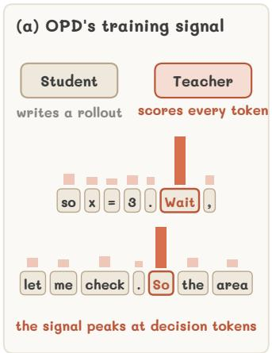

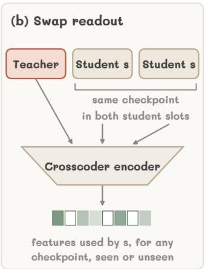

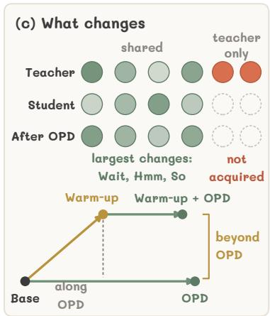  
Figure 1: Overview. (a) In OPD, the student writes a rollout and the teacher scores every token; the signal is strongest at decision tokens. (b) The swap readout places a student checkpoint in both student slots of the crosscoder, with the teacher’s activation fixed, and reads the features the checkpoint uses. (c) OPD reweights the features the student shares with the teacher, most at decision tokens, and acquires none of the teacher’s own; the warm-up moves the student partly along OPD’s direction and partly beyond it.

Existing analyses of OPD, including those above, study it through the student’s outputs, namely its token probabilities, accuracy, and training signal (Li et al., 2026; Ding & Zhang, 2026; Ge et al., 2026), and do not reveal what changes inside the student. We examine the question from the student’s internal representations, through the lens of sparse crosscoders (Lindsey et al., 2024), which learn one dictionary of features for several models at once, so that the student before OPD, the student after OPD, and the teacher can be compared feature by feature (Minder et al., 2026; Sh et al., 2026). Standard crosscoder analyses compare models through their decoders and identify the features specific to one model. They cannot, however, reliably show which features each mode activates on a given input, since the crosscoder encodes all models jointly into a single set of feature activations; Minder et al. (2026) likewise note that crosscoders provide no mechanism to track how a model’s feature activations change. We therefore propose the swap readout (Figure 1b). It places the activation of a student checkpoint in both student inputs of the crosscoder while holding the teacher’s input fixed, and thereby reads the feature activations of that checkpoint on its own, even for checkpoints the crosscoder has never seen.

We apply this readout to three OPD settings whose teachers differ from the student by RL, by scale, or by both. In all three, OPD neither creates features of the student’s own nor passes on the teacher’s (Figure 1c). It only changes how often the student uses the features it already shares with the teacher, and only slightly: over 98% of the frequently used features change their firing rate by less than 20%. Where OPD changes the student most, the features that change most fire on words such as Wait, Hmm, and So, at which a reasoning trace decides its next move and at which the teacher disagrees with the student most (Figure 1a). These findings give a representation-level account of behavioral findings on OPD: if OPD can only reweight the features the student already shares with the teacher, it should improve sampling efficiency without expanding the capability boundary (Ge et al., 2026), and it works only when the student and the teacher share compatible thinking patterns (Li et al., 2026).

If OPD only changes how the student uses what it already has, then what the student starts from should matter. This brings us to a step that commonly precedes OPD: an SFT warm-up on the teacher’s rollouts, which makes OPD more effective (Yang et al., 2025; Lu & Lab, 2025; Li et al., 2026; Liu et al., 2026a). A natural explanation for this benefit is that the warm-up supplies what OPD cannot, namely new features that bring the student closer to the teacher; indeed, SFT has been found to introduce new features (Shi et al., 2026). Following the setup of Simple-OPD (Liu et al., 2026a), we reproduce this benefit but find the opposite: the warm-up creates no features and does not make the teacher’s features shared. Instead, it also reweights the shared features, partly along OPD’s direction, making part of OPD’s change in advance, and partly in directions that OPD does not take and that persist through OPD. This reweighting offers a feature-level view of the teacher-compatible thinking pattern to which Simple-OPD attributes the warm-up’s benefit. Imposing this reweighting on the features of a directly distilled student, without changing its weights, recovers most of the warm-up’s benefit, and removing it from the warmed-up student removes most of it, whereas the same change on shuffled features does neither. Together, these findings suggest that OPD behaves more like a reweighting of existing features than an acquisition of new ones. Our contributions and findings are summarized as follows:

• We propose the swap readout, which measures how training changes a student’s use of each crosscoder feature, even for checkpoints the crosscoder has never seen; the change it identifies can be imposed on a student’s features and alters the student’s accuracy. Unlike existing crosscoder analyses, which identify features specific to one model (Lindsey et al., 2024; Minder et al., 2026; Shi et al., 2026), it tracks how a model’s use of shared features changes.

• We show that OPD distills no new features into the student; it only reweights the features the student already shares with the teacher. Whereas prior analyses of OPD examine the student’s outputs (Li et al., 2026; Ding & Zhang, 2026; Ge et al., 2026), this finding concerns the student’s internal representations.

• We show that an SFT warm-up on the teacher’s rollouts adds no features either, unlike SFT on solutions written by a separate, stronger model (Shi et al., 2026); it reweights the shared features partly along OPD’s direction and partly beyond it, and imposing this reweighting on the features of a directly distilled student, without changing its weights, brings its accuracy close to that of the warmed-up student.

## 2 MEASURING FEATURE USAGE WITH SPARSE CROSSCODERS

## 2.1 SPARSE CROSSCODERS AND MODEL ATTRIBUTION

Crosscoders. Sparse crosscoders (Lindsey et al., 2024) extend sparse autoencoders to model diffing: they learn one dictionary of features for several models at once, so that the models can be compared feature by feature. Given the activations $\mathbf { h } _ { m }$ of models $m = 1 , \ldots , M$ on the same token, a crosscoder encodes them jointly into a single sparse code z and reconstructs each model’s activation from this code with that model’s own decoder,

$$
\mathbf { z } = \sigma \Big ( \sum _ { m } \mathbf { W } _ { m } \mathbf { h } _ { m } + \mathbf { b } \Big ) , \qquad \hat { \mathbf { h } } _ { m } = \mathbf { D } _ { m } \mathbf { z } ,\tag{1}
$$

so that each feature has a single activation on a token but a separate decoder direction in every model, the corresponding column of $\mathbf { D } _ { m }$ . The crosscoder is trained to minimize the reconstruction error $\begin{array} { r } { \sum _ { m } \| \mathbf { h } _ { m } - \hat { \mathbf { h } } _ { m } \| _ { 2 } ^ { 2 } } \end{array}$ , so the decoder direction of a feature in a model describes how the feature contributes to that model’s activation. We use BatchTopK crosscoders (Bussmann et al., 2024), which enforce sparsity through σ rather than an $\ell _ { 1 }$ penalty, whose artifacts can make shared features appear model-specific (Minder et al., 2026). During training, σ keeps, on average over a batch, the k features per token with the largest activations weighted by their decoder norms; at inference, a threshold estimated during training replaces this batch-level selection. We write enc for the encoder with this threshold and say that a feature fires on a token when its entry of z is positive.

Model attribution. Following Shi et al. (2026), we measure how much a feature belongs to each model by its share of the decoder norm. The model attribution score (MAS) of feature j for model m is

$$
\mathrm { M A S } ( m , j ) = \frac { \lVert \mathbf { d } _ { m j } \rVert _ { 1 } / \sqrt { n _ { m } } } { \sum _ { m ^ { \prime } } \lVert \mathbf { d } _ { m ^ { \prime } j } \rVert _ { 1 } / \sqrt { n _ { m ^ { \prime } } } } ,\tag{2}
$$

where $\mathbf { d } _ { m j }$ is the decoder direction of feature $j$ in model m, the j-th column of $\mathbf { D } _ { m }$ , and dividing by the square root of the hidden size $n _ { m }$ corrects for models of different width. A feature used equally by M models has an MAS of $1 / M$ for each, and we say that model m dominates a feature when its MAS exceeds 0.5. For two models and without the width correction, the MAS of the second model is the normalized relative norm (NRN) of Shi et al. (2026): it is near 1 for a feature specific to the second model, near 0 for one specific to the first, and $1 / 2$ for a shared one.

## 2.2 THE SWAP READOUT: TRACKING FEATURE USAGE ACROSS CHECKPOINTS

Why existing readouts fall short. We ask which features the student uses on each input and how training changes this use. Each crosscoder is trained jointly on the student before OPD (B), the student after OPD (O), and the teacher (T). Its joint encoding gives one code for all three models and cannot tell which of them makes a feature fire. Decoder attribution such as MAS barely differs between the two students, whose feature directions nearly coincide, whereas training changes when the student uses a feature. Reading a student through its own slot, with the other student slot empty, is also unreliable. The two students’ activations differ by only 7–12% of their norm (Table 4), so training determines the sum $\mathbf { S } = \mathbf { W } _ { B } + \mathbf { W } _ { O }$ of their encoders but leaves their difference near its random initialization; in the own-slot readout, this undetermined part is as large as the determined one (Appendix B). We therefore propose the swap readout.

Swap readout. To read a checkpoint s of the student on input x, we place its activation in both student slots and keep the teacher’s activation in the teacher slot:

$$
{ \bf z } _ { s } ( x ) = \mathrm { e n c } \big ( \bar { \bf h } _ { s } ( x ) , \bar { \bf h } _ { s } ( x ) , { \bf h } _ { T } ( x ) \big ) ,\tag{3}
$$

where $\bar { \mathbf { h } } _ { s }$ is the student’s activation rescaled to the mean norm of the student before training, since the inference threshold makes firing sensitive to the scale of the residual stream.

Why the swap readout reads the student. With the same activation in both student slots, the undetermined difference of the two encoders cancels. For checkpoint s, the pre-activation, the argument of σ in $\operatorname { E q . }$ equation 1, and its change when s is replaced by another checkpoint $s ^ { \prime }$ on the same input are

$$
\mathbf { a } _ { s } ( x ) = \mathbf { S } \bar { \mathbf { h } } _ { s } ( x ) + \mathbf { c } ( x ) , \qquad \mathbf { a } _ { s ^ { \prime } } ( x ) - \mathbf { a } _ { s } ( x ) = \mathbf { S } \big ( \bar { \mathbf { h } } _ { s ^ { \prime } } ( x ) - \bar { \mathbf { h } } _ { s } ( x ) \big ) ,\tag{4}
$$

with $\mathbf { c } ( x ) = \mathbf { W } _ { T } \mathbf { h } _ { T } ( x ) + \mathbf { b }$ . The crosscoder thus acts as a sparse autoencoder of the student, with the learned encoder S, the student’s decoder, and a bias $\mathbf { c } ( x )$ that the teacher sets for each token. The features that fire are those from which the student’s decoder reconstructs the checkpoint’s activation, which is what it means for the checkpoint to use them. Since every checkpoint is read with the same autoencoder and the same teacher input, a feature starts or stops firing only because the student’s own activation moves along the feature’s encoder direction, a row of S, while the teacher’s term cancels. Appendix B shows that no other weighting of the two student slots removes the undetermined part while agreeing with the joint encoding when the two students coincide.

Reading the student before and after training on the same input gives, for every feature, one of four outcomes (Figure 2): the feature fires in neither checkpoint, fires in both with a different strength, starts to fire, or stops firing. Counting these outcomes over many inputs shows how often the student uses each feature and how training changes this use.

Why the swap readout is reliable. (i) Matched to training. Its input, in which the two student slots agree, is close to the inputs on which the crosscoder is trained, so the encoder and the inference threshold are used under the conditions in which they were learned. (ii) Faithful. It reconstructs the student’s activations as well as the joint encoding does, and it reconstructs checkpoints that the crosscoder never saw, such as the student after the SFT warm-up of Section 4, as well as those it was trained on (Appendix C.4). It thus reads the activation it is given, not the model a slot was trained on.

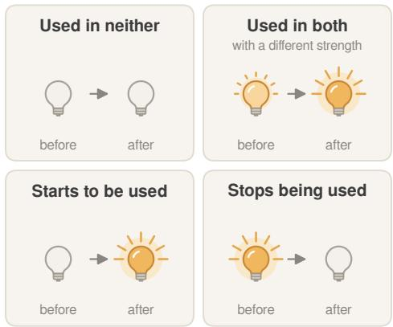

Feature statistics. We compute feature statistics with this readout on the same 3M held-out tokens for every model. A feature’sfiring rate is the share of tokens on which it fires, and the change in its use is the log ratio of its firing rates after and before training. A feature is gained or lost when it fires at least 10 times in one checkpoint and never in the other. For each token, the

Figure 2: What the swap readout records for a feature on one input. A lit bulb marks a feature that fires, and a brighter bulb marks a stronger activation.

Table 1: Detailed information of three OPD settings.
<table><tr><td>Setting</td><td>Base student model</td><td>Teacher model</td><td>Dimension (student / teacher)</td></tr><tr><td>JustRL</td><td>R1-Distill-Qwen-1.5B</td><td> $\mathbf { J u s t R L - D e e p S e e k - 1 . 5 B }$ </td><td>1536 / 1536</td></tr><tr><td>Skywork</td><td> $\mathrm { R 1 { - } D i s t i l l { - } Q w e n { - } 1 . 5 B }$ </td><td> $\mathbf { S k y w o r k - O R l - M a t h - 7 B }$ </td><td>1536 / 3584</td></tr><tr><td>R1-7B</td><td> $\mathrm { R 1 { - } D i s t i l l { - } Q w e n { - } 1 . 5 B }$ </td><td> $\mathrm { R 1 - D i s t i l l - Q w e n { - } 7 B }$ </td><td>1536 / 3584</td></tr></table>

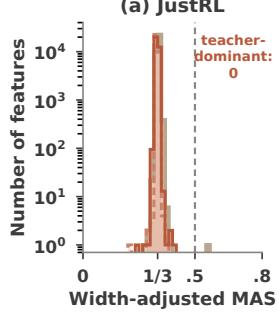

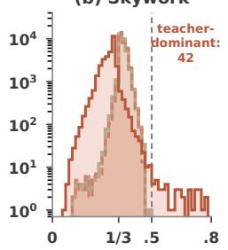

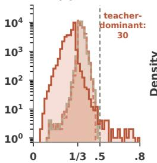

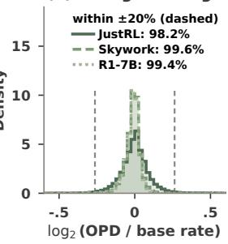  
Figure 3: OPD reweights the student’s features and acquires none of the teacher’s. (a–c) Widthadjusted MAS of all features; dashed: MAS of 0.5, above which one model dominates a feature. (d) Change in feature firing rates after OPD; dashed: ±20%.

change is the share of features active before or after training that are not active in both. For a teacher of the student’s width, we read its firing rates by placing its activation in all three slots.

## 3 WHAT CHANGES INSIDE THE STUDENT DURING OPD?

In this section, we ask what OPD distills into the student. We study the three OPD settings in Table 1, in which a DeepSeek-R1-Distill-Qwen-1.5B student (Guo et al., 2025) is distilled from one of three teachers, and we name each setting after its teacher: JustRL for JustRL-DeepSeek-1.5B (He et al., 2025a), Skywork for Skywork-OR1-Math-7B (He et al., 2025b), and R1-7B for DeepSeek-R1-Distill-Qwen-7B (Guo et al., 2025). All students are trained on DAPO-Math-17k (Yu et al., 2026a) with the vanilla OPD recipe of Li et al. (2026) under the same hyperparameters, and all models are evaluated on AIME 2024, AIME 2025, and AMC 2023. For each setting, we train one crosscoder jointly on the base student, the OPD student, and the teacher, using their residual-stream activations at a middle layer on a mixture of reasoning and general text, and compare the students through it with the swap readout of Section 2.2. Appendix C gives the full training, evaluation, and crosscoder details. We first ask whether OPD gives the student new features (Section 3.1) and then which of the student’s features it reweights (Section 3.2).

## 3.1 OPD REWEIGHTS SHARED FEATURES RATHER THAN ACQUIRING NEW ONES

Each crosscoder is trained on the OPD student alongside the base student and the teacher, yet in none of the three settings does the OPD student dominate a single feature, and its MAS distribution coincides with that of the base student (Figure 3a–c). The student also uses the same features to the same extent before and after OPD. In the swap readout on 3M held-out tokens, no feature that fires at least 10 times before OPD is absent after it, or vice versa, and 98.2%, 99.6%, and 99.4% of the frequently used features change their firing rate by less than 20% (Figure 3d).

We next turn to the teacher’s own features. The JustRL teacher, an RL fine-tune of the base student, dominates no feature. The Skywork and R1-7B teachers dominate 42 and 30 features (Figure 3b,c; Appendix E). If OPD passed these features on to the student, the OPD student would take a larger share of their decoder norm, and they would become shared. It does not: on these features, the student’s MAS is 0.19 both before and after OPD in both settings, and no feature’s MAS changes by more than 0.015. The teacher’s own features stay with the teacher.

R1-7B (7B teacher)

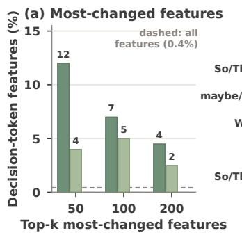

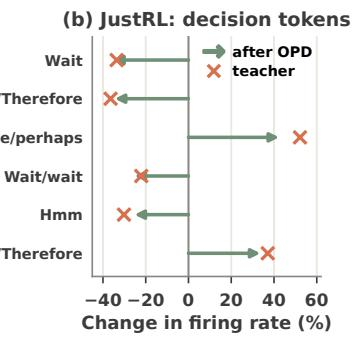

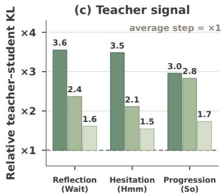  
Figure 4: The features OPD changes most fire on decision tokens. (a) Share of decision-token features among the k most-changed features; dashed: among all features. (b) Under JustRL, change in firing rate of the decision-token features among the most-changed ones, after OPD (arrows) and in the teacher (crosses). (c) Teacher–student KL at the steps that emit each category of decision token on the student’s rollouts, relative to the average step.

Since OPD neither creates features nor acquires the teacher’s, what it changes is how the student uses the shared features it already has: which of them fire on a given token, and how strongly. This reweighting is small: about one in ten of the features active on a token changes, while each feature’s overall usage stays the same (Figure 3d). We characterize this reweighting in Section 3.2 and examine what an SFT warm-up before OPD changes in Section 4.

Takeaway. OPD distills no new features into the student and passes on none of the teacher’s own; it only reweights the features the student already shares with the teacher.

## 3.2 DECISION TOKENS MARK THE LARGEST FEATURE CHANGES

Section 3.1 showed that OPD changes each feature’s usage only slightly: 98.2%, 99.6%, and 99.4% of the frequently used features change their firing rate by less than 20% under JustRL, Skywork, and R1-7B. We now ask which features make up the small remainder, reading each feature’s meaning off the tokens on which it fires most strongly (Appendix E). Under JustRL, the features whose firing rate changes most are dominated by features for the discourse words that steer a reasoning trace: a feature that fires on Wait fires 35% less often after OPD, one that fires on So and Therefore 35% less, and one that fires on maybe and perhaps 42% more. Such features make up 0.4% of all features but 12% of the 50 whose firing rate changes most (Figure 4a). These words mark the points at which a trace chooses its next move, so we call them decision tokens and group them by that move into three categories. Reflection tokens revisit an earlier step (Wait, actually); hesitation tokens express doubt or turn to another approach (Hmm, maybe, Alternatively); and progression tokens move on to the next step or draw a conclusion (So, Therefore, Let; Appendix D.2 gives the full lists).

The concentration is strongest where OPD changes the student most. Decision-token features make up 12% of the 50 most-changed ones under JustRL and 4% under Skywork, against a 0.4% baseline; under R1-7B, none of the 50 most-changed features fires on a decision token (Figure 4a). OPD also moves these features to the teacher’s usage. Under JustRL, the Wait feature fires 35% less often after OPD and 34% less often in the teacher, the So/Therefore feature 35% and 36% less, and the maybe/perhaps feature 42% and 52% more (Figure 4b).

Because these features fire at decision tokens, the reweighting is local along the trace as well. At decision tokens, the student under JustRL and Skywork replaces 10–44% more of its active features than at an average token, and OPD’s change to the student’s next-token distribution concentrates at the steps that emit them, which are 4–7 times over-represented among the 5% most-changed steps. These are also the steps at which the teacher disagrees with the student most: the KL divergence from the teacher’s next-token distribution to the student’s is 3.0–3.6, 2.1–2.8, and 1.5–1.7 times its average there under JustRL, Skywork, and R1-7B (Figure 4c). OPD thus receives its strongest signal where the trace decides how to proceed and reweights the features that mark that decision. Under R1-7B, OPD barely moves the student at all: its next-token distribution departs from the base student’s by a KL of only 0.008 on average, a tenth of the 0.085 under JustRL, so its features remain essentially unchanged.

Table 2: The SFT warm-up makes OPD work better. avg@8 (%), the accuracy averaged over 8 samples per problem, of the student distilled from Qwen3-4B-Base-GRPO with and without the warm-up. Recovered: share of the teacher’s advantage over the base student that the student recov ers.
<table><tr><td></td><td>AIME24</td><td>AIME25</td><td>AMC23</td><td>Avg.</td><td>Recovered</td></tr><tr><td>Base student</td><td>4.6</td><td>2.1</td><td>22.5</td><td>9.7</td><td></td></tr><tr><td>OPD</td><td>7.9</td><td>4.6</td><td>40.3</td><td>17.6</td><td>30%</td></tr><tr><td>Warm-up + OPD</td><td>12.1</td><td>9.6</td><td>44.4</td><td>22.0</td><td>46%</td></tr><tr><td>Teacher</td><td>22.9</td><td>20.0</td><td>65.9</td><td>36.3</td><td></td></tr></table>

SFT on the teacher's rollouts adds no features  
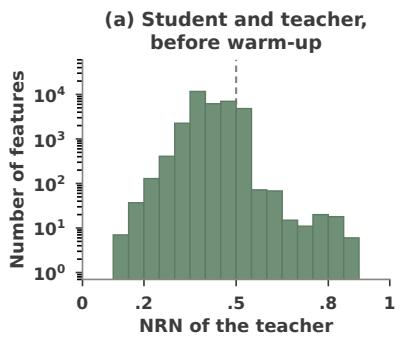

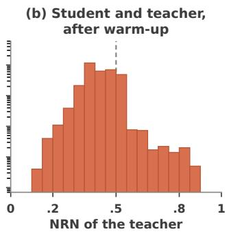

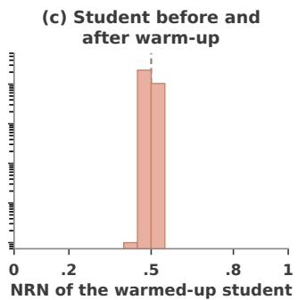  
Figure 5: SFT on teacher rollouts induces no model-specific features. NRN (Shi et al., 2026) in two-model crosscoders: a model’s share of a feature’s decoder norm, near 1 if the feature is specific to that model and 1/2 (vertical line) if shared. (a,b) NRN of the teacher against the student before and after the warm-up. (c) NRN of the student after the warm-up against the student before it.

Takeaway. Where OPD changes the student most, the features it changes most fire on decision tokens such as Wait, Hmm, and So, at which a trace reflects, hesitates, or moves on. These are the tokens at which the teacher disagrees with the student most, and OPD moves the firing rates of these features toward those of the teacher.

## 4 WHY AN SFT WARM-UP HELPS OPD

Section 3 showed that OPD distills no new features into the student: it only reweights the features the student already shares with the teacher, most of all at decision tokens. We now apply the same analysis to a standard step before OPD, an SFT warm-up on the teacher’s rollouts, which is known to make OPD work better (Li et al., 2026; Liu et al., 2026a), and ask what this warm-up changes in the student. Following the setup of Simple-OPD (Liu et al., 2026a), we distill Qwen3-1.7B-Base from Qwen3-4B-Base-GRPO (Li et al., 2026) and warm up the student on the teacher’s own rollouts before OPD (Appendix C).

The warm-up improves OPD. With warm-up, OPD recovers more of the teacher’s advantage over the base student and improves on every benchmark (Table 2), confirming prior findings. We next test whether the warm-up adds features, as SFT can (Shi et al., 2026) (Section 4.1), and, finding none, examine what changes instead (Section 4.2).

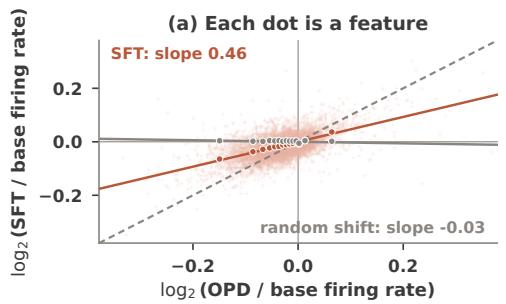

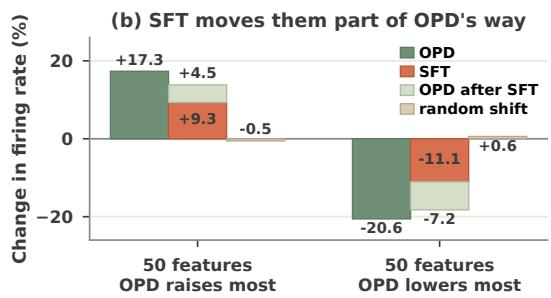  
Figure 6: The SFT warm-up pre-reweights shared features in the direction of OPD. (a) Change in each feature’s firing rate after the warm-up against that after OPD; circles: binned means; dashed: $y = x ,$ , where the warm-up would make all of OPD’s change; solid: fitted slopes for the warm-up and for a random shift. (b) Mean change of the features OPD raises and lowers most; stacked: the extra change OPD adds after the warm-up.

## 4.1 THE WARM-UP GIVES THE STUDENT NO NEW FEATURES EITHER

The warm-up creates no features of its own. In a two-model crosscoder of the student before and after the warm-up, the test in which SFT produces many features specific to the fine-tuned model (Shi et al., 2026), the warm-up produces none: every feature keeps an NRN close to 1/2 (Figure 5c). Read with the swap readout through the crosscoder trained before the warm-up, the student after the warm-up also gains no feature, and the frozen crosscoder reconstructs it as well as the base student.

It also does not acquire the teacher’s feature. If the warm-up gave the student features of the teacher, these features would become shared in the crosscoder of the student and the teacher: their NRN, the teacher’s share of the decoder norm, would move from near 1 toward $1 / 2 ,$ , and the tail of teacher-specific features would thin. It does not. The teacher’s NRN is distributed the same way before and after the warm-up (Figure 5a,b), with the same mean (0.42) and nearly the same number of teacher-specific features above 0.8 (24 and 25). Likewise, in the three-model crosscoder, the features the teacher dominates stay few (19 before the warm-up and 17 after it) and carry the same small share of the student’s activation.

This differs from Shi et al. (2026), whose SFT, like a conventional cold start before RL, trains on solutions written by a separate, stronger model. The warm-up instead stays within the task that OPD then trains on, math reasoning on the same questions, and imitates the rollouts of the very teacher that OPD distills from. Our conclusions concern this warm-up rather than SFT in general.

Takeaway. Training on the teacher’s own rollouts does not give the student the teacher’s features: like OPD, the warm-up adds no features and only reweights those the student already shares with the teacher.

## 4.2 THE WARM-UP ANTICIPATES AND COMPLEMENTS OPD’S REWEIGHTING

If the warm-up can only reweight shared features, the question becomes how its reweighting relates to OPD’s. For each feature that fires at least 1,000 times, we compare the change in its firing rate from the base student to the student after the warm-up with the change to the student after OPD, both read with the swap readout (Section 2.2) through the crosscoder trained before the warm-up (Figure 6). We collect these log changes in firing rate over features into two vectors, o for OPD and s for the warm-up, and fit s ≈ β o by least squares through the origin. The slope $\beta$ measures how far the warm-up moves the features along OPD’s reweighting. The residual $\mathbf { s } - \boldsymbol { \beta } \mathbf { o }$ , which is orthogonal to o, is the part of the warm-up’s change that lies outside OPD’s direction.

The warm-up moves the features OPD moves. The two changes point the same way: along OPD’s direction, the warm-up moves the features about half as far as OPD $( \beta = 0 . 4 6$ , Figure 6a), and 88% and 92% of the 50 features OPD raises and lowers most move the same way after the warm-up. For the 50 features OPD raises most, the warm-up already raises the firing rate by 9.3% against 17.3% for OPD, and OPD after the warm-up adds another 4.5 points (Figure 6b); for the 50 features OPD lowers most, the warm-up lowers it by 11.1% against 20.6%, and OPD adds another 7.2 points. To check that this alignment reflects the direction of the warm-up’s change, not just any change to the student’s activations, we rotate the warm-up’s change to a random direction; this random shift produces no alignment $( \beta = - 0 . 0 3 ;$ Appendix D.3).

Table 3: The reweighting found by the swap readout carries the warm-up’s benefit. avg@8 (%) of students with the warm-up’s feature change added at the crosscoder’s layer or removed from it, with the difference $\Delta$ from the unmodified student and its bootstrap interval, and their reweighting read with the swap readout. All rows are sampled in the same way, which differs from Table 2 (Appendix D.4).
<table><tr><td colspan="6">avg@8 (%)</td><td colspan="2">Swap readout</td></tr><tr><td>Student</td><td>AIME24</td><td>AIME25</td><td>AMC23</td><td>Avg.</td><td>∆</td><td>β</td><td>ρ</td></tr><tr><td>OPD</td><td>10.4</td><td>7.5</td><td>37.8</td><td>18.6</td><td></td><td>1.00</td><td></td></tr><tr><td>+ feature change</td><td>11.2</td><td>7.1</td><td>45.6</td><td>21.3</td><td>+2.7 [+0.5, +6.0]</td><td>1.32</td><td>+0.93</td></tr><tr><td>+ shuffled change</td><td>7.5</td><td>4.6</td><td>35.6</td><td>15.9</td><td>−2.7[−5.4, +0.3]</td><td>0.95</td><td>-0.04</td></tr><tr><td>Warm-up + OPD</td><td>12.5</td><td>9.2</td><td>44.1</td><td>21.9</td><td></td><td>0.84</td><td>+0.69</td></tr><tr><td>— feature change</td><td>10.0</td><td>7.1</td><td>40.6</td><td>19.2</td><td> $- 2 . 7 \left[ - 5 . 3 , - 0 . 4 \right]$ </td><td>0.20</td><td>-0.48</td></tr><tr><td>— shuffled change</td><td>14.2</td><td>9.2</td><td>46.9</td><td>23.4</td><td> $+ 1 . 5 \left[ - 0 . 8 , + 4 . 1 \right]$ </td><td>0.85</td><td>+0.66</td></tr></table>

It also makes reweighting that OPD does not. More than half of the warm-up’s change lies outside OPD’s direction: the residual carries 56% of $\| \mathbf { s } \| ^ { 2 }$ . This share excludes a single feature that fires on a garbled character in web text and that the warm-up nearly silences; with it, the share rises to 77% (Appendix D.3). This part survives the subsequent OPD: computing the residual in the same way for the student after the warm-up and OPD gives one that matches the residual after the warm-up alone (Spearman 0.69 across features, against 0.00 for the random shift). It is spread over many features, and half of it falls on features that fire mainly on reasoning text. The features it moves most concern the conversation format (the system prompt, the instruction on the answer format, and the turn boundaries), the style of reasoning (features for Wait, Alternatively, and But fire less, and one for laying out a plan step by step fires more), and mathematical notation (Appendix E). The student after the warm-up and OPD thus combines most of OPD’s reweighting with the warm-up’s own reweighting, and it recovers 46% of the teacher’s advantage instead of 30%.

The reweighting found by the swap readout carries the warm-up’s benefit. To test whether this reweighting causally accounts for the warm-up’s benefit, we intervene on the students’ features directly, leaving their weights unchanged (Table 3). At every token, we decode the difference between the swap codes of the student after and before the warm-up through the crosscoder’s student decoder, and add this change to the residual stream of the directly distilled student at the crosscoder’s layer, or subtract it from that of the student distilled after the warm-up (Appendix D.4). Adding the change raises the avg@8 of the directly distilled student from 18.6% to 21.3%, close to the 21.9% of the warmed-up student, and removing it lowers the avg@8 of the warmed-up student to 19.2%, close to direct OPD (∆ = +2.7 and −2.7 points; both 95% bootstrap intervals exclude zero). The swap readout confirms that the intervention transfers the reweighting itself: the directly distilled student moves further along OPD’s direction and takes on the warm-up’s reweighting beyond it, whereas the warmed-up student loses both. A control that shuffles the feature identities of the change leaves the reweighting nearly intact and neither helps the directly distilled student nor hurts the warmed-up one. The benefit therefore depends on which shared features are reweighted, which is exactly what the swap readout identifies.

This answers the question we began with. Both the warm-up and OPD reweight features the student already shares with the teacher. The warm-up helps OPD not by giving the student features that OPD cannot, but through this reweighting, which does part of OPD’s reweighting in advance and adds reweighting that OPD would not make on its own.

Takeaway. An SFT warm-up helps OPD not by giving the student new features, but by reweighting the shared ones, partly as OPD would and partly in ways OPD would not.

## 5 CONCLUSION

This work studies what on-policy distillation (OPD) distills into the student through the lens of sparse crosscoders. To this end, we propose the swap readout, which measures how training changes a student’s use of each crosscoder feature, even for checkpoints the crosscoder has never seen. Across three OPD settings, we find that OPD creates no features of the student’s own and passes on none of the teacher’s; instead, it slightly reweights the features the student already shares with the teacher, and where it changes the student most, this reweighting concentrates on the tokens at which the trace decides its next move. The SFT warm-up on the teacher’s rollouts that commonly precedes OPD adds no features either. It reweights the shared features partly along OPD’s direction and partly beyond it, and imposing this reweighting on the features of a directly distilled student, without changing its weights, brings its accuracy close to that of the warmed-up student. These findings suggest that OPD behaves more like a reweighting of existing features than an acquisition of new ones: what the student learns from the teacher is how to use the features they already share.

## AI USE STATEMENT

We used generative AI tools, including an LLM-based coding assistant, in several parts of this work. For the manuscript, they drafted and revised text, which we then edited. For the experiments, they wrote, debugged, and ran analysis and plotting code, including the code for the swap-readout analyses, the feature-level intervention, and the figures, and they suggested some analyses and controls, which we evaluated before adopting. The research questions, the selection of experiments, and the conclusions are our own. We reviewed all AI-assisted text, checked the code and its outputs against the reported results, and take full responsibility for the content of this paper, including any errors.

## REFERENCES

Rishabh Agarwal, Nino Vieillard, Yongchao Zhou, Piotr Stanczyk, Sabela Ramos Garea, Matthieu Geist, and Olivier Bachem. On-policy distillation of language models: Learning from selfgenerated mistakes. In International Conference on Learning Representations, volume 2024, pp. 21246–21263, 2024.

David D. Baek and Max Tegmark. Towards understanding distilled reasoning models: A representational approach. In ICLR 2025 Workshop on Building Trust in Language Models and Applications, 2025. URL https://openreview.net/forum?id=UYZCcnwgc4.

Samy Bengio, Oriol Vinyals, Navdeep Jaitly, and Noam Shazeer. Scheduled sampling for sequence prediction with recurrent neural networks. Advances in neural information processing systems, 28, 2015.

Trenton Bricken, Adly Templeton, Joshua Batson, Brian Chen, Adam Jermyn, Tom Conerly, Nick Turner, Cem Anil, Carson Denison, Amanda Askell, Robert Lasenby, Yifan Wu, Shauna Kravec, Nicholas Schiefer, Tim Maxwell, Nicholas Joseph, Zac Hatfield-Dodds, Alex Tamkin, Karina Nguyen, Brayden McLean, Josiah E. Burke, Tristan Hume, Shan Carter, Tom Henighan, and Christopher Olah. Towards monosemanticity: Decomposing language models with dictionary learning. Transformer Circuits Thread, 2023. URL https://transformer-circuits. pub/2023/monosemantic-features/index.html.

Bart Bussmann, Patrick Leask, and Neel Nanda. Batchtopk sparse autoencoders. arXiv preprint arXiv:2412.06410, 2024.

Hoagy Cunningham, Aidan Ewart, Logan Riggs, Robert Huben, and Lee Sharkey. Sparse autoencoders find highly interpretable features in language models, 2023. URL https://arxiv. org/abs/2309.08600.

Yi Ding and Ruqi Zhang. Does on-policy distillation really distill? from noisy teacher to self improvement. arXiv preprint arXiv:2608.31046, 2026.

Xinmu Ge, Zizhuo Zhang, Yu Huang, Jianing Zhu, Lin Yuan, Wanli Gu, Weichang Wu, Weiran Huang, Xiaolu Zhang, Bo Han, et al. Towards understanding on-policy distillation through the lens of test-time scaling. arXiv preprint arXiv:2608.11829, 2026.

Yuxian Gu, Li Dong, Furu Wei, and Minlie Huang. Minillm: Knowledge distillation of large language models. In The twelfth international conference on learning representations, 2024.

Etash Guha, Ryan Marten, Sedrick Keh, Negin Raoof, Georgios Smyrnis, Hritik Bansal, Marianna Nezhurina, Jean Mercat, Trung Vu, Zayne Sprague, Ashima Suvarna, Benjamin Feuer, Liangyu Chen, Zaid Khan, Eric Frankel, Sachin Grover, Caroline Choi, Niklas Muennighoff, Shiye Su, Wanjia Zhao, John Yang, Shreyas Pimpalgaonkar, Kartik Sharma, Charlie Cheng-Jie Ji, Yichuan Deng, Sarah Pratt, Vivek Ramanujan, Jon Saad-Falcon, Jeffrey Li, Achal Dave, Alon Albalak, Kushal Arora, Blake Wulfe, Chinmay Hegde, Greg Durrett, Sewoong Oh, Mohit Bansal, Saadia Gabriel, Aditya Grover, Kai-Wei Chang, Vaishaal Shankar, Aaron Gokaslan, Mike A. Merrill, Tatsunori Hashimoto, Yejin Choi, Jenia Jitsev, Reinhard Heckel, Maheswaran Sathiamoorthy, Alexandros G. Dimakis, and Ludwig Schmidt. Openthoughts: Data recipes for reasoning models, 2025. URL https://arxiv.org/abs/2506.04178.

Daya Guo, Dejian Yang, Haowei Zhang, Junxiao Song, Peiyi Wang, Qihao Zhu, Runxin Xu, Ruoyu Zhang, Shirong Ma, Xiao Bi, et al. Deepseek-r1: Incentivizing reasoning capability in llms via reinforcement learning. arXiv preprint arXiv:2501.12948, 2025.

Bingxiang He, Zekai Qu, Zeyuan Liu, Yinghao Chen, Yuxin Zuo, Cheng Qian, Kaiyan Zhang, Weize Chen, Chaojun Xiao, Ganqu Cui, et al. Justrl: Scaling a 1.5 b llm with a simple rl recipe. arXiv preprint arXiv:2512.16649, 2025a.

Jujie He, Jiacai Liu, Chris Yuhao Liu, Rui Yan, Chaojie Wang, Peng Cheng, Xiaoyu Zhang, Fuxiang Zhang, Jiacheng Xu, Wei Shen, Siyuan Li, Liang Zeng, Tianwen Wei, Cheng Cheng, Bo An, Yang Liu, and Yahui Zhou. Skywork open reasoner 1 technical report. arXiv preprint arXiv:2505.22312, 2025b.

Edward J Hu, Yelong Shen, Phillip Wallis, Zeyuan Allen-Zhu, Yuanzhi Li, Shean Wang, Lu Wang, and Weizhu Chen. Lora: Low-rank adaptation of large language models. arXiv preprint arXiv:2106.09685, 2021.

Thomas Jiralerspong and Trenton Bricken. Cross-architecture model diffing with crosscoders: Unsupervised discovery of differences between LLMs, 2026. URL https://arxiv.org/abs/ 2602.11729.

Simran Kaur, Narutatsu Ri, Yinghui He, Liam H Fowl, and Sanjeev Arora. Rethinking on-policy self-distillation for thinking models. In Workshop on Failure Modes ofAgentic AI at ICML 2026, 2026.

Yaxuan Li, Yuxin Zuo, Bingxiang He, Jinqian Zhang, Chaojun Xiao, Cheng Qian, Tianyu Yu, Huanang Gao, Wenkai Yang, Zhiyuan Liu, et al. Rethinking on-policy distillation of large language models: Phenomenology, mechanism, and recipe. arXiv preprint arXiv:2604.13016, 2026.

Jack Lindsey, Adly Templeton, Jonathan Marcus, Thomas Conerly, Joshua Batson, and Christopher Olah. Sparse crosscoders for cross-layer features and model diffing. Transformer Circuits Thread, 2024. URL https://transformer-circuits.pub/2024/crosscoders/index. html.

Tao Liu, Taiqiang Wu, Mao Zheng, Xuan Luo, Runming Yang, Xuewei Yang, Junjie Wang, and Yujiu Yang. Simple-opd: Demystifying warm-up for on-policy distillation. arXiv preprint arXiv:2608.06802, 2026a.

Yanjiang Liu, Jie Lou, Xinyan Guan, Yuqiu Ji, Hongyu Lin, Ben He, Xianpei Han, Le Sun, Xing Yu, and Yaojie Lu. Your teacher can’t help you here: Combating supervision fidelity decay in on-policy distillation. arXiv preprint arXiv:2605.30833, 2026b.

Kevin Lu and Thinking Machines Lab. On-policy distillation. Thinking Machines Lab: Connectionism, 2025. doi: 10.64434/tml.20251026. https://thinkingmachines.ai/blog/on-policy-distillation.

Feng Luo, Yu-Neng Chuang, Guanchu Wang, Zicheng Xu, Xiaotian Han, Tianyi Zhang, and Vladimir Braverman. Demystifying opd: Length inflation and stabilization strategies for large language models. arXiv preprint arXiv:2604.08527, 2026.

Julian Minder, Clement Dumas, Caden Juang, Bilal Chughtai, and Neel Nanda. Overcoming spar-´ sity artifacts in crosscoders to interpret chat-tuning. Advances in Neural Information Processing Systems, 38:106423–106474, 2026.

Stephane Ross, Geoffrey Gordon, and Drew Bagnell. A reduction of imitation learning and struc-´ tured prediction to no-regret online learning. In Proceedings of the fourteenth international conference on artificial intelligence and statistics, pp. 627–635. JMLR Workshop and Conference Proceedings, 2011.

Guangming Sheng, Chi Zhang, Zilingfeng Ye, Xibin Wu, Wang Zhang, Ru Zhang, Yanghua Peng, Haibin Lin, and Chuan Wu. Hybridflow: A flexible and efficient rlhf framework. arXiv preprint arXiv: 2409.19256, 2024.

Dan Shi, Zhuowen Han, Simon Ostermann, Renren Jin, Josef van Genabith, and Deyi Xiong. Why does reinforcement learning generalize? a feature-level mechanistic study of post-training in large language models. In Proceedings of the 64th Annual Meeting of the Association for Computational Linguistics (Volume 1: Long Papers), pp. 38979–39000, 2026.

Kimi Team, Tongtong Bai, Yifan Bai, Yiping Bao, Jianfeng Cai, Xinyuan Cai, Peizhou Cao, Yuxuan Cao, Ziwei Chai, Y Charles, et al. Kimi k3: Open frontier intelligence. arXiv preprint arXiv:2607.24653, 2026.

Dmitrii Troitskii, Koyena Pal, Chris Wendler, and Callum Stuart McDougall. Internal states before wait modulate reasoning patterns. In Christos Christodoulopoulos, Tanmoy Chakraborty, Carolyn Rose, and Violet Peng (eds.), Findings of the Association for Computational Linguistics: EMNLP 2025, pp. 18640–18649, Suzhou, China, November 2025. Association for Computational Linguistics. ISBN 979-8-89176-335-7. doi: 10.18653/v1/2025.findings-emnlp.1012. URL https://aclanthology.org/2025.findings-emnlp.1012/.

Maurice Weber, Daniel Y Fu, Quentin Anthony, Yonatan Oren, Shane Adams, Anton Alexandrov, Xiaozhong Lyu, Huu Nguyen, Xiaozhe Yao, Virginia Adams, et al. Redpajama: an open dataset for training large language models. Advances in neural information processing systems, 37: 116462–116492, 2024.

Bangjun Xiao, Bingquan Xia, Bo Yang, Bofei Gao, Bowen Shen, Chen Zhang, Chenhong He, Chiheng Lou, Fuli Luo, Gang Wang, et al. Mimo-v2-flash technical report. arXiv preprint arXiv:2601.02780, 2026.

Haoran Xin, Anhao Zhao, Ying Sun, Jin Li, Xiaoyu Shen, and Hui Xiong. Escaping the kl agreement trap in on-policy distillation. arXiv preprint arXiv:2606.09471, 2026.

An Yang, Anfeng Li, Baosong Yang, Beichen Zhang, Binyuan Hui, Bo Zheng, Bowen Yu, Chang Gao, Chengen Huang, Chenxu Lv, et al. Qwen3 technical report. arXiv preprint arXiv:2505.09388, 2025.

Qiying Yu, Zheng Zhang, Ruofei Zhu, Yufeng Yuan, Xiaochen Zuo, Yu Yue, Weinan Dai, Tiantian Fan, Gaohong Liu, Lingjun Liu, et al. Dapo: An open-source llm reinforcement learning system at scale. Advances in Neural Information Processing Systems, 38:113222–113244, 2026a.

Zichao Yu, Chengzhi Yu, Shengze Xu, Yujin Han, Bingqing Jiang, Xu Wang, and Difan Zou. Mismatch matters: On-policy distillation beyond token agreement. arXiv preprint arXiv:2608.09836, 2026b.

Aohan Zeng, Xin Lv, Zhenyu Hou, Zhengxiao Du, Qinkai Zheng, Bin Chen, Da Yin, Chendi Ge, Chenghua Huang, Chengxing Xie, et al. Glm-5: from vibe coding to agentic engineering. arXiv preprint arXiv:2602.15763, 2026.

Siqi Zhu, Xuyan Ye, Hongyu Lu, Weiye Shi, and Ge Liu. The many faces of on-policy distillation: Pitfalls, mechanisms, and fixes. arXiv preprint arXiv:2605.11182, 2026.

## Roadmap.

• Appendix A reviews related work on the mechanisms and failure modes of OPD and on model diffing with sparse crosscoders.

• Appendix B derives why the swap readout isolates the change of the student, which the other readouts of Section 2.2 cannot, and verifies its premises on our crosscoders.

• Appendix C describes how we train the OPD students (C.1) and the SFT warm-up (C.2), how we evaluate them (C.3), and how we train and validate the crosscoders (C.4).

• Appendix D describes how we compute the reported quantities: the feature statistics read with the swap readout (D.1), the decision tokens and policy changes of Section 3.2 (D.2), and the decomposition of the warm-up’s reweighting (D.3) and the feature-level intervention (D.4) of Section 4.2.

• Appendix E visualizes the features behind our findings: the swap readout on held-out passages (E.1), the features the teachers dominate (E.2), the decision-token features that OPD reweights (E.3), and the features the warm-up moves along (E.4) and beyond (E.5) OPD’s direction.

## A RELATED WORK

Mechanistic Understanding and Failure Modes of OPD. On-policy distillation (OPD) trains a student on its own trajectories while using a teacher to provide dense token-level supervision at visited states, thereby reducing the exposure bias associated with fixed demonstrations (Agarwal et al., 2024; Lu & Lab, 2025; Bengio et al., 2015; Ross et al., 2011; Gu et al., 2024; Yu et al., 2026b). Recent studies have moved beyond evaluating OPD’s empirical effectiveness to examining its optimization mechanism, emphasizing teacher–student overlap and the conditions under which OPD succeeds or fails (Li et al., 2026; Zhu et al., 2026). However, a locally small teacher–student discrepancy does not necessarily lead to globally desirable rollouts: OPD can exhibit length inflation and repetition, enter KL-based agreement traps, or receive unreliable supervision on student-induced prefixes (Luo et al., 2026; Xin et al., 2026; Liu et al., 2026b); related issues also arise when privileged teacher context alters the learning signal for long reasoning traces (Kaur et al., 2026). These findings suggest that teacher–student agreement can be locally uninformative. In particular, a repetitive student prefix may condition the teacher to favor the same continuation, producing near-zero local discrepancy despite a degenerate complete response.

Model Diffing with Sparse Crosscoders. Sparse autoencoders decompose neural activations into sparse combinations of learned features (Cunningham et al., 2023; Bricken et al., 2023). Sparse crosscoders extend this approach to compare shared and model-specific features across models (Lindsey et al., 2024). Minder et al. (2026) identify sparsity artifacts that make shared features appear model-specific and develop Latent Scaling and BatchTopK crosscoders to address them. Jiralerspong & Bricken (2026) introduce dedicated features for comparisons across architectures. Applications to reasoning models reveal features associated with self-reflection and verification in distilled models (Baek & Tegmark, 2025), as well as features that modulate wait tokens and subsequent reasoning patterns (Troitskii et al., 2025). Shi et al. (2026) compare SFT and ${ \mathrm { R L } } ,$ finding that SFT introduces specialized features while RL largely preserves base-model representations. We study how OPD and its teacher-trajectory SFT warm-up change the student’s feature usage, using a swap readout to compare checkpoints within a fixed crosscoder.

## B THEORETICAL ANALYSIS OF THE SWAP READOUT

Setup. Let $\mathbf { h } _ { B } ( x ) , \mathbf { h } _ { O } ( x )$ , and $\mathbf { h } _ { T } ( x )$ be the activations of the student before training $( B )$ , the student after training (O), and the teacher (T) on input x after the normalization of the crosscoder (Appendix C.4), let $\mathbf { W } _ { B } , \mathbf { W } _ { O }$ , and $\mathbf { W } _ { T }$ be the encoder matrices and b the encoder bias, and let $\mathbf { d } _ { m j }$ be the decoder direction of feature $j$ in model m. The encoder computes the pre-activation

$$
\mathbf { a } ( x ) = \mathbf { W } _ { B } \mathbf { h } _ { B } ( x ) + \mathbf { W } _ { O } \mathbf { h } _ { O } ( x ) + \mathbf { W } _ { T } \mathbf { h } _ { T } ( x ) + \mathbf { b } ,\tag{5}
$$

and at inference feature $j$ fires when Re $\begin{array} { r } { \mathcal { \mathrm { . U } } ( a _ { j } ( x ) ) \sum _ { m } \| \mathbf { d } _ { m j } \| _ { 2 } > \theta , } \end{array}$ , that is, when $a _ { j } ( x )$ exceeds a feature-specific threshold $\theta _ { j }$ . We reparametrize the two student slots by $\begin{array} { r } { \mathbf { S } = \mathbf { W } _ { B } + \mathbf { W } _ { O } } \end{array}$ and

$\mathbf { N } = \mathbf { \Omega } _ { \circ } ^ { 1 } ( \mathbf { W } _ { B } - \mathbf { W } _ { O } )$ , and write $\mathbf { m } = { \begin{array} { l } { { \frac { 1 } { 2 } } ( \mathbf { h } _ { B } + \mathbf { h } _ { O } ) } \end{array} }$ and $\pmb { \delta } = \mathbf { h } _ { B } - \mathbf { h } _ { O }$ for the mean and the difference of the two students, so that, exactly,

$$
{ \bf W } _ { B } { \bf h } _ { B } + { \bf W } _ { O } { \bf h } _ { O } = { \bf S } { \bf m } + { \bf N } \delta .\tag{6}
$$

With $\mathbf { c } ( x ) = \mathbf { W } _ { T } \mathbf { h } _ { T } ( x ) + \mathbf { b }$ , the swap readout of a checkpoint s places its rescaled activation $\bar { \mathbf { h } } _ { s }$ in both student slots:

$$
\mathbf { a } _ { s } ( x ) = \mathbf { W } _ { B } \bar { \mathbf { h } } _ { s } ( x ) + \mathbf { W } _ { O } \bar { \mathbf { h } } _ { s } ( x ) + \mathbf { c } ( x ) = \mathbf { S } \bar { \mathbf { h } } _ { s } ( x ) + \mathbf { c } ( x ) .\tag{7}
$$

Training leaves N largely undetermined. By Eq. equation $^ { 6 , }$ the pre-activation depends on S through Sm and on N only through Nδ. With $\mathbf { g } = \partial { \boldsymbol { \ell } } / \partial \mathbf { a }$ the gradient of the loss with respect to the pre-activation, the chain rule gives $\nabla _ { \mathbf { S } } \mathbb { E } [ \boldsymbol { \ell } ] = \mathbb { E } [ \mathbf { g } \mathbf { m } ^ { \top } ]$ and $\breve { \nabla } _ { \mathbf { N } } \mathbb { E } [ \boldsymbol { \ell } ] = \mathbb { E } [ \mathbf { g } \boldsymbol { \delta } ^ { \top } ]$ : the gradient on N is the gradient on S with the mean of the two students replaced by their difference, which is an order of magnitude smaller (Table 4). Because ${ \bf W } _ { B }$ and $\mathbf { W } _ { O }$ are initialized independently, N starts as a random matrix with about half the norm of $\mathbf { S } ,$ and training, which barely acts on $\mathbf { i t } ,$ leaves much of this random part in place. Training therefore determines S, but not N beyond its action on the small differences $\delta .$

Proposition 1 (Swap readout). (i) The swap pre-activation ${ \bf a } _ { s } ( x )$ is unchanged when $( \mathbf { W } _ { B } , \mathbf { W } _ { O } )$ is replaced by $( \mathbf { W } _ { B } + \mathbf { \bar { E } } , \mathbf { W } _ { O } - \mathbf { E } )$ for any matrix E, and among the readouts $\bar { \lambda } \mathbf { W } _ { B } \bar { \mathbf { h } } _ { s } + \mu \mathbf { W } _ { O } \bar { \mathbf { h } } _ { s + } \mathbf { c }$ it is the only one with this invariance that equals thejoint pre-activation of $E q .$ . equation 5 whenever $\mathbf { h } _ { B } = \mathbf { h } _ { O } = \bar { \mathbf { h } } _ { s \cdot } \mathbf { \sigma } ( i i )$ For two checkpoints s and s′ on the same input, $\mathbf { a } _ { s ^ { \prime } } ( \bar { x } ) - \bar { \mathbf { a } _ { s } ( x ) } = \mathbf { S } \left( \bar { \mathbf { h } } _ { s ^ { \prime } } ( x ) - \right.$ $\bar { \mathbf { h } } _ { s } ( x ) )$ , andfor the two students, without rescaling, the joint pre-activation is $\begin{array} { r } { { \bf { a } } ( x ) = \frac { 1 } { 2 } ( { \bf { a } } _ { B } ( x ) + } \end{array}$ $\mathbf { a } _ { O } ( x ) ) + \mathbf { N } \delta ( x )$

Proof. (i) The replacement leaves S unchanged, and $\mathbf { a } _ { s }$ depends on the student encoders only through S. Since $\begin{array} { r } { \lambda \mathbf { W } _ { B } + \mu \mathbf { W } _ { O } = \frac { \lambda + \mu } { 2 } \mathbf { S } + \left( \lambda - \mu \right) \mathbf { N } , } \end{array}$ , invariance for every E requires $\lambda = \mu$ , and agreement with the joint pre-activation $\mathbf { S } \bar { \mathbf { h } } _ { s } + \mathbf { c }$ requires $\lambda + \mu = 2 .$ . (ii) The term $\mathbf { c } ( x )$ is the same for both checkpoints and cancels. By Eq. equation $7 , \frac 1 2 ( \mathbf { a } _ { B } + \mathbf { a } _ { O } ) = \mathbf { S } \mathbf { m } + \mathbf { c } ,$ , and by Eq. equation $^ { 6 , }$ $\mathbf { a } = \mathbf { S } \mathbf { m } + \mathbf { N } \mathbf { \bar { \alpha } } \delta + \mathbf { c }$ □

Part (i) separates the swap readout from the alternatives. Reading a student through its own slot, $( \lambda , \mu ) \ = \ ( 1 , 0 )$ , applies the undetermined N to the whole activation and halves the determined contribution, and replacing only one student slot applies N to exactly the change to be measured. Part (ii) shows that the swap readout isolates the student. The change in the pre-activation of feature j is the projection $\mathbf { s } _ { i } ^ { \top } ( \bar { \mathbf { h } } _ { s ^ { \prime } } \bar { - } \bar { \mathbf { h } } _ { s } )$ of the student’s own change onto the determined encoder direction $\mathbf { s } _ { j } ,$ the j-th row of $\mathbf { \check { S } } _ { : }$ with no contribution from the teacher or from $\mathbf { N } ;$ and the swap readouts of the two students average to the joint pre-activation up to a term that acts only on their difference. A change in firing rate follows directly: with $U = a _ { s , j } ( x )$ and $\Delta = \mathbf { s } _ { i } ^ { \top } ( \bar { \mathbf { h } } _ { s ^ { \prime } } ( \dot { x } ) - \bar { \mathbf { h } } _ { s } ( x ) )$ ), expanding $\operatorname* { P r } ( U + \Delta > \theta _ { j } )$ to first order in $\Delta$ gives $r _ { s ^ { \prime } } - r _ { s } \approx p _ { U } ( \theta _ { j } ) \mathbb { E } [ \Delta | \bar { U } = \theta _ { j } ]$ , where pU is the density of U. The change thus measures how far the student’s activations move along ${ \bf s } _ { j }$ on the inputs where the feature is at the edge of firing, which is the sense in which we call it a reweighting of shared features. Finally, rescaling each checkpoint to the mean norm of the student before training makes the readout blind to a global rescaling of the residual stream, which would otherwise move features across their fixed thresholds.

Verification on our crosscoders. We measure these quantities on 2,048 held-out tokens of reasoning text for each of our four three-model crosscoders (Table 4). Training leaves N at the scale of its random initialization: $\lVert \mathbf { N } \rVert _ { F } / \lVert \mathbf { S } \rVert _ { F } \mathrm { i s } 0 . 5 2 – 0 . 6 1$ , against about 0.5 at initialization, and the two student encoders of a feature are nearly orthogonal or even anti-correlated, although the activations of the two students differ by only $7 - 1 2 \%$ . In the own-slot readout, the undetermined term is as large as the determined one, and the readout shares only about a third of its active features with the swap readout. In a readout that replaces one student slot, the undetermined term is as large as the determined part of the change it measures. In the joint encoding, the undetermined term contributes only 4–6% of the pre-activation because it acts only on the small difference between the students, which is why the joint encoding reconstructs all three models well yet cannot attribute a change to either student.

Table 4: The part of the student encoders that training leaves undetermined. Ratios in the middle block compare the root mean square of the term in N with that of the corresponding term in S.
<table><tr><td></td><td>JustRL</td><td>Skywork</td><td>R1-7B</td><td>Qwen3</td></tr><tr><td> $\| \mathbf { N } \| _ { F } / \| \mathbf { S } \| _ { F }$  (about 0.5 at initialization)</td><td>0.52</td><td>0.61</td><td>0.61</td><td>0.56</td></tr><tr><td>Cosine of the rows of WB and  $\mathbf { W } _ { O }$  (0 at initialization)</td><td>-0.06</td><td>-0.24</td><td>-0.24</td><td>-0.16</td></tr><tr><td> $\| \delta \| / \| \mathbf { m } \|$ </td><td>0.12</td><td>0.07</td><td>0.07</td><td>0.11</td></tr><tr><td>Own slot: N hB against  $\frac { 1 } { 2 } \mathbf { S } \mathbf { h } _ { B }$ </td><td>1.04</td><td>1.28</td><td>1.29</td><td>1.16</td></tr><tr><td>Replaced slot: Nδ against  $\scriptstyle { \frac { 1 } { 2 } } \mathbf { S } \delta$ </td><td>1.08</td><td>1.28</td><td>1.27</td><td>1.14</td></tr><tr><td>Joint encoding: Nδ against S m</td><td>0.06</td><td>0.04</td><td>0.04</td><td>0.06</td></tr><tr><td>Jaccard of the active features, own slot and swap readouts</td><td>0.34</td><td>0.28</td><td>0.28</td><td>0.27</td></tr></table>

## C EXPERIMENTAL SETUP

## C.1 OPD TRAINING

Section 3 distills DeepSeek-R1-Distill-Qwen-1.5B (Guo et al., 2025) from the three teachers of Table 1, and Section 4 distills Qwen3-1.7B-Base (Yang et al., 2025) from Qwen3-4B-Base-GRPO (Li et al., 2026), once from the base student and once from the student after the warm-up. All five OPD runs follow the vanilla OPD recipe of Li et al. (2026) with the same hyperparameters (Table 5), implemented in verl (Sheng et al., 2024). At each step, the current student samples 4 rollouts for each of 64 prompts, and the frozen teacher scores every position of these rollouts. The per-token signal is the reverse KL divergence $D _ { \mathrm { K L } } ( q \parallel p )$ between the student’s next-token distribution q and the teacher’s p, approximated by the log-ratio between the two on the student’s 16 most probable tokens at each position, weighted by the student’s probabilities renormalized over these tokens. No other loss or reward is added. Each run makes one pass over DAPO-Math-17k (Yu et al., 2026a), which takes 279 steps, and we analyze its final checkpoint.

Table 5: OPD hyperparameters, shared by all OPD runs in the paper.
<table><tr><td>Hyperparameter</td><td>Value</td></tr><tr><td>Training prompts</td><td>DAPO-Math-17k, one epoch (279 steps)</td></tr><tr><td>Prompts per step × rollouts per prompt</td><td>64 × 4</td></tr><tr><td>Rollout sampling</td><td>temperature 1.0, top-p 1.0</td></tr><tr><td>Maximum prompt / response length</td><td>1,024 / 7,168 tokens</td></tr><tr><td>Teacher signal</td><td>log-ratio on the student&#x27;s top-16 tokens</td></tr><tr><td>KL penalty, entropy bonus, outcome reward</td><td>none AdamW,  $\beta _ { 1 } = 0 . 9 , \beta _ { 2 } = 0 . 9 9 9$ </td></tr><tr><td>Optimizer</td><td>, weight decay 0.01</td></tr><tr><td>Learning rate Gradient clipping</td><td> $1 0 ^ { - 6 }$  , constant</td></tr><tr><td></td><td>1.0</td></tr><tr><td>Optimizer updates per step</td><td>1</td></tr><tr><td>Trained parameters</td><td>all</td></tr></table>

## C.2 SFT WARM-UP

Following Simple-OPD (Liu et al., 2026a), we build the warm-up data from the teacher’s own rollouts on the OPD training prompts. We draw a fixed random subset of 2,048 prompts from DAPO-Math-17k, write each as “{question} Please reason step by step, and put your final answer within $\backslash \mathrm { b o x e d } \{ \} . \vphantom { \mathrm { b o x e d } } ^ { \prime \prime }$ in the student’s chat template, and sample 4 responses per prompt from Qwen3-4B-Base-GRPO with temperature 0.6, top-p 0.95, top-k 20, and at most 16,384 tokens. We keep a response if it ends on its own, gives a final answer in \boxed{}, and does not degenerate into repetition, which leaves 7,385 of the 8,192 responses. Of the 1,337 prompts with at least one correct kept response, we sample 704 at random, the size of the warm-up set of Simple-OPD, and keep one correct response for each; with its prompt, an example averages 2,981 tokens. Following the recipe of Simple-OPD, we fine-tune the student on these 704 examples with LoRA (Hu et al., 2021) of rank 32 and scaling α = 32 on all linear layers, a learning rate of $5 \times 1 0 ^ { - 5 }$ , and batches of 8 sequences of at most 16,384 tokens for 175 steps, about two epochs. After merging the adapter into the weights, we run OPD from this student with the same teacher, prompts, and hyperparameters as the run without the warm-up.

## C.3 EVALUATION

We evaluate on AIME 2024 (30 problems), AIME 2025 (30), and AMC 2023 (40). Every model samples with temperature 0.7 and top-p 0.95, up to 31,744 tokens, in the chat template of the base student, and responses that are truncated or give no gradable answer count as incorrect. We report avg@n, the accuracy over n samples per problem averaged over the problems of a benchmark. “Avg.” is the mean over the three benchmarks, and “Recovered” is the share of the teacher’s advantage over the base student in Avg. that a student attains. For the settings of Section 3, we draw $n = 2 5 6$ samples per problem (Table 6); for Section 4, we follow Simple-OPD and use $n = 8$ (Table 7, which adds the student after the warm-up alone to Table 2).

Table 6: Accuracy in the settings of Section 3, avg@256 (%). All OPD students start from the same base student.
<table><tr><td>Setting</td><td>Model</td><td>AIME24</td><td>AIME25</td><td>AMC23</td><td>Avg.</td><td>Recovered</td></tr><tr><td>一</td><td>Base student</td><td>29.3</td><td>23.8</td><td>71.7</td><td>41.6</td><td>一</td></tr><tr><td rowspan="2">JustRL</td><td rowspan="2">OPD student Teacher</td><td>46.9</td><td>36.0</td><td>86.9</td><td>56.6</td><td>80%</td></tr><tr><td>52.6</td><td>38.4</td><td>90.4</td><td>60.5</td><td>一</td></tr><tr><td rowspan="2">Skywork</td><td rowspan="2">OPD student Teacher</td><td>39.1</td><td>30.0</td><td>79.0</td><td>49.4</td><td>26%</td></tr><tr><td>67.2</td><td>52.1</td><td>93.9</td><td>71.1</td><td>一</td></tr><tr><td rowspan="2">R1-7B</td><td>OPD student</td><td>31.5</td><td>25.8</td><td>73.3</td><td>43.5</td><td>9%</td></tr><tr><td>Teacher</td><td>54.6</td><td>41.1</td><td>90.5</td><td>62.0</td><td>一</td></tr></table>

Table 7: Accuracy in the setting of Section 4, avg@8 (%), including the student after the warm-up alone.
<table><tr><td></td><td>AIME24</td><td>AIME25</td><td>AMC23</td><td>Avg.</td><td>Recovered</td></tr><tr><td>Base student</td><td>4.6</td><td>2.1</td><td>22.5</td><td>9.7</td><td></td></tr><tr><td>Warm-up</td><td>9.6</td><td>6.3</td><td>40.9</td><td>18.9</td><td>35%</td></tr><tr><td>OPD</td><td>7.9</td><td>4.6</td><td>40.3</td><td>17.6</td><td>30%</td></tr><tr><td>Warm-up + OPD</td><td>12.1</td><td>9.6</td><td>44.4</td><td>22.0</td><td>46%</td></tr><tr><td>Teacher</td><td>22.9</td><td>20.0</td><td>65.9</td><td>36.3</td><td></td></tr></table>

## C.4 CROSSCODERS

All crosscoders share the training data, the activation site, and the hyperparameters in Table 8. The training data consist of 400M tokens, drawn in equal parts from OpenThoughts-114k (Guha et al., 2025), formatted with the chat template, and from RedPajama-Data-1T-Sample (Weber et al., 2024), and cut into sequences of 512 tokens with the tokenizer of each model family. All models of a crosscoder read the same sequences, and we take their residual stream at the output of a middle block, block 14 of 28 for the R1-family models and Qwen3-1.7B-Base and block 18 of 36 for Qwen3-4B-Base-GRPO (counting from 0). Each model’s activations are centered and divided by a single factor that sets their total variance to 1, which puts models of different widths on the same scale. The activations are stored in 401 shards, of which four (0, 133, 267, and 400, about 3.0M tokens) are held out from training; all feature statistics read with the swap readout are computed on them.

Section 3 uses one three-model crosscoder per setting, trained on the base student, the OPD student, and the teacher. Section 4 uses five crosscoders of Qwen3 models: the three-model crosscoder of the base student, the OPD student, and the teacher, through which we read every student with the swap readout; the three-model crosscoder of the student after the warm-up, its OPD student, and the teacher, which gives the teacher-dominant features after the warm-up; and the two-model crosscoders of the teacher with the student before and after the warm-up, and of the student before and after the warm-up, which give the NRN in Figure 5.

Table 9 reports the reconstruction quality of the crosscoders of Section 3. The swap readout reconstructs each student as well as the joint encoding does. The same holds in Section 4: through the three-model crosscoder trained before the warm-up, the swap readout explains 0.755, 0.760, 0.756, and 0.759 of the variance of the base student, the OPD student, the student after the warm-up, and the student after the warm-up and OPD, measured on 0.2M held-out tokens.

Table 8: Crosscoder hyperparameters, shared by all crosscoders in the paper.
<table><tr><td>Hyperparameter</td><td>Value</td></tr><tr><td>Dictionary size</td><td>32,768 features</td></tr><tr><td>Sparsity</td><td>BatchTopK, k = 50 active features per token on average over a batch</td></tr><tr><td>Inference</td><td>threshold estimated during training (from step 1,000, moving average with rate 0.999)</td></tr><tr><td>Batch size</td><td>4,096 token positions</td></tr><tr><td>Optimizer</td><td>Adam,  $\beta _ { 1 } = 0 . 9 , \beta _ { 2 } = 0 . 9 9 9$ </td></tr><tr><td>Learning rate</td><td> $1 . 4 1 \times 1 0 ^ { - 4 }$  , 1,000 warm-up steps, no decay</td></tr><tr><td>Training length</td><td>about one pass over the training tokens (96,917 scheduled updates)</td></tr><tr><td>Auxiliary loss</td><td>dead-feature loss with weight 1/32</td></tr><tr><td>Precision and seed</td><td>float32, seed 42</td></tr></table>

Table 9: Reconstruction quality of the crosscoders of Section 3 on the held-out tokens. L0: mean number of active features per token under the joint encoding. FVE: fraction of the variance of a model’s activation explained by its reconstruction, for the base student (Base), the OPD student (OPD), and the teacher.
<table><tr><td></td><td></td><td colspan="3">FVE, joint encoding</td><td colspan="2">FVE, swap readout</td></tr><tr><td>Setting</td><td>L0</td><td>Base</td><td>OPD</td><td>Teacher</td><td>Base</td><td>OPD</td></tr><tr><td>JustRL</td><td>50.5</td><td>0.816</td><td>0.813</td><td>0.811</td><td>0.817</td><td>0.814</td></tr><tr><td>Skywork</td><td>48.9</td><td>0.814</td><td>0.822</td><td>0.767</td><td>0.814</td><td>0.821</td></tr><tr><td>R1-7B</td><td>48.7</td><td>0.814</td><td>0.824</td><td>0.755</td><td>0.815</td><td>0.823</td></tr></table>

## D ANALYSIS DETAILS

## D.1 FEATURE STATISTICS

Unless stated otherwise, we read feature statistics with the swap readout on the held-out shards: 3,019,499 token positions, every position of the 5,909 held-out sequences except the first, about two thirds of them from OpenThoughts. We process the sequences in chunks of 32 (16,352 positions) and, within each chunk, rescale the activations of every student checkpoint so that their mean norm equals that of the student before training. A feature fires at a position when its entry of the code is positive, and its firing count is the number of positions at which it fires. We measure the change in the use of a feature between two checkpoints by $\log _ { 2 } { \frac { c ^ { \prime } + 1 } { c + 1 } }$ , where c and c′ are its firing counts before and after training.

In Figure 3d, we consider the features that fire at least 100 times in the two checkpoints together, 15,218, 15,620, and 15,332 features under JustRL, Skywork, and R1-7B; the dashed band marks a change by a factor of at most 1.2. A feature counts as gained or lost when it fires at least 10 times in one checkpoint and never in the other. The share of the features that change on a token is one minus the Jaccard similarity of the sets of features active before and after training; it averages 0.12 under JustRL and 0.08 under Skywork and R1-7B. The JustRL teacher has the student’s width, so we read its firing rates by placing its activation, rescaled in the same way, in all three slots.

## D.2 DECISION TOKENS AND POLICY CHANGES

The decision tokens of Section 3.2 are the words Wait, wait, and actually for reflection; Hmm, maybe, perhaps, and Alternatively for hesitation; and So, Therefore, Hence, Now, Let, and Similarly for progression. We count their tokens with and without a leading space and keep those that occur at least 300 times in the held-out reasoning text. To find which features fire on decision tokens, we take the 12 held-out positions at which a feature fires most strongly in the student before OPD, and call it a decision-token feature if at least 6 of them hold a decision token. Figure 4a ranks the features that fire at least 1,000 times in the two checkpoints together by the absolute change in their use. To compare how many features change at decision tokens and elsewhere, we average the per-token share of changed features over the positions that hold a decision token of each category and divide it by its average over all positions of the held-out reasoning text.

The policy analysis of Section 3.2 runs on the models’ own generations rather than on held-out text. From a pool of 1,546 problems (AIME 2024, AIME 2025, AMC 2023, MATH-500, Minerva, and OlympiadBench), we take 200 problems, preferring those on which the base student produces both correct and incorrect responses, and take 4 rollouts of the base student for each, sampled as in Appendix C.3 and truncated to 4,096 tokens. We measure the changes in the policy on these rollouts, at every fourth response position, over the vocabulary that the models share. At each such step, the KL divergence from the teacher’s next-token distribution to the base student’s measures the teacher’s signal, and the KL divergence from the OPD student’s next-token distribution to the base student’s measures how much OPD changes the student. A step emits a category of decision tokens when its next token belongs to that category. The most-changed steps are the 5% with the largest change, and the over-representation of decision tokens among them is the share of these steps that emit a decision token, divided by that share among all steps.

## D.3 DECOMPOSING THE WARM-UP’S REWEIGHTING

In Section 4.2, we read all students with the swap readout through the three-model crosscoder trained before the warm-up, on the four held-out shards, and keep the 8,524 features that fire at least 1,000 times in both the base student and the OPD student. For each student, the changes $\log _ { 2 } { \frac { c + 1 } { c _ { B } + 1 } }$ against the base student’s counts $c _ { B }$ form a vector over these features: o for the OPD student, s for the student after the warm-up, and u for the student after the warm-up and OPD. The slope $\beta = \mathbf { s } ^ { \top } \mathbf { o } / \mathbf { o } ^ { \top } \mathbf { o }$ is the least-squares fit of s $\approx \beta$ o through the origin, and the residual $\mathbf { r } _ { s } = \mathbf { s } - \boldsymbol { \beta }$ o carries the share $\| \mathbf { r } _ { s } \| ^ { 2 } / \| \mathbf { s } \| ^ { 2 }$ of the warm-up’s change. To test whether this residual survives OPD, we fit u against o in the same way and compute the Spearman correlation across features between its residual $\mathbf { r } _ { u }$ and $\mathbf { r } _ { s }$

A single feature dominates $\mathbf { r } _ { s }$ . It fires 16,493 times in the base student, 15,414 of them on the token $\mathit { \Omega } ^ {  } \tilde { \mathrm { A } } ^ { \prime \prime } $ , a garbled character in web text, but only 1,092 times after the warm-up, while OPD leaves it unchanged (16,486). It alone carries 62% of $\| \mathbf { r } _ { s } \| ^ { 2 }$ , so we report the residual share without it (56%) as well as with it (77%). Excluding it leaves $\beta$ and the Spearman correlation unchanged, and excluding the 10 or 50 features with the largest residual instead gives a share of about 55%. To describe the residual, we group the features by the share of their firings in the base student that fall on the two held-out shards of reasoning text: without the dominant feature, features with at least 80% of their firings on reasoning text carry 50% of $\| \mathbf { r } _ { s } \| ^ { 2 }$ , features with at least 80% on general text 22%, and the remaining features 28%. We then read the 15 features with the largest positive and the 15 with the largest negative residual whose sign is the same in ${ \bf r } _ { u }$ , by the tokens on which they fire and by their strongest contexts in the base student and the student after the warm-up.

Both s and o are measured from the same base student, so features that respond to any perturbation of its activations, or errors in its measured firing rates, could make the two changes look aligned even if the warm-up and OPD were unrelated. Two controls rule this out. The random shift adds the warm-up’s change to the base student’s activation at every token after rotating it by a fixed random orthogonal matrix $\mathbf { Q } ,$ , which keeps the size of the change but not its direction:

$$
\bar { \mathbf { h } } _ { \mathrm { r a n d } } ( x ) = \bar { \mathbf { h } } _ { B } ( x ) + \left( \bar { \mathbf { h } } _ { S } ( x ) - \bar { \mathbf { h } } _ { B } ( x ) \right) \mathbf { Q } ,\tag{8}
$$

where $\bar { \mathbf { h } } _ { B }$ and $\bar { \mathbf { h } } _ { S }$ are the activations of the student before and after the warm-up. Read in the same way, the random shift gives $\beta = - 0 . 0 3$ , and its residual is uncorrelated with $\mathbf { r } _ { u }$ (Spearman 0.00). Replacing the warm-up’s change at every token by isotropic Gaussian noise of the same norm likewise gives no alignment $( \beta = - 0 . 0 2 )$ . For the control on disjoint tokens, in which the two changes share no measurement of the base student, we compute s on shard 0 and o on shard 133, the two held-out shards of reasoning text with about 1M tokens each, which gives $\beta = 0 . 3 9$ , against 0.46 when both are computed on shard 133.

## D.4 FEATURE-LEVEL INTERVENTION

The intervention of Section 4.2 uses the three-model crosscoder trained before the warm-up. At every position except the first, the student before the warm-up, the student after the warm-up, and the teacher read the same prefix, and we compute the swap codes $\mathbf { z } _ { B }$ and $\mathbf { z } _ { S }$ of the two students (Eq. equation 3). The warm-up’s change at that position is $\Delta \mathbf { h } = \mathbf { D } _ { O } ( \mathbf { z } _ { S } - \mathbf { z } _ { B } ) / s _ { O }$ , where $\scriptstyle \mathbf { D } _ { O }$ is the decoder of the OPD student’s slot and $s _ { O }$ the scale of that slot’s activation normalization. We rescale ∆h to the mean norm of the student it is applied to and add it to, or subtract it from, that student’s residual stream at the output of block 14; the student’s later blocks then run on the modified stream. Since only a difference of two codes is added, the crosscoder’s reconstruction error does not enter the modified activation. During generation, the change is recomputed at every new token from the three models’ activations on the prefix generated so far. In the shuffled control, the entries of ${ \bf z } _ { S } - { \bf z } _ { B }$ are permuted across features by a fixed random permutation before decoding, which keeps the codes but assigns them to other decoder directions; the resulting change has a similar size (4.5% of the norm of the residual stream, against 6.2% for the warm-up’s change). All conditions in Table 3 sample 8 responses to each of the 100 problems with temperature 0.7 and top-p 0.95 and up to 8,192 new tokens, and are graded as in Appendix C.3; almost no correct response of these students is longer. For the 95% bootstrap intervals, we compute for every problem the difference between the accuracy of the modified and the unmodified student over its 8 samples, draw 100 problems with replacement 2,000 times, and average the drawn differences within each benchmark and then over the three benchmarks; the interval spans the 2.5th to the 97.5th percentile of these 2,000 averages. An interval that excludes zero thus indicates a difference that does not hinge on which problems the benchmarks happen to contain. To read the resulting reweighting, we use that the change is added at the layer the crosscoder reads: on a fixed text, the modified student’s activation there is its unmodified activation plus the change. We form this activation on the fou held-out shards from the stored activations, read it with the swap readout, and place its change in firing rate in the decomposition of Appendix D.3, which gives $\beta$ and, as the Spearman correlation of its residual with $\mathbf { r } _ { s } , \rho$ in Table 3.

## E FEATURE VISUALIZATIONS

This appendix shows what the features behind our findings encode. Except for the teacher’s features in Figure 8, all features are read with the swap readout on the held-out tokens. Each card lists a feature’s strongest contexts in the student before training and shades every token by the feature’s activation on it; the numbers on the right give the feature’s firing counts.

## E.1 THE SWAP READOUT ON HELD-OUT PASSAGES

Figure 7 reads the student before and after OPD under JustRL on three held-out passages of reasoning text, for the three decision-token features that OPD changes most (Figure 4b). The two readouts of a passage differ only in the student’s activation, and they show the outcomes of Figure 2 on real text. The Wait feature keeps firing on some occurrences of Wait but stops on others; the So/Therefore feature keeps firing on the words that draw a conclusion but stops on some of the tokens around them; and the maybe/perhaps feature starts to fire on hedging phrases such as this suggests that perhaps. In all three cases, OPD moves the feature’s firing count toward the teacher’s. The Wait feature fires almost only on decision tokens (86% of its firings on the held-out reasoning text), whereas the other two fire most strongly on the decision words but mostly around them: 18% of their firings fall on decision tokens, nine times the share of these tokens in the text, and their changes after OPD are spread in the same way.

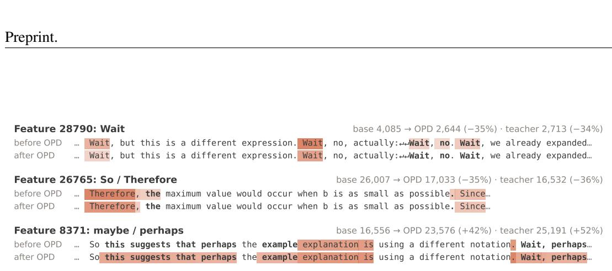  
Figure 7: The swap readout on held-out passages, before and after OPD under JustRL. Each pair of lines reads one passage in the student before and after OPD for one decision-token feature; shading: the feature’s activation on each token; bold: the tokens on which the feature starts or stops firing. Right: the feature’s firing count before OPD, after OPD, and in the teacher.

## E.2 FEATURES THE TEACHERS DOMINATE

Figure 8 shows features that the Skywork and R1-7B teachers dominate (Section 3.1). Since the swap readout places a student’s activation in the student slots, we read these features with the joint encoding of the three models, on 434 sequences from the held-out shards and away from their first 16 positions, where features tied to the position fire. They respond to titles of works, religious texts, LaTeX markup, dates of web posts, place names, and the notation of formulas, and the student’s share of their decoder norm is the same before and after OPD.

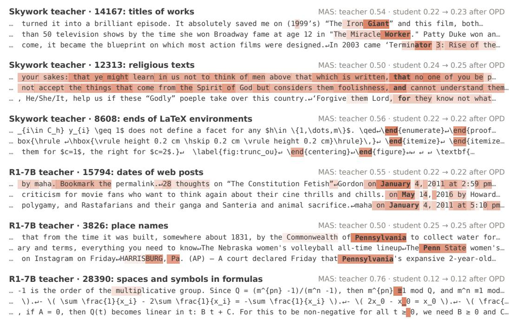  
Figure 8: Features that the Skywork and R1-7B teachers dominate. Strongest contexts of each feature under the joint encoding of the three models, away from the start of the sequence; shading: the feature’s activation on each token; bold: the strongest token. Right: the width-adjusted MAS of the teacher and of the student before and after OPD.

## E.3 DECISION-TOKEN FEATURES

Figure 9 shows the decision-token features among the 50 features whose firing rate OPD changes most (Section 3.2): six under JustRL and two under Skywork. They fire most strongly on the

decision words themselves, where the trace turns, and under JustRL, OPD moves each of them toward the teacher’s firing count.

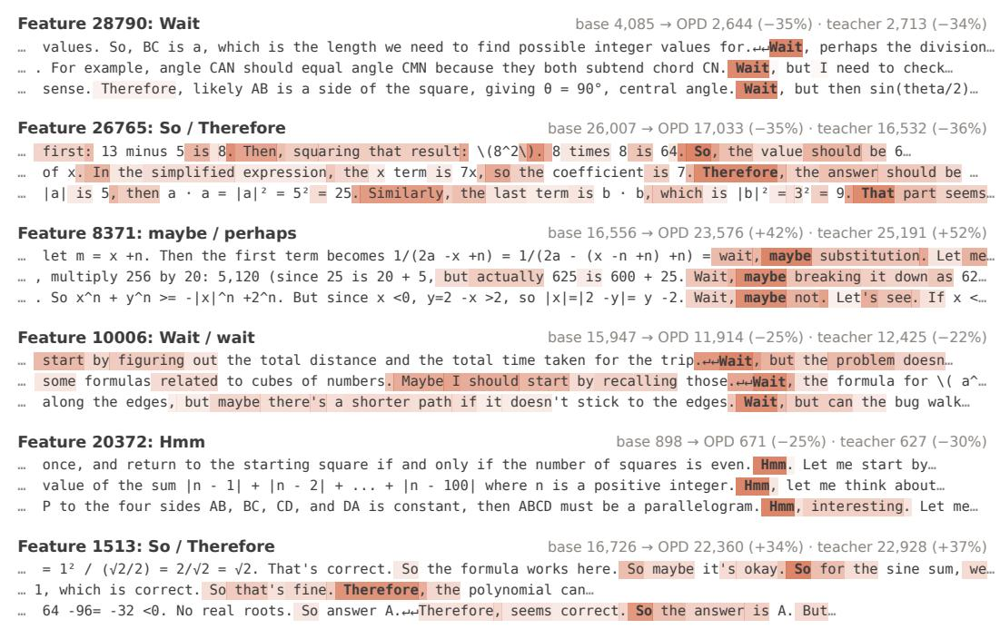  
Figure 9: Decision-token features that OPD reweights under JustRL and Skywork. Strongest held-out contexts of each feature in the student before OPD, read with the swap readout; shading and bold as in Figure 8. Right: the feature’s firing count before OPD, after OPD, and, under JustRL, in the teacher.

## E.4 FEATURES THE WARM-UP MOVES ALONG OPD’S DIRECTION

Figure 10 shows six of the 40 features whose firing rate OPD changes most under Qwen3, three that OPD raises and three that it lowers (Section 4.2); 35 of the 40 move the same way after the warm-up. The warm-up moves each of the six in OPD’s direction by a smaller amount, and after the warm-up and OPD, the change matches or exceeds that of OPD alone. The features OPD and the warm-up raise fire when the trace settles on an answer after a long unresolved search, names a solution method, or ends an attempt that does not work out; those they lower fire on Wait at the star of a paragraph, on the step after an equation, and on arithmetic within equations.

## E.5 FEATURES THE WARM-UP MOVES BEYOND OPD’S DIRECTION

Figure 11 shows six of the features that carry the warm-up’s reweighting outside OPD’s direction under Qwen3 (Section 4.2): two for the conversation format, three for the style of reasoning, and one for mathematical notation. Unlike those of Figure 10, their change after the warm-up is not a smaller version of OPD’s: it falls where OPD barely moves them, runs against OPD, or goes further than OPD. Features for Wait appear in both figures because a feature’s change can lie partly along OPD’s direction and partly outside it: the warm-up lowers these features in OPD’s direction, but further than the slope β predicts.

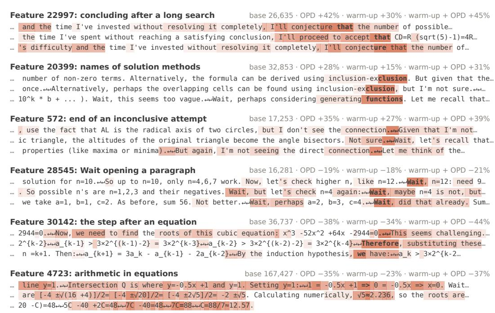  
Figure 10: Features that the warm-up moves along OPD’s direction under Qwen3. Contexts and shading as in Figure 9. Right: the feature’s firing count in the student before the warm-up and its change after OPD, after the warm-up, and after the warm-up and OPD.

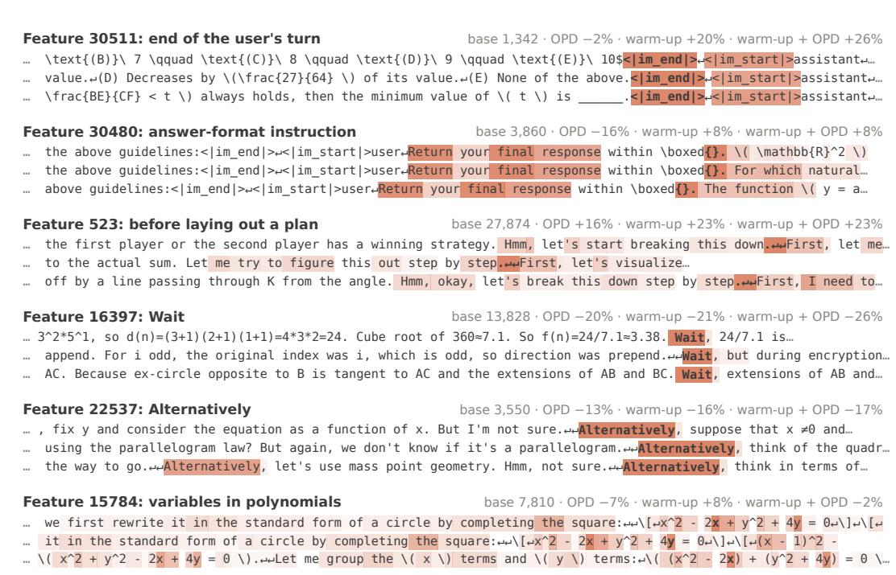  
Figure 11: Features that carry the warm-up’s reweighting outside OPD’s direction under Qwen3. Contexts and shading as in Figure 9. Right: the feature’s firing count in the student before the warm-up and its change after OPD, after the warm-up, and after the warm-up and OPD.