# USA: Update-aware SAM for Cross-Domain On-Policy Distillation of Language Agents

Qiyong Zhong1,2∗ Mao Zheng2∗ Mingyang Song2∗ Huwei Ji3 Houcheng Jiang1 Jiajie Su3 Li Zhang3 Gengsheng Li2 Junfeng Fang4†

1University of Science and Technology of China 2Foundation Model Department, Tencent 3Zhejiang University 4National University of Singapore

{youngzhong365,zhanglizl80}@gmail.com ; {jihuwei,sujiajie}@zju.edu.cn {moonzheng,nickmysong}@tencent.com ; ligengsheng2024@ia.ac.cn jianghc@mail.ustc.edu.cn ; fangjf@nus.edu.sg

## ABSTRACT

On-policy distillation instils multi-turn agentic reasoning through dense token-level supervision on the student’s own trajectories, but a single domain saturates early, so further supervision has to be drawn from other domains. Multi-domain data mixing is the most direct way of incorporating them, at the cost of conflicts between their data distributions and of retraining the entire model whenever one domain is revised. Model merging avoids both by distilling every domain independently and fusing the resulting task vectors afterwards. We find instead that the benefit polarizes across domain pairs: on those exhibiting negative transfer, every merging operator we evaluate falls below the single-domain reference. We attribute this to crossdomain update coupling, where a substantial fraction of coordinates is updated comparably by both domains and a merge can therefore displace them by as much as their own updates. To overcome this limitation, we propose Update-aware SAM (USA), which converts per-parameter update magnitudes measured during a brief warm-up into per-coordinate perturbation radii, reducing curvature precisely on the coordinates that carry most of the merging displacement. Experiments across mathematics, science and code at two student scales show USA strongest in all six transfer directions, ahead of the single-domain reference by more than four points on average, and reverse the negative transfer of the conflicting pairs.

## 1 INTRODUCTION

Agentic capabilities let large language models solve complex mathematical, scientific, and programming tasks through multi-turn interaction with external tools (Yao et al., 2023; Schick et al., 2023; Xi et al., 2023), and instilling them efficiently via post-training has become a central question (Feng et al., 2025; Li et al., 2025; Xue et al., 2025). Compared with reinforcement learning approaches such as GRPO (Shao et al., 2024), which give only sparse outcome-level rewards, On-Policy Distillation (OPD) (Agarwal et al., 2024; Gu et al., 2024) has a teacher supply dense token-level supervision on the student’s own trajectories, yielding more stable optimization and higher sample efficiency. It has recently been introduced into agent post-training and shown to be effective (Zhong et al., 2026).

Single-domain OPD, however, exhibits a pronounced performance ceiling. As illustrated in Figure 1(a) for Math, training saturates early and thereafter stagnates within a narrow band of fluctuation, and continually scaling up the distillation corpus brings no further gain, while a substantial gap to the teacher remains. This suggests that data volume alone is not the limiting factor, and points to the limited diversity of the supervision signal: the reasoning patterns within a single domain are relatively limited, so additional samples largely trigger patterns already covered by existing data and can hardly keep providing new learning signal. Since the bottleneck stems from the single-domain signal itself, incorporating knowledge from other domains as a complement becomes a natural choice.

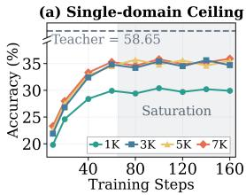

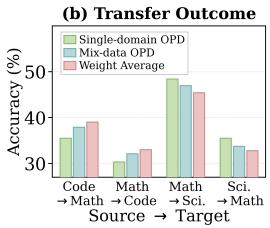

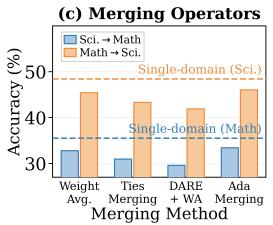

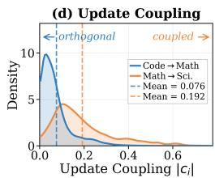  
Figure 1: Motivation and diagnosis of cross-domain OPD via model merging. (a) OPD on Math saturates early, and scaling the corpus from 1K to 7K cannot break the ceiling. (b) Gains polarize across domain pairs: Code↔Math improves in both directions, Math↔Science degrades in both. (c) On the conflicting pair, all four merging operators fall below the single-domain baseline. (d) Per-parameter update coupling $| c _ { i } | = 2 | \breve { \Delta } _ { t } ( \breve { i } ) \dot { \Delta _ { s } } ( i ) | / ( \Delta _ { t } ( i ) ^ { 2 } + \Delta _ { s } ( i ) ^ { 2 } )$ with $\Delta _ { k } = \theta _ { k } - \theta _ { 0 }$ , being 0 when only one domain updates it and 1 when both do comparably. The facilitating pair concentrates near 0, the conflicting pair shifts right. Appendix C.6 explains why it ignores the two signs.

Jointly training on a mixture of multi-domain data (mix-data) is the most direct way to incorporate cross-domain knowledge, but it has two inherent drawbacks. First, the data distributions of different domains conflict intrinsically (Dong et al., 2024), so their optimization signals interfere during joint training (Yu et al., 2020) and end up hurting performance (Ma et al., 2026; Wang et al., 2026a). Second, adding or updating any single domain requires inflexibly retraining the entire model. Model merging (Yang et al., 2026b), in contrast, fully decouples per-domain training: each domain trains independently from a shared initialization, and multi-source knowledge is then fused purely by parameter-space arithmetic (Ilharco et al., 2022). This sidesteps data-distribution conflicts by construction, while domains can be developed in parallel and added or removed on demand.

Yet however cross-domain knowledge is incorporated, the benefit polarizes across domain pairs. As shown in Figure 1(b), Code and Math form a facilitating pair: both mix-data and task-vector merging yield positive gains, surpassing the respective single-domain baselines in both directions. Math and Science, by contrast, form a conflicting pair, where both approaches suffer negative transfer in both directions and fall below the single-domain baselines. This degradation on the conflicting pair cannot be rescued by switching the merging operator: as shown in Figure 1(c), all four representative operators, weight averaging (Wortsman et al., 2022), Ties-Merging (Yadav et al., 2023), DARE (Yu et al., 2024) and AdaMerging (Yang et al., 2024), land below those baselines in both directions, indicating that the problem does not lie in any particular merging rule. We therefore examine the two kinds of domain pairs at the parameter level, where Figure 1(d) locates the boundary in the per-parameter update coupling: for the facilitating pair, the vast majority of parameters are substantially updated by only one domain, so the two sets of updates are nearly orthogonal and the other domain adds little to what merging already costs each of them; for the conflicting pair, a considerable fraction of parameters is updated by both domains with comparable magnitude and the coupling distribution shifts right as a whole, so on the coordinates through which the domains acquired their behaviour a linear combination is shaped as much by the other domain’s update as by the domain’s own, and the displacement it can impose there reaches the scale of the update itself. Negative transfer is therefore closely associated with cross-domain update coupling, which is already formed while the domains train independently and is bound to surface as mutual interference at merging time, before any operator has been chosen.

Mitigating this requires identifying which parameters carry the cross-domain conflict and making them resist merging interference already during independent per-domain training. To this end, we propose Update-aware SAM (USA), which builds on Sharpness-Aware Minimization (SAM) (Foret et al., 2020) and adaptively allocates the flatness constraint by the update saliency of each parameter, so as to accommodate the parameter displacement that merging introduces. Prior work observes the effective updates of OPD to be highly sparse, with only a small subset of parameters carrying the acquired knowledge, and that subset to be locked in early in training (Cai et al., 2026; Shen et al., 2026; Yu et al., 2026a); we refer to them as update-salient parameters. Since merging linearly combines precisely the task vectors, these parameters contribute the bulk of the merging displacement and therefore dominate the magnitude of cross-domain interference. Accordingly, USA runs standard OPD for a few steps at the start of each domain’s training, maps the measured per-parameter update magnitudes into scaling factors for the perturbation radius, and completes the remaining training within the ellipsoidal neighborhood they define. Compared with standard

SAM, which treats all parameters alike, USA reallocates the flatness budget according to each parameter’s contribution to interference: update-salient parameters must keep the loss low over a wider neighborhood, which reduces their local curvature and makes them far more tolerant to the displacement introduced by merging, while the remaining parameters fall back to the standard radius and do not sacrifice in-domain performance to needless regularization. Extensive experiments on agentic reasoning benchmarks across mathematics, science, and code show USA to consistently outperform all baselines and to reverse the negative transfer on conflicting pairs into positive gains.

## 2 PRELIMINARIES

## 2.1 ON-POLICY DISTILLATION FOR AGENT POST-TRAINING

We consider a general agent setting in which the model solves a task through multi-turn interaction with an external environment. Given an input x, the policy $\pi _ { \theta }$ generates a segment $y _ { k }$ at turn $k ,$ the environment returns an observation $o _ { k }$ , and $o _ { k }$ is appended to the context and conditions all subsequent generation, until a final answer is produced. A complete trajectory is therefore

$$
\zeta = ( x , y _ { 1 } , o _ { 1 } , \dots , y _ { K } , o _ { K } , y _ { K + 1 } ) ,\tag{1}
$$

where K is the number of interaction turns. Since the observations are produced by the environment rather than by the policy, they are excluded from the loss; we write $\tau$ for the set of token positions generated by the model, so that supervision is applied on $\tau$ only.

On-Policy Distillation (OPD) trains the student on trajectories sampled from the student itself, while a teacher policy $\pi _ { \mathrm { t e a c h e r } }$ supplies dense token-level supervision at every position of those trajectories. Concretely, it minimizes a sampled estimate of the reverse KL divergence over the states the student actually visits,

$$
\mathcal { L } _ { \mathrm { O P D } } ( \theta ) = \mathbb { E } _ { \zeta \sim \pi _ { \theta } } \left[ \sum _ { { t \in } T } \left( \log \pi _ { \theta } ( y _ { t } \mid y _ { < t } ) - \log \pi _ { \mathrm { t e a c h e r } } ( y _ { t } \mid y _ { < t } ) \right) \right] .\tag{2}
$$

Eq. (2) is the training objective used for every domain throughout this paper, and is also the objective executed during the warm-up stage of USA.

## 2.2 TASK VECTORS AND MODEL MERGING

We are given K domains $\mathcal { D } = \{ D _ { 1 } , \ldots , D _ { K } \}$ , each with its own teacher and training data, and all starting from the same checkpoint $\theta _ { 0 }$ . Every domain k is trained independently on its own data with the objective in Eq. (2), updating all parameters, which yields $\theta _ { k }$ . The knowledge acquired by domain k is summarized by its task vector

$$
\Delta _ { k } = \theta _ { k } - \theta _ { 0 } ,\tag{3}
$$

whose i-th component we denote by $\Delta _ { k } ( i )$

Model merging then fuses the independently trained domains purely by arithmetic operations in parameter space. Following weighted task arithmetic as the default operator,

$$
\theta _ { \mathrm { m e r g e d } } = \theta _ { 0 } + \sum _ { k } \lambda _ { k } \Delta _ { k } , \qquad \sum _ { k } \lambda _ { k } = 1 , \quad \lambda _ { k } \geq 0 ,\tag{4}
$$

so that every domain, including the one a given merge is evaluated on, contributes its task vector through a coefficient rather than in full. Writing $D _ { t }$ for the domain being evaluated, the case of a single source domain $D _ { s }$ reads $\theta _ { \mathrm { m e r g e d } } = \theta _ { 0 } + ( \bar { 1 ^ { - } } \lambda ) \Delta _ { t } + \lambda \Delta _ { s }$ with $\lambda = \lambda _ { s } ,$ , and $\lambda = 1 / 2$ recovers plain weight averaging. An important property of Eq. (4) is that merging acts coordinate-wise: the final value of the i-th parameter is determined solely by the linear superposition of the task-vector components of the individual domains at that same position, independently of all other coordinates.

Problem statement. Our goal is to make the merged model outperform on the target domain the model obtained by training on target-domain data alone while keeping every domain trained independently, and we report all results against that single-domain model as the reference point.

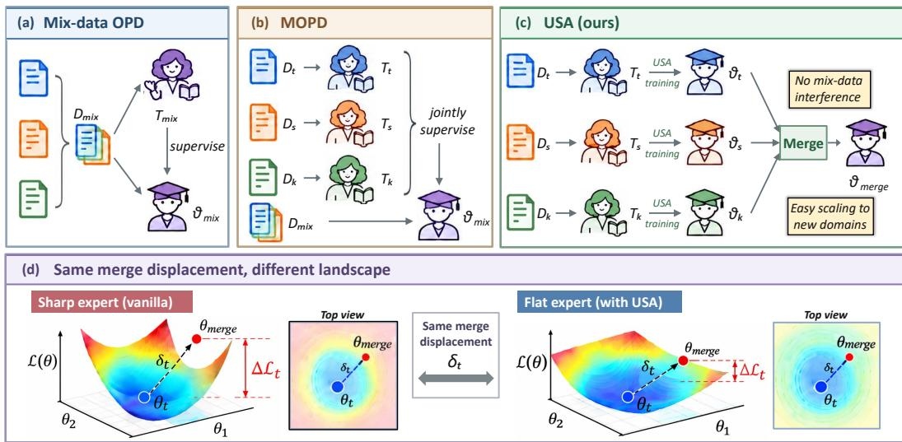  
Figure 2: Overview of USA and comparison with existing approaches.

## 3 METHODOLOGY

## 3.1 WHAT MERGING DISPLACES

Merging displaces each domain along the difference between the task vectors. As analyzed in Section 1, negative transfer originates from the coupling of the task vectors of different domains on shared parameters, a coupling already formed while the domains are trained independently. Figure 2 places the resulting scheme beside the mixed-domain alternatives it is compared against. To act on it we ask what a domain is subjected to at merging time. Fixing a target domain $D _ { t }$ and subtracting its single-domain solution $\theta _ { t } = \theta _ { 0 } + \Delta _ { t }$ from Eq. (4) leaves

$$
\delta _ { t } \ = \ \theta _ { \mathrm { m e r g e d } } - \theta _ { t } \ = \ \sum _ { j \neq t } \lambda _ { j } \left( \Delta _ { j } - \Delta _ { t } \right) ,\tag{5}
$$

the merging-induced displacement of $D _ { t } ,$ , with one entry $\delta _ { t } ( i )$ per parameter, which for a single source domain $D _ { s }$ reduces to $\delta _ { t } = \lambda ( \Delta _ { s } - \Delta _ { t } )$ . Two of its properties are used below. The merged model evaluates $D _ { t }$ at $\theta _ { t } + \delta _ { t }$ rather than at $\theta _ { t } .$ , so any performance lost relative to the single-domain reference must be attributed to $\delta _ { t } ;$ the displacement itself decomposes coordinate-wise, although its effect on the target loss does not, since that effect is governed by a quadratic form whose off-diagonal terms couple the coordinates. Regrouping Eq. (5) as

$$
\delta _ { t } ~ = ~ \underbrace { - \left( 1 - \lambda _ { t } \right) \Delta _ { t } } _ { \mathrm { s h r i n k a g e ~ o f ~ t h e ~ t a r g e t ' s ~ o w n ~ u p d a t e } } + \underbrace { \sum _ { j \neq t } \lambda _ { j } \Delta _ { j } } _ { \mathrm { i n j e c t i o n ~ f r o m ~ t h e ~ o t h e r ~ d o m a i n s } }\tag{6}
$$

then separates a term the domain determines entirely by itself from one formed elsewhere that it can neither evaluate nor influence while it trains. Both follow from Eq. (4) alone and hold for any merging operator of this form regardless of how the domains were trained.

Which coordinates a domain has to protect. The injection term of Eq. (6) confines a domain to its own trajectory, since intervening on the domains that form it would forfeit what merging gains over joint training: no domain sees the data of another, and the domains train in parallel and can be added or removed one at a time without retraining. The criterion must therefore come from the domain’s own update, which is also the one that matters: the coordinates it has moved far from $\theta _ { 0 }$ are those through which it acquired the behaviour the merged model is evaluated on, so a displacement of given magnitude costs more there than on coordinates left untouched. The shrinkage term of Eq. (6) bears on those coordinates by construction rather than by assumption, because it scales $\Delta _ { t }$ itself and is largest exactly where the domain has updated most, so weight averaging pulls a domain back along the directions it relies on. What varies across domain pairs is what the injection term does to this. Figure 1(d) reports that on the pairs motivating this work many parameters are updated by several domains with comparable magnitude, so on the coordinates a domain relies on that term is comparable to the shrinkage term rather than negligible beside it. What the criterion needs from it is its size and not its direction, because the neighbourhood of Eq. (10) is symmetric about the solution and asks a coordinate to tolerate a given magnitude of displacement whichever way it points, so a quantity that ignores the two signs is the conservative input and $\left| { c _ { i } } \right|$ is large exactly where the worst displacement a merge can impose stands furthest above what the two updates alone would produce, as Appendix C.6 sets out. Being a property of the domain pairs rather than of the algebra above, this is stated as Assumption 1, under which the stronger the coupling the larger the interference that can be removed.

Estimating the update magnitude with a short warm-up. Every domain is the target of the merges evaluated on it, so we drop t and write k for the domain currently being trained. Its final update $| \Delta _ { k }$ is unavailable while it trains, and this is where the training paradigm enters: recent work reports that the effective updates of OPD are highly sparse and that the subset carrying them settles early, so a short warm-up already identifies the coordinates to protect. We therefore let domain k optimize Eq. (2) from $\theta _ { 0 }$ for N steps, reaching $\theta _ { N } ^ { ( k ) }$ , and record the per-parameter update magnitude

$$
m _ { k } ( i ) = \left| \theta _ { N } ^ { ( k ) } ( i ) - \theta _ { 0 } ( i ) \right| ,\tag{7}
$$

whose highest-ranked coordinates constitute the update-salient parameters introduced in Section 1. The magnitudes are computed once when the warm-up ends and kept fixed thereafter, and they enter Section 3.2 only after being normalized against a reference formed from the domain’s own updates, so the warm-up has to recover the relative profile of the updates rather than their eventual sizes.

## 3.2 UPDATE-AWARE ADAPTIVE PERTURBATION

From displacement to a perturbation budget. Being displaced is not in itself harmful. What a domain loses is the increase in its own loss between $\theta _ { t }$ and $\theta _ { t } + \delta _ { t } .$ , which depends on the shape of the loss surface as much as on the displacement, since a sharp minimum turns a small displacement into a steep climb whereas a flat region absorbs the same displacement with little damage. Flatness is moreover the one such property a domain governs through its own training, so USA adopts a sharpness-aware objective and applies it along the coordinates its own update singles out.

Concretely, we turn the update magnitudes of Eq. (7) into a per-coordinate scale. Let $g _ { i }$ denote the weight matrix containing coordinate i. Within each matrix g we take the $( 1 - p )$ )-quantile of the update magnitudes as the reference level

$$
D _ { k } ( g ) = Q _ { 1 - p } ( \{ m _ { k } ( i ) : i \in g \} ) ,\tag{8}
$$

against which every coordinate of that matrix is measured,

$$
s _ { k } ( i ) = 1 + ( \alpha - 1 ) \mathrm { m i n } \biggl ( \frac { m _ { k } ( i ) } { D _ { k } ( g _ { i } ) } , 1 \biggr ) ,\tag{9}
$$

where $\alpha \geq 1$ caps the amplification so that $s _ { k } ( i ) \in [ 1 , \alpha ]$ and $p$ fixes the fraction of coordinates in each matrix that reach it in full, the remainder interpolating continuously between 1 and α.

Three properties of this construction matter. It is invariant to the overall size of the update, since replacing $m _ { k }$ by $c m _ { k }$ leaves Eq. (9) unchanged, so the warm-up of Section 3.1 has to recover the profile of the update rather than its eventual magnitude. Its reference is a fixed fraction of the coordinates of one matrix rather than a single extreme entry of the whole model, which is what makes the amplification usable on updates as heavy-tailed as those of OPD: a reference at the largest entry would leave almost every coordinate at $s _ { k } ( i ) \approx 1$ , and one shared across the network would deny amplification to any matrix whose updates are uniformly small. It is finally continuous rather than a hard mask, so no threshold has to be chosen and coordinates of intermediate saliency are treated in proportion. We fix $p$ to 1% throughout, in keeping with the sparsity the construction rests on, leaving α as the only free quantity of Eq. (9).

The training objective. Collecting the scales into the diagonal matrix $S _ { k } = \mathrm { d i a g } ( s _ { k } )$ , domain k solves

$$
\operatorname* { m i n } _ { \theta } \operatorname* { m a x } _ { \left\| S _ { k } ^ { - 1 } \epsilon \right\| _ { 2 } \leq \rho } \mathcal { L } _ { k } ( \theta + \epsilon ) ,\tag{10}
$$

where $\rho$ is the base radius and $\mathcal { L } _ { k }$ is the OPD objective of Eq. (2). The constraint set is an axis-aligned ellipsoid whose semi-axis along coordinate i is $\rho s _ { k } ( i )$ , so the update-salient parameters have to keep the loss low over a wider interval and the landscape is flattened along those directions, while coordinates of lower saliency are constrained over an interval that shrinks continuously towards $\rho$ and retain their expressive freedom. Setting $\alpha = 1$ gives $S _ { k } = I$ and recovers the isotropic ball, of which USA is therefore a strict generalization.

Substituting $\epsilon = S _ { k } v$ turns the inner maximization after linearization into ma $\begin{array} { r } { \mathfrak { L } _ { \parallel v \parallel _ { 2 } \le \rho } v ^ { \top } S _ { k } \nabla _ { \theta } \mathcal { L } _ { k } ( \theta ) } \end{array}$ whose maximizer $v ^ { \star } \ = \ \rho S _ { k } \nabla _ { \theta } \mathcal { L } _ { k } ( \theta ) / \| S _ { k } \nabla _ { \theta } \mathcal { L } _ { k } ( \theta ) |$ ∥ gives the closed-form perturbation (Appendix C.2 gives the full derivation)

$$
\hat { \epsilon } _ { k } = S _ { k } \boldsymbol { v } ^ { \star } = \rho \frac { S _ { k } ^ { 2 } \nabla _ { \theta } \mathcal { L } _ { k } ( \theta ) } { \| S _ { k } \nabla _ { \theta } \mathcal { L } _ { k } ( \theta ) \| } .\tag{11}
$$

Each step after the warm-up therefore evaluates the gradient at $\theta ,$ forms $\hat { \epsilon } _ { k }$ , and updates $\theta$ with the gradient taken at the perturbed point $\theta + \hat { \epsilon } _ { k }$

Theoretical analysis. Write $\Xi _ { t } = \mathcal { L } _ { t } ( \theta _ { t } + \delta _ { t } ) - \mathcal { L } _ { t } ( \theta _ { t } )$ for the merging interference, the loss merging inflicts on $D _ { t }$ in excess of the solution it had reached on its own. We analyse $\Xi _ { t }$ as a local surrogate for the accuracy degradation reported in Figure 1(b), a positive value placing the merged model higher on the loss surface of its target domain. Expanding $\mathcal { L } _ { t }$ around $\theta _ { t }$ and bounding the resulting quadratic form in a diagonal metric gives the following.

Proposition 1 (Interference bound in a diagonal metric). Let $\scriptstyle { \mathcal { L } } _ { t }$ be twice differentiable with a locally Lipschitz Hessian, write $H _ { t } = \nabla _ { \theta } ^ { 2 } \mathcal { L } _ { t } ( \theta _ { t } )$ , and let $\theta _ { t }$ be a local minimizer of $\mathcal { L } _ { t } ,$ so that $\nabla _ { \theta } \mathcal { L } _ { t } ( \theta _ { t } ) = \mathrm { ~ \dot { 0 } ~ }$ and $H _ { t } \succeq 0$ . Thenfor every diagonal S with strictly positive entries,

$$
\begin{array} { r } { | \Xi _ { t } | \ \leq \ \frac { 1 } { 2 } \underbrace { \lambda _ { \operatorname* { m a x } } ( S H _ { t } S ) } _ { \mathrm { c u r v a t u r e ~ i n ~ t h e ~ } S \mathrm { - m e t r i c } } \cdot \underbrace { { \left\| S ^ { - 1 } \delta _ { t } \right\| } _ { 2 } ^ { 2 } } _ { \mathrm { r e w e i g h t e d ~ d i s p l a c e m e n t } } + O \big ( \| \delta _ { t } \| _ { 2 } ^ { 3 } \big ) . } \end{array}\tag{12}
$$

Of the two factors the displacement is fixed once the domains have been trained, whereas the curvature is a property of the loss surface that the domain shapes while training, as Figure 2(d) illustrates, and it is precisely what Eq. (10) suppresses: near a stationary local minimum its inner maximization equals $\begin{array} { r } { \frac { 1 } { 2 } \dot { \rho } ^ { 2 } \lambda _ { \mathrm { m a x } } \big ( \dot { S } _ { k } H _ { k } S _ { k } \big ) } \end{array}$ ) to second order in $\rho ,$ the curvature factor of the bound at $S = S _ { k }$ , so training and interference are expressed in one and the same metric rather than related by analogy. Appendix $\check { \mathrm { C } }$ proves Proposition 1, establishes this identity, and shows that the bound is reduced by placing the large entries of $S$ on the coordinates that carry the displacement, which is what Eq. (9) does and Assumption 1 quantifies; it is also what limits how far the amplification may ${ \bf \ S 0 } _ { ; }$ , and is why α caps it. Appendix E reports the training cost and the interaction with the surrounding merging pipeline.

## 4 EXPERIMENT

## 4.1 EXPERIMENTAL SETUP

Datasets & Benchmarks. We study three domains and train each on a 4k dataset, drawn from DAPO-Math (Yu et al., 2026b) for mathematics, the code partition of Skywork-OR1 (He et al., 2025) for code, and MegaScience (Fan et al., 2025) for science. Each is evaluated on two benchmarks: AIME 2025 and HMMT February 2026 (Dekoninck et al., 2026), LiveCodeBench-v6 (Jain et al., 2025) and NaturalCodeBench (Zhang et al., 2024), and GPQA-Diamond (Rein et al., 2023) and SciBench-Atkins (Wang et al., 2023) respectively, with the details in Appendix F.

Evaluation Setups. Each domain teacher is a Qwen3-14B model (Yang et al., 2025) further optimized with GRPO on the corresponding dataset above, and the students are Qwen3-1.7B and Qwen3-4B. Unless stated otherwise, every result we report is obtained on the Qwen3-1.7B student, so that the ablation of Section 4.3 and the analyses of Sections 4.4 and 4.5 are read at one scale. We decode with temperature 1.0 and nucleus sampling at top\_ $\scriptstyle \mathtt { p = } 0 . 6 ,$ , drawing 32 samples per problem, and report average@32 as a percentage, with the agent placed in a code interpreter throughout.

Table 1: Cross-domain performance over six transfer directions at two student scales. A column headed source → target evaluates the merged model on the target domain and averages its two benchmarks. The best results are in bold, and the second-best results are underlined. We report average@32 over 5 runs, and a standard deviation is propagated from those of the two benchmarks, whose per-benchmark values are given in Tables 5 and 6.
<table><tr><td>Method</td><td>Code → Math Math → Code Math → Sci. Sci. → Math Sci. → Code</td><td></td><td></td><td></td><td></td><td> $\mathbf { C o d e } \to \mathbf { S c i . }$ </td></tr><tr><td colspan="7">Teacher Model from the Qwen3-14B Series</td></tr><tr><td>GRPO</td><td> $5 8 . 6 5 \pm 0 . 8 3 $ </td><td> $6 1 . 9 1 \pm 0 . 5 9$ </td><td> $7 1 . 0 0 \pm 0 . 6 8$ </td><td> $5 8 . 6 5 \pm 0 . 8 3 $ </td><td> $6 1 . 9 1 \pm 0 . 5 9$ </td><td> $7 1 . 0 0 \pm 0 . 6 8$ </td></tr><tr><td colspan="7">Student Models from the Qwen3-1.7B Series</td></tr><tr><td>Vanilla Mix-data SFT Mix-data GRPO</td><td> $1 5 . 0 9 \pm 0 . 7 1$   $2 6 . 0 0 \pm 0 . 9 5$   $3 2 . 5 5 \pm 0 . 8 1$ </td><td> $1 9 . 0 3 \pm 0 . 4 6$   $2 2 . 3 2 \pm 0 . 4 6$   $2 6 . 8 2 \pm 0 . 5 1$ </td><td> $3 6 . 4 1 \pm 0 . 5 6$   $4 1 . 4 0 \pm 0 . 6 5$   $4 5 . 1 0 \pm 0 . 5 4$ </td><td> $1 5 . 0 9 \pm 0 . 7 1$   $2 5 . 0 7 \pm 0 . 8 3$   $3 0 . 2 8 \pm 0 . 8 3$ </td><td> $1 9 . 0 3 \pm 0 . 4 6$   $2 2 . 2 0 \pm 0 . 4 1$   $2 6 . 3 8 \pm 0 . 4 7$ </td><td> $3 6 . 4 1 \pm 0 . 5 6$   $4 2 . 4 9 \pm 0 . 6 4$ </td></tr><tr><td>Mix-data OPD Single-domain OPD</td><td> $3 7 . 9 1 \pm 0 . 8 5$   $3 5 . 5 1 \pm 0 . 7 7$ </td><td> $3 2 . 1 2 \pm 0 . 4 5$   $3 0 . 3 3 \pm 0 . 5 6$ </td><td> $4 6 . 9 6 \pm 0 . 6 0$   $4 8 . 4 2 \pm 0 . 6 4$ </td><td> $3 3 . 7 4 \pm 0 . 8 7$   $3 5 . 5 1 \pm 0 . 7 7$ </td><td> $3 1 . 1 7 \pm 0 . 5 5$   $3 0 . 3 3 \pm 0 . 5 6$ </td><td> $4 6 . 1 4 \pm 0 . 5 6$  49.21 ±0.58  $4 8 . 4 2 \pm 0 . 6 4$ </td></tr><tr><td>MOPD Weight Average</td><td> $3 9 . 0 2 \pm 0 . 7 2$ </td><td> $3 3 . 1 2 \pm 0 . 4 8$ </td><td> $4 8 . 8 5 \pm 0 . 5 1$ </td><td> $3 5 . 6 4 \pm 0 . 7 9$ </td><td> $3 2 . 0 7 \pm 0 . 5 3 $ </td><td> $5 0 . 2 1 \pm 0 . 5 7$ </td></tr><tr><td>Ties-Merging</td><td> $\overline { { 3 9 . 0 4 \pm 0 . 5 8 } }$ </td><td> $\overline { { 3 3 . 0 1 \pm 0 . 4 2 } }$ </td><td> $\overline { { 4 5 . 4 4 \pm 0 . 7 2 } }$ </td><td> $\overline { { 3 2 . 8 0 \pm 0 . 8 6 } }$ </td><td> $\overline { { 3 1 . 5 4 \pm 0 . 3 7 } }$ </td><td> $\overline { { 5 0 . 0 5 \pm 0 . 6 8 } }$ </td></tr><tr><td></td><td> $3 6 . 8 1 \pm 0 . 8 4$ </td><td> $3 0 . 9 0 \pm 0 . 6 0$ </td><td> $4 3 . 3 3 \pm 0 . 4 9$ </td><td> $3 0 . 9 9 \pm 0 . 8 2$ </td><td> $2 9 . 8 7 \pm 0 . 6 4$ </td><td> $4 8 . 0 6 \pm 0 . 4 9$ </td></tr><tr><td>DARE+WA</td><td> $3 5 . 3 5 \pm 0 . 9 3 $ </td><td> $2 9 . 5 4 \pm 0 . 5 7$ </td><td> $4 1 . 9 3 \pm 0 . 7 0$ </td><td> $2 9 . 5 9 \pm 1 . 0 6$ </td><td> $2 8 . 5 3 \pm 0 . 4 3$ </td><td> $4 6 . 4 3 \pm 0 . 7 5$ </td></tr><tr><td>AdaMerging</td><td> $3 9 . 0 2 \pm 0 . 6 5$ </td><td> $3 2 . 8 9 \pm 0 . 3 9$ </td><td> $4 6 . 0 5 \pm 0 . 4 9$ </td><td> $3 3 . 4 4 \pm 0 . 6 0$ </td><td> $3 2 . 0 5 \pm 0 . 5 0$ </td><td> $5 0 . 0 1 \pm 0 . 4 8$ </td></tr><tr><td>USA</td><td> $\overline { { 4 1 . 5 1 \pm 0 . 8 3 } }$ </td><td> $\overline { { 3 5 . 6 4 \pm 0 . 4 9 } }$ </td><td> $\overline { { 5 3 . 5 0 \pm 0 . 5 3 } }$ </td><td> $\overline { { 3 8 . 7 6 \pm 0 . 8 1 } }$ </td><td> $\overline { { 3 3 . 6 3 \pm 0 . 4 4 } }$ </td><td> $\overline { { 5 2 . 8 0 \pm 0 . 5 8 } }$ </td></tr><tr><td colspan="7">Student Models from the Qwen3-4B Series</td></tr><tr><td>Vanilla</td><td> $3 6 . 7 9 \pm 0 . 8 1$ </td><td> $3 9 . 5 4 \pm 0 . 5 0 $ </td><td> $5 1 . 5 0 \pm 0 . 6 0$ </td><td> $3 6 . 7 9 \pm 0 . 8 1$ </td><td> $3 9 . 5 4 \pm 0 . 5 0 $ </td><td></td></tr><tr><td>Mix-data SFT</td><td> $4 1 . 7 1 \pm 0 . 8 7$ </td><td> $4 5 . 1 5 \pm 0 . 4 9$ </td><td> $5 5 . 0 7 \pm 0 . 6 6$ </td><td> $4 0 . 6 4 \pm 0 . 8 7$ </td><td> $4 4 . 8 3 \pm 0 . 4 9$ </td><td> $5 1 . 5 0 \pm 0 . 6 0$   $5 5 . 6 5 \pm 0 . 5 7$ </td></tr><tr><td>Mix-data GRPO</td><td> $4 8 . 4 3 \pm 0 . 8 5$ </td><td> $5 1 . 2 5 \pm 0 . 4 7$ </td><td> $6 0 . 8 3 \pm 0 . 5 6$ </td><td> $4 6 . 9 4 \pm 0 . 8 9$ </td><td> $5 1 . 0 1 \pm 0 . 5 2 $ </td><td></td></tr><tr><td>Mix-data OPD</td><td> $4 8 . 7 5 \pm 0 . 9 6$ </td><td> $5 1 . 9 9 \pm 0 . 4 3$ </td><td> $6 0 . 8 8 \pm 0 . 6 0$ </td><td> $4 6 . 9 8 \pm 0 . 9 6$ </td><td> $5 1 . 3 4 \pm 0 . 5 1$ </td><td> $6 2 . 3 0 \pm 0 . 6 3$ </td></tr><tr><td>Single-domain OPD</td><td> $4 8 . 1 4 \pm 0 . 8 5$ </td><td> $5 1 . 2 7 \pm 0 . 6 2 $ </td><td> $6 1 . 7 1 \pm 0 . 7 1$ </td><td> $4 8 . 1 4 \pm 0 . 8 5$ </td><td> $5 1 . 2 7 \pm 0 . 6 2 $ </td><td> $6 2 . 1 8 \pm 0 . 5 1$ </td></tr><tr><td>MOPD</td><td> $\underline { { 4 9 . 5 8 } } \pm 0 . 7 3 $ </td><td> $5 2 . 6 8 \pm 0 . 5 7$ </td><td> $6 1 . 2 8 \pm 0 . 5 6$ </td><td> $4 8 . 6 3 \pm 0 . 6 9$ </td><td> $5 2 . 2 2 \pm 0 . 4 7$ </td><td> $6 1 . 7 1 \pm 0 . 7 1 $ </td></tr><tr><td>Weight Average</td><td> $\overline { { 4 9 . 3 2 \pm 0 . 9 3 } }$ </td><td> $\overline { { 5 2 . 5 3 \pm 0 . 5 1 } }$ </td><td> $\overline { { 5 9 . 0 2 \pm 0 . 6 0 } }$ </td><td> $\overline { { 4 6 . 0 9 \pm 0 . 8 1 } }$ </td><td> $\overline { { 5 1 . 9 1 \pm 0 . 4 4 } }$ </td><td> $6 2 . 7 0 \pm 0 . 7 1$ </td></tr><tr><td>Ties-Merging</td><td> $4 7 . 7 6 \pm 0 . 9 3$ </td><td> $5 1 . 1 6 \pm 0 . 5 2$ </td><td> $5 7 . 0 8 \pm 0 . 6 0$ </td><td> $4 4 . 3 5 \pm 0 . 8 4$ </td><td> $5 0 . 2 5 \pm 0 . 6 7$ </td><td> $\overline { { 6 2 . 7 0 \pm 0 . 5 2 } }$ </td></tr><tr><td> $\mathrm { D A R E + W A }$ </td><td> $4 6 . 5 0 \pm 0 . 9 3$ </td><td> $4 9 . 4 3 \pm 0 . 6 2$ </td><td> $5 6 . 5 3 \pm 0 . 6 9$ </td><td> $4 3 . 0 9 \pm 0 . 8 7$ </td><td> $4 8 . 9 1 \pm 0 . 4 7$ </td><td> $6 0 . 6 8 \pm 0 . 6 5$ </td></tr><tr><td> $\mathbf { A d a M e r g i n g }$ </td><td> $4 9 . 3 1 \pm 0 . 6 8$ </td><td> $5 2 . 5 5 \pm 0 . 5 0$ </td><td> $5 9 . 4 8 \pm 0 . 5 2 $ </td><td> $4 6 . 5 3 \pm 0 . 7 7$ </td><td> $5 2 . 0 6 \pm 0 . 4 8$ </td><td> $5 9 . 1 0 \pm 0 . 5 4$ </td></tr><tr><td>USA</td><td> $\overline { { 5 2 . 1 6 \pm 0 . 9 2 } }$ </td><td></td><td></td><td></td><td></td><td> $6 2 . 5 9 \pm 0 . 5 7$ </td></tr><tr><td></td><td></td><td> $\overline { { 5 6 . 2 5 \pm 0 . 4 6 } }$ </td><td> $\overline { { { \bf 6 7 . 0 4 } \pm 0 . 5 4 } }$ </td><td> $\overline { { 5 0 . 7 2 \pm 0 . 7 1 } }$ </td><td> $\overline { { 5 4 . 4 6 \pm 0 . 4 5 } }$ </td><td> $\overline { { 6 5 . 6 5 \pm 0 . 5 8 } }$ </td></tr></table>

Baselines & Implementation Details. We compare against (1) Vanilla, (2) Mix-data SFT, (3) Mixdata GRPO (Shao et al., 2024), (4) Mix-data OPD, (5) Single-domain OPD and (6) MOPD (Ma et al., 2026). We further compare against four merging baselines, which start from the same OPD students that Single-domain OPD produces, each trained on its own domain against its own teacher and without our objective, and combine their task vectors by (7) Weight Average (Wortsman et al., 2022), (8) TIES-Merging (Yadav et al., 2023), (9) DARE+WA (Yu et al., 2024) and (10) AdaMerging (Yang et al., 2024). These four therefore share identical experts and differ only in the merging rule. Appendix F.3 describes each baseline and Appendix F.4 reports the implementation details.

## 4.2 OVERALL PERFORMANCE

Table 1 reports the six transfer directions at two student scales, with the per-benchmark scores behind every cell in Appendix G.5. USA is merged with the same weighted task arithmetic as the Weight Average row, so any difference between the two is due entirely to how the experts were trained.

• Obs 1: USA attains the best score in every transfer direction at both student scales. It improves on the single-domain reference everywhere, by 4.55 points on average at 1.7B and 4.01 points at 4B, so the benefit is not confined to the smaller model where headroom is largest.

• Obs 2: the benefit of cross-domain knowledge polarizes across domain pairs, and USA is the only method that achieves positive transfer on the unfavourable pair in both directions and at both scales. On the facilitating pair, Code and Math, most methods help: Mix-data OPD, MOPD, weight averaging and AdaMerging all clear the reference in all four cells, the exceptions being Mix-data SFT and Mix-data GRPO, which average below it even here and so indict their algorithms rather than their data. On the conflicting pair, Math and Science, the four operators all fall below the reference at either scale and no other baseline clears it by as much as a point. Mix-data OPD, which never merges, splits the same way, so the conflict is not the merging arithmetic. On Math →

Table 2: Ablation study of USA on the Qwen3-1.7B students. The best results are in bold. We report average@32 over 5 runs.
<table><tr><td>Variant</td><td>Code → Math Math → Code</td><td></td><td> $\mathbf { M a t h }  \mathbf { S c i . }$ </td><td>Sci. → Math Sci. → Code</td><td></td><td> $\mathbf { C o d e }  \mathbf { S c i . }$ </td></tr><tr><td colspan="7">Flatness Constraint</td></tr><tr><td>(1.1) w/o SAM</td><td> $3 9 . 0 4 \pm 0 . 5 8$ </td><td> $3 3 . 0 1 \pm 0 . 4 2 $ </td><td> $4 5 . 4 4 \pm 0 . 7 2$ </td><td> $3 2 . 8 0 \pm 0 . 8 6$ </td><td>31.54 ±0.37</td><td>50.05 ±0.68</td></tr><tr><td>(1.2) w/ Vanilla SAM</td><td> $4 0 . 2 8 \pm 0 . 7 7$ </td><td> $3 4 . 6 6 \pm 0 . 5 6$ </td><td> $5 0 . 2 1 \pm 0 . 6 3$ </td><td> $3 5 . 9 4 \pm 0 . 9 2$ </td><td>32.70 ±0.48</td><td>51.55 ±0.52</td></tr><tr><td colspan="7">Scale Assignment</td></tr><tr><td>(2.1) w/ Random Scale</td><td> $3 9 . 6 8 \pm 0 . 9 0 $ </td><td>33.74 ±0.62</td><td> $4 7 . 8 6 \pm 0 . 7 9$ </td><td> $3 4 . 2 5 \pm 0 . 6 3$ </td><td>32.05 ±0.55</td><td>50.72 ±0.43</td></tr><tr><td>(2.2) w/ Inverted Scale</td><td> $3 8 . 7 1 \pm 1 . 0 8 $ </td><td>32.82 ±0.48</td><td>44.62 ±0.87</td><td> $3 1 . 9 5 \pm 0 . 9 9$ </td><td>31.18 ±0.68</td><td> $4 9 . 6 7 \pm 0 . 7 2$ </td></tr><tr><td>(2.3) w/ Hard Top-k Mask</td><td> $4 0 . 9 2 \pm 0 . 6 5$ </td><td>35.11 ±0.39</td><td> $5 2 . 3 4 \pm 0 . 4 9$ </td><td> $3 7 . 9 1 \pm 0 . 7 5$ </td><td>33.24 ±0.42</td><td> $5 2 . 1 9 \pm 0 . 6 1$ </td></tr><tr><td colspan="7">Update Metric</td></tr><tr><td>(3.1) w/ ASAM Scale</td><td> $4 0 . 1 7 \pm 0 . 8 4$ </td><td> $3 4 . 7 \bar { 8 } \pm 0 . 4 4$ </td><td> $5 0 . 3 5 \pm 0 . 6 9$ </td><td> $3 5 . 8 2 \pm 0 . 5 9$ </td><td>32.81 ±0.61</td><td> $5 1 . 4 1 \pm 0 . 4 7$ </td></tr><tr><td>(3.2) w/ Relative-Change</td><td> $3 9 . 9 1 \pm 0 . 9 7$ </td><td> $3 4 . 2 2 \pm 0 . 5 0$ </td><td> $4 8 . 3 4 \pm 0 . 5 7$ </td><td> $3 4 . 5 1 \pm 0 . 8 8$ </td><td>32.28 ±0.46</td><td> $5 0 . 9 8 \pm 0 . 7 6$ </td></tr><tr><td>USA</td><td> $\overline { { 4 1 . 5 1 \pm 0 . 8 3 } }$ </td><td> $\overline { { 3 5 . 6 4 \pm 0 . 4 9 } }$ </td><td> $\overline { { 5 3 . 5 0 \pm 0 . 5 3 } }$ </td><td> $\overline { { 3 8 . 7 6 \pm 0 . 8 1 } }$ </td><td> $\overline { { 3 3 . 6 3 \pm 0 . 4 4 } }$ </td><td> $\overline { { 5 2 . 8 0 \pm 0 . 5 8 } }$ </td></tr></table>

Science the best operator falls 2.37 points below the reference while USA rises 5.08 points above it, so cross-domain knowledge is not merely kept from harming the target but made to benefit it.

• Obs 3: the improvement originates in training rather than in the merging rule or in access to additional data. USA merges by the same weighted task arithmetic as Weight Average, yet surpasses AdaMerging, which optimizes its coefficients layer by layer, by close to 4 points at either scale, and surpasses in every direction both Mix-data OPD, which faces no merging step at all, and MOPD. Reserving the flatness budget for the update-salient parameters during independent training is therefore more effective than either reconciling the experts afterwards or mixing the data.

## 4.3 ABLATION STUDY

Table 2 alters one component of USA at a time, keeping the training pipeline and the merging operator fixed. The spread between variants exceeds 8 points on Math → Science against under 3 on Science → Code, so it is on the conflicting pair that the perturbation geometry decides the outcome.

• Obs 4: adaptive flatness is necessary, and uniform sharpness regularization is insufficient. An isotropic constraint lifts the average over the six directions by 2.24 points above the unconstrained merge, confirming that flatness is the right instrument, yet it remains 1.75 points below USA and barely reaches the single-domain reference on the conflicting pair. Spending the budget uniformly leaves the coordinates that carry the interference under-protected.

• Obs 5: the gain comes from assigning large scales to high-update coordinates, not from anisotropy per se. Permuting the scale vector keeps its marginal distribution but destroys its link to the update magnitudes, which alone places it below the isotropic constraint everywhere, and reversing it falls below the unconstrained merge. A two-level mask trails USA by 0.69 points, so identifying those coordinates supplies most of the gain and the continuous map the rest.

• Obs 6: what a parameter has moved, rather than how large it is, determines merging interference. Deriving the scales from the parameter magnitude reproduces the isotropic result to within noise, so that quantity carries no information about what merging displaces, and normalizing the displacement by it is worse than leaving the geometry isotropic. Both placements fall short of USA, which uses the displacement alone, as task arithmetic predicts: a merged coordinate is an absolute sum of task-vector components, unaffected by the scale of the parameter receiving them.

## 4.4 WHERE THE CROSS-DOMAIN GAIN COMES FROM

Figure 3(a) decomposes the improvement of USA over the target-only baseline into the effect of update-aware training on the target alone (Single-domain USA) and the additional benefit of crossdomain merging (Cross-domain USA). Figure 3(b) turns to the quantity that distinguished the two kinds of domain pair in Section 1, now between experts trained with USA rather than plain OPD.

• Obs 7: the bulk of the gain comes from cross-domain knowledge, not from the training mechanism itself. Single-domain USA changes little and inconsistently, on two directions falling slightly below the vanilla baseline. Once a source domain is merged in, Cross-domain USA improves on the target-only reference in every direction, exceeding four points on four of the six. The dominant factor is therefore the information merging brings in rather than a stronger single-domain optimiser, and Eq. (10) pays off once several task vectors are merged.

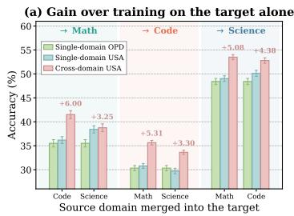

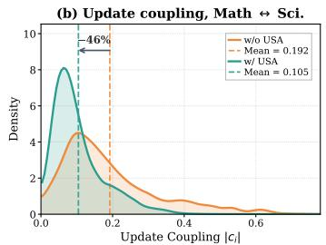

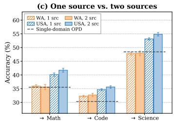  
Figure 3: Where the gain of USA comes from, and what happens when a second source is added. (a) Each transfer direction under three training configurations, separating the gain of updateaware training on the target from that of merging a source. (b) Per-parameter update coupling |ci| of Figure 1(d) on Math ↔ Science, for experts trained by plain OPD and by USA. (c) Both remaining domains merged into the target, against the single-source results of Table 1; Appendix G.1 examines more. Error bars in (a) and (c) are standard deviations over five runs.

• Obs 8: USA leaves the two domains contending for markedly fewer parameters. Training the conflicting pair with USA reduces the mean update coupling by 46%. Both curves are densities over the same support and enclose equal area, so the shift is not one being flatter: mass moves from the coupled region towards zero, and the right tail formed by parameters both domains move comparably is the part that thins, where the injection term of Eq. (6) contributes least.

## 4.5 SCALABILITY TO MORE SOURCE DOMAINS

Figure 3(c) merges both remaining domains into the target instead of one. Fixing the target leaves exactly one choice of sources, so the three domains admit three such configurations, each compared against the single-source result for the same target averaged over the two directions of Table 1. USA and Weight Average again differ only in how the experts were trained.

• Obs 9: a second source adds to the gain under USA and does not under plain merging. USA improves on its single-source result on all three targets and stays above the target-only reference throughout, whereas Weight Average moves by less than the seed variation on two targets and falls below its own single-source result on Math. Additional cross-domain knowledge is thus available to be exploited rather than merely tolerated, once training has suppressed the interference.

Further experiments. Four further studies are deferred to Appendix G for space: merging a target with up to five source domains (Appendix G.1), sweeping the amplification cap α of Eq. (9) and the base perturbation radius ρ of Eq. (10) (Appendix G.2), replacing the merging operator with TIES, DARE and AdaMerging (Appendix G.3), and repeating the comparison in a retrieval-based search-agent environment (Appendix G.4), in all of which USA stays strongest.

## 5 RELATED WORK

On-policy Distillation. On-policy distillation (Song & Zheng, 2026; Gu et al., 2024; Agarwal et al., 2024) supervises the student token by token on its own trajectories, removing the distribution mismatch of offline distillation, and has been extended to self-supervised, sparse-reward, and multiturn agentic settings (Zhao et al., 2026; Li et al., 2026a; Zhong et al., 2026). Each run is nonetheless optimised alone, so nothing in its objective anticipates coexistence with another domain’s weights.

Model Merging. Merging (Yang et al., 2026b) combines parameters instead of outputs, which works because checkpoints from a common initialisation share a low-loss region (Frankle et al., 2020), and task arithmetic (Ilharco et al., 2022) turns training displacement into a vector that can be scaled and summed. Since these overlap, operators reduce interference before summing (Yadav et al.,

2023; Yu et al., 2024; Yang et al., 2024). All act once the experts exist, rearranging vectors formed without regard for the merge, whereas USA shapes them during training; see Appendix B.

## 6 CONCLUSION

Merging independently distilled agentic experts helps on some domain pairs and harms others, and the harm is decided by the parameters both domains update comparably, before any operator is applied. USA therefore allocates the flatness budget of sharpness-aware training by update magnitude, so the parameters carrying most of a merge’s displacement are trained to tolerate it. It attains the best result in every transfer direction we test and turns negative transfer into a gain.

## REFERENCES

Rishabh Agarwal, Nino Vieillard, Yongchao Zhou, Piotr Stanczyk, Sabela Ramos Garea, Matthieu Geist, and Olivier Bachem. On-policy distillation of language models: Learning from selfgenerated mistakes. In The twelfth international conference on learning representations, 2024.

Walid Bousselham, Hilde Kuehne, and Cordelia Schmid. Vold: Reasoning transfer from llms to vision-language models via on-policy distillation. arXiv preprint arXiv:2510.23497, 2025.

Yuchen Cai, Ding Cao, Liang Lin, Chunxi Luo, Xin Xu, Kai Yang, Weijie Liu, Saiyong Yang, Tianxiang Zhao, Guangzhong Sun, et al. Learning to foresee: Unveiling the unlocking efficiency of on-policy distillation. arXiv preprint arXiv:2605.11739, 2026.

Xiwen Chen, Jingjing Wang, Wenhui Zhu, Peijie Qiu, Xuanzhao Dong, Hejian Sang, Zhipeng Wang, Alborz Geramifard, and Feng Luo. Soda: Semi on-policy black-box distillation for large language models. arXiv preprint arXiv:2604.03873, 2026.

Zhiyu Chen, Wenhu Chen, Charese Smiley, Sameena Shah, Iana Borova, Dylan Langdon, Reema Moussa, Matt Beane, Ting-Hao Huang, Bryan R Routledge, et al. Finqa: A dataset of numerical reasoning over financial data. In Proceedings of the 2021 Conference on Empirical Methods in Natural Language Processing, pp. 3697–3711, 2021.

Jasper Dekoninck, Nikola Jovanovic, Tim Gehrunger, Kári Rögnvaldsson, Ivo Petrov, Chenhao Sun,´ and Martin Vechev. Beyond benchmarks: Matharena as an evaluation platform for mathematics with llms. arXiv preprint arXiv:2605.00674, 2026.

Guanting Dong, Hongyi Yuan, Keming Lu, Chengpeng Li, Mingfeng Xue, Dayiheng Liu, Wei Wang, Zheng Yuan, Chang Zhou, and Jingren Zhou. How abilities in large language models are affected by supervised fine-tuning data composition. In Proceedings of the 62nd Annual Meeting of the Association for Computational Linguistics (Volume 1: Long Papers), pp. 177–198, 2024.

Xibin Dong, Zhiwen Yu, Wenming Cao, Yifan Shi, and Qianli Ma. A survey on ensemble learning. Frontiers ofComputer Science, 14(2):241–258, 2020.

Run-Ze Fan, Zengzhi Wang, and Pengfei Liu. Megascience: Pushing the frontiers of post-training datasets for science reasoning. arXiv preprint arXiv:2507.16812, 2025.

Jiazhan Feng, Shijue Huang, Xingwei Qu, Ge Zhang, Yujia Qin, Baoquan Zhong, Chengquan Jiang, Jinxin Chi, and Wanjun Zhong. Retool: Reinforcement learning for strategic tool use in llms. arXiv preprint arXiv:2504.11536, 2025.

Pierre Foret, Ariel Kleiner, Hossein Mobahi, and Behnam Neyshabur. Sharpness-aware minimization for efficiently improving generalization. arXiv preprint arXiv:2010.01412, 2020.

Jonathan Frankle, Gintare Karolina Dziugaite, Daniel Roy, and Michael Carbin. Linear mode connectivity and the lottery ticket hypothesis. In International conference on machine learning, pp. 3259–3269. PMLR, 2020.

Antonio Andrea Gargiulo, Donato Crisostomi, Maria Sofia Bucarelli, Simone Scardapane, Fabrizio Silvestri, and Emanuele Rodola. Task singular vectors: Reducing task interference in model merging. In 2025 IEEE/CVF Conference on Computer Vision and Pattern Recognition (CVPR), pp. 18695–18705. IEEE, 2025.

Timur Garipov, Pavel Izmailov, Dmitrii Podoprikhin, Dmitry P Vetrov, and Andrew G Wilson. Loss surfaces, mode connectivity, and fast ensembling of dnns. Advances in neural information processing systems, 31, 2018.

Yuxian Gu, Li Dong, Furu Wei, and Minlie Huang. Minillm: Knowledge distillation of large language models. In The twelfth international conference on learning representations, 2024.

Jujie He, Jiacai Liu, Chris Yuhao Liu, Rui Yan, Chaojie Wang, Peng Cheng, Xiaoyu Zhang, Fuxiang Zhang, Jiacheng Xu, Wei Shen, et al. Skywork open reasoner 1 technical report. arXiv preprint arXiv:2505.22312, 2025.

Yinghui He, Simran Kaur, Adithya Bhaskar, Yongjin Yang, Jiarui Liu, Narutatsu Ri, Liam Fowl, Abhishek Panigrahi, Danqi Chen, and Sanjeev Arora. Self-distillation zero: Self-revision turns binary rewards into dense supervision. arXiv preprint arXiv:2604.12002, 2026.

Jonas Hübotter, Frederike Lübeck, Lejs Behric, Anton Baumann, Marco Bagatella, Daniel Marta, Ido Hakimi, Idan Shenfeld, Thomas Kleine Buening, Carlos Guestrin, et al. Reinforcement learning via self-distillation. arXiv preprint arXiv:2601.20802, 2026.

Gabriel Ilharco, Marco Tulio Ribeiro, Mitchell Wortsman, Suchin Gururangan, Ludwig Schmidt, Hannaneh Hajishirzi, and Ali Farhadi. Editing models with task arithmetic. arXiv preprint arXiv:2212.04089, 2022.

Naman Jain, Alex Gu, Wen-Ding Li, Fanjia Yan, Tianjun Zhang, Sida Wang, Armando Solar-Lezama, Koushik Sen, and Ion Stoica. Livecodebench: Holistic and contamination free evaluation of large language models for code. In International Conference on Learning Representations, volume 2025, pp. 58791–58831, 2025.

Huwei Ji, Jiajie Su, Yuyuan Li, Xiaohua Feng, and Chaochao Chen. Sharpness-aware model merging with salience recovery for llm-based cross-domain sequential recommendation. In Proceedings of the 32nd ACM SIGKDD Conference on Knowledge Discovery and Data Mining V. 2, pp. 2038–2049, 2026.

Bowen Jin, Hansi Zeng, Zhenrui Yue, Jinsung Yoon, Sercan Arik, Dong Wang, Hamed Zamani, and Jiawei Han. Search-r1: Training llms to reason and leverage search engines with reinforcement learning. arXiv preprint arXiv:2503.09516, 2025.

Tom Kwiatkowski, Jennimaria Palomaki, Olivia Redfield, Michael Collins, Ankur Parikh, Chris Alberti, Danielle Epstein, Illia Polosukhin, Jacob Devlin, Kenton Lee, et al. Natural questions: a benchmark for question answering research. Transactions ofthe Associationfor Computational Linguistics, 7:453–466, 2019.

Gengsheng Li, Tianyu Yang, Junfeng Fang, Mingyang Song, Mao Zheng, Haiyun Guo, Dan Zhang, Jinqiao Wang, and Tat-Seng Chua. Unifying group-relative and self-distillation policy optimization via sample routing. arXiv preprint arXiv:2604.02288, 2026a.

Xuefeng Li, Haoyang Zou, and Pengfei Liu. Torl: Scaling tool-integrated rl. arXiv preprint arXiv:2503.23383, 2025.

Yaxuan Li, Yuxin Zuo, Bingxiang He, Jinqian Zhang, Chaojun Xiao, Cheng Qian, Tianyu Yu, Huanang Gao, Wenkai Yang, Zhiyuan Liu, et al. Rethinking on-policy distillation of large language models: Phenomenology, mechanism, and recipe. arXiv preprint arXiv:2604.13016, 2026b.

Wenhan Ma, Jianyu Wei, Liang Zhao, Hailin Zhang, Bangjun Xiao, Lei Li, Qibin Yang, Bofei Gao, Yudong Wang, Rang Li, et al. Mopd: Multi-teacher on-policy distillation for capability integration in llm post-training. arXiv preprint arXiv:2606.30406, 2026.

Alex Mallen, Akari Asai, Victor Zhong, Rajarshi Das, Daniel Khashabi, and Hannaneh Hajishirzi. When not to trust language models: Investigating effectiveness of parametric and non-parametric memories. In Proceedings of the 61st annual meeting of the association for computational linguistics (volume 1: Long papers), pp. 9802–9822, 2023.

MZ Naser, Ahmad Bani Awwad, Zoie McCreery, Radwa Eissa, Ahmad Naser, Gianluca Cusatis, Andrew Metcalf, Kapil Madathil, Jamal Abdalla, Venkatesh Kodur, et al. Engineering reasoning and instruction (eri) benchmark: A large taxonomy-driven dataset for foundation models and agents. arXiv preprint arXiv:2603.02239, 2026.

Emiliano Penaloza, Dheeraj Vattikonda, Nicolas Gontier, Alexandre Lacoste, Laurent Charlin, and Massimo Caccia. Privileged information distillation for language models. arXiv preprint arXiv:2602.04942, 2026.

Shuofei Qiao, Yanqiu Zhao, Zhisong Qiu, Xiaobin Wang, Jintian Zhang, Zhao Bin, Ningyu Zhang, Yong Jiang, Pengjun Xie, Fei Huang, et al. Scaling generalist data-analytic agents. In International Conference on Learning Representations, volume 2026, pp. 14942–14971, 2026.

David Rein, Betty Li Hou, Asa Cooper Stickland, Jackson Petty, Richard Yuanzhe Pang, Julien Dirani, Julian Michael, and Samuel R Bowman. Gpqa: A graduate-level google-proof q&a benchmark. arXiv preprint arXiv:2311.12022, 2023.

Timo Schick, Jane Dwivedi-Yu, Roberto Dessì, Roberta Raileanu, Maria Lomeli, Eric Hambro, Luke Zettlemoyer, Nicola Cancedda, and Thomas Scialom. Toolformer: Language models can teach themselves to use tools. In NeurIPS, 2023.

Zhihong Shao, Peiyi Wang, Qihao Zhu, Runxin Xu, Junxiao Song, Xiao Bi, Haowei Zhang, Mingchuan Zhang, YK Li, Yang Wu, et al. Deepseekmath: Pushing the limits of mathematical reasoning in open language models. arXiv preprint arXiv:2402.03300, 2024.

Zhennan Shen, Yanshu Li, Qingyu Yin, Chak Tou Leong, Zhilin Wang, Yanxu Chen, Rongduo Han, Sunbowen Lee, and Yi R Fung. On the geometry of on-policy distillation. arXiv preprint arXiv:2606.07082, 2026.

Idan Shenfeld, Mehul Damani, Jonas Hübotter, and Pulkit Agrawal. Self-distillation enables continual learning. arXiv preprint arXiv:2601.19897, 2026.

Guangming Sheng, Chi Zhang, Zilingfeng Ye, Xibin Wu, Wang Zhang, Ru Zhang, Yanghua Peng, Haibin Lin, and Chuan Wu. Hybridflow: A flexible and efficient rlhf framework. In Proceedings of the Twentieth European Conference on Computer Systems, pp. 1279–1297, 2025.

Mingyang Song and Mao Zheng. A survey of on-policy distillation for large language models. arXiv preprint arXiv:2604.00626, 2026.

Wenju Sun, Qingyong Li, Yangli-ao Geng, and Boyang Li. Cat merging: A training-free approach for resolving conflicts in model merging. arXiv preprint arXiv:2505.06977, 2025.

Joachim Utans. Weight averaging for neural networks and local resampling schemes. In Proc. AAAI-96 Workshop on Integrating Multiple Learned Models. AAAI Press, pp. 133–138. Citeseer, 1996.

Bing Wang, Ximing Li, Changchun Li, Jinjin Chi, Gang Niu, and Masashi Sugiyama. Decomposing the basic abilities of large language models: Mitigating cross-task interference in multi-task instruct-tuning. arXiv preprint arXiv:2605.05676, 2026a.

Hao Wang, Guozhi Wang, Han Xiao, Yufeng Zhou, Yue Pan, Jichao Wang, Ke Xu, Yafei Wen, Xiaohu Ruan, Xiaoxin Chen, et al. Skill-sd: Skill-conditioned self-distillation for multi-turn llm agents. arXiv preprint arXiv:2604.10674, 2026b.

Liang Wang, Nan Yang, Xiaolong Huang, Binxing Jiao, Linjun Yang, Daxin Jiang, Rangan Majumder, and Furu Wei. Text embeddings by weakly-supervised contrastive pre-training. arXiv preprint arXiv:2212.03533, 2022.

Xiaoxuan Wang, Ziniu Hu, Pan Lu, Yanqiao Zhu, Jieyu Zhang, Satyen Subramaniam, Arjun R Loomba, Shichang Zhang, Yizhou Sun, and Wei Wang. Scibench: Evaluating college-level scientific problem-solving abilities of large language models. arXiv preprint arXiv:2307.10635, 2023.

Yinjie Wang, Xuyang Chen, Xiaolong Jin, Mengdi Wang, and Ling Yang. Openclaw-rl: Train any agent simply by talking. arXiv preprint arXiv:2603.10165, 2026c.

Yuanyi Wang, Yanggan Gu, Yiming Zhang, Qi Zhou, Zhaoyi Yan, Congkai Xie, Xinyao Wang, Jianbo Yuan, and Hongxia Yang. Model merging scaling laws in large language models. arXiv preprint arXiv:2509.24244, 2025.

Mitchell Wortsman, Gabriel Ilharco, Samir Ya Gadre, Rebecca Roelofs, Raphael Gontijo-Lopes, Ari S Morcos, Hongseok Namkoong, Ali Farhadi, Yair Carmon, Simon Kornblith, et al. Model soups: averaging weights of multiple fine-tuned models improves accuracy without increasing inference time. In International conference on machine learning, pp. 23965–23998. Pmlr, 2022.

Zhiheng Xi, Wenxiang Chen, Xin Guo, Wei He, Yiwen Ding, Boyang Hong, Ming Zhang, Junzhe Wang, Senjie Jin, Enyu Zhou, et al. The rise and potential of large language model based agents: A survey. arXiv preprint arXiv:2309.07864, 2023.

Yuanda Xu, Hejian Sang, Zhengze Zhou, Ran He, Zhipeng Wang, and Alborz Geramifard. Tip: Token importance in on-policy distillation. arXiv preprint arXiv:2604.14084, 2026.

Zhenghai Xue, Longtao Zheng, Qian Liu, Yingru Li, Xiaosen Zheng, Zejun Ma, and Bo An. Simpletir: End-to-end reinforcement learning for multi-turn tool-integrated reasoning. arXiv preprint arXiv:2509.02479, 2025.

Prateek Yadav, Derek Tam, Leshem Choshen, Colin A Raffel, and Mohit Bansal. Ties-merging: Resolving interference when merging models. Advances in neural information processing systems, 36:7093–7115, 2023.

An Yang, Anfeng Li, Baosong Yang, Beichen Zhang, Binyuan Hui, Bo Zheng, Bowen Yu, Chang Gao, Chengen Huang, Chenxu Lv, et al. Qwen3 technical report. arXiv preprint arXiv:2505.09388, 2025.

Chenxu Yang, Chuanyu Qin, Qingyi Si, Minghui Chen, Naibin Gu, Dingyu Yao, Zheng Lin, Weiping Wang, Jiaqi Wang, and Nan Duan. Self-distilled rlvr. arXiv preprint arXiv:2604.03128, 2026a.

Enneng Yang, Zhenyi Wang, Li Shen, Shiwei Liu, Guibing Guo, Xingwei Wang, and Dacheng Tao. Adamerging: Adaptive model merging for multi-task learning. In International Conference on Learning Representations, volume 2024, pp. 22743–22763, 2024.

Enneng Yang, Li Shen, Guibing Guo, Xingwei Wang, Xiaochun Cao, Jie Zhang, and Dacheng Tao. Model merging in llms, mllms, and beyond: Methods, theories, applications, and opportunities. ACM Computing Surveys, 58(8):1–41, 2026b.

Wenkai Yang, Weijie Liu, Ruobing Xie, Kai Yang, Saiyong Yang, and Yankai Lin. Learning beyond teacher: Generalized on-policy distillation with reward extrapolation. arXiv preprint arXiv:2602.12125, 2026c.

Zhilin Yang, Peng Qi, Saizheng Zhang, Yoshua Bengio, William Cohen, Ruslan Salakhutdinov, and Christopher D Manning. Hotpotqa: A dataset for diverse, explainable multi-hop question answering. In Proceedings of the 2018 conference on empirical methods in natural language processing, pp. 2369–2380, 2018.

Shunyu Yao, Jeffrey Zhao, Dian Yu, Nan Du, Izhak Shafran, Karthik R. Narasimhan, and Yuan Cao. React: Synergizing reasoning and acting in language models. In ICLR, 2023.

Tianzhu Ye, Li Dong, Zewen Chi, Xun Wu, Shaohan Huang, and Furu Wei. Black-box on-policy distillation of large language models. arXiv preprint arXiv:2511.10643, 2025.

Tianzhu Ye, Li Dong, Xun Wu, Shaohan Huang, and Furu Wei. On-policy context distillation for language models. arXiv preprint arXiv:2602.12275, 2026.

Guo Yu, Wenlin Liu, Yulan Hu, Hao-Xuan Ma, Jun-Peng Jiang, and Han-Jia Ye. Dense supervision, sparse updates: On the sparsity and geometry of on-policy distillation. arXiv preprint arXiv:2606.13657, 2026a.

Linyan Yu, Bowen Yu, Haiyang Yu, Fei Huang, and Yongbin Li. Language models are super mario: Absorbing abilities from homologous models as a free lunch. In Icml, volume 2, pp. 21, 2024.

Qiying Yu, Zheng Zhang, Ruofei Zhu, Yufeng Yuan, Xiaochen Zuo, Yu Yue, Weinan Dai, Tiantian Fan, Gaohong Liu, Lingjun Liu, et al. Dapo: An open-source llm reinforcement learning system at scale. Advances in Neural Information Processing Systems, 38:113222–113244, 2026b.

Tianhe Yu, Saurabh Kumar, Abhishek Gupta, Sergey Levine, Karol Hausman, and Chelsea Finn. Gradient surgery for multi-task learning. Advances in neural information processing systems, 33: 5824–5836, 2020.

Jinghan Zhang, Junteng Liu, Junxian He, et al. Composing parameter-efficient modules with arithmetic operation. Advances in Neural Information Processing Systems, 36:12589–12610, 2023.

Shudan Zhang, Hanlin Zhao, Xiao Liu, Qinkai Zheng, Zehan Qi, Xiaotao Gu, Yuxiao Dong, and Jie Tang. Naturalcodebench: Examining coding performance mismatch on humaneval and natural user queries. In Findings of the Association for Computational Linguistics: ACL 2024, pp. 7907–7928, 2024.

Siyan Zhao, Zhihui Xie, Mengchen Liu, Jing Huang, Guan Pang, Feiyu Chen, and Aditya Grover. Self-distilled reasoner: On-policy self-distillation for large language models. arXiv preprint arXiv:2601.18734, 2026.

Binbin Zheng, Xing Ma, Yiheng Liang, Jingqing Ruan, Xiaoliang Fu, Kepeng Lin, Benchang Zhu, Ke Zeng, and Xunliang Cai. Scope: Signal-calibrated on-policy distillation enhancement with dual-path adaptive weighting. arXiv preprint arXiv:2604.10688, 2026.

Qiyong Zhong, Mao Zheng, Mingyang Song, Xin Lin, Jie Sun, Houcheng Jiang, Xiang Wang, and Junfeng Fang. Sod: Step-wise on-policy distillation for small language model agents. arXiv preprint arXiv:2605.07725, 2026.

Wenhong Zhu, Ruobing Xie, Rui Wang, and Pengfei Liu. Hybrid policy distillation for llms. arXiv preprint arXiv:2604.20244, 2026.

## APPENDIX

## A LIMITATIONS

Two aspects of our experimental scope are worth stating. Every model belongs to the Qwen3 family, which we chose because it is openly released, stable, published at many sizes and widely enough used for our numbers to be placed against existing ones, so that the comparison across ten baselines stays fair; a change of backbone is left to future work. The teachers of our main experiments are moreover all 14B models and we vary the student instead, since holding the teacher scale fixed keeps each result differing from the others in the student alone, and how the teacher scale interacts with the effect reported here is likewise left to future work.

## B RELATED WORK

Section 5 introduces the two lines of work this paper builds on and states the limitation of each one that motivates USA: on-policy distillation optimises every domain in isolation and never anticipates that its weights will later be merged, while merging operators act only once the experts already exist and therefore cannot change how their task vectors were formed. This appendix gives the full account of both lines of work.

## B.1 ON-POLICY DISTILLATION.

On-policy distillation (Song & Zheng, 2026; Ye et al., 2026; 2025; Zhu et al., 2026; Zheng et al., 2026; Xu et al., 2026; Chen et al., 2026) supervises the student at the token level along trajectories the student itself produces, which removes the distribution mismatch that makes offline distillation degrade once the student drifts away from the teacher’s data. Gu et al. (2024) casts the problem as reverse KL minimisation under the student distribution, and Agarwal et al. (2024) places on-policy and off-policy training in a single family indexed by the divergence being minimised. Later analyses characterise what the objective actually transfers: Yang et al. (2026c) reads it as KL-regularised reinforcement learning whose per-token rewards are supplied implicitly by the teacher, while Li et al. (2026b) finds that the gain comes from aligning the student on the states it visits, so that how much transfers depends on how compatible the two reasoning styles are.

The same machinery has been turned inward, with the student supervising itself when no stronger teacher is available (Zhao et al., 2026; Penaloza et al., 2026; Hübotter et al., 2026; Shenfeld et al., 2026; He et al., 2026), and outward, as a way of supplying the dense signal that sparse-reward reinforcement learning lacks (Li et al., 2026a; Yang et al., 2026a; Bousselham et al., 2025; Wang et al., 2026c;b). The setting has also been extended from single-turn responses to the multi-turn agents that this paper studies, where the student interleaves reasoning with tool calls and is supervised step by step along trajectories whose environment observations it did not itself produce (Zhong et al., 2026). What this line of work has in common is that each run is considered on its own: the objective is defined for a single teacher and a single domain, and nothing in it anticipates that the resulting weights will later have to coexist with those of another domain.

## B.2 MODEL MERGING.

Combining several specialised models by averaging their predictions (Dong et al., 2020) multiplies inference cost and does not carry over to language models, whose generated text admits no meaningful average. Model merging (Yang et al., 2026b) avoids both problems by combining the parameters instead of the outputs, and it is workable because checkpoints fine-tuned from a common initialisation tend to lie in a connected low-loss region (Utans, 1996; Garipov et al., 2018; Frankle et al., 2020), so interpolating between them need not destroy what either has learned. Averaging the corresponding weights is already effective on its own (Wortsman et al., 2022), and task arithmetic (Ilharco et al., 2022; Zhang et al., 2023) sharpens this into an algebra by treating the displacement a model undergoes during fine-tuning as a vector that can be scaled, added, or subtracted to compose and remove capabilities.

Because these vectors overlap, subsequent operators reduce the resulting interference before summing (Ji et al., 2026), by trimming low-magnitude entries and reconciling conflicting signs (Yadav et al., 2023), by dropping and rescaling a large random fraction of the entries (Yu et al., 2024), or by learning the coefficients on unlabelled test data (Yang et al., 2024). More recent operators refine what a conflict is taken to be: Gargiulo et al. (2025) argues that treating a task vector as a flat list of coordinates discards the structure of the network and measures interference between layerwise singular directions instead, while Sun et al. (2025) removes the conflicting components of each vector before summing, projecting them out of linear weights and masking them in normalisation parameters. The returns are nonetheless bounded: Wang et al. (2025) reports that the benefit of adding experts decays as their number grows, so most of what merging can deliver is already delivered by the first few. All of these operators, however, are applied after the experts exist and can only rearrange task vectors that were produced without any regard for the merge; USA intervenes earlier, shaping those vectors while each expert is still being trained.

## C ANALYSIS OF THE MERGING INTERFERENCE

This appendix supplies the material that Section 3.2 defers. We derive the interference that merging inflicts on a domain and prove the bound of Proposition 1 (Appendix C.1), show that the training objective of USA controls exactly the curvature factor of that bound (Appendix C.3), and characterize when redistributing the perturbation budget according to the update magnitudes tightens the estimate (Appendix C.4). We are explicit throughout about which steps are exact and which are assumptions.

## C.1 SETUP AND PROOF OF THE INTERFERENCE BOUND.

Let $D _ { t }$ be the target domain. By Eq. (5), merging evaluates $D _ { t }$ at $\theta _ { t } + \delta _ { t }$ rather than at its own solution $\theta _ { t } .$ , so the merging interference of Section 3.2 is the excess loss

$$
\Xi _ { t } = \mathcal { L } _ { t } ( \theta _ { t } + \delta _ { t } ) - \mathcal { L } _ { t } ( \theta _ { t } ) ,\tag{13}
$$

and a positive $\Xi _ { t }$ means the merged point sits higher on the loss surface of $D _ { t }$ than the model $D _ { t }$ had trained on its own, which is the local surrogate through which we analyse the accuracy degradation of Figure 1(b).

Expanding $\mathcal { L } _ { t }$ around $\theta _ { t }$ to second order,

$$
\begin{array} { r } { \Xi _ { t } = \nabla _ { \theta } \mathcal { L } _ { t } ( \theta _ { t } ) ^ { \top } \delta _ { t } + \frac { 1 } { 2 } \delta _ { t } ^ { \top } H _ { t } \delta _ { t } + \mathcal { O } \big ( \| \delta _ { t } \| _ { 2 } ^ { 3 } \big ) , \qquad H _ { t } = \nabla _ { \theta } ^ { 2 } \mathcal { L } _ { t } ( \theta _ { t } ) . } \end{array}\tag{14}
$$

Independent training drives $D _ { t }$ to a local minimizer of its own objective, so $\nabla _ { \boldsymbol { \theta } } \mathcal { L } _ { t } ( { \boldsymbol { \theta } } _ { t } ) \approx 0$ and the linear term drops out, leaving the curvature term as the leading contribution:

$$
\begin{array} { r } { \Xi _ { t } \approx \frac { 1 } { 2 } \delta _ { t } ^ { \top } H _ { t } \delta _ { t } . } \end{array}\tag{15}
$$

Being a quadratic form, Eq. (15) grows both when the displacement is large and when the loss surface is sharply curved along the direction in which the displacement points.

ProofofProposition 1. Put $u \ = \ S ^ { - 1 } \delta _ { t }$ , so that $\delta _ { t } ~ = ~ S u$ and, since $S$ is diagonal and hence symmetric, $\overline { { { \delta } } } _ { t } ^ { \top } H _ { t } \delta _ { t } \ : = \ : u ^ { \top } ( S H _ { t } S ) u$ . Because $\theta _ { t }$ is a local minimizer we have $H _ { t } \ \succeq \ 0 .$ , hence $\dot { S } H _ { t } S \succeq 0$ and the quadratic form is non-negative, so the Rayleigh quotient gives $0 \leq u ^ { \top } ( \overline { { S } } H _ { t } S ) u \leq$ $\lambda _ { \operatorname* { m a x } } ( S H _ { t } S ) \| u \| _ { 2 } ^ { 2 }$ , where $\lambda _ { \operatorname* { m a x } } ( \cdot )$ is the largest eigenvalue. The local Lipschitz continuity of the Hessian makes the remainder in Eq. (14) cubic, and substituting $\| u \| _ { 2 } = \| \dot { S } ^ { - 1 } \delta _ { t } \| _ { 2 }$ into Eq. (15) and taking absolute values yields Eq. (12). □

Two special cases are worth recording. Setting $S = I$ makes the change of variables the identity and recovers $\begin{array} { r } { | \Xi _ { t } | \leq \frac { 1 } { 2 } \lambda _ { \operatorname* { m a x } } ( H _ { t } ) \| \delta _ { t } \| _ { 2 } ^ { 2 } + \mathcal { O } ( \| \delta _ { t } \| _ { 2 } ^ { 3 } ) } \end{array}$ , the isotropic estimate that the standard sharpness analyses of model merging state. Replacing S by cS for any $c > 0$ multiplies $\lambda _ { \operatorname* { m a x } } ( S H _ { t } S )$ by $c ^ { 2 }$ and divides $\| S ^ { - 1 } \delta _ { t } \| _ { 2 } ^ { 2 } \operatorname { b y } c ^ { 2 }$ , so the right-hand side of Eq. (12) is scale invariant and only the relative profile of S across coordinates can affect it.

## C.2 DERIVATION OF THE CLOSED-FORM PERTURBATION.

This subsection fills in the steps that the main text (from Eq. (10) to Eq. (11)) compresses into one sentence. Everything below is a first-order argument analogous to the one in the original SAM paper (Foret et al., 2020), the only difference being that the isotropic ball $\| \epsilon \| _ { 2 } \le \rho$ is replaced by the ellipsoid $\| S _ { k } ^ { - 1 } \epsilon \| _ { 2 } \le \rho .$

Starting point. Each domain k solves the min-max objective of Eq. (10), reproduced here for convenience:

$$
\operatorname* { m i n } _ { \theta } \operatorname* { m a x } _ { \| S _ { k } ^ { - 1 } \epsilon \| _ { 2 } \le \rho } \mathcal { L } _ { k } ( \theta + \epsilon ) .\tag{10}
$$

The inner maximization asks for the worst-case perturbation within the ellipsoid, and the outer minimization then drives the parameters towards a region where that worst case is mild.

Step 1: first-order approximation of the inner problem. Expand $\mathcal { L } _ { k } ( \theta + \epsilon )$ to first order about θ:

$$
\mathcal { L } _ { k } ( \boldsymbol { \theta } + \epsilon ) \approx \mathcal { L } _ { k } ( \boldsymbol { \theta } ) + \epsilon ^ { \top } \nabla _ { \boldsymbol { \theta } } \mathcal { L } _ { k } ( \boldsymbol { \theta } ) .\tag{16}
$$

Because ${ \mathcal { L } } _ { k } ( \theta )$ does not depend on ϵ, the inner maximization reduces to

$$
\hat { \boldsymbol { \epsilon } } _ { k } = \arg \operatorname* { m a x } _ { \| \boldsymbol { S } _ { k } ^ { - 1 } \boldsymbol { \epsilon } \| _ { 2 } \leq \rho } \boldsymbol { \epsilon } ^ { \top } \nabla _ { \boldsymbol { \theta } } \mathcal { L } _ { k } ( \boldsymbol { \theta } ) .\tag{17}
$$

Step 2: change of variables. The diagonal matrix $S _ { k } = \mathrm { d i a g } ( s _ { k } )$ has entries $s _ { k } ( i ) \geq 1 > 0$ , so it is invertible. Setting $\epsilon = S _ { k } v .$ , the constraint becomes $\| S _ { k } ^ { - 1 } S _ { k } v \| _ { 2 } = \| v \| _ { 2 } \leq \rho ,$ and the objective becomes

$$
\operatorname* { m a x } _ { \| v \| _ { 2 } \leq \rho } v ^ { \top } S _ { k } \nabla _ { \theta } \mathcal { L } _ { k } ( \theta ) ,\tag{18}
$$

which is the maximization of a linear function over an isotropic ball.

Step 3: closed-form solution via Cauchy–Schwarz. By the Cauchy–Schwarz inequality, $v ^ { \top } ( S _ { k } \nabla _ { \theta } \mathcal { L } _ { k } ( \theta ) ) \leq \| v \| _ { 2 } \cdot \| S _ { k } \nabla _ { \theta } \mathcal { L } _ { k } ( \theta ) \| _ { 2 }$ , with equality when v is parallel to $S _ { k } \nabla _ { \theta } \mathcal { L } _ { k } ( \bar { \theta } )$ and $\| v \| _ { 2 } = \rho \colon$

$$
v ^ { \star } = \rho \frac { S _ { k } \nabla _ { \theta } \mathcal { L } _ { k } ( \theta ) } { \| S _ { k } \nabla _ { \theta } \mathcal { L } _ { k } ( \theta ) \| _ { 2 } } .\tag{19}
$$

Mapping back through $\hat { \epsilon } _ { k } = S _ { k } v ^ { \star }$

$$
\hat { \epsilon } _ { k } = \rho \frac { S _ { k } ^ { 2 } \nabla _ { \theta } \mathcal { L } _ { k } ( \theta ) } { \| S _ { k } \nabla _ { \theta } \mathcal { L } _ { k } ( \theta ) \| } ,\tag{11}
$$

which is Eq. (11) of the main text.

Special case: isotropic SAM. When $\alpha = 1$ , we have $S _ { k } ~ = ~ I$ and Eq. (11) reduces to $\hat { \epsilon } = $ $\rho \mathrm { \bar { V } } _ { \theta } \mathcal { L } _ { k } ( \theta ) / \| \nabla _ { \theta } \mathcal { L } _ { k } ( \bar { \theta ) } \|$ , which is the standard SAM perturbation (Foret et al., 2020). The derivation above therefore specializes to the original one in the isotropic case, confirming that USA is a strict generalization.

Update rule. Given $\hat { \epsilon } _ { k } .$ , each step after the warm-up evaluates the gradient at the perturbed point $\theta + \hat { \epsilon } _ { k }$ and takes a descent step:

$$
\theta  \theta - \eta \nabla _ { \theta } \mathcal { L } _ { k } ( \theta + \hat { \epsilon } _ { k } ) ,\tag{20}
$$

where $\eta$ is the learning rate. The perturbation $\hat { \epsilon } _ { k }$ is never applied to the parameters; its sole role is to move the evaluation point for the gradient so that the descent step favours flat directions weighted by $S _ { k }$

## C.3 WHAT THE OBJECTIVE OF USA CONTROLS.

The next question is which quantity Eq. (10) actually minimizes. The answer holds to second order in $\rho$ and requires no assumption beyond the expansion itself.

Lemma 1 (Ellipsoidal sharpness). Let $\mathcal { L } _ { k }$ be twice differentiable at θ with a locally Lipschitz Hessian, let $H _ { k } = \nabla _ { \theta } ^ { 2 } \bar { \mathcal { L } } _ { k } ( \theta )$ , and suppose θ is a stationary local minimizer of $\mathcal { L } _ { k } ,$ , so that $\nabla _ { \theta } \mathcal { L } _ { k } ( \theta ) = 0$ and $H _ { k } \succeq 0 .$ . Then, to second order in $\rho ,$ the inner maximization of Eq. (10) satisfies

$$
\operatorname* { m a x } _ { \| S _ { k } ^ { - 1 } \epsilon \| _ { 2 } \leq \rho } \mathcal { L } _ { k } ( \theta + \epsilon ) - \mathcal { L } _ { k } ( \theta ) \ = \ \frac { 1 } { 2 } \rho ^ { 2 } \lambda _ { \operatorname* { m a x } } ( S _ { k } H _ { k } S _ { k } ) \ + \ \mathcal { O } ( \rho ^ { 3 } ) .\tag{21}
$$

Proof. Substitute $\epsilon = S _ { k } v$ . Since $S _ { k }$ is diagonal with strictly positive entries it is invertible, and the constraint $\| S _ { k } ^ { - 1 } \epsilon \| _ { 2 } \le \rho$ becomes $\| v \| _ { 2 } \leq \rho ,$ so the change of variables is a bijection between the two feasible sets. Expanding to second order and using stationarity,

$$
\begin{array} { r } { \mathcal { L } _ { k } ( { \boldsymbol { \theta } } + S _ { k } { \boldsymbol { v } } ) - \mathcal { L } _ { k } ( { \boldsymbol { \theta } } ) = \frac { 1 } { 2 } { \boldsymbol { v } } ^ { \top } \big ( S _ { k } ^ { \top } H _ { k } S _ { k } \big ) { \boldsymbol { v } } + { \mathcal O } ( \| { \boldsymbol { v } } \| _ { 2 } ^ { 3 } ) = \frac { 1 } { 2 } { \boldsymbol { v } } ^ { \top } ( S _ { k } H _ { k } S _ { k } ) { \boldsymbol { v } } + { \mathcal O } ( \| { \boldsymbol { v } } \| _ { 2 } ^ { 3 } ) , } \end{array}\tag{22}
$$

where $S _ { k } ^ { \top } = S _ { k }$ because $S _ { k }$ is diagonal. Maximizing the quadratic form over the ball $\| v \| _ { 2 } \leq \rho$ is a Rayleigh-quotient problem whose optimum is attained at $v = \rho u _ { \mathrm { m a x } } .$ , with $u _ { \mathrm { m a x } }$ a unit top eigenvector of $S _ { k } H _ { k } S _ { k }$ , giving ${ \scriptstyle \frac { 1 } { 2 } } \rho ^ { 2 } \lambda _ { \mathrm { m a x } } \mathbf { \bar { ( } } S _ { k } H _ { k } S _ { k } )$ , which is non-negative because $H _ { k } \succeq 0$ at a local minimizer and hence $S _ { k } H _ { k } S _ { k } \succeq 0$ . Collecting the remainder as $\mathcal { O } ( \rho ^ { 3 } )$ yields Eq. (21).

Two consequences are worth stating plainly. First, at $\alpha = 1$ we have $S _ { k } = I$ and Eq. (21) reduces to the familiar isotropic sharpness $\begin{array} { r } { \frac { 1 } { 2 } \rho ^ { 2 } \lambda _ { \operatorname* { m a x } } ( H _ { k } ) } \end{array}$ , so the objective of USA is a strict generalization. Second, and this is the point Section 3.2 appeals to, the quantity being suppressed is not the curvature $H _ { k }$ itself but the curvature as seen through $S _ { k }$ , which is the curvature factor of $\operatorname { E q . }$ . (12) evaluated at $S = S _ { k }$ . Enlarging $s _ { k } ( i )$ inflates the i-th row and column of $S _ { k } H _ { k } S _ { k }$ , so coordinate i contributes more to the eigenvalue being minimized and its curvature is driven down harder. The perturbation geometry is therefore the mechanism by which the flatness budget is allocated across coordinates.

## C.4 WHEN THE REWEIGHTING HELPS.

Eq. (12) is a family of upper bounds on the same quantity $\Xi _ { t }$ , so a smaller right-hand side does not by itself certify smaller interference and the choice of S has to be made deliberately. A two-dimensional example shows what is at stake. With $H _ { t } = I , \delta _ { t } = ( 1 , 0 ) ^ { \top }$ and $S = \mathrm { d i a g } ( a , \dot { b } )$ , the right-hand side of Eq. (12) equals max( $\mathring { a } ^ { 2 } , b ^ { 2 } ) / a ^ { 2 }$ , which exceeds the isotropic value 1 precisely when $b > a ,$ , in which case it is $b ^ { 2 } / a ^ { 2 }$ . The reason is visible in the two factors, since enlarging S along a coordinate that is not displaced buys nothing in the displacement factor while still inflating the curvature factor. What matters is therefore not that S is non-uniform but that its large entries sit on the coordinates where $| \delta _ { t } ( i ) |$ is large, which is precisely how Eq. (9) is built. The following makes this precise.

Proposition 2 (Condition for a tighter estimate). Let $S = \mathrm { d i a g } ( s )$ with $s ( i ) \geq 1$ for all $i ,$ write $\hat { H } =$ $S H _ { t } S ,$ and suppose the curvature factor is unchanged by the reweighting, $\lambda _ { \operatorname* { m a x } } ( \hat { H } ) = \lambda _ { \operatorname* { m a x } } ( H _ { t } )$ Then the estimate of Eq. (12) is at least as tight as the isotropic one, with equality only $i f s ( i ) = 1$ on every coordinate where $\delta _ { t } ( i ) \neq 0 .$ . In general, writing B for the quadratic leading term ofthe right-hand side ofEq. (12), that isfor $\begin{array} { r } { \frac { 1 } { 2 } \lambda _ { \operatorname* { m a x } } ^ { - } ( S H _ { t } S ) \| S ^ { - 1 } \delta _ { t } \| _ { 2 } ^ { 2 } } \end{array}$ with the cubic remainder excluded,

$$
\frac { B _ { S } } { B _ { I } } = \frac { \lambda _ { \operatorname* { m a x } } ( \hat { H } ) } { \lambda _ { \operatorname* { m a x } } ( H _ { t } ) } \cdot \frac { \sum _ { i } \delta _ { t } ( i ) ^ { 2 } / s ( i ) ^ { 2 } } { \sum _ { i } \delta _ { t } ( i ) ^ { 2 } } ,\tag{23}
$$

so the estimate improves precisely when the reduction of the second factor outweighs the growth of the first.

Proof. The first claim is immediate from Eq. (23): if the leading factor equals one, the second is a weighted average of $s ( i ) ^ { - 2 } \leq 1$ with weights $\delta _ { t } ( i ) ^ { 2 }$ , hence at most one, with equality only $\mathrm { i f } s ( i ) = 1$ whenever $\delta _ { t } ( i ) \neq 0$ . Eq. (23) itself follows by writing out both sides of Eq. (12) for S and for I and dividing, using $\begin{array} { r } { \| S ^ { - 1 } \delta _ { t } \| _ { 2 } ^ { 2 } = \sum _ { i } \delta _ { t } ( i ) ^ { 2 } / s ( i ) ^ { 2 } } \end{array}$ □

Eq. (23) is the statement we rely on, and it says something narrower than the claim that flatter is always better. The second factor is a $\delta _ { t } ^ { 2 }$ -weighted average of $s ( i ) ^ { - 2 }$ , so it is reduced by putting large $s ( i )$ where $\delta _ { t } ( i ) ^ { 2 }$ is large, whereas raising $s ( i )$ where $\delta _ { t } ( i ) ^ { 2 }$ ≈ 0 leaves that factor untouched and pays only the cost in the first one. Since Eq. (23) is a product, the second factor cannot be shrunk indefinitely, because pushing $s ( i )$ up eventually inflates $\lambda _ { \operatorname* { m a x } } ( \hat { H } )$ , and the budget can therefore only be redistributed across coordinates rather than uniformly reduced. This is the formal reason why the amplification in Eq. (9) is capped at α rather than left unbounded. The scale invariance in Proposition 1 says the same thing from another angle, because multiplying every $s ( i )$ by a constant leaves Eq. (12) untouched and only the relative profile of s can matter, which is precisely the property Section 3.1 exploits when it argues that the warm-up has to recover the relative profile of the update magnitudes rather than their eventual size.

## C.5 THE COUPLING CONDITION.

Eq. (23) asks for s to be large where $\lvert \delta _ { t } \rvert$ is large. Part of this is settled by Eq. (6) without any further hypothesis, because the shrinkage term $- ( 1 - \lambda _ { t } ) \Delta _ { t }$ is proportional to the target’s own task vector and is therefore largest precisely on the coordinates that Eq. (9) amplifies, so the profile $s _ { k }$ is aligned with at least that part of the displacement by construction. The injection term $\sum _ { j \neq t } \lambda _ { j } \Delta _ { j }$ is formed by the other domains and admits no such guarantee, and how much it contributes on those same coordinates is what distinguishes one domain pair from another. Figure 1(d) provides a proxy for this, and we state the condition explicitly.

Assumption 1 (Cross-domain update coupling). On the domain pairs of interest, the two terms of Eq. (6) are of comparable magnitude on the coordinates ranked highest by $m _ { t } \colon$ a non-negligible share of the mass of $| \textstyle \sum _ { j \neq t } \lambda _ { j } \Delta _ { j } ( \bar { i } )$  sits on those coordinates.

Figure 1(d) is empirical evidence consistent with Assumption 1, since it measures per parameter whether two domains update the same coordinates with comparable magnitude and shows the mass shifted away from zero exactly on the pairs where merging degrades performance. Two regimes follow. When the coupling is weak the injection term is negligible on the update-salient coordinates and the displacement there is dominated by the shrinkage term alone, which is the residual cost that weight averaging imposes on any domain. When the coupling is strong the two terms are comparable in magnitude and the largest displacement they can produce is correspondingly larger, so more interference is available to be removed and Eq. (23) admits a larger reduction. The assumption therefore does not decide whether Eq. (9) points at the right coordinates, which Eq. (6) already settles, but characterizes how much there is to be gained by protecting them.

## C.6 WHY THE COUPLING STATISTIC DOES NOT SEPARATE THE TWO SIGNED CASES.

Figure 1(d) reports $| c _ { i } | .$ , which is unchanged if either update is replaced by its negative, and this is a deliberate choice rather than an oversight. We first grant what the statistic does not do. Writing the merge with equal coefficients, the displacement imposed on the target at coordinate i is $\delta _ { t } ( i ) =$ $\begin{array} { r } { \frac { 1 } { 2 } ( \Delta _ { s } ( i ) - \Delta _ { t } ( i ) ) } \end{array}$ by Eq. (5), so the two extreme configurations at $| c _ { i } | \overset { \_ } { = } 1$ behave in opposite ways: when $\Delta _ { s } ( i ) = \Delta _ { t } ( i )$ the displacement vanishes, and when $\Delta _ { s } ( i ) \dot { = } - \Delta _ { t } ( i )$ it equals $\bar { | \Delta _ { t } ( i ) | }$ , the full size of the target’s own update. A large $\left| { c _ { i } } \right|$ therefore does not by itself imply a large realised displacement, and we do not claim that it does.

What $\left| { c _ { i } } \right|$ does control is the worst case over the signs, which is the quantity the construction actually needs. Holding the two updates’ sizes fixed and maximizing over the unknown signs gives max $\begin{array} { r } { | \dot { \delta \boldsymbol { t } } ( i ) | = \frac { 1 } { 2 } ( | \Delta _ { t } ( i ) | + | \Delta _ { s } ( i ) | ) } \end{array}$ , and at fixed $| \Delta _ { t } ( i ) |$ this bound increases with $\left| { c _ { i } } \right|$ , since a larger coupling means the second term is closer in size to the first. The neighbourhood of Eq. (10) is symmetric about the solution and asks a coordinate to tolerate a displacement of a given magnitude whichever way it points, so a bound that does not depend on the signs is precisely the right input to it, and a signed statistic would not be usable in any case: the scales of Eq. (9) are fixed during a domain’s own warm-up, when the other domain has not finished training and its signs do not yet exist.

There is also an empirical reason not to read the signs as the risk variable. On the pairs we study, sign agreement is not what separates the good cases from the bad ones: both configurations in which the two domains write to the same coordinate, whether their updates agree in sign or oppose each other, transfer worse than the configuration in which the updates are nearly orthogonal and each coordinate is claimed by one domain. What the merged model appears to be sensitive to is that a coordinate is written twice, not the relative direction of the two writes, so we treat the two signed cases as one phenomenon rather than distinguishing them. We report this as an observation about these domain pairs rather than as a general law, and it is the reason the diagnostic in Figure 1(d) measures how far the two updates overlap in size rather than how their directions relate.

Two limits of the statistic remain, and we state them rather than work around them. Figure 1(d) aggregates over all coordinates, whereas Assumption 1 conditions on those ranked highest by $m _ { t } .$ so the panel is evidence consistent with the assumption rather than a measurement of it. And a displacement of given size costs a different amount of loss depending on the local curvature, which is exactly why Proposition 1 keeps the curvature factor and why USA acts on the geometry rather than on the displacement.

Scope of the claims. For clarity we separate what is proved from what is assumed. Lemma 1 and Propositions 1 and 2 are exact given (i) twice differentiability, (ii) near-stationarity of $\theta _ { t }$ after independent training, and (iii) truncation of the expansions at second order, which is the same footing as the standard sharpness analyses of model merging, of which $\operatorname { E q . }$ . (12) at $S = I$ is the special case. The alignment between $s _ { k }$ and the shrinkage term of Eq. (6) is algebraic and requires no assumption. What we do not claim is that $s _ { k } \propto m _ { k }$ optimizes Eq. (23), since the optimum of a product of a spectral quantity and a weighted average admits no clean closed form and the argument above only establishes the direction in which $s _ { k }$ should vary. Assumption 1 is an empirical property rather than a derived one, it bears on the size of the injection term alone, and Figure 1(d) is the evidence offered for it, with the limits of that evidence set out in Appendix C.6.

## D ALGORITHM

Algorithm 1 summarizes the complete training and merging pipeline. Each domain is processed independently; no cross-domain communication occurs until the task vectors are formed and merged in the final step. The merging operator itself is plain weighted task arithmetic, inherited from prior work and listed for completeness only, with the coefficients $\left\{ \lambda _ { k } \right\}$ fixed in advance rather than learned.

## E TRAINING COST AND COMPATIBILITY

## E.1 COST.

Each optimization step of USA performs two forward-backward passes, one to form $\hat { \epsilon } _ { k }$ by Eq. (11) and one to take the gradient at $\theta + \hat { \epsilon } _ { k }$ , which is the standard cost of a sharpness-aware update. The two passes reuse a single batch of trajectories sampled once from the current policy, and the teacher scores them once as well, so the update adds a second gradient computation without a second round of generation. The additional state is one copy of $\theta _ { 0 }$ and one copy of $s _ { k } ,$ , both of which become read-only once the warm-up ends, and no further state is introduced because Eq. (7) is evaluated once and Eq. (9) is a fixed diagonal profile thereafter. Forming that profile costs one quantile per weight matrix by $\operatorname { E q . } \left( 8 \right)$ and is done a single time, which is negligible against one training step. The warm-up itself optimizes Eq. (2) unmodified, so it costs exactly the $N$ steps it consumes and nothing beyond them, and $s _ { k }$ is discarded when training ends since merging consumes task vectors alone.

The extra pass is nevertheless a small part of an OPD step, because such a step is dominated by generation rather than by optimization. Before any gradient is taken the student has to roll out long multi-turn trajectories in the agent environment and wait for a sandbox observation after every tool call, and that generation phase consumes most of the wall-clock time of the step while the forward-backward computation occupies a comparatively narrow slice of it. Doubling that slice therefore moves the total by far less than it would in a conventional setting where the optimizer dominates. Under the setting of Section 4 the 1.7B student takes 44 hours to train with vanilla OPD and 50 hours with USA, an increase of 13.6%, and the same comparison on the 4B student gives 11.8%. The relative overhead thus shrinks as the student grows, since a larger student spends an even larger share of each step generating. Weighed against the gains reported in Section 4, an overhead of roughly one part in eight is a cost we consider well spent.

Algorithm 1: USA: Update-aware Sharpness-Aware Training for Cross-Domain Model Merging   
Input: Pre-trained model $\theta _ { 0 } ;$   
$K ^ { \dagger }$ domain datasets $\{ D _ { 1 } , \ldots , D _ { K } \}$   
OPD objective $\mathcal { L } _ { k }$ (Eq. (2));   
warm-up length $N ;$   
reference fraction $p ;$   
amplification cap $\alpha ;$   
base perturbation radius $\rho ;$   
merging coefficients $\{ \lambda _ { k } \}$   
Output: Merged model $\theta _ { \mathrm { { m e r g e d } } } .$   
Phase 1: Warm-up — locate update-salient parameters (Section 3.1)   
for each domain $k = 1 , \ldots , K$ in parallel do   
Initialize $\theta _ { k } \gets \theta _ { 0 } ;$   
Train $\theta _ { k }$ on $D _ { k }$ for $N$ steps with the vanilla OPD objective $ { \mathcal { L } } _ { k } ( \operatorname { E q } . ( 2 ) ) ;$   
Compute update magnitudes: $m _ { k } ( i ) = | \theta _ { k } ^ { ( N ) } ( i ) - \theta _ { 0 } ( i ) |$ for every parameter $i ;$   
Phase 2: Construct per-coordinate scales (Section 3.2)   
for each domain $k = \bar { 1 } , \ldots , K$ do   
for each weight matrix g in the model do   
$D _ { k } ( g )  Q _ { 1 - p } \big ( \{ m _ { k } ( i ) : i \in g \} \big )$ ;   
for each parameter i do   
$\begin{array} { r } { \underline { \mathbf { \Omega } } s _ { k } ( i ) \gets 1 + ( \alpha - 1 ) } \end{array}$ min $\ ( m _ { k } ( i ) / D _ { k } ( g _ { i } ) , \ 1 )$   
$S _ { k } \gets \mathrm { d i a g } ( s _ { k } ) ;$   
Phase 3: Update-aware SAM training (Section 3.2)   
for each domain $k = 1 , \ldots , K$ in parallel do   
for each remaining training step do   
Sample a batch of trajectories $B _ { k } \sim \pi _ { \theta _ { k } }$ and score it with the teacher, once;   
Compute gradient $g _ { k } \gets \nabla _ { \theta } \mathcal { L } _ { k } ( \theta _ { k } ; B _ { k } ) ;$   
Form the worst-case perturbation: $\hat { \epsilon } _ { k } \gets \rho S _ { k } ^ { 2 } g _ { k } / \| S _ { k } g _ { k } \|$   
Update parameters: $\begin{array} { r } { \bar { \theta } _ { k }  \theta _ { k } - \eta \nabla _ { \theta } \mathcal { L } _ { k } ( \bar { \theta } _ { k } + \hat { \epsilon } _ { k } ; \ddot { \mathcal { B } } _ { k } ) \colon } \end{array}$   
Form task vector: $\Delta _ { k } \gets \theta _ { k } - \theta _ { 0 } ;$   
Merging (Section 2)   
$\begin{array} { r } { \theta _ { \mathrm { m e r g e d } }  \theta _ { 0 } + \sum _ { k = 1 } ^ { K } \lambda _ { k } \Delta _ { k } ; } \end{array}$

## E.2 COMPATIBILITY WITH THE MERGING PIPELINE.

USA leaves the surrounding pipeline intact. Domains are still trained in complete isolation with no cross-domain communication, so they can be developed in parallel and added or removed one at a time, and since Eq. (10) governs only how each domain is trained it remains agnostic to the operator used later at merging time and to the direction in which the merge is eventually formed. Each domain is therefore trained once and the resulting checkpoint serves every merge it takes part in, whichever side of it the domain happens to be on.

This isolation is also what makes the overhead of the previous subsection worth paying, since the alternative it replaces is more expensive in two respects. Training on a mixture of the domains places their optimization signals in one run and lets them interfere, which is the effect Section 4 measures on the mix-data baselines, whereas USA never forms such a mixture. A mixed run is moreover monolithic: a new domain changes the corpus and therefore requires the whole model to be trained again, so the cost of accommodating K domains is paid afresh every time one of them is added or revised. Under USA a new domain costs one distillation run of its own and leaves every existing student untouched, so the cost of an addition is independent of how many domains are already in place. The merge that follows is a fixed number of arithmetic operations over the task vectors, without gradients, rollouts or teacher queries, and takes minutes against the days of Appendix F.4, so it does not enter the accounting in any practical sense.

Table 3: Summary of the training data of the main experiments. Each domain is served by a single verifiable-reward dataset, used both as the RL corpus for that domain’s teacher and as the prompt set for on-policy distillation, and the subsets are equally sized so that no domain is favoured by data volume when the task vectors are formed and merged. The three additional corpora that serve as extra sources in the scalability study are described in Appendix F.1 and are not listed here.
<table><tr><td>Domain</td><td>Source</td><td>#Samples</td></tr><tr><td>Mathematical</td><td>DAPO-Math (Yu et al., 2026b)</td><td>4k</td></tr><tr><td>Coding</td><td>Skywork-OR1 (Code) (He et al., 2025)</td><td>4k</td></tr><tr><td>Scientific</td><td>MegaScience (Fan et al., 2025)</td><td>4k</td></tr><tr><td>Total</td><td></td><td>12k</td></tr></table>

## F EXPERIMENTAL SETUP

## F.1 TRAINING DATASETS.

Each domain is served by one dataset throughout, and USA uses no supervised fine-tuning data at any point. The dataset first acts as the reinforcement learning corpus on which that domain’s Qwen3-14B teacher is optimized with GRPO, and it then supplies the prompts from which the student, initialized at the released checkpoint $\theta _ { 0 } .$ , samples its own trajectories during on-policy distillation. Every source below therefore comes with programmatically verifiable answers, which is what allows the same prompts to serve both stages: the reward for the teacher and the correctness signal on the student’s rollouts are computed by the same checker. We subsample 4k prompts per domain, summarized in Table 3, and keep the three subsets equally sized so that no domain enters the merge with a task vector inflated by data volume.

Mathematical: DAPO-Math (Yu et al., 2026b). DAPO-Math is the reinforcement learning corpus released with the DAPO system and comprises roughly 17k competition-style mathematics problems collected from open sources. Every problem is paired with an integer final answer, which makes the reward exactly verifiable by string match and avoids the noise that a learned reward model or a judge would introduce. We draw our 4k subset uniformly at random from the deduplicated release.

Coding: Skywork-OR1 (Code) (He et al., 2025). Skywork-OR1 is a reinforcement learning dataset spanning mathematics and code, of which we use the code partition containing roughly 14k programming problems drawn from competitive programming sources. Each problem is accompanied by executable test cases, so correctness is determined by running the generated program in a sandbox rather than by comparing text. We sample 4k problems from this partition and retain only those whose test harness executes successfully, resampling to keep the subset size fixed.

Scientific: MegaScience (Fan et al., 2025). MegaScience is a large-scale post-training corpus for scientific reasoning, aggregating roughly 1.25M instances from open-source collections after decontamination and answer verification, and it covers physics, chemistry and biology at university level. Its questions are open-ended and require applying scientific principles and carrying out quantitative derivations rather than selecting among given options. We draw 4k instances uniformly at random, balanced across the three subject areas.

Additional source domains. The scalability study of Appendix G.1 enlarges the pool of source domains beyond the three above, and the three corpora described next supply that extension. They are used as sources only: no teacher is trained to be evaluated on them, they appear in no transfer direction of Table 1, and no result in this paper is reported on their benchmarks. They are therefore absent from Table 3, which summarizes the data of the main experiments. Each is subsampled to 4k instances, matching the three domains above so that a task vector is not inflated by data volume, and each is filtered to the subset that our Python interpreter can execute.

Data Analysis: DataMind (Qiao et al., 2026). DataMind is the training corpus released with the Data-Mind system and contains roughly 12k high-quality trajectories for generalist data-analytic agents, spanning diverse task categories and data formats such as CSV, XLSX, and structured databases. Each trajectory records multi-turn reasoning interleaved with code execution and the resulting observations, making it naturally suited to tool-integrated post-training. Since our environment exposes only a Python interpreter, we discard SQL-only trajectories and draw 4k instances uniformly at random from the remaining Python-executable subset, preserving the associated data files and execution traces.

Financial: FinQA (Chen et al., 2021). FinQA is a financial numerical reasoning corpus containing roughly 8k expert-annotated question–answer pairs grounded in approximately 2.8k financial reports, where each problem requires reasoning jointly over textual and tabular evidence. Each instance is accompanied by supporting facts and a gold reasoning program whose execution produces the numerical answer, providing deterministic supervision without relying on a learned reward model or an LLM judge. We use the official training split, remove duplicates and any instances overlapping with our evaluation sets, and uniformly sample 4k problems while retaining the original report context and executable reasoning annotations.

Engineering: ERI (Naser et al., 2026). The Engineering Reasoning and Instruction (ERI) corpus is a large-scale instruction dataset for engineering reasoning whose public training split contains more than 45k instances across nine engineering disciplines and 55 subdomains, covering undergraduate, graduate, and professional difficulty levels. Its tasks span several reasoning intents, including calculation and code-related problem solving, which naturally support numerical computation and equation solving with a Python interpreter. To align the corpus with our tool-integrated setting, we retain only calculation and code-related instances and draw a 4k subset, approximately balanced across the nine engineering disciplines and difficulty levels.

## F.2 BENCHMARKS.

We provide detailed descriptions of the six benchmarks used throughout Section 4, two per domain.

## F.2.1 MATHEMATICS.

AIME 2025. The American Invitational Mathematics Examination (AIME) is a prestigious mathematics competition administered by the Mathematical Association of America (MAA). We use the 2025 edition, combining AIME I and AIME II, each containing 15 problems, for a total of 30 problems. All answers are integers in the range [0, 999], which enables unambiguous automatic evaluation via exact match. The problems span advanced topics including algebra, number theory, combinatorics, and geometry, requiring multi-step reasoning chains and creative problem-solving strategies that go well beyond pattern matching. AIME I and AIME II were administered on February 6 and February 12, 2025, respectively. As a recent competition set, AIME 2025 can help reduce the risk of data contamination when evaluating models whose training data cutoff predates the release of these problems.

HMMT Feb. 2026 (Dekoninck et al., 2026). The Harvard–MIT Mathematics Tournament (HMMT) is a highly competitive high-school mathematics competition covering a broad range of advanced mathematical topics. We use the HMMT February 2026 benchmark released by MathArena, which is constructed from problems from the official February 2026 competition. MathArena extracted the problems from the official competition PDFs and manually verified and corrected the resulting transcriptions. Problems that were not suitable for final-answer evaluation, such as those requiring proofs or constructions, were excluded, resulting in a benchmark of 33 problems. The problems are categorized into algebra, number theory, combinatorics, and geometry, and each is associated with a gold final answer, enabling automatic evaluation through final-answer extraction. Because the benchmark is derived from a recent 2026 competition, it also provides a temporally fresh test set that can reduce contamination risk for models whose training data predates the competition. We evaluate on all 33 problems without any filtering. Since gold answers are frequently non-integer expressions such as fractions, radicals, and symbolic constants, a correct answer admits many syntactically different but mathematically identical forms; we therefore judge a prediction correct if it is mathematically equivalent to the gold answer rather than requiring a literal string match.

## F.2.2 CODE.

LiveCodeBench (Jain et al., 2025). LiveCodeBench is a continuously updated benchmark for evaluating the coding capabilities of large language models. Unlike static benchmarks such as HumanEval, LiveCodeBench mitigates data contamination by continuously collecting new problems from competitive programming platforms (LeetCode, AtCoder, and Codeforces) and annotating each problem with its release date. This temporal annotation enables contamination-aware evaluation by restricting the test set to problems released after a model’s training data cutoff. We use the v6 release, which contains 1,055 problems spanning May 2023 to April 2025. Following common practice, we evaluate on problems within a recent time window to reduce the risk of overlap with training data. The benchmark assesses multiple code-related capabilities including code generation, self-repair (debugging given execution feedback), code execution prediction, and test output prediction.

NaturalCodeBench (Zhang et al., 2024). NaturalCodeBench (NCB) is an application-driven codegeneration benchmark designed to reflect the complexity and diversity of real-world programming requests. In contrast to benchmarks dominated by introductory algorithmic problems, NCB is constructed from natural user queries collected from online coding services. The benchmark comprises 402 high-quality problems in Python and Java across six domains: Software Engineering, Data Science, Algorithm and Data Structure, System Administration, Artificial Intelligence, and Front-End development. To support reliable execution-based evaluation for these realistic programming tasks, the authors introduce a semi-automated pipeline for constructing test cases, achieving more than a four-fold improvement in efficiency compared with fully manual construction. By evaluating generated programs against executable test cases, NaturalCodeBench provides a complementary assessment of practical code-synthesis capabilities beyond conventional competitive-programming or function-completion benchmarks. We evaluate on the Python dev split, which covers task IDs 131–200 without gaps and therefore contains 70 problems, and score each generated program by executing it against the official test cases in an isolated sandbox. Before evaluation, we validate the split by running each problem’s official reference solution against its own test cases, and we discard a problem if and only if the reference solution shipped with the benchmark fails them, which happens for the 12 problems with IDs 154, 160, 161, 165, 168, 170, 173, 175, 187, 188, 189 and 192. Every one of these failures is attributable to a defect in the released resources rather than to task difficulty, and they fall into two kinds. For nine of them the test cannot be executed at all, whatever program is supplied, because the data it reads was never released: eight (154, 161, 165, 168, 170, 173, 175, 189) depend on external input files absent from the distribution, and one (160) requires an external corpus that must be downloaded at runtime. For the remaining three the reference implementation is itself defective, two (187, 188) shipping solutions inconsistent with their own test cases and one (192) a syntactically invalid solution; here a failing reference shows only that the released solution does not pass, and we exclude these problems because they cannot be verified in a uniform environment, not because we claim no correct program could pass them. The remaining 58 problems form the evaluation set and are used without any further selection. The filter is mechanical, applied before any model was run and decided solely by the benchmark’s own reference solutions, so it is independent of the outputs of the systems under study, and the same 58 problems are used for every method reported in this paper.

## F.2.3 SCIENCE.

GPQA-Diamond (Rein et al., 2023). GPQA (Graduate-Level Google-Proof Q&A) is a challenging multiple-choice question-answering benchmark consisting of questions authored by domain experts holding PhDs in biology, physics, and chemistry. The questions are deliberately designed to be “Google-proof”; they cannot be answered through simple web searches, requiring instead genuine domain expertise and multi-step scientific reasoning. The dataset comprises three nested subsets: GPQA Extended (546 questions), GPQA Main (448 questions), and GPQA Diamond (198 questions). We adopt the Diamond subset, which is the highest-quality partition: it contains only questions where both independent domain expert validators answered correctly, while skilled non-expert validators (holding PhDs in other scientific fields, with unrestricted internet access) failed. Human performance baselines on the Diamond subset are approximately 65% for domain experts and 34% for non-experts, compared to a random baseline of 25%.

SciBench-Atkins (Wang et al., 2023). SciBench is a benchmark designed to evaluate the ability of large language models to solve challenging college-level scientific problems requiring domain knowledge, multi-step reasoning, and advanced numerical computation. We use the Atkins subset of SciBench, whose publicly released data files contain 105 problems drawn from Atkins’ Physical Chemistry. The subset focuses on physical chemistry and covers scientific concepts involving areas such as thermodynamics, equilibrium, molecular structure, and chemical reactions. Unlike multiple choice science benchmarks, SciBench consists of open-ended, free-response problems that require models to retrieve and apply relevant scientific principles, select appropriate equations, and carry out potentially complex calculations to obtain the final answer. The dataset provides reference numerical answers and, where applicable, physical units, enabling systematic evaluation of models’ quantitative scientific problem-solving capabilities. We evaluate on all 105 released problems without any filtering. Because each problem specifies its target unit separately from the problem statement, we state the required unit in the prompt so that the numerical answer is uniquely determined; without it a value that is physically correct but expressed on a different unit scale would be scored as an error.

## F.3 BASELINES

We compare USA against a diverse set of baselines covering direct multi-domain training, on-policy distillation, multi-teacher capability integration, and parameter-space model merging. Together, these baselines represent the main alternatives for incorporating knowledge from multiple domains: learning all domains jointly within a single model, integrating multiple teachers in policy space, or independently training domain experts and combining them afterward in parameter space. For the model-merging baselines, all domain experts are independently trained from the same initialization using single-domain OPD, and differ only in how their resulting task vectors are merged.

• Vanilla. The base student model without any additional domain-specific post-training. This baseline measures the capabilities already present in the pretrained or instruction-tuned checkpoint and serves as the starting point for all subsequent student-side training.

• Mix-data SFT. A direct multi-domain supervised fine-tuning baseline in which the training examples from the source and target domains are pooled and used to fine-tune a single model. Unlike the independently trained experts used by model merging, the model is exposed to all participating domains simultaneously throughout training, allowing cross-domain knowledge to be integrated directly through shared parameter updates. This provides a standard offline-learning reference for evaluating whether simply increasing the diversity of supervised training data is sufficient to obtain positive cross-domain transfer.

• Mix-data GRPO (Shao et al., 2024). A joint reinforcement-learning baseline in which a single policy is optimized on the mixture of source- and target-domain training problems using Group Relative Policy Optimization (GRPO). For each prompt, multiple responses are sampled from the current policy and assigned task-specific outcome rewards, from which GRPO constructs group-relative advantages without requiring a separate learned value function. The resulting policy-gradient objective therefore allows all participating domains to be optimized jointly under on-policy interaction, while supervision is provided primarily through sequence-level outcome signals rather than dense token-level guidance.

• Mix-data OPD. A joint on-policy distillation baseline that uses a single teacher and a single student across all participating domains. We first train a unified teacher with reinforcement learning on the mixture of source- and target-domain data. A single student is then trained on the same mixed-domain data using OPD: trajectories are sampled from the student policy, while the mixed-domain teacher supplies dense token-level supervision along the states visited by the student. This baseline isolates whether cross-domain integration can be achieved by exposing both the teacher and the student to the mixed data distribution, without introducing multiple domain-specific teachers or an explicit model-merging stage.

• Single-domain OPD. A target-only on-policy distillation baseline in which each domain is trained independently from the shared initialization using only its own training data and corresponding teacher. The student generates its own trajectories, and the domain teacher provides dense token-level supervision along those trajectories through the OPD objective. When evaluating a transfer direction, we use the model trained only on the target domain as the reference point. Accordingly, improvements over this baseline indicate positive cross-domain transfer, whereas lower performance indicates negative transfer.

• MOPD (Ma et al., 2026). Multi-Teacher On-Policy Distillation integrates multiple domainspecialized teachers into a single student in policy space. The student is trained on multidomain data and generates trajectories on-policy; each training example is routed to the teacher corresponding to its domain, which provides dense token-level supervision on the student’s trajectory. In contrast to Mix-data OPD, which relies on one teacher jointly trained on the mixed-domain distribution, MOPD preserves separate domain-specialized teachers and combines their supervision during student training. It therefore serves as a strong distillation-based capability-integration baseline that does not rely on parameter-space model merging.

• Weight Average (Wortsman et al., 2022). A standard parameter-space merging baseline applied to independently distilled domain experts. Let $\theta _ { 0 }$ denote the shared initialization and $\Delta _ { k } = \theta _ { k } - \theta _ { 0 }$ the task vector of domain k. The merged model is obtained as $\theta _ { \mathrm { { m e r g e d } } } =$ $\begin{array} { r } { \theta _ { 0 } + \sum _ { k } \lambda _ { k } \Delta _ { k } } \end{array}$ , where $\textstyle \sum _ { k } \lambda _ { k } = 1$ , so that every participating domain contributes its task vector through a merging coefficient. For two domains, equal weighting corresponds to $\begin{array} { r } { \theta _ { \mathrm { m e r g e d } } = \theta _ { 0 } \overset {  } { + } \frac { 1 } { 2 } \Delta _ { t } \overset {  } { + } \frac { 1 } { 2 } \bar { \Delta } _ { s } } \end{array}$ . This baseline represents the simplest form of model merging and provides the direct reference for measuring the effect of changing how the domain experts are trained while keeping the merging rule fixed.

• TIES-Merging (Yadav et al., 2023). TIES-Merging is a task-vector merging method designed to reduce interference caused by redundant updates and sign conflicts across independently fine-tuned models. It consists of three steps: Trim, which removes task-vector entries with small magnitudes; Elect Sign, which determines a dominant update direction for each parameter coordinate across tasks; and Disjoint Merge, which aggregates only the task-vector entries whose signs agree with the elected direction. By explicitly resolving conflicting parameter updates before aggregation, TIES provides a stronger alternative to direct weight averaging when independently trained domains disagree in parameter space. Following the original work, we retain the top 20% of entries by magnitude and use a merge scaling of $\lambda = 1 . 0$

• DARE+WA (Yu et al., 2024). DARE is a task-vector preprocessing technique that randomly drops a fraction of the parameter updates produced by fine-tuning and rescales the remaining updates to preserve their expected magnitude. Formally, DARE sparsifies each domain task vector before it is passed to the downstream merging operator. In our DARE+WA baseline, the processed task vectors are subsequently combined using the same weight-averaging rule described above. This baseline tests whether reducing redundant or unnecessary task-vector entries before merging is sufficient to mitigate cross-domain interference. We sweep the drop rate over $p \in \mathbf { \bar { \{ 0 . 1 , 0 . 2 , \dots , 0 . 9 \} } }$ and report its best configuration.

• AdaMerging (Yang et al., 2024). AdaMerging replaces manually specified merging weights with coefficients learned from data. Starting from independently trained task vectors, it optimizes task-wise or layer-wise merging coefficients using an unsupervised objective, allowing different tasks and model components to contribute to the merged model with different strengths. Compared with fixed-weight averaging, AdaMerging therefore provides substantially more flexibility for reconciling heterogeneous domain experts in parameter space and serves as an adaptive model-merging baseline. We use the layer-wise variant and initialize all learnable merging coefficients to 0.3. Following the original work, the coefficients are optimized via entropy minimization on unlabeled samples using Adam with a learning rate of $1 \times 1 0 ^ { - 3 }$ , a batch size of 16, and 500 optimization iterations.

## F.4 IMPLEMENTATION DETAILS.

All experiments are conducted using the VeRL framework (Sheng et al., 2025). To ensure a fair comparison, all methods share the same base training infrastructure, optimizer, and core hyperparameters unless otherwise noted.

• Agent Environment. Every method in this paper is trained and evaluated in the multi-turn agent setting of Section 2.1, in which the model interleaves reasoning with tool invocations and receives an observation back before continuing. SandboxFusion serves as the code interpreter in every scenario, so that the three domains differ in their data and their teacher but not in the environment they interact with: a mathematical or scientific derivation is verified by executing code in the same sandbox that runs a candidate program on its test cases. Sandbox observations are part of the context but never of the loss, as Eq. (2) makes explicit, so a failed call influences training only through the trajectory it leads the student into. The prompt templates that elicit this behaviour are given in Appendix H. The one study that departs from this environment is Appendix G.4, which replaces the interpreter with a retrieval engine while keeping the same treatment of observations.

• Compute Resources. All experiments are conducted on a single node with 8 NVIDIA H20 GPUs (96GB memory each). For RL and distillation-based methods, training runs for 1 epoch and typically takes about 2 to 3 days for 1.7B and 4B student models, while training with larger 14B teacher models requires approximately 5 days. In contrast, supervised fine-tuning (SFT) is significantly more efficient, with 5 training epochs typically completed within a few hours under the same hardware setup. To ensure robustness and statistical reliability, all code-interpreter experiments are repeated over 5 independent runs with different random seeds; the search-agent study of Appendix G.4 is a single-run generalization check and reports point estimates. These details provide sufficient information about hardware configuration, execution time, and experimental protocol for reproducibility.

• Baselines & Teacher Models (RL & Distillation). For all RL and distillation-based methods (Mix-data GRPO, Mix-data OPD, Single-domain OPD, MOPD) including the teacher models, we adopt a unified training configuration to isolate the effect of each algorithm. Specifically, we use the AdamW optimizer with a learning rate of 1e-6, a training batch size of 64, and a mini-batch size of 16. The maximum prompt length is set to 2,560 tokens and the maximum response length to 20,480 tokens. We sample 16 responses per prompt during training and 32 during validation. All methods are trained for at most 1 epoch (for the teacher models, we train for at most 2 epochs). Rollout is performed asynchronously via vLLM with tensor parallelism of 4. The teacher models of these experiments are Qwen3- 14B further optimized with GRPO, and for distillation-based methods the teacher provides token-level supervision along the student’s on-policy rollouts. Mix-data SFT is the one baseline outside this configuration, as it involves no rollouts during training and therefore requires reference responses, which none of our datasets provides in a form suitable for supervision. We construct them from the same prompts used by every other method: each domain teacher samples responses for the 4k prompts of its own domain, only those accepted by that domain’s verifier are retained, and the resulting pairs are pooled across domains. Mix-data SFT then fine-tunes the base model on this corpus for 5 epochs with a global batch size of 128, using AdamW with a learning rate of 5e-5 and a maximum sequence length of 32,768 tokens with right truncation. It is also the only method with an SFT stage, since every other method, USA included, starts from the released base checkpoint $\theta _ { 0 }$

• Mixed-Domain Training and Supervision. The names of the baselines leave two questions open, namely which model is exposed to several domains jointly and where its supervision comes from, and Table 4 answers both for every method. Mix-data SFT and Mix-data GRPO query no teacher during optimization, training a single model directly on the union of the participating domains’ data; the offline targets Mix-data SFT is fitted to are generated beforehand by the domain teachers, as described above. Mix-data OPD does use a teacher, and that teacher is itself the Mix-data GRPO model, so the mixture is seen on both sides. MOPD mixes the student’s data as well, but keeps the single-domain teachers and routes each training example to the teacher of its own domain, which is precisely what distinguishes it from Mix-data OPD. The four merging baselines involve no mixed-domain training on either side: their task vectors are obtained exactly as USA obtains its own, by running OPD separately per domain with that domain’s teacher and data, and are then combined by the respective merging operator. Weight Average uses the same weighted task arithmetic as USA and therefore differs from it only in the objective under which each expert was trained, whereas the remaining three additionally modify how the experts are combined. Our main experiments instantiate this with one source domain per target domain, which isolates the pairwise effect that Section 3.1 analyzes, while every method above, USA included, is defined for an arbitrary number of domains.

• USA. USA adopts the same training configuration as the RL and distillation baselines described above, is trained per domain with the same single-domain teacher and data, and is merged with the same weighted task arithmetic as the Weight Average baseline, under equal coefficients that are fixed rather than tuned or learned, so that two domains are combined as $\begin{array} { r } { \theta _ { \mathrm { m e r g e d } } = \theta _ { 0 } + \frac { 1 } { 2 } \Delta _ { t } + \frac { 1 } { 2 } \Delta _ { s } } \end{array}$ . The warm-up of Eq. (7) runs for N = 10 steps, which is an absolute step count rather than a fraction of the training budget because the subset of parameters carrying the update settles after a number of steps that does not scale with how long a domain is trained. The reference level of Eq. (8) is taken within each weight matrix $\mathrm { a t } p = 1 \%$ , the base perturbation radius is $\rho = 0 . 0 3$ , and the amplification cap is $\alpha = 5 ,$ , so that the per-coordinate scales of Eq. (9) satisfy $s _ { k } ( i ) \in [ 1 , \alpha ]$ . This is a single global setting, used unchanged across all domains and both model scales rather than tuned per domain, and Appendix G.2 reports a sensitivity analysis around it. One-dimensional parameters such as the LayerNorm gains are left unscaled at $s _ { k } ( i ) = 1$ , since they hold too few entries for a 1% reference level to be meaningful. The update magnitudes are computed once when the warm-up ends and kept fixed for the remainder of training. Denominators are floored by a small positive constant throughout, both the reference level of Eq. (8) and the norm of Eq. (11), so that a matrix whose reference level vanishes leaves its coordinates at $s _ { k } ( i ) = 1$ rather than producing a division by zero. Of the two, only α is specific to USA: ρ is inherited from sharpness-aware training and searched over the same grid for every sharpness-aware variant, while N and p are held at the values stated here throughout.

Table 4: Mixed-domain training and supervision across the compared methods. A method is mix-data on a given axis when the model in question is exposed to the participating domains jointly rather than to one domain at a time. USA and the four merging baselines share every column of this table, and USA and Weight Average also share the merging rule, so those two differ only in the objective under which each expert is trained.
<table><tr><td rowspan="2">Method</td><td colspan="2">Mixed-domain data</td><td rowspan="2">Teacher</td><td rowspan="2">Merging</td></tr><tr><td>Student</td><td>Teacher</td></tr><tr><td>Mix-data SFT</td><td>√</td><td>一</td><td>none</td><td></td></tr><tr><td>Mix-data GRPO</td><td>√</td><td></td><td>none</td><td></td></tr><tr><td>Mix-data OPD</td><td>√</td><td>√</td><td>Mix-data GRPO</td><td></td></tr><tr><td>MOPD</td><td>V</td><td>x</td><td>single-domain, routed per example</td><td></td></tr><tr><td>Single-domain OPD</td><td>x</td><td>x</td><td>single-domain</td><td>一</td></tr><tr><td>Weight Average</td><td>x</td><td>x</td><td>single-domain</td><td>√</td></tr><tr><td>TIES-Merging</td><td>x</td><td>x</td><td>single-domain</td><td>√</td></tr><tr><td>DARE+WA</td><td>x</td><td>x</td><td>single-domain</td><td>√</td></tr><tr><td>AdaMerging</td><td>X</td><td>x</td><td>single-domain</td><td>√</td></tr><tr><td>USA</td><td>x</td><td>X</td><td>single-domain</td><td>V</td></tr></table>

## G MORE EXPERIMENTAL RESULTS

## G.1 SCALING THE NUMBER OF SOURCE DOMAINS.

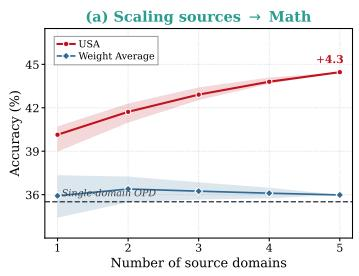

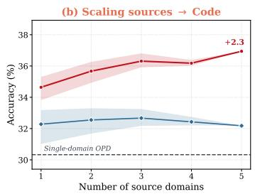

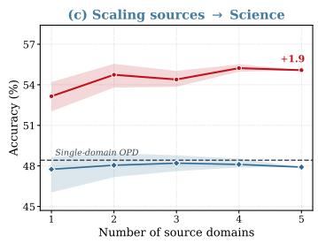  
Figure 4: Accuracy against the number of source domains merged into a fixed target, on the Qwen3-1.7B students. One panel per target domain, with USA and Weight Average merging the same experts and differing only in how those experts were trained. Each point averages every combination of sources of that size and the band spans the weakest and the strongest of them, so it is a range over the choice of sources rather than a seed interval. The dashed line is the Single-domain OPD reference of Table 1 and the label gives the change of USA from one source to five.

Figure 3(c) merges two sources into a target, which is as far as the three domains of Table 1 allow. To go further we extend the pool with three additional domains, Data Analysis, Finance and Engineering, drawn from the corpora described in Appendix F.1. These three serve only as sources and are never evaluated on, so a fixed target admits up to five of them and the study covers three targets rather than six. Each point of Figure 4 is the mean over all combinations of sources of that size, which removes any dependence on a particular choice and leaves a single combination once all five are merged. USA and Weight Average merge by the same weighted task arithmetic here as everywhere else in the paper, so the distance between the two curves is again attributable to how the experts were trained.

• Obs 10: the two methods differ in trend rather than only in level. USA gains over the whole range on every target, by 4.3, 2.3 and 1.9 points from one source to five, while Weight Average turns over after two sources on Math and after three on Code and Science and then declines towards its starting point. Neither curve is monotone, since a point averages the combinations available at that size and the pool is small, but the direction over the range is unambiguous and holds on all three targets. What the scaling behaviour adds to Figure 3(c) is therefore not a larger gain but a different shape: under plain merging the amount of cross-domain knowledge a target can absorb is bounded and reached early, whereas suppressing the interference during training leaves the merged model able to take in more of it than the pool contains.

## G.2 HYPERPARAMETER SENSITIVITY ANALYSIS.

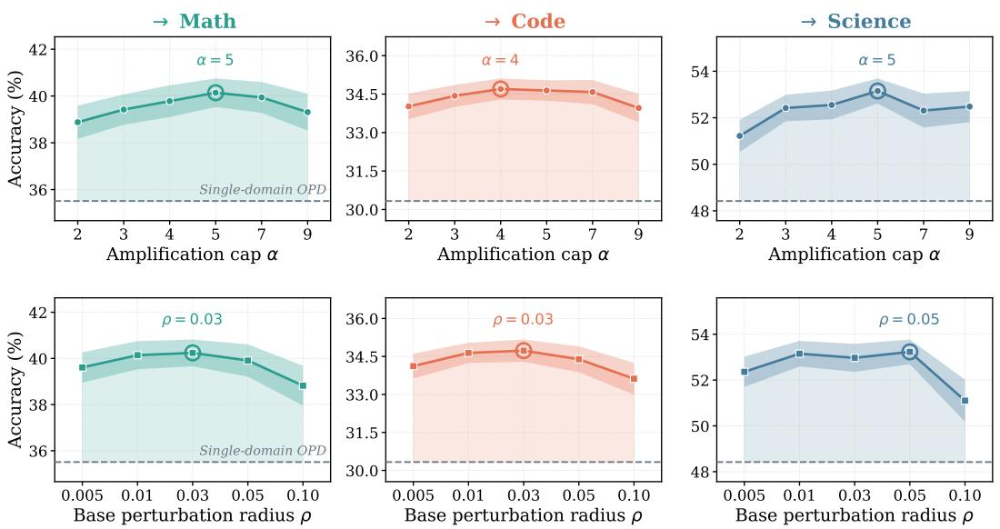  
Figure 5: Sweeps over the two hyperparameters of USA on the Qwen3-1.7B students. The top row varies the amplification cap α of Eq. (9) and the bottom row varies the base radius $\rho$ of Eq. (10), each with the other held at its default. Each column fixes a target domain and each point averages the two transfer directions of Table 1 that share it, so either row covers the six directions once. The band is the standard deviation over five runs, the dashed line is the Single-domain OPD reference of Table 1, and the circled marker is the peak of that curve.

Because Eq. (10) constrains an update-salient coordinate over $\rho s _ { k } ( i )$ rather than over $\rho ,$ and that semi-axis reaches $\rho \alpha$ , one may ask whether USA merely trains under a larger perturbation radius and whether an isotropic constraint of comparable size would do as well. Figure 5 separates the two quantities that this reading conflates, namely the overall size of the flatness budget and the way it is distributed across coordinates. The isotropic constraint itself is the $w /$ Vanilla SAM row of Table 2, which is $\alpha = 1$ with $\rho$ tuned over the grid of the bottom row, and it is the level against which the top row has to be read.

The two rows behave differently. Varying α moves the average over the six directions by 1.27 points and every setting of the grid stays above the isotropic result on all three targets, so what the objective is sensitive to is the profile of the budget across coordinates rather than the presence of a constraint. Each curve rises to a peak and then turns down, which is the behaviour Eq. (23) leads one to expect: the displacement factor can only be reduced by redistributing the budget, and past a certain amplification the curvature factor grows faster than the displacement factor falls, which is why the construction caps the amplification instead of leaving it unbounded. Varying ρ leaves the average within 0.62 points over the tenfold interval from 0.005 to 0.05 and keeps USA above the single-domain reference at every setting, with the gain narrowing only at the loosest radius of the grid, since a constraint that loose asks the network to keep the loss low over a neighbourhood in which the quadratic picture underlying Eq. (21) no longer holds. This asymmetry is what Proposition 1 predicts, since its right-hand side is invariant under $S \mapsto c S$ so that only the relative profile of the scales can affect it, while ρ enters Eq. (21) through a multiplicative $\rho ^ { 2 }$ that sets how hard the curvature is suppressed rather than along which directions.

The comparison an isotropic constraint of matched size would provide is already contained in Table 2, whose w/ Vanilla SAM row was tuned over the grid of the bottom row and sits 1.75 points below USA. A single pair, α = 5 and $\rho = 0 . 0 3 { \mathrm { . } }$ , is used in every other experiment of this paper, unchanged across the three domains, the six transfer directions and both student scales, and we keep it rather than fitting a pair to each domain. What the two rows establish is in any case not the merit of one setting over another but the insensitivity of the conclusion to the choice, since every setting of either grid leaves USA above the reference that row is read against and the least favourable one does so as well. The comparisons of Table 1 therefore do not rest on where inside these ranges the pair is placed. The warm-up length N and the reference fraction p are held at the values of Section 3.2 throughout.

## G.3 COMPATIBILITY WITH DOWNSTREAM MERGING OPERATORS.

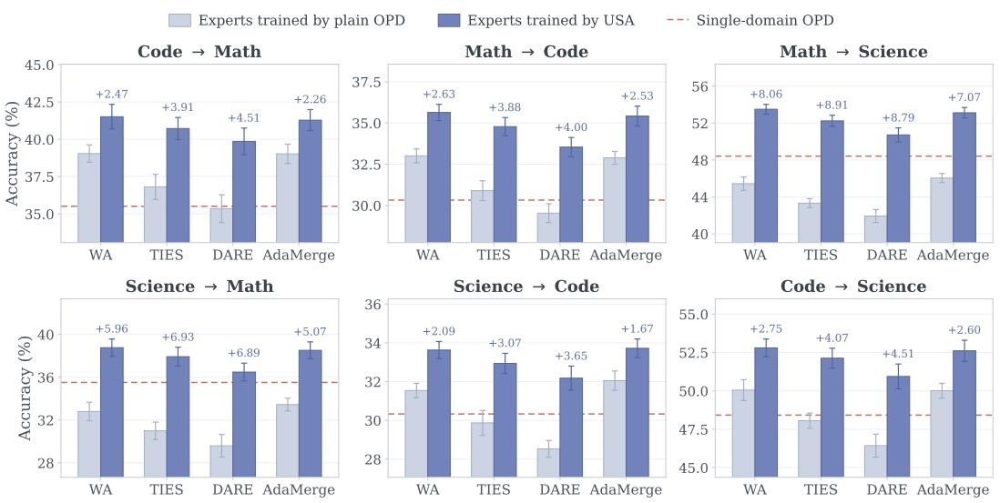  
Figure 6: Swapping the downstream merging operator, on the Qwen3-1.7B students. Each panel is one transfer direction and each group of bars one operator, with the light bar merging experts trained by plain OPD and the dark bar merging experts trained by USA. The two panels of a column share a target domain and therefore also the dashed Single-domain OPD reference of Table 1. Labels give the gain of USA over plain OPD under the same operator, and error bars are standard deviations over five runs.

USA intervenes on how each domain expert is trained and leaves the merging step untouched, so the gains reported in Section 4 could in principle be specific to the operator those experiments use. To test this we keep the experts fixed and swap the operator for three further choices beyond weight averaging, namely TIES (Yadav et al., 2023), DARE (Yu et al., 2024) applied before weight averaging, and AdaMerging (Yang et al., 2024), and we run the swap twice, once on experts trained by plain OPD and once on experts trained by USA, which separates what the operator contributes from what the training contributes.

• Obs 11: the gain of USA survives every operator we try, whereas plain OPD depends on the operator to stay competitive at all. Merging experts trained by USA improves on merging experts trained by plain OPD under all four operators and in all six directions, and it clears the single-domain reference in every one of those cells. Plain OPD does not: with DARE it falls below that reference in all six directions and with TIES in four of them, so under plain OPD the merged model can be worse than not merging at all, and which operator is used decides whether the cross-domain step is worth performing. The spread across the four operators also narrows from 3.71 to 2.04 points on average, and the weakest operator under USA still finishes above the strongest operator under plain OPD. Weight averaging remains the best or joint-best of the four on almost every direction, which is why the main tables use it, so the conclusion is not that the choice of operator ceases to matter but that it stops deciding whether cross-domain merging helps or hurts.

• Obs 12: the operators lose ground for two reasons, neither of which is a defect of the operators themselves. They were designed to consolidate several tasks into a single checkpoint while preserving all of them, and weight averaging in particular was introduced to recover value from runs that would otherwise be discarded, so none of them is built to spend a source domain in order to buy accuracy on a target. Their parameter-level operations also presuppose the task vectors that supervised fine-tuning produces. DARE is the clearest instance, since its random dropping and rescaling is justified by the extreme redundancy of those deltas, and the updates that on-policy distillation produces are sparse and heavy-tailed in the sense of Section 3.1, so dropping at a rate calibrated for redundant deltas removes coordinates that carry the update instead. This is consistent with DARE being the weakest of the four under plain OPD and with it being the operator that USA helps most, by 5.39 points on average, since concentrating the flatness budget on the update-salient coordinates is what makes those coordinates tolerant to the perturbation that the operator applies to them.

## G.4 GENERALIZATION TO SEARCH AGENTS.

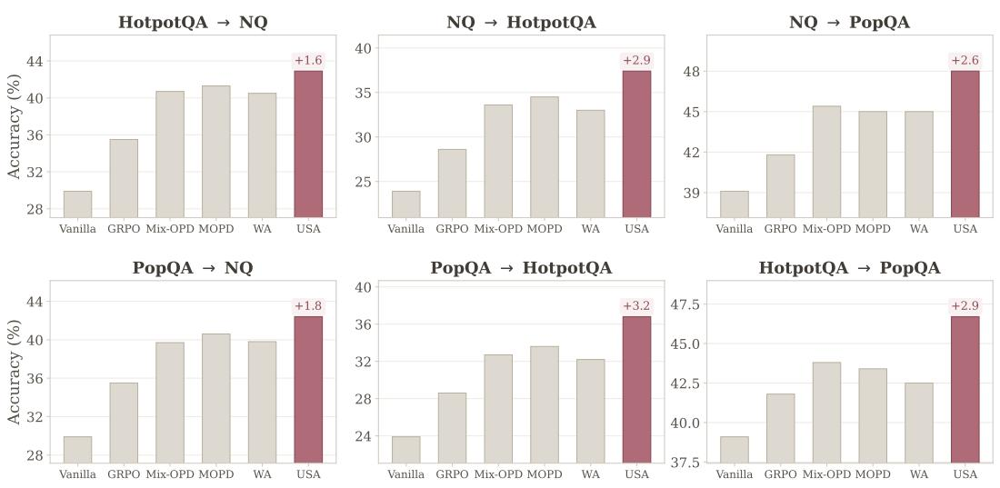  
Figure 7: Transfer between search-agent domains on the Qwen3-1.7B students. Each panel is one transfer direction and each bar one method, with USA drawn in colour and the five baselines in a neutral tone. Labels give the margin of USA over the strongest baseline of that panel. Every configuration is run once, so no deviations are shown.

To examine whether the benefit of USA is specific to code-interpreter agents, we further evaluate it in a retrieval-based search-agent environment. We follow the interaction protocol of Search-R1 (Jin et al., 2025), where the model alternates between reasoning and search actions, and retrieved passages are appended to the trajectory as environment observations. We instantiate three search-task domains with distinct retrieval and reasoning characteristics: Natural Questions (NQ) (Kwiatkowski et al., 2019) for general open-domain question answering, HotpotQA (Yang et al., 2018) for multi-hop question answering, and PopQA (Mallen et al., 2023) for long-tail factual question answering. We uniformly sample 8K training questions from each domain, yielding 24K questions in total.

The search environment follows Search-R1 (Jin et al., 2025). We use a fixed Wikipedia corpus with an E5 dense retriever (Wang et al., 2022), return the top three passages for each search action, and allow at most four search actions per trajectory. Retrieved passages are inserted into the context but are excluded from the training loss, exactly as environment observations are handled in Eq. (2). Al domains share the same search environment and differ only in their training distributions.

We use Qwen3-8B as the teacher and Qwen3-1.7B as the student. Each domain teacher is first optimized with GRPO on its corresponding 8K subset, after which the student is trained with OPD or USA following the same pipeline as in the main experiments. We evaluate all six directed source– target pairs formed by the three domains. Weight Average and USA merge independently trained source and target experts with equal coefficients, $\lambda _ { s } = \lambda _ { t } = 0 . 5$ . Mix-data OPD and MOPD follow the same definitions as in our main experiments, and Vanilla and GRPO are reported alongside them. Importantly, we reuse the USA hyperparameters selected in the code-interpreter experiments without search-specific tuning: $N = 1 0 , p = 1 \% , \rho = 0 . 0 3$ , and $\alpha = 5$ . We report Accuracy (%), where a prediction is counted as correct when its normalized final answer exactly matches the gold answer. Each configuration is run once, and we therefore report point estimates without standard deviations.

• Obs 13: the ordering of the methods carries over to an environment that shares nothing with the main experiments but its interaction pattern. USA is the strongest method on every one of the six directions, ahead of the best baseline of each direction by 2.50 points on average and by at least 1.6 points everywhere, and it holds that position against MOPD and Mix-data OPD, which train on both domains jointly, as well as against weight averaging, which merges the same two experts it does. The margin is of the same order as the one of Table 1 even though the teacher, the student’s training data, the tool and the metric have all changed, so what the update-aware perturbation geometry exploits is the structure of the updates that on-policy distillation produces rather than anything particular to executing code.

• Obs 14: the transfer requires no environment-specific tuning. The amplification cap, the reference fraction, the warm-up length and the base radius are all carried over unchanged from the code-interpreter study of Appendix G.2, even though the teacher, the student’s data, the tool and the evaluation metric all differ. This is what the construction of Eq. (9) predicts, since the reference level is a within-matrix quantile of the update magnitudes and therefore adapts to whatever scale the updates happen to take in a new environment, leaving α to set only the ratio between the largest and the smallest semi-axis. The quantities that would need retuning if the mechanism were tied to the code-interpreter setting are exactly the ones that did not.

## G.5 PER-BENCHMARK RESULTS.

Table 1 reports, for each transfer direction, the mean over the two benchmarks of the target domain. Tables 5 and 6 give the underlying per-benchmark scores for the Qwen3-1.7B and Qwen3-4B students respectively, with the rows and the transfer directions arranged as in the main table so that the two can be read side by side.

Table 5: Per-benchmark results for the Qwen3-1.7B students. Each pair of columns expands one cell of Table 1 into the two benchmarks of the target domain. The best results are in bold, and the second-best results are underlined. We report average@32 over 5 runs.
<table><tr><td rowspan="2">Method</td><td colspan="2">Code → Math</td><td colspan="2">Math → Code</td><td colspan="2">Math → Sci.</td></tr><tr><td></td><td></td><td></td><td>AIME 2025 HMMT Feb. 2026 LiveCodeBench-v6 NaturalCodeBench</td><td></td><td>GPQA-Diamond SciBench-Atkins</td></tr><tr><td colspan="7">Teacher Model from the Qwen3-14B Series</td></tr><tr><td>GRPO</td><td> $6 8 . 3 8 \pm 1 . 4 2 $ </td><td>48.91 ±0.87</td><td>69.24 ±0.93</td><td> $5 4 . 5 7 \pm 0 . 7 1$ </td><td> $6 0 . 5 3 \pm 1 . 0 6$ </td><td>81.47 ±0.84</td></tr><tr><td colspan="7">Student Models from the Qwen3-1.7B Series</td></tr><tr><td>Vanilla</td><td> $8 . 9 6 \pm 0 . 9 4$ </td><td> $2 1 . 2 1 \pm 1 . 0 7$ </td><td> $2 2 . 7 3 \pm 0 . 7 4$ </td><td> $1 5 . 3 3 \pm 0 . 5 5$ </td><td> $2 6 . 8 0 \pm 0 . 6 9$ </td><td> $4 6 . 0 1 \pm 0 . 8 8$ </td></tr><tr><td>Mix-data SFT</td><td> $2 7 . 4 1 \pm 0 . 8 8$ </td><td> $2 4 . 5 8 \pm 1 . 6 9$ </td><td> $2 5 . 9 1 \pm 0 . 5 6$ </td><td> $1 8 . 7 2 \pm 0 . 7 4$ </td><td> $2 9 . 6 3 \pm 0 . 6 1$ </td><td> $5 3 . 1 6 \pm 1 . 1 5$ </td></tr><tr><td>Mix-data GRPO</td><td> $3 5 . 8 8 \pm 1 . 4 1$ </td><td> $2 9 . 2 2 \pm 0 . 7 9$ </td><td> $3 1 . 5 8 \pm 0 . 9 1 $ </td><td> $2 2 . 0 6 \pm 0 . 4 8$ </td><td> $3 1 . 4 8 \pm 0 . 8 4$ </td><td> $5 8 . 7 2 \pm 0 . 6 7$ </td></tr><tr><td>Mix-data OPD</td><td> $4 2 . 2 1 \pm 1 . 0 6$ </td><td> $3 3 . 6 1 \pm 1 . 3 2$ </td><td> $3 7 . 8 6 \pm 0 . 6 8$ </td><td> $2 6 . 3 7 \pm 0 . 5 9$ </td><td> $3 3 . 0 7 \pm 0 . 5 2 $ </td><td> $6 0 . 8 4 \pm 1 . 0 9$ </td></tr><tr><td>Single-domain OPD</td><td> $3 9 . 5 8 \pm 1 . 2 1$ </td><td> $3 1 . 4 4 \pm 0 . 9 6$ </td><td> $3 5 . 7 3 \pm 0 . 8 7$ </td><td> $2 4 . 9 2 \pm 0 . 7 1$ </td><td> $\underline { { 3 4 . 4 8 } } \pm 0 . 7 6$ </td><td> $6 2 . 3 6 \pm 1 . 0 3$ </td></tr><tr><td>MOPD</td><td> $4 3 . 8 4 \pm 0 . 8 2$ </td><td> $3 4 . 1 9 \pm 1 . 1 8$ </td><td> $\underline { { 3 9 . 1 8 } } \pm 0 . 4 7$ </td><td> $2 7 . 0 5 \pm 0 . 8 3$ </td><td> $3 4 . 1 2 \pm 0 . 6 6$ </td><td> $6 3 . 5 8 \pm 0 . 7 8$ </td></tr><tr><td>Weight Average</td><td> $\underline { { 4 4 . 1 2 } } \pm 0 . 4 4$ </td><td> $3 3 . 9 6 \pm 1 . 0 7$ </td><td> $3 8 . 7 4 \pm 0 . 7 5$ </td><td> $2 7 . 2 8 \pm 0 . 3 9$ </td><td> $3 1 . 6 7 \pm 0 . 9 1 $ </td><td> $5 9 . 2 1 \pm 1 . 1 2 $ </td></tr><tr><td>Ties-Merging</td><td> $4 1 . 4 7 \pm 1 . 5 2$ </td><td> $3 2 . 1 4 \pm 0 . 7 3$ </td><td> $3 6 . 4 4 \pm 1 . 0 3$ </td><td> $2 5 . 3 6 \pm 0 . 6 2$ </td><td> $2 9 . 8 2 \pm 0 . 4 3$ </td><td> $5 6 . 8 4 \pm 0 . 8 9$ </td></tr><tr><td>DARE+WA</td><td> $3 9 . 8 2 \pm 1 . 1 7$ </td><td> $3 0 . 8 8 \pm 1 . 4 5$ </td><td> $3 4 . 9 7 \pm 0 . 8 4$ </td><td> $2 4 . 1 1 \pm 0 . 7 6$ </td><td> $2 8 . 5 4 \pm 0 . 5 8 $ </td><td> $5 5 . 3 1 \pm 1 . 2 8$ </td></tr><tr><td>AdaMerging</td><td> $4 3 . 6 7 \pm 0 . 9 7$ </td><td> $\underline { { 3 4 . 3 7 } } \pm 0 . 8 8$ </td><td> $3 9 . 0 6 \pm 0 . 6 1$ </td><td> $2 6 . 7 1 \pm 0 . 5 0$ </td><td> $3 2 . 3 5 \pm 0 . 7 2$ </td><td> $5 9 . 7 4 \pm 0 . 6 5$ </td></tr><tr><td>USA</td><td> ${ \bf 4 6 . 9 0 \pm } 1 . 2 9$ </td><td> $3 6 . 1 2 \pm 1 . 0 4$ </td><td> ${ \bf 4 2 . 3 1 \pm 0 . 8 0 }$ </td><td> $\mathbf { 2 8 . 9 7 \Pi } _ { \pm 0 . 5 7 }$ </td><td> $3 7 . 8 2 \pm 0 . 4 7$ </td><td> ${ \bf 6 9 . 1 8 \pm 0 . 9 4 }$ </td></tr><tr><td>Method</td><td>Sci. → Math</td><td></td><td colspan="2">Sci. → Code</td><td colspan="2">Code → Sci.</td></tr><tr><td></td><td>AIME 2025 HMMT Feb 2026 LiveCodeBench-v6 NaturalCodeBench GPOA-Diamond SciBench-Atkins</td><td></td><td></td><td></td><td></td><td></td></tr></table>

<table><tr><td colspan="7"></td></tr><tr><td>Teacher Model from the Qwen3-14B Series GRPO</td><td> $6 8 . 3 8 \pm 1 . 4 2 $ </td><td>48.91 ±0.87</td><td>69.24 ±0.93</td><td> $5 4 . 5 7 \pm 0 . 7 1$ </td><td> $6 0 . 5 3 \pm 1 . 0 6$ </td><td> $8 1 . 4 7 \pm 0 . 8 4$ </td></tr><tr><td colspan="7"></td></tr><tr><td></td><td></td><td></td><td>Student Models from the Qwen3-1.7B Series</td><td></td><td></td><td></td></tr><tr><td>Vanilla</td><td> $8 . 9 6 \pm 0 . 9 4$ </td><td> $2 1 . 2 1 \pm 1 . 0 7$ </td><td> $2 2 . 7 3 \pm 0 . 7 4$ </td><td> $1 5 . 3 3 \pm 0 . 5 5$ </td><td> $2 6 . 8 0 \pm 0 . 6 9$ </td><td> $4 6 . 0 1 \pm 0 . 8 8$ </td></tr><tr><td>Mix-data SFT</td><td> $2 6 . 2 3 \pm 1 . 4 6$ </td><td> $2 3 . 9 1 \pm 0 . 8 1$ </td><td> $2 5 . 3 6 \pm 0 . 6 9$ </td><td> $1 9 . 0 3 \pm 0 . 4 3$ </td><td> $3 0 . 5 8 \pm 0 . 5 7$ </td><td> $5 4 . 3 9 \pm 1 . 1 4$ </td></tr><tr><td>Mix-data GRPO</td><td> $3 2 . 7 1 \pm 0 . 9 3$ </td><td> $2 7 . 8 4 \pm 1 . 3 8$ </td><td> $3 1 . 2 1 \pm 0 . 5 2 $ </td><td> $2 1 . 5 4 \pm 0 . 7 8$ </td><td> $3 2 . 8 2 \pm 0 . 8 8$ </td><td> $5 9 . 4 6 \pm 0 . 7 0$ </td></tr><tr><td>Mix-data OPD</td><td> $3 7 . 2 9 \pm 1 . 5 7$ </td><td> $3 0 . 1 8 \pm 0 . 7 4$ </td><td> $3 6 . 6 5 \pm 0 . 9 5$ </td><td> $2 5 . 6 9 \pm 0 . 5 6$ </td><td> $3 5 . 3 9 \pm 0 . 4 9$ </td><td> $6 3 . 0 2 \pm 1 . 0 6$ </td></tr><tr><td>Single-domain OPD MOPD</td><td> $3 9 . 5 8 \pm 1 . 2 1$ </td><td> $\underline { { 3 1 . 4 4 } } \pm 0 . 9 6$ </td><td> $3 5 . 7 3 \pm 0 . 8 7$ </td><td> $2 4 . 9 2 \pm 0 . 7 1$ </td><td> $3 4 . 4 8 \pm 0 . 7 6$ </td><td> $6 2 . 3 6 \pm 1 . 0 3$ </td></tr><tr><td></td><td> $\underline { { 4 0 . 3 1 } } \pm 1 . 0 3 $ </td><td> $3 0 . 9 6 \pm 1 . 2 1$ </td><td>37.83 ±0.64</td><td> $2 6 . 3 1 \pm 0 . 8 4$ </td><td> $3 6 . 1 4 \pm 0 . 9 5$ </td><td> $6 4 . 2 7 \pm 0 . 6 2 $ </td></tr><tr><td>Weight Average</td><td> $3 6 . 4 2 \pm 0 . 8 6$ </td><td> $2 9 . 1 8 \pm 1 . 4 9$ </td><td> $3 7 . 1 9 \pm 0 . 5 8$ </td><td> $2 5 . 8 8 \pm 0 . 4 5$ </td><td> $3 6 . 3 9 \pm 0 . 6 8$ </td><td> $6 3 . 7 1 \pm 1 . 1 8$ </td></tr><tr><td>Ties-Merging DARE+WA</td><td> $3 4 . 3 1 \pm 1 . 3 5$ </td><td> $2 7 . 6 6 \pm 0 . 9 2$ </td><td> $3 5 . 2 6 \pm 1 . 0 8$ </td><td> $2 4 . 4 7 \pm 0 . 6 7$ </td><td> $3 4 . 6 2 \pm 0 . 5 5$ </td><td> $6 1 . 4 9 \pm 0 . 8 1$ </td></tr><tr><td></td><td> $3 2 . 8 8 \pm 1 . 8 2 $ </td><td> $2 6 . 2 9 \pm 1 . 1 0$ </td><td> $3 3 . 8 4 \pm 0 . 7 7$ </td><td> $2 3 . 2 2 \pm 0 . 3 7$   $2 6 . 0 8 \pm 0 . 8 9$ </td><td> $3 2 . 9 7 \pm 0 . 8 3 $ </td><td> $5 9 . 8 8 \pm 1 . 2 6$ </td></tr><tr><td>AdaMerging</td><td> $3 7 . 1 6 \pm 1 . 1 3$ </td><td> $2 9 . 7 2 \pm 0 . 4 3$ </td><td> $3 8 . 0 2 \pm 0 . 4 6 $ </td><td></td><td> $3 5 . 9 6 \pm 0 . 6 0$ </td><td> $6 4 . 0 6 \pm 0 . 7 5$ </td></tr><tr><td>USA</td><td> $4 3 . 2 5 \pm 1 . 0 0$ </td><td> $3 4 . 2 7 \pm 1 . 2 7$ </td><td>39.65 ±0.72</td><td> $2 7 . 6 0 \pm 0 . 5 1 $ </td><td>38.43±0.74</td><td> ${ \bf 6 7 . 1 6 \pm 0 . 9 0 }$ </td></tr></table>

Table 6: Per-benchmark results for the Qwen3-4B students. Each pair of columns expands one cell of Table 1 into the two benchmarks of the target domain. The best results are in bold, and the second-best results are underlined. We report average@32 over 5 runs.
<table><tr><td rowspan="2">Method</td><td colspan="2">Code → Math</td><td colspan="2">Math → Code</td><td colspan="2">Math → Sci.</td></tr><tr><td></td><td></td><td></td><td></td><td></td><td>AIME 2025 HMMT Feb. 2026 LiveCodeBench-v6 NaturalCodeBench GPQA-Diamond SciBench-Atkins</td></tr><tr><td colspan="7">Teacher Model from the Qwen3-14B Series</td></tr><tr><td>GRPO</td><td> $6 8 . 3 8 \pm 1 . 4 2 $ </td><td>48.91 ±0.87</td><td>69.24 ±0.93</td><td> $5 4 . 5 7 \pm 0 . 7 1$ </td><td> $6 0 . 5 3 \pm 1 . 0 6$ </td><td>81.47 ±0.84</td></tr><tr><td colspan="7">Student Models from the Qwen3-4B Series</td></tr><tr><td>Vanilla</td><td> $4 6 . 7 3 \pm 1 . 1 2$ </td><td> $2 6 . 8 4 \pm 1 . 1 6$ </td><td> $4 5 . 6 1 \pm 0 . 7 2$ </td><td> $3 3 . 4 7 \pm 0 . 6 8$ </td><td> $4 4 . 3 8 \pm 0 . 8 7$ </td><td> $5 8 . 6 2 \pm 0 . 8 4 $ </td></tr><tr><td>Mix-data SFT</td><td> $5 2 . 3 4 \pm 1 . 0 8$ </td><td> $3 1 . 0 8 \pm 1 . 3 7$ </td><td> $5 3 . 2 1 \pm 0 . 8 1 $ </td><td> $3 7 . 0 8 \pm 0 . 5 4$ </td><td> $4 7 . 6 2 \pm 0 . 6 3$ </td><td> $6 2 . 5 1 \pm 1 . 1 7$ </td></tr><tr><td>Mix-data GRPO</td><td> $5 8 . 7 6 \pm 1 . 4 6 $ </td><td> $3 8 . 1 0 \pm 0 . 8 6 $ </td><td> $6 0 . 3 1 \pm 0 . 5 8$ </td><td> $4 2 . 1 8 \pm 0 . 7 3$ </td><td> $5 3 . 2 1 \pm 0 . 8 9$ </td><td> $6 8 . 4 4 \pm 0 . 6 9$ </td></tr><tr><td>Mix-data OPD</td><td> $5 9 . 4 2 \pm 1 . 2 2 $ </td><td> $3 8 . 0 8 \pm 1 . 4 9$ </td><td> $6 1 . 0 4 \pm 0 . 7 2$ </td><td> $4 2 . 9 3 \pm 0 . 4 7$ </td><td> $5 2 . 8 4 \pm 0 . 5 5$ </td><td> $6 8 . 9 1 \pm 1 . 0 6 $ </td></tr><tr><td>Single-domain OPD</td><td> $5 8 . 7 1 \pm 1 . 3 1 $ </td><td> $3 7 . 5 6 \pm 1 . 0 9$ </td><td> $6 0 . 2 2 \pm 0 . 8 9$ </td><td> $4 2 . 3 1 \pm 0 . 8 6$ </td><td> $\underline { { 5 4 . 1 6 } } \pm 0 . 9 8$ </td><td> $6 9 . 2 6 \pm 1 . 0 3 $ </td></tr><tr><td>MOPD</td><td> $\underline { { 6 0 . 5 5 } } \pm 0 . 9 1 $ </td><td> $3 8 . 6 1 \pm 1 . 1 3 $ </td><td> $6 1 . 7 4 \pm 0 . 9 4$ </td><td> $4 3 . 6 2 \pm 0 . 6 6$ </td><td> $5 3 . 7 2 \pm 0 . 7 4$ </td><td> $6 8 . 8 3 \pm 0 . 8 3 $ </td></tr><tr><td>Weight Average</td><td> $6 0 . 2 1 \pm 1 . 5 7$ </td><td> $3 8 . 4 2 \pm 0 . 9 8 $ </td><td> $6 1 . 5 8 \pm 0 . 6 3$ </td><td> $4 3 . 4 7 \pm 0 . 8 1$ </td><td> $5 1 . 4 8 \pm 0 . 4 6$ </td><td> $6 6 . 5 5 \pm 1 . 1 1$ </td></tr><tr><td>Ties-Merging</td><td> $5 8 . 4 6 \pm 1 . 1 9$ </td><td> $3 7 . 0 6 \pm 1 . 4 2$ </td><td> $5 9 . 4 5 \pm 0 . 8 5$ </td><td> $4 2 . 8 7 \pm 0 . 5 9$ </td><td> $4 9 . 8 7 \pm 0 . 9 7$ </td><td> $6 4 . 2 8 \pm 0 . 7 2$ </td></tr><tr><td>DARE+WA</td><td> $5 7 . 1 1 \pm 1 . 6 8$ </td><td> $3 5 . 8 8 \pm 0 . 7 9$ </td><td> $5 8 . 2 2 \pm 1 . 0 3 $ </td><td> $4 0 . 6 3 \pm 0 . 7 0$ </td><td> $5 0 . 1 4 \pm 0 . 6 1$ </td><td> $6 2 . 9 1 \pm 1 . 2 3 $ </td></tr><tr><td>AdaMerging</td><td> $6 0 . 4 8 \pm 1 . 0 1$ </td><td> $3 8 . 1 3 \pm 0 . 9 2 $ </td><td> $6 1 . 3 3 \pm 0 . 4 9$ </td><td> $4 3 . 7 6 \pm 0 . 8 8$ </td><td> $5 1 . 9 3 \pm 0 . 8 2 $ </td><td> $6 7 . 0 2 \pm 0 . 6 5$ </td></tr><tr><td>USA</td><td> ${ \bf 6 3 . 9 3 \pm 1 . 3 4 }$ </td><td> ${ \bf 4 0 . 3 9 \pm } 1 . 2 5$ </td><td> ${ \bf 6 6 . 2 5 \pm 0 . 7 6 }$ </td><td> $\mathbf { 4 6 . 2 5 \ : \pm 0 . 5 2 }$ </td><td> ${ \pm \mathbf { 8 . 9 8 } } \pm 0 . 5 0 $ </td><td> ${ \bf 7 5 . 1 0 \pm 0 . 9 5 }$ </td></tr><tr><td rowspan="2">Method</td><td colspan="2">Sci. → Math</td><td colspan="2">Sci. → Code</td><td colspan="2">Code → Sci.</td></tr><tr><td>AIME 2025</td><td></td><td>HMMT Fab. 2026 LiveCadaRanch</td><td></td><td></td><td></td></tr></table>

<table><tr><td colspan="6"></td></tr><tr><td colspan="6">Teacher Model from the Qwen3-14B Series</td></tr><tr><td>GRPO</td><td> $6 8 . 3 8 \pm 1 . 4 2 $  48.91 ±0.87</td><td> $6 9 . 2 4 \pm 0 . 9 3 $ </td><td> $5 4 . 5 7 \pm 0 . 7 1$ </td><td> $6 0 . 5 3 \pm 1 . 0 6$ </td><td>81.47 ±0.84</td></tr><tr><td colspan="6">Student Models from the Qwen3-4B Series</td></tr><tr><td>Vanilla</td><td> $4 6 . 7 3 \pm 1 . 1 2$ </td><td> $2 6 . 8 4 \pm 1 . 1 6$ </td><td> $4 5 . 6 1 \pm 0 . 7 2$   $3 3 . 4 7 \pm 0 . 6 8$ </td><td> $4 4 . 3 8 \pm 0 . 8 7$ </td><td> $5 8 . 6 2 \pm 0 . 8 4 $ </td></tr><tr><td>Mix-data SFT</td><td> $5 0 . 8 1 \pm 1 . 5 3 $ </td><td> $3 0 . 4 6 \pm 0 . 8 2$ </td><td> $5 2 . 9 4 \pm 0 . 6 2$   $3 6 . 7 1 \pm 0 . 7 6$ </td><td> $4 8 . 2 2 \pm 0 . 7 8$ </td><td> $6 3 . 0 8 \pm 0 . 8 4$ </td></tr><tr><td>Mix-data GRPO</td><td> $5 6 . 9 8 \pm 1 . 0 2$ </td><td> $3 6 . 8 9 \pm 1 . 4 5$ </td><td> $6 0 . 1 5 \pm 0 . 9 1 \hphantom { 0 0 0 }$   $4 1 . 8 6 \pm 0 . 4 9$ </td><td> $5 5 . 1 5 \pm 0 . 5 7$ </td><td> $6 9 . 4 4 \pm 1 . 1 2$ </td></tr><tr><td>Mix-data OPD</td><td> $5 7 . 2 3 \pm 1 . 6 1$ </td><td> $3 6 . 7 2 \pm 1 . 0 4$ </td><td> $6 0 . 0 8 \pm 0 . 5 5$   $4 2 . 5 9 \pm 0 . 8 5$ </td><td> $5 4 . 6 2 \pm 0 . 7 7$ </td><td> $6 9 . 7 3 \pm 0 . 6 8$ </td></tr><tr><td>Single-domain OPD</td><td> $5 8 . 7 1 \pm 1 . 3 1 $ </td><td> $3 7 . 5 6 \pm 1 . 0 9$ </td><td> $6 0 . 2 2 \pm 0 . 8 9$   $4 2 . 3 1 \pm 0 . 8 6$ </td><td> $5 4 . 1 6 \pm 0 . 9 8$ </td><td> $6 9 . 2 6 \pm 1 . 0 3$ </td></tr><tr><td>MOPD</td><td> $\underline { { 5 9 . 3 3 } } \pm 1 . 1 6$ </td><td> $\underline { { 3 7 . 9 2 } } \pm 0 . 7 5$ </td><td> $6 1 . 2 6 \pm 0 . 8 0$   $\underline { { 4 3 . 1 8 } } \pm 0 . 5 1$ </td><td> $5 5 . 0 8 \pm 0 . 9 4$ </td><td> $7 0 . 3 1 \pm 1 . 0 6$ </td></tr><tr><td>Weight Average</td><td> $5 6 . 2 7 \pm 0 . 8 7$ </td><td> $3 5 . 9 1 \pm 1 . 3 6$ </td><td> $6 0 . 9 4 \pm 0 . 7 7$ </td><td> $4 2 . 8 8 \pm 0 . 4 2$   $5 4 . 9 1 \pm 0 . 6 9$ </td><td> $7 0 . 4 8 \pm 0 . 7 9$ </td></tr><tr><td>Ties-Merging</td><td> $5 4 . 1 1 \pm 1 . 4 1$ </td><td> $3 4 . 5 8 \pm 0 . 9 3$ </td><td> $5 9 . 2 6 \pm 1 . 0 8$ </td><td> $4 1 . 2 3 \pm 0 . 7 8$   $5 3 . 3 1 \pm 0 . 4 8$ </td><td> $6 8 . 0 4 \pm 1 . 2 1 $ </td></tr><tr><td>DARE+WA</td><td> $5 2 . 7 6 \pm 1 . 2 7$ </td><td> $3 3 . 4 1 \pm 1 . 1 8$ </td><td> $5 7 . 9 4 \pm 0 . 7 4$   $3 9 . 8 7 \pm 0 . 5 7$ </td><td> $5 1 . 7 2 \pm 0 . 8 8$ </td><td> $6 6 . 4 7 \pm 0 . 6 1$ </td></tr><tr><td>AdaMerging</td><td> $5 6 . 8 4 \pm 0 . 8 6$ </td><td> $3 6 . 2 2 \pm 1 . 2 8$ </td><td> $\underline { { 6 1 . 3 8 \pm 0 . 7 1 } }$   $4 2 . 7 3 \pm 0 . 6 4$ </td><td> $5 5 . 2 3 \pm 0 . 6 0$ </td><td> $6 9 . 9 4 \pm 0 . 9 8 $ </td></tr><tr><td>USA</td><td> ${ \bf 6 1 . 9 6 \pm 1 . 1 2 }$ </td><td> $\mathbf { 3 9 . 4 8 \mu _ { \pm 0 . 8 8 } }$ </td><td>63.84 ±0.60</td><td> ${ \bf 4 5 . 0 8 \pm 0 . 6 7 }$  57.99 ±0.84</td><td>73.30 ±0.80</td></tr></table>

<table><tr><td>You will be given a question (problem specification) and will generate a correct Python program that matches the specification and passes all tests.</td></tr><tr><td>Problem: [Insert problem text here] Public Examples: Here are some input and output examples of the expected code:</td></tr><tr><td>Input: [sample inputs]</td></tr><tr><td>Output: [sample outputs] Note: You should first analyze the problem and form a high-level solution strategy, then utilize the tools</td></tr><tr><td>to help you solve the problem. Instruction: Read the inputs from stdin, solve the problem, and write the answer to stdout (do not directly</td></tr><tr><td>test on the sample inputs). Enclose your code within the delimiters shown below. Ensure that when the</td></tr><tr><td>Python program runs, it correctly reads inputs, executes the algorithm, and writes output to stdout. Submit: Before submitting your code, you can utilize tools to check its correctness. Once you make sure</td></tr><tr><td>the current code is correct, do not call the tools again and submit your code within the following Python</td></tr><tr><td>code block: # YOUR CODE HERE</td></tr></table>

## H PROMPT TEMPLATES

A task is given the template matching the form of its final answer, not its domain, and the same one at training and at evaluation. Values use the free-response template, covering mathematics and the open-ended science of MegaScience and SciBench-Atkins; the multiple-choice GPQA-Diamond uses the option-letter template; code tasks use the code template. Two benchmarks add a clause to the free-response instruction: HMMT February 2026 asks for an exact closed form, and SciBench-Atkins states the expected unit outside \boxed{}, per Appendix F.2.3.

## Value Answers: Math and Open-Ended Science

Hint: The tool could be used for more precise and efficient calculations and could help you to verify your result before you reach the final answer.

Note: You should first analyze the problem and form a high-level solution strategy, then utilize the tools to help you solve the problem.

Answer Format: Do not put units of the final answer inside \boxed{}. The content of \boxed{} should be the numerical value of the final answer only, without any units.

Remember once you make sure the current answer is your final answer, do not call the tools again and directly output the final answer in the following text format, the answer format must be: \boxed{’The final answer goes here.’}.

## Option Answers: Multiple-Choice Scientific QA

Analyze and solve the following [science domain] problem step by step.

Problem: [Insert problem text here]

Hint: The tool could be used for more precise and efficient calculations and could help you to verify your result before you reach the final answer.

Note: You should first analyze the problem and form a high-level solution strategy, then utilize the tools to help you solve the problem.

Answer Format: Remember once you make sure the current answer is your final answer, do not call the tools again and directly output the final answer in the following text format, the answer format must be: \boxed{’The final answer goes here.’}. You need to put the final uppercase letter option of this problem into \boxed{}.

## Program Answers: Code Generation