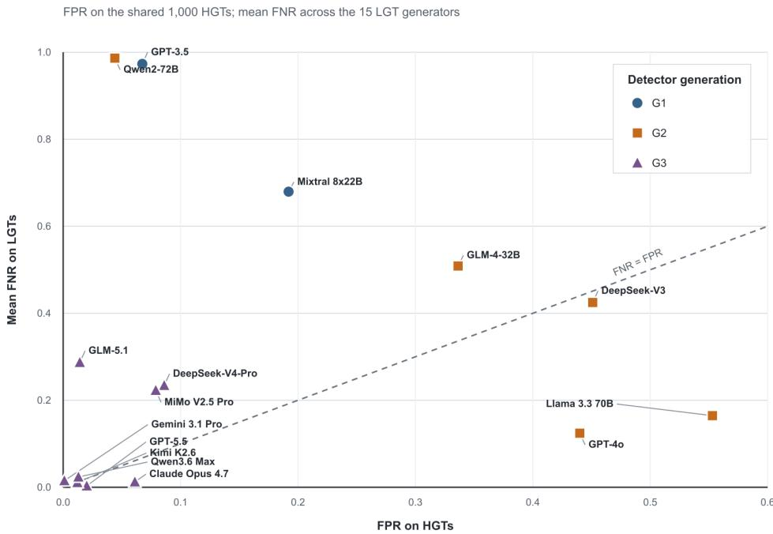

# USING LLMS TO DETECT LLM-GENERATED TEXTS: A CROSS-GENERATION ANALYSIS

Haiyue Yuan1, Jie Guo2, Weidong Qiu2, Zheng Huang2, Ruizhe Li3∗, Shujun Li1∗ 1Institute of Cyber Security for Society (iCSS) & School of Computing, University of Kent, UK 2School of Cyber Science and Engineering, Shanghai Jiao Tong University, China 3School of Computer Science, University of Birmingham, UK

## ABSTRACT

Automated detection of LLM-generated texts (LGTs) is critical, yet dedicated detectors often struggle to generalize across domains and models. While generalpurpose LLMs offer flexible zero-shot authorship classification with explanatory rationale, their detection behavior, especially regarding self-detection versus cross-detection across model generations, remains poorly understood. We systematically evaluate 15 LLMs spanning three model generations as both generators and detectors. Using a benchmark of 1,000 human-written texts and 15,000 LGTs (1,000 per model), we collected over 233,000 binary classifications alongside natural-language explanations. Our results reveal that detection efficacy is primarily driven by detector capability rather than generator provenance, although outputs from newer generators remain notably harder to detect. Crucially, statistical comparisons show no systematic advantage or disadvantage for selfdetection across models. Error analysis further exposes generational bias shifts: first-generation detectors under-detect LGTs (high false-negative rates), secondgeneration detectors over-flag human texts (high false-positive rates), and the latest models achieve balanced trade-offs. Finally, we highlight significant inconsistencies in how different LLMs apply textual cues to justify their decisions.

## 1 INTRODUCTION

In recent years, large language models (LLMs) have developed from research prototypes into various applications used across a wide range of domains, such as education, science, medicine, programming, journalism, and creative work (Li et al., 2024). While these applications can help improving productivity and work efficiency, the same generative capability enables LLMs to produce convincing content that could reinforce false narratives, raising concerns about the generation and dissemination of misinformation and disinformation at scale (Vykopal et al., 2024). It may also be misused to create personalised phishing messages and deceptive online reviews (Czybik et al., 2026; Kovacs, 2024). On the other hand, falsely accusing legitimate authors of using LLMs can also cause´ reputational harm (Liang et al., 2023; Layton et al., 2026).

LLM-generated text (LGT) detection has therefore emerged as an important research topic, answering questions of textual provenance, plagiarism, and distinction between human- and machine- generated content (Dugan et al., 2024; Lee et al., 2023; Bhattacharjee & Liu, 2024; Wu et al., 2025b). Prior work spans supervised classifiers, statistical methods, rewriting-based approaches, and watermarking (Mitchell et al., 2023; Hans et al., 2024; Kirchenbauer et al., 2023). Various efforts have also been made to evaluate large benchmarks and commercial detectors for detecting LGTs (Wang et al., 2024; Dugan et al., 2024; Layton et al., 2026). Despite such substantial efforts from both re search and industry communities, such detectors often generalise poorly across unseen models and domains, while they remain vulnerable to prompting and style-shifting attacks (Tufts et al., 2025; Pedrotti et al., 2025). It is also worth noting that when detectors are required to keep low false positive rate, the performance of detecting LGT decline significantly (Tufts et al., 2025). Moreover, detection becomes even more challenging for human-LLM co-authored texts, where detectors need to explicitly identify the source of individual segments (Su et al., 2025).

An increasingly attractive approach is to simply use a general-purpose LLM as the detector, where the selected LLM takes a suspected text and returns a binary decision (Hans et al., 2024; Ji et al., 2025). It can also provide a natural-language explanation on top of the binary decision label (Ji et al., 2025). The study closest to ours was conducted by Ji et al. (2025), where six open- and closed-source LLMs were evaluated as binary and ternary detectors. Their study suggested that an LLM generally performs better at identifying texts generated by itself compared with recognising texts generated by other LLMs. Slightly differently, Leinonen & Denny (2026) examined self-detection by a single LLM, and found that self-detection varies substantially across task, response length, and prompt formulation. Both studies have limited scopes and their results need more independent validation with more recent LLMs, to enhance our understanding on self- and cross-detection of LGTs. More specifically, neither studied generational effects, e.g., how LLMs of different generations behave as self- and cross-detector of LGTs.

To fill the above-mentioned research gaps, we conducted a large-scale study of LGT detection using 15 general-purpose LLMs of three generations (i.e., G1: 2023-24, G2: 2024-25, and G3: 2026) as both text generators and detectors. Following Ji et al. (2025)’s approach, we selected 1,000 humangenerated texts (HGTs) from the publicly available M4GT-Bench dataset (Wang et al., 2024). Next, each of the 15 selected LLMs was used to generate 1,000 LGTs. The task is to use each selected LLM as a detector to perform binary classification task on the 15,000 LGTs and 1,000 HGTs and to provide a natural-language explanation for each of its decisions. Our work led to the following main findings and contributions:

1. A controlled and openly accessible benchmark. We constructed a corpus containing 1,000 HGTs and 15,000 LGTs produced by 15 general-purpose LLMs. Applying every model as a detector results in a complete matrix of 225 generator–detector combinations and 233,428 valid binary judgements with natural-language explanations.

2. A cross-generational evaluation of LLM detectors. We defined and introduced three LLM generations (based on recency) and separately examined how generator and detector generations affect detection performance. Detection performance improves substantially over time, and detector generation is more strongly associated with performance than generator generation, although texts generated G3 generators are generally harder to detect, reflecting the more improved capabilities of more recent LLMs.

3. A more comprehensive study of self- and cross-detection. Across all generator and detector generations, there are only slight differences in average performances between self- and crossdetection, while the direction of the difference varies across different detectors. We also conducted a controlled comparison between each detector’s self-detection and cross-detection performance from the same generation, using prompt-clustered bootstrap tests, Holm correction, and sensitivity analyses. We have observed both significant self-detection advantages and disadvantages for different detectors within the same generation, however, their effects are generally small and do not support a consistent and conclusive self-detection advantage or disadvantage across LLMs. These results challenge the results shown in (Ji et al., 2025).

4. A multi-perspective analysis of error patterns and explanations. We analysed error patterns from three perspectives: false-positive rate (FPR) and false-negative rate (FNR) analysis, an LLM-assisted analysis of explanations, and a literature-guided cue-based analysis. The first analysis revealed distinct generational patterns: G1 detectors show a strong “everything is humanwritten” tendency, G2 detectors more frequently predict machine, and most G3 detectors maintain a low FPR and a low FNR. The two subsequent analyses of semantic error patterns converge in showing that structured and generic writing is commonly associated with LGTs, whereas specificity can lead to a LGT being misclassified as a HGT, and coherence is associated with both HGT and LGT judgements.

## 2 RELATED WORK

LLM-generated text detection: Prior work developed supervised, training-free, rewriting-based, and watermarking approaches to LGT detection as a binary classification task (Wu et al., 2025a; Mitchell et al., 2023; Hans et al., 2024; Huang et al., 2025). More recent methods also use linguistic, semantic, and structural features Wu et al. (2025b); Guo et al. (2026); Xiong et al. (2026); Wu et al. (2026). Although these methods can perform well under matched conditions, their reliability often decreases across unfamiliar generators, domains, decoding settings, and prompt styles (Wang et al., 2024; Dugan et al., 2024; Tufts et al., 2025; Layton et al., 2026).

LLMs as detectors and self-detection: General-purpose LLMs can also be used as zero-shot detectors that detect LGT and HGT with a natural-language explanation. However, their predictions may be strongly biased towards one class (Bhattacharjee & Liu, 2024). Ji et al. (2025) reported a selfdetection advantage across six LLMs, but subsequent evidence from other research produced mixed results, with self-recognition varying across models, evaluation settings, task domains, prompts, response lengths, and writing styles (Panickssery et al., 2024; Bai et al., 2025; Caiado & Hahsler, 2025; St. Amand et al., 2026; Leinonen & Denny, 2026).

Error analysis and explanations: Natural-language explanations can reveal the cues used by LLM detectors, but a correct label may still be supported by weak, absent, or incorrectly interpreted evidence (Ji et al., 2025). Human annotators similarly rely on cues such as vocabulary, structure, grammar, and originality, although the same cue may support different judgement (Russell et al., 2025). Research on commercial detector can provide only limited insight because many reported cues overlap between HGTs and LGTs (Ji et al., 2024).

Research gaps Systematic evaluations of general-purpose LLMs acting as both generators and detectors remain limited in scale, leaving self- and cross-detection across broader model generations insufficiently understood (Ji et al., 2025). It also remains unclear how the cues reported by LLM detectors relate to correct decisions, false positives, and false negatives across these settings. A more detailed review of the individual methods and findings is provided in Appendix A.1.

## 3 EXPERIMENTAL DESIGN

Model generations and selections. We grouped models into three generations largely based on time of release: G1 (2023 and early 2024), G2 (2024-25), G3 (2026). G1 covers early-stage LLMs designed primarily to follow input prompts and output direct responses. G2 covers more powerful general-purpose LLMs with improved instruction following, coding, multilingual, long-context, and general reasoning capabilities, but with minor inference-time thinking or reasoning. G3 cover the most recent models (at the time of our experiments) that are designed for inference-time reasoning with extended thinking, tool use, and agentic execution capabilities.

The model selection for each generation follows the same rule. They must support general-purpose text generation and judgement, provide diversity across vendors, and collectively include both proprietary and open-weight models. It is worth noting that we mainly accessed the models via Open-Router and vendors’ native APIs. Since the fast development of LLMs in general, many early candidate models have been deprecated or discontinued. Hence, model availability constrains the final model selection, resulting in fewer G1 models and unbalanced group sizes across generations. The final selection is summarised in Table 1.

Table 1: Selected models across generations. Every model acts as both a text generator and a detector. Models with multimodal interfaces are evaluated using text only.

<table><tr><td>Generation</td><td>Selected models</td></tr><tr><td>G1</td><td>GPT-3.5 Turbo Instruct (OpenAI, 2023); Mixtral 8 × 22B Instruct (Mistral AI, 2024).</td></tr><tr><td>G2</td><td>GPT-4o (OpenAI, 2024); Qwen2.5-72B Instruct (Qwen Team, 2024); DeepSeek-V3 (DeepSeek-AI, 2024); Llama 3.3 70B Instruct (Meta AI, 2024); GLM-4 32B 0414 (Z.AI, 2025).</td></tr><tr><td>G3</td><td>DeepSeek-V4-Pro (DeepSeek-AI, 2026); Qwen3.6-Max-Preview (Qwen Team, 2026); GLM-5.1 (Z.AI, 2026); MiMo- V2.5-Pro (Xiaomi MiMo Team, 2026); GPT-5.5 (OpenAI, 2026); Claude Opus 4.7 (Anthropic, 2026a); Gemini 3.1 Pro Preview (Google, 2026); Kimi K2.6 (Moonshot AI, 2026).</td></tr></table>

Corpus construction. Following (Ji et al., 2025), we directly reused their HGT dataset and the corresponding text generation prompts reported in their study to populate the LGT dataset. Specifically, the HGT dataset contains 1,000 HGTs selected from the publicly available M4GT-Bench dataset (Wang et al., 2024), covering a broad range of topics, styles, and formats. Based on these HGTs, 1,000 matching text-generation prompts were created to align with the themes, structures, and styles appearing in the 1,000 HGTs. See Listing 1 in Appendix A.2.1 for an example prompt and refer to (Ji et al., 2025) for more details. Then, we applied the 1,000 text-generation prompts to each of the 15 selected LLMs, with each model generating one LGT for each prompt. See Appendix A.2.1for a example LGT generated by GPT-5.5 for an example prompt.

For text generation, models were accessed through OpenRouter (2026) using an OpenAI-compatible chat-completions interface. Each request contains the matched user prompt and a fixed system instruction requiring plain, continuous prose without headings, lists, or Markdown formatting. The user prompts (i.e., text-generation prompts) specify the topic, task, expected form, and a target length, which typically contains 150–300 words. In addition, we reviewed the documented default temperature and top-p values for all selected models, as reported in Table 6 in Appendix A.2.1. A temperature of 1.0 and top-p of 1.0 or close to 1.0, such as 0.95, are the most commonly used values. Hence, we set both temperature and top-p to 1.0 as common experimental settings to ensure comparable generation conditions across models. In total, with 15 selected LLM models as text generators, we produced a corpus that contains of 1,000 HGTs and 15,000 (i.e., 15 generators × 1, 000 prompts) LGTs, comprising 16,000 texts in total. The corpus can be accessed from https: //github.com/hyyuan/detect-llm-generated-texts.

Binary classification on LGTs and HGTs. After constructing the corpus, we used the selected LLMs as detectors to perform a binary classification task to judge whether a given text was written by a human or generated by an LLM. For each generator, we combined its 1,000 generated LGTs with the same set of 1,000 HGTs to construct a generator-specific dataset. Hence, we have 15 generator-specific datasets, each containing 2,000 texts. Each detector then performs the binary classification task on all 15 generator-specific datasets. In total, this process generates 240,000 binary classification results (i.e., 15 detectors × 15 datasets × 1000 LGTs + 15 detectors × 1000 HGTs). When the detector and generator are the same model, the evaluation is considered selfdetection; otherwise, it is considered cross-detection.

For the binary classification task, the same zero-shot instruction was used for every detector, where the instruction explicitly asks the detector to provide both a binary judgement with a naturallanguage explanations to support its decision. For each request made by each detector, the text to be judged is appended to this instruction, with no additional system prompt. The required JSON response only contains two fields. The answer field must contain either human or machine, while the explanation field records the corresponding detector’s explanations in natural language. See Appendix A.2.2 for an example detection result generated by GPT-5.5.

Evaluation metrics. Treating LGT as the positive class, F1-score and accuracy are the primary metrics used to evaluate classification performance. FPR and FNR are also used to further interpret the results and identify class-specific error patterns. Of the 240,000 classification responses, 233,428 (97.3%) produced valid binary judgements after excluding 1,909 missing responses and 4,663 malformed responses (more details in Appendix A.3.2).

## 4 RESULTS

## 4.1 OVERALL PERFORMANCE

Table 2 shows detection performance in a 15×15 generator–detector matrix. Each generator rep resents its corresponding generator-specific dataset and has one row for F1-score and one row for accuracy. Red and blue values denote F1-score and accuracy for self-detection, respectively. For each detector column, the highest F1-score is shown in bold with a light-red background, while the highest accuracy is shown in bold with a light-blue background. Tied maximum values are all highlighted. Horizontal rules separate G1, G2, and G3 generators, while vertical rules separate the three detector generations. For simplicity and readability, we use DS to denote DeepSeek, Claude to denote Claude Opus 4.7, and MiMo to denote MiMo V2.5 Pro in the table. Across the matrix, the highest column-wise values are primarily achieved by G3 detectors, particularly on texts generated by G1 and G2 models as illustrated in the table. The mean F1-score is 69.5% and the mean accuracy is 76.5%. However, both metrics vary substantially, with standard deviations of 31.7 and 19.6 percentage points, respectively. To this end, the overall averages of F1-score and accuracy indicate the considerable variation across model pairings rather than overall strong detection performance.

To further examine the variation, we also looked at the mean performance of each detector across 15 generator-specific dataset (see Table 7 Panel A in Appendix A.3.1), as well as the mean performance of all detectors on each generator-specific dataset (see Table 7 Panel B in Appendix A.3.1). Gemini 3.1 Pro Preview exhibits the highest performance across all generator-specific datasets, with a mean F1-score of 99.2% and mean accuracy of 99.2%, whereas Qwen2-72B has a mean F1-score of 2.5% and mean accuracy of 48.5%. In addition, across all detectors, texts generated by Llama 3.3 70B are the easiest to classify across all detectors, with a mean F1-score of 74% and mean accuracy of 80%, whereas texts generated by Claude Opus 4.7 are the most difficult to classify, with a mean F1-score of 64.1% and mean accuracy of 72.8%.

Table 2: Complete classification results for all generator–detector pairings (%).
<table><tr><td rowspan=1 colspan=1>Generation</td><td rowspan=1 colspan=1>Generator</td><td rowspan=1 colspan=1>Metric</td><td rowspan=1 colspan=1></td><td rowspan=1 colspan=1></td><td rowspan=1 colspan=1>GLM</td><td rowspan=1 colspan=1>-4</td><td rowspan=1 colspan=1></td><td rowspan=1 colspan=1>Qwen</td><td rowspan=1 colspan=1>2</td><td rowspan=1 colspan=1></td><td rowspan=1 colspan=1>Gemini</td><td rowspan=1 colspan=1>-3.1</td><td rowspan=1 colspan=1></td><td rowspan=1 colspan=1></td><td rowspan=1 colspan=1></td><td rowspan=1 colspan=1>Qwen</td><td rowspan=1 colspan=1>3.6</td></tr><tr><td rowspan=2 colspan=1>G1</td><td rowspan=1 colspan=1>GPT-3.5</td><td rowspan=1 colspan=1>F1Accuracy</td><td rowspan=1 colspan=1>3.047.4</td><td rowspan=1 colspan=1>42.656.5</td><td rowspan=1 colspan=1>62.760.6</td><td rowspan=1 colspan=1>59.161.2</td><td rowspan=1 colspan=1>80.676.6</td><td rowspan=1 colspan=1>77.171.1</td><td rowspan=1 colspan=1>1.748.3</td><td rowspan=1 colspan=1>97.096.9</td><td rowspan=1 colspan=1>93.193.0</td><td rowspan=1 colspan=1>99.999.9</td><td rowspan=1 colspan=1>84.786.5</td><td rowspan=1 colspan=1>99.099.0</td><td rowspan=1 colspan=1>99.399.3</td><td rowspan=1 colspan=1>91.991.9</td><td rowspan=1 colspan=1>99.099.0</td></tr><tr><td rowspan=1 colspan=1>Mixtral</td><td rowspan=1 colspan=1>F1Accuracy</td><td rowspan=1 colspan=1>2.347.3</td><td rowspan=1 colspan=1>38.654.7</td><td rowspan=1 colspan=1>62.060.1</td><td rowspan=1 colspan=1>51.356.2</td><td rowspan=1 colspan=1>75.471.6</td><td rowspan=1 colspan=1>70.064.2</td><td rowspan=1 colspan=1>0.647.9</td><td rowspan=1 colspan=1>96.896.7</td><td rowspan=1 colspan=1>82.984.1</td><td rowspan=1 colspan=1>99.799.7</td><td rowspan=1 colspan=1>80.283.2</td><td rowspan=1 colspan=1>98.998.9</td><td rowspan=1 colspan=1>99.299.2</td><td rowspan=1 colspan=1>86.186.8</td><td rowspan=1 colspan=1>99.199.1</td></tr><tr><td rowspan=5 colspan=1>G2</td><td rowspan=1 colspan=1>DS-V3</td><td rowspan=1 colspan=1>F1Accuracy</td><td rowspan=1 colspan=1>2.447.4</td><td rowspan=1 colspan=1>39.555.0</td><td rowspan=1 colspan=1>51.952.9</td><td rowspan=1 colspan=1>53.857.8</td><td rowspan=1 colspan=1>76.572.6</td><td rowspan=1 colspan=1>73.067.0</td><td rowspan=1 colspan=1>148.0</td><td rowspan=1 colspan=1>97.096.9</td><td rowspan=1 colspan=1>88.188.4</td><td rowspan=1 colspan=1>99.899.8</td><td rowspan=1 colspan=1>84.586.4</td><td rowspan=1 colspan=1>99.098.9</td><td rowspan=1 colspan=1>99.299.2</td><td rowspan=1 colspan=1>88.388.7</td><td rowspan=1 colspan=1>99.299.2</td></tr><tr><td rowspan=1 colspan=1>GLM-4</td><td rowspan=1 colspan=1>F1Accuracy</td><td rowspan=1 colspan=1>3.447.5</td><td rowspan=1 colspan=1>38.054.4</td><td rowspan=1 colspan=1>56.155.7</td><td rowspan=1 colspan=1>53.957.9</td><td rowspan=1 colspan=1>75.671.8</td><td rowspan=1 colspan=1>71.865.8</td><td rowspan=1 colspan=1>0.647.9</td><td rowspan=1 colspan=1>96.996.8</td><td rowspan=1 colspan=1>85.386.1</td><td rowspan=1 colspan=1>99.799.7</td><td rowspan=1 colspan=1>83.185.3</td><td rowspan=1 colspan=1>98.998.9</td><td rowspan=1 colspan=1>99.099.0</td><td rowspan=1 colspan=1>84.985.9</td><td rowspan=1 colspan=1>98.998.9</td></tr><tr><td rowspan=1 colspan=1>GPT-40</td><td rowspan=1 colspan=1>F1Accuracy</td><td rowspan=1 colspan=1>1.747.0</td><td rowspan=1 colspan=1>40.655.6</td><td rowspan=1 colspan=1>60.759.1</td><td rowspan=1 colspan=1>55.358.7</td><td rowspan=1 colspan=1>77.373.4</td><td rowspan=1 colspan=1>73.467.4</td><td rowspan=1 colspan=1>0.447.9</td><td rowspan=1 colspan=1>97.096.9</td><td rowspan=1 colspan=1>89.789.9</td><td rowspan=1 colspan=1>99.899.8</td><td rowspan=1 colspan=1>89.190.1</td><td rowspan=1 colspan=1>98.998.9</td><td rowspan=1 colspan=1>99.299.2</td><td rowspan=1 colspan=1>89.990.1</td><td rowspan=1 colspan=1>99.299.2</td></tr><tr><td rowspan=1 colspan=1>Llama-3.3</td><td rowspan=1 colspan=1>F1Accuracy</td><td rowspan=1 colspan=1>3.047.4</td><td rowspan=1 colspan=1>47.959.2</td><td rowspan=1 colspan=1>71.167.5</td><td rowspan=1 colspan=1>60.562.2</td><td rowspan=1 colspan=1>80.876.8</td><td rowspan=1 colspan=1>76.870.8</td><td rowspan=1 colspan=1>4.749.0</td><td rowspan=1 colspan=1>97.096.9</td><td rowspan=1 colspan=1>93.493.2</td><td rowspan=1 colspan=1>99.899.9</td><td rowspan=1 colspan=1>85.286.9</td><td rowspan=1 colspan=1>99.098.9</td><td rowspan=1 colspan=1>99.499.4</td><td rowspan=1 colspan=1>92.192.2</td><td rowspan=1 colspan=1>99.299.2</td></tr><tr><td rowspan=1 colspan=1>Qwen2</td><td rowspan=1 colspan=1>F1Accuracy</td><td rowspan=1 colspan=1>4.847.9</td><td rowspan=1 colspan=1>44.157.3</td><td rowspan=1 colspan=1>64.562.0</td><td rowspan=1 colspan=1>58.961.1</td><td rowspan=1 colspan=1>80.376.3</td><td rowspan=1 colspan=1>76.970.9</td><td rowspan=1 colspan=1>1.748.2</td><td rowspan=1 colspan=1>97.096.9</td><td rowspan=1 colspan=1>91.591.5</td><td rowspan=1 colspan=1>99.999.9</td><td rowspan=1 colspan=1>87.288.5</td><td rowspan=1 colspan=1>99.098.9</td><td rowspan=1 colspan=1>99.499.4</td><td rowspan=1 colspan=1>92.092.0</td><td rowspan=1 colspan=1>99.199.1</td></tr><tr><td rowspan=8 colspan=1>G3</td><td rowspan=1 colspan=1>Claude</td><td rowspan=1 colspan=1>F1Accuracy</td><td rowspan=1 colspan=1>2.647.4</td><td rowspan=1 colspan=1>31.651.6</td><td rowspan=1 colspan=1>31.440.9</td><td rowspan=1 colspan=1>44.452.3</td><td rowspan=1 colspan=1>66.663.9</td><td rowspan=1 colspan=1>57.753.8</td><td rowspan=1 colspan=1>0.647.9</td><td rowspan=1 colspan=1>96.796.6</td><td rowspan=1 colspan=1>77.680.2</td><td rowspan=1 colspan=1>98.998.9</td><td rowspan=1 colspan=1>78.081.7</td><td rowspan=1 colspan=1>98.898.8</td><td rowspan=1 colspan=1>98.698.6</td><td rowspan=1 colspan=1>79.881.9</td><td rowspan=1 colspan=1>97.797.8</td></tr><tr><td rowspan=1 colspan=1>DS-V4</td><td rowspan=1 colspan=1>F1Accuracy</td><td rowspan=1 colspan=1>5.048.0</td><td rowspan=1 colspan=1>38.854.8</td><td rowspan=1 colspan=1>57.256.5</td><td rowspan=1 colspan=1>46.753.6</td><td rowspan=1 colspan=1>71.668.2</td><td rowspan=1 colspan=1>60.355.9</td><td rowspan=1 colspan=1>1.148.1</td><td rowspan=1 colspan=1>95.795.6</td><td rowspan=1 colspan=1>76.279.1</td><td rowspan=1 colspan=1>99.399.3</td><td rowspan=1 colspan=1>77.881.6</td><td rowspan=1 colspan=1>98.798.7</td><td rowspan=1 colspan=1>98.898.8</td><td rowspan=1 colspan=1>79.381.5</td><td rowspan=1 colspan=1>97.297.3</td></tr><tr><td rowspan=1 colspan=1>Gemini-3.1</td><td rowspan=1 colspan=1>F1Accuracy</td><td rowspan=1 colspan=1>9.049.1</td><td rowspan=1 colspan=1>63.468.1</td><td rowspan=1 colspan=1>61.159.4</td><td rowspan=1 colspan=1>52.056.7</td><td rowspan=1 colspan=1>73.369.7</td><td rowspan=1 colspan=1>73.367.3</td><td rowspan=1 colspan=1>3.948.9</td><td rowspan=1 colspan=1>95.795.6</td><td rowspan=1 colspan=1>76.279.2</td><td rowspan=1 colspan=1>93.994.2</td><td rowspan=1 colspan=1>84.486.3</td><td rowspan=1 colspan=1>98.798.8</td><td rowspan=1 colspan=1>97.397.3</td><td rowspan=1 colspan=1>66.372.8</td><td rowspan=1 colspan=1>94.294.5</td></tr><tr><td rowspan=1 colspan=1>GLM-5.1</td><td rowspan=1 colspan=1>F1Accuracy</td><td rowspan=1 colspan=1>11.349.9</td><td rowspan=1 colspan=1>59.065.3</td><td rowspan=1 colspan=1>51.552.6</td><td rowspan=1 colspan=1>69.068.4</td><td rowspan=1 colspan=1>79.775.7</td><td rowspan=1 colspan=1>76.069.9</td><td rowspan=1 colspan=1>14.952.0</td><td rowspan=1 colspan=1>96.296.1</td><td rowspan=1 colspan=1>70.475.2</td><td rowspan=1 colspan=1>98.698.6</td><td rowspan=1 colspan=1>72.778.2</td><td rowspan=1 colspan=1>98.398.4</td><td rowspan=1 colspan=1>98.598.5</td><td rowspan=1 colspan=1>73.877.6</td><td rowspan=1 colspan=1>97.297.3</td></tr><tr><td rowspan=1 colspan=1>GPT-5.5</td><td rowspan=1 colspan=1>F1Accuracy</td><td rowspan=1 colspan=1>1.747.1</td><td rowspan=1 colspan=1>31.451.5</td><td rowspan=1 colspan=1>58.957.7</td><td rowspan=1 colspan=1>50.055.5</td><td rowspan=1 colspan=1>72.468.8</td><td rowspan=1 colspan=1>66.661.2</td><td rowspan=1 colspan=1>0.447.9</td><td rowspan=1 colspan=1>96.996.8</td><td rowspan=1 colspan=1>76.979.6</td><td rowspan=1 colspan=1>99.799.7</td><td rowspan=1 colspan=1>82.084.6</td><td rowspan=1 colspan=1>98.998.8</td><td rowspan=1 colspan=1>98.598.5</td><td rowspan=1 colspan=1>82.383.8</td><td rowspan=1 colspan=1>98.298.3</td></tr><tr><td rowspan=1 colspan=1>Kimi-K2.6</td><td rowspan=1 colspan=1>F1Accuracy</td><td rowspan=1 colspan=1>15.250.9</td><td rowspan=1 colspan=1>39.955.3</td><td rowspan=1 colspan=1>53.954.2</td><td rowspan=1 colspan=1>49.955.3</td><td rowspan=1 colspan=1>78.974.9</td><td rowspan=1 colspan=1>58.854.7</td><td rowspan=1 colspan=1>4.949.1</td><td rowspan=1 colspan=1>92.492.5</td><td rowspan=1 colspan=1>68.173.9</td><td rowspan=1 colspan=1>99.499.4</td><td rowspan=1 colspan=1>85.587.2</td><td rowspan=1 colspan=1>98.998.9</td><td rowspan=1 colspan=1>98.998.9</td><td rowspan=1 colspan=1>71.676.1</td><td rowspan=1 colspan=1>96.296.3</td></tr><tr><td rowspan=1 colspan=1>MiMo-V2.5</td><td rowspan=1 colspan=1>F1Accuracy</td><td rowspan=1 colspan=1>3.447.5</td><td rowspan=1 colspan=1>36.153.5</td><td rowspan=1 colspan=1>34.042.3</td><td rowspan=1 colspan=1>47.353.9</td><td rowspan=1 colspan=1>69.366.1</td><td rowspan=1 colspan=1>65.059.7</td><td rowspan=1 colspan=1>0.848.0</td><td rowspan=1 colspan=1>96.896.7</td><td rowspan=1 colspan=1>81.182.7</td><td rowspan=1 colspan=1>99.299.2</td><td rowspan=1 colspan=1>82.685.0</td><td rowspan=1 colspan=1>98.998.9</td><td rowspan=1 colspan=1>98.998.9</td><td rowspan=1 colspan=1>84.685.6</td><td rowspan=1 colspan=1>98.798.7</td></tr><tr><td rowspan=1 colspan=1>Qwen3.6</td><td rowspan=1 colspan=1>F1Accuracy</td><td rowspan=1 colspan=1>3.947.7</td><td rowspan=1 colspan=1>36.453.6</td><td rowspan=1 colspan=1>64.361.8</td><td rowspan=1 colspan=1>50.555.8</td><td rowspan=1 colspan=1>73.970.2</td><td rowspan=1 colspan=1>67.562.0</td><td rowspan=1 colspan=1>0.247.9</td><td rowspan=1 colspan=1>96.996.8</td><td rowspan=1 colspan=1>80.782.6</td><td rowspan=1 colspan=1>99.699.6</td><td rowspan=1 colspan=1>77.381.3</td><td rowspan=1 colspan=1>98.998.9</td><td rowspan=1 colspan=1>99.499.4</td><td rowspan=1 colspan=1>83.084.3</td><td rowspan=1 colspan=1>99.099.0</td></tr></table>

## 4.2 CROSS-GENERATION ANALYSIS

As shown in Table 3a, detection performance improves substantially from G1 to G3 detectors across all generator-specific datasets. On average, the F1-score improves from 22.8% to 93.1% and the accuracy increases from 52.0% to 93.7% from G1 to G3. In particular, G1 detectors achieved low F1-score despite the accuracy slightly over 50.0%, suggesting that G1 detectors frequently failed to identify LGTs rather than making balanced predictions across two classes.

Table 3: Detection performance across model generations (%).  
(a) Mean classification performance for each pairing of generator and detector generations
<table><tr><td rowspan="2">Generator Generation</td><td rowspan="2">Metric</td><td colspan="3">Detector Generation</td></tr><tr><td>G1</td><td>G2</td><td>G3</td></tr><tr><td>G1</td><td>F1</td><td>21.6</td><td>54.1</td><td>94.2</td></tr><tr><td rowspan="2">G2</td><td>Accuracy</td><td>51.5</td><td>61.8</td><td>94.6</td></tr><tr><td>F1</td><td>22.5</td><td>54.3</td><td>94.9</td></tr><tr><td rowspan="2">G3</td><td>Accuracy</td><td>51.9</td><td>61.9</td><td>95.1</td></tr><tr><td>F1</td><td>24.3</td><td>49.0</td><td>90.3</td></tr><tr><td rowspan="2">Macro average</td><td>Accuracy</td><td>52.6</td><td>57.7</td><td>91.5</td></tr><tr><td>F1</td><td>22.8</td><td>52.5</td><td>93.1</td></tr><tr><td></td><td>Accuracy</td><td>52.0</td><td>60.5</td><td>93.7</td></tr></table>

(b) Self- and cross-detection performance across model generations
<table><tr><td rowspan="2">Setting</td><td rowspan="2">Generator Generation</td><td rowspan="2">Metric</td><td colspan="3">Detector and Generator Generation</td></tr><tr><td>G1</td><td>G2</td><td>G3</td></tr><tr><td rowspan="2">Self</td><td rowspan="2">Same</td><td>F1</td><td>20.8</td><td>52.3</td><td>90.1</td></tr><tr><td>Accuracy</td><td>51.1</td><td>60.6</td><td>91.3</td></tr><tr><td rowspan="2" colspan="2">Cross-Detection by Generator Generation</td><td></td><td></td><td>Detector Generation</td><td></td></tr><tr><td></td><td>G1</td><td>G2</td><td>G3</td></tr><tr><td rowspan="6">Cross</td><td rowspan="2">G1</td><td>F1</td><td>22.4</td><td>54.1</td><td>94.2</td></tr><tr><td>Accuracy</td><td>51.9</td><td>61.8</td><td>94.6</td></tr><tr><td rowspan="2">G2</td><td>F1</td><td>22.5</td><td>54.8</td><td>94.9</td></tr><tr><td>Accuracy</td><td>51.9</td><td>62.3</td><td>95.1</td></tr><tr><td rowspan="2">G3</td><td>F1</td><td>24.3</td><td>49.0</td><td>90.4</td></tr><tr><td>Accuracy</td><td>52.6</td><td>57.7</td><td>91.5</td></tr></table>

When comparing generations of generators, we observed a more subtle but still visible pattern. G2 detectors perform similarly on texts generated by G1 and G2 models, but their F1-scores decrease from approximately 54% to 49% and their accuracy values decrease from approximately 62% to 58% on G3-generated texts. G3 detectors show a similar pattern, achieving better performance on texts generated by G1 and G2 models than on those generated by G3 models. In contrast, G1 detectors consistently perform poorly on texts produced by all three generations of generators. These results suggest that detection performance is more strongly associated with detector generation than with generator generation. Nevertheless, texts produced by G3 models appear more difficult to classify, even for the more capable G2 and G3 detectors.

## 4.3 SELF-DETECTION VS. CROSS-DETECTION

To investigate whether LLMs can detect their own generated texts better than texts generated by other models, we compared self-detection with cross-detection. For a fair comparison, we compared each detector’s performance on its own outputs with its performance on outputs generated by other models from the same generation. This controls for differences in detection difficulty across generator generations. Thereby, we averaged self- and cross-detection scores presented in Table 2 by generations and report them in Table 3b.

For readability, we use Gx–Gy crossdetection to represent detectors from Gx evaluating texts generated by Gy models. For example, G1–G2 represents G1 detectors evaluating texts generated by G2 models. For G1 detectors, self-detection achieves an F1-score of 20.8% and an accuracy value of 51.1%, compared with 22.4% and 51.9% for matched G1–G1 cross-detection. A similar pattern appears for G2 detectors comparing with the matched G2–G2 cross-detection, where self-detection reaches 52.3% in F1 and 60.6% in accuracy, below the corresponding cross-detection results of 54.8% and 62.3%. For G3 detectors, the difference becomes much smaller. Taken together, the generation-level averages do not suggest that LLMs generally detect their own

Table 4: Model-level differences between self- and matched cross-detection (percentage points).
<table><tr><td>Generation</td><td>Detector</td><td>∆F1 (pp)</td><td>∆Accuracy (pp)</td></tr><tr><td rowspan="2">G1</td><td>GPT-3.5 Turbo Instruct</td><td>+0.76</td><td>+0.18</td></tr><tr><td>Mixtral 8x22B</td><td>-4.00</td><td>-1.85</td></tr><tr><td rowspan="6">G2</td><td>DeepSeek-V3</td><td>-11.15</td><td>-8.15</td></tr><tr><td>GLM-4-32B</td><td>-3.17</td><td>-2.06</td></tr><tr><td>GPT-40</td><td>-0.98</td><td>-0.99</td></tr><tr><td>Llama 3.3 70B</td><td>+2.99</td><td>+2.96</td></tr><tr><td>Qwen2-72B</td><td>+0.06</td><td>+0.01</td></tr><tr><td>Claude Opus 4.7</td><td>+0.89</td><td>+0.86</td></tr><tr><td rowspan="7">G3</td><td>DeepSeek-V4-Pro</td><td>+0.30</td><td>+0.05</td></tr><tr><td>Gemini 3.1 Pro Preview</td><td>-5.40</td><td>-5.06</td></tr><tr><td>GLM-5.1</td><td>-8.43</td><td>-5.76</td></tr><tr><td>GPT-5.5</td><td>+0.10</td><td>+0.10</td></tr><tr><td>Kimi K2.6</td><td>+0.36</td><td>+0.35</td></tr><tr><td>MiMo V2.5 Pro</td><td>+8.00</td><td>+5.90</td></tr><tr><td>Qwen3.6 Max Preview</td><td>+1.93</td><td>+1.86</td></tr></table>

outputs more accurately than outputs generated by other models from the same generation. As shown in Table 2, we can observe further differences between individual models. For column-wise comparison, none of the 15 detectors achieves its highest F1-score or accuracy on its own generated texts. Nevertheless, nine detectors achieve higher self-detection F1-score and accuracy than their respective averages on texts generated by other models from the same generation (i.e., GPT-3.5 Turbo Instruct from G1; Llama 3.3 70B and Qwen2-72B from G2; Claude Opus 4.7, DeepSeek-V4- Pro, GPT-5.5, Kimi K2.6, MiMo V2.5 Pro, and Qwen3.6 Max Preview from G3). This is further summarised in Table 4, where ∆ represents the self-detection score minus the detector’s average score on texts generated by other models from the same generation. Hence, positive values indicate higher self-detection performance, whereas negative values suggest higher matched cross-detection performance.

To test the statistical significance of differences observed in Table 4, we applied prompt-clustered bootstrap tests and identify statistically significant differences for seven detectors after Holm correction (i.e., see detectors in bold in Table 4). Four detectors (i.e., Llama 3.3 70B, Claude Opus 4.7, MiMo V2.5 Pro, and Qwen3.6 Max Preview) perform significantly better on texts generated by themselves compared with the texts generated by other models within the same generation. In contrast, DeepSeek-V3, Gemini 3.1 Pro Preview, and GLM-5.1 exhibit significant worse self-detection performance than cross-detection within the same generation. To provide a more comprehensive statistical assessment, we also aggregated the detector-level results within each generation, and conducted two sensitivity analyses that compare self-detection with cross-detection across all generations (more details can be found in Appendix A.3.2). Taking all results together, we did not find evidence that support a consistent self-detection advantage or disadvantage shared across LLMs. These results challenge what Ji et al. (2025) reported for smaller-scale experiments, suggesting that their results are likely accidental or contain errors.

## 4.4 ERROR PATTERN ANALYSIS

## 4.4.1 FALSE-POSITIVE AND FALSE-NEGATIVE PATTERNS

To further interpret results in Table 2, we examined FPRs and FNRs. A false negative occurs when an LGT is classified as human-written, whereas a false positive refers when an HGT is classified as generated by an LLM. Table 5 presents the mean error rates across model generations. The results show three general patterns: 1)

G1 detectors have consistently high FNRs, but a much lower FPR of 13.0%. This suggests that G1 detectors frequently classify LGTs as human-written, exhibiting a conservative “everything is human” tendency. 2) G2 detectors reduce the FNR to 39.6– 48.1%, but their FPR increases to 36.5%, suggesting that they make both type of errors relatively frequently. 3) Most G3 de-

Table 5: Error rates across model generations (%).
<table><tr><td></td><td colspan="3">FNR by Generator Generation</td><td>FPR on HGTs</td></tr><tr><td>Detector Generation</td><td>Gl</td><td>G2</td><td>G3</td><td>Shared Corpus</td></tr><tr><td>G1</td><td>84.1</td><td>83.3</td><td>81.9</td><td>13.0</td></tr><tr><td>G2</td><td>39.9</td><td>39.6</td><td>48.1</td><td>36.5</td></tr><tr><td>G3</td><td>7.2</td><td>6.1</td><td>13.4</td><td>3.6</td></tr></table>

tectors have stronger overall performance with more balanced error profile across different generator generations, although their FNR rises to 13.4% on G3-generated texts. This observation further confirms that G3-generated texts are comparatively more difficult to detect. More detector-level examples (e.g., GPT-3.5 Turbo Instruct’s human-label tendency and GPT-4o’s comparatively higher FPR) showing individual error profiles are reported in Figure 1 and Appendix A.3.3. Overall, detector generation is more associated with the type and magnitude of classification errors, while generator generation mainly influences the rate of misclassification of treating LGTs as human-written.

## 4.4.2 SEMANTIC ERROR PATTERN ANALYSIS

We further analysed the natural-language explanations using an LLM-assisted analysis and a literature-guided cue-based analysis. The LLM-assisted analysis was conducted from two complementary directions. Direction 1 keeps the exact text constant and compares explanations across different detectors. Its aim is to discover how and why different detectors make wrong judgements given identical texts. Direction 2 holds the detector and the text generation prompt (i.e., topic and rules) constant and compares explanations for texts produced by different generators. It investigates whether the same detector changes its judgement or reasoning when evaluating texts generated by different LLMs on the same topic under the same rules. Then the literature-guided cue-based anal ysis was conducted as a complementary and reproducible check of whether recurring patterns identified by the LLM-assisted analysis can also be observed.

We sampled 20 text generation prompts and selected two generators and two detectors from each generation, producing 140 texts and 840 detector judgements. More details such as the sampling procedure and prompts are reported in Appendix A.3.4.

LLM-assisted semantic error pattern analysis We used a modern LLM (GPT-5.6 Sol with medium reasoning capability) to perform the task. The LLM received the prepared dataset, including texts, predicted labels, and explanations side by side. It was instructed to distinguish between describing a textual feature and making a valid inference about the classification task, and to support each qualitative finding with identifiable records. The complete prompts for analysing Direction 1 and Direction 2 are reported in Listings 5 and 6 in Appendix A.3.5, respectively.

In Direction 1, a typical example occurs for a GPT-3.5 generated text about medical malpractice, where DeepSeek-V3 treated the details and coherence appearing in the text as evidence of HGT, whereas DeepSeek-V4-Pro interpreted such characteristics as predictable transitions and uniform tone for evidence as LGT. In Direction 2, GPT-4o labeled empathetic and conversational responses to text generated using an academic-pressure prompt as HGT, but labeled more regularly structured responses to the text generated using the same prompt as MGT. These examples show that detectors can interpret similar properties differently and can change the reasoning across texts on the same topic. Further examples are reported in Tables 12 13 in Appendix A.3.5 and more detailed analyses are also reported in Appendix A.3.5.

Cue-based semantic error pattern analysis To complement the LLM-assisted analysis, we conducted a literature-guided cue-based analysis to examine whether the recurring patterns reported in the LLM-assisted analysis can also be discovered via the exploratory and reproducible cue-based analysis, following prior studies that perform similar explanation centric analyses (Ji et al., 2025; Russell et al., 2025). To define the cue categories, we conducted a focused review of existing stud ies that investigate textual characteristics and reasoning cues for distinguishing HGTs from LGTs. Based on the small-scale review, we identified eight recurring cue categories, including structure and formatting (SF), fluency and polish (FP), generic or abstract language (GAL), hedging and uncertainty (HC), personal voice (PV), coherence and transitions (CT), specificity and evidence (SE), and factuality and hallucination (FH). The complete taxonomy and lexical patterns are reported in Tables 14 and 15 in Appendix A.3.6, the detailed experiment procedure is also reported in Appendix A.3.6. It is worth noting that these categories are derived from a focused rather than systematic literature review and should therefore be treated as literature-guided analytical categories, rather than definitive taxonomy of classification cues.

We have observed four cue categories that are particularly consistent with the recurring findings from the LLM-assisted analysis. Since the two analyses converge on these categories, we computed how frequently each cue is mentioned in true-positive and false-negative explanations. The results are reported in Table 16 in Appendix A.3.6, where each value represents the percentage of explanations containing at least one predefined term associated with the corresponding category. Therefore, the percentages measure how frequently detectors refer to each cue in their explanations, rather than how frequently the corresponding textual property occurs in the evaluated texts. SF captures references to regular or formulaic organisation, while GAL captures references to broad and insufficiently distinctive coverage. Detectors commonly used these two to support LGT judgements. For instance, SF appear in 91.4% of GPT-4o’s true-positive explanations but only 33.3% of its false-negative ones. In contrast, SE captures the use of detailed examples, technical knowledge, or apparent expertise to support HGT judgements. This cue is more frequent in false-negative than true-positive explanations for Mixtral, GPT-4O, DeepSeek-V3, and DeepSeek-V4-Pro. For instance, DeepSeek-V3 refers to “specific examples” and a “detailed and structured approach” as reasoning evidence to incorrectly classify a LGT generated by GPT-3.5 as human-written. Finally, CT corresponds to the cue-inversion pattern observed in the LLM-assisted analysis, where the same clear and logically organised structure can lead different detectors to assign opposite labels. This appears in 83.3% of Mixtral’s true-positive explanations and 85.6% of its false-negative explanations. Overall, the cue-based results provide convergent evidence for several patterns identified by the LLM-assisted analysis, while also showing that the same cue does not consistently lead to the same classification decision.

## 5 FURTHER DISCUSSIONS, LIMITATIONS AND FUTURE WORK

Revisiting the self-detection advantage Ji et al. (2025) reported a clear self-detection advantage across the six LLMs evaluated in their study. In comparison, our results covering more (15) models do not show such a consistent advantage. However, our further analysis on comparing them within the same generation found evidence that self-detection advantages exist for some LLM models. Nevertheless, self-detection advantage appears to be model- and comparison-dependent rather than a general pattern shared by all LLMs. Therefore, our study enriches and corrects results in (Ji et al., 2025) due to our larger coverage models, clear separation of generator and detector generations, introducing matched comparisons, and adding statistical tests. Future work should systematically examine how different factors, such as model selection, prompts, affect self-detection to identify their individual and interaction effects.

Watermarking and self-detection Several LLM vendors have announced their own watermarking mechanism to make their generated content more reliably recognisable by utilising specific detection procedures and secret keys Dathathri et al. (2024); Google DeepMind (2024); Anthropic (2026b). We conducted an exploratory review to examine whether such mechanisms are documented for the selected models in this study. As summarised in Table 17 in Appendix A.4, most of the selected LLMs in this study do not have watermarking enabled at the time of our experiments. Even when a provider has announced watermarking, it is not always confirmed that the specific model/endpoint used in this study applied the watermark. Moreover, models showing a self-detection advantage do not consistently associate with those models which support watermarking. This might suggest that watermarking alone cannot explain the mixed self-detection results. Future work should be conducted to test whether watermarking improves self-detection by comparing confirmed watermarked and un-watermarked outputs from the same model and endpoint using the corresponding official detector or key.

Implications of cross-generational evaluation Our cross-generational analysis offers a new perspective to evaluate binary classification performance by considering the generation of both generator and detector. Our findings suggest that detector generation is more strongly associated with performance than generator generation, although texts generated by G3 LLMs appears to be more difficult for all detectors. However, it is important to acknowledge that the G1–G3 generation definition we used is rather simplistic, so does not necessarily reflect the most appropriate classification of LLMs. Future work should conduct a systematic literature review to develop and validate a more comprehensive taxonomy of LLM generations, supported by broader evidence on model capabilities, post-training methods, interaction paradigms, and technological development.

Interpreting error patterns and explanations We analysed the error patterns from three perspectives. The analysis of FPRs and FNRs revealed distinct generational tendencies, whereas the LLMassisted and cue-based analyses showed consistent findings on several semantic patterns. Although the cue-based analysis can verify whether predefined cues are mentioned in an explanation, it cannot determine whether the corresponding textual properties or the explanations provide valid evidence of classification. The LLM-assisted analysis compares explanations with the evaluated texts more directly, but its interpretation may be influenced by the model (i.e., GPT 5.6 Sol)’s own understanding of HGTs and LGTs. Moreover, detector explanations may be post-hoc justifications rather than accurate and reliable descriptions of how a decision was made (Ji et al., 2025). Future work should therefore involve recruitment ofhuman annotators to confirm the thefindings presented in this study, report inter-annotator agreement, and compare human coding with the two automated analyses.

## 6 CONCLUSION

In this paper, we present a study of evaluating 15 general-purpose LLMs from three self-defined generations as both text generators and detectors. We instructed LLMs to perform binary classification task on a corpus of 1,000 HGTs and 15,000 LGTs. We compared detection performance and analyse LLM-generated explanations from different perspectives. Our findings suggest that, despite that texts generated by G3 generators are comparatively difficult to detect, detection performance is more strongly associated with detector generation than generator generation. The comparison between self- and cross-detection has mixed and model-specific results, providing no conclusive evidence of a consistent self-detection advantage or disadvantage. The investigation of error pattern combining FPR and FNR analysis, LLM-assisted analysis, and cue-based analysis, identify differ ent generational tendencies and show that detectors can interpret the same textual cues differently. Overall, general-purpose LLMs show great potential as detectors, but their performance and explanations remain model-dependent, and the LLM-generated explanations should be used with caution as they may contain errors.

## ETHICS STATEMENT

This study does not involve human participants or any private personal data. All experiments were conducted using publicly available LLMs and datasets, and by ourselves as researchers.

## REPRODUCIBILITY STATEMENT

To support reproducibility, we release a repository containing the complete HGT and LGT corpus, raw detector judgements with explanations, text generation and detection prompts, source code to perform the text generation task and binary classification task, source code to produce all results and conduct all analyses presented in the manuscript. The repository can be accessed from https://github.com/hyyuan/detect-llm-generated-texts. Section 3 presents the detailed experiment design while Appendix A provides all necessary materials to support further explanations of experiment design.

## REFERENCES

Anthropic. Introducing Claude Opus 4.7. Anthropic, 2026a. URL https://www.anthropic. com/news/claude-opus-4-7.

Anthropic. How Claude’s text watermark works. Anthropic, 2026b. URL https://www. anthropic.com/news/claude-text-watermark.

Xiaoyan Bai, Aryan Shrivastava, Ari Holtzman, and Chenhao Tan. Know thyself? on the incapability and implications of AI self-recognition. arXiv preprint arXiv:2510.03399, 2025. doi: 10.48550/arXiv.2510.03399.

Amrita Bhattacharjee and Huan Liu. Fighting fire with fire: Can ChatGPT detect AI-generated text? ACM SIGKDD Explorations Newsletter, 25(2):14–21, 2024. doi: 10.1145/3655103.3655106.

Antonio Junior Alves Caiado and Michael Hahsler. AI content self-detection for transformer-ˆ based large language models. In Intelligent Systems and Applications, volume 1554 of Lecture Notes in Networks and Systems, pp. 147–168. Springer Nature Switzerland, 2025. doi: 10.1007/978-3-031-99965-9 10.

Elizabeth Clark, Tal August, Sofia Serrano, Nikita Haduong, Suchin Gururangan, and Noah A. Smith. All that’s ‘human’ is not gold: Evaluating human evaluation of generated text. In Proceedings of the 59th Annual Meeting of the Association for Computational Linguistics and the 11th International Joint Conference on Natural Language Processing (Volume 1: Long Papers), pp. 7282–7296. Association for Computational Linguistics, 2021. doi: 10.18653/v1/2021.acl-long. 565.

Stefan Czybik, Anne Josiane Kouam, Peter Heubl, Jan Magnus Nold, and Konrad Rieck. A largescale study of personalized phishing using large language models. In 35th USENIX Security Symposium (USENIX Security 26). USENIX Association, August 2026. URL https://www. usenix.org/conference/usenixsecurity26/presentation/czybik.

Sumanth Dathathri, Abigail See, Sumedh Ghaisas, Po-Sen Huang, Rob McAdam, Johannes Welbl, Vandana Bachani, Alex Kaskasoli, Robert Stanforth, Tatiana Matejovicova, Jamie Hayes, Nidhi Vyas, Majd Al Merey, Jonah Brown-Cohen, Rudy Bunel, Borja Balle, Taylan Cemgil, Zahra Ahmed, Kitty Stacpoole, Ilia Shumailov, Ciprian Baetu, Sven Gowal, Demis Hassabis, and Pushmeet Kohli. Scalable watermarking for identifying large language model outputs. Nature, 634 (8035):818–823, 2024. doi: 10.1038/s41586-024-08025-4.

DeepSeek-AI. DeepSeek-V3 technical report. arXiv preprint arXiv:2412.19437, 2024. doi: 10. 48550/arXiv.2412.19437.

DeepSeek-AI. DeepSeek-V4 preview release. DeepSeek API Documentation, 2026. URL https: //api-docs.deepseek.com/news/news260424/.

Liam Dugan, Alyssa Hwang, Filip Trhl´ık, Andrew Zhu, Josh Magnus Ludan, Hainiu Xu, Daphne Ippolito, and Chris Callison-Burch. RAID: A shared benchmark for robust evaluation of machinegenerated text detectors. In Proceedings of the 62nd Annual Meeting of the Association for Computational Linguistics (Volume 1: Long Papers), pp. 12463–12492. Association for Computational Linguistics, 2024. doi: 10.18653/v1/2024.acl-long.674.

Google. Gemini 3.1 Pro: A smarter model for your most complex tasks. Google, 2026. URL https://blog.google/innovation-and-ai/models-and-research/ gemini-models/gemini-3-1-pro/.

Google DeepMind. Watermarking AI-generated text and video with SynthID. Google DeepMind, 2024. URL https://deepmind.google/blog/ watermarking-ai-generated-text-and-video-with-synthid/.

Rui Guo, Weibin Zeng, Fuzhang Wu, Yan Kong, Sicheng Shen, Yanjun Wu, and Weiming Dong. HLD: Approximate hierarchical linguistic distribution modeling for LLM-generated text detection. In The Fourteenth International Conference on Learning Representations, 2026. URL https://openreview.net/forum?id=l9mqzHROGu.

Abhimanyu Hans, Avi Schwarzschild, Valeriia Cherepanova, Hamid Kazemi, Aniruddha Saha, Micah Goldblum, Jonas Geiping, and Tom Goldstein. Spotting LLMs with binoculars: Zeroshot detection of machine-generated text. In Proceedings of the 41st International Conference on Machine Learning, volume 235 of Proceedings ofMachine Learning Research, pp. 17519–17537. PMLR, 2024. URL https://proceedings.mlr.press/v235/hans24a.html.

Yifei Huang, Jiuxin Cao, Hanyu Luo, Xin Guan, and Bo Liu. MAGRET: Machine-generated text detection with rewritten texts. In Proceedings of the 31st International Conference on Computational Linguistics, pp. 8336–8346. Association for Computational Linguistics, 2025. URL https://aclanthology.org/2025.coling-main.557/.

Daphne Ippolito, Daniel Duckworth, Chris Callison-Burch, and Douglas Eck. Automatic detection of generated text is easiest when humans are fooled. In Proceedings of the 58th Annual Meeting ofthe Associationfor Computational Linguistics, pp. 1808–1822. Association for Computational Linguistics, 2020. doi: 10.18653/v1/2020.acl-main.164.

Jiazhou Ji, Ruizhe Li, Shujun Li, Jie Guo, Weidong Qiu, Zheng Huang, Chiyu Chen, Xiaoyu Jiang, and Xinru Lu. Detecting machine-generated texts: Not just “AI vs humans” and explainability is complicated. arXiv preprint arXiv:2406.18259, 2024. doi: 10.48550/arXiv.2406.18259.

Jiazhou Ji, Jie Guo, Weidong Qiu, Zheng Huang, Yang Xu, Xinru Lu, Xiaoyu Jiang, Ruizhe Li, and Shujun Li. “I Know Myself Better, but Not Really Greatly”: How well can LLMs detect and explain LLM-generated texts? arXiv preprint arXiv:2502.12743, 2025. doi: 10.48550/arXiv. 2502.12743.

Ziwei Ji, Nayeon Lee, Rita Frieske, Tiezheng Yu, Dan Su, Yan Xu, Etsuko Ishii, Yejin Bang, Andrea Madotto, and Pascale Fung. Survey of hallucination in natural language generation. ACM Computing Surveys, 55(12):248:1–248:38, 2023. doi: 10.1145/3571730.

John Kirchenbauer, Jonas Geiping, Yuxin Wen, Jonathan Katz, Ian Miers, and Tom Goldstein. A watermark for large language models. In Proceedings of the 40th International Conference on Machine Learning, volume 202 of Proceedings of Machine Learning Research, pp. 17061–17084. PMLR, 2023. URL https://proceedings.mlr.press/v202/kirchenbauer23a. html.

Balazs Kov´ acs. The turing test of online reviews: Can we tell the difference between human-written´ and GPT-4-written online reviews? Marketing Letters, 35(4):651–666, 2024. doi: 10.1007/ s11002-024-09729-3.

Seth Layton, Bernardo B. P. Medeiros, Kevin Butler, and Patrick Traynor. AI wrote my paper and all i got was this false negative: Measuring the efficacy of commercial AI text detectors. In 2026 IEEE Symposium on Security and Privacy, pp. 213–232. IEEE, 2026. doi: 10.1109/SP63933. 2026.00088.

Jooyoung Lee, Thai Le, Jinghui Chen, and Dongwon Lee. Do language models plagiarize? In Proceedings of the ACM Web Conference 2023, WWW ’23, pp. 3637–3647. Association for Computing Machinery, 2023. doi: 10.1145/3543507.3583199.

Juho Leinonen and Paul Denny. Distinguishing artificial from authentic: Evaluating LLMs for detecting LLM-generated content. arXiv preprint arXiv:2607.20446, 2026. doi: 10.48550/arXiv. 2607.20446.

Jiawei Li, Yizhe Yang, Yu Bai, Xiaofeng Zhou, Yinghao Li, Huashan Sun, Yuhang Liu, Xingpeng Si, Yuhao Ye, Yixiao Wu, Yiguan Lin, Bin Xu, Bowen Ren, Chong Feng, Yang Gao, and Heyan Huang. Fundamental capabilities of large language models and their applications in domain scenarios: A survey. In Proceedings of the 62nd Annual Meeting of the Association for Computational Linguistics (Volume 1: Long Papers), pp. 11116–11141. Association for Computational Linguistics, 2024. doi: 10.18653/v1/2024.acl-long.599.

Weixin Liang, Mert Yuksekgonul, Yining Mao, Eric Wu, and James Zou. GPT detectors are biased against non-native english writers. Patterns, 4(7):100779, 2023. doi: 10.1016/j.patter.2023. 100779.

Haitong Luo, Weiyao Zhang, Suhang Wang, Wenji Zou, Chungang Lin, Xuying Meng, and Yujun Zhang. SpecDetect: Simple, fast, and training-free detection of LLM-generated text via spectral analysis. In Proceedings of the AAAI Conference on Artificial Intelligence, volume 40, pp. 32356– 32364, 2026. doi: 10.1609/aaai.v40i38.40510.

Meta AI. Llama 3.3 70B Instruct model card. Hugging Face Model Card, 2024. URL https: //huggingface.co/meta-llama/Llama-3.3-70B-Instruct.

Mistral AI. Cheaper, better, faster, stronger: Mixtral 8x22b. Mistral AI, 2024. URL https: //mistral.ai/news/mixtral-8x22b/.

Eric Mitchell, Yoonho Lee, Alexander Khazatsky, Christopher D. Manning, and Chelsea Finn. DetectGPT: Zero-shot machine-generated text detection using probability curvature. In Proceedings of the 40th International Conference on Machine Learning, volume 202 of Proceedings of Machine Learning Research, pp. 24950–24962. PMLR, 2023. URL https://proceedings. mlr.press/v202/mitchell23a.html.

Sandra Mitrovic, Davide Andreoletti, and Omran Ayoub. ChatGPT or human? detect and explain:´ Explaining decisions of machine learning models for detecting short ChatGPT-generated text. arXiv preprint arXiv:2301.13852, 2023. doi: 10.48550/arXiv.2301.13852.

Moonshot AI. Kimi K2.6: Leading open-source model in coding and agent tasks. Kimi, 2026. URL https://www.kimi.ai/ai-models/kimi-k2-6.

OpenAI. GPT-3.5 Turbo Instruct model documentation. OpenAI API Documentation, 2023. URL https://developers.openai.com/api/docs/models/gpt-3. 5-turbo-instruct.

OpenAI. GPT-4o system card. OpenAI, 2024. URL https://openai.com/index/ gpt-4o-system-card/.

OpenAI. Introducing GPT-5.5. OpenAI, 2026. URL https://openai.com/index/ introducing-gpt-5-5/.

OpenRouter. Openrouter quickstart guide. OpenRouter Documentation, 2026. URL https: //openrouter.ai/docs/quickstart.

Arjun Panickssery, Samuel R. Bowman, and Shi Feng. LLM evaluators recognize and favor their own generations. In Advances in Neural Information Processing Systems, volume 37, 2024. doi: 10.52202/079017-2197.

Andrea Pedrotti, Michele Papucci, Cristiano Ciaccio, Alessio Miaschi, Giovanni Puccetti, Felice Dell’Orletta, and Andrea Esuli. Stress-testing machine generated text detection: Shifting language models writing style to fool detectors. In Findings of the Association for Computational Linguistics: ACL 2025, pp. 3010–3031. Association for Computational Linguistics, 2025. doi: 10.18653/v1/2025.findings-acl.156.

Qwen Team. Qwen2.5 technical report. arXiv preprint arXiv:2412.15115, 2024. doi: 10.48550/ arXiv.2412.15115.

Qwen Team. Qwen3.6-Max-Preview. Qwen, 2026. URL https://qwen.ai/blog?id= qwen3.6-max-preview.

Jenna Russell, Marzena Karpinska, and Mohit Iyyer. People who frequently use ChatGPT for writing tasks are accurate and robust detectors of AI-generated text. In Proceedings ofthe 63rd Annual Meeting of the Association for Computational Linguistics (Volume 1: Long Papers), pp. 5342– 5373. Association for Computational Linguistics, 2025. doi: 10.18653/v1/2025.acl-long.267.

Jesse St. Amand, Callum Canavan, Sohaib Imran, Joseph Hewson, Aaron Lutz, Shi Feng, Puria Radmard, and Lennie Wells. Self-generated text recognition: Quality heuristics, cross-task transfer, and downstream bias in LLM evaluation. arXiv preprint arXiv:2608.26159, 2026. doi: 10.48550/arXiv.2608.26159.

Zhixiong Su, Yichen Wang, Herun Wan, Zhaohan Zhang, and Minnan Luo. HACo-Det: A study towards fine-grained machine-generated text detection under human–AI coauthoring. In Proceedings of the 63rd Annual Meeting of the Association for Computational Linguistics (Volume 1: Long Papers), pp. 22015–22036. Association for Computational Linguistics, 2025. doi: 10.18653/v1/2025.acl-long.1069.

Yuxia Sun, Ran Zhang, Aoxiang Sun, Xu Li, Zitao Liu, and Jingcai Guo. D&R: Recovery-based AI-generated text detection via a single black-box LLM call. In The Fourteenth International Conference on Learning Representations, 2026. URL https://openreview.net/forum? id=FiMZSxo4DO.

Brian Tufts, Xuandong Zhao, and Lei Li. A practical examination of AI-generated text detectors for large language models. In Findings ofthe Associationfor Computational Linguistics: NAACL 2025, pp. 4839–4856. Association for Computational Linguistics, 2025. doi: 10.18653/v1/2025. findings-naacl.271.

Ivan Vykopal, Matu´s Pikuliak, Ivan Srba, Robert Moro, Dominik Macko, and Maria Bielikovˇ a.´ Disinformation capabilities of large language models. In Proceedings of the 62nd Annual Meeting of the Association for Computational Linguistics (Volume 1: Long Papers), pp. 14830–14847. Association for Computational Linguistics, 2024. doi: 10.18653/v1/2024.acl-long.793.

Yuxia Wang, Jonibek Mansurov, Petar Ivanov, Jinyan Su, Artem Shelmanov, Akim Tsvigun, Osama Mohammed Afzal, Tarek Mahmoud, Giovanni Puccetti, Thomas Arnold, Alham Fikri Aji, Nizar Habash, Iryna Gurevych, and Preslav Nakov. M4GT-Bench: Evaluation benchmark for black-box machine-generated text detection. In Proceedings ofthe 62nd Annual Meeting ofthe Association for Computational Linguistics (Volume 1: Long Papers), pp. 3964–3992. Association for Computational Linguistics, 2024. doi: 10.18653/v1/2024.acl-long.218.

Chenwang Wu, Yiu-ming Cheung, Shuhai Zhang, Bo Han, and Defu Lian. Beyond raw detection scores: Markov-informed calibration for boosting machine-generated text detection. In The Fourteenth International Conference on Learning Representations, 2026. URL https: //openreview.net/forum?id=Lzwkeg2o2z.

Junchao Wu, Shu Yang, Runzhe Zhan, Yulin Yuan, Lidia Sam Chao, and Derek Fai Wong. A survey on LLM-generated text detection: Necessity, methods, and future directions. Computational Linguistics, 51(1):275–338, 2025a. doi: 10.1162/coli a 00549.

Junxi Wu, Jinpeng Wang, Zheng Liu, Bin Chen, Dongjian Hu, Hao Wu, and Shu-Tao Xia. MoSEs: Uncertainty-aware AI-generated text detection via mixture of stylistics experts with conditional thresholds. In Proceedings of the 2025 Conference on Empirical Methods in Natural Language Processing, pp. 5786–5805. Association for Computational Linguistics, 2025b. doi: 10.18653/ v1/2025.emnlp-main.294.

Xiaomi MiMo Team. Xiaomi MiMo-V2.5 series open-sourced. Xiaomi MiMo, 2026. URL https: //mimo.mi.com/docs/en-US/news/latest/v2.5-open-sourced.

Ruochong Xiong, Qien Li, Wangwang Lian, Yulong Wan, Hanlin Xue, Zhouxing Tan, Han Yang, Fengyu Lu, and Junfei Liu. Verifiable LLM-generated text detection via projected semanticstructural distributions. In Proceedings of the 64th Annual Meeting of the Association for Computational Linguistics (Volume 1: Long Papers), pp. 14005–14042. Association for Computational Linguistics, 2026. doi: 10.18653/v1/2026.acl-long.638.

Z.AI. GLM-4-32B-0414 model card. Hugging Face Model Card, 2025. URL https:// huggingface.co/zai-org/GLM-4-32B-0414.

Z.AI. GLM-5.1: Overview. Z.AI Developer Documentation, 2026. URL https://docs.z. ai/guides/llm/glm-5.1.

Hongyi Zhou, Jin Zhu, Kai Ye, Ying Yang, Erhan Xu, and Chengchun Shi. Learn-to-distance: Distance learning for detecting LLM-generated text. In The Fourteenth International Conference on Learning Representations, 2026. URL https://openreview.net/forum?id= 2ZUPeEM3FH.

## A APPENDIX

## A.1 SUPPORTING MATERIALS FOR SECTION 2

This section presents a more detailed review on related work.

LLM-generated text detection Prior work conceptualised LGTs detection as a binary classification task to distinguish LGTs from HGTs and has developed various methods to facilitate the detection, including statistics-based detectors, neural-based detectors, and watermarking approaches Wu et al. (2025a). Previous study found that supervised classifiers often perform well when evaluated on texts from the same domains and generators as their training data Wang et al. (2024); Wu et al. (2025a). However, evaluation on M4GT-Bench and RAID show that detectors’ performance could vary substantially on unfamiliar data, particularly when the generator, domain, decoding setting changes Wang et al. (2024); Dugan et al. (2024).

Instead, researchers have been exploring various training-free approaches to facilitate LGTs detection. DetectGPT exploits local probability curvature under perturbations to support LGTs detection Mitchell et al. (2023). Binoculars was proposed as a novel LLM detector that compares perplexity estimates using a pair of pre-trained LLMs Hans et al. (2024). More recently, SpecDetect takes the signal processing perspective to detect frequency-domain differences in token log-probability sequences Luo et al. (2026). Rewriting-based approaches use an LLM’s response to an input as a provenance signal. MAGRET compares an input with LLM-generated rewrite Huang et al. (2025). D&R analyses the input and measures how well an LLM can recover its semantic and structural properties Sun et al. (2026). Learn-to-Distance learns adaptive metrics between original texts and rewritten texts to help detect LGTs Zhou et al. (2026).

Beyond probability and rewriting based approaches reviewed in above paragraphs, researchers have explored a broader range of textual features such as writing style, token-level dependencies, syntax, and document structure, to facilitate LGTs detection. MoSEs utilises style models and makes detection decision based on an adaptive threshold that is associated with the characteristics and uncertainty of each input Wu et al. (2025b). HLD-Detector compares HGTs and LGTs at multiple linguistic levels in terms of word choice, syntactic structure, and meanings Guo et al. (2026). ProSSD is a statistical framework that learns compact semantic features conditioned on syntactic structure and can distinguish between HGTs and LGTs using a likelihood-ratio metric that combines Mahalanobis and Wasserstein distances Xiong et al. (2026). Moreover, Wu et al. identified two recurring properties of contextual detection scores: Neighbor Similarity and Initial Instability. Subsequently, Markov-informed score calibration strategy is proposed to model these relationships with a Markov random field and use a lightweight mean-field approximation to calibrate the raw scores, allowing the method to be integrated to existing detectors Wu et al. (2026). Nevertheless, detection reliability remains sensitive to evaluation settings. In a study that conducts broad evaluations, Turfs et al. showed that detector performance varies across unseen dataset, domains, and generators. They also indicated that strong aggregate metrics can obscure weak performance at low false-positive rates Tufts et al. (2025). Similar limitations are also found in a study that investigates commercial systems, Layton et al. reported significant differences in false-positive and false-negative rates across detectors. They show that simple change of styles of prompts, such as using more complex vocabulary, can reduce detection accuracy Layton et al. (2026).

LLMs as detectors and self-detection Complementing the above approaches, another line of research looks at using general-purpose LLMs themselves as detectors, prompting them in a zero-shot setting to classify a given text as either HGT or LGT. Unlike many statistical and likelihood-based methods mentioned above, this approach does not require access to token probabilities, but it can still make a binary HGT–LGT classification decision for a given text as well as providing a naturallanguage explanation. Bhattacharjee and Liu evaluated ChatGPT as a zero-shot detector and found strongly asymmetric performance between HGTs and LGTs. GPT-3.5 can largely recognise humanwritten articles but fail to identify most machine-generated articles. In comparison, GPT-4 classifies almost all texts as machine-generated Bhattacharjee & Liu (2024). The study that most closely related to ours is from Ji et al., who systematically evaluated six open- and closed-source LLMs as both generators and detectors under binary and ternary classification settings Ji et al. (2025). Across their experiments, they discovered the self-detection advantage where an LLM generally identifies texts generated by itself more accurately than texts generated by other LLMs (i.e., cross-detection).

There are other studies looking at self-detection and self-recognition of LLMs. Panickssery et al. found that GPT-4 and Llama 2 can identify text generated by themselves among texts generated by other LLMs or humans at above-chance rate. They further suggested that the stronger selfrecognition is related to so-called self-preference, meaning that LLM would rate its own generation more favourably than those generated from other models Panickssery et al. (2024). Differently, Bai et al. evaluated ten LLMs and found that self-recognition is rarely above chance. Moreover, the selected models in their study also seems to attribute high-quality text to the GPT and Claude families regardless of its actual source Bai et al. (2025). In a another small scale comparison study, Caido and Hahslef had inconsistent findings, where Bard and ChatGPT exhibit strong self-detection but not Claude Caiado & Hahsler (2025). More recently, using nested sets of 13, 18, or 21 models, depending on their compatibility with each experimental condition, St. Amand et al. showed that the measured self-recognition varies significantly under different contexts, such as evaluation format, conversation structure, and task domain St. Amand et al. (2026). Consistent with this context dependence, Leinonen and Denny found that self-detection performance can be affected by prompt framing, response length, and stylistic instructions in a study that uses GPT-4o as both the text generator and detector Leinonen & Denny (2026).

Error analysis and explanations In addition to instructing LLMs to judge if a given text is a LGT or a HGT, some studies prompt LLM detectors to explain their judgements in natural language, allowing researchers to learn the underlying textual cues and reasoning Ji et al. (2025); Russell et al. (2025). However, based on existing studies, these explanations do not necessarily provide a complete or reliable account of why the detectors made their decisions. Ji et al. examined detector classification results and their explanations collectively and discovered that an LLM can reach the correct decision for the wrong reason. They also identified three recurring issues, including using weak features (e.g., polished grammar) as reliable evidence to distinguish HGTs from LGTs, using features that are not present in the text, and using genuine features but interpreting their relevance incorrectly Ji et al. (2025).

In addition to studies that focus on analysing LLM-generated explanations, Russell et al. collected 1500 free-text explanations from five annotators experienced in using LLMs for writing tasks. They developed a coding scheme for recurring detection cues and applied it with GPT-4o. The analysis shows that the annotators frequently refer to vocabulary, sentence structure, grammar, and originality as cues to make judgments. By comparing explanations associated with correct and incorrect decisions, they further demonstrated that the same cue can be useful or misleading. For instance, “AI-like” words, such as , delve and crucial, can contribute to false positives, whereas contractions and colloquial language cause LGTs to be misclassified as human-written Russell et al. (2025). Moreover, researchers have also examined the explanations offered by commercially available detectors. Ji et al., conducted a study to compare the metrics reported by GPTZero with explanations written by human annotators. They reported that cues such as fluency, linguistic errors, repetition, perplexity, and readability can overlap between HGTs and LGTs. In addition, they indicated that the metrics used by GPTZero can only provide limited insights into how GPTZero reached its final decision Ji et al. (2024).

Research gaps Taken together, we have identified a few research gaps that motivated us to carry out this study. Systematic evaluations of general-purpose LLMs acting as both text generators and detectors remain limited in scale. The study most closely related to ours evaluates only six models Ji et al. (2025), leaving it unclear how self- and cross-detection would change across a broader set of models and generations under the same experimental setting. Moreover, prior research has examined LLM explanations, human interpretations, and commercial detector metrics sparsely in separate settings. However, it remains unclear about how the cues reported by general-purpose LLM detectors relate to correct decisions, false positives, and false negatives across self- and cross-detection settings.

## A.2 SUPPORTING MATERIALS FOR SECTION 3

## A.2.1 CORPUS CONSTRUCTION

Listing 1: An example of the matched text generation prompt used to generate LGTs

Discuss the properties of gases according to the ideal gas law. How does   
temperature, pressure, and volume influence gas behavior? Answer in 150--   
300 words.

## Listing 2: Example of the generated text using GPT-5.5

The ideal gas law describes how gases behave when they are assumed to   
consist of tiny particles that move freely, have negligible volume, and   
do not attract or repel one another. It states that pressure times volume   
is equal to the amount of gas times the gas constant times absolute   
temperature. This relationship helps explain how a change in one property   
affects the others when the amount of gas is fixed.   
Temperature measures the average kinetic energy of gas particles. When   
temperature increases, particles move faster and collide more forcefully   
with the walls of their container. If volume is held constant, this   
raises the pressure. If pressure is held constant, the gas expands and   
its volume increases. Temperature must be measured in kelvins because gas   
behavior depends on absolute temperature.   
Pressure is caused by gas particles colliding with surfaces. If a gas is   
compressed into a smaller volume while temperature stays the same,   
particles collide with the container walls more often, so pressure   
increases. This is why pressure and volume are inversely related at   
constant temperature.   
Volume is the space occupied by the gas. Increasing volume gives   
particles more room to move, reducing collision frequency and lowering   
pressure if temperature does not change. Although real gases can deviate   
from ideal behavior, especially at high pressure or low temperature, the   
ideal gas law is a useful model for predicting gas behavior in many   
everyday situations.

## A.2.2 BINARY CLASSIFICATION

Listing 3: Instruction template used for binary detection.

Please determine whether the following text is generated by large   
language models or by a human, and provide a detailed explanation for   
your decision. You must respond in strict JSON format. The value of "   
answer" must be exactly one of: "human" or "machine"---no other values,   
capitalisation, or punctuation are allowed. Structure your answer as   
follows: {"answer": "human" or "machine", "explanation": "your   
explanation here"}

## Listing 4: Example of self-detection response using GPT-5.5 as both generator and detector

"id": 0,   
"source": "gpt-5.5",   
"ground\_truth": "machine",   
"response": {"answer":"machine",   
"explanation":"The text is highly polished, generic, and evenly   
structured in a way that is characteristic of large language model output   
. It explains the ideal gas law in broad educational terms without   
personal perspective, unusual phrasing, mistakes, or specific contextual   
details. The paragraphs follow a predictable pattern: define a concept,   
explain the mechanism, then state the consequence. The wording is clear

but somewhat formulaic, with repeated explanatory transitions such as "If volume is held constant," "If pressure is held constant," and "This is why." While a human could certainly write this, the lack of distinctive style, examples, or variation, combined with the smooth textbook-like completeness, makes it more likely to be machine-generated."}

Table 6: Documented default parameters for selected models
<table><tr><td>Group</td><td>Model</td><td>Default temperature</td><td>Default top-p</td><td>Matches 1.0/1.0</td></tr><tr><td rowspan="2">G1</td><td>GPT-3.5 Turbo Instruct</td><td>1.0</td><td>1.0</td><td></td></tr><tr><td>Mixtral 8×22B Instruct</td><td>0.3</td><td>1.0</td><td></td></tr><tr><td rowspan="6">G2</td><td>GPT-40</td><td>1.0</td><td>1.0</td><td></td></tr><tr><td>Qwen2.5-72B Instruct</td><td>1.0</td><td>1.0</td><td></td></tr><tr><td>DeepSeek-V3</td><td>1.0</td><td>1.0</td><td></td></tr><tr><td>Llama 3.3 70B Instruct</td><td>1.0</td><td>1.0</td><td></td></tr><tr><td>GLM-4 32B 0414</td><td>0.75</td><td>0.90</td><td></td></tr><tr><td>DeepSeek-V4-Pro</td><td>1.0</td><td>1.0</td><td></td></tr><tr><td rowspan="8">G3</td><td>Qwen3.6-Max-Preview</td><td>1.0</td><td>1.0</td><td></td></tr><tr><td>GLM-5.1</td><td>1.0</td><td>0.95</td><td></td></tr><tr><td>MiMo-V2.5-Pro</td><td>1.0</td><td>0.95</td><td>0</td></tr><tr><td>GPT-5.5</td><td>Unsupported</td><td>Unsupported</td><td>?</td></tr><tr><td>Claude Opus 4.7</td><td>Ignored</td><td>Ignored</td><td>?</td></tr><tr><td>Gemini 3.1 Pro Preview</td><td>Not reported</td><td>Not reported</td><td>?</td></tr><tr><td>Kimi K2.6</td><td>1.0</td><td>1.0</td><td></td></tr><tr><td></td><td></td><td></td><td></td></tr></table>

Theses defaulted values are verified against OpenRouter or the model provider’s documentation. The final column compares the defaults with the common experimental settings of temperature = 1.0 and top-p = 1.0: indicates that both parameters match, that one matches, that neither matches, and G# #? that the comparison is unavailable. The verification was carried out on 3rd September, 2026. For GPT-5.5 and Claude Opus 4.7, these sampling controls are unsupported or ignored; OpenRouter does not publish defaults for Gemini 3.1 Pro Preview.

## A.3 SUPPORTING MATERIALS FOR SECTION 4

## A.3.1 OVERALL PERFORMANCE

Table 7: Mean performance summaries across generations (%).
<table><tr><td colspan="5">Panel A</td><td colspan="5">Panel B</td></tr><tr><td rowspan="2">Detector</td><td colspan="2">F1-score</td><td colspan="2">Accuracy</td><td rowspan="2"></td><td colspan="2">F1-score</td><td colspan="2">Accuracy</td></tr><tr><td>Mean</td><td>SD</td><td>Mean</td><td>SD</td><td>Generator Mean</td><td>SD</td><td>Mean</td><td>SD</td></tr><tr><td>GPT-3.5</td><td>4.8</td><td>3.9</td><td>48.0</td><td>1.1</td><td>GPT-3.5</td><td>72.7</td><td>33.3</td><td>79.2</td><td>19.9</td></tr><tr><td>Mixtral</td><td>41.9</td><td>9.0</td><td>56.4</td><td>4.6</td><td>Mixtral</td><td>69.5</td><td>33.3</td><td>76.6</td><td>20.2</td></tr><tr><td>DeepSeek-V3</td><td>56.1</td><td>10.8</td><td>56.2</td><td>7.1</td><td>DeepSeek-V3</td><td>70.2</td><td>33.7</td><td>77.2</td><td>20.7</td></tr><tr><td>ĠLM-4</td><td>53.5</td><td>6.3</td><td>57.8</td><td>4.1</td><td>ĠLM-4</td><td>69.7</td><td>33.3</td><td>76.8</td><td>20.3</td></tr><tr><td>GPT-40</td><td>75.5</td><td>4.3</td><td>71.8</td><td>4.0</td><td>GPT-40</td><td>71.5</td><td>33.8</td><td>78.2</td><td>20.4</td></tr><tr><td>Llama-3.3</td><td>69.6</td><td>6.7</td><td>64.1</td><td>6.0</td><td>Llama-3.3</td><td>74.0</td><td>32.4</td><td>80.0</td><td>19.2</td></tr><tr><td>Qwen2-72B</td><td>2.5</td><td>3.8</td><td>48.5</td><td>1.1</td><td>Qwen2-72B</td><td>73.1</td><td>32.9</td><td>79.3</td><td>19.7</td></tr><tr><td>Claude-4.7</td><td>96.4</td><td>1.2</td><td>96.3</td><td>1.1</td><td>Claude-4.7</td><td>64.1</td><td>34.6</td><td>72.8</td><td>22.4</td></tr><tr><td>DeepSeek-V4</td><td>82.1</td><td>8.0</td><td>83.9</td><td>6.2</td><td>DeepSeek-V4</td><td>66.9</td><td>32.4</td><td>74.5</td><td>20.4</td></tr><tr><td>Gemini-3.1</td><td>99.2</td><td>1.5</td><td>99.2</td><td>1.4</td><td>Gemini-3.1</td><td>69.5</td><td>29.5</td><td>75.8</td><td>17.8</td></tr><tr><td>GLM-5.1</td><td>82.3</td><td>4.4</td><td>84.8</td><td>3.1</td><td>GLM-5.1</td><td>71.1</td><td>28.0</td><td>76.9</td><td>17.7</td></tr><tr><td>GPT-5.5</td><td>98.9</td><td>0.2</td><td>98.8</td><td>0.2</td><td>GPT-5.5</td><td>67.7</td><td>33.7</td><td>75.3</td><td>20.6</td></tr><tr><td>Kimi-K2.6</td><td>98.9</td><td>0.5</td><td>98.9</td><td>0.5</td><td>Kimi-K2.6</td><td>67.5</td><td>30.4</td><td>74.5</td><td>19.9</td></tr><tr><td>MiMo-V2.5</td><td>83.1</td><td>7.8</td><td>84.7</td><td>6.0</td><td>MiMo-V2.5</td><td>66.4</td><td>34.4</td><td>74.5</td><td>22.0</td></tr><tr><td>Qwen3.6</td><td>98.1</td><td>1.4</td><td>98.2</td><td>1.4</td><td>Qwen3.6</td><td>68.8</td><td>33.0</td><td>76.0</td><td>20.1</td></tr></table>

Note: Panel A summarises mean performance of each detector across the 15 generator-specific datasets. Panel B summarises mean performance of all detectors on each generator-specific dataset. SD denotes the sample standard deviation. Bold values indicate the highest mean in each panel.

## A.3.2 SELF DETECTION AND CROSS DETECTION STATISTICAL TESTS

Before calculating the evaluation metrics and conducting the statistical tests, we assessed the validity of the classification responses. Of the 240,000 responses, 233,428 (97.3%) contained a valid binary judgement. We considered two types of responses invalid: 1) 1,909 responses (0.8%) were missing because the response field was empty; and 2) 4,663 responses (1.9%) were malformed because their content could not be parsed into either human or machine. Both types were excluded rather than treated as classification errors. All reported performance metrics and statistical comparisons were therefore calculated using the available valid responses.

The main statistical test is for testing whether each detector performs differently on its own generated texts and on texts generated by other models from the same generation. We consider two types of responses as invalid. A response is treated as missing when its field is empty. A response is treated as malformed when its content cannot be parsed into either human or machine. Both types are excluded rather than treated as classification errors.

For each detector, self-detection accuracy and F1-score are compared with the unweighted average of its scores of cross-detection from the same generation. We computed ∆Accuracy and ∆F1 as difference between the self-detection score and the corresponding cross-detection score. Hence, a positive difference indicates better self-detection performance, while a negative difference indicates better cross-detection performance.

We used a prompt-clustered bootstrap with 10,000 iterations to estimate 95% percentile confidence intervals and two-sided null-centred bootstrap tests. The smallest reportable p-value is therefore $p \ < \ 0 . 0 0 0 1$ Because a separate hypothesis is tested for each of the 15 detectors, detector-level p-values are adjusted using Holm’s procedure to control the family-wise error rate. For modellevel tests, a difference (i.e., ∆Accuracy or ∆F1) is considered statistically significant when its Holm-adjusted p-value is under 0.05. For generation-level tests, the difference between self- and cross-detection are obtained by averaging the detector-level differences within each generation for every bootstrap iteration.

In addition to above, we also aggregated the detector-level results within each generation as reported in Table 8. G2 detectors perform significantly worse in self-detection than in matched same-generation cross-detection, with an accuracy difference of −1.65 percentage points (95% CI $[ - 2 . 1 \bar { 4 } , - 1 . 1 5 ] \rangle$ ). No generation-level difference has been found for G1 or G3 as their confidence intervals include zero.

Furthermore, two more sensitivity tests are conducted. For the first analysis, we compared each detector’s self-detection performance with its performance on texts generated by all 14 other models. We assigned each of the 14 non-self generator models equal weight to compute cross-detection performance. The self-detection accuracy is 0.85 percentage points lower than cross-detection accuracy (95% $\operatorname { C I } \left[ - 1 . 1 2 , - 0 . 5 8 \right] )$ on average. For the second analysis, as the three generations contain different numbers of models, we assigned equal total weights to G1, G2, and G3 to calculate crossdetection performance. Under this generation-balanced comparison, self-detection accuracy is 1.42 percentage points lower (95% CI [−1.69, −1.15]) on average. Despite both differences are statistically significant $( p < 0 . 0 0 0 1 )$ , their magnitudes are small. Overall, as shown in Table 9 and Table 10 in Appendix A.3.2, six detectors show significant differences under both analyses, while GPT-4o is significant only in the first analysis. In summary, the results confirm that the average differences between self- and cross-detection are small, while their direction and magnitude vary across individual detectors.

Table 8: Generation-level within-generation self- and cross-detection results.
<table><tr><td>Metric</td><td>Generation</td><td>Self (%)</td><td>Matched cross (%)</td><td> $\Delta \left( \mathsf { p p } \right)$ </td><td>95% CI (pp)</td><td>PHolm</td></tr><tr><td rowspan="3">Accuracy</td><td>G1</td><td>51.1</td><td>51.9</td><td>-0.83</td><td>[−1.79, +0.16]</td><td>0.1876</td></tr><tr><td>G2</td><td>60.6</td><td>62.3</td><td>-1.65</td><td>[−2.14, −1.15]</td><td>0.0003</td></tr><tr><td>G3</td><td>91.3</td><td>91.5</td><td>-0.21</td><td>[−0.59, +0.17]</td><td>0.2696</td></tr><tr><td rowspan="3">F1-score</td><td>G1</td><td>20.8</td><td>22.4</td><td>-1.62</td><td>[-3.73, +0.58]</td><td>0.2860</td></tr><tr><td>G2</td><td>52.3</td><td>54.8</td><td>-2.45</td><td>[-3.20, -1.71]</td><td>0.0003</td></tr><tr><td>G3</td><td>90.1</td><td>90.4</td><td>-0.28</td><td>[−0.80, +0.25]</td><td>0.3017</td></tr></table>

Note: Self and matched-cross scores are percentages; differences and confidence intervals are percentage points. The two-sided bootstrap p-values are Holm-adjusted across G1, G2, and G3 separately for each metric; significant results at $\alpha = 0 . 0 5$ are shown in bold.

Table 9: Detector-level model-weighted all-generation sensitivity results.
<table><tr><td rowspan="2">Generation</td><td rowspan="2">Detector</td><td colspan="3">Accuracy</td><td colspan="3">F1-score</td></tr><tr><td>∆ (pp)</td><td> $9 5 \% \mathrm { C I } \left( \mathrm { p p } \right)$ </td><td>PHolm</td><td> $\Delta \left( \mathsf { p p } \right)$ </td><td>95% CI (pp)</td><td>PHolm</td></tr><tr><td>G1</td><td>GPT-3.5 Turbo Instruct</td><td>-0.56</td><td> $[ - 0 . 9 6 , - 0 . 1 2 ]$ </td><td>0.0632</td><td>-1.96</td><td>[−3.36, −0.43]</td><td>0.0686</td></tr><tr><td>G1</td><td>Mixtral 8x22B</td><td>-1.84</td><td>[−3.20, −0.49]</td><td>0.0632</td><td>-3.45</td><td>[−6.45, −0.51]</td><td>0.1338</td></tr><tr><td>G2</td><td>DeepSeek-V3</td><td>-3.55</td><td>[−5.06, −1.96]</td><td>0.0015</td><td>-4.44</td><td>[−6.76, -2.07]</td><td>0.0018</td></tr><tr><td>G2</td><td>GLM-4-32B</td><td>+0.11</td><td>[−1.33, +1.52]</td><td>1.0000</td><td>+0.47</td><td>[−1.87, +2.71]</td><td>1.0000</td></tr><tr><td>G2</td><td>GPT-40</td><td>+1.73</td><td>[+0.93, +2.51]</td><td>0.0015</td><td>+1.98</td><td>[+1.14, +2.79]</td><td>0.0015</td></tr><tr><td>G2</td><td>Llama 3.3 70B</td><td>+7.12</td><td>[+6.41, +7.83]</td><td>0.0015</td><td>+7.67</td><td>[+6.90, +8.46]</td><td>0.0015</td></tr><tr><td>G2</td><td>Qwen2-72B</td><td>-0.25</td><td>[−0.50, +0.04]</td><td>0.3470</td><td>-0.84</td><td>[−1.78, +0.24]</td><td>0.4092</td></tr><tr><td>G3</td><td>Claude Opus 4.7</td><td>+0.29</td><td>[+0.06, +0.49]</td><td>0.0632</td><td>+0.31</td><td>[+0.07, +0.51]</td><td>0.0608</td></tr><tr><td>G3</td><td>DeepSeek-V4-Pro</td><td>-5.16</td><td>[−6.70, -3.65]</td><td>0.0015</td><td>-6.34</td><td>[−8.52, −4.26]</td><td>0.0015</td></tr><tr><td>G3</td><td>Gemini 3.1 Pro Preview</td><td>-5.34</td><td>[−6.35, -4.37]</td><td>0.0015</td><td>-5.69</td><td>[−6.83, -4.61]</td><td>0.0015</td></tr><tr><td>G3</td><td>GLM-5.1</td><td>-7.14</td><td>[-8.95, -5.27]</td><td>0.0015</td><td>-10.32</td><td>[−13.21, -7.41]</td><td>0.0015</td></tr><tr><td>G3</td><td>GPT-5.5</td><td>+0.01</td><td>[−0.08, +0.08]</td><td>1.0000</td><td>+0.01</td><td>[−0.08, +0.08]</td><td>1.0000</td></tr><tr><td>G3</td><td>Kimi K2.6</td><td>+0.03</td><td>[-0.36, +0.38]</td><td>1.0000</td><td>+0.03</td><td>[−0.36, +0.39]</td><td>1.0000</td></tr><tr><td>G3</td><td>MiMo V2.5 Pro</td><td>+0.93</td><td>[−0.25, +2.07]</td><td>0.4840</td><td>+1.63</td><td>[+0.17, +3.04]</td><td>0.1338</td></tr><tr><td>G3</td><td>Qwen3.6 Max Preview</td><td>+0.89</td><td>[+0.65, +1.11]</td><td>0.0015</td><td>+0.93</td><td>[+0.68, +1.15]</td><td>0.0015</td></tr></table>

Note: Differences and confidence intervals are reported in percentage points. The cross-detection baseline includes all 14 non-self generators, each receiving equal weight. ∆ is self-detection minus cross-detection. Confidence intervals are obtained from 10,000 prompt-clustered bootstrap iterations. Holm-adjusted pvalues control for 15 detector-level tests; significant results at $\alpha = 0 . 0 5$ are shown in bold.

Table 10: Detector-level generation-balanced all-generation sensitivity results.
<table><tr><td rowspan="2">Generation</td><td rowspan="2">Detector</td><td colspan="3">Accuracy</td><td colspan="3">F1-score</td></tr><tr><td>∆(pp)</td><td>95% CI (pp)</td><td>pHolm</td><td>∆(pp)</td><td>95% CI (pp)</td><td>pHolm</td></tr><tr><td>G1</td><td>GPT-3.5 Turbo Instruct</td><td>-0.28</td><td>[−0.67, +0.17]</td><td>1.0000</td><td>-0.93</td><td>[−2.34, +0.59]</td><td>1.0000</td></tr><tr><td>G1</td><td>Mixtral 8x22B</td><td>-1.81</td><td>[−3.21, −0.39]</td><td>0.0999</td><td>-3.60</td><td>[−6.68, −0.58]</td><td>0.1863</td></tr><tr><td>G2</td><td>DeepSeek-V3</td><td>-5.29</td><td>[−6.80, −3.69]</td><td>0.0015</td><td>-7.05</td><td>[−9.37, -4.68]</td><td>0.0015</td></tr><tr><td>G2</td><td>GLM-4-32B</td><td>-0.49</td><td>[−1.96, +0.96]</td><td>1.0000</td><td>-0.57</td><td>-2.92, +1.72]</td><td>1.0000</td></tr><tr><td>G2</td><td>GPT-40</td><td>+0.67</td><td>[−0.13, +1.44]</td><td>0.7551</td><td>+0.83</td><td>[−0.02, +1.62]</td><td>0.3856</td></tr><tr><td>G2</td><td>Llama 3.3 70B</td><td>+5.42</td><td>[+4.77, +6.10]</td><td>0.0015</td><td>+5.78</td><td>[+5.08, +6.50]</td><td>0.0015</td></tr><tr><td>G2</td><td>Qwen2-72B</td><td>-0.11</td><td>[−0.35, +0.17]</td><td>1.0000</td><td>-0.33</td><td>[−1.25, +0.71]</td><td>1.0000</td></tr><tr><td>G3</td><td>Claude Opus 4.7</td><td>+0.11</td><td>[−0.12, +0.31]</td><td>1.0000</td><td>+0.12</td><td>[−0.11, +0.32]</td><td>1.0000</td></tr><tr><td>G3</td><td>DeepSeek-V4-Pro</td><td>-6.72</td><td>-8.27, -5.23]</td><td>0.0015</td><td>-8.32</td><td>[-10.51, -6.26]</td><td>0.0015</td></tr><tr><td>G3</td><td>Gemini 3.1 Pro Preview</td><td>-5.43</td><td>-6.44, −4.46]</td><td>0.0015</td><td>-5.78</td><td>[-6.93, -4.70]</td><td>0.0015</td></tr><tr><td>G3</td><td>GLM-5.1</td><td>-7.24</td><td>[−9.06, −5.35]</td><td>0.0015</td><td>-10.46</td><td>[−13.37, -7.55]</td><td>0.0015</td></tr><tr><td>G3</td><td>GPT-5.5</td><td>-0.03</td><td>[−0.12, +0.05]</td><td>1.0000</td><td>-0.03</td><td>[−0.12, +0.05]</td><td>1.0000</td></tr><tr><td>G3</td><td>Kimi K2.6</td><td>-0.09</td><td>[−0.47, +0.25]</td><td>1.0000</td><td>-0.08</td><td>[−0.47, +0.26]</td><td>1.0000</td></tr><tr><td>G3</td><td>MiMo V2.5 Pro</td><td>-0.67</td><td>[−1.84, +0.48]</td><td>1.0000</td><td>-0.43</td><td>[−1.86, +0.98]</td><td>1.0000</td></tr><tr><td>G3</td><td>Qwen3.6 Max Preview</td><td>+0.58</td><td>[+0.35, +0.77]</td><td>0.0015</td><td>+0.60</td><td>[+0.37, +0.80]</td><td>0.0015</td></tr></table>

Note: Differences and confidence intervals are reported in percentage points. The cross-detection baseline includes all 14 non-self generators. G1, G2, and G3 receive equal total weight, which is divided equally among the models within each generation. ∆ is self-detection minus cross-detection. Confidence intervals are obtained from 10,000 prompt-clustered bootstrap iterations. Holm-adjusted p-values control for 15 detector-level tests; significant results at α = 0.05 are shown in bold.

## A.3.3 FALSE-POSITIVE AND FALSE-NEGATIVE PATTERNS

## Detector-level false-positive and false-negative rates

  
Figure 1: Detector-level error profiles for the 15 selected models.

Figure 1 illustrates the detector-level error profiles for all 15 selected LLM models. Each point in the figures presents a detector’s FPR on the shared HGT corpus and its mean FNR across texts produced by all 15 generators across generations. Detectors in different generations are color coded as indicated in the legend. The dashed line indicates equal FNR and FPR. Points above the dashed line make proportionally more false-negative errors, whereas points below it make proportionally more false-positive errors. As shown in Figure 1, individual detectors within the same generation can exhibit different error patterns. On top-left corner of the figure, GPT-3.5 Turbo Instruct and Qwen2-72B have high mean FNRs but low FPRs, indicating a strong tendency to assign the human label. In contrast, on the right-bottom region of the figure, GPT-4o and Llama 3.3 70B reduce FNRs but have comparatively high FPRs. Most G3 detectors are concentrated in the lower-left region, indicating low rates for both FNRs and FPRs. Nevertheless, GLM-5.1, DeepSeek-V4-Pro, and MiMo V2.5 Pro are more error-prone compared with the rest of G3 detectors.

## A.3.4 SEMANTIC ERROR PATTERN ANALYSIS

It is impractical to perform a full manual analysis of all explanations, to facilitate the analyses, we selected two generators and two detectors from each generation. The generators selected are GPT-3.5 Turbo Instruct and Mixtral 8x22B (G1), GPT-4o and DeepSeek-V3 (G2), and GPT-5.5 and MiMo V2.5 Pro (G3). The detectors selected are the same G1 and G2 models, together with GPT-5.5 and DeepSeek-V4-Pro for G3.

Table 11: Overview of the sampled semantic-analysis dataset.
<table><tr><td colspan="5">Panel A: Detector agreement by text type</td></tr><tr><td>Text type</td><td>Texts</td><td>Disagreement</td><td>Pairwise comparisons</td><td>Label agreement %</td></tr><tr><td>HGT</td><td>20</td><td>8</td><td>300</td><td>83.7</td></tr><tr><td>LGT</td><td>120</td><td>120</td><td>1,800</td><td>48.4</td></tr><tr><td colspan="5">Panel B: Classification outcomes by detector</td></tr><tr><td>Detector</td><td>TP</td><td>TN</td><td>FP</td><td>FN</td></tr><tr><td>GPT-3.5 Turbo Instruct (G1)</td><td>0</td><td>20</td><td>0</td><td>120</td></tr><tr><td>Mixtral 8x22B (G1)</td><td>30</td><td>19</td><td>1</td><td>90</td></tr><tr><td>GPT-4o (G2)</td><td>93</td><td>15</td><td>5</td><td>27</td></tr><tr><td>DeepSeek-V3 (G2)</td><td>70</td><td>17</td><td>3</td><td>50</td></tr><tr><td>GPT-5.5 (G3)</td><td>120</td><td>20</td><td>0</td><td>0</td></tr><tr><td>DeepSeek-V4-Pro (G3)</td><td>93</td><td>18</td><td>2</td><td>27</td></tr></table>

We randomly sampled 20 text generation prompts. For every sampled generation prompt, we retained its associated HGT and all six LGTs produced by the selected generators. Direction 1 therefore contains 140 unique texts: 20 HGTs and 120 LGTs (20 prompts × 6 generators). Each text is judged by six detectors, producing 120 explanations for the HGTs and 720 explanations for the LGTs (i.e, 840 explanations in total). Direction 2 reorganises the 720 LGT explanations into 120 detector–text-generation-prompt comparison groups (6 detectors × 20 prompts), with each group comparing the six generator outputs.

Table 11 provides an overview of this sampled dataset. Panel A reports whether the six detectors agree on the label assigned to each text, while Panel B reports the resulting classification outcomes for each detector. All 120 LGTs produce disagreement among the six detectors, compared with eight of the 20 HGTs. Across the 840 judgements, TP and FN sum to 720 judgements on LGTs, whereas TN and FP sum to 120 judgements on HGTs.

## A.3.5 LLM-ASSISTED SEMANTIC ERROR PATTERN ANALYSIS

The LLM-assisted analysis uses separate prompts for Direction 1, Direction 2, and the synthesis of the two outputs.

Listing 5: Direction 1 review prompt  
Task: Semantic pattern discovery in detector explanations (Direction 1)   
You are reviewing explanations from an LLM-generated-text detection study. Each record holds   
one exact text constant and presents judgements from six detectors: two from G1, two from   
G2, and two from G3. The records include HGTs and LGTs from two representative   
generators per generation.

Analyse the explanations semantically rather than merely counting keywords. Distinguish an accurate observation about the text from a valid inference about the classification label . A grounded explanation can still be logically unreliable.

Report:   
1. reasoning strategies used by each detector and detector generation;   
2. whether explanations cite concrete textual evidence or use generic claims;   
3. whether detectors that agree on a label also agree on the reason;   
4. recurring rationale patterns preceding false positives and false negatives;   
5. whether the same textual cue is interpreted in opposite directions;   
6. confidence framing and whether confidence appears to track correctness; and   
7. similarities and differences across detector generations.   
Use only the supplied records. Cite evidence as source + text\_id + detector. Do not invent   
frequencies. Give exact counts only when they can be directly tallied from the records;   
otherwise use qualitative terms such as recurring or occasional. Treat generation-wide   
interpretations as exploratory because only two detectors represent each generation.   
Output:   
- an executive summary;   
- a table of named semantic patterns, affected detectors/outcomes, and example record   
references;   
- detector-level and generation-level findings;   
- contradictory or inverted cue examples;   
- limitations;   
Data follows.

## Listing 6: Direction 2 review prompt Listing 6: Direction 2 review prompt

Task: Semantic pattern discovery in detector explanations (Direction 2)   
You are reviewing explanations from an LLM-generated-text detection study. Each group holds   
the detector and text generation prompt constant while varying the LGT source across six   
generators: two from G1, two from G2, and two from G3. All texts in this bundle are   
machine-generated. This view tests whether the same detector changes its label or   
reasoning for different generator outputs written in response to the same text generation   
prompt.   
Analyse the explanations semantically rather than merely counting keywords. Distinguish   
genuine sensitivity to textual evidence from a detector that appears consistent only   
because it repeatedly returns the same label.   
Report:   
1. detector-specific stability and changes across generator outputs;   
2. generator or generator-generation properties associated with changed labels;   
3. whether a stable label is accompanied by stable reasoning;   
4. recurring false-negative rationales, especially on G3-generated texts;   
5. cases where the same detector interprets similar cues differently; and   
6. implications for comparing self- and cross-detection explanations.   
Use only the supplied records. Cite evidence as detector + text\_id + source. Do not invent   
frequencies. Give exact counts only when they can be directly tallied from the records;   
otherwise use qualitative terms. Treat generation-wide interpretations as exploratory   
because only two generators represent each generation.   
Output:   
- an executive summary;   
- a table of named semantic patterns, affected detectors/sources, and example record   
references;   
- detector-level and generator-level findings;   
- limitations;   
Data follows.

Direction 1 examines whether detectors reach the same judgement and use the same reasoning for the same text. For each text, the LLM first identifies the textual properties all explanations and then compares how each detector link those properties to a “human” or “machine” label. The LLM identifies five recurring forms of disagreement via this process. As reported in Table 12, detectors can notice same characteristics of the writing but interpret them differently to make different decisions. For example, detailed and coherent writing may be treated as evidence of human expertise by one detector, but as evidence of formulaic LLM generation by another. Similar observations of disagreements arise for personal voice, formal style, and textual artefact.

Direction 2 examines whether a detector applies consistent reasoning to outputs generated by different generators with the same text generation prompt. We observed that Mixtral 8x22B , GPT-4o, DeepSeek-V3, and DeepSeek-V4-Pro change their labels on text generated by different generators, and Table 13 shows examples of how GPT-4o, DeepSeek-V3 and DeepSeek-V4-Pro as detectors change their judgements on text generated by the same prompt across three generations. For the ‘academic-pressure’ prompt, GPT-4o treats empathy and conversational language as human evidence in four outputs, but classifies two more regularly structured dialogues as machine-generated. For the ‘unreliable-narration’ prompt, DeepSeek-V3 classifies the uniformly structured GPT-3.5 output as machine-generated but treats the Mixtral output as human-written because it integrates literary examples and appears more nuanced. For the ‘climate-architecture’ prompt, DeepSeek-V4- Pro classifies all G1 and G2 outputs as machine-generated but both G3 outputs as human-written, describing the latter as more natural and less formulaic. These comparisons show that the judgement and explanation can change with the generated text even when the detector and text generation prompt (i.e., same topic under the same rules) remain unchanged.

Table 12: Direction 1 examples: identical texts judged by different detectors.
<table><tr><td>Generator</td><td>ID</td><td>Prompt Shared text excerpt</td><td>Detector 1: judgement and ex- Detector 2: judgement and ex- Observed differ- planation</td><td>planation</td><td colspan="2">ence</td></tr><tr><td>GPT-3.5</td><td>40</td><td>&quot;Unreliable narration is a GPT-3.5: H (FN). Detailed lit- GPT-5.5: M (TP). Generic The called into question.&quot;</td><td>literary technique where erary analysis is described as organisation, repeated claims, draw opposite the narrator&#x27;s credibility is beyond an LLM&#x27;s capability.</td><td>standard transitions, and the conclusions lack of concrete examples sup- about the depth port the machine label.</td><td>of the same text.</td><td>detectors</td></tr><tr><td>Human</td><td>43</td><td>Football Club.</td><td>Factual history of Brentford GPT-3.5: H (TN). Specific GPT-5.5: H (TN). Article The records, statistics, and recent cross-references and an incom- agree on the updates are treated as human plete phrase are treated as label but rely evidence.</td><td>signs of a copied human-edited on source.</td><td>reasons.</td><td>detectors different</td></tr><tr><td>GPT-3.5</td><td>113</td><td>accepted standard of care.&quot; as human evidence.</td><td>&quot;Medical malpractice oc- DeepSeek-V3: H (FN). Spe- DeepSeek-V4-Pro: M (TP). The same organ-</td><td>curs when a healthcare cific examples, coherence, and Predictable transitions, generic isation and de- provider fails to follow the a detailed approach are treated coverage, and uniform tone are tail support op- treated as LGT cues.</td><td>posite labels and</td><td></td></tr><tr><td>Mixtral</td><td>146</td><td>&quot;I&#x27;ve always found that the Mixtral: H (FN). Sensory de- GPT-5.5: M (TP). Familiar The same per- paths.&quot;</td><td>ence.</td><td>true essence of a city lies be- tails and personal recollection travel phrases and a decorative sonal yond its well-trodden tourist are interpreted as lived experi- anecdote are interpreted as gen- is treated as erated personalisation.</td><td>genuine or simu- lated.</td><td>voice</td></tr><tr><td>Human</td><td>425</td><td>&quot;Indian Mary Park is part of DeepSeek-V4-Pro: M (FP). GPT-5.5: H (TN). The same The same textual system.&quot;</td><td>rors.</td><td>the Josephine County Parks Missing distances are inter- omissions are interpreted as ex- defect preted as model generation er- traction or formatting artefacts. ports opposite</td><td>provenance inferences.</td><td>sup-</td></tr></table>

Table 13: Direction 2 examples: one detector judging outputs generated from the same prompt.
<table><tr><td>Detector</td><td>Prompt and topic</td><td>ID Generators and output ex- Output 1: judgement and Output 2: judgement and Observed differ- cerpts</td><td>explanation</td><td>explanation</td><td>ence</td><td></td></tr><tr><td>GPT-40</td><td>pressure</td><td>43: academic GPT-3.5: &quot;Hey there! How GPT-3.5 output: H (FN). GPT-4o output: M (TP). Different lately?&quot; GPT-4o: &quot;Alice: Hey Ben, man evidence. you&#x27;ve been looking a bit stressed lately.&quot;</td><td></td><td>have you been dealing with Empathy, emotional sup- Sequential advice and a de- logues lead the all the academic pressure port, and conversational liberate narrative arc are same detector to markers are treated as hu- treated as machine evi- opposite labels dence.</td><td>and reasons.</td><td>dia-</td></tr><tr><td></td><td>narration</td><td>tion.&quot; Mixtral: &quot;Unreliable narra- tion is a narrative technique</td><td>label.</td><td>DeepSeek-V3 40: unreliable GPT-3.5: &quot;Unreliable narra- GPT-3.5 output: M (TP). Mixtral output: H (FN). The judgement tion is a literary technique Uniform structure, system- Nuanced analysis and in- changes with the where the narrator&#x27;s cred- atic coverage, and repeti- tegrated literary examples depth and form of ibility is called into ques- tion support the machine support the human label. the generated text.</td><td></td><td></td></tr><tr><td>DeepSeek- V4-Pro</td><td>chitecture</td><td>where the credibility of a narrator is compromised.&quot; buildings.&quot; GPT-5.5:“Future archi- tectural designs are likely to become more climate-</td><td>support the machine label. man label.</td><td>34: climate- GPT-3.5: &quot;Climate change GPT-3.5 output: M (TP). GPT-5.5 output: H (FN). Outputs responsive ar- is a global issue that affects Formulaic organisation, Progressive examples and different gener- every aspect of our lives, generic language, and the absence of awkward ator generations including the design of our predictable progression phrasing support the hu- lead to opposite</td><td>judgements.</td><td>from</td></tr></table>

Note: The detector and text generation prompt are fixed within each row, while the generator and resulting text change. Output 1 and Output 2 correspond, in order, to the two generators listed in the third column. H and M denote predicted human and machine labels; because all evaluated texts are LGTs, H is an FN and M is a TP.

## A.3.6 CUE-BASED ANALYSIS

Table 14: Explanation cue categories and their links to prior literature.
<table><tr><td>Cue category</td><td>Interpretation in detector ex- planations</td><td>Supporting literature</td></tr><tr><td>Structure and formatting</td><td>Organisation, paragraph structure, formatting, or ordering of ideas</td><td>Previous studies found that human evaluators use format- ting, textual structure, and sentence organisation to make a judgment (Clark et al., 2021; Russell et al., 2025). Grammar, fluency, formality, and clarity are commonly</td></tr><tr><td>Fluency and polish</td><td>Grammar, spelling, fluency, formality, smoothness, or tonal consistency</td><td>used as detection cues, although they may support ei- ther a human or machine judgement (Clark et al., 2021; Mitrović et al., 2023; Russell et al., 2025).</td></tr><tr><td>Generic or abstract language</td><td>Broad, generic, shallow, or insufficiently original con- tent</td><td>LGTs are often perceived as focusing on general concepts and lacking detail or originality (Mitrović et al., 2023; Russell et al., 2025).</td></tr><tr><td>Hedging and uncertainty</td><td>Qualified claims and expres- sions of uncertainty or epis- temic caution</td><td>Human evaluators sometimes use expressions of uncer- tainty to make a judgment, although uncertainty is not a consistently reliable detection cue (Clark et al., 2021). Personal expression and emotional language are often as-</td></tr><tr><td>Personal voice</td><td>Personal pronouns, feelings, anecdotes, lived experience, or individual perspective</td><td>sociated with human writing and may cause LGTs to be misclassified as human-written (Clark et al., 2021; Mitrović et al., 2023; Russell et al., 2025). Previous studies found that evaluators frequently con-</td></tr><tr><td>Coherence and transitions</td><td>Logical flow, consistency, repetition, cohesion, or for- mulaic connections</td><td>sider coherence, repetition, and sentence structure when making a judgment (Clark et al., 2021; Russell et al., 2025).</td></tr><tr><td>Specificity and evidence</td><td>Concrete details, examples, citations, data, or other sup- porting evidence</td><td>Evaluators often use detail and specificity to make a judg- ment, but these cues can also lead to incorrect deci- sions (Clark et al., 2021; Mitrović et al., 2023; Russell et al., 2025).</td></tr><tr><td>Factuality and hallucination</td><td>Factual errors, contradic- tions, implausible claims, or unsupported content</td><td>Factual errors and contradictions may be used as signs of machine generation, while hallucination is a recognised problem in generated text (Ippolito et al., 2020; Clark et al., 2021; Ji et al., 2023).</td></tr></table>

To help identify the eight cue categories reported in Table 14 among LLM-generated explanations, we predefined keywords and phrases as reported in Table 15. We first converted each explanation to lowercase, then search these terms in each explanation. A category is recorded when at least one of its associated terms are identified in the explanation. One explanation may contain multiple categories, thereby a match indicates that the detector refers to a cue in its explanation but this cannot be considered as direct support of the corresponding binary classification decision.

Table 15: Keywords and phrases used to identify explanation cues.
<table><tr><td>Cue category</td><td>Predefined keywords and phrases</td></tr><tr><td>Structure and formatting</td><td>structured; format; paragraph; introduction; conclusion; essay; organization</td></tr><tr><td>Fluency and polish tone</td><td>polished; fluent; smooth; grammatically; well-formed; well formed; even</td></tr><tr><td>Generic or abstract language</td><td>generic; abstract; high level; encyclopedic; surface-level; surface</td></tr><tr><td>Hedging and uncertainty</td><td>level;broad hedge; hedged; hedging; in most cases;tends to;may;might; depending on</td></tr><tr><td>Personal voice</td><td>personal voice; idiosyncr*; anecdote; lived experience; individual</td></tr><tr><td>Coherence and transitions</td><td>perspective transition; coheren*;flow;parallel;balanced; systematic*</td></tr><tr><td>Specificity and evidence Factuality and hallucination hallucination;factual error;inaccur*;wrong;confusion;contradict*</td><td>specific;citation;example;concrete;detail;data; factual</td></tr></table>

Note: Matching is case-insensitive and requires complete words unless an asterisk is shown. An asterisk denotes any continuation of the word stem; for example, coheren\* matches coherent and coherence. Hyphenated and unhyphenated forms are both matched where both forms are listed. Each cue category is counted at most once within an explanation.

We then compared cue frequencies between true-positive and false-negative explanations for each detector. As reported in Panel B of Table 11, GPT-3.5 labels all 120 sampled LGTs as human and therefore has no true positives, whereas GPT-5.5 correctly labels all 120 LGTs and has no false negatives. Within-detector comparisons are therefore available only for Mixtral, GPT-4o, DeepSeek-V3, and DeepSeek-V4-Pro, which have observations in both outcome groups.

Furthermore, we observed that four cue categories are largely consistent with the recurring findings of LLM-assisted analysis results. Structure andformatting captures references to regular or formulaic organisation, while generic or abstract language captures references to broad and insufficiently distinctive coverage. The LLM-assisted analysis found that detectors repeatedly use these two cue categories to support machine judgements. In addition, specificity and evidence corresponds to the finding from LLM-assisted analysis that suggests detailed examples, technical knowledge, or apparent expertise can lead detectors to incorrectly assign the human label. Coherence and transitions is the cue-category corresponding to cue-inversion pattern observed in the LLM-assisted analysis, where the same clear and logically organised structure can lead different detectors to assign opposite labels. For instance, some detectors treat such patterns as evidence of thoughtful human writing, whereas others treat it as a formulaic pattern typical of LLM-generated text. Since both LLM-assisted analysis and cue-based analysis converge on these four categories, we computed how frequently each cue is mentioned in true-positive and false-negative explanations, as reported in Table 16.

Structure andformatting are considerably more frequent in true-positive than false-negative explanations for every detector. For example, this cue appears in 91.4% of GPT-4o’s true positives but only 33.3% of its false negatives. In one true-positive example, DeepSeek-V4-Pro describes a explanation generated by G1 model (i.e., GPT-3.5) as following a “highly structured and formulaic pattern”. Generic or abstract language follows a similar pattern. These results support the LLMassisted finding that detectors commonly associate regular organisation and generic coverage with machine generation. Specificity and evidence shows the opposite tendency. For Mixtral, GPT-4o, DeepSeek-V3, and DeepSeek-v4-Pro, explanations that have specific details and evidence are more frequently judged as false-negative than true-positive. For instance, DeepSeek-V3 refers to “specific examples” and a “detailed and structured approach” as reasoning evidence to incorrectly classify an explanation generated by G1 model (i.e., GPT-3.5) as human-written. This is consistent with the LLM-assisted analysis examples in Table 12, where technical details, literary examples, and sensory descriptions are interpreted as evidence of human authorship. Coherence and transitions, however, appears frequently in both correct and incorrect judgement. For example, it appears in 83.3% of Mixtral’s true-positive explanations and 85.6% of its false-negative explanations. This supports the cue-inversion finding, where detectors frequently mention coherence in their reasoning, but they may interpret it as either naturally organised human writing or predictable LLM behaviour. Overall, the cue-based results provide convergent evidence for several patterns identified by the LLM-assisted analysis, while also showing that the same cue does not consistently lead to the same decision of human/LLM authorship.

Table 16: Cue frequencies in correct and incorrect LGT judgements.
<table><tr><td>Detector</td><td>Label (n)</td><td>SF</td><td>GAL</td><td>CT</td><td>SE</td></tr><tr><td>GPT-3.5 Turbo Instruct</td><td>FN (120)</td><td>10.0</td><td>2.5</td><td>20.0</td><td>41.7</td></tr><tr><td>Mixtral 8x22B</td><td>TP (30)</td><td>93.3</td><td>73.3</td><td>83.3</td><td>40.0</td></tr><tr><td rowspan="2">GPT-40</td><td>FN (90)</td><td>61.1</td><td>46.7</td><td>85.6</td><td>65.6</td></tr><tr><td>TP (93)</td><td>91.4 33.3</td><td>20.4</td><td>77.4</td><td>34.4</td></tr><tr><td rowspan="2">DeepSeek-V3</td><td>FN (27)</td><td></td><td>11.1</td><td>66.7</td><td>48.1</td></tr><tr><td>TP (70) FN (50)</td><td>90.0 28.0</td><td>57.1 40.0</td><td>78.6</td><td>32.9</td></tr><tr><td>GPT-5.5</td><td>TP (120)</td><td>83.3</td><td></td><td>80.0</td><td>42.0</td></tr><tr><td>DeepSeek-V4-Pro</td><td></td><td></td><td>98.3</td><td>76.7</td><td>91.7</td></tr><tr><td rowspan="2"></td><td>TP (93)</td><td>93.5</td><td>87.1</td><td>63.4</td><td>62.4</td></tr><tr><td>FN (27)</td><td>40.7</td><td>63.0</td><td>66.7</td><td>77.8</td></tr></table>

Note: SF = Structure and Formatting; GAL = Generic or Abstract Language; CT = Coherence and Transitions; SE = Specificity and Evidence. Values are percentages of explanations containing at least one predefined term from the corresponding cue category. An explanation can contain multiple categories. GPT-3.5 has no true positives and GPT-5.5 has no false negatives in this review sample, so withindetector contrasts are unavailable for these models.

## A.4 SUPPORTING MATERIALS FOR SECTION 5

Table 17 presents our exploratory review on public documentation related to watermarking from different LLM vendors. These public documentations were reviewed on 14 September 2026. “No public model- and endpoint-specific claim identified” does not demonstrate that a watermark is absent, instead, it means that we found no documentation confirming its use for the endpoint through which the experimental text was generated. Google limits its public deployment claim to the Gemini app and web experience Google DeepMind (2024). Anthropic describes a future-model rollout and a transition period for older models Anthropic (2026b). OpenAI documents deployed provenance signals for images and audio while describing text provenance as ongoing work OpenAI (2026). ∆Accuracy is self-detection accuracy minus matched same-generation cross-detection accuracy. Positive values represent self-detection advantage while negative values represent self-detection disadvantage, and bold values indicate statistically significant differences after Holm correction.

Table 17: Public text-watermark evidence and within-generation self-detection results.
<table><tr><td>Generation</td><td>Model</td><td>Public evidence for text watermarking on the evaluated endpoint</td><td>∆Acc (pp).</td></tr><tr><td rowspan="2">G1</td><td>GPT-3.5 Turbo Instruct</td><td>Text watermark researched by provider; no deployment confirmed</td><td>+0.18</td></tr><tr><td>Mixtral 8× 22B Instruct</td><td>No public model- and endpoint-specific claim identified</td><td>-1.85</td></tr><tr><td rowspan="5">G2</td><td>DeepSeek-V3</td><td>No public model- and endpoint-specific claim identified</td><td>-8.15</td></tr><tr><td>GLM-4 32B 0414</td><td>No public model- and endpoint-specific claim identified</td><td>-2.06</td></tr><tr><td>GPT-40</td><td>Text watermark researched by provider; no deployment confirmed</td><td>-0.99</td></tr><tr><td>Llama 3.3 70B Instruct</td><td>No public model- and endpoint-specific claim identified</td><td>+2.96</td></tr><tr><td>Qwen2-72B</td><td>No public model- and endpoint-specific claim identified</td><td>+0.01</td></tr><tr><td rowspan="7">G3</td><td>Claude Opus 4.7</td><td>Provider-level rollout announced; not confirmed for this pre-transition model</td><td>+0.86</td></tr><tr><td>DeepSeek-V4-Pro</td><td>endpoint No public model- and endpoint-specific claim identified</td><td>+0.05</td></tr><tr><td>Gemini 3.1 Pro Preview</td><td>SynthID-Text documented for Gemini app/web; not confirmed for the evalu- ated API route</td><td>-5.06</td></tr><tr><td>GLM-5.1</td><td>No public model- and endpoint-specific claim identified</td><td>-5.76</td></tr><tr><td>GPT-5.5</td><td>Text watermark researched by provider; no deployment confirmed</td><td>+0.1</td></tr><tr><td>Kimi K2.6</td><td>No public model- and endpoint-specific claim identified</td><td>+0.35</td></tr><tr><td>MiMo V2.5 Pro</td><td>No public model- and endpoint-specific claim identified</td><td>+5.90</td></tr><tr><td></td><td>Qwen3.6 Max Preview</td><td>No public model- and endpoint-specific claim identified</td><td>+1.86</td></tr></table>