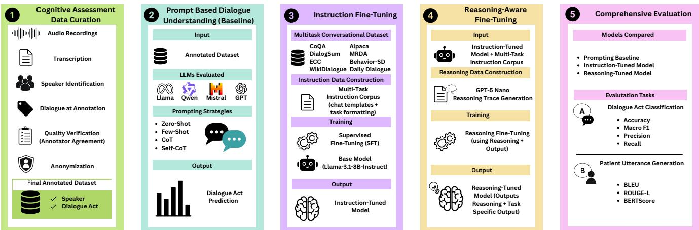
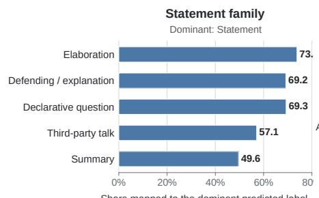
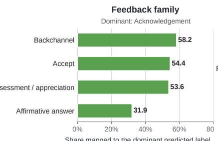
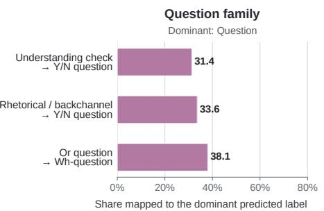
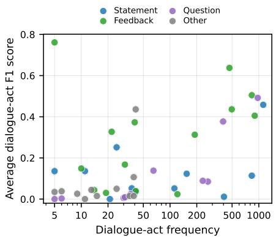

# Understanding Clinical Cognitive Dialogues Using Large Language Models

Vishalakshi Arumugam, Dan Schumacher, Veronica Rammouz, Enrique Gonzalez Guerrero,

Jeremy Davis, and Anthony Rios

College of AI, Cyber and Computing

University of Texas at San Antonio, USA

{vishalakshi.arumugam, anthony.rios}@utsa.edu

## Abstract

In-person cognitive assessment is both a test and an interaction. Clinicians explain tasks, repair misunderstandings, and adapt to patient responses, while patients may hesitate, seek clarification, or disengage. Yet clinical dialogue resources rarely label the interaction structure needed to study these behaviors at scale. We present an de-identified corpus of 33 cognitive assessment conversations with 8,250 utterances annotated for three speaker roles and 56 dialogue acts. We use this corpus to benchmark large language models on fine-grained dialogue-act classification and next-patientutterance generation. We also test whether out-of-domain instruction data and explanation-augmented training transfer to this clinical setting. Instruction tuning produces the strongest patient-utterance reference matching and improves classification accuracy. Reasoning-aware fine-tuning produces the strongest classification results among the LLaMA-3.1-8B variants. However, even the best models struggle to separate closely related dialogue acts, showing that broad conversational intent is easier to recognize than fine-grained communicative function. The corpus and benchmark make interaction structure measurable in cognitive assessments and support follow-up work on conversational markers, clinician education, and carefully validated simulated patients. This work does not make diagnostic claims. Instead, it provides the data and evaluation framework needed to study these applications.

## Introduction

In-person cognitive assessments are used to evaluate memory, reasoning, language, and executive function, especially among older adults who may have cognitive impairment. These assessments are not simply collections of questions and scored answers. They unfold through interaction. Clinicians explain tasks, reformulate questions, check understanding, and respond to confusion, while patients may hesitate, request clarification, revise an answer, or rely on an accompanying family member. Variation in how a cognitive test is administered can affect patients’ understanding and responses to tests (Jones, Drew, and Jackson 2019). These interactions are part of the assessment process, but they are difficult to study across long, multi-party conversations.

Most computational work on cognitive impairment has focused on acoustic or linguistic markers in patient speech and on predicting cognitive or diagnostic categories (Luz et al. 2021). A recent review found that NLP research on dementia remains centered on detection and called for broader datasets, tasks, and clinically grounded applications (Peled-Cohen and Reichart 2025). Final predictions alone do not capture how an assessment was conducted, how clinicians and patients responded to each other, or where misunderstanding and conversational repair occurred. Studying these interaction patterns could support research on assessment administration, patient participation, and associations between conversation structure and cognitive outcomes. It could also inform training materials for clinicians and neuropsychologists. There is a need is an annotated resource and reliable methods for measuring these interactions.

Dialogue acts provide a structured representation of conversational function. They describe whether an utterance asks a question, provides information, acknowledges a response, or requests clarification (Searle 1969; Stolcke et al. 2000). Later frameworks extended dialogue-act annotation to represent communicative intent, turn management, and discourse structure (Core and Allen 1997; Popescu-Belis 2005; Bunt et al. 2012). Work on general conversations and meetings has shown that context, speaker roles, and turn structure are important for recognizing these functions (Shriberg et al. 2004; Zelasko, Pappagari, and Dehak˙ 2021; He et al. 2021; Qamar, Pyarelal, and Huang 2023).

Clinical dialogue research has applied related methods to distress detection, dementia recognition, counseling, and conversational behavior (Gratch et al. 2014; Malhotra et al. 2022; Hoxha et al. 2016). However, existing resources focus on general interviews, counseling conversations, or short structured tasks. Cognitive assessments present a different setting. They contain repeated procedures, closely related question types, short patient responses, changing clinician strategies, and subtle differences in communicative intent. Caregivers or family members may also participate. Existing public resources rarely combine fine-grained dialogueact labels, explicit speaker roles, surrounding context, and multi-party cognitive assessment conversations.

Models of interaction structure could eventually support simulated-patient systems for education. Virtual patients can provide controlled scenarios for practicing clinical reasoning and communication, but they should complement rather than replace contact with real patients and must be carefully validated (Kononowicz et al. 2019). Before such systems can be considered, we must determine whether models can recognize communicative intent and generate contextually appropriate responses. We therefore study patient utterance generation as a controlled benchmark of contextual response modeling, not as evidence that a model can replace a patient or accurately simulate cognitive impairment.

We introduce an de-identified corpus of 33 in-person cognitive assessment conversations containing 28,592 utterances. Of these, 8,250 are annotated with three speaker roles and 56 fine-grained dialogue acts. Three annotators independently labeled the data, with difficult cases adjudicated by a board-certified clinical neuropsychologist. We use this resource to study two related tasks. Dialogue-act classification tests whether models can distinguish closely related communicative functions. Patient utterance generation tests whether they can produce a response that fits the preceding conversation and available patient metadata.

We compare prompting, instruction tuning, and reasoning-aware fine-tuning. For training-based adaptation, we construct a 41,836-example corpus covering dialogue understanding, question answering, summarization, behavioral dialogue, emotion reasoning, and instruction following. We also create a reasoning-enhanced version with teacher-generated explanations. The results show that adaptation effects depend on the task and metric. Instruction tuning produces the strongest patient-utterance reference matching and improves classification accuracy. Reasoning-aware fine-tuning provides the clearest classification gains for LLaMA-3.1-8B. However, all models remain much better at recognizing broad categories such as statements, questions, and feedback than at separating fine-grained functions within those categories.

The immediate contribution of this work is research infrastructure rather than a clinical system. The corpus supports future study of dialogue-act sequences, conversational repair, speaker participation, and their relationships with assessment outcomes. To facilitate follow-up work, we will release the annotation guidelines, label definitions, patientlevel task splits, prompts, training and evaluation code, and model outputs. Access to de-identified transcripts will follow Institutional Review Board requirements and applicable data-use agreements.

Our contributions are: 1) We introduce a de-identified corpus of 33 cognitive assessment conversations with 8,250 utterances annotated for three speaker roles and 56 finegrained dialogue acts. 2) We establish benchmarks for finegrained dialogue-act classification and context-based patient utterance generation in cognitive assessment conversations. 3) We construct a 41,836-example multi-task instruction corpus and a reasoning-enhanced version to study transfer from out-of-domain dialogue supervision. 4) We show that adaptation methods have task-dependent effects and identify a central limitation of current models: broad conversationa intent transfers more reliably than fine-grained communicative function. 5) We provide a release plan for the annotation resources, task splits, prompts, code, and model outputs to support reproducible follow-up research.

## Related Work

Clinical Dialogue Understanding. Dialogue acts describe the purpose of an utterance, such as asking a question, giving information, acknowledging a response, or requesting clarification (Searle 1969; Farzana, Valizadeh, and Parde 2020). General-domain datasets such as Switchboard, ICSI, HCRC Map Task, and AMI established common annotation schemes and benchmarks for dialogue-act classification (Jurafsky, Shriberg, and Biasca 1997; Janin et al. 2003; Shriberg et al. 2004; Carletta et al. 1997; 2006). Clinical resources later extended dialogue analysis to dementia assessment, clinical interviews, and mental health counseling (Luz et al. 2021; Pope and Davis 2011; Gratch et al. 2014; Malhotra et al. 2022).

Several frameworks capture the structure of clinical communication. Bunt et al. (2012) represents dialogue acts across semantic dimensions (Bunt et al. 2012), DREAM adapts DAMSL to clinical research interactions (Hoxha et al. 2016), and RIAS models task, relational, and affective functions in physician–patient conversations (Roter and Larson 2002). We use the fine-grained MRDA taxonomy as the basis for our annotation scheme (Dhillon et al. 2004). Dialogue-act methods have progressed from statistical models using lexical, prosodic, and contextual features (Stolcke et al. 2000) to neural models that capture longer conversational context (Nasreen, Hough, and Purver 2021). However, current language models still struggle to distinguish closely related dialogue acts (Qamar, Tong, and Huang 2025). Clinical studies have also used smaller dialogue-act sets for dialogue management, cognitive screening, and dementia detection (Gupta et al. 2018; Farzana, Valizadeh, and Parde 2020; Li et al. 2022). Our work instead studies 56 finegrained dialogue acts in structured cognitive assessments and evaluates classification and patient utterance generation.

Instruction Tuning. Instruction tuning adapts pretrained models using collections of instruction–response pairs and can improve generalization across tasks (Wei et al. 2021). Related work combines supervised tuning with human feedback to improve instruction following (Ouyang et al. 2022). Self-Instruct reduces the need for manually written examples by generating new instruction data automatically (Wang et al. 2023), while Alpaca showed that teacher-generated instruction data can support effective adaptation of open models (Taori et al. 2023). These methods have been studied mainly on general tasks such as question answering and summarization (Wei et al. 2021; Wang et al. 2023; Taori et al. 2023). We test whether dialogue-focused instruction data transfers to structured clinical conversations and whether it improves both dialogue-act classification and patient utterance generation.

Reasoning-Aware Fine-Tuning. Chain-of-Thought prompting asks a model to produce intermediate reasoning before its answer (Wei et al. 2022). STaR extends this idea by training models on generated reasoning traces (Zelikman et al. 2022), while Orca uses explanations from a stronger teacher model as supervision (Mukherjee et al. 2023). Most prior work evaluates reasoning supervision on mathematics, question answering, or coding. Its value for dialogue understanding is less clear, especially when intent depends on speaker roles and prior turns. We compare prompting, instruction tuning, and reasoning-aware fine-tuning under the same clinical setting to determine whether their effects differ across classification and generation.

<table><tr><td>Statistic</td><td>Value</td></tr><tr><td>Number of Patients</td><td>33</td></tr><tr><td>Total Utterances</td><td>28,592</td></tr><tr><td>Annotated Utterances</td><td>8,250</td></tr><tr><td>Average Utterance Length (words)</td><td>5.12</td></tr><tr><td>Standard Deviation of Length</td><td>5.19</td></tr><tr><td>Speaker Roles</td><td>3</td></tr><tr><td>Dialogue-Act Labels</td><td>56</td></tr></table>

Table 1: Statistics of the cognitive assessment corpus.

## Methodology

Figure 1 summarizes how we construct an annotated corpus and train models.

## Clinical Cognitive Assessment Corpus

Data Collection and Transcription. The corpus contains 33 in-person cognitive assessments collected through a large university hospital system. Each conversation includes a clinician and patient and may also include a caregiver or family member. Abridge’s digital scribe system produced the initial transcripts. Four Ph.D. students manually corrected transcription and speaker errors with guidance from a board-certified clinical neuropsychologist (ABPP). All transcripts were de-identified before annotation. The full corpus contains 28,592 utterances. From these conversations, 8,250 utterances were selected for annotation by selecting consecutive sections focused on cognitive testing while excluding general conversation that could disclose PII. The Supplementary Material provides further corpus characterization, including clinician participation, accompanying persons, cognitive-status groups, assessment procedures, conversation lengths, recruitment criteria, and repeated clinicians or assessment templates, as well as additional details on de-identification and controlled data access. Table 1 reports the corpus statistics.

Annotation. Each utterance received two labels: a speaker role and a dialogue act. The speaker roles are CLINICIAN, PATIENT, and ACCOMPANYING PERSON. The dialogue-act schema contains 56 labels based on the Meeting Recorder Dialogue Act framework (Dhillon et al. 2004). This taxonomy is important because several labels capture communication behaviors with direct clinical relevance. UNDER-STANDING CHECK and clarification or repair capture efforts to establish shared understanding; memory-clinic clinicians often fail to check understanding, while patient-initiated clarification has been associated with later treatment adherence (Visser et al. 2019; McCabe et al. 2013). OPEN-ENDED QUESTION, ELABORATION, and fine-grained question labels capture information elicitation and response structure, which are associated with patient disclosure and distinguish conversational profiles in memory-clinic consultations (Roter and Hall 1987; Jones et al. 2016). THIRD-PARTY TALK and the ACCOMPANYING PERSON role capture triadic communication, where companions may assume a larger role when patient understanding is uncertain (Windeatt-Harrison et al. 2026). Table 2 provides examples. Three Ph.D. student annotators independently labeled all 8,250 utterances. A custom Streamlit interface (See Supplementary Material) displayed the target utterance together with the preceding and following turns. This allowed annotators to use the surrounding context when assigning labels.

<table><tr><td>Utterance</td><td>Speaker</td><td>Dialogue Act</td></tr><tr><td>Have you seen audiology?</td><td>Clinician</td><td>Wh-Question</td></tr><tr><td>No</td><td>Patient</td><td>Negative Answer</td></tr><tr><td>Yeah</td><td>Accompanying Person</td><td>Acknowledgement</td></tr></table>

Table 2: Examples with speaker-role and dialogue-act labels.

We assessed inter-annotator agreement separately at the corpus and label levels. For dialogue acts, na¨ıve agreement was 71.42% and Fleiss $\kappa = . 4 5 7 ;$ for speaker roles, na¨ıve agreement was 92.02% and Fleiss’ κ = .713. The Supplementary Material reports support and mean pairwise Cohen’s κ for every label. Speaker-role agreement was substantial for CLINICIAN (κ = .794) and PATIENT (κ = .756), and moderate for ACCOMPANYING PERSON (n = 562, κ = .552). Dialogue-act reliability varied across the taxonomy: NEGATIVE ANSWER (n = 441, κ = .858), Y/N QUES-TION (n = 946, $\kappa ~ = ~ . 6 9 7 )$ , and BACKCHANNEL (n = 909, κ = .602) showed comparatively strong agreement, whereas DEFENDING/EXPLANATION (n = 479, κ = .203) was more difficult to distinguish. Across the 56 dialogue acts κ was as high as .858.

Three annotators independently assigned speaker roles and dialogue acts using the MRDA-based definitions, annotation guidelines, and surrounding dialogue context. When two annotators selected the same label, that majority label was retained; cases without a majority or requiring clinical interpretation were reviewed by the board-certified clinical neuropsychologist. We refer to the resulting annotations as adjudicated consensus labels, which operationalize the annotation scheme rather than establish a uniquely correct interpretation. Representative cases included STATEMENT versus ELABORATION or DEFENDING/EXPLANATION, ACKNOWLEDGEMENT versus BACKCHANNEL or ACCEPT, and Y/N QUESTION versus UNDERSTANDING CHECK. These also motivate our family-level error analysis. Accordingly, we report label-wise reliability, emphasize Macro-F1 under class imbalance, and interpret performance on rare or low-agreement labels as agreement with the operational taxonomy rather than error against unambiguous ground truth. This treatment is consistent with the documented difficulty of fine-grained dialogue-act annotation (Xu et al. 2023; Cai et al. 2025).

## Model Training

Prompting Baselines. For dialogue-act classification, each model receives the target utterance, its dialogue context, the complete set of labels, and the annotation guidelines. The model must return exactly one of the 56 labels. We use the same instructions and output format for all models. We evaluated zero-shot, few-shot, and CoT prompting.

  
Figure 1: Overview of the data construction, model adaptation, and evaluation tasks.

<table><tr><td>Dataset</td><td>Task</td><td>Records</td></tr><tr><td>Alpaca</td><td>Instruction Following</td><td>25,000</td></tr><tr><td>DailyDialog</td><td>General Conversation</td><td>4,500</td></tr><tr><td>ECC</td><td>Emotion and Cause Reasoning</td><td>3,836</td></tr><tr><td>Behavior-SD</td><td>Behavioral Dialogue</td><td>2,500</td></tr><tr><td>WikiDialogue</td><td>Dialogue Act</td><td>2,500</td></tr><tr><td>CoQA</td><td>Question Answering</td><td>2,000</td></tr><tr><td>MRDA</td><td>Meeting Dialogue Acts</td><td>1,000</td></tr><tr><td>DialogSum</td><td>Dialogue Summarization</td><td>500</td></tr><tr><td>Total</td><td>Instruction Corpus</td><td>41,836</td></tr></table>

Table 3: Composition of the multi-task instruction corpus.

Instruction Tuning. We construct a multi-task instruction corpus from eight public datasets: Alpaca, DailyDialog, ECC, Behavior-SD, WikiDialogue, CoQA, MRDA, and DialogSum. The final corpus contains 41,836 instruction– response pairs. Table 3 reports its composition. The datasets were selected to cover skills needed for dialogue modeling, including instruction following, dialogue-act recognition, question answering, summarization, emotion reasoning, and conversational response generation. These datasets do not reproduce the clinical data distribution. Instead, they allow us to test whether general knowledge of dialogue transfers to cognitive assessment conversations.

We convert each example into the same format with three parts: an instruction, an input, and a target response. We preserve the original labels and reference responses from each dataset. No examples from the clinical evaluation corpus are included in the instruction-tuning data. Any improvement therefore reflects transfer from out-of-domain supervision rather than training on the evaluation conversations.

Reasoning-Aware Fine-Tuning. We create a second version of the instruction corpus with teacher-generated explanations. For each example, GPT-5-nano receives the instruction, input, and correct target response. It produces a short explanation of the evidence supporting the response.

The training target contains the explanation followed by the original response. We evaluate two reasoning-aware models. The first is trained from the base LLaMA-3.1-8B model. The second begins from the instruction-tuned LLaMA-3.1- 8B checkpoint. This design separates the effect of reasoning supervision from the effect of instruction tuning. The explanations are used only as training supervision. We do not treat them as faithful descriptions of a model’s internal reasoning. We also do not generate reasoning traces from the clinical evaluation corpus.

## Evaluation Tasks

Dialogue-Act Classification. Dialogue-act classification is a 56-class prediction task. For each target utterance, the model receives the surrounding dialogue and predicts one dialogue-act label. This task measures whether the model can distinguish fine-grained communicative functions.

Patient Utterance Generation. Patient utterance generation tests whether a model can generate the next patient utterance from the preceding dialogue. Let a conversation be $C = ( x _ { 1 } , \dots , x _ { T } )$ , where each turn ${ \boldsymbol { x } } _ { t } = \left( { \boldsymbol { s } } _ { t } , { \boldsymbol { w } } _ { t } \right)$ contains a speaker role s and utterance w . For each patient turn, the input contains the preceding h turns, where $h \in \{ 1 , \ldots , 5 \}$ and conversation-level metadata m. The metadata include cognitive status and whether an accompanying person is present. The task is $p ( w _ { t } \mid x _ { t - h : t - 1 } , m )$ . The input presents the metadata followed by the dialogue turns in chronological order using the format Speaker: Utterance. The model is instructed to return only the next patient utterance.

This task measures how well the generated text matches the observed patient response given the same context and metadata. It does not test whether the model can replace a patient or produce clinically valid responses for direct use.

## Results

Experimental Protocol. All 33 clinical conversations (8,250 annotated utterances) were reserved exclusively for evaluation; model training used only the 41,836-example out-of-domain instruction corpus, and no clinical utterance was included in model adaptation. For dialogue-act classification, all models used the same task instructions, label definitions, dialogue-context construction, fixed fewshot demonstrations drawn outside the clinical corpus, and exact-label output parsing, with nonconforming responses counted as invalid. Zero-shot, few-shot, and Chainof-Thought (CoT); patient-utterance generation used direct next-utterance prompting without CoT. Because utterances are clustered within conversations, uncertainty was estimated using conversation-level bootstrap resampling. Complete prompts, demonstration counts and provenance, context-window definitions, parsing rules, decoding and training hyperparameters, and bootstrap procedures are provided in the Supplementary Material.

Dialogue-Act Classification. Table 4 reports dialogue-act classification results for all models and prompting strategies. Because the dataset has a highly imbalanced label distribution, we treat Macro-F1 as the main metric. Accuracy and Weighted-F1 provide additional measures that give more weight to common dialogue acts. The strongest result depends on the metric. Mistral3-24B with few-shot prompting obtains the highest Macro-F1 at .207. Qwen3-30B with instruction tuning obtains the highest Accuracy at .480, while the original Qwen3-30B with CoT prompting obtains the highest Weighted-F1 at .414. These differences show that overall accuracy and balanced performance do not always improve together.

Effect of Instruction Tuning Instruction tuning improves overall task fit, but its effect differs across metrics. For LLaMA3.1-8B, the best Accuracy increases from .292 to .337. However, the best Macro-F1 decreases from .135 to .102. A similar pattern appears for Qwen3-30B. Instruction tuning increases its best Accuracy from .439 to .480, while its best Macro-F1 decreases from .194 to .175.

These results suggest that instruction tuning helps the models learn the task format and recognize common dialogue acts. However, it does not improve balanced performance across all 56 labels. In particular, gains in Accuracy should not be treated as evidence of stronger performance on rare dialogue acts.

Comparison to Supervised Classification. We evaluate prompting to supervised baselines in Table 5. In this setting, we split the entire dataset into training, validation, and test sets of size 5,000, 750, and 2,500 examples, respectively. Splits are based on patients, not individual utterances, to avoid training data leakage. Overall, we find that, even with substantial instruction tuning, reasoning training, and few-shot examples, LLMs are unable to match the performance of simple supervised baselines. This further suggests the need for future research on improved clinical dialogue understanding in LLMs.

Effect of Reasoning-Aware Fine-Tuning. Reasoningaware fine-tuning produces the strongest results among the LLaMA3.1-8B variants. The Reasoning (Base) model reaches .423 Accuracy and .151 Macro-F1 with zeroshot prompting. Compared with the strongest original LLaMA3.1-8B result, this represents a 13.1 percentagepoint increase in Accuracy and a 1.6-point increase in

<table><tr><td>Model</td><td>Prompt</td><td>Acc.</td><td>mF1</td><td>wF1</td></tr><tr><td colspan="5">Dummy Baselines</td></tr><tr><td>Majority Classifier</td><td></td><td>.136</td><td>.004</td><td>.033</td></tr><tr><td>Random Classifier (Stratified)</td><td></td><td>.081</td><td>.019</td><td>.081</td></tr><tr><td>Random Classifier (Uniform)</td><td></td><td>.018</td><td>.010</td><td>.027</td></tr><tr><td colspan="5">Baseline Model</td></tr><tr><td>LLaMA3.1-8B</td><td>Zero-shot</td><td>.234</td><td>.117</td><td>.239</td></tr><tr><td></td><td>Few-shot</td><td>.248</td><td>.099</td><td>.188</td></tr><tr><td></td><td>CoT</td><td>.292</td><td>.135</td><td>.295</td></tr><tr><td>Gemma3-12B</td><td>Zero-shot</td><td>.382</td><td>.151</td><td>.326</td></tr><tr><td></td><td>Few-shot</td><td>.412</td><td>.179</td><td>.349</td></tr><tr><td></td><td>CoT</td><td>.411</td><td>.165</td><td>.342</td></tr><tr><td>Qwen3-30B</td><td>Zero-shot</td><td>.420</td><td>.183</td><td>.392</td></tr><tr><td></td><td>Few-shot</td><td>.439</td><td>.194</td><td>.408</td></tr><tr><td>Mistral3-24B</td><td>CoT</td><td>.439</td><td>.193</td><td>.414</td></tr><tr><td></td><td>Zero-shot</td><td>.417</td><td>.194</td><td>.382</td></tr><tr><td></td><td>Few-shot CoT</td><td>.450 .409</td><td>.207 .185</td><td>.393 .344</td></tr><tr><td colspan="5">Instruction-Tuned Model</td></tr><tr><td>LLaMA3.1-8B + Instruction FT</td><td>Zero-shot</td><td>.316</td><td>.096</td><td>.222</td></tr><tr><td></td><td>Few-shot</td><td>.337</td><td>.102</td><td>.259</td></tr><tr><td></td><td>CoT</td><td>.330</td><td>.083</td><td>.250</td></tr><tr><td>Qwen3-30B + Instruction FT</td><td>Zero-shot</td><td>.480</td><td>.172</td><td>.407</td></tr><tr><td></td><td>Few-shot</td><td>.462</td><td>.169</td><td>.377</td></tr><tr><td></td><td>CoT</td><td>.480</td><td>.175</td><td>.405</td></tr><tr><td colspan="5">Reasoning-Aware Fine-Tuned Models</td></tr><tr><td>LLaMA3.1-8B + Reasoning (Base)</td><td>Zero-shot</td><td>.423</td><td>.151</td><td>.357</td></tr><tr><td></td><td>Few-shot</td><td>.414</td><td>.142</td><td>.337</td></tr><tr><td></td><td>CoT</td><td>.407</td><td>.142</td><td>.341</td></tr><tr><td>LLaMA3.1-8B + Reasoning (Instruction)</td><td>Zero-shot</td><td>.396</td><td>.130</td><td>.328</td></tr><tr><td></td><td>Few-shot</td><td>.402</td><td>.158</td><td>.339</td></tr><tr><td></td><td>CoT</td><td>.380</td><td>.126</td><td>.323</td></tr></table>

Table 4: Performance comparison of prompting strategies, instruction tuning, and reasoning-aware fine-tuning for dialogue act classification.

Macro-F1. The Reasoning (Instruction) model achieves the highest LLaMA Macro-F1, .158, with few-shot prompting. However, it does not consistently outperform Reasoning (Base). The results therefore support the reasoningaware training procedure as an effective form of adaptation for LLaMA3.1-8B, but they do not show that starting from the instruction-tuned checkpoint is always better. The reasoning-aware LLaMA models also remain below the best larger models in Macro-F1. Mistral3-24B reaches .207, and Qwen3-30B reaches .194. Model scale and the quality of the original instruction tuning therefore remain important.

Effect of Prompting The best prompting method varies by model. Few-shot prompting produces the highest Macro-F1 for Gemma3-12B, Qwen3-30B, Mistral3-24B, and the Reasoning (Instruction) model. CoT prompting gives the strongest original LLaMA3.1-8B result, but it reduces performance for several other models. The reasoning-aware models are less sensitive to the prompt choice than the original LLaMA3.1-8B model. For Reasoning (Base), Macro-F1 ranges from .142 to .151 across the three prompting methods. This suggests that training-based adaptation provides more stable performance than prompt changes alone. Overall, few-shot examples are often useful, whereas CoT does not consistently benefit dialogue-act classification.

<table><tr><td>Model</td><td>Acc.</td><td>mF1</td><td>wF1</td></tr><tr><td>Dummy (Majority)</td><td>.139</td><td>.004</td><td>.034</td></tr><tr><td>Dummy (Uniform)</td><td>.018</td><td>.010</td><td>.026</td></tr><tr><td>Linear SVM</td><td>.546</td><td>.157</td><td>.511</td></tr><tr><td>RoBERTa-Large</td><td>.681</td><td>.266</td><td>.668</td></tr><tr><td>BioMedBERT</td><td>.654</td><td>.164</td><td>.612</td></tr><tr><td>LLaMA3.1-8B + Reasoning (Base)</td><td>.418</td><td>.113</td><td>.342</td></tr></table>

Table 5: Performance comparison of prompting vs. supervised models.

Table 6 reports patient utterance generation results using five preceding turns. Instruction-tuned LLaMA3.1-8B obtains the highest BLEU score at .043 and ties for the highest BERTScore-F1 at .906. Instruction-tuned Qwen3-30B obtains the highest ROUGE-1 and ROUGE-L scores at .184 and .181. It also achieves the second-highest BLEU score of .041. Instruction tuning improves the two models for which matched comparisons are available. For LLaMA3.1- 8B, BLEU increases from .023 to .043, while ROUGE-L increases from .136 to .175. For Qwen3-30B, BLEU increases from .025 to .041, while ROUGE-L increases from .161 to .181. Both reasoning-aware LLaMA variants also improve over the original LLaMA3.1-8B model. However, neither exceeds instruction tuning. These results indicate that the multi-task instruction corpus provides the clearest benefit for matching the observed patient responses. BERTScore varies less than the lexical metrics. Most models obtain scores between .898 and .906. This suggests that several systems produce responses with broadly similar meanings, even when their wording differs from the recorded response.

Performance Across Cognitive-Status Groups. We also compare generation performance across cognitive-status groups. This analysis is descriptive because the groups contain different numbers of patient turns (See results in the Supplementary Material). Instruction tuning improves lexical overlap for the largest groups, including Mild Cognitive Impairment and Normal cognition. The reasoningaware models show their strongest relative performance on Dementia conversations, achieving higher ROUGE-L and BERTScore-F1 within that group. BERTScore remains near .89–.91 across most conditions, while BLEU and ROUGE vary more across groups. This pattern is consistent with the overall results: generated responses often preserve broad meaning, but they do not always reproduce the wording of the recorded patient response.

Error Analysis. Aggregate metrics do not show which dialogue acts remain difficult. We therefore examine the errors shared across the 24 experimental settings, covering eight model variants and three prompting strategies. This pooled analysis identifies common classification problems across the evaluated systems. It is not designed to isolate the effect of one prompting or training method.

Systematic Confusion Analysis. The errors follow clear patterns. Models often identify the broad purpose of an utterance but fail to select the more specific label within that dialogue-act family. Figure 2 summarizes the most common confusions. The largest errors occur within three families. In the statement family, Elaboration, Defending/Explanation, and Summary are often predicted as the general Statement label. For example, 73.8% of errors for Elaboration map to Statement, as do 69.2% of errors for Defending/Explanation.

A similar pattern appears for feedback acts. Backchannel, Accept, and Assessment/Appreciation are often predicted as Acknowledgement. Within the question family, models confuse specific forms with broader question labels. For example, Understanding Check is often predicted as Y/N Question, while Or Question is often predicted as Wh-Question.

These errors are more often within a related dialogue-act family than across unrelated families. The models therefore capture coarse conversational intent better than fine-grained communicative function. Distinguishing these labels may require longer context, clearer label definitions, or more direct supervision for the boundary between related acts.

Sources of Classification Difficulty. Many rare dialogue acts have low F1 scores. Examples include Tag Question, Commitment, and NonSpeech. This pattern is consistent with the limited number of examples available for these labels.

Frequency is not the only source of difficulty. Several common acts also have low F1 scores, including Defending/Explanation, Open-ended Question, Accept, and Understanding Check. These labels have more examples but remain close in meaning to other labels in the same family.

The two analyses point to different problems. Rare labels may need more training examples. Common but ambiguous labels may instead need clearer decision rules, longer dialogue context, or models that better represent the relation between an utterance and the surrounding turns. Adding more examples alone may not solve errors caused by overlapping label definitions.

Discussion. Our results show that LLMs do not reliably understand dialogue at the level required for fine-grained clinical analysis. Models often recognize whether an utterance is a statement, a question, or a form of feedback, but they struggle to distinguish among closely related functions within these groups. The strongest Macro-F1 is only .207, despite an Accuracy of .48. This shows that models rely on common dialogue patterns and do not consistently capture the specific communicative intent of each turn.

Better training helps, but it does not solve this problem. Instruction tuning improves Accuracy and patient-response matching, while reasoning-aware fine-tuning improves the LLaMA classification baseline. However, neither approach produces strong performance across all 56 dialogue acts. Reasoning supervision also does not consistently outperform standard instruction tuning. Future work should therefore focus on training methods that model speaker roles, longer conversational context, turn relationships, and the boundaries between similar dialogue acts. Additional indomain training and clinically informed label definitions may also be needed.

These limitations are especially important in cognitive assessments, where test administration occurs through interaction rather than through fixed questions alone. Prior work shows that differences in how clinicians introduce, reformulate, and administer cognitive test items can affect patient understanding and responses (Jones, Drew, and Jackson 2019). Interactional patterns during memory-clinic assessments, including response timing, handling of compound questions, and displays of working memory, may also provide clinically relevant information (Jones et al. 2016). Clarification and conversational repair are central to identifying and resolving misunderstandings in clinician–patient communication (McCabe and Healey 2018). More broadly, clinical communication can affect care through shared understanding, decision quality, therapeutic relationships, and patient participation (Street Jr et al. 2009). Models should therefore not be used to evaluate clinicians, infer cognitive status, or support clinical decisions until they can more reliably distinguish these interactional functions. Future studies should compare model errors with annotator disagreement, evaluate broader dialogue-act families, and test whether interaction patterns are associated with assessment quality, patient understanding, or clinical outcomes.

<table><tr><td>Model</td><td>BLEU</td><td>ROUGE-1</td><td>ROUGE-2</td><td>ROUGE-L</td><td>BERTScore-F1</td></tr><tr><td>Gemma-3-12B</td><td>.021</td><td>.140</td><td>.033</td><td>.139</td><td>.906</td></tr><tr><td>Qwen3-30B</td><td>.025</td><td>.168</td><td>.038</td><td>.161</td><td>.898</td></tr><tr><td>Qwen3-30B (Instruction)</td><td>.041</td><td>.184</td><td>.037</td><td>.181</td><td>.901</td></tr><tr><td>Mistral-3-24B</td><td>.018</td><td>.157</td><td>.023</td><td>.153</td><td>.874</td></tr><tr><td>LLaMA-3.1-8B</td><td>.023</td><td>.139</td><td>.026</td><td>.136</td><td>.900</td></tr><tr><td>LLaMA-3.1-8B (Instruction)</td><td>.043</td><td>.178</td><td>.036</td><td>.175</td><td>.906</td></tr><tr><td>LLaMA-3.1-8B (Reasoning)</td><td>.037</td><td>.171</td><td>.033</td><td>.169</td><td>.904</td></tr><tr><td>LLaMA-3.1-8B (Reasoning + Instruction)</td><td>.035</td><td>.176</td><td>.030</td><td>.174</td><td>.905</td></tr></table>

Table 6: Patient utterance generation performance (k = 5). Best results are shown in bold and second-best results are underlined.

  
Figure 2: Dominant prediction patterns within each dialogue-act family. Each bar shows the percentage of examples mapped to the family’s dominant predicted label.

  
Figure 3: Dialogue-act frequency versus average F1, grouped by dialogue-act family.

The patient-generation results should be interpreted only as reference matching. BLEU, ROUGE, and BERTScore do not show that a generated response is clinically plausible, safe, or representative of a person with a particular cognitive condition. However, they are a good initial test bed for understanding how well LLMs can simulate the utterances of cognitively impaired patients. Future work should continue to improve these. But, more importantly, clinical experts must evaluate these properties before generated responses are used in simulated-patient education. Future work should also test for inaccurate or stereotyped representations of people with cognitive impairment.

Dataset Release. We will release the annotation guidelines, label definitions, patient-level task splits, prompts, training code, evaluation code, and model outputs. Because the transcripts contain sensitive clinical conversations, the deidentified transcripts will not be posted publicly. They will be provided to researchers who submit documentation of IRB approval or a formal determination that IRB review is not required, subject to the applicable data-use agreement. We will release a standard request form to make this process clear and consistent. Our goal is to provide the data to all qualified researchers who complete these requirements.

## Conclusion

We evaluated prompting, instruction tuning, and reasoningaware fine-tuning for dialogue-act classification and patient utterance generation in cognitive assessments. Adaptation improved some results, but models still recognized broad dialogue categories more reliably than fine-grained communicative functions. Future work should study longer context, clinically informed labels, in-domain supervision, and expert evaluation before clinical use.

## References

Bunt, H.; Alexandersson, J.; Choe, J.-W.; Fang, A. C.; Hasida, K.; Petukhova, V.; Popescu-Belis, A.; and Traum, D. 2012. ISO 24617-2: A semantically-based standard for dialogue annotation. In Calzolari, N.; Choukri, K.; Declerck, T.; Dogan, M. U.; Maegaard, B.; Mariani, J.; Moreno, A.;˘ Odijk, J.; and Piperidis, S., eds., Proceedings of the Eighth International Conference on Language Resources and Evaluation (LREC’12), 430–437. Istanbul, Turkey: European Language Resources Association (ELRA).

Cai, J.; King, B.; Cameron, P.; Brown, S. W.; Eckert, M.; Srinivas, D.; Baker, G.; Everson, V. K.; Palmer, M.; Martin, J. H.; et al. 2025. In search of the lost arch in dialogue: A dependency dialogue acts corpus for multi-party dialogues. In Findings of the Association for Computational Linguistics: ACL 2025, 20135–20149.

Carletta, J.; Isard, A.; Isard, S.; Kowtko, J. C.; Doherty-Sneddon, G.; and Anderson, A. H. 1997. The reliability of a dialogue structure coding scheme. Computational Linguistics 23(1):13–31.

Carletta, J.; Ashby, S.; Bourban, S.; Flynn, M.; Guillemot, M.; Hain, T.; Kadlec, J.; Karaiskos, V.; Kraaij, W.; Kronenthal, M.; Lathoud, G.; Lincoln, M.; Lisowska, A.; Mc-Cowan, I.; Post, W.; Reidsma, D.; and Wellner, P. 2006. The ami meeting corpus: A pre-announcement. In Renals, S., and Bengio, S., eds., Machine Learning for Multimodal Interaction, volume 3869. Berlin, Heidelberg: Springer. 28– 39.

Core, M. G., and Allen, J. F. 1997. Coding dialogs with the DAMSL annotation scheme. In Working Notes of the AAAI Fall Symposium on Communicative Action in Humans and Machines, 28–35.

Dhillon, R.; Bhagat, S.; Carvey, H.; and Shriberg, E. 2004. Meeting recorder project: Dialog act labeling guide. Technical report, Defense Technical Information Center, Fort Belvoir, VA.

Farzana, S.; Valizadeh, M.; and Parde, N. 2020. Modeling dialogue in conversational cognitive health screening interviews. In Proceedings of the Twelfth Language Resources and Evaluation Conference, 1167–1177. Marseille, France: European Language Resources Association.

Gratch, J.; Artstein, R.; Lucas, G.; Stratou, G.; Scherer, S.; Nazarian, A.; Wood, R.; Boberg, J.; DeVault, D.; Marsella, S.; Traum, D.; Rizzo, S.; and Morency, L.-P. 2014. The distress analysis interview corpus of human and computer interviews. In Proceedings of the Ninth International Conference on Language Resources and Evaluation (LREC’14), 3123–3128. Reykjavik, Iceland: European Language Resources Association (ELRA).

Gupta, I.; Di Eugenio, B.; Ziebart, B.; Liu, B.; Gerber, B.; Sharp, L.; Davis, R.; and Baiju, A. 2018. Towards building a virtual assistant health coach. In 2018 IEEE International Conference on Healthcare Informatics (ICHI), 419–421.

He, Z.; Tavabi, L.; Lerman, K.; and Soleymani, M. 2021. Speaker turn modeling for dialogue act classification. In Moens, M.-F.; Huang, X.; Specia, L.; and Yih, S. W.-t., eds., Findings of the Association for Computational Linguistics:

EMNLP 2021, 2150–2157. Punta Cana, Dominican Republic: Association for Computational Linguistics.

Hoxha, J.; Chandar, P.; He, Z.; Cimino, J.; Hanauer, D.; and Weng, C. 2016. Dream: Classification scheme for dialog acts in clinical research query mediation. Journal of Biomedical Informatics 59:89–101.

Janin, A.; Baron, D.; Edwards, J.; Ellis, D.; Gelbart, D.; Morgan, N.; Peskin, B.; Pfau, T.; Shriberg, E.; Stolcke, A.; and Wooters, C. 2003. The icsi meeting corpus. In IEEE International Conference on Acoustics, Speech, and Signal Processing (ICASSP’03), volume 1, I–364–I–367.

Jones, D.; Drew, P.; Elsey, C.; Blackburn, D.; Wakefield, S.; Harkness, K.; and Reuber, M. 2016. Conversational assessment in memory clinic encounters: interactional profiling for differentiating dementia from functional memory disorders. Aging & Mental Health 20(5):500–509.

Jones, D.; Drew, P.; and Jackson, C. 2019. Variation and interactional non-standardization in neuropsychological tests: The case of the addenbrooke’s cognitive examination. Qualitative Health Research 30(3):458–470.

Jurafsky, D.; Shriberg, L.; and Biasca, D. 1997. Ws-97 switchboard damsl coders manual.

Kononowicz, A. A.; Woodham, L. A.; Edelbring, S.; Stathakarou, N.; Davies, D.; Saxena, N.; Tudor Car, L.; Carlstedt-Duke, J.; Car, J.; and Zary, N. 2019. Virtual patient simulations in health professions education: Systematic review and meta-analysis by the digital health education collaboration. J Med Internet Res 21(7):e14676.

Li, Y.; Lai, C.; Lala, D.; Inoue, K.; and Kawahara, T. 2022. Alzheimer’s dementia detection through spontaneous dialogue with proactive robotic listeners. In 2022 17th ACM/IEEE International Conference on Human-Robot Interaction (HRI), 875–879. IEEE.

Luz, S.; Haider, F.; de la Fuente Garcia, S.; Fromm, D.; and MacWhinney, B. 2021. Alzheimer’s dementia recognition through spontaneous speech.

Malhotra, G.; Waheed, A.; Srivastava, A.; Akhtar, M. S.; and Chakraborty, T. 2022. Speaker and time-aware joint contextual learning for dialogue-act classification in counselling conversations. In Proceedings of the fifteenth ACM international conference on web search and data mining, 735–745.

McCabe, R., and Healey, P. G. 2018. Miscommunication in doctor–patient communication. Topics in cognitive science 10(2):409–424.

McCabe, R.; Healey, P. G.; Priebe, S.; Lavelle, M.; Dodwell, D.; Laugharne, R.; Snell, A.; and Bremner, S. 2013. Shared understanding in psychiatrist–patient communication: Association with treatment adherence in schizophrenia. Patient education and counseling 93(1):73–79.

Mukherjee, S.; Mitra, A.; Jawahar, G.; Agarwal, S.; Palangi, H.; and Awadallah, A. 2023. Orca: Progressive learning from complex explanation traces of gpt-4. arXiv preprint arXiv:2306.02707.

Nasreen, S.; Hough, J.; and Purver, M. 2021. Rare-class dialogue act tagging for alzheimer’s disease diagnosis. In Proceedings ofthe 22nd Annual Meeting ofthe Special Interest

Group on Discourse and Dialogue, 290–300. Singapore and Online: Association for Computational Linguistics.

Ouyang, L.; Wu, J.; Jiang, X.; Almeida, D.; Wainwright, C. L.; Mishkin, P.; Zhang, C.; Agarwal, S.; Slama, K.; Ray, A.; et al. 2022. Training language models to follow instructions with human feedback. arXiv preprint arXiv:2203.02155.

Peled-Cohen, L., and Reichart, R. 2025. A systematic review of NLP for dementia: Tasks, datasets, and opportunities. Transactions of the Association for Computational Linguistics 13:1204–1244.

Pope, C., and Davis, B. H. 2011. Finding a balance: The carolinas conversation collection. Corpus Linguistics & Linguistic Theory 7(1).

Popescu-Belis, A. 2005. Dialogue acts: One or more dimensions? ISSCO Working Paper 62, ISSCO, University of Geneva, Geneva, Switzerland.

Qamar, A.; Pyarelal, A.; and Huang, R. 2023. Who is speaking? speaker-aware multiparty dialogue act classification. In Bouamor, H.; Pino, J.; and Bali, K., eds., Findings of the Association for Computational Linguistics: EMNLP 2023, 10122–10135. Singapore: Association for Computational Linguistics.

Qamar, A.; Tong, J.; and Huang, R. 2025. Do LLMs Understand Dialogues? a case study on dialogue acts. In Che, W.; Nabende, J.; Shutova, E.; and Pilehvar, M. T., eds., Proceedings of the 63rd Annual Meeting of the Association for Computational Linguistics (Volume 1: Long Papers), 26219–26237. Vienna, Austria: Association for Computational Linguistics.

Roter, D. L., and Hall, J. A. 1987. Physicians’ interviewing styles and medical information obtained from patients. Journal ofGeneral Internal Medicine 2(5):325–329.

Roter, D., and Larson, S. 2002. The roter interaction analysis system (rias): utility and flexibility for analysis of medical interactions. Patient education and counseling 46(4):243– 251.

Searle, J. R. 1969. Speech Acts: An Essay in the Philosophy of Language. Cambridge, England: Cambridge University Press.

Shriberg, E.; Dhillon, R.; Bhagat, S.; Ang, J.; and Carvey, H. 2004. The icsi meeting recorder dialog act (mrda) corpus. In Proceedings ofthe 5th SIGdial Workshop on Discourse and Dialogue at HLT-NAACL 2004, 97–100. Cambridge, MA, USA: Association for Computational Linguistics.

Stolcke, A.; Ries, K.; Coccaro, N.; Shriberg, E.; Bates, R.; Jurafsky, D.; Taylor, P.; Martin, R.; Van Ess-Dykema, C.; and Meteer, M. 2000. Dialogue act modeling for automatic tagging and recognition of conversational speech. Computational Linguistics 26(3):339–374.

Street Jr, R. L.; Makoul, G.; Arora, N. K.; and Epstein, R. M. 2009. How does communication heal? pathways linking clinician–patient communication to health outcomes. Patient education and counseling 74(3):295–301.

Taori, R.; Gulrajani, I.; Zhang, T.; Dubois, Y.; Li, X.; Guestrin, C.; Liang, P.; and Hashimoto, T. B. 2023. Alpaca:

A strong, replicable instruction-following model. Stanford Center for Research on Foundation Models. https://crfm. stanford. edu/2023/03/13/alpaca. html 3(6):7.

Visser, L. N.; Kunneman, M.; Murugesu, L.; van Maurik, I.; Zwan, M.; Bouwman, F. H.; Schuur, J.; Wind, H. A.; Blaauw, M. S.; Kragt, J. J.; et al. 2019. Clinician-patient communication during the diagnostic workup: the abide project. Alzheimer’s & Dementia: Diagnosis, Assessment & Disease Monitoring 11(1):520–528.

Wang, Y.; Kordi, Y.; Mishra, S.; Liu, A.; Smith, N. A.; Khashabi, D.; and Hajishirzi, H. 2023. Self-instruct: Aligning language models with self-generated instructions. In Rogers, A.; Boyd-Graber, J.; and Okazaki, N., eds., Proceedings of the 61st Annual Meeting of the Association for Computational Linguistics (Volume 1: Long Papers), 13484–13508. Toronto, Canada: Association for Computational Linguistics.

Wei, J.; Bosma, M.; Zhao, V. Y.; Guu, K.; Yu, A. W.; Lester, B.; Du, N.; Dai, A. M.; and Le, Q. V. 2021. Finetuned language models are zero-shot learners. arXiv preprint arXiv:2109.01652.

Wei, J.; Wang, X.; Schuurmans, D.; Bosma, M.; Xia, F.; Chi, E.; Le, Q. V.; Zhou, D.; et al. 2022. Chain-of-thought prompting elicits reasoning in large language models. Advances in neural information processing systems 35:24824– 24837.

Windeatt-Harrison, I.; Walker, T.; Wardrope, A.; Bell, S.; Blackburn, D.; Dickson, J.; Jones, S.; and Reuber, M. 2026. Doing understanding during triadic decision-making with people living with dementia. Social Science & Medicine 405.

Xu, K.; Hou, W.; Cheng, Y.; Wang, J.; and Li, W. 2023. Medical dialogue generation via dual flow modeling. In Findings of the Association for Computational Linguistics: ACL 2023, 6771–6784.

Zelasko, P.; Pappagari, R.; and Dehak, N. 2021. What helps˙ transformers recognize conversational structure? importance of context, punctuation, and labels in dialog act recognition. Transactions ofthe Associationfor Computational Linguistics 9:1163–1179.

Zelikman, E.; Wu, Y.; Mu, J.; and Goodman, N. 2022. Star: Bootstrapping reasoning with reasoning. Advances in Neural Information Processing Systems 35:15476–15488.