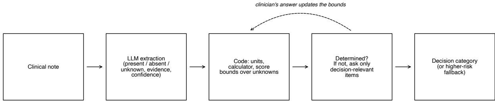
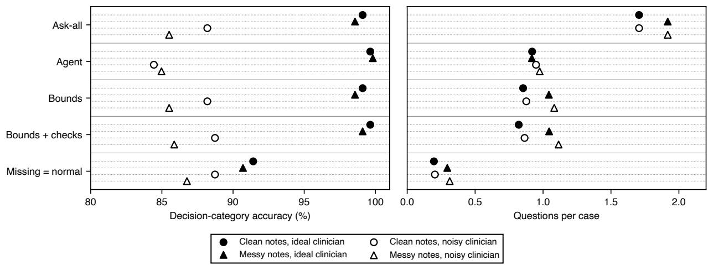
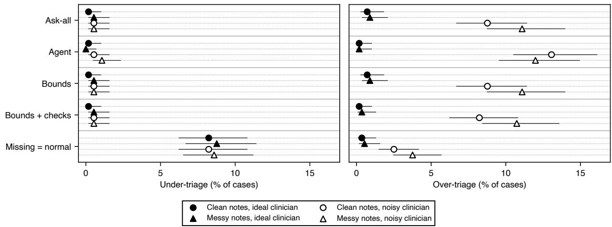
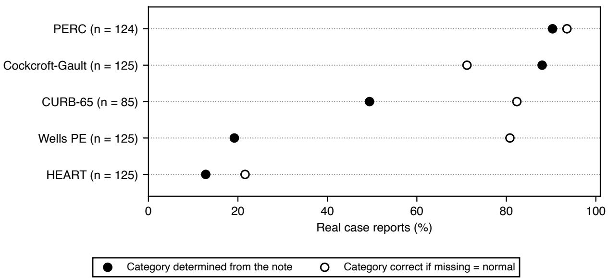
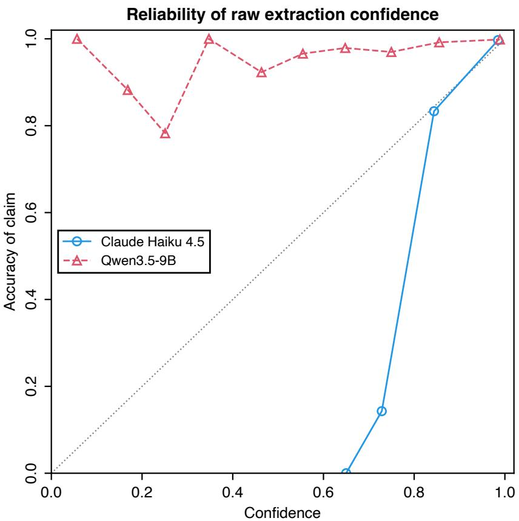

# Unknown is not normal: separating language-model extraction from rule-based decision logic for clinical risk scores

Nicolás Vera Zúñiga Independent Researcher, Chile nicovera@quetru.cl

## Abstract

Large language models (LLMs) are increasingly used to compute clinical risk scores from free-text notes. Notes are often incomplete, and treating undocumented findings as normal can silently misclassify patients. We test whether separating three-state extraction (present, absent or unknown, by an LLM) from decision logic (deterministic code computing score bounds over unknown inputs) lets a system ask only questions that can change the decision. On 1,200 synthetic emergency cases across six calculators (HEART, CURB-65, qSOFA, PERC, Wells, Cockcroft-Gault), with a simulated clinician answering questions, we compared this bounds policy with asking for every missing input, a missing-equals-normal schema, and an end-to-end LLM agent (Claude Opus 5.5). With Claude Haiku 4.5 as extractor, the bounds policy matched ask-all accuracy (99.4% vs 99.4%) with half the questions (0.92 vs 1.78 per case) and no irrelevant ones. Treating missing as normal dropped accuracy to 91.2% and under-triaged 8.5% of patients (95% CI 7.1–10.2), and under-triage persisted under messy notes and a noisy clinician. The agent was equally accurate under ideal conditions (99.6%) but 9.5% of its questions were irrelevant; with a noisy clinician it was less accurate than the bounds policy (83.5% vs 87.0%, p<0.001) and committed prematurely in 2.7% of cases (bounds: 0%). A 9B local model as extractor reached oracle-level accuracy (99.8%). In 584 real case reports from MedCalc-Bench, only 52% contained enough information to determine the category (HEART 13%). Routing decisions through code that reasons explicitly about unknowns avoids premature commitment and irrelevant questions, halves the questions asked, and works with small local models.

## 1. Introduction

Clinical scores such as HEART (chest pain), CURB-65 (pneumonia), qSOFA (suspected sepsis), PERC and Wells (pulmonary embolism) and Cockcroft-Gault (renal dosing) are defined over a few inputs with explicit thresholds. What matters clinically is usually the decision category, not the exact score: a HEART score of 0–3 is low risk, 4–6 moderate, 7 or more high. LLMs are now used to compute these scores from notes [Khandekar et al., 2024, Wang et al., 2025, Zhu et al., 2026], and the standard benchmark, MedCalc-Bench, treats an input the note does not mention as absent or normal [Khandekar et al., 2024].

That convention is not neutral. “No mention of hemoptysis” is not “no hemoptysis”, and a score computed as if it were can place a patient in a lower-risk category. The safe behaviour is to recognise when the documented facts do not determine the decision and then ask only for facts that could change it. LLMs handle this poorly in both directions, committing when the category is undetermined and abstaining when it is determined [Watanabe et al., 2026], and interactive benchmarks show that models gathering information ask too little or too much [Li et al., 2024,

Schmidgall et al., 2024, Johri et al., 2025].

We test a simple division of labour (Figure 1). A language model reads the note into three-valued facts (present with a value, explicitly absent, or unknown), each with an exact evidence quote and a confidence. Deterministic code computes the range of scores still possible given the unknowns (the score’s bounds), decides whether the category is determined, and if not asks only about unknowns that could change it. We compare this with asking for every missing input, with the same pipeline treating missing as normal, and with an end-to-end LLM agent. We pre-specified four hypotheses: (H1) the bounds policy asks far fewer questions than ask-all at equal accuracy; (H2) an end-to-end agent both asks questions that cannot change the category and answers before the category is determined; (H3) three-valued extraction reduces silent missing-as-absent errors compared with a binary schema; (H4) confirming low-confidence, decision-critical values catches extraction errors at a small question cost.

  
Figure 1: Pipeline. A language model reads the note into three-valued facts with evidence and confidence. Code normalises units, computes the score’s bounds over the unknowns and, if the decision category is not determined, asks the clinician only about inputs that could change it; each answer updates the bounds.

## 2. Methods

Calculators and bounds. The six calculators were implemented from their primary sources [Six et al., 2008, Lim et al., 2003, Seymour et al., 2016, Singer et al., 2016, Kline et al., 2004, 2008, Wells et al., 2000, van Belle et al., 2006, Cockcroft and Gault, 1976], with decision categories HEART 0–3 / 4–6 / f7, CURB-65 0–1 / 2 / f3, qSOFA f2 positive, PERC negative if all criteria are met, Wells PE likely if >4, and Cockcroft-Gault <30 / 30–<60 / f60 mL/min. Where a source was ambiguous (for example, HEART troponin bands or the BUN equivalent of CURB-65 urea) we implemented a documented reading; the author, an emergency physician, reviewed all readings (Supplementary S1). Units are converted by code, never by the model. Inputs are boolean, ordinal or numeric; numeric inputs are split into regions at the calculator’s cut-points, and achievable scores are enumerated exactly over the regions (Cockcroft-Gault, which is monotone, is evaluated at interval corners). The category is determined when only one category is possible, and an unknown input is decisionrelevant if its value changes the category for some completion of the other unknowns. For example, with 2 documented HEART points and troponin (0–2 points) unknown, the possible scores 2–4 span low and moderate risk, so troponin is asked; with 0 documented points they do not, and nothing is asked. Property-based tests [MacIver et al., 2019] checked that every completion falls within the bounds and that inputs labelled irrelevant never change the category.

Synthetic cohort and notes. For each calculator we sampled 200 patients from plausible emergency-department priors (Supplementary S2). Each input was left undocumented with probability 0.3, and cases were resampled so that half had a category the note did not determine; results can be reweighted to the natural share (Supplementary S3). Cases carried traps: negations, values in other units, values from a previous visit, superseded readings, and comorbidities implied only by a medication. Claude Sonnet 5 wrote each note from a fact sheet, stating documented values exactly and omitting undocumented inputs, including indirect cues. Every note passed rule checks and an independent LLM judge (Claude Opus 5.5) comparing each input with the ground truth (22 of 1,200 needed one retry). A “messy” end-of-shift version (fragments, abbreviations, typos, copied-forward text) was rendered for 600 cases; 559 passed validation and form the paired set for harder conditions.

Extraction. For every input the extractor returned a status, a value, a unit and the shortest exact supporting quote, plus a confidence. Code rejected any claim whose quote was not an exact substring of the note (the input then became unknown), converted units, and rejected implausible values. Extractors were an oracle returning the documented facts (a perfect-extraction reference), Claude Haiku 4.5 (through headless Claude Code with tools disabled and schema-constrained output; self-reported confidence), and Qwen3.5-9B [Qwen Team, 2026] run locally through Ollama [Ollama, 2026] (confidence from token log-probabilities). Confidence was calibrated by temperature scaling [Guo et al., 2017] and isotonic regression [Zadrozny and Elkan, 2002] on a 30% development split.

Policies. Ask-all asks about every input left unknown. Bounds asks only decision-relevant unknowns, one at a time, recomputing the bounds after each answer. Bounds + checks adds valueof-information ordering and asks the clinician to confirm decision-critical values with calibrated confidence below 0.9. Missing = normal is the bounds policy with missing inputs treated as normal, the MedCalc-Bench convention. Agent is an end-to-end agent: Claude Opus 5.5 receives the note and the input list and, turn by turn, asks the clinician, runs the calculator, or answers (or declares the case undeterminable). When no question can settle the category, a policy abstains; for secondary analyses an abstention becomes the highest-risk category still possible (for the agent, the calculator’s highest-risk category).

Simulated clinician. A deterministic simulator answered from the hidden truth; troponin was not yet available in 10% of cases. The noisy clinician could not answer 10% of questions, answered wrongly 5% of the time (a flipped yes/no, a graded input one level of, or a number of by 10–25%), and gave 25% of numeric answers as a ±10% range. The noise is fixed per case and input, so all policies face the same clinician.

Outcomes and statistics. Primary outcomes were decision-category accuracy, with abstention counted as incorrect, and questions per case. Secondary outcomes were under-triage (a lower-risk category than the truth) and over-triage; premature commitment (answering while the category was undetermined); irrelevant questions (whose answer could not change the category); silent missingas-absent claims; extraction accuracy; and calibration. A comorbidity implied only by a medication is not determined by the note, so “present” and “unknown” were both accepted there. Proportions have Wilson intervals [Wilson, 1927] and mean questions bootstrap intervals. Paired comparisons used exact McNemar [McNemar, 1947] and Wilcoxon signed-rank tests, Holm-adjusted [Holm, 1979] across four pre-specified comparisons per condition.

Real notes. We used MedCalc-Bench Verified [Khandekar et al., 2024] and its label audits [Ye et al., 2025, Krohn-Grimberghe, 2026] for the five overlapping calculators: 100 test notes and a sample of 584 training notes (published, de-identified case reports; CC-BY-SA 4.0). We report whether our code reproduces the benchmark labels from its annotated inputs, how often the note determines the category, whether the truth stays within our bounds, and accuracy under the missing-equals-normal convention.

Implementation. All runs cost \$0 in API fees (Claude through a subscription; Qwen on a 16 GB laptop). Each run is one configuration file with a fixed seed, and every model call is cached, so all tables and figures regenerate without new model calls. Code: https://github.com/nicoveraz/calc bounds (MIT licence; archived at https://doi.org/10.5281/zenodo.23004726).

## 3. Results

Ideal conditions (Table 1). H1 was supported. The bounds policy matched ask-all accuracy with every extractor while asking 44–48% fewer questions (Haiku: 99.4% for both, 0.92 vs 1.78 questions; p<0.001). About half of ask-all’s questions could not change the decision; the bounds policy asked none. The saving held at 10%, 30% and 50% missingness (34–49% fewer questions; Supplementary S3). H3 was supported: treating missing as normal reduced accuracy to 91.2–91.8% (p<0.001), answered before the category was determined in 39–49% of cases, and under-triaged 8.2–8.8% of patients, against 0.0–0.1% for the bounds policy. Haiku itself occasionally turned an undocumented input into “absent” (0.022 per case), which explains most of its small accuracy loss. Qwen missed 17% of documented negatives but labelled them unknown, so they were asked rather than assumed. H2 was partly supported: the agent was as accurate (99.6%) but asked more questions (0.99 per case, p<0.001), 9.5% of them irrelevant, and answered prematurely in 0.2% of cases. H4 was partly supported: confirmation raised Haiku accuracy from 99.4% to 99.7% with fewer questions overall (0.90 vs 0.92), but the gain was not significant because Haiku made few errors to catch. Calibration reduced expected calibration error to 0.002 for both extractors (Supplementary S5).

Harder conditions (Table 1, Figures 2–3). A noisy clinician cost every policy that asks 12–16 accuracy points, mostly through abstention: a “don’t know” to the one decisive question leaves the category open. When they did answer, ask-all and the two bounds policies were 96.8–97.8% correct. The agent became less accurate than the bounds policy (83.5% vs 87.0%, p<0.001) and committed prematurely in 2.7% of cases; the code policies never did. Missing = normal matched the bounds policy’s overall accuracy under noise because it rarely asks, but when it answered it was right only 89–91% of the time, and it under-triaged 8.4–10.2% of patients in every condition (the bounds policy: 0.0–0.5%). With the higher-risk fallback, the bounds policies over-triaged when information was genuinely unavailable (9.6–12.9% under noise), the safe direction. On messy notes, Haiku extraction lost a little accuracy (98.6%; bounds + checks recovered 99.1%), Qwen none (99.5%), and the agent reading the notes directly was more accurate than the bounds policy with Haiku (99.8% vs 98.6%, p=0.047).

Table 1. Main results with Claude Haiku 4.5 extraction, clean notes, all 1,200 cases, with an ideal and a noisy clinician. Accuracy counts abstention as incorrect. Under-triage: a lower-risk category than the truth, with undetermined cases assigned the highest-risk category still possible. Results for the oracle and Qwen3.5-9B extractors and for messy notes are in Supplementary S6.
<table><tr><td>Clinician</td><td>Measure</td><td>Ask-all</td><td>Agent</td><td>Bounds</td><td>checks</td><td>Bounds + Missing = normal</td></tr><tr><td>Ideal</td><td>Accuracy, %</td><td>99.4</td><td>99.6</td><td>99.4</td><td>99.7</td><td>91.2</td></tr><tr><td></td><td>Questions per case</td><td>1.78</td><td>0.99</td><td>0.92</td><td>0.90</td><td>0.21</td></tr><tr><td></td><td>Irrelevant questions, %</td><td>48.1</td><td>9.5</td><td>0.0</td><td>0.0</td><td>0.0</td></tr><tr><td></td><td>Answered too early, %</td><td>0.0</td><td>0.2</td><td>0.0</td><td>0.0</td><td>40.0</td></tr><tr><td></td><td>Under-triage, %</td><td>0.1</td><td>0.1</td><td>0.1</td><td>0.1</td><td>8.5</td></tr><tr><td>Noisy</td><td>Accuracy, %</td><td>87.0</td><td>83.5</td><td>87.0</td><td>87.2</td><td>88.0</td></tr><tr><td></td><td>Answered too early, %</td><td>0.0</td><td>2.7</td><td>0.0</td><td>0.0</td><td>38.7</td></tr><tr><td></td><td>Under-triage, %</td><td>0.3</td><td>0.5</td><td>0.3</td><td>0.3</td><td>8.4</td></tr></table>

  
Figure 2: Decision-category accuracy (left) and questions per case (right) for each policy under the four conditions (Haiku extraction, 559 cases with validated notes in both styles). Each condition has its own lane within a policy’s row

Real notes (Figure 4). Our code reproduced MedCalc-Bench’s labels from its annotated inputs for all HEART, CURB-65, PERC and Wells notes; for Cockcroft-Gault only 51%, because the benchmark chooses actual, ideal or adjusted weight by body-mass index. Only 52% (95% CI 48– 56) of the 584 training case reports had a category determined by the documented facts (Qwen: 47%), ranging from 90% for PERC to 13% for HEART. Under the missing-equals-normal convention the category was correct for 69% of notes (HEART 22%). The truth stayed within our bounds for 93–95% of notes; the misses were extraction errors, mainly in HEART inputs. The test split gave similar results (Supplementary S8).

## 4. Discussion

The most consistent finding is a safety one: treating undocumented findings as normal undertriaged about one patient in twelve in every condition, including clean notes and a perfect clinician, and gave the right category for only two-thirds of real case reports. Headline accuracy hides this, because a system that rarely asks rarely meets an unanswerable question. Letting the model only read, and code decide, removed premature commitment and irrelevant questions and halved the questions asked. A frontier agent was a strong baseline, as accurate under ideal conditions and more accurate than a small extractor on messy notes, so we do not claim the modular design is more accurate than a capable agent. Its advantages are that it never answers early, never asks an irrelevant question, has the lowest under-triage, is deterministic and auditable, and needs only a model that can read: a 9B local model matched perfect extraction, whereas the agent needs a frontier model at every turn.

  
Figure 3: Under-triage (a lower-risk category than the truth) and over-triage (higher-risk) for each policy under the four conditions, with undetermined cases assigned the highest-risk category still possible (Haiku extraction, 559 paired cases). Symbols and lanes as in Figure 2; horizontal lines are Wilson 95% confidence intervals

  
Figure 4: Real case reports (MedCalc-Bench Verified, training split; Haiku extraction): share whose category is determined by the note, and share whose category is correct when missing inputs are treated as normal.

ClinDet-Bench [Watanabe et al., 2026] poses the same determinacy question over score ranges; we add question asking and a comparison with an agent that can ask. MediQ, AgentClinic and CRAFT-MD evaluate information seeking in diagnostic dialogue rather than calculators [Li et al., 2024, Schmidgall et al., 2024, Johri et al., 2025]. Our real-note analysis suggests that MedCalc-Bench’s convention [Khandekar et al., 2024] overstates how often a score can safely be computed from the note alone. The design relates to active feature acquisition [Saar-Tsechansky et al., 2009], selective prediction [Geifman and El-Yaniv, 2017] and partial evaluation [Jones et al., 1993], and executable guideline standards such as Clinical Quality Language [HL7 International, 2026b] and FHIR Clinical Practice Guidelines [HL7 International, 2026a] are a natural home for the determinacy check.

Limitations. The notes are synthetic, cleaner and more complete than real ones, and were written by a model from the same family as the Claude extractor; a small exploratory comparison with Qwen-written notes suggested a same-family advantage of 3.2 points (95% CI 0.4–6.4). Absolute accuracies are therefore optimistic; question counts and safety diferences are the more transferable results. The clinician is simulated with a simple noise model. Patient characteristics were sampled independently, which produced 12 implausible HEART cases; excluding them changed nothing (Supplementary S10). Claude models were used through headless Claude Code, and their confidence is self-reported. The real-note analysis could not include question asking, and its labels have known errors [Ye et al., 2025, Krohn-Grimberghe, 2026]. Calculator readings and priors were reviewed by one physician. Accuracy is near ceiling under ideal conditions, so several accuracy comparisons are underpowered.

Implications. Keep “unknown” distinct from “absent” end to end, let code decide whether the documented facts determine the decision, ask only what can change it, and fall back to the higherrisk category when information cannot be obtained. Benchmarks that fill missing inputs with normal values should also report how often the note actually determines the category.

## Declarations

Data and code. Code: https://github.com/nicoveraz/calc-bounds (MIT licence), archived at Zenodo, https://doi.org/10.5281/zenodo.23004726. The synthetic cohort is regenerated from the configuration and seed; notes, extractions and the model-response cache are not released, and rerunning regenerates them (model outputs may difer slightly). MedCalc-Bench Verified is available from its authors. Funding: none. Competing interests: none. Use of AI: LLMs generated the synthetic notes and served as extractors, judge and agent; code and analysis were developed with AI assistance (Claude Code). Ethics: synthetic data and published de-identified case reports only; no ethics review was required.

## References

D. W. Cockcroft and M. H. Gault. Prediction of creatinine clearance from serum creatinine. Nephron, 16(1):31–41, 1976.

Yonatan Geifman and Ran El-Yaniv. Selective classification for deep neural networks. In Advances in Neural Information Processing Systems, volume 30, 2017.

Chuan Guo, Geof Pleiss, Yu Sun, and Kilian Q. Weinberger. On calibration of modern neural networks. In Proceedings of the 34th International Conference on Machine Learning, volume 70 of PMLR, pages 1321–1330, 2017.

HL7 International. FHIR Clinical Practice Guidelines Implementation Guide, v2.0.0. https://hl7. org/fhir/uv/cpg/, 2026a. Accessed 2026-09-27.

HL7 International. Clinical Quality Language (CQL) Specification, v2.0.0. https://cql.hl7.org/, 2026b. Accessed 2026-09-27.

Sture Holm. A simple sequentially rejective multiple test procedure. Scandinavian Journal of Statistics, 6(2):65–70, 1979.

Shreya Johri et al. An evaluation framework for clinical use of large language models in patient interaction tasks. Nature Medicine, 31(1):77–86, 2025. doi: 10.1038/s41591-024-03328-5.

Neil D. Jones, Carsten K. Gomard, and Peter Sestoft. Partial Evaluation and Automatic Program Generation. Prentice Hall, 1993.

Nikhil Khandekar, Qiao Jin, Guangzhi Xiong, et al. MedCalc-Bench: Evaluating large language models for medical calculations. In Advances in Neural Information Processing Systems (Datasets and Benchmarks Track), 2024. Verified release: https://huggingface.co/datasets/nsk7153/Me dCalc-Bench-Verified.

J. A. Kline et al. Clinical criteria to prevent unnecessary diagnostic testing in emergency department patients with suspected pulmonary embolism. Journal of Thrombosis and Haemostasis, 2(8): 1247–1255, 2004.

J. A. Kline et al. Prospective multicenter evaluation of the pulmonary embolism rule-out criteria. Journal of Thrombosis and Haemostasis, 6(5):772–780, 2008.

Artus Krohn-Grimberghe. MedCalc-Bench doesn’t measure what you think: A benchmark audit and the case for open-book evaluation. arXiv:2603.02222, 2026.

Shuyue Stella Li, Vidhisha Balachandran, Shangbin Feng, Jonathan S. Ilgen, et al. MediQ: Question-asking LLMs and a benchmark for reliable interactive clinical reasoning. In Advances in Neural Information Processing Systems, 2024.

W. S. Lim, M. M. van der Eerden, R. Laing, W. G. Boersma, N. Karalus, G. I. Town, S. A. Lewis, and J. T. Macfarlane. Defining community acquired pneumonia severity on presentation to hospital: an international derivation and validation study. Thorax, 58(5):377–382, 2003.

David R. MacIver, Zac Hatfield-Dodds, and many other contributors. Hypothesis: A new approach to property-based testing. Journal of Open Source Software, 4(43):1891, 2019. doi: 10.21105/jos s.01891.

Quinn McNemar. Note on the sampling error of the diference between correlated proportions or percentages. Psychometrika, 12(2):153–157, 1947. doi: 10.1007/BF02295996.

Ollama. Ollama. https://ollama.com, 2026.

Qwen Team. Qwen3.5: Towards native multimodal agents. https://qwen.ai/blog?id=qwen3.5, February 2026. Model card: https://huggingface.co/Qwen/Qwen3.5-9B.

Maytal Saar-Tsechansky, Prem Melville, and Foster Provost. Active feature-value acquisition. Management Science, 55(4):664–684, 2009. doi: 10.1287/mnsc.1080.0952.

Samuel Schmidgall, Rojin Ziaei, Carl Harris, Eduardo Reis, et al. AgentClinic: a multimodal agent benchmark to evaluate AI in simulated clinical environments. arXiv:2405.07960, 2024.

Christopher W. Seymour et al. Assessment of clinical criteria for sepsis: for the Third International Consensus Definitions for Sepsis and Septic Shock (Sepsis-3). JAMA, 315(8):762–774, 2016.

Mervyn Singer et al. The Third International Consensus Definitions for Sepsis and Septic Shock (Sepsis-3). JAMA, 315(8):801–810, 2016.

A. J. Six, B. E. Backus, and J. C. Kelder. Chest pain in the emergency room: value of the HEART score. Netherlands Heart Journal, 16(6):191–196, 2008.

A. van Belle et al. Efectiveness of managing suspected pulmonary embolism using an algorithm combining clinical probability, D-dimer testing, and computed tomography. JAMA, 295(2):172– 179, 2006.

Benlu Wang, Iris Xia, Yifan Zhang, Junda Wang, Feiyun Ouyang, Shuo Han, Arman Cohan, Hong Yu, and Zonghai Yao. From scores to steps: Diagnosing and improving LLM performance in evidence-based medical calculations. In Proceedings of the 2025 Conference on Empirical Methods in Natural Language Processing, pages 10809–10833, 2025. doi: 10.18653/v1/2025.emnlpmain.548.

Yusuke Watanabe, Yohei Kobashi, Takeshi Kojima, Yusuke Iwasawa, Yasushi Okuno, and Yutaka Matsuo. ClinDet-Bench: Beyond abstention, evaluating judgment determinability of LLMs in clinical decision-making. In Proceedings of the 64th Annual Meeting of the Association for Computational Linguistics (Volume 6: Industry Track), pages 681–703, 2026. doi: 10.18653/v1/2026.acl-industry.47.

P. S. Wells et al. Derivation of a simple clinical model to categorize patients probability of pulmonary embolism: increasing the models utility with the SimpliRED D-dimer. Thrombosis and Haemostasis, 83(3):416–420, 2000.

Edwin B. Wilson. Probable inference, the law of succession, and statistical inference. Journal of the American Statistical Association, 22(158):209–212, 1927. doi: 10.1080/01621459.1927.10502953.

Junze Ye, Daniel Tawfik, Alex J. Goodell, Nikhil V. Kotha, et al. Scalable stewardship of an LLM-assisted clinical benchmark with physician oversight. arXiv:2512.19691, 2025.

Bianca Zadrozny and Charles Elkan. Transforming classifier scores into accurate multiclass probability estimates. In Proceedings of the Eighth ACM SIGKDD International Conference on Knowledge Discovery and Data Mining, pages 694–699, 2002. doi: 10.1145/775047.775151.

Yakun Zhu, Yutong Huang, Shengqian Qin, Zhongzhen Huang, Shaoting Zhang, and Xiaofan Zhang. MedMCP-Calc: Benchmarking LLMs for realistic medical calculator scenarios via MCP integration. In Proceedings of the 64th Annual Meeting of the Association for Computational Linguistics (Volume 1: Long Papers), pages 4845–4873, 2026. doi: 10.18653/v1/2026.acl-long.221.

## Supplementary material

Sections S1 (calculator readings), S6-S7 (full result grids and paired comparisons) and S9 (exact prompts) are in the full supplementary material, paper/supplement.pdf in the code repository.

## S2. Synthetic cohort and population priors

Cohort (n = 1,200). Undetermined: category not determined by the documented facts (50% by design).

<table><tr><td>Calculator</td><td></td><td>Cases Parameters True categories</td><td></td><td>Undetermined docu- from note</td><td>Params not Cases mented, %</td><td>with traps</td></tr><tr><td>HEART</td><td>200</td><td>11</td><td>low 82, moderate 103, high 15</td><td>100</td><td>25</td><td>56</td></tr><tr><td>CURB-65</td><td>200</td><td>6</td><td>low 95, moderate 68, high 37</td><td>100</td><td>24</td><td>61</td></tr><tr><td>qSOFA</td><td>200</td><td>3</td><td>negative 154, positive 46</td><td>100</td><td>33</td><td>53</td></tr><tr><td>PERC</td><td>200</td><td>8</td><td>negative 86, positive 114</td><td>100</td><td>29</td><td>61</td></tr><tr><td>Wells PE</td><td>200</td><td>7</td><td>pe_unlikely 162, pe_likely 38</td><td>100</td><td>29</td><td>56</td></tr><tr><td>Cockcroft-Gault 200</td><td></td><td>4</td><td>crcl_lt_30 23, crcl_30_to_lt_60 91, crcl_ge_60 86</td><td>100</td><td>24</td><td>39</td></tr></table>

Plausible emergency-department populations for each calculator’s intended use; parameters sampled independently except diastolic < systolic blood pressure − 15 mmHg. The PERC cohort represents low gestalt pre-test probability. Reviewed by the author.

<table><tr><td>Calculator</td><td>Parameter</td><td>Prior</td></tr><tr><td>HEART</td><td>heart_history</td><td>slightly_suspicious 0.45, moderately_suspicious 0.35, highly_suspicious 0.2</td></tr><tr><td>HEART</td><td>heart_ecg</td><td>normal 0.6, nonspecific_repolarization 0.3, significant_st_deviation 0.1</td></tr><tr><td>HEART</td><td>age</td><td>Normal(58, 15) truncated to [18, 100]</td></tr><tr><td>HEART</td><td>hypertension</td><td>P(yes) = 0.4</td></tr><tr><td>HEART</td><td>hypercholesterolemia</td><td>P(yes) = 0.3</td></tr><tr><td>HEART</td><td>diabetes</td><td>P(yes) = 0.2</td></tr><tr><td>HEART</td><td>obesity</td><td>P(yes) = 0.25</td></tr><tr><td>HEART</td><td>smoking</td><td>P(yes) = 0.25</td></tr><tr><td>HEART</td><td>family_history_cad</td><td>P(yes) = 0.2</td></tr><tr><td>HEART</td><td>atherosclerotic_disease</td><td>P(yes) = 0.2</td></tr><tr><td>HEART</td><td>heart_troponin</td><td>le_normal 0.75, 1_to_3x_normal 0.15, gt_3x_normal 0.1</td></tr><tr><td>CURB-65</td><td>confusion</td><td>P(yes) = 0.15</td></tr><tr><td>CURB-65</td><td>urea</td><td>Normal(7, 3.5) truncated to [1.5, 40]</td></tr><tr><td>CURB-65</td><td>resp_rate</td><td>Normal(22, 6) truncated to [8, 50]</td></tr><tr><td>CURB-65</td><td>sbp</td><td>Normal(125, 25) truncated to [60, 220]</td></tr><tr><td>CURB-65</td><td>dbp</td><td>Normal(72, 14) truncated to [30, 130]</td></tr><tr><td>CURB-65</td><td>age</td><td>Normal(65, 17) truncated to [18, 100]</td></tr><tr><td>qSOFA</td><td>resp_rate</td><td>Normal(21, 5) truncated to [8, 50]</td></tr><tr><td>qSOFA</td><td>altered_mentation</td><td>P(yes) = 0.2</td></tr><tr><td>qSOFA</td><td>sbp</td><td>Normal(118, 24) truncated to [60, 220]</td></tr><tr><td>PERC</td><td>age</td><td>Normal(38, 12) truncated to [18, 90]</td></tr><tr><td>PERC</td><td>heart rate</td><td>Normal(88, 15) truncated to [45, 160]</td></tr><tr><td>PERC</td><td>spo2</td><td>Normal(97, 2) truncated to [85, 100]</td></tr><tr><td>PERC</td><td>unilateral_leg_swelling</td><td>P(yes) = 0.05</td></tr><tr><td>PERC</td><td>hemoptysis</td><td>P(yes) = 0.03</td></tr><tr><td>PERC</td><td>recent_surgery_trauma</td><td>P(yes) = 0.05</td></tr><tr><td>PERC</td><td>prior_vte</td><td>P(yes) = 0.05</td></tr><tr><td>PERC</td><td>hormone_use</td><td>P(yes) = 0.12</td></tr><tr><td>Wells PE</td><td>dvt_signs</td><td>P(yes) = 0.12</td></tr><tr><td>Wells PE</td><td>pe_most_likely</td><td>P(yes) = 0.3</td></tr><tr><td>Wells PE</td><td>heart_rate</td><td>Normal(95, 18) truncated to [45, 170]</td></tr><tr><td>Wells PE</td><td>immobilization_or_surgery</td><td>P(yes) = 0.12</td></tr><tr><td>Wells PE</td><td>prior_vte</td><td>P(yes) = 0.12</td></tr><tr><td>Wells PE</td><td>hemoptysis</td><td>P(yes) = 0.05</td></tr><tr><td>Wells PE</td><td>malignancy</td><td>P(yes) = 0.1</td></tr><tr><td>Cockcroft-Gault</td><td>age</td><td>Normal(60, 17) truncated to [18, 100]</td></tr><tr><td>Cockcroft-Gault</td><td>weight</td><td>Normal(75, 17) truncated to [35, 180]</td></tr><tr><td>Cockcroft-Gault</td><td>creatinine</td><td>Normal(1.3, 0.8) truncated to [0.4, 8]</td></tr><tr><td>Cockcroft-Gault</td><td>sex</td><td>male 0.5, female 0.5</td></tr></table>

## S3. Missingness sensitivity (oracle extraction, natural share of undetermined cases)

Fresh cohorts (200 cases per calculator) at each missingness level; stratum results reweighted to the natural share of undetermined cases.
<table><tr><td>Missingness</td><td>System</td><td>Accuracy (natural share)</td><td>Questions/case (natural share)</td><td>Undetermined share</td></tr><tr><td>0.1</td><td>Ask-all</td><td>0.999</td><td>0.642</td><td>0.252</td></tr><tr><td>0.1</td><td>Missing = normal</td><td>0.964</td><td>0.089</td><td>0.252</td></tr><tr><td>0.1</td><td>Bounds</td><td>0.999</td><td>0.326</td><td>0.252</td></tr><tr><td>0.1</td><td>Bounds + checks</td><td>0.999</td><td>0.316</td><td>0.252</td></tr><tr><td>0.3</td><td>Ask-all</td><td>0.997</td><td>1.925</td><td>0.61</td></tr><tr><td>0.3</td><td>Missing = normal</td><td>0.899</td><td>0.282</td><td>0.61</td></tr><tr><td>0.3</td><td>Bounds</td><td>0.997</td><td>1.144</td><td>0.61</td></tr><tr><td>0.3</td><td>Bounds + checks</td><td>0.997</td><td>1.082</td><td>0.61</td></tr><tr><td>0.5</td><td>Ask-all</td><td>0.994</td><td>3.289</td><td>0.824</td></tr><tr><td>0.5</td><td>Missing = normal</td><td>0.824</td><td>0.483</td><td>0.824</td></tr><tr><td>0.5</td><td>Bounds</td><td>0.994</td><td>2.159</td><td>0.824</td></tr><tr><td>0.5</td><td>Bounds + checks</td><td>0.994</td><td>1.979</td><td>0.824</td></tr></table>

## S4. Confirmation threshold sweep (bounds + checks policy, clean notes, ideal clinician)

The bounds + checks policy asks the clinician to confirm a decision-critical extracted value when its calibrated confidence is below the threshold.
<table><tr><td colspan="4">Confirm below</td><td rowspan="2">Confirmations/case</td><td rowspan="2">Errors caught</td></tr><tr><td>Extractor</td><td>confidence</td><td>Accuracy</td><td>Questions/case</td></tr><tr><td>Haiku 4.5</td><td>0.5</td><td>0.995</td><td>0.8833</td><td>0.005</td><td>5</td></tr><tr><td>Haiku 4.5</td><td>0.8</td><td>0.9967</td><td>0.895</td><td>0.015</td><td>9</td></tr><tr><td>Haiku 4.5</td><td>0.9</td><td>0.9967</td><td>0.895</td><td>0.015</td><td>9</td></tr><tr><td>Haiku 4.5</td><td>0.95</td><td>0.9967</td><td>0.895</td><td>0.015</td><td>9</td></tr><tr><td>Haiku 4.5</td><td>0.99</td><td>0.9983</td><td>1.705</td><td>0.8242</td><td>19</td></tr><tr><td>Haiku 4.5</td><td>0.999</td><td>0.9983</td><td>1.7075</td><td>0.8267</td><td>19</td></tr><tr><td>Qwen3.5-9B</td><td>0.5</td><td>0.9983</td><td>1.1783</td><td>0.0</td><td>0</td></tr><tr><td>Extractor</td><td>Confirm below confidence</td><td>Accuracy</td><td>Questions/case</td><td>Confirmations/case</td><td>Errors caught</td></tr><tr><td>Qwen3.5-9B</td><td>0.8</td><td>0.9983</td><td>1.1783</td><td>0.0</td><td>0</td></tr><tr><td>Qwen3.5-9B</td><td>0.9</td><td>0.9983</td><td>1.1983</td><td>0.02</td><td>2</td></tr><tr><td>Qwen3.5-9B</td><td>0.95</td><td>0.9983</td><td>1.2967</td><td>0.1183</td><td>5</td></tr><tr><td>Qwen3.5-9B</td><td>0.99</td><td>0.9983</td><td>1.8142</td><td>0.6358</td><td>6</td></tr><tr><td>Qwen3.5-9B</td><td>0.999</td><td>0.9983</td><td>1.8142</td><td>0.6358</td><td>6</td></tr></table>

## S5. Calibration of extraction confidence

Present/absent claims; isotonic and temperature calibration fitted on a seeded 30% development split, evaluated on the rest. Haiku 4.5 (self-reported): ECE 0.014 raw, 0.003 temperature, 0.002 isotonic. Qwen3.5-9B (token log-probabilities): ECE 0.048 raw, 0.033 temperature, 0.002 isotonic.

  
Figure 5: Reliability of raw extraction confidence (test split).

## S8. Real case reports, all splits and extractors

<table><tr><td>Split Extractor</td><td></td><td>Calculator</td><td>n</td><td>Code label, %</td><td>reproduces Determined from note, % (95% CI)</td><td>Truth still possible, %</td><td>Category correct, %</td><td>Entity missing=normal, agreement, %</td></tr><tr><td>train</td><td>Haiku 4.5</td><td>Cockcroft-Gault</td><td>125</td><td>51</td><td>88.0 (81.1–92.6)</td><td>85</td><td>71</td><td>90</td></tr><tr><td>train</td><td>Haiku 4.5</td><td>CURB-65</td><td>85</td><td>100</td><td>49.4 (39.0–59.8)</td><td>93</td><td>82</td><td>89</td></tr><tr><td>Split</td><td>Extractor</td><td>Calculator</td><td>n</td><td>Code reproduces label, %</td><td>Determined from note, % (95% CI)</td><td>Truth still possible, %</td><td>Category correct, missing=normal, agreement, %</td><td>Entity %</td></tr><tr><td>train</td><td>Haiku 4.5</td><td>HEART</td><td>125</td><td>100</td><td>12.8 (8.0–19.8)</td><td>90</td><td>22</td><td>73</td></tr><tr><td>train</td><td>Haiku 4.5</td><td>PERC</td><td>124</td><td>100</td><td>90.3 (83.8–94.4)</td><td>100</td><td>94</td><td>90</td></tr><tr><td>train</td><td>Haiku 4.5</td><td>Wells PE</td><td>125</td><td>100</td><td>19.2 (13.3–27.0)</td><td>98</td><td>81</td><td>87</td></tr><tr><td>train</td><td>Haiku 4.5</td><td>All</td><td>584</td><td>90</td><td>52.1 (48.0–56.1)</td><td>93</td><td>69</td><td>86</td></tr><tr><td>train</td><td>Qwen3.5- 9B</td><td>Cockcroft-Gault</td><td>125</td><td>51</td><td>84.8 (77.5–90.0)</td><td>90</td><td>72</td><td>92</td></tr><tr><td>train</td><td>Qwen3.5- 9B</td><td>CURB-65</td><td>85</td><td>100</td><td>41.2 (31.3–51.8)</td><td>95</td><td>81</td><td>92</td></tr><tr><td>train</td><td>Qwen3.5-</td><td>HEART</td><td>125</td><td>100</td><td>12.0 (7.4–18.9)</td><td>93</td><td>9</td><td>74</td></tr><tr><td>train</td><td>9B Qwen3.5-</td><td>PERC</td><td>124</td><td>100</td><td>87.9 (81.0–92.5)</td><td>100</td><td>91</td><td>89</td></tr><tr><td>train</td><td>9B Qwen3.5- 9B</td><td>Wells PE</td><td>125</td><td>100</td><td>9.6 (5.6–16.0)</td><td>99</td><td>78</td><td>88</td></tr><tr><td>train</td><td>Qwen3.5- 9B</td><td>All</td><td>584</td><td>90</td><td>47.4 (43.4–51.5)</td><td>95</td><td>65</td><td>87</td></tr><tr><td>test</td><td>Haiku 4.5</td><td>Cockcroft-Gault</td><td>20</td><td>40</td><td>95.0 (76.4–99.1)</td><td>100</td><td>95</td><td>96</td></tr><tr><td>test</td><td>Haiku 4.5</td><td>CURB-65</td><td>20</td><td>100</td><td>55.0 (34.2–74.2)</td><td>100</td><td>100</td><td>97</td></tr><tr><td>test</td><td>Haiku 4.5</td><td>HEART</td><td>20</td><td>95</td><td>60.0 (38.7–78.1)</td><td>85</td><td>45</td><td>87</td></tr><tr><td>test</td><td>Haiku 4.5</td><td>PERC</td><td>20</td><td>100</td><td>75.0 (53.1–88.8)</td><td>100</td><td>95</td><td>99</td></tr><tr><td>test</td><td>Haiku 4.5</td><td>Wells PE</td><td>20</td><td>100</td><td>10.0 (2.8–30.1)</td><td>100</td><td>85</td><td>89</td></tr><tr><td>test</td><td>Haiku 4.5</td><td>All</td><td>100</td><td>87</td><td>59.0 (49.2–68.1)</td><td>97</td><td>84</td><td>94</td></tr><tr><td>test</td><td>Qwen3.5- 9B</td><td>Cockcroft-Gault</td><td>20</td><td>40</td><td>90.0 (69.9–97.2)</td><td>100</td><td>90</td><td>96</td></tr><tr><td>test</td><td>Qwen3.5- 9B</td><td>CURB-65</td><td>20</td><td>100</td><td>50.0 (29.9–70.1)</td><td>95</td><td>90</td><td>98</td></tr><tr><td>test</td><td>Qwen3.5- 9B</td><td>HEART</td><td>20</td><td>95</td><td>30.0 (14.5–51.9)</td><td>95</td><td>35</td><td>77</td></tr><tr><td>test</td><td>Qwen3.5- 9B</td><td>PERC</td><td>20</td><td>100</td><td>75.0 (53.1–88.8)</td><td>100</td><td>95</td><td>96</td></tr><tr><td>test</td><td>Qwen3.5- 9B</td><td>Wells PE</td><td>20</td><td>100</td><td>10.0 (2.8–30.1)</td><td>100</td><td>85</td><td>89</td></tr><tr><td>test</td><td>Qwen3.5- 9B</td><td>All</td><td>100</td><td>87</td><td>51.0 (41.3–60.6)</td><td>98</td><td>79</td><td>91</td></tr></table>

## S10. Sensitivity to implausible synthetic cases

Characteristics were sampled independently, so some cases are clinically implausible. We flagged established atherosclerotic disease with no risk factors, and age under 40 with three or more risk factors or atherosclerotic disease. We then recomputed the main results without those cases (clean notes, ideal clinician).

12 of 1200 cases flagged: heart-0017 (age < 40 with >= 3 risk factors or atherosclerotic disease); heart-0023 (age < 40 with >= 3 risk factors or atherosclerotic disease); heart-0036 (age < 40 with >= 3 risk factors or atherosclerotic disease); heart-0069 (age < 40 with >= 3 risk factors or atherosclerotic disease); heart-0087 (established atherosclerotic disease with no risk factors); heart-0104 (established atherosclerotic disease with no risk factors); heart-0128 (established atherosclerotic disease with no risk factors); heart-0132 (established atherosclerotic disease with no risk factors); heart-0135 (age < 40 with >= 3 risk factors or atherosclerotic disease); heart-0137 (established atherosclerotic disease with no risk factors); heart-0172 (age < 40 with >= 3 risk factors or atherosclerotic disease); heart-0195 (established atherosclerotic disease with no risk factors)

<table><tr><td colspan="4"></td><td colspan="3">Accuracy,</td></tr><tr><td>Extraction</td><td>Cases</td><td>System</td><td>n</td><td>%</td><td>Under-triage, %</td><td>Questions/case</td></tr><tr><td>Oracle</td><td>all</td><td>Ask-all</td><td>1200</td><td>99.8</td><td>0.0</td><td>1.74</td></tr><tr><td>Oracle</td><td>all</td><td>Agent</td><td>1200</td><td>99.6</td><td>0.1</td><td>0.99</td></tr><tr><td>Oracle</td><td>all</td><td>Bounds</td><td>1200</td><td>99.8</td><td>0.0</td><td>0.92</td></tr><tr><td>Oracle</td><td>all</td><td>Bounds + checks</td><td>1200</td><td>99.8</td><td>0.0</td><td>0.87</td></tr><tr><td>Oracle</td><td>all</td><td>Missing = normal</td><td>1200</td><td>91.8</td><td>8.2</td><td>0.21</td></tr><tr><td>Oracle</td><td>excluding flagged</td><td>Ask-all</td><td>1188</td><td>99.8</td><td>0.0</td><td>1.73</td></tr><tr><td>Oracle</td><td>excluding flagged</td><td>Agent</td><td>1188</td><td>99.6</td><td>0.1</td><td>0.99</td></tr><tr><td>Oracle</td><td>excluding flagged</td><td>Bounds</td><td>1188</td><td>99.8</td><td>0.0</td><td>0.92</td></tr><tr><td>Oracle</td><td>excluding flagged</td><td>Bounds + checks</td><td>1188</td><td>99.8</td><td>0.0</td><td>0.87</td></tr><tr><td>Oracle</td><td>excluding flagged</td><td>Missing = normal</td><td>1188</td><td>91.9</td><td>8.1</td><td>0.21</td></tr><tr><td>Haiku 4.5</td><td>all</td><td>Ask-all</td><td>1200</td><td>99.4</td><td>0.1</td><td>1.78</td></tr><tr><td>Haiku 4.5</td><td>all</td><td>Agent</td><td>1200</td><td>99.6</td><td>0.1</td><td>0.99</td></tr><tr><td>Haiku 4.5</td><td>all</td><td>Bounds</td><td>1200</td><td>99.4</td><td>0.1</td><td>0.92</td></tr><tr><td>Haiku 4.5</td><td>all</td><td>Bounds + checks</td><td>1200</td><td>99.7</td><td>0.1</td><td>0.90</td></tr><tr><td>Haiku 4.5</td><td>all</td><td>Missing = normal</td><td>1200</td><td>91.2</td><td>8.5</td><td>0.21</td></tr><tr><td>Haiku 4.5</td><td>excluding flagged</td><td>Ask-all</td><td>1188</td><td>99.4</td><td>0.1</td><td>1.77</td></tr><tr><td>Haiku 4.5 Haiku 4.5</td><td>excluding flagged</td><td>Agent Bounds</td><td>1188</td><td>99.6</td><td>0.1</td><td>0.99</td></tr><tr><td>Haiku 4.5</td><td>excluding flagged</td><td>Bounds + checks</td><td>1188</td><td>99.4 99.7</td><td>0.1 0.1</td><td>0.93</td></tr><tr><td>Haiku 4.5</td><td>excluding flagged</td><td>Missing = normal</td><td>1188</td><td>91.3</td><td>8.3</td><td>0.90</td></tr><tr><td>Qwen3.5-9B</td><td>excluding flagged</td><td>Ask-all</td><td>1188</td><td>99.8</td><td>0.0</td><td>0.21</td></tr><tr><td>Qwen3.5-9B</td><td>all all</td><td></td><td>1200</td><td>99.6</td><td>0.1</td><td>2.21</td></tr><tr><td></td><td></td><td>Agent</td><td>1200</td><td></td><td></td><td>0.99</td></tr><tr><td>Qwen3.5-9B</td><td>all</td><td>Bounds</td><td>1200</td><td>99.8</td><td>0.0</td><td>1.23</td></tr><tr><td>Qwen3.5-9B</td><td>all</td><td>Bounds + checks</td><td>1200</td><td>99.8 91.2</td><td>0.0 8.8</td><td>1.20</td></tr><tr><td>Qwen3.5-9B</td><td>all</td><td>Missing = normal</td><td>1200</td><td>99.8</td><td>0.0</td><td>0.26</td></tr><tr><td>Qwen3.5-9B</td><td>excluding flagged</td><td>Ask-all</td><td>1188 1188</td><td>99.6</td><td>0.1</td><td>2.20</td></tr><tr><td>Qwen3.5-9B</td><td>excluding flagged</td><td>Agent Bounds</td><td>1188</td><td>99.8</td><td>0.0</td><td>0.99</td></tr><tr><td>Qwen3.5-9B Qwen3.5-9B</td><td>excluding flagged excluding flagged</td><td>Bounds + checks</td><td>1188</td><td>99.8</td><td>0.0</td><td>1.23 1.20</td></tr><tr><td>Qwen3.5-9B</td><td></td><td>Missing = normal</td><td>1188</td><td>91.4</td><td>8.6</td><td>0.26</td></tr><tr><td></td><td>excluding flagged</td><td></td><td></td><td></td><td></td><td></td></tr></table>