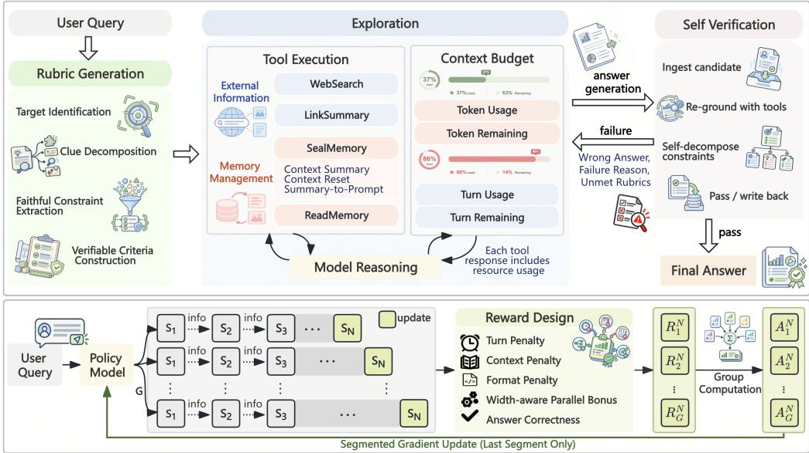
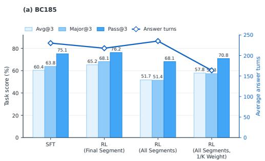
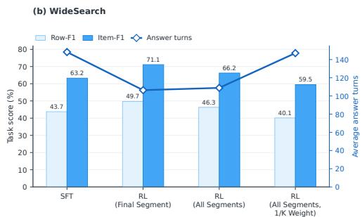
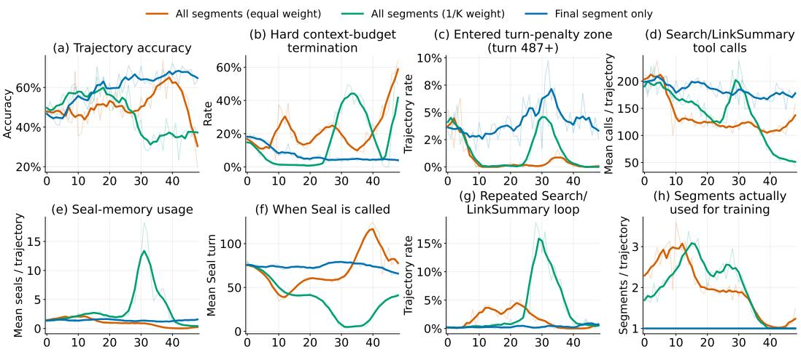
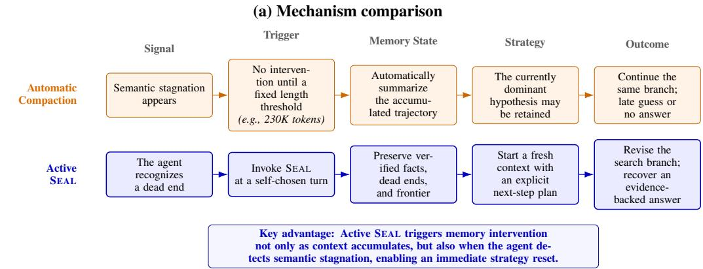

# TRAVERSE: LEARNING WHEN TO REMEMBER, RESET, AND REDIRECT FOR LONG-HORIZON WEB SEARCH

Jingyuan Ma¹ , Lynx Aster2, He Zhang2, Siyao Song2, Weijie Yuan2, Zhe Zhang2, Kai Jia2† Zhifang Sui¹†

1State Key Laboratory of Multimedia Information Processing, School of Computer Science, Peking University   
2ByteDance

mjy@stu.pku.edu.cn

github.com/ByteDance-BandAI/Traverse

huggingface.co/datasets/ByteDance-BandAI/Traverse-AutoGen

## ABSTRACT

Long-horizon information-seeking agents often accumulate noisy or misleading context, causing early mistakes to persist and making recovery increasingly difficult. We introduce an autonomous search harness in which the agent manages its own search process through three states: Rubric, Answer, and Verify. The agent first defines criteria for a valid answer, searches under these criteria, and then independently verifies the result before deciding whether to terminate or continue searching. It is further equipped with a Seal Memory tool that enables active context management. Training this behavior with reinforcement learning, however, can induce Seal Collapse, resulting in unstable training and preventing the agent from reliably learning when and how to use its memory tools. We solve this with a simple strategy that trains only the final segment after context management. Our 35B model achieves 72.83 on BrowseComp, outperforming comparable open-source systems, and consistently improves over the base model across BrowseComp-ZH, xbench, DeepSearchQA, WideSearch, financial investigation, and product search. Ablations show that autonomous compression outperforms automatic compaction and validate our RL design.

## 1 INTRODUCTION

Over the past two years, we have witnessed a remarkable transition of large language models from conversational assistants (Lambert et al., 2025) to increasingly autonomous agents that can interact with the environment (Wang et al., 2025; Zheng et al., 2025b; Li et al., 2025b; Wan et al., 2026). Powered by rapid advances in both model capabilities and the surrounding runtime infrastructure, or agent harnesses (Wu et al., 2024; Yang et al., 2024; Wang et al., 2025), LLM agents are beginning to create tangible value in real-world workflows, most notably in coding (Yang et al., 2024; Wang et al., 2025; Pan et al., 2025) and deep research (Zheng et al., 2025b; Li et al., 2025b; Wan et al., 2026). Deep information-seeking systems such as OpenAI deep research (OpenAI, 2025) and Gemini Deep Research (Citron, 2024) already assist users across an unusually broad spectrum of tasks, from tracking down a half-remembered movie to conducting comprehensive literature reviews and producing market intelligence reports. In parallel, the community has developed increasingly rigorous benchmarks (Wei et al., 2025; Chen et al., 2026b; Du et al., 2026; Gao et al., 2026; Avraham et al., 2026) to probe the limits of these systems, evaluating not only whether an agent can retrieve relevant information, but also how deeply, broadly, and persistently it can explore the open web.

However, we observe a persistent failure mode in existing information-seeking agents. During longhorizon search, agents inevitably accumulate noisy, irrelevant, or misleading evidence in their context. Earlier mistakes can then bias subsequent decisions, causing the agent to revisit unproductive search paths and eventually enter a degenerate state from which recovery becomes increasingly difficult. This not only wastes valuable context budget, but also amplifies early errors throughout the trajectory. Recent work has begun to address this problem through explicit context management: some methods periodically summarize the growing interaction history (Wu et al., 2026), while others reconstruct an evolving research state at each step (Chen et al., 2026a). In broader long-horizon agent settings, recent work explores active memory curation and context folding (Zhang et al., 2026; Sun et al., 2025). Despite this progress, these methods focus primarily on maintaining a useful search state. We argue that an equally important capability remains largely overlooked: the agent itself may know whether the answer it has reached is actually correct.

In this paper, we seek the answer to the following question: Can we provide the right tools and workflow to enable an information-seeking agent to fully control its own search process and verify its answer? To this end, we propose a highly autonomous search harness that transitions among three states: Rubric, Answer, and Verify. Given a question, the agent first enters the Rubric state to formulate a set of criteria that a correct answer must satisfy, and then carries these criteria into the Answer state to guide its search. During this process, we equip the agent with a self-managed context mechanism: the Seal Memory tool, which it may invoke at its own discretion to compress the accumulated context and carry forward only the information it considers useful. Once a candidate answer is found, the agent transitions to the Verify state, where it assumes the role of a verifier and re-examines the evidence supporting the answer. Crucially, the agent itself decides whether the answer is sufficiently verified or whether it should return to the Answer state and resume searching.

Training such an agent introduces an additional challenge: while we can distill the desired behaviors from strong teacher models, we also want the agent to learn through environmental feedback how to use its memory tools effectively with reinforcement learning. However, we find that the commonly adopted strategy of optimizing all context segments (Wu et al., 2026) leads to unstable training and a failure mode we term Seal Collapse, preventing the model from reliably learning when to invoke the Seal Memory Tool. We address this with a simple yet effective strategy that optimizes only the final segment after context management. Using this recipe, our Traverse-35B model achieves 72.83 on BrowseComp (Wei et al., 2025), outperforming recent open-source systems of comparable scale, including QUEST-35B and AREX-Turbo (Xie et al., 2026; Lu et al., 2026), while also showing consistent gains over the base model on representative benchmarks such as BrowseComp-ZH (Zhou et al., 2025) and WideSearch (Wong et al., 2025), with strong transfer to financial investigation and product search. Extensive ablations further show that agent-controlled context compression outperforms automatic compaction and validate the effectiveness of our RL training strategy. Our contributions can be summarized as follows:

• We develop an autonomous long-horizon search harness that combines a Rubric-Answer-Verify state machine with agent-triggered Seal and Read Memory tools. The agent decides when to create a context boundary, what evidence and failed hypotheses to preserve, and whether a candidate answer should terminate the search or trigger another evidence-seeking round.

• We identify Seal Collapse, a failure mode that arises when trajectory-level feedback is propagated across all context segments, and analyze its connection to ambiguous credit assignment and segment-induced trajectory reweighting. We introduce a final-segment-only RL strategy that stabilizes memory-tool learning while keeping the training workload independent of the number of context resets.

• We demonstrate strong performance across a broad range of search tasks, together with consistent improvements over the base model. Controlled ablations further validate the effectiveness of agent-controlled context compression and final-segment-only RL.

## 2 METHOD

## 2.1 OVERVIEW

Our goal is to maximize agent autonomy in long-horizon search. We first address the unavoidable problem of context exhaustion by letting the agent decide both when to compress its context and what information to carry forward. This capability is implemented through two tools: the Seal Memory tool, which compresses and stores memory, and the Read Memory tool, which retrieves finer-grained details when needed. We further organize the search process as a state machine. Given a query $q ,$ the agent first enters the RUBRIC STATE and constructs $R = \{ r _ { i } \} _ { i = 1 } ^ { m }$ . These rubrics are then passed to the ANSWER STATE, where the agent gathers evidence with search and browse tools while autonomously deciding whether to compress its context or produce an answer y. In the VER-IFY STATE, the agent evaluates y conditioned on q and R, and outputs d ∈ {Pass, Revise Answer}. The process terminates on Pass; otherwise, the agent returns to the Answer state with verifier feedback and continues searching. Our framework is summarized in Figure 1.

  
Figure 1: Overview of Traverse. Top: Traverse integrates rubric-guided exploration, autonomous context management, and self-verification into an iterative search workflow. Bottom: During RL, trajectories are segmented by Seal Memory operations, and only the final segment is optimized using group-relative advantages.

## 2.2 SELF-CONTEXT MANAGEMENT

Context management is unavoidable in long-horizon agentic search. When an agent follows an incorrect search path, or must verify an answer across multiple pieces of evidence, its finite context can easily become exhausted. We observe, however, that the agent itself often has sufficient signal to recognize when search has stalled and when the evidence is strong enough to discard accumulated noise. We therefore introduce the Seal Memory Tool, an agent-invoked context management mechanism that lets the agent autonomously decide whether to continue searching or reset its context. When invoking the tool, the agent is required to summarize the information worth preserving according to a structured memory template. It reviews its interaction history, incorporates evidence collected so far, and, if available, the memory produced by the previous segment. We expose several summary fields as tool arguments to guide this process. Let $h _ { k }$ denote the interaction history in segment k, and $m _ { k }$ the memory carried into that segment. The next memory is generated as

$$
m _ { k + 1 } \sim \pi _ { \theta } ( \cdot \mid q , h _ { k } , m _ { k } )\tag{1}
$$

with $m _ { 0 } = \emptyset$ . After sampling $m _ { k + 1 }$ , the context is reset and the next segment starts from

$$
c _ { k + 1 } = q \oplus m _ { k + 1 }\tag{2}
$$

The agent then resumes search from $c _ { k + 1 }$ . The trajectory terminates once the agent chooses to produce a final answer instead of invoking the memory tool again. Meanwhile, after each tool call, the agent is informed of its current token usage, allowing it to explicitly track the remaining context budget rather than blindly continuing until it hits the context limit. We also provide a Read Memory Tool to retrieve detailed information from the stored memory $m _ { k }$ when necessary. More details about the memory tools are provided in Appendix F.

## 2.3 DEEP RESEARCH STATE MACHINE

In this section, we explore how to equip the agent with self-verification capabilities. Inspired by DeepSeekMath-V2 (Shao et al., 2025), we design a workflow that spans question decomposition through answer verification, enabling the agent to assess the correctness of its own answer and decide whether the search process should terminate.

Rubric State. We first ask the agent to decompose the question in the RUBRIC STATE. Given a query q, the agent identifies the criteria that must be satisfied for an answer to be considered correct and produces a rubric set ${ \cal R } = \{ R _ { i } \} _ { i = 1 } ^ { n }$ , where the number of criteria n is determined adaptively by the agent. The rubric turns the constraints in the query into an explicit, structured checklist that can guide subsequent search and verification. For the multi-constraint, short-answer tasks considered in this work, R typically contains one content criterion for each distinct clue in the question, together with an additional criterion specifying the required answer format. Each content criterion describes an independently verifiable property of the target entity and is designed to be checked against Web evidence. To avoid injecting assumptions at this early stage, the criteria remain simple, objective, and faithful to the original query, preserving approximate expressions, numerical ranges, and indirect descriptions at their original level of specificity. We represent each criterion as an indexed naturallanguage description and carry the resulting rubric forward to subsequent states.

Answer State. Next, the agent enters the Answer State and begins the actual search. Given the rubric set R produced in the previous state, the agent is equipped with search, Web browsing, Seal Memory, and Read Memory tools. Each tool response is augmented with the current resource usage:

<token\_budget> Used: x / Total: y; Remain: y-x </token\_budget> <turn\_budget> Used: a / Total: b; Remain: b-a </turn\_budget>

Based on the remaining budget and the noisiness of the accumulated context, the agent decides whether to invoke the Seal Memory Tool to compact its context. Within each segment, it repeatedly chooses between continuing the search through compaction or terminating with an answer y. When compaction resets the context, the token budget is refreshed, while the turn budget is preserved across segments.

Verification State. Finally, the agent enters the Verify State, where it receives the query q, the candidate answer y, and the rubric set R, and independently assesses whether y satisfies the required criteria. We equip the verifier with the same four tools as the Answer State—search, Web browsing, Seal Memory, and Read Memory—allowing it to gather external evidence for each rubric. When the verification context becomes overly long or noisy, the verifier may also invoke Seal Memory to compact its context. At the end of verification, the agent outputs a decision d ∈ {PASS, REVISEANSWER}. $\mathrm { ~ I f ~ } d =  { \mathrm { P A S S } }$ , the process terminates and y is returned as the final answer. Otherwise, the verifier produces a suggestion explaining why the current answer is insufficient, which rubrics remain unsatisfied, and where the subsequent search should focus, before transitioning back to the Answer State. Upon re-entry, the Answer State is additionally informed of previously proposed answers and their failures, together with the verifier's latest feedback and unmet rubrics, enabling the agent to resume search with a more targeted direction rather than starting from scratch.

Taken together, the agent cycles through the Rubric, Answer, and Verify states, potentially undergoing multiple rounds of answering and verification until it can no longer identify an error and decides to submit the answer. Throughout this process, the agent autonomously manages its context via the Seal Memory Tool and independently determines whether the current answer is sufficiently verified or whether further search is necessary.

## 3 MODEL TRAINING

## 3.1 SUPERVISED FINE-TUNING

Query Construction and Data Curation. To train our model, we first synthesize challenging yet verifiable information-seeking questions using knowledge graphs, following WebShaper (Tao et al., 2025), and apply rigorous verification and cleaning to retain only solvable instances. We then pair these questions with a strong teacher model and our harness to collect agent trajectories.

Since teacher rollouts can still contain undesirable behaviors, we filter both rule violations, such as malformed or unparsable tool calls, and behavioral errors, such as invoking the Seal Memory Tool prematurely or after the answer has already been found. Rather than discarding an entire trajectory due to a few flawed turns, we mask those turns out during training while preserving the remaining valid supervision. Further details about data synthesis are provided in Appendix A.

Masked SFT. To incorporate the filtering masks above, we augment the standard next-token prediction objective with a turn-level training mask. Specifically, for each turn i, we assign a mask $\mathcal { M } _ { i } \in \{ 0 , 1 \}$ , which is broadcast to all tokens in that turn. All system, user, and tool turns are always assigned $\mathcal { M } _ { i } = 0$ . For assistant turns, $\mathcal { M } _ { i } = 0$ if the turn is identified as undesirable and 1 otherwise. The SFT objective becomes

$$
\mathcal { L } _ { \mathrm { S F T } } = - \frac { 1 } { \sum _ { i = 1 } ^ { N } \mathcal { M } _ { i } T _ { i } } \sum _ { i = 1 } ^ { N } \mathcal { M } _ { i } \sum _ { j = 1 } ^ { T _ { i } } \log \pi _ { \theta } \left( x _ { i , j } ~ \middle | ~ x _ { < i } , x _ { i , < j } \right)\tag{3}
$$

where N is the number of turns, $T _ { i }$ is the number of tokens in turn $i ,$ and $x _ { i , j }$ denotes its j-th token.   
This allows the agent to avoid imitating bad patterns while still learning how to recover after it.

## 3.2 SEAL GUIDED REINFORCEMENT LEARNING

After distilling context-management behaviors from strong-teacher trajectories, we further ask whether the agent can learn them from environmental feedback. Context compaction introduces a structural challenge for RL: every context reset fragments the original trajectory into a new training sample. A trajectory $\tau _ { i }$ may therefore contain multiple segments $\tau _ { i } = \bar { \{ \tau _ { i } ^ { ( 1 ) } , . . . , \tau _ { i } ^ { ( K _ { i } ) } \} }$ , where $K _ { i }$ is the number of segments induced by compaction.

A natural strategy is to assign each trajectory its final correctness as reward $r _ { i } ,$ compute the groupnormalized advantage $\hat { A } _ { i } = ( r _ { i } - \mu _ { \mathcal { G } } ) / \sigma _ { \mathcal { G } }$ , where $\mu _ { \mathcal { G } }$ and $\sigma _ { \mathcal { G } }$ are the group reward mean and standard deviation, and broadcast it to every segment and optimized token: $\hat { A } _ { i , k , t } = \hat { A } _ { i }$ . This follows the philosophy of GRPO, where all optimized tokens in a trajectory share the same advantage.

This seemingly natural choice creates two problems. First, it obscures credit assignment. A successful trajectory may recover only after its final compaction removes misleading evidence from earlier exploration. Conversely, a failed trajectory may contain useful evidence in earlier segments yet make a wrong commitment only in the last. Broadcasting the final outcome therefore rewards or penalizes many actions only weakly related to the result, injecting substantial optimization noise. Second, fragmentation implicitly reweights trajectories. The RL objective can be written as

$$
\mathcal { L } _ { \mathrm { R L } } = \frac { 1 } { \sum _ { i = 1 } ^ { N } K _ { i } } \sum _ { i = 1 } ^ { N } \sum _ { k = 1 } ^ { K _ { i } } \mathcal { L } \left( \pi _ { \theta } , \tau _ { i } ^ { ( k ) } , \hat { A } _ { i } \right)\tag{4}
$$

where N is the number of trajectories, L is an RL objective such as PPO, and $\pi _ { \theta }$ is the policy parameterized by θ. Suppose one trajectory is split into K segments while the remaining $\bar { N } - \bar { 1 }$ trajectories are not compacted. The batch now contains $K + { \breve { N } } - 1$ training samples. Each noncompacted trajectory receives weight $1 / ( K + N - 1 )$ instead of $1 / N ;$ thus, the normalizer changes with K.

Addressing both issues simultaneously is non-trivial. One must either spend additional computation to obtain more accurate value estimates, thereby enabling finer-grained credit assignment, or resort to more sophisticated algorithmic designs whose effectiveness must then be carefully validated under this dynamically evolving training process. Instead, we take a deliberately simple route. We propose a simple yet effective strategy that sidesteps both challenges: we optimize only the final segment produced by context compaction. Despite its simplicity, this design is motivated by two key observations:

1. Implicit Learning. At the end of each segment, the agent must either produce an answer or invoke the Seal Memory Tool, otherwise, the segment terminates due to context overflow and becomes the final segment, where failure is penalized. Thus, even without explicitly rewarding memory tool calls, the agent is implicitly encouraged to invoke the Seal Memory Tool when further search is needed, while learning when to stop and answer within the current segment.

2. Reward Signal. The final segment is temporally closest to the trajectory-level reward and therefore receives a less noisy learning signal, reducing the optimization variance induced by broadcasting the same advantage across all preceding segments.

In this way, training only the final segment actually couples two decisions: whether to continue searching through compaction, and whether enough evidence has been gathered to answer. We therefore formulate our RL objective as:

$$
\mathcal { L } _ { \mathrm { R L } } ^ { \mathrm { l a s t } } = \frac { 1 } { N } \sum _ { i = 1 } ^ { N } \mathcal { L } \left( \pi _ { \theta } , \tau _ { i } ^ { ( K _ { i } ) } , \hat { A } _ { i } \right)\tag{5}
$$

where only the last segment $\tau _ { i } ^ { ( K _ { i } ) }$ is optimized. We compute within-group advantages using the GRPO-style Z-score normalization. For policy optimization, we adopt GSPO (Zheng et al., 2025a) to stabilize MoE training. Specifically, GSPO aggregates token-level policy ratios into a sequencelevel importance ratio, $\begin{array} { r } { \rho _ { i } = \exp \left( \frac { 1 } { T _ { i } } \sum _ { j = 1 } ^ { T _ { i } } \log \frac { \pi _ { \theta } \left( x _ { i , j } | x _ { < i } , x _ { i , < j } \right) } { \pi _ { \theta _ { \mathrm { o l d } } } \left( x _ { i , j } | x _ { < i } , x _ { i , < j } \right) } \right) } \end{array}$ . We additionally apply penalties for tool usage, trajectory length, and token-budget consumption. Detailed reward configurations are provided in Appendix C.

## 4 EXPERIMENTS

## 4.1 EXPERIMENT SETUP

Implementation Details. We use Qwen3.5-35B-A3B as our base model and adopt GSPO to stabilize RL training for the MoE architecture. We set the maximum number of agent turns to 512, the context length to 256K, and the sampling temperature to 1.0. Our RL training uses 96 GPUs, with 32 GPUs allocated to policy optimization and 64 GPUs dedicated to asynchronous rollout generation. For all ablation studies, we keep the search backend, training hyperparameters, and sampling configuration identical to ensure fair comparisons. During SFT, we collect and train on trajectories from the rubric, answer, and verification states, whereas RL is applied only to the answer state. For BrowseComp, we additionally enable a Discard-All context reset when the context is exhausted, following common baseline practice; this fallback is orthogonal to Seal Memory and can be combined with the agent-triggered compression mechanism.

Baselines. We compare our method with the closed-source models like GPT-5.5 (OpenAI, 2026), Claude Opus 5 (Anthropic, 2026), and Gemini 3.1 Pro (Google DeepMind, 2026), as well as the open-source models like GLM-5.1 (GLM-5 Team et al., 2026), Kimi K3 (Team et al., 2026a), DeepSeek-V4-Pro (DeepSeek-AI et al., 2026), Qwen3.5-35B-A3B and Qwen3.5-122B-A10B (Team, 2026), MiroThinker-1.7-mini (Team et al., 2026b), QUEST-35B (Xie et al., 2026), FORT-Searcher (Deng et al., 2026), and AREX-Turbo (Lu et al., 2026).

Benchmarks. We evaluate our model on five search benchmarks: BrowseComp for deep information seeking, BrowseComp-ZH (BC-ZH) (Zhou et al., 2025) for multilingual search, WideSearch (Wong et al., 2025) for breadth-oriented retrieval, and xbench-DeepSearch (xbench) (Chen et al., 2025a) and DeepSearchQA (DSQA) (Gupta et al., 2026) for multi-step evidence collection and synthesis. Together, they cover diverse deep-search capabilities across languages and task formats. We further evaluate generalization on GAIA (Mialon et al., 2024), Fin-SearchComp (Hu et al., 2025), and ShoppingComp (Tou et al., 2025). Additional benchmark and evaluation details are provided in Appendix F.3.

## 4.2 MAIN RESULTS

In this section, we evaluate our model across a diverse suite of benchmarks and compare it against strong existing systems. Beyond widely used search benchmarks, we further probe its out-of-domain generalization on finance and e-commerce-oriented tasks. As shown in Table 1, Traverse-35B achieves a score of 72.83 on BrowseComp, reaching performance comparable to FORT-Searcher. Although it trails slightly on BrowseComp-ZH and xbench, it remains highly competitive. More notably, on DeepSearchQA and WideSearch, our model achieves state-of-the-art performance among search-specialized models. Table 2 further highlights the robustness of this capability beyond the training distribution: on both financial and e-commerce benchmarks, Traverse-35B delivers substantial gains over the base model, suggesting that the learned search behaviors transfer effectively to previously unseen domains. Our method improves GAIA accuracy by 18.45 percentage points FinSearchComp accuracy by 19.70 percentage points, and ShoppingComp SoP by 0.1331 over the base model.

Table 1: Main results on five search-agent benchmarks. We report accuracy on BrowseComp, BrowseComp-ZH, and xbench-DeepSearch-2510, Macro-F1 on DeepSearchQA, and Item-F1 on WideSearch. “" denotes unavailable results.
<table><tr><td>Model</td><td>Browse Comp</td><td>BrowseComp- ZH</td><td>xbench- 2510</td><td>DeepSearch QA</td><td>Wide Search</td></tr><tr><td>Closed-source Models</td><td></td><td></td><td></td><td></td><td></td></tr><tr><td>GPT-5.5</td><td>84.4</td><td></td><td></td><td></td><td></td></tr><tr><td>Gemini 3.1 Pro Claude Opus 5</td><td>85.9 90.8</td><td></td><td>53.0</td><td>93.3 95.0</td><td>66.4</td></tr><tr><td></td><td></td><td>一</td><td></td><td></td><td></td></tr><tr><td>General-purpose Models Qwen3.5-35B-A3B</td><td>61.0</td><td>69.5</td><td>50.3</td><td></td><td></td></tr><tr><td>Qwen3.5-122B-A10B</td><td>63.8</td><td>69.9</td><td></td><td>68.5</td><td>57.1</td></tr><tr><td>GLM-5.1</td><td>79.3</td><td></td><td></td><td></td><td>60.5</td></tr><tr><td>DeepSeek-V4-Pro</td><td>83.4</td><td></td><td>80.0</td><td></td><td></td></tr><tr><td>Kimi K3</td><td></td><td>一</td><td></td><td>88.7</td><td>78.0</td></tr><tr><td></td><td>91.2</td><td></td><td></td><td>95.0</td><td></td></tr><tr><td>Search-specialized Models</td><td></td><td></td><td></td><td></td><td></td></tr><tr><td>IterResearch-30B-A3B</td><td>37.3</td><td>45.2</td><td></td><td></td><td></td></tr><tr><td>REDSearcher</td><td>42.1</td><td>49.8</td><td></td><td></td><td></td></tr><tr><td>QUEST-35B</td><td>64.6</td><td></td><td></td><td></td><td>60.6</td></tr><tr><td>MiroThinker-1.7-mini</td><td>67.9</td><td>72.3</td><td>57.2</td><td>67.9</td><td></td></tr><tr><td>AREX-Turbo</td><td>70.7</td><td></td><td>57.0</td><td>78.5</td><td></td></tr><tr><td>FORT-Searcher</td><td>72.2</td><td>75.0</td><td>57.2</td><td></td><td>68.5</td></tr><tr><td></td><td></td><td></td><td></td><td></td><td></td></tr><tr><td>Traverse-35B (Ours)</td><td>72.8</td><td>70.7</td><td>57.0</td><td>82.8</td><td>72.1</td></tr></table>

Table 2: Generalization results on GAIA, FinSearchComp, and ShoppingComp. VPR measures the valid-response rate, while SoP denotes Satisfaction of Products.
<table><tr><td rowspan="2">Model</td><td>GAIA</td><td>FinSearchComp</td><td colspan="2">ShoppingComp</td></tr><tr><td>Acc. (%)</td><td>Acc. (%)</td><td>VPR</td><td>SoP</td></tr><tr><td>Base</td><td>61.81</td><td>38.36</td><td>0.6660</td><td>0.2245</td></tr><tr><td>Ours</td><td>80.26</td><td>58.06</td><td>0.6680</td><td>0.3576</td></tr></table>

## 4.3 ABLATION STUDIES

In this section, we investigate the effectiveness of our approach from three perspectives. We first validate the proposed RL algorithm, then quantify the gains brought by RL over the SFT model, and finally compare our method against Auto Compaction. For BrowseComp, we evaluate on a 185- question subset to reduce evaluation cost, which we refer to as BC185. Further details about BC185 are provided in Appendix D.

Is Training the Last Segment Effective? We compare final-segment RL (Section 3.2) with two alternatives that broadcast the trajectory-level advantage to all segments: standard all-segment RL and a 1/Ki-weighted variant that equalizes total trajectory weights. As shown in Figure 2, standard all-segment RL reduces BC185 Avg@3 from 60.4 for SFT to 51.7. Weighting partially recovers it to 57.8, still below SFT and final-segment RL (65.2). On WideSearch, the weighted variant achieves 40.1/59.5 Row-F1/Item-F1, compared with 46.3/66.2 for standard all-segment RL and 49.7/71.1 for final-segment RL. Thus, correcting trajectory reweighting alone does not resolve the degradation from all-segment training.

Figure 3 reveals distinct training failures. Standard all-segment RL initially improves but later collapses: Seal calls are delayed, usage approaches zero, and hard context-budget termination rises sharply. The $1 / K _ { i } – \mathrm { w e i g h t e d }$ variant shows accuracy degradation from around step 20, followed by a surge in Seal usage around steps 25–30, increasingly early Seal calls, and repeated Search/LinkSummary loops. These patterns are consistent with unresolved credit-assignment difficulties despite trajectory reweighting. Final-segment RL maintains stable accuracy, Seal usage, and search behavior while optimizing only one segment per trajectory, avoiding growth in training-segment count as context resets increase





Figure 2: Comparison of SFT, final-segment RL, all-segment RL, and all-segment RL with $1 / K _ { i }$ weighting on BC185 and WideSearch. In the weighted variant, each of the $K _ { i }$ segments in trajectory i is assigned weight $1 / K _ { i }$ , so every trajectory has the same total weight. Bars report task performance on the left axis, and lines report average answer turns on the right axis, where lower is better. All evaluations are conducted with answer verification disabled.  
  
Figure 3: Training dynamics of equal-weight all-segment RL, 1/Ki-weighted all-segment RL, and final-segment-only RL. The panels report trajectory accuracy, hard context-budget termination, entry into the turn-penalty zone, Search/LinkSummary tool calls, Seal Memory usage and timing, repeated Search/LinkSummary loops, and the number of segments used for training.

How Much Does RL Improve over SFT? Here, we quantify the gains brought by RL over SFT. We compare the SFT and RL models on BC185 and WideSearch. On BC185, RL improves the score by 4.8 points while reducing the number of agent turns required to reach the answer. We observe the same trend on WideSearch, where RL improves Row F1 by 6.0 points and Item F1 by 7.9 points, again with fewer search turns. These results show that RL yields substantial improvements in both effectiveness and search efficiency, while further validating the effectiveness of optimizing only the final segment.

Can Seal Memory Outperform Auto Compaction? We further compare our proposed Seal Memory mechanism with the widely used Auto Compaction strategy. We implement an Auto Compaction harness that triggers summarization when token usage reaches 90% of the context window, i.e., roughly 230K tokens in a 256K context. For a fair comparison, the summarizer is the same model used by the main agent: once the threshold is reached, it receives the full interaction history and produces a compact memory in the same format as the Seal Memory Tool, after which the agent continues from the user prompt augmented with this memory. As shown in Table 3, allowing the agent to decide when to compact its context yields a substantial performance gain: Active Seal improves Avg@3 by 10.28 points, with consistent gains on Pass@3 and Maj@3. More importantly, it reorganizes the search process much earlier, with the median first Seal occurring at 67 turns and 67.5K tokens, compared with 217 turns and 231.4K tokens for Auto Compaction. The flexibility of Seal Memory enables the agent to explore a broader range of possibilities and pursue more diverse search paths. Its average trajectory length increases from 112.2 to 217 turns, ultimately achieving substantially higher final-answer accuracy than fixed-threshold compaction.

Table 3: Active sealing versus automatic context compaction on BC185. First Turn and First Tokens denote the median turn index and token usage at the first memory operation, respectively, computed over trajectories containing a memory operation. Finally, Avg. Turns denotes the average number of turns across all trajectories.
<table><tr><td>Strategy</td><td>Avg@3</td><td>Pass@3</td><td>Maj@3</td><td>First Turn</td><td>First Tokens</td><td>Avg. Turns</td></tr><tr><td>Auto Compaction</td><td>54.95</td><td>68.11</td><td>56.22</td><td>217</td><td>231.4K</td><td>112.2</td></tr><tr><td>Active Seal</td><td>65.23</td><td>76.22</td><td>68.11</td><td>67</td><td>67.5K</td><td>217.7</td></tr></table>

## 5 RELATED WORK

## 5.1 WEB SEARCH AGENTS

Large language models have increasingly been equipped with search and browsing tools to acquire external information during reasoning. Early systems such as WebGPT (Nakano et al., 2022) and ReAct (Yao et al., 2023) established the foundations for grounded answer generation and interleaved reasoning and action. Recent search agents extend this paradigm to longer and more autonomous interactions involving query reformulation, webpage navigation, evidence aggregation, and answer synthesis (Li et al., 2025b; Wu et al., 2025; Li et al., 2025a). Meanwhile, benchmarks such as GAIA (Mialon et al., 2024), BrowseComp (Wei et al., 2025), BrowseComp-ZH (Zhou et al., 2025), WideSearch (Wong et al., 2025), and DeepSearchQA (Gupta et al., 2026) evaluate complementary aspects of tool use, persistent browsing, multilingual retrieval, and broad information collection. Our framework organizes search into explicit RUBRIC, ANSWER, and VERIFY states, enabling the agent to construct task-specific evaluation criteria, conduct evidence-seeking interactions, and revise its answer according to verification outcomes.

## 5.2 REINFORCEMENT LEARNING FOR LONG-HORIZON SEARCH AGENTS

Recent work applies outcome-based reinforcement learning to teach language models when and how to search, allowing search behavior to emerge without intermediate reasoning annotations (Jin et al., 2025; Song et al., 2025; Chen et al., 2025b). Extending this approach to long-horizon search introduces two coupled challenges: the interaction history may exceed the active context budget, and a terminal reward provides ambiguous supervision for the many exploratory actions preceding the final answer. Context summarization and folding methods address the first challenge by compressing interaction histories and restructuring trajectories around context updates (Wu et al., 2026; Zhang et al., 2026; Sun et al., 2025). However, trajectory-level advantages are commonly propagated across multiple reconstructed segments, even though early search often contains irrelevant retrievals, candidate elimination, and abandoned directions. Our method uses autonomous SEAL MEMORY operations to define segment boundaries and applies the terminal learning signal only to the final segment. Earlier evidence remains available through the sealed memory, while uncertain exploratory segments receive no direct gradient.

## 6 CONCLUSION

This paper introduces TRAVERSE, a long-horizon search agent that autonomously manages both its search process and its context. The agent structures research through RUBRIC, ANsWER, and VER-

IFY states, while the Seal Memory Tool allows it to decide when to compress accumulated context and what information to preserve. To train this behavior, we combine masked supervised fine-tuning on curated teacher trajectories with a reinforcement-learning strategy that optimizes only the final segment after context compaction. This simple design avoids the noisy credit assignment and trajectory reweighting induced by all-segment training, preventing the Seal Collapse observed in our experiments. Using this recipe, TRAVERSE-35B achieves 72.83 on BrowseComp and remains competitive across multilingual, broad-retrieval, and evidence-synthesis benchmarks, while transferring effectively to financial and e-commerce search tasks. Our ablations further show that final-segment training improves the performance, and that agent-triggered sealing substantially outperforms fixedthreshold automatic compaction.

## REFERENCES

Anthropic. Claude Opus 5 System Card, July 2026. URL https://www.anthropic.com/ claude-opus-5-system-card. Published July 24, 2026.

Elad Ben Avraham, ChangHao Li, Ron Dorfman, Roy Ganz, Oren Nuriel, Amir Dudai, Aviad Aberdam, Noah Flynn, Elman Mansimov, Aditya Kalyanpur, and Ron Litman. DREAM: Deep research evaluation with agentic metrics. In Proceedings of the 64th Annual Meeting of the Association for Computational Linguistics, pp. 9879–9904. Association for Computational Linguistics, 2026. doi: 10.18653/v1/2026.acl-1ong.448.

Guoxin Chen, Zile Qiao, Xuanzhong Chen, Donglei Yu, Haotian Xu, Wayne Xin Zhao, Ruihua Song, Wenbiao Yin, Huifeng Yin, Liwen Zhang, Kuan Li, Minpeng Liao, Yong Jiang, Pengjun Xie, Fei Huang, and Jingren Zhou. IterResearch: Rethinking long-horizon agents with interaction scaling,2026a.URL https://arxiv.org/abs/2511.07327.

Kaiyuan Chen, Yixin Ren, Yang Liu, Xiaobo Hu, Haotong Tian, Tianbao Xie, Fangfu Liu, Haoye Zhang, Hongzhang Liu, Yuan Gong, Chen Sun, Han Hou, Hui Yang, James Pan, Jianan Lou, Jiayi Mao, Jizheng Liu, Jinpeng Li, Kangyi Liu, Kenkun Liu, Rui Wang, Run Li, Tong Niu, Wenlong Zhang, Wenqi Yan, Xuanzheng Wang, Yuchen Zhang, Yi-Hsin Hung, Yuan Jiang, Zexuan Liu, Zihan Yin, Zijian Ma, and Zhiwen Mo. xbench: Tracking agents productivity scaling with profession-aligned real-world evaluations, 2025a.URL https: //arxiv.org/abs/2506. 13651.

Mingyang Chen, Linzhuang Sun, Tianpeng Li, Haoze Sun, Yijie Zhou, Chenzheng Zhu, Haofen Wang, Jeff Z. Pan, Wen Zhang, Huajun Chen, Fan Yang, Zenan Zhou, and Weipeng Chen. Research: Learning to reason with search for llms via reinforcement learning, 2025b. URL https://arxiv.org/abs/2503.19470.

Zijian Chen, Xueguang Ma, Shengyao Zhuang, Ping Nie, Kai Zou, Andrew Liu, Joshua Green, Kshama Patel, Ruoxi Meng, Mingyi Su, Sahel Sharifymoghaddam, Yanxi Li, Haoran Hong, Xinyu Shi, Xuye Liu, Nandan Thakur, Crystina Zhang, Luyu Gao, Wenhu Chen, and Jimmy Lin. BrowseComp-Plus: A more fair and transparent evaluation benchmark of deep-research agent. In International Conference on Learning Representations, 2026b.

Dave Citron. Try deep research and our new experimental model in Gemini, your AI assistant. https://blog.google/products-and-platforms/products/gemini/ google-gemini-deep-research/, December 2024. Accessed: 2026-08-24.

DeepSeek-AI, Anyi Xu, Bangcai Lin, Bing Xue, Bingxuan Wang, Bingzheng Xu, Bochao Wu, Bowei Zhang, Chaofan Lin, Chen Dong, Chenchen Ling, Chengda Lu, Chenggang Zhao, Chengqi Deng, Chengyu Hou, Chenhao Xu, Chenze Shao, Chong Ruan, Conner Sun, Damai Dai, Daya Guo, Dejian Yang, Deli Chen, Donghao Li, Dongjie Ji, Erhang Li, Fang Wei, Fangyun Lin, Fangzhou Yuan, Feiyu Xia, Fucong Dai, Guangbo Hao, Guanting Chen, Guoai Cao, Guolai Meng, Guowei Li, Han Yu, Han Zhang, Hanwei Xu, Hao Li, Haofen Liang, Haoling Zhang, Haoming Luo, Haoran Wei, Haotian Yuan, Haowei Zhang, Haowen Luo, Haoyu Chen, Haozhe Ji, Hengqing Zhang, Honghui Ding, Hongxuan Tang, Huanqi Cao, Huazuo Gao, Hui Qu, Hui Zeng, J Yang, JQ Zhu, Jia Luo, Jia Song, Jia Yu, Jialiang Huang, Jialu Cai, Jian Liang, Jiangting Zhou, Jiasheng Ye, Jiashi Li, Jiaxin Xu, Jiewen Hu, Jieyu Yang, Jin Chen, Jin Yan, Jingchang Chen, Jingli Zhou, Jingting Xiang, Jingyang Yuan, Jingyuan Cheng, Jingzi Zhou, Jinhua Zhu,

Jiping Yu, Joseph Sun, Jun Ran, Junguang Jiang, Junjie Qiu, Junlong Li, Junmin Zheng, Junxiao Song, Kai Dong, Kaige Gao, Kang Guan, Kexing Zhou, Kezhao Huang, Kuai Yu, Lean Wang, Lecong Zhang, Lei Wang, Leyi Xia, Li Zhang, Liang Zhao, Lihua Guo, Lingxiao Luo, Linwang Ma, Linyan Zhu, Litong Wang, Liyu Cai, Liyue Zhang, Longhao Chen, MS Di, MY Xu, Max Mei, Miaojun Wang, Mingchuan Zhang, Minghua Zhang, Minghui Tang, Mingming Li, Mingxu Zhou, Minmin Han, Ning Wang, Panpan Huang, Panpan Wang, Peixin Cong, Peiyi Wang, Peng Zhang, Qiancheng Wang, Qihao Zhu, Qingyang Li, Qinyu Chen, Qiushi Du, Qiwei Jiang, Rui Tian, Ruifan Xu, Ruijie Lu, Ruiling Xu, Ruiqi Ge, Ruisong Zhang, Ruizhe Pan, Runji Wang, Runqian Chen, Runqiu Yin, Runxin Xu, Ruomeng Shen, Ruoyu Zhang, Ruyi Chen, SH Liu, Shanghao Lu, Shangmian Sun, Shangyan Zhou, Shanhuang Chen, Shaofei Cai, Shaoheng Nie, Shaoqing Wu, Shaoyuan Chen, Shengding Hu, Shengyu Liu, Shiqiang Hu, Shirong Ma, Shiyu Wang, Shuiping Yu, Shunfeng Zhou, Shuting Pan, Shuying Yu, Songyang Zhou, Tao Ni, Tao Yun, Tian Jin, Tian Pei, Tian Ye, Tianle Lin, Tianran Ji, Tianyi Cui, Tianyuan Yue, Tingting Yu, Tun Wang, W Zhang, WL Xiao, Wangding Zeng, Wei An, Weilin Zhao, Wen Liu, Wenfeng Liang, Wenjie Pang, Wenjing Luo, Wenjing Yao, Wenjun Gao, Wenkai Yang, Wenlve Huang, Wenqing Hou, Wentao Zhang, Wenting Ma, Xi Gao, Xiang He, Xiangwen Wang, Xianzu Wang, Xiao Bi, Xiaodong Liu, Xiaohan Wang, Xiaokang Chen, Xiaokang Zhang, Xiaotao Nie, Xiaowen Sun, Xiaoxiang Wang, Xin Cheng, Xin Liu, Xin Xie, Xingchao Liu, Xingchen Liu, Xingkai Yu, Xingyou Li, Xinyu Yang, Xinyu Zhang, Xu Chen, Xuanyu Wang, Xuecheng Su, Xueyin Chen, Xuheng Lin, Xuwei Fu, YC Yan, YQ Wang, YW Ma, Yanfeng Luo, Yang Zhang, Yanhong Xu, Yanru Ma, Yanwen Huang, Yao Li, Yao Li, Yao Xu, Yao Zhao, Yaofeng Sun, Yaohui Wang, Yi Qian, Yi Shao, Yi Yu, Yichao Zhang, Yifan Ding, Yifan Shi, Yijia Wu, Yiliang Xiong, Yiling Ma, Ying He, Ying Tang, Ying Zhou, Yingjia Luo, Yinmin Zhong, Yishi Piao, Yisong Wang, Yixiang Zhang, Yixiao Chen, Yixuan Tan, Yixuan Wei, Yiyang Ma, Yiyuan Liu, Yonglun Yang, Yongqiang Guo, Yongtong Wu, Yu Wu, YuKun Li, Yuan Cheng, Yuan Ou, Yuanfan Xu, Yuanhao Li, Yuduan Wang, Yuehan Yang, Yuer Xu, Yuhan Wu, Yuhao Meng, Yuheng Zou, Yukun Zha, Yunfan Xiong, Yupeng Chen, Yuping Lin, Yuqian Cao, Yuqian Wang, Yushun Zhang, Yuting Yan, Yutong Lin, Yuxian Gu, Yuxiang Luo, Yuxiang You, Yuxuan Liu, Yuxuan Zhou, Yuyang Zhou, Yuzhen Huang, ZF Wu, Zehao Wang, Zehua Zhao, Zehui Ren, Zekai Zhang, Zhangli Sha, Zhe Fu, Zhe Ju, Zhean Xu, Zhenda Xie, Zhengyan Zhang, Zheren Gao, Zhewen Hao, Zhibin Gou, Zhicheng Ma, Zhigang Yan, Zhihong Shao, Zhixian Huang, Zhixuan Chen, Zhiyu Wu, Zhizhou Ren, Zhongyu Wu, Zhuoshu Li, Zhuping Zhang, Zian Xu, Zihao Wang, Zihua Qu, Zihui Gu, Zijia Zhu, Zilin Li, Zipeng Zhang, Ziwei Xie, Ziyi Gao, Ziyi Wan, Zizheng Pan, and Zongqing Yao. Deepseek-v4: Towards highly efficient million-token context intelligence, 2026. URL https://arxiv.org/abs/2606.19348.

Jia Deng, Yimeng Chen, Xiaoqing Xiang, Ziyang Zeng, Shuo Tang, Wayne Xin Zhao, Feng Chang, Chuan Hao, Yuan Wei, Ran Tao, Bryan Dai, and Ji-Rong Wen. Fort-searcher: Synthesizing shortcut-resistant search tasks for training deep search agents, 2026. URL https : //arxiv. org/abs/2606.12087.

Mingxuan Du, Benfeng Xu, Chiwei Zhu, Xiaorui Wang, and Zhendong Mao. DeepResearch Bench: A comprehensive benchmark for deep research agents. In International Conference on Learning Representations, 2026.

Yiwen Gao, Ruochen Zhao, Yang Deng, and Wenxuan Zhang. DR-Arena: An automated evaluation framework for deep research agents. In Proceedings of the 64th Annual Meeting of the Association for Computational Linguistics, pp. 27130–27152. Association for Computational Linguistics, 2026. doi: 10.18653/v1/2026.acl-1ong.1249.

GLM-5 Team et al. Glm-5: From vibe coding to agentic engineering, 2026. URL https: // arxiv.org/abs/2602.15763.

Google DeepMind. Gemini 3.1 Pro: Model Card, February 2026. URL https : //deepmind. google/models/model-cards/gemini-3-1-pro/. PublishedFebruary19,2026.

Nikita Gupta, Riju Chatterjee, Lukas Haas, Connie Tao, Andrew Wang, Chang Liu, Hidekazu Oiwa, Elena Gribovskaya, Jan Ackermann, John Blitzer, Sasha Goldshtein, and Dipanjan Das. Deepsearchqa: Bridging the comprehensiveness gap for deep research agents, 2026. URL https://arxiv.org/abs/2601.20975.

Liang Hu, Jianpeng Jiao, Jiashuo Liu, Yanle Ren, Zhoufutu Wen, Kaiyuan Zhang, Xuanliang Zhang, Xiang Gao, Tianci He, Fei Hu, Yali Liao, Zaiyuan Wang, Chenghao Yang, Qianyu Yang, Mingren Yin, Zhiyuan Zeng, Ge Zhang, Xinyi Zhang, Xiying Zhao, Zhenwei Zhu, Hongseok Namkoong, Wenhao Huang, and Yuwen Tang. Finsearchcomp: Towards a realistic, expert-level evaluation of financial search and reasoning, 2025.URL https://arxiv.org/abs/2509.13160.

Bowen Jin, Hansi Zeng, Zhenrui Yue, Jinsung Yoon, Sercan Arik, Dong Wang, Hamed Zamani, and Jiawei Han. Search-r1: Training llms to reason and leverage search engines with reinforcement learning,2025.URL https://arxiv.org/abs/2503.09516.

Nathan Lambert, Jacob Morrison, Valentina Pyatkin, Shengyi Huang, Hamish Ivison, Faeze Brahman, Lester James Validad Miranda, Alisa Liu, Nouha Dziri, Xinxi Lyu, Yuling Gu, Saumya Malik, Victoria Graf, Jena D. Hwang, Jiangjiang Yang, Ronan Le Bras, Oyvind Tafjord, Christopher Wilhelm, Luca Soldaini, Noah A. Smith, Yizhong Wang, Pradeep Dasigi, and Hannaneh Hajishirzi. Tülu 3: Pushing frontiers in open language model post-training. In Second Conference on Language Modeling, 2025.

Kuan Li, Zhongwang Zhang, Huifeng Yin, Liwen Zhang, Litu Ou, Jialong Wu, Wenbiao Yin, Baixuan Li, Zhengwei Tao, Xinyu Wang, Weizhou Shen, Junkai Zhang, Dingchu Zhang, Xixi Wu, Yong Jiang, Ming Yan, Pengjun Xie, Fei Huang, and Jingren Zhou. Websailor: Navigating superhuman reasoning for web agent, 2025a.URL https://arxiv.org/abs/2507.02592.

Xiaoxi Li, Jiajie Jin, Guanting Dong, Hongjin Qian, Yongkang Wu, Ji-Rong Wen, Yutao Zhu, and Zhicheng Dou. WebThinker: Empowering large reasoning models with deep research capability. In Advances in Neural Information Processing Systems, volume 38, 2025b. doi: 10.52202/085713-4011.

Shuqi Lu, Chaofan Li, Kun Luo, Zhang Zhang, Hui Wang, Hongwang Xiao, Lei Xiong, Jiahao Wang, Sen Wang, Xiyan Jiang, Wanli Li, Yuyang Hu, Hongjin Qian, Bingyu Yan, Jianlyu Chen, Ziyi Xia, Yingxia Shao, Kang Liu, Zhicheng Dou, Di He, Chaozhuo Li, Qiwei Ye, Zhongyuan Wang, and Zheng Liu. Arex: Towards a recursively self-improving agent for deep research, 2026. URLhttps://arxiv.org/abs/2607.21461.

Grégoire Mialon, Clémentine Fourrier, Thomas Wolf, Yann LeCun, and Thomas Scialom. GAIA: a benchmark for general AI assistants. In The Twelfth International Conference on Learning Representations, ICLR 2024, Vienna, Austria, May 7-11, 2024. OpenReview.net, 2024. URL https://openreview.net/forum?id=fibxvahvs3.

Reiichiro Nakano, Jacob Hilton, Suchir Balaji, Jeff Wu, Long Ouyang, Christina Kim, Christopher Hesse, Shantanu Jain, Vineet Kosaraju, William Saunders, Xu Jiang, Karl Cobbe, Tyna Eloundou, Gretchen Krueger, Kevin Button, Matthew Knight, Benjamin Chess, and John Schulman. Webgpt: Browser-assisted question-answering with human feedback, 2022. URL https://arxiv. org/abs/2112.09332.

OpenAI. Introducing deep research. https://openai.com/index/ introducing-deep-research/, February 2025. Accessed: 2026-08-24.

OpenAI. GPT-5.5 System Card, April 2026. URL https://deploymentsafety. openai. com/gpt–5–5. Published April 23, 2026.

Jiayi Pan, Xingyao Wang, Graham Neubig, Navdeep Jaitly, Heng Ji, Alane Suhr, and Yizhe Zhang. Training software engineering agents and verifiers with SWE-Gym. In Proceedings of the 42nd International Conference on Machine Learning, volume 267 of Proceedings of Machine Learning Research, pp. 47717–47737, 2025.

Zhihong Shao, Yuxiang Luo, Chengda Lu, Z. Z. Ren, Jiewen Hu, Tian Ye, Zhibin Gou, Shirong Ma, and Xiaokang Zhang. DeepSeekMath-V2: Towards self-verifiable mathematical reasoning, 2025. URLhttps://arxiv.org/abs/2511.22570.

Huatong Song, Jinhao Jiang, Yingqian Min, Jie Chen, Zhipeng Chen, Wayne Xin Zhao, Lei Fang, and Ji-Rong Wen. R1-searcher: Incentivizing the search capability in llms via reinforcement learning,2025.URL https://arxiv.org/abs/2503.05592.

Weiwei Sun, Miao Lu, Zhan Ling, Kang Liu, Xuesong Yao, Yiming Yang, and Jiecao Chen. Scaling long-horizon llm agent via context-folding, 2025. URL https : //arxiv.org/abs/2510. 11967. Zhengwei Tao, Jialong Wu, Wenbiao Yin, Junkai Zhang, Baixuan Li, Haiyang Shen, Kuan Li. Liwen Zhang, Xinyu Wang, Yong Jiang, Pengjun Xie, Fei Huang, and Jingren Zhou. Webshaper: Agentically data synthesizing via information-seeking formalization, 2025. URL https://arxiv.org/abs/2507.15061. Kimi Team, Tongtong Bai, Yifan Bai, Yiping Bao, M. C., Jianfeng Cai, Xinyuan Cai, Peizhou Cao, Yuxuan Cao, Ziwei Chai, Y. Charles, H. S. Che, Guanduo Chen, Guangyu Chen, Guanzheng Chen, Huarong Chen, Jia Chen, Jianlong Chen, Jun Chen, Kexin Chen, Peng Chen, Ruijue Chen Wentao Chen, Xin Chen, Yang Chen, Yanru Chen, Yifei Chen, Yingjiang Chen, Yuankun Chen Yujie Chen, Yutian Chen, Zhirong Chen, Dazhi Cheng, Yean Cheng, Jialei Cui, Jingbing Cui. Anqi Dai, Jiaqi Deng, Hao Ding, Rui Ding, Shaofeng Ding, Mengfan Dong, Mengnan Dong Yuhao Dong, Yuxin Dong, Angang Du, Chenzhuang Du, Dikang Du, Jusen Du, Yulun Du, Yu Fan, Jing Feng, Qiulin Feng, Yichen Feng, Kelin Fu, Qiang Fu, Fuxuan Gao, Hongcheng Gao, Jingyue Gao, Tong Gao, Weijia Gao, Shangyi Geng, Jie Gong, Linhu Gong, Shengao Gong, Xiaochen Gong, Qizheng Gu, Yicheng Gu, Shuhao Guan, Haiqing Guo, Shiqi Guo, Xiang Guo, Zhengyan Guo, Beixi Hao, Wenxin Hao, Xiaoru Hao, Dailan He, Haotian He, Lehan He, Qi He, Weiran He, Xinran He, Xinyi He, Yibo He, Yunjia He, Chao Hong, Tiange Hong, Hao Hu, Jiaxi Hu, Ruikun Hu, Weiming Hu, Yangyang Hu, Zhenxing Hu, Liang Hua, Jinbin Huang, Ke Huang, Ruiyuan Huang, Siying Huang, Weixiao Huang, Yan Huang, Zhengjie Huang, Zhiqi Huang, Yulong Hui, Chaobo Jia, Yutong Jiang, Zhejun Jiang, Zuoyou Jiang, Wenyi Jin, Xinyi Jin, Yu Jing, Huanjun Kong, Guokun Lai, Aidi Li, Cheng Li, Chengyuan Li, Cong Li, Fang Li, Guanyu Li, Haoyang Li, Jia Li, Junxiong Li, Lei Li, Letian Li, Lincan Li, Weihong Li, Wentao Li, Xintong Li, Yang Li, Yishen Li, Yiwei Li, Yuxiao Li, Zhaowei Li, Zhaoxi Li, Zheming Li, Zhengxiao Li, Zhiyuan Li, Jiawei Lin, Xiaohan Lin, Yibo Lin, Zichao Lin, Ziyan Lin, Bill Liu, Boxiao Liu, Chuan Liu. Liang Liu, Shaowei Liu, Shudong Liu, Shuran Liu, Tianwei Liu, Weizhou Liu, Yangyang Liu, Yanming Liu, Yibo Liu, Yipeng Liu, Zhengying Liu, Zhiheng Liu, Enzhe Lu, Haoyu Lu, Linqiang Lu, Tingzhan Lu, Zhiyuan Lu, Aotian Luo, G. Luo, Junyu Luo, Yifan Luo, B. Lyu, Wenzhou Lyu, Shaoguang Mao, Yuan Mei, Xin Men, Minqing Ni, Yixuan Niu, Siyuan Pan, Shujun Peng, Zhangyang Qi, Ruoyu Qin, ZeChao Qin, Zeyu Qin, Haiquan Qiu, Jianxin Qiu, Jiezhong Qiu, Bowen Qu, Yuhao Qu, Zeyu Shang, Youbo Shao, Han Shen, Jincheng Shi, Juanfeng Shi Lidong Shi, Shengyuan Shi, Wingchun Siu, Pengwei Song, Xiaoxi Song, Jianlin Su, Yunfeng Su, Zhaochen Su, Lin Sui, Jingsong Sun, Junyao Sun, Shaoning Sun, Shuzhe Sun, Tongyu Sun, Yujun Sun, Yunpeng Tai, Chuning Tang, Heyi Tang, Sirui Tang, Zecheng Tang, Chaoran Tian Rongpeng Tian, Yu Tian, Wei Tu, Chensi Wang, Chuang Wang, Chunjie Wang, Dinglu Wang Feng Wang, Hailong Wang, Haiming Wang, Hao Wang, Hao Wang, Huaqing Wang, Hui Wang Jiayi Wang, Jinglong Wang, Jinhong Wang, Jiuzheng Wang, Linian Wang, Shaobo Wang, Shenzhi Wang, Shuyi Wang, Si Wang, Siyuan Wang, Tianfu Wang, Wenjue Wang, Xingran Wang Xinmei Wang, Xinyuan Wang, Xusheng Wang, Yalin Wang, Yangkun Wang, Yao Wang, Yaoyu Wang, Yejie Wang, Yiqin Wang, Yucheng Wang, Yuzhi Wang, Zhaoji Wang, Zhaowei Wang Zhengtao Wang, Zhenhao Wang, Zhongsheng Wang, Zifan Wang, Chu Wei, Ming Wei, Shouxin Wei, Zichen Wen, Fan Wu, Haoning Wu, Rucong Wu, Wenhao Wu, Xiaoxue Wu, Yingcong Wu, Yongqi Wu, Yuxin Wu, Zijian Wu, Xinglang Xian, Chenxuan Xiang, Yuye Xiang, Bocheng Xiao, Chenjun Xiao, Xin Xiao, Jin Xie, Xiaotong Xie, Yifeng Xie, Zhe Xie, Bowei Xing, Yiming Xiong, Baosheng Xu, Boyu Xu, Jiale Xu, Jianfan Xu, Jing Xu, Jinjing Xu, L. H. Xu, Qingtao Xu, Shuyao Xu, Suting Xu, Tiantian Xu, Tianxiang Xu, Weixin Xu, Xinran Xu, Yangchuan Xu, Ye Xu, Yueni Xu, Ziyao Xu, Haonan Xue, Junjie Yan, Yaoyao Yan, Fan Yang, Guangyao Yang, Hao Yang, Junwei Yang, Ruoyu Yang, Wenjie Yang, Xiaofei Yang, Xinyu Yang, Yi Yang Yiling Yang, Ying Yang, Yuchen Yang, Zhen Yang, Zhilin Yang, Zian Yang, Zuhao Yang, Haotian Yao, Dan Ye, Haoran Ye, Wenjie Ye, Zhanbo Ye, Bohong Yin, Haoxiang Yin, Xietong Yin Chengzhen Yu, Haozhen Yu, Longhui Yu, Shengnan Yu, Shuying Yu, Tianxiang Yu, Enming Yuan, Mengjie Yuan, Tongtian Yue, Wei Yue, Yang Yue, Dunyuan Zha, Haobing Zhan, B. H Zhang, Dehao Zhang, Fei Zhang, Hao Zhang, Haoyuan Zhang, Huanyu Zhang, Jiapei Zhang, Jiaxuan Zhang, Jin Zhang, Kaiyi Zhang, Miaozhen Zhang, Puqi Zhang, Qinglei Zhang, Rong Zhang, Rui Zhang, Shaoshuai Zhang, Shiyi Zhang, Xiaobin Zhang, Xiaoyun Zhang, Y. Zhang, Yangkun Zhang, Ye Zhang, Yichi Zhang, Yikun Zhang, Yizhi Zhang, Yongting Zhang, Yu Zhang, Yutao Zhang, Yutong Zhang, Zheng Zhang, Zijing Zhang, Bin Zhao, Chenguang Zhao, Feifan

Zhao, Jinglun Zhao, Jinxiang Zhao, Shuai Zhao, Wenshuo Zhao, Xiangyu Zhao, Xuanle Zhao, Yikai Zhao, Zijia Zhao, Haozhi Zheng, Huabin Zheng, Ruihan Zheng, Shaojie Zheng, Tengyang Zheng, Haofeng Zhong, Lei Zhong, Longguang Zhong, M. Zhou, Qiankang Zhou, Runjie Zhou, Ruozhang Zhou, Xinyu Zhou, Yiqiao Zhou, Zaida Zhou, Jinguo Zhu, Liya Zhu, Xinhao Zhu Yangjunfeng Zhu, Yuxuan Zhu, Zhen Zhu, Chen Zhuang, Weiyu Zhuang, and Xinxing Zu. Kimi k3: Open frontier intelligence, 2026a. URL https://arxiv.org/abs/2607.24653.

MiroMind Team, Song Bai, Lidong Bing, Carson Chen, Guanzheng Chen, Yuntao Chen, Zhe Chen, Ziyi Chen, Jifeng Dai, Xuan Dong, Wenhan Dou, Yue Deng, Yunjie Fu, Junqi Ge, Chenxia Han, Tammy Huang, Zhenhang Huang, Jerry Jiao, Shilei Jiang, Tianyu Jiao, Xiaoqi Jian, Lei Lei, Ruilin Li, Gen Luo, Tiantong Li, Xiang Lin, Ziyuan Liu, Zhiqi Li, Jie Ni, Qiang Ren, Pax Sun, Shiqian Su, Chenxin Tao, Bin Wang, Wenhai Wang, Haonan Wang, James Wang, Jin Wang, Jojo Wang, Letian Wang, Shizun Wang, Weizhi Wang, Zixuan Wang, Jinfan Xu, Sen Xing, Chenyu Yang, Hai Ye, Jiaheng Yu, Yue Yu, Muyan Zhong, Tianchen Zhao, Xizhou Zhu, Yanpeng Zhou, Yifan Zhang, and Zhi Zhu. Mirothinker: Pushing the performance boundaries of open-source research agents via model, context, and interactive scaling, 2026b. URL https : //arxiv. org/abs/2511.11793.

Qwen Team. Qwen3.5: Accelerating productivity with native multimodal agents, February 2026. URLhttps://qwen.ai/blog?id=qwen3.5.

Huaixiao Tou, Ying Zeng, Yuemeng Li, Cong Ma, Muzhi Li, Minghao Li, Weijie Yuan, He Zhang, and Kai Jia. Shoppingcomp: Are llms really ready for your shopping cart? arXiv preprint arXiv:2511.22978, 2025.

Yuxuan Wan, Tianqing Fang, Zaitang Li, Yintong Huo, Wenxuan Wang, Haitao Mi, Dong Yu, and Michael R. Lyu. Inference-time scaling of verification: Self-evolving deep research agents via test-time rubric-guided verification. In Findings of the Association for Computational Linguistics: ACL 2026, pp. 24822–24835. Association for Computational Linguistics, 2026. doi: 10.18653/ v1/2026.findings-acl.1243.

Xingyao Wang, Boxuan Li, Yufan Song, Frank F. Xu, Xiangru Tang, Mingchen Zhuge, Jiayi Pan, Yueqi Song, Bowen Li, Jaskirat Singh, Hoang H. Tran, Fuqiang Li, Ren Ma, Mingzhang Zheng, Bill Qian, Yanjun Shao, Niklas Muennighoff, Yizhe Zhang, Binyuan Hui, Junyang Lin, Robert Brennan, Hao Peng, Heng Ji, and Graham Neubig. OpenHands: An open platform for AI software developers as generalist agents. In International Conference on Learning Representations, 2025

Jason Wei, Zhiqing Sun, Spencer Papay, Scott McKinney, Jeffrey Han, Isa Fulford, Hyung Won Chung, Alex Tachard Passos, William Fedus, and Amelia Glaese. BrowseComp: A simple yet challenging benchmark for browsing agents. arXiv preprint arXiv:2504.12516, 2025.

Ryan Wong, Jiawei Wang, Junjie Zhao, Li Chen, Yan Gao, Long Zhang, Xuan Zhou, Zuo Wang, Kai Xiang, Ge Zhang, Wenhao Huang, Yang Wang, and Ke Wang. Widesearch: Benchmarking agentic broad info-seeking, 2025. URL https://arxiv.org/abs/2508.07999.

Jialong Wu, Baixuan Li, Runnan Fang, Wenbiao Yin, Liwen Zhang, Zhengwei Tao, Dingchu Zhang, Zekun Xi, Gang Fu, Yong Jiang, Pengjun Xie, Fei Huang, and Jingren Zhou. Webdancer: Towards autonomous information seeking agency, 2025. URL https://arxiv.org/abs/2505. 22648.

Qingyun Wu, Gagan Bansal, Jieyu Zhang, Yiran Wu, Beibin Li, Erkang Zhu, Li Jiang, Xiaoyun Zhang, Shaokun Zhang, Jiale Liu, Ahmed Hassan Awadallah, Ryen W. White, Doug Burger, and Chi Wang. AutoGen: Enabling next-gen LLM applications via multi-agent conversation. In First Conference on Language Modeling, 2024.

Xixi Wu, Kuan Li, Yida Zhao, Liwen Zhang, Litu Ou, Huifeng Yin, Zhongwang Zhang, Xinmiao Yu, Dingchu Zhang, Yong Jiang, Pengjun Xie, Fei Huang, Minhao Cheng, Shuai Wang, Hong Cheng, and Jingren Zhou. Resum: Unlocking long-horizon search intelligence via context summarization,2026.URL https://arxiv.org/abs/2509.13313.

Jian Xie, Tianhe Lin, Zilu Wang, Yuting Ning, Yuekun Yao, Tianci Xue, Zhehao Zhang, Zhongyang Li, Kai Zhang, Yufan Wu, Shijie Chen, Boyu Gou, Mingzhe Han, Yifei Wang, Vint Lee, Xinpeng

Wei, Xiangjun Wang, Yu Su, and Huan Sun. Quest: Training frontier deep research agents with fully synthetic tasks, 2026. URL https://arxiv.org/abs/2605.24218.

John Yang, Carlos E. Jimenez, Alexander Wettig, Kilian Lieret, Shunyu Yao, Karthik Narasimhan, and Ofir Press. SWE-agent: Agent-computer interfaces enable automated software engineering. In Advances in Neural Information Processing Systems, volume 37, 2024. doi: 10.52202/ 079017-1601.

Shunyu Yao, Jeffrey Zhao, Dian Yu, Nan Du, Izhak Shafran, Karthik Narasimhan, and Yuan Cao. ReAct: Synergizing reasoning and acting in language models. In International Conference on Learning Representations (ICLR), 2023.

Yuxiang Zhang, Jiangming Shu, Ye Ma, Xueyuan Lin, Shangxi Wu, and Jitao Sang. Memory as action: Autonomous context curation for long-horizon agentic tasks, 2026. URL https : //arxiv.org/abs/2510.12635.

Chujie Zheng, Shixuan Liu, Mingze Li, Xiong-Hui Chen, Bowen Yu, Chang Gao, Kai Dang, Yuqiong Liu, Rui Men, An Yang, Jingren Zhou, and Junyang Lin. Group sequence policy optimization. arXiv preprint arXiv:2507.18071, 2025a.

Yuxiang Zheng, Dayuan Fu, Xiangkun Hu, Xiaojie Cai, Lyumanshan Ye, Pengrui Lu, and Pengfei Liu. DeepResearcher: Scaling deep research via reinforcement learning in real-world environments. In Proceedings of the 2025 Conference on Empirical Methods in Natural Language Processing, pp. 414–431. Association for Computational Linguistics, 2025b. doi: 10.18653/v1/2025. emnlp-main.22.

Peilin Zhou, Bruce Leon, Xiang Ying, Can Zhang, Yifan Shao, Qichen Ye, Dading Chong, Zhiling Jin, Chenxuan Xie, Meng Cao, Yuxin Gu, Sixin Hong, Jing Ren, Jian Chen, Chao Liu, and Yining Hua. Browsecomp-zh: Benchmarking web browsing ability of large language models in chinese, 2025.URLhttps://arxiv.org/abs/2504.19314.

## A SEARCH TASK SYNTHESIS

Our task-synthesis pipeline follows a formalization-driven design inspired by WebShaper (Tao et al., 2025). It consists of four stages: seed-task initialization, structured formalization, Web-grounded expansion, and quality filtering.

Seed Selection and Formalization. We begin by sampling a target entity $x ^ { \star }$ from a large-scale knowledge graph. A controlled traversal of its relational neighborhood retrieves a collection of factual relations and attributes, from which we construct a simple seed question with a known answer The target may be either the sampled entity itself or one of its attributes, while the remaining facts serve as initial constraints.

For each constraint, we define a knowledge projection

$$
{ \mathcal C } _ { j } = R _ { j } ( c _ { j } ) = \{ x \ | \ R _ { j } ( x , c _ { j } ) \} ,\tag{6}
$$

where $R _ { j }$ denotes a relation and $c _ { j }$ is an entity or attribute value. The projection $\mathcal { C } _ { j }$ contains all candidate entities satisfying the corresponding constraint. We denote the formal representation of the seed task as

$$
\Phi ^ { ( 0 ) } ( x ) = \bigwedge _ { j = 1 } ^ { m } R _ { j } ( x , c _ { j } ) ,\tag{7}
$$

and define its feasible answer set as

$$
\operatorname { A n s } \Bigl ( \Phi ^ { ( 0 ) } \Bigr ) = \Bigl \{ x \mid \Phi ^ { ( 0 ) } ( x ) \Bigr \} = \bigcap _ { j = 1 } ^ { m } \mathcal { C } _ { j } .\tag{8}
$$

We retain seed tasks for which $\mathrm { { A n s } } ( \Phi ^ { ( 0 ) } ) = \{ x ^ { \star } \}$ . The formal representation records the target, supporting relations, intermediate entities, and the constraints required to recover the answer, providing an executable specification for subsequent expansion and validation.

Layer-wise Expansion. Starting from the seed representation, we iteratively increase the task's search depth. At expansion step $\ell ,$ the synthesizer selects an expandable leaf constant c from $\Phi ^ { ( \ell ) }$ and treats it as the answer to a new subproblem. The subproblem is represented by a predicate $\Phi _ { c }$ satisfying $\mathrm { A n s } ( \Phi _ { c } ) = \{ c \}$ . We then replace the original constant with a new variable z constrained by this subproblem:

$$
\Phi ^ { ( \ell + 1 ) } ( x ) = \exists z \ \left[ \Phi ^ { ( \ell ) } ( x ; c \gets z ) \land \Phi _ { c } ( z ) \right] ,\tag{9}
$$

where $\Phi ^ { ( \ell ) } ( x ; c \gets z )$ denotes the expression obtained by replacing c with z in the current task representation. Consequently, information that was directly available in the seed task must now be recovered through an additional search process. The expansion is accepted only when the updated representation preserves the original target:

$$
\operatorname { A n s } \Bigl ( \Phi ^ { ( \ell + 1 ) } \Bigr ) = \{ x ^ { \star } \} .\tag{10}
$$

Repeated expansion produces chained and branching structures whose intermediate results are necessary for resolving the final answer.

Each expansion combines relations from the knowledge graph with information retrieved from the Web. The synthesizer searches for the selected leaf entity using multiple query formulations and collects relevant facts from heterogeneous pages. We prioritize independently supported information and remove sources that merely duplicate the same underlying statement. The retrieved facts are linked back to the corresponding entities before being incorporated into the formal representation, reducing errors caused by ambiguous names or mismatched entities. When a Web document contains descriptive text instead of an explicit structured relation, candidate entities are first extracted and linked before being used as new expansion anchors.

Controlling Task Complexity. We separately control structural complexity and clue specificity. Structural complexity is determined by the expansion depth, relation-chain length, number of branches, and number of constraints. The resulting tasks cover several composition patterns, including chained retrieval, multi-constraint intersection, comparison, numerical reasoning, and temporal reasoning.

After the structure is fixed, we vary clue specificity through controlled transformations. Exact dates may be converted into truthful time ranges, numerical values into intervals, entity names into typelevel descriptions, and directly searchable attributes into indirect relational descriptions. For example, an exact award name and year may be expressed through its field, issuing organization, and approximate period. The original and transformed values are retained in the task metadata so that each rewritten clue can be checked against its underlying fact.

We vary the degree of transformation across constraints. Some clues provide viable entry points for search, while others require broader exploration and cross-document integration. This produces tasks with different search horizons without removing the information required to identify the answer.

The expanded formal representation is finally verbalized into a natural-language question. The generator is instructed to preserve all factual constraints, avoid exposing the masked target, and express the clues as a coherent information-seeking request. Each generated sample includes the question, reference answer, formal representation, supporting relations, source provenance, and transformation metadata.

Verification and Filtering. We apply several complementary filters before using a synthesized task for trajectory collection. First, structural validation checks that the formal representation is internally consistent, contains no unresolved or cyclic dependencies, and preserves the reference answer throughout expansion. Second, evidence validation examines the reliability and relevance of the supporting Web pages, verifies entity correspondence, and confirms that the reference answer satisfies every generated constraint. Sources that are factually unsupported, low quality, redundant, or inconsistent with the target entity are removed together with the corresponding samples

We approximate answer uniqueness using a targeted candidate set. For a generated question q, we construct

$$
\mathcal { N } ( q ) = \mathcal { N } _ { \mathrm { K G } } ( q ) \cup \mathcal { N } _ { \mathrm { t y p e } } ( q ) \cup \mathcal { N } _ { \mathrm { a g e n t } } ( q ) ,\tag{11}
$$

where $\mathcal { N } _ { \mathrm { K G } }$ contains nearby entities sampled from the knowledge graph, $\mathcal { N } _ { \mathrm { t y p e } }$ contains entities of the same semantic type as the reference answer, and $\mathcal { N } _ { \mathrm { a g e n t } }$ contains plausible alternative answers produced during search-agent attempts. Each candidate $\overset { \smile } { x } \in \mathcal { N } ( q )$ is checked against the complete constraint set. We discard a sample if any alternative candidate also satisfies its formal representation:

$$
\exists x \in { \mathcal { N } } ( q ) \setminus \{ x ^ { \star } \} \quad { \mathrm { s . t . } } \quad \Phi ( x ) = 1 .\tag{12}
$$

Finally, we evaluate contamination and empirical difficulty. Tool-free models are first asked to answer each question directly, and questions that can be reliably solved without retrieval are removed. For the remaining samples, a search agent performs K independent attempts, yielding an empirical success rate

$$
\widehat { p } ( q ) = \frac { 1 } { K } \sum _ { k = 1 } ^ { K } \mathbb { I } \left[ \widehat { y } _ { k } = x ^ { \star } \right] .\tag{13}
$$

We use this estimate to remove tasks that are consistently trivial or effectively unsolvable and to construct a difficulty-balanced training set. The retained tasks are subsequently executed with our agent harness to collect complete trajectories for supervised fine-tuning and reinforcement learning.

## B QUALITATIVE ANALYSIS OF AUTONOMOUS CONTEXT RECOVERY

We further examine whether the model uses context management as an active recovery mechanism, rather than invoking it only when the context window is nearly exhausted. We identify successful trajectories in which the model explicitly recognizes that its current search is no longer productive, autonomously invokes Sea1 Memory, and subsequently changes its search strategy. Table 4 summarizes two representative cases.

In the first case, the model initially searches for a Polish military officer by checking individual candidates. This produces a sequence of partial matches: some candidates participated in the relevant war but received the wrong class of the Order of Polonia Restituta, while others fail the death-place or burial constraint. After recognizing that continued enumeration is inefficient, the model invokes Seal Memory and stores not only the verified facts but also the rejected candidates and their exclusion reasons. In the refreshed segment, these dead ends are converted into explicit query constraints. The model then performs a joint structured search over military service, award rank, death place, and burial location, identifies Hipolit Łossowski, and returns the correct birth year, 1881.

Table 4: Representative trajectories exhibiting autonomous context recovery. In both cases, the model invokes Seal Memory without an externally imposed compaction trigger, preserves the useful search state, and changes its strategy after entering a refreshed context.
<table><tr><td>Case</td><td>Before Seal</td><td>Sealed State</td><td>Strategy after Reset</td><td>Outcome</td></tr><tr><td>Hipolit Łossowski</td><td>tary branch, award rank, historical facts. death place, or burial</td><td>The model repeatedly It records the rejected can- The model replaces person- 1881 √ examines Polish offi- didates together with their by-person enumeration with cers, but each candi- exclusion reasons, while a structured query combin- date violates at least one retaining the unresolved ing war participation, mil- constraint, such as mili- constraints and verified itary rank, award, death</td><td>place, and burial location.</td><td rowspan="3"></td></tr><tr><td>mamoto</td><td>site.</td><td>Eagles roster but cannot current-roster hypothesis, the search from the current find a player satisfying conflicting weight evi- roster to historical players,</td><td>Hiroaki Ya- The model searches It preserves the likely The model re-verifies the Hiroaki Ya- the current Rakuten team, the failure of the weight constraint, expands mamoto √</td></tr><tr><td>is “running in circles.&quot;</td><td>eventually noting that it player.</td><td>both the birth-year dence, and the possibility and corrects its structured- and weight constraints, that the target is a former query formulation.</td><td></td></tr></table>

The second case illustrates recovery from an incorrectly bounded search space. While identifying a Japanese baseball player, the model initially assumes that the target must appear on the current Rakuten Eagles roster. Repeated searches fail to reconcile the required birth year and weight, leading the model to state, “I'm running in circles. Let me try a completely different approach." It then invokes Sea1 Memory, recording that the current-roster assumption has failed and that historical players should be considered. After the reset, the model verifies the disputed weight condition, expands the search to former Rakuten players, and corrects an entity-type error in its structured query. This revised search identifies Hiroaki Yamamoto and produces the correct answer.

These cases show that the learned behavior goes beyond periodic context compression. The model can recognize an unproductive search state, decide when to create a semantic boundary, preserve evidence and failed hypotheses, and redirect the subsequent search from a refreshed context. The controlled comparison with automatic context compaction provides complementary quantitative evidence for the effectiveness of this model-initiated recovery behavior.

## C REWARD SHAPING AND CONTEXT-BUDGET RANDOMIZATION

Answer correctness provides the primary trajectory-level signal. We retain both positive and negative values of the group-relative advantage $\widehat { A } _ { i }$ defined above, and augment this outcome signal with resource penalties and action-local signals on the final segment. We denote the correctness component assigned to each trainable token in the final segment by $A _ { i } ^ { \mathrm { a c c } } = \widehat { A } _ { i }$

For resource usage, let $N _ { i }$ be the number of assistant turns, $T _ { \mathrm { m a x } }$ the turn limit, $L _ { i }$ the length of the active segment, and $B _ { \mathcal { G } }$ its assigned context budget. We use linearly increasing penalties near the

corresponding limits:

$$
p _ { i } ^ { \mathrm { t u r n } } = - \operatorname* { m i n } \left( 1 , \frac { [ N _ { i } - ( 1 - \rho _ { \mathrm { t u r n } } ) T _ { \mathrm { m a x } } ] _ { + } } { \rho _ { \mathrm { t u r n } } T _ { \mathrm { m a x } } } \right) ,\tag{14}
$$

$$
p _ { i } ^ { \mathrm { c t x } } = - \operatorname* { m i n } \left( 1 , \frac { [ L _ { i } - ( 1 - \rho _ { \mathrm { c t x } } ) B _ { \mathcal { G } } ] _ { + } } { \rho _ { \mathrm { c t x } } B _ { \mathcal { G } } } \right) ,\tag{15}
$$

where $[ x ] _ { + } = \operatorname* { m a x } ( x , 0 )$ . Thus, the turn penalty begins when a trajectory enters the final $\rho _ { \mathrm { t u r n } }$ fraction of its turn budget, which is set to $5 \%$ in our experiments. The context penalty follows the same pattern as the active segment approaches $B _ { \mathcal { G } }$ , and generation is terminated once the hard context limit is reached.

Format supervision is assigned to the assistant turn that produces the error. If turn t contains $e _ { i , t }$ format violations, its penalty is

$$
p _ { i , t } ^ { \mathrm { f m t } } = - \operatorname* { m i n } \left( \eta _ { \mathrm { f m t } } e _ { i , t } , c _ { \mathrm { f m t } } \right) ,\tag{16}
$$

where $\eta _ { \mathrm { f m t } }$ controls the penalty per error and ${ \it C f m t }$ limits its magnitude. We also identify three deterministic action violations: fabricated tool names or arguments, repeated identical search actions, and answer-ready SEAL MEMORY calls. The last case occurs when the Seal arguments indicate that the model has already obtained the answer; the Seal operation is rejected and the model continues from the current segment. For an offending action of type k, we cap its token-level advantage by

$$
A _ { i , t } \gets \operatorname* { m i n } \left( A _ { i , t } , - c _ { k } \right) ,\tag{17}
$$

where $c _ { k }$ is the corresponding violation-specific threshold.

We additionally reward parallel tool use when it reduces serial search rounds. Among correct trajectories for the same question, we compute the tool-use cost

$$
C _ { i } = N _ { i } ^ { \mathrm { r o u n d } } + \lambda _ { \mathrm { c a l l } } N _ { i } ^ { \mathrm { c a l l } } ,\tag{18}
$$

and rank the trajectories according to $C _ { i }$ . More efficient correct trajectories receive a larger efficiency score, which is converted into a width-aware bonus and assigned directly to the assistant turns that issue parallel tool calls. Combining these terms gives the final token-level advantage

$$
\widetilde { A } _ { i , t } = A _ { i } ^ { \mathrm { a c c } } + \lambda _ { \mathrm { c t x } } p _ { i } ^ { \mathrm { c t x } } + \lambda _ { \mathrm { t u r n } } p _ { i } ^ { \mathrm { t u r n } } + \lambda _ { \mathrm { f m t } } p _ { i , t } ^ { \mathrm { f m t } } + \lambda _ { \mathrm { p a r } } b _ { i , t } ^ { \mathrm { p a r a l l e l } } ,\tag{19}
$$

followed by the deterministic action caps above. When a rollout group has identical correctness rewards, ordinary auxiliary advantages are suppressed, while the resource penalties and deterministic action constraints remain active.

During training, the segment budget is sampled independently for each rollout group:

$$
B _ { \mathcal { G } } \sim \operatorname { U n i f o r m } ( B ) ,\tag{20}
$$

where $\boldsymbol { B }$ contains multiple context limits. All trajectories for the same question share $B _ { \mathcal { G } }$ , preserving a matched resource setting within the group. After SEAL MEMORY, the new segment starts from the task specification and sealed memory under the same budget. Varying $B _ { \mathcal { G } }$ across groups requires the model to determine when to Seal from its current progress and remaining token budget. This prevents the policy from learning a fixed Seal trigger tied to a particular context length.

## D BROWSECOMP-LITE: A LIGHTWEIGHT EVALUATION SUBSET

BrowseComp contains 1,266 questions and requires long-horizon interactions with Web search tools (Wei et al., 2025). Evaluating every model checkpoint on the full benchmark is therefore computationally expensive. To support more efficient model development and ablation studies, we construct BROwSECOMP-LITE-185, a fixed subset of 185 questions selected to closely approximate full-set performance.

We first apply a fixed random permutation to the original BrowseComp test set and define the first K questions as a candidate subset $\boldsymbol { B } _ { K }$ . We then retrospectively evaluate each candidate subset using historical full-set results from multiple models and training checkpoints. For each evaluation setting, we compare the accuracy on $\boldsymbol { B } _ { K }$ with its corresponding accuracy on the complete benchmark and

identify the smallest K that satisfies a prescribed deviation tolerance. This calibration is conducted using five historical Best-of-1 evaluation runs and four Best-of-5 runs.
<table><tr><td></td><td># Runs</td><td colspan="5">Deviation tolerance (percentage points)</td></tr><tr><td>Setting</td><td></td><td>1</td><td>2</td><td>3</td><td>4</td><td>5</td></tr><tr><td>Best-of-1</td><td>5</td><td>345</td><td>230</td><td>185</td><td></td><td></td></tr><tr><td>Best-of-5</td><td>4</td><td>785</td><td>695</td><td>650</td><td>190</td><td>185</td></tr></table>

Table 5: Minimum subset size K required to satisfy different subset-to-full-set deviation tolerances on the historical calibration runs.

As shown in Table 5, selecting 185 questions limits the observed deviation to three percentage points under Best-of-1 evaluation and five percentage points under Best-of-5 evaluation. We therefore fix K = 185 and use the resulting subset as BROWSECOMP-LITE-185.

## E QUALITATIVE COMPARISON OF ACTIVE SEALING AND AUTOMATIC COMPACTION



(b) Anonymized trajectory comparisons
<table><tr><td>Case</td><td>Automatic Compaction</td><td>Active SEAL</td></tr><tr><td>Case A: Multi-constraint entity joining Incorrect → Correct</td><td>The model searches individual clues independently and repeatedly explores unrelated candidate entities. Although</td><td>Active Seal records the rejected candidates and reframes the task as an</td></tr><tr><td></td><td>several candidates are later contradicted by retrieved evidence, the trajectory remains anchored to the same search branch and returns an incorrect answer.</td><td>entity-joining problem. The refreshed trajectory identifies a common entity connecting multiple constraints, verifies the remaining evidence, and returns the correct answer.</td></tr><tr><td>Case B: Rare-constraint prioritization</td><td></td><td>Active Seal preserves the</td></tr><tr><td>Incorrect → Correct</td><td>The model becomes anchored to a plausible candidate suggested by one salient clue and repeatedly searches within the same hypothesis, despite</td><td>contradictions already discovered and restarts the search by prioritizing the rarest combination of constraints,</td></tr><tr><td>Case C: Entity-centered</td><td>evidence that contradicts it.</td><td>which leads to the correct entity.</td></tr><tr><td>redirection Incorrect → Correct</td><td>The model repeatedly searches the full clue combination and retrieves mostly irrelevant results, without identifying a</td><td>Active Seal identifies the strongest partial entity match, records it as the next search pivot, and resumes with</td></tr></table>

Figure 4: Mechanism and qualitative comparison of automatic compaction and active SEAL. (a) Automatic compaction is triggered by context length and can miss an earlier point of semantic stagnation; when triggered late, it may summarize an already entrenched search branch. Active SEAL instead couples the agent's recognition of a dead end with an immediate, structured state transition. (b) Three anonymized cases retain only the behavioral differences between the two strategies: multi-constraint entity joining, rare-constraint prioritization, and entity-centered redirection. To avoid potential benchmark contamination, we anonymize the cases by removing task-specific entities, sources, dates, topics, quotations, clues, and final answers while retaining only behavior-level differences.

As illustrated in Figure 4, the main distinction is not merely how the trajectory is compressed, but when and why the state transition occurs. Automatic compaction responds only to context length, while active SEAL can respond both to context consumption and to agent-recognized semantic stagnation.

## F TOOL INTERFACES

The answer agent interacts with the environment through four function-calling interfaces: web search, question-conditioned page summarization, active memory sealing, and memory retrieval. The schemas below are the interfaces exposed to the model. Backend choices and execution policies—including the search engine, result-field filtering, domain blocking, retry limits, and Seal-count limits—are fixed by the experimental configuration and are not model-visible arguments. All top-level argument objects are strictly validated and reject undeclared fields via additionalProperties: false. Runtime budget annotations are appended by the framework after tool execution and are not part of the semantic return schema.

## F.1 WEB INTERACTION TOOLS

## F.1.1 WEB SEARCH: SEARCH\_API

The search tool accepts a free-form query and an optional result count. The search backend is selected by the evaluator rather than by the agent, which keeps the model-facing interface identical across evaluation settings.

1   
"type": "function",   
"function": {   
"name": "search\_api",   
"description": "Call search API to execute web search queries",   
"parameters": {   
"type": "object",   
"properties": {   
"query": {   
"type": "string",   
"description": "Search query keywords or question"   
},   
"return\_n": {   
"type": "integer",   
"description": "Number of results to return",   
"default": 10   
}   
},   
"required": ["query"],   
"additionalProperties": false   
}   
}   
一

On success, the tool returns a ranked list. In our configuration, each result retains the title, URL, textual description, and rank position.

"return": [   
{   
"title": "...",   
"url": "https://...",   
"description": "...",   
"position": 0   
}   
],   
"status": "SUCCESS\_SEARCH"   
一

## F.1.2 PAGESUMMARY:LINK\_SUMMARY\_TOOL

This tool reads one or more URLs and extracts information conditioned on the agent's current question. Allowing multiple URLs supports comparison without changing the call structure

{   
"type": "function",   
"function": {   
"name": "link\_summary\_tool",   
"description": "Summarize the content of specified URL(s) based on a question",   
"parameters": {   
"type": "object",   
"properties": {   
"question": {   
"type": "string",   
"description":""The question to answer or summarization requirements"   
},   
"url": {   
"description": "URL(s) of the webpage(s) to summarize",   
"oneOf": [   
{"type": "string"},   
{   
"type": "array",   
"items": {"type": "string"}   
}   
]   
1   
},   
"required": ["question", "url"],   
"additionalProperties": false   
}   
}   
一

A successful response contains the synthesized answer and reader status. The implementation may retry transient failures or fall back to a reader-plus-LLM pipeline, but this recovery is transparent to the answer agent.

```json
{
"return": {
"linkreader": ["SUCCESS_LINKREADER"],
"summary": "..."
},
"status":"SUCCESS_LINKSUMMARY"
}
```

## F.2 MEMORY TOOLS

## F.2.1 ACTIVECHECKPOINT:SEAL\_MEMORY\_TOOL

The Seal tool creates a structured cognitive checkpoint. Instead of storing an unstructured transcript alone, it asks the agent to distinguish verified, conflicting, and partial facts; record visited paths and dead ends; retain unexplored leads; and specify the first action after the context transition. Only next\_step-plan and task-progress are mandatory at the top level, allowing early checkpoints to remain partial.

```jsonl
"type": "function",
"function": {
"name": "seal_memory_tool",
"description": "Mid-task cognitive checkpoint to compress current context into a reusable
state",
"parameters": {
"type": "object",
"properties": {
"knowledge_graph": {
"type": "array",
"description": "Structured facts extracted so far",
"items": {
"type": "object",
"properties": {
"fact": {"type": "string"},
"source_url": {"type": "string"},
"status": {
"type": "string",
"enum": ["verified", "conflicting", "partial"]
}
},
"required": ["fact", "status"]
```

}   
},   
"navigation\_state": {   
"type": "object",   
"description": "Topological map of the browsing session",   
"properties": {   
"visited\_summary": {"type": "string"},   
"frontier\_queue": {   
"type": "array",   
"items": {   
"type": "object",   
"properties": {   
"target": {"type": "string"},   
"reason": {"type": "string"}   
}   
}   
},   
"dead\_ends": {   
"type": "array",   
"items": {"type": "string"}   
}   
},   
"required": [   
"visited\_summary",   
"frontier\_queue",   
"dead\_ends"   
]   
},   
"meta\_learnings": {   
"type": "array",   
"items": {"type": "string"}   
},   
"next\_step\_plan": {   
"type": "string",   
"description": "First action in the new context window"   
},   
"task\_progress": {   
"type": "string",   
"description": "Current progress toward the user goal"   
},   
"stage": {"type": "string"},   
"tags": {   
"type": "array",   
"items": {"type": "string"}   
},   
"comment": {"type": "string"},   
"structured\_summary": {"type": "string"}   
},   
"required": ["next\_step\_plan", "task\_progress"],   
"additionalProperties": false   
}   
一

The tool returns a persistent memory identifier together with the normalized checkpoint. The framework also records the timestamp and may attach the source conversation internally.

```python
"memory_id": "<uuid>",
"timestamp": "<UTC timestamp>",
"stage": "...",
"tags": ["..."],
"comment": "...",
"knowledge_graph": [
{
"fact": "...",
"source_url": "https://...",
"status": "verified"
}
],
"navigation_state": {
"visited_summary": "...",
"frontier_queue": [
{"target": "...", "reason": "..."}
],
"dead_ends": ["..."]
},
"meta_learnings": ["..."],
"next_step_plan": "...",
"task_progress": "..."
```

## F.2.2 CHECKPOINT RETRIEVAL: READ\_MEMORY\_TOOL

The retrieval tool expands the checkpoint produced by the immediately preceding segment. The framework exposes only the identifier of this most recent checkpoint to the model after a context transition. By default, the tool returns the compact structured state only; the agent can explicitly request bounded tails of the associated conversation or the optional structured summary when additional detail is necessary.

```json
{
"type": "function",
"function": {
"name": "read_memory_tool",
"description": "Read the most recently sealed memory by its memory_id",
"parameters": {
"type": "object",
"properties": {
"memory_id": {
"type": "string",
"description":""uuID of the most recent checkpoint returned by seal_memory_tool"
},
"include_conversation": {
"type":"boolean",
"default": false
},
"max_messages": {
"type": "integer",
"default": 10
},
"max_chars": {
"type": "integer",
"default": 8000
},
"include_structured": {
"type": "boolean",
"default": false
},
"structured_max_chars": {
"type": "integer",
"default": 6000
}
},
"required": ["memory_id"],
"additionalProperties": false
}
}
}
```

The default response reproduces the compact checkpoint. When requested, conversation\_history and structured\_summary are added subject to the corresponding message and character limits.

```json
{
"memory_id": "<uuid>",
"timestamp": "<UTC timestamp>",
"stage": "...",
"tags": ["..."],
"comment": ".
"knowledge_graph": [...],
"navigation_state": {...},
"meta_learnings": [...],
"next_step_plan": "...",
"task_progress": "...",
"conversation_history": [...],
"structured_summary": "..."
}
```

## F.3 JUDGE MODELS AND EVALUATION PROTOCOLS

Table 6 summarizes the judge models and evaluation protocols used for results produced with our harness. We use DeepSeek-V4-Flash to evaluate BC, BC-ZH, GAIA, and xbench with benchmarkspecific answer-matching prompts. For DeepSearchQA and WideSearch, we follow their official evaluation implementations, including the prescribed judge models and scoring procedures.

Table 6: Judge models and evaluation protocols used in our experiments.
<table><tr><td>Benchmark</td><td>Judge Model</td><td>Evaluation Protocol</td><td>Metric</td></tr><tr><td>BC</td><td>DeepSeek-V4-Flash</td><td>Semantic equivalence between the predicted and reference answers</td><td>Accuracy</td></tr><tr><td>BC-ZH</td><td>DeepSeek-V4-Flash</td><td>The same answer-equivalence protocol as BC, with Chinese questions and answers</td><td>Accuracy</td></tr><tr><td>GAIA</td><td>DeepSeek-V4-Flash</td><td>Benchmark-specific answer matching covering numerical, textual, list, and date equivalence</td><td>Accuracy</td></tr><tr><td>xbench</td><td>DeepSeek-V4-Flash</td><td>Chinese answer-extraction and equivalence prompt following the benchmark grading format</td><td>Accuracy</td></tr><tr><td></td><td>DeepSearchQA Gemini-2.5-Flash</td><td>Official component-level evaluation for single- and set-valued answers (Gupta et al., 2026)</td><td>Macro-F1</td></tr><tr><td>WideSearch</td><td>GPT-4.1-2025-04-14</td><td>Official table parsing, normalization, semantic alignment, and column-level grading (Wong et al., 2025)</td><td>Item-F1</td></tr></table>

Additional Benchmark Details. For FinSearchComp, we evaluate on a time-stable subset of the official 635-question release. Since the 244 time-sensitive questions are associated with answers fixed at the dataset's 2025 snapshot, evaluating them with a live search engine may incorrectly penalize up-to-date answers. We therefore exclude these questions and retain all 391 time-stable questions; this subset is not obtained through random sampling. For ShoppingComp, we report VPR, defined as the proportion of evaluation instances for which the agent produces a valid productoriented response, and SoP (Satisfaction of Products), which measures the average proportion of user-requirement rubrics satisfied by the recommended products.

BC and BC-ZH. We use the same judge template for BC and BC-ZH, retaining the original language of the question, reference answer, and model response. The judge returns a binary decision in JSON format. The complete prompt is shown below.

Please determine whether the provided answer is correct.   
Question: <question>   
Ground truth: <ground\_truth>   
User answer: <model\_answer>   
Evaluate whether the user answer is equivalent to the   
ground truth. Consider:   
1. Numeric equality, ignoring formatting differences.   
2. Semantic equivalence, ignoring casing, punctuation,   
and whitespace.   
3. For lists, whether the elements match regardless of order.   
4. Equivalence between different date formats.   
Ignore format inconsistency.   
Return the result in JSON:   
{   
"reasoning": "Brief explanation",   
"decision": true/false   
}   
Return JSON only, with no extra commentary.

DeepSearchQA and WideSearch. For DeepSearchQA, we use the official Gemini-2.5-Flash judge prompt. Each expected answer component is evaluated independently, while unsupported additional answers are counted as false positives when computing Macro-F1. For WideSearch, we use the official GPT-4.1 evaluator. Model outputs are first parsed as structured tables and normalized using the benchmark-provided string, numerical, date, and URL processing rules. GPT-4.1 is invoked for semantic primary-key alignment and columns requiring LLM-based grading, after which Item-F1 is computed using the official aggregation procedure.