# VAA-CSEC: Vote-guided Advantage Allocation for Chinese Semantic Error Correction

Yitong Han1, Nankai Lin1,2†, Juan Luo1, Hongyan Wu3, Lianxi Wang1,2, Shengyi Jiang1 1School of Information Science and Technology, Guangdong University of Foreign Studies 2Guangdong Engineering Research Center of Data Security Governance and Privacy Computing 3College of Computer Science and Technology, National University of Defense Technology

†Corresponding author

20231003317@mail.gdufs.edu.cn, neakail@outlook.com

## Abstract

Chinese Semantic Error Correction (CSEC) targets semantic errors in Chinese text, which are typically more subtle and complex than spelling and grammatical errors but remain relatively underexplored. Existing LLM-based approaches face two recurring obstacles in this task: over-correction, and unclear interaction between Chain-of-Thought (CoT) reasoning and self-consistency decoding, such that the benefits brought by CoT cannot be reliably transferred to final corrections. We propose Vote-guided Advantage Allocation for CSEC (VAA-CSEC), a multi-stage framework that combines CoT distillation, Supervised Fine-Tuning (SFT), Reinforcement Learning (RL) and self-consistency decoding. During RL, we design a task-specific reward function that directly aligned with the minimal-editing principle of CSEC. We further introduce Group-Level Relative Policy Optimization (GLPO), which reallocates GRPO advantages according to the margin between individual rollout rewards and the vote-aggregated group reward, aligning the RL training objective with the selfconsistency objective used at inference time. Experiments on CSED-C and NaSGEC-Exam show that VAA-CSEC outperforms all LLMbased baselines on CSED-C with an $F _ { 0 . 5 }$ of 47.72%, achieves the highest recall of 42.15% among all methods, and establishes a new state of the art of 41.55% $F _ { 0 . 5 }$ on NaSGEC-Exam.1

## 1 Introduction

Text Error Correction (TEC) is a fundamental task in Natural Language Processing (NLP), which aims to automatically detect and correct errors in text. According to the type of error involved, TEC is typically divided into three categories, spelling error correction (Bijoy et al., 2025; Jia et al., 2026), grammatical error correction (Marier et al., 2025;

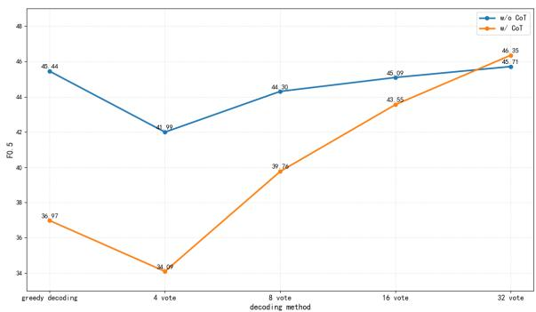  
Figure 1: Comparison of w/ CoT and w/o CoT models. We train the same model twice separately: once on CoT data and once on non-CoT data.

Fang et al., 2025) and semantic error correction (Wu et al., 2026)2. For Chinese, the spelling and grammatical correction have achieved substantial progress, but Chinese Semantic Error Correction (CSEC) remains underexplored due to the subtlety of semantic errors and the difficulty of correction, despite their potential to introduce ambiguity and misinterpretation in downstream applications.

Recent work on Chinese Text Error Correction (CTEC) has increasingly adopted Large Language Models (LLMs), owing to their strong ability to generate fluent and coherent text (Wu et al., 2026; Liu et al., 2025; Chang and Zhu, 2025). However, two fundamental challenges remain unresolved. First, text correction inherently follows the principle of minimal editing, whereas LLMs often introduce unnecessary modifications to originally correct spans or even rewrite entire sentences, resulting in severe over-correction. Second, although Chain-of-Thought (CoT) reasoning and self-consistency decoding (Wang et al., 2022) have shown promising gains in reasoning tasks, recent studies suggest that individual reasoning paths generated by LLMs may be unreliable and not faithfully grounded in the input context (Ye and Durrett, 2022). Consequently, the role of CoT under different decoding strategies in correction tasks remains poorly understood. Our preliminary experiments further proves this phenomenon (Figure 1): under greedy decoding, w/ CoT model perform worse than w/o CoT model, yet under self-consistency, the w/o CoT model model gains plateau while w/ CoT model improve steadily and eventually surpass it. This suggests that the benefit of CoT in CSEC is fundamentally tied to the sampling strategy, and that training objectives explicitly aligned with self-consistency are needed to fully exploit CoT-based models.

To address these two challenges, we propose Vote-guided Advantage Allocation for CSEC (VAA-CSEC), a multi-stage framework that combines CoT distillation, Supervised Fine-Tuning (SFT), Reinforcement Learning (RL), and selfconsistency decoding. At the RL stage, we design a task-specific reward function with two components: a format constraint that regularizes the output structure, and an edit-distance-based correctness term that rewards effective corrections while explicitly penalizing over-correction, directly operationalizing the minimal-editing principle of CSEC. We further propose Group-Level Relative Policy Optimization (GLPO), which reallocates GRPO advantages according to the margin between individual rollout rewards and the vote-aggregated group reward, aligning the RL training objective with the self-consistency objective used at inference time. Our contributions are as follows.

• We propose VAA-CSEC, a multi-stage framework that couples CoT-based reasoning with self-consistency-aware RL to address the unique challenges of identifying and minimally correcting subtle semantic errors in Chinese text.

• We design a task-specific reward function for CSEC that jointly enforces output format, rewards effective edits, and penalizes over-correction, directly operationalizing the minimal-editing principle.

• We introduce GLPO, an RL strategy based on GRPO that aligns training-time optimization with inference-time self-consistency by reshaping advantages according to a grouplevel voting reward.

• Experiments show that VAA-CSEC achieves the best performance among all LLM-based methods on CSED-C with an $F _ { 0 . 5 }$ of 47.72% and the highest recall of 42.15%, and establishes a new state of the art on NaSGEC-Exam with an $F _ { 0 . 5 }$ of 41.55%.

## 2 Related Work

## 2.1 Traditional Chinese Text Error Correction Methods

CTEC has evolved from rule-based and statistical methods to deep learning approaches. Early work relied on manual rules and statistical models such as N-gram language models and confusion sets (Lin and Chu, 2015), but these methods struggled with complex, context-dependent errors (Dahlmeier and Ng, 2011). Neural approaches then became mainstream, forming two paradigms: Seq2Seq, which casts correction as translation from incorrect to correct sentences (Zhao and Wang, 2020; Rothe et al., 2021), and Seq2Edit, which predicts position-wise edit tags (Omelianchuk et al., 2020).

More recently, LLMs have been widely adopted for CTEC and achieved strong results, but they still suffer from over-correction. Li et al. (2025) report that on Chinese grammar correction and spelling check tasks, LLMs still trail traditional deep learning methods on several metrics, making the mitigation of over-correction an important open problem. In parallel, semantic correction remains underexplored relative to spelling and grammatical correction due to the hidden nature of its errors and the difficulty of corpus annotation (Sun et al., 2023), which motivates dedicated study of this setting.

## 2.2 Text Error Correction Methods Using Reinforcement Learning

RL is increasingly used in the post-training stage of NLP tasks. Within the Reinforcement Learning from Human Feedback (RLHF) (Kaufmann et al., 2023), the dominant algorithms have evolved from PPO (Schulman et al., 2017) and DPO (Rafailov et al., 2023) to GRPO (Shao et al., 2024b).

Applying RL to LLM-based text correction has also progressed rapidly. Li et al. (2025) combine GRPO with rule-based rewards for Chinese grammar correction, achieving state-of-the-art performance on FCGEC with markedly improved recall. To address advantage collapse under sparse rewards, EDGE-GRPO (Zhang et al., 2025) introduces entropy-driven advantage estimation and a guided correction mechanism. Li et al. (2026) further stabilize training via bilateral contextualization and reward confidence correction, and Lin et al. (2026) propose CEC-Zero, a zero-supervised RL framework that uses semantic similarity and candidate clustering to compute consensus rewards. Together, these results show that combining RL with LLMs is an effective path toward mitigating over-correction, improving recall, and strengthening cross-domain generalization in text correction.

## 3 Method

## 3.1 Overview

Our VAA-CSEC consists of four stages: CoT distillation, SFT, RL, and self-consistency decoding. Figure 2 shows the detail of our VAA-CSEC framework. We unfold training data with multiple references and use Qwen3.5-27B3 to distill CoT rationales for each sentence pair, with DeepSeek-V3.24 acting as a quality reviewer (§3.3). In the SFT stage, we fine-tune $\mathbf { Q } \mathrm { w e n } 3 . 5 – 4 \mathbf { B } ^ { 5 }$ on the CoT data to obtain a reasoning model (§3.4). Then we design a task-specific reward for CSEC and further propose GLPO, a strategy that aligns RL training with selfconsistency at inference by reshaping advantages according to a group-level voting reward (§3.5). During inference, we perform self-consistency decoding over N stochastic generations (§3.6).

## 3.2 Task Definition

Given a Chinese text sequence X $[ x _ { 1 } , x _ { 2 } , \ldots , x _ { n } ]$ that may contain semantic errors, the CSEC task aims to develop a system that transforms it into a semantically correct and naturally expressed text sequence Y , while preserving the core semantics of the original sentence and making only minimal changes to the necessary parts. Since this process is essentially a mapping from erroneous text to corrected text, it can be viewed as a special form of text translation.

## 3.3 CoT Distillation

To equip the model with basic reasoning and correction capabilities before RL, we construct CoT rationales for each sentence pair in the training set through an automatic distillation-verification pipeline. We first unfold training data with multiple references, so that each source sentence corresponds to only one reference sentence. For every such pair, we prompt a strong teacher model, Qwen3.5-27B, to generate a CoT rationale that explains how the source can be revised into the reference. To filter low-quality rationales, we select DeepSeek-V3.2 to verify each generated CoT. Samples that fail verification are regenerated, up to three attempts. The processed data is shown in Experiments 4.1, and the full generation and verification prompts are provided in Appendix B.

## 3.4 Supervised Fine-Tuning

Based on the distilled CoT data, we perform SFT on Qwen3.5-4B with LoRA, obtaining a SFT checkpoint that serves as the initialization for the subsequent RL stage. The SFT stage plays two essential roles in our pipeline. First, it teaches the model to follow the structured <think>. . . </think> <answer>. . . </answer> output format, which is a prerequisite for our reward function to reliably extract the final correction during RL. Second, it grounds the policy in the distribution of highquality reasoning trajectories distilled from the teacher, so that RL exploration starts from a competent rather than a random policy.

## 3.5 Reinforcement Learning

The observation in Introduction 1 is consistent with recent studies (Ye and Durrett, 2022), which show that individual reasoning chains generated by LLMs may themselves be unreliable, while correctness often emerges from agreement across multiple sampled reasoning paths. For a CoT-based correction model whose N sampled candidates already contain the correct answer with high probability, the primary bottleneck of self-consistency is therefore no longer the model’s intrinsic correction capability, but how reliably the correct correction is reproduced across sampled candidates and ultimately dominates the vote. Motivated by this perspective, we introduce GLPO on top of the SFT stage to align the RL training objective with the self-consistency objective at inference time, encouraging correct corrections to be reinforced as the dominant mode across sampled candidates.

## 3.5.1 Reward Function

For CSEC, the reward function should not only judge whether the model successfully corrects the errors in the sentence, but also further evaluate the quality and rationality of the revisions made by the model. Several studies have explored this issue. For example, Li et al. (2025) proposed a rule-based reward for CGEC. However, it fails to distinguish two sub-cases of "originally incorrect, modified but still incorrect": whether the output moves closer to or further from the reference. These cases carry very different optimization implications—partial correction versus semantic damage and assigning them the same reward deprives the model of finegrained learning signals.

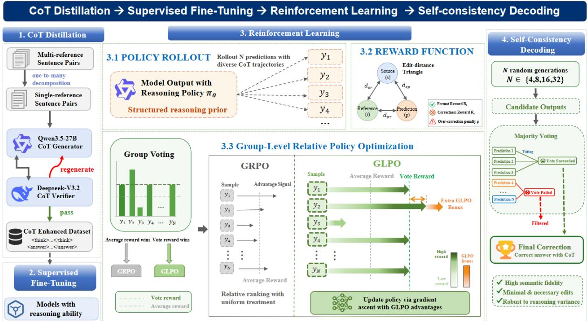  
Figure 2: Overview of VAA-CSEC. Left: a CoT distillation pipeline pairs a Qwen3.5-27B generator with a DeepSeek-V3.2 verifier to produce structured data for SFT. Center: GLPO rolls out N candidates from the policy πθ, scores them with a reward combining format $R _ { f } { \mathrm { : } }$ , edit-distance correctness $\mathit { R } _ { c } ,$ and an over-correction penalty ρ, and reallocates advantages using the margin between each rollout’s reward and the vote-aggregated group reward. Right: at inference, N stochastic generations are aggregated by majority voting to yield the final correction.

Therefore, we propose a reward function design method inspired by the $F _ { 0 . 5 }$ scoring scheme. Our reward function consists of two components: format reward and correctness reward.

Format Reward. The format reward is designed to constrain the model to generate outputs in the standard structured format: <think>...</think> <answer>...</answer>. Additional rewards are assigned only when the model strictly follows the specified format. This design can stabilize the output format of the model during the RL stage and enhance the controllability of both the generated reasoning process and the final answer.

Correctness Reward. For the correctness reward, we compute three edit distances: $d _ { s r }$ between the source and the reference (the essential edits required), $d _ { s p }$ between the source and the model output (the actual edits performed), and $d _ { p r }$ between the model output and the reference (the residual gap). We define the number of useful edits as

$$
u = \frac { d _ { s r } + d _ { s p } - d _ { p r } } { 2 } ,\tag{1}
$$

which captures the portion of the model’s edits that genuinely move the output toward the reference. When $u > 0$ , the edits are beneficial, when $u = 0 ,$ they yield no net gain, when $u \ < \ 0 .$ , the output drifts further from the reference than the source itself, in which case a negative reward is assigned. Based on u, we define edit-based precision and recall as

$$
P = \operatorname* { m i n } \left( \frac { u } { d _ { s p } } , 1 \right) ,\tag{2}
$$

$$
\hat { R } = \operatorname* { m i n } \left( \frac { u } { d _ { s r } } , 1 \right) ,\tag{3}
$$

and adopt the $F _ { 0 . 5 }$ score, which weights precision more heavily than recall, as the core reward signal:

$$
F _ { 0 . 5 } = \frac { 1 . 2 5 \cdot P \cdot \hat { R } } { 0 . 2 5 \cdot P + \hat { R } } .\tag{4}
$$

To explicitly penalize over-correction, we also track the excess modification ratio

$$
\rho = \frac { d _ { s p } - d _ { s r } } { d _ { s r } } , \qquad \mathrm { w h e n } \ : d _ { s p } > d _ { s r } .\tag{5}
$$

<table><tr><td>Case</td><td> $\overline { { R _ { \mathbf { c } } } }$ </td></tr><tr><td>Exact match</td><td>+3.4</td></tr><tr><td>Effective &amp; minimal</td><td> $2 . 0 \cdot F _ { 0 . 5 }$ </td></tr><tr><td>Effective &amp; overcorrects</td><td> $2 . 0 \cdot F _ { 0 . 5 } - 0 . 8 \cdot \operatorname* { m i n } ( \rho , 2 )$ </td></tr><tr><td>No effective edit</td><td>0.0</td></tr><tr><td>Degrades source</td><td> $- 1 . 5 \cdot \operatorname* { m i n } ( - \hat { R } , 1 )$ </td></tr></table>

Table 1: Five branches of the correctness reward $R _ { \mathrm { c } } ,$ clipped to $[ - 1 . 5 , 3 . 4 ]$ . The total reward used during training is $R = R _ { \mathrm { f } } + R _ { \mathrm { c } }$ , where $R _ { \mathrm { f } } = 0 . 3$ if the output strictly contains exactly one <think> block and one <answer> block, and 0 otherwise.

The full correctness reward $R _ { \mathrm { c } }$ is then computed by a piecewise function over five mutually exclusive cases summarized in Table 1.

## 3.5.2 The Limitation of GRPO

We first tried GRPO, as shown in Figure 3, the model’s performance is improved, but the magnitude of improvement remains limited when using 32 vote inference. We argue that this limitation originates from a fundamental objective mismatch: the optimization objective of standard GRPO is the expected reward of individual samples

$$
J _ { \mathrm { G R P O } } = \mathbb { E } _ { y \sim \pi _ { \theta } } \big [ r ( y ) \big ] ,\tag{6}
$$

and its advantage is computed through relative comparisons within each group:

$$
A _ { i , j } ^ { \mathrm { G R P O } } = \frac { r _ { i , j } - \bar { r } _ { G _ { i } } } { \sigma _ { G _ { i } } } .\tag{7}
$$

However, the actual self-consistency performance used during inference is determined by

$$
E _ { G \sim \pi _ { \theta } ^ { K } } \left[ r ( \mathsf { V o t e } ( G ) ) \right] ,\tag{8}
$$

which is not fully equivalent to the former objective. GRPO indirectly improves vote performance by increasing the mean reward of individual samples. However, the training objective merely improves the overall reward of the rollout group as a whole. It does not specifically push the probability mass of correct answers above that of less-preferred ones, which is precisely what determines whether the best candidate wins under self-consistency.

## 3.5.3 Group-Level Relative Policy Optimization

To align the training process with the objective of improving self-consistency performance, we propose GLPO, a simple yet effective strategy. Building upon the group-normalized advantages in standard GRPO, GLPO introduces a one-sided nonnegative vote-margin gain term, which assigns additional positive advantages to samples whose individual rewards exceed the vote reward of their corresponding group, in proportion to the amount by which they exceed it:

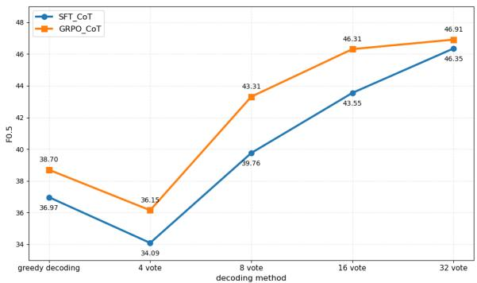  
Figure 3: Performance comparison of $F _ { 0 . 5 }$ scores for SFT and GRPO models across different decoding strategies. SFT\_CoT denotes the model fine-tuned via SFT on CoT data, while GRPO\_CoT refers to the GRPOoptimized model initialized from the SFT checkpoint.

$$
A _ { i , j } ^ { \mathrm { G L P O } } = \underbrace { \frac { r _ { i , j } - \bar { r } _ { G _ { i } } } { \sigma _ { G _ { i } } } } _ { \mathrm { b a s e } } + \underbrace { \operatorname* { m a x } \bigl ( 0 , r _ { i , j } - R ( G _ { i } ) \bigl ) } _ { \mathrm { b o n u s } } ,\tag{9}
$$

where ${ r } _ { i , j }$ denotes the individual reward of the j-th sample in the i-th group, while $\bar { r } _ { G _ { i } }$ and $\sigma _ { G _ { i } }$ represent the mean and standard deviation of the rewards within that group, respectively, and $R ( G _ { i } )$ denotes the vote reward of the group. The pseudocode of the GLPO algorithm is provided in Appendix I.

This design enables the model to establish a gradient allocation mechanism within each group that is more aligned with the self-consistency optimization objective: (1) outputs that outperform the group-level vote score are substantially amplified; (2) answers whose rewards fall below the group vote score remain unaffected and revert to the standard GRPO behavior; and (3) outputs belonging to the vote result are prevented from being excessively reinforced. Compared with GRPO, which relies solely on relative ranking within groups, GLPO can directly exploit the group preference signals provided by the vote reward, thereby aligning the optimization direction more closely with the ultimate self-consistency objective.

## 3.6 Self-Consistency Decoding

While greedy decoding selects the single most likely output, our training objective is explicitly aligned with a multi-sample inference procedure.

<table><tr><td rowspan="2">Dataset</td><td rowspan="2">Usage</td><td colspan="2">Train</td><td rowspan="2"></td><td rowspan="2">Val Test</td></tr><tr><td>Before After</td><td></td></tr><tr><td>CSED-C</td><td> $\stackrel { \mathrm { n o n - C o T } } { \mathrm { C o T } }$ </td><td>8,682</td><td>11,338 11,204</td><td>1,0001,000</td><td></td></tr><tr><td>NaSGEC-Exam</td><td> $\stackrel { \mathrm { n o n - C o T } } { \mathrm { C o T } }$ </td><td>4,000</td><td>5,818 5,406</td><td>1,000 2,000</td><td></td></tr></table>

Table 2: Dataset statistics across training stages. Only the training set is processed. ‘Before’ reports the raw sentence count, while ‘After’ reports the count after taskspecific preprocessing.

We therefore adopt self-consistency: for each input x, the policy πθ generates N candidate corrections $\{ \hat { y } _ { 1 } , \dotsc , \hat { y } _ { N } \}$ under stochastic decoding with temperature $T = 1 . 0$ , and the final prediction is determined by majority voting:

$$
\hat { y } ^ { \star } = \arg \operatorname* { m a x } _ { y } \sum _ { i = 1 } ^ { N } \mathcal { H } [ \hat { y } _ { i } = y ] .\tag{10}
$$

In our experiments, we vary $N \in \{ 4 , 8 , 1 6 , 3 2 \}$ to study how voting scale interacts with CoTinduced output diversity, and how it amplifies the gains of GLPO over standard GRPO.

## 4 Experiments

## 4.1 Dataset

We evaluate on two datasets, summarized in Table 2. CSED-C (Sun et al., 2023) is a manually annotated dataset of 10,682 sentence pairs collected from Chinese examination correction tasks. NaSGEC-Exam is the examination subset of NaSGEC (Zhang et al., 2023), containing about 7,000 erroneous sentences from real Chinese exams with multiple expert-reviewed reference corrections. More detailed introduction about the two datasets are provided in Appendix C.

## 4.2 Baselines

To evaluate the effectiveness of our method, we select several representative baseline models and methods for comparative experiments. More detailed introduction is presented in Appendix D. Seq2Seq Models. We adopt four Seq2Seq baselines: mT5-small and mT5-base (Xue et al., 2021), two scales of the multilingual pretrained model. BART-large-Chinese (Shao et al., 2024a), a denoising autoencoder pretrained specifically for Chinese generation. SynGEC (Zhang et al., 2022b), which augments BART with dependency syntax to better capture complex grammatical errors.

Seq2Edit Models. We use GECToR (Omelianchuk et al., 2020) as the representative Seq2Edit baseline, which reformulates correction as token-level edit operation prediction (insertion, deletion, substitution) instead of generating the full target sentence. Large Language Models. We adopt the LLMbased CSEC method proposed by Wu et al. (2026), denoted as CSEC-LLM. This method leverages instruction tuning together with an example selection strategy and a re-scoring mechanism to improve semantic error correction performance.

## 4.3 Implementation

During the SFT stage, we conduct training based on LLaMA-Factory6 and select Qwen3.5-4B as the base model, then adopt the LoRA fine-tuning approach, with the LoRA rank set to 128, batch size set to 4, learning rate set to $2 . 0 \times 1 0 ^ { - 4 }$ , and the number of training epochs set to 3. Each training run in this stage takes approximately 4 hours.

During the RL stage, we perform our GLPO training based on ms-swift7. LoRA fine-tuning is also adopted in this stage, with the following training configurations: LoRA rank of 8, batch size of 8, learning rate of $1 \times 1 0 ^ { - 6 }$ , rollout number of 8, temperature set to 1.0, β set to 0.001, and the number of training epochs set to 5. The training process takes approximately 80 hours. All experiments are conducted on two A30 GPUs.

## 4.4 Evaluation

During the evaluation stage, we employ ChER-RANT, proposed by Zhang et al. (2022a), to evaluate the model outputs. This metric is capable of computing precision, recall, and the $F _ { 0 . 5 }$ score. The $F _ { 0 . 5 }$ score is a variant of $F _ { 1 }$ metric that places greater emphasis on the precision of corrections rather than recall. This evaluation criterion is more consistent with the objectives of Chinese semantic error correction, which aim to avoid erroneous modifications and minimize edits. Specifically, the model is expected to make only necessary corrections to erroneous parts rather than extensively rewriting the original sentence, thereby better preserving the semantic meaning and stylistic consistency of the original expression.

## 4.5 Main Results

Table 3 presents the main results on CSED-C and NaSGEC-Exam. We organize our discussion

<table><tr><td>Dataset</td><td>Method</td><td>Model</td><td>Decoding</td><td>P</td><td>R</td><td> $F _ { 0 . 5 }$ </td></tr><tr><td rowspan="10">CSED-C</td><td rowspan="5">Seq2Seq</td><td>mT5-small</td><td></td><td>33.70</td><td>5.40</td><td>16.50</td></tr><tr><td>mT5-base</td><td></td><td>57.00</td><td>19.00</td><td>40.70</td></tr><tr><td>BART-large</td><td></td><td>53.80</td><td>38.30</td><td>49.70</td></tr><tr><td>SynGEC</td><td></td><td>53.00</td><td>39.50</td><td>49.60</td></tr><tr><td>ChatGLM3-6B CSEC-LLM</td><td></td><td>33.18</td><td>27.80</td><td>31.94</td></tr><tr><td rowspan="5">Ours</td><td>Baichuan2-7B Zero-shot</td><td>greedy</td><td>35.90</td><td>32.95</td><td>35.26</td></tr><tr><td></td><td>greedy</td><td>11.95 37.28</td><td>10.30 35.80</td><td>11.58 36.97</td></tr><tr><td>SFT</td><td>+32 vote</td><td>47.73</td><td>41.55</td><td>46.35</td></tr><tr><td>GRPO</td><td>greedy +32 vote</td><td>39.76 48.71</td><td>34.98 40.88</td><td>38.70 46.91</td></tr><tr><td>VAA-CSEC</td><td>greedy</td><td>39.19</td><td>35.50</td><td>38.39</td></tr><tr><td>Seq2Seq</td><td></td><td>+32 vote</td><td>49.34</td><td>42.15</td><td>47.72</td></tr><tr><td rowspan="8">NaSGEC -Exam</td><td>Seq2Edit</td><td>BART-large</td><td>一</td><td>23.01</td><td>11.31</td><td>19.06</td></tr><tr><td></td><td>GECToR</td><td>一</td><td>20.93</td><td>8.80</td><td>16.41</td></tr><tr><td>CSEC-LLM</td><td>ChatGLM3-6B Baichuan2-7B</td><td></td><td>30.51</td><td>24.30</td><td>29.03</td></tr><tr><td rowspan="5">Ours</td><td>Zero-shot</td><td>greedy</td><td>34.46 11.92</td><td>22.69 15.10</td><td>31.22 12.44</td></tr><tr><td>SFT</td><td>greedy</td><td>19.91</td><td>23.02</td><td>20.46</td></tr><tr><td></td><td>+32 vote</td><td>47.43</td><td>26.78</td><td>41.09</td></tr><tr><td>GRPO</td><td>greedy</td><td>24.61</td><td>22.49</td><td>24.15</td></tr><tr><td></td><td>+32 vote</td><td>46.81</td><td>26.43</td><td>40.55</td></tr><tr><td rowspan="2"></td><td>VAA-CSEC</td><td>greedy</td><td>27.66</td><td>24.20</td><td>26.89</td><td></td></tr><tr><td></td><td>+32 vote</td><td>48.43</td><td>26.50</td><td></td><td>41.55</td></tr></table>

Table 3: Main results on CSED-C and NaSGEC-Exam. Underlined bold indicates the best score per metric across all methods within each dataset; bold indicates the best score per metric among the remaining methods of the same method.

around three findings:

1) Competitive performance with a lightweight model. On CSED-C, our method surpasses larger LLM-based baselines and ranks the best among them, while overall placing second only to BARTlarge. It achieves the highest recall of 42.15% across all methods, indicating a stronger ability to identify semantic errors than even the strongest task-specific Seq2Seq baseline. On NaSGEC-Exam, our method outperforms all baselines on both precision and $F _ { 0 . 5 }$ , establishing a new state of the art. The contrast between the two datasets is informative: while traditional Seq2Seq models can still be competitive on the relatively well-defined CSED-C, they struggle considerably on NaSGEC-Exam, whose subtler semantic errors favor LLMbased approaches such as ours.

2) Our VAA-CSEC consistently improves over GRPO and SFT. Across both datasets, VAA-CSEC demonstrates a clear advantage over its GRPO and SFT counterparts. Under 32 Vote decoding, VAA-CSEC reaches 47.72% $F _ { 0 . 5 }$ on CSED-C, outperforming GRPO at 46.91% and SFT at 46.35%. On NaSGEC-Exam, it achives 41.55%, again surpassing GRPO at 40.55% and SFT at 41.09%. Interestingly, on NaSGEC-Exam, applying standard

<table><tr><td>VAA-CSEC</td><td>P</td><td>R</td><td> $\mathbf { F _ { 0 . 5 } }$ </td><td>Time cost</td><td> $\mathbf { \Delta \Delta \mathbf { E _ { 0 . 5 } } }$ </td></tr><tr><td>Greedy</td><td>39.19</td><td>35.50</td><td>38.39</td><td>~2 min</td><td></td></tr><tr><td>4-vote</td><td>39.51</td><td>36.02</td><td>38.76</td><td>~8 min</td><td>+0.37</td></tr><tr><td>8-vote</td><td>42.00</td><td>37.67</td><td>41.06</td><td>~16 min</td><td>+2.30</td></tr><tr><td>16-vote</td><td>47.55</td><td>40.58</td><td>45.97</td><td>~32 min</td><td>+4.91</td></tr><tr><td>32-vote</td><td>49.34</td><td>42.15</td><td>47.72</td><td>~64 min</td><td>+1.75</td></tr></table>

Table 4: Cost-performance trade-off of VAA-CSEC on CSED-C.

GRPO on top of SFT yields a slight performance drop of 0.64%, suggesting that standard groupnormalized advantages can degenerate into noisy signals when intra-group reward variance is low. Our GLPO strategy not only recovers the lost performance but surpasses both baselines, indicating that its vote-margin bonus provides a more stable, consistency-based signal that helps the policy escape such suboptimal training dynamics.

3) Self-consistency decoding unlocks substantial gains. Switching from greedy decoding to 32 Vote produces large $F _ { 0 . 5 }$ improvements across all of our model variants and both datasets. For VAA-CSEC, the absolute gain reaches +9.33% on CSED-C and +14.66% on NaSGEC-Exam. This pattern aligns with the conclusion of Ye and Durrett (2022) that individual CoT reasoning paths can be unreliable: greedy decoding commits to a single, potentially ungrounded trajectory and thus underutilizes the capacity of the learned policy. Aggregating multiple samples via majority voting mitigates this unreliability by stably recovering high-quality corrections to which the policy has already assigned non-trivial probability mass. Furthermore, as shown in the table 4, while the model performs best with 32 votes, the inference cost increases exponentially. Considering inference efficiency, we recommend using a 16-vote setting in practical applications.

## 4.6 Ablation Study

To understand the contribution of each component, we conduct an ablation study of CoT distillation and GLPO on CSED-C, as shown in Table 5.

Removing CoT distillation causes the largest performance drop of 4.49%, indicating that the structured reasoning trajectories distilled from the teacher are critical for establishing a strong initial policy. Replacing GLPO with vanilla GRPO leads to a smaller degradation of 0.81%. The decline is mainly reflected in recall, which decreases by 1.27%, while precision drops by only 0.63%. This result suggests that the vote-margin signal introduced by GLPO helps the policy recover a larger proportion of true corrections.

<table><tr><td>Method</td><td>P</td><td>R</td><td> $F _ { \mathrm { 0 . 5 } }$ </td></tr><tr><td>VAA-CSEC</td><td>49.34</td><td>42.15</td><td>47.72</td></tr><tr><td>w/o CoT</td><td>44.27</td><td>39.54</td><td>43.23</td></tr><tr><td>w/o GLPO</td><td>48.71</td><td>40.88</td><td>46.91</td></tr><tr><td>w/o CoT and GLPO</td><td>44.66</td><td>39.99</td><td>43.64</td></tr></table>

Table 5: Ablation study of the proposed components on the CSEC task. “w/o” denotes removing the corresponding module from the full model.

Removing both components yields an $F _ { 0 . 5 }$ score of 43.64%, which is slightly higher than the score of 43.23% obtained when removing only CoT distillation. We attribute this phenomenon to the lack of rollout diversity in the absence of CoT training. Even with a sampling temperature of 1.0, the policy generates nearly identical trajectories, causing the intra-group reward variance to collapse. As a result, neither GRPO nor GLPO can provide informative optimization signals. The resulting difference of 0.41% therefore falls within expected training noise and further supports that GLPO is most effective when applied to CoT-trained policies.

## 4.7 Cross-Domain Evaluation

We make the following observations from Table 6. The two training sets induce noticeably different decision behaviors. Models trained on CSED-C consistently achieve higher recall on both test sets: under 32 Vote, the CSED-C-trained model reaches 42.15% and 42.14% Recall on the two test sets, substantially higher than the 27.88% and 26.50% Recall obtained by the model trained on NaSGEC-Exam. Conversely, training on NaSGEC-Exam yields higher precision: 50.54% and 48.43% Precision versus 49.34% and 35.22% Precision from the CSED-C trained counterpart. This contrast suggests that the two corpora encode distinct error distributions and labeling tendencies. CSED-C, with its broader coverage of semantic error types, drives the policy toward a more aggressive editing behavior, whereas the more conservative NaSGEC-Exam annotations push the policy toward editing only when strongly confident.

Despite reasonable cross-domain transfer, the highest $F _ { 0 . 5 }$ on each test set is still obtained by the in-domain model: 47.72% on CSED-C and 41.55% on NaSGEC-Exam, both under 32 Vote decoding. This confirms that our method is able to fit each dataset’s specific error distribution, while still retaining enough generalization for usable outof-domain performance.

<table><tr><td>Train Set</td><td>Test Set</td><td>Decoding</td><td>P</td><td>R</td><td> $F _ { 0 . 5 }$ </td></tr><tr><td rowspan="3">CSED-C</td><td>CSED-C</td><td>greedy +32 Vote</td><td>39.19 49.34</td><td>35.50 42.15</td><td>38.39 47.72</td></tr><tr><td>NaSGEC-Exam</td><td>Greedy</td><td>27.06</td><td>36.46</td><td>28.53</td></tr><tr><td></td><td>+32 Vote</td><td>35.22</td><td>42.14</td><td>36.42</td></tr><tr><td rowspan="3">NaSGEC-Exam</td><td>CSED-C</td><td>Greedy +32 Vote</td><td>35.65</td><td>26.46</td><td>33.33</td></tr><tr><td></td><td></td><td>50.54</td><td>27.88</td><td>43.47</td></tr><tr><td>NaSGEC-Exam</td><td>Greedy +32 Vote</td><td>27.66 48.43</td><td>24.20 26.50</td><td>26.89 41.55</td></tr></table>

Table 6: Cross-domain evaluation results. Each model is trained on one dataset and evaluated on both test sets.

## 5 Conclusion

We presented VAA-CSEC, a multi-stage framework for CSEC that targets two obstacles to applying LLMs to this task. The first is over-correction, and the second is the unclear interaction between CoT reasoning and sampling-based decoding. To address the first, we designed a task-specific reward that combines format constraints, edit-distance correctness, and an explicit over-correction penalty, directly aligning the training objective with the minimal-editing principle of CSEC. To address the second, we introduced GLPO, a group-level extension of GRPO that reallocates advantages based on the margin between each rollout’s reward and a vote-aggregated group reward, making the RL objective at training time consistent with the selfconsistency objective used at inference time. VAA-CSEC outperforms all LLM-based baselines on CSED-C and establishes a new state of the art on NaSGEC-Exam, with consistent improvements over both SFT and GRPO and substantial additional gains from self-consistency decoding.

Beyond the empirical results, our work also reinforces a broader methodological observation already noted in prior studies on reasoning with LLMs. The benefit of CoT is conditional on the sampling strategy, and our preliminary analysis on CSEC provides further evidence for this view. Under greedy decoding CoT can even hurt, while under self-consistency it yields steadily growing gains that eventually surpass the non-CoT baseline. This decoupling between training-time and inference-time objectives is not specific to CSEC, and we expect that the GLPO recipe of using an ingroup voting consensus as an explicit optimization anchor will be applicable to other generation tasks that rely on self-consistency decoding.

## Limitations

While VAA-CSEC achieves strong empirical results on Chinese semantic error correction, several aspects of our study are constrained by available compute and the scope of our experimental design, and we discuss them below. Due to computational constraints, our parameter study only covers rollout sizes $N \in \{ 4 , 6 , 8 \}$ . Whether the observed trend continues at larger scales, and in particular whether GRPO and VAA-CSEC behave differently as N grows beyond 8, remains an open question. The potential interaction between the training-time rollout size and the test-time self-consistency scale also warrants further investigation. Furthermore, our experiments focus exclusively on CSEC, evaluated on CSED-C and NaSGEC-Exam. While the underlying mechanism of GLPO is language-agnostic and applies to any task where self-consistency aggregates over multiple samples, its empirical applicability to other languages, particularly those with substantially different morphology or error patterns, has not been validated.

## Ethics Statement

The datasets and large language models used in our study come from open-access repositories. This ensures that we comply with all relevant ethical standards and authorizations. We strictly follow established research ethics throughout our research. As for the AI assistant, we utilize ChatGPT and Claude to identify textual errors and polish paper.

## Acknowledgments

This work was supported by Guangdong Basic and Applied Basic Research Foundation (No. 2025A1515110214).

## References

Mehedi Hasan Bijoy, Nahid Hossain, Salekul Islam, and Swakkhar Shatabda. 2025. A transformer-based spelling error correction framework for bangla and resource scarce indic languages. Computer Speech and Language, 89:101703.

Xinquan Chang and Junguo Zhu. 2025. A chunk-based chain of thought prompting method for mitigating over-correction in Chinese grammatical error correction. In Proceedings ofthe 24th China National Conference on Computational Linguistics (CCL 2025), pages 831–841, Jinan, China. Chinese Information Processing Society of China.

Daniel Dahlmeier and Hwee Tou Ng. 2011. Correcting semantic collocation errors with l1-induced paraphrases. In Proceedings of the 2011 conference on empirical methods in natural language processing, pages 107–117.

Tao Fang, Tianyu Zhang, Derek F. Wong, Keyan Jin, Lusheng Zhang, Qiang Zhang, Tianjiao Li, Jinlong Hou, and Lidia S. Chao. 2025. Llmcl-gec: Advancing grammatical error correction with llm-driven curriculum learning. Expert Systems with Applications, 279:127397.

Yu Jia, Guanqiu Qin, Heng Shi, Yi Shen, and Jianjiang Liu. 2026. Probability-deviation guided spelling error correction for low-resource languages. Data Intelligence.

Timo Kaufmann, Paul Weng, Viktor Bengs, and Eyke Hüllermeier. 2023. A survey of reinforcement learning from human feedback. arXiv preprint arXiv:2312.14925.

Yilin Li, Xunjian Yin, Yilin Chen, and Xiaojun Wan. 2025. Harnessing rule-based reinforcement learning for enhanced grammatical error correction. Preprint, arXiv:2508.18780.

Yu Li, Tian Lan, and Zhengling Qi. 2026. When right meets wrong: Bilateral context conditioning with reward-confidence correction for grpo. arXiv preprint arXiv:2603.13134.

Chuan-Jie Lin and Wei-Cheng Chu. 2015. A study on chinese spelling check using confusion sets and n-gram statistics. In International Journal ofComputational Linguistics & Chinese Language Processing, Volume 20, Number 1, June 2015-Special Issue on Chinese as a Foreign Language.

Zhiming Lin, Kai Zhao, Sophie Zhang, Peilai Yu, and Canran Xiao. 2026. Cec-zero: Zero-supervision character error correction with self-generated rewards. Proceedings of the AAAI Conference on Artificial Intelligence, 40(28):23612–23620.

Xinpeng Liu, Bing Xu, Muyun Yang, Hailong Cao, Conghui Zhu, Tiejun Zhao, and Wenpeng Lu. 2025. A chain-of-task framework for instruction tuning of LLMs based on Chinese grammatical error correction. In Proceedings of the 31st International Conference on Computational Linguistics, pages 8623– 8639, Abu Dhabi, UAE. Association for Computational Linguistics.

Syauqie Muhammad Marier, Xiangfan Chen, Linan Zhu, and Xiangjie Kong. 2025. Grammatical error correction for low-resource languages: a review of challenges, strategies, computational and future directions. PeerJ Computer Science, 11:e3044.

Kostiantyn Omelianchuk, Vitaliy Atrasevych, Artem Chernodub, and Oleksandr Skurzhanskyi. 2020. GECToR – grammatical error correction: Tag, not rewrite. In Proceedings of the Fifteenth Workshop on Innovative Use ofNLPfor Building Educational

Applications, pages 163–170, Seattle, WA, USA → Online. Association for Computational Linguistics.

Rafael Rafailov, Archit Sharma, Eric Mitchell, Christopher D Manning, Stefano Ermon, and Chelsea Finn. 2023. Direct preference optimization: Your language model is secretly a reward model. In Advances in Neural Information Processing Systems, volume 36, pages 53728–53741. Curran Associates, Inc.

Sascha Rothe, Jonathan Mallinson, Eric Malmi, Sebastian Krause, and Aliaksei Severyn. 2021. A simple recipe for multilingual grammatical error correction. In Proceedings of the 59th Annual Meeting of the Associationfor Computational Linguistics and the 11th International Joint Conference on Natural Language Processing (Volume 2: Short Papers), pages 702–707, Online. Association for Computational Linguistics.

John Schulman, Filip Wolski, Prafulla Dhariwal, Alec Radford, and Oleg Klimov. 2017. Proximal policy optimization algorithms. arXiv preprint arXiv:1707.06347.

Yunfan Shao, Zhichao Geng, Yitao Liu, Junqi Dai, Hang Yan, Fei Yang, Zhe Li, Hujun Bao, and Xipeng Qiu. 2024a. Cpt: a pre-trained unbalanced transformer for both chinese language understanding and generation. Science China Information Sciences, 67(5):152102.

Zhihong Shao, Peiyi Wang, Qihao Zhu, Runxin Xu, Junxiao Song, Xiao Bi, Haowei Zhang, Mingchuan Zhang, Y. K. Li, Y. Wu, and Daya Guo. 2024b. Deepseekmath: Pushing the limits of mathematical reasoning in open language models. Preprint, arXiv:2402.03300.

Bo Sun, Baoxin Wang, Yixuan Wang, Wanxiang Che, Dayong Wu, Shijin Wang, and Ting Liu. 2023. Csed: A chinese semantic error diagnosis corpus. Preprint, arXiv:2305.05183.

Xuezhi Wang, Jason Wei, Dale Schuurmans, Quoc Le, Ed Chi, Sharan Narang, Aakanksha Chowdhery, and Denny Zhou. 2022. Self-consistency improves chain of thought reasoning in language models. arXiv preprint arXiv:2203.11171.

Hongyan Wu, Nankai Lin, Shengyi Jiang, and Lianxi Wang. 2026. Advancing llms for chinese semantic error correction: Example selection and re-scoring. Expert Systems with Applications, 319:131925.

Linting Xue, Noah Constant, Adam Roberts, Mihir Kale, Rami Al-Rfou, Aditya Siddhant, Aditya Barua, and Colin Raffel. 2021. mT5: A massively multilingual pre-trained text-to-text transformer. In Proceedings of the 2021 Conference of the North American Chapter ofthe Associationfor Computational Linguistics: Human Language Technologies, pages 483–498, Online. Association for Computational Linguistics.

Xi Ye and Greg Durrett. 2022. The unreliability of explanations in few-shot prompting for textual reasoning. Advances in neural information processing systems, 35:30378–30392.

Xingjian Zhang, Siwei Wen, Wenjun Wu, and Lei Huang. 2025. Edge-grpo: Entropy-driven grpo with guided error correction for advantage diversity. arXiv preprint arXiv:2507.21848.

Yue Zhang, Zhenghua Li, Zuyi Bao, Jiacheng Li, Bo Zhang, Chen Li, Fei Huang, and Min Zhang. 2022a. MuCGEC: a multi-reference multi-source evaluation dataset for chinese grammatical error correction. In Proceedings ofNAACL-HLT, Online. Association for Computational Linguistics.

Yue Zhang, Bo Zhang, Haochen Jiang, Zhenghua Li, Chen Li, Fei Huang, and Min Zhang. 2023. NaSGEC: a multi-domain chinese grammatical error correction dataset from native speaker texts. In Findings of ACL.

Yue Zhang, Bo Zhang, Zhenghua Li, Zuyi Bao, Chen Li, and Min Zhang. 2022b. SynGEC: Syntax-enhanced grammatical error correction with a tailored GECoriented parser. In Proceedings of the 2022 Conference on Empirical Methods in Natural Language Processing, pages 2518–2531, Abu Dhabi, United Arab Emirates. Association for Computational Linguistics.

Zewei Zhao and Houfeng Wang. 2020. Maskgec: Improving neural grammatical error correction via dynamic masking. In Proceedings of the AAAI conference on artificial intelligence, volume 34, pages 1226–1233.

## A Detailed Examples of Different Tasks

Spelling error correction targets surface-level character errors such as typographical mistakes, visually similar characters, and incorrect pinyin spellings. Grammatical error correction addresses syntactic well-formedness, including improper word order and inappropriate collocations. Semantic error correction goes further, targeting logical relations, semantic compatibility, and contextual coherence. Even sentences free of spelling and grammatical errors may still require revision when their meaning is incoherent. Figure 4 illustrates the three categories.

## B Template

The detailed template for data processing is shown in Figure 5. The English translation of the templates is as follows.

# Task   
Your task is to generate a reasoning process for   
a Chinese semantic error correction problem   
Please carefully read the original sentence and   
the corrected sentence, then write a natural   
analysis process with the following   
requirements:   
1. Analyze the problems in the original sentence   
from the perspective of grammatical rules,   
such as incorrect word order, improper   
collocation, missing components, redundant   
components, mixed sentence patterns,   
ambiguous expression, illogical meaning, etc   
2. Explain the basis for your judgment.   
3. Do not directly quote the corrected sentence.   
Instead, let the reasoning process   
naturally lead to the correction.   
# Input   
[Original Sentence]: {source}   
[Corrected Sentence]: {{target}}   
# Output Format   
<think>Your reasoning process</think>   
<answer>The corrected sentence</answer>

Listing 1: Prompt template for generating chain-ofthought reasoning during CoT distillation.

# Role   
You are a quality inspector for a Chinese   
semantic error correction task. Your only   
responsibility is to determine whether a   
given reasoning process can uniquely derive   
the specified reference answer.   
# Procedure   
I will provide three items: the original   
erroneous sentence, a reasoning process   
written by someone, and the reference answer   
. Please complete the following steps:   
1. Carefully read the reasoning process and   
simulate modifying the original sentence   
according to that reasoning to obtain a   
derived result.

2. Compare the derived result with the reference   
answer character by character.   
3. If any of the following conditions occur, the   
judgment must be "No":   
- The reasoning process misses an error that   
is corrected in the reference answer.   
- The reasoning process incorrectly   
identifies a correct expression retained in   
the reference answer as erroneous.   
- The reasoning process is ambiguous, making   
it impossible to uniquely determine the   
final corrected sentence.   
- The sentence derived from the reasoning   
process is inconsistent with the reference   
answer.   
4. Only when the derived result is completely   
identical to the reference answer should the   
judgment be "Yes".   
# Note   
Do not evaluate whether the reference answer   
itself is optimal, and do not relax the   
standard simply because the reasoning   
process appears reasonable. The only   
criterion is whether the reasoning process   
can precisely derive the given reference   
answer.   
# Input   
[Original Sentence]: {source}   
[Reasoning Process]: {thinking}   
[Reference Answer]: {target}   
# Output   
Reply only with "Yes" or "No".

Listing 2: Prompt template for verifying the quality of distilled reasoning trajectories.

# Role   
You are an expert in Chinese semantic error   
correction. Please first conduct brief   
reasoning, then complete the task.   
# Task Description   
The following sentence may contain semantic  
level issues, including but not limited to:   
inappropriate word usage,   
unreasonable semantic collocations,   
inaccurate concept usage,   
illogical semantic flow,   
ambiguity.   
# Reasoning Requirements   
Please first provide a brief analysis:   
Determine whether the sentence contains   
semantic problems.   
If problems exist, identify the type of issue   
(e.g., inappropriate wording, collocation   
issue, logical issue, redundancy, etc.).   
Provide the minimal modification needed.   
If no problem exists, explain that no   
modification is necessary and output the   
original sentence.   
# Modification Principles   
Preserve the core meaning of the original   
sentence.   
Make only the minimal and necessary   
modifications.   
Prefer deleting redundant or conflicting   
expressions.   
Avoid rewriting the entire sentence.   
# Output Format   
Strictly follow the format below:

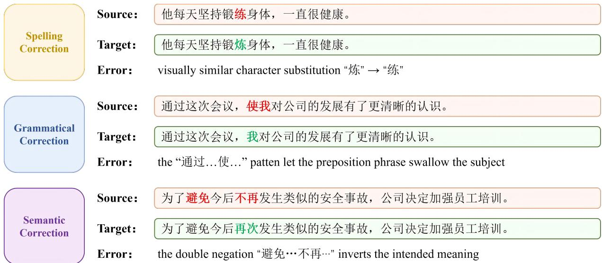  
Figure 4: Three categories of Chinese text error correction, illustrating a progression from surface-level character errors to deep semantic errors. Errors in the source sentences are highlighted in red, and the corresponding edits in the target sentences are shown in green.

<think>Your reasoning process</think>   
<answer>The corrected sentence or the original   
sentence</answer>   
# Input   
[Sentence to revise]: {source}  
Listing 3: Prompt template used at SFT training and inference time.

## C Dataset

We conduct our experiments on two datasets: CSED-C and NaSGEC-Exam. CSED-C is a highquality manually annotated dataset designed for deep semantic error correction in Chinese. It is primarily collected from sentence correction questions in middle and high school Chinese language examinations and contains a total of 10,682 sentence pairs. The dataset covers various complex semantic and grammatical error types, including incorrect word order, collocation errors, missing sentence components, mixed sentence structures, and logical inconsistencies. Compared with traditional grammatical error correction datasets, the errors in CSED-C are more subtle and the sentence expressions are more natural, thereby imposing higher demands on the model’s semantic understanding and reasoning capabilities. Consequently, it has become an important benchmark dataset for research on deep semantic error correction in Chinese.

NaSGEC-Exam is a Chinese language examination subset of the NaSGEC dataset, containing approximately 7,000 erroneous Chinese sentences and their corresponding corrections collected from real Chinese language examination sentence correction tasks. The dataset is constructed through independent annotation and expert review, providing multiple high-quality reference answers for each sample. It covers various typical semantic and grammatical errors, including improper collocations, missing sentence components, word order errors, mixed sentence structures, and logical inconsistencies. As it effectively reflects the realworld distribution of erroneous sentences in native Chinese contexts, it has been widely used in research on Chinese semantic error correction, multireference answer modeling, and cross-domain generalization.

## D Baselines

Seq2Seq Models. The Seq2Seq baselines adopted in our experiments include mT5-small, mT5-base, BART-large-Chinese, and SynGEC. mT5 (Xue et al., 2021) is a multilingual pretrained model extended from the T5 framework. It adopts a unified text-to-text paradigm and can be applied to various natural language processing tasks, including machine translation, text generation, and grammatical error correction. The primary differences between mT5-small and mT5-base lie in their parameter scale and representation capability. BART-large-Chinese (Shao et al., 2024a) is a pretrained generative model specifically developed for Chinese scenarios. It is trained with a denoising autoencoding objective and demonstrates strong performance in Chinese text generation and correction tasks. SynGEC (Zhang et al., 2022b) further incorporates syntactic structural information into the BART architecture. By integrating dependency syntax knowledge, it enhances the model’s capability to capture complex grammatical errors and achieves strong performance in Chinese grammatical error correction tasks.

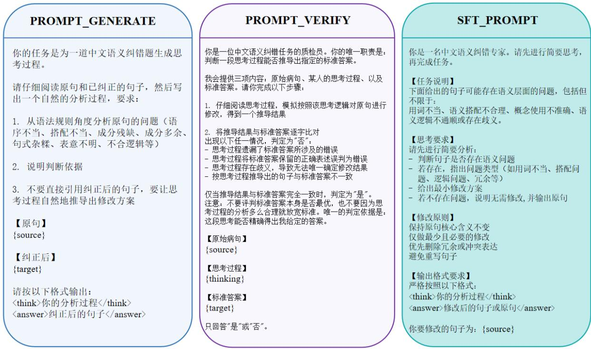  
Figure 5: Template for Data Processing

Seq2Edit Models. Among Seq2Edit approaches, we select GECToR (Omelianchuk et al., 2020) as the representative model. Unlike traditional Seq2Seq methods that directly generate target sentences, GECToR formulates the correction task as edit operation prediction, progressively revising the original sentence through operations such as insertion, deletion, and substitution. The model is typically pretrained on large-scale datasets and subsequently fine-tuned on manually annotated correction corpora, thereby improving its capability to detect and correct grammatical errors while maintaining inference efficiency.

Large Language Models. We adopt the LLMbased Chinese Semantic Error Correction framework proposed by Wu et al. (2026), referred to as CSEC-LLM. This method explores the capability of LLMs for Chinese Semantic Error Correction through instruction tuning, supplemented by a plug-and-play example selection strategy and a re-scoring mechanism. Specifically, the example selection strategy captures fine-grained semantic information from multiple dimensions to retrieve high-quality demonstrations, while the re-scoring mechanism selects the optimal correction from multiple candidates generated by LLMs. Experimental results on the CSED-C and NaSGEC-Exam datasets demonstrate that CSEC-LLM substantially improves correction performance, highlighting the effectiveness of LLMs for semantic-level Chinese text correction.

## E Training Details in RL

Figures 6 and 7 report the training curves of GLPO and GRPO under identical settings, tracking the mean group reward, the policy entropy, and the mean length of generated sequences.

For GLPO, the reward rises rapidly within the first ∼1k steps and then begins to oscillate. This is because GLPO does not update the policy toward the highest average reward, but toward the intragroup voting reward. In contrast, the policy entropy and the mean generation length both drop quickly and then stabilize, indicating that the model has converged to a more deterministic editing strategy under GLPO training.

For GRPO, the reward rises steadily and slowly throughout training, which matches our expectation and shows that the reward function correctly guides the policy along the intended optimization direction. Opposite to GLPO, the policy entropy keeps increasing, indicating that the model is still actively exploring new correction strategies, while the mean generation length continues to decrease.

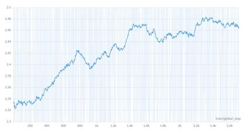  
(a) Reward

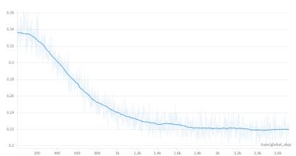  
(b) Policy Entropy

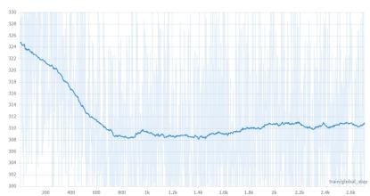  
(c) Generated Sequence Length

Figure 6: Training curves of GLPO during reinforcement learning: (a) reward, (b) policy entropy, and (c) generated sequence length.  
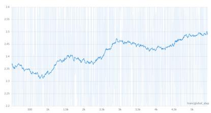  
(a) Reward

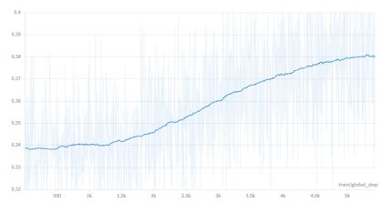  
(b) Policy Entropy

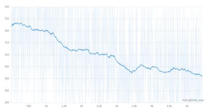  
(c) Generated Sequence Length  
Figure 7: Training curves of GRPO during reinforcement learning: (a) reward, (b) policy entropy, and (c) generated sequence length.

The opposite entropy trends are a direct consequence of the two algorithms’ objectives: GRPO’s relative-ranking advantage provides little gradient signal when candidates are of similar quality, which is common in CGEC, where multiple valid edits often coexist, so the policy keeps exploring and entropy rises. GLPO’s voting anchor, by contrast, amplifies gradients on the consensus trajectory and drives the policy to concentrate on it, while leaving enough residual stochasticity for inference-time voting to remain meaningful.

## F Case Study

To complement the quantitative results, we present two representative cases in Figure 8.

The first case contains a common confusion between two near-homophones: jiezhi-1 (to stop”, a verb) and jiezhi-2 (up to”, a temporal preposition). The supervised baseline CSEC-LLM leaves the sentence unchanged, suggesting that pure SFT is insufficient to capture such fine-grained distinctions. In contrast, both GRPO and our GLPO correctly substitute the verb form with the prepositional form, indicating that reinforcement learning with an editaware reward effectively pushes the model toward identifying and correcting such localized errors.

The second case is harder: the original sentence opens with the concessive marker although”

(suiran), but its overall structure follows a causal pattern (because. . . so. . . ”), making the concessive marker logically inconsistent, which should simply be deleted. This is a typical semantic error that is locally well-formed yet globally incoherent. CSEC-LLM attempts a surface-level rewrite that does not address the underlying logical conflict. GRPO recognizes that an edit is required, but applies it in the wrong place: it preserves the concessive marker and instead removes the causal connective, breaking the causal chain. Only GLPO performs the correct minimal edit by removing the redundant concessive marker, restoring logical consistency while leaving the rest of the sentence intact.

These two cases illustrate the progressive advantage of our framework: RL training enables the model to recover from simple but easily-missed errors, while GLPO’s group-level advantage allocation further encourages the model to choose the correct edit when multiple plausible revisions exist, identifying the minimum-edit repair among multiple valid candidates, which we have argued is the central challenge of Chinese semantic correction.

## G Exploration of Data Ratio

As mentioned in Figure 1, models trained with CoT data and models trained without CoT data exhibit complementary characteristics. The former performs poorly under greedy decoding at test time, but can obtain substantial gains through N vote sampling. The latter performs strongly under greedy decoding, yet benefits little from majority voting. This observation raises a natural question: can we obtain a unified model that inherits the strengths of both types by mixing CoT and non-CoT data in the SFT training set? Ideally, such a model would possess both ”think” and ”no-think” capabilities, so that it maintains strong performance under greedy decoding while also gaining further improvements through N vote.

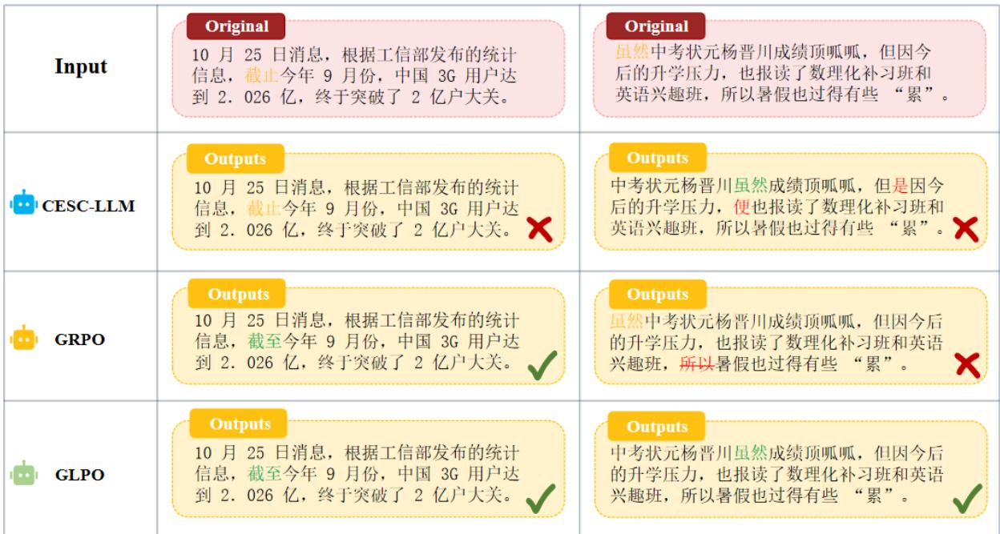  
Figure 8: Two examples of case study

<table><tr><td>Ratio</td><td>Mode</td><td>Decoding</td><td>P</td><td>R</td><td>F0.5</td></tr><tr><td>non-CoT</td><td>w/o thinking</td><td>Greedy +32 vote</td><td>48.03 48.07</td><td>37.37 38.19</td><td>45.44 45.71</td></tr><tr><td>CoT</td><td>w/ thinking</td><td>Greedy +32 vote</td><td>37.28 47.73</td><td>35.80 41.55</td><td>36.97 46.35</td></tr><tr><td rowspan="2">1:1 mix</td><td>w/o thinking</td><td>Greedy +32 vote</td><td>44.27 45.48</td><td>38.94 40.66</td><td>43.09 44.43</td></tr><tr><td>w/ thinking</td><td>Greedy +32 vote</td><td>36.11 48.81</td><td>33.03 41.33</td><td>35.45 47.10</td></tr></table>

Table 7: Performance comparison of models trained with different CoT to non-CoT data ratios.

To this end, we train models under different ratios of CoT to non-CoT data, with the instruction explicitly specifying whether a chain of thought should be produced. The experimental results are shown in Table 7.

We find that when the SFT training data consists of CoT and non-CoT samples mixed in a 1:1 ratio, the model faithfully follows the instruction regarding whether to output the reasoning process. More importantly, the behavior of this mixed model aligns well with our expectations. When instructed to produce a chain of thought, its performance under both greedy decoding and N vote surpasses that of the model trained solely on CoT data. This advantage becomes especially pronounced at N = 32, where it clearly outperforms both the CoT-only and non-CoT only baselines. When instructed to answer directly, the model still retains the strong greedy decoding performance characteristic of non-CoT training. These results indicate that mixing CoT and non-CoT data is not merely a compromise between the two training schemes, but rather yields a model that is stronger along both dimensions simultaneously.

## H Parameter Exploration

The number of rollouts N directly controls the size of the candidate group from which GLPO computes its group-normalized advantage and votebased bonus. A small N yields fewer comparisons within each group and may underestimate the group-level reward, while a large N increases computational cost roughly linearly. To find a reasonable balance, we vary N ∈ {4, 6, 8} and report results in Table 8.

We observe that the model’s performance is sensitive to N in a non-monotonic manner: with N = 4, our model already attains a competitive

<table><tr><td>N</td><td>P</td><td>R</td><td> $F _ { 0 . 5 }$ </td><td>Agree.</td></tr><tr><td>4</td><td>48.89</td><td>42.68</td><td>47.50</td><td>47.6%</td></tr><tr><td>6</td><td>47.88</td><td>40.51</td><td>46.20</td><td>49.9%</td></tr><tr><td>8</td><td>49.34</td><td>42.15</td><td>47.72</td><td>47.7 %</td></tr></table>

Table 8: Parameter study: effect of the number of rollouts N on CSED-C. “Agree.” reports the average agreement rate of 32-vote inference using the corresponding trained policy.

Algorithm 1: GLPO: Group-Level Policy   
Optimization   
Input :Policy πθ, prompt x, individual reward $R ( \cdot )$   
group size ${ \bf { \hat { \phi } } } _ { K } ,$ bonus scale α, std floor ϵ   
Output :Advantages $\{ A _ { 1 } , . . . , A _ { K } \}$ for policy   
update   
/\* Step 1: Sample K rollouts and compute   
per-sample rewards $\star /$   
$\left\{ y _ { 1 } , y _ { 2 } , \dotsc , y _ { K } \right\} \sim \pi _ { \theta } ( \cdot  { | } \ x ) ;$   
$\begin{array} { r } { \dot { r _ { i } } \gets R ( y _ { i } , x ) \mathbf { f o r } i = \dot { 1 } , \dot { . } . . , K ; } \end{array}$   
/\* Step 2: Compute group voting reward   
(constant across the group) $\star /$   
$y ^ { \star } \gets \mathrm { M a j o r i t y V o t e } ( \{ y _ { 1 } , \dots , y _ { K } \} ) ;$   
$\mathbf { \bar { \mathit { R } } } _ { G } \gets \mathit { R } ( y ^ { \star } , \bar { x } ) ;$   
/\* Step 3: Compute GRPO-style base   
advantage via in-group standardization   
\*/   
$\begin{array} { r } { \mu  \frac { 1 } { K } \sum _ { i = 1 } ^ { K } r _ { i } ; } \end{array}$   
$\begin{array} { r } { \sigma \gets \operatorname* { m a x } \Bigl ( \sqrt { \frac { 1 } { K - 1 } \sum _ { i = 1 } ^ { K } ( r _ { i } - \mu ) ^ { 2 } } , \epsilon \Bigr ) } \end{array}$   
$A _ { i } ^ { \mathrm { b a s e } } \gets ( r _ { i } - \mu ) / \sigma ~ \mathbf { f o r } ~ i = 1 , \ldots , K ;$   
$^ { \prime \star }$ Step 4: Add vote-margin bonus for   
samples that surpass the group leader $\star /$   
for $i = 1 , \ldots , K$ do   
bonusi ← α · max $( 0 , r _ { i } - R _ { G } ) ;$   
$A _ { i }  A _ { i } ^ { \mathrm { b a s e } } +$ bonusi;   
return $\{ A _ { 1 } , \dotsc , A _ { K } \}$

$F _ { 0 . 5 }$ of 47.5%, performance drops to 46.2% at $N \ = \ 6 ,$ and rises again to its peak of 47.72% at $N = 8 .$ . We attribute the dip at $N = 6$ to insufficient candidate diversity: six samples are not enough to consistently produce a clear majority for vote-based aggregation, yet are too few to give a stable group baseline. With $N = 8 ,$ , the candidate group is large enough to produce a confident vote reward and to sharpen the policy through $\mathrm { G L P O ^ { \circ } s }$ vote-margin bonus, leading to the strongest result among all tested configurations. In addition, we can observe from the table that a lower average agreement rate leads to better performance. By contrast, $N = 6$ yields a higher consistency ratio but achieves the worst results.

We therefore adopt $N = 8$ as the default rollout setting in all main experiments. Due to GPU memory constraints, we did not explore $N = 1 6$ or more and leave the study of larger rollout sizes and their potential interaction with the N-vote inference scale to future work.

## I GLPO Algorithm

Algorithm 1 summarizes the GLPO training procedure. GLPO extends GRPO by incorporating a group-level voting reward into the advantage computation. For each prompt, the policy samples K responses and computes their individual rewards. A group-level response is then obtained through frequency-based voting, and its reward is used as a reference signal.