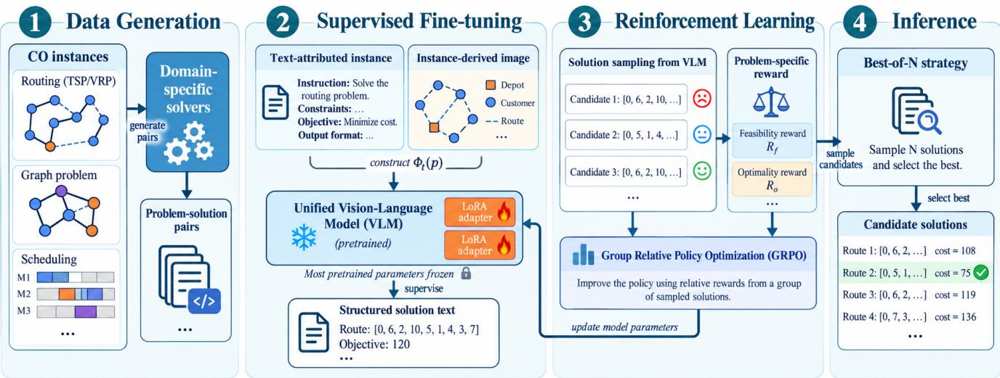
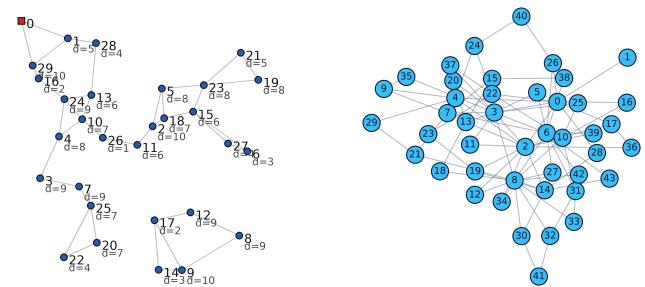

# VLM FINE-TUNING FOR END-TO-END COMBINATORIAL OPTIMIZATION

Qingsong Yan, Xia Jiang, Yaoxin Wu, Wen Song, Lu Zhang, Yingjie Zhou

College of Computer Science, Sichuan University Department of Industrial Engineering&Innovation Sciences, Eindhoven University of Technology Institute of Marine Science and Technology, Shandong University School of Cybersecurity, Chengdu University of Information Technology

## ABSTRACT

Large language models (LLMs) have provided a unified interface for end-to-end combinatorial optimization (CO), but tex tual serialization alone may obscure spatial and relational struc tures that are important for generating effective CO solutions. This paper presents a general-purpose vision-language solver that augments textual instance descriptions with input-derived visual representations. A single vision-language model (VLM) is applied across different CO tasks and trained using supervised fine-tuning followed by verifier-guided reinforcement learning. While the visual inputs contain no gold solutions or solution-derived information, our experiments show that the VLM generally improves solution quality over its text-only counterpart, with particularly clear gains on more complex CO problems such as CVRP and JSSP. The advantage of visual information is more pronounced at large problem scales.

Index Terms— Vision-Language Model, Combinatorial Optimization, End-to-End Solver

## 1. INTRODUCTION

Combinatorial optimization (CO) problems arise in routing, scheduling, allocation, and network design. Deep learningbased CO solvers have achieved strong results, but they commonly rely on problem-specific architectures and training procedures [1, 2]. Recent work has explored large language models (LLMs) for automatic heuristic design [3, 4] and optimiza tion formulation [5, 6]. However, these approaches still require domain expertise in designing algorithmic templates or using optimization solvers. In contrast, end-to-end LLM solvers formulate CO problems directly in natural language and generate solutions, providing a more accessible and unified solving paradigm while reducing the dependence on specialized domain knowledge [7, 8]. While end-to-end solvers provide a flexible language interface, purely textual serialization makes spatial and relational structures, such as graph connectivity and object relationships, difficult to perceive.

This limitation motivates us to investigate whether visual information can improve LLM-based CO solving. Specifically, we represent each CO instance with a textual description

and an input-derived image that exposes its problem-relevant structure. A single vision-language model (VLM) is trained across different CO problems through supervised fine-tuning (SFT) and verifier-guided reinforcement learning (RL). The visualization and verification procedures are tailored to the structure of each problem, while the underlying VLM and training framework remain shared. Our main contributions are summarized below: 1) We introduce a multimodal representation for heterogeneous CO problems, combining textual instance descriptions with associated images, without incorpo rating any solution-derived information. 2) As a first attempt, we train a shared VLM for CO problems using SFT and RL to translate joint vision-language inputs into textual solution descriptions. 3) Extensive experiments demonstrate that visual information improves end-to-end CO solving, yielding substantial gains over the text-only solver and stronger generalization as problem size increases.

## 2. PROBLEM STATEMENT

Let T denote a set of CO problems and $\mathcal { P } _ { t }$ the instance space of problem $t \in \tau$ . Each instance $p \in \mathcal P _ { t }$ is represented by $( X _ { p } , f _ { p } , C _ { p } ) . ~ X _ { p }$ is the solution space, $f _ { p } : X _ { p } \to \mathbb { R }$ is the objective function, and $C _ { p } = \{ c _ { p , 1 } , \ldots , c _ { p , m _ { p } } \}$ is the constraint set, with $c _ { p , i } : X _ { p } \to \{ 0 , 1 \}$ denoting whether $c _ { p , i }$ is satisfied. The feasible solution space for problem t is $\begin{array} { r } { \dot { X } _ { p } ^ { \mathrm { F } } = \{ x \in X _ { p } \mid c _ { p , i } ( x ) = 1 , \forall c _ { p , i } \in C _ { p } \} } \end{array}$ . The goal is to find a solution in $X _ { p } ^ { \mathrm { F } }$ that minimizes or maximizes $f _ { p } ,$ depending on the task. Unlike text-only CO solvers [7] using pure texts, we represent each instance using both textual and visual information. Let $s$ and I denote the text and image spaces. A problem-specific textual serialization $\phi _ { t } ^ { \mathrm { t e x t } } \in S$ preserves exact instance information (e.g., parameters and con straints), while an image $\phi _ { t } ^ { \mathrm { i m g } } \in \mathcal { I }$ provides complementary structural information. The multimodal input is defined as $\Phi _ { t } ( p ) = ( \phi _ { t } ^ { \mathrm { t e x t } } ( p ) , \phi _ { t } ^ { \mathrm { i m g } } ( p ) )$ . The text and image are generated solely from the input instance, without leakage of any solution-derived information.

A single VLM policy πθ is shared across all problems. Given $\Phi _ { t } ( p )$ , it generates a textual response $\hat { y } _ { p } ~ \sim ~ \pi _ { \theta } ( \cdot ~ |$ $\Phi _ { t } ( p ) )$ , which can be easily converted into a numerical solution by a parser ψt, i.e., $\hat { x } _ { p } = \psi _ { t } ( \hat { y } _ { p } )$ . A verifier independently evaluates the parsed solution using the original instance:

  
Fig. 1: Overview of the proposed vision-language CO solver.

$$
\begin{array} { r } { ( v _ { p } , \hat { f } _ { p } ) = \mathcal { V } _ { t } ( \hat { x } _ { p } , p ) , } \end{array}\tag{1}
$$

where $v _ { p } \in \{ 0 , 1 \}$ indicates feasibility and $\hat { f } _ { p } = f _ { p } ( \hat { x } _ { p } )$ is the objective value of the solution. Let $\mathcal { D } _ { s }$ denote the evaluation set and $f _ { p } ^ { \mathrm { r e f } }$ be the optimal or best-known reference objective. For a feasible solution, its relative gap is:

$$
g _ { p } = \left\{ \begin{array} { l l } { \hat { f } _ { p } - f _ { p } ^ { \mathrm { r e f } } / \vert f _ { p } ^ { \mathrm { r e f } } \vert , } & { \mathrm { f o r } \mathrm { m i n i m i z a t i o n } , } \\ { f _ { p } ^ { \mathrm { r e f } } - \hat { f } _ { p } / \vert f _ { p } ^ { \mathrm { r e f } } \vert , } & { \mathrm { f o r } \mathrm { m a x i m i z a t i o n } . } \end{array} \right.\tag{2}
$$

Following the literature, we report the feasibility rate and the average gap over feasible solutions:

$$
M _ { f } = \frac { 1 } { | \mathcal { D } _ { s } | } \sum _ { ( t , p ) \in \mathcal { D } _ { s } } \boldsymbol { v } _ { p } , \qquad M _ { o } = \frac { 1 } { | \mathcal { D } _ { s } ^ { \mathrm { F } } | } \sum _ { ( t , p ) \in \mathcal { D } _ { s } ^ { \mathrm { F } } } \boldsymbol { g } _ { p } ,\tag{3}
$$

where $\mathcal { D } _ { s } ^ { \mathrm { F } }$ contains the instances for which $v _ { p } = 1$

## 3. THE METHOD

Figure 1 illustrates our method. The same VLM processes heterogeneous CO problems, while problem-specific components are limited to input construction and solution verification.

## 3.1. Visual Representation

We design problem-adapted images to reveal structural relationships that are hard to capture from serialized text alone. For routing problems (e.g., TSP, CVRP, and OP), we adopt a unified node–link visualization paradigm. Taking TSP as an example, each node in the image denotes one customer. Its location is represented by two-dimensional coordinates, such that the spatial distance between two nodes is proportional to their distance. Node 0 is rendered as a red square to mark the designated starting customer, while all other cities are drawn as blue circles with labels indicating customer IDs. Each edge in the image connects a customer to its two nearest neighboring cities. CVRP and OP follow the same node-link construction, with additional node attributes. For an example in Fig. 2, customer labels contain IDs and demands in CVRP. For graph problems such as MIS and MVC, the node–link image directly visualizes the input graph. Each labeled blue circle denotes a node, and each gray line is an undirected edge to represent the graph adjacency. For scheduling problems, we represent them by a graph. Taking JSSP as the typical case, nodes represent operations with features encoding processing times, while edge features distinguish job precedence.

  
Fig. 2: Visual Representation of CVRP (left) and MIS (right).

For all problems, the textual input remains the authoritative source for exact numerical values in instances, which follows the natural-language instance paradigm widely adopted in existing literature. More details of problem definition and textual description can be found in [7].

## 3.2. Supervised Fine-tuning

Given a multimodal input $\Phi _ { t } ( p )$ and its target textual response $\boldsymbol { y } _ { p } ^ { * } = ( \boldsymbol { y } _ { p , 1 } ^ { * } , \ldots , \boldsymbol { y } _ { p , L _ { p } } ^ { * } )$ , the SFT objective is the standard autoregressive language-modeling loss:

$$
\mathcal { L } _ { \mathrm { S F T } } ( \theta ) = - \mathbb { E } _ { ( t , p ) } \sum _ { k = 1 } ^ { L _ { p } } \log \pi _ { \theta } \left( y _ { p , k } ^ { * } \mid \Phi _ { t } ( p ) , y _ { p , < k } ^ { * } \right) ,\tag{4}
$$

which is applied only to tokens in the target response, while the instruction, textual instance description, image tokens, and output format prompt are treated as conditioning information. Masking these information encourages the VLM to learn the generation of solutions rather than reproducing input prompt. To reduce computational cost, we apply Low-Rank Adaptation (LoRA) [9] while freezing the pretrained VLM parameters. The resulting SFT-trained model provides the initial policy for the subsequent RL.

## 3.3. Reinforcement Learning

Despite SFT teaching the VLM to imitate high-quality solutions, it does not guarantee constraint satisfaction. Therefore we further update the policy using constraint-verified RL. For a multimodal instance $\Phi _ { t } ( p )$ , the current policy samples a group of G candidate textual responses: $\hat { y } _ { p , 1 } , \dotsc , \hat { y } _ { p , G }$ ∼ $\pi _ { \theta _ { \mathrm { o l d } } } \left( \cdot \mid \Phi _ { t } ( p ) \right)$ , with each response parsed and independently evaluated on the instance. After that, the RL reward is designed by a feasibility component and an optimality component:

$$
R _ { p , i } = \lambda _ { f } R _ { f , t } ( \hat { y } _ { p , i } , p ) + \lambda _ { o } R _ { o , t } ( \hat { y } _ { p , i } , p ) ,\tag{5}
$$

where $R _ { f , t }$ measures constraint satisfaction, and $R _ { o , t }$ measures the quality in terms of the objective value. $R _ { o , t }$ is assigned only when the generated candidate solution satisfies the required constraints. Concretely, the feasibility verifier evaluates each problem-specific constraint against the original instance. $R _ { f , \cdot }$ t is computed as a weighted sum of the satisfied constraints. If the generated solution is feasible, the objective verifier computes its objective value from the parsed solution.

We use Group Relative Policy Optimization (GRPO) [10] to update the VLM. The advantage of the i-th response is computed relative to the other responses in the same group:

$$
A _ { p , i } = \frac { R _ { p , i } - \mu _ { p } } { \sigma _ { p } + \delta } ,\tag{6}
$$

where $\mu _ { p }$ and $\sigma _ { p }$ are the mean and standard deviation of the group rewards, and δ is a numerical stability constant. The policy is optimized using the clipped objective:

$$
\begin{array} { l } { { \displaystyle { \cal J } _ { \mathrm { G R P O } } ( \theta ) = { \mathbb E } \Big [ \frac { 1 } { G } \sum _ { i = 1 } ^ { G } \operatorname* { m i n } \Big \{ r _ { p , i } A _ { p , i } , \mathrm { c l i p } \left( r _ { p , i } , \right. } } \\ { { \displaystyle \left. 1 - \epsilon , 1 + \epsilon \right) A _ { p , i } \Big \} - \beta D _ { \mathrm { K L } } \left( \pi _ { \theta } \left| \right| \pi _ { \mathrm { r e f } } \right) \Big ] } , }  \end{array}\tag{7}
$$

where

$$
r _ { p , i } = \frac { \pi _ { \theta } ( \hat { y } _ { p , i } \mid \Phi _ { t } ( p ) ) } { \pi _ { \theta _ { \mathrm { o l d } } } ( \hat { y } _ { p , i } \mid \Phi _ { t } ( p ) ) }
$$

is the policy ratio, ϵ is the clipping parameter, and $\beta$ controls the divergence from the reference policy.

Through this feasibility-and-optimality-aware RL stage, the VLM is encouraged to preserve the structured generation ability learned during SFT while reducing constraint violations and improving the quality of feasible solutions.

## 4. EXPERIMENTS

Dataset and Hyperparameters. We fine-tune Qwen3-VL to serve as a shared end-to-end solver for 7 CO problems: TSP, OP, CVRP, MIS, MVC, PFSP, and JSSP, which are defined and generated in [7]. For SFT, we generate 500,000 instances for each problem, while an additional set containing at most 3,200 instances is used for RL. The model is trained for one epoch with the AdamW optimizer and BF16 precision. During inference, greedy decoding is used for single generation, while Best-of-N inference generates N = 8 candidate solutions using stochastic decoding and selects the best solution among them. Following [7], we use the same textual prompts and solvers to compute relative gaps.

Baselines. We compare with general-purpose and reasoning LLMs and prompt strategies for CO including OPRO [11], LMEA [12], PHP [13], and SGE [14]. We also compare the state-of-the-art text-only end-to-end LLM [7], reporting SFT, SFT+RL, and SFT+RL+Best-of-N results. Following the evaluation protocol for CO, we report feasibility rate and relative gap, as defined in Section 2. The gap is computed against the optimal or best-known reference objective and is averaged over feasible solutions.

## 4.1. Comparative Study

Table 1 shows that fine-tuned LLM in [7] and our fine-tuned VLM outperform all the other baselines even with greedy decoding. Visual information provides the clearest gains on the more structurally demanding CVRP and JSSP. Compared with the fine-tuned LLM under Best-of-N inference, the VLM achieves similar feasibility, and considerably reduce the gap by 0.95% and 2.35%, respectively. The VLM reduces the gap by 0.16%, 0.72% and 0.18% on TSP, OP and MVC while retaining full feasibility. Moreover, the VLM matches the LLM on PFSP and achieves higher feasibility (97% vs. 94%) for MIS. Therefore, our vision representation generally enhances LLM performance in CO solving, underscoring the value of visual information for developing effective end-to-end solvers.

## 4.2. Comparison across Problem Scales

We evaluate VLM across different scales, with 100 instances for each. Small, medium, and large instances are defined

Table 1: Evaluation of feasibility (Feas.↑), relative gap (Gap↓), and average time for different methods on the seven CO problems.
<table><tr><td rowspan="2">Method</td><td colspan="2">TSP</td><td colspan="2">OP</td><td colspan="2">CVRP</td><td colspan="2">MIS</td><td colspan="2">MVC</td><td colspan="2">PFSP</td><td colspan="2">JSSP</td><td rowspan="2">Time</td></tr><tr><td>Feas.</td><td>Gap</td><td>Feas.</td><td>Gap</td><td>Feas.</td><td>Gap</td><td>Feas.</td><td>Gap</td><td>Feas.</td><td>Gap</td><td>Feas.</td><td>Gap</td><td>Feas.</td><td>Gap</td></tr><tr><td colspan="10">General-purpose Language Models</td><td></td><td></td><td></td><td></td><td></td><td></td></tr><tr><td>GPT-40</td><td>39%</td><td> $3 3 . 7 9 \% _ { \pm 1 6 . 6 }$ </td><td>59%</td><td> $5 5 . 1 9 \% \AA _ { \pm 1 5 . 7 }$ </td><td>15%</td><td> $7 6 . 6 2 \% _ { \pm 7 . 9 }$ </td><td>8%  $1 1 . 7 0 \% \pm 1 1 . 8$ </td><td>6%</td><td> $1 6 . 6 7 \% _ { \pm 7 . 0 }$ </td><td></td><td>88%</td><td> $2 0 . 5 7 \% _ { \pm 9 . 2 }$ </td><td>7%</td><td> $9 7 . 8 5 \% _ { \pm 2 3 . 7 }$ </td><td>5.3s</td></tr><tr><td>Claude-Sonnet</td><td>66%</td><td> $2 4 . 5 3 \% \pm 1 0 . 7$ </td><td>49%</td><td> $3 4 . 6 2 \% _ { \pm 1 4 . 1 } ^ { - }$ </td><td>30%</td><td> $3 8 . 3 4 \% _ { \cdot \cdot \cdot } \mathrm { \Delta _ { \cdot } \mathrm { \Delta _ { \cdot } g } }$ </td><td>13%</td><td> $1 2 . 5 1 \% \pm 1 2 . 5$ </td><td>2%</td><td> $6 . 2 5 \% \mathrm { \stackrel { - } { \ t o } } . 3$ </td><td>100%</td><td> $1 8 . 4 2 \% \pm 8 . 9$ </td><td>10%</td><td> $9 0 . 0 0 \% \mathrm { \stackrel { \_ } { \pm } 2 1 . 6 }$ </td><td>5.4s</td></tr><tr><td>DeepSeek-V3</td><td>73%</td><td>35.75%±15.4</td><td>50%</td><td> $4 6 . 1 0 \% _ { \pm 1 3 . 4 } ^ { - }$ </td><td>21%</td><td> $5 8 . 2 2 \% _ { + 2 6 . 8 } ^ { ^ { \perp } }$   $9 7 . 3 1 \% + 6 9 . 3$ </td><td>5%</td><td>12.05%±12.9</td><td>15%</td><td> $3 7 . 1 5 \% _ { \pm 2 4 . 8 } ^ { - }$ </td><td>58%</td><td> $2 0 . 8 1 \% _ { \pm 9 . 4 }$ </td><td>52%</td><td> $1 0 3 . 1 9 \% _ { \pm 2 6 . 9 }$ </td><td>26.4s</td></tr><tr><td>Llama3.3-70B</td><td>50% 20%</td><td> $6 9 . 0 8 \% _ { \pm 3 1 . 4 }$   $3 6 . 8 9 \% _ { \pm 3 4 . 6 }$ </td><td>27% 32%</td><td> $4 8 . 9 8 \% \mathrm { { \bar { \ t } } \mathrm { { 1 4 . 6 } } }$   $4 9 . 3 6 \% _ { \pm 1 6 . 6 } ^ { - }$ </td><td>31% 61%</td><td> $1 8 0 . 9 1 \mathcal { T } _ { 0 \pm 1 0 5 }$ </td><td>8% 14%</td><td> $3 7 . 1 2 \% _ { \pm 2 9 . 5 } ^ { -- }$   $2 9 . 5 6 \% _ { \pm 1 6 . 2 } ^ { - }$ </td><td>20% 5%</td><td> $2 2 . 8 6 \% _ { \pm 1 3 . 6 } ^ { - }$ </td><td>98% 98%</td><td> $2 1 . 9 7 \% _ { \pm 8 . 4 }$ </td><td>29% 53%</td><td> $1 0 5 . 0 1 \% _ { \pm 2 4 . 5 } ^ { - }$ </td><td>2.1s 12.5s</td></tr><tr><td colspan="10">Qwen2.5-72B</td><td> $6 3 . 2 0 \% _ { \pm 3 0 . 4 }$ </td><td></td><td> $2 1 . 1 3 \% _ { \pm 8 . 2 }$ </td><td></td><td></td><td> $1 0 3 . 9 0 \% _ { \pm 6 1 . 7 } ^ { - }$ </td></tr><tr><td>Reasoning Models</td><td></td><td></td><td></td><td></td><td></td><td></td><td></td><td></td><td></td><td></td><td></td><td></td><td></td><td></td><td></td></tr><tr><td>GPT-03-mini</td><td>91%</td><td> $3 0 6 \% _ { \pm 2 5 8 }$ </td><td>8% 31%</td><td> $\overline { { 4 3 . 9 3 \% _ { \pm 1 1 . 5 } } }$   $4 0 . 9 0 \% _ { \pm 1 6 . 3 }$ </td><td>50% 24%</td><td> $1 3 9 \% _ { \pm 3 9 . 7 }$   $1 5 4 \% _ { \pm 1 1 7 }$ </td><td>66% 82%</td><td> $9 . 2 3 \% _ { \pm 8 . 4 }$   $8 . 0 3 \% _ { \pm 1 2 . 9 } ^ { - \infty . }$ </td><td>33% 47%</td><td> $2 . 9 8 \% _ { \pm 5 . 5 }$ </td><td>98%</td><td> $1 6 . 9 7 \% _ { \pm 9 . 8 }$   $1 4 . 8 6 \% _ { \pm 1 0 . 5 }$ </td><td>20% 29%</td><td> $7 7 . 8 6 \% _ { \pm 3 7 . 8 }$   $8 1 . 9 0 \% _ { \pm 2 9 . 6 } ^ { - \ Z }$ </td><td>1.4m 3.2m</td></tr><tr><td colspan="10">GPT-o1 54%  $2 7 6 \% \overline { { \pm 2 4 2 } }$ </td><td colspan="7"> $3 . 5 8 \% _ { \pm 5 . 9 } ^ { - \ Z }$  89%</td></tr><tr><td>DeepSeek-R1</td><td>48%</td><td> $7 0 . 9 9 \% _ { \pm 2 3 . 1 }$ </td><td>60%</td><td> $4 0 . 5 4 \% _ { \pm 1 3 . 7 } ^ { - }$ </td><td>26%</td><td> $3 0 . 4 6 \% _ { \pm 1 8 . 1 }$ </td><td>41%</td><td> $1 . 6 0 \% _ { \pm 3 . 6 }$ </td><td>38%</td><td> $4 . 1 7 \% _ { \pm 6 . 3 } ^ { - }$ </td><td>100%</td><td> $1 6 . 6 5 \% _ { \pm 8 . 1 }$ </td><td>5%</td><td> $2 6 . 2 9 \% _ { \pm 8 . 5 }$ </td><td>6.5m</td></tr><tr><td>Prompt Strategies</td><td></td><td></td><td>85%</td><td></td><td>21%</td><td></td><td></td><td></td><td></td><td></td><td></td><td></td><td>65%</td><td></td><td></td></tr><tr><td colspan="10">OPRO 83%</td><td colspan="3"> $4 1 . 6 7 \% _ { \pm 1 6 . 9 }$  99%</td><td colspan="3"> $1 8 . 4 0 \% _ { \pm 8 . 4 }$ </td></tr><tr><td>LMEA</td><td>77%  $2 6 5 \% _ { \pm 1 3 1 }$ </td><td> $3 5 . 9 8 \% _ { \pm 3 . 6 }$ </td><td> $5 3 . 9 6 \% _ { \pm 1 4 . 3 }$  48%  $6 6 . 1 8 \% _ { \pm 1 0 . 5 } ^ { -- }$ </td><td></td><td> $3 7 . 0 3 \% _ { \pm 1 8 . 3 }$  24%</td><td> $6 1 . 2 4 \% _ { \pm 1 9 . 0 } ^ { - }$ </td><td>7%  $5 . 9 5 \% _ { \pm 7 . 3 }$  5%  $2 5 . 0 \% _ { \pm 1 4 . 2 } ^ { - \cdot }$ </td><td></td><td>13%</td><td> $\smash { 3 4 . 2 2 \% _ { \pm 1 6 . 3 } ^ { - 3 4 . 2 2 } }$ </td><td>98%</td><td> $1 4 . 3 1 \% _ { \pm 7 . 1 } ^ { - }$ </td><td>44%</td><td></td><td> $8 3 . 3 5 \% _ { \pm 2 5 . 5 }$  2.1m  $8 3 . 1 9 \% _ { \pm 2 3 . 9 }$  5.3m</td></tr><tr><td>PHP</td><td>84%  $3 3 . 8 4 \% _ { \pm 1 4 . 6 }$ </td><td></td><td>43% 93%  $2 4 . 4 9 \% _ { \pm 3 8 . 4 } ^ { - }$ </td><td> $3 6 . 0 8 \% _ { \pm 1 5 . 1 }$ </td><td>33% 84%</td><td> $5 8 . 1 1 \% _ { \pm 2 6 . 4 } ^ { - }$   $3 6 . 1 4 \% _ { \pm 5 9 . 2 } ^ { -- }$ </td><td>5%  $1 1 . 6 7 \% _ { \pm 9 . 1 }$  92%</td><td> $3 . 6 2 \% _ { \pm 7 . 6 }$ </td><td>13% 94%</td><td>19.84%±10.01</td><td>92%</td><td> $1 7 . 2 3 \% _ { \pm 8 . 1 } ^ { - }$ </td><td>56% 87%</td><td> $1 0 4 . 0 4 \% _ { \pm 2 9 . 2 }$ </td><td>1.6m  $3 8 . 5 8 \% _ { \pm 4 9 . 2 }$  3.6m</td></tr><tr><td colspan="10">SGE 98%  $2 9 . 6 6 \% _ { \pm 4 3 . 3 }$ </td><td colspan="3"> $3 . 8 3 \% _ { \pm 7 . 4 } ^ { - }$  95%</td><td colspan="3"> $4 . 4 8 \% _ { \pm 7 . 4 }$ </td></tr><tr><td>Text-only End-to-End Solver</td><td></td><td></td><td>54%</td><td></td><td></td><td></td><td></td><td></td><td></td><td></td><td></td><td></td><td></td><td></td><td></td></tr><tr><td colspan="10">SFT 89%  $2 . 3 0 \% _ { \pm 1 . 9 }$ </td><td colspan="7"> $\overline { { 2 . 4 1 \% _ { \pm 3 . 3 } } }$  100%</td></tr><tr><td>SFT+RL</td><td>91%</td><td>2.32%±2.2</td><td>92%  $4 . 2 5 \% _ { \pm 2 . 9 } ^ { -- }$  100%  $1 . 8 5 \% _ { \pm 1 . 7 }$ </td><td></td><td>59%  $6 . 0 2 \% _ { - 3 . 9 }$  80% 100%</td><td> $8 . 2 7 \% _ { \pm 5 . 6 }$   $4 . 5 3 \% _ { \pm 3 . 5 }$ </td><td>80%  $1 . 7 1 \% \pm 3 . 9$  83% 94%</td><td> $1 . 3 4 \% \pm 3 . 3$   $1 . 0 4 \% _ { \pm 3 . 4 } ^ { - }$ </td><td>98% 100%</td><td> $2 . 3 9 \% \overline { { \pm } } 3 . 2$   $1 . 2 9 \% _ { \pm 2 . 2 } ^ { - }$ </td><td>100%</td><td> $2 . 1 2 \% _ { \pm 1 . 8 } ^ { - }$ </td><td>100% 100%</td><td>100%  $1 0 . 9 4 \% _ { \pm 7 . 3 }$   $8 . 2 0 \% _ { \pm 6 . 3 }$ </td><td> $1 1 . 0 1 \% _ { \pm 7 . 9 }$  5.6s 5.6s 9.8s</td></tr><tr><td colspan="10">SFT+RL+BoN 100%  $1 . 0 7 \% _ { \pm 0 . 9 } ^ { - }$  Vision-Language Solver (Ours)</td><td colspan="7">100%  $1 . 0 3 \% _ { \pm 1 . 1 } ^ { - }$ </td></tr><tr><td></td><td></td><td></td><td></td><td></td><td></td><td></td><td></td><td></td><td></td><td></td><td></td><td></td><td></td><td></td><td></td></tr><tr><td>SFT  $\mathbf { S F T + R L }$ </td><td>78%  $2 . 1 5 \% _ { \pm 1 . 3 }$ </td><td>63% 97%</td><td>1.67%±1.2  $2 . 1 2 \% _ { \pm 1 . 8 } ^ { - }$ </td><td>48% 77%</td><td></td><td> $4 . 4 3 \% _ { \pm 4 . 8 }$  86% 95%</td><td>1.50%±3.7</td><td>94%%%</td><td> $2 . 1 3 \% _ { \pm 3 . 4 }$   $1 . 8 0 \% _ { \pm 2 . 5 } ^ { - \ Z }$ </td><td></td><td>100%</td><td>2.13%±1.8</td><td>97%</td><td> $8 . 3 1 \% _ { \pm 6 . 1 8 }$ </td><td>7.3s</td></tr><tr><td> $\mathbf { S F T + R L + B o N }$ </td><td>98%  $2 . 4 0 \% _ { \pm 2 . 6 } ^ { - }$  100%</td><td> $\mathbf { 0 . 9 1 \% } _ { \pm 1 . 1 } ^ { - }$ </td><td>100%  $1 . 1 3 \% _ { \pm 0 . 9 }$ </td><td>98%</td><td></td><td> $4 . 7 4 \% \bar { \phantom { - } } 5 . 1$   $3 . 5 8 \% _ { \pm 3 . 0 }$ </td><td> $1 . 6 7 \% _ { \pm 3 . 5 }$  97%</td><td> $1 . 1 4 \% _ { \pm 3 . 1 } ^ { - }$  100%</td><td></td><td> $1 . 1 1 \% _ { \pm 2 . 3 } ^ { - }$ </td><td>100% 100%</td><td> $2 . 4 9 \% _ { \pm 2 . 4 } ^ { - \pm }$   $1 . 0 3 \% _ { \pm 1 . 7 } ^ { -  }$ </td><td>97% 100%</td><td> $8 . 0 8 \% _ { \pm 6 . 4 }$   ${ \pm . 8 5 \% } _ { \pm 5 . 1 1 }$ </td><td>7.3s 33.8s</td></tr></table>

Table 2: Performance comparison across CO problems with different instance scales.
<table><tr><td rowspan="2"></td><td rowspan="2">Method</td><td colspan="4">Small instances</td><td rowspan="2">Gap</td><td colspan="2">Medium instances Gap@5</td><td rowspan="2">Gap@10</td><td rowspan="2">Gap</td><td rowspan="2">Large instances Gap@1</td><td rowspan="2">Gap@5</td><td rowspan="2">Gap@10</td></tr><tr><td>Gap</td><td>Gap@1</td><td>Gap@5</td><td>Gap@10|</td><td>Gap@1</td><td></td></tr><tr><td rowspan="4">RT</td><td>OR-Tools ACO</td><td>0.82% 1.98%</td><td>76% 48%</td><td>96% 88%</td><td>99% 100%</td><td>2.59% 17.98%</td><td>28% 0%</td><td>86% 1%</td><td>99% 6%</td><td>3.59% 36.69%</td><td>12% 0%</td><td>80%</td><td>99% 0%</td></tr><tr><td>LLM</td><td>0.14%</td><td>96%</td><td>100%</td><td>100%</td><td>0.70%</td><td>74%</td><td>100%</td><td>100%</td><td>1.34%</td><td>44%</td><td>0% 100%</td><td>100%</td></tr><tr><td>Ours</td><td>0.20%</td><td>95%</td><td>100%</td><td>100%</td><td>0.65%</td><td>81%</td><td>100%</td><td>100%</td><td>1.21%</td><td>55%</td><td>100%</td><td>100%</td></tr><tr><td>Tsili ACO</td><td>3.85% 3.49%</td><td>21% 30%</td><td>68% 76%</td><td>96% 94%</td><td>9.54%</td><td>0% 1%</td><td>2% 35%</td><td>55% 89%</td><td>13.80%</td><td>0%</td><td>0%</td><td>8% 74%</td></tr><tr><td>of</td><td>LLM Ours OR-Tools</td><td>1.47% 0.59%</td><td>54% 69% 45%</td><td>95% 92% 69%</td><td>99% 92% 93%</td><td>6.24% 2.04% 1.08% 7.87%</td><td>26% 54% 3%</td><td>96% 96% 24%</td><td>100% 97% 72%</td><td>7.95% 2.10% 1.67% 8.84%</td><td>27% 34% 0%</td><td>15% 96% 93% 15%</td><td>99% 96% 71%</td></tr><tr><td>CVRP</td><td>PS LLM Ours Degree Greedy</td><td>10 1.81% 5.89% 2.56%</td><td>24% 52% 59% 57% 84%</td><td>72% 90% 86% 57% 84%</td><td>93% 97% 95% 67% 86%</td><td>5.67% 4.57% 3.44% 7.52% 2.79%</td><td>8% 15% 32% 67%</td><td>50% 59% 80% 42% 71%</td><td>89% 98% 98% 64%</td><td>6.12% 7.24% 5.53% 9.61%</td><td>0% 1% 0% 20%</td><td>41% 19% 45% 33%</td><td>89% 84% 89% 59%</td></tr><tr><td>SIW</td><td>LLM Ours Greedy Degree</td><td>0.38% 0.20% 3.0% 0.48%</td><td>97% 99% 71% 63% 93% 92%</td><td>98% 100% 72% 63% 93%</td><td>98% 100% 89% 86%</td><td>1.05% 1.08% 2.62% 2.78%</td><td>86% 90% 44% 44%</td><td>87% 93% 79% 78%</td><td>90% 94% 100% 99% 98%</td><td>3.29% 1.58% 2.21%</td><td>53% 47% 68% 33% 26%</td><td>60% 57% 74% 89% 83%</td><td>83% 65% 95% 100% 99%</td></tr><tr><td>MΛV PFFSP</td><td>LLM Ours Palmer&#x27;s NEH</td><td>0.79% 30.52% 1.33% 0.25%</td><td>0% 53% 85%</td><td>93% 0% 97% 100%</td><td>100% 98% 1% 99% 100%</td><td>1.25% 1.07% 30.41% 2.78% 1.16%</td><td>66% 66% 0% 11% 40%</td><td>94% 98% 0% 90% 100%</td><td>100% 100% 0% 100%</td><td>2633 1.88% 30.68% 3.56%</td><td>38% 43% 0% 0%</td><td>87% 90% 0% 88%</td><td>100% 95% 0% 100%</td></tr><tr><td>JSSP</td><td>LLM Ours SPT ATC LLM</td><td>0.45% 19.58% 20.71% 2.86% 2.31%</td><td>78% 20% 32% 38%</td><td>100% 4% 12% 79% 87%</td><td>100% 17% 15% 98% 100%</td><td>1.28% 25.32% 24.30% 9.56% 6.03%</td><td>42% 0% 0% 0% 3%</td><td>100% 0% 0% 8%</td><td>100% 100% 1% 1% 60%</td><td>2.62% 2.58% 27.35% 27.99%</td><td>8% 0% 0% 0%</td><td>99% 97% 0% 0% 0%</td><td>100% 100% 0% 0% 4%</td></tr></table>

CO problems at larger scales. Its advantage becomes more pronounced and consistent as the instance size increases.

as: for scheduling problems, $5 { \times } 5 { - } 1 0 { \times } 1 0 , 1 0 { \times } 1 0 { - } 1 5 { \times } 1 5 ,$ and 15×15–20×20; for other problems, 10–30, 40–60, and 70–100 nodes, respectively. We compare the VLM with the fine-tuned text-only LLM [7] and with domain-specific baselines, which provide practical anchors for the larger instances. For rout ing, the baselines are OR-Tools [15] (TSP/CVRP), ACO [16] (TSP/OP), Tsiligirides [17] (OP), and parallel savings (PS) (CVRP). For graph optimization, we use the Greedy and Degree heuristics for both MIS and MVC. For scheduling, the references are Palmer’s rule [18] and NEH [19] for PFSP, and SPT and ATC for JSSP. We also introduce Gap@K, the percentage of instances solved with an optimality gap below K%. As shown in Table 2, our VLM performs favorably against the competing baselines, highlighting its potential for solving

## 5. CONCLUSION AND FUTURE WORK

We presented a VLM-based solver for CO problems. By pairing textual descriptions with visual representations, we train VLM by SFT followed by verifier-guided RL. The VLM improves solution quality over the text-only LLM, with significant gain on complex CVRP and JSSP. Results across different problem scales show that the advantage of visual information becomes more pronounced as the problem size increases. Future work will explore VLM in general optimization problems and improve its transferability in more complex CO instances.

## 6. REFERENCES

[1] Federico Berto, Chuanbo Hua, Junyoung Park, Laurin Luttmann, Yining Ma, Fanchen Bu, Jiarui Wang, Haoran Ye, Minsu Kim, Sanghyeok Choi, Nayeli Gast Zepeda, André Hottung, Jianan Zhou, Jieyi Bi, Yu Hu, Fei Liu, Hyeonah Kim, Jiwoo Son, Haeyeon Kim, Davide Angioni, Wouter Kool, Zhiguang Cao, Qingfu Zhang, Joungho Kim, Jie Zhang, Kijung Shin, Cathy Wu, Sungsoo Ahn, Guojie Song, Changhyun Kwon, Kevin Tierney, Lin Xie, and Jinkyoo Park, “Rl4co: An extensive reinforcement learning for combinatorial optimization benchmark,” in Proceedings ofthe 31st ACM SIGKDD Conference on Knowledge Discovery and Data Mining, 2025, pp. 5278–5289.

[2] Robbert Reijnen, Igor G Smit, Hongxiang Zhang, Yaoxin Wu, Zaharah Bukhsh, and Yingqian Zhang, “Job shop scheduling benchmark: Environments and instances for learning and non-learning methods,” Annals ofMathematics and Artificial Intelligence, pp. 1–31, 2026.

[3] Fei Liu, Xialiang Tong, Mingxuan Yuan, Xi Lin, Fu Luo, Zhenkun Wang, Zhichao Lu, and Qingfu Zhang, “Evolution of heuristics: towards efficient automatic algorithm design using large language model,” in Proceedings of the 41st International Conference on Machine Learning, 2024.

[4] Haoran Ye, Jiarui Wang, Zhiguang Cao, Federico Berto, Chuanbo Hua, Haeyeon Kim, Jinkyoo Park, and Guojie Song, “Reevo: Large language models as hyperheuristics with reflective evolution,” in The Thirty-eighth Annual Conference on Neural Information Processing Systems, 2024.

[5] Caigao Jiang, Xiang Shu, Hong Qian, Xingyu Lu, Jun Zhou, Aimin Zhou, and Yang Yu, “LLMOPT: Learning to define and solve general optimization problems from scratch,” in The Thirteenth International Conference on Learning Representations, 2025.

[6] Xia Jiang, Yaoxin Wu, Chenhao Zhang, and Yingqian Zhang, “DRoC: Elevating large language models for complex vehicle routing via decomposed retrieval of constraints,” in The Thirteenth International Conference on Learning Representations, 2025.

[7] Xia Jiang, Yaoxin Wu, Minshuo Li, Zhiguang Cao, and Yingqian Zhang, “Large language models as end-to-end combinatorial optimization solvers,” Advances in Neural Information Processing Systems, vol. 38, pp. 164787– 164826, 2026.

[8] Yang Liu, Chuan Zhou, Yancheng Chen, Shuai Zhang, Xixun Lin, and Xiaoqing Wang, “Hard constraints

meet soft generation: Guaranteed feasibility for llmbased combinatorial optimization,” arXiv preprint arXiv:2602.01090, 2026.

[9] Edward J Hu, yelong shen, Phillip Wallis, Zeyuan Allen Zhu, Yuanzhi Li, Shean Wang, Lu Wang, and Weizhu Chen, “LoRA: Low-rank adaptation of large language models,” in International Conference on Learning Representations, 2022.

[10] Daya Guo, Dejian Yang, Haowei Zhang, Junxiao Song, Ruoyu Zhang, Runxin Xu, Qihao Zhu, Shirong Ma, Peiyi Wang, Xiao Bi, et al., “Deepseek-r1: Incentivizing reasoning capability in llms via reinforcement learning,” arXiv preprint arXiv:2501.12948, 2025.

[11] Chengrun Yang, Xuezhi Wang, Yifeng Lu, Hanxiao Liu, Quoc V Le, Denny Zhou, and Xinyun Chen, “Large language models as optimizers,” in The Twelfth International Conference on Learning Representations, 2024.

[12] Shengcai Liu, Caishun Chen, Xinghua Qu, Ke Tang, and Yew-Soon Ong, “Large language models as evolutionary optimizers,” in 2024 IEEE Congress on Evolutionary Computation, 2024, pp. 1–8.

[13] Chuanyang Zheng, Zhengying Liu, Enze Xie, Zhenguo Li, and Yu Li, “Progressive-hint prompting improves reasoning in large language models,” in ICML 2024 Workshops: AI4MATH, 2024.

[14] Zangir Iklassov, Yali Du, Farkhad Akimov, and Martin Takác, “Self-guiding exploration for combinatorialˇ problems,” in The Thirty-eighth Annual Conference on Neural Information Processing Systems, 2024.

[15] Vincent Furnon and Laurent Perron, “Or-tools routing library,” 2024.

[16] Marco Dorigo, Mauro Birattari, and Thomas Stutzle, “Ant colony optimization,” IEEE Computational Intelligence Magazine, vol. 1, no. 4, pp. 28–39, 2006.

[17] Theodore Tsiligirides, “Heuristic methods applied to orienteering,” Journal of the Operational Research Society, vol. 35, no. 9, pp. 797–809, 1984.

[18] Douglas S Palmer, “Sequencing jobs through a multistage process in the minimum total time—a quick method of obtaining a near optimum,” Journal ofthe Operational Research Society, vol. 16, no. 1, pp. 101–107, 1965.

[19] Pawel Jan Kalczynski and Jerzy Kamburowski, “On the NEH heuristic for minimizing the makespan in permutation flow shops,” Omega, vol. 35, no. 1, pp. 53–60, 2007.