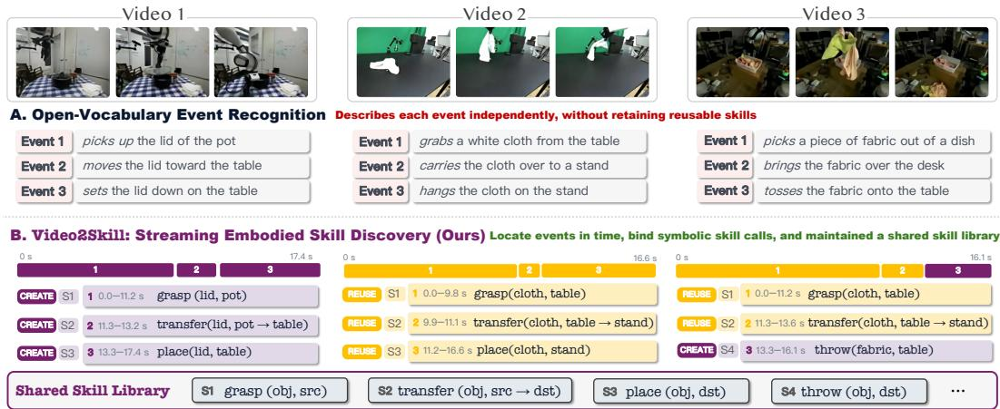
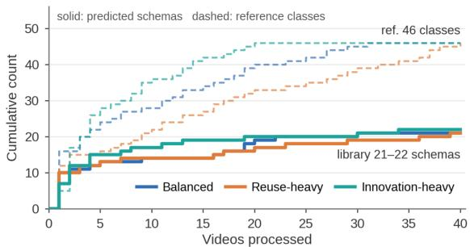

# Video2Skill: FROM STREAMING EXPERIENCE TO REUSABLE EMBODIED SKILLS

Jianshu Zhang1∗ Ce Zhang2∗ Xiyuan Yang3 Chenwei Xu1 Haoran Lu1 Yijiang Li4 Yaqi Xie2 Katia P. Sycara2 Han Liu1

1Northwestern 2CMU 3UIUC 4UCSD ∗Equal contribution

Project Page: https://andyzworks.github.io/video2skill

## ABSTRACT

Manipulation behaviors vary widely across objects and scenes, but they share a small set of reusable skills, and planning with these skills helps embodied agents generalize to new tasks. Yet an agent can only plan with skills it knows. Recovering skills from observed experience, the inverse of planning, builds this knowledge over time and yields skill data for training future agents. Vision-Language Models (VLMs) describe individual manipulation events well, but can they organize a stream of events into reusable skills? We formulate this problem as Streaming Embodied Skill Discovery (SESD): a model watches videos in sequence and maintains a persistent skill library that shapes its later decisions. To systematically measure this ability, we introduce Video2Skill, a benchmark that covers robot tabletop manipulation and human kitchen activity and tests three core capabilities: (i) locating manipulation events in time, (ii) grouping events of the same transformation, and (iii) deciding when to reuse an existing skill or create a new one. Across 19 open-source VLMs, many models group events at nearchance level, and scale does not consistently help. Their errors depend on how perception and library updates are coupled: joint models merge distinct transformations into one skill, while models that update the library from text descriptions duplicate recurring ones. Supervised fine-tuning, including our counterfactual library-state rebalancing (CLARE), improves grouping but exposes a deeper bottleneck: trained models consolidate familiar skills yet rarely expand the library. Their libraries stall below half the reference size, and transformations unseen in training are located in time but almost never given a new skill. Recognizing when existing skills are insufficient thus emerges as the central challenge.

  
Figure 1: Video2Skill: From describing events to accumulating reusable skills. (A) Vision-Language Models recognize manipulation events in open-vocabulary language. (B) Video2Skill further organizes these observations into a persistent library of symbolic skills, grounding each event in time and deciding whether to reuse an existing skill or introduce a new one. Video 1 introduces grasp, transfer, and place; Video 2 reuses all three despite changes in objects and scene; Video 3 reuses grasp and transfer while adding throw for a new transformation. The library thus preserves shared structure across observations while expanding to accommodate novelty.

## 1 INTRODUCTION

Embodied agents that carry out long-horizon robotic tasks must plan. The behaviors they encounter are enormously diverse, varying in objects, scenes, and embodiments, yet they are underpinned by a much smaller set of shared skills: wiping a table, a plate, or a window all instantiate the same wiping skill. Planning over such skills therefore generalizes, as new tasks can be solved by recomposing familiar skills rather than learning each behavior from scratch (Ichter et al., 2023; Liang et al., 2023). Planning with skills, however, presupposes knowing which skills exist and how they are instantiated. A natural precursor is the inverse problem: observing continuous experience and recovering the skills that produced it (Baker et al., 2009). Much as people acquire skills by watching others and reuse them in new settings, an agent that solves this inverse problem can accumulate a skill library as experience unfolds, and the resulting skill-annotated experience can supervise future embodied agents (Kim et al., 2025; Xie et al., 2026). These skills are most useful when represented symbolically and with structure: a schema such as grasp(object, source) can be recognized across instances, composed by planners, and inspected by humans (Yang et al., 2025; Yu et al., 2026).

Vision-Language Models (VLMs) can already describe diverse manipulation events in openvocabulary language (Bai et al., 2025; Chen et al., 2024; Zhang et al., 2025c; Pi et al., 2024). For agents operating over continuous visual streams (Qian et al., 2025; Wang et al., 2026a;c; Zhang et al., 2026a;d), a further challenge is to organize these events into a persistent skill library. Doing so requires locating events in time and deciding whether each instantiates a known skill or introduces a new one. Figure 1 illustrates this distinction: picking up a lid and grasping a cloth should reuse the same grasp schema with different arguments, whereas throwing fabric onto a table and placing it there involve distinct motion and release processes despite sharing a destination. These decisions become more challenging in a streaming setting, where the model relies on a library built from its own earlier predictions. Creating duplicate schemas fragments recurring experience, while reusing an overly broad schema merges distinct transformations. Because subsequent decisions depend on this evolving library, such errors can shape how later events are interpreted.

Existing approaches to skill reuse often rely on predefined repertoires or on signals beyond passive video observations. Some systems compose an existing set of robot skills (Ichter et al., 2023; Liang et al., 2023), while others grow their repertoires through code execution and environment feedback (Wang et al., 2024; Ning et al., 2026), task-success signals (Zhang et al., 2023), or robot trajectories (Wan et al., 2024). These settings differ from constructing a symbolic skill library online from a stream of visual observations. This leaves a fundamental question: can a model build and maintain such a library from streaming video, using the abstractions established by its own earlier decisions to recognize familiar transformations and determine when a new schema is needed?

We formulate this problem as Streaming Embodied Skill Discovery (SESD). A model incrementally processes video, predicts the temporal extent of each manipulation event, and expresses it as a symbolic skill call: a reusable transformation schema bound to concrete arguments such as the object, source, and destination. The library persists across videos and conditions subsequent predictions, allowing schemas discovered in one scene to be reused in another. Skills here are semantic abstractions of observed transformations, rather than executable controllers. We introduce Video2Skill, a benchmark built from robot manipulation videos in ROBOINTER and egocentric kitchen recordings in HD-EPIC, to evaluate this capability across robotic and human activity. The benchmark evaluates how well models recover manipulation events, group instances of the same transformation regardless of schema names, and distinguish when to create or reuse a skill.

We evaluate 19 open-source VLMs using two processing paradigms: unified processing jointly recognizes events and updates the library, whereas factorized processing first generates textual event descriptions without library access and then uses the same model to update the library from those descriptions. Without task-specific training, many state-of-the-art models exhibit near-chance agreement with the reference grouping of events, revealing a substantial gap between event description and consistent skill abstraction. The two paradigms exhibit contrasting failure tendencies: unified models tend to merge distinct transformations into overly broad skills, while factorized models frequently create duplicate schemas for recurring transformations.

To investigate whether supervision can mitigate these failures, we fine-tune Qwen3.5-4B and LLaVA-OneVision-2-8B under both paradigms using three strategies: oracle-history supervised fine-tuning (SFT), Counterfactual Library-state Rebalancing (CLARE), and on-policy correction using student-generated histories. Supervision improves skill grouping across both backbones, but models still struggle to distinguish new transformations from variations of familiar ones. The benefits of the three strategies vary across settings, highlighting the difficulty of learning when to preserve an existing skill and when to expand the library. Further analyses reveal where these difficulties persist. Training makes the schemas produced under different video orders more consistent, but its benefits are uneven across skills, with the most consistent gains on frequently demonstrated transformations. Transformations absent from task-specific training are often absorbed into existing schemas, even when their events are located in the video. These findings suggest that models can become better at organizing experience without reliably recognizing the limits of their existing repertoire. Developing models that both consolidate recurring transformations and introduce appropriate new abstractions remains a central challenge for learning from streaming visual experience.

Our contributions can be summarized as follows:

• We formulate Streaming Embodied Skill Discovery (SESD) and introduce Video2Skill, a benchmark built from ROBOINTER and HD-EPIC. Its evaluation jointly measures event coverage, naming-invariant skill grouping, and creation–reuse decisions across streaming videos.

• We evaluate 19 open-source VLMs under unified and factorized paradigms, identifying contrasting failure tendencies: unified models often merge distinct transformations, while factorized models frequently assign recurring transformations to duplicate schemas.

• We compare three supervision strategies across two backbones and both paradigms, finding improved grouping alongside persistent creation–reuse errors. Further analyses examine order consistency, uneven gains across training frequencies, and limited novelty recognition for transformations absent from task-specific supervision.

## 2 PROBLEM DEFINITION AND BENCHMARK CURATION

We introduce Video2Skill to study whether models can organize streaming visual experience into reusable skills. We first formalize Streaming Embodied Skill Discovery (SESD), then describe its construction from human and robot manipulation videos, and finally present an evaluation protocol covering event recovery, skill grouping, and creation–reuse decisions.

## 2.1 TASK FORMULATION

We process an ordered video stream $ { \mathcal { V } } = ( v _ { 1 } , \ldots , v _ { N } )$ in chunks. At step t, the model receives chunk $x _ { t }$ and state $z _ { t - 1 } = ( \mathcal { L } _ { t - 1 } , u _ { t - 1 } )$ , containing a persistent skill library and an optional unfinished event:

$$
y _ { t } \sim \pi _ { \theta } ( \cdot \mid x _ { t } , z _ { t - 1 } ) , \qquad y _ { t } = ( \mathcal { D } _ { t } , \mathcal { E } _ { t } , u _ { t } ) .\tag{1}
$$

Here, $\mathcal { D } _ { t }$ contains new schemas, $\mathcal { E } _ { t }$ contains completed events, and $u _ { t }$ carries an unfinished event across chunks. Each event $\textit { e } = \left( b _ { e } , d _ { e } , s _ { e } , a _ { e } \right)$ specifies video-relative temporal boundaries, a schema, and argument bindings.

A schema $s = ( n _ { s } , d _ { s } , \mathcal { A } _ { s } )$ comprises a stable free-form name, a definition, and typed argument slots. It describes a physical transformation, not an executable controller. Reference equivalence is $e _ { i } \sim e _ { j } \iff \tau ( e _ { i } ) = \tau ( e _ { j } )$ , where $\tau ( e )$ denotes the underlying transformation, independently of the model’s schema assignments.

Starting from $\mathcal { L } _ { 0 } = \emptyset$ and $u _ { 0 } = \emptyset$ , the state updates as

$$
\begin{array} { r } { \mathcal { L } _ { t } = \mathcal { L } _ { t - 1 } \cup \mathcal { D } _ { t } , \qquad z _ { t } = ( \mathcal { L } _ { t } , u _ { t } ) . } \end{array}\tag{2}
$$

Events reference schemas in $\mathcal { L } _ { t } ,$ , either newly created or reused. At video boundaries, unfinished events are closed or discarded and $u _ { t }$ is reset; the library persists. Thus, earlier creation and reuse decisions shape the context for subsequent observations.

## 2.2 BENCHMARK CURATION

Source datasets. We use two public datasets spanning human and robot manipulation: HD-EPIC (Perrett et al., 2025), with long egocentric recordings of unscripted kitchen activity, and ROBOINTER, with robot tabletop videos drawn from DROID and RH20T (Khazatsky et al., 2024; Fang et al., 2024). The domains differ in action density and duration: median reference segments in the verified test splits last 1.9 s and 4.5 s, respectively.

Data curation. Our annotation process prioritizes visual evidence over preserving source labels. For HD-EPIC, we annotate selected recordings and clips throughout. For ROBOINTER, we check each candidate source segment against the video, correct annotation errors, and discard labels whose stated manipulation is not visually supported. Retained events are represented as typed skill calls, with argument bindings drawn from seven roles: object, source, destination, instrument, direction, substance, and state. Review corrected 241 of the 12,429 verified calls across the training and test splits. The retained ROBOINTER segments cover 55% of training video time and 82% of verified test video time, in contrast to the wall-to-wall native annotations. These references therefore represent verified manipulations rather than exhaustive temporal coverage. We organize verified calls into 48 canonical transformation classes with definitions and aliases, establishing the reference partition for naming-invariant evaluation. Models generate free-form schemas without receiving this class list.

Data splits. HD-EPIC provides 42 fully annotated training videos with 5,726 calls and 40 test clips from 29 held-out recordings with 1,137 reference segments. ROBOINTER provides 2,992 training videos with 5,032 verified calls and 132 test videos with 534 verified segments. The verified test splits contain 46 canonical classes in HD-EPIC and 15 in ROBOINTER. All training and test splits are disjoint at the source-video level, as verified programmatically.

## 2.3 EVALUATION PROTOCOL

We evaluate SESD along three complementary dimensions: event coverage, naming-invariant skill grouping, and creation–reuse decisions.

Temporal alignment and coverage. For video $v ,$ let $\mathcal { R } _ { v }$ and $\mathcal { P } _ { v }$ denote reference and predicted segments. Each reference independently selects the maximum-tIoU prediction, accepting matches at $\mathrm { I o U } \geq 0 . 3$ . Let M contain matched references across the episode:

$$
p ^ { * } ( r ) = \arg \operatorname* { m a x } _ { p \in \mathcal { P } _ { v } } { \mathrm { t I o U } ( r , p ) } , \qquad \mathrm { C o v e r a g e } = \frac { | \mathcal { M } | } { \sum _ { v } | \mathcal { R } _ { v } | } .\tag{3}
$$

Predictions may match multiple references. Unmatched references enter only the coverage denominator; unmatched predictions incur no penalty. Coverage measures reference recovery.

Skill grouping. Index the $m = | { \mathcal { M } } |$ matched events in episode order, with reference classes $c _ { i }$ and aligned predicted names $\hat { s } _ { i }$ . Define

$$
\begin{array} { r } { \mathcal { Q } _ { \mathrm { r e f } } = \{ ( i , j ) : 1 \leq i < j \leq m , c _ { i } = c _ { j } \} , } \\ { \mathcal { Q } _ { \mathrm { p r e d } } = \{ ( i , j ) : 1 \leq i < j \leq m , \hat { s } _ { i } = \hat { s } _ { j } \} . } \end{array}\tag{4}
$$

Including cross-video pairs, we compute

$$
P _ { \mathrm { p a i r } } = \frac { | \mathcal { Q } _ { \mathrm { r e f } } \cap \mathcal { Q } _ { \mathrm { p r e d } } | } { | \mathcal { Q } _ { \mathrm { p r e d } } | } , \qquad R _ { \mathrm { p a i r } } = \frac { | \mathcal { Q } _ { \mathrm { r e f } } \cap \mathcal { Q } _ { \mathrm { p r e d } } | } { | \mathcal { Q } _ { \mathrm { r e f } } | } .\tag{5}
$$

Low precision indicates overmerging; low recall indicates fragmentation. Adjusted Rand Index (ARI) corrects partition agreement for chance under fixed cluster sizes. Grouping is invariant to consistent renaming, but synonymous strings remain distinct. Pair counts scale as $\binom { n } { 2 }$ , favoring frequent classes; ARI does not ensure class balance.

Creation and reuse decisions. We traverse matched events in episode order and independently identify first occurrences of reference classes and predicted names:

$$
g _ { i } = { \bf 1 } [ c _ { i } \notin \{ c _ { j } : j < i \} ] , \qquad \hat { g } _ { i } = { \bf 1 } [ \hat { s } _ { i } \notin \{ \hat { s } _ { j } : j < i \} ] .\tag{6}
$$

One denotes CREATE and zero denotes REUSE. We report CREATE recall, $\operatorname* { P r } ( \hat { g } _ { i } = 1 \mid g _ { i } = 1 ) ;$ REUSE recall, $\operatorname* { P r } ( { \hat { g } } _ { i } = 0 \mid g _ { i } = 0 )$ ; and decision accuracy, the fraction with $\hat { g } _ { i } ~ = ~ g _ { i }$ . These measure novelty within the matched sequence, not explicit operations or complete library history, and exclude CONTINUE evaluation.

## 3 HOW DO CURRENT MODELS BEHAVE?

We evaluate 19 off-the-shelf VLMs on both domains using two inference paradigms (Table 1). Unified models jointly ground events and update the library from visual input and persistent state;factorized models first propose events without library access, then use the same model for text-only library

Table 1: Raw model performance on SESD. Unified models jointly identify events and update the skill library; factorized models first propose events without library access, then use the same model for text-only library updates. Results use verified test splits in balanced order. Create R and Reuse R denote recall. All scores are multiplied by 100; ARI can be negative. Within each paradigm and column, first , second , and third ranks are highlighted.
<table><tr><td rowspan=1 colspan=13>ROBOINTER                                HD-EPICModel                Cov.Pair PPair R ARI Create RReuse R Cov.Pair PPair RARICreate RReuse RUnified: a single VLM watches the video and manages the library in one pass</td></tr><tr><td rowspan=1 colspan=3>Qwen3.5-0.8B         2.4  36.4</td><td rowspan=1 colspan=1>77.4</td><td rowspan=1 colspan=1>-10.0</td><td rowspan=1 colspan=1>25.0</td><td rowspan=1 colspan=1>88.9</td><td rowspan=1 colspan=4>0.2  0.0   0.0  0.0</td><td rowspan=1 colspan=1>50.0</td><td rowspan=1 colspan=1>0.0</td></tr><tr><td rowspan=1 colspan=3>Qwen3.5-2B           39.3 31.1</td><td rowspan=1 colspan=1>72.8</td><td rowspan=1 colspan=1>8.0</td><td rowspan=1 colspan=1>7.7</td><td rowspan=1 colspan=1>99.5</td><td rowspan=1 colspan=1>14.8</td><td rowspan=1 colspan=1>9.2</td><td rowspan=1 colspan=2>53.8 5.1</td><td rowspan=1 colspan=1>9.1</td><td rowspan=1 colspan=1>99.3</td></tr><tr><td rowspan=1 colspan=1>Qwen3.5-4B</td><td rowspan=1 colspan=2>56.9 36.7</td><td rowspan=1 colspan=1>63.1</td><td rowspan=1 colspan=1>19.4</td><td rowspan=1 colspan=1>20.0</td><td rowspan=1 colspan=1>99.3</td><td rowspan=1 colspan=1>61.4</td><td rowspan=1 colspan=1>12.5</td><td rowspan=1 colspan=1>32.7</td><td rowspan=1 colspan=1>8.7</td><td rowspan=1 colspan=1>11.1</td><td rowspan=1 colspan=1>98.5</td></tr><tr><td rowspan=1 colspan=1>Qwen3.5-9B</td><td rowspan=1 colspan=2>44.8 24.9</td><td rowspan=1 colspan=1>34.2</td><td rowspan=1 colspan=1>1.7</td><td rowspan=1 colspan=1>21.4</td><td rowspan=1 colspan=1>99.1</td><td rowspan=1 colspan=1>53.9</td><td rowspan=1 colspan=1>15.5</td><td rowspan=1 colspan=1>26.1</td><td rowspan=1 colspan=1>11.8</td><td rowspan=1 colspan=1>20.0</td><td rowspan=1 colspan=1>98.2</td></tr><tr><td rowspan=1 colspan=1>Qwen3.5-27B</td><td rowspan=1 colspan=2>47.9 30.9</td><td rowspan=1 colspan=1>19.0</td><td rowspan=1 colspan=1>4.6</td><td rowspan=1 colspan=1>21.4</td><td rowspan=1 colspan=1>93.8</td><td rowspan=1 colspan=1>51.3</td><td rowspan=1 colspan=1>26.9</td><td rowspan=1 colspan=1>22.9</td><td rowspan=1 colspan=1>19.9</td><td rowspan=1 colspan=1>37.2</td><td rowspan=1 colspan=1>95.6</td></tr><tr><td rowspan=1 colspan=1>Qwen3.5-35B-A3B</td><td rowspan=1 colspan=2>57.1 29.6</td><td rowspan=1 colspan=1>37.1</td><td rowspan=1 colspan=1>4.3</td><td rowspan=1 colspan=1>13.3</td><td rowspan=1 colspan=1>99.0</td><td rowspan=1 colspan=1>55.9</td><td rowspan=1 colspan=1>19.7</td><td rowspan=1 colspan=1>19.9</td><td rowspan=1 colspan=1>13.9</td><td rowspan=1 colspan=1>29.5</td><td rowspan=1 colspan=1>96.1</td></tr><tr><td rowspan=1 colspan=1>Qwen3-VL-8B</td><td rowspan=1 colspan=2>56.0 30.0</td><td rowspan=1 colspan=1>59.1</td><td rowspan=1 colspan=1>12.4</td><td rowspan=1 colspan=1>20.0</td><td rowspan=1 colspan=1>100.0</td><td rowspan=1 colspan=1>44.1</td><td rowspan=1 colspan=1>13.1</td><td rowspan=1 colspan=1>48.9</td><td rowspan=1 colspan=1>11.5</td><td rowspan=1 colspan=1>12.2</td><td rowspan=1 colspan=1>97.2</td></tr><tr><td rowspan=1 colspan=1>Qwen3.8-27B</td><td rowspan=1 colspan=2>63.7 44.6</td><td rowspan=1 colspan=1>34.2</td><td rowspan=1 colspan=1>18.7</td><td rowspan=1 colspan=1>15.4</td><td rowspan=1 colspan=1>96.9</td><td rowspan=1 colspan=1>60.1</td><td rowspan=1 colspan=1>30.0</td><td rowspan=1 colspan=1>29.6</td><td rowspan=1 colspan=1>24.3</td><td rowspan=1 colspan=1>37.2</td><td rowspan=1 colspan=1>94.7</td></tr><tr><td rowspan=1 colspan=1>InternVL3.5-4B</td><td rowspan=1 colspan=2>41.6 36.0</td><td rowspan=1 colspan=1>72.1</td><td rowspan=1 colspan=1>12.6</td><td rowspan=1 colspan=1>15.4</td><td rowspan=1 colspan=1>99.5</td><td rowspan=1 colspan=1>19.0</td><td rowspan=1 colspan=1>7.6</td><td rowspan=1 colspan=1>54.7</td><td rowspan=1 colspan=1>2.3</td><td rowspan=1 colspan=1>16.2</td><td rowspan=1 colspan=1>98.3</td></tr><tr><td rowspan=1 colspan=1>InternVL3.5-8B</td><td rowspan=1 colspan=2>48.5 35.1</td><td rowspan=1 colspan=1>62.8</td><td rowspan=1 colspan=1>11.0</td><td rowspan=1 colspan=1>13.3</td><td rowspan=1 colspan=1>100.0</td><td rowspan=1 colspan=1>26.6</td><td rowspan=1 colspan=1>6.9</td><td rowspan=1 colspan=1>42.0</td><td rowspan=1 colspan=1>0.5</td><td rowspan=1 colspan=1>8.6</td><td rowspan=1 colspan=1>97.4</td></tr><tr><td rowspan=1 colspan=1>InternVL3.5-14B</td><td rowspan=1 colspan=2>50.9 28.8</td><td rowspan=1 colspan=1>43.3</td><td rowspan=1 colspan=1>6.1</td><td rowspan=1 colspan=1>16.7</td><td rowspan=1 colspan=1>98.5</td><td rowspan=1 colspan=1>38.0</td><td rowspan=1 colspan=1>12.5</td><td rowspan=1 colspan=1>33.6</td><td rowspan=1 colspan=1>9.0</td><td rowspan=1 colspan=1>17.5</td><td rowspan=1 colspan=1>96.9</td></tr><tr><td rowspan=1 colspan=1>InternVL3.5-38B</td><td rowspan=1 colspan=2>41.4 35.9</td><td rowspan=1 colspan=1>74.7</td><td rowspan=1 colspan=1>7.2</td><td rowspan=1 colspan=1>15.4</td><td rowspan=1 colspan=1>97.1</td><td rowspan=1 colspan=1>42.3</td><td rowspan=1 colspan=1>15.8</td><td rowspan=1 colspan=1>24.1</td><td rowspan=1 colspan=1>11.1</td><td rowspan=1 colspan=1>16.3</td><td rowspan=1 colspan=1>96.8</td></tr><tr><td rowspan=1 colspan=1>Ovis2.5-9B</td><td rowspan=1 colspan=2>4.9 24.7</td><td rowspan=1 colspan=1>45.1</td><td rowspan=1 colspan=1>-1.1</td><td rowspan=1 colspan=1>20.0</td><td rowspan=1 colspan=1>90.5</td><td rowspan=1 colspan=1>36.5</td><td rowspan=1 colspan=1>6.4</td><td rowspan=1 colspan=1>66.9</td><td rowspan=1 colspan=1>-0.5</td><td rowspan=1 colspan=1>4.5</td><td rowspan=1 colspan=1>98.9</td></tr><tr><td rowspan=1 colspan=1>Cosmos-Reason2-8B</td><td rowspan=1 colspan=1>48.5</td><td rowspan=1 colspan=1>43.2</td><td rowspan=1 colspan=1>80.3</td><td rowspan=1 colspan=1>27.0</td><td rowspan=1 colspan=1>6.7</td><td rowspan=1 colspan=1>99.6</td><td rowspan=1 colspan=1>37.6</td><td rowspan=1 colspan=1>8.7</td><td rowspan=1 colspan=1>58.2</td><td rowspan=1 colspan=1>4.4</td><td rowspan=1 colspan=1>20.5</td><td rowspan=1 colspan=1>98.2</td></tr><tr><td rowspan=1 colspan=1>Cosmos-Reason2-32B</td><td rowspan=1 colspan=1>54.3</td><td rowspan=1 colspan=1>32.5</td><td rowspan=1 colspan=1>34.6</td><td rowspan=1 colspan=1>2.9</td><td rowspan=1 colspan=1>21.4</td><td rowspan=1 colspan=1>96.7</td><td rowspan=1 colspan=1>44.4</td><td rowspan=1 colspan=1>12.0</td><td rowspan=1 colspan=1>31.0</td><td rowspan=1 colspan=1>8.5</td><td rowspan=1 colspan=1>24.4</td><td rowspan=1 colspan=1>92.5</td></tr><tr><td rowspan=1 colspan=1>LLaVA-OneVision-2-8B</td><td rowspan=1 colspan=1>37.8</td><td rowspan=1 colspan=1>22.5</td><td rowspan=1 colspan=1>100.0</td><td rowspan=1 colspan=1>0.0</td><td rowspan=1 colspan=1>7.1</td><td rowspan=1 colspan=1>100.0</td><td rowspan=1 colspan=1>21.6</td><td rowspan=1 colspan=1>13.4</td><td rowspan=1 colspan=1>52.4</td><td rowspan=1 colspan=1>13.2</td><td rowspan=1 colspan=1>12.8</td><td rowspan=1 colspan=1>95.7</td></tr><tr><td rowspan=1 colspan=1>GLM-4.1V-9B</td><td rowspan=1 colspan=1>40.1</td><td rowspan=1 colspan=1>28.1</td><td rowspan=1 colspan=1>76.8</td><td rowspan=1 colspan=1>5.1</td><td rowspan=1 colspan=1>7.1</td><td rowspan=1 colspan=1>97.5</td><td rowspan=1 colspan=1>5.8</td><td rowspan=1 colspan=1>4.2</td><td rowspan=1 colspan=1>21.2</td><td rowspan=1 colspan=1>-0.7</td><td rowspan=1 colspan=1>36.4</td><td rowspan=1 colspan=1>84.1</td></tr><tr><td rowspan=1 colspan=1>MiniCPM-V-4.5</td><td rowspan=1 colspan=1>43.8</td><td rowspan=1 colspan=1>25.4</td><td rowspan=1 colspan=1>58.6</td><td rowspan=1 colspan=1>7.5</td><td rowspan=1 colspan=1>26.7</td><td rowspan=1 colspan=1>99.5</td><td rowspan=1 colspan=1>7.5</td><td rowspan=1 colspan=1>24.7</td><td rowspan=1 colspan=1>60.6</td><td rowspan=1 colspan=1>25.6</td><td rowspan=1 colspan=1>26.1</td><td rowspan=1 colspan=1>93.5</td></tr><tr><td rowspan=1 colspan=1>Gemma-4-31B</td><td rowspan=1 colspan=2>52.6 36.6</td><td rowspan=1 colspan=1>36.6</td><td rowspan=1 colspan=1>12.5</td><td rowspan=1 colspan=1>7.1</td><td rowspan=1 colspan=1>95.9</td><td rowspan=1 colspan=1>46.0</td><td rowspan=1 colspan=1>15.5</td><td rowspan=1 colspan=1>25.6</td><td rowspan=1 colspan=1>12.0</td><td rowspan=1 colspan=1>34.9</td><td rowspan=1 colspan=1>94.0</td></tr><tr><td rowspan=1 colspan=1>Factorized: the VLM first p</td><td rowspan=1 colspan=2>roposes events</td><td rowspan=1 colspan=1>then upd</td><td rowspan=1 colspan=1>ates th</td><td rowspan=1 colspan=1>e library v</td><td rowspan=1 colspan=1>ia a text-on</td><td rowspan=1 colspan=1>ly met</td><td rowspan=1 colspan=1>a-policy</td><td rowspan=1 colspan=1></td><td rowspan=1 colspan=1></td><td rowspan=1 colspan=1></td><td rowspan=1 colspan=1></td></tr><tr><td rowspan=1 colspan=1>Qwen3.5-0.8B</td><td rowspan=1 colspan=1>26.0</td><td rowspan=1 colspan=1>0.0</td><td rowspan=1 colspan=1>0.0</td><td rowspan=1 colspan=1>-0.4</td><td rowspan=1 colspan=1>75.0</td><td rowspan=1 colspan=1>13.4</td><td rowspan=1 colspan=1>11.1</td><td rowspan=1 colspan=1>50.0</td><td rowspan=1 colspan=1>0.6</td><td rowspan=1 colspan=1>0.9</td><td rowspan=1 colspan=1>93.8</td><td rowspan=1 colspan=1>6.4</td></tr><tr><td rowspan=1 colspan=1>Qwen3.5-2B</td><td rowspan=1 colspan=1>42.3</td><td rowspan=1 colspan=1>23.1</td><td rowspan=1 colspan=1>0.2</td><td rowspan=1 colspan=1>-0.2</td><td rowspan=1 colspan=1>71.4</td><td rowspan=1 colspan=1>15.6</td><td rowspan=1 colspan=1>32.4</td><td rowspan=1 colspan=1>48.0</td><td rowspan=1 colspan=1>2.4</td><td rowspan=1 colspan=1>4.0</td><td rowspan=1 colspan=1>92.1</td><td rowspan=1 colspan=1>18.2</td></tr><tr><td rowspan=1 colspan=1>Qwen3.5-4B</td><td rowspan=1 colspan=1>46.6</td><td rowspan=1 colspan=1>31.3</td><td rowspan=1 colspan=1>8.9</td><td rowspan=1 colspan=1>3.2</td><td rowspan=1 colspan=1>26.7</td><td rowspan=1 colspan=1>68.8</td><td rowspan=1 colspan=1>50.1</td><td rowspan=1 colspan=1>6.3</td><td rowspan=1 colspan=1>15.9</td><td rowspan=1 colspan=1>-1.0</td><td rowspan=1 colspan=1>44.2</td><td rowspan=1 colspan=1>47.6</td></tr><tr><td rowspan=1 colspan=1>Qwen3.5-9B</td><td rowspan=1 colspan=1>50.2</td><td rowspan=1 colspan=1>24.3</td><td rowspan=1 colspan=1>10.1</td><td rowspan=1 colspan=1>0.5</td><td rowspan=1 colspan=1>46.7</td><td rowspan=1 colspan=1>70.8</td><td rowspan=1 colspan=1>49.2</td><td rowspan=1 colspan=1>21.4</td><td rowspan=1 colspan=1>4.3</td><td rowspan=1 colspan=1>5.0</td><td rowspan=1 colspan=1>62.8</td><td rowspan=1 colspan=1>41.5</td></tr><tr><td rowspan=1 colspan=1>Qwen3.5-27B</td><td rowspan=1 colspan=1>47.2</td><td rowspan=1 colspan=1>31.3</td><td rowspan=1 colspan=1>15.6</td><td rowspan=1 colspan=1>3.9</td><td rowspan=1 colspan=1>35.7</td><td rowspan=1 colspan=1>90.3</td><td rowspan=1 colspan=1>52.0</td><td rowspan=1 colspan=1>30.9</td><td rowspan=1 colspan=1>16.1</td><td rowspan=1 colspan=1>17.3</td><td rowspan=1 colspan=1>60.5</td><td rowspan=1 colspan=1>80.3</td></tr><tr><td rowspan=1 colspan=1>Qwen3.5-35B-A3B</td><td rowspan=1 colspan=1>57.3</td><td rowspan=1 colspan=1>23.1</td><td rowspan=1 colspan=1>0.4</td><td rowspan=1 colspan=1>-0.1</td><td rowspan=1 colspan=1>60.0</td><td rowspan=1 colspan=1>36.8</td><td rowspan=1 colspan=1>57.8</td><td rowspan=1 colspan=1>34.4</td><td rowspan=1 colspan=1>2.0</td><td rowspan=1 colspan=1>3.1</td><td rowspan=1 colspan=1>79.5</td><td rowspan=1 colspan=1>37.0</td></tr><tr><td rowspan=1 colspan=1>Qwen3-VL-8B</td><td rowspan=1 colspan=1>52.2</td><td rowspan=1 colspan=1>32.2</td><td rowspan=1 colspan=1>18.2</td><td rowspan=1 colspan=1>6.9</td><td rowspan=1 colspan=1>33.3</td><td rowspan=1 colspan=1>82.6</td><td rowspan=1 colspan=1>49.1</td><td rowspan=1 colspan=1>23.9</td><td rowspan=1 colspan=1>12.3</td><td rowspan=1 colspan=1>12.5</td><td rowspan=1 colspan=1>62.5</td><td rowspan=1 colspan=1>66.4</td></tr><tr><td rowspan=1 colspan=1>Qwen3.8-27B</td><td rowspan=1 colspan=1>43.5</td><td rowspan=1 colspan=1>28.9</td><td rowspan=1 colspan=1>16.7</td><td rowspan=1 colspan=1>0.8</td><td rowspan=1 colspan=1>33.3</td><td rowspan=1 colspan=1>90.3</td><td rowspan=1 colspan=1>52.7</td><td rowspan=1 colspan=1>29.7</td><td rowspan=1 colspan=1>22.3</td><td rowspan=1 colspan=1>20.8</td><td rowspan=1 colspan=1>40.9</td><td rowspan=1 colspan=1>87.6</td></tr><tr><td rowspan=1 colspan=1>InternVL3.5-4B</td><td rowspan=1 colspan=1>41.9</td><td rowspan=1 colspan=1>51.4</td><td rowspan=1 colspan=1>15.6</td><td rowspan=1 colspan=1>7.9</td><td rowspan=1 colspan=1>46.2</td><td rowspan=1 colspan=1>70.6</td><td rowspan=1 colspan=1>33.5</td><td rowspan=1 colspan=1>32.9</td><td rowspan=1 colspan=1>5.7</td><td rowspan=1 colspan=1>8.0</td><td rowspan=1 colspan=1>71.8</td><td rowspan=1 colspan=1>28.9</td></tr><tr><td rowspan=1 colspan=1>InternVL3.5-8B</td><td rowspan=1 colspan=1>38.4</td><td rowspan=1 colspan=1>53.7</td><td rowspan=1 colspan=1>10.5</td><td rowspan=1 colspan=1>5.5</td><td rowspan=1 colspan=1>50.0</td><td rowspan=1 colspan=1>51.8</td><td rowspan=1 colspan=1>34.7</td><td rowspan=1 colspan=1>25.3</td><td rowspan=1 colspan=1>3.3</td><td rowspan=1 colspan=1>4.4</td><td rowspan=1 colspan=1>76.9</td><td rowspan=1 colspan=1>27.8</td></tr><tr><td rowspan=1 colspan=1>InternVL3.5-14B</td><td rowspan=1 colspan=1>47.9</td><td rowspan=1 colspan=1>36.3</td><td rowspan=1 colspan=1>17.9</td><td rowspan=1 colspan=1>4.6</td><td rowspan=1 colspan=1>42.9</td><td rowspan=1 colspan=1>86.0</td><td rowspan=1 colspan=1>51.2</td><td rowspan=1 colspan=1>26.3</td><td rowspan=1 colspan=1>2.8</td><td rowspan=1 colspan=1>3.7</td><td rowspan=1 colspan=1>76.2</td><td rowspan=1 colspan=1>38.9</td></tr><tr><td rowspan=1 colspan=1>InternVL3.5-38B</td><td rowspan=1 colspan=1>48.3</td><td rowspan=1 colspan=1>44.9</td><td rowspan=1 colspan=1>7.5</td><td rowspan=1 colspan=1>4.1</td><td rowspan=1 colspan=1>61.5</td><td rowspan=1 colspan=1>62.9</td><td rowspan=1 colspan=1>49.7</td><td rowspan=1 colspan=1>27.7</td><td rowspan=1 colspan=1>5.1</td><td rowspan=1 colspan=1>6.5</td><td rowspan=1 colspan=1>67.4</td><td rowspan=1 colspan=1>45.8</td></tr><tr><td rowspan=1 colspan=1>Ovis2.5-9B</td><td rowspan=1 colspan=1>65.2</td><td rowspan=1 colspan=1>41.4</td><td rowspan=1 colspan=1>8.0</td><td rowspan=1 colspan=1>5.1</td><td rowspan=1 colspan=1>50.0</td><td rowspan=1 colspan=1>47.3</td><td rowspan=1 colspan=1>47.5</td><td rowspan=1 colspan=1>35.3</td><td rowspan=1 colspan=1>1.9</td><td rowspan=1 colspan=1>3.0</td><td rowspan=1 colspan=1>74.4</td><td rowspan=1 colspan=1>23.9</td></tr><tr><td rowspan=1 colspan=1>Cosmos-Reason2-8B</td><td rowspan=1 colspan=1>52.8</td><td rowspan=1 colspan=1>31.9</td><td rowspan=1 colspan=1>0.3</td><td rowspan=1 colspan=1>-0.0</td><td rowspan=1 colspan=1>64.3</td><td rowspan=1 colspan=1>26.5</td><td rowspan=1 colspan=1>50.7</td><td rowspan=1 colspan=1>21.3</td><td rowspan=1 colspan=1>4.9</td><td rowspan=1 colspan=1>5.6</td><td rowspan=1 colspan=1>63.6</td><td rowspan=1 colspan=1>44.0</td></tr><tr><td rowspan=1 colspan=1>Cosmos-Reason2-32B</td><td rowspan=1 colspan=1>47.2</td><td rowspan=1 colspan=1>40.6</td><td rowspan=1 colspan=1>4.1</td><td rowspan=1 colspan=1>1.7</td><td rowspan=1 colspan=1>53.8</td><td rowspan=1 colspan=1>67.4</td><td rowspan=1 colspan=1>28.8</td><td rowspan=1 colspan=1>17.5</td><td rowspan=1 colspan=1>6.5</td><td rowspan=1 colspan=1>6.2</td><td rowspan=1 colspan=1>71.0</td><td rowspan=1 colspan=1>45.3</td></tr><tr><td rowspan=1 colspan=1>LLaVA-OneVision-2-8B</td><td rowspan=1 colspan=1>71.7</td><td rowspan=1 colspan=1>27.4</td><td rowspan=1 colspan=1>0.8</td><td rowspan=1 colspan=1>0.1</td><td rowspan=1 colspan=1>80.0</td><td rowspan=1 colspan=1>29.1</td><td rowspan=1 colspan=1>40.5</td><td rowspan=1 colspan=1>17.2</td><td rowspan=1 colspan=1>0.6</td><td rowspan=1 colspan=1>0.7</td><td rowspan=1 colspan=1>87.8</td><td rowspan=1 colspan=1>16.0</td></tr><tr><td rowspan=1 colspan=1>GLM-4.1V-9B</td><td rowspan=1 colspan=1>36.5</td><td rowspan=1 colspan=1>17.4</td><td rowspan=1 colspan=1>0.1</td><td rowspan=1 colspan=1>-0.1</td><td rowspan=1 colspan=1>85.7</td><td rowspan=1 colspan=2>11.6  25.2</td><td rowspan=1 colspan=1>19.2</td><td rowspan=1 colspan=1>0.2</td><td rowspan=1 colspan=1>0.3</td><td rowspan=1 colspan=1>85.4</td><td rowspan=1 colspan=1>7.7</td></tr><tr><td rowspan=1 colspan=1>MiniCPM-V-4.5</td><td rowspan=1 colspan=1>67.4</td><td rowspan=1 colspan=1>30.1</td><td rowspan=1 colspan=1>0.2</td><td rowspan=1 colspan=1>0.1</td><td rowspan=1 colspan=1>80.0</td><td rowspan=1 colspan=1>14.8</td><td rowspan=1 colspan=1>43.0</td><td rowspan=1 colspan=1>26.3</td><td rowspan=1 colspan=1>0.2</td><td rowspan=1 colspan=1>0.4</td><td rowspan=1 colspan=1>88.1</td><td rowspan=1 colspan=1>9.2</td></tr><tr><td rowspan=1 colspan=1>Gemma-4-31B</td><td rowspan=1 colspan=1>54.9</td><td rowspan=1 colspan=1>28.4</td><td rowspan=1 colspan=1>21.6</td><td rowspan=1 colspan=1>5.8</td><td rowspan=1 colspan=1>35.7</td><td rowspan=1 colspan=1>93.9</td><td rowspan=1 colspan=1>51.9</td><td rowspan=1 colspan=1>22.5</td><td rowspan=1 colspan=1>15.3</td><td rowspan=1 colspan=1>13.8</td><td rowspan=1 colspan=1>50.0</td><td rowspan=1 colspan=1>75.5</td></tr></table>

updates. All evaluations use verified test splits, balanced video order, and no task-specific training.   
We examine pair precision and recall separately to distinguish overmerging from fragmentation.

Unified models tend to overmerge; factorized models tend to fragment. Unified models often reuse existing schemas even when a new transformation appears. Within the matched sequence, this tendency produces high reuse recall but low creation recall, while low pair precision confirms that distinct transformations are frequently grouped together. Factorized models create new schemas more readily, often improving pair precision. However, reuse and pair recall decline in nearly every comparison: the models become more willing to distinguish new transformations, but also repeatedly create separate schemas for transformations they have already encountered.

For example, on HD-EPIC, switching Qwen3.5-2B from unified to factorized raises pair precision from 9.2 to 48.0 but reduces pair recall from 53.8 to 2.4. Creation recall rises from 9.1 to 92.1, while reuse recall falls from 99.3 to 18.2. Higher creation recall thus accompanies a failure to reuse schemas for recurring transformations: the model separates different transformations more precisely, but also splits repeated instances across different names.

Scaling does not consistently improve skill abstraction. For unified Qwen3.5 on HD-EPIC, scaling from 4B to 27B increases pair precision from 12.5 to 26.9 but reduces pair recall from 32.7 to

22.9. Among matched events, the larger model exhibits less overmerging but greater fragmentation. ARI improves from 8.7 to 19.9, whereas the same scaling comparison on ROBOINTER reduces ARI from 19.4 to 4.6. InternVL3.5 likewise shows no monotonic improvement in ARI with size. Larger models can improve individual metrics, but do not consistently recover better skill partitions; ARI remains at or below 27.0 across all configurations.

Coverage and grouping quality must be interpreted together. Factorized LLaVA-OneVision-2-8B achieves the highest coverage on ROBOINTER (71.7%), yet its pair recall is only 0.8 and ARI is 0.1. Its unified counterpart exhibits the opposite problem: pair recall reaches 100.0, but pair precision is 22.5 and ARI is 0.0. Recovering more events therefore does not ensure consistent grouping, while high pair recall can result from grouping distinct transformations together. Partition scores also depend on which events are covered. Unified MiniCPM-V-4.5 achieves the highest ARI on HD-EPIC (25.6) while covering only 7.5% of reference events, so its grouping performance reflects a small matched subset. Similarly, unified Qwen3.5-0.8B attains creation recall of 50.0 with only 0.2% coverage, making that score uninformative about discovery across the full stream. Coverage, partition agreement, and creation–reuse decisions must therefore be interpreted jointly.

Implications. These results motivate two questions: whether models use the accumulated library to guide their decisions, and whether they correctly judge transformation equivalence across observations. The prevailing biases suggest complementary needs: recognizing novelty despite the availability of familiar schemas, and recognizing recurrence despite changes in objects, scenes, or event descriptions. Section 4 investigates how supervision under reference, counterfactual, and student-generated library histories affects these behaviors.

## 4 LEARNING TO MAINTAIN A SKILL LIBRARY

We investigate three supervised fine-tuning strategies that differ in the library states presented during training. Unified models learn to jointly ground events and update the library, whereas factorized models retain a frozen event proposer and train only the text-only meta-policy.

## 4.1 SUPERVISION STRATEGIES

The strategies share the supervised objective

$$
\begin{array} { r } { \mathcal { L } _ { \mathrm { S F T } } ( \theta ) = - \mathbb { E } _ { ( o _ { t } , z _ { t - 1 } , y _ { t } ^ { * } ) \sim \mathcal { D } } \log p _ { \theta } ( y _ { t } ^ { * } \mid o _ { t } , z _ { t - 1 } ) , } \end{array}\tag{7}
$$

where $o _ { t }$ is a video chunk for unified models or a proposed event description for factorized models, and $z _ { t - 1 }$ contains the library and unfinished-event state. The target ${ \boldsymbol y } _ { t } ^ { * }$ specifies grounded events and library updates in the unified paradigm, or a library-management transaction in the factorized paradigm. Each strategy constructs a different training distribution D.

Oracle-history SFT uses states obtained by replaying annotated episodes in order. Each observation is paired with the library and unfinished-event state produced by preceding reference outputs, and the target specifies the appropriate response under that history. The library persists across videos; unified training additionally uses periodic resets to provide repeated supervision for initialization. This strategy teaches correct decisions under reference histories.

Counterfactual Library-state Rebalancing (CLARE) augments these histories with edited states while holding the observation fixed. Removing a required schema changes reuse to creation, whereas adding semantically distinct lexical distractors or removing unrelated entries should preserve the correct assignment. The factorized variant also includes equivalent-schema insertion, which changes creation to reuse, and interventions on unfinished-event state. Targets are adjusted to the edited context. Counterfactual examples branch from the reference trajectory without modifying its subsequent states, supervising both sensitivity to relevant changes and consistency under irrelevant ones.

On-policy correction addresses the mismatch between reference histories and states encountered during inference. We roll out the student over ordered training episodes and obtain teacher-labeled targets for the states reached through its own predictions. These targets are recomputed for the encountered library: if the student failed to introduce a required schema earlier, a recurring transformation may now require creation even when the reference history prescribes reuse. Fine-tuning on these examples provides supervision under accumulated student errors. The objective remains supervised learning; student rollouts change the training-state distribution, similar to on-policy teacher–studen distillation for language models (Agarwal et al., 2024; Gu et al., 2024).

Table 2: Effect of supervision on Video2Skill across two backbones. Pink highlights column maxima among the three supervised variants within each backbone and paradigm, including ties. All scores are multiplied by 100; ARI can be negative.
<table><tr><td rowspan="2">Method</td><td colspan="6">ROBOINTER</td><td colspan="6">HD-EPIC</td></tr><tr><td>Cov.</td><td>Pair P</td><td>Pair R</td><td>ARI</td><td>Create R</td><td>Reuse R</td><td>Cov.</td><td>Pair P</td><td>Pair R</td><td>ARI</td><td>Create R</td><td>Reuse R</td></tr><tr><td colspan="10">Unified: a single VLM watches the video and manages the library in one pass</td></tr><tr><td>Qwen3.5-4B</td><td>56.9</td><td>36.7 63.1</td><td>19.4</td><td>20.0</td><td></td><td>99.3</td><td>61.4</td><td>12.5</td><td>32.7</td><td>8.7</td><td>11.1</td><td>98.5</td></tr><tr><td>+ Oracle-history SFT</td><td>52.4</td><td>67.6</td><td>74.5</td><td>60.0</td><td>33.3</td><td>97.7</td><td>49.6</td><td>31.1</td><td>42.8</td><td>31.0</td><td>28.6</td><td>97.3</td></tr><tr><td>+ CLARE</td><td>59.2</td><td>66.1</td><td>70.1</td><td>56.2</td><td>20.0</td><td>97.0</td><td>53.3</td><td>31.8</td><td>37.7</td><td>29.2</td><td>40.0</td><td>97.5</td></tr><tr><td>+ On-policy correction</td><td>50.2</td><td>65.1</td><td>73.0</td><td>56.3</td><td>33.3</td><td>98.4</td><td>55.8</td><td>27.3</td><td>46.8</td><td>28.2</td><td>19.1</td><td>97.6</td></tr><tr><td>LLaVA-OneVision-2-8B</td><td>37.8</td><td>22.5</td><td>100.0</td><td>0.0</td><td>7.1</td><td>100.0</td><td>21.6</td><td>13.4</td><td>52.4</td><td>13.2</td><td>12.8</td><td>95.7</td></tr><tr><td>+ Oracle-history SFT</td><td>54.1</td><td>66.9</td><td>77.2</td><td>60.9</td><td>38.5</td><td>98.6</td><td>51.6</td><td>31.4</td><td>43.4</td><td>30.8</td><td>34.2</td><td>97.2</td></tr><tr><td>+ CLARE</td><td>60.9</td><td>62.4</td><td>78.3</td><td>58.1</td><td>33.3</td><td>98.7</td><td>55.3</td><td>26.4</td><td>42.3</td><td>25.9</td><td>35.0</td><td>97.5</td></tr><tr><td>+ On-policy correction</td><td>50.4</td><td>65.1</td><td>72.8</td><td>55.5</td><td>30.8</td><td>97.7</td><td>46.7</td><td>27.5</td><td>45.4</td><td>28.0</td><td>30.0</td><td>97.8</td></tr><tr><td colspan="10">Factorized: the VLM first proposes events then updates the library via a text-only meta-policy</td><td colspan="3"></td></tr><tr><td>Qwen3.5-4B</td><td>46.6</td><td>31.3</td><td>8.9</td><td>3.2</td><td>26.7</td><td>68.8</td><td>50.1</td><td>6.3</td><td>15.9</td><td>-1.0</td><td>44.2</td><td>47.6</td></tr><tr><td>+ Oracle-history SFT</td><td>46.6</td><td>33.8</td><td>27.4</td><td>10.4</td><td>20.0</td><td>93.2</td><td>50.1</td><td>26.7</td><td>22.9</td><td>19.5</td><td>39.5</td><td>90.5</td></tr><tr><td>+ CLARE</td><td>46.6</td><td>30.5</td><td>15.9</td><td>4.7</td><td>20.0</td><td>79.9</td><td>50.1</td><td>25.7</td><td>25.0</td><td>19.9</td><td>34.9</td><td>90.5</td></tr><tr><td>+ On-policy correction</td><td>46.6</td><td>33.9</td><td>31.4</td><td>11.4</td><td>20.0</td><td>94.0</td><td>50.1</td><td>26.0</td><td>23.8</td><td>19.5</td><td>37.2</td><td>93.5</td></tr><tr><td>LLaVA-OneVision-2-8B</td><td>71.7</td><td>27.4</td><td>0.8</td><td>0.1</td><td>80.0</td><td>29.1</td><td>40.5</td><td>17.2</td><td>0.6</td><td>0.7</td><td>87.8</td><td>16.0</td></tr><tr><td>+ Oracle-history SFT</td><td>71.7</td><td>30.9</td><td>10.1</td><td>2.7</td><td>46.7</td><td>74.7</td><td>40.5</td><td>18.4</td><td>5.5</td><td>5.7</td><td>61.0</td><td>60.1</td></tr><tr><td>+ CLARE</td><td>71.7</td><td>32.8</td><td>25.0</td><td>7.5</td><td>13.3</td><td>94.6</td><td>40.5</td><td>17.8</td><td>10.1</td><td>8.7</td><td>46.3</td><td>74.0</td></tr><tr><td>+ On-policy correction</td><td>71.7</td><td>30.8</td><td>25.1</td><td>5.5</td><td>20.0</td><td>94.6</td><td>40.5</td><td>16.8</td><td>13.9</td><td>10.1</td><td>46.3</td><td>84.2</td></tr></table>

## 4.2 EFFECTS OF SUPERVISION

We compare the three supervision strategies on Qwen3.5-4B and LLaVA-OneVision-2-8B under both paradigms and present the results in Table 2.

Supervision mitigates both failure tendencies. All three strategies improve ARI over their zeroshot counterparts across both backbones, domains, and paradigms. Unified models improve both pair precision and creation recall. For example, oracle-history SFT raises Qwen3.5-4B’s pair precision from 30.0 to 67.6 on ROBOINTER and from 12.7 to 31.1 on HD-EPIC, indicating less mixing of distinct transformations among matched events. These gains should be interpreted alongside changes in coverage: in the latter setting, coverage falls from 69.9 to 49.6, so the partition scores concern different matched subsets. Factorized models improve recurrence grouping while coverage remains fixed. For LLaVA-OneVision-2-8B on ROBOINTER, on-policy correction raises pair recall from 0.8 to 25.1 and reuse recall from 29.1 to 94.6, while creation recall falls from 80.0 to 20.0. Training therefore alleviates fragmentation, but also causes more first occurrences of reference transformations to receive previously used schema names.

Training-state interventions have different benefits across settings. Oracle-history SFT achieves the highest unified ARI in all four backbone–domain settings. Counterfactual and student-generated histories can improve other aspects of performance without improving overall partition agreement. On HD-EPIC, unified CLARE raises Qwen3.5-4B’s coverage from 49.6 to 53.3 and creation recall from 28.6 to 40.0 relative to oracle-history SFT, while ARI decreases from 31.0 to 29.2. The effects also depend on the backbone: in the factorized paradigm on ROBOINTER, CLARE improves LLaVA’s ARI from 2.7 to 7.5 but reduces Qwen’s from 10.4 to 4.7. On-policy correction attains the highest factorized reuse recall in every setting, including one tie, yet does not consistently achieve the highest ARI. The additional training-state interventions thus provide setting-specific benefits rather than uniform improvements over reference-history supervision.

Better grouping does not ensure correct creation and reuse. Despite improvements over zeroshot performance, trained unified models retain a substantial imbalance: reuse recall remains at 97.0–98.7, while creation recall reaches only 19.1–40.0. Most first occurrences of reference transformations in the matched sequence therefore still receive previously used names. Factorized models illustrate a complementary limitation: their improved reuse recall coexists with pair recall of only 5.5–31.4. Reuse recall records whether a schema name has appeared before, not whether it is the appropriate schema for the current transformation. A model can therefore reuse names frequently while selecting incorrect schemas or distributing recurring instances across duplicate entries. Supervision improves partition agreement, but reliable library maintenance still requires both recognizing novelty and preserving the identity of recurring transformations.

## 5 FURTHER DISCUSSIONS

How does video order affect skill discovery? We investigate the effect of presentation order by replaying the same 40 HD-EPIC clips as closed-loop episodes. Alongside the default balanced order, we introduce a reuse-heavy order that spreads first occurrences of reference transformations throughout the episode and an innovation-heavy order that concentrates them near the beginning. Figure 2 shows the growth trajectories for oracle-history SFT. Despite different trajectories, the libraries end with similar sizes of 21–22 schemas, compared with 46 reference classes. Under the innovation-heavy order, all 46 reference classes have appeared by the twentieth video, yet the model has introduced only 20 schemas. Under the other

  
Figure 2: Library growth under different video orders. Unified Qwen3.5-4B with oracle-history SFT on the 40 HD-EPIC clips. Solid and dashed curves show cumulative predicted schemas and observed reference classes, respectively. All three orders end with 21–22 schemas versus 46 reference classes.

orders, reference classes continue to accumulate later while the predicted libraries expand slowly. Making novelty appear earlier therefore does not substantially enlarge the model’s final repertoire. Beyond library size, oracle-history SFT achieves a mean pairwise Jaccard similarity of 0.78 between final schema-name sets across orders, compared with 0.59 for the zero-shot model; CLARE also achieves a mean of 0.78. Training thus improves consistency in the names retained across orders, while limited library expansion persists.

Are training gains shared across skills? We group training-seen reference classes by their frequency in the training annotations and report class-averaged pair F1 (Table 3a). High-frequency classes benefit consistently from supervision: their scores rise from 19.0 to 34.9–40.0 on HD-EPIC and from 25.5 to 40.9–51.7 on ROBOINTER. Improvements elsewhere are smaller and depend on the training strategy. Medium-frequency classes remain below 10 on both datasets, while low-frequency classes improve under oracle-history SFT and on-policy correction but not consistently under CLARE. Performance also does not vary monotonically with frequency: low-frequency groups sometimes outperform medium-frequency groups, including under oracle-history SFT and on-policy correction on both datasets. The results therefore support uneven benefits across the skill repertoire, with the most consistent gains among frequently demonstrated transformations, but do not establish a simple relationship between training frequency and grouping quality.

Do models recognize unseen transformations as novel? Eleven HD-EPIC test classes, comprising 59 segments, are absent from task-specific training annotations. Their temporal coverage after supervision is 57.6–66.1, exceeding the corresponding seen-class coverage under every strategy, as presented in Table 3b. However, this recovery rarely leads to creation: trained models assign a previously unused schema name at the first matched occurrence of only zero or one of the nine to ten covered unseen classes. Seen-class creation recall, in contrast, improves from 14.7 to 34.4–48.4. Higher grouping scores do not resolve this gap: oracle-history SFT raises unseen-class macro pair F1 from 8.6 to 25.5, yet creates a new name at the first matched occurrence of only one of ten covered classes. Improved grouping therefore does not establish novelty recognition, nor does failure to create at the first matched occurrence establish that a schema is never introduced later. These results highlight the difficulty of recognizing when existing schemas are insufficient, even among events that are successfully matched in time.

## 6 RELATED WORK

Video understanding and streaming models. Action recognition, temporal localization, and procedural understanding typically evaluate predictions against predefined action or keystep categories (Damen et al., 2022; Grauman et al., 2022; 2024; Perrett et al., 2025; Sener et al., 2022; Zhukov et al., 2019; Zhang et al., 2026e;f;c; Liu et al., 2026), while video QA and long-video benchmarks assess responses to supplied questions (Xiao et al., 2021; Mangalam et al., 2023; Fu et al., 2025; Wu et al., 2024; Zhang et al., 2025b). Unsupervised action segmentation goes beyond predefined categories by discovering recurring action structure, typically through offline clustering over complete sequences (Sener & Yao, 2018; Kukleva et al., 2019). Online action detection and streaming video models support incremental processing and temporal memory (Xu et al., 2019; 2021; Zhang et al., 2025a; Song et al., 2024; He et al., 2024; Zhang et al., 2026a), with dedicated benchmarks evaluating understanding as observations arrive (Lin et al., 2026; Niu et al., 2025). Video2Skill focuses on how recurring events are consolidated into reusable transformation schemas. Models assign temporally grounded events to a library, deciding when to reuse an existing schema or introduce a new one, with the resulting library conditioning subsequent predictions.

Table 3: Skill grouping and novelty recognition with unified Qwen3.5-4B. (a) Macro pair F1 by training frequency (class counts in parentheses). (b) Classes seen or unseen in task-specific training. For unseen classes, k/n counts those receiving a new schema name at their first matched occurrence, out of all covered classes. Other scores are multiplied by 100.
<table><tr><td>Frequency</td><td>Zero- shot</td><td>Oracle history</td><td>CLARE</td><td>On-policy correction</td></tr><tr><td>HD-EPIC</td></tr><tr><td></td><td>38.3</td><td>34.9</td><td>40.0</td></tr><tr><td>High (11) Mid (13)</td><td>19.0 4.2</td><td>7.5</td><td>9.7</td><td>7.0</td></tr><tr><td>Low (11)</td><td>8.5</td><td>15.4</td><td>7.9</td><td>17.3</td></tr><tr><td>ROBOINTER</td></tr><tr><td>High (5)</td><td>25.5</td><td>45.0</td><td>40.9</td><td>51.7</td></tr><tr><td>Mid (5)</td><td>2.5</td><td>1.5</td><td>1.7</td><td>2.9</td></tr><tr><td>Low (5)</td><td>3.8</td><td>5.8</td><td>5.1</td><td>7.1</td></tr></table>

(a) Grouping by training frequency

<table><tr><td>Metric</td><td>Zero- shot</td><td>Oracle history</td><td>CLARE</td><td>On-policy correction</td></tr><tr><td>Training-seen</td><td></td><td></td><td></td><td></td></tr><tr><td>Coverage</td><td>61.3</td><td>48.7</td><td>53.1</td><td>51.8</td></tr><tr><td>Create R</td><td>14.7</td><td>34.4</td><td>48.4</td><td>34.4</td></tr><tr><td>Training-unseen</td><td></td><td></td><td></td><td></td></tr><tr><td>Coverage</td><td>62.7</td><td>66.1</td><td>57.6</td><td>66.1</td></tr><tr><td>Macro pair F1</td><td>8.6</td><td>25.5</td><td>23.2</td><td>10.2</td></tr><tr><td>Create (k/n)</td><td>0/11</td><td>1/10</td><td>1/9</td><td>0/10</td></tr></table>

(b) Seen vs. unseen on HD-EPIC

Skill discovery and evolving concept inventories. Reinforcement learning studies temporally extended behaviors acquired through interaction (Sutton et al., 1999; Bacon et al., 2017; Eysenbach et al., 2019; Sharma et al., 2020; Park et al., 2024), while imitation and continual learning infer skills or expand behavioral repertoires from demonstrations (Pertsch et al., 2021; Ajay et al., 2021; Zhu et al., 2022; Wan et al., 2024; Zhang et al., 2023; 2026b). XSkill (Xu et al., 2023) and UniSkill (Kim et al., 2025) learn shared skill representations from human and robot videos for downstream control; XSkill uses a fixed-size set of learned prototypes. LLM agents can grow explicit skill libraries online, typically using execution and environment feedback to validate new skills (Wang et al., 2024; 2025a;b; Zheng et al., 2025; Luo et al., 2026), and research agents can evolve reusable procedures through proactive online exploration (Wang et al., 2026b). Related approaches develop symbolic models for composing robot skills, as in SkillWrapper (Yang et al., 2025), or build video-derived repositories that support planning and skill expansion, as in Uni-Skill (Xie et al., 2026). The decision to expand a library also connects to novel and generalized category discovery (Han et al., 2019; Vaze et al., 2022) and their continual variants (Zhang et al., 2022; Wu et al., 2023; Ma et al., 2024), as well as to continual learning (Zhang et al., 2024; Rong et al., 2025) and in-context learning (Brown et al., 2020; Pi et al., 2025): creating a schema accommodates a new concept, while reusing one exploits concepts already held in context. Video2Skill studies this familiar-versus-novel distinction for temporally grounded transformations with explicit argument slots, allowing instances involving different objects and scenes to share a schema.

## 7 CONCLUSION

We introduced Video2Skill to study whether models can turn streaming visual experience into a persistent library of reusable skills. Across robot manipulation and egocentric kitchen activity, evaluations of 19 VLMs reveal complementary weaknesses: unified models tend to merge distinct transformations, while factorized models frequently assign recurring transformations to duplicate schemas. Oracle-history SFT, counterfactual library-state rebalancing, and on-policy correction partially alleviate these failures, but do not reliably resolve the boundary between novelty and reuse. Our findings underscore the need to evaluate event coverage and abstraction quality jointly, and establish a testbed for learning coherent skill libraries that remain useful as experience accumulates.

Limitations. Video2Skill focuses on robot manipulation and egocentric kitchen activity. Although these domains provide varied objects and transformations, broader settings such as outdoor activitie remain unexplored. Our skill schemas describe observed physical transformations; their utility for downstream planning and executable control requires further evaluation.

## REFERENCES

Rishabh Agarwal, Nino Vieillard, Yongchao Zhou, Piotr Stanczyk, Sabela Ramos Garea, Matthieu Geist, and Olivier Bachem. On-policy distillation of language models: Learning from selfgenerated mistakes. In International Conference on Learning Representations, pp. 21246–21263, 2024. 6

Anurag Ajay, Aviral Kumar, Pulkit Agrawal, Sergey Levine, and Ofir Nachum. {OPAL}: Offline primitive discovery for accelerating offline reinforcement learning. In International Conference on Learning Representations, 2021. URL https://openreview.net/forum?id= V69LGwJ0lIN. 9

Pierre-Luc Bacon, Jean Harb, and Doina Precup. The option-critic architecture. In Proceedings of the Thirty-First AAAI Conference on Artificial Intelligence, pp. 1726–1734, 2017. 9

Shuai Bai, Keqin Chen, Xuejing Liu, Jialin Wang, Wenbin Ge, Sibo Song, Kai Dang, Peng Wang, Shijie Wang, Jun Tang, Humen Zhong, Yuanzhi Zhu, Mingkun Yang, Zhaohai Li, Jianqiang Wan, Pengfei Wang, Wei Ding, Zheren Fu, Yiheng Xu, Jiabo Ye, Xi Zhang, Tianbao Xie, Zesen Cheng, Hang Zhang, Zhibo Yang, Haiyang Xu, and Junyang Lin. Qwen2.5-VL technical report. arXiv preprint arXiv:2502.13923, 2025. 2

Chris L. Baker, Rebecca Saxe, and Joshua B. Tenenbaum. Action understanding as inverse planning. Cognition, 113(3):329–349, 2009. 2

Tom Brown, Benjamin Mann, Nick Ryder, Melanie Subbiah, Jared D. Kaplan, Prafulla Dhariwal, Arvind Neelakantan, Pranav Shyam, Girish Sastry, Amanda Askell, Sandhini Agarwal, Ariel Herbert-Voss, Gretchen Krueger, Tom Henighan, Rewon Child, Aditya Ramesh, Daniel Ziegler, Jeffrey Wu, Clemens Winter, Chris Hesse, Mark Chen, Eric Sigler, Mateusz Litwin, Scott Gray, Benjamin Chess, Jack Clark, Christopher Berner, Sam McCandlish, Alec Radford, Ilya Sutskever, and Dario Amodei. Language models are few-shot learners. In Advances in Neural Information Processing Systems, pp. 1877–1901, 2020. 9

Zhe Chen, Jiannan Wu, Wenhai Wang, Weijie Su, Guo Chen, Sen Xing, Muyan Zhong, Qinglong Zhang, Xizhou Zhu, Lewei Lu, Bin Li, Ping Luo, Tong Lu, Yu Qiao, and Jifeng Dai. InternVL: Scaling up vision foundation models and aligning for generic visual-linguistic tasks. In Proceedings of the IEEE/CVF Conference on Computer Vision and Pattern Recognition, pp. 24185– 24198, 2024. 2

Dima Damen, Hazel Doughty, Giovanni Maria Farinella, Antonino Furnari, Jian Ma, Evangelos Kazakos, Davide Moltisanti, Jonathan Munro, Toby Perrett, Will Price, and Michael Wray. Rescaling egocentric vision: Collection, pipeline and challenges for EPIC-KITCHENS-100. International Journal ofComputer Vision, 130:33–55, 2022. 8

Benjamin Eysenbach, Abhishek Gupta, Julian Ibarz, and Sergey Levine. Diversity is all you need: Learning skills without a reward function. In International Conference on Learning Representations, 2019. 9

Hao-Shu Fang, Hongjie Fang, Zhenyu Tang, Jirong Liu, Chenxi Wang, Junbo Wang, Haoyi Zhu, and Cewu Lu. RH20T: A comprehensive robotic dataset for learning diverse skills in one-shot. In 2024 IEEE International Conference on Robotics and Automation (ICRA), pp. 653–660, 2024. 3

Chaoyou Fu, Yuhan Dai, Yongdong Luo, Lei Li, Shuhuai Ren, Renrui Zhang, Zihan Wang, Chenyu Zhou, Yunhang Shen, Mengdan Zhang, et al. Video-MME: The first-ever comprehensive evaluation benchmark of multi-modal LLMs in video analysis. In Proceedings of the IEEE/CVF Conference on Computer Vision and Pattern Recognition, pp. 24108–24118, 2025. 8

Kristen Grauman, Andrew Westbury, Eugene Byrne, Zachary Chavis, Antonino Furnari, Rohit Girdhar, Jackson Hamburger, Hao Jiang, Miao Liu, Xingyu Liu, Miguel Martin, Tushar Nagarajan, Ilija Radosavovic, Santhosh Kumar Ramakrishnan, Fiona Ryan, Jayant Sharma, Michael Wray, Mengmeng Xu, Eric Zhongcong Xu, Chen Zhao, Siddhant Bansal, Dhruv Batra, Vincent Cartillier, Sean Crane, Tien Do, Morrie Doulaty, Akshay Erapalli, Christoph Feichtenhofer, Adriano

Fragomeni, Qichen Fu, Abrham Gebreselasie, Cristina Gonzalez, James Hillis, Xuhua Huang,´ Yifei Huang, Wenqi Jia, Weslie Khoo, Jachym Kol´ a´ˇr, Satwik Kottur, Anurag Kumar, Federico Landini, Chao Li, Yanghao Li, Zhenqiang Li, Karttikeya Mangalam, Raghava Modhugu, Jonathan Munro, Tullie Murrell, Takumi Nishiyasu, Will Price, Paola Ruiz, Merey Ramazanova, Leda Sari, Kiran Somasundaram, Audrey Southerland, Yusuke Sugano, Ruijie Tao, Minh Vo, Yuchen Wang, Xindi Wu, Takuma Yagi, Ziwei Zhao, Yunyi Zhu, Pablo Arbelaez, David Crandall, Dima Damen,´ Giovanni Maria Farinella, Christian Fuegen, Bernard Ghanem, Vamsi Krishna Ithapu, C. V. Jawahar, Hanbyul Joo, Kris Kitani, Haizhou Li, Richard Newcombe, Aude Oliva, Hyun Soo Park, James M. Rehg, Yoichi Sato, Jianbo Shi, Mike Zheng Shou, Antonio Torralba, Lorenzo Torresani, Mingfei Yan, and Jitendra Malik. Ego4D: Around the world in 3,000 hours of egocentric video. In Proceedings ofthe IEEE/CVF Conference on Computer Vision and Pattern Recognition, pp. 18995–19012, 2022. 8

Kristen Grauman, Andrew Westbury, Lorenzo Torresani, Kris Kitani, Jitendra Malik, Triantafyllos Afouras, Kumar Ashutosh, Vijay Baiyya, Siddhant Bansal, Bikram Boote, et al. Ego-Exo4D: Understanding skilled human activity from first- and third-person perspectives. In Proceedings of the IEEE/CVF Conference on Computer Vision and Pattern Recognition, pp. 19383–19400, 2024. 8

Yuxian Gu, Li Dong, Furu Wei, and Minlie Huang. MiniLLM: Knowledge distillation of large language models. In International Conference on Learning Representations, pp. 32694–32717, 2024. 6

Kai Han, Andrea Vedaldi, and Andrew Zisserman. Learning to discover novel visual categories via deep transfer clustering. In Proceedings ofthe IEEE/CVF International Conference on Computer Vision, pp. 8401–8409, 2019. 9

Bo He, Hengduo Li, Young Kyun Jang, Menglin Jia, Xuefei Cao, Ashish Shah, Abhinav Shrivastava, and Ser-Nam Lim. MA-LMM: Memory-augmented large multimodal model for long-term video understanding. In Proceedings of the IEEE/CVF Conference on Computer Vision and Pattern Recognition, pp. 13504–13514, 2024. 9

Brian Ichter, Anthony Brohan, Yevgen Chebotar, Chelsea Finn, Karol Hausman, Alexander Herzog, Daniel Ho, Julian Ibarz, Alex Irpan, Eric Jang, Ryan Julian, Dmitry Kalashnikov, Sergey Levine, Yao Lu, Carolina Parada, Kanishka Rao, Pierre Sermanet, Alexander T. Toshev, Vincent Vanhoucke, Fei Xia, Ted Xiao, Peng Xu, Mengyuan Yan, Noah Brown, Michael Ahn, Omar Cortes, Nicolas Sievers, Clayton Tan, Sichun Xu, Diego Reyes, Jarek Rettinghouse, Jornell Quiambao, Peter Pastor, Linda Luu, Kuang-Huei Lee, Yuheng Kuang, Sally Jesmonth, Nikhil J. Joshi, Kyle Jeffrey, Rosario Jauregui Ruano, Jasmine Hsu, Keerthana Gopalakrish nan, Byron David, Andy Zeng, and Chuyuan Kelly Fu. Do as I can, not as I say: Grounding language in robotic affordances. In Proceedings of The 6th Conference on Robot Learning, volume 205 of Proceedings of Machine Learning Research, pp. 287–318. PMLR, 2023. URL https://proceedings.mlr.press/v205/ichter23a.html. 2

Alexander Khazatsky, Karl Pertsch, Suraj Nair, Ashwin Balakrishna, Sudeep Dasari, Siddharth Karamcheti, Soroush Nasiriany, Mohan Kumar Srirama, Lawrence Yunliang Chen, Kirsty Ellis, Peter David Fagan, Joey Hejna, Masha Itkina, Marion Lepert, Yecheng Jason Ma, Patrick Tree Miller, Jimmy Wu, Suneel Belkhale, Shivin Dass, Huy Ha, Arhan Jain, Abraham Lee, Youngwoon Lee, Marius Memmel, Sungjae Park, Ilija Radosavovic, Kaiyuan Wang, Albert Zhan, Kevin Black, Cheng Chi, Kyle Beltran Hatch, Shan Lin, Jingpei Lu, Jean Mercat, Abdul Rehman, Pannag R. Sanketi, Archit Sharma, Cody Simpson, Quan Vuong, Homer Rich Walke, Blake Wulfe, Ted Xiao, Jonathan Heewon Yang, Arefeh Yavary, Tony Z. Zhao, Christopher Agia, Rohan Baijal, Mateo Guaman Castro, Daphne Chen, Qiuyu Chen, Trinity Chung, Jaimyn Drake, Ethan Paul Foster, Jensen Gao, David Antonio Herrera, Minho Heo, Kyle Hsu, Jiaheng Hu, Donovon Jackson, Charlotte Le, Yunshuang Li, Roy Lin, Zehan Ma, Abhiram Maddukuri, Suvir Mirchandani, Daniel Morton, Tony Nguyen, Abigail O’Neill, Rosario Scalise, Derick Seale, Victor Son, Stephen Tian, Emi Tran, Andrew E. Wang, Yilin Wu, Annie Xie, Jingyun Yang, Patrick Yin, Yunchu Zhang, Osbert Bastani, Glen Berseth, Jeannette Bohg, Ken Goldberg, Abhinav Gupta, Abhishek Gupta, Dinesh Jayaraman, Joseph J. Lim, Jitendra Malik, Roberto Mart´ın-Mart´ın, Subramanian Ramamoorthy, Dorsa Sadigh, Shuran Song, Jiajun Wu, Michael C. Yip, Yuke Zhu,

Thomas Kollar, Sergey Levine, and Chelsea Finn. DROID: A large-scale in-the-wild robot manipulation dataset. In Proceedings of Robotics: Science and Systems, Delft, Netherlands, July 2024. 3

Hanjung Kim, Jaehyun Kang, Hyolim Kang, Meedeum Cho, Seon Joo Kim, and Youngwoon Lee. Uniskill: Imitating human videos via cross-embodiment skill representations. In Proceedings of The 9th Conference on Robot Learning, pp. 4269–4294. PMLR, 2025. 2, 9

Anna Kukleva, Hilde Kuehne, Fadime Sener, and Juergen Gall. Unsupervised learning of action classes with continuous temporal embedding. In Proceedings of the IEEE/CVF Conference on Computer Vision and Pattern Recognition, pp. 12066–12074, 2019. 9

Jacky Liang, Wenlong Huang, Fei Xia, Peng Xu, Karol Hausman, Brian Ichter, Pete Florence, and Andy Zeng. Code as policies: Language model programs for embodied control. In IEEE International Conference on Robotics and Automation, pp. 9493–9500. IEEE, 2023. 2

Junming Lin, Zheng Fang, Chi Chen, Haoxuan Cheng, Zihao Wan, Fuwen Luo, Ziyue Wang, Peng Li, Yang Liu, and Maosong Sun. StreamingBench: Assessing the gap for MLLMs to achieve streaming video understanding. In IEEE International Conference on Acoustics, Speech and Signal Processing, pp. 12147–12151, 2026. 9

Hongjia Liu, Fan Feng, Minghao Fu, Xinyue Wang, Haofei Lu, and Biwei Huang. Scar: Selfsupervised continuous action representation learning. arXiv preprint arXiv:2605.16412, 2026. 8

Zhanpeng Luo, Ce Zhang, Silong Yong, Cunxi Dai, Qianwei Wang, Haoxi Ran, Guanya Shi, Katia P. Sycara, and Yaqi Xie. pyspatial: Generating 3d visual programs for zero-shot spatial reasoning. In The Fourteenth International Conference on Learning Representations, 2026. URL https: //openreview.net/forum?id=yv15C8ql24. 9

Shijie Ma, Fei Zhu, Zhun Zhong, Wenzhuo Liu, Xu-Yao Zhang, and Cheng-Lin Liu. Happy: A debiased learning framework for continual generalized category discovery. In Advances in Neural Information Processing Systems, volume 37, pp. 50850–50875, 2024. 9

Karttikeya Mangalam, Raiymbek Akshulakov, and Jitendra Malik. EgoSchema: A diagnostic benchmark for very long-form video language understanding. In Advances in Neural Information Processing Systems, volume 36, pp. 46212–46244, 2023. 8

Xuying Ning, Katherine Tieu, Dongqi Fu, Tianxin Wei, Zihao Li, Yuanchen Bei, Jiaru Zou, Mengting Ai, Zhining Liu, Ting-Wei Li, et al. Code as agent harness. arXiv preprint arXiv:2605.18747, 2026. 2

Junbo Niu, Yifei Li, Ziyang Miao, Chunjiang Ge, Yuanhang Zhou, Qihao He, Xiaoyi Dong, Haodong Duan, Shuangrui Ding, Rui Qian, Pan Zhang, Yuhang Zang, Yuhang Cao, Conghui He, and Jiaqi Wang. OVO-Bench: How far is your Video-LLMs from real-world online video understanding? In Proceedings of the IEEE/CVF Conference on Computer Vision and Pattern Recognition, pp. 18902–18913, 2025. 9

Seohong Park, Oleh Rybkin, and Sergey Levine. METRA: Scalable unsupervised RL with metricaware abstraction. In International Conference on Learning Representations, pp. 18579–18603, 2024. 9

Toby Perrett, Ahmad Darkhalil, Saptarshi Sinha, Omar Emara, Sam Pollard, Kranti Kumar Parida, Kaiting Liu, Prajwal Gatti, Siddhant Bansal, Kevin Flanagan, Jacob Chalk, Zhifan Zhu, Rhodri Guerrier, Fahd Abdelazim, Bin Zhu, Davide Moltisanti, Michael Wray, Hazel Doughty, and Dima Damen. HD-EPIC: A highly-detailed egocentric video dataset. In Proceedings of the IEEE/CVF Conference on Computer Vision and Pattern Recognition, pp. 23901–23913, 2025. 3, 8

Karl Pertsch, Youngwoon Lee, and Joseph J. Lim. Accelerating reinforcement learning with learned skill priors. In Proceedings ofthe 4th Conference on Robot Learning, volume 155 of Proceedings of Machine Learning Research, pp. 188–204. PMLR, 2021. 9

Renjie Pi, Jianshu Zhang, Jipeng Zhang, Rui Pan, Zhekai Chen, and Tong Zhang. Image textualization: An automatic framework for creating accurate and detailed image descriptions. In Advances in Neural Information Processing Systems, 2024. 2

Renjie Pi, Jianshu Zhang, Tianyang Han, Jipeng Zhang, Rui Pan, and Tong Zhang. Personalized visual instruction tuning. In International Conference on Learning Representations, 2025. 9

Rui Qian, Shuangrui Ding, Xiaoyi Dong, Pan Zhang, Yuhang Zang, Yuhang Cao, Dahua Lin, and Jiaqi Wang. Dispider: Enabling video LLMs with active real-time interaction via disentangled perception, decision, and reaction. In Proceedings of the IEEE/CVF Conference on Computer Vision and Pattern Recognition, pp. 24045–24055, 2025. 2

Xuankun Rong, Jianshu Zhang, Kun He, and Mang Ye. CAN: Leveraging clients as navigators for generative replay in federated continual learning. In International Conference on Machine Learning, 2025. 9

Fadime Sener and Angela Yao. Unsupervised learning and segmentation of complex activities from video. In Proceedings of the IEEE Conference on Computer Vision and Pattern Recognition, pp. 8368–8376, 2018. 9

Fadime Sener, Dibyadip Chatterjee, Daniel Shelepov, Kun He, Dipika Singhania, Robert Wang, and Angela Yao. Assembly101: A large-scale multi-view video dataset for understanding procedural activities. In Proceedings of the IEEE/CVF Conference on Computer Vision and Pattern Recognition, pp. 21096–21106, 2022. 8

Archit Sharma, Shixiang Gu, Sergey Levine, Vikash Kumar, and Karol Hausman. Dynamics-aware unsupervised discovery of skills. In International Conference on Learning Representations, 2020. URL https://openreview.net/forum?id=HJgLZR4KvH. 9

Enxin Song, Wenhao Chai, Guanhong Wang, Yucheng Zhang, Haoyang Zhou, Feiyang Wu, Haozhe Chi, Xun Guo, Tian Ye, Yanting Zhang, et al. MovieChat: From dense token to sparse memory for long video understanding. In Proceedings of the IEEE/CVF Conference on Computer Vision and Pattern Recognition, pp. 18221–18232, 2024. 9

Richard S. Sutton, Doina Precup, and Satinder Singh. Between MDPs and semi-MDPs: A framework for temporal abstraction in reinforcement learning. Artificial Intelligence, 112(1-2):181– 211, 1999. 9

Sagar Vaze, Kai Han, Andrea Vedaldi, and Andrew Zisserman. Generalized category discovery. In Proceedings of the IEEE/CVF Conference on Computer Vision and Pattern Recognition, pp. 7492–7501, 2022. 9

Weikang Wan, Yifeng Zhu, Rutav Shah, and Yuke Zhu. LOTUS: Continual imitation learning for robot manipulation through unsupervised skill discovery. In IEEE International Conference on Robotics and Automation, pp. 537–544. IEEE, 2024. 2, 9

Guanzhi Wang, Yuqi Xie, Yunfan Jiang, Ajay Mandlekar, Chaowei Xiao, Yuke Zhu, Linxi Fan, and Anima Anandkumar. Voyager: An open-ended embodied agent with large language models. Transactions on Machine Learning Research, 2024. URL https://openreview.net/forum? id=ehfRiF0R3a. 2, 9

Pan Wang, Siwei Song, Hui Ji, Siqi Cao, Heng Yu, Zhijian Liu, Huanrui Yang, Yingyan Celine Lin, Beidi Chen, Mohit Bansal, Xiaoming Liu, Pengfei Zhou, Ming-Hsuan Yang, Tianlong Chen, and Jingtong Hu. From models to systems: A comprehensive survey of efficient multimodal learning. Transactions on Machine Learning Research, 2026a. ISSN 2835-8856. URL https: //openreview.net/forum?id=yfTU8FTS2Z. 2

Rui Wang, Ce Zhang, Jun-Yu Ma, Jianshu Zhang, Hongru Wang, Yi Chen, Boyang Xue, Tianqing Fang, Zhisong Zhang, Hongming Zhang, et al. Webaggregator: Enhancing compositional reasoning capabilities of deep research agent foundation models. In Proceedings ofthe 64th Annual Meeting ofthe Associationfor Computational Linguistics, pp. 24486–24517, 2026b. 9

Zihao Wang, Shaofei Cai, Anji Liu, Yonggang Jin, Jinbing Hou, Bowei Zhang, Haowei Lin, Zhaofeng He, Zilong Zheng, Yaodong Yang, Xiaojian Ma, and Yitao Liang. JARVIS-1: Openworld multi-task agents with memory-augmented multimodal language models. IEEE Transactions on Pattern Analysis and Machine Intelligence, 47(3):1894–1907, 2025a. 9

Ziyang Wang, Yue Zhang, Shoubin Yu, Ce Zhang, Zengqi Zhao, Jaehong Yoon, Hyunji Lee, Gedas Bertasius, and Mohit Bansal. Egomemreason: A memory-driven reasoning benchmark for longhorizon egocentric video understanding. In Third Conference on Language Modeling, 2026c. URL https://openreview.net/forum?id=yD3YxhN6rN. 2

Zora Zhiruo Wang, Jiayuan Mao, Daniel Fried, and Graham Neubig. Agent workflow memory. In Proceedings ofthe 42nd International Conference on Machine Learning, volume 267 of Proceedings of Machine Learning Research, pp. 63897–63911. PMLR, 2025b. 9

Haoning Wu, Dongxu Li, Bei Chen, and Junnan Li. LongVideoBench: A benchmark for longcontext interleaved video-language understanding. In Advances in Neural Information Processing Systems, volume 37, pp. 28828–28857, 2024. 8

Yanan Wu, Zhixiang Chi, Yang Wang, and Songhe Feng. MetaGCD: Learning to continually learn in generalized category discovery. In Proceedings of the IEEE/CVF International Conference on Computer Vision, pp. 1655–1665, 2023. 9

Junbin Xiao, Xindi Shang, Angela Yao, and Tat-Seng Chua. NExT-QA: Next phase of questionanswering to explaining temporal actions. In Proceedings ofthe IEEE/CVF Conference on Computer Vision and Pattern Recognition, pp. 9777–9786, 2021. 8

Senwei Xie, Yuntian Zhang, Ruiping Wang, and Xilin Chen. Uni-Skill: Building self-evolving skill repository for generalizable robotic manipulation. In IEEE International Conference on Robotics and Automation, 2026. 2, 9

Mengda Xu, Zhenjia Xu, Cheng Chi, Manuela Veloso, and Shuran Song. XSkill: Cross embodiment skill discovery. In Proceedings of the 7th Conference on Robot Learning, volume 229 of Proceedings ofMachine Learning Research, pp. 3536–3555. PMLR, 2023. 9

Mingze Xu, Mingfei Gao, Yi-Ting Chen, Larry S. Davis, and David J. Crandall. Temporal recurrent networks for online action detection. In Proceedings of the IEEE/CVF International Conference on Computer Vision, pp. 5532–5541, 2019. 9

Mingze Xu, Yuanjun Xiong, Hao Chen, Xinyu Li, Wei Xia, Zhuowen Tu, and Stefano Soatto. Long short-term transformer for online action detection. In Advances in Neural Information Processing Systems, volume 34, pp. 1086–1099, 2021. 9

Ziyi Yang, Benned Hedegaard, Ahmed Jaafar, Yichen Wei, Skye Thompson, Shreyas S. Raman, Haotian Fu, Stefanie Tellex, George Konidaris, David Paulius, and Naman Shah. SkillWrapper: Generative predicate invention for task-level robot planning. arXiv preprint arXiv:2511.18203, 2025. 2, 9

Zihao Yu, Xiu Yuan, and Chongjie Zhang. MEMORA: Embodied action memory from egocentric videos for reasoning and planning. arXiv preprint arXiv:2607.14252, 2026. 2

Ce Zhang, Jing Bi, Jinxi He, Jianshu Zhang, Jingyang Lin, Yunzhong Xiao, Minghao Fu, Yaqi Xie, Zhentao Xie, Weicong Chen, Katia Sycara, and Ming Zhou. StreamScout: Learning when to look deeper for streaming video understanding. arXiv preprint arXiv:2609.00291, 2026a. 2, 9

Ce Zhang, Jinxi He, Junyi He, Katia Sycara, and Yaqi Xie. Evolving contextual safety in multimodal large language models via inference-time self-reflective memory. In Proceedings of the IEEE/CVF Conference on Computer Vision and Pattern Recognition, pp. 41182–41192, June 2026b. 9

Ce Zhang, Jinxi He, Katia Sycara, and Yaqi Xie. Lens: Adaptive spatio-temporal zooming for keyframe sampling in long-form videos. In European Conference on Computer Vision, pp. 511– 529. Springer, 2026c. 8

Ce Zhang, Kaixin Ma, Tianqing Fang, Wenhao Yu, Hongming Zhang, Zhisong Zhang, Haitao Mi, and Dong Yu. VScan: Rethinking visual token reduction for efficient large vision-language models. Transactions on Machine Learning Research, 2026d. ISSN 2835-8856. URL https: //openreview.net/forum?id=KZYhyilFnt. 2

Haoji Zhang, Yiqin Wang, Yansong Tang, Yong Liu, Jiashi Feng, and Xiaojie Jin. Flash-VStream: Efficient real-time understanding for long video streams. In Proceedings ofthe IEEE/CVF International Conference on Computer Vision, pp. 21059–21069, 2025a. 9

Jesse Zhang, Jiahui Zhang, Karl Pertsch, Ziyi Liu, Xiang Ren, Minsuk Chang, Shao-Hua Sun, and Joseph J. Lim. Bootstrap your own skills: Learning to solve new tasks with large language model guidance. In Proceedings ofthe 7th Conference on Robot Learning, volume 229 of Proceedings ofMachine Learning Research, pp. 302–325. PMLR, 2023. 2, 9

Jianshu Zhang, Yankai Fu, Ziheng Peng, Dongyu Yao, and Kun He. CORE: Mitigating catastrophic forgetting in continual learning through cognitive replay. In Proceedings of the Annual Meeting of the Cognitive Science Society, 2024. 9

Jianshu Zhang, Dongyu Yao, Renjie Pi, Paul Pu Liang, and Yi R. Fung. VLM2-Bench: A closer look at how well VLMs implicitly link explicit matching visual cues. In Proceedings of the Annual Meeting ofthe Associationfor Computational Linguistics, 2025b. 8

Jianshu Zhang, Chengxuan Qian, Haosen Sun, Haoran Lu, Dingcheng Wang, Letian Xue, and Han Liu. ProgressLM: Towards progress reasoning in vision-language models. In Proceedings of the Annual Meeting ofthe Associationfor Computational Linguistics, 2026e. 8

Jianshu Zhang, Keliang Wu, Haoran Lu, Anbang Liu, Ce Zhang, Weijie Yin, Chengxuan Qian, Xiyuan Yang, Zhenyu Pan, Guo Ye, and Han Liu. Progress reward modeling for robotic learning: A comprehensive survey. arXiv preprint arXiv:2607.21655, 2026f. 8

Xinwei Zhang, Jianwen Jiang, Yutong Feng, Zhi-Fan Wu, Xibin Zhao, Hai Wan, Mingqian Tang, Rong Jin, and Yue Gao. Grow and merge: A unified framework for continuous categories discovery. In Advances in Neural Information Processing Systems, volume 35, pp. 27455–27468, 2022. 9

Yuanhan Zhang, Jinming Wu, Wei Li, Bo Li, Zejun Ma, Ziwei Liu, and Chunyuan Li. Video instruction tuning with synthetic data. Transactions on Machine Learning Research, 2025c. URL https://openreview.net/forum?id=8Livf4oZxz. 2

Boyuan Zheng, Michael Y. Fatemi, Xiaolong Jin, Zora Zhiruo Wang, Apurva Gandhi, Yueqi Song, Yu Gu, Jayanth Srinivasa, Gaowen Liu, Graham Neubig, and Yu Su. SkillWeaver: Web agents can self-improve by discovering and honing skills. arXiv preprint arXiv:2504.07079, 2025. 9

Yifeng Zhu, Peter Stone, and Yuke Zhu. Bottom-up skill discovery from unsegmented demonstrations for long-horizon robot manipulation. IEEE Robotics and Automation Letters, 7(2):4126– 4133, 2022. 9

Dimitri Zhukov, Jean-Baptiste Alayrac, Ramazan Gokberk Cinbis, David Fouhey, Ivan Laptev, and Josef Sivic. Cross-task weakly supervised learning from instructional videos. In Proceedings of the IEEE/CVF Conference on Computer Vision and Pattern Recognition, pp. 3537–3545, 2019. 8