# What Does Post-Training Change in Multilingual Reasoning?

Hongyang Li1, Xiao Li2, Caesar Wu1, Grégoire Danoy1, Pascal Bouvry1

## Abstract

Open-source reasoning models provide unequal access to rea- soning capability across languages. When a model can solve a problem but cannot deliver a complete solution in the user’s language, language becomes an access barrier rather than merely a source of performance variation. We audit Qwen3 checkpoints on competition-mathematics tasks in eleven lan- ua es. Across the ten non-En lish lan ua es, onl 15.4– 17.9% of problems receive a correct, terminating solution with visible reasoning in the requested language in any of 16 samples, compared with 92.9% in English. To identify the source of this disparity, we evaluate thirteen endpoints from one model family, spanning released checkpoints, multilingual supervised fine-tuning (SFT) at two scales, controlled SFT ablations, and three reinforcement-learning (RL) reward formulations. We jointly track correctness, language adherence, termination, and delivery eficiency. The dominant bottleneck shifts across post-training stages. Released models often rea- son in English. Multilingual SFT restores target-language rea- soning, but accuracy declines across multilingual, English- only, and single-language SFT runs, showing that this cost is not specific to multilingual mixing; non-English reasoning traces additionally become prone to non-terminating loops. RL restores termination in both arms at no cost in accuracy, but only the arm whose reward includes a language term deliv- ers: rewarding correctness alone returns the model to English. Together, these stages establish a constructive post-training path from English-pivoted capability to multilingual reason- ing that is reliably delivered.

## Introduction

A reasoning system serves users across languages only if it returns a correct and complete solution in the language they request. Final-answer accuracy cannot establish this condi- tion: it credits correct answers whose visible reasoning is written in English rather than the requested language, and it collapses non-termination into generic error. Nominal mul- tilingual capability can therefore conceal unequal access to successful problem solving (Rahmati, Salkhordeh Ziabari, and Dehghani 2025; Lundin et al. 2026), and unequal cost of obtaining it, since the same content occupies very diferent numbers of tokens depending on the language it is writ- ten in (Petrov et al. 2023). Prior work separately documents gaps in multilingual accuracy, target-language adherence, ef- ficiency, and reliability. These findings are often grouped under a single “multilingual reasoning gap,” but they rep- resent distinct failure modes: a model may fail to solve the problem, solve it through an English visible trace, or begin a target-language solution without completing it. Because these efects are typically observed on diferent systems or at isolated training stages, they do not reveal which failure mode is dominant at a given point in training, how that bottleneck changes after intervention, or what cost its repair introduces. We study these questions within one open-weight model fam- ily. We follow released Qwen3 checkpoints (Yang et al. 2025) through multilingual supervised fine-tuning (SFT), English-only and single-language controls, a second-scale replica- tion, and three reinforcement-learning (RL) reward formulations. All endpoints are evaluated under the same target- language prompts, sampling protocol, and response budget. For each response, we inspect both the final answer and the visible reasoning trace. A response is delivered only if its final answer is correct (C), its visible solution follows the requested language (L), and its generation terminates (T):

$$
J = C \land L \land T .\tag{1}
$$

Reporting these components alongside their conjunction re-veals when an intervention repairs one failure mode by wors- ening another. We additionally measure delivery eficiency as the token cost of obtaining a joint success. The main contribution is a controlled, stage-by-stage analysis of how successive post-training procedures change multilingual rea- soning within a single model family.

Specifically, we contribute (i) a delivery-centered evaluation that exposes up to 94 points of correct-but-undelivered performance and jointly reports correctness, language adherence, termination, and delivery eficiency; (ii) an SFT diagnosis that separates a general accuracy cost, common to multilingual, English-only, and single-language runs, from looping, which rises only in non-English traces and is the failure that reduces delivery eficiency; (iii) a comparison of RL reward design showing that rewarding correctness alone is not enough—once termination is restored the model re- turns to English—while a language bonus simply added to it is collected by wrong answers as well; gating the bonus on a correct answer closes that route; and (iv) a constructive post-training path that uses SFT to repair adherence, RL to restore termination, and a correctness-gated reward to hold accuracy while improving end-to-end multilingual delivery.

Figure 1 summarizes the resulting path from the released checkpoint to the correctness-gated endpoint.

## Related Work

Prior work documents English-centric internal representa- tions (Wendler et al. 2024; Schut, Gal, and Farquhar 2025) and visible reasoning traces that often default to high- resource languages irrespective of the input language (Tam et al. 2025). Work on long CoT directly contrasts English-pivoted and target-language reasoning traces (Barua et al. 2026). Prior work also attributes multilingual gaps to im-plicit translation at both ends of the pipeline: at the out- put stage, where a task is solved and then rendered im- perfectly in the target language (Bafna et al. 2025), and at the input stage, where a non-English prompt is not car- ried into the English-dominant reasoning trace (Kang et al. 2026). A further line shows that prompting models to rea-son in the user’s language can reduce answer accuracy (Qi et al. 2025); suppressing within-trace language mixing can also reduce accuracy in bilingual reasoning models (Li et al. 2025). The PolyMath benchmark further reports per-language accuracy, input–output language consistency, and reasonin len th (Wan et al. 2025). Related work also scores reasoning-language fidelity separately from answer accu- rac (Hwan et al. 2025), while MTM-Bench decom oses semantic correctness, target-language adherence, and joint success under crossed instruction, content, and response lan- guages (Zhan et al. 2026). Language adherence and tokenization eficiency bear on equitable access to model capability (Rahmati, Salkhordeh Ziabari, and Dehghani 2025; Petrov et al. 2023; Lundin et al. 2026). Work on long chain-ofthought training reports that limited long-chain-of-though supervision degrades small models and can impair subse- quent RL (Luo et al. 2025), and that reasoning models fal into repetition loops that consume the generation budget in- stead of terminating (Pipis et al. 2026). Multilingual reinforcement learning couples language behavior and task suc cess through consistency-enhanced objectives and language ada tive uidance (Zhan et al. 2026 Fan et al. 2026) in cluding unsupervised rewards that require only cross-lingua agreement of final answers (Elhady, Agirre, and Artetxe 2026); closest to our setting, the reasoning language itself becomes the training target (Gurgurov et al. 2026). Taken together, these works establish the failure modes relevant to multilingual reasoning but largely study them separately. We instead provide a controlled, stage-b -stage anal sis of one model family across released checkpoints, SFT, and RL. By holding the evaluation fixed throughout, we identify which bottleneck dominates at each post-training stage and how successive interventions change it.

## Setup

We evaluate thirteen endpoints from one Qwen3 family under a fixed protocol. Two are released checkpoints. Eight are SFT endpoints: six-language mixtures on Qwen3-4B and Qwen3-8B, an English-only Qwen3-4B model, and five

Qwen3-4B specialists trained on one target language each. The remaining three are Qwen3-4B RL checkpoints from two arms trained on the same multilingual SFT checkpoint: a correctness-only control, and a target-language proce- dure run in two phases, an additive phase followed by a correctness-gated phase that continues it. All three are eval- uated under the same protocol.

Every endpoint is evaluated on the same 70 competition- mathematics problems in every evaluation language, with 16 samples per problem, temperature 0.7, and a 24,576-token evaluation budget. The primary evaluation covers the six ofi- cial UN languages: English, Chinese, Spanish, French, Ara- bic, and Russian; the five single-language specialists are eval- uated only in their own target language and English (2,240 responses each). Each problem, instruction, and answer-format requirement is written in the requested language, and every visible reasoning trace is retained. For each response, C denotes final-answer correctness, L target-language adherence of the visible reasoning trace, and T normal termination without reaching the token limit or entering a detected loop. Their response-level conjunction is J (Equation 1). We compute J directly for each response rather than multiplying marginal rates, which would assume independence among correctness, adherence, and termination.

For target-language SFT, we begin with 45K English OpenR1 (Hugging Face 2025) long-chain-of-thought mathe-matics traces and assign them to the six evaluation languages in round-robin order. English traces remain unchanged; the other five versions are translated by a locally deployed Qwen3-14B. A controlled comparison with Hunyuan-MT-7B (Zheng et al. 2025) (one of the most widely downloaded open-source translation models) finds Qwen3-14B better on every criterion, and we apply quality gates for answer preser- vation, reasoning structure, target language, and repetition. After filtering, the Qwen3-4B multilingual run uses 43,218 traces, with 6,976–7,214 examples in each translated lan- guage and 7,460 in English; the Qwen3-8B replication uses a separately constructed corpus of 56,307 traces.

Two Qwen3-4B controls help diagnose SFT efects. The English-only model uses 9,800 English traces and contains no target-language training data. Five specialists use 9k-10k traces from one target language each, sharing source prob- lems with the multilingual corpus while difering in lan- guage composition. All models are trained with standard token-level SFT; complete corpus statistics and optimization recipes appear in Appendix B.

For target-language RL, we train with PPO (Schulman et al. 2017) on 16,754 DAPO-Math-17K (Yu et al. 2025) prompts distributed round robin across the six languages. Each prompt, instruction, and answer-format sufix is written in the requested language, while the language-neutral gold answer remains unchanged. The control and the two phases of the target-language procedure use, respectively:

$$
\begin{array} { r l } & { R _ { \mathrm { c o r r } } = C _ { \mathrm { t r } } , } \\ & { R _ { \mathrm { a d d } } = 0 . 7 { C _ { \mathrm { t r } } } + 0 . 3 { \ell _ { \mathrm { t r } } } , } \\ & { R _ { \mathrm { g a t e } } = C _ { \mathrm { t r } } \ : ( 0 . 7 + 0 . 3 { \ell _ { \mathrm { t r } } } ) , } \end{array}\tag{2}
$$

In Equation 2, $C _ { \mathrm { t r } }$ is training-time correctness and $\ell _ { \mathrm { t r } } \ \in$ [0, 1] is a continuous target-language score. $R _ { \mathrm { c o r r } }$ is the con- trol. The other two are the phases of one procedure: the addi- tive phase shapes densely, awarding up to 0.3 language credit to an incorrect response, and the gated phase withdraws that credit, assigning every incorrect response zero reward.

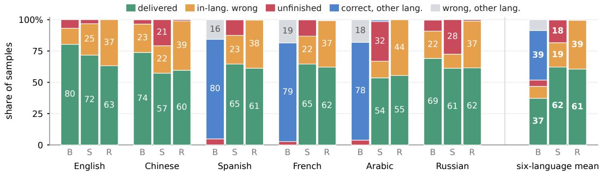  
Figure 1: A constructive path to multilingual delivery (Qwen3-4B). B is the released checkpoint, S adds six-language multilingual SFT, and R is the final correctness-gated endpoint. Bars partition samples by their J@1 outcomes; non-terminating responses are counted as unfinished regardless of correctness or language. The released checkpoint often solves in the wrong language, SFT restores target-language delivery but introduces non-termination, and the final RL endpoint restores completion while retaining delivery. The rightmost group reports the six-language mean.

The control and the additive phase use a 16,384-token training cap and batch size 32. The gated phase continues from the additive checkpoint at step 200 with an 8,192-token cap and batch size 64. All runs use clipped PPO with a scalar terminal reward, GAE (Schulman et al. 2016) with $\gamma = \lambda = 1$ , and the same soft overlong-response penalty (Yu et al. 2025) (a 2,048-token bufer with factor 1.0). Ap- pendix B reports the complete SFT and PPO recipes (Tables S6 and S7).

Table 2 lists every run with its initialization, data volume, batch size, and evaluated checkpoint; the supervised end- points are read at epoch 2 for the Qwen3-4B multilingual run and epoch 1 for the Qwen3-8B replication, and the RL endpoints at steps 700, 200, and 1,000. Figure 2 shows that each supervised run has reached a stable held-out loss at the checkpoint we evaluate and that each PPO run increases its own reward, so the comparisons that follow are not between a converged and an unconverged model.

Finally, we measure delivery eficiency as the number of joint successes produced per 1,000 generated tokens. For endpoint and language ℓ,

$$
{ \mathrm { j o i n t \_ p e r \_ l k } } ( \ell ) = { \frac { 1 0 0 0 \times \# \{ { \mathrm { r e s p o n s e s ~ w i t h ~ } } J = 1 \} } { \# \{ { \mathrm { a d j u s t e d ~ t o k e n s } } \} } } .
$$

The denominator includes every attempt, including re- sponses that never deliver. For a trace written in the requested language, tokens are divided by its language-specific encod- ing factor, measured on parallel prompts; English-pivoted traces receive no hypothetical target-language adjustment. Table 3 reports the corresponding raw-token results and the eficiency conditioned on delivered responses; Appendix C resolves both by language (Table S16).

We normalize non-English eficiency by English from the

same endpoint:

$$
\mathrm { E f f . ~ v s . ~ E n } = \frac { \frac { 1 } { 5 } \sum _ { \ell \in \{ \mathrm { z h , e s , f r , a r , r u } \} } \mathrm { j o i n t \mathrm { \_ p e r \mathrm { \_ l k } } } ( \ell ) } { \mathrm { j o i n t \mathrm { \_ p e r \mathrm { \_ l k } } ( e n ) } } .
$$

Thus, 100% denotes parity with English from the same checkpoint. Table 1 summarizes the complete lineage un- der this shared evaluation.

## The Delivery Problem at Release

The released checkpoints can solve multilingual problems, but language adherence prevents most correct solutions from being delivered in the requested language. Across the five primary non-English languages, Qwen3-4B reaches 90.6% C@16 but only 35.7% J@16 (Figure 3); Qwen3-8B reproduces the gap, with 92.6% correctness and 30.6% delivery. Both are close to English in correctness (92.9%), showing that the missing capability is not primarily mathematical (per-language values and problem-clustered intervals in Table S1).

Language adherence, rather than termination, is the bind- ing constraint. Mean non-English termination failure is no worse than English at either scale (4.7% versus 6.8% at 4B and 5.8% versus 9.2% at 8B). By contrast, adherence in Spanish, French, and Arabic is at most 0.1% at 4B and zero at 8B, with visible reasoning generated almost entirely in En- glish. An independent DeepSeek-V4-Flash judge confirms this pattern, labeling 98.4% of sampled Spanish, French, and Arabic traces as English and the remainder as mixed (Appendix A). The behavior is not uniform across either lan-guages or checkpoints: Chinese adheres almost perfectly at both scales, whereas Russian adheres in 99.2% of samples at 4B but only 34.6% at 8B. Delivery is therefore a property of the language–checkpoint pair, not of a model alone.

The delivery gap extends beyond the five primary languages. We additionally evaluate Icelandic, Swedish, Swahili, Tamil, and Urdu, which span three scripts and appear in none of our training corpora. Across all ten non-English languages, Qwen3-4B reaches 84.3% C@16 but only 17.9% J@16; Qwen3-8B reaches 89.0% and 15.4%, respectively (Figure 3). Language-specific gaps between correctness and delivery reach 94 percentage points (Swedish on Qwen3-8B: 94.3% correct, none delivered).

<table><tr><td>stage</td><td>intervention</td><td>endpoint</td><td>C@1</td><td>L</td><td>1-T</td><td>J@1</td><td>J@16</td><td>eff. vs En</td><td>dominant residual</td></tr><tr><td>I</td><td>released</td><td>Qwen3-8B</td><td>78.1%</td><td>26.9%</td><td>5.8%</td><td>19.6%</td><td>30.6%</td><td>27%</td><td>language selection</td></tr><tr><td>ⅡI</td><td>multilingual SFT</td><td>+ SFT (8B)</td><td>66.0%</td><td>99.7%</td><td>18.2%</td><td>65.1%</td><td>86.3%</td><td>78%</td><td>termination</td></tr><tr><td>1</td><td>released</td><td>Qwen3-4B</td><td>76.2%</td><td>39.8%</td><td>4.7%</td><td>28.6%</td><td>35.7%</td><td>47%</td><td>language selection</td></tr><tr><td>Ⅱ</td><td>multilingual SFT</td><td>+ SFT</td><td>61.4%</td><td>99.4%</td><td>21.1%</td><td>60.2%</td><td>84.6%</td><td>73%</td><td>termination</td></tr><tr><td>ⅢⅢ</td><td>correctness-only RL</td><td>RL: correctness only</td><td>60.5%</td><td>8.7%</td><td>0.3%</td><td>5.0%</td><td>15.4%</td><td>9%</td><td>returns to English</td></tr><tr><td>ⅢI</td><td>target-language RL</td><td>RL: additive → gated</td><td>60.1%</td><td>99.8%</td><td>0.5%</td><td>60.0%</td><td>81.7%</td><td>102%</td><td>answer correctness</td></tr></table>

Table 1: One protocol exposes a staged repair. The upper block reports the released and multilingual-SFT Qwen3-8B endpoints; the lower block reports the full Qwen3-4B lineage. Stage III has a correctness-only control and a target-language procedure whose gated phase continues its additive phase. C@1, L, 1−T, and J@1 are sample-level rates, and J@16 is pass@16, averaged over the five primary non-English languages. Green indicates delivery and red non-termination. Ef. vs En is relative adjusted delivery eficiency, with 100% denoting parity; at the released checkpoints that mean is carried by Chinese and Russian alone, because the other three languages deliver nothing. Dominant residual identifies the remaining bottleneck.
<table><tr><td>run</td><td>initialized from</td><td>examples</td><td>batch</td><td>epochs (cfg.)</td><td>evaluated at</td></tr><tr><td colspan="6">supervised</td></tr><tr><td>multilingual 4B</td><td>Qwen3-4B</td><td>43,218</td><td>16</td><td>5</td><td>epoch 2, step 5,402</td></tr><tr><td>multilingual 8B</td><td>Qwen3-8B</td><td>56,307</td><td>16</td><td>2</td><td>epoch 1, step 3,519</td></tr><tr><td>English-only</td><td>Qwen3-4B</td><td>9,800</td><td>4</td><td>3</td><td>epoch 1, step 2,450</td></tr><tr><td>specialist zh</td><td>Qwen3-4B</td><td>9,334</td><td>4</td><td>3</td><td>epoch 1</td></tr><tr><td>specialist es</td><td>Qwen3-4B</td><td>9,491</td><td>4</td><td>3</td><td>epoch 1</td></tr><tr><td>specialist fr</td><td>Qwen3-4B</td><td>9,400</td><td>4</td><td>3</td><td>epoch 1</td></tr><tr><td>specialist ar</td><td>Qwen3-4B</td><td>9,347</td><td>4</td><td>2</td><td>epoch 1</td></tr><tr><td>specialist ru</td><td>Qwen3-4B</td><td>9,179</td><td>4</td><td>3</td><td>epoch 1</td></tr><tr><td colspan="6">reinforcement learning, from multilingual SFT-4B except the gated continuation</td></tr><tr><td>correctness only</td><td>multilingual 4B</td><td>16,754</td><td>32</td><td></td><td>step 700</td></tr><tr><td>additive</td><td>multilingual 4B</td><td>16,754</td><td>32</td><td></td><td>step 200</td></tr><tr><td>correctness-gated</td><td>additive @200</td><td>16,754</td><td>64</td><td></td><td>step 1,000</td></tr></table>

Table 2: Complete training ledger. The Qwen3-8B chain changes both model scale and corpus; the English-only and specialist controls difer in batch size and data volume; and the gated PPO run continues the additive run rather than restarting from the supervised checkpoint. Reward curves and held-out losses for these runs appear in Figure 2.

An explicit language instruction does not reliably over- ride the language of the problem. In a separate 30-problem probe, an English problem followed by a request to reason in Chinese, Spanish, French, or Arabic produces zero target- language adherence at the released Qwen3-4B checkpoint; Russian reaches only 4.2% (Table 4). This motivates the next intervention: training on complete target-language solutions rather than relying on an instruction alone.

## Supervised Fine-Tuning

Multilingual SFT repairs the language-adherence bottleneck and sharply increases delivery. Across the five primary non- English languages, Qwen3-4B adherence rises from 39.8% to 99.4%, while J@16 rises from 35.7% to 84.6% (Figure 4a). Qwen3-8B reproduces the transition, with J@16 increasing from 30.6% to 86.3% (Table S11). The improvement holds across all five target languages, showing that SFT converts previously English-pivoted solutions into solutions readable in the requested language.

This repair incurs an accuracy cost, but the cost is not spe- cific to multilingual mixing. Mean non-English C@16 falls from 90.6% to 85.1% at 4B and from 92.6% to 86.9% at 8B. More importantly, the same decline appears in controls without multilingual mixing: conditional English correct- ness, pooled over samples, falls from 86.2% at release to 74.1% after multilingual SFT and 74.5% after English-only SFT, while the five single-language specialists lie in the same 73.7%–76.2% range (Figure 4c). The 8B pair reproduces the accuracy decline, although the English-only and specialist controls are available only at 4B. The evidence therefore identifies a general SFT-associated cost rather than a cost unique to multilingual training. The pattern is more consis- tent with displacement of prior post-training than with data quality: the released checkpoints have already undergone ex- tensive mathematical post-training (Yang et al. 2025), and further supervision on external distilled traces appears to overwrite part of it, in line with reports that limited long- chain-of-thought supervision degrades small models (Luo et al. 2025). Residual label noise in the source traces does not account for it, since the decline is of the same magnitude at 8B, whose corpus adds a correctness filter (Appendix B.3).

SFT additionally introduces a target-language termination failure. At 4B, mean non-English termination failure rises from 4.7% to 21.1%, while English improves from 6.8% to 3.2%. The increase is driven by detected looping across ev-ery target language, not by exhaustion of the token budget (Figure 4b). Qwen3-8B reproduces the same pattern: non-English termination failure rises from 5.8% to 18.2%, while

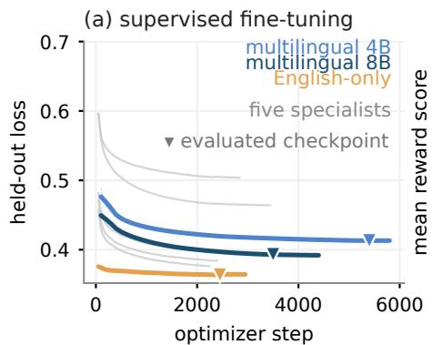

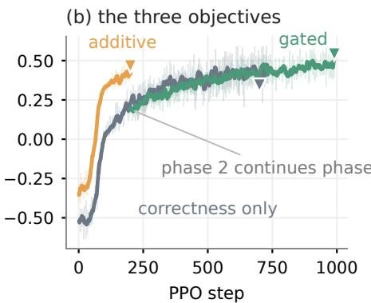

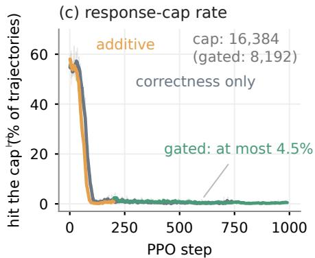

Figure 2: Training diagnostics for the eleven runs. (a) Held-out loss for the eight supervised runs, with the evaluated checkpoint marked on the three whose checkpoint the paper reports. The Qwen3-4B and Qwen3-8B multilingual runs are drawn in diferent blues; the use se aratel constructed cor ora of 43,218 and 56,307 traces, so onl the sha e of each curve is com arable across scales. (b) Mean PPO reward for the control and for the two phases of the target-language procedure, all Qwen3-4B; the levels are not comparable because each optimizes its own reward. (c) The share of PPO trajectories reaching the response cap, which is 16,384 tokens for the correctness-only and additive runs and 8,192 for the gated continuation. Pale lines are raw observations and dark lines centered rolling means.  
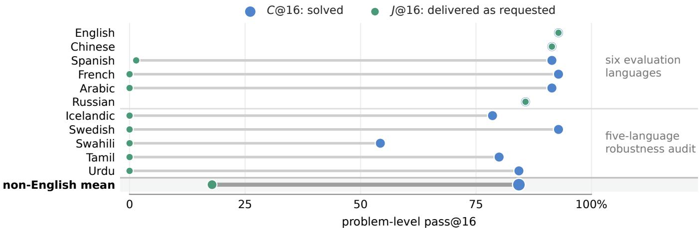  
Figure 3: Released accuracy conceals failed target-language delivery. The figure reports C@16 and J@16 for the released Qwen3-4B on 70 problems. The emphasized row averages the ten non-English languages: five primary evaluation languages and five languages absent from all training corpora. Appendix A reports problem-clustered intervals, the Qwen3-8B results, and independent-judge validation (Tables S1 and S2).

English again improves. The complete per-language decom- position and paired tests appear in Table S10.

SFT also improves the computational eficiency of deliv- ery. Relative non-English eficiency rises from 47% to 73% of English at 4B and from 27% to 78% at 8B. When conditioned on successful delivery, non-English traces are near parity with English; the remaining cost is carried primarily by attempts that never deliver (Appendix C).

Thus, SFT shifts the dominant bottleneck from language adherence to termination.

## Reinforcement Learning

The RL stage compares two arms trained from the same su- pervised checkpoint: a control that rewards correctness alone, and a target-language procedure run in two phases. Both restore termination—mean non-English termination failure falls from 21.1% after SFT to 0.3% and 0.5%—and both reach the same accuracy, $C @ 1 = 6 0 . 5 \%$ and 60.1%.

What separates them is delivery. Without a language term, adherence collapses to 8.7% and J@16 to 15.4%; under the target-language procedure adherence holds at 99.8% and J@16 reaches 81.7%, while delivery eficiency rises from 73% to 102% of English (Table 1). The arms are not matched in every hyperparameter—the gated phase halves the re- s onse ca and doubles the batch—but no such diference produces a 91-point gap in adherence at equal accuracy.

The procedure needs two phases because the shaping term does not stay honest. The reward ledger of its additive phase shows the language credit being collected without solving the task: among the incorrect trajectories the objective still pays, language quality rises to near 100% while accuracy stays low, and they absorb 44%–82% of all reward paid (Figure S1). The gated phase withdraws that credit and continues training.

Whether the reward names the target language therefore decides whether capability is delivered in that language; gat- ing decides whether the language credit has to be earned by solving the task.

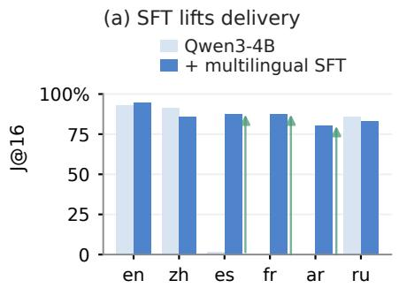

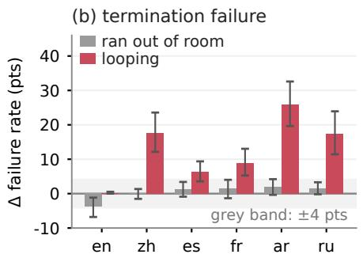

(c) correctness falls in every arm  
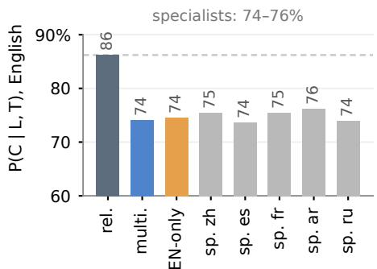

Figure 4: SFT gains delivery but exposes looping; all panels are Qwen3-4B. (a) J@16 before and after six-language SFT. (b) Paired changes in termination failure, decomposed into detected looping and token-budget exhaustion. (c) Conditional English correctness for the released checkpoint, multilingual and English-only SFT, and five single-language specialists; specialist bars denote models rather than evaluation languages. The Qwen3-8B replication of (a) and (b) is reported in Tables S11 and S10.  
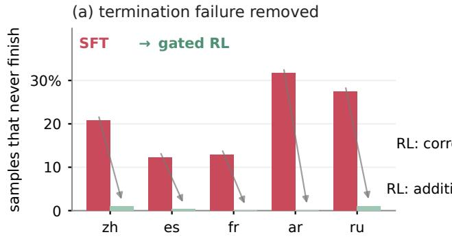

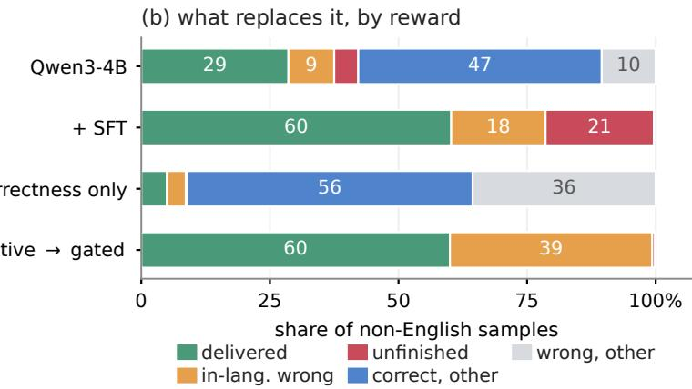  
Fi ure 5: RL restores completion; reward design determines delivery. All end oints are Qwen3-4B. The RL sta e has two arms from the same multilingual SFT checkpoint: a correctness-only control, and a target-language procedure whose gated phase continues its additive phase; the two phase rows in (b) are checkpoints of that one run. (a) Non-termination before RL and at the end of the target-language procedure; the control and the additive phase are reported in Table 1. (b) Response outcomes at the released and supervised checkpoints, under the control, and at the end of the target-language procedure. The reward ledger behind the phase boundary is reported in Appendix C (Figure S1).

## Analysis

The three stages form a construction rather than a sequence of unrelated failure analyses. At release, language adherence is binding: substantial correctness is hidden behind visible English reasoning. SFT repairs adherence and raises target- language delivery, after which termination becomes binding because non-English traces loop. RL repairs termination, while correctness gating prevents this repair from being ex- changed for language-compliant errors. The dominant bot- tleneck moves because each stage removes the condition that limited the preceding one (Table 1).

This progression also clarifies the computational cost of multilingual delivery. Adjusted non-English delivery eficiency rises from 73% of English after SFT to 102% at the end of the target-language procedure; when conditioned on delivered responses, raw-token eficiency reaches parity with English. The remaining end-to-end penalty is therefore carried primarily by attempts that consume tokens without delivering a solution, rather than by the length of successful non-English reasoning. Table 3 gives every eficiency fig- ure under all four accounting conventions, together with the quantity that separates them: the share of generated tokens that ends up inside a delivered solution.

The Qwen3-8B results support the same interpretation (Appendix C).

The language-cue probe in Table 4 provides an impor- tant boundary condition. The language of the problem is a stronger cue than an instruction naming the desired reasoning language: even after SFT and gated RL, an English problem accompanied by such an instruction rarely elicits Chinese, Spanish, French, or Arabic reasoning. Russian is the excep- tion after SFT (94.2%), where the instruction alone sufices, but gated RL returns it to 9.2%. These interventions therefore obtain target-language delivery through end-to-end localized problems and solutions, rather than a general ability to switch reasoning language through instruction alone.

More broadly, multilingual post-training redistributes cor- related failure modes rather than uniformly improving a sin- gle capability. Evaluating only accuracy, adherence, or ter- mination can therefore miss both the bottleneck removed by

<table><tr><td></td><td colspan="2">all attempts</td><td colspan="2">J-only</td><td></td></tr><tr><td>stage</td><td>adjusted</td><td>raw</td><td>adjusted</td><td>raw</td><td>token yield</td></tr><tr><td>Qwen3-4B</td><td>47%</td><td>41%</td><td></td><td></td><td>34%</td></tr><tr><td>+ SFT</td><td>73%</td><td>62%</td><td>110%</td><td>94%</td><td>67%</td></tr><tr><td>RL: correctness only</td><td>9%</td><td>9%</td><td></td><td></td><td>6%</td></tr><tr><td>RL: gated</td><td>102%</td><td>87%</td><td>117%</td><td>100%</td><td>88%</td></tr><tr><td>Qwen3-8B</td><td>27%</td><td>26%</td><td></td><td></td><td>23%</td></tr><tr><td>+ SFT (8B)</td><td>78%</td><td>66%</td><td>111%</td><td>94%</td><td>70%</td></tr></table>

Table 3: Delivery eficiency under four accounting conventions. Eficiency is joint successes per 1,000 generated tokens. Every entry is a percentage of the same endpoint’s English value, so 100% means parity with English; the four eficiency columns average the five primary non-English languages, and the yield column pools them. The conventions difer in which tokens are counted. Adjusted first divides each trace by its language’s encoding factor—the same text costs between 1.003 times (Chinese) and 1.314 times (Russian) as many tokens as in English, purely because of how the tokenizer segments the script—so an adjusted column asks whether the model produced more reasoning, while a raw column counts the tokens a user is actually billed for. All attempts charges every generated token, including those spent on responses that never delivered; J-only charges only the tokens inside delivered solutions. The two are linked by token yield: the share of a language’s generated tokens that ends up inside a delivered solution, here the non-English share as a percentage of the endpoint’s English share. All-attempt eficiency is J-only eficiency times yield, and the identity holds in these ratios exactly as it does in the underlying absolute shares. Absolute per-language yields are in Appendix C (Table S17). J-only is undefined, and omitted, where a language delivers nothing.

<table><tr><td>what the prompt supplies</td><td>zh</td><td>es</td><td>fr</td><td>ar</td><td>ru</td></tr><tr><td>Qwen3-4B (released)</td><td></td><td></td><td></td><td></td><td></td></tr><tr><td>X problem, asks X</td><td>99.6%</td><td>0.1%</td><td>0.0%</td><td>0.0%</td><td>99.2%</td></tr><tr><td>English problem, asks X</td><td>0.0%</td><td>0.0%</td><td>0.0%</td><td>0.0%</td><td>4.2%</td></tr><tr><td>+ multilingual SFT</td><td></td><td></td><td></td><td></td><td></td></tr><tr><td>X problem, asks X</td><td>99.9%</td><td>99.6%</td><td>99.0%</td><td>98.4%</td><td>99.9%</td></tr><tr><td>English problem, asks X</td><td>0.0%</td><td>2.5%</td><td>0.8%</td><td>0.0%</td><td>94.2%</td></tr><tr><td>+ gated RL</td><td></td><td></td><td></td><td></td><td></td></tr><tr><td>X problem, asks X</td><td></td><td></td><td></td><td></td><td>100.0%99.9%99.2%100.0%100.0%</td></tr><tr><td>English problem, asks X</td><td>0.0%</td><td>1.7%</td><td>2.5%</td><td>1.7%</td><td>9.2%</td></tr></table>

Table 4: The problem language is a stronger cue than the requested reasoning language. Entries report targetlanguage adherence for Qwen3-4B endpoints, where X is the language of the column (Chinese, Spanish, French, Arabic, or Russian). “X problem, asks X” uses the main 70-problem evaluation; “English problem, asks X” uses the separate 30- problem probe. Each cell contains 1,120 and 120 samples, respectively.

## an intervention and the failure that replaces it.

## Limitations

Our conclusions are limited to visible multilingual delivery in one Qwen3 family on competition mathematics. The released checkpoints had already undergone substantial mathematical post-training, and our interventions target delivery rather than general reasoning capability.

Each training run uses one seed, and evaluation is limited to 70 translated problems. The English-only and specialist SFT controls difer in data volume and training configura- tion, while the ated end oint continues the additive run with a diferent response cap and batch size. These comparisons are therefore diagnostic rather than fully matched causal ab- lations.

Finally, although the prompts were constructed in paral- lel and the translations underwent extensive quality audits, translation can still alter the naturalness or dificulty of math ematical problems and reasoning instructions.

## Conclusion

We studied when post-training makes multilingual reasoning usable rather than merely accurate. Across thirteen endpoints of one Qwen3 lineage, a fixed response-level readout shows that released checkpoints often solve non-English problems through visible English reasoning, causing answer accuracy to overstate target-language delivery. Following this lineage reveals a shifting bottleneck. Multilingual SFT repairs lan- guage adherence, but its general accuracy cost is accompa- nied by a target-language termination failure. RL restores termination under both arms and at equal accuracy; what the language term decides—and only when it is gated on correctness—is whether the recovered responses are deliv- ered in the requested language or return to English. Together, these stages establish a constructive post-training path from English-pivoted capability to reliable multilingual delivery, converting capability already present at release into correct and complete target-language solutions with eficiency com- parable to English.

## References

Bafna, N.; Li, T.; Murray, K.; Mortensen, D. R.; Yarowsky, D.; Sirin, H.; and Khashabi, D. 2025. The Translation Barrier Hypoth- esis: Multilingual Generation with Large Language Models Sufers from Implicit Translation Failure. In Proceedings of the 14th International Joint Conference on Natural Language Processing and the 4th Conference of the Asia-Pacific Chapter of the Association for Computational Linguistics, 1541–1568.

Barua, J.; Eisape, S.; Yin, K.; and Suhr, A. 2026. Long Chain-of- Thought Reasoning Across Languages. In The Fourteenth International Conference on Learning Representations.

Elhady, A.; Agirre, E.; and Artetxe, M. 2026. Cross-lingual Self- Consistency for Multilingual Reasoning with Language Models. arXiv preprint arXiv:2606.01464.

Fan, Y.; Li, B.; Li, P.; Wang, Y.; Mu, Y.; Yang, J.; Chen, X.; Weng, R.; Wang, J.; Cai, X.; Zhu, J.; and Xiao, T. 2026. LANG: Reinforce- ment Learning for Multilingual Reasoning with Language-Adaptive Hint Guidance. In Proceedings of the 64th Annual Meeting of the Association for Computational Linguistics (Volume 1: Long Pa pers), 43838–43866.

Gurgurov, D.; Röhr, T.; von Rohrscheidt, S.; van Genabith, J.; Löser, A.; and Ostermann, S. 2026. ReasonXL: Shifting LLM Reason- ing Language Without Sacrificing Performance. arXiv preprint arXiv:2604.12378.

Hugging Face. 2025. Open R1: A Fully Open Reproduction of DeepSeek-R1. GitHub repository huggingface/open-r1.

Hwang, J.; Tanmay, K.; Lee, S.-J.; Agrawal, A.; Palangi, H.; Ayush, K.; Fiete, I.; and Liang, P. P. 2025. Learn Globally, Speak Lo- cally: Bridging the Gaps in Multilingual Reasoning. arXiv preprint arXiv:2507.05418.

Kang, D.; Hwang, S.; Kim, D.; Kim, H.; and Lee, G. G. 2026. Why Do Multilingual Reasoning Gaps Emerge in Reasoning Lan- guage Models? In Findings of the Association for Computational Linguistics: ACL 2026, 31684–31716.

Li, Y.; Xin, J.; Miao, M. M.; Long, Q.; and Ungar, L. 2025. The Impact of Language Mixing on Bilingual LLM Reasoning. In Proceedings ofthe 2025 Conference on Empirical Methods in Natural Language Processing, 32531–32548.

Lundin, J. M.; Zhang, A.; Karim, N.; Louzan, H.; Wei, V.; Adelani, D. I.; and Carroll, C. 2026. The Token Tax: Systematic Bias in Multilingual Tokenization. In Proceedings of the 7th Workshop on African Natural Language Processing (AfricaNLP 2026), 103–112.

Luo, R.; Li, J.; Huang, C.; and Lu, W. 2025. Through the Valley: Path to Efective Long CoT Training for Small Language Models. In Proceedings of the 2025 Conference on Empirical Methods in Natural Language Processing, 4972–4992.

Petrov, A.; La Malfa, E.; Torr, P. H. S.; and Bibi, A. 2023. Language Model Tokenizers Introduce Unfairness Between Languages. In Advances in Neural Information Processing Systems, volume 36, 36963–36990.

Pipis, C.; Garg, S.; Kontonis, V.; Shrivastava, V.; Krishnamurthy, A.; and Papailiopoulos, D. 2026. Wait, Wait, Wait... Why Do Rea- soning Models Loop? In Forty-third International Conference on Machine Learning, volume 306 of Proceedings ofMachine Learn ing Research.

Qi, J.; Chen, S.; Xiong, Z.; Fernández, R.; Bitterman, D.; and Bisazza, A. 2025. When Models Reason in Your Language: Con- trolling Thinking Language Comes at the Cost of Accuracy. In Findings ofthe Associationfor Computational Linguistics: EMNLP 2025, 20279–20296.

Rahmati, E.; Salkhordeh Ziabari, A.; and Dehghani, M. 2025. CoCo-CoLa: Evaluating and Improving Language Adherence in Multilingual LLMs. In Proceedings ofthe 5th Workshop on Multi lingual Representation Learning (MRL 2025), 62–77.

Schulman, J.; Moritz, P.; Levine, S.; Jordan, M. I.; and Abbeel, P. 2016. High-Dimensional Continuous Control Using Generalized Advantage Estimation. In The Fourth International Conference on Learning Representations.

Schulman, J.; Wolski, F.; Dhariwal, P.; Radford, A.; and Klimov, O. 2017. Proximal Policy Optimization Algorithms. arXiv preprint arXiv:1707.06347.

Schut, L.; Gal, Y.; and Farquhar, S. 2025. Do Multilingual LLMs Think In English? arXiv preprint arXiv:2502.15603.

Tam, Z. R.; Wu, C.-K.; Chiu, Y. Y.; Lin, C.-Y.; Chen, Y.-N.; and Lee, H.-y. 2025. Language Matters: How Do Multilingual Input and

Reasoning Paths Afect Large Reasoning Models? arXiv preprint arXiv:2505.17407.

Wang, Y.; Zhang, P.; Tang, J.; Wei, H.-R.; Yang, B.; Wang, R.; Sun, C.; Sun, F.; Zhang, J.; Wu, J.; Cang, Q.; Zhang, Y.; Lin, J.; Huang, F.; and Zhou, J. 2025. PolyMath: Evaluating Mathematical Reason- ing in Multilingual Contexts. In Advances in Neural Information Processing Systems, Datasets and Benchmarks Track, volume 38.

Wendler, C.; Veselovsky, V.; Monea, G.; and West, R. 2024. Do Llamas Work in English? On the Latent Language of Multilingual Transformers. In Proceedings of the 62nd Annual Meeting of the Associationfor Computational Linguistics (Volume 1: Long Papers), 15366–15394.

Yang, A.; Li, A.; Yang, B.; Zhang, B.; Hui, B.; Zheng, B.; Yu, B.; Gao, C.; Huang, C.; Lv, C.; et al. 2025. Qwen3 Technical Report. arXiv preprint arXiv:2505.09388.

Yu, Q.; Zhang, Z.; Zhu, R.; Yuan, Y.; Zuo, X.; Yue, Y.; Dai, W.; Fan, T.; Liu, G.; Liu, L.; et al. 2025. DAPO: An Open-Source LLM Reinforcement Learning System at Scale. In Advances in Neural Information Processing Systems, volume 38.

Zhan, Q.; Hu, M.; Jang, S.; Zhao, L.; Chen, Z.; Liang, M.; Xi-ang, X.; Liu, J.; Wang, G.; and He, L. 2026. Disentangling Lan- guage Roles in Multilingual LLM Task Execution. arXiv preprint arXiv:2605.27649.

Zhang, X.; Liang, Y.; Meng, F.; Zhang, S.; Huang, K.; Chen, Y.; Xu, J.; and Zhou, J. 2026. Think Nativel : Unlockin Multilin ual Reasoning with Consistency-Enhanced Reinforcement Learning. In Proceedings of the 64th Annual Meeting of the Association for Computational Linguistics (Volume 1: Long Papers), 20766–20783.

Zheng, M.; Li, Z.; Qu, B.; Song, M.; Du, Y.; Sun, M.; and Wang, D. 2025. Hunyuan-MT Technical Report. arXiv preprint arXiv:2509.05209.

# Supplementary Material

# A Evaluation Protocol and Instrument Checks

All rimar ex eriments use 70 com etition-mathematics roblems (30 AIME-2026 and 40 AMC-2023), six full localized prompts, 16 samples per problem at temperature 0.7, and a 24,576-token response budget; the five single-language specialists are evaluated in two languages only, their own and English. The five-language mean in the main SFT and RL results means Chinese, Spanish, French, Arabic, and Russian; English is a control language. The released- checkpoint robustness audit additionally evaluates Icelandic, Swedish, Swahili, Tamil, and Urdu, but no fine-tuned endpoint is trained or evaluated on those five languages.

Correctness. We extract only the final brace-matched \boxed{} answer or the text after the last English, Chinese, Spanish, French, Arabic, or Russian final-answer marker. The extracted answer, never the full trace, is checked with math\_verify; a missin final answer is incorrect. This revents a truncated trace that merel mentions the old value from receivin credit.

Language adherence. We extract the visible <think> block when present, remove mathematical expressions, split the remaining text into sentence-like segments, and evenly subsample at most 60 segments so that both the beginning and end of a long trace are represented. langid is restricted to the six evaluation languages. L = 1 when at least half of the segments are classified as the requested language; English uses the identical definition with English as its target. Script fraction is retained as a model-free cross-check. A blind LLM judge re-scores the same 609 non-English traces and agrees with the continuous target-language fraction that L thresholds at Pearson $r = 9 7 . 9 \%$ (mean absolute diference 5.7%).

Termination. T = 1 requires both that generation does not reach the response cap and that its language-agnostic repetition score is at most 0.85. The score is 1 − compressed bytes/raw bytes using zlib compression. We report cap-only and looping com onents se aratel . A blind jud e reclassifies 170 stratified failures; the ca -overrun versus loo in distinction reaches 89.4% accuracy and Cohen’s $\kappa = . 5 1 9$ . Finer loop taxonomies are not used quantitatively.

C@k and J@k use the standard unbiased pass@k estimator with C or J as the success event. Intervals resample problems as blocks $( B = 2 , 0 0 0 )$ , because samples of a problem are not independent (Table S1); paired comparisons use the same problem–language cells and apply Holm correction within each five-language family.

## A.1 Released-checkpoint results and uncertainty

<table><tr><td>checkpoint language</td><td></td><td>C@16 [95% CI]</td><td>J@16 [95% CI]</td><td></td><td>L</td><td>1-T</td><td>cap only</td><td>looping</td><td>tokens</td></tr><tr><td rowspan="10">Qwen3-4B</td><td>English Chinese</td><td>92.9% [85.7, 98.6] 91.4% [84.3, 97.1]</td><td></td><td>92.9% [85.7, 98.6] 91.4% [84.3, 97.1]</td><td>100.0% 99.6%</td><td>6.8% 3.4%</td><td>6.7% 2.5%</td><td>0.1% 0.9%</td><td>9,568 8,127</td></tr><tr><td>Spanish</td><td>91.4% [84.3, 97.1]</td><td>1.4% [0.0, 4.3]</td><td></td><td>0.1%</td><td>4.7%</td><td>4.4%</td><td>0.4%</td><td>7,928</td></tr><tr><td>French</td><td>92.9% [85.7, 98.6]</td><td>0.0% [0.0, 0.0]</td><td></td><td>0.0%</td><td>2.7%</td><td>2.7%</td><td>0.0%</td><td>7,158</td></tr><tr><td>Arabic</td><td>91.4% [84.3, 97.1]</td><td>0.0% [0.0, 0.0]</td><td></td><td>0.0%</td><td>3.8%</td><td>3.5%</td><td>0.4%</td><td>7,613</td></tr><tr><td>Russian</td><td>85.7% [77.1, 92.9]</td><td></td><td>85.7% [77.1, 92.9]</td><td>99.2%</td><td>8.8%</td><td>3.1%</td><td>5.6%</td><td>8,380</td></tr><tr><td>Icelandic</td><td>78.6% [68.6, 87.1]</td><td>0.0% [0.0, 0.0]</td><td></td><td>0.0%</td><td>5.9%</td><td>4.8%</td><td>1.1%</td><td>8,691</td></tr><tr><td>Swedish</td><td>92.9% [85.7, 98.6]</td><td>0.0% [0.0, 0.0]</td><td></td><td>0.0%</td><td>4.2%</td><td>4.0%</td><td>0.2%</td><td>7,759</td></tr><tr><td>Swahili</td><td>54.3% [42.9, 67.1]</td><td>0.0% [0.0, 0.0]</td><td></td><td>0.0%</td><td>6.2%</td><td>3.5%</td><td>2.8%</td><td>8,983</td></tr><tr><td>Tamil</td><td>80.0% [70.0, 88.6]</td><td>0.0% [0.0, 0.0]</td><td></td><td>0.0%</td><td>3.7%</td><td>2.3%</td><td>1.3%</td><td>7,244</td></tr><tr><td>Urdu</td><td>84.3% [75.7, 92.9]</td><td>0.0% [0.0, 0.0]</td><td></td><td>0.0%</td><td>2.6%</td><td>1.7%</td><td>0.9%</td><td>7,053</td></tr><tr><td rowspan="10">Qwen3-8B</td><td>English</td><td>92.9% [85.7, 98.6]</td><td></td><td>92.9% [85.7, 98.6]</td><td>99.9%</td><td>9.2%</td><td>9.0%</td><td>0.2%</td><td>10,446</td></tr><tr><td>Chinese</td><td>91.4% [84.3, 97.1]</td><td></td><td>91.4% [84.3, 97.1]</td><td>99.9%</td><td>7.5%</td><td>4.5%</td><td>3.0%</td><td>9,790</td></tr><tr><td>Spanish</td><td>94.3% [88.6, 98.6]</td><td>0.0% [0.0, 0.0]</td><td></td><td>0.0%</td><td>4.3%</td><td>4.2%</td><td>0.1%</td><td>8,493</td></tr><tr><td>French</td><td>92.9% [87.1, 98.6]</td><td>0.0% [0.0, 0.0]</td><td></td><td>0.0%</td><td>4.9%</td><td>4.9%</td><td>0.0%</td><td>8,756</td></tr><tr><td>Arabic</td><td>92.9% [85.7, 98.6]</td><td></td><td>0.0% [0.0, 0.0]</td><td>0.0%</td><td>5.1%</td><td>5.1%</td><td>0.0%</td><td>8,494</td></tr><tr><td>Russian</td><td>91.4% [84.3, 97.1]</td><td></td><td>61.4% [50.0, 72.9]</td><td>34.6%</td><td>7.4%</td><td>5.7%</td><td>1.7%</td><td>9,393</td></tr><tr><td>Icelandic</td><td>87.1% [78.6, 94.3]</td><td></td><td>0.0% [0.0, 0.0]</td><td>0.0%</td><td>7.9%</td><td>6.9%</td><td>1.0%</td><td>9,744</td></tr><tr><td>Swedish</td><td>94.3% [88.6, 98.6]</td><td></td><td>0.0% [0.0, 0.0]</td><td>0.0%</td><td>5.6%</td><td>5.5%</td><td>0.1%</td><td>9,041</td></tr><tr><td>Swahili</td><td>70.0% [58.6, 80.0]</td><td></td><td>1.4% [0.0, 4.3]</td><td>1.0%</td><td>11.3%</td><td>9.1%</td><td>2.1%</td><td>10,726</td></tr><tr><td>Tamil</td><td>85.7% [77.1, 92.9]</td><td></td><td>0.0% [0.0, 0.0]</td><td>0.0% 0.0%</td><td>4.8%</td><td>4.2%</td><td>0.6%</td><td>8,858</td></tr><tr><td colspan="2">Urdu</td><td>90.0% [82.9, 95.7]</td><td>0.0% [0.0, 0.0]</td><td></td><td></td><td>4.8%</td><td>4.0%</td><td>0.8%</td><td>8,479</td></tr></table>

Table S1: Accurac and joint deliver with 95% roblem-clustered bootstra intervals. The two termination columns are bud et exhaustion without repetition and detected looping; a trace can satisfy both conditions. “tokens” is the mean over all attempts.

## A.2 Robustness beyond the primary languages

The additional languages span Latin, Tamil, and Arabic scripts and appear in none of the corpora we construct (Table S2). The language identifier and blind judge agree that visible target-language reasoning is essentially absent in all ten released-checkpoint cells; the onl nonzero J@16 is Swahili on Qwen3-8B (1.4%).

<table><tr><td rowspan="2">model</td><td rowspan="2">lang</td><td colspan="3">outcome</td><td colspan="4">two instruments for L</td></tr><tr><td>C@16</td><td>J@16</td><td>gap</td><td>langid-L</td><td>judge-en</td><td>judge-tgt</td><td>judge-frac</td></tr><tr><td rowspan="5">Qwen3-4B</td><td>is</td><td>78.6%</td><td>0.0%</td><td>78.6%</td><td>0.0%</td><td>84.4%</td><td>0.0%</td><td>2.0%</td></tr><tr><td>SV</td><td>92.9%</td><td>0.0%</td><td>92.9%</td><td>0.0%</td><td>96.9%</td><td>0.0%</td><td>0.5%</td></tr><tr><td>SW</td><td>54.3%</td><td>0.0%</td><td>54.3%</td><td>0.0%</td><td>78.1%</td><td>0.0%</td><td>1.9%</td></tr><tr><td>ta</td><td>80.0%</td><td>0.0%</td><td>80.0%</td><td>0.0%</td><td>93.8%</td><td>0.0%</td><td>0.8%</td></tr><tr><td>ur</td><td>84.3%</td><td>0.0%</td><td>84.3%</td><td>0.0%</td><td>90.6%</td><td>0.0%</td><td>1.0%</td></tr><tr><td rowspan="5">Qwen3-8B</td><td>is</td><td>87.1%</td><td>0.0%</td><td>87.1%</td><td>0.0%</td><td>93.8%</td><td>0.0%</td><td>1.2%</td></tr><tr><td>SV</td><td>94.3%</td><td>0.0%</td><td>94.3%</td><td>0.0%</td><td>100.0%</td><td>0.0%</td><td>0.2%</td></tr><tr><td>SW</td><td>70.0%</td><td>1.4%</td><td>68.6%</td><td>1.0%</td><td>90.6%</td><td>0.0%</td><td>0.3%</td></tr><tr><td>ta</td><td>85.7%</td><td>0.0%</td><td>85.7%</td><td>0.0%</td><td>96.9%</td><td>0.0%</td><td>0.3%</td></tr><tr><td>ur</td><td>90.0%</td><td>0.0%</td><td>90.0%</td><td>0.0%</td><td>93.8%</td><td>0.0%</td><td>0.5%</td></tr></table>

Table S2: Robustness audit over five additional languages, none of which appears in any corpus we construct; gap is C@16 − J@16. The right-hand block reports two independently constructed instruments for L. langid-L is the automatic per-response criterion, with the lan id candidate set extended to all eleven evaluation lan ua es so that these five can be detected at all. judge-en and judge-tgt are the shares of sam led traces a blind LLM jud e labels as reasonin in En lish and in the tar et language, and judge-frac is its estimate of how much of the trace is written in the target language. The two instruments agree in all ten cells, andjudge-en is a positive identification of English rather than a failure to identify the target language, so the absent target-language reasoning is a property of the models and not an artifact of either instrument.

## A.3 Input-language versus instruction probe

The probe table in the main text reports the outcome; here we record its protocol and the measurements behind it. This probe is a separate experiment, not a slice of the main evaluation. Each of the seven runs draws its own 30 problems (15 AIME-2026 and 15 AMC-23) and covers six languages at K = 4, giving 720 samples per run. Only the runner, token budget and scoring are shared, so the probe’s absolute values are not comparable with the endpoint tables and are never pooled with them; wha transfers is the within-probe contrast between conditions. The forward set states the problem in English and appends a localized instruction to reason in the target language.

Table S3 gives the underlying quantities for the supervised checkpoint under the forward condition. Correctness is essentially flat across probe conditions at every endpoint (47%–72% after SFT, 71%–86% at release), so refusal to switch language is not a failure to solve. Runs on the released Qwen3-8B, and a reverse set that states the problem in the target language and asks for English, are released with the repository but not reported here; the table covers the Qwen3-4B lineage under the forward condition only.
<table><tr><td>instructed language</td><td>n</td><td>L</td><td>target frac.</td><td>C</td></tr><tr><td>en</td><td>120</td><td>100.0%</td><td>91.3%</td><td>56.7%</td></tr><tr><td>zh</td><td>120</td><td>0.0%</td><td>5.7%</td><td>59.2%</td></tr><tr><td>es</td><td>120</td><td>2.5%</td><td>3.6%</td><td>59.2%</td></tr><tr><td>fr</td><td>120</td><td>0.8%</td><td>1.7%</td><td>56.7%</td></tr><tr><td>ar</td><td>120</td><td>0.0%</td><td>0.3%</td><td>54.2%</td></tr><tr><td>ru</td><td>120</td><td>94.2%</td><td>86.7%</td><td>46.7%</td></tr></table>

Table S3: English problem text with an instruction to reason in the listed language, multilingual SFT on Qwen3-4B. L measures the language of the visible solution trace; “target frac.” is its mean instructed-language fraction.

## B Data, Training, and Reproducibility

## B.1 Supervised corpus construction

The SFT cor us be ins with 45K En lish O enR1 lon -chain-of-thou ht mathematics traces. Traces are assi ned lan ua es round robin by global index; English traces are retained and the other five are translated by a locally served Qwen3-14B. Figures and display environments are detached before translation and reattached afterward; <think> blocks are preserved; and long traces are chunked. An alignment gate rejects any trace with a capped chunk or a changed number or value of \boxed answers. Seven further gates then run on each translated trace: exactly one <think> and one </think>; a recoverable \boxed answer; an even number of dollar signs; matched braces; a bounded ratio of translated to source length; and no repetition, flagged when zlib compresses the trace by more than 70%. The seventh gate is target-language fidelity, and it branches by script, because the same test cannot serve both kinds of language. Chinese, Arabic and Russian are written in scripts English does not use, so the gate measures the share of prose characters in the target script and requires it to exceed 0.5. Spanish and French share the Latin alphabet with English, where that measure carries no information, so the gate instead measures the share of English function words and requires it to stay below 0.15. The same asymmetry recurs when we score adherence at evaluation time.

The resultin 4B multilin ual cor us has 43,218 traces (6,976–7,214 er translated lan ua e, 7,460 En lish); the 8B re lication uses a separately constructed 56,307-trace corpus.

## B.2 Translator selection

A comparison whose criteria and pass marks were fixed before any output was scored favours Qwen3-14B on every axis. Qwen3-14B and Hunyuan-MT-7B translated the same 40 source traces into all five languages under the same chunking, and were judged on three independent axes.

The primary axis is mechanical and uses no judge. Over 2,515 aligned chunks per arm, Qwen3-14B preserves every \boxed answer and meets the pre-registered .98 number-recall mark in all five languages; Hunyuan recall is .875–.939 and fails it everywhere (Table S4). Losing digits is disqualifying for mathematical data regardless of how fluent the prose is. The second axis is reproducibility: on two independently drawn Chinese samples Qwen3-14B recalls .997 and .998 of numbers while Hunyuan recalls .939 and .935, so the gap is a stable property rather than sampling noise. The third axis is a blind 250-pair judge comparison, which scores faithfulness at 4.85 against 2.91 on a five-point scale with a 209:19:22 win/loss/tie record.

The three axes agree, which matters more than any one of them. The one blemish is that Qwen3-14B leaves English discourse markers in Chinese output, giving a target-script purity of .877; the judge did not penalize this as unfaithful (Chinese faithfulness 4.90) and number recall is unafected. This comparison selects a data-preparation tool, not a model under study.

<table><tr><td></td><td></td><td colspan="4">mechanical fidelity</td><td>blind</td></tr><tr><td>language</td><td>translator</td><td>boxed</td><td>digits</td><td>LTEX</td><td>trunc.</td><td>faithfulness</td></tr><tr><td>Chinese</td><td>Qwen3-14B</td><td>100.0%</td><td>99.7%</td><td>100.0%</td><td>0.0%</td><td>4.90</td></tr><tr><td></td><td>Hunyuan-MT-7B</td><td>97.0%</td><td>93.9%</td><td>100.0%</td><td>0.4%</td><td>3.04</td></tr><tr><td>Spanish</td><td>Qwen3-14B</td><td>100.0%</td><td>100.0%</td><td>100.0%</td><td>0.0%</td><td>4.88</td></tr><tr><td></td><td>Hunyuan-MT-7B</td><td>96.6%</td><td>91.8%</td><td>100.0%</td><td>0.0%</td><td>3.12</td></tr><tr><td>French</td><td>Qwen3-14B</td><td>100.0%</td><td>99.9%</td><td>100.0%</td><td>0.0%</td><td>4.96</td></tr><tr><td></td><td>Hunyuan-MT-7B</td><td>95.4%</td><td>91.9%</td><td>100.0%</td><td>0.0%</td><td>2.96</td></tr><tr><td>Arabic</td><td>Qwen3-14B</td><td>100.0%</td><td>98.9%</td><td>100.0%</td><td>0.2%</td><td>4.54</td></tr><tr><td></td><td>Hunyuan-MT-7B</td><td>95.4%</td><td>87.5%</td><td>100.0%</td><td>0.0%</td><td>2.84</td></tr><tr><td>Russian</td><td>Qwen3-14B</td><td>100.0%</td><td>99.6%</td><td>100.0%</td><td>0.0%</td><td>4.98</td></tr><tr><td></td><td>Hunyuan-MT-7B</td><td>95.2%</td><td>89.6%</td><td>100.0%</td><td>0.0%</td><td>2.58</td></tr><tr><td>all</td><td>Qwen3-14B</td><td colspan="5">all criteria met</td></tr><tr><td>all</td><td>Hunyuan-MT-7B</td><td colspan="4">digit recall below threshold</td><td>4.85 2.91</td></tr></table>

Table S4: Pre-registered translator comparison, per language. Mechanical columns are over 2,515 aligned chunks per arm; faithfulness is a blind judge score over 250 randomized pairs. The pre-specified number-recall pass mark was .98.

## B.3 Fidelity of the corpus we trained on

The bake-of certifies the tool; the corpus that reaches the optimizer is audited separately, because a study whose central finding is an English pivot must show that the pivot is not an artefact of English left in its own training data. We sample 250 traces per language from the 4B corpus and score them mechanically and with an independent judge (Table S5).

Structure survives translation: 99.6–100% of sampled traces still reach a \boxed answer and 98.8–100% keep their mathematics intact. Reasoning quality is unchanged in the sense that matters here: judged coherence is 4.47–4.90 per language against 4.88 for the untranslated English source, so translation did not degrade the arguments it carried. Target-language fidelity is 4.32–4.62 except in Arabic, at 3.54.

The residual is English leakage, and it is the confound worth naming. Judged moderate or severe leakage afects 4.0–6.0% of Chinese, Spanish, French, and Russian traces and 16.0% of Arabic ones. The corpus built for the 8B replication was re-translated and is uniformly cleaner, most where the first was worst (Arabic fidelity 3.54 → 4.12, moderate-or-severe leakage .160 → .120). Two observations bound the risk. The leakage is an upper bound on what a model could imitate, and the model trained on this corpus does not imitate it: post-SFT adherence is .984–.999, so a corpus that is a few percent contaminated did not produce a few percent of English traces. And leakage cannot explain the released-checkpoint result at all, which is measured before any of this data exists.

Two further ro erties of the source are inherited rather than introduced b us. The O enR1 traces were filtered structurall but not for answer correctness, and a judged sample puts the wrong-final-answer rate at roughly 18.5%. This rate is identical in the English-only control and in the multilingual corpus, since both are built from the same pool, so it is common to both arms of every language comparison we draw and cannot produce a diference between them; it does place a ceiling on the absolute accuracy any model fine-tuned on this data can reach. The 8B corpus adds a correctness filter and 8-gram decontamination against the evaluation sets.

<table><tr><td>language</td><td>coherence</td><td>fidelity</td><td>reaches\boxed</td><td>math kept</td><td>no major leak</td></tr><tr><td>Chinese</td><td>4.90</td><td>4.62</td><td>99.6%</td><td>100.0%</td><td>96.0%</td></tr><tr><td>Spanish</td><td>4.78</td><td>4.40</td><td>99.6%</td><td>100.0%</td><td>94.0%</td></tr><tr><td>French</td><td>4.81</td><td>4.32</td><td>99.6%</td><td>100.0%</td><td>95.6%</td></tr><tr><td>Arabic</td><td>4.47</td><td>3.54</td><td>99.6%</td><td>99.6%</td><td>84.0%</td></tr><tr><td>Russian</td><td>4.76</td><td>4.40</td><td>100.0%</td><td>98.8%</td><td>94.4%</td></tr><tr><td>English (untranslated)</td><td>4.88</td><td></td><td>100.0%</td><td>100.0%</td><td></td></tr></table>

Table S5: Audit of the 4B multilingual corpus, 250 sampled traces per language. Coherence and target-language fidelity are independent judge scores on a five-point scale; the last column is the share of traces free of moderate or severe English residue. The English row is the untranslated source, i.e. the floor these scores are read against.

## B.4 Training recipes

Both stages run on verl; the training curves and the run ledger appear in the main paper. Every configured value in Tables S6 and S7 is read from the configuration echoed at the start of each run’s log, so the tables describe the runs that produced the checkpoints rather than the launch scripts.

Supervised fine-tuning. We fine-tune all parameters of the released checkpoints on the corpora of Appendix B.1, using the Qwen3 chat template with thinking enabled and minimizing the token-level negative log-likelihood over response tokens; Table S6 lists every configured value. Two divergences matter for reading the results. The two multilingual runs use batch 16 on 16 GPUs while the English-only and specialist controls use batch 4 on 4 GPUs. And the cutof falls on Arabic, the language with the worst post-SFT termination: every run uses 32,768 tokens except the Arabic specialist, which uses 24,576. Configured epochs and evaluated checkpoints difer by run and are listed in the run ledger in the main paper.

Reinforcement learning. PPO with GAE advantages, initialized from the multilingual SFT checkpoint on Qwen3-4B and trained on the localized DAPO-Math-17K prompts. There is no KL term in either the reward or the loss, so the two reward definitions given in the main text are the only shaping the policy receives beyond the overlong-response penalty, which is identical across variants. Because γ = λ = 1 and the reward is a single terminal scalar, the advantage reduces to $R ( \tau ) - V _ { \phi } ( s _ { t } )$ which is the quantit the reward-geometr anal sis reads. The correctness-onl and additive runs share a configuration; the gated run continues the additive run from ste 200 with a halved res onse ca and doubled batch, so it is a continuation rather than a matched arm. Trainin -time validation is not com arable with the end oint evaluation and is not re orted as a result. It score AIME-2026 alone, without the 40 AMC-23 problems, under the training response cap rather than the 24,576-token evaluation budget, and at two or four rollouts per prompt rather than K = 16. All three depress it relative to the endpoint numbers; it i used only to confirm that a run is learning, not to measure it.

<table><tr><td>Hyperparameter</td><td>Value</td></tr><tr><td>Framework</td><td>verl SFT trainer, FSDP</td></tr><tr><td>Base models</td><td>Qwen3-4B, Qwen3-8B (released, post-trained)</td></tr><tr><td>Chat template</td><td>Qwen3, thinking enabled</td></tr><tr><td></td><td>Sequence cutoff length 32,768 (Arabic specialist: 24,576)</td></tr><tr><td>Padding</td><td>no_padding</td></tr><tr><td>Truncation</td><td>left</td></tr><tr><td>Train batch size</td><td>16 (multilingual) / 4 (controls)</td></tr><tr><td>Micro batch per GPU</td><td>1</td></tr><tr><td>Dynamic batching</td><td>True</td></tr><tr><td>Tokens per GPU</td><td>98304 / 73728</td></tr><tr><td>Optimizer</td><td>AdamW, β = (0.9, 0.999)</td></tr><tr><td>Learning rate</td><td>2 × 10−5, cosine to 0.1× peak</td></tr><tr><td>Warmup ratio</td><td>0.01</td></tr><tr><td>Weight decay</td><td>0.1 1.0</td></tr><tr><td>Gradient clip</td><td></td></tr><tr><td>Precision</td><td>bfloat16</td></tr><tr><td>Epochs configured</td><td>5 (4B) / 2 (8B) / 3 (English-only) / 2–3 (specialists)</td></tr><tr><td>Hardware</td><td>A100-SXM4-40GB; 16 GPUs, 4 nodes (multilingual) / 4 GPUs, 1 node (controls)</td></tr></table>

Table S6: Key training hyperparameters used in supervised fine-tuning.

## B.5 Reproducibility statement

All generated traces and per-sample measurements are retained in the accompanying artifact. The analysis scripts are independent, parameter-free entry points with machine-readable outputs and run logs. The staged progression table, the lineage delivery table and the summary figure come from A20; the released-checkpoint figure and its interval table from A15; the termination decomposition from A14; the two analysis-section figures from A17; the training-diagnostics figure from A16; the probe table from A18; the translation and dificulty tables from A25; the decontamination table from $\mathbf { A } 2 6 ;$ the recipe tables from A27; the eficiency conventions, per-language eficiency and token-yield tables from A29, which also recomputes A11’s encoding- adjusted content cost as a regression check; the eficiency figure from build\_figures.py; the remaining shared tables from build\_paper\_tables.py; and the case page from A23. The one exception is the training ledger in the main paper, which is transcribed by hand from the run metadata. LLM-judge outputs are cached, and no item is removed from the fixed 70-problem evaluation set. The case page is rendered outside LAT X because pdflatex has no Chinese or Arabic font on our system; A23 embeds Noto Sans CJK SC and Noto Naskh Arabic (SIL Open Font License) and reshapes Arabic before drawing it.

Hyperparameter Value   
Framework verl, FSDP   
Algorithm PPO, GAE advantages   
Initialized from multilingual SFT on Qwen3-4B / additive @ step 200 (gated)   
Training dataset DAPO-Math-17K, localized (16,754 prompts; 16,751 after the over-length filter)   
Max prompt length 2048   
Max response length 16384 / 8192 (gated)   
Overlong bufer 2,048 (soft penalty, factor 1.0)   
KL in reward / loss none / none   
Clip ratio 0.2   
Discount γ, GAE λ 1.0, 1.0   
Advantage normalization masked whitening over the batch (GAE path)   
Entropy coeficient 0   
Learning rate (actor) $1 \times 1 0 ^ { - 6 }$   
Learning rate (critic) $1 \times 1 0 ^ { - 5 }$   
LR warmup steps 10   
Gradient clip 1.0   
Loss aggregation token mean   
Sampling temperature 1.0 (train), 0.7 (validation)   
Top-p / top-k $1 . 0 / - 1$   
Rollouts per prompt 8 (train); 2 (C only) / 4 (additive, gated) (validation)   
Train batch size 32 / 64 (gated)   
PPO mini-batch size 32 / 64 (gated)   
Max steps 1,500 (evaluated steps in the main paper’s run ledger)   
Hardware 8 GPUs, 1 node, tensor-parallel 2 for rollout  
Table S7: Key training hyperparameters used in reinforcement learning. Values separated by a slash difer between the correctness-only and additive runs on one side and the gated continuation on the other.

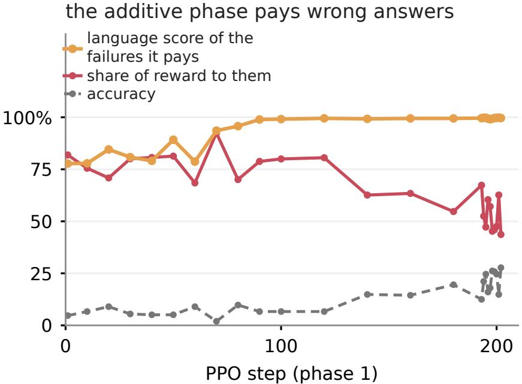  
Fi ure S1: The reward led er of the additive hase, recorded on trainin rollouts of the Qwen3-4B tar et-lan ua e rocedure Among the incorrect trajectories the objective still pays, the implied language score rises to near 100% while their accuracy stays low, and they absorb 44%–82% of all reward paid across the recorded steps, peaking at 92% early in the phase. The gated phase removes this by construction, which is why the procedure switches. Markers are the recorded steps; the last ten are consecutive.

## C Additional Results

## C.1 SFT controls and detailed paired results

Table S8 summarizes the controls, Table S9 gives the per-language paired deltas behind them, and Table S10 separates the termination change into looping and budget exhaustion.
<table><tr><td>comparison</td><td>∆J@1 (NE)</td><td> $\Delta C _ { \mathrm { e n } }$ </td><td> $\Delta ( 1 - T ) _ { \mathrm { N E } }$ </td></tr><tr><td> $\mathrm { Q w e n 3 - 4 B }  \mathrm { S F T }$ </td><td>+31.6%</td><td>-8.8%</td><td>+16.4%</td></tr><tr><td> $\mathrm { Q w e n 3 - 8 B \to S F T }$ </td><td>+45.5%</td><td>-6.8%</td><td>+12.4%</td></tr><tr><td>Qwen3-4B → English-only</td><td>-5.7%</td><td>-9.2%</td><td>+4.0%</td></tr><tr><td>mixed — spec. (own)</td><td>[−0.03, +0.03]</td><td></td><td>一</td></tr><tr><td>mixed – spec. (en)</td><td></td><td> $[ + 0 . 0 1 , + 0 . 0 5 ]$ </td><td>一</td></tr></table>

Table S8: Compact SFT control summary. NE denotes the five primary non-English languages. The mixed–specialist rows compare the Qwen3-4B multilingual SFT endpoint with the five Qwen3-4B single-language specialists, paired on each specialist’s own language or on English.

<table><tr><td>edge</td><td>lang</td><td>∆J@1</td><td>∆C</td><td>∆term. fail.</td></tr><tr><td rowspan="5">Qwen3-4B → multilingual SFT</td><td>en</td><td>-8.7%</td><td>-8.8%</td><td>-3.6%</td></tr><tr><td>zh</td><td>-16.5%*</td><td>-16.6%*</td><td>+17.4%*</td></tr><tr><td>es</td><td>+64.5%* 米</td><td>-14.8% *</td><td>+7.6%*</td></tr><tr><td>fr</td><td>+64.5%*</td><td>-13.9%* *</td><td>+10.3%*</td></tr><tr><td>ar</td><td>+53.6%*</td><td>-22.1%* *</td><td>+27.9%*</td></tr><tr><td rowspan="5">Qwen3-8B → multilingual SFT (8B)</td><td>ru</td><td>-7.9%*</td><td>-6.2%*</td><td>+18.8%*</td></tr><tr><td>en zh</td><td>-6.2% -10.7%*</td><td>-6.8% -10.8%*</td><td>-6.3% +11.1%*</td></tr><tr><td>es</td><td>+68.4%* T</td><td>-11.3% 米</td><td>+4.9%*</td></tr><tr><td>fr</td><td>+67.1%*</td><td>-11.9%* *</td><td>+8.6%*</td></tr><tr><td>ar</td><td>+60.2%* </td><td>-15.4%* *</td><td>+24.2%*</td></tr><tr><td rowspan="5">Qwen3-4B → English-only SFT</td><td>ru</td><td>+42.2%* *</td><td>-11.2%*</td><td>+13.0%* *</td></tr><tr><td>en</td><td>-9.0%</td><td>-9.2%</td><td>-2.6%</td></tr><tr><td>zh</td><td>-13.1%*</td><td>-13.1%*</td><td>+8.2%*</td></tr><tr><td>es</td><td>-0.1%</td><td>-13.0% *</td><td>-1.2%</td></tr><tr><td>fr</td><td>+0.0%</td><td>-11.1% 长</td><td>+0.1%</td></tr><tr><td></td><td>ar</td><td>+0.0%</td><td>-10.7% *</td><td>-1.7%</td></tr><tr><td></td><td>ru</td><td>-15.1%*</td><td>-14.9% *</td><td>+14.5%*</td></tr></table>

Table S9: Per-lan ua e aired deltas for the three SFT-side com arisons (∗: si nificant after Holm correction). The En lish default languages drive the delivery gains, while correctness declines in English as well as the target languages.

<table><tr><td></td><td>English</td><td>Chinese</td><td>Spanish</td><td>French</td><td>Arabic</td><td>Russian</td></tr><tr><td colspan="7">Qwen3-4B → multilingual SFT-4B</td></tr><tr><td>looping</td><td>+0.002</td><td>+0.175*</td><td>+0.062*</td><td>+0.088*</td><td>+0.259*</td><td>+0.173*</td></tr><tr><td>ran out of room</td><td>-0.037</td><td>-0.001</td><td>+0.013</td><td>+0.014</td><td>+0.020</td><td>+0.014</td></tr><tr><td colspan="7">Qwen3-8B → multilingual SFT-8B</td></tr><tr><td>looping</td><td>+0.004</td><td>+0.121*</td><td>+0.047*</td><td>+0.082*</td><td>+0.258*</td><td>+0.141*</td></tr><tr><td>ran out of room</td><td>-0.067</td><td>-0.011</td><td>+0.002</td><td>+0.004</td><td>-0.016</td><td>-0.011</td></tr><tr><td colspan="7">Qwen3-4B → English-only SFT-4B</td></tr><tr><td>looping</td><td>+0.003</td><td>+0.080*</td><td>+0.001</td><td>+0.008*</td><td>+0.000</td><td>+0.149*</td></tr><tr><td>ran out of room</td><td>-0.029</td><td>+0.002</td><td>-0.013</td><td>-0.007</td><td>-0.017</td><td>-0.004</td></tr></table>

Table S10: Paired changes in termination failures. Asterisks mark Holm-corrected significance within each five-language comparison family.

## C.2 Is a fluent wrong answer better than a loop?

The outcome composition in the main text invites the objection: delivered samples stay at 60% while the 21% that never finished becomes in-language error, 18% → 39%. We do not claim those failures became successes—under J they are failures either way, which is why J does not move—but they difer in cost. A loop consumes the whole 24,576-token budget and returns nothing; a terminated wrong answer is short, can be checked or retried, and is what makes the eficiency gain possible. The counterweight is that a confident wrong answer may mislead more easily than an obvious non-answer, and no reward geometr fixes that.

## C.3 End-to-end delivery and state distributions

<table><tr><td></td><td>English</td><td>Chinese</td><td>Spanish</td><td>French</td><td>Arabic</td><td>Russian</td><td>non-English</td></tr><tr><td>Qwen3-4B</td><td>92.9%</td><td>91.4%</td><td>1.4%</td><td>0.0%</td><td>0.0%</td><td>85.7%</td><td>35.7%</td></tr><tr><td>+ SFT</td><td>94.3%</td><td>85.7%</td><td>87.1%</td><td>87.1%</td><td>80.0%</td><td>82.9%</td><td>84.6%</td></tr><tr><td>RL: gated</td><td>85.7%</td><td>81.4%</td><td>80.0%</td><td>87.1%</td><td>80.0%</td><td>80.0%</td><td>81.7%</td></tr><tr><td>Qwen3-8B</td><td>92.9%</td><td>91.4%</td><td>0.0%</td><td>0.0%</td><td>0.0%</td><td>61.4%</td><td>30.6%</td></tr><tr><td>+ SFT (8B)</td><td>94.3%</td><td>85.7%</td><td>88.6%</td><td>84.3%</td><td>85.7%</td><td>87.1%</td><td>86.3%</td></tr></table>

Table S11: J@16 through the main lineage. The upper block is Qwen3-4B (released, + six-language SFT, + correctness-gated RL) and the lower block Qwen3-8B (released, + SFT); no RL was run at 8B. The non-English column averages the five primary non-English languages.

<table><tr><td>diagnostic</td><td>additive endpoint</td><td>gated continuation</td><td>scope</td></tr><tr><td>task-language component</td><td> $. 7 C _ { \mathrm { t r } } + . 3 \ell _ { \mathrm { t r } }$ </td><td> $C _ { \mathrm { t r } } ( . 7 \mathrm { + . 3 \ell _ { t r } } )$ </td><td>training configuration</td></tr><tr><td>positive reward mass on wrong</td><td>63.1%</td><td>0.0%</td><td>recorded rollouts</td></tr><tr><td>correct and target-language</td><td>20.5%</td><td>43.8%</td><td>late training rollouts</td></tr><tr><td>mean response tokens</td><td>1960</td><td>1983</td><td>late training rollouts</td></tr><tr><td>AIME accuracy</td><td>5.0%</td><td>17.2%</td><td>monitored development</td></tr></table>

Table S12: Reward-accounting diagnostics from recorded PPO rollouts of the two Qwen3-4B correctness–language phases—the additive phase, and the gated phase continuing it from step 200—of one procedure initialized from the Qwen3-4B multilingual SFT checkpoint. These values describe training dynamics, not held-out capability.  
Table S11 tracks J@16 through the lineage and Table S12 reports the reward-accounting diagnostics behind the RL section.

Dificulty is preserved across the translated prompts. Translation could in principle make an item easier or harder rather than merely restate it. Table S13 correlates problem-level correctness of the released Qwen3-4B across all fifteen language pairs of the 70-problem evaluation set: Pearson r ranges from 0.819 to 0.988 with a mean of 0.907, so the same problems are hard in ever lan ua e. The weakest airs all involve Russian, which is also the lan ua e with the lar est encodin factor.
<table><tr><td></td><td>en</td><td>zh</td><td>es</td><td>fr</td><td>ar</td><td>ru</td></tr><tr><td>en</td><td></td><td>.92</td><td>.97</td><td>.97</td><td>.93</td><td>.86</td></tr><tr><td>zh</td><td>.92</td><td>一</td><td>.90</td><td>.92</td><td>.87</td><td>.87</td></tr><tr><td>es</td><td>.97</td><td>.90</td><td>一</td><td>.99</td><td>.91</td><td>.88</td></tr><tr><td>fr</td><td>.97</td><td>.92</td><td>.99</td><td>一</td><td>.91</td><td>.88</td></tr><tr><td>ar</td><td>.93</td><td>.87</td><td>.91</td><td>.91</td><td>一</td><td>.82</td></tr><tr><td>ru</td><td>.86</td><td>.87</td><td>.88</td><td>.88</td><td>.82</td><td></td></tr></table>

Table S13: Pearson correlation of problem-level correctness between language versions of the same 70 items, measured on the released Qwen3-4B. High values mean the translation preserved which problems are dificult.

Overlap between the RL corpus and the evaluation set. Fourteen of the 70 evaluation problems also appear in the 16,754- prompt RL corpus. The overlap is concentrated in the older half of the evaluation set: 13 of the 40 AMC-23 problems, against 1 of the 30 AIME-2026 roblems. The su ervised arent never saw that cor us so its own dro when those roblems are removed measures how much easier the are for ever end oint and the RL end oints must be read a ainst it (Table S14). Restrictin to the clean 56 lowers J@16 by 2.4 points at the SFT parent and by 0.4–3.5 points at the RL endpoints. The largest excess over the parent is 1.1 points, less than half the benchmark efect itself, and the three RL arms share the same overlapping items, so it cannot account for the diferences between them.

<table><tr><td>endpoint</td><td>RL corpus</td><td>J@16 (70)</td><td>J@16 (56)</td><td>change</td><td>excess over SFT</td></tr><tr><td>Qwen3-4B</td><td>no</td><td>35.7%</td><td>34.3%</td><td>-1.4%</td><td></td></tr><tr><td>+ SFT</td><td>no</td><td>84.6%</td><td>82.1%</td><td>-2.4%</td><td></td></tr><tr><td>RL: correctness only</td><td>yes</td><td>15.4%</td><td>15.0%</td><td>-0.4%</td><td>+2.0%</td></tr><tr><td>RL: additive</td><td>yes</td><td>83.4%</td><td>80.4%</td><td>-3.1%</td><td>-0.6%</td></tr><tr><td>RL: gated</td><td>yes</td><td>81.7%</td><td>78.2%</td><td>-3.5%</td><td>-1.1%</td></tr></table>

Table S14: J@16 on all 70 evaluation problems and on the 56 that do not appear in the RL training corpus, averaged over the five primary non-English languages. “Excess over SFT” is the endpoint’s signed change minus the supervised parent’s signed change; a negative value would indicate a memorization advantage.

Complete state distributions. Table S15 lists J@16 for every endpoint beside the correctness it does not deliver. The accompanying artifact reports every sample in a disjoint state ledger: delivered, correct in another language, correct but unfinished, in-language error, in-language non-termination, English non-termination, English error, or other failure. The released tables retain both per-language rows and endpoint aggregates, so the compact summaries here can be reproduced without relying on rounded values.
<table><tr><td>endpoint</td><td></td><td>en</td><td>zh</td><td>es</td><td>fr</td><td>ar</td><td>ru</td></tr><tr><td>Qwen3-4B</td><td></td><td>92.9% (0.0%)</td><td>91.4% (0.0%)</td><td>1.4% (90.0%)</td><td>0.0% (92.9%)</td><td>0.0% (91.4%)</td><td>85.7% (0.0%)</td></tr><tr><td>Qwen3-8B</td><td></td><td>92.9% (0.0%)</td><td>91.4% (0.0%)</td><td>0.0% (94.3%)</td><td>0.0% (92.9%)</td><td>0.0% (92.9%)</td><td>61.4% (30.0%)</td></tr><tr><td>multilingual</td><td>SFT</td><td>94.3% (0.0%)</td><td>85.7% (0.0%)</td><td>87.1% (0.0%)</td><td>87.1% (0.0%)</td><td>80.0% (1.4%)</td><td>82.9% (1.4%)</td></tr><tr><td>multilingual</td><td>SFT (8B)</td><td>94.3% (0.0%)</td><td>85.7% (0.0%)</td><td>88.6% (0.0%)</td><td>84.3% (0.0%)</td><td>85.7% (0.0%)</td><td>87.1% (2.9%)</td></tr><tr><td>English-only SFT</td><td></td><td>90.0% (0.0%)</td><td>84.3% (0.0%)</td><td>0.0% (85.7%)</td><td>0.0% (87.1%)</td><td>0.0% (85.7%)</td><td>78.6% (0.0%)</td></tr><tr><td>specialist zh</td><td></td><td>88.6% (0.0%)</td><td>84.3% (0.0%)</td><td></td><td></td><td></td><td></td></tr><tr><td>specialist</td><td>es</td><td>88.6% (0.0%)</td><td></td><td>88.6% (0.0%)</td><td></td><td></td><td></td></tr><tr><td>specialist</td><td>fr</td><td>91.4% (0.0%)</td><td></td><td></td><td>84.3% (0.0%)</td><td></td><td></td></tr><tr><td>specialist ar</td><td></td><td>90.0% (0.0%)</td><td></td><td></td><td></td><td>82.9% (0.0%)</td><td></td></tr><tr><td>specialist ru</td><td></td><td>88.6% (0.0%)</td><td></td><td></td><td></td><td></td><td>84.3% (0.0%)</td></tr><tr><td>RL: correctness only</td><td></td><td>81.4% (0.0%)</td><td>70.0% (12.9%)</td><td>0.0% (81.4%)</td><td>0.0% (82.9%)</td><td>0.0% (87.1%)</td><td>7.1% (77.1%)</td></tr><tr><td>RL: additive</td><td></td><td>85.7% (0.0%)</td><td>82.9% (0.0%)</td><td>85.7% (0.0%)</td><td>85.7% (0.0%)</td><td>80.0% (0.0%)</td><td>82.9% (0.0%)</td></tr><tr><td>RL: gated</td><td></td><td>85.7% (0.0%)</td><td>81.4% (0.0%)</td><td>80.0% (0.0%)</td><td>87.1% (0.0%)</td><td>80.0% (0.0%)</td><td>80.0% (0.0%)</td></tr></table>

Table S15: J@16 for all endpoints, with C@16 − J@16 in parentheses. Every endpoint is a Qwen3-4B derivative except the two rows named Qwen3-8B and multilingual SFT (8B); “multilingual SFT” is the six-language Qwen3-4B checkpoint from which the correctness-only and additive runs start. The additive and gated rows complete the endpoint ledger and are not a matched reward-form comparison.

## C.4 Eficiency

We report both the content cost of a delivered answer and delivery eficiency, which counts all attempted tokens (Figure S2). On the Qwen3-4B SFT endpoint, encoding-adjusted content cost is only 1.02–1.14 times English across the five target languages; on Qwen3-8B it is near parity. Delivery eficiency remains lower where failure rates are higher, and improves after RL reduces non-termination. Thus successful target-language traces are not the primary source of the initial access gap; failed attempts are part of the end-to-end cost.

Every eficiency number in four accounting conventions. Two choices are made when tokens are counted, and both change the number. The first is whether to divide out the per-language encoding factor: adjusted tokens answer whether the model produced more reasoning, whereas raw tokens are what a user is billed for. The second is whether to charge the tokens of attempts that were never delivered: the all-attempt convention charges them, the J-only convention does not. The main paper reports all four for every stage, and Table S16 resolves them by language. The unit is the same throughout—joint successes per 1,000 tokens, expressed relative to the same endpoint’s English—so the conventions are directly comparable, and they are linked exactly by

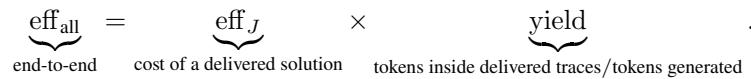

Three facts follow. First, the parity claimed at the gated endpoint is specific to adjusted tokens: in raw tokens the same endpoint reaches 87% of English, and the residual is exactly the per-language encoding factor. Second, conditioning on delivery removes the penalty entirely: a delivered non-English solution costs 117% of English eficiency in adjusted tokens and 100% in raw tokens at the gated endpoint, and the Qwen3-8B SFT endpoint reproduces this at 111% and 94%. Third, the end-to-end gap is therefore carried by yield rather than by length. Table S17 gives yield per language: at the released Qwen3-4B checkpoint, Spanish, French, and Arabic convert 0.0%–0.1% of their generated tokens into a delivered solution, against 59.7% in English, and after SFT the lowest-yield languages are the ones that loop most.

The same distinction applies to content cost, which the main text reports in adjusted tokens. In raw tokens, the paired content cost of a delivered solution at the Qwen3-4B SFT endpoint is 1.03–1.50 times English, which is the tokenizer-fertility efect that prior work already documents; the encoding-adjusted values in the same rows are 1.02–1.14. We therefore make the convention explicit wherever the number appears rather than presenting either as the eficiency of the model. Full per-language values in both conventions, including intervals, are released with analysis/A11\_efficiency\_split (adjusted content and all-attempt delivery) and analysis/A29\_token\_efficiency (all four conventions, yield, and raw content cost).
<table><tr><td>stage</td><td>tokens charged</td><td>zh</td><td>es</td><td>fr</td><td>ar</td><td>ru</td></tr><tr><td>Qwen3-4B</td><td>all attempts</td><td>109 (108)</td><td>0 (0)</td><td>0 (0)</td><td>0 (0)</td><td>128 (98)</td></tr><tr><td rowspan="2">+ SFT</td><td>J-only</td><td>131 (131)</td><td>†</td><td></td><td></td><td>169 (128)</td></tr><tr><td>all attempts</td><td>64 (63)</td><td>84 (71)</td><td>83 (69)</td><td>59 (48)</td><td>77 (59)</td></tr><tr><td rowspan="2">RL: correctness only</td><td>J-only</td><td>121 (120)</td><td>104 (88)</td><td>103 (86)</td><td>113 (92)</td><td>108 (82)</td></tr><tr><td>all attempts</td><td>44 (44)</td><td>0 (0)</td><td>0 (0)</td><td>0 (0)</td><td>1 (1)</td></tr><tr><td rowspan="2">RL: additive</td><td>J-only</td><td>134 (134)</td><td></td><td></td><td></td><td>†</td></tr><tr><td>all attempts</td><td>101 (101)</td><td>102 (86)</td><td>99 (83)</td><td>94 (76)</td><td>101 (77)</td></tr><tr><td rowspan="2">RL: gated</td><td>J-only</td><td>115 (114)</td><td>103 (87)</td><td>102 (86)</td><td>102 (83)</td><td>101 (77)</td></tr><tr><td>all attempts</td><td>100 (99)</td><td>109 (92)</td><td>108 (90)</td><td>91 (74)</td><td>105 (80)</td></tr><tr><td rowspan="2">Qwen3-8B</td><td>J-only</td><td>123 (122)</td><td>118 (100)</td><td>114 (95)</td><td>117 (96)</td><td>113 (86)</td></tr><tr><td>all attempts</td><td>99 (99)</td><td>0 (0)</td><td>0 (0)</td><td>0 (0)</td><td>35 (32)</td></tr><tr><td rowspan="2">+ SFT (8B)</td><td>J-only</td><td>120 (120)</td><td></td><td></td><td></td><td>163 (124)</td></tr><tr><td>all attempts</td><td>70 (70)</td><td>89 (75)</td><td>82 (69)</td><td>65 (53)</td><td>82 (62)</td></tr><tr><td></td><td>J-only</td><td>112 (112)</td><td>110 (93)</td><td>109 (91)</td><td>111 (91)</td><td>110 (84)</td></tr></table>

Table S16: Delivery eficiency by language, as a percentage of the same endpoint’s English eficiency. Each cell is encoding- adjusted, with the raw-token value in parentheses. † marks a J-only cell with fewer than 20 delivered samples out of 1,120, which is too thin to report; – marks zero delivered samples. Chinese is nearly unafected by the adjustment because its encoding factor is 1.003, whereas Russian is afected most at 1.314.

<table><tr><td>stage</td><td>en</td><td>zh</td><td>es</td><td>fr</td><td>ar</td><td>ru</td></tr><tr><td>Qwen3-4B</td><td>59.7</td><td>49.4</td><td>0.1</td><td>0.0</td><td>0.0</td><td>45.7</td></tr><tr><td>+ SFT</td><td>45.9</td><td>24.2</td><td>37.0</td><td>37.0</td><td>24.0</td><td>32.9</td></tr><tr><td>RL: correctness only</td><td>37.1</td><td>12.1</td><td>0.0</td><td>0.0</td><td>0.0</td><td>0.5</td></tr><tr><td>RL: additive</td><td>35.6</td><td>31.4</td><td>35.4</td><td>34.3</td><td>32.8</td><td>35.4</td></tr><tr><td>RL: gated</td><td>39.8</td><td>32.4</td><td>36.7</td><td>37.6</td><td>31.0</td><td>36.8</td></tr><tr><td>Qwen3-8B</td><td>61.5</td><td>50.8</td><td>0.0</td><td>0.0</td><td>0.0</td><td>15.6</td></tr><tr><td>+ SFT (8B)</td><td>51.6</td><td>32.2</td><td>41.8</td><td>38.8</td><td>30.2</td><td>38.4</td></tr></table>

Table S17: Token yield: the percentage of generated tokens that sit inside a delivered solution, by language and stage, in raw tokens. This quantity is dimensionless and tokenizer-independent, and it is the factor that separates the two conventions in the main paper’s eficiency table.

## D Prompts and a Trace Case Study

## D.1 Forced-target-language evaluation prompt

Every language uses the same three-part template, translated in full rather than appending an English instruction to a localized problem. The literal token Answer: is kept constant so that final-answer extraction does not depend on language. The model’s standard chat template is then applied with thinking enabled.

Localized instruction. Solve the following mathematics problem step by step, reasoning entirely in language. The last line of your response must have the form Answer: \$Answer, where \$Answer is the answer to the problem.

Localized problem. {parallel problem statement}

Localized sufix. Remember to put your answer on its own line after Answer:.

## D.2 The same problem in six languages

Figures S3 and S4 show what the readouts correspond to in text. They take a single evaluation item, give the localized problem in all six languages, and print the opening of the visible reasoning produced by the released checkpoint, the supervised checkpoint, and the gated endpoint for the three languages where the released model pivots to English. The excerpts are verbatim, truncated only for length.

(a) content cost vs English (successful traces)  
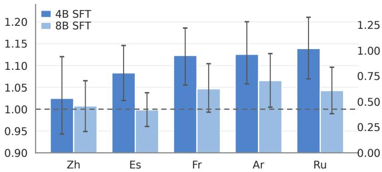

(b) delivery eficiency vs English (all attempts)  
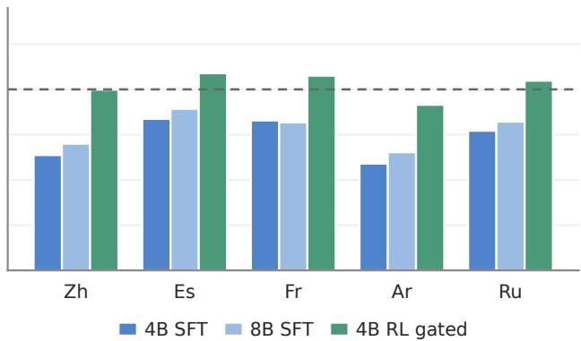  
Figure S2: Encoding-adjusted content cost among problem-matched delivered traces (a) and all-attempt delivery eficiency (b), both relative to English at the same endpoint. Bars are the Qwen3-4B multilingual SFT endpoint, the Qwen3-8B multilingual SFT endpoint, and the Qwen3-4B correctness-gated RL endpoint. Content is close to parity at 8B, while end-to-end eficiency tracks failed delivery and reaches near parity at the correctness-gated endpoint. The main paper’s eficiency table gives the same quantities without the encoding adjustment and conditioned on delivered traces.

The item was chosen because every phenomenon the paper measures occurs on it at once. At release, the Spanish, French, and Arabic answers are correct and written in English, so C = 1 but L = 0 and nothing is delivered; the Chinese and Russian answers are alread delivered. After su ervised fine-tunin , all five are written in the tar et lan ua e, but the French trace takes 12,568 tokens and is scored as looping, and the Arabic trace runs to the 24,576-token cap with a repetition score of 99% and never produces an answer. The gated endpoint delivers all five in 536–929 tokens, fewer on average than the released model used to answer these items in En lish. A reader who onl saw final-answer accurac would count the release row as a success and the Arabic supervised row as an ordinary wrong answer.

The second page prints the loop itself rather than a score for it. In the Arabic supervised trace, one sentence—a restatement of the problem setup, phrased as a question—occurs 442 times; in the French trace the repeated sentence occurs 25 times. Both traces begin by setting the problem up correctly, which is why this failure is invisible to a metric that reads only the final answer.

These two a es cannot establish a rate, and this item is not a random draw: it was selected to show the transitions to ether. The statistics behind each transition are in the main results.

## One problem, six languages, three endpoints (1 of 2)

Evaluation item amc23\_\_022, first sample. Every excerpt is verbatim model output, truncated only where marked; the correct answer is 7. Each excerpt is drawn in the script the model actually produced, which is not always the script of the prompt.

## A. The same problem, localized

Every prompt states the problem in the target language and asks for reasoning in that language; the answer-format instruction is localized as well. Openings of the six problem statements:

## English

Mrs. Jones is pouring orange juice into four identical glasses for her four sons. She fills the first three glasses completely but runs out of juice when the fourth glass is only 1/3 full. What fraction of a glass must Mrs. Jones pour f...

## Chinese

琼斯太太正在将橙汁倒入四个相同的玻璃杯中，准备给她的四个儿子。她将前三个玻璃杯倒满，但倒第四个杯子时，只倒了1/3满就没有果汁了。为了使四个玻璃杯中的果汁量相等，琼斯太太需要从前三个杯子中各倒出多少果汁到第四个杯子中？最终答案可以写成m/n的形式，其中m和n是互质的正整数。求m+...

## Spanish

La señora Jones está sirviendo jugo de naranja en cuatro vasos idénticos para sus cuatro hijos. Llena los primeros tres vasos por completo, pero se queda sin jugo cuando el cuarto vaso está solo 1/3 lleno. ¿Qué fracción de un vaso debe...

## French

Mme Jones verse du jus d'orange dans quatre verres identiques pour ses quatre fils. Elle remplit complètement les trois premiers verres mais manque de jus lorsque le quatrième verre n'est qu'à 1/3 plein. Quelle fraction d'un verre Mme J...

## Arabic

ديسلا ىلولأا ةثلاثلا بباوكلأا لأمت .ةعبرلأا اهئانبلأ ةقباطتم بباوكأأ ةعبرأأ يف لاقتربلا ريصع بصت زنوج ة

وكي امدنع ريصعلا دفني نكلو لماكلاب ييذلا ببوكلا نم رسكلا ام 1/3. رادقمب طقف ائلتمم عبارلا ببوكلا ن

...سلا ىلع بجي

## Russian

Миссис Джонс наливает апельсиновый сок в четыре одинаковых стакана для своих четырех сыновей. Она наполняет первые три стакана полностью, но сока не хватает, когда четвертый стакан заполнен только на 1/3. Какую часть стакана миссис Джон...

## B. What each endpoint produces

Opening of the visible reasoning. At release the Spanish and French answers are correct but written in English, so neither is delivered. After supervised fine-tuning both are in the target language, but the French trace no longer terminates cleanly. The gated endpoint delivers both, in fewer tokens than the released model needed to answer in English. Chinese and Russian are delivered at every stage and are omitted for space.

## Spanish prompt

Released Qwen3-4B

Okay, let's try to figure out this problem step by step. So, the problem is about Mrs. Jones serving orange juice in four identical glasses for her four kids. She fills the first three glasses completely, but when she gets to th... C=1 L=0 T=1 J=0 2,159 tokens, repetition 0.70

## + multilingual SFT

Okay, veamos. La señora Jones tiene cuatro vasos idénticos. Llena los primeros tres completamente, pero cuando trata de llenar el cuarto, solo tiene un tercio de su capacidad. Necesitamos averiguar qué fracción de cada uno de lo... C=1 L=1 T=1 J=1 1,842 tokens, repetition 0.70

\+ gated RL

Okay, veamos. La Sra. Jones tiene cuatro vasos. Llena los primeros tres completamente, y el cuarto está lleno hasta 1/3. Necesitamos averiguar qué fracción de cada uno de los primeros tres vasos debe verter a la cuarta taza para... C=1 L=1 T=1 J=1 702 tokens, repetition 0.58

## French prompt

Released Qwen3-4B

Okay, let me try to solve this problem step by step. So, Mrs. Jones has four identical glasses for her four sons. She fills the first three completely, but when she tries to fill the fourth, it's only 1/3 full. The question is

C=1 L=0 T=1 J=0

881 tokens, repetition 0.62

\+ multilingual SFT

Okay, voyons. Donc Mme Jones verse du jus d'orange dans quatre verres identiques pour ses quatre fils. Elle remplit complètement les trois premiers verres, mais lorsqu'elle verse dans le quatrième, elle n'arrive qu'à en faire un... C=1 L=1 T=0 J=0 12,568 tokens, repetition 0.87

\+ gated RL

Okay, voyons. Mme Jones a quatre verres identiques. Elle remplit les trois premiers verres completement, mais le quatrième n'est qu'à 1/3 plein. Nous devons trouver la fraction qu'elle doit transférer de chacun des trois premier.

C=1 L=1 T=1 J=1

929 tokens, repetition 0.60

Figure S3: One evaluation item (amc23\_\_022) through the lineage: the localized problem in six languages, and the Spanish and French traces at three endpoints. Chinese and Arabic are drawn with Noto fonts inside the figure because the manuscript is compiled with pdflatex, which has no font for those scripts on our system; the script each excerpt appears in is the script the model actually produced.

C. What the termination failure actually is   
A repetition score reports that a trace loops; it does not show the loop. Below is the sentence each post-SFT trace repeats   
most often, printed as it appears in the output, with the number of times it recurs.   
Arabic, after multilingual SFT: this sentence occurs 442 times   
ييوتحت ةعبارلاو ةثلاثلا ببوكلأا نكل ،لماكلاب ةئلتمم ةثلاثلا ىلولأا بباوكلأا امبر ،رظتنا ىتح بيلحلا ىلع   
ييوتحت ةعبارلاو ةثلاثلا بباوكلأا نكل ،لماكلاب ةئلتمم ةثلاثلا ىلولأا بباوكلأا امبر ،رظتنا ؟1/3 بيلحلا ىلع   
يوتحت ةعبارلاو ةثلاثلا بباوكلأا نكل ،لماكلاب ةئلتمم ةثلاثلا ىلولأا بباوكلأا امبر ،رظتنا ؟1/3 ىتح ىلع   
ييوتحت ةعبارلاو ةثلاثلا بباوكلأا نكل ،لماكلاب ةئلتمم ةثلاثلا ىلولأا بباوكلأا امبر ،رظتنا ؟1/3 ىتح بيلحلا   
...ع   
French, after multilingual SFT: this sentence occurs 25 times   
Donc le total de jus est de 1 + 1 + 1 + 1/3 = 10/3. Si tous les verres doivent être égaux, chaque verre devrait   
avoir 10/3 divisé par 4, qui est 5/6. Donc chaque verre doit avoir 5/6 de jus. Le premier, deuxième et troisième   
verres ont chacun 1 unité, ce qui est plus de 5/6. Donc chaque verre doit perdre 1 - 5/6 = 1/6 de jus. Le quatrième   
verre a 1/3, ce qui est moins de 5/6, donc il doit gagner 5/6 - 1/3 = 5/6 - 2/6 = 3/6 = 1/2 de jus. Donc le total de   
ju...   
Arabic, after multilingual SFT: the last words before the cap   
ييوتحت ةعبارلاو ةثلاثلا ببوكلأا نكل ،لماكلاب ةئلتمم ةثا أأ نكمي لا اذه ؟1/3 ىتح بيلحلا ىلع وكي ن كلذك ن   
ييوتحت ةعبارلاو ةثلاثلا ببوكلأا نكل ،لماكلاب ةئلتمم ةثلاثلا ىلولأا بباوكلأا امبر ،رظتنا ىتح بيلحلا ىلع   
أأ نكمي لا اذه ؟1/3 وكي ن ةثلاثلا ببوكلأا نكل ،لماكلاب ةئلتمم ةثلاثلا ىلولأا بباوكلأا امبر ،رظتنا .كلذك ن   
...و   
The Arabic trace reaches the 24,576-token cap with a repetition score of 0.99 and never produces an answer, so it scores C=0   
and T=0. The French trace does stop, but only after 12,568 tokens against 929 at the gated endpoint, with repetition 0.87   
against 0.60. Neither failure is visible in final-answer accuracy: both traces begin by setting the problem up correctly,   
and the Arabic one states the right relation before it starts repeating. Separating termination from correctness is what the   
T condition is for.

One problem, six languages, three endpoints (2 of 2)   
Continued from the previous page. Arabic is the most severe case: the released model answers an Arabic prompt in English, and after supervised fine-tuning the trace never stops.

B. What each endpoint produces (continued)   
Arabic prompt   
Released Qwen3-4B   
Okay, so the problem is about Mrs. Jones pouring orange juice into four identical cups for her four children. The   
first three cups are completely filled, but the fourth cup only has 1/3 of its capacity when the juice runs out. The   
question is asking what fraction of the juice from each of the first three cups should be poured into the fourth...   
C=1 L=0 T=1 J=0 1,648 tokens, repetition 0.68   
+ multilingual SFT   
إإ .ىرن انعد ،انسح ذ ديسلا ن ىلولأا ةثلاثلا بباوكلأا لأمت .ةقباطتم بباوكأأ ةعبرأأ يف لاقتربلا ريصع بصت زنوج ة   
،لماكلاب ةئلتمم ىلولأا ةثلاثلا بباوكلأا ،لا ،رظتنا ؟بيلحلا نم ةعبارلاو ةثلاثلا بباوكلأا نكل ،لماكلاب   
إإ ةلأسملا لوقت ،لا ،رظتنا ...ةعبارلاو ةثلاثلا بباوكلأاو نكل ،لماكلاب ةئلتمم ىلولأا ةثلاثلا بباوكلأا ن   
...ا   
C=0 L=1 T=0 J=0 24,576 tokens, repetition 0.99, hit the 24,576-token cap   
+ gated RL   
ديسلا لأمت .ىرن انعد ،انسح طقف لأمت ةعبارلاو ،امامت ىلولأا ةثلاثلا لأمت .ةيواستم بباوكأأ ةعبرأأ زنوج ة   
أأ بجي مك ديدحت ىلإإ ججاتحن 1/3. .ةيواستم اهعيمج لعجل ةعبارلا ىلإإ ىلولأا ةثلاثلا بباوكلأا نم لك نم لقنن ن   
ض ضرتفن انعد أأ ييوتحي ببوك لك ن ةدحو 1 مجح ىلع إإ .ة ذذ ييوتحي امهنم لك ثلاثلاو يناثلاو لولأا ببوكلا ن 1 ىلع   
ةدحو ...ة   
C=1 L=1 T=1 J=1 880 tokens, repetition 0.72  
Figure S4: The same item continued: the Arabic traces at three endpoints, and the literal content of the post-SFT termination failure with the number of times each repeated sentence recurs.