# Which papyrus HTR is good enough? Character-error-rate tolerance of four papyrological tasks on Greek texts

Anton Repushko1\* and Elena Chepel2

1\*Independent Researcher, Berlin, Germany. 2University of Vienna, Vienna, Austria.

\*Corresponding author(s). E-mail(s): anton@repushko.com; Contributing authors: elena.chepel@univie.ac.at;

## Abstract

Purpose: Most Greek papyri are unpublished and undigitised; a handwritten text recognition (HTR) pipeline that transcribes them automatically would allow scholars to find new ancient documents and literary works which remained unread and unknown before. Recognition systems for Ancient Greek papyri are in statu nascendi, and how accurate such a system must be for a certain papyrological task has so far been unexamined. To answer this question and set a benchmark for HTR systems of Greek papyri, we test various character error rates of HTR against four papyrological tasks, using published editions of papyri as ground truth. Methods: From 63,846 current editions of Greek texts in papyri.info, we imitate a letters-only “perfect HTR” output text by removing the editorial layer, then degrade it with a seeded algorithm to exact CERs of 1–50%, with lost lines and four error-shape variants. Using these data, we train several small models (TF-IDF, fastText, a character CNN, ByT5- small) for establishing the type of the document, dating, documentary-versus-literary classification, and apply eight search methods for keyword search. We measure the diference between these models being clean-trained and retrained on a specific CER level, and the evaluation is further diferentiated across various CERs. Results: Tolerance difers between tasks. On average, when using clean-trained models, documentary-versus-literary classification keeps 90% of its metric up to 20% CER. For establishing the type of document, the same 90% of metric is achieved with CER up to 7.5%; for subtypes and search – up to 5%; and for dating – only up to 3%. When the model is retrained using text that contains character errors, the severe performance degradation that normally occurs when the error rate exceeds 15% is largely eliminated. Models are usually more tolerant of concentrated damage in a long document than of small errors spread throughout a short piece of text. Conclusion: The study gives a CER target for each of the four papyrological tasks and shows that models trained on noisy text make text recognition in its current imperfect state useful for these tasks.

Keywords: Ancient Greek papyri, handwritten text recognition, character error rate, noise robustness, text classification, information retrieval

## 1 Introduction

Papyri are the largest body of first-hand written evidence for the ancient Mediterranean, and most of them have never been read. Large collections worldwide hold in total between 1,000,000 and 1,500,000 excavated fragments, of which less than 10% has been edited and published despite more than a century of papyrological work [35]. Each edition requires days and sometimes weeks of expert labour: the papyrologist reads a damaged, often cursive text written without word division, restores lost passages, expands abbreviations and normalises spellings, and only after the text is established in this way can it be analysed historically, compared with other documents and added to databases. The unedited majority of papyri remain invisible to digital tools, and a scholar who wants to know whether a formula, a name or a certain document type occurs among the unpublished papyri has no way to ask.

Automatic transcription would change this. If handwritten text recognition (HTR) could turn images of unedited papyri into text, even though imperfect, this text layer could be searched for parallels, sorted by type and date, before each single fragment receives a proper papyrological edition, and the scarce expert attention could go where the automatic pass says it matters. In the last few years, the ICDAR 2023 competition on detecting and recognising Greek letters on papyri [28] and its follow-ups [34], citizen-science character datasets [31], end-to-end systems such as Anagnostes [4], and, for the printed side, OCR of Greek critical editions [1, 18, 26] have all shown some progress in this direction.

In these previous studies, character error rates have been reported as performance metrics. However, the authors have not answered the question which would be relevant for a papyrologist or a collection curator: which of these error rates are good enough for which tasks? Studies on modern and early-modern print have shown that the impact of OCR noise is strongly task dependent [5, 14, 16, 30, 32, 33], but none of them covers the special characteristics of papyri: scriptio continua without word division, lacunae inside the text, fragments of a few letters, a highly formulaic documentary language, and other features that are specific to the discipline.

In this paper, we directly measure tolerance. We start with the text of current editions in papyri.info and work backwards: stripping each edition of everything an HTR system cannot see; imitating what a perfect HTR would return; then degrading that transcription to various CERs and observing their efect on each of the four papyrological tasks.

The contributions include:

1. A documented imitation of “perfect HTR” text produced from the EpiDoc XML encoded text of editions: a set of rules that keep only the ink on the papyrus and reduce it to letters, with gap tokens and line breaks as unscored structure (Sect. 5).

2. A degradation algorithm that hits an exact CER per corpus under a verified Levenshtein invariant, with lost lines and four error-shape variants, so that “10% CER” means the same thing in every cell (Sect. 5.3).

3. Four tasks with real labels on 63,846 Greek documents: document type from the Grammateus typology, dating from HGV metadata, documentary versus literary from DDbDP versus DCLP, and search with dictionary stems, names, formulae and random substrings (Sect. 4).

The main finding is that tolerance difers between tasks, and that for the tasks which collapse, retraining on noisy text recovers most of the loss. A perfect HTR is not necessary; the CER required for each task lies within reach of current systems.

## 2 Related work

HTR for Greek papyri and OCR for Greek print

Character-level detection and recognition on papyrus images was the objective of the ICDAR 2023 competition [28], whose winning recognition entry combined YOLOv8 detection with DeiT and SimCLR classifiers [34]. Earlier work used crowdsourced character annotations from the Ancient Lives project to train and evaluate classifiers [31]. Line- and page-level transcription systems are more recent; Anagnostes [4] reports an average letters-only CER of about ten to eighteen percent over literary and documentary hands, with the best categories below ten percent. For printed polytonic Greek, largescale OCR of critical editions reaches low CERs on clean nineteenth-century typography [26], and recent transformer systems handle the structure of critical editions [1]; vision-language models, by contrast, have been shown to guess rather than read Greek [18]. None of these works measures what their output is useful for.

## Computational papyrology and epigraphy on transcribed text

Most machine-learning work on ancient Greek text takes edited text as input. Ithaca restores lacunae and attributes inscriptions to a place and a date [2]; the survey by Sommerschield et al. [29] covers other methods in this field. Several approaches have been applied to dating papyri. Text regression estimates a document’s date from its transcription [24], while instructiontuned language models restore, date and localise both papyri and inscriptions [6]. The Hell-Date benchmark, in turn, compares image-based dating methods with the judgements of palaeographers [7]. The Grammateus project provides a typology of documentary papyri that we use as document-type labels [13]. All of the text-based systems assume clean edited input; our question is what happens to such tasks when the input comes from HTR instead.

## Impact of OCR noise on downstream tasks

For printed historical documents the efect of OCR noise on research tasks has been studied repeatedly. Traub et al. [33] and Chiron et al. [5] looked at retrieval and use in digital libraries, Hill and Hengchen [16] at text analysis on eighteenthcentury print, van Strien et al. [30] across a range of NLP tasks, Hamdi et al. [14] at named-entity recognition and linking, and Todorov and Colavizza [32] at language models; post-OCR correction is surveyed in [23]. These studies share our conclusion that impact is task dependent, but they work on running text of substantial length with word divisions and mostly with real OCR output whose error rate cannot be varied at will. We instead control the error rate exactly, vary its shape, and evaluate tasks and text that are specific to papyrology.

## 3 Data

## 3.1 Sources

papyri.info. The Integrating Digital Papyrology data (idp.data) holds the EpiDoc XML encoded editions of the Duke Databank of Documentary Papyri (DDbDP), the Digital Corpus of Literary Papyri (DCLP) and the metadata of the Heidelberger Gesamtverzeichnis (HGV) [9, 10, 12,

15]. We pin one commit (fd88c0c, 13 September 2026) and take every current edition whose first div[@type=’edition’] is in Ancient Greek: 66,591 DDbDP and 6,032 DCLP files. HGV supplies the date interval of each documentary text; the Trismegistos number (TM) [8] identifies the physical papyrus across databases.

Grammateus. The Grammateus project classifies documentary papyri into four types and 25 subtypes by their formal structure [13]. Its export of 13 September 2026 lists 1,843 papyri, 1,783 of which match a local DDbDP text; 1,776 carry a type.

Preisigke’s Wörterbuch. The OCR text of Supplements 1–3 of the Wörterbuch der griechischen Papyrusurkunden [19] on the Internet Archive supplies dictionary headwords from which search-query stems are drawn (Sect. 4.4).

## 3.2 Corpus

Every edition is rendered to its HTR view (Sect. 5). DDbDP records whose text is reprinted in another record (8,777 reprint-in stubs) are dropped, leaving 63,846 documents with 18.6 million letters: 57,814 documentary (DDbDP) and 6,032 literary or subliterary (DCLP). Letters per document are heavily skewed: 10th percentile 9, median 106, 90th percentile 632, maximum 161,212. 4,547 documents have no letters at all in the HTR view, 3,860 of them DCLP catalogue records without a transcription; they cannot be predicted from text and are excluded from the model metrics.

## 3.3 Splits

Documents are grouped so that no papyrus and no near-duplicate text can appear on both sides of a split: two texts land in one group if they belong to the same document (established by a shared TM number) and if their letters-only 5-gram sets have an estimated Jaccard similarity of at least 0.8 (MinHash with 128 permutations [3]). Groups are assigned to train, validation and test (80/10/10) by a seeded hash of the group’s smallest identifier, giving 51,042, 6,370 and 6,434 documents. The document-type task has too few labelled papyri for a fixed split and uses five-fold grouped cross-validation stratified by type (folds of 355– 356 papyri). Hyperparameters of every model are tuned once on the clean validation split and frozen for every noise level.

## 4 Tasks and the data behind each of them

Table 1 lists the four tasks. Each has a headline metric and a trivial baseline (the majority class or the median training date). Tasks were chosen to cover what a papyrologist would want to do with an unedited text: tell a document from a literary fragment, identify what type of document it is, date it, and establish its thematic content with keywords present in the text. Literary attribution and editorial text reconstruction are left for later work.

## 4.1 T1: document type

Papyrologists identify the genre of the document by formulas, as well as by the structure and layout of the text. For this task, both for humans and machines, the size of the fragment and the amount of preserved words are crucial. In the Grammateus dataset that we used, the majority of papyri are complete or near-complete.

The Grammateus typology groups documentary papyri by the formal relation they establish between the parties: Epistolary Exchange (569 papyri in our set), Objective Statement (483), Transmission of Information (437) and Recording of Information (287). Below the types are subtypes such as receipt, list, business letter, syngraphe, private letter, cheirographon or petition; we keep the 16 subtypes with at least 30 papyri (1,665 documents) as a harder 16-class variant. The metric is macro-F1 over the pooled folds. The labelled papyri are long (median 410 letters), so this task sees more text per document than the others.

## 4.2 T2: dating

Papyrologists usually establish the date of a document by looking at the handwriting and searching the text for historical indications, such as the name of a known person, economic or social institutions, and others. If the text of the fragment contains no dating formula or other restrictive indications, this dating remains subjective. By convention, such rough dating is placed within the boundaries of a century, as reflected in the HGV metadata. The dating done by a model uses only text analysis and is free of this conventional bias.

HGV gives a date interval for 55,410 of our documents. Training uses every dated document (43,803) with the interval midpoint as target; evaluation is restricted to documents whose interval is at most 100 years wide (4,681 evaluated test documents), so that the reference date is meaningful. The headline metric is the mean absolute error (MAE) in years; we also record the share of predictions inside the editor’s interval and the century accuracy. The always-median baseline errs by 184 years. Dates range from the fourth century BCE to the eighth century CE with a peak in the second century CE.

## 4.3 T3: documentary versus literary

Documentary and literary papyri constitute two very diferent groups of texts that are studied by historians and philologists using diferent approaches. The two groups already difered greatly in quantity in antiquity: the vast number of everyday documents far exceeded the number of literary works copied on papyrus. Text loss is also distributed unevenly between documentary and literary fragments. Literary fragments usually represent only tiny portions of a long poem or book, whereas documentary papyri often preserve complete or nearly complete documents. From the lexical point of view, literary and documentary papyri often have very little in common, since documents reflect bureaucratic, legal, and mundane language, while literature tends to use sublime, elevated, and archaic style.

A text from DDbDP counts as documentary and a text from DCLP as literary or subliterary. Papyri present in both databases (by TM) are removed. Only 3.4% of evaluated test documents are literary, because most DCLP records carry no transcription, so macro-F1 carries the headline. To check that the task is not solved by the number of lines and the number of letters alone, a model that sees only line-length statistics is reported alongside the text models.

## 4.4 T4: search

The first examination of an unedited papyrus by a papyrologist, whether for catalogue description or the preparation of the first transcription, involves identifying words and phrases that are relevant to the document’s content and may point to parallels in other papyri. The diference between the papyrologist and the machine in this context is that the human researcher recognises what is present in the text and what is relevant, whereas the machine searches for predefined words and strings of text.

Table 1 The four tasks, the data behind each and how they are scored. Counts are documents with at least one letter; validation and test are the evaluated subsets. T1 uses five-fold grouped cross-validation over all its papyri
<table><tr><td>Task</td><td>Labels from</td><td>Train validation test</td><td>Target</td><td>Headline metric</td><td>Baseline</td></tr><tr><td>T1 Document form</td><td>Grammateus type</td><td>1,776 (5-fold CV)</td><td>4 types</td><td>macro-F1</td><td>0.121</td></tr><tr><td>T1 subtype</td><td>Grammateus sub- type</td><td>1,665 (5-fold CV)</td><td>16 subtypes (≥30 papyri)</td><td>macro-F1</td><td>0.028</td></tr><tr><td>T2 Dating</td><td>HGV date interval</td><td>43,803 / 4,629 / 4,681</td><td>year (interval mid- point)</td><td>MAE in years</td><td>184</td></tr><tr><td>T3 Documen- tary/literary</td><td>DDbDP vs DCLP</td><td>47,328 / 5,906 / 5,950</td><td>2 classes</td><td>macro-F1</td><td>0.491</td></tr><tr><td>T4 Search</td><td>dictionary, names, formulae, substrings</td><td>2,534 queries; 5,961 docs, 96,410 lines</td><td>relevant units</td><td>recall@20, filter F1</td><td></td></tr></table>

Search is the task most directly tied to unedited material: a papyrologist would want to look for a word, a name or a formula among unpublished papyri in a collection. Queries are letters-only strings of four kinds: 1,000 stems of Preisigke headwords (the headword with its longest inflectional ending removed, kept if the stem occurs in clean training text and in at least one test document), 500 capitalised word forms from the editions (proper nouns: people, places, gods, months), 34 documentary formulae such as χαιρειν, ετους or ερρωσθαι σε ευχομαι, and 1,000 random substrings of 3–12 letters of clean test lines. A unit (a document or a line) is relevant to a query when the query occurs in its clean text as an exact substring; relevance never changes with noise. There are 5,961 test documents and 96,410 test lines with letters. Ranking methods are scored by recall@20 (relevant units in the top 20 divided by min(relevant, 20)), MRR and nDCG@10; filtering methods by micro precision, recall and F1 over all hits.

## 5 From the edited text to HTR output at an exact CER

Figure 1 shows the three levels and their degradation on a real papyrus. The first half of the pipeline answers a question that has no obvious answer: what is the perfect HTR of a papyrus? An edition is not it. Editors restore lost letters in brackets, resolve abbreviations, normalise errors and omissions, add accents, breathings and word spaces, and mark uncertain readings; none of this is on the papyrus, and an HTR system that returned it would be doing philology, not recognition. We therefore define three levels and measure only the last.

## 5.1 Levels

L0, the edition, is the EpiDoc XML encoded text. Ink only removes the editorial layer by the rules listed in Appendix A: whatever the scribe wrote stays, whatever the editor added goes, and lost text becomes one gap token □ per contiguous loss. L3, letters only, normalises what remains: Unicode NFD, combining marks dropped, lowercase, the two sigma forms folded to one, and only the 24 letters α–ω plus the three archaic numeral letters stigma, koppa and sampi kept; accents, breathings, punctuation, brackets, digits and other scripts are removed. Line breaks are kept, because lines are visible on the papyrus and HTR systems work line by line; word spaces are dropped, because the papyrus has none.

The rules were fixed against editions before any experiment and are documented in the released code; the element inventory that motivated them (Table A1 in Appendix A) was measured over the whole corpus. Two decisions deserve comment. Restorations are removed even though a strong language model could guess many of them, because an HTR system sees no ink there; lacuna restoration is a separate task. Uncertain letters (unclear, the dotted letters of an edition) are kept, because the ink is there and a recognition system would produce something; whether it produces the right letter is exactly what the degradation models.

<table><tr><td rowspan="13">Edition (L0) as printed: restorations, accents, case, word division Ink only editorial layer removed; marks lost text</td><td></td><td>1 Aπων Eπιμχ τι πατρì αì</td></tr><tr><td></td><td>2 υρ πλεσ τα χαρειν. πρò μν πν-</td></tr><tr><td></td><td></td></tr><tr><td></td><td>19 Kαπτων[α] πλλ αì το δελφο</td></tr><tr><td></td><td>20 [μ]ου χαì Σε[ρηνí]λλαν xαì το[] φíλου µο[υ].</td></tr><tr><td></td><td>1 Aπων Eπιμχ τι πατρì α</td></tr><tr><td></td><td>2 υ πλεστα χαει. πρ ν πν</td></tr><tr><td></td><td></td></tr><tr><td></td><td>19 Kαπτων πολλ αì το δελφο</td></tr><tr><td></td><td>20 □oυ χαì ∑ελλαν χαì τo□ φλου μo.</td></tr><tr><td></td><td>1 απιωνεπμαχωωπατιαι</td></tr><tr><td>Letters only (L3) = perfect HTR: lowercase,</td><td>2 ιωπλεισταχαιεινπενπαν</td></tr><tr><td>no diacritics, one sigma, no spaces</td><td></td></tr><tr><td></td><td>19 xαπιτωνπολλαχαιτουσαδελφουσ</td></tr><tr><td></td><td>20 □oυxαισε□λλανχαιτo□φιλoυσμo□</td></tr><tr><td></td><td>1 αλιωνεπμαχωτωιπατιxαι</td></tr><tr><td rowspan="4">5% CER 5 edits in 102 letters</td><td></td><td>2 υιωπλεισταχαζρεινπρμενπαν</td></tr><tr><td></td><td></td></tr><tr><td></td><td>19 xαπιτωζ□πολλααιτουσαδελφχσ</td></tr><tr><td></td><td>20 □oυxαισε□λλανχαιτo□φιλoυσμo□</td></tr><tr><td rowspan="5">15% CER 15 edits in 102 letters</td><td></td><td>1 απωνεπιμαηωυωιπασιαι</td></tr><tr><td></td><td>2 xιωπλειστχαιεινπαρενπαν</td></tr><tr><td></td><td></td></tr><tr><td></td><td>19 χαπιτ·νπυλλ·x·ιτο·σαδηελφουσ</td></tr><tr><td></td><td>20 □oυxαισε□λλανχαιτo□φιλoυσμo□</td></tr><tr><td rowspan="4">30% CER 31 edits in 102 letters</td><td></td><td>1 σπιωσεπιμαχωζτωβπτδιxι</td></tr><tr><td></td><td>2 υιωωλεμσταχαλνπενπα</td></tr><tr><td></td><td></td></tr><tr><td></td><td>19 ταπιτδωνφτλααιτδυστδελ·σ 20 □ψυψαισι□ηλλανxαιoγφιλoασημo□</td></tr></table>

Fig. 1 A real papyrus from the edition to letters-only text and its degradation. Lines 1–2 and 19–20 of the letter of Apion to his father (BGU II 423 = Chrest.Wilck. 480) as encoded in the DDbDP edition (L0; square brackets enclose restored letters, dots mark uncertain ones), with the editorial layer removed (ink only; □ marks lost text), and reduced to letters (L3), the text a perfect HTR system would return. The last three rows are the same lines degraded by the study’s algorithm to exactly 5, 15 and 30% CER with the default 3:1:1 mix: a substituted letter is bold, an inserted letter bold and underlined, and a deleted letter is marked by a bold dot. Every edit costs one Levenshtein step and gap tokens are never touched

## 5.2 Structure tokens and CER

The gap token and the line break are structure, not letters. They are never degraded and never scored, and they stop search hits from spanning a lacuna, as they should. CER is the letters-only Levenshtein distance [20] between reference and hypothesis divided by the number of reference letters, micro-averaged over the evaluated text:

$$
\mathrm { C E R } = \frac { \sum _ { d } \mathrm { L e v } ( \mathrm { r e f } _ { d } , \mathrm { h y p } _ { d } ) } { \sum _ { d } \left| \mathrm { r e f } _ { d } \right| } ,\tag{1}
$$

where the sums run over documents d and the strings contain letters only. This is the quantity an HTR developer should report to make use of our thresholds: computed on letters after the same normalisation, without diacritics, case, punctuation, spaces or bracketed restorations.

## 5.3 Degradation at an exact CER

Real HTR output on unedited papyri does not exist at the scale and with the aligned ground truth this study needs, and its error rate cannot be set. We therefore degrade the L3 text synthetically, under four constraints that make the CER exact and the errors well defined:

1. Edit budget. For a split (train, validation or test) and a target CER c, the budget is $K = \mathrm { r o u n d } ( c \cdot N )$ edits, N being the letters on the kept lines of the split, apportioned to documents in proportion to their letters, so the split CER equals c exactly and each document is within one edit of it.

2. Positions. A document’s edits land on a uniformly random, pairwise non-adjacent subset of its letters. Gap tokens are never edited, and letters on the two sides of a gap do not count as adjacent.

3. Edit types. Each edit is a substitution, an insertion or a deletion with probabilities 3:1:1. A substitution writes a uniformly random letter other than the original; an insertion (before the edited letter) a letter diferent from both neighbours; a deletion never removes a letter equal to a neighbour.

4. Invariant. By construction every edit costs exactly one Levenshtein step, so the distance between the clean and the degraded letters of a document equals its edit count. This is verified on every document of every corpus.

Every edit is logged with its line, ofset and type, so any truth defined on the clean text can be projected onto the degraded text, and every random draw is seeded from the cell’s parameters and the document identifier, so each document is reproducible independently of processing order. Four further variants spend the same budget in a diferent pattern — substitutions only, a uniform mix, bursts of 2–4 consecutive letters, and an uneven per-line rate — and are defined and analysed in the supplementary material.

Lost lines. Independently of letter noise, a seeded fraction $p \in \{ 1 0 , 2 0 , 3 0 \} \%$ of a document’s text-bearing lines is dropped, crossed with $c \in$ {0, 5, 10, 15, 20, 30}%. CER is measured on the lines that remain, so the two kinds of loss stay separate: a line the layout analysis missed is not a letter the recogniser got wrong.

Grid and seeds. The CER grid is c = 0, 1, 2, 3, 5, 7.5, 10, 12.5, 15, 17.5, 20, 25, 30, 40 and 50%. Test corpora are degraded with three noise seeds, training and validation corpora with one seed each that is never shared with the test text; the 576 frozen corpora are released with the code.

## 6 Models

The models are deliberately small and trained in this study (Table 2); no external pretrained system other than the ByT5-small checkpoint is used. For each document-level task (T1–T3) we use one family from each of four kinds: a linear model on character n-grams, a shallow embedding classifier, a character convolutional network and a pretrained byte-level transformer. Search uses eight untrained string and term-weighting methods.

Two training regimes. R-clean trains on clean L3 and tests at every CER, which is what happens when a tool built on editions is pointed at HTR output. R-matched retrains at the test CER on training text degraded with its own seed, which is what a tool built for HTR output would do. CPU models are retrained at all 14 non-zero levels; the neural models at 5, 10, 15, 20 and 30%. At 0% both regimes are the same model.

## 7 Experimental protocol

## 7.1 Curves and intervals

Every task × model × regime gives a curve M(c) of the headline metric against CER. Its uncertainty is a percentile bootstrap [11] with 1,000 draws that resamples the evaluation units (documents, or queries for T4) and the noise seeds, using the same draws at every CER so that neighbouring points are paired. Metrics pool the seeds’ predictions rather than averaging per-seed scores. Model training is not resampled, so the intervals do not cover retraining variation.

## 7.2 Retention and thresholds

Tasks live on diferent scales, so each curve is also expressed as retention, the share of clean performance kept: $M ( c ) / M ( 0 )$ for higher-is-better metrics and $M ( 0 ) / M ( c )$ for MAE, with a paired interval from the same draws, so that documentto-document variation shared by c and 0 cancels. From the retention curve we read two thresholds: c95 (c90) is the highest CER on the grid such that, at every level up to it, the 95% lower bound of retention is at least 0.95 (0.90). The contiguity requirement and the use of the lower bound make the thresholds conservative.

Table 2 Models. All hyperparameters are tuned once on the clean validation split and frozen.
<table><tr><td>Model</td><td>Tasks</td><td>Description</td></tr><tr><td>TF-IDF + logistic / ridge</td><td>T1-T3</td><td>letter 1–5-gram TF-IDF (sublinear), multinomial logistic regres- sion (classes) or ridge regression (dates); min df, C or α and class weights tuned [25]</td></tr><tr><td>fastText</td><td>T1-T3</td><td>supervised fastText [17] with one token per letter, so its word n-grams are letter n-grams (3–5); dating as 25-year classes, pre- diction = probability-weighted bin midpoint; T3 trained with the literary class oversampled to balance</td></tr><tr><td>Char-CNN</td><td>T1-T3</td><td>2.6M parameters: letter embeddings (64), a k=7 convolution, three stages of two residual blocks with dilated k=5 convolutions (256 channels), masked max + mean pooling, MLP head [37]; inputs up to 4,096 letters; early stopping on the validation split</td></tr><tr><td>ByT5-small</td><td>T1-T3</td><td>the 218M-parameter byte-level encoder of ByT5-small [36] with masked mean pooling and a linear head; inputs up to 2,048 bytes (≈1,000 Greek letters, above the 90th percentile of document length); AdamW [21], bf16, 3 epochs (8 for T2)</td></tr><tr><td>Line-length shortcut</td><td>T3</td><td>gradient-boosted trees on line-length statistics only: does layout give the answer away?</td></tr><tr><td>Search methods</td><td>T4</td><td>exact match; Levenshtein filters with at most 1 or 2 edits; nor- malised distance d/m ≤ 0.25; ranking by minimum edit distance d (semi-global, Myers&#x27; bit-parallel algorithm [22]); trigram over- lap; TF-IDF cosine over letter 2–4-grams; Okapi BM25 [27] over letter n-grams (n=6, k1=0.3, b=0, tuned on clean validation queries). Matches never span a gap or a line break</td></tr></table>

## 7.3 Fragment size

Papyri are mostly small, and an average over documents is an average between fragments with 20 letters and papyrus scrolls containing 20,000 letters. Every curve is therefore also computed per size bin: letters per document (1–19, 20–49, 50–99, 100–199, 200–499, 500–999, 1,000–1,999, ≥2,000) and text-bearing lines for T1–T3, letters per query for T4. Bins with fewer than 30 units get no threshold.

## 8 Results by task

Each task has a figure with the headline curves of every model, trained on clean text and retrained at the test CER; Appendix B lists the thresholds per model. Numbers in the text are point estimates on the test split; intervals are in the figures and in the released tables.

## 8.1 T1: document type

On clean text the linear model is clearly best: TF-IDF with logistic regression reaches macro-F1 0.909, with fastText, ByT5-small and the char-CNN between 0.811 and 0.857 (the neural models train on three of the five folds and stop early on a fourth, which accounts for part of the gap). Under noise the ranking inverts. Clean-trained TF-IDF loses little up to 10% CER and keeps 90% of its clean score to 12.5% (Appendix B), then collapses to 0.163 at 30%, barely above the 0.121 majorityclass baseline: the letter n-grams it matches on stop occurring. The char-CNN, which scores local context rather than exact n-grams, degrades gradually instead and is the best clean-trained model above 25% CER (0.466 at 30%). Retraining at the test CER removes most of that collapse — retrained TF-IDF scores 0.703 at 30% and is the best model from 20% up — while below 10% CER it brings nothing. At a fixed error rate the arrangement of the errors matters as much as their number (supplementary material), and losing 30% of the text-bearing lines costs less than 5% CER does.

## 8.2 T2: dating

Dating is the most fragile task in the study, and the only one where every model degrades at the same rate. On clean text fastText, predicting a probability-weighted midpoint over 25-year bins, dates test documents with a mean absolute error of 55 years, against 62 for the char-CNN, 72 for ByT5-small, 83 for ridge regression and 184 for the median-date baseline. Every model loses about a tenth of its accuracy by 5% CER and a fifth by 10%, so even the best keeps 90% of its clean accuracy only up to 3% CER (Appendix B); at 20% the error is 97 years for fastText, and at 30% the char-CNN takes over. Retraining helps in proportion to the noise, cutting the char-CNN’s error from 138 to 111 years at 30% CER but nothing at 5%. No model reaches the century-level answer papyrologists ask for, even on perfectly transcribed text, so for dating the modelling question comes before the recognition one; fragment length matters more than a moderate error rate (Appendix D).

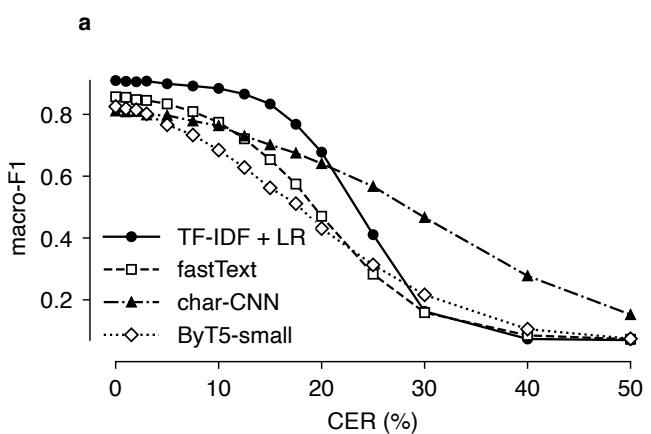

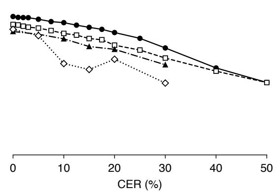  
Fig. 2 T1 document type: macro-F1 of every model against CER. a Models trained on clean text and tested at every CER. b Models retrained at the test CER (the char-CNN and ByT5-small at 5, 10, 15, 20 and 30% only). Both panels share the legend and the axes

a  
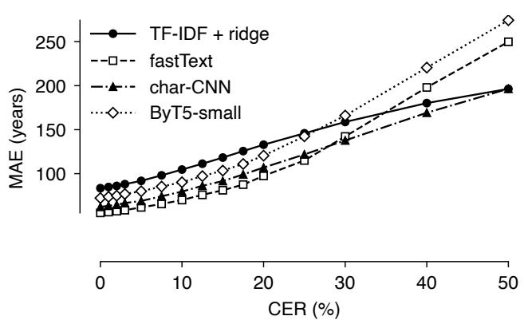

b  
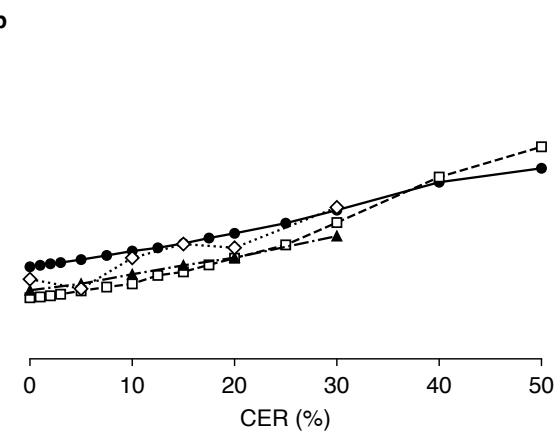  
Fig. 3 T2 dating: mean absolute error in years (lower is better) of every model against CER. a Models trained on clean text. b Models retrained at the test CER (the char-CNN and ByT5-small at 5, 10, 15, 20 and 30% only). Both panels share the legend and the axes

## 8.3 T3: documentary versus literary

Telling a document from a literary text is the most robust task in the study. All four models score between 0.865 and 0.898 macro-F1 on clean text and lose little as the text degrades: TF-IDF keeps 0.852 at 20% CER and 0.796 at 30%, holding 90% of its clean score up to 20% CER, twice the tolerance of any other task (Appendix B). The signal is lexical and spread over the whole text, which is why scattered errors cost so little; the control model that sees only line-length statistics stays at 0.57 whatever the CER, so the number of lines and amount of letters do not give the answer away. Retraining pays only under heavy noise (0.727 at 50% CER). The real limit is length rather than error rate: fragments under 20 letters are near chance even on clean text, while texts of 500 letters or more keep 90% of their score up to 20% CER (Appendix D). Only 3.4% of evaluated test documents are literary, so macro-F1 rather than accuracy carries the headline.

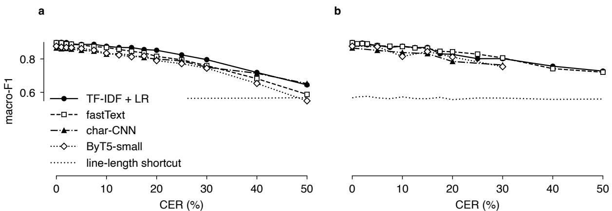  
Fig. 4 T3 documentary versus literary: macro-F1 of every model against CER, with the line-length-only shortcut. a Models trained on clean text. b Models retrained at the test CER (the char-CNN and ByT5-small at 5, 10, 15, 20 and 30% only). Both panels share the legend and the axes

## 8.4 T4: search

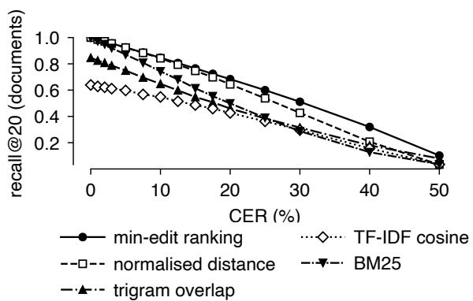  
Fig. 5 T4 search: document-level recall@20 of the ranking methods over all 2,534 queries against CER. The search methods need no training, so there is a single panel

Search separates into ranking and filtering. Ranking by minimum edit distance is the most robust and the most predictable method in the study: document-level recall@20 falls almost linearly, by about 1.6 points per point of CER, from 0.93 at 5% CER to 0.68 at 20% and 0.51 at 30%. Term-weighting schemes fare worse under noise than their clean scores suggest. BM25, tuned on clean validation queries, chose 6-letter n-grams and so behaves almost like exact containment: perfect on clean text, but 0.29 at 30% CER against 0.51 for edit distance, a reminder that tuning a retrieval method on clean text selects for brittleness. Filtering fails diferently: exact match keeps its precision as the text degrades (0.84 at 20% CER) and loses recall instead, which is the safer failure for a scholar asking whether a formula occurs at all. Query length drives everything — queries of ten letters or more tolerate 20% CER, queries of three to six letters only 3% (Appendix D) — and formulae survive far better than dictionary stems, so searching noisy text for a long phrase stays reliable long after single-word search has failed.

## 9 Cross-task findings

## 9.1 Retraining on noisy text

Below 10% CER retraining is never better and sometimes slightly worse, so a tool built on editions can be pointed at good HTR as it is. From 15% CER on, and dramatically at 30%, retraining undoes most of the collapse of the lexical models: document form from 0.163 to 0.703, and even the char-CNN gains (0.466 to 0.592). Much of the loss at high CER is therefore a train–test mismatch, not lost information. Dating recovers less: retraining removes only about a quarter of the added error at 30% CER (fastText 142 to 124 years, char-CNN 138 to 111), so here a larger part of the loss is information that the noise has destroyed. Documentary-versus-literary, which barely collapses, gains only beyond 30% (0.645 to 0.727 at 50%). For the papyrologist the message is encouraging. A model that has seen noisy text is not merely more robust; at 20–30% CER, the range in which today’s systems read cursive documentary hands, it is the diference between a usable classifier and a useless one, and it costs nothing but training on degraded copies of the same editions.

## 9.2 Lost lines

Missing a line altogether is a diferent failure from misreading one, and it costs far less. Dropping 30% of the text-bearing lines is worth about as much as 5% CER for the document-level tasks, while for search it removes recall in proportion to the text lost. The ablation and its figure are in Appendix C.

## 9.3 Fragment size

Every task has a size below which no CER helps and a size above which a large CER is survivable. Because the efect is essentially the same for all four tasks, the figure and its discussion are in Appendix D.

## 10 Discussion

## 10.1 What HTR quality is required for what

Table 3 turns the thresholds into targets, read against what current systems report: low single digits on clear hands, ten to twenty percent on documentary cursive. Three groups emerge. Documentary-versus-literary classification works on today’s output as it is; document type and search require good HTR output, or retraining on degraded editions, after which document type identification lies within reach of typical HTR output for cursive handwriting. Dating needs either very good HTR or a better model, since the text alone does not give a century-level answer even when perfectly transcribed.

## 10.2 Recommendations

For HTR developers: report a letters-only CER computed after the normalisation of Sect. 5.2, and report it by fragment size and the line-loss rate separately, because each of these changes what the CER means downstream. For tool builders: train on degraded editions at the CER the HTR is expected to produce; the degradation algorithm and the frozen corpora are released for this purpose. For papyrologists and collection curators: automatic first-pass transcription over unedited material at 10–20% CER already supports selection of relevant papyri for publication and, with retrained models, cataloguing by document type; searching this transcription layer with edit-distance ranking and queries of ten letters or more is reliable; dating established from such transcription should be treated as a hint.

Table 3 CER targets per task, read from the per-task results of Sect. 8 and the per-model thresholds of Appendix B. “As is” is the highest CER at which a model built on editions keeps 90% of its performance; “retrained” the same for a model trained on degraded editions
<table><tr><td>Task</td><td>As is</td><td></td><td>Retrained Also depends on</td></tr><tr><td>Doc. vs literary</td><td>20%</td><td>20%</td><td>≥50 letters</td></tr><tr><td>Document type</td><td>7.5-12.5%</td><td>15%</td><td>≥100 letters</td></tr><tr><td>Search, ranking</td><td>5%</td><td></td><td>query length (20% at 10+ letters)</td></tr><tr><td>Search, exact filter</td><td>5%</td><td></td><td>recall falls with CER, precision</td></tr><tr><td>Dating</td><td>3%</td><td>5%</td><td>holds text length; 50- year bar unmet</td></tr></table>

## 10.3 Limitations

The noise is simulated: real HTR errors are shaped by letter confusions, the hand, the damage and the recogniser, and our variants only bracket that. The thresholds should therefore be re-read once a system produces aligned output at scale, which the released pipeline makes a matter of replacing one step. Only letter errors and lost lines are modelled, not merged or split lines, wrong reading order or fragments joined out of order. The tasks use small, self-trained models; a larger pretrained model may be more or less robust, though the retrained results suggest that the training regime matters more than the architecture. Finally, the study covers Greek only; Latin and Coptic replications use the same pipeline and are in progress.

## 11 Conclusion

We asked how good HTR of Greek papyri must be for the tasks papyrologists would want to run on it, and answered per task with controlled experiments on 63,846 edited texts reduced to what a perfect HTR would return and degraded to exact error rates. The tolerance spans close to an order of magnitude: from 20% CER for telling documents from literature to 3% for dating, with document type identification and search between. A perfect transcription is not needed, and a single CER figure is not enough: what matters is the CER for the task at hand, the shape of the errors, the length of the fragment, and, above all, whether the downstream model has seen noisy text. Retraining on degraded editions turns output at 20–30% CER, the range current systems reach on documentary hands, from useless into usable for document classification at no cost beyond training. The corpus rules, the degradation algorithm, the frozen corpora, the models and every result table are released so that the thresholds can be re-read as HTR systems improve and as real output becomes available.

## Statements and Declarations

Funding. No funding was received for conducting this study.

Competing interests. The authors have no competing interests to declare that are relevant to the content of this article.

Ethics approval and consent. Not applicable; the study uses published editions and public metadata and involves no human participants.

Data availability. The source data are public: the papyri.info idp.data repository (CC-BY, commit fd88c0c [10]), the Grammateus export of 13 September 2026 [13], and the OCR text of the Preisigke supplements on the Internet Archive [19], which is in copyright and is fetched, not redistributed; every input is pinned by commit or SHA-256 in the released configuration. The derived corpora, result tables, bootstrap curves and thresholds are released with the code.

Code availability. Reference code for the experiments reported here—corpus construction from EpiDoc, the letters-only view, the exact-CER degradation, the four tasks and their models, the eight search methods and the bootstrap analysis—is at https://github.com/ repushko/good\_enough\_papyrus\_htr. The complete pipeline (rendering, normalisation, degradation, models, search, analysis and report) is available in addition, with a Makefile that reproduces every step from the pinned inputs. Task identifiers in both repositories difer from the numbering used here (documentary versus literary is T4 and search is T5 there).

Author contributions. Elena Chepel formulated the papyrological tasks and defined the corpus rules. Anton Repushko designed and implemented the experimental pipeline—the degradation algorithm, the models, the search methods and the statistical analysis—and ran all experiments. Both authors wrote the manuscript and approved the final version.

## Appendix A What counts as ink

Table A1 lists how each EpiDoc element of the edition is rendered in the ink-only view of Sect. 5.

Table A1 What counts as ink: how EpiDoc elements of the edition are rendered in the HTR view. Counts are element occurrences over the 72,623 Greek editions of DDbDP and DCLP
<table><tr><td>EpiDoc element</td><td>Count</td><td>In the HTR view</td></tr><tr><td>supplied @reason=lost</td><td>721,518</td><td>removed, token</td></tr><tr><td>supplied @reason=omitted</td><td>17,257</td><td>removed, no gap (never written)</td></tr><tr><td>gap vS</td><td>797,539</td><td>gap token kept</td></tr><tr><td>choice: orig/sic reg/corr</td><td>143,904 orig/sic</td><td>(what the scribe</td></tr><tr><td>expan with ex</td><td>903,536</td><td>wrote) written letters kept, expansion</td></tr><tr><td>abbr</td><td>37,113</td><td>dropped kept</td></tr><tr><td>unclear</td><td></td><td>763,272 kept (ink present, reading doubtful)</td></tr><tr><td>del, add, surplus, subst num</td><td>583,726 letters</td><td>70,011 kept (ink) kept</td></tr><tr><td></td><td></td><td>(numerals are let- ters)</td></tr><tr><td>app: lem vs rdg am, note, figure,</td><td>47,457 78,575</td><td>lem kept, rdg dropped</td></tr><tr><td>g, certainty</td><td></td><td>removed (symbols, notes)</td></tr><tr><td>handShift, milestone 1b, 1</td><td>31,423 1,070,210</td><td>removed line break;</td></tr><tr><td></td><td></td><td>break=&quot;no&quot; joins</td></tr><tr><td>space</td><td>15,661</td><td>the word word boundary, no</td></tr></table>

## Appendix B Thresholds per model

Table B1 gives $c _ { 9 5 }$ and $c _ { 9 0 }$ for every model and regime on the headline metric, with the clean score and its 95% interval. The full table with size bins, variants and lost lines is in the released results.

## Appendix C Lost lines

A recogniser can fail in two ways that a single CER figure does not distinguish: it can read a line and get its letters wrong, or it can miss the line altogether, because the layout analysis did not find it or because the ink is too faint to segment. The second failure removes text rather than corrupting it, so it is modelled separately (Sect. 5.3): a seeded fraction p of a document’s text-bearing lines is dropped before the letter noise is applied, and the CER is measured on the lines that remain. The two losses therefore compose without being confounded. Figure C1 crosses $p \in \{ 0 , 1 0 , 2 0 , 3 0 \}$ % with $c \in \{ 0 , \ldots , 3 0 \} \%$ for each task, using the model that carries that task’s headline on clean text.

For the three document-level tasks, losing lines costs strikingly little. On clean text, dropping 30% of the lines lowers document type from 0.909 to 0.881 macro-F1 and documentary versus literary from 0.898 to 0.885, and raises the dating error from 83 to 94 years — in each case about what 5% CER costs on its own, for a third of the text removed. The curves in panels a–c stay close to parallel as the error rate rises, so the two kinds of loss add up almost independently rather than compounding; above 20% CER they converge, because a text that noisy carries little signal whether or not a third of it is missing.

Search behaves diferently (panel d). A lost line cannot be found, so recall falls in proportion to the text removed rather than with the dificulty of matching: min-edit recall@20 drops from 1.000 to 0.820 on clean text when 30% of the lines are gone, the largest single efect of line loss in the study, and the gap stays roughly constant at every CER.

The practical consequence is that a layout stage that misses a third of the lines is a much smaller problem for classification and dating than a recogniser that gets a fifth of the letters wrong, while for search the two matter about equally, since one removes what the other corrupts. This is the argument for reporting the line-loss rate alongside the CER (Sect. 10).

## Appendix D Fragment size

Every task has a size below which no CER helps and a size above which a large CER is survivable (Fig. D1). Fragments under 20 letters are dated with a 121-year error and are at chance for documentary versus literary on clean text; texts of 500 letters or more keep 90% of their document-type and documentary-literary scores up to 12.5–20% CER and documents of 2,000 letters up to 30–40% for the latter. Search follows the query rather than the document: 10–12-letter queries tolerate 20% CER, 3–6-letter queries 3%. One counter-intuitive detail: on document type the longest clean-trained TF-IDF documents collapse hardest at 30% CER (0.071 macro-F1 for 1,000–1,999 letters, Fig. D1a), because they accumulate the largest number of unseen noisy n-grams; retraining removes the efect.

## Appendix E Frozen settings

TF-IDF: character 1–5-grams, sublinear term frequency, ℓ2-normalised rows; logistic regression with lbfgs, C and class weights tuned per task (the chosen C = 100 sits on the grid edge); ridge α tuned for dating. fastText: softmax loss, minimum count 1, 2M buckets, letter n-grams of 3–5, dimension 100–200, 30–100 epochs, learning rate 0.5–1.0 (grid widened once after the first tuning hit its edge, then frozen). Char-CNN: learning rate $3 \times 1 0 ^ { - 3 }$ (T1) or $1 0 ^ { - 3 }$ , square-root inversefrequency class weights for T1 and T3, at most 20 epochs (T1: 80), patience 4 (T1: 8). ByT5-small: AdamW with learning rate $1 0 ^ { - 4 }$ (head $1 0 ^ { - 3 } )$ , weight decay 0.01, 6% warm-up, bf16, gradient clipping at 1.0, length-bucketed batches of at most 48k tokens, early stopping on the validation split with patience 6 evaluations; 3 epochs, 8 for T2. BM25: $n ~ = ~ 6 , ~ k _ { 1 } ~ = ~ 0 . 3 , ~ b ~ = ~ 0$ (all on grid edges after one widening), IDF from clean training units. Every frozen hyperparameter is listed in the FROZEN table of models.py, and every seed, CER grid, split fraction and bootstrap setting in config.py, of the released code.

b  
Table B1 Per-model thresholds (% CER) on the headline metric. Clean: point estimate and 95% bootstrap interval at 0% CER. Retrained char-CNN and ByT5 stop at 30% CER, so their retrained thresholds cannot exceed it
<table><tr><td>Task Model</td><td></td><td>Clean score</td><td></td><td>C95 clean c90 clean c95</td><td></td><td>C90 retrained</td></tr><tr><td>T1</td><td>TF-IDF + LR</td><td>0.909 (0.895–0.923)</td><td>10</td><td>12.5</td><td>7.5 / 15</td><td></td></tr><tr><td>T1</td><td>fastText</td><td>0.857 (0.839–0.873)</td><td>5</td><td>7.5</td><td>5 / 12.5</td><td></td></tr><tr><td>T1</td><td>char-CNN</td><td>0.811 (0.793–0.829)</td><td>5</td><td>10</td><td>5 /  10</td><td></td></tr><tr><td>T1</td><td>ByT5-small</td><td>0.825 (0.808–0.843)</td><td>3</td><td>5</td><td>0/5</td><td></td></tr><tr><td>T2</td><td>fastText</td><td>55 y (52–58)</td><td>1</td><td>3</td><td>1 /3</td><td></td></tr><tr><td>T2</td><td>char-CNN</td><td>62 y (60–64)</td><td>2</td><td>3</td><td>0 /0</td><td></td></tr><tr><td>T2</td><td>ByT5-small</td><td>72 y (70–75)</td><td>2</td><td>3</td><td>5 /5</td><td></td></tr><tr><td>T2</td><td>TF-IDF + ridge</td><td>83 y (81–86)</td><td>2</td><td>3</td><td>2/5</td><td></td></tr><tr><td>T3</td><td>TF-IDF + LR</td><td>0.898 3 (0.877–0.919)</td><td>12.5</td><td>20</td><td>5</td><td>20</td></tr><tr><td>T3</td><td>fastText</td><td>0.897 (0.874–0.918)</td><td>10</td><td>17.5</td><td>10</td><td>20</td></tr><tr><td>T3</td><td>ByT5-small</td><td>0.876 (0.853–0.900)</td><td>7.5</td><td>17.5</td><td>5</td><td>15</td></tr><tr><td>T3</td><td>char-CNN</td><td>0.865 (0.840–0.889)</td><td>7.5</td><td>17.5</td><td>5 / 15</td><td></td></tr><tr><td>T3</td><td>line-length shortcut</td><td>0.567 (0.538–0.600)</td><td>≥50</td><td>≥50</td><td></td><td></td></tr><tr><td>T4</td><td>min-edit ranking, recall@20</td><td>1.000</td><td>3</td><td>5</td><td></td><td></td></tr><tr><td>T4</td><td>normalised distance, recall@20</td><td>1.000</td><td>3</td><td>5</td><td></td><td></td></tr><tr><td>T4</td><td>BM25, recall@20</td><td>0.999</td><td>1</td><td>3</td><td></td><td></td></tr><tr><td>T4</td><td>trigram overlap, recall@20</td><td>0.846 (0.836–0.856)</td><td>1</td><td>3</td><td></td><td></td></tr><tr><td>T4</td><td>TF-IDF cosine, recall@20</td><td>0.639 (0.625–0.653)</td><td>2</td><td>5</td><td></td><td></td></tr><tr><td>T4</td><td>exact match, filter F1</td><td>1.000</td><td>2</td><td>5</td><td></td><td></td></tr><tr><td>T4</td><td>BM25, filter F1</td><td>0.849 (0.825–0.869)</td><td>3</td><td>7.5</td><td></td><td></td></tr></table>

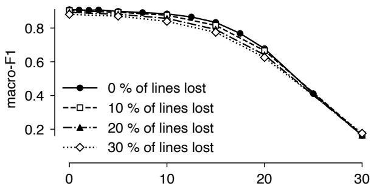

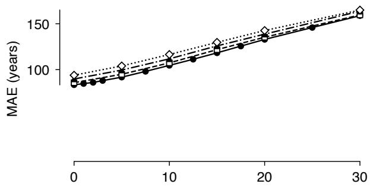

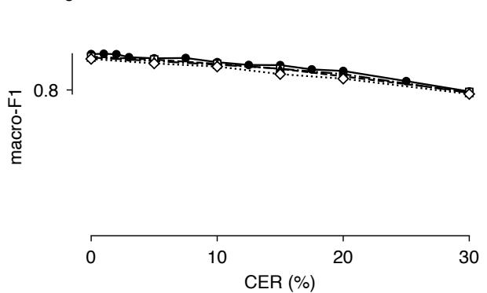

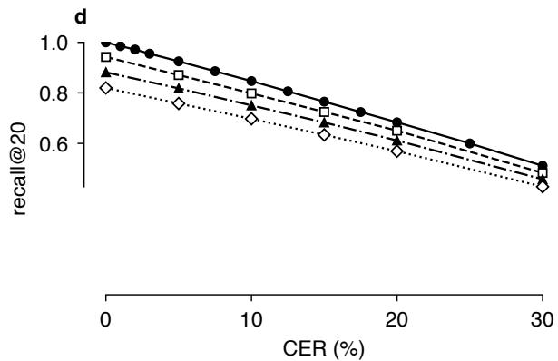  
Fig. C1 Lost lines crossed with CER: 0, 10, 20 and 30% of the text-bearing lines dropped, models trained on clean text. a T1 document type (TF-IDF + LR, macro-F1). b T2 dating (TF-IDF + ridge, MAE in years, lower is better). c T3 documentary versus literary (TF-IDF + LR, macro-F1). d T4 search (min-edit ranking, document-level recall@20). All four panels share the legend

## References

## ArXiv:2603.02803, 2603.02803

[1] Angleraud N, Karamolegkou A, Sagot B, et al (2026) Structure-aware text recognition for ancient Greek critical editions.

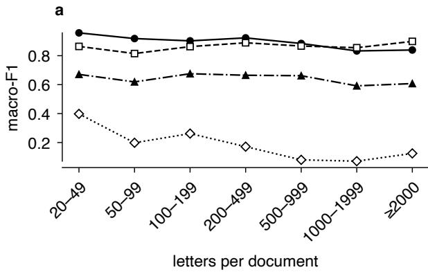

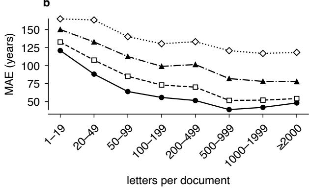

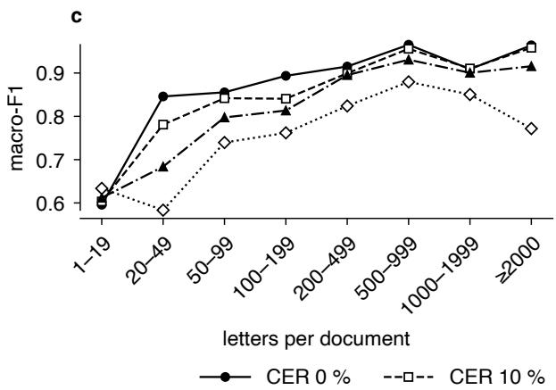

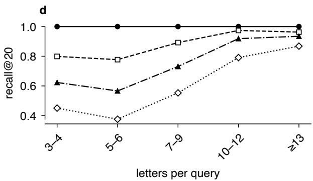  
Fig. D1 Performance by fragment size at 0, 10, 20 and 30% CER, models trained on clean text. Bin sizes are in the released result tables; bins with fewer than 30 units are not plotted. a T1 document form (TF-IDF + LR) by letters per document. b T2 dating error (char-CNN) by letters per document. c T3 documentary versus literary (TF-IDF + LR) by letters per document. d T4 recall@20 (min-edit ranking) by letters per query

[2] Assael Y, Sommerschield T, Shillingford B, et al (2022) Restoring and attributing ancient texts using deep neural networks. Nature 603:280–283. https://doi.org/ 10.1038/s41586-022-04448-z

[3] Broder AZ (1997) On the resemblance and containment of documents. In: Proceedings of the Compression and Complexity of Sequences 1997. IEEE, pp 21–29, https://doi. org/10.1109/SEQUEN.1997.666900

[4] Chepel E, Repushko A (2026) Transformerbased OCR and LLM post-correction for Greek cursive papyri. https://doi.org/10. 25592/uhhfdm.19225

[5] Chiron G, Doucet A, Coustaty M, et al (2017) Impact of OCR errors on the use of digital

libraries: towards a better access to information. In: 2017 ACM/IEEE Joint Conference on Digital Libraries (JCDL), pp 1–4, https: //doi.org/10.1109/JCDL.2017.7991582

[6] Cullhed E (2024) Instruct-tuning pretrained causal language models for ancient Greek papyrology and epigraphy. ArXiv:2409.13870, 2409.13870

[7] De Gregorio G, Ferretti L, Pena RCG, et al (2024) A new framework for error analysis in computational paleographic dating of Greek papyri. In: Document Analysis and Recognition – ICDAR 2024 Workshops. Springer, Cham, pp 102–118, https://doi.org/10.1007/ 978-3-031-70642-4\_7

[8] Depauw M, Gheldof T (2014) Trismegistos: an interdisciplinary platform for ancient

world texts and related information. In: Theory and Practice of Digital Libraries – TPDL 2013 Selected Workshops, CCIS, vol 416. Springer, Cham, pp 40–52, https://doi.org/ 10.1007/978-3-319-08425-1\_5

[9] Digital Corpus of Literary Papyri (2026) DCLP: Digital corpus of literary papyri. https://litpap.info. Accessed 13 September 2026

[10] Duke Collaboratory for Classics Computing and the Integrating Digital Papyrology project (2026) idp.data: the Epi-Doc data of papyri.info (DDbDP, HGV, DCLP). GitHub repository, https://github. com/papyri/idp.data, commit fd88c0c, CC-BY. Accessed 13 September 2026

[11] Efron B, Tibshirani RJ (1993) An Introduction to the Bootstrap. Chapman & Hall, New York

[12] Elliott T, Bodard G, Cayless H, et al (????) EpiDoc: epigraphic documents in TEI XML. EpiDoc Collaborative, https://epidoc.stoa. org. Accessed 13 September 2026

[13] Ferretti L, Fogarty S, Nury E, et al (2023) Grammateus project: classification of Greek documentary papyri. University of Geneva, https://grammateus.unige.ch. Accessed 13 September 2026

[14] Hamdi A, Linhares Pontes E, Sidere N, et al (2023) In-depth analysis of the impact of OCR errors on named entity recognition and linking. Nat Lang Eng 29(2):425–448. https: //doi.org/10.1017/S1351324922000110

[15] Heidelberger Gesamtverzeichnis der griechischen Papyrusurkunden Ägyptens (HGV) (2026) HGV metadata, distributed within idp.data. Universität Heidelberg, https:// aquila.zaw.uni-heidelberg.de. Accessed 13 September 2026

[16] Hill MJ, Hengchen S (2019) Quantifying the impact of dirty OCR on historical text analysis: Eighteenth Century Collections Online as a case study. Digit Scholarsh Humanit 34(4):825–843. https://doi.org/10.

1093/llc/fqz024

[17] Joulin A, Grave E, Bojanowski P, et al (2017) Bag of tricks for eficient text classification. In: Proceedings of the 15th Conference of the European Chapter of the Association for Computational Linguistics: Volume 2, Short Papers, pp 427–431, https://doi.org/ 10.18653/v1/E17-2068

[18] Karamolegkou A, Angleraud N, Sagot B, et al (2026) Reading or guessing? Visual grounding failures of vision-language models for OCR in ancient Greek editions. ArXiv:2605.27750, 2605.27750

[19] Kiessling E, Rupprecht HA (eds) (1971–2000) Wörterbuch der griechischen Papyrusurkunden, Supplement 1–3. Harrassowitz, Wiesbaden, founded by Friedrich Preisigke. OCR text from the Internet Archive

[20] Levenshtein VI (1966) Binary codes capable of correcting deletions, insertions, and reversals. Sov Phys Dokl 10(8):707–710

[21] Loshchilov I, Hutter F (2019) Decoupled weight decay regularization. In: 7th International Conference on Learning Representations (ICLR 2019)

[22] Myers G (1999) A fast bit-vector algorithm for approximate string matching based on dynamic programming. J ACM 46(3):395– 415. https://doi.org/10.1145/316542.316550

[23] Nguyen TTH, Jatowt A, Coustaty M, et al (2021) Survey of post-OCR processing approaches. ACM Comput Surv 54(6):124:1– 124:37. https://doi.org/10.1145/3453476

[24] Pavlopoulos J, Konstantinidou M, Marthot-Santaniello I, et al (2023) Dating Greek papyri with text regression. In: Proceedings of the 61st Annual Meeting of the Association for Computational Linguistics (Volume 1: Long Papers), pp 10001–10013, https:// doi.org/10.18653/v1/2023.acl-long.556

[25] Pedregosa F, Varoquaux G, Gramfort A, et al (2011) Scikit-learn: machine learning in Python. J Mach Learn Res 12:2825–2830

[26] Robertson B, Boschetti F (2017) Largescale optical character recognition of ancient Greek. Mouseion 14(3):341–359. https://doi. org/10.3138/mous.14.3-3

[27] Robertson S, Zaragoza H (2009) The probabilistic relevance framework: BM25 and beyond. Found Trends Inf Retr 3(4):333–389. https://doi.org/10.1561/1500000019

[28] Seuret M, Marthot-Santaniello I, White SA, et al (2023) ICDAR 2023 competition on detection and recognition of Greek letters on papyri. In: Document Analysis and Recognition – ICDAR 2023, LNCS, vol 14188. Springer, Cham, pp 498–507, https://doi. org/10.1007/978-3-031-41679-8\_29

[29] Sommerschield T, Assael Y, Pavlopoulos J, et al (2023) Machine learning for ancient languages: a survey. Comput Linguist 49(3):703– 747. https://doi.org/10.1162/coli\_a\_00481

[30] van Strien D, Beelen K, Coll Ardanuy M, et al (2020) Assessing the impact of OCR quality on downstream NLP tasks. In: Proceedings of the 12th International Conference on Agents and Artificial Intelligence (ICAART 2020), Volume 1, pp 484–496, https://doi.org/10. 5220/0009169004840496

[31] Swindall MI, Croisdale G, Hunter CC, et al (2021) Exploring learning approaches for ancient Greek character recognition with citizen science data. In: 2021 IEEE 17th International Conference on eScience, pp 128– 137, https://doi.org/10.1109/eScience51609. 2021.00023

[32] Todorov K, Colavizza G (2022) An assessment of the impact of OCR noise on language models. ArXiv:2202.00470, 2202.00470

[33] Traub MC, van Ossenbruggen J, Hardman L (2015) Impact analysis of OCR quality on research tasks in digital archives. In: Research and Advanced Technology for Digital Libraries – TPDL 2015, LNCS, vol 9316. Springer, Cham, pp 252–263, https://doi. org/10.1007/978-3-319-24592-8\_19

[34] Turnbull R, Mannix E (2024) Detecting and recognizing characters in Greek papyri with YOLOv8, DeiT and SimCLR. Int J Doc Anal Recognit 28:277–285. https://doi.org/ 10.1007/s10032-024-00504-8

[35] Van Minnen P (2009) The future of papyrology. In: Bagnall RS (ed) The Oxford Handbook of Papyrology. Oxford University Press, Oxford, p 644–659

[36] Xue L, Barua A, Constant N, et al (2022) ByT5: towards a token-free future with pretrained byte-to-byte models. Trans Assoc Comput Linguist 10:291–306. https://doi. org/10.1162/tacl\_a\_00461

[37] Zhang X, Zhao J, LeCun Y (2015) Characterlevel convolutional networks for text classification. In: Advances in Neural Information Processing Systems 28, pp 649–657