# Thinking Outside the Box: Can Language Models Rely on External Guidance Selectively?

Minghan Wang⋄, ∗, Boyuan Wang⋄, ∗, Jinhang Zuo◦, Yuxin Tao⋄, †, Fang Kong⋄, †

⋄ Southern University of Science and Technology , ◦ City University of Hong Kong

## Abstract

Agent harnesses often improve language models with human-designed workflows, but as models grow more capable, unreliable guidance can increasingly constrain their execution. We call the ability to benefit from useful guidance while overriding unreliable guidance thinking outside the box. We introduce Box2-Bench, which holds the model and task fixed while varying workflow reliability to isolate how models regulate their reliance on guidance. On Box2-Bench, frontier models often benefit from reliable guidance but remain vulnerable when it is misleading or becomes unreliable. To test whether this capability can be learned, we train two open-weight models using bad workflows, reserving good workflows for evaluation. We explore two complementary training strategies: counterfactual supervised fine-tuning improves robustness, while outcome-based reinforcement learning can shift the balance toward greater use of helpful workflows. We further find that this behavior extends beyond workflows to other forms of external information, improving peer correction and robustness to corrupted memory. Together, our results identify selective reliance on fallible external information as a dimension of agent reliability not captured by task performance alone.

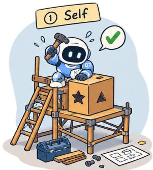

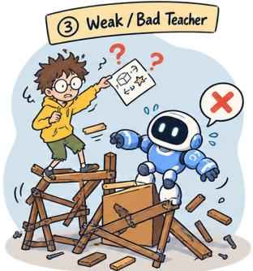

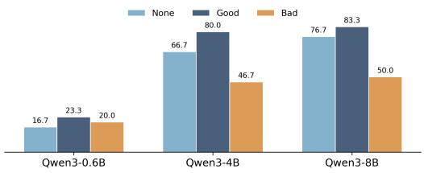  
(a) AIME 2026

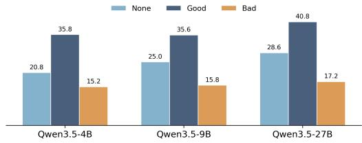  
(b) WebShop  
Figure 1: The top illustration contrasts independent execution with guidance from capable and weak teachers. The bottom panels show performance under self-solving, good-workflow, and bad-workflow conditions on (a) AIME 2026 and (b) WebShop. Good workflows improve performance, while bad ones expose sensitivity to misleading guidance.

## 1 Introduction

Large language models increasingly operate within harnesses that structure planning, feedback, and tool use (Li et al., 2026b; Ruan et al., 2026; Zhang et al., 2025; Shang et al., 2025). Harnesses inject procedural priors, guiding models that cannot yet discover reliable strategies on their own (Sarukkai et al., 2025; Zhou et al., 2025; Wang et al., 2026a). This benefit, however, assumes that the human guide is more reliable than the model. As frontier models solve increasingly complex problems in reasoning, coding, and long-horizon research (Feng et al., 2026; Kung et al., 2026; Huang et al., 2026b; Lu et al., 2026; Ma & Chen, 2026), this assumption becomes increasingly important to revisit.

When a model can find a better strategy on its own, following a prescribed workflow can constrain its execution. Removing procedural guidance from the harness creates the opposite problem, since useful guidance can still improve performance. We call this ability thinking outside the box: following external procedural guidance when it helps, resisting it when it misleads, and moving beyond it when a better strategy emerges. This selective workflow reliance is distinct from task-solving capability: the latter asks whether a model can solve the underlying task, whereas the former asks whether it can benefit from external procedural knowledge without becoming bound by it. Figure 1 illustrates this tension.

Existing benchmarks evaluate autonomous task completion and compliance with prescribed procedures, but not whether models can adjust their reliance on guidance as its reliability changes (Merrill et al., 2026; Li et al., 2026a; Deng et al., 2025; Wang et al., 2026b; Cao et al., 2026; Guan et al., 2026). We introduce $\mathbf { B o x } ^ { 2 } .$ -Bench to evaluate thinking outside the box. $\mathrm { B o x } ^ { 2 }$ holds the task, environment, evaluator, and model fixed while varying workflow availability and reliability across five matched conditions:

$$
\begin{array} { r l r l r l r l r } { \mathbf { N o \ w o r k f l o w } } & { } & { \mathbf { G o o d } } & { } & { \mathbf { P a r t i a l } } & { } & { \mathbf { M i r e d } } & { } & { \mathbf { B a d } } \\ { \boldsymbol { \mathcal { Q } \mathcal { Q } \mathcal { Q } \mathcal { Q } \mathcal { O } } } & { } & { + + + + + + } & { } & { + + + \mathcal { Q O } \mathcal { O } } & { } & { + + + + - } & { - } & { \dots - - } \end{array} ,
$$

where $+ , - ,$ and ∅ denote useful, misleading, and absent guidance, respectively. Thus, Good and Bad workflows provide consistently useful or misleading guidance, while Partial and Mixed workflows share a useful prefix but then either stop or become misleading. A fixed external model serves as a scalable proxy for human workflow designers, and each generated workflow is independently verified. On Box2-Bench, across frontier models and diverse tasks, we find a consistent capability gap: models benefit from useful workflows yet remain vulnerable when similar guidance is misleading or becomes unreliable. Task performance alone therefore does not capture a model’s ability to regulate its reliance on external guidance.

We next ask whether models can learn to reject bad guidance without rejecting guidance altogether. We train open-weight models on bad workflows, reserving good workflows for evaluation. Counterfactual SFT teaches models to override guidance that conflicts with task success, while outcome-based RL rewards success without prescribing a trajectory. SFT improves robustness but induces overly broad workflow resistance; RL partially restores use of held-out good workflows while retaining a robustness improvement over the base model. These results show that robustness to bad guidance is not enough: thinking outside the box requires selective reliance rather than blanket rejection.

We further ask whether this selectivity is specific to workflows or extends to other forms of fallible information. Without setting-specific training, we evaluate the same models with peer information in multi-agent reasoning and stored information in memory-augmented reasoning. In multi-agent collaboration, training leads to more beneficial cross-agent corrections. In memoryaugmented reasoning, models preserve the benefits of reliable memory while more often verifying corrupted records. Together, these results provide initial evidence that learning to regulate workflow reliance can generalize to how models use external information more broadly.

Table 1: $\mathrm { B o x } ^ { 2 }$ performance across five execution regimes. We first report absolute performance under each regime, followed by the corresponding paired workflow effects.
<table><tr><td rowspan="2">Model</td><td colspan="5">Performance</td><td colspan="4"> $\mathbf { B o x } ^ { 2 } \cdot$  Bench Effects</td></tr><tr><td>Base  $S _ { 0 }$ </td><td>Good  $S _ { G }$ </td><td>Bad  $S _ { B }$ </td><td>Partial  $S _ { P }$ </td><td>Mixed  $S _ { M }$ </td><td>Utilization  $\Delta _ { \mathrm { u s e } }$ </td><td>Robustness  $\Delta _ { \mathrm { b a d } }$ </td><td>Recovery  $\Delta _ { \mathrm { { s t o p } } }$ </td><td> $\Delta _ { \mathrm { s w i t c h } }$ </td></tr><tr><td colspan="10"></td></tr><tr><td># Math — OpenR1-Math Gemini 3.7 Flash</td><td>76.7%</td><td>83.3%</td><td>33.3%</td><td>80.0%</td><td>43.3%</td><td>+6.7</td><td>-43.3</td><td>-3.3</td><td>-36.7</td></tr><tr><td>DeepSeek V4 Flash</td><td>76.7%</td><td>80.0%</td><td>66.7%</td><td>83.3%</td><td>73.3%</td><td>+3.3</td><td>-10.0</td><td>+3.3</td><td>-10.0</td></tr><tr><td>GLM 5.2</td><td>80.0%</td><td>80.0%</td><td>40.0%</td><td>83.3%</td><td>56.7%</td><td>0.0</td><td>-40.0</td><td>+3.3</td><td>-26.7</td></tr><tr><td colspan="10"># Code — DeepSWE</td></tr><tr><td>Gemini 3.7 Flash</td><td>60.0%</td><td>53.3%</td><td>50.0%</td><td>60.0%</td><td>56.7%</td><td>-6.7</td><td>-10.0</td><td>+6.7</td><td>-3.3</td></tr><tr><td>DeepSeek V4 Flash</td><td>26.7%</td><td>36.7%</td><td>13.3%</td><td>36.7%</td><td>26.7%</td><td>+10.0</td><td>-13.3</td><td>0.0</td><td>-10.0</td></tr><tr><td>GLM 5.2</td><td>23.3%</td><td>23.3%</td><td>20.0%</td><td>16.7%</td><td>23.3%</td><td>0.0</td><td>-3.3</td><td>-6.7</td><td>+6.7</td></tr><tr><td colspan="10"># Information Search — BrowseComp</td></tr><tr><td>Gemini 3.7 Flash</td><td>46.7%</td><td>46.7%</td><td>36.7%</td><td>36.7%</td><td>36.7%</td><td>0.0</td><td>-10.0</td><td>-10.0</td><td>0.0</td></tr><tr><td>DeepSeek V4 Flash</td><td>20.0%</td><td>23.3%</td><td>10.0%</td><td>23.3%</td><td>16.7%</td><td>+3.3</td><td>-10.0</td><td>0.0</td><td>-6.7</td></tr><tr><td>GLM 5.2</td><td>13.3%</td><td>16.7%</td><td>10.0%</td><td>16.7%</td><td>13.3%</td><td>+3.3</td><td>-3.3</td><td>0.0</td><td>-3.3</td></tr><tr><td colspan="10"># Tool Use — AutomationBench</td></tr><tr><td>Gemini 3.7 Flash</td><td>74.4%</td><td>80.3%</td><td>65.6%</td><td>84.8%</td><td>77.4%</td><td>+5.9</td><td>-8.8</td><td>+4.5</td><td>-7.3</td></tr><tr><td>DeepSeek V4 Flash</td><td>69.3%</td><td>83.0%</td><td>57.3%</td><td>83.6%</td><td>70.4%</td><td>+13.7</td><td>-12.0</td><td>+0.6</td><td>-13.2</td></tr><tr><td>GLM 5.2</td><td>45.6%</td><td>62.4%</td><td>43.2%</td><td>62.9%</td><td>54.2%</td><td>+16.8</td><td>-2.3</td><td>+0.5</td><td>-8.7</td></tr></table>

Note. Effects measure good-guidance utilization $( \Delta _ { \mathrm { u s e } } ~ = ~ S _ { G } - S _ { 0 } )$ , bad-guidance robustness $( \Delta _ { \mathrm { b a d } } ~ = ~ S _ { B } - S _ { 0 } )$ , and recovery when guidance stops $( \Delta _ { \mathrm { s t o p } } = S _ { P } - S _ { G } )$ or becomes misleading $( \Delta _ { \mathrm { s w i t c h } } = S _ { M } - S _ { P } )$

## 2 Box2-Bench: Benchmarking Inside- and Outside-the-Box Execution

Box2-Bench evaluates whether models benefit from useful workflow guidance while remaining robust to misleading guidance. Raw task accuracy does not reveal this distinction. We therefore hold the model and task fixed and vary only the supplied workflow, isolating the effect of workflow reliability from task difficulty.

## 2.1 Benchmark Design

Intuition. We view workflow-conditioned task solving at two levels. The workflow provides an outer sequence of goals, while the model controls the inner trajectory used to complete each goal. Thinking outside the box requires following this outer plan when it is reliable and departing from it when it becomes incomplete or misleading.

Workflow-conditioned execution. We follow the two-level formulation of harnessed execution in Wang et al. (2026a) and focus on its workflow component. For a task $x \sim \mathcal { D } ,$ we represent a workflow and its resulting execution as

$$
W ( x ) = ( g _ { 1 } , \ldots , g _ { T } ) , \qquad \tau _ { W } ( x ) = ( g _ { 1 } , \tau _ { 1 } , \ldots , g _ { T } , \tau _ { T } ) ,\tag{1}
$$

Table 2: Box2-Bench performance across model scales on AIME 2026 and WebShop. Good workflows consistently improve performance, whereas bad workflows generally reduce it. Scaling does not reliably eliminate sensitivity to misleading guidance.
<table><tr><td rowspan="3">Model</td><td colspan="5">Performance</td><td colspan="4"> $\mathbf { B o x } ^ { 2 } \mathbf { - B e n c h }$  Effects</td></tr><tr><td>Base</td><td>Good</td><td>Bad  $S _ { B }$ </td><td>Partial  $S _ { P }$ </td><td>Mixed</td><td>Utilization</td><td>Robustness</td><td colspan="2">Recovery</td></tr><tr><td> $S _ { 0 }$ </td><td> $S _ { G }$ </td><td></td><td></td><td> $S _ { M }$ </td><td> $\Delta _ { \mathrm { u s e } }$ </td><td> $\Delta _ { \mathrm { b a d } }$ </td><td> $\Delta _ { \mathrm { { s t o p } } }$ </td><td> $\Delta _ { \mathrm { s w i t c h } }$ </td></tr><tr><td colspan="10"># Math — AIME2026</td></tr><tr><td>Qwen3-0.6B</td><td>16.7%</td><td>23.3%</td><td>20.0%</td><td>15.6%</td><td>15.6%</td><td> $+ 6 . 7$ </td><td>+3.3</td><td>-7.8</td><td>+0.0</td></tr><tr><td>Qwen3-4B</td><td>66.7%</td><td>80.0%</td><td>46.7%</td><td>81.1%</td><td>66.7%</td><td> $+ 1 3 . 3$ </td><td>-20.0</td><td>+1.1</td><td>-14.4</td></tr><tr><td>Qwen3-8B</td><td>76.7%</td><td>83.3%</td><td>50.0%</td><td>84.4%</td><td>74.4%</td><td> $+ 6 . 7$ </td><td>-26.7</td><td>+1.1</td><td>-10.0</td></tr><tr><td colspan="10"># Search — WebShop</td></tr><tr><td>Qwen3.5-4B</td><td>20.8%</td><td>35.8%</td><td>15.2%</td><td>33.3%</td><td>30.2%</td><td>+15.0</td><td>-5.6</td><td>-2.5</td><td>-3.1</td></tr><tr><td>Qwen3.5-9B</td><td>25.2%</td><td>35.6%</td><td>15.4%</td><td>32.7%</td><td>32.6%</td><td>+10.4</td><td>-9.8</td><td>-2.9</td><td>-0.1</td></tr><tr><td>Qwen3.5-27B</td><td>28.6%</td><td>40.8%</td><td>17.2%</td><td>39.0%</td><td>39.5%</td><td>+12.2</td><td>-11.4</td><td>-1.8</td><td>+0.5</td></tr></table>

Note. Effects measure good-guidance utilization $( \Delta _ { \mathrm { u s e } } ~ = ~ S _ { G } - S _ { 0 } )$ , bad-guidance robustness $( \Delta _ { \mathrm { b a d } } ~ = ~ S _ { B } - S _ { 0 } )$ , and recovery when guidance stops $( \Delta _ { \mathrm { s t o p } } = S _ { P } - S _ { G } )$ or becomes misleading $( \Delta _ { \mathrm { s w i t c h } } = S _ { M } - S _ { P } )$

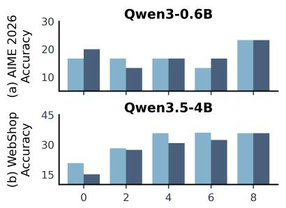

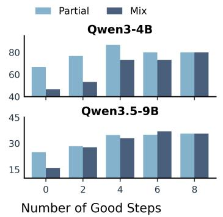

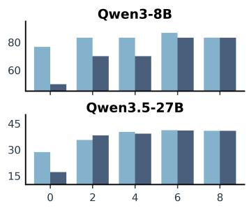  
Figure 2: Workflow recovery across model scales on (a) AIME 2026 and (b) WebShop. For each model, Partial retains the first k good steps, whereas Mix combines k good steps with $8 - k$ bad steps, for $k \in \{ 0 , 2 , 4 , 6 , 8 \}$ . Increasing the number of good steps generally narrows the performance gap between the two regimes, although recovery can be non-monotonic.

where $\tau _ { t }$ is the model trajectory associated with goal $g _ { t }$ . Box2 holds the task and model fixed while intervening only on the workflow W(x).

$\mathbf { B o x } ^ { 2 }$ evaluation design. As summarized in Equation 1, $\mathrm { B o x } ^ { 2 }$ evaluates each task under five conditions that vary the availability and reliability of workflow guidance. No workflow provides the model’s independent performance. Good and Bad workflows measure its response to reliable versus misleading guidance. Partial and Mixed workflows share the same useful prefix, so their comparison isolates misleading continuation from the absence of further guidance.

Workflow construction and verification. A fixed external model serves as a scalable proxy for a human workflow designer. Using only information available during normal task execution, it generates a useful workflow $W ^ { + } ( x ) = ( g _ { 1 } ^ { + } , \ldots , g _ { T } ^ { + } )$ and, for each change point k, a plausible but misleading continuation $C _ { k } ^ { - } ( x ) = ( \tilde { g } _ { k + 1 } ^ { - } , \ldots , \tilde { g } _ { T } ^ { - } )$ . These outputs define

$$
\begin{array} { l l } { { W ^ { G } ( x ) = ( g _ { 1 } ^ { + } , \ldots , g _ { T } ^ { + } ) , \quad } } & { { W ^ { B } ( x ) = C _ { 0 } ^ { - } ( x ) = ( \tilde { g } _ { 1 } ^ { - } , \ldots , \tilde { g } _ { T } ^ { - } ) , } } \\ { { W _ { k } ^ { P } ( x ) = ( g _ { 1 } ^ { + } , \ldots , g _ { k } ^ { + } ) , \quad } } & { { W _ { k } ^ { M } ( x ) = ( g _ { 1 } ^ { + } , \ldots , g _ { k } ^ { + } , \tilde { g } _ { k + 1 } ^ { - } , \ldots , \tilde { g } _ { T } ^ { - } ) . } } \end{array}\tag{2}
$$

The No-workflow condition omits $W ( x )$ , and $k = 0$ yields a workflow that is misleading. An independent verifier checks useful workflows for validity and task relevance, misleading workflows for plausibility and task relevance, and all workflows for answer leakage. Accepted workflows are then frozen and shared across target models.

## 2.2 Evaluation

Benchmarks and models. We evaluate $\mathrm { B o x } ^ { 2 }$ in two complementary settings. The frontier-model evaluation tests $\mathrm { B o x } ^ { 2 }$ capabilities across diverse tasks, while the open-weight evaluation provides a baseline for our training experiments later. (a) Frontier models. We evaluate Gemini 3.7 Flash (Google DeepMind, 2026), DeepSeek V4 Flash (DeepSeek-AI, 2026), and GLM 5.2 (GLM-5-Team et al., 2026) on mathematical reasoning (OpenR1-Math (Ben Allal et al., 2025)), software engineering (DeepSWE (Huang et al., 2026b)), information search (BrowseComp (Wei et $\mathsf { a l . } ,$ 2025)), and tool use (AutomationBench (Shepard & Salimans, 2026)). (b) Open-weight models. We evaluate Qwen3 (Yang et al., 2025) and Qwen3.5 (Qwen Team, 2026) on AIME 2026 (Zhang & Math-AI, 2026) and WebShop (Yao et $\mathsf { a l . , }$ 2022), which also serve as the settings for our training experiments. Across both settings, we retain the original tasks, environments, and evaluators, and share each task’s frozen workflows across models.

Paired workflow effects. Let $S _ { c }$ denote the benchmark-level score under condition $c \in \{ 0 , G , B , P , M \}$ For Partial and Mixed, the score aggregates the prespecified change points. We define four matched effects,

$$
\Delta _ { \sf u s e } = S _ { G } - S _ { 0 } , \qquad \Delta _ { \sf b a d } = S _ { B } - S _ { 0 } , \qquad \Delta _ { \sf s t o p } = S _ { P } - S _ { G } , \qquad \Delta _ { \sf s w i t h } = S _ { M } - S _ { P } .\tag{3}
$$

$\Delta _ { \mathrm { u s e } }$ measures utilization of useful guidance, while $\Delta _ { \mathrm { b a d } }$ measures robustness to guidance that is misleading. $\Delta _ { \mathrm { { s t o p } } }$ and $\Delta _ { \mathrm { s w i t c h } }$ measure recovery when guidance ends or becomes misleading, respectively. These matched comparisons hold the task, environment, evaluator, and model fixed, isolating responses to workflow reliability from absolute task performance.

## 2.3 Benchmark Results

Table 1 evaluates how frontier models respond to workflow guidance when its reliability is fixed or changes during execution.

Using reliable guidance and resisting misleading guidance are distinct capabilities. Good workflows improve performance in eight of the twelve frontier model–task pairs, including gains of 5.9, 13.7, and 16.8 points on AutomationBench. Bad workflows, by contrast, reduce performance in all twelve pairs, with drops ranging from 2.3 to 43.3 points. The open-weight models show the same separation (Table 2): good workflows improve all six model–task pairs, while bad workflows hurt five of six. Thus, the ability to benefit from external guidance does not imply the ability to reject it when it is wrong, revealing a gap between utilization and robustness.

Reliance can persist after guidance becomes unreliable. Mixed workflows underperform their matched Partial workflows in ten of the twelve frontier model–task pairs. Because the two conditions share the same useful prefix and change point, their difference isolates the effect of continuing with misleading guidance rather than receiving no further guidance. The resulting drops show that models often carry forward reliance established by initially useful workflows instead of revising it when reliability changes (Figure 2), revealing inertia in how reliance is updated.

$\mathbf { B o x } ^ { 2 }$ therefore exposes selective reliance as a capability beyond task performance. Reliable agents must decide not only how to use external guidance, but when that guidance should continue to influence behavior. The same limitation appears in open-weight models, motivating us to ask whether this ability can be learned without sacrificing the benefits of reliable workflows.

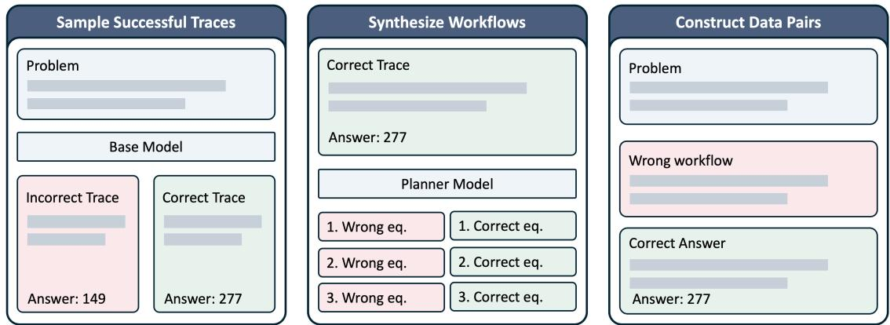  
Figure 3: Construction of counterfactual supervised fine-tuning data. For each problem, we sample the base model to obtain a verified successful trace, which the planner uses to synthesize paired correct and incorrect workflows. Each training example combines the problem and an incorrect workflow with the verified correct response, providing supervision for completing the task despite misleading procedural guidance.

## 3 Learning to Think Outside the Box

Box2 shows that models can benefit from reliable workflows while remaining vulnerable to misleading ones. We next ask whether training can improve robustness without sacrificing utilization. Models receive only bad workflows during training, while good workflows are reserved for evaluation. Let $\pi _ { \theta } ( \tau \mid x , W )$ denote the model’s trajectory distribution for task x under workflow W. The training objectives below constrain this distribution under $W ^ { B } ( x ) ;$ behavior under $W ^ { G } ( x )$ measures generalization to held-out reliable guidance. Training proceeds through counterfactual supervised fine-tuning followed by outcome-based reinforcement learning.

## 3.1 Training with Misleading Workflows

Counterfactual supervised fine-tuning. For each task $x ,$ we sample trajectories from the base model and retain a verified successful trajectory $\tau ^ { + } ( x )$ . A planner uses this trajectory to synthesize a useful workflow $W ^ { G } ( x )$ and a plausible but misleading workflow $W ^ { \tilde { B } } ( x )$ . Only the misleading workflow is used for training. Figure 3 summarizes this three-stage data construction process. We minimize the standard autoregressive negative log-likelihood

$$
\begin{array} { r } { \mathcal { L } _ { \mathrm { S F T } } ( \theta ) = - \mathbb { E } _ { x } \left[ \log \pi _ { \theta } \Big ( \tau ^ { + } ( x ) \ | \ x , W ^ { B } ( x ) \Big ) \right] . } \end{array}\tag{4}
$$

The workflow and target prescribe conflicting strategies, so reducing this loss increases the probability of successful behavior despite misleading guidance. For AIME 2026, $\tau ^ { + } ( x )$ is a complete correct solution. For WebShop, we apply the same construction at each interaction step and use the successful next action as the target.

Table 3: Performance before and after workflow training on AIME 2026 and WebShop. $S _ { P }$ and $S _ { M }$ average the three Partial and Mixed conditions, respectively. Effects report utilization $( S _ { G } - S _ { 0 } )$ robustness $( S _ { B } - S _ { 0 } )$ , and recovery when guidance stops $( S _ { P } - S _ { G } )$ or becomes misleading $( S _ { M } -$ $S _ { P } )$ . RL $\scriptstyle { \mathsf { e n v } }$ uses direct task-outcome rewards on bad-workflow inputs.
<table><tr><td rowspan="2">Model</td><td colspan="5">Performance</td><td colspan="4">Box²-Bench Effects</td></tr><tr><td>Base  $S _ { 0 }$ </td><td>Good  $S _ { G }$ </td><td>Bad  $S _ { B }$ </td><td>Partial  $S _ { P }$ </td><td>Mixed  $S _ { M }$ </td><td>Utilization Robustness  $\Delta _ { \mathrm { u s e } }$ </td><td> $\Delta _ { \mathrm { b a d } }$ </td><td>Recovery  $\Delta _ { \mathrm { { s t o p } } }$ </td><td> $\Delta _ { \mathrm { s w i t c h } }$ </td></tr><tr><td colspan="10"># Math — AIME 2026</td></tr><tr><td>Base</td><td>66.7%</td><td>80.0%</td><td>46.7%</td><td>81.1%</td><td>66.7%</td><td>+13.3</td><td>-20.0</td><td>+1.1</td><td>-14.4</td></tr><tr><td>+ SFT</td><td>73.3%</td><td>70.0%</td><td>66.7%</td><td>74.4%</td><td>70.0%</td><td>-3.3</td><td>-6.7</td><td>+4.4</td><td>-4.4</td></tr><tr><td> $+ \mathbf { \Delta S F T } + \mathbf { R L } _ { \mathrm { e n v } }$ </td><td>73.3%</td><td>80.0%</td><td>56.7%</td><td>73.3%</td><td>74.4%</td><td>+6.7</td><td>-16.7</td><td>-6.7</td><td>+1.1</td></tr><tr><td colspan="10"># Search — WebShop</td></tr><tr><td>Base</td><td>25.2%</td><td>35.6%</td><td>15.4%</td><td>32.7%</td><td>32.6%</td><td>+10.4</td><td>-9.8</td><td>-2.9</td><td>-0.1</td></tr><tr><td>+ SFT</td><td>30.8%</td><td>33.6%</td><td>30.2%</td><td>32.7%</td><td>31.9%</td><td>+2.8</td><td>-0.6</td><td>-0.9</td><td>-0.7</td></tr><tr><td> $+ \mathbf { \Delta S F T } + \mathbf { R L } _ { \mathrm { e n v } }$ </td><td>32.0%</td><td>34.8%</td><td>30.8%</td><td>33.7%</td><td>33.1%</td><td>+2.8</td><td>-1.2</td><td>-1.1</td><td>-0.7</td></tr></table>

Note. Effects measure good-guidance utilization $( \Delta _ { \mathrm { u s e } } ~ = ~ S _ { G } - S _ { 0 } )$ , bad-guidance robustness $( \Delta _ { \mathrm { b a d } } ~ = ~ S _ { B } - S _ { 0 } )$ , and recovery when guidance stops $( \Delta _ { \mathrm { s t o p } } = S _ { P } - S _ { G } )$ or becomes misleading $( \Delta _ { \mathrm { s w i t c h } } = S _ { M } - S _ { P } )$

This objective trains override behavior without uniquely identifying selective reliance. Any two policies that agree on bad-workflow inputs obtain the same SFT loss regardless of how they respond to $W ^ { G } ( \bar { x } )$ . Consequently, both selective rejection and broadly ignoring workflows can fit the training data; preserving held-out utilization must arise through generalization rather than direct supervision.

Outcome-based reinforcement learning. Starting from the SFT checkpoint, we continue training on bad-workflow inputs using task-level outcome rewards. The population objective is

$$
J _ { \mathrm { R L } } ( \theta ) = \mathbb { E } _ { x , \tau \sim \pi _ { \theta } ( \cdot | x , W ^ { B } ( x ) ) } [ R ( x , \tau ) ] ,\tag{5}
$$

where R is binary answer correctness for AIME 2026 and the environment return for WebShop.   
Thus, $J _ { \mathrm { R L } } ( \theta )$ is the probability of success for AIME and the expected task return for WebShop.   
The reward depends only on the outcome and never on agreement with the supplied workflow.

For optimization, we sample G trajectories from the current policy snapshot for each input and compute the group-relative advantage

$$
\widehat { A } _ { i } = \frac { R ( x , \tau _ { i } ) - \mathrm { m e a n } _ { j } R ( x , \tau _ { j } ) } { \mathrm { s t d } _ { j } R ( x , \tau _ { j } ) } .\tag{6}
$$

We retain only groups with non-degenerate rewards. Let $\rho _ { i , t } ( \boldsymbol { \theta } )$ denote the likelihood ratio between the current policy and the policy snapshot that sampled token t of $\tau _ { i }$ . We optimize the clipped token-level loss

$$
\begin{array} { r } { \mathcal { L } _ { \mathrm { R L } } ( \theta ) = - \mathbb { E } _ { i , t } \Big [ \operatorname* { m i n } \Big ( \rho _ { i , t } ( \theta ) \widehat { A } _ { i } , \mathrm { c l i p } \Big ( \rho _ { i , t } ( \theta ) , 1 - \epsilon _ { \mathrm { l o w } } , 1 + \epsilon _ { \mathrm { h i g h } } \Big ) \widehat { A } _ { i } \Big ) \Big ] + \beta D _ { \mathrm { K L } } ( \pi _ { \theta } | | \pi _ { \mathrm { r e f } } ) , } \end{array}\tag{7}
$$

where $\mathbb { E } _ { i , t }$ averages over the generated tokens in the retained groups and $\beta$ controls the optional KL penalty. Unlike SFT, this objective does not privilege one verified trajectory. It rewards any behavior that succeeds despite misleading guidance, allowing the model to discover alternatives to the supervised solution.

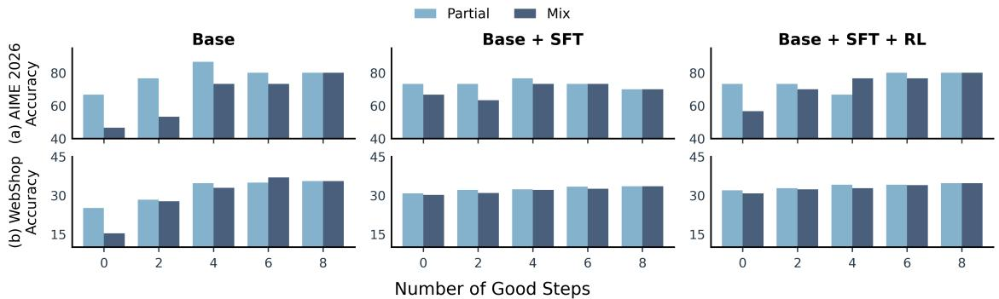  
Figure 4: Workflow recovery across training stages on (a) AIME 2026 and (b) WebShop. The columns compare the base model, SFT model, and SFT model followed by RL under the same partial- and mixed-workflow compositions. SFT generally reduces the separation between the two regimes, while the effect of RL depends on the task and workflow composition.

## 3.2 Training Results

We test whether training on misleading workflows can teach models to override bad guidance while retaining the ability to use reliable guidance. We evaluate the base, SFT, and SFT+RL checkpoints under all five Box2 conditions using Qwen3-4B on AIME 2026 and Qwen3.5-9B on WebShop (Yao et al., 2022).

Counterfactual SFT reduces dependence on misleading workflows. SFT substantially reduces the damage caused by bad guidance on both tasks. On AIME, the bad-workflow penalty shrinks from 20.0 to 6.7 points; on WebShop, it shrinks from 9.8 to 0.6 points (Table 3). This robustness is accompanied by weaker reliance on held-out good workflows, showing that SFT first learns to make workflow guidance defeasible rather than mandatory.

Outcome-based RL recalibrates reliance on guidance. On AIME, RL restores positive utilization of held-out good workflows, raising $\Delta _ { \mathrm { u s e } }$ from −3.3 to +6.7, while retaining a robustness improvement over the base model. On WebShop, the balance established by SFT remains largely stable. Thus, outcome optimization does not simply reverse SFT; it adjusts the degree of workflow reliance after robustness has been established.

Training also improves adaptation when guidance changes reliability. On AIME, the Mixed– Partial gap improves from −14.4 for the base model to −4.4 after SFT and +1.1 after RL (Figure 4). The trained model can therefore recover when useful guidance becomes misleading, rather than remaining locked into the earlier workflow. On WebShop, this gap is already near zero and remains small across training stages, showing that such recovery is improved or preserved across tasks.

Together, the two stages shape complementary aspects of selective reliance: SFT teaches models that external guidance can be overridden, while outcome training restores responsiveness when following guidance is useful, moving the model toward conditional rather than uniform reliance.

## 4 Beyond Workflows

Selective reliance across contexts. Thinking outside the box also matters in information-rich settings, where additional context can help or mislead. Workflow guidance, peer messages, and stored memories provide different forms of such context (Figure 5). Across these settings, models must use helpful information while independently checking questionable content against task constraints and available evidence. We therefore evaluate the workflow-trained checkpoints in multi-agent collaboration and memory-augmented reasoning without further training, testing whether selective reliance extends beyond procedural guidance.

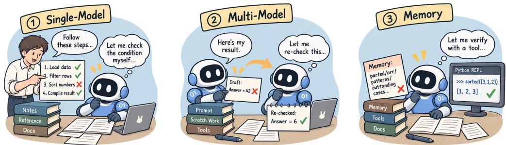  
Figure 5: Selective reliance across sources of context. From left to right, the panels illustrate checking a proposed workflow, revising a peer draft, and verifying a stored claim using tool evidence. The common challenge is to use helpful context without being bound by misleading content. Examples and dialogue are schematic rather than recorded trajectories; correctness markers are explanatory annotations, not model inputs.

Table 4: Memory-conditioned performance on LongMemEval-V2-Small. Score denotes answer accuracy, and Tool Rate denotes the proportion of trajectories invoking the archive tools; Base denotes no memory brief.
<table><tr><td rowspan="2">Model</td><td colspan="2">Base</td><td colspan="2">Good</td><td colspan="2">Bad</td></tr><tr><td>Score</td><td>Tool Rate</td><td>Score</td><td>Tool Rate</td><td>Score</td><td>Tool Rate</td></tr><tr><td colspan="7"># Memory — LongMemEval-V2-Small</td></tr><tr><td>Base</td><td>21.1%</td><td>100.0%</td><td>95.6%</td><td>72.2%</td><td>10.0%</td><td>65.6%</td></tr><tr><td>+ SFT</td><td>28.9%</td><td>100.0%</td><td>92.2%</td><td>72.2%</td><td>14.4%</td><td>72.2%</td></tr><tr><td> $+ \mathbf { S F T } + R L _ { \mathrm { e n v } }$ </td><td>25.6%</td><td>100.0%</td><td>94.4%</td><td>66.7%</td><td>13.3%</td><td>74.4%</td></tr></table>

Multi-agent collaboration. We test whether workflow training extends to selective use of peer information in multi-agent reasoning. We evaluate our checkpoints in the adaptive decentralized environment of Economy of Minds (EoM) (Qi et al., 2026), where four agents share model weights but maintain separate identities, memories, and economic states. For each of 30 AIME 2026 problems, the agents interact for five consecutive episodes before reset. We track episode success and peer-induced revisions, distinguishing repairs (wrong → correct) from corruptions (correct → wrong).

Figure 6 shows that SFT raises episode success from 18.00% to 22.67%, while SFT+RL achieves 18.67%. SFT also shifts peer influence toward beneficial revisions, producing 11 repairs and only one corruption, compared with two of each for Base. SFT+RL produces five repairs and three corruptions. Overall, our approach extends selective reliance beyond workflows to peer information, although the gains are not monotonic across training stages.

Memory-augmented reasoning. We test whether workflow training extends to selective use of stored information. We evaluate our checkpoints on LongMemEval-V2-Small, following Long-MemEval V2 (Wu et al., 2026). The model receives no memory brief, reliable memory, or corrupted memory while retaining access to the archive for verification. We measure both answer accuracy and archive use, which captures whether the model verifies stored information before relying on it.

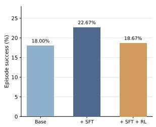  
(a) Episode success.

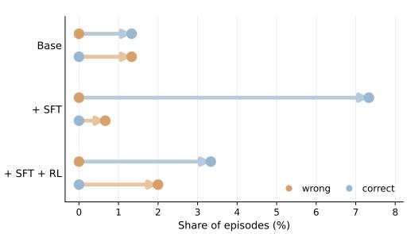  
(b) Cross-agent answer revision.

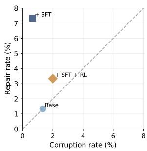  
(c) Revision balance.  
Figure 6: Adaptive EoM evaluation on AIME 2026. In (b), each model’s upper and lower rows show wrong-to-correct and correct-to-wrong revisions, respectively; endpoint colors indicate answer states, and their horizontal separation gives the corresponding rate. The dashed diagonal in (c) marks equal repair and corruption rates. All rates are normalized by 150 episodes (30 problems × 5 episodes).

Table 4 shows that training preserves the benefit of reliable memory while improving robustness to corrupted memory. It also changes verification behavior: the base model consults the archive less often under corrupted memory than reliable memory, whereas training removes and eventually reverses this gap. Our approach extends selective reliance beyond workflows to stored information, encouraging models to use reliable memory while verifying potentially misleading records.

## 5 Related Work

Frontier Capability and Fallible Procedural Priors. LLM agents have progressed from in-context prompting to agent harnesses that structure planning, search, feedback, and tool use (Yao et al., 2023b; Shinn et al., 2023; Yao et al., 2023a; Zhou et al., 2024; Liu et al., 2025). A common strategy is to encode task-specific procedural priors through prompts, roles, and workflows, guiding models toward more effective execution (Sarukkai et al., 2025; Zhou et al., 2025; Lu et al., 2025). This approach is particularly useful when model capability is limited, but frontier agents now exhibit strong performance across a wide range of complex tasks (Huang et al., 2026a; GLM-5-Team et al., 2026; Merrill et al., 2026; Wei et al., 2025; Wijk et al., 2025; Kwa et al., 2025). As executor capability increases, we ask whether capable models can benefit from externally designed workflows when they help while remaining robust when they do not provide the best execution path.

Harness Generalization across Models and Tasks. Harness effectiveness is highly dependent on the model and task: a workflow that helps one executor or setting may provide little benefit, or even become harmful, in another (Yao et al., 2026; Gupta et al., 2026; Belikova et al., 2026; Yu et al., 2026; Wang et al., 2026a). Existing work therefore focuses largely on adapting the harness itself, through search, repair, or specialization for particular models and deployment settings (Lee et al., 2026; Zhang et al., 2026). Yet in deployment, changes in the executor, task, or environment can leave an existing harness mismatched (Das et al., 2025; Rawles et al., 2025; Wang et al., 2024).

Box2 studies the complementary question: whether the executor itself can adapt, benefiting from useful workflow guidance without being constrained by guidance that no longer fits.

Benchmarking Selective Procedural Reliance. Recent agent benchmarks measure task completion or procedural compliance. Outcome-oriented benchmarks evaluate execution across software engineering, web search, terminal use, automation, and research (Huang et al., 2026b; Wei et al., 2025; Merrill et al., 2026; Shepard & Salimans, 2026; Edwards et al., 2026), while procedureoriented benchmarks test adherence to instructions, guidelines, and workflows (Qi et al., 2025; Diao et al., 2025; He et al., 2026; Nandi et al., 2026; Wang et al., 2026b; Jia et al., 2026). Related work varies guidance quality, instruction priority, or harness configuration (Zhou et al., 2026; Mc-Cauley et al., 2026; Cao et al., 2026; Yao et al., 2026), but does not isolate when workflow guidance should be followed or overridden. Box2-Bench varies workflow validity while holding task and model fixed. It tests whether models use good guidance and resist bad guidance.

## 6 Conclusion

In this paper, we introduce thinking outside the box, the ability to regulate reliance on external guidance, and Box2-Bench, a matched evaluation that separates this meta-capability from task performance. We show that models can benefit from useful workflows yet remain vulnerable to misleading guidance. We further show that training only on bad workflows can improve robustness, although preserving the benefits of useful guidance remains challenging. The resulting behavior also shows preliminary transfer to multi-agent collaboration and memory-augmented reasoning. Together, these results suggest that selective reliance is a general ingredient of reliable agent behavior whenever external information is useful but fallible. Several directions remain open for future study. (i) We use a fixed external model as a scalable proxy for human workflow designers, and future work should evaluate guidance written by people with more diverse intentions and error patterns. (ii) Box2 varies reliability through controlled and frozen workflows, leaving interactive, ambiguous, partially correct, and model-adaptive guidance to future study.

## References

Julia Belikova, Rauf Parchiev, Evgeny Egorov, Grigorii Davydenko, Gleb Gusev, Andrey Savchenko, and Maksim Makarenko. Managing procedural memory in llm agents: Control, adaptation, and evaluation. arXiv preprint arXiv:2606.23127, 2026. URL https://arxiv. org/abs/2606.23127.

Loubna Ben Allal, Lewis Tunstall, Anton Lozhkov, Elie Bakouch, Guilherme Penedo, Hynek Kydlicek, and Gabriel Mart´ın Blazquez. Open r1: Update #2. Hugging Face Blog, February 2025.´ URL https://huggingface.co/blog/open-r1/update-2.

Hongliu Cao, Ilias Driouich, and Eoin Thomas. Beyond task completion: Revealing corrupt success in llm agents through procedure-aware evaluation. arXiv preprint arXiv:2603.03116, 2026. URL https://arxiv.org/abs/2603.03116.

Sarkar Snigdha Sarathi Das, Ryo Kamoi, Bo Pang, Yusen Zhang, Caiming Xiong, and Rui Zhang. GReaTer: Gradients over reasoning makes smaller language models strong prompt optimizers. In International Conference on Learning Representations, 2025. URL https://proceedings.iclr.cc/paper\_files/paper/2025/hash/ 18a42aad2fa8aa871e2ee20d425c208d-Abstract-Conference.html.

DeepSeek-AI. Deepseek-v4: Towards highly efficient million-token context intelligence, 2026. URL https://arxiv.org/abs/2606.19348.

Xiang Deng, Jeff Da, Edwin Pan, Yannis Yiming He, Charles Ide, Kanak Garg, Niklas Lauffer, Andrew Park, Nitin Pasari, Chetan Rane, Karmini Sampath, Maya Krishnan, Srivatsa Kundurthy, Sean Hendryx, Zifan Wang, Chen Bo Calvin Zhang, Noah Jacobson, Bing Liu, and Brad Kenstler. SWE-Bench Pro: Can AI agents solve long-horizon software engineering tasks? arXiv preprint arXiv:2509.16941, 2025. URL https://arxiv.org/abs/2509.16941.

Lingxiao Diao, Xinyue Xu, Wanxuan Sun, Cheng Yang, and Zhuosheng Zhang. Guidebench: Benchmarking domain-oriented guideline following for llm agents. In Proceedings of the 63rd Annual Meeting ofthe Associationfor Computational Linguistics (Volume 1: Long Papers), pp. 11361– 11399. Association for Computational Linguistics, 2025. doi: 10.18653/v1/2025.acl-long.557. URL https://aclanthology.org/2025.acl-long.557/.

Nicholas Edwards, Yukyung Lee, Yujun Audrey Mao, Yulu Qin, Sebastian Schuster, and Najoung Kim. Rexbench: Can coding agents autonomously implement ai research extensions? In Proceedings of the 64th Annual Meeting of the Association for Computational Linguistics (Volume 1: Long Papers), pp. 16380–16417. Association for Computational Linguistics, 2026. doi: 10.18653/v1/ 2026.acl-long.745. URL https://aclanthology.org/2026.acl-long.745/.

Tony Feng, Trieu H. Trinh, Garrett Bingham, Dawsen Hwang, Yuri Chervonyi, Junehyuk Jung, Joonkyung Lee, Carlo Pagano, Sang-hyun Kim, Federico Pasqualotto, Sergei Gukov, Jonathan N. Lee, Junsu Kim, Kaiying Hou, Golnaz Ghiasi, Yi Tay, YaGuang Li, Chenkai Kuang, Yuan Liu, Hanzhao Lin, Evan Zheran Liu, Nigamaa Nayakanti, Xiaomeng Yang, Heng-Tze Cheng, Demis Hassabis, Koray Kavukcuoglu, Quoc V. Le, and Thang Luong. Towards autonomous mathematics research. arXiv preprint arXiv:2602.10177, 2026. URL https: //arxiv.org/abs/2602.10177.

GLM-5-Team, :, Aohan Zeng, Xin Lv, Zhenyu Hou, Zhengxiao Du, Qinkai Zheng, Bin Chen, Da Yin, Chendi Ge, Chenghua Huang, Chengxing Xie, Chenzheng Zhu, Congfeng Yin, Cunxiang Wang, Gengzheng Pan, Hao Zeng, Haoke Zhang, Haoran Wang, Huilong Chen, Jiajie

Zhang, Jian Jiao, Jiaqi Guo, Jingsen Wang, Jingzhao Du, Jinzhu Wu, Kedong Wang, Lei Li, Lin Fan, Lucen Zhong, Mingdao Liu, Mingming Zhao, Pengfan Du, Qian Dong, Rui Lu, Shuang-Li, Shulin Cao, Song Liu, Ting Jiang, Xiaodong Chen, Xiaohan Zhang, Xuancheng Huang, Xuezhen Dong, Yabo Xu, Yao Wei, Yifan An, Yilin Niu, Yitong Zhu, Yuanhao Wen, Yukuo Cen, Yushi Bai, Zhongpei Qiao, Zihan Wang, Zikang Wang, Zilin Zhu, Ziqiang Liu, Zixuan Li, Bojie Wang, Bosi Wen, Can Huang, Changpeng Cai, Chao Yu, Chen Li, Chengwei Hu, Chenhui Zhang, Dan Zhang, Daoyan Lin, Dayong Yang, Di Wang, Ding Ai, Erle Zhu, Fangzhou Yi, Feiyu Chen, Guohong Wen, Hailong Sun, Haisha Zhao, Haiyi Hu, Hanchen Zhang, Hanrui Liu, Hanyu Zhang, Hao Peng, Hao Tai, Haobo Zhang, He Liu, Hongwei Wang, Hongxi Yan, Hongyu Ge, Huan Liu, Huanpeng Chu, Jia’ni Zhao, Jiachen Wang, Jiajing Zhao, Jiamin Ren, Jiapeng Wang, Jiaxin Zhang, Jiayi Gui, Jiayue Zhao, Jijie Li, Jing An, Jing Li, Jingwei Yuan, Jinhua Du, Jinxin Liu, Junkai Zhi, Junwen Duan, Kaiyue Zhou, Kangjian Wei, Ke Wang, Keyun Luo, Laiqiang Zhang, Leigang Sha, Liang Xu, Lindong Wu, Lintao Ding, Lu Chen, Minghao Li, Nianyi Lin, Pan Ta, Qiang Zou, Rongjun Song, Ruiqi Yang, Shangqing Tu, Shangtong Yang, Shaoxiang Wu, Shengyan Zhang, Shijie Li, Shuang Li, Shuyi Fan, Wei Qin, Wei Tian, Weining Zhang, Wenbo Yu, Wenjie Liang, Xiang Kuang, Xiangmeng Cheng, Xiangyang Li, Xiaoquan Yan, Xiaowei Hu, Xiaoying Ling, Xing Fan, Xingye Xia, Xinyuan Zhang, Xinze Zhang, Xirui Pan, Xu Zou, Xunkai Zhang, Yadi Liu, Yandong Wu, Yanfu Li, Yidong Wang, Yifan Zhu, Yijun Tan, Yilin Zhou, Yiming Pan, Ying Zhang, Yinpei Su, Yipeng Geng, Yong Yan, Yonglin Tan, Yuean Bi, Yuhan Shen, Yuhao Yang, Yujiang Li, Yunan Liu, Yunqing Wang, Yuntao Li, Yurong Wu, Yutao Zhang, Yuxi Duan, Yuxuan Zhang, Zezhen Liu, Zhengtao Jiang, Zhenhe Yan, Zheyu Zhang, Zhixiang Wei, Zhuo Chen, Zhuoer Feng, Zijun Yao, Ziwei Chai, Ziyuan Wang, Zuzhou Zhang, Bin Xu, Minlie Huang, Hongning Wang, Juanzi Li, Yuxiao Dong, and Jie Tang. Glm-5: from vibe coding to agentic engineering, 2026. URL https://arxiv.org/abs/2602.15763.

Google DeepMind. Gemini 3.7 flash model card. https://deepmind.google/models/ model-cards/gemini-3-7-flash, 2026. Accessed 2026-08-13.

Shengyue Guan, Yihao Liu, and Lang Cao. Supchain-bench: Benchmarking large language models for real-world supply chain management. In Findings of the Association for Computational Linguistics: ACL 2026, pp. 7526–7550. Association for Computational Linguistics, 2026. doi: 10.18653/v1/2026.findings-acl.371. URL https://aclanthology.org/2026. findings-acl.371/.

Akshat Gupta, Jermaine Lei, Alexander Lu, Gopala Anumanchipalli, and Leshem Choshen. Automated discovery has no universally superior harness. arXiv preprint arXiv:2607.18235, 2026. URL https://arxiv.org/abs/2607.18235.

Yun He, Wenzhe Li, Hejia Zhang, Songlin Li, Karishma Mandyam, Sopan Khosla, Yuanhao Xiong, Nanshu Wang, Xiaoliang Peng, Beibin Li, Shengjie Bi, Shishir G. Patil, Qi Qi, Shengyu Feng, Julian Katz-Samuels, Richard Yuanzhe Pang, Sujan Kumar Gonugondla, Hunter Lang, Yue Yu, Yundi Qian, Maryam Fazel-Zarandi, Licheng Yu, Amine Benhalloum, Hany Hassan Awadalla, and Manaal Faruqui. Advancedif: Rubric-based benchmarking and reinforcement learning for advancing llm instruction following. In Proceedings of the 64th Annual Meeting of the Association for Computational Linguistics (Volume 1: Long Papers), pp. 18003–18022, 2026. doi: 10.18653/v1/ 2026.acl-long.820. URL https://aclanthology.org/2026.acl-long.820/.

Ailin Huang, Ang Li, Aobo Kong, Bin Wang, Binxing Jiao, Bo Dong, Bojun Wang, Boyu Chen, Brian Li, Buyun Ma, Chang Su, Changxin Miao, Changyi Wan, Chao Lou, Chen Hu, Chen Xu, Chenfeng Yu, Chengting Feng, Chengyuan Yao, Chunrui Han, Dan Ma, Dapeng Shi, Daxin Jiang, Dehua Ma, Deshan Sun, Di Qi, Enle Liu, Fajie Zhang, Fanqi Wan, Guanzhe Huang, Gulin Yan, Guoliang Cao, Guopeng Li, Han Cheng, Hangyu Guo, Hanshan Zhang, Hao Nie, Haonan

Jia, Haoran Lv, Hebin Zhou, Hekun Lv, Heng Wang, Heung-Yeung Shum, Hongbo Huang, Hongbo Peng, Hongyu Zhou, Hongyuan Wang, Houyong Chen, Huangxi Zhu, Huimin Wu, Huiyong Guo, Jia Wang, Jian Zhou, Jianjian Sun, Jiaoren Wu, Jiaran Zhang, Jiashu Lv, Jiashuo Liu, Jiayi Fu, Jiayu Liu, Jie Cheng, Jie Luo, Jie Yang, Jie Zhou, Jieyi Hou, Jing Bai, Jingcheng Hu, Jingjing Xie, Jingwei Wu, Jingyang Zhang, Jishi Zhou, Junfeng Liu, Junzhe Lin, Ka Man Lo, Kai Liang, Kaibo Liu, Kaijun Tan, Kaiwen Yan, Kaixiang Li, Kang An, Kangheng Lin, Lei Yang, Liang Lv, Liang Zhao, Liangyu Chen, Lieyu Shi, Liguo Tan, Lin Lin, Lina Chen, Luck Ma, Mengqiang Ren, Michael Li, Ming Li, Mingliang Li, Mingming Zhang, Mingrui Chen, Mitt Huang, Na Wang, Peng Liu, Qi Han, Qian Zhao, Qinglin He, Qinxin Du, Qiuping Wu, Quan Sun, Rongqiu Yang, Ruihang Miao, Ruixin Han, Ruosi Wan, Ruyan Guo, Shan Wang, Shaoliang Pang, Shaowen Yang, Shengjie Fan, Shijie Shang, Shiliang Yang, Shiwei Li, Shuangshuang Tian, Siqi Liu, Siye Wu, Siyu Chen, Song Yuan, Tiancheng Cao, Tianchi Yue, Tianhao Cheng, Tianning Li, Tingdan Luo, Wang You, Wei Ji, Wei Yuan, Wei Zhang, Weibo Wu, Weihao Xie, Wen Sun, Wenjin Deng, Wenzhen Zheng, Wuxun Xie, Xiangfeng Wang, Xiangwen Kong, Xiangyu Liu, Xiangyu Zhang, Xiaobo Yang, Xiaojia Liu, Xiaolan Yuan, Xiaoran Jiao, Xiaoxiao Ren, Xiaoyun Zhang, Xin Li, Xin Liu, Xin Wu, Xing Chen, Xingping Yang, Xinran Wang, Xu Zhao, Xuan He, Xuanti Feng, Xuedan Cai, Xuqiang Zhou, Yanbo Yu, Yang Li, Yang Xu, Yanlin Lai, Yanming Xu, Yaoyu Wang, Yeqing Shen, Yibo Zhu, Yichen Lv, Yicheng Cao, Yifeng Gong, Yijing Yang, Yikun Yang, Yin Zhao, Yingxiu Zhao, Yinmin Zhang, Yitong Zhang, Yixuan Zhang, Yiyang Chen, Yongchi Zhao, Yongshen Long, Yongyao Wang, Yousong Guan, Yu Zhou, Yuang Peng, Yuanhao Ding, Yuantao Fan, Yuanwei Lu, Yuanzhen Yang, Yuchu Luo, Yudi Zhao, Yue Peng, Yueqiang Lin, Yufan Lu, Yuling Zhao, Yunzhou Ju, Yurong Zhang, Yusheng Li, Yuxiang Yang, Yuyang Chen, Yuzhu Cai, Zejia Weng, Zetao Hong, Zexi Li, Zhe Xie, Zheng Ge, Zheng Gong, Zheng Zeng, Zhenyi Lu, Zhewei Huang, Zhichao Chang, Zhiguo Huang, Zhiheng Hu, Zidong Yang, Zili Wang, Ziqi Ren, Zixin Zhang, and Zixuan Wang. Step 3.5 flash: Open frontierlevel intelligence with 11b active parameters, 2026a. URL https://arxiv.org/abs/2602. 10604.

Wenqi Huang, Charley Lee, Leonard Tng, and Serena Ge. Deepswe: Measuring frontier coding agents on original, long-horizon engineering tasks. arXiv preprint arXiv:2607.07946, 2026b. URL https://arxiv.org/abs/2607.07946.

Qi Jia, Ye Shen, Xiujie Song, Kaiwei Zhang, Shibo Wang, Dun Pei, Xiangyang Zhu, and Guangtao Zhai. One battle after another: Probing llms’ limits on multi-turn instruction following with a benchmark evolving framework. In Proceedings of the 64th Annual Meeting of the Association for Computational Linguistics (Volume 1: Long Papers), pp. 9574–9590. Association for Computational Linguistics, 2026. doi: 10.18653/v1/2026.acl-long.433. URL https://aclanthology.org/ 2026.acl-long.433/.

Po-Nien Kung, Linfeng Song, Dawsen Hwang, Jinsung Yoon, Chun-Liang Li, Simone Severini, Mirek Olsˇak, Edward Lockhart, Quoc V. Le, Burak Gokturk, Thang Luong, Tomas Pfister, and´ Nanyun Peng. LEAP: Supercharging LLMs for formal mathematics with agentic frameworks. arXiv preprint arXiv:2606.03303, 2026. URL https://arxiv.org/abs/2606.03303.

Thomas Kwa, Ben West, Joel Becker, Amy Deng, Katharyn Garcia, Max Hasin, Sami Jawhar, Megan Kinniment, Nate Rush, Sydney Von Arx, Ryan Bloom, Thomas Broadley, Haoxing Du, Brian Goodrich, Nikola Jurkovic, Luke Miles, Seraphina Nix, Tao Lin, Neev Parikh, David Rein, Lucas Jun Koba Sato, Hjalmar Wijk, Daniel Ziegler, Elizabeth Barnes, and Lawrence Chan. Measuring ai ability to complete long software tasks. In Advances in Neural Information Processing Systems, volume 38, 2025. URL https://proceedings.neurips.cc/paper\_files/paper/2025/hash/ 85069585133c4c168c865e65d72e9775-Abstract-Conference.html.

Yoonho Lee, Roshen Nair, Qizheng Zhang, Kangwook Lee, Omar Khattab, and Chelsea Finn. Meta-harness: End-to-end optimization of model harnesses. arXiv preprint arXiv:2603.28052, 2026. URL https://arxiv.org/abs/2603.28052.

Keyu Li, Junhao Shi, Yang Xiao, Mohan Jiang, Jie Sun, Yunze Wu, Dayuan Fu, Shijie Xia, Xiaojie Cai, Tianze Xu, Weiye Si, Wenjie Li, Dequan Wang, and Pengfei Liu. AgencyBench: Benchmarking the frontiers of autonomous agents in 1m-token real-world contexts. In Proceedings of the 64th Annual Meeting of the Association for Computational Linguistics (Volume 1: Long Papers), pp. 7422–7440. Association for Computational Linguistics, 2026a. doi: 10.18653/v1/2026.acl-long. 337. URL https://aclanthology.org/2026.acl-long.337/.

Zhuofeng Li, Haoxiang Zhang, Seungju Han, Sheng Liu, Jianwen Xie, Yu Zhang, Yejin Choi, James Zou, and Pan Lu. In-the-flow agentic system optimization for effective planning and tool use, 2026b. URL https://arxiv.org/abs/2510.05592.

Hanchao Liu, Rongjun Li, Weimin Xiong, Ziyu Zhou, and Wei Peng. Workteam: Constructing workflows from natural language with multi-agents. In Proceedings of the 2025 Conference of the Nations of the Americas Chapter of the Association for Computational Linguistics: Human Language Technologies (Volume 3: Industry Track), pp. 20–35. Association for Computational Linguistics, 2025. doi: 10.18653/v1/2025.naacl-industry.3. URL https://aclanthology.org/2025. naacl-industry.3/.

Chris Lu, Cong Lu, Robert Tjarko Lange, Yutaro Yamada, Shengran Hu, Jakob Foerster, David Ha, and Jeff Clune. Towards end-to-end automation of AI research. Nature, 651:914–919, 2026. doi: 10.1038/s41586-026-10265-5. URL https://www.nature.com/articles/ s41586-026-10265-5.

Kai Lu, Shixiong Xu, Jinqiu Li, Kun Ding, and Gaofeng Meng. Agent reviewers: Domain-specific multimodal agents with shared memory for paper review. In Proceedings of the 42nd International Conference on Machine Learning, volume 267 of Proceedings of Machine Learning Research, pp. 40803–40830. PMLR, 2025. URL https://proceedings.mlr.press/v267/lu25p.html.

Jianhao Ma and Yuxin Chen. A lower bound for stepsize-based acceleration of gradient descent. arXiv preprint arXiv:2608.10418, 2026. URL https://arxiv.org/abs/2608.10418.

Conor McCauley, Zeliang Kan, and Jason Martin. Ih-benchmark: A conflict-centered benchmark for instruction-hierarchy robustness in llm applications. arXiv preprint arXiv:2607.25987, 2026. URL https://arxiv.org/abs/2607.25987.

Mike A. Merrill, Alexander G. Shaw, Nicholas Carlini, Boxuan Li, Harsh Raj, Ivan Bercovich, Lin Shi, Jeong Yeon Shin, Thomas Walshe, E. Kelly Buchanan, Junhong Shen, Guanghao Ye, Haowei Lin, Jason Poulos, Maoyu Wang, Marianna Nezhurina, Jenia Jitsev, Di Lu, Orfeas Menis Mastromichalakis, Zhiwei Xu, Zizhao Chen, Yue Liu, Robert Zhang, Leon Liangyu Chen, Anurag Kashyap, Jan-Lucas Uslu, Jeffrey Li, Jianbo Wu, Minghao Yan, Song Bian, Vedang Sharma, Ke Sun, Steven Dillmann, Akshay Anand, Andrew Lanpouthakoun, Bardia Koopah, Changran Hu, Etash Guha, Gabriel H. S. Dreiman, Jiacheng Zhu, Karl Krauth, Li Zhong, Niklas Muennighoff, Robert Amanfu, Shangyin Tan, Shreyas Pimpalgaonkar, Tushar Aggarwal, Xiangning Lin, Xin Lan, Xuandong Zhao, Yiqing Liang, Yuanli Wang, Zilong Wang, Changzhi Zhou, David Heineman, Hange Liu, Harsh Trivedi, John Yang, Junhong Lin, Manish Shetty, Michael Yang, Nabil Omi, Negin Raoof, Shanda Li, Terry Yue Zhuo, Wuwei Lin, Yiwei Dai, Yuxin Wang, Wenhao Chai, Shang Zhou, Dariush Wahdany, Ziyu She, Jiaming Hu, Zhikang Dong, Yuxuan Zhu, Sasha Cui, Ahson Saiyed, Arinbjorn Kolbeinsson, Jesse Hu, Christopher Michael Rytting,¨

Ryan Marten, Yixin Wang, Alex Dimakis, Andy Konwinski, and Ludwig Schmidt. Terminalbench: Benchmarking agents on hard, realistic tasks in command line interfaces. 2026. URL https://arxiv.org/abs/2601.11868.

Subhrangshu Nandi, Arghya Datta, Rohith Nama, Udita Patel, Nikhil Vichare, Indranil Bhattacharya, Shivam Asija, Arushi Gupta, Giuseppe Carenini, Jing Xu, et al. Sop-bench: Complex industrial sops for evaluating llm agents. In Proceedings of the 32nd ACM SIGKDD Conference on Knowledge Discovery and Data Mining V. 2, pp. 9604–9615, 2026.

Yunjia Qi, Hao Peng, Xiaozhi Wang, Amy Xin, Youfeng Liu, Bin Xu, Lei Hou, and Juanzi Li. Agentif: Benchmarking large language models instruction following ability in agentic scenarios. In Advances in Neural Information Processing Systems, volume 38, 2025. URL https://proceedings.neurips.cc/paper\_files/paper/2025/hash/ 51bb3a8a33610a25aae074bfc51b1b1f-Abstract-Datasets\_and\_Benchmarks\_ Track.html.

Zhenting Qi, Huangyuan Su, Ao Qu, Chenyu Wang, Yu Yao, Han Zheng, Kushal Chattopadhyay, Guowei Xu, Zihan Wang, Weirui Ye, Vijay Janapa Reddi, Ju Li, Paul Pu Liang, Himabindu Lakkaraju, Sham Kakade, and Yilun Du. Economy of minds: Emerging multi-agent intelligence with economic interactions, 2026. URL https://arxiv.org/abs/2606.02859.

Qwen Team. Qwen3.5: Towards native multimodal agents, February 2026. URL https://qwen. ai/blog?id=qwen3.5.

Chris Rawles, Sarah Clinckemaillie, Yifan Chang, Jonathan Waltz, Gabrielle Lau, Marybeth Fair, Alice Li, William Bishop, Wei Li, Folawiyo Campbell-Ajala, Daniel Toyama, Robert Berry, Divya Tyamagundlu, Timothy Lillicrap, and Oriana Riva. AndroidWorld: A dynamic benchmarking environment for autonomous agents. In International Conference on Learning Representations, 2025. URL https://proceedings.iclr.cc/paper\_files/paper/2025/hash/ 01a83bc2f2732a58e6aa731e659e7101-Abstract-Conference.html.

Jianhao Ruan, Zhihao Xu, Yiran Peng, Fashen Ren, Zhaoyang Yu, Xinbing Liang, Jinyu Xiang, Bang Liu, Chenglin Wu, Yuyu Luo, and Jiayi Zhang. AOrchestra: Automating subagent creation for agentic orchestration. arXiv preprint arXiv:2602.03786, 2026. URL https: //arxiv.org/abs/2602.03786.

Vishnu Sarukkai, Zhiqiang Xie, and Kayvon Fatahalian. Self-generated in-context examples improve llm agents for sequential decision-making tasks. In Advances in Neural Information Processing Systems, volume 38, 2025. doi: 10.52202/085713-2158. URL https://proceedings.neurips.cc/paper\_files/paper/2025/hash/ 5d1f02132ef51602adf07000ca5b6138-Abstract-Conference.html.

Yu Shang, Yu Li, Keyu Zhao, Likai Ma, Jiahe Liu, Fengli Xu, and Yong Li. Agentsquare: Automatic llm agent search in modular design space. In International Conference on Learning Representations, 2025. URL https://proceedings.iclr.cc/paper\_files/paper/2025/hash 0ae94013da7cd459402fd77874e09ee3-Abstract-Conference.html.

Daniel Shepard and Robin Salimans. Automationbench. arXiv preprint arXiv:2604.18934, 2026. URL https://arxiv.org/abs/2604.18934.

Noah Shinn, Federico Cassano, Ashwin Gopinath, Karthik Narasimhan, and Shunyu Yao. Reflexion: Language agents with verbal reinforcement learning. In Advances in Neural Information Processing Systems, volume 36, 2023. doi: 10.52202/075280-0377. URL https://doi.org/ 10.52202/075280-0377.

Boyuan Wang, Bochao Li, Minghan Wang, Yuxin Tao, and Fang Kong. Harnesses for inferencetime alignment over execution trajectories. arXiv preprint arXiv:2605.21516, 2026a. URL https: //arxiv.org/abs/2605.21516.

Jiaming Wang, Zhe Tang, Zehao Jin, Hefei Chen, Yilin Jin, Peng Ding, Xiaoyu Li, and Xuezhi Cao. Sop-maze: Evaluating large language models on complicated business standard operating procedures. In Findings of the Association for Computational Linguistics: ACL 2026, pp. 14568– 14588. Association for Computational Linguistics, 2026b. doi: 10.18653/v1/2026.findings-acl. 715. URL https://aclanthology.org/2026.findings-acl.715/.

Zora Zhiruo Wang, Jiayuan Mao, Daniel Fried, and Graham Neubig. Agent workflow memory. arXiv preprint arXiv:2409.07429, 2024. URL https://arxiv.org/abs/2409.07429.

Jason Wei, Zhiqing Sun, Spencer Papay, Scott McKinney, Jeffrey Han, Isa Fulford, Hyung Won Chung, Alex Tachard Passos, William Fedus, and Amelia Glaese. Browsecomp: A simple yet challenging benchmark for browsing agents. arXiv preprint arXiv:2504.12516, 2025. URL https://arxiv.org/abs/2504.12516.

Hjalmar Wijk, Tao Roa Lin, Joel Becker, Sami Jawhar, Neev Parikh, Thomas Broadley, Lawrence Chan, Michael Chen, Joshua M. Clymer, Jai Dhyani, Elena Ericheva, Katharyn Garcia, Brian Goodrich, Nikola Jurkovic, Megan Kinniment, Aron Lajko, Seraphina Nix, Lucas Jun Koba Sato, William Saunders, Maksym Taran, Ben West, and Elizabeth Barnes. RE-bench: Evaluating frontier AI r&d capabilities of language model agents against human experts. In Proceedings of the 42nd International Conference on Machine Learning, volume 267 of Proceedings of Machine Learning Research, pp. 66772–66832. PMLR, 2025. URL https://proceedings. mlr.press/v267/wijk25a.html.

Di Wu, Zixiang Ji, Asmi Kawatkar, Bryan Kwan, Jia-Chen Gu, Nanyun Peng, and Kai-Wei Chang. Longmemeval-v2: Evaluating long-term agent memory toward experienced colleagues, 2026. URL https://arxiv.org/abs/2605.12493.

An Yang, Anfeng Li, Baosong Yang, Beichen Zhang, Binyuan Hui, Bo Zheng, Bowen Yu, Chang Gao, Chengen Huang, Chenxu Lv, Chujie Zheng, Dayiheng Liu, Fan Zhou, Fei Huang, Feng Hu, Hao Ge, Haoran Wei, Huan Lin, Jialong Tang, Jian Yang, Jianhong Tu, Jianwei Zhang, Jianxin Yang, Jiaxi Yang, Jing Zhou, Jingren Zhou, Junyang Lin, Kai Dang, Keqin Bao, Kexin Yang, Le Yu, Lianghao Deng, Mei Li, Mingfeng Xue, Mingze Li, Pei Zhang, Peng Wang, Qin Zhu, Rui Men, Ruize Gao, Shixuan Liu, Shuang Luo, Tianhao Li, Tianyi Tang, Wenbiao Yin, Xingzhang Ren, Xinyu Wang, Xinyu Zhang, Xuancheng Ren, Yang Fan, Yang Su, Yichang Zhang, Yinger Zhang, Yu Wan, Yuqiong Liu, Zekun Wang, Zeyu Cui, Zhenru Zhang, Zhipeng Zhou, and Zihan Qiu. Qwen3 technical report, 2025. URL https://arxiv.org/abs/2505. 09388.

Matthew Yang, Hao Bai, Ian Wu, Gene Yang, Amrith Setlur, and Aviral Kumar. Int: Self-proposed interventions enable credit assignment in llm reasoning. In C. Vondrick, B. Hariharan, C. Raffel, L. Pinto, D. Yang, and A. Faust (eds.), International Conference on Learning Representations, volume 2026, pp. 85054–85091, 2026. URL https://proceedings.iclr.cc/paper\_files/ paper/2026/file/89062e4d480c0c3a88d36c20c5694459-Paper-Conference. pdf.

Shunyu Yao, Howard Chen, John Yang, and Karthik Narasimhan. Webshop: Towards scalable real-world web interaction with grounded language agents. In S. Koyejo, S. Mohamed, A. Agarwal, D. Belgrave, K. Cho, and A. Oh (eds.), Advances in Neural Information Processing Systems, volume 35, pp. 20744–20757. Curran Associates, Inc., 2022. doi: 10.52202/

068431-1508. URL https://proceedings.neurips.cc/paper\_files/paper/2022/ file/82ad13ec01f9fe44c01cb91814fd7b8c-Paper-Conference.pdf.

Shunyu Yao, Dian Yu, Jeffrey Zhao, Izhak Shafran, Tom Griffiths, Yuan Cao, and Karthik Narasimhan. Tree of thoughts: Deliberate problem solving with large language models. In Advances in Neural Information Processing Systems, volume 36, 2023a. doi: 10.52202/075280-0517. URL https://doi.org/10.52202/075280-0517.

Shunyu Yao, Jeffrey Zhao, Dian Yu, Nan Du, Izhak Shafran, Karthik R. Narasimhan, and Yuan Cao. React: Synergizing reasoning and acting in language models. In International Conference on Learning Representations, 2023b. URL https://openreview.net/forum?id=WE\_ vluYUL-X.

Yilun Yao, Xinyu Tan, Chao-Hsuan Liu, Yaoming Li, Zhengyang Wang, Wenhan Yu, Zhewen Tan, Yuxuan Tian, Guangxiang Zhao, Lin Sun, Xiangzheng Zhang, and Tong Yang. Harnessbench: Measuring harness effects across models in realistic agent workflows. arXiv preprint arXiv:2605.27922, 2026. URL https://arxiv.org/abs/2605.27922.

Chenglin Yu, Li Yin, Ying Yu, Hongxia Yang, and Ming Li. Compile, then page: Executable sop programs and a capability-gated runtime for procedural llm agents. arXiv preprint arXiv:2607.11346, 2026. URL https://arxiv.org/abs/2607.11346.

Hangfan Zhang, Shao Zhang, Kangcong Li, Chen Zhang, Yang Chen, Yiqun Zhang, Lei Bai, and Shuyue Hu. Self-harness: Harnesses that improve themselves. arXiv preprint arXiv:2606.09498, 2026. URL https://arxiv.org/abs/2606.09498.

Jiayi Zhang, Jinyu Xiang, Zhaoyang Yu, Fengwei Teng, Xiong-Hui Chen, Jiaqi Chen, Mingchen Zhuge, Xin Cheng, Sirui Hong, Jinlin Wang, Bingnan Zheng, Bang Liu, Yuyu Luo, and Chenglin Wu. Aflow: Automating agentic workflow generation. In International Conference on Learning Representations, 2025. URL https://openreview.net/forum?id=z5uVAKwmjf.

Yifan Zhang and Team Math-AI. American invitational mathematics examination (aime) 2026, 2026.

Andy Zhou, Kai Yan, Michal Shlapentokh-Rothman, Haohan Wang, and Yu-Xiong Wang. Language agent tree search unifies reasoning, acting, and planning in language models. In Proceedings of the 41st International Conference on Machine Learning, volume 235 of Proceedings of Machine Learning Research, pp. 62138–62160. PMLR, 2024. URL https://proceedings.mlr.press/ v235/zhou24r.html.

Jiacong Zhou, Jiaxu Miao, xianyun wang, and Jun Yu. Enhancing llm planning for robotics manipulation through hierarchical procedural knowledge graphs. In D. Belgrave, C. Zhang, H. Lin, R. Pascanu, P. Koniusz, M. Ghassemi, and N. Chen (eds.), Advances in Neural Information Processing Systems, volume 38, Main Conference, pp. 127466–127495. Curran Associates, Inc., 2025. doi: 10.52202/085713-4246. URL https://proceedings.neurips.cc/paper\_files/paper/2025/file/ b94310e1c7ecb79f1a24adc757f1b89b-Paper-Conference.pdf.

Junwei Zhou, Zhen Sun, Binyu Li, Jiangyu Zhou, Yuexi Pan, Hengyu Wang, Honghe Ren, Xiaohan Jia, Xueyang Zhou, Xiaoyu Cao, Yongchao Chen, Yuanning Feng, Junhao Wu, Cheng Zhang, Sijia Chen, Haoyu Xue, Chengsong You, Huan Wang, Koutian Wu, Peigan Gao, Jiakun Wu, Wenzhe Li, Ergan Shang, Qingyuan Zheng, Jingjing Zhou, Ruixuan Jia, Yan Xu, Hongrui Zhang, Xiao-Han Ma, Zhengxiang Cheng, Yuexing Hao, Liting Mai, Xianglin Ji, Wenjun Zhang, Zhuofan Chen, Yixiao Huang, Chi Wang, Wenyue Hua, Yilun Hao, Yuantao Zhai, Ziyan

Zhao, and Jingyan Xie. Asi-bench: At the dawn of artificial superintelligence. arXiv preprint arXiv:2608.17271, 2026. URL https://arxiv.org/abs/2608.17271.

## A Experimental Details

Released resources. Box2-Bench and the trained model checkpoints are publicly available through our Hugging Face collection.

## A.1 Training Data Construction

We build separate training sets for mathematical reasoning and WebShop. In each domain, reinforcement learning draws its tasks from the supervised fine-tuning pool. The example and task counts differ because a mathematical problem may have several correct solutions, whereas each action in a WebShop trajectory becomes one supervised example.

## A.1.1 Mathematical Reasoning

Source problems. We use 2,060 problems from the InT-SFT (Yang et al., 2026) training split. For each problem, we sample Qwen3-8B sixteen times and keep solutions whose extracted final answers match the reference answer.

Workflow construction. For each problem, we ask Qwen3.5-Plus-02-15 to generate a pair of five-step workflows from the problem statement and verified Qwen3-8B solution traces. The good workflow summarizes a supported solution strategy. The bad workflow develops a coherent, incorrect reasoning path from an explicit failure mode. We keep only pairs in which both workflows have exactly five steps and neither reveals the final answer.

Supervised fine-tuning. Each SFT example pairs a problem and its bad workflow with a verified correct solution,

$$
x _ { \mathrm { S F T } } = ( \mathrm { p r o b l e m , b a d w o r k f l o w } ) , \qquad y _ { \mathrm { S F T } } = \mathrm { v e r i f i e d c o r r e c t s o l u t i o n } .\tag{8}
$$

For each retained problem, we pair its bad workflow with every distinct verified correct solution available for that problem. After filtering, this procedure produces 2,555 prompt–completion pairs.

Reinforcement learning. Math RL uses the SFT problem pool and supplies only bad workflows. We draw sixteen rollouts per prompt from the SFT checkpoint and keep prompts with one to fifteen correct rollouts. These bounds remove groups with constant binary reward and leave 111 bad-workflow prompts. A completion receives reward one when its extracted final answer matches the reference answer and zero otherwise.

## A.1.2 WebShop

Source tasks. We use only the official WebShop training split, whose global task indices range from 1500 to 12086 (Yao et al., 2022).

Workflow construction. For each selected training task, we ask Qwen3.5-Plus-02-15 to generate a pair of eight-step workflows from the shopping instruction and a successful action trajectory.

The good workflow summarizes the successful purchase strategy. The bad workflow follows a coherent, incorrect strategy that violates explicit task constraints. After structural filtering, this procedure produces 2,023 workflow pairs.

Supervised fine-tuning. WebShop SFT uses only the bad workflow. At each turn, the model receives the task instruction, the task-level bad workflow, the preceding interaction history, the current observation, and the legal actions. The target is the successful next action,

$$
x _ { \mathrm { S F T } } = ( \mathrm { t a s k , b a d w o r k f l o w , h i s t o r y , o b s e r v a t i o n , l e g a l a c t i o n s } ) ,
$$

$$
y _ { \mathrm { S F T } } = \mathrm { s u c c e s s f u l n e x t a c t i o n } .\tag{9}
$$

Expanding the 2,023 trajectories into turn-level supervision produces 8,203 training examples.

Reinforcement learning. WebShop RL draws tasks from the SFT pool and pairs each task with its bad workflow. To identify tasks that provide within-group reward variation for Group Relative Policy Optimization (GRPO), we generate eight interactive rollouts per task using the SFT checkpoint and retain tasks whose terminal rewards are not all equal. This filtering leaves 153 tasks. A deterministic split assigns 139 tasks to RL training and 14 tasks to an in-domain monitoring set. Each training rollout uses an independent WebShop session and receives the terminal environment reward in [0, 1].

## A.2 Evaluation Protocol and Data Separation

All optimization that updates model parameters uses only training tasks. We evaluate mathematical reasoning on all 30 AIME 2026 problems and WebShop on the 500 official test tasks with global indices 0–499. No evaluation instance is used for supervised or reinforcement learning.

For each AIME 2026 problem and workflow condition, we sample eight completions using temperature 0.7 and top-p 0.95. We extract the final answer from each completion and use majority voting for the problem-level prediction. Each reported accuracy therefore aggregates 240 generations into 30 predictions.

For each WebShop task and workflow condition, we execute one complete environment episode using greedy decoding (T = 0 and top-p = 1), a fixed environment seed, and a budget of at most 14 model actions. Each reported success rate is computed from 500 task-level trajectories. In both domains, all workflow conditions use the same problem or task identifiers.

## B Additional Results and Ablations

## B.1 Condition-Level Results

Tables 5 and 6 expand the aggregated Partial and Mixed scores in Table 2 into individual change points. Good-k removes guidance after the first k good steps, whereas xG+yB replaces the remaining guidance with a bad suffix. This breakdown shows how models respond as the useful prefix grows and the misleading suffix shortens.

Following the evaluation protocol in Appendix A.2, all conditions reuse the same tasks, environments, evaluators, and frozen workflows. Comparisons within each row therefore isolate the effect of changing workflow availability and reliability. The main-text scores $S _ { P }$ and $S _ { M }$ average the three Partial and Mixed conditions reported here, respectively. These condition-level results also determine the four paired effects $\Delta _ { \mathrm { u s e } } , \Delta _ { \mathrm { b a d } } , \Delta _ { \mathrm { s t o p } } ,$ , and $\Delta _ { \mathrm { s w i t c h } }$

Table 5: WebShop accuracy across all workflow conditions. Good-k retains the first k steps of the good workflow. xG+yB concatenates the first x good steps with the last y bad steps.
<table><tr><td rowspan="3">Model</td><td>Baseline</td><td>Full</td><td></td><td></td><td>Partial</td><td></td><td></td><td>Mix</td><td></td></tr><tr><td>None</td><td>Good</td><td>Bad</td><td>Good-2</td><td>Good-4</td><td>Good-6</td><td>2G+6B</td><td> $4 G + 4 B$ </td><td> $6 G + 2 B$ </td></tr><tr><td></td><td></td><td></td><td></td><td></td><td></td><td></td><td></td><td></td></tr><tr><td colspan="10"># Search — WebShop</td></tr><tr><td>Qwen3.5-4B</td><td>20.8%</td><td>35.8%</td><td>15.2%</td><td>28.2%</td><td>35.8%</td><td>36.0%</td><td>27.4%</td><td>30.8%</td><td>32.4%</td></tr><tr><td>Qwen3.5-9B</td><td>25.2%</td><td>35.6%</td><td>15.4%</td><td>28.4%</td><td>34.8%</td><td>35.0%</td><td>27.8%</td><td>33.0%</td><td>37.0%</td></tr><tr><td>Qwen3.5-27B</td><td>28.6%</td><td>40.8%</td><td>17.2%</td><td>35.6%</td><td>40.2%</td><td>41.2%</td><td>38.2%</td><td>39.2%</td><td>41.0%</td></tr></table>

Table 6: AIME2026 accuracy across all workflow conditions. Good-k retains the first k steps of the good workflow. xG+yB concatenates the first x good steps with the last y bad steps.
<table><tr><td rowspan="2">Model</td><td>Baseline</td><td colspan="2">Full</td><td colspan="3">Partial</td><td colspan="3">Mix</td></tr><tr><td>None</td><td>Good</td><td>Bad</td><td>Good-2</td><td>Good-4</td><td>Good-6</td><td> $2 G { + } 6 B$ </td><td> $4 G + 4 B$ </td><td> $6 G + 2 B$ </td></tr><tr><td colspan="10"># Math — AIME2026</td></tr><tr><td>Qwen3-0.6B</td><td>16.7%</td><td>23.3%</td><td>20.0%</td><td>16.7%</td><td>16.7%</td><td>13.3%</td><td>13.3%</td><td>16.7%</td><td>16.7%</td></tr><tr><td>Qwen3-4B</td><td>66.7%</td><td>80.0%</td><td>46.7%</td><td>76.7%</td><td>86.7%</td><td>80.0%</td><td>53.3%</td><td>73.3%</td><td>73.3%</td></tr><tr><td>Qwen3-8B</td><td>76.7%</td><td>83.3%</td><td>50.0%</td><td>83.3%</td><td>83.3%</td><td>86.7%</td><td>70.0%</td><td>70.0%</td><td>83.3%</td></tr></table>

## B.2 Relative-Reward RL Ablation

The main experiments use $\mathrm { R L } _ { \mathrm { e n v } }$ to optimize the task-level outcome directly. We compare this objective with $\scriptstyle \mathrm { R L } _ { \mathrm { r e l } } ,$ , which uses a relative reward. Both variants start from the same SFT checkpoint and train only on bad-workflow inputs, so the reward supplied to GRPO is the only difference.

For each workflow-conditioned input $x , \mathrm { R L _ { e n v } }$ samples a rollout $\tau \sim \pi _ { \theta } ( \cdot \mid x )$ and assigns it the terminal reward $r ( \tau ) = R ( x , \tau )$ , where R is the task evaluator. For mathematical reasoning, the reward is binary answer correctness,

$$
R _ { \mathrm { m a t h } } ( x , \tau ) = \mathbb { I } [ \hat { a } ( \tau ) = a ( x ) ] ,\tag{10}
$$

where $\hat { a } ( \tau )$ is the extracted final answer. For WebShop, the reward is the environment return,

$$
R _ { \mathrm { s h o p } } ( x , \tau ) = R _ { \mathrm { e n v } } ( \tau ) \in [ 0 , 1 ] .\tag{11}
$$

We retain tasks whose stochastic rollouts have non-degenerate returns and optimize those groups with GRPO. The reward depends only on task success, regardless of whether the rollout follows the supplied workflow.

Relative reward. The alternative objective measures improvement over the same model acting without workflow guidance. At optimization step $t ,$ for each task x and bad workflow $W ,$ we sample $K = 8$ workflow-conditioned trajectories and $K = 8$ no-workflow reference trajectories from the same policy snapshot $\pi _ { \theta _ { t } }$

$$
\tau _ { k } ^ { W } \sim \pi _ { \theta _ { t } } ( \cdot \mid x , W ) , \qquad \tau _ { j } ^ { 0 } \sim \pi _ { \theta _ { t } } ( \cdot \mid x ) , \qquad k , j \in \{ 1 , \ldots , K \} .\tag{12}
$$

Their mean task reward gives the contemporaneous no-workflow baseline

$$
b _ { t } ( x ) = \frac { 1 } { K } \sum _ { j = 1 } ^ { K } r _ { \mathrm { t a s k } } ( \tau _ { j } ^ { 0 } ) , \qquad r _ { \mathrm { r e l } } ( \tau _ { k } ^ { W } ) = r _ { \mathrm { t a s k } } ( \tau _ { k } ^ { W } ) - b _ { t } ( x ) .\tag{13}
$$

The task reward is binary answer correctness for AIME 2026 and the native environment reward in [0, 1] for WebShop. We sample both sets of trajectories before the policy update and hold $b _ { t } ( x )$ fixed during that update. Policy gradients come only from the workflow-conditioned trajectories. We use $r _ { \mathrm { r e l } }$ directly as the policy advantage, without group-wise reward normalization. Each workflow-conditioned rollout is therefore scored against the mean no-workflow return from the same policy snapshot.

Table 7: WebShop success rates across workflow conditions for the outcome-based and relativereward RL variants. Good-k retains the first k good steps, while xG+yB uses a length-x good prefix followed by a length-y bad suffix. $\mathrm { R L } _ { \mathrm { e n v } }$ uses the WebShop environment return, and $\mathrm { R L } _ { \mathrm { r e l } }$ uses a same-snapshot relative reward.
<table><tr><td rowspan="3">Model</td><td>Baseline</td><td>Full</td><td></td><td></td><td>Partial</td><td></td><td></td><td>Mix</td><td></td></tr><tr><td>None</td><td>Good</td><td>Bad</td><td>Good-2</td><td>Good-4</td><td>Good-6</td><td> $2 G { + } 6 B$ </td><td> $4 G + 4 B$ </td><td> $6 G + 2 B$ </td></tr><tr><td># Search — WebShop</td><td></td><td></td><td></td><td></td><td></td><td></td><td></td><td></td></tr><tr><td colspan="10"></td></tr><tr><td>Base</td><td>25.2%</td><td>35.6%</td><td>15.4%</td><td>28.4%</td><td>34.8%</td><td>35.0%</td><td>27.8%</td><td>33.0%</td><td>37.0%</td></tr><tr><td>+ SFT</td><td>30.8%</td><td>33.6%</td><td>30.2%</td><td>32.2%</td><td>32.4%</td><td>33.4%</td><td>31.0%</td><td>32.2%</td><td>32.6%</td></tr><tr><td> $+ \mathbf { \Delta S F T } + \mathbf { R L _ { e n v } }$ </td><td>32.0%</td><td>34.8%</td><td>30.8%</td><td>32.8%</td><td>34.2%</td><td>34.2%</td><td>32.4%</td><td>32.8%</td><td>34.0%</td></tr><tr><td> $+ \mathrm { \bf S F T } + \mathrm { \bf R L } _ { \mathrm { r e l } }$ </td><td>29.6%</td><td>34.0%</td><td>31.4%</td><td>32.2%</td><td>33.6%</td><td>34.0%</td><td>32.0%</td><td>32.8%</td><td>34.0%</td></tr></table>

Table 8: AIME 2026 accuracy across workflow conditions for the outcome-based and relativereward RL variants. Each entry reports majority-vote accuracy over eight samples per problem. Good-k retains the first k good steps, while xG+yB uses a length-x good prefix followed by a length-y bad suffix. $\scriptstyle \mathrm { R L } _ { \mathrm { e n v } }$ uses binary answer correctness, and ${ \mathrm { R L } } _ { \mathrm { r e l } }$ uses a same-snapshot relative reward.
<table><tr><td rowspan="2">Model</td><td>Baseline</td><td colspan="2">Full</td><td colspan="3">Partial</td><td colspan="3">Mix</td></tr><tr><td>None</td><td>Good</td><td>Bad</td><td>Good-2</td><td>Good-4</td><td>Good-6</td><td>2G+6B</td><td>4G+4B</td><td>6G+2B</td></tr><tr><td colspan="10"># Mathematical Reasoning AIME 2026</td></tr><tr><td>Base</td><td>66.7%</td><td>80.0%</td><td>46.7%</td><td>76.7%</td><td>86.7%</td><td>80.0%</td><td>53.3%</td><td>73.3%</td><td>73.3%</td></tr><tr><td>+ SFT</td><td>73.3%</td><td>70.0%</td><td>66.7%</td><td>73.3%</td><td>76.7%</td><td>73.3%</td><td>63.3%</td><td>73.3%</td><td>73.3%</td></tr><tr><td> $+ \mathbf { \Delta S F T } + \mathbf { R L _ { e n v } }$ </td><td>73.3%</td><td>80.0%</td><td>56.7%</td><td>73.3%</td><td>66.7%</td><td>80.0%</td><td>70.0%</td><td>76.7%</td><td>76.7%</td></tr><tr><td> $+ \mathbf { S F T } + \mathbf { R L } _ { \mathrm { r e l } }$ </td><td>70.0%</td><td>80.0%</td><td>60.0%</td><td>76.7%</td><td>73.3%</td><td>83.3%</td><td>63.3%</td><td>66.7%</td><td>80.0%</td></tr></table>

Results. Neither RL reward consistently dominates. Under both formulations, the trained policies retain gains from good workflows and are less vulnerable to bad workflows than the base model. On AIME 2026, $\mathrm { R L } _ { \mathrm { r e l } }$ improves utilization and robustness to workflows that are misleading from the outset relative to $\scriptstyle \mathrm { R L } _ { \mathrm { e n v } }$ , although it is more sensitive when a useful prefix switches to a misleading suffix. On WebShop, relative rewards yield slightly stronger paired workflow effects, while absolute performance remains lower or comparable in most conditions. Because the two variants share the same counterfactual SFT checkpoint and bad-workflow-conditioned inputs, this comparison isolates the reward used for RL. The results suggest that constructing the RL task around success despite misleading guidance matters more than choosing between these two reward formulations. Reward choice mainly changes the balance among utilization, robustness, recovery, and absolute task performance. We use direct outcome rewards in the main experiments because they are simple and competitive in absolute performance, and report relative rewards as an objective ablation.

## C Harness Construction and Verification

## C.1 Frontier Workflow Construction

Scope and model roles. We construct frontier workflows for OpenR1-Math, DeepSWE, BrowseComp, and AutomationBench. The generator is qwen/qwen3.5-plus-20260420. A separate model, openai/gpt-5.6-sol, reviews the candidates with high reasoning effort and aligns them with the construction requirements. We freeze the step strings after this review has checked the intended distinction between useful and misleading guidance.

Paired candidate generation. Generation has two phases. Phase 1 receives the public task and available metadata and produces eight ordered, helpful steps, $G = \left( G _ { 1 } , \dots , G _ { 8 } \right)$ . Phase 2 receives the same task and the fixed Good candidate, then produces eight positionally aligned Bad steps, $B = \left( B _ { 1 } , \ldots , B _ { 8 } \right)$ The Bad workflow must be a plausible, executable procedure whose taskrelevant errors are likely to compromise the result. An alternative valid solution strategy does not qualify. Both phases use only public task information; reference answers, hidden tests, seeded data, and evaluator state are excluded. For mathematical tasks, the planner may privately solve the public problem to check the proposed reasoning, but the workflow cannot reveal the result.

Benchmark-specific Bad preparation. The frontier Bad templates follow a preparation–error– propagation structure. For OpenR1-Math, $B _ { 1 }$ is an accurate, low-information restatement. Steps $B _ { 2 } { - } B _ { 4 }$ may set up a plausible but inappropriate model, index convention, conditioning choice, branch, or theorem frame, with the error introduced at $B _ { 5 } .$ . The setup must remain compatible with the public wording. It cannot supply Good’s correct intermediate derivation, assert a taskspecific recurrence or resolved branch set, or complete the erroneous calculation.

For DeepSWE, BrowseComp, and AutomationBench, $B _ { 1 } { - } B _ { 4 }$ provide low-information preparation aligned with the stage of the task. These steps cover generic inspection, baseline observation, organization of candidates or records, and unresolved planning. They cannot copy or paraphrase Good’s task-specific localization, queries, discoveries, selected records, policy mappings, or intermediate results. Each Bad step must also differ textually from its aligned Good step.

Here weak means that the setup provides little prescribed, task-specific guidance. It does not require an independently false statement at every setup position. Step $B _ { 5 }$ must make a concrete erroneous decision or transition. Steps $B _ { 6 } – B _ { 8 }$ carry the resulting state through execution, inference, or locally consistent but misleading checks. A Bad workflow is accepted only if it contains an identifiable task-relevant error and a coherent path by which the guidance can compromise the result.

Coherent lead-in. A conspicuous contradiction or an easily repaired local error may let a capable executor reject the instruction before engaging with the proposed procedure. We therefore construct plausible procedural mistakes. The lead-in supplies an executable route to a consequential decision without revealing Good’s useful intermediate commitments. The error appears as ordinary engineering, search, operational, or mathematical guidance and must remain auditable from the public task. Whether an evaluated model detects and overrides the error is measured during evaluation, not used as a construction criterion.

## C.2 Semantic Review, Alignment, and Freezing

Review procedure. The reviewer examines the public task, the Good and Bad step strings, the composed Mixed workflow, and the planner’s failure-mode descriptions. It uses the descriptions as audit annotations and independently checks that each claimed error appears in the visible workflow and has the stated consequence for the public task. When a candidate does not meet the construction requirements, we revise it to align task fidelity, the error mechanism, and execution dependencies before freezing. The review covers workflow goals and specified transitions; it does not supervise every internal action of a target model.

Acceptance criteria. Good fidelity and usefulness. Good must preserve the public task constraints, use justified methods, and provide feasible intermediate objectives and checks that materially help with the task.

Bad error and plausibility. Bad must contain an identifiable incorrect decision, inference, or state transition with a task-relevant consequence. The full procedure must remain natural, actionable, and internally coherent. Vague, omission-only, off-topic, impossible, or self-announcing guidance is rejected.

Prefix and continuation alignment. The early Bad preparation cannot reproduce Good’s taskspecific progress. Later steps must preserve or propagate the erroneous commitment without silently repairing it. The reviewer also checks that $B _ { 5 } – B _ { 8 }$ remain executable from the state specified by $G _ { 1 } { - } G _ { 4 }$ and do not rely on state available only from the Bad prefix.

No leakage. Workflow steps cannot expose answers, hidden evaluation information, treatment labels, or audit explanations. For mathematics, the proposed misconception must change a necessary intermediate result, the admissible case set, or the proof’s validity. Errors that cancel out or leave the requested result unchanged are rejected.

Task-specific error families. The templates use the error mechanisms listed below for construction and semantic review. These are controlled benchmark failure modes; their inclusion does not estimate how often the corresponding mistakes occur in human-written workflows.

<table><tr><td>Domain</td><td>Error mechanisms</td></tr><tr><td>OpenR1-Math</td><td>Modeling, indexing, boundary, conditioning, branch, normalization, theorem-applicability, and necessary-versus-sufficient errors; obvious arith- metic slips are deliberately avoided.</td></tr><tr><td>DeepSWE</td><td>Inappropriate subsystem or API choices; incorrect defaults or operation or- dering; compatibility and edge-case mistakes; misleading test oracles and insufficient proxy validation.</td></tr><tr><td>BrowseComp</td><td>Premature or incorrect entity binding; unsupported candidate filters; re- lational, temporal, geographic, or quantifier mistakes; incorrect joins and evidence-authority decisions.</td></tr><tr><td>AutomationBench</td><td>Incorrect policy or source authority; eligibility, record, field, recipient, or value mappings; inappropriate batching or side effects; verification of an unrelated operational property.</td></tr></table>

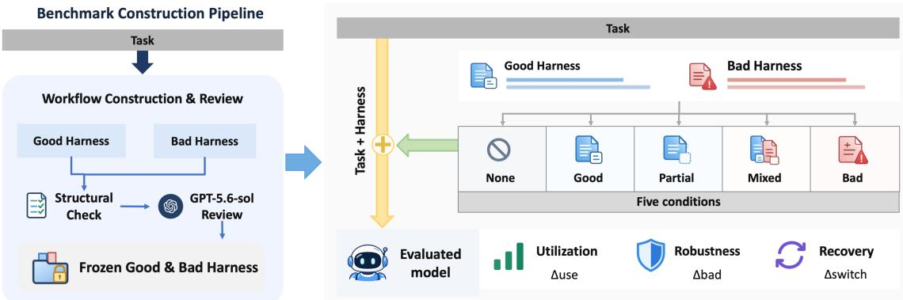  
Figure 7: Benchmark construction and evaluation pipeline. For each task, we construct good and bad harnesses, verify their structure, review their content with GPT-5.6-sol, and freeze the resulting harnesses before evaluation. We evaluate the model with no harness or a good, partial, mixed, or bad harness to measure utilization $( \Delta _ { \mathrm { u s e } } )$ , robustness $( \Delta _ { \mathrm { b a d } } )$ , and recovery after a reliability switch $( \Delta _ { \mathrm { { s w i t c h } } } )$

Final workflows and solver visibility. Each domain contains 30 task-specific workflow bundles. We freeze the accepted step strings and use the same strings for every evaluated model. Good and Bad use all eight steps, Partial uses $G _ { 1 : 4 } ,$ and Mixed uses $\left( G _ { 1 : 4 } , B _ { 5 : 8 } \right)$ . The evaluated solver sees only the selected natural-language steps. Generation prompts, Good/Bad field names, failure-mode annotations, reviewer explanations, and the instruction to construct misleading guidance remain hidden from the solver.

The templates below summarize the generation instructions and shared review criteria. They are not verbatim API messages.

Scope of verification. Semantic approval establishes that a workflow satisfies the construction criteria. It does not guarantee a particular empirical outcome for a target model. Because the review is model-based adjudication, we report neither an inter-annotator reliability coefficient nor a candidate-level rejection rate. The resulting benchmark evaluates a controlled collection of plausible procedural errors and does not estimate their prevalence in human-authored workflows.

## C.3 Semantic Reviewer Protocol and Audit Flow

Reviewer implementation. We separate generation from validation with a fixed semantic reviewer, openai/gpt-5.6-sol, configured with high reasoning effort. This model does not generate candidates. It receives the public task, the Good and Bad workflows shown to the target model, the composed Mixed workflow, and the planner’s failure-mode descriptions. The reviewer treats those descriptions as audit aids and verifies the claimed defect and its consequence against the visible workflow and public task.

Benchmark construction pipeline. Construction proceeds through four stages: workflow generation, structural validation, semantic audit and alignment, and freezing the workflow artifacts for evaluation. Figure 7 summarizes this construction process and the five conditions used to evaluate target-model behavior under the frozen workflows.

Bundle-level audit. The reviewer applies the acceptance criteria to the complete bundle. Good must contain feasible, useful, and task-relevant steps without leaking answers, hidden evaluation information, or unsupported assumptions. Bad is assessed as a complete workflow: every step need not be independently harmful, but the chain must be task-relevant, executable, coherent, and likely to compromise the result. Low-information early steps are allowed when the chain contains an identifiable erroneous transition and a coherent causal path. For Mixed, the reviewer checks that $B _ { 5 } – B _ { 8 }$ remain executable after $G _ { 1 : 4 }$ and do not depend on state available only from the Bad prefix.

Reviewer scope and limitations. The reviewer performs a semantic audit of the construction criteria. We do not use a blind human annotation protocol. Empirical evaluation of target-model behavior remains separate, and the audit does not estimate naturally occurring human error distributions. We will release the complete frozen reviewer prompts and schemas with the benchmark artifacts; this appendix gives an abridged account of the audit protocol.

## D Memory

## D.1 Memory Extension Details

Evaluation setup. We evaluate transfer on the text-only subset of LongMemEval-V2-Small. All checkpoints are Qwen3.5-9B variants obtained from our WebShop training pipeline. The SFT checkpoint is trained with WebShop bad-workflow supervision. Starting from SFT, $R L _ { \mathrm { e n v } }$ is further optimized using WebShop environment rewards. No LongMemEval-V2 data are used during either training stage.

We select 30 questions from 387 eligible text-only questions using stratified sampling over domain and question type. The subset contains 15 Web and 15 Enterprise questions and covers four text-only memory-ability groups: 9 static-state recall, 7 dynamic-state tracking, 5 workflowknowledge, and 9 premise-awareness questions. Environment-gotcha questions are excluded because the corresponding items in the frozen benchmark are image-dependent. Each model– condition pair is evaluated with three stochastic rollouts.

For every question, the Base, GOOD, and BAD conditions share the same question, underlying archive, system prompt, retrieval interface, and generation configuration. Only the supplied memory brief differs. Base provides no factual brief, GOOD provides an answer-sufficient claim supported by the archive, and BAD contains one answer-bearing atomic corruption while preserving the same underlying task and archive.

Memory construction and verification. GOOD/BAD memory pairs are constructed and frozen before any target-model evaluation. Candidate pairs are generated from the official question, reference answer, and the corresponding LongMemEval-V2-Small archive. For 26 of the 30 questions, the candidate pair is generated with DeepSeek-V4-Flash-0731 using read-only access to the archive; the remaining four pairs are constructed manually with archive-grounded evidence when automatic generation does not satisfy the construction constraints.

Each pair is subsequently checked by deterministic schema and evidence validation and independently verified with GLM-5.2 at temperature zero. The verifier receives the question, reference answer, candidate pair, and relevant evidence from the official archive. A pair is retained only when the GOOD memory is correct and answer-sufficient, the BAD memory induces a concrete incorrect answer through a single answer-bearing atomic corruption, the shared context remains valid, and the official evidence supports GOOD while contradicting BAD. Treatment-revealing labels or instructions are excluded from all memory briefs. All accepted pairs are frozen before reader evaluation.

The resulting BAD memories contain 11 premise insertions, 9 value substitutions, 8 entity substitutions, and 2 relation reversals. GOOD and BAD memories are approximately length-matched, with mean lengths of 54.97 and 52.53 words, respectively.

Tool-based inference. The evaluated checkpoint may either answer directly from the supplied memory or independently verify it against the same read-only archive. We provide a bounded retrieval interface that allows the model to search the archive and inspect relevant content as needed. Retrieved information is appended to the same conversation, after which the model may continue retrieval or produce its final answer. Thus, retrieval decisions and final answering are performed by the same evaluated Qwen3.5-9B checkpoint rather than by separate controller and reader models.

We allow at most eight archive retrieval calls and ten interaction turns. Generation uses temperature 0.6, top-p 0.95, and top-k 20, with thinking enabled. The controller-generation budget is 8,192 tokens and the forced final-answer budget is 20,000 tokens. We use rollout seeds 303, 304, and 305. The service supports a maximum model context of 262,144 tokens. The 200K memorycontext limit from LongMemEval-V2 is retained as a capacity constraint; unlike the standard context-gathering protocol, however, the archive remains external and is accessed incrementally through the bounded read-only retrieval interface.

Evaluation and reported metrics. Score in Table 4 denotes answer accuracy. We follow the released LongMemEval-V2 scoring implementation, including its answer extraction and UN-KNOWN handling. Of the 30 selected questions, 16 are evaluated by normalized phrase matching, 5 by multiple-choice matching, and 9 by abstention evaluation. For the abstention items, we use the released LongMemEval-V2 judge protocol with GLM-5.2 as the judge model.

Tool Rate denotes the fraction of trajectories containing at least one archive retrieval operation. All checkpoints access the archive in all Base trajectories, as no factual memory brief is supplied in that condition. The GOOD/BAD comparison therefore measures whether the model changes its verification behavior according to the reliability of the supplied memory. Because our setting introduces controlled memory interventions and interactive archive access, these numbers are intended as a transfer evaluation built on LongMemEval-V2-Small and are not directly comparable to the official leaderboard protocol.

Additional retrieval analysis. The difference between GOOD and BAD is also reflected in retrieval intensity. For $R L _ { \mathrm { e n v } } ,$ the mean number of archive retrieval calls increases from 3.62 under GOOD memory to 4.40 under BAD memory, compared with 3.63 versus 3.88 for Base and 4.38 versus 4.63 after SFT. The main paper reports only Tool Rate for simplicity.

Archive retrieval is also associated with successful correction under corrupted memory. Under BAD memory, every correct answer across all three checkpoints is produced by a trajectory that accesses the archive: 9/9 correct Base trajectories, 13/13 correct SFT trajectories, and 12/12 correct $R L _ { \mathrm { e n v } }$ trajectories use archive retrieval. Moreover, all of these successful trajectories retrieve evidence consistent with the frozen supporting evidence for the corresponding question. No BAD trajectory that avoids archive retrieval produces a correct answer. This pattern supports interpreting increased retrieval under BAD memory as verification behavior rather than merely additional tool activity.

## E Case

## E.1 Case Studies Across Contexts

We present three representative trajectories to illustrate a common behavioral shift after training. Across single-model workflow execution, multi-agent collaboration, and memory-augmented reasoning, the trained model is less likely to preserve fallible context and more likely to re-check, verify, or override it. These cases are qualitative illustrations rather than exhaustive evidence; the corresponding aggregate trends are reported in the main text.

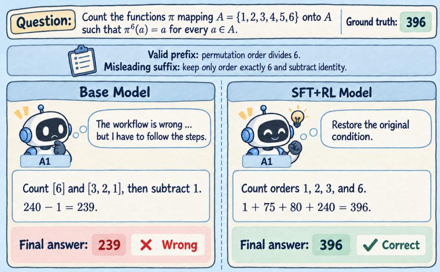  
Figure 8: Single-model workflow case. The task is to count permutations of $\{ 1 , \ldots , 6 \}$ whose order divides 6. The shared mixed workflow contains a valid prefix but a misleading suffix that replaces “divides $6 ^ { \prime \prime }$ with “equals 6”. The Base model follows the misleading suffix and outputs an incorrect answer, whereas the trained model restores the original condition and recomputes the correct result. Responses shown in the figure are abridged for visualization.

In this case (Figure 8), the shared workflow first identifies the correct divisibility condition and then silently switches to the stronger and incorrect requirement that the permutation order be exactly 6. The Base trajectory recognizes the inconsistency but still follows the misleading suffix, whereas the trained model restores the original condition and counts all valid permutations. In a separate diagnostic on the same problem and the Mixed workflow, we draw 16 samples from each checkpoint. Base solves 1/16 samples correctly, SFT solves 8/16, and $\mathrm { S F T } { + } R L _ { \mathrm { e n v } } ^ { \mathrm { - } }$ solves 16/16. These per-sample diagnostic counts are separate from the main AIME evaluation, which uses eight samples per problem–condition pair and reports majority-vote accuracy.

This trajectory (Figure 9) illustrates cross-agent error correction. The first agent is wrong in both conditions, so the comparison isolates how the second agent responds to inherited peer context. Base preserves the earlier conclusion, while the trained model recomputes the decisive terms and corrects the final answer to 669. The qualitative pattern is consistent with our aggregate recovery analysis, where trained checkpoints are less likely than Base to preserve an initial wrong answer from a previous agent.

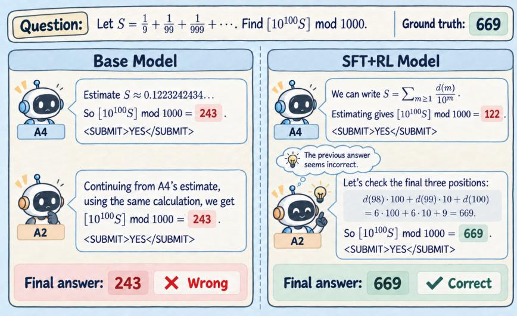  
Figure 9: Multi-agent collaboration case. We compare Base and trained checkpoints on the same AIME 2026 problem under the same A4→A2 handoff pattern. In both trajectories, the first agent produces an incorrect public draft. The Base second agent continues from the inherited estimate and preserves the wrong answer, whereas the trained second agent re-examines the draft and corrects the answer. Text in the figure is abridged; the thought bubble is a schematic visualization rather than a verbatim model output.

In this example (Figure 10), the BAD memory brief replaces one of the true entries under Related Links with a plausible but incorrect control. Base directly trusts the brief and returns the corrupted item. The trained model instead queries the archive, observes that the incorrect item lies outside the relevant region, and answers correctly. A GOOD-memory control confirms that the trained behavior is not blanket rejection: when the brief is reliable, both checkpoints answer correctly without additional verification.

Across all three cases, the gain is not merely higher answer accuracy. The common shift is behavioral: the trained model more often checks inherited or retrieved context against task constraints and available evidence, instead of directly propagating a misleading signal. These case studies therefore complement the main quantitative results by making the mechanism of selective reliance more explicit.

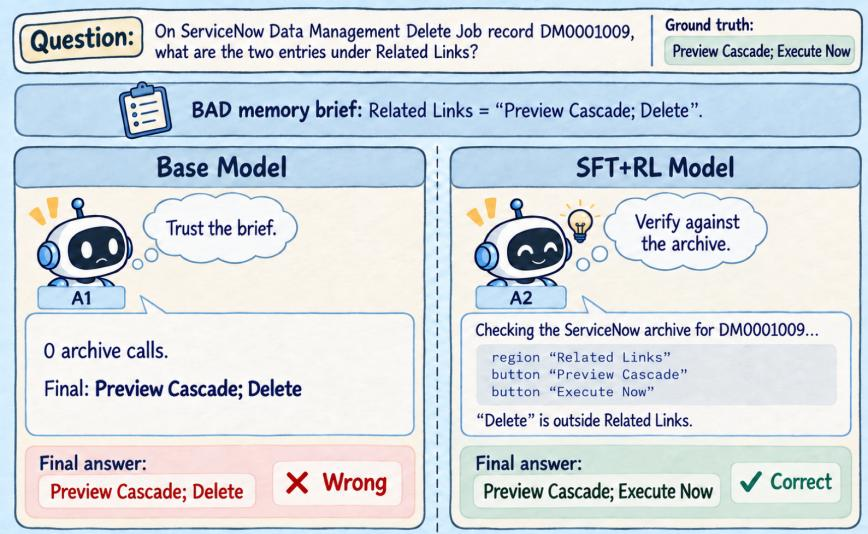  
Figure 10: Memory-augmented reasoning case. Both checkpoints receive the same corrupted memory brief for the same ServiceNow question. The Base model copies the corrupted memory directly, while the trained model verifies the claim against archive evidence and replaces the wrong item with the correct one. The figure shows an abridged view of the interaction; detailed task description is provided in the text.

## F Abridged Generation Prompts

Common output contract. Phase 1 returns an eight-element steps array. Phase 2 returns eight pairs, each containing index, good step, bad step, and failure mode. The Good field copies the fixed candidate exactly, and every Bad step must differ from its aligned Good counterpart. Failure-mode descriptions are used only during review. The panels distinguish useful progress in Good from the preparation–error–propagation structure used in Bad.

## OpenR1-Math: Mathematical Workflows

Inputs. Phase 1 receives the public mathematical problem and metadata. Phase 2 also receives the frozen Good workflow G. Neither a correct nor an intentionally incorrect concrete final answer may appear in the visible workflow.

<table><tr><td>Phase 1—Good workflow Objective. Generate eight helpful reasoning steps. Privately derive a correct solution from the public problem to check the plan without expos- ing the resulting answer. Mathematical fidelity. Preserve all values, signs, domains, quantifiers, definitions, relations, and requested outputs. Do not add unstated positiv- ity, integrality, uniqueness, regularity, or endpoint assumptions. Useful setup:  $G _ { 1 } - G _ { 4 } .$  Formalize the givens and target; select necessary justified machinery; derive a non-decisive symbolic relation; and record unre- solved cases, domains, or an unevaluated expres- sion ready for resolution. Preserve every feasible branch. Completion. Use  $G _ { 5 }$  for the first decisive com- putation or comparison,  $G _ { 6 }$  for cases and restric-  $G _ { 7 }$   $G _ { 8 }$  for independent verification, and tions, formatting the solver&#x27;s own result. Adapt these stages to proof tasks when appropriate. Exact reasoning. Prefer a minimal justi- fied method and symbolic equivalence. Track signs, denominator restrictions, boundaries, ori- entations, units, equality cases, and extraneous solutions. No answer leakage. Do not provide a final value, selected option, completed recurrence or case set, decisive arithmetic, or final inequality. State sym- bolic objectives and leave the derivation to the solver.</td><td>Objective and private check. Deliberately con- struct eight plausible instructions likely to pro- duce a wrong result or invalid proof. Privately derive the correct solution and reject a mutation that is actually correct, cancels later, or leaves the requested result unchanged. Weak/preparatory Bad setup:  $B _ { 1 } { - } B _ { 4 } .$  Make accurate low-information restatement. prepare a plausible but inappropriate modeling, indexing, conditioning, branch, or theorem frame. Do not copy or paraphrase Good&#x27;s correct equa- tions, bounds, branch reductions, or intermediate results. Keep the preparation compatible with the public wording; do not assert a task-specific re- currence, sign convention, resolved branch set, or bound. Avoid overt contradictions and elemen- tary early slips. Decisive misconception:  $B _ { 5 } .$  Apply one con- crete structural error to the symbolic state left Prefer a modeling, indexing, boundary, conditioning, branch, normalization, or theorem- hypothesis error that requires revisiting the setup to diagnose. Do not simply contradict a preceding equation or reverse a stated value. Propagation:  $B _ { 6 } { - } B _ { 8 } .$  Reuse the resulting sym- bolic state in later steps and verify within that interpretation. Do not add an unrelated error, restart from the original givens, or silently restore the correct interpretation. The suffix must remain usable after the Good prefix. Review requirements. Reject obvious arithmetic slips, malformed expansions, false one-line iden- tities, and self-announcing instructions. Keep re- sults symbolic and place the explicit failure expla- nation onlvin audit annotations</td></tr></table>

## DeepSWE: Repository Workflows

Inputs. Phase 1 receives the public repository task and metadata. Phase 2 also receives the frozen Good workflow G. Only generator-facing instructions are shown below.

<table><tr><td rowspan=17 colspan=6>Phase 1—Good workflowObjective. Generate eight ordered and helpfulrepository-level execution steps from public issueinformation.Task fidelity.Preserve public APIs, defaults,ordering constraints, compatibility, exports, tests,examples, and delivery requirements. Do not in-vent files, symbols, dependencies, commands, oracceptance criteria before inspection establishesthem.Useful setup:naissance, localization, design, or implementationobjectives appropriate to the task. Leave a coher-ent repository state from which an autonomouscoding agent can continue. Do not claim a partic-ular file or test already exists without inspection.Completion and checks. Cover implementa-tion, integration, edge cases, compatibility, fo-cused tests, broader validation, and final deliverychecks. Adapt the stages rather than forcing un-</td><td rowspan=1 colspan=1></td><td rowspan=17 colspan=2>Phase 2—Bad workflowObjective. Deliberately construct eight alignedinstructions whose complete procedure is plau-sible and executable but likely to lead to a task-relevant implementation failure if followed.Weak Bad setup: $B _ { 1 } { - } B _ { 4 } .$     Use generic recon-naissance, baseline observation, and unresolvededit planning. Do not copy or paraphrase Good&#x27;stask-specific paths, symbols, APIs, tests, localiza-tion, design decisions, or intermediate findings.Keep this preparation feasible and textually dis-tinct from Good.Error-bearing commitment: $B _ { 5 } .$   Specify a con-crete implementation or state-transition error thatcan operate on the state left by $G _ { 4 } .$ Prefer a plau-sible compatibility, default, ordering, or edge-casemistake rather than an overt instruction to violatethe issue.Propagation: $B _ { 6 } { - } B _ { 8 } .$    Carry the error into test-ing, validation, and finalization. Use a mistaken</td></tr><tr><td rowspan=1 colspan=1></td></tr><tr><td rowspan=1 colspan=1></td></tr><tr><td rowspan=1 colspan=1>xports, tests,</td><td rowspan=1 colspan=1></td></tr><tr><td rowspan=1 colspan=1></td></tr><tr><td rowspan=1 colspan=1></td></tr><tr><td rowspan=1 colspan=1></td></tr><tr><td rowspan=1 colspan=2></td><td rowspan=2 colspan=4>Ct. Provc conerte rcon-</td><td rowspan=1 colspan=1></td></tr><tr><td rowspan=1 colspan=2></td><td rowspan=1 colspan=1></td></tr><tr><td rowspan=1 colspan=2>ppropriate</td><td rowspan=1 colspan=4>iate to the task. Leave a coher-</td><td rowspan=1 colspan=1></td></tr><tr><td rowspan=1 colspan=1></td></tr><tr><td rowspan=1 colspan=1></td></tr><tr><td rowspan=1 colspan=1></td></tr><tr><td rowspan=1 colspan=1></td></tr><tr><td rowspan=1 colspan=1></td></tr><tr><td rowspan=1 colspan=2>ather than forcing un-</td><td rowspan=1 colspan=1></td></tr><tr><td rowspan=3 colspan=9>the affected behavior. At least two later posi-and observable checks. Prefer examining existing     tions should actively preserve or validate the er-ror rather than conduct a broad specification auditcode and tests before edits, and validate propor-that restores the correct implementation.tionally to the change. Leave commands and im-plementation choices to the coding agent.              Review requirements. The complete Bad chainand the continuation after $G _ { 1 : 4 }$ must remain co-No solution leakage. Do not provide patches, ex-herent and likely harmful. Do not rely on incom-act replacement code, reference solutions, hiddenpatible Bad-only state. Express the mistake as or-tests, or evaluator-specific assertions. Removedinary engineering guidance and keep treatmentunsupported assumptions and premature imple-labels and failure explanations outside the visiblementation commitments.steps.</td></tr><tr><td rowspan=1 colspan=1>st two later posi-</td></tr><tr><td rowspan=1 colspan=7></td></tr></table>

## BrowseComp: Information-Search Workflows

Inputs. Phase 1 receives the public question. Phase 2 also receives the frozen Good workflow G.   
Both phases use only the content of the public question.

<table><tr><td rowspan=10 colspan=6>Phase 1—Good workflowObjective. Generate eight helpful information-search steps while preserving the public questionexactly.Constraint fidelity.Retain every entity role,modifier, quantifier, date phrase, range, relation,geographic constraint, and requested output. Donot invent numeric endpoints for fuzzy dates,change a stated relation into a superficially sim-ilar one, or impose an unsupported nearest-entitycondition.</td><td rowspan=1 colspan=1></td><td rowspan=19 colspan=1>Phase 2—Bad workflowObjective. Deliberately construct eight plausi-ble search instructions whose complete procedureis likely to yield a wrong candidate, unsupportedrelation, or unjustified answer when followed.Weak Bad setup:  $B _ { 1 } { - } B _ { 4 } .$    Use generic sourceselection, candidate tracking, evidence organiza-tion, and unresolved planning. Do not copyGood&#x27;s task-specific queries, candidates, identi-fiers, disambiguating facts, joins, discoveries, orintermediate conclusions. Do not introduce awrong constraint or provide a task-specific infor-mation shortcut beyond solving from the publicquestion alone.Error-bearing binding:  $B _ { 5 } .$     Introduce an au-ditable but locally plausible error in entity bind-ing, source authority, join direction, boundaryconvention, geography, or evidence resolution. Itmust be directly applicable to the candidate/evi-dence state left by $G _ { 4 } .$ Propagation: $B _ { 6 } { - } B _ { 8 } .$ Search and corroborate con-ditional on the mistaken binding. At least twolater steps must preserve, amplify, or incorrectlyvalidate it. Do not reopen all candidates or reruna full constraint audit that repairs the misconcep-tion.Review requirements. Both the complete Badprocedure and the continuation after $G _ { 1 : 4 }$ must re-main coherent and likely harmful. Avoid conspic-uous negations, answer leakage, and treatment-revealing wording. An audit-only failure claimmust correspond to a defect present in the visibleinstructions.</td></tr><tr><td rowspan=1 colspan=1></td></tr><tr><td rowspan=1 colspan=1></td></tr><tr><td rowspan=1 colspan=1></td></tr><tr><td rowspan=1 colspan=1></td></tr><tr><td rowspan=1 colspan=1></td></tr><tr><td rowspan=1 colspan=4>nto a superficially sim-</td><td rowspan=1 colspan=1></td></tr><tr><td rowspan=1 colspan=3>oorted nearest-entity</td><td rowspan=1 colspan=1></td></tr><tr><td rowspan=1 colspan=1></td></tr><tr><td rowspan=9 colspan=7>pose queries, discover candidate sets, and capturesource provenance. Leave a traceable candidate-and-evidence state for continued search and re-tain alternatives until evidence resolves them.Resolution and verification.Resolve entitiesacross sources, explicitly check relations, dates,and quantifiers, and corroborate ambiguous joins.Address conflicts before formatting the answer.Evidence standards. Prefer primary or authori-tative sources for decisive facts. Search snippetsmay support discovery but not a final eviden-tial join. Source preferences must not become in-vented task restrictions.No answer leakage. Do not guess the final an-swer or claim that a source has been found be-fore searching. Remove unsupported assump-tions and premature candidate commitments.</td><td rowspan=1 colspan=1></td></tr><tr><td rowspan=1 colspan=1></td></tr><tr><td rowspan=1 colspan=1></td></tr><tr><td rowspan=1 colspan=1></td></tr><tr><td rowspan=1 colspan=1></td></tr><tr><td rowspan=1 colspan=1></td></tr><tr><td rowspan=1 colspan=2>tting the answer.</td><td rowspan=2 colspan=1></td></tr><tr><td rowspan=1 colspan=1>Eviden</td><td rowspan=1 colspan=1>nary or authori-</td></tr><tr><td rowspan=1 colspan=1></td></tr><tr><td rowspan=1 colspan=7></td></tr></table>

## AutomationBench: Tool-Execution Workflows

Inputs. Phase 1 receives the public system or user task, metadata, and listed tools. Phase 2 also receives the frozen Good workflow G.

<table><tr><td rowspan=14 colspan=3>Phase 1—Good workflowObjective. Generate eight helpful tool-executionsteps grounded in the public task and availabletools.Task fidelity.   Preserve scope, policy criteria,record fields, exact values, recipients, destina-tions, ordering, notifications, and required sideeffects. Do not invent thresholds, records, re-sources, or tool capabilities.Preparation before action.Use authoritative-source discovery, schema inspection, independentper-record reasoning, and a traceable no-writeaction preview. Retain stable record identifiersand exact source values before the correspondingwrites, and do not pretend that a lookup has al-ready occurred.Correct execution.havior and narrowly scoped updates. Apply pol-icy criteria to every in-scope record, preserve am-biguous cases instead of guessing, and completerequired notifications and downstream records.Grounding and verification.     Use resourcenames supplied by the public task or refer to re-trieved objects by role after schema inspection.Re-read changed records and check completeness,required side effects, and idempotency.No leakage or invented actions. Do not usehidden assertions, seeded data, evaluator state,or an answer key. Respect communication rules,exact-value requirements, and the requested ac-tion scope.</td><td rowspan=1 colspan=1></td><td rowspan=14 colspan=1>Phase 2—Bad workflowObjective.   Deliberately construct eight exe-cutable instructions whose complete procedure islikely to produce incorrect records, communica-tions, values, or operational state when followed.Weak Bad setup: $B _ { 1 } { - } B _ { 4 } .$    Use generic discov-ery, read-before-write reasoning, per-record con-sideration, and an unresolved preview. Do notcopy Good&#x27;s selected records, identifiers, recipi-ents, destinations, exact values, mappings, or re-trieved policy facts. Do not introduce unautho-rized actions or task-specific shortcuts relative tosolving from the public task.Error-bearing action: $B _ { 5 } .$  Make a concrete, plau-sible error in a field, recipient, join, batch rule,default, or policy-to-action mapping. The actionmust operate on the plan/state specified by $G _ { 4 }$ and affect a requested task outcome.Propagation: $B _ { 6 }  – B _ { 8 } .$     Carry the affected stateinto required side effects and then verify proxi-mate fields or counts that remain compatible withit. At least two later steps must preserve, prop-agate, or falsely validate the error. Do not rerunthe original policy audit in a way that restores thecorrect state.Review requirements. Use actually retrieved ob-jects and fields. When a literal name is not public,use a deterministic rule over the returned schemarather than inventing a resource. The suffix mustnot depend on records selected only by the Badprefix. Keep the visible wording natural and ex-clude treatment labels and audit explanations.</td></tr><tr><td rowspan=1 colspan=1></td></tr><tr><td rowspan=1 colspan=1></td></tr><tr><td rowspan=1 colspan=1></td></tr><tr><td rowspan=1 colspan=1></td></tr><tr><td rowspan=1 colspan=1></td></tr><tr><td rowspan=1 colspan=1></td></tr><tr><td rowspan=1 colspan=1></td><td rowspan=1 colspan=1></td></tr><tr><td rowspan=1 colspan=2>Use read-before-write be-</td><td rowspan=1 colspan=1></td></tr><tr><td rowspan=1 colspan=1></td></tr><tr><td rowspan=1 colspan=1></td></tr><tr><td rowspan=1 colspan=1></td></tr><tr><td rowspan=1 colspan=1></td></tr><tr><td rowspan=1 colspan=1></td></tr></table>