# Training LLM Judges from Language Feedback via Position-Selective Self-Distillation

Ilgee Hong1,† Changlong Yu2 Zhenghao Xu1,† Xin Liu2 Yuwei Zhang3,† Qin Lu2 Bing Yin2 Tuo Zhao2

1Georgia Institute of Technology 2Amazon 3UC San Diego

Model § Code

We study training LLM judges from natural language feedback, especially for subjective tasks where the verdict depends strongly on which evaluation criteria the judge invokes and how it weighs them. The dominant approach, outcome-supervised RL (e.g., GRPO), credits every token in the rollout with a single scalar determined only by the accuracy of the final verdict, providing no separate credit at the criterion-choice tokens and ignoring the rich language feedback (e.g., preference rationales) that naturally accompanies preference labels. Self-Distillation (SD) is one natural way to use this language feedback: the same model, conditioned on this feedback, acts as a teacher providing dense, positionlevel supervision. However, not all positions carry equally useful signal. Using the per-position entropy shift between teacher and student, we identify two regimes: context sharpening, where the teacher concentrates probability on a particular feedback-aligned criterion expression, and context spreading, where the teacher distributes probability across multiple feedback-aligned alternatives. We interpret these patterns as follows: sharpening encourages memorization of a particular criterion expression, whereas spreading promotes semantic understanding by preserving these alternatives. Motivated by this asymmetry, we introduce position masking based on the entropy shift that retains the lower tail of the entropy-shift distribution. Experiments show that masking higher-entropy-shift positions improves out-of-distribution generalization over naive SD. The resulting self-distilled judges outperform judges trained with outcome-supervised RL by 2–9 percentage points on the evaluated subjective subcategories, while remaining competitive on objective ones.

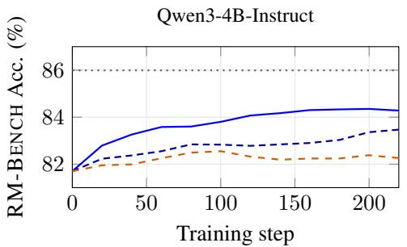

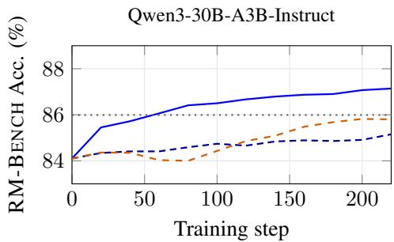  
SD SD+mask 70% Dr. GRPO DeepSeek-R1

Figure 1: Out-of-distribution RM-BENCH accuracy during training. Curves show the debiased EMA $( \beta = 0 . 6 )$ of accuracy evaluated every 20 training steps. All methods start from a judge prompt template tuned for best base-model accuracy. SD+mask outperforms naive SD and Dr. GRPO.

## 1 Introduction

Training LLMs to judge responses, both as standalone evaluators and as reward models for downstream training, is a core building block of modern post-training. A judge’s verdict varies along two distinct axes: 1) criterion choice, i.e., which evaluation criteria the model invokes and how it weighs them, and 2) application rigor, i.e., how rigorously those criteria are applied to evaluate responses. Judgment tasks fall into two regimes by which of these two axes decides the verdict: objective tasks, where the decisive criterion is clear-cut (e.g., correctness), so the verdict depends on application rigor (e.g., math, coding), and subjective tasks, where the decisive criterion is subtle and multifaceted (e.g., what counts as helpful for this chat), so the choice and weighting of criteria can drive the verdict. Outcome-supervised RL (e.g., GRPO [33], Dr. GRPO [23], DAPO [49]) with a single verdict-correctness reward is the dominant approach to train LLM judges [44, 11, 9, 5, 39, 45], and works well on objective tasks by sharpening reasoning over a clear-cut criterion.

For subjective tasks, however, outcome-supervised RL provides limited explicit guidance on criterion choice. It credits every token in the rollout with a single scalar determined only by the accuracy of the final verdict; it shapes criterion selection and weighting indirectly, through whether a given choice produces a correct verdict, without explicitly distinguishing the contributions of criterion choice and criterion application. Even with high application rigor, a model that applies the wrong criterion (or weighs competing criteria poorly) still produces a wrong verdict. Compounding the problem, outcome-supervised RL is known to drive policy entropy downward over training [6, 49], which further narrows the pool of criteria the judge explores.

Many preference datasets naturally contain per-example natural language feedback alongside the preference label, since obtaining the label typically requires annotators to articulate why one response is preferred over the other: preference rationales that explicitly name the decisive criterion [43, 20], a signal that the outcome-only objective leaves unused. Self-Distillation (SD) [12, 54] is one natural way to use this language feedback: the same model, conditioned on this feedback, acts as a teacher and provides dense distributional guidance at every position of the student’s rollouts. Unlike outcomesupervised RL, this dense per-position supervision now provides separate credit at the criterion-choice tokens, since the teacher’s distributional signal at those positions is directly shaped by the language feedback that names the decisive criterion.

Not every position in the distillation loss carries equally useful signal. To characterize this heterogeneity, we define the per-position entropy shift as the entropy reduction in the teacher’s next-token distribution relative to the student’s, induced by conditioning the teacher on the language feedback, and use it to identify two regimes. At positions with a large positive entropy shift (context sharpening), the teacher concentrates probability on a particular feedback-aligned criterion expression. At positions with a large negative entropy shift (context spreading), the teacher distributes probability across multiple feedback-aligned alternatives. We interpret these patterns as follows: sharpening encourages memorization of a particular criterion expression, whereas spreading promotes semantic understanding by preserving these alternatives. Figures 3, 4, 6, and 7 illustrate concrete examples of these two regimes. Motivated by this asymmetry, we introduce position masking based on entropy shift: retain the lower tail of each generation’s entropy-shift distribution for the distillation loss, favoring context-spreading positions while removing the highest-shift positions.

Experiments show that self-distilled judges outperform judges trained with outcome-supervised RL (Dr. GRPO) by 2–9 percentage points on the evaluated subjective subcategories, while Dr. GRPO remains competitive on objective subcategories where application rigor matters most. Further, masking higher-entropy-shift positions improves out-of-distribution (OOD) generalization over naive SD. As Figure 1 shows, SD+mask leads both naive SD and Dr. GRPO on RM-BENCH [22] throughout training for Qwen3-4B-Instruct and Qwen3-30B-A3B-Instruct [47], surpassing strong reasoning judges including DeepSeek-R1 [7] and Claude-Sonnet-4 [1] at the 30B scale.

## 2 Related Work

Learning from natural language feedback. Prior work uses natural language feedback primarily through refinement or critique pipelines. At inference time, models are prompted to iteratively revise outputs from self- or external-model-generated language feedback [26, 38, 17]. At training time, models are fine-tuned on refinements that incorporate language feedback [32], on self-critiques and revisions generated from natural language principles [4], while other methods augment GRPO with additional refinement rollouts conditioned on a critique of the initial response [52]. Text2Grad [40] instead aligns critique phrases with response spans and converts these alignments into per-span differentiable reward signals that drive gradient updates on the offending tokens. A more recent line of on-policy SD uses the same model, additionally conditioned on language feedback unavailable to the student at inference, as the teacher. This framework incorporates diverse types of language feedback, including reference solutions, environmental feedback, successful rollouts, expert demonstrations, and dynamically summarized skills [54, 12, 36, 41]. Our work uses one- or two-sentence annotator rationales as language feedback for judge training. These rationales expose the evaluation criteria behind each preference label, which is especially useful for subjective tasks where generalization depends on selecting and weighting the right criteria.

Token selection methods for post-training. Recent work has begun to replace uniform tokenlevel supervision with selective updates during LLM post-training. In supervised fine-tuning and preference optimization, several methods filter or reweight tokens based on influence-based quality, counterfactual importance, per-token KL, or preference-derived importance scores [30, 31, 51, 19, 48]. In RLVR, high-entropy token selection identifies a small set of uncertain “forking” tokens that dominate policy-gradient learning, while polarity–entropy decomposition and gradient-magnitude selection further refine token-level credit assignment [42, 10, 25]. Closest to our setting, on-policy distillation methods select or reweight token losses using teacher entropy, student entropy and teacher– student divergence, log-probability gaps with LLM-judged relevance, training-trajectory dynamics, position-based teacher reliability, or asymmetric updates in non-positive-advantage regions [8, 14, 46, 35, 21, 13]. In contrast, our method studies position selection in full-logit on-policy SD for judge training via the entropy shift between the student and feedback-conditioned teacher distributions.

## 3 Method

## 3.1 Preliminary: Outcome-Supervised RL for LLM Judges

A pairwise LLM judge is trained on examples of the form $( x , y _ { A } , y _ { B } , c ^ { \star } ) \colon$ : a prompt x, two candidate responses $y _ { A } , y _ { B }$ , and a gold preference label $c ^ { \star } \in \mathcal { C }$ where C is a finite set of possible verdicts. The verdict set C could be simply binary $( y _ { A } \succ y _ { B }$ or $y _ { A } \prec y _ { B } )$ or multiclass [11, 39], for example including TIE , UNKNOWN/UNCLEAR , or a multi-way ordinal preference such as $y _ { A } \succ y _ { B } , y _ { A } \succ y _ { B } , y _ { A } \sim y _ { B }$ . In this paper, we consider the binary setting with $\mathcal { C } = \{ A , B \}$ Given $( x , y _ { A } , y _ { B } )$ , the judge generates a token sequence $\tau = ( a _ { 1 } , a _ { 2 } , \ldots , a _ { T } )$ one token at a time, $a _ { t } \sim \pi ( \cdot \mid s _ { t } )$ , where $s _ { t } = ( x , y _ { A } , y _ { B } , a _ { 1 } , \dotsc , a _ { t - 1 } )$ is the prefix at position t. The sequence consists of an intermediate trace (criterion choice and application) and a final verdict $c \equiv a _ { T } \in { \mathcal { C } } .$

The dominant training algorithm is outcome-supervised RL. Each rollout is scored by whether its final verdict matches the gold preference label:

$$
{ \cal R } ( \tau ) \ = \ { \bf 1 } [ c = c ^ { \star } ] .\tag{1}
$$

The judge is then optimized against this reward using GRPO-style policy-optimization algorithms [33, 23, 49]. Even when a training example contains language feedback z, such as a preference rationale that articulates why one response is preferred over the other and identifies the decisive criterion, this outcome-only reward leaves z unused. It also assigns the same outcome-based credit to every token position, with no direct supervision where the judge chooses and weighs evaluation criteria.

## 3.2 Language Feedback Self-Distillation for LLM Judges

To use the language feedback left unused by the outcome-only objective, we apply self-distillation (SD) to provide dense, position-specific supervision for the judge’s intermediate trace.

Each training example carries a piece of language feedback z underlying its preference label $c ^ { \star }$ We use a single model π in two roles: as the student, conditioned on the prompt alone, $\pi ( \cdot \mid s _ { t } )$ and as the teacher, which additionally conditions on $z , \pi ( \cdot \mid s _ { t } , z )$ . The context is privileged in the sense that the student is never given z, either during training or at deployment. We adopt the on-policy reverse-KL SD objective from [12, 54] as the underlying loss. Over a training set D of judge examples $\left( x , y _ { A } , y _ { B } , z \right)$ with on-policy rollouts $\tau = ( a _ { 1 } , \dots , a _ { T } ) \sim \pi$ drawn per example,

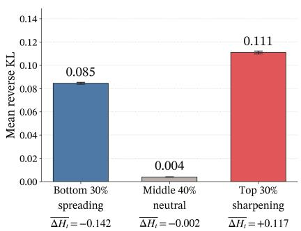  
(a) Mean reverse KL by $\Delta H _ { t }$ tier.

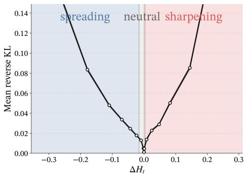  
(b) Mean reverse KL as a function of $\Delta H _ { t }$  
Figure 2: Both $\Delta H _ { t }$ tails account for most of the distillation loss. (a) Three-way per-sequence percentile partition (top-30% $\Delta H _ { t } \ /$ middle 40% / bottom-30%): both tails carry ∼20–28× the per-position KL of the neutral middle. (b) Binned mean reverse KL along $\Delta H _ { t }$ using 20 equal-count bins (95% x-range shown).

$$
\mathcal { L } _ { \mathrm { S D } } ( \pi ) = \mathbb { E } _ { ( x , y , z , y , z ) \sim \mathcal { D } , \tau \sim \pi } \left[ \frac { 1 } { T } \sum _ { t = 1 } ^ { T } \mathrm { K L } \Big ( \pi ( \cdot \mid s _ { t } ) \Big \| \operatorname { s g } [ \pi ( \cdot \mid s _ { t } , z ) ] \Big ) \right] ,\tag{2}
$$

where sg[·] is stop-gradient and the inner KL is a full-vocabulary sum at each position. Unlike a verdict-level reward, this objective transfers the feedback-conditioned teacher distribution at every token position, including positions where the judge selects evaluation criteria.

## 3.3 Analysis of Per-Position Self-Distillation Signal

Eq. 2 treats every response position as an equally valid imitation target, but the language feedback z does not affect the teacher uniformly across positions. We characterize this heterogeneity through the per-position entropy shift, then examine its connection to criterion choice. As discussed above, language feedback identifies the decisive criteria behind a preference label, allowing self-distillation to provide direct supervision at criterion-choice tokens. We therefore study how this feedback changes the teacher’s next-token distribution at positions where the judge names and defines evaluation criteria.

Per-position entropy shift. To measure how the language feedback z changes next-token uncertainty at position t, we define

$$
\Delta H ( s _ { t } , z ) = H ( \pi ( \cdot \mid s _ { t } ) ) - H ( \pi ( \cdot \mid s _ { t } , z ) ) ,\tag{3}
$$

the entropy of the model’s next-token distribution without z minus the entropy with z, both evaluated at position t. When the language feedback is fixed for an example, we abbreviate this as $\Delta H _ { t }$ Positive $\Delta H _ { t }$ means the teacher conditioned on z has lower entropy than the student; z has sharpened the teacher’s distribution. Negative $\Delta H _ { t }$ means the teacher has higher entropy than the student; z has spread the teacher’s distribution. Near-zero $\Delta H _ { t }$ means little change in entropy, though not necessarily little change in the next-token distribution.

Both $\Delta H _ { t }$ tails carry substantial distillation loss. We analyze 104,046 response positions from 102 HELPSTEER3-PREFERENCE [43] validation rollouts generated by Qwen3-30B-A3B-Instruct-2507 [47], with 34 examples each from code, general, and STEM. Empirically, per-position reverse KL exhibits a U-shaped relationship with $\Delta \check { H } _ { t } \mathbf { : }$ positions at either tail of the per-sequence $\Delta H _ { t }$ distribution carry substantially more per-position KL than positions in the near-zero middle (Figure 2). Partitioning each rollout into the bottom 30%, middle 40%, and top 30% by $\Delta H _ { t } ,$ , both tails carry approximately 20–28× the per-position KL of the middle. Thus, substantial distillation loss occurs both where the language feedback sharpens the teacher’s distribution and where it spreads it.

Criterion-choice tokens account for disproportionate distillation loss. Criterion choice determines which evaluation criteria the judge invokes and how it weighs them, and is particularly important for subjective tasks. Positions where the judge names and defines these criteria make this choice explicit in the intermediate trace. Since the preference rationale identifies the decisive criteria, these positions provide a natural location to examine how language feedback shapes criterion choice.

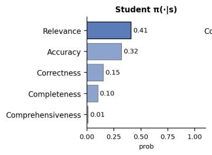

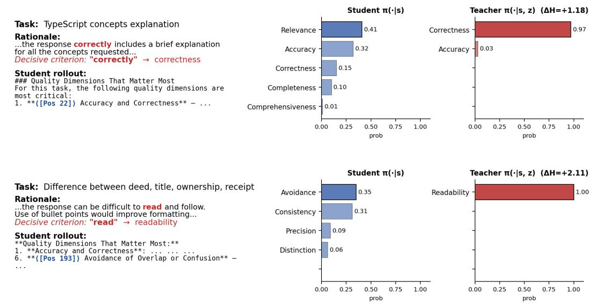

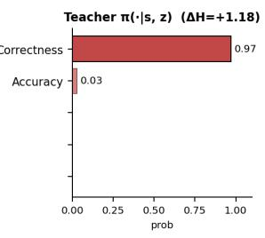

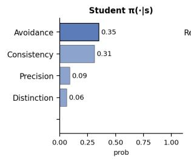

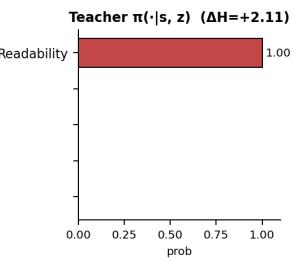  
Figure 3: Context sharpening on two HELPSTEER3-PREFERENCE rollouts (Qwen3-30B-A3B-Instruct-2507). Each panel shows the user task, the rationale (anchor word red), the student rollout excerpt with the annotated position ⟨Pos N⟩ marked in blue, and student vs. teacher top-5 next-token distributions at that position. All positions sit at criterion-naming slots in the rollout’s opening evaluation-criteria list. The teacher concentrates probability on a token semantically equivalent to the rationale’s anchor while the student is uncertain across multiple plausible criteria. Two further rollouts are shown in Figure 6.

We analyze the same 102 rollouts using GPT-5.5 [29], with the generation and rationale annotated separately. From the generation alone, the annotator marks criterion-selection spans, comprising tokens that name and define evaluation criteria, and criterion-name positions, marking each criterion’s head noun. These annotations are mapped to model-token positions. From the rationale alone, the annotator extracts the decisive criteria, which serve as the reference for the semantic analysis below.

Criterion-selection spans comprise only 16.7% of response tokens but account for 44.4% of total reverse-KL mass, corresponding to approximately 4.0× the per-token KL of other positions. Criterionname positions alone comprise 0.4% of tokens but account for 11.1% of total reverse-KL mass. They also exhibit 5.7× larger mean $| \Delta H _ { t } |$ than other response positions, and 94.8% fall within the two extreme 30% tails, which together contain 60% of response positions. Thus, criterion-choice tokens account for disproportionate distillation loss, and criterion-name positions concentrate in both entropyshift tails. This motivates examining how the two tails differ in the criterion choices favored by the teacher.

Two regimes of language-feedback influence on criterion choice. The sign of $\Delta H _ { t }$ distinguishes sharpening from spreading, but entropy alone does not reveal which criteria the teacher favors. We therefore examine whether its candidate criterion names align with the decisive criteria extracted from the preference rationale.

Among the annotated criterion-name positions, we select those with $| \Delta H _ { t } | \ge 0 . 5 0 .$ , yielding 87 sharpening positions from 56 rollouts and 71 spreading positions from 51 rollouts. At each position, we take the teacher’s top-10 next-token candidates as candidate criterion-name tokens. We force each token and greedily complete it into a criterion name, truncating at the head noun. Using Qwen3-Embedding-8B [53], we score each completed name by its maximum cosine similarity to the extracted decisive criteria. For sharpening, we score the name obtained from the top-1 token, measuring alignment of the teacher’s most probable criterion. For spreading, we average across all ten candidates, measuring alignment across the broader set of criteria.

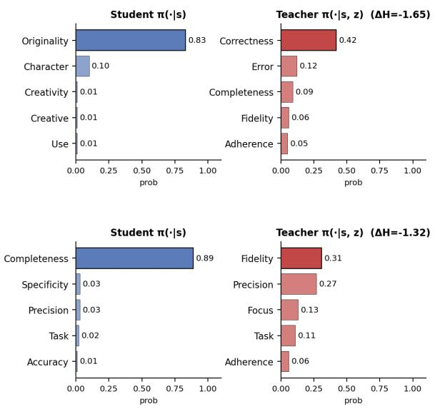

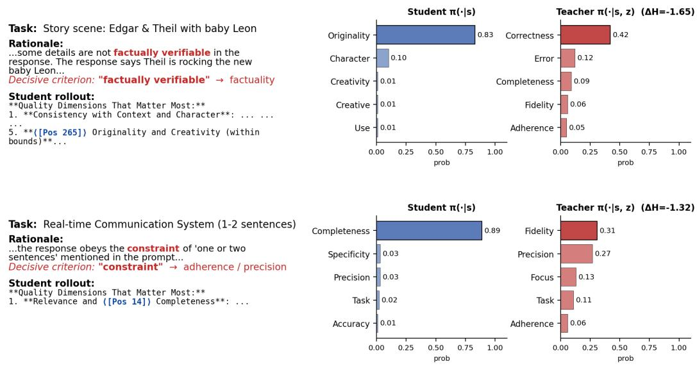  
Figure 4: Context spreading on two HELPSTEER3-PREFERENCE rollouts (Qwen3-30B-A3B-Instruct-2507). Same layout as Figure 3. Each panel features a position where the student commits to a criterion that is non-decisive in the rationale (top-1 probability ≥ 0.79), while the teacher reopens with a spread of alternatives that include semantic equivalents of the rationale’s decisive criterion. All positions sit at criterion-naming slots in the rollout’s opening evaluation-criteria list. Two further rollouts are shown in Figure 7.

As a control, we replace the teacher’s language feedback with another example’s rationale and repeat the candidate selection and completion procedure. The student prefix, evaluation position, and regime assignment remain fixed as determined under the matched condition. Both conditions are scored against the same decisive criteria from the original rationale. We report paired mean differences, with 95% confidence intervals obtained from 2,000 bootstrap resamples at the rollout level.

Context sharpening. At positions with large positive $\Delta H _ { t }$ , the language feedback makes the teacher more confident than the student. Figure 3 illustrates how this concentrates probability on a specific decisive criterion. In the TypeScript-explanation rollout, the rationale phrase “correctly includes” causes the teacher to concentrate on Correctness (top-1 0.97), while the student is uncertain across several plausible criteria. In the legal-term explanation rollout, “difficult to read” causes the teacher to concentrate on Readability (top-1 1.00).

Across the annotated sharpening positions, the teacher’s top-1 criterion name has mean similarity 0.713 to the decisive criteria under the matched rationale, compared with 0.647 under the control. The paired difference is +0.066, with a 95% confidence interval of [0.033, 0.100]. Together with the lower teacher entropy, this supports the interpretation that context sharpening concentrates probability on a particular feedback-aligned criterion expression. We interpret this concentrated supervision as encouraging memorization of a particular criterion expression rather than understanding of the underlying criterion.

Context spreading. At positions with large negative $\Delta H _ { t }$ , the language feedback makes the teacher less certain than the student. Figure 4 illustrates how this reopens a criterion choice by spreading probability across alternatives. In the story-writing rollout, the student commits to Originality (top-1 0.83), while the rationale’s emphasis on “factually verifiable” details shifts the teacher toward alternatives including Correctness, Error, and Fidelity. In the project-description rollout, the student commits to Completeness, while the “one or two sentences” constraint shifts the teacher toward alternatives including Precision, Focus, and Adherence.

Across the annotated spreading positions, mean similarity over the teacher’s top-10 criterion names is 0.646 under the matched rationale, compared with 0.610 under the control. The paired difference is +0.037, with a 95% confidence interval of [0.022, 0.051]. The result is consistent when using the top-3 or top-5 candidates. Together with the higher teacher entropy, this supports the interpretation that context spreading distributes probability across multiple feedback-aligned alternatives. We interpret this supervision as promoting semantic understanding of the underlying criterion by preserving multiple feedback-aligned alternatives.

## 3.4 Position Masking Based on Entropy Shift

Section 3.3 shows that context sharpening concentrates probability on a particular feedback-aligned criterion expression, while context spreading distributes probability across multiple feedback-aligned alternatives. Motivated by the possibility that preserving these alternatives promotes semantic understanding, we propose a per-generation mask that drops the upper tail and retains the lower tail of the entropy-shift distribution. Concretely, we rank positions within each generation by $\Delta H _ { t }$ , mask the top $\rho$ fraction with the largest values, and retain the remaining bottom ${ \bar { 1 } } - \rho$ fraction:

$$
\begin{array} { r l } & { \mathcal { L } _ { \mathrm { S D } } ^ { ( \rho ) } ( \pi ) \ = \ \mathbb { E } _ { ( x , y _ { A } , y _ { B } , z ) \sim \mathcal { D } , \tau \sim \pi } \left[ \frac { 1 } { \sum _ { t } m _ { t } } \sum _ { t = 1 } ^ { T } m _ { t } \cdot \mathrm { K L } \Big ( \pi ( \cdot \mid s _ { t } ) \ \Big \| \ \mathrm { s g } \big [ \pi ( \cdot \mid s _ { t } , z ) \big ] \Big ) \right] , } \\ & { \quad m _ { t } \ = \ \mathbf { 1 } [ \Delta H _ { t } \le Q _ { 1 - \rho } ] , } \end{array}\tag{4}
$$

where $Q _ { 1 - \rho }$ is the $( 1 - \rho )$ )-quantile of $\{ \Delta H _ { 1 } , . . . , \Delta H _ { T } \}$ for that generation. The mask is detached from the computation graph. Setting $\rho = 0$ recovers naive SD.

Entropy-shift masking is associated with broader criterion diversity. Section 3.3 shows that, at the analyzed criterion-name positions, context spreading distributes probability across multiple feedback-aligned alternatives, whereas context sharpening concentrates probability on a particular criterion expression. This suggests that prioritizing lower-entropy-shift positions during distillation helps preserve a broader repertoire of evaluation criteria. We examine this possibility by measuring the diversity of criteria invoked by the trained judges at inference time. For each judgment a trained judge produces (across 300 samples each from RM-BENCH [22], REWARDBENCH V2 [27], and HELPSTEER3-PREFERENCE validation [43]), we extract the evaluation criteria the model proposes and uses (e.g., “adherence to user intent”, “factual accuracy”, “relevance to the request”), apply text normalization (lowercase, strip punctuation, sort tokens to merge ordervariants), and embed each criterion string with Qwen3-

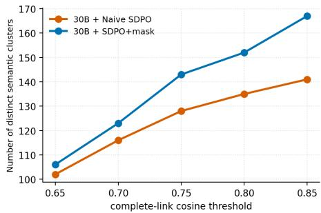  
Figure 5: Distinct semantic clusters of evaluation criteria invoked by trained 30B judges across a sweep of complete-link cosine clustering thresholds. Naive SD invokes a markedly smaller pool than SD+mask at every threshold; the gap widens with stricter clustering.

Embedding-8B [53]. We then cluster the resulting 4096-dimensional vectors with complete-link agglomerative clustering at cosine threshold t: two criterion strings belong to the same cluster only if every pair within the cluster has cosine similarity ≥ t. This procedure groups semantically similar criterion expressions (e.g., “factual accuracy,” “factual correctness,” and “accuracy of facts”), reducing sensitivity to differences in wording. Larger t enforces tighter clusters; lower t allows looser merging.

Figure 5 shows that SD+mask invokes more distinct criterion clusters than naive SD at every evaluated clustering threshold, with the difference increasing from 4 clusters at $t = 0 . 6 5$ to 26 at $t = 0 . 8 5$ . This pattern is consistent with the interpretation suggested by §3.3: supervision that preserves multiple feedback-aligned alternatives helps maintain a broader criterion repertoire after training. Different prompts call for different evaluation criteria, making criterion diversity a relevant property of a general-purpose judge.

## 4 Experiments

## 4.1 Setup

Base models. We train two instruct models as judges: Qwen3-4B-Instruct- ${ } . 2 5 0 7 ^ { 0 }$ and Qwen3-30B-A3B-Instruct-25071. The judge prompt template is given in Appendix E; we tuned a small set of candidate templates on the base model and chose the one that yielded the best validation accuracy.

Training data. All methods are trained on a cleaned version of HELPSTEER3-PREFERENCE [43] with three modifications applied in order: (1) filter out rows with domain == "multilingual" or overall\_preference == 0 (tie); (2) within-split deduplication by content hash (sha1(context, response1, response2)), keeping the first occurrence; upstream HELPSTEER3-PREFERENCE contains ${ \sim } 3 5 \%$ byte-identical duplicate rows after step (1); (3) cross-split deduplication: drop validation rows whose content hash also appears in train-split; upstream HELPSTEER3-PREFERENCE has ∼918 of ∼1,553 filtered-deduped validation rows that are byte-identical to a train-split row and would otherwise cause train/val leakage. Each retained example contains a prompt, two candidate responses, a gold preference label, and a one- or two-sentence human-written rationale explaining the label.

Language feedback types. We mainly use the preference rationale as the source of language feedback z. Preference rationales are the most naturally available and easiest-to-collect form of textual feedback during preference-data construction. To assign a binary preference label, an annotator must already compare the two responses and identify why one is better. To test sensitivity to a substantially different language-feedback format, we also generated a per-example rubric for every HELPSTEER3- PREFERENCE sample using Claude Opus 4.8 [2], following the iterative rubric-generation procedures of [34]. Generating rubrics requires a separate generation or annotation process and careful design to ensure that the criteria are discriminative, non-redundant, and aligned with the response pair and preference direction. The generated rubrics average 2,062 characters, making them approximately 7.7 times longer than the original preference rationales. Results using these rubrics as language feedback are reported in Appendix B.

Evaluation benchmarks. We evaluate out-of-distribution (OOD) judge accuracy on RM-BENCH [22] and REWARDBENCH V2 [27].

Baselines. We compare three on-policy training methods. We use Dr. GRPO as the outcomesupervised RL baseline. Naive SD $( \rho = 0 )$ is the objective in Eq. 2 with all positions included. SD+mask uses $\rho = 0 . 7$ , masking the top 70% of positions by $\Delta H _ { t }$ and keeping the 30% of positions with the lowest entropy shifts. Implementation details for all three are in Appendix D. We additionally compare against strong prompting baselines (DeepSeek-R1 [7], Claude-Sonnet-4 [1]) and trained reward-model baselines (Think-RM-8B [11], RM-R1-DeepSeek-Distilled-Qwen-7B and RM-R1- DeepSeek-Distilled-Qwen-32B [5], Llama-3.3-Nemotron-Super-49B-GenRM [28]) evaluated from their authors’ released checkpoints, and RationaleRM-30B [39] for which we cite the authors’ reported numbers.

## 4.2 Main Results

Table 1 reports judge accuracy on RM-BENCH and REWARDBENCH V2 for the Qwen3-4B-Instruct and Qwen3-30B-A3B-Instruct base models, using preference rationales as language feedback, alongside prompting-based and trained reward-model baselines.

Main findings. Per-category results in Table 1 can be split along the objective/subjective axis.

Outcome-supervised RL vs. self-distillation. On the objective subcategories (e.g., math, coding), where the decisive criterion is clear-cut, Dr. GRPO sharpens application rigor against that criterion and is competitive with both naive SD and SD+mask: at 30B it matches them on RM-Bench Math (95.59 (Dr. GRPO) vs 94.45 (SD) / 95.63 (SD+mask)) and beats them on REWARDBENCH V2 Math (87.43 vs 81.42 / 84.15). On the subjective subcategories (e.g., chat helpfulness; factuality, where the judge must prioritize factual accuracy over otherwise persuasive presentation; focus, which tests detection of high-quality, on-topic answers to general user queries), the gap flips: both SD variants gain over Dr. GRPO by 2–9 percentage points (30B Chat 74.07 vs 76.74 / 80.53; 30B Factuality 71.79 vs 78.53 / 79.16; 30B Focus 80.00 vs 86.26 / 85.66; 4B Chat 68.91 vs 75.71 / 77.95; 4B Factuality 62.74 vs 68.42 / 70.74; 4B Focus 75.76 vs 80.20 / 77.78).

Table 1: Judge accuracy (%) on RM-BENCH and REWARDBENCH V2. Dark gray (in bold) and light gray highlight the best and second-best performance per column, respectively. RationaleRM-30B numbers are taken from Wang et al. [39] as the model has not been released; REWARDBENCH V2 cells are left empty.
<table><tr><td rowspan="2">Models</td><td colspan="5">RM-BENCH</td><td colspan="6">REWARDBENCH V2</td><td rowspan="2">Total Avg.</td></tr><tr><td>Chat</td><td>Code</td><td>Math</td><td>Safety</td><td>Overall</td><td>Factuality</td><td>Focus</td><td>Math</td><td>Precise IF</td><td>Safety</td><td>Overall</td></tr><tr><td>Prompting</td><td></td><td></td><td></td><td></td><td></td><td></td><td></td><td></td><td></td><td></td><td></td><td></td></tr><tr><td>Claude-Sonnet-4-20250514</td><td>79.93</td><td>81.77</td><td>93.05</td><td>95.34</td><td>87.52</td><td>84.00</td><td>87.27</td><td>85.25</td><td>56.88</td><td>94.00</td><td>81.48</td><td>84.50</td></tr><tr><td>DeepSeek-R1</td><td>78.38</td><td>79.29</td><td>94.01</td><td>92.27</td><td>85.99</td><td>74.53</td><td>80.40</td><td>87.43</td><td>43.12</td><td>86.00</td><td>74.30</td><td>80.15</td></tr><tr><td colspan="9">Training (Small Model &lt;10B)</td><td></td><td></td><td></td><td></td></tr><tr><td>Think-RM-8B</td><td>65.20</td><td>54.63</td><td>71.92</td><td>91.71</td><td>70.87</td><td>49.26</td><td>62.42</td><td>58.47</td><td>26.88</td><td>75.56</td><td>54.52</td><td>62.70</td></tr><tr><td>RM-R1-DeepSeek-Distilled-Qwen-7B</td><td>64.51</td><td>60.87</td><td>88.55</td><td>85.99</td><td>74.98</td><td>28.21</td><td>58.59</td><td>74.32</td><td>19.38</td><td>51.56</td><td>46.41</td><td>60.70</td></tr><tr><td>Qwen3-4B-Instruct + Dr. GRPO</td><td>68.91</td><td>73.83</td><td>94.01</td><td>90.93</td><td>81.92</td><td>62.74</td><td>75.76</td><td>86.34</td><td>43.12</td><td>83.78</td><td>70.35</td><td>76.14</td></tr><tr><td>Qwen3-4B-Instruct + Naive SD</td><td>75.71</td><td>73.34</td><td>93.51</td><td>92.06</td><td>83.66</td><td>68.42</td><td>80.20</td><td>85.79</td><td>38.75</td><td>85.56</td><td>71.74</td><td>77.70</td></tr><tr><td>Qwen3-4B-Instruct + SD+mask</td><td>77.95</td><td>75.88</td><td>94.10</td><td>90.95</td><td>84.72</td><td>70.74</td><td>77.78</td><td>84.15</td><td>45.00</td><td>89.11</td><td>73.36</td><td>79.04</td></tr><tr><td colspan="9">Training (Medium and Large Model ≥10B)</td><td></td><td></td><td></td><td></td></tr><tr><td>RM-R1-DeepSeek-Distilled-Qwen-32B</td><td>72.78</td><td>76.12</td><td>92.46</td><td>94.89</td><td>84.06</td><td>60.84</td><td>80.40</td><td>85.25</td><td>38.75</td><td>82.89</td><td>69.63</td><td>76.85</td></tr><tr><td>RationaleRM-30B</td><td>74.90</td><td>84.40</td><td>95.50</td><td>93.60</td><td>87.10</td><td></td><td></td><td></td><td></td><td></td><td></td><td></td></tr><tr><td>Llama-3.3-Nemotron-Super-49B-GenRM</td><td>73.64</td><td>73.34</td><td>90.55</td><td>90.15</td><td>81.92</td><td>70.95</td><td>81.41</td><td>83.61</td><td>44.38</td><td>81.56</td><td>72.38</td><td>77.15</td></tr><tr><td>Qwen3-30B-A3B-Instruct + Dr. GRPO</td><td>74.07</td><td>79.68</td><td>95.59</td><td>93.78</td><td>85.78</td><td>71.79</td><td>80.00</td><td>87.43</td><td>42.50</td><td>92.44</td><td>74.83</td><td>80.31</td></tr><tr><td>Qwen3-30B-A3B-Instruct + Naive SD</td><td>76.74</td><td>76.56</td><td>94.45</td><td>94.26</td><td>85.50</td><td>78.53</td><td>86.26</td><td>81.42</td><td>40.62</td><td>87.33</td><td>74.83</td><td>80.17</td></tr><tr><td>Qwen3-30B-A3B-Instruct + SD+mask</td><td>80.53</td><td>80.07</td><td>95.63</td><td>94.81</td><td>87.76</td><td>79.16</td><td>85.66</td><td>84.15</td><td>48.75</td><td>88.44</td><td>77.23</td><td>82.50</td></tr></table>

Naive SD vs. SD+mask. SD+mask consistently improves over naive SD on overall accuracy at both scales (Total Avg: 77.70 → 79.04 at 4B; 80.17 → 82.50 at 30B), with the largest per-subcategory gains spread across different subcategories (30B RM-Bench Code 76.56 → 80.07; 30B Chat 76.74 → 80.53; 30B REWARDBENCH V2 Precise IF 40.62 → 48.75). Because both benchmarks are OOD with respect to the training data, these gains are consistent with the proposed mechanism: masking higher-entropy-shift positions reduces overreliance on particular criterion expressions, while the broader inference-time criterion vocabulary in Figure 5 provides additional support for this interpretation.

Our 30B SD+mask judge outperforms leading judge baselines in the literature, including RM-R1- DeepSeek-Distilled-Qwen-32B, Llama-3.3-Nemotron-Super-49B-GenRM, and RationaleRM-30B, on overall benchmark accuracy, and remains comparable to Claude-Sonnet-4.

## 4.3 Downstream Utility for Policy Optimization

The benchmark results above evaluate judges directly, but a reward model is ultimately used to determine which on-policy outputs receive higher reward and advantage during policy optimization. The strongest downstream validation would train separate policies with GRPO using each learned judge as the reward model. Because this requires multiple full RLHF runs, we instead evaluate the core pairwise-selection operation used by judge-guided GRPO through a controlled multi-round best-of-eight tournament.

Setup. For each subjective creative-writing prompt from Arena-Hard-v2 [18], GLM-4.5-Air [50] generates eight responses with temperature 1.0, top-p 1.0, and a maximum of 8K new tokens. We randomly pair the eight responses into four matchups and use a judge to select the winner of each pair. We repeat this procedure with the four winners, and then with the two remaining responses, until one final response is selected. We run the tournament separately using Qwen3-30B-A3B-Instruct judges trained with Dr. GRPO, naive SD, and SD+mask (ρ = 0.7). Claude Sonnet 5 [3] evaluates the selected responses against the Arena-Hard-v2 reference responses to compute the creative-writing win rate.

SD+mask selects the strongest downstream responses, improving the creative-writing win rate over the Dr. GRPO-trained judge by 7.6 percentage points and over naive SD by 2.0 percentage points. Although this tournament does not include the subsequent gradient-based policy updates of a full

Table 2: Creative-writing win rate of responses selected through multi-round best-of-eight tournaments. Each tournament uses a different Qwen3-30B-A3B-Instruct judge as its pairwise selector; selected responses are evaluated against the Arena-Hard-v2 reference responses by Claude Sonnet 5.
<table><tr><td>Selector</td><td>Creative-writing win rate</td></tr><tr><td>Dr. GRPO</td><td>0.556</td></tr><tr><td>Naive SD</td><td>0.612</td></tr><tr><td>SD+mask  $( \rho = 0 . 7 )$ </td><td>0.632</td></tr></table>

GRPO run, it directly tests the repeated pairwise reward comparisons that determine which on-policy outputs would be preferentially reinforced. The result therefore provides evidence that the gains from SD+mask are not confined to standalone judge benchmarks: when used as a reward selector, it more reliably favors responses preferred under the downstream evaluation.

## 4.4 Ablations

## 4.4.1 Mask-fraction (ρ) sweep

Table 3: ρ-sweep on Qwen3-30B-A3B-Instruct, all masking the top-ρ fraction by $\Delta H _ { t }$ and training on the remaining bottom $( 1 - \rho )$
<table><tr><td rowspan="2">(fraction masked)  $\rho$ </td><td colspan="5">RM-BENCH</td><td colspan="6">REWARDBENCH V2</td><td rowspan="2">Total Avg.</td></tr><tr><td>Chat</td><td>Code</td><td>Math</td><td>Safety</td><td>Overall</td><td>Factuality</td><td>Focus</td><td>Math</td><td>Precise IF</td><td>Safety</td><td>Overall</td></tr><tr><td>0.00 (naive SD)</td><td>76.74</td><td>76.56</td><td>94.45</td><td>94.26</td><td>85.50</td><td>78.53</td><td>86.26</td><td>81.42</td><td>40.62</td><td>87.33</td><td>74.83</td><td>80.17</td></tr><tr><td>0.30</td><td>77.52</td><td>75.78</td><td>95.02</td><td>94.21</td><td>85.63</td><td>80.00</td><td>83.03</td><td>85.79</td><td>43.75</td><td>85.56</td><td>75.63</td><td>80.63</td></tr><tr><td>0.50</td><td>77.17</td><td>77.49</td><td>94.85</td><td>94.15</td><td>85.92</td><td>78.95</td><td>83.43</td><td>84.15</td><td>46.88</td><td>83.78</td><td>75.44</td><td>80.68</td></tr><tr><td>0.70 (canonical)</td><td>80.53</td><td>80.07</td><td>95.63</td><td>94.81</td><td>87.76</td><td>79.16</td><td>85.66</td><td>84.15</td><td>48.75</td><td>88.44</td><td>77.23</td><td>82.50</td></tr></table>

We sweep the mask fraction $\rho \in \{ 0 , 0 . 3 , 0 . 5 , 0 . 7 \}$ on Qwen3-30B-A3B-Instruct (Table 3) to characterize how aggressive the mask should be; the corresponding Qwen3-4B-Instruct results are reported in Appendix C. $\rho = 0$ recovers naive SD (no positions masked). Overall accuracy rises as we mask more of the upper $\Delta H _ { t }$ tail (Total Avg: $8 0 . 1 7 \overset { - } {  } 8 0 . 6 3  8 0 . 6 8  8 2 . 5 0$ across $\rho \in \{ 0 , 0 . 3 , 0 . 5 , 0 . 7 \}$ ), with $\rho = 0 . 7$ achieving the highest overall accuracy among the tested mask fractions. The same pattern holds at 4B, where $\rho = 0 . 7$ also obtains the highest total average (Table 6).

## 4.4.2 Selector ablation

Table 4: Selector ablation on Qwen3-30B-A3B-Instruct, all at matched mask fraction $\rho = 0 . 7 .$
<table><tr><td rowspan="2">Selector</td><td colspan="5">RM-BENCH Code</td><td colspan="6">REWARDBENCH V2</td><td rowspan="2">Total Avg.</td></tr><tr><td>Chat</td><td></td><td>Math</td><td>Safety</td><td>Overall</td><td>Factuality</td><td>Focus</td><td>Math</td><td>Precise IF</td><td>Safety</td><td>Overall</td></tr><tr><td>Mask top ρ fraction by ∆Ht (ours; drops highest-shift positions)</td><td>80.53</td><td>80.07</td><td>95.63</td><td>94.81</td><td>87.76</td><td>79.16</td><td>85.66</td><td>84.15</td><td>48.75</td><td>88.44</td><td>77.23</td><td>82.50</td></tr><tr><td>Mask bottom ρ fraction by ∆Ht (direction flip; drops lowest-shift positions)</td><td>75.37</td><td>74.22</td><td>93.40</td><td>94.13</td><td>84.28</td><td>72.63</td><td>84.95</td><td>85.55</td><td>40.67</td><td>87.05</td><td>74.17</td><td>79.23</td></tr><tr><td>Mask bottom ρ fraction by |∆Ht | (both tails; drops smallest absolute shifts)</td><td>76.14</td><td>76.17</td><td>93.47</td><td>93.78</td><td>84.89</td><td>73.05</td><td>86.60</td><td>84.39</td><td>44.00</td><td>84.77</td><td>74.56</td><td>79.73</td></tr><tr><td>Random masking</td><td>75.11</td><td>75.88</td><td>93.72</td><td>94.41</td><td>84.78</td><td>77.47</td><td>85.45</td><td>81.97</td><td>40.00</td><td>86.67</td><td>74.31</td><td>79.55</td></tr><tr><td>Mask bottom ρ fraction by student entropy</td><td>74.59</td><td>75.44</td><td>93.59</td><td>94.15</td><td>84.44</td><td>76.63</td><td>86.46</td><td>84.70</td><td>40.00</td><td>85.78</td><td>74.71</td><td>79.57</td></tr><tr><td>Mask bottom ρ fraction by teacher entropy</td><td>75.45</td><td>75.44</td><td>94.01</td><td>93.35</td><td>84.56</td><td>78.11</td><td>83.84</td><td>83.06</td><td>35.62</td><td>82.67</td><td>72.66</td><td>78.61</td></tr></table>

Is the OOD gain specific to the entropy-shift criterion, or does any sensible per-position selector at matched $\rho$ give the same benefit? We compare our top- $\Delta H _ { t }$ -masked selector against five alternatives at matched $\rho = 0 . 7$ on Qwen3-30B-A3B-Instruct (Table 4):

$\Delta H _ { t } ,$ , mask bottom $\rho$ fraction (direction flip): drop the positions with the lowest entropy shifts and retain the highest-shift positions instead. Tests whether the gain depends on the masking direction.

$| \Delta H _ { t } |$ , mask bottom $\rho$ fraction (both tails): drop positions with near-zero entropy shifts and retain positions with large absolute entropy shifts, where the teacher and student entropies differ substantially. Tests whether retaining positions with large absolute entropy shifts is sufficient, regardless of whether the shift is positive or negative.

• Random masking: mask a uniformly sampled $\rho$ fraction of response positions. Tests whether the gain follows simply from reducing the number of supervised positions.

• Student-entropy masking: mask the bottom $\rho$ fraction of positions by student next-token entropy. Tests whether retaining positions where the unconditioned student is uncertain is sufficient.

• Teacher-entropy masking: mask the bottom $\rho$ fraction of positions by teacher next-token entropy. Tests whether retaining positions where the feedback-conditioned teacher is uncertain is sufficient.

Our top-∆Ht-masked selector outperforms all five controls on overall RM-BENCH and REWARD-BENCH V2 accuracy. The gain is therefore not explained by the masking fraction alone, by either distribution’s entropy in isolation, by reversing the masking direction, or by retaining high- $| \Delta \dot { H } _ { t }$ | positions of either sign. Together, these ablations support selecting positions by signed entropy shift, with lower-shift selection outperforming the tested alternatives. The corresponding Qwen3-4B-Instruct results are reported in Appendix C.

## 5 Conclusion

We studied on-policy dense supervision for training LLM judges on subjective tasks, where the verdict hinges on which evaluation criteria the judge invokes and how it weighs them. Outcome-supervised RL credits every token by the final verdict and does not provide explicit guidance on criterion choice; SD converts the per-example language feedback that names the decisive criterion into per-position supervision, but not every position carries equally useful signal. Using the per-position entropy shift between teacher and student, we identified two regimes, context sharpening and context spreading, and proposed a simple mask that retains the lower tail of the entropy-shift distribution. Across model sizes, SD outperforms outcome-supervised RL on the evaluated subjective tasks, and our mask further improves generalization over naive SD.

## 6 Limitations and Scope

Our method has two main limitations. First, the method depends on feedback quality: entropy-shift masking does not guarantee useful supervision when the feedback fails to identify a decisive criterion or provides only generic guidance. Second, our method does not explicitly address known limitations of self-distillation, including hallucination and training instability in long-chain-of-thought reasoning models [15]. We focus on instruction-tuned models to support efficient judge inference; extending the method to long-chain-of-thought reasoning models remains future work.

## References

[1] Anthropic. Introducing Claude 4. https://www.anthropic.com/news/claude-4, 2025.

[2] Anthropic. Introducing Claude Opus 4.8. https://www.anthropic.com/news/ claude-opus-4-8, 2026.

[3] Anthropic. Introducing Claude Sonnet 5. https://www.anthropic.com/news/ claude-sonnet-5, 2026.

[4] Yuntao Bai, Saurav Kadavath, Sandipan Kundu, Amanda Askell, Jackson Kernion, Andy Jones, Anna Chen, Anna Goldie, Azalia Mirhoseini, Cameron McKinnon, et al. Constitutional AI: Harmlessness from AI feedback. arXiv preprint arXiv:2212.08073, 2022. URL https: //arxiv.org/abs/2212.08073.

[5] Xiusi Chen, Gaotang Li, Ziqi Wang, Bowen Jin, Cheng Qian, Yu Wang, Hongru Wang, Yu Zhang, Denghui Zhang, Tong Zhang, Hanghang Tong, and Heng Ji. RM-R1: Reward modeling as reasoning. In International Conference on Learning Representations (ICLR), 2026. URL https://arxiv.org/abs/2505.02387.

[6] Ganqu Cui et al. The entropy mechanism of reinforcement learning for reasoning language models. arXiv preprint arXiv:2505.22617, 2025. URL https://arxiv.org/abs/2505. 22617.

[7] DeepSeek-AI. DeepSeek-R1: Incentivizing reasoning capability in LLMs via reinforcement learning. Nature, 645:633–638, 2025. URL https://arxiv.org/abs/2501.12948.

[8] Raymond Feng and Pranav Vaid. Bringing capabilities in distribution via relevancemasked self-distillation, 2026. URL https://www.appliedcompute.com/research/ relevance-masked-self-distillation. Applied Compute Research.

[9] Jiaxin Guo, Zewen Chi, Li Dong, Qingxiu Dong, Xun Wu, Shaohan Huang, and Furu Wei. Reward reasoning model. arXiv preprint arXiv:2505.14674, 2025. URL https://arxiv. org/abs/2505.14674.

[10] Yuhang He, Haodong Wu, Siyi Liu, Hongyu Ge, Hange Zhou, Keyi Wu, Zhuo Zheng, Qihong Lin, Zixin Zhong, and Yongqi Zhang. Rethinking token-level credit assignment in RLVR: A polarity-entropy analysis. arXiv preprint arXiv:2604.11056, 2026. URL https://arxiv. org/abs/2604.11056.

[11] Ilgee Hong, Changlong Yu, Liang Qiu, Weixiang Yan, Zhenghao Xu, Haoming Jiang, Qingru Zhang, Qin Lu, Xin Liu, Chao Zhang, and Tuo Zhao. Think-RM: Enabling long-horizon reasoning in generative reward models. arXiv preprint arXiv:2505.16265, 2025. URL https: //arxiv.org/abs/2505.16265.

[12] Jonas Hübotter, Frederike Lübeck, Lejs Behric, Anton Baumann, Marco Bagatella, Daniel Marta, Ido Hakimi, Idan Shenfeld, Thomas Kleine Buening, Carlos Guestrin, and Andreas Krause. Reinforcement learning via self-distillation. arXiv preprint arXiv:2601.20802, 2026. URL https://arxiv.org/abs/2601.20802.

[13] Nan Jia, Haojin Yang, Xing Ma, Jiesong Lian, Shuailiang Zhang, Weipeng Zhang, Ke Zeng, Xunliang Cai, and Zequn Sun. Asymmetric on-policy distillation: Bridging exploitation and imitation at the token level. arXiv preprint arXiv:2605.06387, 2026. URL https://arxiv. org/abs/2605.06387.

[14] Woogyeol Jin, Taywon Min, Yongjin Yang, Swanand Ravindra Kadhe, Yi Zhou, Dennis Wei, Nathalie Baracaldo, and Kimin Lee. Entropy-aware on-policy distillation of language models. arXiv preprint arXiv:2603.07079, 2026. URL https://arxiv.org/abs/2603.07079.

[15] Jeonghye Kim, Xufang Luo, Minbeom Kim, Sangmook Lee, Dohyung Kim, Jiwon Jeon, Dongsheng Li, and Yuqing Yang. Why does self-distillation (sometimes) degrade the reasoning capability of LLMs? arXiv preprint arXiv:2603.24472, 2026. URL https://arxiv.org/ abs/2603.24472.

[16] Woosuk Kwon, Zhuohan Li, Siyuan Zhuang, Ying Sheng, Lianmin Zheng, Cody Hao Yu, Joseph E. Gonzalez, Hao Zhang, and Ion Stoica. Efficient memory management for large language model serving with PagedAttention. In ACM Symposium on Operating Systems Principles (SOSP), 2023. URL https://arxiv.org/abs/2309.06180.

[17] Yoonho Lee, Joseph Boen, and Chelsea Finn. Feedback descent: Open-ended text optimization via pairwise comparison. arXiv preprint arXiv:2511.07919, 2025. URL https://arxiv.org/ abs/2511.07919.

[18] Tianle Li, Wei-Lin Chiang, Evan Frick, Lisa Dunlap, Tianhao Wu, Banghua Zhu, Joseph E. Gonzalez, and Ion Stoica. From crowdsourced data to high-quality benchmarks: Arena-Hard and BenchBuilder pipeline. arXiv preprint arXiv:2406.11939, 2024. URL https: //arxiv.org/abs/2406.11939.

[19] Aiwei Liu, Haoping Bai, Zhiyun Lu, Yanchao Sun, Xiang Kong, Simon Wang, Jiulong Shan, Albin Madappally Jose, Xiaojiang Liu, Lijie Wen, Philip S. Yu, and Meng Cao. TIS-DPO: Token-level importance sampling for direct preference optimization with estimated weights. arXiv preprint arXiv:2410.04350, 2025. URL https://arxiv.org/abs/2410.04350.

[20] Tianci Liu, Ran Xu, Tony Yu, Ilgee Hong, Carl Yang, Tuo Zhao, and Haoyu Wang. Openrubrics: Towards scalable synthetic rubric generation for reward modeling and LLM alignment. arXiv preprint arXiv:2510.07743, 2025. URL https://arxiv.org/abs/2510.07743.

[21] Xiaogeng Liu, Xinyan Wang, Yingzi Ma, Yechao Zhang, and Chaowei Xiao. When are teacher tokens reliable? Position-Weighted on-policy self-distillation for reasoning. arXiv preprint arXiv:2605.21606, 2026. URL https://arxiv.org/abs/2605.21606.

[22] Yantao Liu, Zijun Yao, Rui Min, Yixin Cao, Lei Hou, and Juanzi Li. RM-Bench: Benchmarking reward models of language models with subtlety and style. In International Conference on Learning Representations (ICLR), 2025. URL https://arxiv.org/abs/2410.16184. Oral.

[23] Zichen Liu, Changyu Chen, Wenjun Li, Penghui Qi, Tianyu Pang, Chao Du, Wee Sun Lee, and Min Lin. Understanding R1-zero-like training: A critical perspective. arXiv preprint arXiv:2503.20783, 2025. URL https://arxiv.org/abs/2503.20783.

[24] Ilya Loshchilov and Frank Hutter. Decoupled weight decay regularization. In International Conference on Learning Representations (ICLR), 2019. URL https://arxiv.org/abs/ 1711.05101.

[25] Outongyi Lv, Yuanwei Zhang, and Xiaoqun Zhang. GMTS: Gradient magnitude-based token selection improves RLVR training for LLM reasoning. In OpenReview preprint, 2026. URL https://openreview.net/forum?id=JGvOicAo3g.

[26] Aman Madaan, Niket Tandon, Prakhar Gupta, Skyler Hallinan, Luyu Gao, Sarah Wiegreffe, Uri Alon, Nouha Dziri, Shrimai Prabhumoye, Yiming Yang, Sean Welleck, Bodhisattwa Prasad Majumder, Shashank Gupta, Amir Yazdanbakhsh, and Peter Clark. Self-refine: Iterative refinement with self-feedback. In Advances in Neural Information Processing Systems (NeurIPS), 2023. URL https://arxiv.org/abs/2303.17651.

[27] Saumya Malik, Valentina Pyatkin, Sander Land, Jacob Morrison, Noah A. Smith, Hannaneh Hajishirzi, and Nathan Lambert. RewardBench 2: Advancing reward model evaluation. arXiv preprint arXiv:2506.01937, 2025. URL https://arxiv.org/abs/2506.01937.

[28] NVIDIA. Llama-3.3-Nemotron-Super-49B-GenRM. https://huggingface.co/nvidia/ Llama-3\_3-Nemotron-Super-49B-GenRM, 2025.

[29] OpenAI. Introducing GPT-5.5. https://openai.com/index/introducing-gpt-5-5/, 2026.

[30] Jinlong Pang, Na Di, Zhaowei Zhu, Jiaheng Wei, Hao Cheng, Chen Qian, and Yang Liu. Token cleaning: Fine-grained data selection for LLM supervised fine-tuning. In International Conference on Machine Learning (ICML), 2025. URL https://arxiv.org/abs/2502. 01968.

[31] Zhiwen Ruan, Yixia Li, He Zhu, Yun Chen, Peng Li, Yang Liu, and Guanhua Chen. Enhancing large language model reasoning via selective critical token fine-tuning. arXiv preprint arXiv:2510.10974, 2025. URL https://arxiv.org/abs/2510.10974.

[32] Jérémy Scheurer, Jon Ander Campos, Tomasz Korbak, Jun Shern Chan, Angelica Chen, Kyunghyun Cho, and Ethan Perez. Training language models with language feedback at scale. In arXiv preprint arXiv:2303.16755, 2023. URL https://arxiv.org/abs/2303.16755.

[33] Zhihong Shao, Peiyi Wang, Qihao Zhu, Runxin Xu, Junxiao Song, Xiao Bi, Haowei Zhang, Mingchuan Zhang, Y. K. Li, Y. Wu, and Daya Guo. Deepseekmath: Pushing the limits of mathematical reasoning in open language models. arXiv preprint arXiv:2402.03300, 2024. URL https://arxiv.org/abs/2402.03300.

[34] William F. Shen, Xinchi Qiu, Chenxi Whitehouse, Lisa Alazraki, Shashwat Goel, Francesco Bar bieri, Timon Willi, Akhil Mathur, and Ilias Leontiadis. Rethinking rubric generation for improving LLM judge and reward modeling for open-ended tasks. arXiv preprint arXiv:2602.05125, 2026. URL https://arxiv.org/abs/2602.05125.

[35] Zhanming Shen, Jiaqi Hu, Zeyu Qin, Hao Chen, Wentao Ye, Zenan Huang, Yihong Zhuang, Guoshan Lu, Junlin Zhou, and Junbo Zhao. Training-trajectory-aware token selection. arXiv preprint arXiv:2601.10348, 2026. URL https://arxiv.org/abs/2601.10348.

[36] Idan Shenfeld, Mehul Damani, Jonas Hübotter, and Pulkit Agrawal. Self-distillation enables continual learning. arXiv preprint arXiv:2601.19897, 2026. URL https://arxiv.org/abs/ 2601.19897.

[37] Guangming Sheng, Chi Zhang, Zilingfeng Ye, Xibin Wu, Wang Zhang, Ru Zhang, Yanghua Peng, Haibin Lin, and Chuan Wu. HybridFlow: A flexible and efficient RLHF framework. In European Conference on Computer Systems (EuroSys), 2025. URL https://arxiv.org/ abs/2409.19256.

[38] Manya Wadhwa, Xinyu Zhao, Junyi Jessy Li, and Greg Durrett. Learning to refine with fine-grained natural language feedback. In Findings of the Association for Computational Linguistics: EMNLP, 2024. URL https://arxiv.org/abs/2407.02397.

[39] Binghai Wang, Yantao Liu, Yuxuan Liu, Tianyi Tang, Shenzhi Wang, Chang Gao, Chujie Zheng, Yichang Zhang, Le Yu, Shixuan Liu, Tao Gui, Qi Zhang, Xuanjing Huang, Bowen Yu, Fei Huang, and Junyang Lin. Outcome accuracy is not enough: Aligning the reasoning process of reward models. arXiv preprint arXiv:2602.04649, 2026. URL https://arxiv.org/abs/ 2602.04649.

[40] Hanyang Wang, Lu Wang, Chaoyun Zhang, Tianjun Mao, Si Qin, Qingwei Lin, Saravan Rajmohan, and Dongmei Zhang. Text2grad: Reinforcement learning from natural language feedback. In International Conference on Learning Representations (ICLR), 2026. URL https://arxiv.org/abs/2505.22338.

[41] Hao Wang, Guozhi Wang, Han Xiao, Yufeng Zhou, Yue Pan, Jichao Wang, Ke Xu, Yafei Wen, Xiaohu Ruan, Xiaoxin Chen, and Honggang Qi. Skill-SD: Skill-conditioned self-distillation for multi-turn LLM agents. arXiv preprint arXiv:2604.10674, 2026. URL https://arxiv.org/ abs/2604.10674.

[42] Shenzhi Wang, Le Yu, Chang Gao, Chujie Zheng, Shixuan Liu, Rui Lu, Kai Dang, Xionghui Chen, Jianxin Yang, Zhenru Zhang, Yuqiong Liu, An Yang, Andrew Zhao, Yang Yue, Shiji Song, Bowen Yu, Gao Huang, and Junyang Lin. Beyond the 80/20 rule: High-entropy minority tokens drive effective RL for LLM reasoning. arXiv preprint arXiv:2506.01939, 2025. URL https://arxiv.org/abs/2506.01939.

[43] Zhilin Wang, Jiaqi Zeng, Olivier Delalleau, Hoo-Chang Shin, Felipe Soares, Alexander Bukharin, Ellie Evans, Yi Dong, and Oleksii Kuchaiev. Helpsteer3-preference: Open humanannotated preference data across diverse tasks and languages. arXiv preprint arXiv:2505.11475, 2025. URL https://arxiv.org/abs/2505.11475.

[44] Chenxi Whitehouse, Tianlu Wang, Ping Yu, Xian Li, Jason Weston, Ilia Kulikov, and Swarnadeep Saha. J1: Incentivizing thinking in LLM-as-a-judge via reinforcement learning. arXiv preprint arXiv:2505.10320, 2025. URL https://arxiv.org/abs/2505.10320.

[45] Ran Xu, Tianci Liu, Zihan Dong, Tony Yu, Ilgee Hong, Carl Yang, Linjun Zhang, Tao Zhao, and Haoyu Wang. Alternating reinforcement learning for rubric-based reward modeling in non-verifiable LLM post-training. arXiv preprint arXiv:2602.01511, 2026. URL https: //arxiv.org/abs/2602.01511.

[46] Yuanda Xu, Hejian Sang, Zhengze Zhou, Ran He, Zhipeng Wang, and Alborz Geramifard. TIP: Token importance in on-policy distillation. arXiv preprint arXiv:2604.14084, 2026. URL https://arxiv.org/abs/2604.14084.

[47] An Yang et al. Qwen3 Technical Report. arXiv preprint arXiv:2505.09388, 2025. URL https://arxiv.org/abs/2505.09388.

[48] Ning Yang, Hai Lin, Yibo Liu, Baoliang Tian, Guoqing Liu, and Haijun Zhang. Tokenimportance guided direct preference optimization. In International Conference on Learning Representations (ICLR), 2026. URL https://arxiv.org/abs/2505.19653.

[49] Qiying Yu et al. DAPO: An open-source LLM reinforcement learning system at scale. arXiv preprint arXiv:2503.14476, 2025. URL https://arxiv.org/abs/2503.14476.

[50] Aohan Zeng et al. GLM-4.5: Agentic, reasoning, and coding (ARC) foundation models. arXiv preprint arXiv:2508.06471, 2025. URL https://arxiv.org/abs/2508.06471.

[51] Yongcheng Zeng, Guoqing Liu, Weiyu Ma, Ning Yang, Haifeng Zhang, and Jun Wang. Tokenlevel direct preference optimization. In International Conference on Machine Learning (ICML), 2024. URL https://arxiv.org/abs/2404.11999.

[52] Xiaoying Zhang, Yipeng Zhang, Hao Sun, Kaituo Feng, Chaochao Lu, Chao Yang, and Helen Meng. Critique-GRPO: Advancing LLM reasoning with natural language and numerical feedback. arXiv preprint arXiv:2506.03106, 2025. URL https://arxiv.org/abs/2506. 03106.

[53] Yanzhao Zhang, Mingxin Li, Dingkun Long, Xin Zhang, Huan Lin, Baosong Yang, Pengjun Xie, An Yang, Dayiheng Liu, Junyang Lin, Fei Huang, and Jingren Zhou. Qwen3 Embedding: Advancing text embedding and reranking through foundation models. arXiv preprint arXiv:2506.05176, 2025. URL https://arxiv.org/abs/2506.05176.

[54] Siyan Zhao, Zhihui Xie, Mengchen Liu, Jing Huang, Guan Pang, Feiyu Chen, and Aditya Grover. Self-distilled reasoner: On-policy self-distillation for large language models. arXiv preprint arXiv:2601.18734, 2026. URL https://arxiv.org/abs/2601.18734.

[55] Yanli Zhao, Andrew Gu, Rohan Varma, Liang Luo, Chien-Chin Huang, Min Xu, Less Wright, Hamid Shojanazeri, Myle Ott, Sam Shleifer, Alban Desmaison, Can Balioglu, Pritam Damania, Bernard Nguyen, Geeta Chauhan, Yuchen Hao, Ajit Mathews, and Shen Li. PyTorch FSDP: Experiences on scaling fully sharded data parallel. Proceedings ofthe VLDB Endowment, 16 (12):3848–3860, 2023. URL https://arxiv.org/abs/2304.11277.

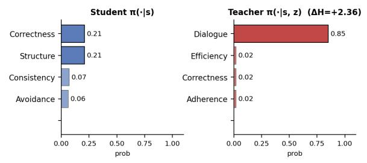

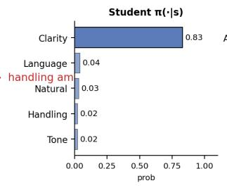

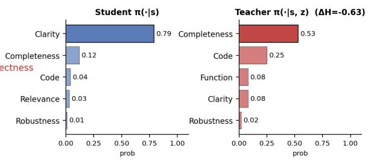

## A Additional Context-Sharpening and Context-Spreading Examples

Figures 6 and 7 present two further rollouts each for context sharpening and context spreading, supplementing the two featured examples in the main body (Figures 3 and 4). The plot layout and construction are identical to the main-body figures.

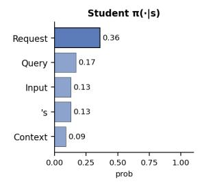

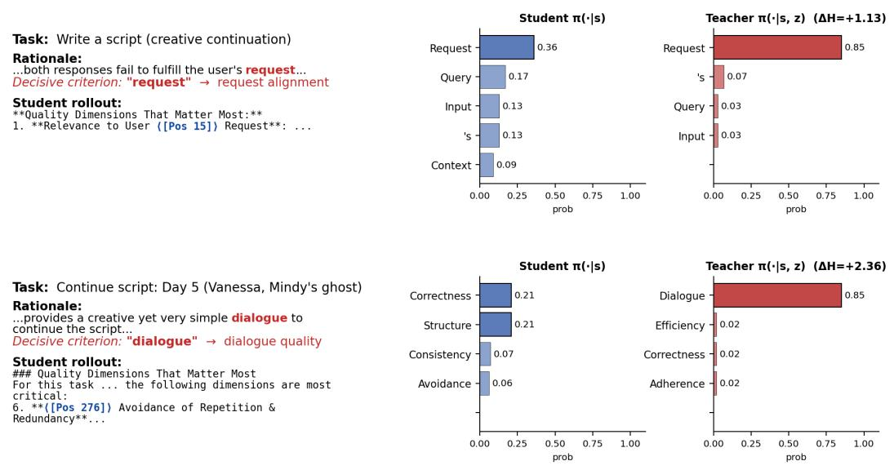

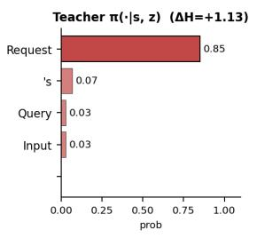

Figure 6: Additional context-sharpening examples on two HELPSTEER3-PREFERENCE rollouts (Qwen3-30B-A3B-Instruct-2507).  
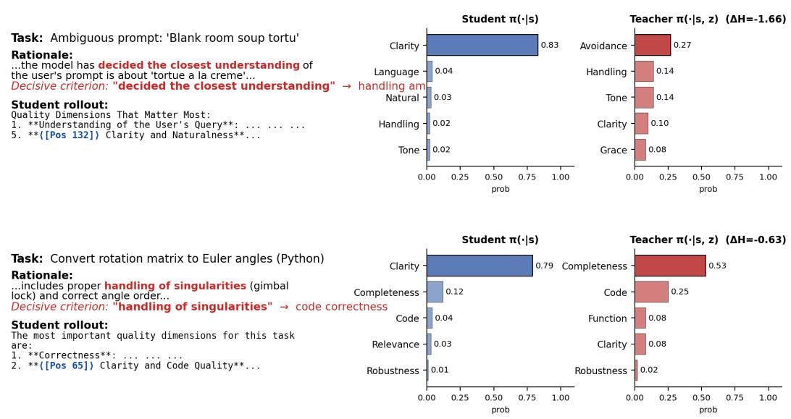  
Figure 7: Additional context-spreading examples on two HELPSTEER3-PREFERENCE rollouts (Qwen3-30B-A3B-Instruct-2507).

## B Additional Experiments with Rubric Feedback

We repeat the Qwen3-4B-Instruct self-distillation experiments using the generated per-example rubrics instead of the original preference rationales as language feedback z. Table 5 compares naive SD and SD+mask under both feedback formats, along with the same Dr. GRPO outcome-supervised baseline reported in the main results.

Table 5: Judge accuracy (%) for Qwen3-4B-Instruct using preference rationales or generated perexample rubrics as language feedback. Dark gray (in bold) and light gray highlight the best and second-best performance per column, respectively.
<table><tr><td rowspan="2">Models</td><td colspan="5">RM-BENCH</td><td colspan="6">REWARDBENCH V2</td><td rowspan="2">Total Avg.</td></tr><tr><td>Chat</td><td>Code</td><td>Math</td><td>Safety</td><td>Overall</td><td>Factuality</td><td>Focus</td><td>Math</td><td>Precise IF</td><td>Safety</td><td>Overall</td></tr><tr><td>Qwen3-4B-Instruct + Dr. GRPO</td><td>68.91</td><td>73.83</td><td>94.01</td><td>90.93</td><td>81.92</td><td>62.74</td><td>75.76</td><td>86.34</td><td>43.12</td><td>83.78</td><td>70.35</td><td>76.14</td></tr><tr><td>Qwen3-4B-Instruct + Naive SD (rubric)</td><td>75.45</td><td>75.19</td><td>93.57</td><td>92.34</td><td>84.14</td><td>61.68</td><td>74.23</td><td>84.39</td><td>36.00</td><td>79.09</td><td>67.08</td><td>75.61</td></tr><tr><td>Qwen3-4B-Instruct + SD+mask (rubric)</td><td>77.26</td><td>75.97</td><td>93.28</td><td>91.91</td><td>84.61</td><td>65.89</td><td>75.05</td><td>84.97</td><td>48.00</td><td>79.55</td><td>70.69</td><td>77.65</td></tr><tr><td>Qwen3-4B-Instruct + Naive SD (rationale)</td><td>75.71</td><td>73.34</td><td>93.51</td><td>92.06</td><td>83.66</td><td>68.42</td><td>80.20</td><td>85.79</td><td>38.75</td><td>85.56</td><td>71.74</td><td>77.70</td></tr><tr><td>Qwen3-4B-Instruct + SD+mask (rationale)</td><td>77.95</td><td>75.88</td><td>94.10</td><td>90.95</td><td>84.72</td><td>70.74</td><td>77.78</td><td>84.15</td><td>45.00</td><td>89.11</td><td>73.36</td><td>79.04</td></tr></table>

Entropy-shift masking improves the total average under both feedback formats: from 75.61 to 77.65 with generated rubrics and from 77.70 to 79.04 with preference rationales. This suggests that the benefit of entropy-shift masking is not specific to one language-feedback format.

Second, the rationale-based configuration achieves stronger overall performance than the rubric-based configuration, despite using substantially shorter feedback. One possible explanation is that the original rationales focus directly on the decisive reasons for the observed preferences, whereas generated rubrics introduce additional criteria that are less relevant to those preferences.

These results support our practical choice of preference rationales: they are the most naturally available and easiest-to-collect textual feedback during preference-data construction, require little additional annotation beyond the preference judgment itself, and outperform the substantially longer, separately generated rubrics in our experiments.

## C Additional Ablation Results

Table 6 reports the full mask-fraction sweep for Qwen3-4B-Instruct, complementing the Qwen3-30B-A3B-Instruct results in Table 3.

Table 6: ρ-sweep on Qwen3-4B-Instruct, all masking the top-ρ fraction by $\Delta H _ { t }$ and training on the remaining bottom $( 1 - \rho )$
<table><tr><td rowspan="2">ρ (fraction masked)</td><td colspan="5">RM-BENCH</td><td colspan="6">REWARDBENCH V2</td><td rowspan="2">Total Avg.</td></tr><tr><td>Chat</td><td>Code</td><td>Math</td><td>Safety</td><td>Overall</td><td>Factuality</td><td>Focus</td><td>Math</td><td>Precise IF</td><td>Safety</td><td>Overall</td></tr><tr><td>0.00 (naive SD)</td><td>75.71</td><td>73.34</td><td>93.51</td><td>92.06</td><td>83.66</td><td>68.42</td><td>80.20</td><td>85.79</td><td>38.75</td><td>85.56</td><td>71.74</td><td>77.70</td></tr><tr><td>0.30</td><td>75.54</td><td>74.51</td><td>93.97</td><td>91.38</td><td>83.85</td><td>67.79</td><td>75.96</td><td>83.06</td><td>41.88</td><td>87.33</td><td>71.20</td><td>77.53</td></tr><tr><td>0.50</td><td>76.92</td><td>75.54</td><td>93.82</td><td>91.74</td><td>84.50</td><td>67.58</td><td>76.36</td><td>83.61</td><td>46.88</td><td>88.22</td><td>72.53</td><td>78.52</td></tr><tr><td>0.70 (canonical)</td><td>77.95</td><td>75.88</td><td>94.10</td><td>90.95</td><td>84.72</td><td>70.74</td><td>77.78</td><td>84.15</td><td>45.00</td><td>89.11</td><td>73.36</td><td>79.04</td></tr></table>

At 4B, the total average changes from 77.70 with naive SD to 77.53, 78.52, and 79.04 as $\rho$ increases to 0.3, 0.5, and 0.7, respectively. Thus, the canonical $\rho = 0 . 7$ setting is also the strongest configuration at the smaller model scale.

Table 7 reports the corresponding selector ablation at 4B. As in the 30B results, every selector uses the same mask fraction, $\rho = 0 . 7$

Table 7: Selector ablation on Qwen3-4B-Instruct, all at matched mask fraction $\rho = 0 . 7 .$
<table><tr><td rowspan="2">Selector</td><td colspan="6">RM-BENCH Math</td><td colspan="6">REWARDBENCH V2</td><td rowspan="2">Total Avg.</td></tr><tr><td>Chat</td><td>Code</td><td></td><td>Safety</td><td></td><td>Overall</td><td>Factuality</td><td>Focus Math</td><td></td><td>Precise IF</td><td>Safety</td><td>Overall</td></tr><tr><td>Mask top ρ fraction by ∆ Ht (ours; drops highest-shift positions)</td><td>77.95</td><td>75.88</td><td>94.10</td><td>90.95</td><td>84.72</td><td></td><td>70.74</td><td>77.78 84.15</td><td></td><td>45.00</td><td>89.11</td><td>73.36</td><td>79.04</td></tr><tr><td>Mask bottom ρ fraction by ∆Ht (direction flip; drops lowest-shift positions)</td><td>76.23</td><td>74.12</td><td>93.24</td><td></td><td>92.06</td><td>83.91</td><td>68.21</td><td>80.20</td><td>83.61</td><td>43.75</td><td>88.22</td><td>72.80</td><td>78.35</td></tr><tr><td>Mask bottom ρ fraction by |∆Ht | (both tails; drops smallest absolute shifts)</td><td>74.33</td><td>73.25</td><td>93.85</td><td>92.49</td><td></td><td>83.48</td><td>66.53</td><td>81.03</td><td>84.39</td><td>40.67</td><td>87.27</td><td>71.98</td><td>77.73</td></tr><tr><td>Random masking</td><td>75.28</td><td>72.61</td><td>93.85</td><td>92.19</td><td></td><td>83.48</td><td>68.63</td><td>80.40</td><td>85.79</td><td>37.50</td><td>88.22</td><td>72.11</td><td>77.80</td></tr><tr><td>Mask bottom ρ fraction by student entropy</td><td>73.64</td><td>73.20</td><td>93.43</td><td></td><td>92.06</td><td>83.08</td><td>69.89</td><td>81.01</td><td>83.06</td><td>38.12</td><td>87.78</td><td>71.97</td><td>77.53</td></tr><tr><td>Mask bottom ρ fraction by teacher entropy</td><td>74.07</td><td>72.95</td><td>93.30</td><td></td><td>91.79</td><td>83.03</td><td>67.79</td><td>78.18</td><td>82.51</td><td>43.12</td><td>88.22</td><td>71.97</td><td>77.50</td></tr></table>

At 4B, top- $\Delta H _ { t }$ masking obtains a total average of 79.04, compared with 78.35 for the directionflipped selector and at most 77.80 for the $| \Delta \bar { H } _ { t } | .$ , random, student-entropy, and teacher-entropy controls. As at 30B, these results support selecting positions by signed entropy shift, with lower-shift selection outperforming the tested alternatives.

## D Implementation Details

Training framework. All runs use the verl [37]2 on-policy RL framework with FSDP [55] for parameter/optimizer sharding and vLLM [16]3 for rollouts.

Optimizer and schedule. We use AdamW [24] with a constant learning-rate schedule (no warmup).

Common training hyperparameters. The following are shared across all six training runs (Qwen3- 4B-Instruct and Qwen3-30B-A3B-Instruct, each with Dr. GRPO, naive SD, and SD+mask): train batch size 256 (mini-batch and PPO mini-batch both equal to 256); 3 training epochs; same order of training samples across runs; max prompt length 4096, max response length 8192; per-epoch A/B response-order swap enabled.

Per-method hyperparameters. Dr. GRPO uses learning rate 1e−6 (4B) / 2e−6 (30B) and 8 rollouts per prompt. Naive SD and SD+mask both use learning rate 5e−6 (4B) / 1e−5 (30B), 4 rollouts per prompt, and k = 100. To reduce computational cost, we approximate the full-vocabulary reverse KL using the teacher’s top-k tokens and a tail-remainder bucket [12]. Student and teacher entropies used to compute ∆H are calculated from their full-vocabulary distributions. The teacher parameters are maintained as an exponential moving average (EMA) of the student parameters, with an update rate of 0.01, to stabilize training.

Inference / evaluation decoding. At evaluation we sample one rollout per prompt with temperature 0.7, top-p 0.8, and top-k 20, following the official Qwen3-Instruct model cards. We use the prompt template in Appendix E.

## E Prompt Templates

Input format. We send a single user message of the form shown in the templates below; no system prompt is used. The judge expects each turn of the dialog and each candidate response to be wrapped with <user>...</user> and <assistant>...</assistant> tags.

The placeholder {context} is the user-side input: for a single-turn query it is just one <user>...</user> block; for a multi-turn conversation it is the full alternating dialog (which must alternate user, assistant, user, . . . and end on a <user> turn). The placeholders {response\_a} and {response\_b} are the two candidate replies, each wrapped in a single <assistant> block. The teacher prompt inserts the language feedback at {feedback}. This field is omitted from the student and evaluation prompts.

## Rationale language-feedback template.

You are an impartial judge tasked with determining which of two   
assistant responses is better for the given context.   
Below is a context (a user query or a conversation between the user   
and an assistant) and two assistant responses to that context.   
[Start of Context]   
{context}   
[End of Context]   
[Start of Assistant A’s Response]   
{response\_a}   
[End of Assistant A’s Response]   
[Start of Assistant B’s Response]   
{response\_b}   
[End of Assistant B’s Response]

{feedback}

Identify the quality dimensions that matter most for this specific task, then evaluate and compare the two assistant responses step by step across those dimensions. When correctness matters, solve the problem yourself and check each response for any errors. After your analysis, determine which response is better overall and provide your final verdict (A or B only) in <verdict>...</verdict>.

Rubric language-feedback template. The rubric-feedback experiments use the same prompt, except for the final instruction paragraph:

You are an impartial judge tasked with determining which of two assistant responses is better for the given context.   
Below is a context (a user query or a conversation between the user and an assistant) and two assistant responses to that context. [Start of Context]   
{context}   
[End of Context]   
[Start of Assistant A’s Response]   
{response\_a}   
[End of Assistant A’s Response]   
[Start of Assistant B’s Response]   
{response\_b}   
[End of Assistant B’s Response]

{feedback}

Identify the rubric that matters most for this specific task: the hard requirements the response must satisfy, ranked by importance, and the discriminative criteria that most decisively separate a better response from a worse one, ranked most decisive first, stating for each what makes a response better versus worse. Then evaluate and compare the two assistant responses step by step against that rubric. When correctness matters, solve the problem yourself and check each response for any errors. After your analysis, determine which response is better overall and provide your final verdict (A or B only) in <verdict>...</verdict>.

## Single-turn example.

[Start of Context]   
<user>   
What is the capital of France? </user>   
[End of Context]   
[Start of Assistant A’s Response] <assistant>   
The capital of France is Paris. </assistant>   
[End of Assistant A’s Response] [Start of Assistant B’s Response] <assistant>   
Lyon.   
</assistant>   
[End of Assistant B’s Response]

Multi-turn example. [Start of Context] <user> I’m planning a 3-day trip to Tokyo next month. Any recommendations? </user>

<assistant> <assistant>

Sure, what kind of activities are you interested in (food, history, nightlife, shopping)?   
</assistant>   
<user>   
Mostly food and history.   
</user>   
[End of Context]   
[Start of Assistant A’s Response]   
<assistant>   
Day 1: Tsukiji outer market for breakfast . . .   
</assistant>   
[End of Assistant A’s Response]   
[Start of Assistant B’s Response]   
<assistant>   
Just go to Shibuya and figure it out when you get there.   
</assistant>   
[End of Assistant B’s Response]