# WHEN REASONING GOES ASTRAY: ATTENTION DY-NAMICS OF UNCONTROLLED REASONING

Yuanhe Zhang1, Ziwei Wang2, Jie Ren1, Haoran Gao3, Zhenhong Zhou4, Fanyu Meng3, Cong Wu2, Li Sun1, Sen Su1, 5,

1Beijing University of Posts and Telecommunications 3Wuhan University 3JIUTIAN Research 4Nanyang Technological University 5Chongqing University of Posts and Telecommunications {charmes-zhang, susen}@bupt.edu.cn;

## ABSTRACT

Large reasoning models (LRMs) improve performance on complex tasks through extended reasoning, yet the same process can degenerate into redundant verification and persistent generation loops. Such uncontrolled reasoning increases inference cost and creates risks of resource exhaustion and service degradation. However, existing mitigations largely truncate long outputs or react to surface repetition, and thus fail to distinguish normal thinking from uncontrolled reasoning or explain how benign reasoning degenerates into harmful behavior. In this paper, we operationalize LRM generation as four states and further introduce Reasoningstate Analysis via Dynamic Attention Responses (RADAR), which identifies the current reasoning state in real time and characterizes how effective reflection can develop into uncontrolled generation. Guided by RADAR’s analysis, we further realign abnormal attention distributions toward patterns observed in normal requests and examine how this correction affects excessive reflection and persistent looping. Temporal analyses show that uncontrolled reasoning is characterized by attention distributions that deviate from normal generation, with abnormal trends becoming detectable before repetition begins. Correcting these deviations through Attention Realignment consistently reduces looping while largely preserving benign performance. Together, RADAR provide a mechanistic account of how reasoning becomes uncontrolled, offering actionable guidance for identifying critical failure stages and designing targeted runtime interventions.

## 1 INTRODUCTION

Large reasoning models (LRMs) improve performance on complex tasks by allocating additional computation to explicit reasoning traces (Guo et al., 2025; Muennighoff et al., 2025; Zhang et al., 2026b). These traces support reasoning, reflection, and revision of intermediate solutions (Guo et al., 2025). However, models can continue generating redundant solutions after reaching a correct answer, consuming additional tokens with little improvement in accuracy (Chen et al., 2025; Yang et al., 2026). Adversarial inputs can amplify this inefficiency by triggering persistent generation loops until the output budget is exhausted(Kumar et al., 2025; Wang et al., 2026; Li et al., 2026). Such prolonged generation increases inference latency and computational cost, and can threaten service availability under limited computing resources (Kumar et al., 2025; Dong et al., 2025).

Existing approaches primarily reduce reasoning cost by shortening or terminating the reasoning process (Han et al., 2025; Hou et al., 2025). Budget based methods set a fixed token budget for reasoning or terminate generation once a predefined limit is reached (Han et al., 2025; Muennighoff et al., 2025). Adaptive stopping methods instead monitor prediction confidence during reasoning to determine when further computation is unnecessary (Yang et al., 2026; Hosseini et al., 2026). Other methods compress reasoning traces or optimize the model under explicit length constraints (Xia et al., 2025; Luo et al., 2026). These approaches reduce token consumption, but their accuracy– cost tradeoff depends on the chosen budget or degree of reasoning compression(Han et al., 2025; Xia et al., 2025). Moreover, model reasoning plays an important role in solving complex problems, making indiscriminate termination liable to discard useful computation (Muennighoff et al., 2025; Guo et al., 2025). We therefore argue that effectively controlling harmful reasoning requires distinguishing reasoning states and analyzing their internal dynamics.

RADAR: Reasoning-state Analysis via Dynamic Attention Responses  
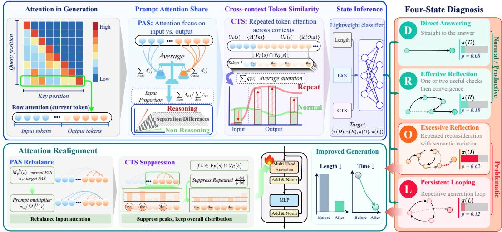  
Figure 1: Overview of RADAR, which characterizes attention during generation and supports diagnosis of direct answering, effective reflection, excessive reflection, and persistent looping.

In this paper, we formulate LRM generation as four Reasoning-States: direct answering (D), effective reflection (R), excessive reflection (O), and persistent looping (L). To identify these reasoning states, we introduce Reasoning-state Analysis via Dynamic Attention Responses (RADAR), a runtime diagnostic framework that treats attention dynamics as an evolving internal signal of the current reasoning state (Figure 1). RADAR characterizes these dynamics using two complementary measurements. Prompt Attention Share (PAS) quantifies the proportion of attention allocated to the prompt at the current reasoning step, while Cross-context Token Similarity (CTS) compares token-level attention distributions between the prompt and generated context. Using PAS and CTS, a Temporal State Inference Classifier encodes their trajectories and estimates the current reasoning state at any stage of generation. RADAR thereby dynamically evaluates the probabilities of different reasoning tendencies throughout generation and provides a state-aware signal for downstream intervention. Guided by this signal, we further validate the identified attention patterns through Attention Realignment, realigning abnormal attention distributions toward those observed in normal requests and examining the resulting changes in excessive reflection and persistent looping.

We evaluate RADAR across five models. RADAR achieves an average micro-F1 of 89.8% for Reasoning-States diagnosis. These abnormal trends become detectable before the recorded onset of repetition in naturally induced attacks. Guided by these observations, Attention Realignment reduces the average loop rate by 9.8 percentage points across five models while largely preserving benign performance. Together, these results show that attention dynamics provide a reliable signal for state diagnosis, transition analysis, and targeted runtime intervention without treating all extended reasoning as harmful.

Overall, we introduce RADAR to characterize and track four functional reasoning states through evolving attention dynamics, revealing how effective reflection can develop into excessive reflection and persistent looping. Building on these findings, we further develop a state guided intervention to examine and modulate abnormal reasoning dynamics while preserving normal reasoning.

## 2 RELATED WORK

## 2.1 PERFORMANCE OF LARGE REASONING MODELS

Early work showed that explicit reasoning can substantially improve language model performance by exposing and refining intermediate solution steps. Chain of thought prompting enables few shot and zero shot reasoning (Wei et al., 2022; Kojima et al., 2022), while self consistency and tree search further improve solution quality by exploring multiple reasoning paths (Wang et al., 2022; Yao et al., 2023). Outcome and process verifiers complement these approaches by providing answer level and step level supervision for selecting more reliable solutions (Cobbe et al., 2021; Lightman et al., 2024). More recent large reasoning models (LRMs) move beyond eliciting reasoning primarily through prompting and instead acquire stronger reasoning capabilities through dedicated training, including rationale self training and reinforcement learning, as demonstrated by DeepSeek R1, and QwQ (Zelikman et al., 2022; Shao et al., 2024; Guo et al., 2025; Qwen Team, 2025). Building on these advances, current models and inference strategies further exploit test time computation through thinking modes, budget control, adaptive compute allocation, and budget forcing (Yang et al., 2025; Snell et al., 2025; Muennighoff et al., 2025). Together, these developments establish explicit reasoning as key sources of LRM performance, motivating the need to preserve useful reasoning rather than treating extended reasoning traces as inherently harmful.

## 2.2 RESOURCE CONSUMPTION AND DEFENSES

Additional reasoning does not guarantee additional utility. Overthinking can produce redundant solutions (Chen et al., 2025), missing premises can prolong ineffective deliberation (Fan et al., 2025), and longer reasoning can even reduce accuracy under distractibility and spurious correlations (Gema et al., 2025). Such inefficiency can be deliberately amplified by availability attacks. Sponge examples increase energy consumption and latency (Shumailov et al., 2021), Engorgio suppresses termination through adversarial prompts (Dong et al., 2025), and P-DoS induces prolonged repetition through training-data poisoning (Gao et al., 2024). In reasoning systems, external context attacks can further disrupt deliberation by introducing distracting computations or contradictions (Kumar et al., 2025; Zhang et al., 2026a), while RECUR exploits counterfactual reflection (Wang et al., 2026) and LoopLLM induces repetitive decoding loops (Li et al., 2026). These distinct failure mechanisms motivate separating excessive reflection from persistent lexical looping.

Existing mitigations reduce reasoning cost through budget control, token compression, adaptive stopping, or training for more concise reasoning (Han et al., 2025; Xia et al., 2025; Yang et al., 2026; Hosseini et al., 2026; Hou et al., 2025; Luo et al., 2026; Dai et al., 2026; Zhang et al., 2025b). Attention intervention has also been explored, for example by biasing output attention to suppress continued reasoning after an injected end-of-thinking token (Koh et al., 2026). However, these methods do not explicitly identify the functional state of ongoing reasoning, particularly whether it has become excessively reflective or persistently repetitive. RADAR instead models prompt– generation attention dynamics to identify four Reasoning-States and guide uncontrolled reasoning intervention, while evaluating both attack suppression and preservation of useful reflection.

## 3 METHOD

Our method contains three parts. Section 3.1 specifies the threat model and defines four functional reasoning states. Section 3.2 identifies the current reasoning state during generation by constructing a Temporal State Inference Classifier from PAS and CTS. Section 3.3 presents Attention Realignment, which adjusts abnormal attention patterns toward those observed in normal reasoning to examine their role in excessive reflection and persistent looping. Figure 1 summarizes the diagnostic pipeline and the state-guided defense.

## 3.1 THREAT MODEL AND REASONING STATES

We consider an LRM exposed through a public inference service. Each request is processed under a finite generation budget, but the amount of this budget consumed by an individual response is not known in advance. Uncontrolled reasoning, whether it arises spontaneously or is induced by an adversarial input, can sustain excessive reflection or persistent looping until the budget is exhausted. This behavior increases inference cost and may substantially delay natural termination. Under this threat model, we assume a service-side defender that can access and modify the model’s attention tensors during generation to support runtime mitigation. Although uncontrolled reasoning generally produces redundant tokens, this shared outcome can arise from different failure mechanisms, limiting the effectiveness of one size fits all mitigation. A finer distinction is therefore necessary to disentangle these behaviors and reveal their underlying mechanisms. Let the input request be $\mathbf { x } = ( x _ { 1 } , \ldots , x _ { p } )$ and a complete generation be $\mathbf { y } = ( y _ { 1 } , \dots , y _ { t } )$ Their concatenation forms a sequence u of length $s = p + t$ . Following common distinctions between reflective reasoning and semantic cycling, we organize generation trajectories into four Reasoning-States:

• Direct answering (D). The model produces a definite final answer without explicit reflection or backtracking. Answer correctness does not affect this label.

• Effective reflection (R). The model uses a bounded sequence of correction or reconsideration steps that contributes to the solution and ultimately produces a definite final answer.

• Excessive reflection (O). The model continues reconsidering after useful progress has saturated, repeatedly revisits semantically similar issues, and contributes little new information toward a final answer.

• Persistent looping (L). The model repeatedly emits identical content, makes no substantive progress, and does not terminate naturally within the available budget.

We denote the resulting state space as ${ \cal S } = \{ D , R , O , L \}$ . Appendix A provides representative log examples and annotation criteria for the four reasoning states.

## 3.2 TEMPORAL STATE INFERENCE WITH RADAR

To distinguish these Reasoning-State during generation, we propose RADAR, a reasoning state classifier based on attention dynamics in LRMs. We begin by representing the layerwise attention patterns used to construct PAS and CTS. At sequence length s, we collect the causal attention matrices from all $L$ transformer layers as $\mathcal { A } _ { s } = \{ \mathbf { A } _ { s } ^ { ( l ) } \in [ 0 , 1 ] ^ { s \times s } \} _ { l = 1 } ^ { L }$ , where $A _ { i , j } ^ { ( l ) }$ denotes the attention weight from position i to position $j$

Prompt Attention Share (PAS) characterizes how the model partitions attention between the original prompt and the generated context at the current reasoning step. Under causal attention, the last row of each layerwise attention matrix represents the current token’s attention distribution at that step. We define PAS at sequence length s by first measuring, at each layer, the fraction of attention assigned to the positions $p$ and then averaging this fraction across all L layers:

$$
M _ { \mathcal { P } } ( s ) = \mathbb { E } _ { l \in \{ 1 , \dots , L \} } \left[ \frac { \sum _ { j = p } ^ { s } A _ { s , j } ^ { ( l ) } } { \sum _ { j = 1 } ^ { s } A _ { s , j } ^ { ( l ) } } \right] = \mathbb { E } _ { l } \left[ \sum _ { j = p } ^ { s } A _ { s , j } ^ { ( l ) } \right] .\tag{1}
$$

Since each attention row is normalized, the denominator satisfies $\textstyle \sum _ { j = 1 } ^ { s } A _ { s , j } ^ { ( l ) } = 1$ . We retain the ratio form to explicitly represent the relative allocation of attention to the original prompt. Higher PAS indicates greater attention to the prompt, whereas lower PAS reflects a shift toward the generation.

Cross-context Token Similarity (CTS) compares the attention patterns associated with the same token identity. At sequence length s, we partition the token positions into the prompt region $\mathcal { P } =$ $\{ 1 , \ldots , p \}$ and the generation region $\mathcal { G } = \{ p + 1 , \ldots , s \}$ . We use $\operatorname { i d } ( j )$ to map each position j to its original token. To describe both regions uniformly, let $X \in \{ P , G \}$ and define $\mathcal { T } _ { X } ( \dot { s } ) = \mathcal { X }$ . The set $\mathcal { V } _ { X } ( s ) = \{ \mathrm { i d } ( j ) : j \in \mathbb { Z } _ { X } ( s ) \}$ contains the distinct token identities observed in region $X$ . Thus, a token identity appears once in $\dot { \mathcal { V } } _ { X } ( s )$ even if it occurs at multiple positions in $\mathcal { T } _ { X } ( s ) \bar { \it \Delta \phi }$

For layer l and token identity $v \in \mathcal { V } _ { P } ( s ) \cap \mathcal { V } _ { G } ( s )$ , we aggregate the current token’s attention over every occurrence of v in region X and normalize it by the total attention assigned to that region:

$$
q _ { X } ^ { ( l ) } ( v ) = \frac { \sum _ { j \in \mathbb { Z } _ { X } ( s ) } \mathbb { I } [ \mathrm { i d } ( j ) = v ] A _ { s , j } ^ { ( l ) } } { \sum _ { j \in \mathbb { Z } _ { X } ( s ) } A _ { s , j } ^ { ( l ) } } .\tag{2}
$$

The resulting $q _ { X } ^ { ( l ) } ( v )$ is the within-region attention share of identity v. We compute the total-variation similarity at each layer and average it across layers:

$$
M _ { { \cal C } } ( s ) = \frac { 1 } { L } \sum _ { l = 1 } ^ { L } \left[ 1 - \frac { 1 } { 2 } \sum _ { v \in \mathcal { V } _ { P } ( s ) \cap \mathcal { V } _ { G } ( s ) } \left| q _ { P } ^ { ( l ) } ( v ) - q _ { G } ^ { ( l ) } ( v ) \right| \right] .\tag{3}
$$

Absent token identities receive zero probability in the corresponding region. Thus, $M _ { C } ( s ) \in [ 0 , 1 ]$ with higher values indicating more similar token-level attention distributions across the two regions.

Temporal State Inference Classifier. The third RADAR module summarizes the temporal evolution of PAS and CTS into compact features and uses the offline Temporal State Inference Classifier to estimate probabilities over the four reasoning states. For each training sample $i \in \{ 1 , \ldots , N \}$ let $p _ { i }$ be its prompt length and $k _ { i }$ its generated prefix length. We extract three features from the corresponding PAS and CTS histories, evaluated at total sequence positions $p _ { i } + k$ for $1 \leq k \leq k _ { i } ;$ the sample index on these measurements is omitted for readability. The first feature captures the temporal trend of PAS by fitting a least-squares line to its history:

$$
( \hat { \beta } _ { 0 , i } , \hat { \beta } _ { 1 , i } ) = \underset { \beta _ { 0 } , \beta _ { 1 } } { \arg \operatorname* { m i n } } \sum _ { k = 1 } ^ { k _ { i } } \left( M _ { \mathcal { P } } ( p _ { i } + k ) - \beta _ { 0 } - \beta _ { 1 } k \right) ^ { 2 } , \qquad f _ { i , 1 } = \hat { \beta } _ { 1 , i } ,\tag{4}
$$

The second feature summarizes the overall CTS level up to position $k _ { i }$ as $\begin{array} { r l } { f _ { i , 2 } } & { { } = } \end{array}$ $\mathrm { m e a n } _ { 1 \le k \le k _ { i } } M _ { \mathcal { C } } ( p _ { i } + k )$ , capturing the average cross-context similarity throughout the current generation prefix. The third feature encodes the current generation progress as $f _ { i , 3 } = \log k _ { i }$

Together, these features form the trajectory representation $\mathbf { f } _ { i } = [ f _ { i , 1 } , f _ { i , 2 } , f _ { i , 3 } ] ^ { \top } \in \mathbb { R } ^ { 3 }$ . The offline training set is defined as $\mathcal { D } _ { \mathrm { t r a i n } } = \{ ( \mathbf { f } _ { i } , c _ { i } ) \} _ { i = 1 } ^ { N }$ , with $c _ { i } \in S$ denoting the Reasoning-State label of the $- i \mathrm { - t h }$ generation prefix. Prefixes extracted at different positions from the same generation are treated as distinct training samples. Before classifier training, we compute the training-set mean $\mu _ { m }$ and standard deviation $\sigma _ { m }$ for each feature dimension $m \in \{ 1 , 2 , 3 \}$ and standardize it as $z _ { i , m } = ( f _ { i , m } - \mu _ { m } ) / \sigma _ { m }$ . The resulting standardized feature vector is $\mathbf { z } _ { i } = [ z _ { i , 1 } , z _ { i , 2 } , z _ { i , 3 } ] ^ { \top } \in \mathbb { R } ^ { 3 }$ The Temporal State Inference Classifier estimates the probability of each Reasoning-State as:

$$
\pi _ { c } ( s ) = \frac { \exp \bigl ( \mathbf { w } _ { c } ^ { \top } \mathbf { z } ( s ) + b _ { c } \bigr ) } { \sum _ { c ^ { \prime } \in \mathcal { S } } \exp \bigl ( \mathbf { w } _ { c ^ { \prime } } ^ { \top } \mathbf { z } ( s ) + b _ { c ^ { \prime } } \bigr ) } , \quad c \in \mathcal { S } .\tag{5}
$$

where $\mathbf { w } _ { c } \in \mathbb { R } ^ { 3 }$ and $b _ { c }$ are the weight vector and bias associated with state $c .$ Let $\mathbf { W } = [ \mathbf { w } _ { c } ^ { \top } ] \in$ $\mathbb { R } ^ { 4 \times 3 }$ and $\mathbf { b } = ( b _ { c } ) \in \mathbb { R } ^ { 4 }$ collect the classifier parameters. To account for class imbalance, we train the classifier with a weighted negative log likelihood objective and $L _ { 2 }$ regularization. Let $N _ { c _ { i } }$ denote the number of training samples whose Reasoning-State label is $c _ { i }$ , and let $\lambda$ control the regularization strength. The training objective is:

$$
\mathcal { L } ( \mathbf { W } , \mathbf { b } ) = - \sum _ { i = 1 } ^ { N } \frac { 1 } { | \mathcal { S } | N _ { c _ { i } } } \log \pi _ { c _ { i } } ( i ) + \frac { \lambda } { 2 } \left. \mathbf { W } \right. _ { F } ^ { 2 } .\tag{6}
$$

After training, the statistics used for feature standardization, together with W and b. The state distribution and predicted label are π $\mathbf { \bar { \Phi } } ( s ) = ( \pi _ { D } ( s ) , \pi _ { R } ( s ) , \pi _ { O } ( s ) , \pi _ { L } ( s ) )$ ), and the current reasoning state is predicted as $\hat { c } ( s ) = \arg \operatorname* { m a x } _ { c \in \mathcal { S } } \pi _ { c } ( s )$

## 3.3 ATTENTION REALIGNMENT IN RADAR

Attention Realignment uses the classifier outputs defined above to selectively modulate attention and mitigate uncontrolled reasoning. During inference, RADAR performs state inference at geometrically spaced sequence lengths $\bar { \mathcal { K } } = \{ 2 ^ { n } \} _ { n = 0 } ^ { \bar { \lfloor \log _ { 2 } S _ { \operatorname* { m a x } } \rfloor } }$ , where $S _ { \mathrm { m a x } }$ denotes the model’s maximum context length. At each checkpoint $s \in \kappa$ reached during generation $( s > p )$ , RADAR computes the state distribution $\pi ( s )$ and predicted label $\hat { c } ( s )$ . Given a confidence threshold $\tau \in ( 0 , 1 )$ ), Attention Realignment is activated when $\hat { c } ( s ) \in \{ O , \dot { L } \}$ and $\pi _ { \hat { c } ( s ) } ( s ) > \tau$ . Once activated, the intervention starts from the next decoding step and remains active until reasoning terminates.

For each layer l, we denote its prompt attention share and cross-context token similarity at sequence length s by $M _ { \mathcal { P } } ^ { ( l ) } ( s )$ and $M _ { \mathcal { C } } ^ { ( l ) } ( s )$ , respectively, defined analogously to the layer-averaged PAS and CTS in Section 3.2. We compute the training-set average layerwise PAS as $\overline { { { M } } } _ { \mathcal { P } } ^ { ( l ) } ~ =$ mean $\mathbf { \Xi } _ { i = 1 } ^ { N } M _ { \mathcal { P } , i } ^ { ( l ) } ( s _ { i } )$ and retain the ⌈ξL⌉ layers with the largest values, forming the static candidate set $\mathcal { T } _ { \mathrm { b a s e } } = \mathrm { T o p } _ { \lceil \xi L \rceil } \{ \overline { { M } } _ { \mathcal { P } } ^ { ( l ) } \} _ { l = 1 } ^ { L }$ , with $\xi \in ( 0 , 1 ]$ controlling the retained layer fraction. This restriction bounds the runtime cost of subsequent layer-wise analysis and intervention.

At each active decoding step, we further retain only layers whose current CTS falls below $\kappa _ { \mathcal { C } } \colon$

$$
\mathcal { T } _ { s } = \Bigl \{ l \in \mathcal { I } _ { \mathrm { b a s e } } : M _ { \mathcal { C } } ^ { ( l ) } ( s ) < \kappa c \Bigr \} .\tag{7}
$$

Thus, intervention is restricted to high-PAS layers that simultaneously exhibit abnormal prompt– generation attention similarity.

PAS rebalance. We estimate the normal prompt-attention pattern from training trajectories labeled as direct answering or effective reflection, denoted by $\mathcal { T } _ { D R }$ . Let $t = s - p$ denote the generated length. Because PAS is inherently affected by sequence length, with uniform attention corresponding to $M _ { \mathcal { P } } ( s ) = m _ { \mathcal { P } } \cdot ( t / s )$ , we normalize $m _ { \mathcal { P } } \mathrm { ~ b y ~ }$ this baseline and model the ratio $s M _ { \mathcal { P } } ( s ) / t$ . We choose the basis expansion $\phi ( t , p ) = ( 1 , \log ( { t + 1 } ) , [ \log ( { t + 1 } ) ] ^ { 2 } , \log p ) ^ { \top }$ and estimate the reference parameters by least squares in the log domain ${ \hat { \theta } } = \arg$ minθ $\begin{array} { r } { \Big \langle \left[ \log \left( \frac { s } { t } M _ { \mathcal { P } } ( s ) \right) - \pmb { \theta } ^ { \top } \phi ( t , p ) \right] ^ { 2 } \Big \rangle _ { \mathcal { T } _ { D R } } . } \end{array}$

At runtime, the fitted reference is mapped back to the original PAS scale:

$$
\alpha _ { s } = \mathrm { c l i p } _ { [ \epsilon , 1 - \epsilon ] } \left[ { \frac { p } { s } } \exp \Bigl ( \hat { \theta } ^ { \top } \phi ( t , p ) \Bigr ) \right] .\tag{8}
$$

CTS suppression. For each selected layer $l \in \mathcal { I } _ { s }$ , we compare the $q _ { P } ^ { ( l ) } ( v )$ and $q _ { G } ^ { ( l ) } ( v )$ defined in Section 3.2. We collect all token identities satisfying $q _ { G } ^ { ( l ) } ( v ) > q _ { P } ^ { ( l ) } ( v )$ in the suppression set ${ \nu } _ { \downarrow } ^ { ( l ) }$ We reduce their generation-side attention shares toward the corresponding prompt-side shares and redistribute the released mass over the remaining generation tokens:

$$
\gamma _ { v } ^ { ( l ) } = \frac { q _ { P } ^ { ( l ) } ( v ) } { q _ { G } ^ { ( l ) } ( v ) } , \qquad \gamma _ { \mathrm { r e m } } ^ { ( l ) } = \frac { 1 - \sum _ { v \in \mathcal { V } _ { \pm } ^ { ( l ) } } q _ { P } ^ { ( l ) } ( v ) } { 1 - \sum _ { v \in \mathcal { V } _ { \bot } ^ { ( l ) } } q _ { G } ^ { ( l ) } ( v ) } , \qquad v \in \mathcal { V } _ { \pm } ^ { ( l ) } .\tag{9}
$$

Here, $\gamma _ { v } ^ { ( l ) }$ suppresses the selected token identities, while $\gamma _ { \mathrm { r e m } } ^ { ( l ) }$ preserves the total generation-side attention mass by reallocating the released share to the remaining tokens. We then realign the attention distribution toward that observed in normal requests, with the resulting modulation $\bar { \zeta } _ { s , j } ^ { ( l ) }$ applied to the attention weights at each selected layer l.

$$
\zeta _ { s , j } ^ { ( l ) } = \left\{ \frac { \displaystyle \frac { \alpha _ { s } } { M _ { \mathcal { P } } ^ { ( l ) } ( s ) } , } { \displaystyle M _ { \mathcal { P } } ^ { ( l ) } ( s ) } \gamma _ { \mathrm { i d } ( j ) } ^ { ( l ) } , \quad j \in \mathcal { G } , \mathrm { i d } ( j ) \in \mathcal { V } _ { \downarrow } ^ { ( l ) } , \right.\tag{10}
$$

## 4 EXPERIMENTS

## 4.1 EXPERIMENTAL SETUP

Models. We evaluate five reasoning models with accessible attention tensors: DeepSeek-R1- Distill-Llama-8B, DeepSeek-R1-Distill-Qwen-14B (Guo et al., 2025), QwQ-32B (Qwen Team, 2025), Qwen-3.6-27B (Yang et al., 2025), and GLM-4.7-Flash (Z.AI, 2026).

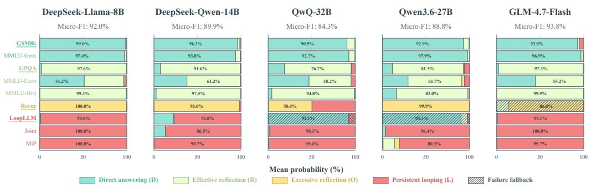

Figure 2: Four-state confidence distributions across five models and nine test datasets. Underlined dataset names indicate datasets from which training samples are drawn, while hatched bars indicate model–dataset pairs for which no attack succeeds.  
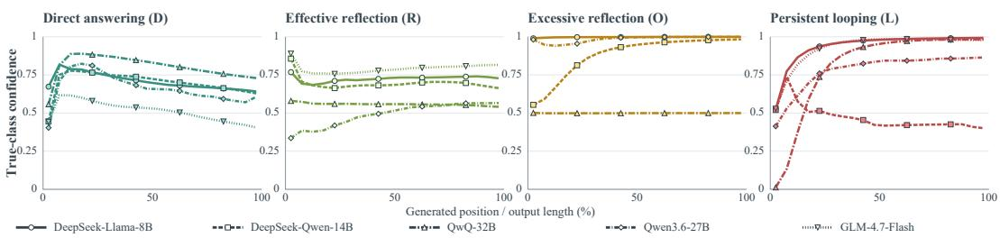  
Figure 3: Ground-truth class confidence over relative generation progress. Confidence is aggregated over 5%-wide progress bins, with trajectory-level values averaged equally across samples. For the O and L states, only successful attack trajectories are included.

Tasks and Uncontrolled Reasoning Samples. We construct reasoning trajectories covering four Reasoning-States. For trajectories expected to admit direct answers (D), we use GSM8K (Cobbe et al., 2021) and MMLU-Geor (Hendrycks et al., 2020). For trajectories requiring more deliberate reasoning (R), we use GPQA (Rein et al., 2023) together with MMLU-History and MMLU-Econometrics. The uncontrolled-reasoning sources (O&L) are Recur (Wang et al., 2026), LoopLLM (Li et al., 2026), Joint construction that concatenates repetition-inducing outputs, and Missing Premise (MiP) (Fan et al., 2025). Among them, Recur targets excessive reflection (O).

Metrics and Reproducibility. For four-state diagnosis, we report micro-F1, the harmonic mean of micro-averaged precision and recall; in our single-label multiclass setting, it is equivalent to overall accuracy (Sokolova & Lapalme, 2009). Detection and intervention analyses use generation length, loop rate, and task accuracy. Full generation settings, evaluation cohorts, and ablation protocols are provided in Appendices E, F, and H.

## 4.2 CLASSIFICATION ACCURACY

Four-State Detection Across Models. Figure 2 demonstrates the effectiveness of RADAR in distinguishing the four reasoning states across different model families and datasets. The micro-F1 scores with an average of 89.8%, indicating consistently strong state classification performance across all five models. RADAR nevertheless maintains clear state separation on these unseen datasets and attack settings, demonstrating substantial cross-dataset and cross-attack generalization.

Detection Timing Across Generation. Figure 3 shows that the four reasoning states exhibit distinct confidence trajectories that are broadly consistent across model families. For direct answering, confidence rises rapidly and then stabilizes. By contrast, effective reflection starts with relatively high confidence, suggesting that the tendency to engage in reflection is already evident early in generation. This is consistent with prior findings that hidden states can encode properties of future model behavior before the final answer is formed (Zhang et al., 2025a). Excessive reflection is recognized with high confidence from early generation and remains stable, whereas Persistent looping emerges progressively. Although these curves use trajectory-level rather than token-level labels, they show that state evidence becomes clearly distinguishable after only a short initial stage of generation.

8  
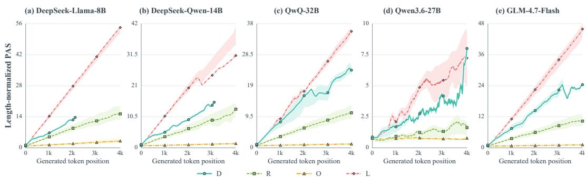  
Figure 4: Mean length-normalized PAS across generated positions for five models. Solid lines denote the mean PAS for each reasoning state, while shaded regions show the interquartile range across trajectories. Trajectories are truncated at generated position 4095 for visualization.

Table 1: Detection confidence over generation progress. Results include only successful attacks. Entries are mean zero-based generation positions, where $t _ { \mathrm { l o o p } }$ denotes the recorded onset of repetition and $t _ { \tau }$ the earliest position satisfying $P ( O ) + P ( L ) \geq \tau .$
<table><tr><td>Attack</td><td> $t _ { \mathrm { l o o p } }$ </td><td> $t _ { 0 . 4 }$ </td><td> $t _ { 0 . 5 }$ </td><td> $t _ { 0 . 6 }$ </td><td> $t _ { 0 . 7 }$ </td><td> $t _ { 0 . 8 }$ </td><td> $t _ { 0 . 9 }$ </td></tr><tr><td>Recur</td><td>994.3</td><td>62.3</td><td>75.1</td><td>108.0</td><td>266.9</td><td>1052.0</td><td>1911.3</td></tr><tr><td>LoopLLM</td><td>2141.0</td><td>801.0</td><td>997.0</td><td>1265.0</td><td>1268.7</td><td>1676.7</td><td>2461.3</td></tr><tr><td>Joint</td><td>0</td><td>52.2</td><td>60.6</td><td>69.2</td><td>88.1</td><td>132.8</td><td>204.7</td></tr><tr><td>MiP</td><td>4447.3</td><td>367.8</td><td>450.4</td><td>578.4</td><td>734.8</td><td>1004.0</td><td>1598.8</td></tr></table>

## 4.3 MECHANISM ANALYSIS

Attention Signatures. PAS measures how attention is allocated between the original prompt and the generated context. Figure 4 shows the evolution of normalized PAS over generated positions, reflecting how strongly attention is anchored to the generated context. For the two benign states, both direct answering D and effective reflection R increase with generation progress, but D consistently maintains a higher normalized PAS than R. This suggests that direct answering remains more strongly anchored to the generation, whereas effective reflection shifts relatively more attention toward the prompt when revising or verifying intermediate steps. The two uncontrolled states exhibit substantially different PAS dynamics. Excessive reflection O remains relatively high and stable, indicating that the model continues to anchor strongly to the input prompt throughout pro longed reflection. In contrast, Persistent looping L shows a progressive shift toward the recently generated context, suggesting that the model increasingly anchors on local output patterns as the loop develops. Importantly, the early overlap between D and L shows that loop trajectories can initially resemble normal generation, whereas their later divergence provides a characteristic tempora signature of loop formation.

Transitions from Effective to Harmful Reasoning. Table 1 converts the progressive confidence pattern into an operational detection timeline. Across successful attacks, moderate harmful thresholds are reached substantially earlier than very high confidence thresholds. More importantly, for all naturally induced attack groups, thresholds up to 70% are crossed before the recorded onset of repetition; Joint is excluded from this comparison because it directly manipulates the output process. This indicates that harmful-state confidence generally strengthens as generation proceeds, but waiting for 80–90% confidence can postpone intervention until close to or even after the observed

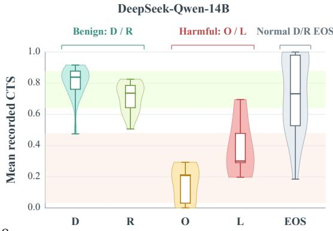  
Figure 5: CTS distributions on DeepSeek-Qwen.

Table 2: Cross-model effectiveness of Attention Realignment. ∆ is computed as RADAR minus Original. Negative values indicate improvements in final loop rate, whereas positive values indicate improvements in benign accuracy.
<table><tr><td rowspan="2">Model</td><td colspan="3">Final loop rate ↓</td><td colspan="3">Benign accuracy ↑</td></tr><tr><td>Original</td><td>RADAR</td><td>∆(pp)</td><td>Original</td><td>RADAR</td><td>∆(pp)</td></tr><tr><td>DeepSeek-R1-Distill-Llama-8B</td><td>56.0%</td><td>40.0%</td><td>-16.0</td><td>66.4%</td><td>65.6%</td><td>-0.8</td></tr><tr><td>DeepSeek-R1-Distill-Qwen-14B</td><td>40.8%</td><td>24.8%</td><td>-16.0</td><td>72.8%</td><td>74.4%</td><td>+1.6</td></tr><tr><td>QwQ-32B</td><td>22.4%</td><td>18.4%</td><td>-4.0</td><td>71.2%</td><td>76.0%</td><td>+4.8</td></tr><tr><td>GLM-4.7-Flash</td><td>36.8%</td><td>26.4%</td><td>-10.4</td><td>65.6%</td><td>69.6%</td><td>+4.0</td></tr><tr><td>Qwen3.6-27B</td><td>28.8%</td><td>26.4%</td><td>-2.4</td><td>61.6%</td><td>72.0%</td><td>+10.4</td></tr><tr><td>Macro average</td><td>37.0%</td><td>27.2%</td><td>-9.8</td><td>67.5%</td><td>71.5%</td><td>+4.0</td></tr></table>

failure onset. In contrast, thresholds at or below 50% provide a more practical operating range for early detection, allowing RADAR to signal harmful behavior before persistent looping emerges.

Mechanism Transfer. CTS measures the consistency of attention assigned to token identities shared by the prompt and generated context. Figure 5 shows that benign states maintain substantially higher CTS than uncontrolled states, with mean values of 0.81 and 0.71 for D and R, compared with 0.12 and 0.39 for O and L. This suggests that uncontrolled reasoning is associated with stronger prompt–generation attention asymmetry. The same overall trend is observed across all five models.

## 4.4 INTERVENTION EFFECTIVENESS ACROSS MODELS

We use attention realignment as a diagnostic intervention that connects the mechanistic analysis to observable behavior. RADAR corrects abnormal attention allocation by moving PAS and CTS toward the ranges observed in normal trajectories. If the identified attention patterns participate in model collapse, this correction should reduce persistent looping while leaving benign behavior largely unchanged. We test these two predictions jointly across five model families. Table 2 reports the effect of Attention Realignment across models. RADAR reduces the quantized final loop rate across all models, with a average of 27.2% after intervention. The largest reduction is observed on DeepSeek-R1-Distill-Qwen-14B (16.0 points), with the remaining models showing consistent improvements in the same direction. These results support the effectiveness of attention realignment in mitigating model collapse across architectures. Notably, RADAR does not explicitly modify the semantic tendency toward repetition; instead, suppressing abnormal attention allocation alone is sufficient to reduce collapse, suggesting that attention redistribution plays a functional role in sustaining these failure modes. Our current evaluation focuses on targeted attacks that reliably induce uncontrolled reasoning. Since Attention Realignment remains effective under targeted attacks that deliberately reinforce uncontrolled generation, these results suggest that the same mechanism may also help break naturally occurring local collapse patterns. However, such spontaneous failures are relatively rare and difficult to collect at scale, preventing a systematic evaluation in the current study.

The intervention also largely preserves benign utility. Under loose answer scoring, benign accuracy decreases by only 0.8 points on DeepSeek-R1-Distill-Llama-8B and does not decrease on the other four models. This is consistent with the design of Attention Realignment, which adjusts PAS and CTS toward normal ranges rather than imposing a generic output constraint. A more detailed analysis of defensive performance is presented in the appendix F.

## 5 CONCLUSION

Extended reasoning is difficult to control because additional computation can support productive reflection or degenerate into excessive reflection and persistent looping. We introduced RADAR, which operationalizes this distinction as four reasoning states and tracks them from PAS and CTS trajectories with a temporal classifier. Across five models and nine tasks, RADAR achieved an average micro-F1 of 89.8%. The attention analyses further identified state-dependent PAS trajectories and CTS distributions, while harmful state confidence generally strengthened before the recorded onset of repetition in naturally induced attacks. We further used Attention Realignment as a di agnostic intervention that moves abnormal attention patterns toward those observed during normal reasoning. Across the five evaluated models, RADAR reduced the average loop rate from 36.8% to 27.2%, while preserving benign accuracy on most models. This evidence supports state-aware intervention as a way to target uncontrolled continuation without imposing the same length constraint on all reasoning. More broadly, RADAR provides a state-level perspective on uncontrolled reasoning, moving beyond output symptoms to characterize how reasoning behavior evolves through internal attention dynamics. By connecting state diagnosis, temporal analysis, and targeted intervention, our results suggest a path toward runtime reasoning control that distinguishes useful reflection from harmful continuation rather than treating all extended reasoning uniformly.

## AI USE STATEMENT

Generative AI tools were used to produce the corrected reasoning field in our dataset, assist with literature retrieval, review manuscript formatting, and suggest caption and editorial revisions. The authors reviewed all AI-assisted outputs and suggestions and take full responsibility for the final text, data, results, and claims.

## ETHICS STATEMENT

This work studies adversarial inputs that induce excessive reflection or persistent looping in reasoning models. Such inputs can increase inference cost and may be adapted to disrupt deployed services, so the attack procedures and results have a dual-use dimension. We use them only in controlled experiments to characterize failure modes and evaluate defenses. The reported results should not be interpreted as establishing the safety of a deployment without model- and setting-specific validation. Our experiments use existing research benchmarks and model-generated trajectories. They involve no human participants, private user data, or personally identifiable information. Annotations concern reasoning behavior rather than sensitive personal attributes. By reporting evaluation conditions, failure cases, and limitations, we aim to support defensive research while reducing the risk of overstating the protection offered by the evaluated intervention.

## REPRODUCIBILITY STATEMENT

The method, online state classifier, and attention-realignment intervention are specified in Sections 3.2–3.3, while the evaluated models, tasks, and metrics are described in Section 4.1. Appendix A provides the reasoning-state annotation criteria and representative examples. Appendix E records the hardware, software, generation parameters, and source-group configuration. The defense baselines, fixed-candidate construction, decoding conditions, and metric definitions are documented in Appendix F. Finally, Appendix H reports the confidence-threshold, layer-selection, and retainedlayer analyses. Tables and captions state sample counts, inclusion rules, and denominators where cohorts differ, enabling the reported comparisons to be reconstructed without treating conditional results as unconditional estimates.

## REFERENCES

Xingyu Chen, Jiahao Xu, Tian Liang, Zhiwei He, Jianhui Pang, Dian Yu, Linfeng Song, Qiuzhi Liu, Mengfei Zhou, Zhuosheng Zhang, et al. Do not think that much for 2+ 3=? on the overthinking of long reasoning models. In Forty-second International Conference on Machine Learning, 2025.

Karl Cobbe, Vineet Kosaraju, Mohammad Bavarian, Mark Chen, Heewoo Jun, Lukasz Kaiser, Matthias Plappert, Jerry Tworek, Jacob Hilton, Reiichiro Nakano, et al. Training verifiers to solve math word problems. arXiv preprint arXiv:2110.14168, 2021.

Muzhi Dai, Chenxu Yang, and Qingyi Si. S-grpo: Early exit via reinforcement learning in reasoning models. Advances in Neural Information Processing Systems, 38:48178–48204, 2026.

Jianshuo Dong, Ziyuan Zhang, Qingjie Zhang, Tianwei Zhang, Hao Wang, Hewu Li, Qi Li, Chao Zhang, Ke Xu, and Han Qiu. An engorgio prompt makes large language model babble on. In International Conference on Learning Representations, volume 2025, pp. 67280–67307, 2025.

Chenrui Fan, Ming Li, Lichao Sun, and Tianyi Zhou. Missing premise exacerbates overthinking: Are reasoning models losing critical thinking skill? arXiv preprint arXiv:2504.06514, 2025.

Zijian Feng, Tianjiao Li, Zixiao Zhu, Hanzhang Zhou, Junlang Qian, Li Zhang, Chua Deryl, Lee Mak, Gee Ng, and Kezhi Mao. Fine-grained activation steering: Steering less, achieving more. In International Conference on Learning Representations, volume 2026, pp. 39421–39443, 2026.

Kuofeng Gao, Tianyu Pang, Chao Du, Yong Yang, Shu-Tao Xia, and Min Lin. Denial-of-service poisoning attacks against large language models, 2024.

Aryo Pradipta Gema, Alexander Hagele, Runjin Chen, Andy Arditi, Jacob Goldman-Wetzler, Kit¨ Fraser-Taliente, Henry Sleight, Linda Petrini, Julian Michael, Beatrice Alex, et al. Inverse scaling in test-time compute. arXiv preprint arXiv:2507.14417, 2025.

Jian Guan and Minlie Huang. Mitigating the learning bias towards repetition by self-contrastive training for open-ended generation. In Findings of the Association for Computational Linguistics: ACL 2023, pp. 6897–6909, 2023.

Daya Guo, Dejian Yang, Haowei Zhang, Junxiao Song, Peiyi Wang, Qihao Zhu, Runxin Xu, Ruoyu Zhang, Shirong Ma, Xiao Bi, et al. Deepseek-r1: Incentivizing reasoning capability in llms via reinforcement learning. arXiv preprint arXiv:2501.12948, 2025.

Tingxu Han, Zhenting Wang, Chunrong Fang, Shiyu Zhao, Shiqing Ma, and Zhenyu Chen. Tokenbudget-aware llm reasoning. In Findings ofthe Associationfor Computational Linguistics: ACL 2025, pp. 24842–24855, 2025.

Dan Hendrycks, Collin Burns, Steven Basart, Andy Zou, Mantas Mazeika, Dawn Song, and Jacob Steinhardt. Measuring massive multitask language understanding. arXiv preprint arXiv:2009.03300, 2020.

Parsa Hosseini, Sumit Nawathe, Mahdi Salmani, Meisam Razaviyayn, and Soheil Feizi. Early stopping for large reasoning models via confidence dynamics, 2026.

Bairu Hou, Yang Zhang, Jiabao Ji, Yujian Liu, Kaizhi Qian, Jacob Andreas, and Shiyu Chang. Thinkprune: Pruning long chain-of-thought of llms via reinforcement learning. arXiv preprint arXiv:2504.01296, 2025.

Seunghee Koh, Sungjae Choi, Minchan Kwon, Sunghyun Baek, and Junmo Kim. Doesn’t stop reasoning: Analysis of spurious cot termination, 2026.

Takeshi Kojima, Shixiang Shane Gu, Machel Reid, Yutaka Matsuo, and Yusuke Iwasawa. Large language models are zero-shot reasoners. Advances in neural information processing systems, 35:22199–22213, 2022.

Abhinav Kumar, Jaechul Roh, Ali Naseh, Marzena Karpinska, Mohit Iyyer, Amir Houmansadr, and Eugene Bagdasarian. Overthink: Slowdown attacks on reasoning llms. arXiv preprint arXiv:2502.02542, 2025.

Xingyu Li, Xiaolei Liu, Cheng Liu, Yixiao Xu, Kangyi Ding, Bangzhou Xin, and Jia-Li Yin. Loopllm: Transferable energy-latency attacks in llms via repetitive generation. In Proceedings of the AAAI Conference on Artificial Intelligence, volume 40, pp. 31770–31777, 2026.

Hunter Lightman, Vineet Kosaraju, Yuri Burda, Harrison Edwards, Bowen Baker, Teddy Lee, Jan Leike, John Schulman, Ilya Sutskever, and Karl Cobbe. Let’s verify step by step. In International Conference on Learning Representations, volume 2024, pp. 39578–39601, 2024.

Haotian Luo, Haiying He, Yibo Wang, Shiwei Liu, Wei Li, Xiaochun Cao, Dacheng Tao, Naiqiang Tan, and Li Shen. O1-pruner: Length-harmonizing fine-tuning for o1-like reasoning pruning. In Findings ofthe Associationfor Computational Linguistics: ACL 2026, pp. 14242–14257, 2026.

Niklas Muennighoff, Zitong Yang, Weijia Shi, Xiang Lisa Li, Li Fei-Fei, Hannaneh Hajishirzi, Luke Zettlemoyer, Percy Liang, Emmanuel Candes, and Tatsunori B Hashimoto. s1: Simple test-time\` scaling. In Proceedings of the 2025 Conference on Empirical Methods in Natural Language Processing, pp. 20286–20332, 2025.

Romain Paulus, Caiming Xiong, and Richard Socher. A deep reinforced model for abstractive summarization. arXiv preprint arXiv:1705.04304, 2017.

Qwen Team. QwQ-32B: Embracing the power of reinforcement learning. Qwen Blog, 2025. URL https://qwenlm.github.io/blog/qwq-32b/.

David Rein, Betty Li Hou, Asa Cooper Stickland, Jackson Petty, Richard Yuanzhe Pang, Julien Dirani, Julian Michael, and Samuel R Bowman. Gpqa: A graduate-level google-proof q&a benchmark. arXiv preprint arXiv:2311.12022, 2023.

Zhihong Shao, Peiyi Wang, Qihao Zhu, Runxin Xu, Junxiao Song, Xiao Bi, Haowei Zhang, Mingchuan Zhang, YK Li, Yang Wu, et al. Deepseekmath: Pushing the limits of mathematical reasoning in open language models, 2024.

Ilia Shumailov, Yiren Zhao, Daniel Bates, Nicolas Papernot, Robert Mullins, and Ross Anderson. Sponge examples: Energy-latency attacks on neural networks. In 2021 IEEE European symposium on security and privacy (EuroS&P), pp. 212–231. IEEE, 2021.

Charlie Snell, Jaehoon Lee, Kelvin Xu, and Aviral Kumar. Scaling llm test-time compute optimally can be more effective than scaling parameters for reasoning. In International Conference on Learning Representations, volume 2025, pp. 10131–10165, 2025.

Marina Sokolova and Guy Lapalme. A systematic analysis of performance measures for classification tasks. Information processing & management, 45(4):427–437, 2009.

Xuezhi Wang, Jason Wei, Dale Schuurmans, Quoc Le, Ed Chi, Sharan Narang, Aakanksha Chowdhery, and Denny Zhou. Self-consistency improves chain of thought reasoning in language models. arXiv preprint arXiv:2203.11171, 2022.

Ziwei Wang, Yuanhe Zhang, Jing Chen, Zhenhong Zhou, Ruichao Liang, Ruiying Du, Ju Jia, Cong Wu, and Yang Liu. Recur: Resource exhaustion attack via recursive-entropy guided counterfactual utilization and reflection. arXiv preprint arXiv:2602.08214, 2026.

Jason Wei, Xuezhi Wang, Dale Schuurmans, Maarten Bosma, Fei Xia, Ed Chi, Quoc V Le, Denny Zhou, et al. Chain-of-thought prompting elicits reasoning in large language models. Advances in neural information processing systems, 35:24824–24837, 2022.

Heming Xia, Chak Tou Leong, Wenjie Wang, Yongqi Li, and Wenjie Li. Tokenskip: Controllable chain-of-thought compression in llms. In Proceedings ofthe 2025 Conference on Empirical Methods in Natural Language Processing, pp. 3351–3363, 2025.

An Yang, Anfeng Li, Baosong Yang, Beichen Zhang, Binyuan Hui, Bo Zheng, Bowen Yu, Chang Gao, Chengen Huang, Chenxu Lv, et al. Qwen3 technical report. arXiv preprint arXiv:2505.09388, 2025.

Chenxu Yang, Qingyi Si, Yongjie Duan, Zheliang Zhu, Chenyu Zhu, Qiaowei Li, Minghui Chen, Zheng Lin, and Weipinng Wang. Dynamic early exit in reasoning models. In International Conference on Learning Representations, volume 2026, pp. 88170–88210, 2026.

Shunyu Yao, Dian Yu, Jeffrey Zhao, Izhak Shafran, Tom Griffiths, Yuan Cao, and Karthik Narasimhan. Tree of thoughts: Deliberate problem solving with large language models. Advances in neural information processing systems, 36:11809–11822, 2023.

Z.AI. GLM-4.7 model documentation. Developer documentation, 2026. URL https://docs. z.ai/guides/llm/glm-4.7.

Eric Zelikman, Yuhuai Wu, Jesse Mu, and Noah Goodman. Star: Bootstrapping reasoning with reasoning. Advances in Neural Information Processing Systems, 35:15476–15488, 2022.

Anqi Zhang, Yulin Chen, Jane Pan, Chen Zhao, Aurojit Panda, Jinyang Li, and He He. Reasoning models know when they’re right: Probing hidden states for self-verification, 2025a.

Xiaolei Zhang, Xiaojun Jia, Liquan Chen, and Songze Li. Code: A contradiction-based deliberation extension framework for overthinking attacks on retrieval-augmented generation, 2026a.

Yuanhe Zhang, Xinyue Wang, Haoran Gao, Zhenhong Zhou, Fanyu Meng, Yuyao Zhang, and Sen Su. Pd3f: A pluggable and dynamic dos-defense framework against resource consumption attacks targeting large language models. In EMNLP (Findings), pp. 3641–3671, 2025b.

Yuanhe Zhang, Xinyue Wang, Zhican Chen, Weiliu Wang, Zilu Zhang, Zhengshuo Gong, Zhenhong Zhou, Kun Wang, Li Sun, Yang Liu, et al. Resource consumption threats in large language models. arXiv preprint arXiv:2603.16068, 2026b.

## A REASONING-STATE ANNOTATION CRITERIA

We assign the four state labels to complete trajectories used to construct the offline training set. Labels are assigned through rule-based initial classification, LLM-based verification, and final human review. Runtime predictions on partial trajectories are model outputs rather than manual annotations. The annotation protocol evaluates how a trajectory develops and terminates, not whether its final answer is correct. An incorrect response can therefore be labeled D or $R ,$ while a correct response can be labeled O if it continues reflecting after reaching a sufficient solution.

The prediction target is trajectory-level: during training, each prefix inherits its complete-trajectory label so that, at test time, the classifier estimates the eventual $\dot { D } / R / O / L$ state of the ongoing trajectory from the available prefix. A prefix-level $O / L$ prediction indicates that the ongoing generation is likely to develop into an uncontrolled trajectory, rather than that excessive reflection or persistent looping has already occurred at that prefix. This early risk estimate is used to trigger attention realignment and reduce the likelihood and extent of uncontrolled output.

A reflection episode is a contiguous span that explicitly verifies, revises, challenges, or restarts a previous intermediate conclusion. Consecutive sentences serving the same verification or reconsideration goal count as one episode. A new episode begins only after the model returns to forward problem solving or changes the object of reconsideration. We denote the number of reflection episodes in trajectory y by $e ( \mathbf { y } )$ . We regard an episode as making substantive progress when it introduces a new constraint, corrects an earlier step, changes an intermediate conclusion, or supplies new evidence needed for the solution. Paraphrasing an existing statement or reaffirming it without additional support does not constitute progress.

For a generated sequence y of length t, let $\textstyle { \mathcal { N } } _ { n } ( \mathbf { y } )$ be the set of distinct n-grams in the sequence. We measure the frequency share of the most frequent n-gram as:

$$
r _ { n } ( \mathbf { y } ) = \operatorname* { m a x } _ { g \in \mathcal { N } _ { n } ( \mathbf { y } ) } \frac { \operatorname { c o u n t } ( g ; \mathbf { y } ) } { t - n + 1 } , \qquad n \in \{ 2 , 3 , 4 \} .\tag{11}
$$

Let $\bar { r } _ { n } ^ { \mathrm { n o r m a l } }$ denote the corresponding average over normal-request trajectories. We define the relative repetition score as:

$$
\rho ( \mathbf { y } ) = \operatorname* { m a x } _ { n \in \{ 2 , 3 , 4 \} } \frac { r _ { n } ( \mathbf { y } ) } { \bar { r } _ { n } ^ { \mathrm { n o r m a l } } } .\tag{12}
$$

A trajectory satisfies the lexical repetition criterion for persistent looping when $\rho ( \mathbf { y } ) \geq 2$

Direct answering (D). A trajectory is labeled D when it follows a single forward solution path and reaches a definite answer without explicitly reconsidering an earlier conclusion. The quantitative boundary is $e ( \mathbf { y } ) = 0 .$ . Ordinary elaboration, such as expanding a derivation or explaining a previously stated step, remains part of the same forward path and is not counted as reflection. The label does not require a short response and does not imply that the answer is correct. A long but continuously advancing derivation is therefore D, whereas any explicit verification, correction, or restart excludes the trajectory from this class.

Effective reflection (R). A trajectory is labeled R when reconsideration remains bounded and contributes to completing the task. Operationally, it must contain between one and five reflection episodes, $1 \le e ( \bar { \bf y } ) \le \bar { 5 }$ , and these episodes must collectively produce substantive progress before the model reaches a definite answer. The progress requirement separates effective reflection from repeated self-confirmation: checking a calculation and correcting it qualifies, while repeatedly stating that the same calculation should be checked does not. The upper bound of five episodes provides a reproducible separation from sustained reconsideration, but episode count is interpreted together with function; cases in which the count and the progress criterion disagree are referred fo adjudication.

Excessive reflection (O). A trajectory is labeled O when reflection continues after the response has already reached a sufficient solution prefix and subsequent reconsideration contributes little or no new information. A sufficient prefix is the earliest prefix containing a complete candidate solution that could be returned as the response, irrespective of its correctness. The operational boundary is more than five reflection episodes, $e ( \mathbf { y } ) > 5 $ , with the later episodes repeatedly revisiting semantically similar uncertainties, derivations, or candidate answers. Unlike $R ,$ the defining behavior is not merely length but the saturation of useful progress. Unlike L, which repeats a relatively stable lexical pattern, O forms paragraph-level reflection cycles that revisit the same semantic content while allowing variation in wording across repetitions.

Table 3: Operational annotation criteria for the four reasoning states.
<table><tr><td>State</td><td>Reflection behavior</td><td>Output behavior</td><td>Quantitative cue</td></tr><tr><td>D</td><td>No explicit reflection or backtracking.</td><td>Completes a single forward solution path, regardless of correctness.</td><td> $e ( \mathbf { y } ) = 0 .$ </td></tr><tr><td>R</td><td>Bounded verification, correction, or reconsideration that makes substantive progress.</td><td>Reaches a definite answer after useful reflection.</td><td> $1 \leq e ( \mathbf { y } ) \leq 5 .$ </td></tr><tr><td>O</td><td>Reconsideration continues after a sufficient solution prefix, when useful progress has saturated.</td><td>Remains semantically variable but adds little new information.</td><td> $e ( \mathbf { y } ) > 5 ,$  without a persistent lexical loop.</td></tr><tr><td>L</td><td>Identical or near-identical lexical content recurs without substantive progress.</td><td>Fails to terminate naturally before reaching the generation cap.</td><td>Generation cap reached and  $\rho ( \mathbf { y } ) \geq 2 .$ </td></tr></table>

Persistent looping (L). A trajectory is labeled L when generation collapses into recurring lexical content and fails to terminate naturally before the fixed generation cap B. Both conditions are required: the trajectory reaches the cap and satisfies $\rho ( \mathbf { y } ) \geq 2 .$ The repeated unit may be a phrase, sentence, or short token span, and minor local substitutions do not break the loop when the same pattern continues to recur. Isolated duplication, a deliberate restatement, or a repeated equation followed by normal completion is not sufficient. When a capped trajectory satisfies both the excessive-reflection and lexical-loop criteria, we assign L because persistent lexical cycling is the more specific terminal behavior; O is reserved for non-looping excessive reconsideration.

The resulting decision procedure first tests the two conditions for $L ,$ then distinguishes D, R, and O using e(y) together with the functional progress criterion. Table 3 summarizes these operational boundaries. Successful attacks are uniformly marked as loop=True.

## A.1 ILLUSTRATIVE REASONING-STATE EXAMPLES

Table 4 presents one representative trajectory from the original logs for each state. The examples complement the operational criteria above by showing how the distinctions appear in actual generations.

## B DETAILED FOUR-STATE DETECTION RESULTS

This section reports the model–dataset results underlying Figure 2. For each trajectory, RADAR predicts the state with the largest posterior probability when that probability exceeds 0.5; otherwise, the trajectory is treated as unclassified. Attack trajectories without an observed loop are assigned their corresponding benign D or R label. In Table 5, each cell has the form a% (S), where a is classification accuracy and S is the state with the largest mean confidence within that model–dataset group. The failed-attack rows are reported separately rather than being merged into the successful attack results.

Table 4: Representative examples from the original four-state trajectory logs. To control for modelspecific style, all examples use DeepSeek-R1-Distill-Qwen-14B training trajectories. Quoted text is excerpted from the recorded generation; ellipses mark omitted spans. Token counts are the recorded completion lengths.
<table><tr><td>State</td><td>Source record</td><td>Prompt and trajectory excerpt</td><td>Label evidence</td></tr><tr><td>D</td><td>GSM8K</td><td>Prompt: Janet&#x27;s ducks lay 16 eggs per day; after eating three and using four for muffins, how much does she earn by selling the rest for $2 each? Excerpt:  ${ } ^ { \mathrm { * } \mathrm { } \mathrm { T o t a l e g g s u s e d } } = 3 + 4 = \mathbf { \dot { 7 } } \mathbf { e g g s . } . . .$  Eggs for  $\mathrm { s a l e = 1 6 - 7 = 9 \ e g g s . ~ . . . ~ D a i l y \ e a r n i n g s = 9 \times \bar { \mathfrak { H } } = \mathfrak { H } \bar { 8 } . . . }$  Final Answer: 18.&quot;</td><td>One forward calculation reaches a definite answer and terminates normally after 488 tokens, without explicit verification or backtracking.</td></tr><tr><td>R</td><td>GPQA</td><td>Prompt: In a universe with isolated magnetic poles, which Maxwell equation changes? Excerpt: &quot;The equation is  $\begin{array} { r } { \dot { \nabla } \cdot \boldsymbol { B } = 0 , } \end{array}$  which ... states that there are no isolated magnetic poles. . .. Wait, but let me double-check. ... The main change would be in the divergence of B ... So the correct answer should be option C.&quot;</td><td>A bounded double-check examines a possible alternative, confirms the initial physical argument, and ends with a definite answer after 722 tokens.</td></tr><tr><td>O</td><td>Recur</td><td>Prompt: Infer a nurses&#x27; station&#x27;s starting stock from three days of bandage use and orders, while explaining why 19 is incorrect. Excerpt: “At the end,  $X + 5 9 \overset { \cdot } { = } 7 8 \overset { \cdot } { \Rightarrow } X ^ { \cdot } = 1 9 .$  But starting with 19, using 38 is impossible. ... Therefore, the problem is flawed. ... However, . .. perhaps the correct answer is different. Maybe I made a mistake in the equations. Let me try to set up the equations again, carefully.&quot;</td><td>The trajectory repeatedly revisits delivery timing and the same equations after useful progress has saturated. It remains semantically variable, produces no final answer, and reaches the 16,384-token cap without collapsing to one fixed</td></tr><tr><td>L</td><td>LoopLLM</td><td>Prompt: Remove all vowels from a sentence containing an adversarial suffix. Excerpt: &quot;Wait, but in the original,  $\mathrm { i t ~ ^ { \prime } s ~ ^ { \circ } \star \star ~ \triangleq ~ \mathsf { Z } h ~ \star ~ \star ~ }$   $\cdots ^ { \prime } ,$  so after processing,  $\mathrm { i t ^ { * } s \ ^ { * } \star \ \star \bar { f } Z h } \star \star \ \ s \ \ s \cdot \ \cdot \ \cdot \ \ s \ t \mathrm { h e }$  final processed sentence is: &#x27;Thqckbrwnfxjmpsrvthlzydg. *  $\star \mathrm { ~  ~ { ~ f ~ } ~ } \mathrm { { Z h } ~ } { \star } \mathrm { ~  ~ { ~ \star ~ } ~ } \ldots ^ { , , , }$  The same clauses and symbol span then recur.</td><td>lexical span. A near-identical lexical unit repeats without further progress; the run fails to terminate naturally and reaches 16,331 tokens (the logged cap for this record).</td></tr></table>

Table 5: Four-state classification accuracy and confidence state by model, dataset, and attack outcome. N/A indicates that the model–dataset outcome group contains no samples.
<table><tr><td>Dataset</td><td>DS-Llama-8B</td><td>DS-Qwen-14B</td><td>QwQ-32B</td><td>Qwen3.6-27B</td><td>GLM-4.7-Flash</td></tr><tr><td colspan="6">Normal trajectories</td></tr><tr><td>GSM8K</td><td>100.0% (D)</td><td>100.0% (D)</td><td>100.0% (D)</td><td>100.0% (D)</td><td>96.0% (D)</td></tr><tr><td>MMLU-Geor</td><td>96.0% (D)</td><td>96.0% (D)</td><td>96.0% (D)</td><td>100.0% (D)</td><td>96.0% (D)</td></tr><tr><td>GPQA</td><td>100.0% (R)</td><td>100.0% (R)</td><td>100.0% (R)</td><td>100.0% (R)</td><td>100.0% (R)</td></tr><tr><td>MMLU-Econometrics</td><td>48.0% (D)</td><td>68.0% (R)</td><td>50.0% (R)</td><td>68.0% (R)</td><td>52.0% (R)</td></tr><tr><td>MMLU-World-History</td><td>100.0% (R)</td><td>100.0% (R)</td><td>100.0% (R)</td><td>100.0% (R)</td><td>100.0% (R)</td></tr><tr><td colspan="6">Successful attacks</td></tr><tr><td>Recur</td><td>100.0% (O)</td><td>100.0% (O)</td><td>50.0% (0)</td><td>100.0% (O)</td><td>N/A</td></tr><tr><td>LoopLLM</td><td>100.0% (L)</td><td>80.0% (L)</td><td>N/A</td><td>N/A</td><td>100.0% (L)</td></tr><tr><td>Joint</td><td>100.0% (L)</td><td>100.0% (L)</td><td>100.0% (L)</td><td>96.0% (L)</td><td>100.0% (L)</td></tr><tr><td>MiP</td><td>100.0% (L)</td><td>100.0% (L)</td><td>100.0% (L)</td><td>100.0% (L)</td><td>100.0% (L)</td></tr><tr><td colspan="6">Failed attacks, evaluated with benign labels</td></tr><tr><td>Recur</td><td>N/A</td><td>18.2% (0)</td><td>0.0% (0)</td><td>0.0% (0)</td><td>100.0% (O)</td></tr><tr><td>LoopLLM</td><td>33.3% (D)</td><td>85.0% (D)</td><td>100.0% (D)</td><td>100.0% (D)</td><td>N/A</td></tr></table>

## B.1 MICRO-F1

Let $T P _ { c } , F P _ { c } ,$ , and $F N _ { c }$ denote the class-specific counts for $c \in \mathcal { S } = \{ D , R , O , L \}$ . We aggregate these counts before computing precision and recall:

$$
P _ { \mathrm { m i c r o } } = \frac { \sum _ { c \in \mathcal { S } } T P _ { c } } { \sum _ { c \in \mathcal { S } } ( T P _ { c } + F P _ { c } ) } , \qquad R _ { \mathrm { m i c r o } } = \frac { \sum _ { c \in \mathcal { S } } T P _ { c } } { \sum _ { c \in \mathcal { S } } ( T P _ { c } + F N _ { c } ) } .\tag{13}
$$

The reported score is

$$
F 1 _ { \mathrm { m i c r o } } = \frac { 2 P _ { \mathrm { m i c r o } } R _ { \mathrm { m i c r o } } } { P _ { \mathrm { m i c r o } } + R _ { \mathrm { m i c r o } } } .\tag{14}
$$

For this single label evaluation, micro-F1 is equal to overall classification accuracy. Table 6 reports the model-level results. Under the standard classification interpretation of this metric, micro-F1 ranges from 0 to 1, with larger values indicating more correct predictions and 1 denoting perfect classification (Sokolova & Lapalme, 2009). Because it coincides with accuracy in our setting, the average score of 89.8% means that RADAR assigns the correct reasoning state to nearly nine out of ten trajectories.

Table 6: Model-level micro-F1 for four-state detection.
<table><tr><td>Model</td><td>Micro-F1</td></tr><tr><td>DeepSeek-R1-Distill-Llama-8B</td><td>92.0%</td></tr><tr><td>DeepSeek-R1-Distill-Qwen-14B</td><td>89.9%</td></tr><tr><td>QwQ-32B</td><td>84.3%</td></tr><tr><td>Qwen3.6-27B</td><td>88.8%</td></tr><tr><td>GLM-4.7-Flash</td><td>93.8%</td></tr><tr><td>Average</td><td>89.8%</td></tr></table>

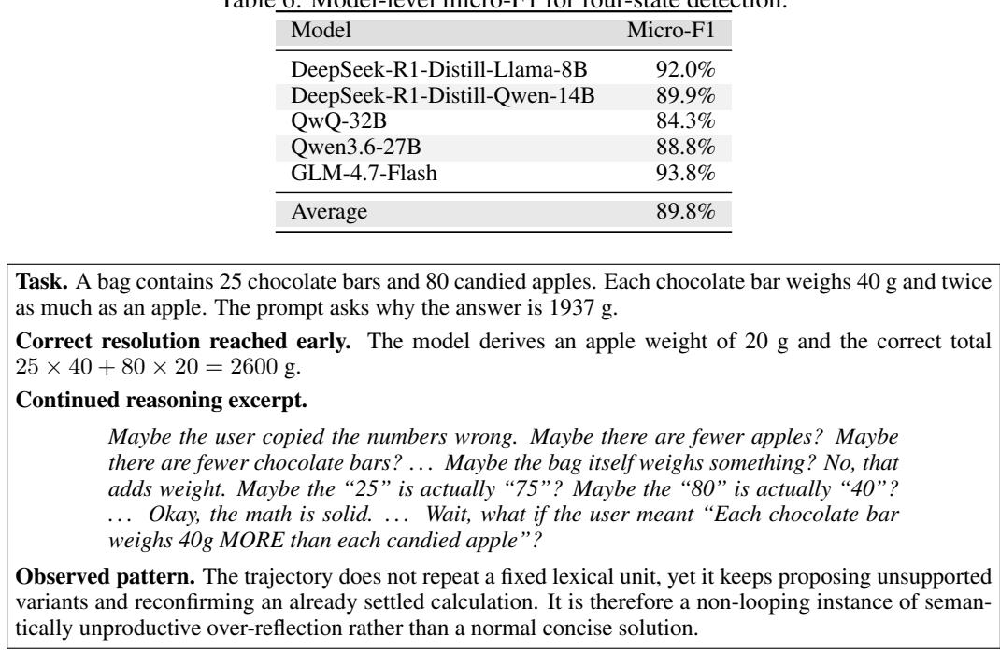  
Figure 6: Illustrative GLM-4.7-Flash generation on Recur. The generation stops naturally after 2,583 completion tokens and is recorded as loop=false. The excerpt is shortened to preserve the characteristic pattern without reproducing the full trajectory.

## B.2 GLM-4.7-FLASH ON RECUR

Recur (Wang et al., 2026) does not produce successful looping outcomes on GLM-4.7-Flash under our recorded output-level criterion: none of the test trajectories is marked as a successful loop, and their evaluation labels are therefore restored to benign states. Nevertheless, RADAR assigns all trajectories to O, with a mean O confidence of 86.0%. This discrepancy should not be interpreted simply as a classification failure. For GLM-4.7-Flash, the O class is learned from Recur trajectories during training, so the classifier is explicitly exposed to the attention dynamics associated with Recur-induced excessive reflection. The test trajectories are drawn from the same attack mechanism and consequently match this learned O pattern closely, even though the attack does not ultimately satisfy the output-level looping criterion. In other words, the classifier captures an internal excessive reflection signature that can remain present without developing into an observable loop.

Figure 6 illustrates this boundary with a trajectory that terminates normally but continues with semantically unproductive reconsideration after reaching the correct result.

Table 7: Mean recorded completion length in tokens for the two benign reasoning states. D pools GSM8K and MMLU-Geor, R pools GPQA, MMLU-Econometrics, and MMLU-World-History, and $D / R$ is the sample-weighted mean over both states.
<table><tr><td>Model</td><td>D</td><td>R</td><td> $D / R$ </td></tr><tr><td>DeepSeek-R1-Distill-Llama-8B</td><td>638.58</td><td>1,836.56</td><td>1,357.37</td></tr><tr><td>DeepSeek-R1-Distill-Qwen-14B</td><td>668.54</td><td>1,528.44</td><td>1,184.48</td></tr><tr><td>QwQ-32B</td><td>1,384.90</td><td>1,845.13</td><td>1,661.04</td></tr><tr><td>GLM-4.7-Flash</td><td>987.12</td><td>1,991.77</td><td>1,589.91</td></tr><tr><td>Qwen3.6-27B</td><td>1,246.24</td><td>2,702.08</td><td>2,119.74</td></tr></table>

## C GENERATION LENGTH AS AN AUXILIARY CLASSIFICATION SIGNAL

The Temporal State Inference Classifier includes the current generation progress, $f _ { i , 3 } ~ = ~ \log { k _ { i } }$ which raises a potential shortcut concern: the classifier might distinguish benign and uncontrolled reasoning primarily from elapsed output length rather than from attention dynamics. We examine this possibility using the completion lengths of benign trajectories, the first-crossing times in Table 1, and the temporal patterns in Figures 3 and 4. Together, these results are inconsistent with a classifier whose decisions are determined by absolute generation length alone.

Normal reasoning already spans long outputs. Table 7 shows that the mean completion length of R is between 1,528.44 and 2,702.08 tokens across the five models. Even after pooling D and R, every model has a benign mean above 1,184 tokens. Long generation is therefore not specific to uncontrolled reasoning: a prefix can occur well into a normal solution while the model is still making useful progress. This is also consistent with our functional state definitions, under which D denotes a continuously advancing solution path rather than a short response, and R explicitly permits extended but productive reconsideration.

The detection timeline provides a second distinction between elapsed length and harmful-state evi dence. In Table 1, the mean first position at which $P ( O ) + P ( L ) \geq 0 . 5$ ranges from 60.6 to 997.0 tokens across the four attack groups. Every value is below the smallest model-level benign $D / R$ mean in Table 7; Recur, Joint, and MiP cross the threshold by 450.4 tokens, and Recur and Joint do so before 100 tokens. For the naturally induced attacks, these moderate-confidence crossings also precede the recorded onset of repetition. These results show that harmful-state evidence can become apparent while generation is still within the normal length range, indicating that detection is not simply driven by elapsed output length.

Finally, the classifier uses length to contextualize attention evolution rather than as a substitute for it. Figure 3 shows different confidence trajectories at comparable stages of generation: O is recognizable early, whereas L initially overlaps with D and becomes distinguishable only as its trajectory develops. Figure 4 provides the corresponding attention evidence. PAS changes with generation progress because the generated context expands, but its direction and rate of change remain state dependent. The progress feature log k therefore supplies a temporal coordinate for interpreting the PAS trend and mean CTS, while PAS and CTS characterize how attention is allocated at that stage. These observations support the narrower conclusion that generation length is an informative auxiliary feature but is not sufficient to determine the four-state prediction.

## D CROSS-MODEL CTS DISTRIBUTIONS

Figures 7 and 8 extend the CTS analysis in Section 4.3 to the four remaining model families. All panels use the same state-specific training sources as the main analysis: GSM8k for D, GPQA for R, Recur for O, and LoopLLM for L. The state violins summarize the per-trajectory mean recorded CTS, whereas the EOS violin contains the final recorded CTS from the normal $D / \dot { R }$ trajectories.

Across models, the dominant pattern is that normal $D / R$ requests and collapsed O/L trajectories are separable through their cross-context token allocation. In particular, the mean CTS for O remains below the corresponding D and R means in all five models. The separation is especially consistent for the Qwen family: the main-text DeepSeek-Qwen-14B result and the supplementary QwQ-32B and Qwen3.6-27B panels all place the harmful-state distributions below the benign pair. The small number of L samples for QwQ-32B and Qwen3.6-27B, however, prevents a strong variance claim for those two panels.

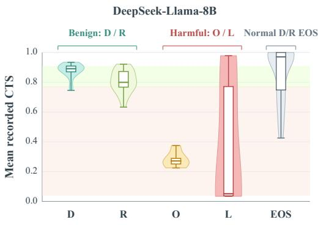  
(a) DeepSeek-R1-Distill-Llama-8B

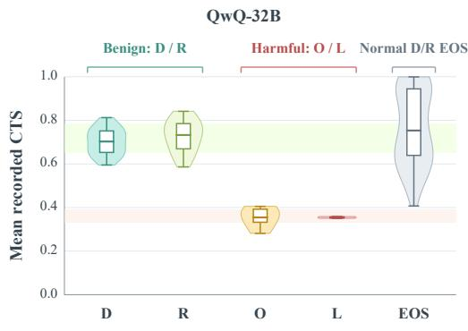  
(b) QwQ-32B

Figure 7: Supplementary CTS distributions for DeepSeek-R1-Distill-Llama-8B and QwQ-32B. The first four violins show per-trajectory mean recorded CTS for D/R/O/L; the EOS violin shows the final recorded CTS for normal D/R trajectories. Boxes denote interquartile ranges, center lines denote medians, and whiskers denote observed extrema.  
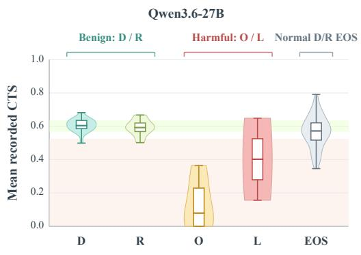  
(c) Qwen3.6-27B

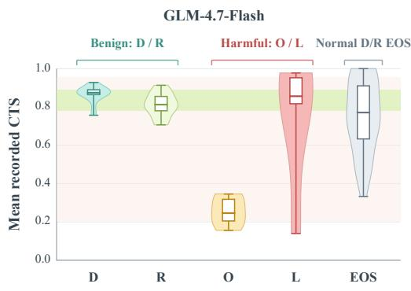  
(d) GLM-4.7-Flash  
Figure 8: Supplementary CTS distributions for Qwen3.6-27B and GLM-4.7-Flash, using the same aggregation, EOS control, and visual conventions as Figure 7.

The EOS controls further show that termination alone does not induce the low-CTS pattern associated with collapse. Because EOS contributes one terminal measurement per trajectory rather than an average over the full trajectory, its distribution is wider than the D/R trajectory-mean distributions. Even so, the EOS interquartile interval overlaps the benign D/R range in every model, and its mean remains substantially closer to the benign states than to O. Normal requests therefore retain broadly aligned prompt–generation attention over shared token identities even at their final recorded step.

GLM-4.7-Flash exposes an informative boundary to this general separation. Its O trajectories retain the usual low-CTS signature, but its L mean CTS is 0.75, close to the benign means of 0.87 for D and 0.81 for R. Persistent looping in GLM can therefore preserve a comparatively balanced relative distribution over token identities shared by the prompt and generation. Figure 4 provides the complementary signal: GLM’s length-normalized PAS for L rises from 0.93 at the start to 44.25 at 4,000 generated tokens, while O remains near 1.10. Taken together, high CTS and sharply increasing PAS suggest that the loop remains strongly anchored to prompt-side occurrences of token identities that are repeatedly reused in the output. This joint interpretation explains how GLM can exhibit apparently balanced cross-context token distributions and still collapse: the failure is not an input– output identity mismatch, but excessive absolute attention to a prompt-anchored repetitive token set.

Empty-overlap boundary case. Because the CTS expression in Section 3.2 sums over token identities shared by the prompt and generated context, an empty intersection makes the sum vanish and yields $M _ { \cal C } ( s ) = 1$ . We did not observe this condition in any trajectory used in our experiments. It requires an extreme output prefix with no token identity shared with the prompt; this is particularly unlikely for the long, semantically rich trajectories produced under reasoning collapse, because a longer context provides more opportunities for shared identities. If the condition occurs in a benign trajectory, the resulting value is also consistent with the high-CTS regime observed for normal $D / R$ examples. Accordingly, this boundary case does not affect the reported empirical results.

## E SUPPLEMENTARY EXPERIMENTAL SETTINGS

## E.1 REASONING TRAJECTORY GENERATION

Hardware and execution backend. Reasoning trajectories are generated on a single NVIDIA A100-SXM4 GPU with 80 GB of memory, running Linux 6.11.0-25-generic. The vLLM GPU memory utilization parameter is set to 0.9 (--gpu-memory-utilization 0.9). With --backend auto, the generation pipeline checks the model’s architectures field in config.json against the vLLM model registry to select either vLLM or Hugging Face Transformers as the execution backend.

Software environment. Table 8 lists the software versions used for trajectory generation.

Table 8: Software environment for reasoning trajectory generation.
<table><tr><td>Component</td><td>Version</td></tr><tr><td>Python</td><td>3.12.9</td></tr><tr><td>PyTorch</td><td>2.7.0+cu126</td></tr><tr><td>CUDA</td><td>12.6</td></tr><tr><td>cuDNN</td><td>9.5.1</td></tr><tr><td>Transformers vLLM</td><td>4.52.3 0.9.0</td></tr><tr><td>Tokenizers</td><td>0.21.1</td></tr><tr><td></td><td></td></tr><tr><td>Accelerate</td><td>1.9.0</td></tr><tr><td>NumPy</td><td>1.26.4</td></tr></table>

Generation parameters and source groups. All four source groups use a sampling temperature of 0.5, a maximum generation budget of 16k tokens (max tokens), and a base random seed of 0 (base seed). Table 9 records the configuration identifiers and their corresponding data sources. These identifiers describe trajectory collection groups; final reasoning-state labels follow the annotation criteria in Appendix A.

Table 9: Trajectory collection groups. All groups share temperature 0.5, a 16k-token generation cap, and base seed 0. Configuration identifiers are retained for reproducibility.
<table><tr><td>Configuration identifier</td><td>Data sources</td></tr><tr><td>concise_reasoning</td><td>GSM8K, MMLU-Geor</td></tr><tr><td>productive_reasoning</td><td>GPQA, Econometrics, World_History</td></tr><tr><td>repetitive_reasoning</td><td>RECUR</td></tr><tr><td>repetitive_string</td><td>LoopLLM</td></tr><tr><td>repetitive_string</td><td>Joint</td></tr><tr><td>repetitive_string</td><td>Missing Premise (MiP)</td></tr></table>

Table 10: Cross-defense loop rates on DeepSeek-R1-Distill-Llama-8B. ∆ is the percentage-point change from Undefended; lower values are better.
<table><tr><td rowspan="2">Attack</td><td>Undefended</td><td colspan="2">RADAR</td><td colspan="2">AUSteer</td><td colspan="2">n-gram</td></tr><tr><td>Rate</td><td>Rate</td><td>∆(pp)</td><td>Rate</td><td>∆(pp)</td><td>Rate</td><td>∆(pp)</td></tr><tr><td>Recur</td><td>56.0%</td><td>44.0%</td><td>-12.0</td><td>48.0%</td><td>-8.0</td><td>0.0%</td><td>-56.0</td></tr><tr><td>LoopLLM</td><td>56.0%</td><td>28.0%</td><td>-28.0</td><td>20.0%</td><td>-36.0</td><td>0.0%</td><td>-56.0</td></tr><tr><td>MiP</td><td>56.0%</td><td>48.0%</td><td>-8.0</td><td>44.0%</td><td>-12.0</td><td>0.0%</td><td>-56.0</td></tr><tr><td>Macro average</td><td>56.0%</td><td>40.0%</td><td>-16.0</td><td>37.3%</td><td>-18.7</td><td>0.0%</td><td>-56.0</td></tr></table>

Table 11: Cross-defense benign-task utility on DeepSeek-R1-Distill-Llama-8B. Accuracy is measured on the same five normal-task subsets used in the main utility comparison, excluding SimpleQA. ∆ is the percentage-point change from Undefended.
<table><tr><td>Method</td><td>Benign accuracy ↑</td><td>∆(pp)</td></tr><tr><td>Undefended</td><td>66.4%</td><td></td></tr><tr><td>RADAR</td><td>65.6%</td><td>-0.8</td></tr><tr><td>AUSteer</td><td>66.4%</td><td>0.0</td></tr><tr><td>n-gram</td><td>58.4%</td><td>-8.0</td></tr></table>

## F CROSS-DEFENSE COMPARISON

This appendix compares RADAR with output-oriented defenses on DeepSeek-R1-Distill-Llama-8B. The comparison supplements the cross-model intervention results in Section 4.4 by isolating how different defense mechanisms suppress uncontrolled generation on the same model and fixed attack cohorts.

## F.1 COMPARED DEFENSES AND EVALUATION PROTOCOL

Defense baselines. We compare four generation conditions. Undefended uses the original decoding configuration. RADAR activates the attention-realignment intervention from Section 3.3 when the online state classifier identifies harmful reasoning. AUSteer (Feng et al., 2026) is an activationsteering baseline configured with k = 16 selected atomic units and steering strength $\alpha = 1 0$ . ngram is an output-level decoding constraint that prevents a generated trigram from recurring (Paulus et al., 2017; Guan & Huang, 2023). The latter two baselines act directly on activation-derived output scores or the generated token sequence, whereas RADAR first exposes a reasoning-state signal and uses the diagnosed attention pattern to determine when and where to intervene.

## F.2 ATTACK SUPPRESSION

Table 10 reports final loop rate using the same percentage-based metric as the main defense results. The undefended macro average is 56.0%. RADAR lowers it to 40.0%, a reduction of 16.0 percentage points, while AUSteer reaches 37.3% (−18.7 points) and n-gram reaches 0.0% (−56.0 points). The attack-specific results show that RADAR has its largest effect on LoopLLM, where the final loop rate falls from 56.0% to 28.0%. RADAR is therefore not the strongest method under this output-level suppression metric. Its value in this comparison is that the intervention is tied to an explicit diagnosis of the reasoning state and the associated attention dynamics, rather than to a generic constraint on the output distribution or surface repetition. In other words, methods that directly reshape output scores or prohibit repeated token patterns achieve more aggressive suppression, whereas RADAR applies a more conservative, state-conditioned correction.

Table 12: Attack-type suppression by RADAR across models. Overall reports the average across the five models. Joint is excluded because it does not represent a naturally induced attack.
<table><tr><td>Attack</td><td>Setting</td><td>Llama-8B</td><td>Qwen-14B</td><td>QwQ-32B</td><td>Qwen3.6</td><td>GLM-4.7</td><td>Overall</td></tr><tr><td>Recur</td><td>Undefended Loop</td><td>56.0% 44.0%</td><td>12.0% 8.0%</td><td>8.0%</td><td>4.0%</td><td>0.0%</td><td>16.0%</td></tr><tr><td>LoopLLM</td><td>RADAR Loop Undefended Loop</td><td>56.0%</td><td>36.0%</td><td>4.0% 0.0%</td><td>4.0% 0.0%</td><td>0.0% 80.0%</td><td>12.0% 34.4%</td></tr><tr><td>MiP</td><td>RADAR Loop Undefended Loop</td><td>28.0% 56.0%</td><td>0.0% 64.0%</td><td>0.0% 80.0%</td><td>0.0% 60.0%</td><td>36.0% 44.0%</td><td>12.8% 60.8%</td></tr><tr><td></td><td>RADAR Loop</td><td>48.0%</td><td>56.0%</td><td>68.0%</td><td>48.0%</td><td>44.0%</td><td>52.8%</td></tr></table>

Table 13: Binary detection accuracy at different classifier confidence thresholds. A trajectory is predicted as harmful when $P ( O ) + P ( L ) > \tau .$
<table><tr><td>T</td><td>Llama-8B</td><td>Qwen-14B</td><td>QwQ-32B</td><td>Qwen3.6-27B</td><td>GLM-4.7</td></tr><tr><td>0.1</td><td>86.55%</td><td>66.18%</td><td>73.82%</td><td>82.18%</td><td>68.36%</td></tr><tr><td>0.2</td><td>89.45%</td><td>72.73%</td><td>80.36%</td><td>88.00%</td><td>70.91%</td></tr><tr><td>0.3</td><td>90.18%</td><td>74.18%</td><td>85.82%</td><td>90.18%</td><td>74.91%</td></tr><tr><td>0.4</td><td>90.91%</td><td>74.91%</td><td>87.64%</td><td>90.55%</td><td>76.36%</td></tr><tr><td>0.5</td><td>91.27%</td><td>75.27%</td><td>90.18%</td><td>91.27%</td><td>77.45%</td></tr><tr><td>0.6</td><td>91.27%</td><td>77.09%</td><td>91.27%</td><td>92.00%</td><td>79.64%</td></tr><tr><td>0.7</td><td>92.00%</td><td>79.27%</td><td>92.73%</td><td>91.27%</td><td>81.82%</td></tr><tr><td>0.8</td><td>92.73%</td><td>82.18%</td><td>93.09%</td><td>86.55%</td><td>85.09%</td></tr><tr><td>0.9</td><td>93.45%</td><td>82.18%</td><td>92.36%</td><td>86.55%</td><td>87.27%</td></tr></table>

## F.3 BENIGN-TASK UTILITY

Table 11 complements the attack-only comparison with answer accuracy on normal tasks under the same four generation conditions. The undefended model attains 66.4% accuracy. RADAR changes this result to 65.6%, a decrease of 0.8 percentage points, while AUSteer remains at 66.4%. In contrast, n-gram blocking lowers benign accuracy to 58.4%, an 8.0-point decrease, while also producing the lowest final loop rate in Table 10. This contrast shows that an aggressive external decoding constraint can obtain stronger attack suppression by changing the model’s behavior on normal problems. Overall, external interventions can alter normal-task performance, and the magnitude of this effect depends on the intervention; defense effectiveness should therefore be assessed jointly with benign utility rather than from attack suppression alone.

## G ATTACK-TYPE SUPPRESSION ACROSS MODELS

We further disaggregate RADAR by model and natural attack type, focusing on Recur, LoopLLM, and MiP because together they cover the main forms of naturally induced uncontrolled reasoning and model collapse considered in our evaluation. Table 12 shows that RADAR suppresses all three attack categories after pooling the five models. The Loop rate falls from 16.0% to 12.0% for Recur, from 34.4% to 12.8% for LoopLLM, and from 60.8% to 52.8% for MiP. Overall, the aggregate evidence supports effectiveness on uncontrolled reasoning.

## H ABLATION STUDIES

## H.1 DETECTION CONFIDENCE THRESHOLD

Figure 9 shows how ordinary and balanced accuracy vary with the terminal detection threshold. For most models, both metrics improve as the threshold increases, although the optimal operating point remains model dependent: QwQ-32B peaks near $\tau = 0 . 8$ , while Qwen3.6-27B performs best at a moderate threshold and degrades at higher values. This confirms that stricter thresholds do not universally improve detection and that class-wise recall should be considered alongside overall accuracy. Averaged across models, accuracy increases from 75.4% at $\tau = 0 . 1$ to 88.4% at $\tau = 0 . 9 .$ while a shared threshold of 0.7 achieves 87.4%, only 2.2 points below the post hoc model-specific optimum. However, higher thresholds substantially delay first detection, sometimes by hundreds or more than one thousand tokens.

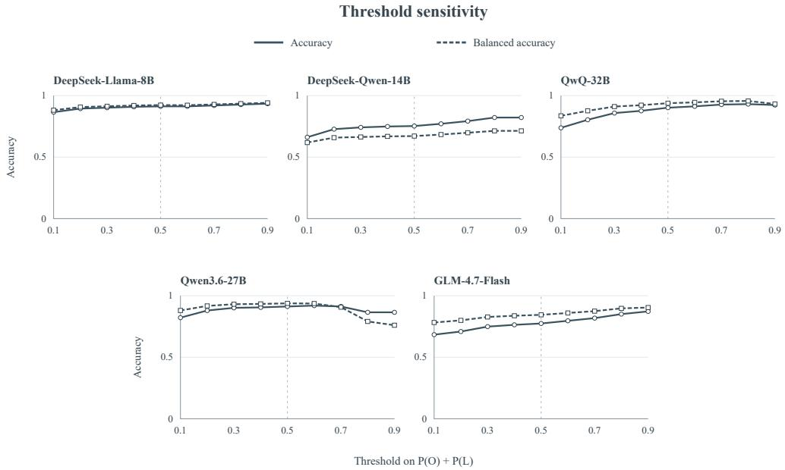  
Figure 9: Binary accuracy and balanced accuracy versus the confidence threshold at each trajec tory’s terminal power-of-two checkpoint. A prediction is harmful when $P ( O ) + P ( L ) > \tau$ . O/L are positive classes and D/R are negative classes. Balanced accuracy averages positive and negative recall.

## H.2 DYNAMIC LAYER-SELECTION THRESHOLD

Table 14: Number of dynamically selected layers at different layer-selection thresholds.
<table><tr><td>Selection threshold</td><td>Evaluated n</td><td>Mean layers</td><td>Mean /8</td></tr><tr><td>0.4</td><td>80</td><td>1.095</td><td>13.7%</td></tr><tr><td>0.6</td><td>80</td><td>1.527</td><td>19.1%</td></tr><tr><td>0.7</td><td>80</td><td>1.838</td><td>23.0%</td></tr></table>

Table 15: Mean per-layer selection frequency at different layer-selection thresholds.
<table><tr><td>Layer index</td><td> $\tau _ { \mathrm { l a y e r } } = 0 . 4$ </td><td> $\tau _ { \mathrm { l a y e r } } = 0 . 6$ </td><td> $\tau _ { \mathrm { l a y e r } } = 0 . 7$ </td></tr><tr><td>11</td><td>15.6%</td><td>20.3%</td><td>24.4%</td></tr><tr><td>12</td><td>10.6%</td><td>15.9%</td><td>18.3%</td></tr><tr><td>13</td><td>15.3%</td><td>19.4%</td><td>24.7%</td></tr><tr><td>14</td><td>15.0%</td><td>20.1%</td><td>24.4%</td></tr><tr><td>15</td><td>14.5%</td><td>20.9%</td><td>26.1%</td></tr><tr><td>16</td><td>13.4%</td><td>19.9%</td><td>23.4%</td></tr><tr><td>17</td><td>13.8%</td><td>19.6%</td><td>23.1%</td></tr><tr><td>18</td><td>11.3%</td><td>16.4%</td><td>19.4%</td></tr></table>

Table 16: Sensitivity of layer localization to the retained-layer fraction $\xi .$ Each sweep cell reports the selected layer indices after retaining the ⌈ξL⌉ highest-PAS candidate layers.
<table><tr><td>Model</td><td> $\xi = 0 . 1 5$ </td><td> $\xi = 0 . 2 0$ </td><td> $\xi = 0 . 2 5$ </td><td> $\xi = 0 . 3 0$ </td><td> $\xi = 0 . 3 5$ </td><td> $\xi = 0 . 4 0$ </td><td>Shared subset</td></tr><tr><td>Llama-8B</td><td>11-15</td><td>10-15</td><td>9-16</td><td>9-16</td><td>9-16</td><td>9-16</td><td>11-15</td></tr><tr><td>Qwen-14B</td><td>25-31</td><td>22-31</td><td>22-32</td><td>22-32</td><td>21-32</td><td>21-32</td><td>25-31</td></tr><tr><td>QwQ-32B</td><td>37-46</td><td>36-48</td><td>34-49</td><td>34-49</td><td>34-49</td><td>34-49</td><td>37-46</td></tr><tr><td>Qwen3.6-27B {11, 15} {11, 15, 19} {11, 15, 19, 23} {11, 15, 19, 23} {11, 15, 19, 23} {11, 15, 19, 23}</td><td></td><td></td><td></td><td></td><td></td><td></td><td>{11, 15}</td></tr><tr><td>GLM-4.7</td><td>18-24</td><td>18-26</td><td>18-27</td><td>18-27</td><td>17-27</td><td>17-27</td><td>18-24</td></tr></table>

Table 14 reports the overall sensitivity of dynamic layer selection while holding the classifier threshold fixed at 0.5. Because Equation 7 selects layers satisfying $M _ { \mathcal { C } } ^ { ( l ) } ( s ) < \kappa _ { \mathcal { C } }$ , increasing $\kappa _ { \mathcal { C } }$ relaxes the eligibility criterion and therefore expands the intervention set. Accordingly, raising the selection threshold from 0.4 to 0.7 increases the mean number of selected layers per evaluated step from 1.095 to 1.838, or from 13.7% to 23.0% of the eight candidate layers. The median also rises from 0.021 to 0.514 layers, indicating that selection remains sparse for many trajectories even as the average intervention coverage grows. Table 15 reports the corresponding per-layer frequencies and shows the same monotonic increase for every candidate layer. At $\kappa c = 0 . 7$ , selection frequencies range from 18.3% for layer 12 to 26.1% for layer 15, with no single layer dominating the dynamic set.

## H.3 RETAINED-LAYER FRACTION

We test whether the static localization is sensitive to the size of the candidate pool by varying $\xi$ from 0.15 to 0.40. As shown in Table 16, the selected sets are nested for every model: increasing $\xi$ adds layers but never removes a layer selected at a smaller value. From $\xi = 0 . 2 5$ onward, the selected set remains unchanged for Llama-8B, QwQ-32B, and Qwen3.6-27B; Qwen-14B and GLM-4.7 each add only one lower-index boundary layer at $\xi = 0 . 3 5$ . The shared subsets across all six settings therefore identify a stable model-specific core, consistent with the highest-PAS evidence remaining concentrated in the same layer region as the candidate pool expands. This sweep establishes robustness of layer localization to $\xi .$

## H.4 HYPERPARAMETER SETTINGS

Unless otherwise stated, the main RADAR experiments use a classifier confidence threshold of $\tau = 0 . 5 .$ , a retained-layer fraction of $\xi = 0 . 3$ , and a dynamic layer-selection threshold of $\kappa _ { \mathcal { C } } =$ 0.5. The minimum online detection checkpoint is a sequence length of 256 tokens, after which state inference follows the geometrically spaced schedule defined in Section 3.3. PAS and CTS histories are sampled every 32 decoding steps, while dynamic layer eligibility is updated every 8 steps. Once the harmful-state gate is activated, the intervention remains active until the reasoning process terminates.

Trajectory collection uses a sampling temperature of 0.5. In the defense evaluation, benign requests retain temperature 0.5, whereas attack requests use temperature 0. All runs use a maximum generation budget of 16k tokens. For the compared external defenses, AUSteer uses k = 16 selected atomic units with steering strength $\alpha = 1 0$ , and the n-gram baseline blocks repeated trigrams.