# YOU’RE HIRED: STRATEGIC MODEL SELECTION FORLLM COLLABORATION

Zongwan Cao<sup>∗1</sup> Ziyuan Yang<sup>∗1</sup> Shangbin Feng<sup>∗1</sup>

Michal Duan<sup>2</sup> Skyler Hallinan<sup>2</sup> Bingbing Wen<sup>1</sup> Lucy Lu Wang<sup>13</sup> Yulia Tsvetkov<sup>1</sup> <sup>1</sup>University of Washington <sup>2</sup>University of Southern California <sup>3</sup>Allen Institute for AI {zongwanc,ziyuan86}@uw.edu shangbin@cs.washington.edu

## ABSTRACT

While multi-agent and model collaboration algorithms gain traction to combine the strengths of diverse Large Language Models (LLMs), existing systems remain bottlenecked on pre-defined and hand-crafted model pools. In this work, we investigate the problem of model selection in multi-LLM systems. We propose and systematically evaluate a taxonomy of 9 selection algorithms ranging from diversity of model descriptions, capability-aware behavioral diversity, and LLM-based recruiters. We conduct extensive experiments across two candidate pools of 10 and 32 models, deployed in four model collaboration algorithms, and evaluated across tasks spanning math, coding, QA, and reasoning. Results demonstrate that successful selection algorithms greatly outperform random or heuristics-based teams such as merely selecting the models with top individual performance, by up to 36.1% across settings. Specifically, capability- and training-based selection strategies alleviate selection variance and achieve the best performance, which we recommend to employ before deploying real-world multi-LLM systems. Further analysis reveals that larger candidate pools pose greater challenges to shallow selection heuristics, while algorithms grounded in interacting with candidate models and understanding model capability robustly filter out misaligned, unsafe models, as well as generalizing to novel, out-of-distribution tasks. Together, we establish that principled and informed team selection is critical and present strong model selection algorithms for assembling effective multi-LLM systems.

## 1 INTRODUCTION

Recent advances in Large Language Models (LLMs) have fueled a transition from single-model inference to multi-model collaborative systems. Frameworks such as multi-agent debate (Du et al., 2024), dynamic routing (Feng et al., 2026a; Ong et al., 2025), and parameter fusion (Yu et al., 2024; Yadav et al., 2023) demonstrate that combining multiple LLMs can overcome individual biases (Liang et al., 2024; Zhao et al., 2025), reduce hallucinations (Du et al., 2024), and push the frontier of task performance(Feng et al., 2026a;c). Yet, the effectiveness of these collaborative architectures rests on a critical, often overlooked assumption: a well-composed team. With over 2 million open language models available (Wolf et al., 2020), assembling a synergistic pool of collaborator models beyond manual cherry-picking remains an open challenge.

Currently, multi-LLM teams are typically assembled via ad-hoc heuristics, uniform random sampling, or by simply grouping the largest available models. Yet these practices overlook a central challenge: models that are individually strong or superficially diverse may not necessarily form an effective team (Kuncheva & Whitaker, 2003; Sanchez & Hitaj, 2025). This motivates a fundamental question: How should we select models to form an effective collaborative team? In this work, we systematically investigate the science of model selection in multi-LLM systems. We formalize the candidate selection problem and investigate a comprehensive taxonomy of selection strategies that differ in the signals used to characterize candidate models and the procedures used to form teams. Specifically, we investigate and propose five categories of algorithms: standard baselines such as employing models with best solo scores, stated diversity from model descriptions, capability-aware diversity capturing observed behavioral patterns, hybrid approaches ensembling description and capability diversity, as well as LLM-based recruiters.

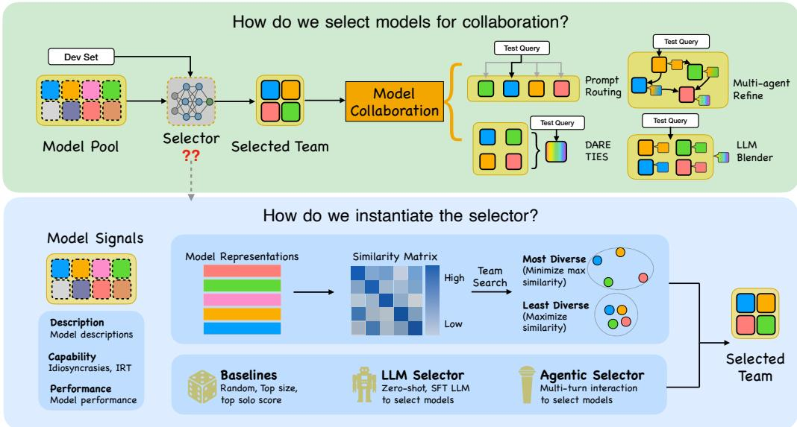  
Figure 1: Overview of our work. Given a candidate model pool, we study how to select a team for downstream collaboration. Our selectors consist of standard baselines, stated diversity, capabilityaware-diversity, hybrid approaches, and LLM-based recruiters. The selected models are then composed into a team and evaluated across diverse collaboration paradigms.

We evaluate these selectors across two candidate pools of varying heterogeneity with 10 and 32 models, diverse benchmarks, and four distinct collaboration mechanisms. Specifically, our evaluation encompasses tasks spanning mathematical problem solving, code generation, question answering, and complex reasoning. Our results reveal four key insights: First, randomly assembled teams underperform and introduce substantial performance variance, highlighting the necessity of fine-grained team selection; Second, capability-aware strategies frequently build stronger teams that reliably outperform the best single model and heuristics-based baselines; Third, capability-aware selection is the safest default as they consistently emerged as the top performers. If adversarial ro bustness is the priority, quality-filtered approaches (such as Agentic Top-k, Nested Diversity) are recommended to select out the malicious models. Furthermore, we demonstrate that effective selection strategies scales robustly in redundant ecosystems and generalizes to out-of-distribution tasks. Ultimately, who you select for a multi-LLM team matters just as much as how they collaborate, and our algorithms provide a practical blueprint for hiring the right models for the job.

## 2 RELATED WORK

Multi-LLM Collaboration. The paradigm of combining multiple language models takes several forms. Routing mechanisms aim to dynamically assign inputs to the most suitable expert (Ong et al., 2025). Generative fusion (Jiang et al., 2023) and multi-agent debate (Du et al., 2024) allow models to iteratively critique and refine each other’s outputs. At the parameter level, techniques like DARE (Yu et al., 2024) and TIES (Yadav et al., 2023) merge the weights of distinct models into a single unified model. While these methods provide the infrastructure for collaboration, they generally assume the input ensemble is pre-determined, leaving the question of optimal team composition largely unaddressed.

Model Diversity and Selection. Diversity is a key consideration in ensemble construction, as complementary models can reduce errors (Kuncheva & Whitaker, 2003). Recent works shows that diverse expertise across LLM agents can improve collective performance (Zhang et al., 2025), while structural metadata can be used to characterize model relationships in the broader LLM ecosystem (Li et al., 2024; Laufer et al., 2025). However, these structural proxies do not directly characterize behavioral complementarity. Our work bridges this gap by adapting combinatorial search algorithms to fine-grained, behavioral signals, ensuring that selected models are diverse and effective.

Capability Modeling. Quantifying the intrinsic abilities of LLMs has evolved beyond simple benchmark leaderboards (Liang et al., 2023). Methods such as Item Response Theory (IRT), originally developed for scaling NLP evaluation (Lalor et al., 2016), are recently adapted to map LLMs into continuous latent ability spaces based on item-level success patterns (Chen et al., 2025). Similarly, attribution confusability (Sun et al., 2025) measures behavioral overlap by analyzing whether a classifier can distinguish between the text generated by different models. We leverage these advanced capability representations not for leaderboard ranking, but as the underlying signals for our diversity-seeking selection algorithms.

## 3 METHODOLOGY

Problem Formulation Let $\mathcal { M } = \{ m _ { 1 } , . . . , m _ { P } \}$ denote a pool of P candidate language models, Given a target team size n, a selector σ chooses a subset of models from the model pool to form team T:

$$
\sigma ( { \mathcal { M } } , n ) = T , \qquad T \subseteq { \mathcal { M } } , | T | = n ,\tag{1}
$$

Given a collaboration method $c \in { \mathcal { C } }$ and a task $d \in \mathcal { D }$ , the performance of the selected team $T$ under method c on task d is denoted by score $( T , c , d )$ . In this work, we study how the choice of selector σ affects score under different collaboration methods and tasks.

Selection Strategies Selecting a team $T$ requires information about candidate models that can inform the selection decision. We consider three common forms of such information: (i) stated metadata, such as model cards (Mitchell et al., 2019); (ii) demonstrated behavior via item-level evaluation (Lalor et al., 2016; Chen et al., 2025) or behavioral fingerprinting (Sun et al., 2025); and (iii) external judgment from strong LLMs or human raters (Zheng et al., 2023). Based on these observations, we instantiate our selector by two components: Signal Z and Procedure. The signal captures candidatelevel attributes, pairwise similarities, or wholeteam judgments, while the procedure maps Z to team $\breve { T }$ via ranking, search (Algorithms 1 and 2), filtering, or direct selection. Based on how these signals are constructed and used, we organize the resulting strategies into five families. Table 1 summarizes their signals and selection procedures.

Table 1: Selection strategy taxonomy.
<table><tr><td>Selector σ</td><td>Signal Z</td><td>Procedure</td></tr><tr><td colspan="3">I. Standard Baselines</td></tr><tr><td>Random</td><td>None</td><td>Random sampling</td></tr><tr><td>Top size</td><td>Parameter count</td><td>Direct ranking</td></tr><tr><td>Top solo score</td><td>Solo performance</td><td>Direct ranking</td></tr><tr><td colspan="3">II. Stated Diversity</td></tr><tr><td>Description diversity Model description</td><td></td><td>Exact (Alg. 1)</td></tr><tr><td colspan="3">III. Capability-Aware Diversity</td></tr><tr><td>Idiosyncrasies</td><td>Attribution behavior</td><td>Greedy (Alg. 2)</td></tr><tr><td>IRT ability</td><td>IRT ability</td><td>Greedy (Alg. 2)</td></tr><tr><td>Performance profile</td><td>Benchmark profile</td><td>Exact (Alg. 1)</td></tr><tr><td colspan="3">IV. Hybrid</td></tr><tr><td>Combined</td><td>Description + IRT</td><td>Exact (Alg. 1)</td></tr><tr><td>Nested</td><td>Description + IRT</td><td>Filter + Alg. 1</td></tr><tr><td colspan="3">V. LLM-based recruiters</td></tr><tr><td>LLM prompt</td><td>Model descriptions</td><td>Direct selection</td></tr><tr><td>SFT Classifier</td><td>Predicted team score</td><td>Team ranking</td></tr><tr><td>Agentic top-k</td><td>Interview score</td><td>Direct ranking</td></tr></table>

## 3.1 SIGNAL CONSTRUCTION

Different selectors rely on different information about the candidate models. The information $\mathcal { Z }$ may include model descriptions, observed capabilities, or behavioral patterns. Each strategy constructs Z differently and then applies a corresponding selection procedure to form the team $\bar { T _ { \mathbf { \alpha } } }$

For strategies that explicitly seek model diversity, we convert $\mathcal { Z }$ into a pairwise similarity matrix $\mathbf { S } = \left[ s _ { i , j } \right] \in \mathbb { R } ^ { P \times P }$ , where $s _ { i , j }$ measures the similarity between candidates $m _ { i }$ and $m _ { j }$ under the corresponding signal.

Baselines. We consider three reference methods that do not explicitly model complementarity. Random uses no signal. Top size uses model parameter counts as the selection signal. Top solo score uses performance on the development set of target task of each model as signal.

Stated diversity. We next use models’ stated descriptions to characterize their different intended specializations. For Description diversity, we define the selection signal as $\mathcal { Z } = \{ \operatorname { d e s c } ( m _ { i } ) \} _ { i = 1 } ^ { P } .$

We then encode description using a sentence transformer $\phi ,$ , and construct the pairwise similarity matrix as $s _ { i , j } = \cos ( \phi ( \operatorname { d e s c } ( m _ { i } ) , \phi ( \operatorname { d e s c } ( m _ { j } ) )$ .

Capability-aware diversity. We characterize model diversity through observed capabilities and behavioral patterns. Idiosyncrasies and IRT also derive behavioral signals from model responses on the development set of evaluation tasks, and Performance Profile characterizes models on a held-out suite of benchmark tasks spanning math, code, $\mathrm { Q A }$ , and reasoning, rather from the evaluation tasks.

$$
c _ { i , j }
$$

$$
\dot { \mathcal Z } = \{ c _ { i , j } \} _ { i , j = 1 } ^ { P }
$$

$$
\begin{array} { r } { \bar { \boldsymbol j } = \frac { 1 } { 2 } ( c _ { i , j } + c _ { j , i } ) } \end{array}
$$

• IRTAbility: Following Chen et al. (2025), we train an IRT model to estimate an ability vector $\theta _ { i }$ for each candidate from its item-level successes and failures. We use these ability vectors as the selection signal $\mathcal { Z } = \{ \theta _ { i } \} _ { i = 1 } ^ { P }$ , and construct the pairwise similarity as $s _ { i , j } = \cos ( \theta _ { i } , \theta _ { j } )$

• Performance Profile: We represent each candidate model by its performance vector $p _ { i } \in \mathbb { R } ^ { 1 0 }$ across held-out benchmarks. We use these performance vectors as the selection signal $\mathcal { Z } =$ $\{ p _ { i } \} _ { i = 1 } ^ { P }$ , and construct the pairwise similarity as $s _ { i , j } = \cos ( p _ { i } , p _ { j } )$

Hybrid. We combine signals from Description Diversity and IRT Ability in two ways. For Combined, we concatenate the description embedding $\operatorname { d e s c } ( m _ { i } )$ and IRT ability embedding $\theta _ { i }$ into a joint representation $h _ { i } = [ v _ { i } ; \theta _ { i } ]$ . We use these joint representations as the selection signal, $\mathcal { Z } = \{ h _ { i } \} _ { i = 1 } ^ { P }$ and compute $s _ { i , j } = \cos ( h _ { i } , h _ { j } )$ . Nested retains the description and IRT signals separately and use them sequentially.

LLM-based recruiters. Finally, rather than constructing a fixed pairwise similarity matrix $\mathbf { S } ,$ these methods use learned or LLM-elicited judgments as selection signals. For $L L M p r o m p t ;$ , the signal consists of model descriptions $\mathcal { Z } = \{ \mathrm { d e s c } ( \mathbf { \breve { \boldsymbol { m } } } _ { i } ) \} _ { i = 1 } ^ { P }$ . For SFT Classifier, Z consists of predicted team scores produced by a learned regression model from the descriptions of the team members. For Agentic top-k, the signal consists of scalar interview scores, $\mathcal { Z } = \dot { \{ q _ { i } \} } _ { i = 1 } ^ { P }$ , where $q _ { i }$ is assigned to candidate $m _ { i }$ by an LLM recruiter. We provide details in Appendix C.

## 3.2 SELECTION PROCEDURES

Given a selection signal Z, each selector applies a corresponding procedure to form a team $T$ of size $n .$ Depending on the selector, this procedure takes the form of direct sampling or ranking, diversity-based search, sequential filtering, or LLM-based selection.

Baselines. The baseline selectors require no complex search. Random uniformly samples a team of n candidates from model pool. Top size and Top solo score directly rank candidates by their respective scalar signals and select the top n candidates.

Diversity-based selection. For selectors that construct a pairwise similarity matrix S, we define team diversity using a max–min dispersion criterion, with average pairwise similarity as a tiebreaker. Specifically, we define the most diverse team as the one that minimizes the maximum pairwise similarity, whereas the least diverse team maximizes it. We additionally compare against average-dispersion objectives in Appendix B. We consider two selection procedures:

• Exact diversity search (Algorithm 1): We enumerate all candidate teams of size n and select a team according to the diversity criterion. We use this procedure for Description Diversity and Performance Profile, where pairwise similarity provides a direct diversity signal.

• Capability-seeded greedy search (Algorithm 2): We incorporate candidate capability into the search and use this procedure for Idiosyncrasies and IRT Ability, where weak models may produce unusual errors and therefore appear distinctive. The search starts from the two highestperforming candidates and greedily adds the remaining members according to the diversity cri terion, reducing the risk of selecting weak models solely for their distinctiveness.

Hybrid. These methods combine the signals above in two ways. Combined applies Algorithm 1 to the joint representation $h _ { i } .$ . Nested first retains the stronger half of the candidate pool based on IRT

Algorithm 1: Exact Diversity Search   
Require: Similarity matrix $\overline { { \mathbf { S } \in \mathbb { R } ^ { P \times P } } }$ , team size n, mode ∈ {MOST, LEAST}   
1: T<sup>⋆</sup> ← ∅   
2: for each $T \subseteq \{ 1 , \dots , P \}$ with |T| = n do   
3: s<sub>max</sub>(T) ← max<sub>i,j∈T,</sub> <sub>i̸=j</sub> s<sub>i,j</sub>   
4: $\begin{array} { r } { s _ { \mathrm { a v g } } ( T ) \gets 1 / \binom { n } { 2 } \sum _ { i , j \in T , \ i < j } s _ { i , j } } \end{array}$   
5: $s ( T ) \gets ( s _ { \mathrm { m a x } } ( T ) , s _ { \mathrm { a v g } } ( T ) )$   
if mode = MOST and $s ( T ) < s ( T ^ { \star } )$ then   
T<sup>⋆</sup> ← T   
else if mode = LEAST and $s ( T ) > s ( T ^ { \star } )$ then   
$T ^ { \star } \gets T$   
10: end if   
11: end for   
12: return T<sup>⋆</sup>

```latex
Algorithm 2: Capability-Seeded Greedy Search
Require: Similarity matrix S $\in \mathbb { R } ^ { P \times P }$ , team size n, scores {cap(i)}, mode ∈ {MOST, LEAST}
1: seed ← top-2 indices by cap(·)
2: T ← seed
3: $R \gets \{ 1 , \dots , P \} \setminus T$
while $| \dot { T } | < r$ n do
for c ∈ R do
$\begin{array} { r } { s ( c ) \gets \operatorname* { m a x } _ { j \in T } s _ { c , j } } \end{array}$
end for
c<sup>⋆</sup> ← arg min s(c) if mode = MOST else arg max s(c)
$T \gets T \cup \{ c ^ { \star } \}$
10: $R \gets R \setminus \left\{ c ^ { \star } \right\}$
11: end while
12: return T
```

Ability scores $\theta _ { i } ,$ , then applies Algorithm 1 to the remaining candidates using the description-based similarity signal.

LLM-based recruiters. These procedures bypass pairwise similarity matrices and select teams using learned or zero-shot LLM recruiters: LLM prompt: directly selects a team from candidate descriptions using a zero-shot LLM recruiter. SFT Classifier: enumerates all teams of size n, scores each with a fine-tuned LLM-based regressor, and selects the highest-scoring team. Agentic top-k: conducts multi-turn LLM interviews with each candidate, ranks candidates by their interview scores, and selects the top n models. We provide further details of these procedures in Appendix C.

## 4 EXPERIMENT DETAILS

Collaboration Methods We evaluate selected team T under four collaboration methods: prompt routing, which asks an LLM to route each query to the team member whose description best matches it; multi-agent refinement (Du et al., 2024), in which team members iteratively critique and revise a shared draft; weight merging, which fuses team members’ parameters into a single model via DARE (Yu et al., 2024) composed with TIES (Yadav et al., 2023); and LLM blender (Jiang et al., 2023), which pairwise-ranks team members’ outputs and generatively fuses the top-ranked subsets.

Candidate models. We evaluate selectors across two distinct candidate pools M. Pool 1 consists of 10 Qwen2.5-7B-Instruct (Qwen Team, 2024) models trained on different instruction-tuning corpora (Jiang et al., 2025). Pool 2 consists of 32 independently contributed systems from the participatory ecosystem of Feng et al. (2026c), spanning diverse architectures, scales, and training objectives. For both pools, our goal is to select a team of n = 4 candidate models for collaboration. Full model details are provided in Appendix D.

Datasets. We evaluate collaborative performance on three main datasets: GSM8K (Cobbe et al., 2021), TruthfulQA (Lin et al., 2022), and MBPP (Austin et al., 2021). Auxiliary datasets are used to construct the Performance Profile signal and train the SFT Classifier. Idiosyncrasies, IRT, and Top Solo Score use the development set of the evaluation datasets to construct their selection signals, while all reported collaborative performance is evaluated on the test splits. Also, the SFT Classifier

Table 2: Main collaborative performance results across all datasets and mechanisms for Pool 1 (top) and Pool 2 (bottom). The highest mean score in each column per pool is bolded. Cells are colored to highlight the efficacy of adaptive selection based on mean performance: Light Green indicates the team beats the Random baseline, Medium Green indicates the team beats all standard baselines (Random, Top Solo, and Top Size when applicable), and Dark Green indicates the team beats all standard baselines plus the Single Best Model.  
Pool 1 (Homogeneous Candidates, 10 → 4 models)
<table><tr><td rowspan=1 colspan=14>Prompt Routing          Multiagent Refine           DARE-TIES            LLM-Blender</td></tr><tr><td rowspan=1 colspan=14>Selection Method     GSM8K  TQA  MBPP GSM8K  TQA  MBPP  GSM8K  TQA  MBPP GSM8K  TQA  MBPP</td></tr><tr><td rowspan=1 colspan=14>Standard Baselines</td></tr><tr><td rowspan=1 colspan=1>Single Best Model</td><td rowspan=1 colspan=5>65.6±1.5 59.3±2.0 47.0±2.365.6±1.559.3±2.0</td><td rowspan=1 colspan=1>47.0±2.3</td><td rowspan=1 colspan=2>65.6±1.5 59.3±2.0</td><td rowspan=1 colspan=2>47.0±2.3</td><td rowspan=1 colspan=1>65.6±1.5</td><td rowspan=1 colspan=2>59.3±2.0 47.0±2.3</td></tr><tr><td rowspan=1 colspan=1>Random</td><td rowspan=1 colspan=5>50.5±10.0 48.0±5.751.7±6.5 45.4±2.6 42.8±6.1</td><td rowspan=1 colspan=1>42.7±4.4</td><td rowspan=1 colspan=1>45.2±13.4</td><td rowspan=1 colspan=1>59.8±4.7</td><td rowspan=1 colspan=2>52.4±7.5</td><td rowspan=1 colspan=1>59.8±7.1</td><td rowspan=1 colspan=2>48.0±5.453.8±7.3</td></tr><tr><td rowspan=1 colspan=1>Top Solo Score</td><td rowspan=1 colspan=5>62.8±1.5 43.9±2.0 45.2±2.2 60.2±1.650.2±2.0</td><td rowspan=1 colspan=1>36.1±2.2</td><td rowspan=1 colspan=1>31.4±1.5</td><td rowspan=1 colspan=1>63.9±1.9</td><td rowspan=1 colspan=1>46.4±2.2</td><td rowspan=1 colspan=2>73.9±1.4</td><td rowspan=1 colspan=2>51.9±2.047.0±2.3</td></tr><tr><td rowspan=1 colspan=1>Stated Diversity</td><td rowspan=1 colspan=6></td><td rowspan=1 colspan=1></td><td rowspan=1 colspan=4></td><td rowspan=1 colspan=2></td></tr><tr><td rowspan=1 colspan=1>Description (least)</td><td rowspan=1 colspan=1>26.4±1.4</td><td rowspan=1 colspan=2>34.2±1.954.6±2.3</td><td rowspan=1 colspan=1>51.0±1.6</td><td rowspan=1 colspan=1>43.0±2.0</td><td rowspan=1 colspan=1>47.4±2.2</td><td rowspan=1 colspan=1>34.4±1.5</td><td rowspan=1 colspan=1>61.8±1.9</td><td rowspan=1 colspan=2>59.1±2.3</td><td rowspan=1 colspan=1>49.7±1.6</td><td rowspan=1 colspan=2>49.1±2.055.4±2.3</td></tr><tr><td rowspan=1 colspan=1>Description (most)</td><td rowspan=1 colspan=1>63.4±1.5</td><td rowspan=1 colspan=2>60.0±2.057.7±2.3</td><td rowspan=1 colspan=1>50.0±1.6</td><td rowspan=1 colspan=1>40.7±2.0</td><td rowspan=1 colspan=1>38.8±2.2</td><td rowspan=1 colspan=1>54.0±1.6</td><td rowspan=1 colspan=1>66.1±1.9</td><td rowspan=1 colspan=2>56.9±2.2</td><td rowspan=1 colspan=1>48.5±1.6</td><td rowspan=1 colspan=2>62.1±2.057.5±2.2</td></tr><tr><td rowspan=1 colspan=1>Capability-Aware Diversi</td><td rowspan=1 colspan=1>ty</td><td rowspan=1 colspan=2></td><td rowspan=1 colspan=1></td><td rowspan=1 colspan=1></td><td rowspan=1 colspan=1></td><td rowspan=1 colspan=1></td><td rowspan=1 colspan=1></td><td rowspan=1 colspan=2></td><td rowspan=1 colspan=1></td><td rowspan=1 colspan=2></td></tr><tr><td rowspan=1 colspan=1>İdiosyncrasies (least)</td><td rowspan=1 colspan=1>56.5±1.6</td><td rowspan=1 colspan=1>40.5±2.0</td><td rowspan=1 colspan=1>56.3±2.3</td><td rowspan=1 colspan=1>53.3±1.6</td><td rowspan=1 colspan=1>36.3±1.9</td><td rowspan=1 colspan=1>49.7±2.2</td><td rowspan=1 colspan=1>58.4±1.6</td><td rowspan=1 colspan=1>56.9±2.0</td><td rowspan=1 colspan=2>54.6±2.2</td><td rowspan=1 colspan=1>67.6±1.5</td><td rowspan=1 colspan=1>52.7±2.0</td><td rowspan=1 colspan=1>49.3±2.3</td></tr><tr><td rowspan=1 colspan=1>Idiosyncrasies (most)</td><td rowspan=1 colspan=1>51.1±1.6</td><td rowspan=1 colspan=1>40.7±2.0</td><td rowspan=1 colspan=1>56.7±2.2</td><td rowspan=1 colspan=1>41.0±1.6</td><td rowspan=1 colspan=1>44.9±2.0</td><td></td><td></td><td></td><td></td><td></td><td></td><td></td><td></td></tr><tr><td rowspan=1 colspan=1>Perf. Profile (most)</td><td rowspan=1 colspan=1>37.2±1.5</td><td rowspan=1 colspan=1>46.5±2.0</td><td rowspan=1 colspan=1>56.5±2.3</td><td rowspan=1 colspan=1>12.2±1.1</td><td rowspan=1 colspan=1>30.0±1.9</td><td rowspan=1 colspan=1>42.5±2.2</td><td rowspan=1 colspan=1>58.2±1.6</td><td rowspan=1 colspan=1>59.2±2.0</td><td rowspan=1 colspan=2>54.0±2.3</td><td rowspan=1 colspan=1>60.5±1.6</td><td rowspan=1 colspan=1>50.6±2.0</td><td rowspan=1 colspan=1>53.4±2.3</td></tr><tr><td rowspan=1 colspan=1>Hybrid</td><td rowspan=1 colspan=1></td><td rowspan=1 colspan=1></td><td rowspan=1 colspan=1></td><td rowspan=1 colspan=1></td><td rowspan=1 colspan=1></td><td rowspan=1 colspan=1></td><td rowspan=1 colspan=1></td><td rowspan=1 colspan=1></td><td rowspan=1 colspan=2></td><td rowspan=1 colspan=1></td><td rowspan=1 colspan=1></td><td rowspan=1 colspan=1></td></tr><tr><td rowspan=1 colspan=1>Combined (most)</td><td rowspan=1 colspan=1>56.4±1.6</td><td rowspan=1 colspan=1>49.3±2.0</td><td rowspan=1 colspan=1>56.1±2.2</td><td rowspan=1 colspan=1>49.9±1.6</td><td rowspan=1 colspan=1>38.7±2.0</td><td rowspan=1 colspan=1>45.6±2.3</td><td rowspan=1 colspan=1>67.5±1.5</td><td rowspan=1 colspan=1>62.7±2.0</td><td rowspan=1 colspan=2>59.3±2.2</td><td rowspan=1 colspan=1>59.0±1.5</td><td rowspan=1 colspan=1>56.9±2.0</td><td rowspan=1 colspan=1>58.3±2.2</td></tr><tr><td rowspan=1 colspan=1>Nested (least)</td><td rowspan=1 colspan=1>63.2±1.6</td><td rowspan=1 colspan=1>48.3±2.0</td><td rowspan=1 colspan=1>37.8±2.2</td><td rowspan=1 colspan=1>40.9±1.6</td><td rowspan=1 colspan=1>41.0±2.0</td><td rowspan=1 colspan=1>34.5±2.1</td><td rowspan=1 colspan=1>51.6±1.6</td><td rowspan=1 colspan=1>58.2±2.0</td><td rowspan=1 colspan=2>47.2±2.3</td><td rowspan=1 colspan=1>72.7±1.4</td><td rowspan=1 colspan=1>55.1±2.0</td><td rowspan=1 colspan=1>31.6±2.1</td></tr><tr><td rowspan=1 colspan=1>Nested (most)</td><td rowspan=1 colspan=1>61.4±1.5</td><td rowspan=1 colspan=1>53.8±2.0</td><td rowspan=1 colspan=1>28.7±2.1</td><td rowspan=1 colspan=1>72.9±1.4</td><td rowspan=1 colspan=1>43.1±2.0</td><td rowspan=1 colspan=1>26.1±2.0</td><td rowspan=1 colspan=1>56.6±1.6</td><td rowspan=1 colspan=1>59.0±2.0</td><td rowspan=1 colspan=2>47.6±2.3</td><td rowspan=1 colspan=1>71.2±1.4</td><td rowspan=1 colspan=1>55.1±2.0</td><td rowspan=1 colspan=1>31.6±2.1</td></tr><tr><td rowspan=1 colspan=1>LLM-based recruiter</td><td rowspan=1 colspan=1></td><td rowspan=1 colspan=1></td><td rowspan=1 colspan=1></td><td rowspan=1 colspan=1></td><td rowspan=1 colspan=1></td><td rowspan=1 colspan=1></td><td rowspan=1 colspan=1></td><td rowspan=1 colspan=1></td><td rowspan=1 colspan=2></td><td rowspan=1 colspan=1></td><td rowspan=1 colspan=1></td><td rowspan=1 colspan=1></td></tr><tr><td rowspan=1 colspan=1>LLM Prompt</td><td rowspan=1 colspan=1>40.1±1.5</td><td rowspan=1 colspan=1>43.9±2.0</td><td rowspan=1 colspan=1>39.4±2.2</td><td rowspan=1 colspan=1>58.7±1.6</td><td rowspan=1 colspan=1>47.0±2.0</td><td rowspan=1 colspan=1>41.5±2.2</td><td rowspan=1 colspan=1>54.5±1.6</td><td rowspan=1 colspan=1>53.2±2.0</td><td rowspan=1 colspan=2>54.2±2.3</td><td rowspan=1 colspan=1>70.0±1.4</td><td rowspan=1 colspan=1>48.9±2.0</td><td rowspan=1 colspan=1>36.5±2.2</td></tr><tr><td></td><td></td><td></td><td></td><td></td><td rowspan=1 colspan=1>35.3±1.9</td><td rowspan=1 colspan=1>46.2±2.3</td><td rowspan=1 colspan=1>63.5±1.5</td><td rowspan=1 colspan=1>61.6±1.9</td><td rowspan=1 colspan=2>54.8±2.2</td><td rowspan=1 colspan=1>39.1±1.5</td><td rowspan=1 colspan=1>54.0±2.0</td><td rowspan=1 colspan=1>56.9±2.2</td></tr><tr><td rowspan=1 colspan=1>Agentic Top-K</td><td rowspan=1 colspan=1>63.4±1.5</td><td rowspan=1 colspan=1>59.0±2.0</td><td rowspan=1 colspan=1>39.4±2.2</td><td rowspan=1 colspan=1>63.2±1.5</td><td rowspan=1 colspan=1>43.9±2.0</td><td rowspan=1 colspan=1>36.8±2.2</td><td rowspan=1 colspan=1>63.7±1.5</td><td rowspan=1 colspan=1>61.4±2.0</td><td rowspan=1 colspan=2>54.4±2.3</td><td rowspan=1 colspan=1>72.5±1.4</td><td rowspan=1 colspan=1>57.0±2.0</td><td rowspan=1 colspan=1>37.4±2.2</td></tr><tr><td rowspan=1 colspan=6>Pool 2 (Heterogeneous Can</td><td rowspan=1 colspan=8>didates, 32 → 4 models)</td></tr><tr><td rowspan=1 colspan=1></td><td rowspan=1 colspan=5>Prompt Routing          Multiagent</td><td rowspan=1 colspan=1>Refine</td><td rowspan=1 colspan=7>DARE-TIES             LLM-Blender</td></tr><tr><td rowspan=1 colspan=1>Selection Method</td><td rowspan=1 colspan=1>GSM8K</td><td rowspan=1 colspan=1>TQA</td><td rowspan=1 colspan=1>MBPP</td><td rowspan=1 colspan=1>GSM8K</td><td rowspan=1 colspan=1>TQA</td><td rowspan=1 colspan=1>MBPP</td><td rowspan=1 colspan=1>GSM8K</td><td rowspan=1 colspan=1>TQA</td><td rowspan=1 colspan=3>MBPP GSM8K</td><td rowspan=1 colspan=2>TQA   MBPP</td></tr><tr><td rowspan=1 colspan=1>Standard Baselines</td><td rowspan=1 colspan=1></td><td rowspan=1 colspan=1></td><td rowspan=1 colspan=1></td><td rowspan=1 colspan=1></td><td rowspan=1 colspan=1></td><td rowspan=1 colspan=1></td><td rowspan=1 colspan=1></td><td rowspan=1 colspan=1></td><td rowspan=1 colspan=3></td><td rowspan=1 colspan=1></td><td rowspan=1 colspan=1></td></tr><tr><td rowspan=1 colspan=1>Single Best Model</td><td rowspan=1 colspan=1>82.9±1.0</td><td rowspan=1 colspan=1>46.0±2.0</td><td rowspan=1 colspan=1>55.9±2.2</td><td rowspan=1 colspan=1>82.9±1.0</td><td rowspan=1 colspan=1>46.0±2.0</td><td rowspan=1 colspan=1>55.9±2.2</td><td rowspan=1 colspan=1>82.9±1.0</td><td rowspan=1 colspan=1>46.0±2.0</td><td rowspan=1 colspan=3>55.9±2.2 82.9±1.0</td><td rowspan=1 colspan=1>46.0±2.0</td><td rowspan=1 colspan=1>55.9±2.2</td></tr><tr><td rowspan=1 colspan=1>Top Solo Score</td><td rowspan=1 colspan=1>78.9±1.3</td><td rowspan=1 colspan=1>46.5±2.0</td><td rowspan=1 colspan=1>58.1±2.2</td><td rowspan=1 colspan=1>83.6±1.2</td><td rowspan=1 colspan=1>24.8±1.7</td><td rowspan=1 colspan=1>55.4±2.3</td><td rowspan=1 colspan=1>85.1±1.1</td><td rowspan=1 colspan=1>41.8±2.0</td><td rowspan=1 colspan=3>60.2±2.285.5±1.1</td><td rowspan=1 colspan=1>42.3±2.0</td><td rowspan=1 colspan=1>55.9±2.3</td></tr><tr><td rowspan=1 colspan=1>Top Size</td><td rowspan=1 colspan=6>23.9±1.4 58.7±2.052.8±2.3 74.6±1.4 57.9±2.0 48.5±2.3</td><td rowspan=1 colspan=1>14.4±1.1</td><td rowspan=1 colspan=4>65.6±1.960.8±2.2 35.5±1.5</td><td rowspan=1 colspan=2>59.6±2.0 60.0±2.2</td></tr><tr><td rowspan=1 colspan=1>Stated Diversity</td><td rowspan=1 colspan=6></td><td rowspan=1 colspan=1></td><td rowspan=1 colspan=4></td><td rowspan=1 colspan=2></td></tr><tr><td rowspan=1 colspan=1>Description (least)</td><td rowspan=1 colspan=1>8.6±0.9</td><td rowspan=1 colspan=5>45.5±2.047.2±2.3 29.1±1.451.7±2.0 55.0±2.3</td><td rowspan=1 colspan=1>11.4±1.0</td><td rowspan=1 colspan=4>57.0±2.060.8±2.235.3±1.5</td><td rowspan=1 colspan=2>55.9±2.0 58.3±2.3</td></tr><tr><td rowspan=1 colspan=1>Description (most)</td><td rowspan=1 colspan=1>21.7±1.3</td><td rowspan=1 colspan=4>63.9±1.9 62.4±2.2 87.9±1.0 59.5±2.0</td><td rowspan=1 colspan=1>53.4±2.3</td><td rowspan=1 colspan=1>16.1±1.2</td><td rowspan=1 colspan=2>66.8±1.9 63.0±2.2</td><td rowspan=1 colspan=2>21.3±1.3</td><td rowspan=1 colspan=2>70.3±1.9 61.8±2.2</td></tr><tr><td rowspan=1 colspan=1>Capability-Aware Divers</td><td rowspan=1 colspan=1>ity</td><td rowspan=1 colspan=1></td><td rowspan=1 colspan=3></td><td rowspan=1 colspan=1></td><td rowspan=1 colspan=1></td><td rowspan=1 colspan=1></td><td rowspan=1 colspan=2></td><td rowspan=1 colspan=1></td><td rowspan=1 colspan=2></td></tr><tr><td rowspan=1 colspan=1>Idiosyncrasies (least)</td><td rowspan=1 colspan=1>77.6±1.3</td><td rowspan=1 colspan=1>43.6±2.0</td><td rowspan=1 colspan=1>58.1±2.2</td><td rowspan=1 colspan=1>85.4±1.1</td><td rowspan=1 colspan=1>32.1±1.9</td><td></td><td></td><td></td><td></td><td></td><td></td><td></td><td></td></tr><tr><td rowspan=1 colspan=1>Perf. Profile (most)</td><td rowspan=1 colspan=1>77.5±1.3</td><td rowspan=1 colspan=1>46.0±2.0</td><td rowspan=1 colspan=1>54.2±2.3</td><td rowspan=1 colspan=1>80.6±1.2</td><td rowspan=1 colspan=1>40.5±1.9</td><td rowspan=1 colspan=1>51.5±2.3</td><td rowspan=1 colspan=1>53.9±1.6</td><td rowspan=1 colspan=1>57.7±2.0</td><td rowspan=1 colspan=2>62.2±2.2</td><td rowspan=1 colspan=1>81.8±1.2</td><td rowspan=1 colspan=2>45.2±2.0 30.4±2.1</td></tr><tr><td rowspan=1 colspan=1>Hybrid</td><td rowspan=1 colspan=1></td><td rowspan=1 colspan=1></td><td rowspan=1 colspan=1></td><td rowspan=1 colspan=1></td><td rowspan=1 colspan=1></td><td rowspan=1 colspan=1></td><td rowspan=1 colspan=1></td><td rowspan=1 colspan=1></td><td rowspan=1 colspan=2></td><td rowspan=1 colspan=1></td><td rowspan=1 colspan=2></td></tr><tr><td rowspan=1 colspan=1>Combined (least)</td><td rowspan=1 colspan=1>14.1±1.1</td><td rowspan=1 colspan=1>45.4±2.0</td><td rowspan=1 colspan=1>51.1±2.3</td><td rowspan=1 colspan=1>78.0±1.3</td><td rowspan=1 colspan=1>47.8±2.0</td><td rowspan=1 colspan=1>50.1±2.3</td><td rowspan=1 colspan=1>10.4±1.0</td><td rowspan=1 colspan=1>58.4±2.0</td><td rowspan=1 colspan=2>60.4±2.2</td><td rowspan=1 colspan=1>19.3±1.3</td><td rowspan=1 colspan=2>53.0±2.0 61.2+2.2</td></tr><tr><td rowspan=1 colspan=1>Nested (most)</td><td rowspan=1 colspan=1>20.9±1.3</td><td rowspan=1 colspan=2>62.9±2.0 58.7±2.2</td><td rowspan=1 colspan=1>82.5±1.2</td><td rowspan=1 colspan=1>65.0±1.9</td><td rowspan=1 colspan=1>58.7±2.2</td><td rowspan=1 colspan=1>18.2±1.2</td><td rowspan=1 colspan=1>65.1±1.9</td><td rowspan=1 colspan=2>63.9±2.1</td><td rowspan=1 colspan=1>46.7±1.6</td><td rowspan=1 colspan=2>64.3±1.9 64.3±2.1</td></tr><tr><td rowspan=1 colspan=2>LLM-based recruiters</td><td rowspan=1 colspan=2></td><td rowspan=1 colspan=1></td><td rowspan=1 colspan=1></td><td rowspan=1 colspan=1></td><td rowspan=1 colspan=1></td><td rowspan=1 colspan=1></td><td rowspan=1 colspan=2></td><td rowspan=1 colspan=1></td><td rowspan=1 colspan=2></td></tr><tr><td rowspan=1 colspan=2>LLM Prompt      76.2±1.3</td><td rowspan=1 colspan=1>50.6±2.0</td><td rowspan=1 colspan=1>57.3±2.2</td><td rowspan=1 colspan=1>80.6±1.3</td><td rowspan=1 colspan=1>52.8±2.0</td><td rowspan=1 colspan=1>56.1±2.3</td><td rowspan=1 colspan=1>20.6±1.3</td><td rowspan=1 colspan=1>62.7±1.9</td><td rowspan=1 colspan=2>63.2±2.2</td><td rowspan=1 colspan=1>71.9±1.4</td><td rowspan=1 colspan=2>62.4±1.9 62.4±2.2</td></tr><tr><td rowspan=1 colspan=2>Agentic Top-K     33.9±1.5</td><td rowspan=1 colspan=1>59.6±2.0</td><td rowspan=1 colspan=1>56.9±2.3</td><td rowspan=1 colspan=1>67.3±1.5</td><td rowspan=1 colspan=1>42.0±2.0</td><td rowspan=1 colspan=1>55.2±2.2</td><td rowspan=1 colspan=1>12.3±1.1</td><td rowspan=1 colspan=1>58.7±2.0</td><td rowspan=1 colspan=2>62.8±2.2</td><td rowspan=1 colspan=1>28.2±1.4</td><td rowspan=1 colspan=2>43.9±2.0 53.0±2.3</td></tr></table>

is trained exclusively on teams sampled from Pool 1. When applied to Pool 2, it scores all candidate teams without further training or adaptation, constituting a cross-pool out-of-distribution transfer setting. Dataset roles, sizes, and splits are detailed in Appendix E.

Implementation. We use all-MiniLM-L6-v2 to encode model descriptions and all-mpnet-base-v2 for the learned behavioral representations. Qwen2.5-7B-Instruct serves as the backbone for LLM-based selectors and LLM-Blender. Unless otherwise specified, generation uses temperature 0.7, top-p 0.9, and a maximum response length of 512 tokens (1024 for MBPP). Full selector and collaboration configurations are provided in Appendix F.

Variance estimation. For deterministic selectors, we estimate test-set uncertainty using B = 10,000 nonparametric bootstrap resamples over item-level outcomes and report the mean with 95% percentile intervals. For the Random selector, we measure selection variance over five independently sampled teams and report the corresponding mean and 95% percentile interval.

## 5 RESULTS

Table 2 reports the collaborative performance for all selection strategies. The results reveal four key findings in multi-LLM team composition:

Blind hiring masks severe variance. Randomly selecting a team leads to considerable performance swings depending on the luck of the draw, yielding standard deviations that make the system unreliable. For instance, Random selection on GSM8K yields intervals of ±25.3 under LLM-Blender in Pool 2 and ±13.4 under DARE-TIES in Pool 1. In contrast, intentional selection strategies effectively eliminate this selection-process variance, replacing unpredictable draws with deterministic, stable teams that exhibit tight confidence intervals (typically ±1.0 to ±2.5).

Intentional selection can build stronger teams. By systematically vetting candidates, capabilityaware selection strategies outperform naive heuristics. In Pool 2, simply choosing the largest models (Top Size) yields catastrophic failures in generative and parameter-fusion settings, scoring a mere 14.4 on GSM8K under DARE-TIES compared to Random’s 28.4. Conversely, capability-aware strategies can identify substantially stronger team compositions. Methods like Idiosyncrasies (least) and Nested (most) frequently hit the highest performance tier, outscoring the Random baseline, the Top Solo Score baseline, and even the Single Best Model available in the entire pool.

Team selection is critical: suboptimal teams actually undermine the benefit of collaboration methods. Outperforming the single strongest individual candidate remains a high, contextdependent bar. When the best solo model is exceptionally strong, assembling a team that actually surpasses it requires highly precise composition. In Pool 2, the single best model achieves 82.9 on GSM8K. The majority of selection strategies fail to clear this threshold under Prompt Routing or DARE-TIES. However, specific optimized pairings, such as Nested (least) under Multiagent Refine or Idiosyncrasies (least) under LLM-Blender demonstrate that a well-composed team can still push past a highly capable solo expert. The added value of collaboration depends heavily on both the inherent difficulty of the task and the baseline competence of the available pool.

There is no one-size-fits-all hiring strategy. The success of a selection method fluctuates significantly depending on the downstream collaboration mechanism it feeds into. A strategy that recruit a state-of-the-art team for one collaborative framework can fail completely under another. For example, in Pool 1, Nested (most) is the dominant strategy for Multiagent Refine on GSM8K (72.9), yet it struggles significantly when applied to MBPP under LLM-Blender (31.6). Conversely, Combined (most) thrives under DARE-TIES and LLM-Blender for MBPP (scoring 59.3 and 58.3, respectively) but falls to 45.6 under Multiagent Refine. This confirms that team composition cannot be decoupled from team interaction; the underlying signal used to select collaborators must be directly tailored to how the team will ultimately merge or fuse their outputs.

## 6 ANALYSIS

## 6.1 ROBUSTNESS TO MALICIOUS MODELS

To evaluate robustness to misaligned candidates, we introduce six misaligned models from Yang et al. (2026). Their descriptions follow the same innocuous one-line format as aligned models, providing no explicit signal of misalignment to text-based selectors. At each contamination level r, we inject r misaligned models into a pool of 10 models and repeat the experiment 10 times with randomized removal and injection orders. We measure the fraction of aligned models in the selected four-model team with an expected fraction of $( 1 0 - r ) / 1 0$

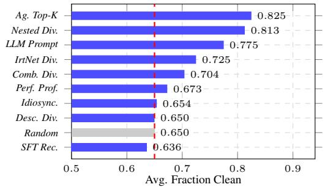  
Figure 2: Average fraction of clean models in selected teams across contamination levels and randomized injection trials. The red dashed line marks the Random baseline.

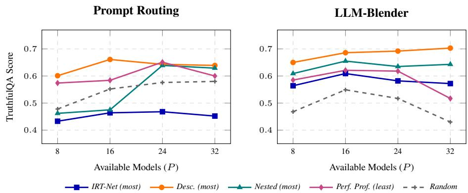  
Figure 3: Pool-size scaling on Pool 2. Expanding the uncurated pool without strict capability constraints causes team performance to saturate or even degrade.

under random selection.

Figure 2 reveals a contrast between methods that passively rely on indirect signals and those that explicitly evaluate model capability. Unanchored diversity-based selectors are particularly vulnerable. Semantic selectors like Description Diversity perform near a random baseline when model descriptions are misleading. A full round-by-round breakdown can be found in Appendix G.

In contrast, some selection methods equipped with explicit capability filters or agentic evaluation outperform the random baseline and are better equipped to avoid compromised candidates. Agentic Top-K achieves the highest clean-model fraction, consistent with its interactive interview process providing a stronger capability signal. Similarly, Nested first filters out lower-capability candidates before applying diversity-based selection, reducing the exposure of the downstream diversity search to malicious candidates. Overall, these results suggest that robustness benefits from selection in observed model behavior or capability, rather than relying solely on stated descriptions.

## 6.2 EFFECTS OF POOL-SIZE SCALING

To evaluate how selection strategies scale with candidate pool size, we vary the number of available models in Pool 2 as $P \in \{ 8 , 1 \bar { 6 } , 2 4 , 3 2 \}$ while fixing the selected team size to $n = 4$ . This setting allows us to examine how different selectors behave as the number of candidate collaborators increases. Figure 3 shows how collaborative performance changes as the candidate pool expands. Initially, increasing the pool from small $( P = { \bar { 8 } } )$ to moderately large $( P = 1 6 )$ helps some selection methods build stronger teams, suggesting that additional candidates provide useful opportunities for identifying complementary models. However, further expanding the pool $( P = 3 2 )$ yields diminishing or negative returns for several strategies. Semantic diversity methods tend to plateau, while some unconstrained approaches degrade at larger pool sizes, particularly LLM-Blender.

The pronounced drop of the Random baseline at $P = 3 2$ is consistent with the expanded pool containing substantially weaker candidates. Consequently, methods that prioritize diversity without accounting for baseline capability become susceptible to selecting these weak outliers into the team. Overall, these results suggest that simply scaling up the candidate pool is not sufficient to improve collaboration. As the pool expands, selection must balance diversity with candidate capability to avoid incorporating weak but superficially distinctive models.

## 6.3 EFFECTS OF POOL DIVERSITY SCALING

To isolate the effect of candidate diversity from pool size, we fix the pool at 32 candidate slots and the selected team size at $n = 4 .$ , while varying the number of distinct models k and the number of copies per model m: $( k , m ) \in \{ ( 4 , 8 ) , ( 8 , 4 ) , ( \bar { 1 } 6 , 2 ) , ( 3 2 , 1 ) \}$ . Here, we operationalize pool diversity by the number of distinct model identities while holding the total number of candidate slots fixed. We evaluate downstream performance on TruthfulQA. Figure 4 shows how collaborative performance changes as the number of distinct candidates increases.

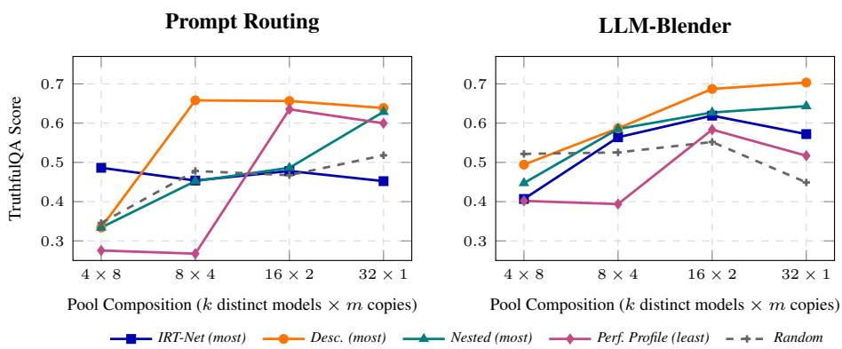  
Figure 4: Pool diversity scaling on Pool 2. Evaluating a 32-slot pool across varying compositions of k distinct models × m copies. Naive diversity (Desc.) saturates as k increases, while behavioral diversity (IRT-net) degrades at $3 2 \times 1$ , risking the inclusion of low-quality outliers.

For several selectors, replacing duplicate candidates with distinct models initially improves performance, but the gains tend to saturate as k increases. At the highest-diversity setting $( { \bar { 3 } } 2 \times 1 )$ , some selectors even degrade, indicating that greater distinctness does not necessarily translate into more useful team composition. Once the pool already covers a broad range of capabilities, additional distinct models may instead introduce weaker candidates. Overall, these results suggest that reducing redundancy can benefit collaboration, but maximizing distinctness alone is insufficient; effective selection must balance candidate diversity with capability.

## 6.4 DOES CAPABILITY-AWARE SELECTION GENERALIZE OUT-OF-DISTRIBUTION?

Table 3: OOD evaluation on Pool 2. The highest mean score in each column per pool is bolded.

The behavioral and learned selectors in Table 2 construct their selection signals from task-specific or auxiliary data. To examine whether these signals transfer to unseen task domains, we evaluate selected methods on Co-CoNot (safety) and GPQA-Diamond (graduatelevel science). we evaluate three learned behavioral selectors—IRT-Net, Idiosyncrasies, and SFT Classifier—on two unseen task domains. Performance Profile is excluded from this analysis because their construction suite includes GPQA-Diamond and CoCoNot (Table 3).

<table><tr><td colspan="3">CoCoNot</td><td colspan="2">GPQA-Diamond</td></tr><tr><td>Selector</td><td>Routing</td><td>Blender</td><td>Routing</td><td>Blender</td></tr><tr><td>Random</td><td> $4 4 . 3 { \scriptstyle \pm 6 . 9 }$ </td><td> $2 6 . 1 { \scriptstyle \pm 9 . 2 }$ </td><td> $2 2 . 4 { \pm } 2 . 3$ </td><td> $2 6 . 9 { \scriptstyle \pm 1 1 . 0 }$ </td></tr><tr><td>IRT-Net (most)</td><td> $3 8 . 6 { \scriptstyle \pm 3 . 0 }$ </td><td> $2 9 . 7 { \scriptstyle \pm 3 . 0 }$ </td><td> $1 9 . 2 { \scriptstyle \pm 7 . 5 }$ </td><td> $3 3 . 3 { \scriptstyle \pm 9 . 0 }$ </td></tr><tr><td>Idio. (most)</td><td> $4 5 . 3 { \scriptstyle \pm 3 . 0 }$ </td><td> $2 5 . 1 { \scriptstyle \pm 3 . 0 }$ </td><td> $1 7 . 2 { \scriptstyle \pm 7 . 5 }$ </td><td> $\mathbf { 4 0 . 4 } _ { \pm 9 . 5 }$ </td></tr><tr><td>SFT</td><td> $\mathbf { 4 8 . 6 } _ { \pm 3 . 0 }$ </td><td>33.1±3.0 28.3±9.0</td><td></td><td> $3 4 . 3 { \scriptstyle \pm 9 . 0 }$ </td></tr></table>

The SFT Classifier transfers consistently across the two unseen domains, outperforming Random in all four settings and achieving the highest mean performance in three of them. In contrast, representation-based behavioral signals show more scenario-dependent transfer: IRT-Net and Idiosyncrasies underperform Random in some Prompt Routing settings, while both improve over Random on GPQA-Diamond under LLM-Blender.

## 7 CONCLUSION

In this work, we formalized the problem of collaborator selection in multi-LLM systems and introduced a comprehensive taxonomy of selection strategies. Through extensive evaluation across diverse candidate pools, tasks, and collaboration mechanisms, we demonstrated that the composition of an LLM team is just as critical as the method by which they collaborate. Relying on blind random sampling or simplistic heuristics introduces severe variance and limits the potential of multiagent frameworks. Our findings highlight the importance of grounding selection in observed model capabilities rather than relying solely on model descriptions or simple heuristics. These principled strategies successfully scale with pool size, resist the inclusion of misaligned models, and generalize to novel task distributions. Ultimately, as the ecosystem of open-source models continues to expand, building effective collaborative AI systems will require shifting our focus from merely how models interact to who is hired for the job in the first place.

## AI USE STATEMENT

In this work, we used a generative AI tool to assist with drafting and editing manuscript text, and to help identify and verify citations for prior work discussed throughout the paper. We did not use generative AI tools to design the selection algorithms, collaboration methods, or experimental protocols presented in this work, nor to produce the underlying experimental results: all reported scores were obtained by running the described selection methods and MoCo collaboration methods on the stated benchmarks, independent of any AI tool.

All AI-assisted text was reviewed and edited by the authors, and all factual and numerical claims traceable to the underlying experimental data were checked against that data by the authors. We take responsibility for the final content of this work, including all text, claims, and artifacts produced with the aid of generative AI.

## ETHICS STATEMENT

This work does not involve human subjects; the “interview” procedure in Section I is an automated exchange between two language models and involves no human participants, data, or annotation.

The adversarial-model-detection study deliberately incorporates six models fine-tuned to be misaligned, drawn from the existing, published Among Us benchmark rather than newly created for this paper. These models are used strictly to test whether selection strategies can identify and exclude them from a collaborating team; they are not released, deployed, or used for any purpose beyond this detection benchmark, and no new misaligned model is introduced by this work.

All base models and benchmarks used in this work are obtained from publicly released, appropriately licensed sources, and we do not introduce new data collected from or about individuals. We are not aware of a direct harmful application of this work’s findings.

## REPRODUCIBILITY STATEMENT

All code, datasets, and experiment logs required to reproduce the reported results will be released at a repository upon publication.

## REFERENCES

Jacob Austin, Augustus Odena, Maxwell Nye, Maarten Bosma, Henryk Michalewski, David Dohan, Ellen Jiang, Carrie Cai, Michael Terry, Quoc Le, and Charles Sutton. Program synthesis with large language models, 2021. URL https://arxiv.org/abs/2108.07732.

Faeze Brahman, Sachin Kumar, Vidhisha Balachandran, Pradeep Dasigi, Valentina Pyatkin, Abhilasha Ravichander, Sarah Wiegreffe, Nouha Dziri, Khyathi Chandu, Jack Hessel, Yulia Tsvetkov, Noah A. Smith, Yejin Choi, and Hannaneh Hajishirzi. The art of saying no: Contextual noncompliance in language models. In The Thirty-eight Conference on Neural Information Processing Systems Datasets and Benchmarks Track, 2024. URL https://openreview.net/forum? id=f1UL4wNlw6.

Jianhao Chen, Chenxu Wang, Gengrui Zhang, Peng Ye, Lei Bai, Wei Hu, Yuzhong Qu, and Shuyue Hu. Learning compact representations of llm abilities via item response theory, 2025. URL https://arxiv.org/abs/2510.00844.

Mark Chen, Jerry Tworek, Heewoo Jun, Qiming Yuan, Henrique Ponde de Oliveira Pinto, Jared Kaplan, Harri Edwards, Yuri Burda, Nicholas Joseph, Greg Brockman, Alex Ray, Raul Puri, Gretchen Krueger, Michael Petrov, Heidy Khlaaf, Girish Sastry, Pamela Mishkin, Brooke Chan, Scott Gray, Nick Ryder, Mikhail Pavlov, Alethea Power, Lukasz Kaiser, Mohammad Bavarian, Clemens Winter, Philippe Tillet, Felipe Petroski Such, Dave Cummings, Matthias Plappert, Fotios Chantzis, Elizabeth Barnes, Ariel Herbert-Voss, William Hebgen Guss, Alex Nichol, Alex Paino, Nikolas Tezak, Jie Tang, Igor Babuschkin, Suchir Balaji, Shantanu Jain, William Saunders,

Christopher Hesse, Andrew N. Carr, Jan Leike, Josh Achiam, Vedant Misra, Evan Morikawa, Alec Radford, Matthew Knight, Miles Brundage, Mira Murati, Katie Mayer, Peter Welinder, Bob Mc-Grew, Dario Amodei, Sam McCandlish, Ilya Sutskever, and Wojciech Zaremba. Evaluating large language models trained on code, 2021. URL https://arxiv.org/abs/2107.03374.

Peter Clark, Isaac Cowhey, Oren Etzioni, Tushar Khot, Ashish Sabharwal, Carissa Schoenick, and Oyvind Tafjord. Think you have solved question answering? try arc, the ai2 reasoning challenge, 2018. URL https://arxiv.org/abs/1803.05457.

Karl Cobbe, Vineet Kosaraju, Mohammad Bavarian, Mark Chen, Heewoo Jun, Lukasz Kaiser, Matthias Plappert, Jerry Tworek, Jacob Hilton, Reiichiro Nakano, Christopher Hesse, and John Schulman. Training verifiers to solve math word problems, 2021. URL https://arxiv. org/abs/2110.14168.

Yilun Du, Shuang Li, Antonio Torralba, Joshua B. Tenenbaum, and Igor Mordatch. Improving factuality and reasoning in language models through multiagent debate. In Forty-first International Conference on Machine Learning, 2024. URL https://openreview.net/forum?id= zj7YuTE4t8.

Shangbin Feng, Yuyang Bai, Ziyuan Yang, Yike Wang, Zhaoxuan Tan, Jiajie Yan, Zhenyu Lei, Wenxuan Ding, Weijia Shi, Haojin Wang, et al. Moco: A one-stop shop for model collaboration research, 2026a. URL https://arxiv.org/abs/2601.21257.

Shangbin Feng, Wenxuan Ding, Alisa Liu, Zifeng Wang, Weijia Shi, Yike Wang, Shannon Zejiang Shen, Xiaochuang Han, Hunter Lang, Chen-Yu Lee, et al. When one llm drools, multi-llm collaboration rules. In Proceedings of the 64th Annual Meeting of the Association for Computational Linguistics (Volume 1: Long Papers), pp. 17048–17063, 2026b. URL https: //aclanthology.org/2026.acl-long.775/.

Shangbin Feng, Yike Wang, Weijia Shi, Luke Zettlemoyer, Yejin Choi, and Yulia Tsvetkov. Scaling participation in modular ai systems. 2026c. URL https://arxiv.org/abs/2606. 07812.

Aryo Pradipta Gema, Joshua Ong Jun Leang, Giwon Hong, Alessio Devoto, Alberto Carlo Maria Mancino, Rohit Saxena, Xuanli He, Yu Zhao, Xiaotang Du, Mohammad Reza Ghasemi Madani, Claire Barale, Robert McHardy, Joshua Harris, Jean Kaddour, Emile Van Krieken, and Pasquale Minervini. Are we done with MMLU? In Proceedings ofthe 2025 Conference ofthe Nations of the Americas Chapter ofthe Associationfor Computational Linguistics: Human Language Technologies (Volume 1: Long Papers), pp. 5069–5096, 2025. URL https://aclanthology. org/2025.naacl-long.262/.

Dan Hendrycks, Collin Burns, Saurav Kadavath, Akul Arora, Steven Basart, Eric Tang, Dawn Song, and Jacob Steinhardt. Measuring mathematical problem solving with the MATH dataset. In Thirty-fifth Conference on Neural Information Processing Systems Datasets and Benchmarks Track (Round 2), 2021. URL https://openreview.net/forum?id=7Bywt2mQsCe.

Dongfu Jiang, Xiang Ren, and Bill Yuchen Lin. LLM-blender: Ensembling large language models with pairwise comparison and generative fusion. In Proceedings of the 61st Annual Meeting of the Association for Computational Linguistics (Volume 1: Long Papers), pp. 14165–14178, July 2023. URL https://aclanthology.org/2023.acl-long.792/.

Yuru Jiang, Wenxuan Ding, Shangbin Feng, Greg Durrett, and Yulia Tsvetkov. Sparta alignment: Collectively aligning multiple language models through combat. In The Thirty-ninth Annual Conference on Neural Information Processing Systems, 2025. URL https://openreview. net/forum?id=nTfhNThKX2.

Di Jin, Eileen Pan, Nassim Oufattole, Wei-Hung Weng, Hanyi Fang, and Peter Szolovits. What disease does this patient have? A large-scale open domain question answering dataset from medical exams. Applied Sciences, 2021.

Ludmila I. Kuncheva and Christopher J. Whitaker. Measures of diversity in classifier ensembles and their relationship with the ensemble accuracy. Machine Learning, 51(2):181–207, 2003.

John P. Lalor, Hao Wu, and Hong Yu. Building an evaluation scale using item response theory. In Proceedings of the 2016 Conference on Empirical Methods in Natural Language Processing, pp. 648–657, 2016. URL https://aclanthology.org/D16-1062/.

Benjamin Laufer, Hamidah Oderinwale, and Jon Kleinberg. Anatomy of a machine learning ecosystem: 2 million models on Hugging Face, 2025. URL https://arxiv.org/abs/2508. 06811.

Ziyu Li, Hilco van der Wilk, Danning Zhan, Megha Khosla, Alessandro Bozzon, and Rihan Hai. Model selection with model zoo via graph learning. In 2024 IEEE 40th International Conference on Data Engineering (ICDE), pp. 1296–1309, 2024.

Percy Liang, Rishi Bommasani, Tony Lee, et al. Holistic evaluation of language models, 2023. URL https://arxiv.org/abs/2211.09110.

Tian Liang, Zhiwei He, Wenxiang Jiao, Xing Wang, Yan Wang, Rui Wang, Yujiu Yang, Zhaopeng Tu, and Shuming Shi. Encouraging divergent thinking in large language models through multiagent debate. In Proceedings of the 2024 Conference on Empirical Methods in Natural Language Processing, pp. 17889–17904, 2024. URL https://aclanthology.org/2024. emnlp-main.992/.

Stephanie Lin, Jacob Hilton, and Owain Evans. TruthfulQA: Measuring how models mimic human falsehoods. In Proceedings of the 60th Annual Meeting of the Association for Computational Linguistics (Volume 1: Long Papers), pp. 3214–3252, 2022. URL https://aclanthology. org/2022.acl-long.229/.

Alex Mallen, Akari Asai, Victor Zhong, Rajarshi Das, Daniel Khashabi, and Hannaneh Hajishirzi. When not to trust language models: Investigating effectiveness of parametric and non-parametric memories. In Proceedings of the 61st Annual Meeting of the Association for Computational Linguistics (Volume 1: Long Papers), pp. 9802–9822, 2023. doi: 10.18653/v1/2023.acl-long.546. URL https://aclanthology.org/2023.acl-long.546/.

Margaret Mitchell, Simone Wu, Andrew Zaldivar, Parker Barnes, Lucy Vasserman, Ben Hutchinson, Elena Spitzer, Inioluwa Deborah Raji, and Timnit Gebru. Model cards for model reporting. In Proceedings of the Conference on Fairness, Accountability, and Transparency (FAT\*), pp. 220–229, 2019. URL https://doi.org/10.1145/3287560.3287596.

Isaac Ong, Amjad Almahairi, Vincent Wu, Wei-Lin Chiang, Tianhao Wu, Joseph E. Gonzalez, M Waleed Kadous, and Ion Stoica. RouteLLM: Learning to route LLMs from preference data. In The Thirteenth International Conference on Learning Representations (ICLR), 2025. URL https://openreview.net/forum?id=8sSqNntaMr.

Qwen Team. Qwen2.5 technical report. arXiv preprint arXiv:2412.15115, 2024.

David Rein, Betty Li Hou, Asa Cooper Stickland, Jackson Petty, Richard Yuanzhe Pang, Julien Dirani, Julian Michael, and Samuel R. Bowman. GPQA: A graduate-level google-proof q&a benchmark. In First Conference on Language Modeling, 2024. URL https://openreview. net/forum?id=Ti67584b98.

Huascar Sanchez and Briland Hitaj. Llm chemistry estimation for multi-llm recommendation, 2025. URL https://arxiv.org/abs/2510.03930.

Mingjie Sun, Yida Yin, Zhiqiu Xu, J Zico Kolter, and Zhuang Liu. Idiosyncrasies in large language models. In Forty-second International Conference on Machine Learning, 2025. URL https: //openreview.net/forum?id=FCZ3jVzmTZ.

Mirac Suzgun, Nathan Scales, Nathanael Scharli, Sebastian Gehrmann, Yi Tay, Hyung Won Chung,¨ Aakanksha Chowdhery, Quoc Le, Ed Chi, Denny Zhou, and Jason Wei. Challenging BIG-bench tasks and whether chain-of-thought can solve them. In Findings of the Association for Computational Linguistics: ACL 2023, pp. 13003–13051. Association for Computational Linguistics, 2023. URL https://aclanthology.org/2023.findings-acl.824/.

Thomas Wolf, Lysandre Debut, Victor Sanh, Julien Chaumond, Clement Delangue, Anthony Moi, Pierric Cistac, Tim Rault, Remi Louf, Morgan Funtowicz, et al. Transformers: State-of-the-´ art natural language processing. In Proceedings of the 2020 conference on empirical methods in natural language processing: system demonstrations, pp. 38–45, 2020. URL https:// aclanthology.org/2020.emnlp-demos.6/.

Prateek Yadav, Derek Tam, Leshem Choshen, Colin Raffel, and Mohit Bansal. TIES-merging: Resolving interference when merging models. In Thirty-seventh Conference on Neural Information Processing Systems, 2023. URL https://openreview.net/forum?id=xtaX3WyCj1.

Ziyuan Yang, Wenxuan Ding, Shangbin Feng, and Yulia Tsvetkov. Among us: Measuring and mitigating malicious contributions in model collaboration systems. In Proceedings of the 64th Annual Meeting of the Association for Computational Linguistics (Volume 1: Long Papers), pp. 15969–15988, 2026. URL https://aclanthology.org/2026.acl-long.725/.

Le Yu, Bowen Yu, Haiyang Yu, Fei Huang, and Yongbin Li. Language models are super mario: Absorbing abilities from homologous models as a free lunch. In Forty-first International Conference on Machine Learning, 2024. URL https://openreview.net/forum?id= fq0NaiU8Ex.

Kexun Zhang, Weiran Yao, Zuxin Liu, Yihao Feng, Zhiwei Liu, Rithesh R N, Tian Lan, Lei Li, Renze Lou, Jiacheng Xu, Bo Pang, Yingbo Zhou, Shelby Heinecke, Silvio Savarese, Huan Wang, and Caiming Xiong. Diversity empowers intelligence: Integrating expertise of software engineer ing agents. In The Thirteenth International Conference on Learning Representations, 2025. URL https://openreview.net/forum?id=cKlzKs3Nnb.

Justin Zhao, Flor Miriam Plaza-del Arco, Benjamin Genchel, and Amanda Cercas Curry. Language model council: Democratically benchmarking foundation models on highly subjective tasks. In Proceedings of the 2025 Conference of the Nations of the Americas Chapter of the Association for Computational Linguistics: Human Language Technologies (Volume 1: Long Papers), pp. 12395–12450, 2025. URL https://aclanthology.org/2025.naacl-long.617/.

Lianmin Zheng, Wei-Lin Chiang, Ying Sheng, Siyuan Zhuang, Zhanghao Wu, Yonghao Zhuang, Zi Lin, Zhuohan Li, Dacheng Li, Eric P. Xing, Hao Zhang, Joseph E. Gonzalez, and Ion Stoica. Judging LLM-as-a-judge with MT-bench and chatbot arena. In Thirty-seventh Conference on Neural Information Processing Systems Datasets and Benchmarks Track, 2023. URL https: //openreview.net/forum?id=uccHPGDlao.

## A LIMITATIONS

While principled team selection improves multi-LLM systems, several limitations remain.

Computational overhead. Exact dispersion search scales combinatorially (<sup>P</sup>), becoming intractable for large pools or teams. While greedy approximations and LLM-based recruiters accelerate inference, their upfront signal-generation costs remain high: IRT and idiosyncrasies classifiers require evaluating every candidate on full proxy datasets, and AGENTIC TOP-k requires multi-turn interviews per member.

Decoupled selection and collaboration. We treat downstream collaboration mechanisms as fixed black boxes using default configurations. We do not jointly optimize the selection algorithm and the collaboration mechanism (e.g., co-training the SFT Classifier alongside DARE-TIES scaling weights).

Model scale. We evaluate open-weight models up to 14B parameters. Collaboration dynamics may shift significantly with frontier-class models (70B+ or closed APIs), which might exhibit less behavioral dispersion or unlock novel synergistic benefits during refinement that smaller pools cannot capture.

## B DESIGN CHOICE: MAX-MIN VS. AVERAGE DISPERSION

Algorithmic Difference. Algorithm 1 prioritizes max-min dispersion: it evaluates a team by its maximum pairwise similarity and breaks ties using average pairwise similarity. Conversely, average dispersion optimizes avgSim as the primary objective and uses maxSim as the tie-breaker.

Performance Comparison. In a head-to-head evaluation across 16 settings (Table 4), 7 generated identical teams where minor score variations resulted solely from generation sampling noise. Across the 9 settings where the objectives selected different teams, average dispersion won slightly more frequently (5 vs. 4) by small margins (≤ 0.101). However, max-min achieved the two largest performance gains. Thus, max-min trades negligible typical-case margins for vital worst-case protection against severe performance collapses in redundant candidate pools.

Rationale for Max-Min. We select max-min primary dispersion because a team’s functional complementarity is bottlenecked by its most redundant pair; optimizing average similarity allows nearduplicate models as long as other pairs are highly distinct. Max-min acts as a robust worst-case safeguard against severe performance degradation, while using average similarity as a tie-breaker preserves overall team structure.

Algorithm 3: Exact Max-Min Diversity Search (Algorithm 1, repeated for comparison)   
Require: sim $\overline { { \in \mathbb { R } ^ { P \times P } } }$ , team size n, mode ∈ {MOST, LEAST}   
1: $\overline { { T ^ { \star } } }  \emptyset$   
2: for each $T \subseteq \{ 1 , \dots , P \}$ with |T| = n do   
3: maxSim(T) ← max<sub>i,j∈T</sub> sim(i, j)   
4: avgSim(T) ← mean<sub>i,j∈T</sub> sim(i, j)   
5: if mode = MOST and (maxSim(T), avgSim(T)) lex. smaller than incumbent then   
6: T<sup>⋆</sup> ← T   
7: else if mode = LEAST and (maxSim(T), avgSim(T)) lex. larger than incumbent then   
8: $T ^ { \star } \gets T$   
9: end if   
10: end for   
11: return T<sup>⋆</sup>

Algorithm 4: Exact Average-Similarity Diversity Search   
Require: sim $\overline { { \in \mathbb { R } ^ { P \times P } } }$ , team size n, mode ∈ {MOST, LEAST}   
1: $\bar { T } ^ { \star }  \emptyset$   
2: for each $T \subseteq \{ 1 , \dots , P \}$ with |T| = n do   
3: avgSim(T) ← mean<sub>i,j∈T</sub> sim(i, j)   
4: maxSim(T) ← max<sub>i,j∈T</sub> sim(i, j)   
5: if mode = MOST and (avgSim(T), maxSim(T)) lex. smaller than incumbent then   
6: $T ^ { \star } \gets T$   
7: else if mode = LEAST and (avgSim(T), maxSim(T)) lex. larger than incumbent then   
8: $T ^ { \star } \gets T$   
9: end if   
10: end for   
11: return T<sup>⋆</sup>

## C ADDITIONAL SELECTION METHOD DETAILS

LLM Prompt. The LLM-prompt recruiter directly selects a team from candidate model descriptions. Given the descriptions $\mathcal { Z } = \{ \operatorname* { d e s c } ( m _ { i } ) \} _ { i = 1 } ^ { P }$ and the target team size n, we prompt an LLM recruiter with the full candidate pool and ask it to select n models that would form an effective collaborative team. The recruiter is instructed to consider both individual capabilities and potential complementarity among team members, and returns the selected model identifiers directly. We provide the full prompt in Appendix H.

Table 4: Max-min vs. average dispersion score comparison. Tasks are evaluated using LLM-Blender on TruthfulQA. Higher scores per setting are in bold.
<table><tr><td></td><td></td><td colspan="2">Pool 1</td><td colspan="2">Pool 2</td></tr><tr><td>Category</td><td>Direction</td><td>Max-Min</td><td>Average</td><td>Max-Min</td><td>Average</td></tr><tr><td rowspan="2">Stated Diversity</td><td>Most</td><td>0.621</td><td>0.606</td><td>0.703</td><td>0.697</td></tr><tr><td>Least</td><td>0.491</td><td>0.488</td><td>0.559</td><td>0.332</td></tr><tr><td rowspan="2">Combined</td><td>Most</td><td>0.569</td><td>0.592</td><td>0.336</td><td>0.428</td></tr><tr><td>Least</td><td>0.584</td><td>0.574</td><td>0.530</td><td>0.209</td></tr><tr><td rowspan="2">Nested</td><td>Most</td><td>0.551</td><td>0.580</td><td>0.643</td><td>0.541</td></tr><tr><td>Least</td><td>0.551</td><td>0.575</td><td>0.501</td><td>0.499</td></tr><tr><td rowspan="2">Perf. Profile</td><td>Most</td><td>0.506</td><td>0.494</td><td>0.452</td><td>0.514</td></tr><tr><td>Least</td><td>0.587</td><td>0.571</td><td>0.517</td><td>0.618</td></tr></table>

SFT Classifier. The SFT Classifier predicts the collaborative performance of a candidate team directly from its member descriptions. Given a candidate team $T = \{ m _ { i _ { 1 } } , \dots , m _ { i _ { n } } \}$ , we concatenate the descriptions of its members and use a learned scorer $f _ { \phi }$ to produce a predicted team score,

$$
\hat { y } _ { T } = f _ { \phi } \big ( \operatorname { d e s c } ( m _ { i _ { 1 } } ) , \dots , \operatorname { d e s c } ( m _ { i _ { n } } ) \big ) .
$$

Training targets are obtained by executing sampled teams under the collaboration methods and recording their downstream performance. At inference time, the scorer evaluates each candidate team of size $n ,$ and teams are ranked by their predicted scores for selection.

Agentic top-k. The agentic recruiter evaluates candidates individually through adaptive multiturn interviews. For each candidate $m _ { i } .$ , an LLM interviewer iteratively selects a capability axis and generates a question conditioned on the interview history. After turns, the complete transcript is evaluated to obtain an initial interview score. Because independently assigned scores tend to be compressed, we subsequently perform comparative re-scoring by presenting multiple anonymized candidate transcripts jointly to the interviewer. This produces the selection signal

$$
\mathcal { Z } = \{ q _ { i } \} _ { i = 1 } ^ { P } ,
$$

where $q _ { i }$ denotes the calibrated interview score of candidate $m _ { i } .$ Candidates are then ranked by $q _ { i } .$ and the top n candidates form the selected team. The full interview and scoring protocol is provided in Appendix I.

## D ADDITIONAL CANDIDATE POOLS DETAILS

In our experiment, Pool 1 contains 10 Qwen2.5-7B models that share the same backbone but differ in their fine-tuning corpora, providing a controlled setting in which model variation primarily reflects post-training data. Pool 2 contains 32 models spanning diverse source architectures, scales, training objectives, and corpora, providing a substantially more heterogeneous candidate pool.

Table 9 lists all 10 Pool 1 models; Table 10 lists all 32 Pool 2 models. For Pool 2, size is the parameter count of the original contributed model each checkpoint was distilled from and it is used by the Top-size baseline. Every deployed Pool-2 checkpoint is itself a uniform Qwen2.5-7B distillation regardless of this value. Two sizes (parti 6, parti 21) and two base architectures (parti 6, parti 15) were not stated in the original repository name and were confirmed against the corresponding Hugging Face model card; where a base architecture could not be confirmed from either source, we mark it “unspecified” rather than assume one. “ID” links the deployed distilled checkpoint; “Original source” links the pre-distillation contributed model.

## E ADDITIONAL DATA DETAILS

We use four groups of datasets for distinct experimental purposes: main collaboration evaluation, training the SFT Classifier, constructing model performance profiles, and out-of-distribution (OOD) evaluation. Tables 5, 6, 7, and 8 summarize the datasets used for each role.

The main collaboration datasets are summarized in Table 5. Each dataset is split into disjoint development and test sets, with all final collaborative performance reported on the test set. The development set is used only to construct selection signals for methods that require task-specific behavioral information. Specifically, Top solo score ranks candidate models by their individual performance on the development set, while Idiosyncrasies and IRT construct their behavioral signals from model responses on the development set. The selected teams are then evaluated exclusively on the held-out test set. None of the selectors evaluated in the OOD experiment uses GPQA-Diamond or CoCoNot to construct its selection signal.

The three main evaluation datasets are disjoint from the auxiliary datasets used for SFT training and performance profiling. For training the SFT-Recruiter, we use BBH, MMLU-Redux, and HumanEval. For constructing Performance Profile, we use a separate suite of held-out benchmarks: ARC-Challenge, BBH, MMLU-Redux, GPQA-Diamond, MATH, MedQA, PopQA, HumanEval, CoCoNot, and Human-Interest. For OOD evaluation, we use GPQA-Diamond and CoCoNot.

## F ADDITIONAL EXPERIMENTAL DETAILS

## F.1 COLLABORATION METHOD CONFIGURATIONS

For Prompt routing, each query is routed according to the descriptions of the team members. Multiagent refine performs three refinement rounds. For Weight merging, we use DARE-TIES with Qwen2.5-7B-Instruct as the backbone and average as the merging mode. For LLM-Blender, we use Qwen2.5-7B-Instruct as the backbone, set top-k to 3, and use the first team member as the fuser.

## F.2 SELECTION METHOD CONFIGURATIONS

Idiosyncrasies. We use all-mpnet-base-v2 with full fine-tuning, mean pooling, and a linear classification head. We train the classifier for 5 epochs with batch size 32, learning rate $2 \times 1 0 ^ { - 4 }$ AdamW, and a cosine learning-rate schedule. We fit the Idiosyncrasies classifier using item-level outcomes from the development split of each main evaluation dataset.

IRT Ability. We learn a 232-dimensional ability embedding for each model using a 12-expert dense MoE (4× the number of datasets) over a frozen 768-dimensional query encoder. The model is trained for 50 epochs with batch size 256, learning rate $1 0 ^ { - 3 }$ , Adam, a cosine learning-rate schedule, binary cross-entropy loss, and embedding weight decay of 0.1. We fit the IRT model using item-level success/failure outcomes from the development split of each main evaluation dataset.

SFT Classifier. We fine-tune Qwen2.5-7B-Instruct with LoRA $( r = 1 6 , \alpha = 3 2$ , dropout 0.05, targeting the $\{ q , k , v , o \}$ projections) and a sequence-classification head with sigmoid output. We train for 40 epochs with batch size 4, learning rate $1 0 ^ { - 4 }$ , and MSE loss, using 6-fold group cross-validation by team identity. At inference time, the scorer evaluates all ${ \binom { 1 0 } { 4 } } = 2 1 0$ candidate teams in Pool 1. For Pool 2, it evaluates all $( _ { 4 } ^ { 3 2 } ) = 3 5 , 9 6 0$ teams, constituting an out-of-distribution transfer setting relative to Pool 1.

Agentic top-k. We use Qwen2.5-7B-Instruct as the interviewer. Each candidate undergoes a four-turn adaptive interview covering five axes: reasoning, code, factual knowledge, calibrated honesty, and open-ended conversational quality. Interviewer questions and verdicts use greedy decoding, while candidate responses are sampled with temperature 0.7 and top-p 0.9. Initial independent ratings on a 1–10 scale are followed by comparative re-scoring using anonymized batches of up to 10 candidates. For Pool 2, whose 32 candidates exceed the single-batch limit, scores are averaged over three independently re-batched comparative rounds, with residual ties resolved by a final strict-ranking pass. Full interview prompts and scoring details are provided in Appendix I.

## F.3 COMPUTE AND IMPLEMENTATION

All experiments run on a mixture of NVIDIA A40, A100, and L40S GPUs with bfloat16 precision. Collaboration methods execute through MoCo (Feng et al., 2026a), installed unmodified from its published release and used strictly as a black box. Selection methods are imple-

mented in PyTorch and HuggingFace Transformers, utilizing PEFT for LoRA adapters and the sentence-transformers library for embedding backbones.

Table 5: Main evaluation datasets
<table><tr><td>Dataset</td><td>Task type</td><td>Dev set size</td><td>Test set size</td></tr><tr><td>GSM8K (Cobbe et al., 2021)</td><td>exact match</td><td>200</td><td>1000</td></tr><tr><td>TruthfulQA (Lin et al., 2022)</td><td>multiple choice</td><td>200</td><td>617</td></tr><tr><td>MBPP (Austin et al., 2021)</td><td>coding</td><td>487</td><td>487</td></tr></table>

Table 6: Datasets used to train the SFT Classifier.
<table><tr><td>Dataset</td><td>Task type</td><td>Note</td></tr><tr><td>BBH_tiny (Suzgun et al., 2023)</td><td>exact match</td><td>150-question random sample of BBH</td></tr><tr><td>MMLU_Redux_tiny (Gema et al., 2025)</td><td>multiple choice</td><td>150-question random sample of MMLU-Redux</td></tr><tr><td>HumanEval (Chen et al., 2021)</td><td>coding</td><td>114-question sample of HumanEval</td></tr></table>

Table 7: Datasets used to build the performance-profile signal.
<table><tr><td>Dataset</td><td>Task type</td><td>Size</td></tr><tr><td>ARC-Challenge (Clark et al., 2018)</td><td>multiple choice</td><td>1,172</td></tr><tr><td>BBH (Suzgun et al., 2023)</td><td>exact match</td><td>1,000</td></tr><tr><td>MMLU-Redux (Gema et al., 2025)</td><td>multiple choice</td><td>1,000</td></tr><tr><td>GPQA-Diamond (Rein et al., 2024)</td><td>multiple choice</td><td>99</td></tr><tr><td>MATH (Hendrycks et al., 2021)</td><td>exact match</td><td>956</td></tr><tr><td>MedQA (Jin et al., 2021)</td><td>multiple choice</td><td>637</td></tr><tr><td>PopQA (Mallen et al., 2023)</td><td>F1 match</td><td>1,000</td></tr><tr><td>HumanEval (Chen et al., 2021)</td><td>coding</td><td>114</td></tr><tr><td>CoCoNot (Brahman et al., 2024)</td><td>refusal judgment</td><td>1,000</td></tr><tr><td>Human-interest (Feng et al., 2026a;b)</td><td>reward-model score</td><td>400</td></tr></table>

## G ROUND-BY-ROUND MALICIOUS MODEL DETECTION

Figure 5 provides the detailed, round-by-round trajectory for every selection method as the number of malicious models in the 10-candidate pool increases from 1 to 6.

## H LLM-PROMPT TEMPLATE

For the LLM-prompt selection method in Family V, we query the instruction-tuned judge to elicit a team-level judgment in a single shot. The exact prompt template provided to the model is shown below. Variables such as the total pool size ({P}), the enumerated candidate list ({LIST OF MODELS}), and the target team size ({N}) are populated dynamically per experiment.

You are selecting models to collaborate on a task.   
Below is a pool of {P} candidate models, each   
described by its fine-tuning specialty:   
{LIST OF MODELS}   
Select exactly {N} models from the list above that   
would work well together as a collaborating team ---   
consider both individual strengths and complementary   
diversity between them.   
Respond with ONLY a comma-separated list of the chosen   
indices, and nothing else. Do not explain your

Table 8: Datasets used in the out-of-distribution generalization experiment.
<table><tr><td>Dataset</td><td>Task type</td><td>Size</td></tr><tr><td>GPQA-Diamond (Rein et al., 2024)</td><td>multiple choice</td><td>99</td></tr><tr><td>CoCoNot (Brahman et al., 2024)</td><td>refusāl judgment</td><td>1,000</td></tr></table>

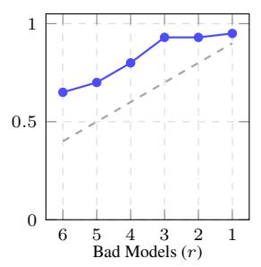  
4. IrtNet Diverse

2. Nested Diverse  
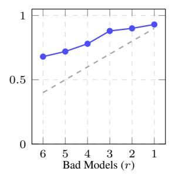

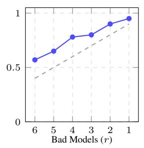  
6. Performance Profile

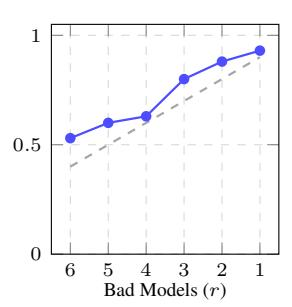

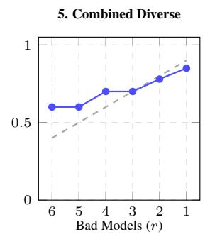

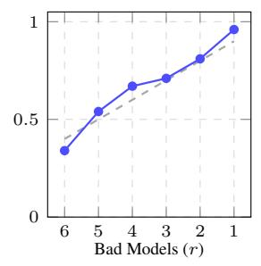

7. Idiosyncrasies  
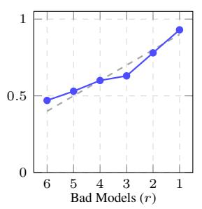

9. SFT Classifier  
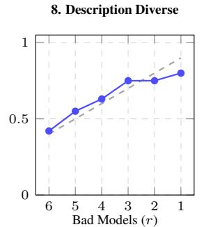

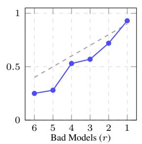  
Figure 5: Round-by-round robustness of every selection method against the theoretical Random baseline (dashed gray line). The y-axis is the fraction of clean models in the final selected team, and the x-axis shows the number of malicious models in the 10-candidate pool. Methods that fall below the dashed line are actively selecting malicious models at a higher rate than blind chance.

reasoning. Do not repeat an index. Example format   
for selecting 3 models: 2, 5, 7

The enumerated {LIST OF MODELS} is formatted as a newline-separated list, where each line consists of the candidate’s integer index and its one-line natural language description (e.g., 0: [Description of model 0]). To ensure the selector’s outputs are perfectly reproducible, the prompt is evaluated using greedy decoding.

## I AGENTIC INTERVIEW PROTOCOL

Here is the full protocol behind the AGENTIC TOP-k selector (Section 3, Family V), including how questions are generated and how the initial verdict is produced and corrected.

## I.1 TURN-BY-TURN QUESTION GENERATION

The interviewer (Qwen2.5-7B-Instruct) conducts a fixed four-turn interview with each candidate independently. Each turn, it is shown the transcript so far and asked to pick one of five axes not yet covered (step-by-step reasoning, code/programming ability, factual knowledge, calibrated honesty, open-ended conversational quality) and pose one new question probing it, under the following instruction (reproduced verbatim, with dynamic slots in angle brackets):

You are interviewing a candidate AI model to decide whether   
to hire it onto a collaborative team. Interview so far:   
⟨transcript so far⟩. Candidate axes to probe across the whole   
interview: ⟨axis list⟩. Axes already covered so far: ⟨·⟩.   
Axes NOT yet covered: ⟨·⟩. Pick ONE axis from the NOT   
yet covered list above and ask exactly ONE new question   
that probes it. This candidate is likely a competent   
instruction-tuned model, so a generic ‘‘explain concept   
X’’ or ‘‘describe a time you did Y’’ question will get   
a generically good answer from almost any such model and   
won’t tell us anything useful. Instead, design the question   
to actively expose a gap or error if one exists: give it   
a subtly flawed premise to catch, a genuine edge case, a   
problem with a specific checkable right answer, or a request   
that tempts an overconfident wrong answer instead of an   
honest ‘‘I don’t know.’’ Respond in EXACTLY this format,   
nothing else: AXIS: ⟨axis name⟩ QUESTION: ⟨the question⟩

The interviewer generates both the axis choice and the question greedily (temperature 0, for reproducibility); the candidate then answers as part of a genuine multi-turn conversation (full history carried forward each turn), sampled at temperature 0.7, top-p 0.9, up to 512 new tokens. Axis and question are parsed from an AXIS: ... QUESTION: ... format.

## I.2 INITIAL VERDICT

After four turns, the interviewer reads the complete transcript and issues a verdict under an explicit rubric:

Rate this candidate’s overall quality as a hire on a scale   
of 1-10. Most instruction-tuned models can produce fluent,   
well-structured answers. Do not reward fluency or length   
by itself. Grade strictly against these bands, anchored   
on correctness and depth relative to what a knowledgeable   
human expert would say: 9-10: Answers are technically   
flawless, catch subtleties or edge cases a generic competent   
model would miss, and any claimed uncertainty is honest and

warranted. 7-8: Answers are correct and well-organized   
but stay at a generic, textbook level. 5-6: At least one   
answer has a real inaccuracy, an unsupported claim stated   
with false confidence, or misses the point of the question.   
3-4: Multiple answers are wrong, evasive, or fail to engage   
with what was actually asked. 1-2: Answers are incoherent,   
largely incorrect, or the candidate asserts obviously false   
claims confidently.

The verdict is parsed strictly as (SCORE: <1--10> / REASON: <...>).

## I.3 CORRECTING FOR SCORE COMPRESSION

Independent, per-candidate verdicts compress toward a lenient, narrow band in practice: on Pool 1, all ten candidates initially scored 9 or 9.5 out of 10 despite visibly different answer quality, even after the rubric-anchoring above. We correct this with a comparative re-scoring pass: batches of up to 10 candidates’ full transcripts are shown to the interviewer side-by-side, anonymized as Candidate A/B/C/. . . , under an instruction that explicitly forbids defaulting to identical scores:

Compare them against each other directly --- do not score   
each one in isolation. [...] Critically: you MUST   
differentiate between candidates whose answers differ in   
correctness, depth, or honesty about uncertainty. Giving   
multiple candidates the identical score is only acceptable   
if their answers are genuinely indistinguishable in   
quality --- re-read the transcripts and look for a concrete   
difference (a missed edge case, an unsupported claim, more   
precise reasoning) before doing so.

This is the score actually used by AGENTIC TOP-k; the initial per-candidate verdict above is only a Phase-1 draft.

## I.4 TIE-BREAK REFINEMENT

If, after averaging, multiple candidates still land on the exact same score, a final pass forces a strict ranking within each tied group (no two candidates may share a rank) and spreads that group’s score upward into a fractional span according to rank, capped strictly below both the next distinct score already present in the data and the scale’s ceiling of 10. This ensures no two final scores can collide, and no spread can push a score out of range.

Table 9: Pool 1: 10 Qwen2.5-7B checkpoints, differing only in fine-tuning corpus
<table><tr><td>Variant</td><td>Specialization</td></tr><tr><td>yuru_qw_code_alpaca</td><td>Code generation and programming tasks</td></tr><tr><td>yuru_qw_cot</td><td>Chain-of-thought, step-by-step reasoning</td></tr><tr><td>yuru_qw_flan_v2</td><td>Diverse instruction-following across task types</td></tr><tr><td>yuru_qw_gemini_alpaca</td><td>General-purpose instruction-following</td></tr><tr><td>yuru_qw_lima</td><td>High-quality, concise, well-aligned responses</td></tr><tr><td>yuru_qw_oasst1</td><td>Open-ended assistant-style conversation</td></tr><tr><td>yuru_qw_open_orca</td><td>Complex reasoning and detailed explanations</td></tr><tr><td>yuru_qw_science</td><td>Scientific knowledge and STEM reasoning</td></tr><tr><td>yuru_qw_sharegpt</td><td>Conversational, general-purpose</td></tr><tr><td>yuru_qw_wizardlm</td><td>Complex, multi-step instruction-following</td></tr></table>

Table 10: Pool 2: 32 models distilled from independently contributed systems. Base architecture is read from the original repository name where stated; “unspecified” means neither the name nor the source paper states it, and we did not assume one.
<table><tr><td>ID</td><td>Original source</td><td>Size (B)</td><td>Specialization</td></tr><tr><td>parti_0</td><td>chtmp223/Qwen2.5-7B-CLIPPER</td><td>7 (Qwen2.5)</td><td>Narrative claim verification against full book text</td></tr><tr><td>parti_1</td><td>chengq9/ToolRL-Qwen2.5-3B</td><td>3 (Qwen2.5)</td><td>RL-trained for tool use and parameter filling</td></tr><tr><td>parti_2</td><td>AgentFlow/agentflow-planner-7b</td><td>7 (unspecified)</td><td>Online agent planning via Flow-GRPO</td></tr><tr><td>parti_3</td><td>nanami/ladder-last16L-llama3. 1-8b-instruct-sft</td><td>8 (Llama-3.1)</td><td>Efficient transformer architecture research</td></tr><tr><td>parti_4</td><td>viswavi/qwen2.5-rlcf</td><td>7 (Qwen2.5)</td><td>Instruction-following via preference tuning on WildChecklists</td></tr><tr><td>parti_5</td><td>milli19/promptmii-llama3. 1-8b-instruct</td><td>8 (Llama-3.1)</td><td>RL-trained to induce instructions</td></tr><tr><td>parti_6</td><td>Zhengping/ conditional-probability-regression</td><td>15 (Qwen2.5)</td><td>Conditional-probability estimation in everyday scenarios</td></tr><tr><td>parti_7</td><td>yale-nlp/</td><td>7 (Qwen2)</td><td>Multi-document QA, summarization,</td></tr><tr><td>parti_8</td><td>MDCure-Qwen2-7B-Instruct GritLM/GritLM-7B</td><td>7 (unspecified)</td><td>coreference resolution Joint generative and embedding</td></tr><tr><td>parti_9</td><td>lime-nlp/Qwen2. 5-7B-Instruct-SUM10</td><td>7 (Qwen2.5)</td><td>representation model Uncertainty-aware abstention</td></tr><tr><td>parti_10</td><td>geyang627/</td><td>9 (Gemma-2)</td><td>Chinese cultural awareness (CARE</td></tr><tr><td>parti_11</td><td>care-chinese-gemma2-9b bespokelabs/Bespoke-Stratos-7B</td><td>7 (unspecified)</td><td>dataset) Hallucination detection</td></tr><tr><td>parti_12</td><td>kangdawei/Llama-3. 1-8B-Instruct-GenderNeutral-Finetuned</td><td>8 (Llama-3.1)</td><td>Gender-bias mitigation</td></tr><tr><td>parti_13</td><td>DeepRetrieval/ DeepRetrieval-PubMed-3B-Llama</td><td>3 (Llama)</td><td>Query rewriting for retrieval (BM25 / search engines)</td></tr><tr><td>parti_14</td><td>yale-nlp/MDCure-Qwen2-1. 5B-Instruct</td><td>1.5 (Qwen2)</td><td>Multi-document tasks, robust cross-domain generalization</td></tr><tr><td>parti_15</td><td>Zhaoxuan/PUGC-Mistral-DPC</td><td>7 (Mistral)</td><td>Preference alignment on user-generated content via DPO</td></tr><tr><td>parti_16</td><td>jwhj/Qwen2.5-Math-1.5B-OREO</td><td>1.5 (Qwen2.5)</td><td>Math reasoning via offline reasoning optimization</td></tr><tr><td>parti_17</td><td>PeterJinGo/SearchR1-nq hotpotqa_train-qwen2.</td><td>7 (Qwen2.5)</td><td>Agentic search via PPO reinforcement learning</td></tr><tr><td>parti_18</td><td>5-7b-em-ppo gasolsun/DynamicRAG-8B</td><td>8 (unspecified)</td><td>Dynamic reranking agent for retrieved</td></tr><tr><td>parti_19</td><td>LLM360/guru-7B</td><td>7 (unspecified)</td><td>documents General reasoning (GURU dataset)</td></tr><tr><td>parti_20</td><td>spiral-rl/Spiral-Qwen3-4B</td><td>4 (Qwen3)</td><td>Multi-agent self-play (Poker, Tic-Tac-Toe) transferring to math/logic</td></tr><tr><td>parti_21</td><td>uclanlp/brief-pro</td><td>4 (Llama-3.2)</td><td>Lightweight evidence compressor for in-context RAG</td></tr><tr><td>parti_22</td><td>Rakancorle1/PolicyGuard4B</td><td>4 (unspecified)</td><td>Guardrail detecting policy violations in</td></tr><tr><td>parti_23</td><td>ReasoningTransferability/ UniReason-Qwen3-14B-RL</td><td>14 (Qwen3)</td><td>web-agent trajectories RL-GRPO math reasoning; transferability</td></tr><tr><td>parti_24</td><td>ypwang61/One-Shot-RLVR-Qwen2. 5-Math-1.5B-pi1</td><td>1.5 (Qwen2.5)</td><td>to general language tasks One-example RLVR training, overfitting</td></tr><tr><td>parti_25</td><td>sunblaze-ucb/Qwen2.</td><td>3 (Qwen2.5)</td><td>robustness Self-certainty reward (RLIF) on MATH</td></tr><tr><td>parti_26</td><td>5-3B-Intuitor-MATH-1EPOCH yale-nlp/Qwen3-8B-SciLit-01</td><td>8 (Qwen3)</td><td>Scientific and STEM reasoning</td></tr><tr><td>parti_27</td><td>OpenThoughts/OpenThinker3-7B</td><td>7 (unspecified)</td><td>Open-source reasoning (OpenThoughts</td></tr><tr><td>parti_28</td><td>13lab/L1-Qwen-1.5B-Exact</td><td>1.5 (Qwen)</td><td>dataset) Length-controlled reasoning via RL</td></tr><tr><td>parti_29</td><td>fangwu97/DeepSearch-1.5B</td><td>1.5 (unspecified)</td><td>Reasoning enhanced by Monte Carlo Tree Search</td></tr><tr><td>parti_30</td><td>allegrolab/</td><td>8 (Llama, from scratch)</td><td>Memorization study, 3.7 ×</td></tr><tr><td>parti_31</td><td>hubble-8b-500b-toks-standard-hf fcyin/llama2_7B_base_lofit_</td><td>7 (Llama-2)</td><td>Chinchilla-optimal training TruthfulQA tuning via attention-head</td></tr></table>